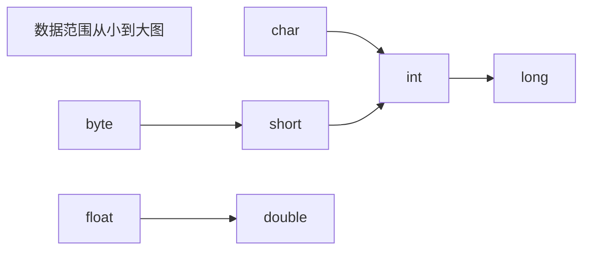

# SE

## 基础

### 数据

#### 变量类型

|          |    成员变量    |          局部变量          |       静态变量       |
| :------: | :------------: | :------------------------: | :------------------: |
| 定义位置 | 在类中，方法外 |    方法中或者方法的形参    |    在类中，方法外    |
| 初始化值 | 有默认初始化值 | 无，先定义，复制后才能使用 |    有默认初始化值    |
| 调用方法 |    对象调用    |                            |  对象调用，类名调用  |
| 存储位置 |      堆中      |            栈中            |        方法区        |
| 生命周期 |  与对象共存亡  |        与方法共存亡        |      与类共存亡      |
|   别名   |    实例变量    |                            | 类变量，静态成员变量 |

**静态变量只有一个，成员变量是类中的变量，局部变量是方法中的变量**


参考视频：https://www.bilibili.com/video/BV1TE41177mP


***


#### 数据类型

##### 基本类型

Java 语言提供了八种基本类型。六种数字类型（四个整数型，两个浮点型），一种字符类型，还有一种布尔型

**byte：**

- byte 数据类型是 8 位、有符号的，以**二进制补码**表示的整数，**8 位一个字节**，首位是符号位
- 最小值是 **-128（-2^7）**
- 最大值是 **127（2^7-1）**
- 默认值是 **`0`**
- byte 类型用在大型数组中节约空间，主要代替整数，byte 变量占用的空间只有 int 类型的四分之一
- 例子：`byte a = 100，byte b = -50`

**short：**

- short 数据类型是 16 位、有符号的以二进制补码表示的整数
- 最小值是 **-32768（-2^15）**
- 最大值是 **32767（2^15 - 1）**
- short 数据类型也可以像 byte 那样节省空间，一个short变量是int型变量所占空间的二分之一
- 默认值是 **`0`**
- 例子：`short s = 1000，short r = -20000`

**int：**

- int 数据类型是 32 位 4 字节、有符号的以二进制补码表示的整数
- 最小值是 **-2,147,483,648（-2^31）**
- 最大值是 **2,147,483,647（2^31 - 1）**
- 一般地整型变量默认为 int 类型
- 默认值是 **`0`** ；
- 例子：`int a = 100000, int b = -200000`

**long：**

- long 数据类型是 64 位 8 字节、有符号的以二进制补码表示的整数
- 最小值是 **-9,223,372,036,854,775,808（-2^63）**
- 最大值是 **9,223,372,036,854,775,807（2^63 -1）**
- 这种类型主要使用在需要比较大整数的系统上
- 默认值是 **` 0L`**
- 例子： `long a = 100000L，Long b = -200000L`
  "L"理论上不分大小写，但是若写成"l"容易与数字"1"混淆，不容易分辩，所以最好大写

**float：**

- float 数据类型是单精度、32 位、符合 IEEE 754 标准的浮点数
- float 在储存大型浮点数组的时候可节省内存空间
- 默认值是 **`0.0f`**
- 浮点数不能用来表示精确的值，如货币
- 例子：`float f1 = 234.5F`

**double：**

- double 数据类型是双精度、64 位、符合 IEEE 754 标准的浮点数
- 浮点数的默认类型为 double 类型
- double 类型同样不能表示精确的值，如货币
- 默认值是 **`0.0d`**
- 例子：`double d1 = 123.4`

**boolean：**

- boolean 数据类型表示一位的信息
- 只有两个取值：true 和 false
- JVM 规范指出 boolean 当做 int 处理，boolean 数组当做 byte 数组处理，这样可以得出 boolean 类型单独使用占了 4 个字节，在数组中是 1 个字节
- 默认值是 **`false`**
- 例子：`boolean one = true`

**char：**

- char 类型是一个单一的 16 位两个字节的 Unicode 字符
- 最小值是 **`\u0000`**（即为 0）
- 最大值是 **`\uffff`**（即为 65535）
- char 数据类型可以储存任何字符
- 例子：`char c = 'A';`   `char c = '张';`



上下转型

* float 与 double：

  Java 不能隐式执行**向下转型**，因为这会使得精度降低（参考多态），但是可以向上转型

  ```java
  //1.1字面量属于double类型，不能直接将1.1直接赋值给 float 变量，因为这是向下转型
  float f = 1.1;//报错
  //1.1f 字面量才是 float 类型
  float f = 1.1f;
  ```

  ```java
  float f1 = 1.234f;
  double d1 = f1;
  
  double d2 = 1.23;
  float f2 = (float) d2;//向下转型需要强转
  ```

  ```java
  int i1 = 1245;
  long l1 = i1;
  
  long l2 = 1234;
  int i2 = (int) l2;
  ```

* 隐式类型转换：

  字面量 1 是 int 类型，它比 short 类型精度要高，因此不能隐式地将 int 类型向下转型为 short 类型

  使用 += 或者 ++ 运算符会执行隐式类型转换：

  ```java
  s1 += 1;	//s1++;
  //上面的语句相当于将 s1 + 1 的计算结果进行了向下转型
  s1 = (short) (s1 + 1);
  ```

  
  
  

***


##### 引用类型

引用数据类型：类，接口，数组都是引用数据类型，又叫包装类

包装类的作用：

* 包装类作为类首先拥有了 Object 类的方法
* 包装类作为引用类型的变量可以**存储 null 值**


```java
基本数据类型                包装类（引用数据类型）
byte                      Byte
short                     Short
int                       Integer(特殊)
long                      Long

float                     Float
double                    Double
char                      Character(特殊)
boolean                   Boolean
```
Java 为包装类做了一些特殊功能，具体来看特殊功能主要有：

* 可以把基本数据类型的值转换成字符串类型的值
  1. 调用 toString() 方法
  2. 调用 Integer.toString(基本数据类型的值) 得到字符串
  3. 直接把基本数据类型 + 空字符串就得到了字符串（推荐使用）

* 把字符串类型的数值转换成对应的基本数据类型的值（**重要**）

  1. Xxx.parseXxx("字符串类型的数值") → Integer.parseInt(numStr)
  2. Xxx.valueOf("字符串类型的数值")   → Integer.valueOf(numStr) （推荐使用）

  ```java
  public class PackageClass02 {
      public static void main(String[] args) {
          // 1.把基本数据类型的值转成字符串
          Integer it = 100 ;
          // a.调用toString()方法。
          String itStr = it.toString();
          System.out.println(itStr+1);//1001
          // b.调用Integer.toString(基本数据类型的值)得到字符串。
          String itStr1 = Integer.toString(it);
          System.out.println(itStr1+1);//1001
          // c.直接把基本数据类型+空字符串就得到了字符串。
          String itStr2 = it+"";
          System.out.println(itStr2+1);// 1001
  
          // 2.把字符串类型的数值转换成对应的基本数据类型的值。（真的很有用）
          String numStr = "23";
          //int numInt = Integer.parseInt(numStr);
          int numInt = Integer.valueOf(numStr);
          System.out.println(numInt+1);//24
  
          String doubleStr = "99.9";
          //double doubleDb = Double.parseDouble(doubleStr);
          double doubleDb = Double.valueOf(doubleStr);
          System.out.println(doubleDb+0.1);//100.0
      }
  }
  ```

  

***


#### 装箱拆箱

**自动装箱**：可以直接把基本数据类型的值或者变量赋值给包装类

**自动拆箱**：可以把包装类的变量直接赋值给基本数据类型

```java
public class PackegeClass {
    public static void main(String[] args) {
        int a = 12 ;
        Integer a1 = 12 ;  // 自动装箱
        Integer a2 = a ;   // 自动装箱
        Integer a3 = null; // 引用数据类型的默认值可以为null

        Integer c = 100 ;
        int c1 = c ;      // 自动拆箱

        Integer it = Integer.valueOf(12);  // 手工装箱！
        // Integer it1 = new Integer(12); // 手工装箱！
        Integer it2 = 12;

        Integer it3 = 111 ;
        int it33 = it3.intValue(); // 手工拆箱
    }
}
```

**自动装箱**反编译后底层调用 `Integer.valueOf()` 实现，源码：

```java
public static Integer valueOf(int i) {
    if (i >= IntegerCache.low && i <= IntegerCache.high)
        return IntegerCache.cache[i + (-IntegerCache.low)];
    return new Integer(i);
}
```


***


#### 缓存池

new Integer(123) 与 Integer.valueOf(123) 的区别在于：

- new Integer(123)：每次都会新建一个对象

- Integer.valueOf(123)：会使用缓存池中的对象，多次调用取得同一个对象的引用

  ```java
  Integer x = new Integer(123);
  Integer y = new Integer(123);
  System.out.println(x == y);    // false
  Integer z = Integer.valueOf(123);
  Integer k = Integer.valueOf(123);
  System.out.println(z == k);   // true
  ```

valueOf() 方法的实现比较简单，就是先判断值是否在缓存池中，如果在的话就直接返回缓存池的内容。编译器会在自动装箱过程调用 valueOf() 方法，因此多个值相同且值在缓存池范围内的 Integer 实例使用自动装箱来创建，那么就会引用相同的对象。

**基本类型对应的缓存池如下：**

- Boolean values true and false
- all byte values
- Short values between -128 and 127
- Long values between -128 and 127
- Integer values between -128 and 127
- Character in the range \u0000 to \u007F (0 and 127)

在 jdk 1.8 所有的数值类缓冲池中，Integer 的缓存池 IntegerCache 很特殊，这个缓冲池的下界是 -128，上界默认是 127，但是上界是可调的，在启动 jvm 的时候，通过 AutoBoxCacheMax=<size> 来指定这个缓冲池的大小，该选项在 JVM 初始化的时候会设定一个名为 java.lang.IntegerCache.high 系统属性，然后 IntegerCache 初始化的时候就会读取该系统属性来决定上界

```java
Integer x = 100;	//自动装箱，底层调用 Integer.valueOf(1)
Integer y = 100;
System.out.println(x == y);   // true

Integer x = 1000;
Integer y = 1000;
System.out.println(x == y);   // false
//因为缓存池最大127
```


***


#### 输入数据

语法：`Scanner sc = new Scanner(System.in)`

* next()：遇到了空格，就不再录入数据了，结束标记：空格、tab键
* nextLine()：可以将数据完整的接收过来，结束标记：回车换行符

一般使用 `sc.nextInt()` 或者 `sc.nextLine()` 接受整型和字符串，然后转成需要的数据类型

Scanner：`BufferedReader br = new BufferedReader(new InputStreamReader(System.in))`
print：`PrintStream.write()`

> 使用引用数据类型的API

```java
public static void main(String[] args) {
    Scanner sc = new Scanner(System.in);
    while (sc.hasNextLine()) {
        String msg = sc.nextLine();
    }
}
```


***


#### 面试题

* 有了基本数据类型，为什么还要引用数据类型？

  > 1、引用数据类型封装了数据和处理该数据的方法，比如Integer.parseInt(String)就是将String字符类型数据转换为Integer整型数据
  >
  > 2、Java中大部分类和方法都是针对引用数据类型，包括泛型和集合
  
* 引用数据类型那么好，为什么还用基本数据类型？

  > 引用类型的对象要多储存对象头，对基本数据类型来说空间浪费率太高
  > 逻辑上来讲，java只有包装类就够了，为了运行速度，需要用到基本数据类型；优先考虑运行效率的问题，所以二者同时存在是合乎情理的。

* Java集合不能存放基本数据类型，只存放对象的引用？

  > 不能放基本数据类型是因为不是Object的子类。泛型思想，如果不用泛型要写很多参数类型不同的但功能相同的函数（方法重载）

* ==

  > == 比较基本数据类型：比较的是具体的值
  > == 比较引用数据类型：比较的是对象地址值


****


### 数组

#### 初始化

数组就是存储数据长度固定的容器，存储多个数据的**数据类型要一致**，数组也是一个对象

创建数组：

* 数据类型[] 数组名：`int[] arr;`  （常用）
* 数据类型 数组名[]：`int arr[];`

静态初始化：

* 数据类型[] 数组名 = new 数据类型[]{元素1,元素2,...}：`int[] arr = new int[]{11,22,33};`
* 数据类型[] 数组名 = {元素1,元素2,...}：`int[] arr = {44,55,66};`

动态初始化

* 数据类型[] 数组名 = new 数据类型[数组长度]：`int[] arr = new int[3];`


#### 元素访问

* **索引**：每一个存储到数组的元素，都会自动的拥有一个编号，从**0**开始。这个自动编号称为数组索引(index)，可以通过数组的索引访问到数组中的元素。 	

* **访问格式：**数组名[索引]：`arr[0]`
* **赋值：**`arr[0] = 10;`


***


#### 内存分配

内存是计算机中的重要原件，临时存储区域，作用是运行程序。我们编写的程序是存放在硬盘中的，在硬盘中的程序是不会运行的。必须放进内存中才能运行，运行完毕后会清空内存。 Java虚拟机要运行程序，必须要对内存进行空间的分配和管理。 

| 区域名称   | 作用                                                     |
| ---------- | -------------------------------------------------------- |
| 寄存器     | 给CPU使用，和我们开发无关                                |
| 本地方法栈 | JVM在使用操作系统功能的时候使用，和我们开发无关          |
| 方法区     | 存储可以运行的class文件                                  |
| 堆内存     | 存储对象或者数组，new来创建的，都存储在堆内存            |
| 方法栈     | 方法运行时使用的内存，比如main方法运行，进入方法栈中执行 |

**内存分配图**：

* Java内存分配-一个数组内存图

  

* 两个数组内存图

  

* 多个数组指向相同内存图

  

***


#### 数组异常

* 索引越界异常：ArrayIndexOutOfBoundsException 

* 空指针异常：NullPointerException 

  ```java
  public class ArrayDemo {
      public static void main(String[] args) {
          int[] arr = new int[3];
          //把null赋值给数组
          arr = null;
          System.out.println(arr[0]);
      }
  }
  ```

  arr = null，表示变量arr将不再保存数组的内存地址，也就不允许再操作数组，因此运行的时候会抛出空指针异常。在开发中，空指针异常是不能出现的，一旦出现了，就必须要修改我们编写的代码。

  解决方案：给数组一个真正的堆内存空间引用即可！
  
  

***


#### 二维数组

二维数组也是一种容器，不同于一维数组，该容器存储的都是一维数组容器

初始化：

* 动态初始化：
  
  数据类型[][] 变量名 = new 数据类型[m] [n] : `int[][] arr = new int[3][3];`
  
  * m 表示这个二维数组，可以存放多少个一维数组，行
  * n 表示每一个一维数组，可以存放多少个元素，列
* 静态初始化
  * 数据类型[][] 变量名 = new 数据类型[][]{ {元素1, 元素2...} , {元素1, 元素2...} 
  * 数据类型[][] 变量名 = { {元素1, 元素2...} , {元素1, 元素2...} ...}
  * `int[][] arr = {{11,22,33}, {44,55,66}};`

遍历：

```java
public class Test1 {
    /*
        步骤:
            1. 遍历二维数组，取出里面每一个一维数组
            2. 在遍历的过程中，对每一个一维数组继续完成遍历，获取内部存储的每一个元素
     */
    public static void main(String[] args) {
        int[][] arr = {{11, 22, 33}, {33, 44, 55}};
        // 1. 遍历二维数组，取出里面每一个一维数组
        for (int i = 0; i < arr.length; i++) {
            //System.out.println(arr[i]);
            // 2. 在遍历的过程中，对每一个一维数组继续完成遍历，获取内部存储的每一个元素
            //int[] temp = arr[i];
            for (int j = 0; j < arr[i].length; j++) {
                System.out.println(arr[i][j]);
            }
        }
    }
}
```


****


### 运算

* i++ 与++i 的区别？
  i++ 表示先将 i 放在表达式中运算，然后再加 1
  ++i 表示先将 i 加 1，然后再放在表达式中运算

* || 和 |，&& 和& 的区别，逻辑运算符

  **&和| 称为布尔运算符，位运算符。&&和|| 称为条件布尔运算符,也叫短路运算符**。

  两种运算符得到的结果完全相同，但得到结果的方式又一个重要区别：条件布尔运算符性能比较好。他检查第一个操作数的值，再根据该操作数的值进行操作，可能根本就不处理第二个操作数。

  结论：如果 && 运算符的第一个操作数是 false，就不需要考虑第二个操作数的值了，因为无论第二个操作数的值是什么，其结果都是 false；同样，如果第一个操作数是 true，|| 运算符就返回 true，无需考虑第二个操作数的值。但 & 和 | 却不是这样，它们总是要计算两个操作数。为了提高性能，**尽可能使用 && 和 || 运算符**

* switch

  从 Java 7 开始，可以在 switch 条件判断语句中使用 String 对象

  ```java
  String s = "a";
  switch (s) {
      case "a":
          System.out.println("aaa");
          break;
      case "b":
          System.out.println("bbb");
          break;
      default:
          break;
  }
  ```
  
  switch 不支持 long、float、double，switch 的设计初衷是对那些只有少数几个值的类型进行等值判断，如果值过于复杂，那么用 if 比较合适
  
* break：跳出一层循环

* 移位运算
  
  计算机里一般用**补码表示数字**，正数、负数的表示区别就是最高位是 0 还是 1
  
  * 正数的原码反码补码相同
  
    ```java
    100:	00000000  00000000  00000000  01100100
    ```
  
  * 负数：
    原码：最高位为1，其余位置和正数相同
    反码：保证符号位不变，其余位置取反
    补码：保证符号位不变，其余位置取反加1，即反码+1
  
    ```java
    -100原码:	10000000  00000000  00000000  01100100	//32位
    -100反码:	11111111  11111111  11111111  10011011
    -100补码:	11111111  11111111  11111111  10011100
    ```
  
    补码 → 原码：符号位不变，其余位置取反加1
  
  运算符：
  
  * `>>`运算符：将二进制位进行右移操作，相当于除 2
  * `<<`运算符：将二进制位进行左移操作，相当于乘 2
  * `>>>`运算符：无符号右移，忽略符号位，空位都以0补齐
  
  运算规则：
  
  * 正数的左移与右移，空位补0
  * 负数原码的左移与右移，空位补0
    负数反码的左移与右移，空位补1
    负数补码，左移低位补0，右移高位补1
  * 无符号移位，空位补0


****


### 参数

#### 形参实参

形参：

* 形式参数，用于定义方法的时候使用的参数，只能是变量
* 形参只有在方法被调用的时候，虚拟机才分配内存单元，方法调用结束之后便会释放所分配的内存单元

实参：调用方法时传递的数据可以是常量，也可以是变量


#### 可变参数

可变参数用在形参中可以接收多个数据。

可变参数的格式：数据类型... 参数名称

可变参数的作用：传输参数非常灵活，方便。可以不传输参数、传输一个参数、或者传输一个数组。

可变参数在方法内部本质上就是一个数组。

可变参数的注意事项：
	1.一个形参列表中可变参数只能有一个！
	2.可变参数必须放在形参列表的**最后面**！

```java
public static void main(String[] args) {
	sum(); // 可以不传输参数。
	sum(10); // 可以传输一个参数。
	sum(10,20,30); // 可以传输多个参数。
	sum(new int[]{10,30,50,70,90}); // 可以传输一个数组。
}

public static void sum(int... nums){
	int sum = 0;
	for(int i : a) {
		sum += i;
	}
	return sum;
}
```


***


### 方法

#### 方法概述

方法（method）是将具有独立功能的代码块组织成为一个整体，使其具有特殊功能的代码集

注意：方法必须先创建才可以使用，该过程成为方法定义
			方法创建后并不是直接可以运行的，需要手动使用后，才执行，该过程成为方法调用

在方法内部定义的叫局部变量，局部变量不能加static，包括protected, private, public这些也不能加

原因：局部变量是保存在栈中的，而静态变量保存于方法区，局部变量出了方法就被栈回收了，而静态变量不会，所以在局部变量前不能加static关键字，静态变量是定义在类中，又叫类变量


***


#### 定义调用

定义格式

```java
public static 返回值类型 方法名(参数) {
	//方法体;
	return 数据 ;
}
```

调用格式

```java
数据类型 变量名 = 方法名 ( 参数 ) ;
//注意：方法的返回值通常会使用变量接收，否则该返回值将无意义
```

* 方法名：调用方法时候使用的标识
* 参数：由数据类型和变量名组成，多个参数之间用逗号隔开
* 方法体：完成功能的代码块
* return：如果方法操作完毕，有数据返回，用于把数据返回给调用者

如果方法操作完毕

* void类型的方法，直接调用即可，而且方法体中一般不写return
* 非void类型的方法，推荐用变量接收调用

原理：每个方法在被调用执行的时候，都会进入栈内存，并且拥有自己独立的内存空间，方法内部代码调用完毕之后，会从栈内存中弹栈消失。


***


#### 注意事项

* 方法不能嵌套定义

  ```java
  public class MethodDemo {
  	public static void main(String[] args) {
  	}
  	public static void methodOne() {
  		public static void methodTwo() {
  			// 这里会引发编译错误!!!
  		}
  	}
  }
  ```

* void表示无返回值，可以省略return，也可以单独的书写return，后面不加数据

  ```java
  public static void methodTwo() {
  	//return 100; 编译错误，因为没有具体返回值类型
  	return;
  	//System.out.println(100); return语句后面不能跟数据或代码
  }
  ```

  

***


#### 方法重载

##### 重载介绍

方法重载指同一个类中定义的多个方法之间的关系，满足下列条件的多个方法相互构成重载：

1. 多个方法在**同一个类**中
2. 多个方法具有**相同的方法名**
3. 多个方法的**参数不相同**，类型不同或者数量不同

重载仅对应方法的定义，与方法的调用无关，调用方式参照标准格式

重载仅针对**同一个类**中方法的名称与参数进行识别，**与返回值无关**，不能通过返回值来判定两个方法是否构成重载

原理：JVM → 运行机制 → 字节码 → 方法表

```java
public class MethodDemo {
	public static void fn(int a) {
		//方法体
	}
    
	public static int fn(int a) { /*错误原因：重载与返回值无关*/
		//方法体
	}
    
    public static void fn(int a, int b) {/*正确格式*/
		//方法体
	}
}
```


***


##### 方法选取

重载的方法在编译过程中即可完成识别，方法调用时 Java 编译器会根据所传入参数的声明类型（注意与实际类型区分）来选取重载方法。选取的过程共分为三个阶段：

* 在不考虑对基本类型自动装拆箱 (auto-boxing，auto-unboxing)，以及可变长参数的情况下选取重载方法
* 如果第 1 个阶段中没有找到适配的方法，那么在允许自动装拆箱，但不允许可变长参数的情况下选取重载方法
* 如果第 2 个阶段中没有找到适配的方法，那么在允许自动装拆箱以及可变长参数的情况下选取重载方法

如果 Java 编译器在同一个阶段中找到了多个适配的方法，那么会选择一个最为贴切的，而决定贴切程度的一个关键就是形式参数类型的继承关系，**一般会选择形参为参数类型的子类的方法，因为子类时更具体的实现**：

```java
public class MethodDemo {
    void invoke(Object obj, Object... args) { ... }
    void invoke(String s, Object obj, Object... args) { ... }

    invoke(null, 1); // 调用第二个invoke方法，选取的第二阶段
    invoke(null, 1, 2); // 调用第二个invoke方法，匹配第一个和第二个，但String是Object的子类
    
    invoke(null, new Object[]{1}); // 只有手动绕开可变长参数的语法糖，才能调用第一个invoke方法
    							   // 可变参数底层是数组，JVM->运行机制->代码优化
}
```

因此不提倡可变长参数方法的重载


***


##### 继承重载

除了同一个类中的方法，重载也可以作用于这个类所继承而来的方法。如果子类定义了与父类中**非私有方法**同名的方法，而且这两个方法的参数类型不同，那么在子类中，这两个方法同样构成了重载

* 如果这两个方法都是静态的，那么子类中的方法隐藏了父类中的方法
* 如果这两个方法都不是静态的，且都不是私有的，那么子类的方法重写了父类中的方法，也就是**多态**


***


#### 参数传递

**Java 的参数是以值传递的形式传入方法中**

值传递和引用传递的区别在于传递后会不会影响实参的值：值传递会创建副本，引用传递不会创建副本

* 基本数据类型：形式参数的改变，不影响实际参数
  每个方法在栈内存中，都会有独立的栈空间，方法运行结束后就会弹栈消失
  
  ```java
  public class ArgsDemo01 {
  	public static void main(String[] args) {
  		int number = 100;
  		System.out.println("调用change方法前：" + number);//100
  		change(number);
  		System.out.println("调用change方法后：" + number);//100
  	}
  	public static void change(int number) {
  		number = 200;
  	}
  }
  ```
  
* 引用类型：形式参数的改变，影响实际参数的值
  **引用数据类型的传参，本质上是将对象的地址以值的方式传递到形参中**，内存中会造成两个引用指向同一个内存的效果，所以即使方法弹栈，堆内存中的数据也已经是改变后的结果

  ```java
  public class PassByValueExample {
      public static void main(String[] args) {
          Dog dog = new Dog("A");
          func(dog);
          System.out.println(dog.getName());	// B
      }
      private static void func(Dog dog) {
          dog.setName("B");
      }
  }
  class Dog {
      String name;//.....
  }
  ```

  


***


### 枚举

枚举是Java中的一种特殊类型，为了做信息的标志和信息的分类

定义枚举的格式：

```java
修饰符 enum 枚举名称{
	第一行都是罗列枚举实例的名称。
}
```

枚举的特点：

* 枚举类是用 final 修饰的，枚举类不能被继承
* 枚举类默认继承了 java.lang.Enum 枚举类
* 枚举类的第一行都是常量，必须是罗列枚举类的实例名称
* 枚举类相当于是多例设计模式
* 每个枚举项都是一个实例，是一个静态成员变量

| 方法名                                            | 说明                                 |
| ------------------------------------------------- | ------------------------------------ |
| String name()                                     | 获取枚举项的名称                     |
| int ordinal()                                     | 返回枚举项在枚举类中的索引值         |
| int compareTo(E  o)                               | 比较两个枚举项，返回的是索引值的差值 |
| String toString()                                 | 返回枚举常量的名称                   |
| static <T> T  valueOf(Class<T> type,String  name) | 获取指定枚举类中的指定名称的枚举值   |
| values()                                          | 获得所有的枚举项                     |

* 源码分析：

  ```java
  enum Season {
      SPRING , SUMMER , AUTUMN , WINTER;
  }
  //枚举类的编译以后源代码：
  public final class Season extends java.lang.Enum<Season> {
  	public static final Season SPRING = new Season();
  	public static final Season SUMMER = new Season();
  	public static final Season AUTUMN = new Season();
  	public static final Season WINTER = new Season();
  
  	public static Season[] values();
  	public static Season valueOf(java.lang.String);
  }
  ```

* API使用

  ```java
  public class EnumDemo {
      public static void main(String[] args){
          //获取索引
          Season s = Season.SPRING;  // s = SPRING
          System.out.println(s.ordinal());
          //获取全部枚举
          Season[] ss = Season.values();
          for(int i = 0; i < ss.length; i++){
              System.out.println(ss[i]);
          }
          
          int result = Season.SPRING.compareTo(Season.WINTER);
          System.out.println(result);//-3
      }
  }
  enum Season {
      SPRING , SUMMER , AUTUMN , WINTER;
  }
  ```


***


### Debug

Debug是供程序员使用的程序调试工具，它可以用于查看程序的执行流程，也可以用于追踪程序执行过程来调试程序。

加断点->Debug运行->单步运行->看Debugger窗口->看Console窗口


***


## 对象

### 概述

**Java是一种面向对象的高级编程语言。**

**三大特征：封装，继承，多态**

面向对象最重要的两个概念：类和对象。

* 类：相同事物共同特征的描述。类只是学术上的一个概念并非真实存在的，只能描述一类事物。
* 对象：是真实存在的实例， 实例==对象。**对象是类的实例化**！
* 结论：有了类和对象就可以描述万千世界所有的事物。 必须先有类才能有对象。


***


### 类

#### 定义

定义格式

```java
修饰符 class 类名{
}
```

1. 类名的首字母建议大写，满足驼峰模式，比如 StudentNameCode
2. 一个 Java 代码中可以定义多个类，按照规范一个 Java 文件一个类
3. 一个 Java 代码文件中，只能有一个类是 public 修饰，**public修饰的类名必须成为当前Java代码的文件名称**

```java
类中的成分:有且仅有五大成分
修饰符 class 类名{
		1.成员变量(Field):  	描述类或者对象的属性信息的。
        2.成员方法(Method):		描述类或者对象的行为信息的。
		3.构造器(Constructor):	 初始化一个对象返回。
		4.代码块
		5.内部类
	  }
类中有且仅有这五种成分，否则代码报错！
public class ClassDemo {
    System.out.println(1);//报错
}
```


***


#### 构造器

构造器格式：

```java
修饰符 类名(形参列表){

}
```

作用：初始化类的一个对象返回

分类：无参数构造器，有参数构造器

注意：**一个类默认自带一个无参数构造器**，写了有参数构造器默认的无参数构造器就消失，还需要用无参数构造器就要重新写

构造器初始化对象的格式：类名 对象名称 = new 构造器

* 无参数构造器的作用：初始化一个类的对象（使用对象的默认值初始化）返回
* 有参数构造器的作用：初始化一个类的对象（可以在初始化对象的时候为对象赋值）返回


------


### 包

包：分门别类的管理各种不同的技术，便于管理技术，扩展技术，阅读技术

定义包的格式：`package 包名`，必须放在类名的最上面

导包格式：`import 包名.类名`

相同包下的类可以直接访问；不同包下的类必须导包才可以使用


***


### 封装

封装的哲学思维：合理隐藏，合理暴露
封装最初的目的：提高代码的安全性和复用性，组件化

封装的步骤：

1. **成员变量应该私有，用private修饰，只能在本类中直接访问**
2. **提供成套的getter和setter方法暴露成员变量的取值和赋值**

使用 private 修饰成员变量的原因：实现数据封装，不想让别人使用修改你的数据，比较安全


***


### this

this 关键字的作用：

* this 关键字代表了当前对象的引用
* this 出现在方法中：**哪个对象调用这个方法this就代表谁**
* this 可以出现在构造器中：代表构造器正在初始化的那个对象
* this 可以区分变量是访问的成员变量还是局部变量


------


### static

#### 基本介绍

Java是通过成员变量是否有static修饰来区分是类的还是属于对象的。

static 静态修饰的成员（方法和成员变量）属于类本身的。

按照有无static修饰，成员变量和方法可以分为：

* 成员变量：
  * 静态成员变量（类变量）：
    有static修饰的成员变量称为静态成员变量也叫类变量，属于类本身，**与类一起加载一次，只有一个**，直接用类名访问即可。
  * 实例成员变量：
    无static修饰的成员变量称为实例成员变量，属于类的每个对象的。**与类的对象一起加载**，对象有多少个，实例成员变量就加载多少个，必须用类的对象来访问。

* 成员方法：
  * 静态方法：
    有static修饰的成员方法称为静态方法也叫类方法，属于类本身的，直接用类名访问即可。  
  * 实例方法：
    无static修饰的成员方法称为实例方法，属于类的每个对象的，必须用类的对象来访问。 


****


#### static用法

成员变量的访问语法：

* 静态成员变量：只有一份可以被类和类的对象**共享访问**
  * 类名.静态成员变量（同一个类中访问静态成员变量可以省略类名不写）
  * 对象.静态成员变量（不推荐）

* 实例成员变量：
  * 对象.实例成员变量（先创建对象）

成员方法的访问语法：

* 静态方法：有static修饰，属于类

  * 类名.静态方法（同一个类中访问静态成员可以省略类名不写）
  * 对象.静态方法（不推荐，参考 JVM类加载--> 字节码 --> 方法调用）
  
* 实例方法：无static修饰，属于对象

  * 对象.实例方法
  
  ```java
  public class Student {
      // 1.静态方法：有static修饰，属于类，直接用类名访问即可！
      public static void inAddr(){ }
      // 2.实例方法：无static修饰，属于对象，必须用对象访问！
      public void eat(){}
      
      public static void main(String[] args) {
          // a.类名.静态方法
          Student.inAddr();
          inAddr();
          // b.对象.实例方法
          // Student.eat(); // 报错了！
          Student zbj = new Student();
          zbj.eat();
      }
  }
  ```


***


#### 两个问题

内存问题：

* **栈内存存放main方法和地址**

* **堆内存存放对象和变量**

* **方法区存放class和静态变量（jdk8以后移入堆）**

访问问题：

* 实例方法是否可以直接访问实例成员变量？可以的，因为它们都属于对象
* 实例方法是否可以直接访问静态成员变量？可以的，静态成员变量可以被共享访问
* 实例方法是否可以直接访问实例方法? 可以的，实例方法和实例方法都属于对象
* 实例方法是否可以直接访问静态方法？可以的，静态方法可以被共享访问
* 静态方法是否可以直接访问实例变量？ 不可以的，实例变量必须用对象访问！！
* 静态方法是否可以直接访问静态变量？ 可以的，静态成员变量可以被共享访问。
* 静态方法是否可以直接访问实例方法? 不可以的，实例方法必须用对象访问！！
* 静态方法是否可以直接访问静态方法？可以的，静态方法可以被共享访问！！


------


### 继承

#### 基本介绍

继承是 Java 中一般到特殊的关系，是一种子类到父类的关系

* 被继承的类称为：父类/超类。
* 继承父类的类称为：子类。

继承的作用：

* **提高代码的复用**，相同代码可以定义在父类中
* 子类继承父类，可以直接使用父类这些代码（相同代码重复利用）
* 子类得到父类的属性（成员变量）和行为（方法），还可以定义自己的功能，子类更强大

继承的特点：

1. 子类的全部构造器默认先访问父类的无参数构造器，再执行自己的构造器
2. **单继承**：一个类只能继承一个直接父类
3. 多层继承：一个类可以间接继承多个父类（家谱）
4. 一个类可以有多个子类
5. 一个类要么默认继承了 Object 类，要么间接继承了 Object 类，Object 类是 Java 中的祖宗类

继承的格式：

```java
子类 extends 父类{

}
```

子类继承父类的东西：

* 子类不能继承父类的构造器，子类有自己的构造器
* 子类是不能可以继承父类的私有成员的，可以反射暴力去访问继承自父类的私有成员
* 子类是不能继承父类的静态成员的，子类只是可以访问父类的静态成员，父类静态成员只有一份可以被子类共享访问，**共享并非继承**

```java
public class ExtendsDemo {
    public static void main(String[] args) {
        Cat c = new Cat();
        // c.run();
        Cat.test();
        System.out.println(Cat.schoolName);
    }
}
class Cat extends Animal{
}
class Animal{
    public static String schoolName ="seazean";
    public static void test(){}
    private void run(){}
}
```


***


#### 变量访问

继承后成员变量的访问特点：**就近原则**，子类有找子类，子类没有找父类，父类没有就报错

如果要申明访问父类的成员变量可以使用：super.父类成员变量，super指父类引用

```java
public class ExtendsDemo {
    public static void wmain(String[] args) {
        Wolf w = new Wolf();w
        w.showName();
    }
}
class Wolf extends Animal{
    private String name = "子类狼";
    public void showName(){
        String name = "局部名称";
        System.out.println(name); // 局部name
        System.out.println(this.name); // 子类对象的name
        System.out.println(super.name); // 父类的
        System.out.println(name1); // 父类的
        //System.out.println(name2); // 报错。子类父类都没有
    }
}

class Animal{
    public String name = "父类动物名称";
    public String name1 = "父类";
}
```


***


#### 方法访问

子类继承了父类就得到了父类的方法，**可以直接调用**，受权限修饰符的限制，也可以重写方法

**方法重写**：子类重写一个与父类申明一样的方法来**覆盖**父类的该方法

方法重写的校验注解：@Override

* 方法加了这个注解，那就必须是成功重写父类的方法，否则报错 
* @Override 优势：可读性好，安全，优雅

子类可以扩展父类的功能，但不能改变父类原有的功能，重写有以下**三个限制**：

- 子类方法的访问权限必须大于等于父类方法
- 子类方法的返回类型必须是父类方法返回类型或为其子类型
- 子类方法抛出的异常类型必须是父类抛出异常类型或为其子类型

继承中的隐藏问题：

- 子类和父类方法都是静态的，那么子类中的方法会隐藏父类中的方法
- 在子类中可以定义和父类成员变量同名的成员变量，此时子类的成员变量隐藏了父类的成员变量，在创建对象为对象分配内存的过程中，**隐藏变量依然会被分配内存**

```java
public class ExtendsDemo {
    public static void main(String[] args) {
        Wolf w = new Wolf();
        w.run();
    }
}
class Wolf extends Animal{
    @Override
    public void run(){}//
}
class Animal{
    public void run(){}
}
```


***


#### 面试问题

* 为什么子类构造器会先调用父类构造器？
  
  1. 子类的构造器的第一行默认 super() 调用父类的无参数构造器，写不写都存在
  2. 子类继承父类，子类就得到了父类的属性和行为。调用子类构造器初始化子类对象数据时，必须先调用父类构造器初始化继承自父类的属性和行为
  3. 参考JVM -> 类加载 -> 对象创建
  
  ```java
  class Animal{
      public Animal(){
          System.out.println("==父类Animal的无参数构造器==");
      }
  }
  class Tiger extends Animal{
      public Tiger(){
          super(); // 默认存在的，根据参数去匹配调用父类的构造器。
          System.out.println("==子类Tiger的无参数构造器==");
      }
      public Tiger(String name){
          //super();  默认存在的，根据参数去匹配调用父类的构造器。
          System.out.println("==子类Tiger的有参数构造器==");
      }
  }
  ```
  
* **为什么 Java 是单继承的？**
  答：反证法，假如 Java 可以多继承，请看如下代码：
  
  ```java
  class A{
  	public void test(){
  		System.out.println("A");
  	}
  }
  class B{
  	public void test(){
  		System.out.println("B");
  	}
  }
  class C extends A , B {
  	public static void main(String[] args){
  		C c = new C();
          c.test(); 
          // 出现了类的二义性！所以Java不能多继承！！
  	}
  }
  ```
  
  


------


### super

继承后 super 调用父类构造器，父类构造器初始化继承自父类的数据。


总结与拓展：

* this 代表了当前对象的引用（继承中指代子类对象）：this.子类成员变量、this.子类成员方法、**this(...)**可以根据参数匹配访问本类其他构造器。
* super 代表了父类对象的引用（继承中指代了父类对象空间）：super.父类成员变量、super.父类的成员方法、super(...)可以根据参数匹配访问父类的构造器

**注意：**

* this(...) 借用本类其他构造器，super(...) 调用父类的构造器。
* this(...) 或 super(...) 必须放在构造器的第一行，否则报错!
* this(...) 和 super(...) 不能同时出现在构造器中，因为构造函数必须出现在第一行上，只能选择一个。

```java
public class ThisDemo {
    public static void main(String[] args) {
        // 需求：希望如果不写学校默认就是”张三“！
        Student s1 = new Student("天蓬元帅", 1000 );
        Student s2 = new Student("齐天大圣", 2000, "清华大学" );
    }
}
class Study extends Student {
   public Study(String name, int age, String schoolName) {
        super(name , age , schoolName) ; 
       // 根据参数匹配调用父类构造器
   }
}

class Student{
    private String name ;
    private int age ;
    private String schoolName ;

    public Student() {
    }
    public Student(String name , int age){
        // 借用兄弟构造器的功能！
        this(name , age , "张三");
    }
	public Student(String name, int age, String schoolName) {
        this.name = name;
        this.age = age;
        this.schoolName = schoolName;
    }
// .......get + set
}
```


***


### final

#### 基本介绍

final 用于修饰：类，方法，变量

* final 修饰类，类不能被继承了，类中的方法和变量可以使用
* final 可以修饰方法，方法就不能被重写
* final 修饰变量总规则：变量有且仅能被赋值一次

**面试题**：final 和 abstract 的关系是互斥关系，不能同时修饰类或者同时修饰方法！


***


#### 修饰变量

##### 静态变量

final 修饰静态成员变量，变量变成了常量

**常量：有 public static final 修饰，名称字母全部大写，多个单词用下划线连接。**

final 修饰静态成员变量可以在哪些地方赋值：

1. 定义的时候赋值一次

2. 可以在静态代码块中赋值一次

```java
public class FinalDemo {
//常量：public static final修饰，名称字母全部大写，下划线连接。
    public static final String SCHOOL_NAME = "张三" ;
    public static final String SCHOOL_NAME1;

    static{
        //SCHOOL_NAME = "java";//报错
        SCHOOL_NAME1 = "张三1";
        //SCHOOL_NAME1 = "张三2"; // 报错，第二次赋值！
    }
}
```


##### 实例变量

final 修饰变量的总规则：有且仅能被赋值一次

final 修饰实例成员变量可以在哪些地方赋值 1 次：

1. 定义的时候赋值一次
2. 可以在实例代码块中赋值一次
3. 可以在每个构造器中赋值一次

```java
public class FinalDemo {
    private final String name = "张三" ;
    private final String name1;
    private final String name2;
    {
        // 可以在实例代码块中赋值一次。
        name1 = "张三1";
    }
	//构造器赋值一次
    public FinalDemo(){
        name2 = "张三2";
    }
    public FinalDemo(String a){
        name2 = "张三2";
    }

    public static void main(String[] args) {
        FinalDemo f1 = new FinalDemo();
        //f1.name = "张三1"; // 第二次赋值 报错！
    }
}
```


***


### 抽象类

#### 基本介绍

> 父类知道子类要完成某个功能，但是每个子类实现情况不一样。

抽象方法：没有方法体，只有方法签名，必须用**abstract**修饰的方法就是抽象方法
抽象类：拥有抽象方法的类必须定义成抽象类，必须用**abstract**修饰，抽象类是为了被继承

一个类继承抽象类，**必须重写抽象类的全部抽象方法**，否则这个类必须定义成抽象类，因为拥有抽象方法的类必须定义成抽象类

```java
public class AbstractDemo {
    public static void main(String[] args) {
        Dog d = new Dog();
        d.run();
    }
}

class Dog extends Animal{
    @Override
    public void run() { 
        System.out.println("🐕跑"); 
    }
}

abstract class Animal{
    public abstract void run();
}
```


***


#### 面试问题

一、抽象类是否有构造器，是否可以创建对象?
答：抽象类作为类一定有构造器，而且必须有构造器，提供给子类继承后调用父类构造器使用的

* 抽象类有构造器，但是抽象类不能创建对象，类的其他成分它都具备
* 抽象类中存在抽象方法，但不能执行，**抽象类中也可没有抽象方法**

> 抽象在学术上本身意味着不能实例化

```java
public class AbstractDemo {
    public static void main(String[] args) {
        //Animal a = new Animal(); 抽象类不能创建对象！
        //a.run(); // 抽象方法不能执行
    }
}
abstract class Animal{
    private String name;
    public static String schoolName = "张三";
    public Animal(){ }

    public abstract void run();
    //普通方法
    public void go(){ }
}
```

二、static 与 abstract 能同时使用吗？
答：不能，被 static 修饰的方法属于类，是类自己的东西，不是给子类来继承的，而抽象方法本身没有实现，就是用来给子类继承


***


#### 存在意义

**被继承**，抽象类就是为了被子类继承，否则抽象类将毫无意义（核心）

抽象类体现的是"模板思想"：**部分实现，部分抽象**，可以使用抽象类设计一个模板模式

```java
//作文模板
public class ExtendsDemo {
    public static void main(String[] args) {
        Student xiaoMa = new Student();
        xiaoMa.write();
    }
}
class Student extends Template{
    @Override
    public String writeText() {return "\t内容"}
}
// 1.写一个模板类：代表了作文模板。
abstract class Template{
    private String title = "\t\t\t\t\t标题";
    private String start = "\t开头";
    private String last = "\t结尾";
    public void write(){
        System.out.println(title+"\n"+start);
        System.out.println(writeText());
        System.out.println(last);
    }
    // 正文部分定义成抽象方法，交给子类重写！！
    public abstract String writeText();
}
```


***


### 接口

#### 基本介绍

接口，是 Java 语言中一种引用类型，是方法的集合。

接口是更加彻底的抽象，接口中只有抽象方法和常量，没有其他成分，jdk1.8 前

```java
 修饰符 interface 接口名称{
	// 抽象方法
	// 默认方法
	// 静态方法
	// 私有方法
}
```

* 抽象方法：接口中的抽象方法默认会加上public abstract修饰，所以可以省略不写

* 静态方法：静态方法必须有方法体

* 常量：常量是public static final修饰的成员变量，仅能被赋值一次，值不能改变。常量的名称规范上要求全部大写，多个单词下划线连接。public static final可以省略不写。

  ```java
  public interface InterfaceDemo{
      //public static final String SCHOOL_NAME = "张三";
  	String SCHOOL_NAME = "张三";
      
      //public abstract void run();
      void run();//默认补充
  }
  ```


***


#### 实现接口

作用：**接口是用来被类实现的。**

类与类是继承关系：一个类只能直接继承一个父类，单继承
类与接口是实现关系：一个类可以实现多个接口，多实现，接口不能继承类
接口与接口继承关系：**多继承**

>子类   继承   父类
>实现类 实现   接口

```java
修饰符 class 实现类名称 implements 接口1,接口2,接口3,....{

}
修饰符 interface 接口名 extend 接口1,接口2,接口3,....{
    
}
```

实现多个接口的使用注意事项：

1. 当一个类实现多个接口时，多个接口中存在同名的静态方法并不会冲突，只能通过各自接口名访问静态方法

2. 当一个类实现多个接口时，多个接口中存在同名的默认方法，实现类必须重写这个方法

3. 当一个类，既继承一个父类，又实现若干个接口时，父类中的成员方法与接口中的默认方法重名，子类**就近选择执行父类**的成员方法

4. 接口中，没有构造器，**不能创建对象**，接口是更彻底的抽象，连构造器都没有，自然不能创建对象！！

   ```java
   public class InterfaceDemo {
       public static void main(String[] args) {
           Student s = new Student();
           s.run();
           s.rule();
       }
   }
   class Student implements Food, Person{
       @Override
       public void eat() {}
       
       @Override
       public void run() {}
   }
   interface Food{
       void eat();
   }
   interface Person{
       void run();
   }
   //可以直接 interface Person extend Food,
   //然后 class Student implements Person 效果一样
   ```

   

***


#### 新增功能

jdk1.8 以后新增的功能：

* 默认方法（就是普通实例方法）
  * 必须用 default 修饰，默认会 public 修饰
  * 必须用接口的实现类的对象来调用
* 静态方法
  * 默认会 public 修饰
  * 接口的静态方法必须用接口的类名本身来调用
  * 调用格式：ClassName.method()
* 私有方法：JDK 1.9 才开始有的，只能在**本类中**被其他的默认方法或者私有方法访问

```java
public class InterfaceDemo {
    public static void main(String[] args) {
        // 1.默认方法调用：必须用接口的实现类对象调用。
        Man m = new Man();
        m.run();
        m.work();

        // 2.接口的静态方法必须用接口的类名本身来调用。
        InterfaceJDK8.inAddr();
    }
}
class Man implements InterfaceJDK8{
    @Override
    public void work() {
        System.out.println("工作中。。。");
    }
}

interface InterfaceJDK8{
    //抽象方法！！
    void work();
    // a.默认方法（就是之前写的普通实例方法）
    // 必须用接口的实现类的对象来调用。
    default void run(){
        go();
        System.out.println("开始跑步🏃‍");
    }

    // b.静态方法
    // 注意：接口的静态方法必须用接口的类名本身来调用
    static void inAddr(){
        System.out.println("我们在武汉");
    }
    
    // c.私有方法（就是私有的实例方法）: JDK 1.9才开始有的。
    // 只能在本接口中被其他的默认方法或者私有方法访问。
    private void go(){
        System.out.println("开始。。");
    }
}
```


***


#### 对比抽象类

| **参数**           | **抽象类**                                                   | **接口**                                                     |
| ------------------ | ------------------------------------------------------------ | ------------------------------------------------------------ |
| 默认的方法实现     | 可以有默认的方法实现                                         | 接口完全是抽象的，jdk8以后有默认的实现                       |
| 实现               | 子类使用**extends**关键字来继承抽象类。如果子类不是抽象类的话，它需要提供抽象类中所有声明的方法的实现。 | 子类使用关键字**implements**来实现接口。它需要提供接口中所有声明的方法的实现 |
| 构造器             | 抽象类可以有构造器                                           | 接口不能有构造器                                             |
| 与正常Java类的区别 | 除了不能实例化抽象类之外，和普通Java类没有任何区别           | 接口是完全不同的类型                                         |
| 访问修饰符         | 抽象方法可以有**public**、**protected**和**default**这些修饰符 | 接口方法默认修饰符是**public**，别的修饰符需要有方法体       |
| main方法           | 抽象方法可以有main方法并且我们可以运行它                     | jdk8以前接口没有main方法，不能运行；jdk8以后接口可以有default和static方法，可以运行main方法 |
| 多继承             | 抽象方法可以继承一个类和实现多个接口                         | 接口可以继承一个或多个其它接口，接口不可继承类               |
| 速度               | 比接口速度要快                                               | 接口是稍微有点慢的，因为它需要时间去寻找在类中实现的方法     |
| 添加新方法         | 如果往抽象类中添加新的方法，可以给它提供默认的实现，因此不需要改变现在的代码 | 如果往接口中添加方法，那么必须改变实现该接口的类             |


------


### 多态

#### 基本介绍

多态的概念：同一个实体同时具有多种形式同一个类型的对象，执行同一个行为，在不同的状态下会表现出不同的行为特征。

多态的格式：

* 父类类型范围 > 子类类型范围

```java
父类类型 对象名称 = new 子类构造器;
接口	  对象名称 = new 实现类构造器;
```

多态的执行：

* 对于方法的调用：**编译看左边，运行看右边**（分派机制）
* 对于变量的调用：**编译看左边，运行看左边**

多态的使用规则：

* 必须存在继承或者实现关系
* 必须存在父类类型的变量引用子类类型的对象
* 存在方法重写

多态的优势：
* 在多态形式下，右边对象可以实现组件化切换，业务功能也随之改变，便于扩展和维护。可以实现类与类之间的**解耦**
* 父类类型作为方法形式参数，传递子类对象给方法，可以传入一切子类对象进行方法的调用，更能体现出多态的**扩展性**与便利性

多态的劣势： 
* 多态形式下，不能直接调用子类特有的功能，因为编译看左边，父类中没有子类独有的功能，所以代码在编译阶段就直接报错了！ 

```java
public class PolymorphicDemo {
    public static void main(String[] args) {
        Animal c = new Cat();
        c.run();
        //c.eat();//报错  编译看左边 需要强转
        go(c);
        go(new Dog);   
    }
    //用 Dog或者Cat 都没办法让所有动物参与进来，只能用Anima
    public static void go(Animal d){}
    
}
class Dog extends Animal{}

class Cat extends Animal{
    public void eat();
    @Override
    public void run(){}
}

class Animal{
    public void run(){}
}
```


***


#### 上下转型

>基本数据类型的转换：
>    1.小范围类型的变量或者值可以直接赋值给大范围类型的变量。
>    2.大范围类型的变量或者值必须强制类型转换给小范围类型的变量。

引用数据类型的**自动**类型转换语法：子类类型的对象或者变量可以自动类型转换赋值给父类类型的变量。

**父类引用指向子类对象**

- **向上转型(upcasting)**：通过子类对象(小范围)实例化父类对象(大范围)，这种属于自动转换
- **向下转型(downcasting)**：通过父类对象(大范围)实例化子类对象(小范围)，这种属于强制转换

```java
public class PolymorphicDemo {
    public static void main(String[] args){
        Animal a = new Cat();//向上转型
        Cat c = (Cat)a;//向下转型
    }
}
class Animal{}
class Cat extends Animal{}
```


***


#### instanceof

instanceof：判断左边的对象是否是右边的类的实例，或者是其直接或间接子类，或者是其接口的实现类

* 引用类型强制类型转换：父类类型的变量或者对象强制类型转换成子类类型的变量，否则报错
* 强制类型转换的格式：**类型 变量名称 = (类型)(对象或者变量)**
* 有继承/实现关系的两个类型就可以进行强制类型转换，编译阶段一定不报错，但是运行阶段可能出现类型转换异常 ClassCastException

```java
public class Demo{
    public static void main(String[] args){
		Aniaml a = new Dog();
		//Dog d = (Dog)a;
        //Cat c = (Cat)a; 编译不报错，运行报ClassCastException错误
        if(a instanceof Cat){
            Cat c = (Cat)a; 
        } else if(a instanceof Dog) {
            Dog d = (Dog)a;
        }
    }
}
class Dog extends Animal{}
class Cat extends Animal{}
class Animal{}
```


***


### 内部类

#### 概述

内部类是类的五大成分之一：成员变量，方法，构造器，代码块，内部类

概念：定义在一个类里面的类就是内部类

作用：提供更好的封装性，体现出组件思想，**间接解决类无法多继承引起的一系列问题**

分类：静态内部类、实例内部类（成员内部类）、局部内部类、**匿名内部类**（重点）


***


#### 静态内部类

定义：有static修饰，属于外部类本身，会加载一次

静态内部类中的成分研究：

* 类有的成分它都有，静态内部类属于外部类本身，只会加载一次
* 特点与外部类是完全一样的，只是位置在别人里面
* 可以定义静态成员

静态内部类的访问格式：外部类名称.内部类名称

静态内部类创建对象的格式：外部类名称.内部类名称 对象名称 = new 外部类名称.内部类构造器;

静态内部类的访问拓展：

* 静态内部类中是否可以直接访问外部类的静态成员?	可以，外部类的静态成员只有一份，可以被共享
* 静态内部类中是否可以直接访问外部类的实例成员?	不可以，外部类的成员必须用外部类对象访问

```java
public class Demo{
    public static void main(String[] args){
        Outter.Inner in = new Outter.Inner();
    }
}

static class Outter{
    public static int age;
    private double salary;
    public static class Inner{
         //拥有类的所有功能 构造器 方法 成员变量
         System.out.println(age);
         //System.out.println(salary);报错
	}
}
```


***


#### 实例内部类

定义：无static修饰的内部类，属于外部类的每个对象，跟着外部类对象一起加载。

实例内部类的成分特点：实例内部类中不能定义静态成员，其他都可以定义

实例内部类的访问格式：外部类名称.内部类名称

创建对象的格式：外部类名称.内部类名称 对象名称 = new 外部类构造器.new 内部构造器;

* `Outter.Inner in = new Outter().new Inner();`

拓展：**实例内部类可以访问外部类的全部成员**

> * 实例内部类中是否可以直接访问外部类的静态成员？
>   可以，外部类的静态成员可以被共享访问！
> * 实例内部类中是否可以访问外部类的实例成员？
>   可以，实例内部类属于外部类对象，可以直接访问外部类对象的实例成员！


***


#### 局部内部类

局部内部类：定义在方法中，在构造器中，代码块中，for循环中定义的内部类。

局部内部类中的成分特点：只能定义实例成员，不能定义静态成员

```java
public class InnerClass{
	public static void main(String[] args){
        String name;
        class{}
    }
    public static void test(){
		class Animal{}
		class Cat extends Animal{}  
	}
}
```


***


#### 匿名内部类

匿名内部类：没有名字的局部内部类
作用：简化代码，是开发中常用的形式

匿名内部类的格式：

```java
new 类名|抽象类|接口(形参){
	//方法重写。
}
```
 匿名内部类的特点：

* 匿名内部类不能定义静态成员
* 匿名内部类一旦写出来，就会立即创建一个匿名内部类的对象返回
* **匿名内部类的对象的类型相当于是当前new的那个的类型的子类类型**
* 匿名内部类引用局部变量必须是**常量**，底层创建为内部类的成员变量（原因：JVM → 运行机制 → 代码优化）

```java
public class Anonymity {
    public static void main(String[] args) {
        Animal a = new Animal(){
            @Override
            public void run() {
                System.out.println("猫跑的贼溜~~");
                //System.out.println(n);
            }
        };
        a.run();
        a.go();
    }
}
abstract class Animal{
    public abstract void run();

    public void go(){
        System.out.println("开始go~~~");
    }
}
```


***


### 权限符

权限修饰符：有四种**（private -> 缺省 -> protected - > public ）**
可以修饰成员变量，修饰方法，修饰构造器，内部类，不同修饰符修饰的成员能够被访问的权限将受到限制!

| 四种修饰符访问权限 | private | 缺省 | protected | public |
| ------------------ | :-----: | :--: | :-------: | :----: |
| 本类中             |    √    |  √   |     √     |   √    |
| 本包下的子类中     |    X    |  √   |     √     |   √    |
| 本包下其他类中     |    X    |  √   |     √     |   √    |
| 其他包下的子类中   |    X    |  X   |     √     |   √    |
| 其他包下的其他类中 |    X    |  X   |     X     |   √    |

protected 用于修饰成员，表示在继承体系中成员对于子类可见

* 基类的 protected 成员是包内可见的，并且对子类可见
* 若子类与基类不在同一包中，那么子类实例可以访问其从基类继承而来的 protected 方法（重写），而不能访问基类实例的 protected 方法


***


### 代码块

#### 静态代码块

静态代码块的格式：

 ```java
static {
}
 ```

* 静态代码块特点： 
  * 必须有static修饰
  * 会与类一起优先加载，且自动触发执行一次
  * 只能访问静态资源
* 静态代码块作用：
  * 可以在执行类的方法等操作之前先在静态代码块中进行静态资源的初始化 
  * **先执行静态代码块，在执行main函数里的操作**

```java
public class CodeDemo {
    public static String schoolName ;
    public static ArrayList<String> lists = new ArrayList<>();

    // 静态代码块,属于类，与类一起加载一次!
    static {
        System.out.println("静态代码块被触发执行~~~~~~~");
        // 在静态代码块中进行静态资源的初始化操作
        schoolName = "张三";
        lists.add("3");
        lists.add("4");
        lists.add("5");
    }
    public static void main(String[] args) {
        System.out.println("main方法被执行");
        System.out.println(schoolName);
        System.out.println(lists);
    }
}
/*静态代码块被触发执行~~~~~~~
main方法被执行
张三
[3, 4, 5] */
```


***


#### 实例代码块

实例代码块的格式：

```java
{

}
```

* 实例代码块的特点：
  * 无static修饰，属于对象
  * 会与类的对象一起加载，每次创建类的对象的时候，实例代码块都会被加载且自动触发执行一次
  * 实例代码块的代码在底层实际上是提取到每个构造器中去执行的
  
* 实例代码块的作用：实例代码块可以在创建对象之前进行实例资源的初始化操作

```java
public class CodeDemo {
    private String name;
    private ArrayList<String> lists = new ArrayList<>();
    {
        name = "代码块";
        lists.add("java");
        System.out.println("实例代码块被触发执行一次~~~~~~~~");
    }
    public CodeDemo02(){ }//构造方法
    public CodeDemo02(String name){}

    public static void main(String[] args) {
        CodeDemo c = new CodeDemo();//实例代码块被触发执行一次
        System.out.println(c.name);
        System.out.println(c.lists);
        new CodeDemo02();//实例代码块被触发执行一次
    }
}
```


***


## API

### Object

#### 基本介绍

Object类是Java中的祖宗类，一个类或者默认继承Object类，或者间接继承Object类，Object类的方法是一切子类都可以直接使用

Object类常用方法：

* `public String toString()`：
  默认是返回当前对象在堆内存中的地址信息：类的全限名@内存地址，例：Student@735b478；
  直接输出对象名称，默认会调用toString()方法，所以省略toString()不写；
  如果输出对象的内容，需要重写toString()方法，toString方法存在的意义是为了被子类重写
* `public boolean equals(Object o)`：默认是比较两个对象的引用是否相同
* `protected Object clone()`：创建并返回此对象的副本 

只要两个对象的内容一样，就认为是相等的：

```java
public boolean equals(Object o) {
	// 1.判断是否自己和自己比较，如果是同一个对象比较直接返回true
	if (this == o) return true;
	// 2.判断被比较者是否为null ,以及是否是学生类型。
	if (o == null || this.getClass() != o.getClass()) return false;
	// 3.o一定是学生类型，强制转换成学生，开始比较内容！
	Student student = (Student) o;
	return age == student.age &&
           sex == student.sex &&
           Objects.equals(name, student.name);
}
```

**面试题**：== 和equals的区别

* == 比较的是变量(栈)内存中存放的对象的(堆)内存地址，用来判断两个对象的**地址**是否相同，即是否是指相同一个对象，比较的是真正意义上的指针操作。
* 重写equals方法比较的是两个对象的**内容**是否相等，所有的类都是继承自java.lang.Object类，所以适用于所有对象，如果**没有对该方法进行覆盖的话，调用的仍然是Object类中的方法，比较两个对象的引用**

hashCode的作用：

* hashCode的存在主要是用于查找的快捷性，如Hashtable，HashMap等，可以在散列存储结构中确定对象的存储地址
* 如果两个对象相同，就是适用于equals(java.lang.Object) 方法，那么这两个对象的hashCode一定要相同
* 哈希值相同的数据不一定内容相同，内容相同的数据哈希值一定相同


***


#### 深浅克隆

深浅拷贝（克隆）的概念：

* 浅拷贝 (shallowCopy)：对基本数据类型进行值传递，对引用数据类型只是复制了引用，被复制对象属性的所有的引用仍然指向原来的对象，简而言之就是增加了一个指针指向原来对象的内存地址

* 深拷贝 (deepCopy)：对基本数据类型进行值传递，对引用数据类型是一个整个独立的对象拷贝，会拷贝所有的属性并指向的动态分配的内存，简而言之就是把所有属性复制到一个新的内存，增加一个指针指向新内存。所以使用深拷贝的情况下，释放内存的时候不会出现使用浅拷贝时释放同一块内存的错误

Object 的 clone() 是 protected 方法，一个类不显式去重写 clone()，就不能直接去调用该类实例的clone()方法

克隆就是制造一个对象的副本，根据所要克隆的对象的成员变量中是否含有引用类型，可以将克隆分为两种：浅克隆(Shallow Clone) 和 深克隆(Deep Clone)，默认情况下使用Object中的clone方法进行克隆就是浅克隆，即完成对象域对域的拷贝

Cloneable 接口是一个标识性接口，即该接口不包含任何方法（包括clone()），但是如果一个类想合法的进行克隆，那么就必须实现这个接口，在使用clone()方法时，若该类未实现 Cloneable 接口，则抛出异常

* Clone & Copy：`Student s = new Student`

  `Student s1 = s`：只是copy了一下reference，s和s1指向内存中同一个object，对对象的修改会影响对方

  `Student s2 = s.clone()`：会生成一个新的Student对象，并且和s具有相同的属性值和方法

* Shallow Clone & Deep Clone：
  
  浅克隆：Object中的clone()方法在对某个对象克隆时对其仅仅是简单地执行域对域的copy
  
  * 对基本数据类型和包装类的克隆是没有问题的。String、Integer等包装类型在内存中是不可以被改变的对象，所以在使用克隆时可以视为基本类型，只需浅克隆引用即可
  * 如果对一个引用类型进行克隆时只是克隆了它的引用，和原始对象共享对象成员变量

  

  深克隆：在对整个对象浅克隆后，对其引用变量进行克隆，并将其更新到浅克隆对象中去

  ```java
  public class Student  implements Cloneable{
      private String name;
      private Integer age;
      private Date date;
  
      @Override
      protected Object clone() throws CloneNotSupportedException {
          Student s = (Student) super.clone();
          s.date = (Date) date.clone();
          return s;
      }
      //.....
  }
  ```

SDP → 创建型 → 原型模式


***


### Objects

Objects 类与 Object 是继承关系。

Objects的方法：

* `public static boolean equals(Object a, Object b)` : 比较两个对象是否相同。
    底层进行非空判断，从而可以避免空指针异常，更安全！！推荐使用！！

  ```java
  public static boolean equals(Object a, Object b) {
      return a == b || a != null && a.equals(b);
  }
  ```

* `public static boolean isNull(Object obj)` : 判断变量是否为null ,为null返回true ,反之！

* `public static String toString(对象)` : 返回参数中对象的字符串表示形式

* `public static String toString(对象, 默认字符串)` : 返回对象的字符串表示形式。

```java
public class ObjectsDemo {
    public static void main(String[] args) {
        Student s1 = null;
        Student s2 = new Student();
        System.out.println(Objects.equals(s1 , s2));//推荐使用
        // System.out.println(s1.equals(s2)); // 空指针异常
 
        System.out.println(Objects.isNull(s1));
        System.out.println(s1 == null);//直接判断比较好
    }
}

public class Student {
}
```


***


### String

#### 基本介绍

**String 被声明为 final，因此不可被继承 (Integer 等包装类也不能被继承）**

```java
public final class String implements java.io.Serializable, Comparable<String>, CharSequence {
 	/** The value is used for character storage. */
    private final byte[] value;
    /** The identifier of the encoding used to encode the bytes in {@code value}. */
    private final byte coder;
}
```

在 Java 9 之后，String 类的实现改用 byte 数组存储字符串，同时使用 `coder` 来标识使用了哪种编码

value 数组被声明为 final，这意味着 value 数组初始化之后就不能再引用其它数组，并且 String 内部没有改变 value 数组的方法，因此可以**保证 String 不可变，也保证线程安全**

**注意：不能改变的意思是每次更改字符串都会产生新的对象，并不是对原始对象进行改变**

```java
String s = "abc";
s = s + "cd"; //s = abccd 新对象
```


****


#### 常用方法

`public boolean equals(String s)` : 比较两个字符串内容是否相同、区分大小写
`public boolean equalsIgnoreCase(String anotherString)` : 比较字符串的内容，忽略大小写
`public int length()` : 返回此字符串的长度
`public String trim()` : 返回一个字符串，其值为此字符串，并删除任何前导和尾随空格
`public String[] split(String regex)` : 将字符串按给定的正则表达式分割成字符串数组
`public char charAt(int index)` : 取索引处的值
`public char[] toCharArray()` : 将字符串拆分为字符数组后返回
`public boolean startsWith(String prefix)` : 测试此字符串是否以指定的前缀开头
`public int indexOf(String str)` : 返回指定子字符串第一次出现的字符串内的索引，没有返回-1
`public int lastIndexOf(String str)` : 返回字符串最后一次出现str的索引，没有返回-1
`public String substring(int beginIndex)` : 返回子字符串，以原字符串指定索引处到结尾
`public String substring(int i, int j)` : 指定索引处扩展到 j - 1 的位置，字符串长度为 j - i
`public String toLowerCase()` : 将此 String 所有字符转换为小写，使用默认语言环境的规则
`public String toUpperCase()` : 使用默认语言环境的规则将此 String 所有字符转换为大写
`public String replace(CharSequence target, CharSequence replacement)` : 使用新值，将字符串中的旧值替换，得到新的字符串

```java
String s = 123-78;
s.replace("-","");//12378
```


***


#### 构造方式

构造方法：

* `public String()` : 创建一个空白字符串对象，不含有任何内容
* `public String(char[] chs)` : 根据字符数组的内容，来创建字符串对象
* `public String(String original)` : 根据传入的字符串内容，来创建字符串对象

直接赋值：`String s = “abc”` 直接赋值的方式创建字符串对象，内容就是abc

- 通过构造方法创建：通过 new 创建的字符串对象，每一次 new 都会申请一个内存空间，虽然内容相同，但是地址值不同，**返回堆内存中对象的引用**
- 直接赋值方式创建：以“ ”方式给出的字符串，只要字符序列相同（顺序和大小写），无论在程序代码中出现几次，JVM 都只会**在 String Pool 中创建一个字符串对象**，并在字符串池中维护

`String str = new String("abc")`创建字符串对象：

* 创建一个对象：字符串池中已经存在"abc"对象，那么直接在创建一个对象放入堆中，返回堆内引用
* 创建两个对象：字符串池中未找到"abc"对象，那么分别在堆中和字符串池中创建一个对象，字符串池中的比较都是采用 equals() 方法
  

`new String("a") + new String("b")`创建字符串对象：

* 对象1：new StringBuilder()

* 对象2：new String("a")、对象3：常量池中的"a"

* 对象4：new String("b")、对象5：常量池中的"b"
  

*  StringBuilder的toString()：

  ```java
  @Override
  public String toString() {
      return new String(value, 0, count);
  }
  ```

  * 对象6：new String("ab")
  * StringBuilder 的 toString() 调用，在字符串常量池中没有生成"ab"，new String("ab") 会创建两个对象因为传参数的时候使用字面量创建了对象 “ab ”，当使用数组构造 String 对象时，没有加入常量池的操作


***


#### String Pool

##### 基本介绍

**字符串常量池（String Pool / StringTable / 串池）**保存着所有字符串字面量（literal strings），这些字面量在编译时期就确定，常量池类似于Java系统级别提供的**缓存**，存放对象和引用

* StringTable，hashtable （哈希表 + 链表）结构，不能扩容，默认值大小长度是1009
* 常量池中的字符串仅是符号，第一次使用时才变为对象，可以避免重复创建字符串对象
* 字符串**变量**的拼接的原理是StringBuilder（jdk1.8），append 效率要比字符串拼接高很多
* 字符串**常量**拼接的原理是编译期优化，结果在常量池
* 可以使用 String 的 intern() 方法在运行过程将字符串添加到 String Pool 中


***


##### intern()

jdk1.8：当一个字符串调用 intern() 方法时，如果 String Pool 中：
* 存在一个字符串和该字符串值相等，就会返回 String Pool 中字符串的引用（需要变量接收）
* 不存在，会把对象的**引用地址**复制一份放入串池，并返回串池中的引用地址，前提是堆内存有该对象，因为 Pool 在堆中，为了节省内存不再创建新对象

jdk1.6：将这个字符串对象尝试放入串池，如果有就不放入，返回已有的串池中的对象的地址；如果没有会把此对象复制一份，放入串池，把串池中的对象返回

```java
public class Demo {
//常量池中的信息都加载到运行时常量池，这时a b ab是常量池中的符号，还不是java字符串对象，是懒惰的
    // ldc #2 会把 a 符号变为 "a" 字符串对象     ldc:反编译后的指令
    // ldc #3 会把 b 符号变为 "b" 字符串对象
    // ldc #4 会把 ab 符号变为 "ab" 字符串对象
    public static void main(String[] args) {
        String s1 = "a"; // 懒惰的
        String s2 = "b";
        String s3 = "ab";//串池
        // new StringBuilder().append("a").append("b").toString()  new String("ab")
        String s4 = s1 + s2;	// 堆内地址
        String s5 = "a" + "b";  // javac 在编译期间的优化，结果已经在编译期确定为ab

        System.out.println(s3 == s4); // false
        System.out.println(s3 == s5); // true

        String x2 = new String("c") + new String("d"); // new String("cd")
        // 虽然new，但是在字符串常量池没有 cd 对象，toString()方法
        x2.intern();
        String x1 = "cd";

        System.out.println(x1 == x2); //true
    }
}
```

- == 比较基本数据类型：比较的是具体的值
- == 比较引用数据类型：比较的是对象地址值

结论：

```java
String s1 = "ab";	//串池
String s2 = new String("a") + new String("b");	//堆
//上面两条指令的结果和下面的 效果 相同
String s = new String("ab");
```


****


##### 面试问题

问题一：

```java
public static void main(String[] args) {
    String s = new String("a") + new String("b");//new String("ab")
    //在上一行代码执行完以后，字符串常量池中并没有"ab"

    String s2 = s.intern();
    //jdk6：串池中创建一个字符串"ab"
    //jdk8：串池中没有创建字符串"ab",而是创建一个引用指向new String("ab")，将此引用返回

    System.out.println(s2 == "ab");//jdk6:true  jdk8:true
    System.out.println(s == "ab");//jdk6:false  jdk8:true
}
```

问题二：

```java
public static void main(String[] args) {
    String str1 = new StringBuilder("58").append("tongcheng").toString();
    System.out.println(str1 == str1.intern());//true

    String str2 = new StringBuilder("ja").append("va").toString();
    System.out.println(str2 == str2.intern());//false
}
```

原因：

* System 类当调用 Version 的静态方法，导致 Version 初始化：

  ```java
  private static void initializeSystemClass() {
      sun.misc.Version.init();
  }
  ```

* Version类初始化时需要对静态常量字段初始化，被 launcher_name 静态常量字段所引用的"java"字符串字面量就被放入的字符串常量池：

  ```java
  package sun.misc;
  
  public class Version {
      private static final String launcher_name = "java";
      private static final String java_version = "1.8.0_221";
      private static final String java_runtime_name = "Java(TM) SE Runtime Environment";
      private static final String java_profile_name = "";
      private static final String java_runtime_version = "1.8.0_221-b11";
      //...
  }
  ```


***


##### 内存位置

Java 7之前，String Pool 被放在运行时常量池中，它属于永久代；Java 7以后，String Pool 被移到堆中，这是因为永久代的空间有限，在大量使用字符串的场景下会导致OutOfMemoryError 错误

演示 StringTable 位置：

* `-Xmx10m`设置堆内存10m

* 在jdk8下设置： `-Xmx10m -XX:-UseGCOverheadLimit`（运行参数在Run Configurations VM options）

* 在jdk6下设置： `-XX:MaxPermSize=10m`

  ```java
  public static void main(String[] args) throws InterruptedException {
      List<String> list = new ArrayList<String>();
      int i = 0;
      try {
          for (int j = 0; j < 260000; j++) {
              list.add(String.valueOf(j).intern());
              i++;
          }
      } catch (Throwable e) {
          e.printStackTrace();
      } finally {
          System.out.println(i);
      }
  }
  ```


***


#### 优化常量池

两种方式：

* 调整 -XX:StringTableSize=桶个数，数量越少，性能越差

* intern 将字符串对象放入常量池，通过复用字符串的引用，减少内存占用

```java
/**
 * 演示 intern 减少内存占用
 * -XX:StringTableSize=200000 -XX:+PrintStringTableStatistics
 * -Xsx500m -Xmx500m -XX:+PrintStringTableStatistics -XX:StringTableSize=200000
 */
public class Demo1_25 {
    public static void main(String[] args) throws IOException {
        List<String> address = new ArrayList<>();
        System.in.read();
        for (int i = 0; i < 10; i++) {
            //很多数据
            try (BufferedReader reader = new BufferedReader(new InputStreamReader(new FileInputStream("linux.words"), "utf-8"))) {
                String line = null;
                long start = System.nanoTime();
                while (true) {
                    line = reader.readLine();
                    if(line == null) {
                        break;
                    }
                    address.add(line.intern());
                }
                System.out.println("cost:" +(System.nanoTime()-start)/1000000);
            }
        }
        System.in.read();
    }
}
```


***


#### 不可变好处

* 可以缓存 hash 值
  因为 String 的 hash 值经常被使用，例如 String 用做 HashMap 的 key。不可变的特性可以使得 hash 值也不可变，只需要进行一次计算
* String Pool 的需要
  如果一个String对象已经被创建过了，就会从 String Pool中取得引用。只有 String是不可变的，才可能使用 String Pool
* 安全性
  String 经常作为参数，String 不可变性可以保证参数不可变。例如在作为网络连接参数的情况下如果 String 是可变的，那么在网络连接过程中，String 被改变，改变 String 的那一方以为现在连接的是其它主机，而实际情况却不一定是
* String 不可变性天生具备线程安全，可以在多个线程中安全地使用
* 防止子类继承，破坏String的API的使用


***


### StringBuilder

String StringBuffer 和 StringBuilder 区别：

* String : **不可变**的字符序列，线程安全
* StringBuffer : **可变**的字符序列，线程安全，底层方法加 synchronized，效率低
* StringBuilder : **可变**的字符序列，JDK5.0新增；线程不安全，效率高

相同点：底层使用 char[] 存储

构造方法：

* `public StringBuilder()`：创建一个空白可变字符串对象，不含有任何内容
* `public StringBuilder(String str)`：根据字符串的内容，来创建可变字符串对象

常用API : 

* `public StringBuilder append(任意类型)`：添加数据，并返回对象本身
* `public StringBuilder reverse()`：返回相反的字符序列
* `public String toString()`：通过 toString() 就可以实现把 StringBuilder 转换为 String

存储原理：

```java
String str = "abc";
char data[] = {'a', 'b', 'c'};
StringBuffer sb1 = new StringBuffer();//new byte[16] 
sb1.append('a'); //value[0] = 'a';
```

append 源码：

```java
public AbstractStringBuilder append(String str) {
    if (str == null) return appendNull();
    int len = str.length();
    ensureCapacityInternal(count + len);
    str.getChars(0, len, value, count);
    count += len;
    return this;
}
private void ensureCapacityInternal(int minimumCapacity) {
    // 创建超过数组长度就新的char数组，把数据拷贝过去
    if (minimumCapacity - value.length > 0) {
        //int newCapacity = (value.length << 1) + 2;每次扩容2倍+2
        value = Arrays.copyOf(value, newCapacity(minimumCapacity));
    }
}
public void getChars(int srcBegin, int srcEnd, char dst[], int dstBegin) {
    //将字符串中的字符复制到目标字符数组中
	// 字符串调用该方法，此时value是字符串的值，dst是目标字符数组
    System.arraycopy(value, srcBegin, dst, dstBegin, srcEnd - srcBegin);
}
```


****


### Arrays

Array 的工具类

常用API：

* `public static String toString(int[] a)` : 返回指定数组的内容的字符串表示形式
* `public static void sort(int[] a)` : 按照数字顺序排列指定的数组
* `public static int binarySearch(int[] a, int key)` : 利用二分查找返回指定元素的索引
* `public static <T> List<T> asList(T... a)` : 返回由指定数组支持的列表。

```java
public class MyArraysDemo {
      public static void main(String[] args) {
		//按照数字顺序排列指定的数组
        int [] arr = {3,2,4,6,7};
        Arrays.sort(arr);
        System.out.println(Arrays.toString(arr));
		
        int [] arr = {1,2,3,4,5,6,7,8,9,10};
        int index = Arrays.binarySearch(arr, 0);
        System.out.println(index);
        //1,数组必须有序
        //2.如果要查找的元素存在,那么返回的是这个元素实际的索引
        //3.如果要查找的元素不存在,那么返回的是 (-插入点-1)
            //插入点:如果这个元素在数组中,他应该在哪个索引上.
      }
  }
```


***


### Random

用于生成伪随机数。

使用步骤：
1. 导入包：`import java.util.Random;`
2. 创建对象：`Random r = new Random();`
3. 随机整数：`int num = r.nextInt(10);`
解释：10代表的是一个范围，如果括号写10，产生的随机数就是0-9，括号写20的随机数则是0-19
获取0-10：`int num = r.nextInt(10) + 1`

4. 随机小数：`public double nextDouble()`从范围`0.0d`(含)至`1.0d` (不包括)，伪随机地生成并返回


***


### Date

构造器：

* `public Date()`：创建当前系统的此刻日期时间对象。
*  `public Date(long time)`：把时间毫秒值转换成日期对象

方法：

* `public long getTime()`：返回自 1970 年 1 月 1 日 00:00:00 GMT 以来总的毫秒数。

时间记录的两种方式：

1. Date日期对象
2. 时间毫秒值：从1970-01-01 00:00:00开始走到此刻的总的毫秒值。 1s = 1000ms

```java
public class DateDemo {
    public static void main(String[] args) {
        Date d = new Date();
        System.out.println(d);//Fri Oct 16 21:58:44 CST 2020
        long time = d.getTime() + 121*1000;//过121s是什么时间
        System.out.println(time);//1602856875485
        
        Date d1 = new Date(time);
        System.out.println(d1);//Fri Oct 16 22:01:15 CST 2020
    }
}
```

```java
public static void main(String[] args){
    Date d = new Date();
    long startTime = d.getTime();
    for(int i = 0; i < 10000; i++){输出i}
    long endTime = new Date().getTime();
    System.out.println( (endTime - startTime) / 1000.0 +"s");
    //运行一万次输出需要多长时间
}
```


***


### DateFormat

DateFormat 作用：

1. 可以把“日期对象”或者“时间毫秒值”格式化成我们喜欢的时间形式（格式化时间）
2. 可以把字符串的时间形式解析成日期对象（解析字符串时间）

DateFormat 是一个抽象类，不能直接使用，使用它的子类：SimpleDateFormat

SimpleDateFormat  简单日期格式化类：

* `public SimpleDateFormat(String pattern)` : 指定时间的格式创建简单日期对象
* `public String format(Date date) ` : 把日期对象格式化成我们喜欢的时间形式，返回字符串
* `public String format(Object time)` : 把时间毫秒值格式化成设定的时间形式，返回字符串!
* `public Date parse(String date)` : 把字符串的时间解析成日期对象

>yyyy年MM月dd日 HH:mm:ss EEE a" 周几 上午下午

```java
public static void main(String[] args){
	Date date = new Date();
    SimpleDateFormat sdf = new SimpleDateFormat("yyyy-MM-dd HH:mm:ss);
    String time = sdf.format(date);
    System.out.println(time);//2020-10-18 19:58:34
    //过121s后是什么时间
    long time = date.getTime();
    time+=121;
    System.out.println(sdf.formate(time));
    String d = "2020-10-18 20:20:20";//格式一致
    Date newDate = sdf.parse(d);
    System.out.println(sdf.format(newDate)); //按照前面的方法输出
}
```


****


### Calendar

Calendar代表了系统此刻日期对应的日历对象
Calendar是一个抽象类，不能直接创建对象
Calendar日历类创建日历对象的语法：
		`Calendar rightNow = Calendar.getInstance()`(**饿汉单例模式**)
Calendar的方法：
    	`public static Calendar getInstance()`: 返回一个日历类的对象。
    	`public int get(int field)`：取日期中的某个字段信息。
    	`public void set(int field,int value)`：修改日历的某个字段信息。
    	`public void add(int field,int amount)`：为某个字段增加/减少指定的值
    	`public final Date getTime()`: 拿到此刻日期对象。
   	 `public long getTimeInMillis()`: 拿到此刻时间毫秒值

```java
public static void main(String[] args){
	Calendar rightNow = Calendar.getInsance(); 
	int year = rightNow.get(Calendar.YEAR);//获取年
    int month = rightNow.get(Calendar.MONTH) + 1;//月要+1
    int days = rightNow.get(Calendar.DAY_OF_YEAR);
    rightNow.set(Calendar.YEAR , 2099);//修改某个字段
    rightNow.add(Calendar.HOUR , 15);//加15小时  -15就是减去15小时
    Date date = rightNow.getTime();//日历对象
    long time = rightNow.getTimeInMillis();//时间毫秒值
    //700天后是什么日子
    rightNow.add(Calendar.DAY_OF_YEAR , 701);
    Date date d = rightNow.getTime();
    SimpleDateFormat sdf = new SimpleDateFormat("yyyy-MM-dd HH:mm:ss");
    System.out.println(sdf.format(d));//输出700天后的日期
}
```


***


### LocalDateTime

JDK1.8 新增，线程安全

+ LocalDate       表示日期（年月日）  
+ LocalTime       表示时间（时分秒）
+ LocalDateTime    表示时间+ 日期 （年月日时分秒）

构造方法：

* public static LocalDateTime now()：获取当前系统时间 
* public static LocalDateTime of(年, 月 , 日, 时, 分, 秒)：使用指定年月日和时分秒初始化一个对象

常用API：

| 方法名                                                    | 说明                                                        |
| --------------------------------------------------------- | ----------------------------------------------------------- |
| public int getYear()                                      | 获取年                                                      |
| public int getMonthValue()                                | 获取月份（1-12）                                            |
| public int getDayOfMonth()                                | 获取月份中的第几天（1-31）                                  |
| public int getDayOfYear()                                 | 获取一年中的第几天（1-366）                                 |
| public DayOfWeek getDayOfWeek()                           | 获取星期                                                    |
| public int getMinute()                                    | 获取分钟                                                    |
| public int getHour()                                      | 获取小时                                                    |
| public LocalDate  toLocalDate()                           | 转换成为一个LocalDate对象（年月日）                         |
| public LocalTime toLocalTime()                            | 转换成为一个LocalTime对象（时分秒）                         |
| public String format(指定格式)                            | 把一个LocalDateTime格式化成为一个字符串                     |
| public LocalDateTime parse(准备解析的字符串, 解析格式)    | 把一个日期字符串解析成为一个LocalDateTime对象               |
| public static DateTimeFormatter ofPattern(String pattern) | 使用指定的日期模板获取一个日期格式化器DateTimeFormatter对象 |

```java
public class JDK8DateDemo2 {
    public static void main(String[] args) {
        LocalDateTime now = LocalDateTime.now();
        System.out.println(now);

        LocalDateTime localDateTime = LocalDateTime.of(2020, 11, 11, 11, 11, 11);
        System.out.println(localDateTime);
        DateTimeFormatter pattern = DateTimeFormatter.ofPattern("yyyy年MM月dd日 HH:mm:ss");
        String s = localDateTime.format(pattern);
		LocalDateTime parse = LocalDateTime.parse(s, pattern);
    }
}
```

| 方法名                                              | 说明                           |
| --------------------------------------------------- | ------------------------------ |
| public LocalDateTime plusYears (long years)         | 添加或者减去年                 |
| public LocalDateTime plusMonths(long months)        | 添加或者减去月                 |
| public LocalDateTime plusDays(long days)            | 添加或者减去日                 |
| public LocalDateTime plusHours(long hours)          | 添加或者减去时                 |
| public LocalDateTime plusMinutes(long minutes)      | 添加或者减去分                 |
| public LocalDateTime plusSeconds(long seconds)      | 添加或者减去秒                 |
| public LocalDateTime plusWeeks(long weeks)          | 添加或者减去周                 |
| public LocalDateTime  minusYears (long years)       | 减去或者添加年                 |
| public LocalDateTime withYear(int year)             | 直接修改年                     |
| public LocalDateTime withMonth(int month)           | 直接修改月                     |
| public LocalDateTime withDayOfMonth(int dayofmonth) | 直接修改日期(一个月中的第几天) |
| public LocalDateTime withDayOfYear(int dayOfYear)   | 直接修改日期(一年中的第几天)   |
| public LocalDateTime withHour(int hour)             | 直接修改小时                   |
| public LocalDateTime withMinute(int minute)         | 直接修改分钟                   |
| public LocalDateTime withSecond(int second)         | 直接修改秒                     |


**时间间隔** Duration 类API：

| 方法名                                           | 说明                 |
| ------------------------------------------------ | -------------------- |
| public static Period between(开始时间,结束时间)  | 计算两个“时间"的间隔 |
| public int getYears()                            | 获得这段时间的年数   |
| public int getMonths()                           | 获得此期间的总月数   |
| public int getDays()                             | 获得此期间的天数     |
| public long toTotalMonths()                      | 获取此期间的总月数   |
| public static Durationbetween(开始时间,结束时间) | 计算两个“时间"的间隔 |
| public long toSeconds()                          | 获得此时间间隔的秒   |
| public long toMillis()                           | 获得此时间间隔的毫秒 |
| public long toNanos()                            | 获得此时间间隔的纳秒 |

```java
public class JDK8DateDemo9 {
    public static void main(String[] args) {
        LocalDate localDate1 = LocalDate.of(2020, 1, 1);
        LocalDate localDate2 = LocalDate.of(2048, 12, 12);
        Period period = Period.between(localDate1, localDate2);
        System.out.println(period);//P28Y11M11D
		Duration duration = Duration.between(localDateTime1, localDateTime2);
        System.out.println(duration);//PT21H57M58S
    }
}
```


***


### Math

Math 用于做数学运算
Math 类中的方法全部是静态方法，直接用类名调用即可
方法：

| 方法                                         | 说明                              |
| -------------------------------------------- | --------------------------------- |
| public static int abs(int a)                 | 获取参数a的绝对值                 |
| public static double ceil(double a)          | 向上取整                          |
| public static double floor(double a)         | 向下取整                          |
| public static double pow(double a, double b) | 获取 a 的 b 次幂                  |
| public static long round(double a)           | 四舍五入取整                      |
| public static int max(int a,int b)           | 返回较大值                        |
| public static int min(int a,int b)           | 返回较小值                        |
| public static double random()                | 返回值为 double 的正值，[0.0,1.0) |

```java
public class MathDemo {
    public static void main(String[] args) {
        // 1.取绝对值:返回正数。
        System.out.println(Math.abs(10));
        System.out.println(Math.abs(-10.3));
        // 2.向上取整: 5
        System.out.println(Math.ceil(4.00000001)); // 5.0
        System.out.println(Math.ceil(-4.00000001));//4.0
        // 3.向下取整：4
        System.out.println(Math.floor(4.99999999)); // 4.0
        System.out.println(Math.floor(-4.99999999)); // 5.0
        // 4.求指数次方
        System.out.println(Math.pow(2 , 3)); // 2^3 = 8.0
        // 5.四舍五入 10
        System.out.println(Math.round(4.49999)); // 4
        System.out.println(Math.round(4.500001)); // 5
        System.out.println(Math.round(5.5));//6
    }
}
```


### DecimalFormat

使任何形式的数字解析和格式化

```java
public static void main(String[]args){
    double pi = 3.1415927;　//圆周率
    //取一位整数
    System.out.println(new DecimalFormat("0").format(pi));　　　//3
    //取一位整数和两位小数
    System.out.println(new DecimalFormat("0.00").format(pi));　//3.14
    //取两位整数和三位小数，整数不足部分以0填补。
    System.out.println(new DecimalFormat("00.000").format(pi));// 03.142
    //取所有整数部分
    System.out.println(new DecimalFormat("#").format(pi));　　　//3
    //以百分比方式计数，并取两位小数
    System.out.println(new DecimalFormat("#.##%").format(pi));　//314.16%

    long c =299792458;　　//光速
    //显示为科学计数法，并取五位小数
    System.out.println(new DecimalFormat("#.#####E0").format(c));//2.99792E8
    //显示为两位整数的科学计数法，并取四位小数
    System.out.println(new DecimalFormat("00.####E0").format(c));//29.9792E7
    //每三位以逗号进行分隔。
    System.out.println(new DecimalFormat(",###").format(c));//299,792,458
    //将格式嵌入文本
    System.out.println(new DecimalFormat("光速大小为每秒,###米。").format(c));

}
```


***


### System

System代表当前系统。

静态方法：

1. `public static void exit(int status)` : 终止JVM虚拟机，非0是异常终止
2. `public static long currentTimeMillis()` : 获取当前系统此刻时间毫秒值
3. `static void arraycopy(Object var0, int var1, Object var2, int var3, int var4)` : 数组拷贝
   参数一：原数组
   参数二：从原数组的哪个位置开始赋值。
   参数三：目标数组
   参数四：从目标数组的哪个位置开始赋值
   参数五：赋值几个。

```java
public class SystemDemo {
    public static void main(String[] args) {
        //System.exit(0); // 0代表正常终止!!
        long startTime = System.currentTimeMillis();//定义sdf 按照格式输出
        for(int i = 0; i < 10000; i++){输出i}
		long endTime = new Date().getTime();
		System.out.println( (endTime - startTime)/1000.0 +"s");//程序用时

        int[] arr1 = new int[]{10 ,20 ,30 ,40 ,50 ,60 ,70};
        int[] arr2 = new int[6]; // [ 0 , 0 , 0 , 0 , 0 , 0]
        // 变成arrs2 = [0 , 30 , 40 , 50 , 0 , 0 ]
        System.arraycopy(arr1, 2, arr2, 1, 3);
    }
}
```


***


### BigDecimal

Java 在 java.math 包中提供的 API 类，用来对超过16位有效位的数进行精确的运算

构造方法：
	`public static BigDecimal valueOf(double val)` : 包装浮点数成为大数据对象。
	`public BigDecimal(double val)` : 
	`public BigDecimal(String val)` : 

常用API：
	`public BigDecimal add(BigDecimal value)` : 加法运算
	`public BigDecimal subtract(BigDecimal value)` : 减法运算 
	`public BigDecimal multiply(BigDecimal value)` : 乘法运算 
	`public BigDecimal divide(BigDecimal value)` : 除法运算
	`public double doubleValue()` : 把BigDecimal转换成double类型。
	`public int intValue()` : 转为int  其他类型相同
	`public BigDecimal divide (BigDecimal value，精确几位，舍入模式)` : 除法

```java
public class BigDecimalDemo {
    public static void main(String[] args) {
        // 浮点型运算的时候直接+ - * / 可能会出现数据失真（精度问题）。
        System.out.println(0.1 + 0.2);
        System.out.println(1.301 / 100);
        
        double a = 0.1 ;
        double b = 0.2 ;
        double c = a + b ;
        System.out.println(c);//0.30000000000000004
        
        // 1.把浮点数转换成大数据对象运算
        BigDecimal a1 = BigDecimal.valueOf(a);
        BigDecimal b1 = BigDecimal.valueOf(b);
        BigDecimal c1 = a1.add(b1);//a1.divide(b1);也可以
		System.out.println(c1);

        // BigDecimal只是解决精度问题的手段，double数据才是我们的目的！！
        double d = c1.doubleValue();
    }
}
```

总结

1. BigDecimal 是用来进行精确计算的
2. 创建 BigDecimal 的对象，构造方法使用参数类型为字符串的。
3. 四则运算中的除法，如果除不尽请使用 divide 的三个参数的方法。

```java
BigDecimal divide = bd1.divide(参与运算的对象,小数点后精确到多少位,舍入模式);
参数1：表示参与运算的BigDecimal 对象。
参数2：表示小数点后面精确到多少位
参数3：舍入模式  
  BigDecimal.ROUND_UP  进一法
  BigDecimal.ROUND_FLOOR 去尾法
  BigDecimal.ROUND_HALF_UP 四舍五入
```


***


### Regex

#### 概述

正则表达式的作用：是一些特殊字符组成的校验规则，可以校验信息的正确性，校验邮箱、电话号码、金额等。

比如检验qq号：

```java
public static boolean checkQQRegex(String qq){
    return qq!=null && qq.matches("\\d{4,}");//即是数字 必须大于4位数
}// 用\\d  是因为\用来告诉它是一个校验类，不是普通的字符 比如 \t \n
```

java.util.regex 包主要包括以下三个类：

- Pattern 类：

  pattern 对象是一个正则表达式的编译表示。Pattern 类没有公共构造方法，要创建一个 Pattern 对象，必须首先调用其公共静态编译方法，返回一个 Pattern 对象。该方法接受一个正则表达式作为它的第一个参数

- Matcher 类：

  Matcher 对象是对输入字符串进行解释和匹配操作的引擎。与Pattern 类一样，Matcher 也没有公共构造方法，需要调用 Pattern 对象的 matcher 方法来获得一个 Matcher 对象

- PatternSyntaxException：

  PatternSyntaxException 是一个非强制异常类，它表示一个正则表达式模式中的语法错误。


***


#### 字符匹配

##### 普通字符

字母、数字、汉字、下划线、以及没有特殊定义的标点符号，都是“普通字符”。表达式中的普通字符，在匹配一个字符串的时候，匹配与之相同的一个字符。其他统称**元字符**


##### 特殊字符

\r\n 是Windows中的文本行结束标签，在Unix/Linux则是 \n

| 元字符 | 说明                                                         |
| ------ | ------------------------------------------------------------ |
| \      | 将下一个字符标记为一个特殊字符或原义字符，告诉它是一个校验类，不是普通字符 |
| \f     | 换页符                                                       |
| \n     | 换行符                                                       |
| \r     | 回车符                                                       |
| \t     | 制表符                                                       |
| \\     | 代表\本身                                                    |
| ()     | 使用( )定义一个子表达式。子表达式的内容可以当成一个独立元素  |


##### 标准字符

标准字符集合
能够与”多种字符“匹配的表达式。注意区分大小写，大写是相反的意思。只能校验**"单"**个字符。

| 元字符 | 说明                                                         |
| ------ | ------------------------------------------------------------ |
| .      | 匹配任意一个字符(除了换行符)，如果要匹配包括“\n”在内的所有字符，一般用[\s\S] |
| \d     | 数字字符，0~9 中的任意一个，等价于 [0-9]                     |
| \D     | 非数字字符，等价于  [ ^0-9]                                  |
| \w     | 大小写字母或数字或下划线，等价于[a-zA-Z_0-9_]                |
| \W     | 对\w取非，等价于[ ^\w]                                       |
| \s     | 空格、制表符、换行符等空白字符的其中任意一个，等价于[\f\n\r\t\v] |
| \S     | 对 \s 取非                                                   |

\x 匹配十六进制字符，\0 匹配八进制，例如 \xA 对应值为 10 的 ASCII 字符 ，即 \n


##### 自定义符

自定义符号集合，[ ]方括号匹配方式，能够匹配方括号中**任意一个**字符

| 元字符       | 说明                                      |
| ------------ | ----------------------------------------- |
| [ab5@]       | 匹配 "a" 或 "b" 或 "5" 或 "@"             |
| [^abc]       | 匹配 "a","b","c" 之外的任意一个字符       |
| [f-k]        | 匹配 "f"~"k" 之间的任意一个字母           |
| [^A-F0-3]    | 匹配 "A","F","0"~"3" 之外的任意一个字符   |
| [a-d[m-p]]   | 匹配 a 到 d 或者 m 到 p：[a-dm-p]（并集） |
| [a-z&&[m-p]] | 匹配 a 到 z 并且 m 到 p：[a-dm-p]（交集） |
| [^]          | 取反                                      |

* 正则表达式的特殊符号，被包含到中括号中，则失去特殊意义，除了^,-之外，需要在前面加 \

* 标准字符集合，除小数点外，如果被包含于中括号，自定义字符集合将包含该集合。
  比如：[\d. \ -+]将匹配：数字、小数点、+、-


##### 量词字符

修饰匹配次数的特殊符号。

* 匹配次数中的贪婪模式(匹配字符越多越好，默认！)，\* 和 + 都是贪婪型元字符。
* 匹配次数中的非贪婪模式（匹配字符越少越好，修饰匹配次数的特殊符号后再加上一个 "?" 号）

| 元字符 | 说明                             |
| ------ | -------------------------------- |
| X?     | X一次或一次也没，有相当于 {0,1}  |
| X*     | X不出现或出现任意次，相当于 {0,} |
| X+     | X至少一次，相当于 {1,}           |
| X{n}   | X恰好 n 次                       |
| {n,}   | X至少 n 次                       |
| {n,m}  | X至少 n 次，但是不超过 m 次      |


***


#### 位置匹配

##### 字符边界

本组标记匹配的不是字符而是位置，符合某种条件的位置

| 元字符 | 说明                                                         |
| ------ | ------------------------------------------------------------ |
| ^      | 与字符串开始的地方匹配（在字符集合中用来求非，在字符集合外用作匹配字符串的开头） |
| $      | 与字符串结束的地方匹配                                       |
| \b     | 匹配一个单词边界                                             |


##### 捕获组

捕获组是把多个字符当一个单独单元进行处理的方法，它通过对括号内的字符分组来创建。

在表达式`((A)(B(C)))`，有四个这样的组：((A)(B(C)))、(A)、(B(C))、(C)（按照括号从左到右依次为 group(1)...）

* 调用 matcher 对象的 groupCount 方法返回一个 int 值，表示 matcher 对象当前有多个捕获组。
* 特殊的组group(0)、group()，它代表整个表达式，该组不包括在 groupCount 的返回值中。 

| 表达式                    | 说明                                                         |
| ------------------------- | ------------------------------------------------------------ |
| \|  (分支结构)            | 左右两边表达式之间 "或" 关系，匹配左边或者右边               |
| ()  (捕获组)              | (1) 在被修饰匹配次数的时候，括号中的表达式可以作为整体被修饰<br/>(2) 取匹配结果的时候，括号中的表达式匹配到的内容可以被单独得到<br/>(3) 每一对括号分配一个编号,()的捕获根据左括号的顺序从1开始自动编号。捕获元素编号为零的第一个捕获是由整个正则表达式模式匹配的文本 |
| (?:Expression)   非捕获组 | 一些表达式中，不得不使用( )，但又不需要保存( )中子表达式匹配的内容，这时可以用非捕获组来抵消使用( )带来的副作用。 |


##### 反向引用

反向引用（\number），又叫回溯引用：

* 每一对()会分配一个编号，使用 () 的捕获根据左括号的顺序从1开始自动编号

* 通过反向引用，可以对分组已捕获的字符串进行引用，继续匹配

* **把匹配到的字符重复一遍在进行匹配**

* 应用1：

  ```java
  String regex = "((\d)3)\1[0-9](\w)\2{2}";
  ```

  * 首先匹配((\d)3)，其次\1匹配((\d)3)已经匹配到的内容，\2匹配（\d）， {2}指的是\2的值出现两次
  * 实例：23238n22（匹配到2未来就继续匹配2）
  * 实例：43438n44

* 应用2：爬虫

  ```java
  String regex = "<(h[1-6])>\w*?<\/\1>";
  ```

  匹配结果

  ```java
  <h1>x</h1>//匹配
  <h2>x</h2>//匹配
  <h3>x</h1>//不匹配
  ```

  


##### 零宽断言

预搜索（零宽断言）（环视）

* 只进行子表达式的匹配，匹配内容不计入最终的匹配结果，是零宽度

* 判断当前位置的前后字符，是否符合指定的条件，但不匹配前后的字符。**是对位置的匹配**。

* 正则表达式匹配过程中，如果子表达式匹配到的是字符内容，而非位置，并被保存到最终的匹配结果中，那么就认为这个子表达式是占有字符的；如果子表达式匹配的仅仅是位置，或者匹配的内容并不保存到最终的匹配结果中，那么就认为这个子表达式是**零宽度**的。占有字符还是零宽度，是针对匹配的内容是否保存到最终的匹配结果中而言的

  | 表达式   | 说明                                    |
  | -------- | --------------------------------------- |
  | (?=exp)  | 断言自身出现的位置的后面能匹配表达式exp |
  | (?<=exp) | 断言自身出现的位置的前面能匹配表达式exp |
  | (?!exp)  | 断言此位置的后面不能匹配表达式exp       |
  | (?<!exp) | 断言此位置的前面不能匹配表达式exp       |


***


#### 匹配模式

正则表达式的匹配模式：

* IGNORECASE 忽略大小写模式
  * 匹配时忽略大小写。
  * 默认情况下，正则表达式是要区分大小写的。
* SINGLELINE 单行模式
  * 整个文本看作一个字符串，只有一个开头，一个结尾。
  * 使小数点 "." 可以匹配包含换行符（\n）在内的任意字符。
* MULTILINE 多行模式
  * 每行都是一个字符串，都有开头和结尾。
  * 在指定了 MULTILINE 之后，如果需要仅匹配字符串开始和结束位置，可以使用 \A 和 \Z


***


#### 分组匹配

Pattern类：
	`static Pattern compile(String regex)` : 将给定的正则表达式编译为模式
	`Matcher matcher(CharSequence input)` : 创建一个匹配器，匹配给定的输入与此模式
	`static boolean matches(String regex, CharSequence input)` : 编译正则表达式，并匹配输入

Matcher类：
	`boolean find()` : 扫描输入的序列，查找与该模式匹配的下一个子序列
	`String group()` : 返回与上一个匹配的输入子序列。同group(0)，匹配整个表达式的子字符串
	`String group(int group)` : 返回在上一次匹配操作期间由给定组捕获的输入子序列 
    `int groupCount()` : 返回此匹配器模式中捕获组的数量

```java
public class Demo01{
	public static void main(String[] args) {
		//表达式对象
		Pattern p = Pattern.compile("\\w+");
		//创建Matcher对象
		Matcher m = p.matcher("asfsdf2&&3323");
		//boolean b = m.matches();//尝试将整个字符序列与该模式匹配
		//System.out.println(b);//false
		//boolean b2 = m.find();//该方法扫描输入的序列，查找与该模式匹配的下一个子序列
		//System.out.println(b2);//true
		
		//System.out.println(m.find());
		//System.out.println(m.group());//asfsdf2
		//System.out.println(m.find());
		//System.out.println(m.group());//3323
		
		while(m.find()){
			System.out.println(m.group());	//group(),group(0)匹配整个表达式的子字符串
			System.out.println(m.group(0));
		}
		
	}
}
```

```java
public class Demo02 {
	public static void main(String[] args) {
		//在这个字符串：asfsdf23323，是否符合指定的正则表达式：\w+
		//表达式对象
        Pattern p = Pattern.compile("(([a-z]+)([0-9]+))");//不需要加多余的括号
		//创建Matcher对象
		Matcher m = p.matcher("aa232**ssd445");
	
		while(m.find()){
			System.out.println(m.group());//aa232  ssd445
			System.out.println(m.group(1));//aa232  ssd445
			System.out.println(m.group(2));//aa     ssd
            System.out.println(m.group(3));//232    445 
		}
	}
}
```

* 正则表达式改为`"(([a-z]+)(?:[0-9]+))"`   没有group(3) 因为是非捕获组
* 正则表达式改为`"([a-z]+)([0-9]+)"`  没有 group(3)    aa232  - aa  --232


***


#### 应用

##### 基本验证

```java
public static void main(String[] args){
	System.out.println("a".matches("[abc]"));//true判断a是否在abc
    System.out.println("a".matches("[^abc]"));//false 判断a是否在abc之外的
    System.out.println("a".matches("\\d")); //false 是否a是整数
    System.out.println("a".matches("\\w")); //true 是否是字符
    System.out.println("你".matches("\\w")); // false
    System.out.println("aa".matches("\\w"));//false 只能检验单个字符
    
    // 密码 必须是数字 字母 下划线 至少 6位
	System.out.println("ssds3c".matches("\\w{6,}")); // true
    // 验证。必须是数字和字符  必须是4位
    System.out.println("dsd22".matches("[a-zA-Z0-9]{4}")); // false
    System.out.println("A3dy".matches("[a-zA-Z0-9]{4}")); // true
}
```


##### 验证号码

```java
//1开头 第二位是2-9的数字
public static void checkPhone(String phone){
    if(phone.matches("1[3-9]\\d{9}")){
        System.out.println("手机号码格式正确！");
    } else {.......}
}
//1111@qq.com  zhy@pic.com.cn
public static void checkEmail(String email){
    if(email.matches("\\w{1,}@\\w{1,}(\\.\\w{2,5}){1,2}")){
        System.out.println("邮箱格式正确！");
    }// .是任意字符 \\.就是点
}
```


##### 查找替换

* `public String[] split(String regex)`：按照正则表达式匹配的内容进行分割字符串，反回一个字符串数组
* `public String replaceAll(String regex,String newStr)`：按照正则表达式匹配的内容进行替换

```java
//数组分割
public static void main(String[] args) {
	// 1.split的基础用法
	String names = "贾乃亮,王宝强,陈羽凡";
	// 以“，”分割成字符串数组
    String[] nameArrs = names.split(",");

    // 2.split集合正则表达式做分割
    String names1 = "贾乃亮lv434fda324王宝强87632fad2342423陈羽凡";
    // 以匹配正则表达式的内容为分割点分割成字符串数组
	String[] nameArrs1 = names1.split("\\w+");
    
	// 使用正则表达式定位出内容，替换成/
	System.out.println(names1.replaceAll("\\w+","/"));//贾乃亮/王宝强/羽凡

	String names3 = "贾乃亮,王宝强,羽凡";
	System.out.println(names3.replaceAll(",","-"));//贾乃亮-王宝强-羽凡
}
```


##### 面试问题

找出所有189和132开头的手机号

```java
public class RegexDemo {
    public static void main(String[] args) {
        String rs = "189asjk65as1891898777745gkkkk189745612318936457894";
        String regex = "(?=((189|132)\\d{8}))";
        Pattern pattern = Pattern.compile(regex);
        Matcher matcher = pattern.matcher(rs);
        while (matcher.find()) {
            System.out.println(matcher.group(1));
        }
    }
}
```


***


## 集合

### 集合概述

集合是一个大小可变的容器，容器中的每个数据称为一个元素

集合特点：类型可以不确定，大小不固定；集合有很多，不同的集合特点和使用场景不同

数组：类型和长度一旦定义出来就都固定

作用：

* 在开发中，很多时候元素的个数是不确定的
* 而且经常要进行元素的增删该查操作，集合都是非常合适的，开发中集合用的更多


***


### 存储结构

数据结构指的是数据以什么方式组织在一起，不同的数据结构，增删查的性能是不一样的

数据存储的常用结构有：栈、队列、数组、链表和红黑树

* 队列（queue）：先进先出，后进后出。(FIFO first in first out)
  场景：各种排队、叫号系统，有很多集合可以实现队列

* 栈（stack）：后进先出，先进后出 （LIFO）
  压栈 == 入栈、弹栈 == 出栈
  场景：手枪的弹夹 

* 数组：数组是内存中的连续存储区域，分成若干等分的小区域（每个区域大小是一样的）。元素存在索引
  特点：**查询元素快**（根据索引快速计算出元素的地址，然后立即去定位）
              **增删元素慢**（创建新数组，迁移元素）

* 链表：元素不是内存中的连续区域存储，元素是游离存储的，每个元素会记录下个元素的地址
  特点：**查询元素慢，增删元素快**（针对于首尾元素，速度极快，一般是双链表）

* 树

  * 二叉树：binary tree 永远只有一个根节点，是每个结点不超过2个节点的树（tree） 
    特点：二叉排序树：小的左边，大的右边，但是可能树很高，性能变差
                为了做排序和搜索会进行左旋和右旋实现平衡查找二叉树，让树的高度差不大于1

  * 红黑树（基于红黑规则实现自平衡的排序二叉树）：树保证到了很矮小，但是又排好序，性能最高的树

    特点：**红黑树的增删查改性能都好**

各数据结构时间复杂度对比：


图片来源：https://www.bigocheatsheet.com/


***


### Collection

#### 概述

> Java中集合的代表是：Collection.
> Collection集合是Java中集合的祖宗类。

Collection集合底层为数组：`[value1, value2, ....]`

```java
Collection集合的体系:
                      Collection<E>(接口)
                 /                         \
          Set<E>(接口)                    List<E>(接口)
      /               \                  /             \
 HashSet<E>(实现类) TreeSet<>(实现类)  ArrayList<E>(实现类)  LinekdList<>(实现类)
 /
LinkedHashSet<>(实现类)
```

**集合的特点：**

* Set系列集合：添加的元素是无序，不重复，无索引的
  * HashSet：添加的元素是无序，不重复，无索引的
  * LinkedHashSet：添加的元素是有序，不重复，无索引的
  * TreeSet：不重复，无索引，按照大小默认升序排序
* List系列集合：添加的元素是有序，可重复，有索引
  * ArrayList：添加的元素是有序，可重复，有索引
  * LinekdList：添加的元素是有序，可重复，有索引


***


#### API

Collection 是集合的祖宗类，它的功能是全部集合都可以继承使用的，所以要学习它。

Collection 子类的构造器都有可以包装其他子类的构造方法，如：
	`public ArrayList(Collection<? extends E> c)` : 构造新集合，元素按照由集合的迭代器返回的顺序
	`public HashSet(Collection<? extends E> c)` : 构造一个包含指定集合中的元素的新集合

Collection API如下：
     `public boolean add(E e)` : 把给定的对象添加到当前集合中 。
     `public void clear()` : 清空集合中所有的元素。
     `public boolean remove(E e)` : 把给定的对象在当前集合中删除。
     `public boolean contains(Object obj)` : 判断当前集合中是否包含给定的对象。
     `public boolean isEmpty()` : 判断当前集合是否为空。
     `public int size()` : 返回集合中元素的个数。
     `public Object[] toArray()` : 把集合中的元素，存储到数组中
	 `public boolean addAll(Collection<? extends E> c)` : 将指定集合中的所有元素添加到此集合

```java
public class CollectionDemo {
    public static void main(String[] args) {
        Collection<String> sets = new HashSet<>();
        sets.add("MyBatis");
        System.out.println(sets.add("Java"));//true
        System.out.println(sets.add("Java"));//false
        sets.add("Spring");
        sets.add("MySQL");
        System.out.println(sets)//[]无序的;
        System.out.println(sets.contains("java"));//true 存在
        Object[] arrs = sets.toArray();
        System.out.println("数组："+ Arrays.toString(arrs));
        
        Collection<String> c1 = new ArrayList<>();
        c1.add("java");
        Collection<String> c2 = new ArrayList<>();
        c2.add("ee");
        c1.addAll(c2);// c1:[java,ee]  c2:[ee];
    }
}
```


***


#### 遍历

Collection集合的遍历方式有三种:

集合可以直接输出内容，因为底层重写了toString()方法。

1. 迭代器
   `public Iterator iterator()` : 获取集合对应的迭代器，用来遍历集合中的元素的
   `E next()` : 获取下一个元素值！
   `boolean hasNext()` : 判断是否有下一个元素，有返回true ,反之
   `default void remove()` : 从底层集合中删除此迭代器返回的最后一个元素，这种方法只能在每次调用next() 时调用一次

2. 增强for循环
   增强for循环是一种遍历形式，可以遍历集合或者数组，遍历集合实际上是迭代器遍历的简化写法
```java
   for(被遍历集合或者数组中元素的类型 变量名称 : 被遍历集合或者数组){
   
   }
```

缺点：遍历无法知道遍历到了哪个元素了，因为没有索引。

3. JDK 1.8开始之后的新技术Lambda表达式

   ```java
   public class CollectionDemo {
       public static void main(String[] args) {
           Collection<String> lists = new ArrayList<>();
           lists.add("aa");
           lists.add("bb");
           lists.add("cc");
           System.out.println(lists); // lists = [aa, bb, cc]
   		//迭代器流程
           // 1.得到集合的迭代器对象。
           Iterator<String> it = lists.iterator();
           // 2.使用while循环遍历。
           while(it.hasNext()){
               String ele = it.next();
               System.out.println(ele);
           }
           
   		//增强for
           for (String ele : lists) {
               System.out.println(ele);
           }
           //lambda表达式
           lists.forEach(s -> {
               System.out.println(s);
           });
       }
   }
   ```

   


***


#### List

##### 概述

List集合继承了Collection集合全部的功能。

List系列集合有索引，所以多了很多按照索引操作元素的功能：for循环遍历（4种遍历）

List系列集合：添加的元素是有序，可重复，有索引。

* ArrayList：添加的元素是有序，可重复，有索引。

* LinekdList：添加的元素是有序，可重复，有索引。

  

***


##### ArrayList

###### 介绍

ArrayList 添加的元素，是有序，可重复，有索引的。

`public boolean add(E e)` : 将指定的元素追加到此集合的末尾
`public void add(int index, E element)` : 将指定的元素，添加到该集合中的指定位置上。
`public E get(int index)` : 返回集合中指定位置的元素。
`public E remove(int index)` : 移除列表中指定位置的元素, 返回的是被移除的元素。
`public E set(int index, E element)` : 用指定元素替换集合中指定位置的元素,返回更新前的元素值。
`int indexOf(Object o)` : 返回列表中指定元素第一次出现的索引，如果不包含此元素，则返回-1。

```java
public static void main(String[] args){
    List<String> lists = new ArrayList<>();//多态
    lists.add("java1");
    lists.add("java1");//可以重复
    lists.add("java2");
    for(int i = 0 ; i < lists.size() ; i++ ) {
            String ele = lists.get(i);
            System.out.println(ele);
   }
}
```


###### 源码

ArrayList 实现类集合底层**基于数组存储数据**的，查询快，增删慢，支持快速随机访问

```java
public class ArrayList<E> extends AbstractList<E>
        implements List<E>, RandomAccess, Cloneable, java.io.Serializable{}
```

- `RandomAccess` 是一个标志接口，表明实现这个这个接口的 List 集合是支持**快速随机访问**的。在 `ArrayList` 中，我们即可以通过元素的序号快速获取元素对象，这就是快速随机访问。
- `ArrayList` 实现了 `Cloneable` 接口 ，即覆盖了函数`clone()`，能被克隆
- `ArrayList` 实现了 `Serializable `接口，这意味着`ArrayList`支持序列化，能通过序列化去传输

核心方法：

* 构造函数：以无参数构造方法创建 ArrayList 时，实际上初始化赋值的是一个空数组。当真正对数组进行添加元素操作时，才真正分配容量，即向数组中添加第一个元素时，**数组容量扩为 10**

* 添加元素：

  ```java
  //e 插入的元素  elementData底层数组   size 插入的位置
  public boolean add(E e) {
      ensureCapacityInternal(size + 1);	// Increments modCount!!
      elementData[size++] = e;			// 插入size位置，然后加一
      return true;
  }
  ```

  当add 第 1 个元素到 ArrayList，size 是 0，进入 ensureCapacityInternal 方法，

  ```java
  private void ensureCapacityInternal(int minCapacity) {
      ensureExplicitCapacity(calculateCapacity(elementData, minCapacity));
  }
  ```

  ```java
  private static int calculateCapacity(Object[] elementData, int minCapacity) {
      //判断elementData是不是空数组
      if (elementData == DEFAULTCAPACITY_EMPTY_ELEMENTDATA) {
          //返回默认值和最小需求容量最大的一个
          return Math.max(DEFAULT_CAPACITY, minCapacity);
      }
      return minCapacity;
  }
  ```

  如果需要的容量大于数组长度，进行扩容：

  ```java
  //判断是否需要扩容
  private void ensureExplicitCapacity(int minCapacity) {
      modCount++;
      //索引越界
      if (minCapacity - elementData.length > 0)
          //调用grow方法进行扩容，调用此方法代表已经开始扩容了
          grow(minCapacity);
  }
  ```

  指定索引插入，**在旧数组上操作**：

  ```java
  public void add(int index, E element) {
      rangeCheckForAdd(index);
      ensureCapacityInternal(size + 1);  // Increments modCount!!
      System.arraycopy(elementData, index, elementData, index + 1,
                       size - index);
      elementData[index] = element;
      size++;
  }
  ```

* 扩容：新容量的大小为 `oldCapacity + (oldCapacity >> 1)`，`oldCapacity >> 1` 需要取整，所以新容量大约是旧容量的 1.5 倍左右，即 oldCapacity+oldCapacity/2

  扩容操作需要调用 `Arrays.copyOf()`（底层 `System.arraycopy()`）把原数组整个复制到**新数组**中，这个操作代价很高，因此最好在创建 ArrayList 对象时就指定大概的容量大小，减少扩容操作的次数

  ```java
  private void grow(int minCapacity) {
      int oldCapacity = elementData.length;
      int newCapacity = oldCapacity + (oldCapacity >> 1);
      //检查新容量是否大于最小需要容量，若小于最小需要容量，就把最小需要容量当作数组的新容量
      if (newCapacity - minCapacity < 0)
  		newCapacity = minCapacity;//不需要扩容计算
      //检查新容量是否大于最大数组容量
      if (newCapacity - MAX_ARRAY_SIZE > 0)
          //如果minCapacity大于最大容量，则新容量则为`Integer.MAX_VALUE`
          //否则，新容量大小则为 MAX_ARRAY_SIZE 即为 `Integer.MAX_VALUE - 8`
          newCapacity = hugeCapacity(minCapacity);
      elementData = Arrays.copyOf(elementData, newCapacity);
  }
  ```

  MAX_ARRAY_SIZE：要分配的数组的最大大小，分配更大的**可能**会导致

  * OutOfMemoryError:Requested array size exceeds VM limit（请求的数组大小超出VM限制）
  * OutOfMemoryError: Java heap space（堆区内存不足，可以通过设置JVM参数 -Xmx 来调节）

* 删除元素：需要调用 System.arraycopy() 将 index+1 后面的元素都复制到 index 位置上，在旧数组上操作，该操作的时间复杂度为 O(N)，可以看到 ArrayList 删除元素的代价是非常高的，

  ```java
  private void fastRemove(Object[] es, int i) {
      modCount++;
      final int newSize;
      if ((newSize = size - 1) > i)
          System.arraycopy(es, i + 1, es, i, newSize - i);
      es[size = newSize] = null;
  }
  ```

* 序列化：ArrayList 基于数组并且具有动态扩容特性，因此保存元素的数组不一定都会被使用，就没必要全部进行序列化。保存元素的数组 elementData 使用 transient 修饰，该关键字声明数组默认不会被序列化

  ```java
   transient Object[] elementData;
  ```

* ensureCapacity：增加此实例的容量，以确保它至少可以容纳最小容量参数指定的元素数，减少增量重新分配的次数

  ```java
   public void ensureCapacity(int minCapacity) {
       if (minCapacity > elementData.length
           && !(elementData == DEFAULTCAPACITY_EMPTY_ELEMENTDATA
                && minCapacity <= DEFAULT_CAPACITY)) {
           modCount++;
           grow(minCapacity);
       }
   }
  ```

* **Fail-Fast**：快速失败，modCount 用来记录 ArrayList **结构发生变化**的次数，结构发生变化是指添加或者删除至少一个元素的所有操作，或者是调整内部数组的大小，仅仅只是设置元素的值不算结构发生变化

  在进行序列化或者迭代等操作时，需要比较操作前后 modCount 是否改变，如果改变了抛出 ConcurrentModificationException异常


***


##### Vector

同步：Vector的实现与 ArrayList 类似，但是方法上使用了 synchronized 进行同步

构造：默认长度为 10 的数组

扩容：Vector 的构造函数可以传入 capacityIncrement 参数，作用是在扩容时使容量 capacity 增长 capacityIncrement，如果这个参数的值小于等于 0（默认0），扩容时每次都令 capacity 为原来的两倍

对比 ArrayList

1. Vector 是同步的，开销比 ArrayList 要大，访问速度更慢。最好使用 ArrayList 而不是 Vector，因为同步操作完全可以由程序来控制

2. Vector 每次扩容请求其大小的 2 倍（也可以通过构造函数设置增长的容量），而 ArrayList 是 1.5 倍

3. 底层都是 `Object[]`数组存储


****


##### LinkedList

###### 介绍

LinkedList也是List的实现类：基于**双向链表**实现，使用 Node 存储链表节点信息，增删比较快，查询慢

LinkedList除了拥有List集合的全部功能还多了很多操作首尾元素的特殊功能：
	`public boolean add(E e)` : 将指定元素添加到此列表的结尾
	`public E poll()` : 检索并删除此列表的头（第一个元素）
	`public void addFirst(E e)` : 将指定元素插入此列表的开头
    `public void addLast(E e)` : 将指定元素添加到此列表的结尾
    `public E getFirst()` : 返回此列表的第一个元素
    `public E getLast()` : 返回此列表的最后一个元素
    `public E removeFirst()` : 移除并返回此列表的第一个元素
    `public E removeLast()` : 移除并返回此列表的最后一个元素
    `public E pop()` : 从此列表所表示的堆栈处弹出一个元素
    `public void push(E e)` : 将元素推入此列表所表示的堆栈
	`public int indexOf(Object o)` : 返回此列表中指定元素的第一次出现的索引，如果不包含返回-1
	`public int lastIndexOf(Object o)` : 从尾遍历找
	` public boolean remove(Object o)` : 一次只删除一个匹配的对象，如果删除了匹配对象返回true
	`public E remove(int index)` : 删除指定位置的元素

```java
public class ListDemo {
    public static void main(String[] args) {
        // 1.用LinkedList做一个队列:先进先出，后进后出。
        LinkedList<String> queue = new LinkedList<>();
        // 入队
        queue.addLast("1号");
        queue.addLast("2号");
        queue.addLast("3号");
        System.out.println(queue); // [1号, 2号, 3号]
        // 出队
        System.out.println(queue.removeFirst());//1号
        System.out.println(queue.removeFirst());//2号
        System.out.println(queue);//[3号]

        // 做一个栈 先进后出
        LinkedList<String> stack = new LinkedList<>();
        // 压栈
        stack.push("第1颗子弹");//addFirst(e);
        stack.push("第2颗子弹");
        stack.push("第3颗子弹");
        System.out.println(stack); // [ 第3颗子弹, 第2颗子弹, 第1颗子弹]
        // 弹栈
        System.out.println(stack.pop());//removeFirst(); 第3颗子弹
        System.out.println(stack.pop());
        System.out.println(stack);// [第1颗子弹]
    }
}
```


###### 源码

LinkedList 是一个实现了 List 接口的**双端链表**，支持高效的插入和删除操作，另外也实现了 Deque 接口，使得LinkedList 类也具有队列的特性


核心方法：

* 使 LinkedList 变成线程安全的，可以调用静态类 Collections 类中的 synchronizedList 方法：

  ```java
  List list = Collections.synchronizedList(new LinkedList(...));
  ```

* 私有内部类 Node：这个类代表双端链表的节点 Node

  ```java
  private static class Node<E> {
      E item;
      Node<E> next;
      Node<E> prev;
  
      Node(Node<E> prev, E element, Node<E> next) {
          this.item = element;
          this.next = next;
          this.prev = prev;
      }
  }
  ```

* 构造方法：只有无参构造和用已有的集合创建链表的构造方法

* 添加元素：默认加到尾部

  ```java
  public boolean add(E e) {
      linkLast(e);
      return true;
  }
  ```

* 获取元素：`get(int index)` 根据指定索引返回数据

  * 获取头节点 (index=0)：getFirst()、element()、peek()、peekFirst() 这四个获取头结点方法的区别在于对链表为空时的处理，是抛出异常还是返回null，其中**getFirst() 和element()** 方法将会在链表为空时，抛出异常
  * 获取尾节点 (index=-1)：getLast() 方法在链表为空时，会抛出NoSuchElementException，而peekLast() 则不会，只会返回 null

* 删除元素：

  * remove()、removeFirst()、pop()：删除头节点
  * removeLast()、pollLast()：删除尾节点，removeLast()在链表为空时抛出NoSuchElementException，而pollLast()方法返回null

对比 ArrayList

1. 是否保证线程安全：ArrayList 和 LinkedList 都是不同步的，也就是不保证线程安全
2. 底层数据结构： 
   * Arraylist 底层使用的是 `Object` 数组
   * LinkedList 底层使用的是双向链表数据结构（JDK1.6 之前为循环链表，JDK1.7 取消了循环）
3. 插入和删除是否受元素位置的影响：
   * ArrayList 采用数组存储，所以插入和删除元素受元素位置的影响
   * LinkedList采 用链表存储，所以对于`add(E e)`方法的插入，删除元素不受元素位置的影响
4. 是否支持快速随机访问：
   * LinkedList 不支持高效的随机元素访问，ArrayList 支持
   * 快速随机访问就是通过元素的序号快速获取元素对象(对应于`get(int index)`方法)。
5. 内存空间占用：
   * ArrayList 的空间浪费主要体现在在 list 列表的结尾会预留一定的容量空间
   * LinkedList 的空间花费则体现在它的每一个元素都需要消耗比 ArrayList更多的空间（因为要存放直接后继和直接前驱以及数据）


***


#### Set

##### 概述

Set系列集合：添加的元素是无序，不重复，无索引的

* HashSet：添加的元素是无序，不重复，无索引的
*  LinkedHashSet：添加的元素是有序，不重复，无索引的
* TreeSet：不重复，无索引，按照大小默认升序排序

**面试问题**：没有索引，不能使用普通 for 循环遍历


***


##### HashSet

哈希值：

- 哈希值：JDK 根据对象的地址或者字符串或者数字计算出来的数值

- 获取哈希值：Object 类中的 public int hashCode()

- 哈希值的特点

  - 同一个对象多次调用 hashCode() 方法返回的哈希值是相同的
  - 默认情况下，不同对象的哈希值是不同的。而重写 hashCode() 方法，可以实现让不同对象的哈希值相同

**HashSet 底层就是基于 HashMap 实现，值是  PRESENT = new Object()**

Set集合添加的元素是无序，不重复的。

* 是如何去重复的？

  ```java
  1.对于有值特性的，Set集合可以直接判断进行去重复。
  2.对于引用数据类型的类对象，Set集合是按照如下流程进行是否重复的判断。
      Set集合会让两两对象，先调用自己的hashCode()方法得到彼此的哈希值（所谓的内存地址）
      然后比较两个对象的哈希值是否相同，如果不相同则直接认为两个对象不重复。
      如果哈希值相同，会继续让两个对象进行equals比较内容是否相同，如果相同认为真的重复了
      如果不相同认为不重复。
  
              Set集合会先让对象调用hashCode()方法获取两个对象的哈希值比较
                 /                     \
              false                    true
              /                          \
          不重复                        继续让两个对象进行equals比较
                                         /          \
                                       false        true
                                        /             \
                                      不重复          重复了
  ```

* Set系列集合元素无序的根本原因

  Set系列集合添加元素无序的根本原因是因为**底层采用了哈希表存储元素**。
  		JDK 1.8 之前：哈希表 = 数组（初始容量16) + 链表  + （哈希算法）
  		JDK 1.8 之后：哈希表 = 数组（初始容量16) + 链表 + 红黑树  + （哈希算法）
      	当链表长度超过阈值8且当前数组的长度 > 64时，将链表转换为红黑树，减少了查找时间
  		当链表长度超过阈值8且当前数组的长度 < 64时，扩容

  
  
  每个元素的 hashcode() 的值进行响应的算法运算，计算出的值相同的存入一个数组块中，以链表的形式存储，如果链表长度超过8就采取红黑树存储，所以输出的元素是无序的。

* 如何设置只要对象内容一样，就希望集合认为它们重复了：**重写 hashCode 和 equals 方法**


****


##### Linked

LinkedHashSet 为什么是有序的？

LinkedHashSet 底层依然是使用哈希表存储元素的，但是每个元素都额外带一个链来维护添加顺序，不光增删查快，还有顺序，缺点是多了一个存储顺序的链会**占内存空间**，而且不允许重复，无索引


****


##### TreeSet

TreeSet 集合自排序的方式：

1. 有值特性的元素直接可以升序排序（浮点型，整型）
2. 字符串类型的元素会按照首字符的编号排序
3. 对于自定义的引用数据类型，TreeSet 默认无法排序，执行的时候报错，因为不知道排序规则

自定义的引用数据类型，TreeSet 默认无法排序，需要定制排序的规则，方案有 2 种：

   * 直接为**对象的类**实现比较器规则接口 Comparable，重写比较方法：
     
          方法：`public int compareTo(Employee o): this 是比较者, o 是被比较者`
         
           * 比较者大于被比较者，返回正数（升序）
           * 比较者小于被比较者，返回负数
           * 比较者等于被比较者，返回 0
         
   * 直接为**集合**设置比较器 Comparator 对象，重写比较方法：
     
     方法：`public int compare(Employee o1, Employee o2): o1 比较者, o2 被比较者`
     
     * 比较者大于被比较者，返回正数
     * 比较者小于被比较者，返回负数
     * 比较者等于被比较者，返回 0

注意：如果类和集合都带有比较规则，优先使用集合自带的比较规则

```java
public class TreeSetDemo{
    public static void main(String[] args){
        Set<Student> students = new TreeSet<>();
		Collections.add(students,s1,s2,s3);
        System.out.println(students);//按照年龄比较 升序
        
        Set<Student> s = new TreeSet<>(new Comparator<Student>(){
            @Override
            public int compare(Student o1, Student o2) {
                // o1比较者   o2被比较者
                return o2.getAge() - o1.getAge();//降序
            }
        });
    }
}

public class Student implements Comparable<Student>{
    private String name;
    private int age;
    // 重写了比较方法。
    // e1.compareTo(o)
    // 比较者：this
    // 被比较者：o
    // 需求：按照年龄比较 升序，年龄相同按照姓名
    @Override
    public int compareTo(Student o) {
        int result = this.age - o.age;
        return result == 0 ? this.getName().compareTo(o.getName):result;
    }
}
```

比较器原理：底层是以第一个元素为基准，加一个新元素，就会和第一个元素比，如果大于，就继续和大于的元素进行比较，直到遇到比新元素大的元素为止，放在该位置的左边。（树）


***


#### Queue

Queue：队列，先进先出的特性

PriorityQueue 是优先级队列，底层存储结构为 Object[]，默认实现为小顶堆

构造方法：

* `public PriorityQueue()`：构造默认长度为 11 的队列（数组）

* `public PriorityQueue(Comparator<? super E> comparator)`：利用比较器自定义堆排序的规则

  ```java
  Queue<Integer> pq = new PriorityQueue<>((v1, v2) -> v2 - v1);//实现大顶堆

常用 API：

* `public boolean offer(E e)`：将指定的元素插入到此优先级队列中尾部
* `public E poll() `：检索并删除此队列的头元素，如果此队列为空，则返回 null 
* `public E peek()`：检索但不删除此队列的头，如果此队列为空，则返回 null
* `public boolean remove(Object o)`：从该队列中删除指定元素（如果存在），删除元素 e 使用 o.equals(e) 比较，如果队列包含多个这样的元素，删除第一个


****


#### Collections

java.utils.Collections：集合**工具类**，Collections并不属于集合，是用来操作集合的工具类
Collections有几个常用的API：
`public static <T> boolean addAll(Collection<? super T> c, T... e)`：给集合对象批量添加元素
`public static void shuffle(List<?> list)`：打乱集合顺序。
`public static <T> void sort(List<T> list)`：将集合中元素按照默认规则排序。
`public static <T> void sort(List<T> list,Comparator<? super T> )`：集合中元素按照指定规则排序
`public static <T> List<T> synchronizedList(List<T> list)`：返回由指定 list 支持的线程安全 list
`public static <T> Set<T> singleton(T o)`：返回一个只包含指定对象的不可变组

```java
public class CollectionsDemo {
    public static void main(String[] args) {
        Collection<String> names = new ArrayList<>();
        Collections.addAll(names,"张","王","李","赵");
        
        List<Double> scores = new ArrayList<>();
        Collections.addAll(scores, 98.5, 66.5 , 59.5 , 66.5 , 99.5 );
        Collections.shuffle(scores);
        Collections.sort(scores); // 默认升序排序！
        System.out.println(scores);
        
        List<Student> students = new ArrayList<>();
        Collections.addAll(students,s1,s2,s3,s4);
        Collections.sort(students,new Comparator<Student>(){
            
        })
    }
}

public class Student{
    private String name;
    private int age;
}
```


***


### Map

#### 概述

>Collection是单值集合体系。
>Map集合是一种双列集合，每个元素包含两个值。

Map集合的每个元素的格式：key=value（键值对元素），Map集合也被称为“键值对集合”

Map集合的完整格式：`{key1=value1 , key2=value2 , key3=value3 , ...}`

```
Map集合的体系：
        Map<K , V>(接口,Map集合的祖宗类)
       /                      \
      TreeMap<K , V>           HashMap<K , V>(实现类,经典的，用的最多)
                                 \
                                  LinkedHashMap<K, V>(实现类)
```

Map集合的特点：

1. Map集合的特点都是由键决定的。
2. Map集合的键是无序,不重复的,无索引的。(Set)
3. Map集合的值无要求。(List)
4. Map集合的键值对都可以为null。
5. Map集合后面重复的键对应元素会覆盖前面的元素

HashMap：元素按照键是无序，不重复，无索引，值不做要求。

LinkedHashMap：元素按照键是有序，不重复，无索引，值不做要求。

```java
//经典代码
Map<String , Integer> maps = new HashMap<>();
maps.put("手机",1);
System.out.println(maps);
```


***


#### 常用API

Map集合的常用API

* `public V put(K key, V value)`：把指定的键与值添加到 Map 集合中，**重复的键会覆盖前面的值元素**
* `public V remove(Object key)`：把指定的键对应的键值对元素在集合中删除，返回被删除元素的值
* `public V get(Object key)`：根据指定的键，在 Map 集合中获取对应的值
* `public Set<K> keySet()`：获取 Map 集合中所有的键，存储到 **Set 集合**中
* `public Collection<V> values()`：获取全部值的集合，存储到 **Collection 集合**
* `public Set<Map.Entry<K,V>> entrySet()`：获取Map集合中所有的键值对对象的集合
* `public boolean containsKey(Object key)`：判断该集合中是否有此键

```java
public class MapDemo {
    public static void main(String[] args) {
        Map<String , Integer> maps = new HashMap<>();
        maps.put(.....);
        System.out.println(maps.isEmpty());//false
        Integer value = maps.get("....");//返回键值对象
        Set<String> keys = maps.keySet();//获取Map集合中所有的键，
        //Map集合的键是无序不重复的，所以返回的是一个Set集合
        Collection<Integer> values = maps.values();
        //Map集合的值是不做要求的，可能重复，所以值要用Collection集合接收!
    }
}
```


***


#### 遍历方式

Map集合的遍历方式有：3种。

1. “键找值”的方式遍历：先获取 Map 集合全部的键，再根据遍历键找值。
2. “键值对”的方式遍历：难度较大，采用增强 for 或者迭代器
3. JDK 1.8 开始之后的新技术：foreach，采用 Lambda表 达式

集合可以直接输出内容，因为底层重写了 toString() 方法

```java
public static void main(String[] args){
    Map<String , Integer> maps = new HashMap<>();
	//(1)键找值
    Set<String> keys = maps.keySet();
    for(String key : keys) {
        System.out.println(key + "=" + maps.get(key));
    }
    //Iterator<String> iterator = hm.keySet().iterator();
    
    //(2)键值对
    //(2.1)普通方式
    Set<Map.Entry<String,Integer>> entries = maps.entrySet();
    for (Map.Entry<String, Integer> entry : entries) {
             System.out.println(entry.getKey() + "=>" + entry.getValue());
    }
    //(2.2)迭代器方式
    Iterator<Map.Entry<String, Integer>> iterator = maps.entrySet().iterator();
    while (iterator.hasNext()) {
        Map.Entry<String, Integer> entry = iterator.next();
        System.out.println(entry.getKey() + "=" + entry.getValue());

    }
    //(3) Lamda
    maps.forEach((k,v) -> {
        System.out.println(k + "==>" + v);
    })
}
```


***


#### HashMap

##### 基本介绍

HashMap 基于哈希表的 Map 接口实现，是以 key-value 存储形式存在，主要用来存放键值对

特点：

* HashMap的实现不是同步的，这意味着它不是线程安全的
* key 是唯一不重复的，底层的哈希表结构，依赖 hashCode 方法和 equals 方法保证键的唯一
* key、value 都可以为null，但是 key 位置只能是一个null
* HashMap中的映射不是有序的，即存取是无序的
* **key要存储的是自定义对象，需要重写hashCode和equals方法，防止出现地址不同内容相同的key**

JDK7 对比 JDK8：

* 7 = 数组 + 链表，8 = 数组 + 链表 + 红黑树
* 7 中是头插法，多线程容易造成环，8 中是尾插法
* 7 的扩容是全部数据重新定位，8 中是位置不变或者当前位置 + 旧 size 大小来实现
* 7 是先判断是否要扩容再插入，8 中是先插入再看是否要扩容

底层数据结构：

* 哈希表（Hash table，也叫散列表），根据关键码值(Key value)而直接访问的数据结构。通过把关键码值映射到表中一个位置来访问记录，以加快查找的速度，这个映射函数叫做散列函数，存放记录的数组叫做散列表

* JDK1.8 之前 HashMap 由 **数组+链表** 组成

  * 数组是 HashMap 的主体
  * 链表则是为了**解决哈希冲突**而存在的（**拉链法**解决冲突），拉链法就是头插法
    两个对象调用的hashCode方法计算的哈希码值（键的哈希）一致导致计算的数组索引值相同

* JDK1.8 以后 HashMap 由 **数组+链表 +红黑树**数据结构组成

  * 解决哈希冲突时有了较大的变化
  * **当链表长度超过（大于）阈值（或者红黑树的边界值，默认为 8）并且当前数组的长度大于等于64时，此索引位置上的所有数据改为红黑树存储**
  * 即使哈希函数取得再好，也很难达到元素百分百均匀分布。当 HashMap 中有大量的元素都存放到同一个桶中时，就相当于一个长的单链表，假如单链表有 n 个元素，遍历的**时间复杂度是 O(n)**，所以 JDK1.8 中引入了 红黑树（查找**时间复杂度为 O(logn)**）来优化这个问题，使得查找效率更高
  
  


***


##### 继承关系

HashMap继承关系如下图所示：


说明：

* Cloneable 空接口，表示可以克隆， 创建并返回HashMap对象的一个副本。
* Serializable 序列化接口，属于标记性接口，HashMap对象可以被序列化和反序列化。
* AbstractMap 父类提供了Map实现接口，以最大限度地减少实现此接口所需的工作


***


##### 成员变量

1. 序列化版本号

   ```java
   private static final long serialVersionUID = 362498820763181265L;
   ```

2. 集合的初始化容量( **必须是二的n次幂** )

   ```java
   //默认的初始容量是16 -- 1<<4相当于1*2的4次方---1*16
   static final int DEFAULT_INITIAL_CAPACITY = 1 << 4;   
   ```

   HashMap构造方法指定集合的初始化容量大小：

   ```java
   HashMap(int initialCapacity)//构造一个带指定初始容量和默认加载因子 (0.75) 的空 HashMap
   ```

   * 为什么必须是 2 的 n 次幂？

     HashMap 中添加元素时，需要根据 key 的 hash 值，确定在数组中的具体位置。HashMap 为了存取高效，要尽量较少碰撞，把数据尽可能分配均匀，每个链表长度大致相同，实现该方法的算法就是取模，hash%length，计算机中直接求余效率不如位移运算，所以源码中使用 hash&(length-1)，实际上**hash % length == hash & (length-1)的前提是 length 是 2 的n次幂**

     散列平均分布：2 的 n 次方是 1 后面 n 个 0，2 的 n 次方 -1 是 n 个 1，可以**保证散列的均匀性**，减少碰撞

     ```java
     例如长度为8时候，3&(8-1)=3  2&(8-1)=2 ，不同位置上，不碰撞；
     例如长度为9时候，3&(9-1)=0  2&(9-1)=0 ，都在0上，碰撞了；
     ```
     
   * 如果输入值不是2的幂会怎么样？

     创建HashMap对象时，HashMap通过位移运算和或运算得到的肯定是2的幂次数，并且是大于那个数的最近的数字，底层采用tableSizeFor()方法

3. 默认的负载因子，默认值是 0.75 

    ```java
    static final float DEFAULT_LOAD_FACTOR = 0.75f;
    ```

4. 集合最大容量 

    ```java
    //集合最大容量的上限是：2的30次幂
    static final int MAXIMUM_CAPACITY = 1 << 30;
    ```

    最大容量为什么是 2 的 30 次方原因：

    * int 类型是 32 位整型，占 4 个字节
    * Java 的原始类型里没有无符号类型，所以首位是符号位正数为 0，负数为 1

5. 当链表的值超过8则会转红黑树（1.8新增**）

    ```java
     //当桶(bucket)上的结点数大于这个值时会转成红黑树
     static final int TREEIFY_THRESHOLD = 8;
    ```

    为什么 Map 桶中节点个数大于8才转为红黑树？

    * 在 HashMap 中有一段注释说明：**空间和时间的权衡**

      ```java
      TreeNodes占用空间大约是普通节点的两倍，所以我们只在箱子包含足够的节点时才使用树节点。当节点变少(由于删除或调整大小)时，就会被转换回普通的桶。在使用分布良好的用户hashcode时，很少使用树箱。理想情况下，在随机哈希码下，箱子中节点的频率服从"泊松分布"，默认调整阈值为0.75，平均参数约为0.5，尽管由于调整粒度的差异很大。忽略方差，列表大小k的预期出现次数是(exp(-0.5)*pow(0.5, k)/factorial(k))
      0:    0.60653066
      1:    0.30326533
      2:    0.07581633
      3:    0.01263606
      4:    0.00157952
      5:    0.00015795
      6:    0.00001316
      7:    0.00000094
      8:    0.00000006
      more: less than 1 in ten million
      一个bin中链表长度达到8个元素的概率为0.00000006，几乎是不可能事件，所以我们选择8这个数字
      ```
      
    * 其他说法
      红黑树的平均查找长度是 log(n)，如果长度为 8，平均查找长度为 log(8)=3，链表的平均查找长度为 n/2，当长度为 8 时，平均查找长度为 8/2=4，这才有转换成树的必要；链表长度如果是小于等于 6，6/2=3，而 log(6)=2.6，虽然速度也很快的，但转化为树结构和生成树的时间并不短

6. 当链表的值小 于6 则会从红黑树转回链表

    ```java
    //当桶(bucket)上的结点数小于这个值时树转链表
    static final int UNTREEIFY_THRESHOLD = 6;
    ```

7. 当 Map 里面的数量**大于等于**这个阈值时，表中的桶才能进行树形化 ，否则桶内元素太多时会扩容，而不是树形化。为了避免进行扩容、树形化选择的冲突，这个值不能小于 4 * TREEIFY_THRESHOLD (8)

    ```java
    //桶中结构转化为红黑树对应的数组长度最小的值 
    static final int MIN_TREEIFY_CAPACITY = 64;
    ```

    原因：数组比较小的情况下变为红黑树结构，反而会降低效率，红黑树需要进行左旋，右旋，变色这些操作来保持平衡。同时数组长度小于64时，搜索时间相对快些，所以为了提高性能和减少搜索时间，底层在阈值大于8并且数组长度大于64时，链表才转换为红黑树，效率也变的更高效

8. table用来初始化(必须是二的n次幂)(重点)

    ```java
    //存储元素的数组 
    transient Node<K,V>[] table;
    ```

    jdk8之前数组类型是Entry<K,V>类型，从jdk1.8之后是Node<K,V>类型。只是换了个名字，都实现了一样的接口：Map.Entry<K,V>，负责存储键值对数据的

 9. HashMap中存放元素的个数(**重点**)

    ```java
    //存放元素的个数，HashMap中K-V的实时数量，不是table数组的长度
    transient int size;
    ```

10. 记录HashMap的修改次数 

    ```java
    //每次扩容和更改map结构的计数器
     transient int modCount;  
    ```

11. 调整大小下一个容量的值计算方式为(容量*负载因子) 

     ```java
     //临界值，当实际大小(容量*负载因子)超过临界值时，会进行扩容
     int threshold;
     ```

12. **哈希表的加载因子(重点)**

    ```java
     final float loadFactor;
    ```
    
    * 加载因子的概述
    
      loadFactor加载因子，是用来衡量 HashMap 满的程度，表示**HashMap的疏密程度**，影响hash操作到同一个数组位置的概率，计算HashMap的实时加载因子的方法为：size/capacity，而不是占用桶的数量去除以capacity，capacity 是桶的数量，也就是 table 的长度length。
    
      当HashMap里面容纳的元素已经达到HashMap数组长度的75%时，表示HashMap拥挤，需要扩容，而扩容这个过程涉及到 rehash、复制数据等操作，非常消耗性能，所以开发中尽量减少扩容的次数，可以通过创建HashMap集合对象时指定初始容量来尽量避免。
    
      ```java
      HashMap(int initialCapacity, float loadFactor)//构造指定初始容量和加载因子的空HashMap
      ```
    
    * 为什么加载因子设置为0.75，初始化临界值是12？
    
      loadFactor太大导致查找元素效率低，存放的数据拥挤，太小导致数组的利用率低，存放的数据会很分散。loadFactor的默认值为**0.75f是官方给出的一个比较好的临界值**。
    
    * **threshold**计算公式：capacity(数组长度默认16) * loadFactor(负载因子默认0.75)。这个值是当前已占用数组长度的最大值。**当Size>=threshold**的时候，那么就要考虑对数组的resize(扩容)，这就是 **衡量数组是否需要扩增的一个标准**， 扩容后的 HashMap 容量是之前容量的**两倍**.


***


##### 构造方法

1. 构造一个空的 HashMap ，**默认初始容量（16）和默认负载因子（0.75）**

   ```java
   public HashMap() {
   	this.loadFactor = DEFAULT_LOAD_FACTOR; 
   	//将默认的加载因子0.75赋值给loadFactor，并没有创建数组
   }
   ```

2. 构造一个具有指定的初始容量和默认负载因子（0.75）HashMap

   ```java
   // 指定“容量大小”的构造函数
   public HashMap(int initialCapacity) {
       this(initialCapacity, DEFAULT_LOAD_FACTOR);
   }
   ```

3. 构造一个具有指定的初始容量和负载因子的HashMap

   ```java
   public HashMap(int initialCapacity, float loadFactor) {
       //进行判断
       //将指定的加载因子赋值给HashMap成员变量的负载因子loadFactor
       this.loadFactor = loadFactor;
     	//最后调用了tableSizeFor
       this.threshold = tableSizeFor(initialCapacity);
   }
   ```

   * 对于`this.threshold = tableSizeFor(initialCapacity);` 

     有些人会觉得这里是一个bug应该这样书写：
     `this.threshold = tableSizeFor(initialCapacity) * this.loadFactor;`
     这样才符合 threshold 的概念，但是在 jdk8 以后的构造方法中，并没有对 table 这个成员变量进行初始化，table 的初始化被推迟到了 put 方法中，在 put 方法中会对 threshold 重新计算
   
4. 包含另一个`Map`的构造函数 

   ```java
   //构造一个映射关系与指定 Map 相同的新 HashMap
   public HashMap(Map<? extends K, ? extends V> m) {
       //负载因子loadFactor变为默认的负载因子0.75
       this.loadFactor = DEFAULT_LOAD_FACTOR;
       putMapEntries(m, false);
   }
   ```

   putMapEntries源码分析：

   ```java
   final void putMapEntries(Map<? extends K, ? extends V> m, boolean evict) {
       //获取参数集合的长度
       int s = m.size();
       if (s > 0) {
           //判断参数集合的长度是否大于0
           if (table == null) {  // 判断table是否已经初始化
               // pre-size
               // 未初始化，s为m的实际元素个数
               float ft = ((float)s / loadFactor) + 1.0F;
               int t = ((ft < (float)MAXIMUM_CAPACITY) ?
                        (int)ft : MAXIMUM_CAPACITY);
               // 计算得到的t大于阈值，则初始化阈值
               if (t > threshold)
                   threshold = tableSizeFor(t);
           }
           // 已初始化，并且m元素个数大于阈值，进行扩容处理
           else if (s > threshold)
               resize();
           // 将m中的所有元素添加至HashMap中
           for (Map.Entry<? extends K, ? extends V> e : m.entrySet()) {
               K key = e.getKey();
               V value = e.getValue();
               putVal(hash(key), key, value, false, evict);
           }
       }
   }
   ```

   `float ft = ((float)s / loadFactor) + 1.0F;`这一行代码中为什么要加1.0F ？

   s / loadFactor的结果是小数，加1.0F相当于是对小数做一个向上取整以尽可能的保证更大容量，更大的容量能够减少resize的调用次数，这样可以减少数组的扩容


***


##### 成员方法

1. hash

   HashMap是支持Key为空的；HashTable是直接用Key来获取HashCode，key为空会抛异常

   * &（按位与运算）：相同的二进制数位上，都是1的时候，结果为1，否则为零
   * ^（按位异或运算）：相同的二进制数位上，数字相同，结果为0，不同为1，**不进位加法**
   
   ```java
   static final int hash(Object key) {
       int h;
       // 1）如果key等于null：可以看到当key等于null的时候也是有哈希值的，返回的是0.
       // 2）如果key不等于null：首先计算出key的hashCode赋值给h,然后与h无符号右移16位后的二进制进行按位异或得到最后的hash值
       return (key == null) ? 0 : (h = key.hashCode()) ^ (h >>> 16);
   }
   ```
   
   计算 hash 的方法：将hashCode无符号右移16位，高16bit 和低16bit 做了一个异或
   
   原因：当数组长度很小，假设是16，那么 n-1即为 1111 ，这样的值和hashCode()直接做按位与操作，实际上只使用了哈希值的后4位。如果当哈希值的高位变化很大，低位变化很小，就很容易造成哈希冲突了，所以这里**把高低位都利用起来，让高16位也参与运算**，从而解决了这个问题
   
   哈希冲突的处理方式：
   
   * 开放定址法：线性探查法（ThreadLocalMap部分详解），平方探查法（i + 1^2、i - 1^2、i + 2^2……）、双重散列（多个哈希函数）
   * 链地址法：拉链法
   
   
   
2. put

   jdk1.8 前是头插法 (拉链法)，多线程下扩容出现循环链表，jdk1.8 以后引入红黑树，插入方法变成尾插法

   第一次调用 put 方法时创建数组 Node[] table，因为散列表耗费内存，为了防止内存浪费，所以**延迟初始化**

   存储数据步骤（存储过程）：

   1. 先通过hash值计算出key映射到哪个桶

   2. 如果桶上没有碰撞冲突，则直接插入

   3. 如果出现碰撞冲突：如果该桶使用红黑树处理冲突，则调用红黑树的方法插入数据；否则采用传统的链式方法插入，如果链的长度达到临界值，则把链转变为红黑树

   4. 如果数组位置相同，通过equals比较内容是否相同：相同则新的value覆盖之前的value，不相同则将新的键值对添加到哈希表中
   5. 如果size大于阈值threshold，则进行扩容

   ```java
   public V put(K key, V value) {
       return putVal(hash(key), key, value, false, true);
   }
   ```

   putVal()方法中key在这里执行了一下hash()，在putVal函数中使用到了上述hash函数计算的哈希值：

   ```java
   final V putVal(int hash, K key, V value, boolean onlyIfAbsent, boolean evict) {
   	//。。。。。。。。。。。。。。
   	if ((p = tab[i = (n - 1) & hash]) == null){//这里的n表示数组长度16
   		//.....
       } else {
           if (e != null) { // existing mapping for key
               V oldValue = e.value;
               //onlyIfAbsent默认为false，所以可以覆盖已经存在的数据，如果为true说明不能覆盖
               if (!onlyIfAbsent || oldValue == null)
                   e.value = value;
               afterNodeAccess(e);
               return oldValue;
           }
       }
   }
   ```

   * `(n - 1) & hash`：计算下标位置

   

   * 余数本质是不断做除法，把剩余的数减去，运算效率要比位运算低

   

3. treeifyBin

   节点添加完成之后判断此时节点个数是否大于TREEIFY_THRESHOLD临界值8，如果大于则将链表转换为红黑树，转换红黑树的方法 treeifyBin，整体代码如下：

   ```java
   if (binCount >= TREEIFY_THRESHOLD - 1) // -1 for 1st
      //转换为红黑树 tab表示数组名  hash表示哈希值
      treeifyBin(tab, hash);
   ```

   1. 如果当前数组为空或者数组的长度小于进行树形化的阈值(MIN_TREEIFY_CAPACITY = 64)就去扩容，而不是将节点变为红黑树
   2. 如果是树形化遍历桶中的元素，创建相同个数的树形节点，复制内容，建立起联系，类似单向链表转换为双向链表
   3. 让桶中的第一个元素即数组中的元素指向新建的红黑树的节点，以后这个桶里的元素就是红黑树而不是链表数据结构了

   

4. tableSizeFor
   创建 HashMap 指定容量时，HashMap 通过位移运算和或运算得到比指定初始化容量大的最小的2的 n 次幂

   ```java
   static final int tableSizeFor(int cap) {//int cap = 10
       int n = cap - 1;
       n |= n >>> 1;
       n |= n >>> 2;
       n |= n >>> 4;
       n |= n >>> 8;
       n |= n >>> 16;
       return (n < 0) ? 1 : (n >= MAXIMUM_CAPACITY) ? MAXIMUM_CAPACITY : n + 1;
   }
   ```

   分析算法：

   1. `int n = cap - 1`：防止 cap 已经是 2 的幂。如果 cap 已经是 2 的幂， 不执行减 1 操作，则执行完后面的无符号右移操作之后，返回的 capacity 将是这个 cap 的 2 倍
   2. n=0 （cap-1 之后），则经过后面的几次无符号右移依然是 0，返回的 capacity 是 1，最后有 n+1
   3. |（按位或运算）：相同的二进制数位上，都是 0 的时候，结果为 0，否则为 1
   4. 核心思想：把最高位是 1 的位以及右边的位全部置 1，结果加 1 后就是最小的2的 n 次幂

   例如初始化的值为 10：

   * 第一次右移

     ```java
     int n = cap - 1;//cap=10  n=9
     n |= n >>> 1;
     00000000 00000000 00000000 00001001 //9
     00000000 00000000 00000000 00000100 //9右移之后变为4
     --------------------------------------------------
     00000000 00000000 00000000 00001101 //按位或之后是13
     //使得n的二进制表示中与最高位的1紧邻的右边一位为1
     ```

   * 第二次右移

     ```java
     n |= n >>> 2;//n通过第一次右移变为了：n=13
     00000000 00000000 00000000 00001101  // 13
     00000000 00000000 00000000 00000011  // 13右移之后变为3
     -------------------------------------------------
     00000000 00000000 00000000 00001111	 //按位或之后是15
     //无符号右移两位，会将最高位两个连续的1右移两位，然后再与原来的n做或操作，这样n的二进制表示的高位中会有4个连续的1
     ```

     注意：容量最大是 32bit 的正数，因此最后 `n |= n >>> 16`，最多是 32 个 1（但是这已经是负数了）。在执行 tableSizeFor 之前，对 initialCapacity 做了判断，如果大于 MAXIMUM_CAPACITY(2 ^ 30)，则取 MAXIMUM_CAPACITY；如果小于 MAXIMUM_CAPACITY(2 ^ 30)，会执行移位操作，所以移位操作之后，最大 30 个 1，加 1 之后得 2 ^ 30

   * 得到的 capacity 被赋值给了 threshold

     ```java
     this.threshold = tableSizeFor(initialCapacity);//initialCapacity=10
     ```

   * JDK 11

     ```java
     static final int tableSizeFor(int cap) {
         //无符号右移，高位补0
     	//-1补码: 11111111 11111111 11111111 11111111
         int n = -1 >>> Integer.numberOfLeadingZeros(cap - 1);
         return (n < 0) ? 1 : (n >= MAXIMUM_CAPACITY) ? MAXIMUM_CAPACITY : n + 1;
     }
     //返回最高位之前的0的位数
     public static int numberOfLeadingZeros(int i) {
         if (i <= 0)
             return i == 0 ? 32 : 0;
         // 如果i>0，那么就表明在二进制表示中其至少有一位为1
         int n = 31;
         // i的最高位1在高16位，把i右移16位，让最高位1进入低16位继续递进判断
         if (i >= 1 << 16) { n -= 16; i >>>= 16; }
         if (i >= 1 <<  8) { n -=  8; i >>>=  8; }
         if (i >= 1 <<  4) { n -=  4; i >>>=  4; }
         if (i >= 1 <<  2) { n -=  2; i >>>=  2; }
         return n - (i >>> 1);
     }
     ```

     

5. resize

   当 HashMap 中的元素个数超过`(数组长度)*loadFactor(负载因子)`或者链表过长时，就会进行数组扩容，创建新的数组，伴随一次重新 hash 分配，并且遍历 hash 表中所有的元素非常耗时，所以要尽量避免 resize

   扩容机制为扩容为原来容量的 2 倍：

   ```java
   if (oldCap > 0) {
       if (oldCap >= MAXIMUM_CAPACITY) {
           threshold = Integer.MAX_VALUE;
           return oldTab;
       }
       else if ((newCap = oldCap << 1) < MAXIMUM_CAPACITY &&
                oldCap >= DEFAULT_INITIAL_CAPACITY)
           newThr = oldThr << 1; // double threshold
   }
   else if (oldThr > 0) // 初始化的threshold赋值给newCap
       newCap = oldThr;
   else {               // zero initial threshold signifies using defaults
       newCap = DEFAULT_INITIAL_CAPACITY;
       newThr = (int)(DEFAULT_LOAD_FACTOR * DEFAULT_INITIAL_CAPACITY);
   }
   ```
   
   HashMap 在进行扩容后，节点**要么就在原来的位置，要么就被分配到"原位置+旧容量"的位置**
   
   判断：e.hash 与 oldCap 对应的有效高位上的值是 1，即当前数组长度 n 为 1 的位为  x，如果 key 的哈希值 x 位也为 1，则扩容后的索引为 now + n
   
   注意：这里也要求**数组长度 2 的幂**
   
   
   
   普通节点：
   
   ```java
   //oldCap旧数组大小
   if ((e.hash & oldCap) == 0) {
       if (loTail == null)
           loHead = e;
       else
           loTail.next = e;
       loTail = e;
   }
   else {
       if (hiTail == null)
           hiHead = e;
       else
           hiTail.next = e;
       hiTail = e;
   }
   ```
   
   红黑树节点：扩容时 split 方法会将树**拆成高位和低位两个链表**，判断长度是否小于等于6
   
   ```java
   //如果低位链表首节点不为null，说明有这个链表存在
   if (loHead != null) {
       //如果链表下的元素小于等于6
       if (lc <= UNTREEIFY_THRESHOLD)
           //那就从红黑树转链表了，低位链表，迁移到新数组中下标不变，还是等于原数组到下标
           tab[index] = loHead.untreeify(map);
       else {
           //低位链表，迁移到新数组中下标不变，把低位链表整个赋值到这个下标下
           tab[index] = loHead;
           //如果高位首节点不为空，说明原来的红黑树已经被拆分成两个链表了
           if (hiHead != null)
               //需要构建新的红黑树了
               loHead.treeify(tab);
       }
   }
   ```

​	

4. remove
   删除是首先先找到元素的位置，如果是链表就遍历链表找到元素之后删除。如果是用红黑树就遍历树然后找到之后做删除，树小于6的时候要转链表

   ```java
    final Node<K,V> removeNode(int hash, Object key, Object value,
                               boolean matchValue, boolean movable) {
        Node<K,V>[] tab; Node<K,V> p; int n, index;
        //节点数组tab不为空、数组长度n大于0、根据hash定位到的节点对象p，该节点为树的根节点或链表的首节点）不为空，从该节点p向下遍历，找到那个和key匹配的节点对象
        if ((tab = table) != null && (n = tab.length) > 0 &&
            (p = tab[index = (n - 1) & hash]) != null) {
            Node<K,V> node = null, e; K k; V v;//临时变量，储存要返回的节点信息
            //key和value都相等，直接返回该节点
            if (p.hash == hash &&
                ((k = p.key) == key || (key != null && key.equals(k))))
                node = p;
            
            else if ((e = p.next) != null) {
                //如果是树节点，调用getTreeNode方法从树结构中查找满足条件的节点
                if (p instanceof TreeNode)
                    node = ((TreeNode<K,V>)p).getTreeNode(hash, key);
                //遍历链表
                else {
                    do {
                        //e节点的键是否和key相等，e节点就是要删除的节点，赋值给node变量
                        if (e.hash == hash &&
                            ((k = e.key) == key ||
                             (key != null && key.equals(k)))) {
                            node = e;
                            //跳出循环
                            break;
                        }
                        p = e;//把当前节点p指向e 继续遍历
                    } while ((e = e.next) != null);
                }
            }
            //如果node不为空，说明根据key匹配到了要删除的节点
            //如果不需要对比value值或者对比value值但是value值也相等，可以直接删除
            if (node != null && (!matchValue || (v = node.value) == value ||
                                 (value != null && value.equals(v)))) {
                if (node instanceof TreeNode)
                    ((TreeNode<K,V>)node).removeTreeNode(this, tab, movable);
                else if (node == p)//node是首节点
                    tab[index] = node.next;
                else	//node不是首节点
                    p.next = node.next;
                ++modCount;
                --size;
                //LinkedHashMap
                afterNodeRemoval(node);
                return node;
            }
        }
        return null;
    }
   ```
   
   
   
5. get

   1. 通过hash值获取该key映射到的桶
   
   2. 桶上的key就是要查找的key，则直接找到并返回

   3. 桶上的key不是要找的key，则查看后续的节点：

      * 如果后续节点是红黑树节点，通过调用红黑树的方法根据key获取value

      * 如果后续节点是链表节点，则通过循环遍历链表根据key获取value 

   4. 红黑树节点调用的是getTreeNode方法通过树形节点的find方法进行查
   
      * 查找红黑树，之前添加时已经保证这个树是有序的，因此查找时就是折半查找，效率更高。
      * 这里和插入时一样，如果对比节点的哈希值相等并且通过equals判断值也相等，就会判断key相等，直接返回，不相等就从子树中递归查找

   5. 时间复杂度 O(1)
      
      * 若为树，则在树中通过key.equals(k)查找，**O(logn)** 
      
      * 若为链表，则在链表中通过key.equals(k)查找，**O(n)**


***


#### LinkedMap

##### 原理分析

LinkedHashMap是 HashMap 的子类

* 优点：添加的元素按照键有序不重复的，有序的原因是底层维护了一个双向链表

* 缺点：会占用一些内存空间

对比 Set：

* HashSet 集合相当于是 HashMap 集合的键，不带值
* LinkedHashSet 集合相当于是 LinkedHashMap 集合的键，不带值
* 底层原理完全一样，都是基于哈希表按照键存储数据的，只是 Map 多了一个键的值

源码解析：

* 内部维护了一个双向链表，用来维护插入顺序或者 LRU 顺序

  ```java
  transient LinkedHashMap.Entry<K,V> head;
  transient LinkedHashMap.Entry<K,V> tail;
  ```

* accessOrder 决定了顺序，默认为 false 维护的是插入顺序，true为访问顺序（LRU顺序）

  ```java
  final boolean accessOrder;
  ```

* 维护顺序的函数

  ```java
  void afterNodeAccess(Node<K,V> p) {}
  void afterNodeInsertion(boolean evict) {}
  ```

* put()

  ```java
  // 调用父类HashMap的put方法
  public V put(K key, V value) {
      return putVal(hash(key), key, value, false, true);
  }
  final V putVal(int hash, K key, V value, boolean onlyIfAbsent, boolean evict)
  → afterNodeInsertion(evict);// evict为true
  ```

  afterNodeInsertion方法，当 removeEldestEntry() 方法返回 true 时会移除最近最久未使用的节点，也就是链表首部节点 first

  ```java
  void afterNodeInsertion(boolean evict) {
      LinkedHashMap.Entry<K,V> first;
      // evict 只有在构建 Map 的时候才为 false，这里为 true
      if (evict && (first = head) != null && removeEldestEntry(first)) {
          K key = first.key;
          removeNode(hash(key), key, null, false, true);//移除头节点
      }
  }
  ```

  removeEldestEntry() 默认为 false，如果需要让它为 true，需要继承 LinkedHashMap 并且覆盖这个方法的实现，在实现 LRU 的缓存中特别有用，通过移除最近最久未使用的节点，从而保证缓存空间足够，并且缓存的数据都是热点数据

  ```java
  protected boolean removeEldestEntry(Map.Entry<K,V> eldest) {
      return false;
  }
  ```

* get()

  当一个节点被访问时，如果 accessOrder 为 true，则会将该节点移到链表尾部。也就是说指定为 LRU 顺序之后，在每次访问一个节点时会将这个节点移到链表尾部，那么链表首部就是最近最久未使用的节点

  ```java
  public V get(Object key) {
      Node<K,V> e;
      if ((e = getNode(hash(key), key)) == null)
          return null;
      if (accessOrder)
          afterNodeAccess(e);
      return e.value;
  }
  ```

  ```java
  void afterNodeAccess(Node<K,V> e) {
      LinkedHashMap.Entry<K,V> last;
      if (accessOrder && (last = tail) != e) {
          // 向下转型
          LinkedHashMap.Entry<K,V> p =
              (LinkedHashMap.Entry<K,V>)e, b = p.before, a = p.after;
          p.after = null;
          // 判断 p 是否是首节点
          if (b == null)
              //是头节点 让p后继节点成为头节点
              head = a;
          else
              //不是头节点 让p的前驱节点的next指向p的后继节点，维护链表的连接
              b.after = a;
          // 判断p是否是尾节点
          if (a != null)
              // 不是尾节点 让p后继节点指向p的前驱节点
              a.before = b;
          else
              // 是尾节点 让last指向p的前驱节点
              last = b;
          // 判断last是否是空
          if (last == null)
              // last为空说明p是尾节点或者只有p一个节点
              head = p;
          else {
              // last和p相互连接
              p.before = last;
              last.after = p;
          }
          tail = p;
          ++modCount;
      }
  }
  ```

* remove()
  
  ```java
  //调用HashMap的remove方法
  final Node<K,V> removeNode(int hash, Object key, Object value,boolean matchValue, boolean movable)
  → afterNodeRemoval(node);
  ```
  
  当 HashMap 删除一个键值对时调用，会把在 HashMap 中删除的那个键值对一并从链表中删除
  
  ```java
  void afterNodeRemoval(Node<K,V> e) {
      LinkedHashMap.Entry<K,V> p =
          (LinkedHashMap.Entry<K,V>)e, b = p.before, a = p.after;
      // 让p节点与前驱节点和后继节点断开链接
      p.before = p.after = null;
      // 判断p是否是头节点
      if (b == null)
          // p是头节点 让head指向p的后继节点
          head = a;
      else
          // p不是头节点 让p的前驱节点的next指向p的后继节点，维护链表的连接
          b.after = a;
      // 判断p是否是尾节点，是就让tail指向p的前驱节点，不是就让p.after指向前驱节点，双向
      if (a == null)
          tail = b;
      else
          a.before = b;
  }
  ```


***


##### LRU

使用 LinkedHashMap 实现的一个 LRU 缓存：

- 设定最大缓存空间 MAX_ENTRIES 为 3
- 使用 LinkedHashMap 的构造函数将 accessOrder 设置为 true，开启 LRU 顺序
- 覆盖 removeEldestEntry() 方法实现，在节点多于 MAX_ENTRIES 就会将最近最久未使用的数据移除

```java
public static void main(String[] args) {
    LRUCache<Integer, String> cache = new LRUCache<>();
    cache.put(1, "a");
    cache.put(2, "b");
    cache.put(3, "c");
    cache.get(1);//把1放入尾部
    cache.put(4, "d");
    System.out.println(cache.keySet());//[3, 1, 4]只能存3个，移除2
}

class LRUCache<K, V> extends LinkedHashMap<K, V> {
    private static final int MAX_ENTRIES = 3;

    protected boolean removeEldestEntry(Map.Entry eldest) {
        return size() > MAX_ENTRIES;
    }

    LRUCache() {
        super(MAX_ENTRIES, 0.75f, true);
    }
}
```


***


#### TreeMap

TreeMap 实现了 SotredMap 接口，是有序不可重复的键值对集合，基于红黑树（Red-Black tree）实现，每个 key-value 都作为一个红黑树的节点。如果构造 TreeMap 没有指定比较器，则根据 key 执行自然排序（默认升序），如果指定了比较器则按照比较器来进行排序

TreeSet 集合的底层是基于TreeMap，只是键的附属值为空对象而已

TreeMap 集合指定大小规则有 2 种方式：

* 直接为对象的类实现比较器规则接口 Comparable，重写比较方法（拓展方式）
* 直接为集合设置比较器 Comparator 对象，重写比较方法

成员属性：

* Entry 节点

  ```java
   static final class Entry<K,V> implements Map.Entry<K,V> {
       K key;
       V value;
       Entry<K,V> left;		//左孩子节点
       Entry<K,V> right;		//右孩子节点
       Entry<K,V> parent;		//父节点
       boolean color = BLACK;	//节点的颜色，在红黑树中只有两种颜色，红色和黑色
   }
  ```

* compare()

  ```java
  //如果comparator为null，采用comparable.compartTo进行比较，否则采用指定比较器比较大小
  final int compare(Object k1, Object k2) {
      return comparator == null ? ((Comparable<? super K>)k1).compareTo((K)k2)
          : comparator.compare((K)k1, (K)k2);
  }
  ```


参考文章：https://blog.csdn.net/weixin_33991727/article/details/91518677


***


#### WeakMap

WeakHashMap 是基于弱引用的

内部的 Entry 继承 WeakReference，被弱引用关联的对象在下一次垃圾回收时会被回收，并且构造方法传入引用队列，用来在清理对象完成以后清理引用

```java
private static class Entry<K,V> extends WeakReference<Object> implements Map.Entry<K,V> {
    Entry(Object key, V value,
          ReferenceQueue<Object> queue,
          int hash, Entry<K,V> next) {
        super(key, queue);
        this.value = value;
        this.hash  = hash;
        this.next  = next;
    }
}
```

WeakHashMap 主要用来实现缓存，使用 WeakHashMap 来引用缓存对象，由 JVM 对这部分缓存进行回收

Tomcat 中的 ConcurrentCache 使用了 WeakHashMap 来实现缓存功能，ConcurrentCache 采取分代缓存：

* 经常使用的对象放入 eden 中，eden 使用 ConcurrentHashMap 实现，不用担心会被回收（伊甸园）

* 不常用的对象放入 longterm，longterm 使用 WeakHashMap 实现，这些老对象会被垃圾收集器回收

* 当调用 get() 方法时，会先从 eden 区获取，如果没有找到的话再到 longterm 获取，当从 longterm 获取到就把对象放入 eden 中，从而保证经常被访问的节点不容易被回收

* 当调用 put() 方法时，如果 eden 的大小超过了 size，那么就将 eden 中的所有对象都放入 longterm 中，利用虚拟机回收掉一部分不经常使用的对象

  ```java
  public final class ConcurrentCache<K, V> {
      private final int size;
      private final Map<K, V> eden;
      private final Map<K, V> longterm;
  
      public ConcurrentCache(int size) {
          this.size = size;
          this.eden = new ConcurrentHashMap<>(size);
          this.longterm = new WeakHashMap<>(size);
      }
  
      public V get(K k) {
          V v = this.eden.get(k);
          if (v == null) {
              v = this.longterm.get(k);
              if (v != null)
                  this.eden.put(k, v);
          }
          return v;
      }
  
      public void put(K k, V v) {
          if (this.eden.size() >= size) {
              this.longterm.putAll(this.eden);
              this.eden.clear();
          }
          this.eden.put(k, v);
      }
  }


***


#### 面试题

输出一个字符串中每个字符出现的次数。

```java
/*
    （1）键盘录入一个字符串。aabbccddaa123。
    （2）定义一个Map集合，键是每个字符，值是其出现的次数。 {a=4 , b=2 ,...}
    （3）遍历字符串中的每一个字符。
    （4）拿着这个字符去Map集合中看是否有这个字符键，有说明之前统计过，其值+1
         没有这个字符键，说明该字符是第一次统计，直接存入“该字符=1”
*/
public class MapDemo{
    public static void main(String[] args){
        String s = "aabbccddaa123";
        Map<Character, Integer> infos = new HashMap<>();
        for (int i = 0; i < s.length(); i++){
            char ch = datas.charAt(i);
            if(infos.containsKey(ch)){
                infos.put(ch,infos.get(ch) + 1);
            } else {
                infos.put(ch,1);
            }
        }
        System.out.println("结果："+infos);
    }
}
```


***


### 泛型

#### 概述

泛型（Generic）：

* 泛型就是一个标签：<数据类型>
* 泛型可以在编译阶段约束只能操作某种数据类型。

注意：

* JDK 1.7 开始之后，泛型后面的申明可以省略不写
* **泛型和集合都只能支持引用数据类型，不支持基本数据类型。**

```java
{
    ArrayList<Object> lists = new ArrayList<>(); 
    lists.add(99.9);
    lists.add('a');
    lists.add("Java");
    ArrayList<Integer> list = new ArrayList<>();
    lists1.add(10);
    lists1.add(20);
}
```

优点：泛型在编译阶段约束了操作的数据类型，从而不会出现类型转换异常
			体现的是 Java 的严谨性和规范性，数据类型，经常需要进行统一


****


#### 自定义

##### 泛型类

泛型类：使用了泛型定义的类就是泛型类。

泛型类格式：

```java
修饰符 class 类名<泛型变量>{

}
泛型变量建议使用 E , T , K , V
```

```java
public class GenericDemo {
    public static void main(String[] args) {
        MyArrayList<String> list = new MyArrayList<String>();
        MyArrayList<Integer> list1 = new MyArrayList<Integer>();
        list.add("自定义泛型类");
    }
}
class MyArrayList<E>{
	public void add(E e){}
    public void remove(E e){}
}
```


****


##### 泛型方法

泛型方法：定义了泛型的方法就是泛型方法

泛型方法的定义格式：

```java
修饰符 <泛型变量> 返回值类型 方法名称(形参列表){

}
```

方法定义了是什么泛型变量，后面就只能用什么泛型变量。

泛型类的核心思想：把出现泛型变量的地方全部替换成传输的真实数据类型

```java
public class GenericDemo {
    public static void main(String[] args) {
        Integer[] num = {10 , 20 , 30 , 40 , 50};
        String s1 = arrToString(nums);
     
        String[] name = {"贾乃亮","王宝绿","陈羽凡"};
        String s2 = arrToString(names);
    }

    public static <T> String arrToString(T[] arr){
        --------------
    }
}
```


自定义泛型接口

泛型接口：使用了泛型定义的接口就是泛型接口。
泛型接口的格式：

```java
修饰符 interface 接口名称<泛型变量>{

}
```

```java
public class GenericDemo {
    public static void main(String[] args) {
        Data d = new StudentData();
        d.add(new Student());
        ................
    }
}

public interface Data<E>{
    void add(E e);
    void delete(E e);
    void update(E e);
    E query(int index);
}
class Student{}
class StudentData implements Data<Student>{重写所有方法}
```


****


#### 通配符

通配符：？

* ? 可以用在使用泛型的时候代表一切类型
* E、T、K、V 是在定义泛型的时候使用代表一切类型

泛型的上下限：

* ? extends Car：那么 ? 必须是 Car 或者其子类（泛型的上限）
* ? super  Car：那么 ? 必须是 Car 或者其父类（泛型的下限，不是很常见）

```java
//需求：开发一个极品飞车的游戏，所有的汽车都能一起参与比赛。
public class GenericDemo {
    public static void main(String[] args) {
        ArrayList<BMW> bmws = new ArrayList<>();
        ArrayList<AD> ads = new ArrayList<>();
        ArrayList<Dog> dogs = new ArrayList<>();
        run(bmws);
        //run(dogs);
    }
    //public static void run(ArrayList<?> car){}//这样 dou对象也能进入
    public static void run(ArrayList<? extends Car> car){}
}

class Car{}
class BMW extends Car{}
class AD extends Car{}
class Dog{}
```


***


### 不可变

在 List、Set、Map 接口中都存在 of 方法，可以创建一个不可变的集合
+ 这个集合不能添加，不能删除，不能修改
+ 但是可以结合集合的带参构造，实现集合的批量添加

在Map接口中，还有一个ofEntries方法可以提高代码的阅读性
+ 首先会把键值对封装成一个Entry对象，再把这个Entry对象添加到集合当中

````java
public class MyVariableParameter4 {
    public static void main(String[] args) {
        // static <E>  List<E>  of(E…elements)  创建一个具有指定元素的List集合对象
        //static <E>  Set<E>  of(E…elements)    创建一个具有指定元素的Set集合对象
        //static <K , V>   Map<K，V>  of(E…elements) 创建一个具有指定元素的Map集合对象

        //method1();
        //method2();
        //method3();
        //method4();

    }

    private static void method4() {
        Map<String, String> map = Map.ofEntries(
                Map.entry("zhangsan", "江苏"),
                Map.entry("lisi", "北京"));
        System.out.println(map);
    }

    private static void method3() {
        Map<String, String> map = Map.of("zhangsan", "江苏", "lisi", "北京");
        System.out.println(map);
    }

    private static void method2() {
        //传递的参数当中，不能存在重复的元素。
        Set<String> set = Set.of("a", "b", "c", "d","a");
        System.out.println(set);
    }

    private static void method1() {
        List<String> list = List.of("a", "b", "c", "d");
        System.out.println(list);

        //集合的批量添加。
        //首先是通过调用List.of方法来创建一个不可变的集合，of方法的形参就是一个可变参数。
        //再创建一个ArrayList集合，并把这个不可变的集合中所有的数据，都添加到ArrayList中。
        ArrayList<String> list3 = new ArrayList<>(List.of("a", "b", "c", "d"));
        System.out.println(list3);
    }
}
````


***


## 异常

### 基本介绍

异常：程序在"编译"或者"执行"的过程中可能出现的问题，Java为常见的代码异常都设计一个类来代表。

错误：Error ，程序员无法处理的错误，只能重启系统，比如内存奔溃，JVM本身的奔溃

Java中异常继承的根类是：Throwable

```
异常的体系:
         Throwable(根类，不是异常类)
      /              \
    Error           Exception（异常，需要研究和处理）
                    /            \
                   编译时异常     RuntimeException(运行时异常)
                   
```

Exception 异常的分类:

* 编译时异常：继承自Exception的异常或者其子类，编译阶段就会报错
* 运行时异常: 继承自RuntimeException的异常或者其子类，编译阶段是不会出错的，在运行时阶段可能出现，编译阶段是不会出错的，但是运行阶段可能出现，建议提前处理


***


### 处理过程

异常的产生默认的处理过程解析：（自动处理的过程）

1. 默认会在出现异常的代码那里自动的创建一个异常对象：ArithmeticException（算术异常）
2. 异常会从方法中出现的点这里抛出给调用者，调用者最终抛出给JVM虚拟机
3. 虚拟机接收到异常对象后，先在控制台直接输出**异常栈**信息数据
4. 直接从当前执行的异常点干掉当前程序
5. 后续代码没有机会执行了，因为程序已经死亡

```java
public class ExceptionDemo {
    public static void main(String[] args) {
        System.out.println("程序开始。。。。。。。。。。");
        chu( 10 ,0 );
        System.out.println("程序结束。。。。。。。。。。");//不执行
    }
    public static void chu(int a , int b){
        int c = a / b ;// 出现了运行时异常,自动创建异常对象：ArithmeticException
        System.out.println("结果是："+c);
    }
}
```


***


### 编译异常

#### 基本介绍

编译时异常：继承自Exception的异常或者其子类，没有继承 RuntimeException，编译时异常是编译阶段就会报错，必须程序员编译阶段就处理的。否则代码编译就报错

编译时异常的作用是什么：

* 是担心程序员的技术不行，在编译阶段就爆出一个错误, 目的在于提醒
* 提醒程序员这里很可能出错，请检查并注意不要出bug

```java
public static void main(String[] args) throws ParseException {
	String date = "2015-01-12 10:23:21";
	SimpleDateFormat sdf = new SimpleDateFormat("yyyy-MM-dd HH:mm:ss");
	Date d = sdf.parse(date);
	System.out.println(d);
}
```


****


#### 处理机制

##### throws

在出现编译时异常的地方层层把异常抛出去给调用者，调用者最终抛出给JVM虚拟机，JVM 虚拟机输出异常信息，直接干掉程序，这种方式与默认方式是一样的。

* 优点：可以解决代码编译时的错误
* 运行时出现异常，程序还是会立即死亡！

**Exception是异常最高类型可以抛出一切异常！**

```java
public static void main(String[] args) throws Exception {
    System.out.println("程序开始。。。。");
    String s = "2013-03-23 10:19:23";
    SimpleDateFormat sdf = new SimpleDateFormat("yyyy-MM-dd HH:mm:ss");
    Date date = sdf.parse(s);
    System.out.println("程序结束。。。。。");
}
```


***


##### try/catch

可以处理异常，并且出现异常后代码也不会死亡。

* 自己捕获异常和处理异常的格式：**捕获处理**

  ```java
  try{
    // 监视可能出现异常的代码！
  }catch(异常类型1 变量){
    // 处理异常
  }catch(异常类型2 变量){
    // 处理异常
  }...finall{
  //资源释放
  }
  ```

* 监视捕获处理异常企业级写法：
  Exception可以捕获处理一切异常类型！

  ```java
  try{
      // 可能出现异常的代码！
  }catch (Exception e){
      e.printStackTrace(); // **直接打印异常栈信息**
  }
  ```

**Throwable成员方法:**
	`public String getMessage()` : 返回此 throwable 的详细消息字符串
	`public String toString()` : 返回此可抛出的简短描述
	`public void printStackTrace()` : 把异常的错误信息输出在控制台

```java
public static void main(String[] args) {
    System.out.println("程序开始。。。。");
    try {
        String s = "2013-03-23 10:19:23";
        SimpleDateFormat sdf = new SimpleDateFormat("yyyy-MM-dd HH:mm:ss");
        Date date = sdf.parse(s);
        InputStream is = new FileInputStream("D:/meinv.png");
    } catch (Exception e) {
        e.printStackTrace();
    }
    System.out.println("程序结束。。。。。");
}
```


***


##### 规范做法

在出现异常的地方把异常一层一层的抛出给最外层调用者，最外层调用者集中捕获处理！（**规范做法**）
这种方案最外层调用者可以知道底层执行的情况，同时程序在出现异常后也不会立即死亡（最好的方案）

```java
public class ExceptionDemo{
	public static void main(String[] args){
        System.out.println("程序开始。。。。");
        try {
            parseDate("2013-03-23 10:19:23");
        }catch (Exception e){
            e.printStackTrace();
        }
        System.out.println("程序结束。。。。");
    }
    public static void parseDate(String time) throws Exception{...}
}
```


***


### 运行异常

#### 基本介绍

继承自RuntimeException的异常或者其子类，编译阶段是不会出错的，它是在运行时阶段可能出现的错误，运行时异常编译阶段可以处理也可以不处理,代码编译都能通过！！

**常见的运行时异常**：

1. 数组索引越界异常: ArrayIndexOutOfBoundsException
2. 空指针异常 : NullPointerException，直接输出没问题，调用空指针的变量的功能就会报错！
3. 类型转换异常：ClassCastException
4. 迭代器遍历没有此元素异常：NoSuchElementException
5. 算术异常（数学操作异常）：ArithmeticException
6. 数字转换异常： NumberFormatException

```java
public class ExceptionDemo {
    public static void main(String[] args) {
        System.out.println("程序开始。。。。。。");
        // 1.数组索引越界异常: ArrayIndexOutOfBoundsException。
        int[] arrs = {10 ,20 ,30};
        System.out.println(arrs[3]); //出现了数组索引越界异常。代码在此处直接执行死亡！

        // 2.空指针异常 : NullPointerException。
        String name = null ;
        System.out.println(name); // 直接输出没有问题
        System.out.println(name.length());//出现了空指针异常。代码直接执行死亡！

        /** 3.类型转换异常：ClassCastException。 */
        Object o = "齐天大圣";
        Integer s = (Integer) o;  // 此处出现了类型转换异常。代码在此处直接执行死亡！

        /** 5.数学操作异常：ArithmeticException。 */
        int c = 10 / 0 ; // 此处出现了数学操作异常。代码在此处直接执行死亡！

        /** 6.数字转换异常： NumberFormatException。 */
        String num = "23aa";
        Integer it = Integer.valueOf(num); //出现了数字转换异常。代码在此处执行死亡！

        System.out.println("程序结束。。。。。。");
    }
}
```


****


#### 处理机制

运行时异常在编译阶段是不会报错，在运行阶段才会出错，运行时出错了程序还是会停止，运行时异常也建议要处理，运行时异常是自动往外抛出的，不需要手工抛出

**运行时异常的处理规范**：直接在最外层捕获处理即可，底层会自动抛出！！

```java
public class ExceptionDemo{
    public static void main(String[] args){
        System.out.println("程序开始。。。。");
        try{
            chu(10 / 0);//ArithmeticException: / by zero
            System.out.println("操作成功！");//没输出
        }catch (Exception e){
            e.printStackTrace();
            System.out.println("操作失败！");//输出了
        }
        System.out.println("程序结束。。。。");//输出了
    }
    
    public static void chu(int a , int b)  { System.out.println( a / b );}
}
```


***


### Finally

用在捕获处理的异常格式中的，放在最后面。

```java
try{
    // 可能出现异常的代码！
}catch(Exception e){
    e.printStackTrace();
}finally{
    // 无论代码是出现异常还是正常执行，最终一定要执行这里的代码！！
}
try: 1次。
catch：0-N次  (如果有finally那么catch可以没有!!)
finally: 0-1次
```


**finally的作用**：可以在代码执行完毕以后进行资源的释放操作

资源：资源都是实现了 Closeable 接口的，都自带 close() 关闭方法！

注意：如果在 finally 中出现了 return，会吞掉异常

```java
public class FinallyDemo {
    public static void main(String[] args) {
        System.out.println(chu());//一定会输出 finally,优先级比return高
    }

    public static int chu(){
        try{
            int a = 10 / 2 ;
            return a ;
        }catch (Exception e){
            e.printStackTrace();
            return -1;
        }finally {
            System.out.println("=====finally被执行");
            //return 111; // 不建议在finally中写return，会覆盖前面所有的return值!
        }
    }
    public static void test(){
        InputStream is = null;
        try{
            is = new FileInputStream("D:/cang.png");
        }catch (Exception e){
            e.printStackTrace();
        }finally {
            System.out.println("==finally被执行===");
            // 回收资源。用于在代码执行完毕以后进行资源的回收操作！
            try {
                if(is!=null)is.close();
            } catch (Exception e) {
                e.printStackTrace();
            }
        }
    }
}
```


***


### 自定义

自定义异常:

* 自定义编译时异常：定义一个异常类继承 Exception，重写构造器，在出现异常的地方用throw new 自定义对象抛出
* 自定义运行时异常：定义一个异常类继承 RuntimeException，重写构造器，在出现异常的地方用 throw new  自定义对象抛出!

**throws: 用在方法上，用于抛出方法中的异常**

**throw:  用在出现异常的地方，创建异常对象且立即从此处抛出**

```java
//需求：认为年龄小于0岁，大于200岁就是一个异常。
public class ExceptionDemo {
    public static void main(String[] args) {
        try {
            checkAge(101);
        } catch (AgeIllegalException e) {
            e.printStackTrace();
        }
    }

    public static void checkAge(int age) throws ItheimaAgeIllegalException {
        if(age < 0 || age > 200){//年龄在0-200之间
            throw new AgeIllegalException("/ age is illegal!");
            //throw new AgeIllegalRuntimeException("/ age is illegal!");
        }else{
            System.out.println("年龄是：" + age);
        }
    }
}

public class AgeIllegalException extends Exception{
    Alt + Insert->Constructor 
}//编译时异常
public class AgeIllegalRuntimeException extends RuntimeException{
	public AgeIllegalRuntimeException() {
    }

    public AgeIllegalRuntimeException(String message) {
        super(message);
    }
}//运行时异常
```


***


### 异常规范

异常的语法注意：

1. 运行时异常被抛出可以不处理，可以自动抛出；**编译时异常必须处理**；按照规范都应该处理
2. **重写方法申明抛出的异常，子类方法抛出的异常类型必须是父类抛出异常类型或为其子类型**
3. 方法默认都可以自动抛出运行时异常， throws RuntimeException 可以省略不写
4. 当多异常处理时，捕获处理，前面的异常类不能是后面异常类的父类。
5. 在 try/catch 后可以追加 finally 代码块，其中的代码一定会被执行，通常用于资源回收操作

异常的作用：

1. 可以处理代码问题，防止程序出现异常后的死亡

2. 提高了程序的健壮性和安全性

```java
public class Demo{
    public static void main(String[] args){
        //请输入一个合法的年龄
        while(true){
            try{
                Scanner sc = new Scanner(System.in);
                System.out.println("请您输入您的年年龄：");
                int age = sc.nextInt();
                System.out.println("年龄："+age);
                break;
            }catch(Exception e){
                System.err.println("您的年龄是瞎输入的！");
            }
        }
    }
}
```


***


## λ

### lambda

#### 基本介绍

Lambda表达式是JDK1.8开始之后的新技术，是一种代码的新语法，一种特殊写法

作用：为了简化匿名内部类的代码写法

Lambda表达式的格式:

```java
(匿名内部类被重写方法的形参列表) -> {
	//被重写方法的方法体代码。
}
```

Lambda表达式并不能简化所有匿名内部类的写法，只能简化**函数式接口的匿名内部类**

简化条件：首先必须是接口，接口中只能有一个抽象方法

@FunctionalInterface函数式接口注解：一旦某个接口加上了这个注解，这个接口只能有且仅有一个抽象方法


***


#### 简化方法

Lambda表达式的省略写法（进一步在Lambda表达式的基础上继续简化）

* 如果Lambda表达式的方法体代码只有一行代码，可以省略大括号不写，同时要省略分号；如果这行代码是return语句，必须省略return不写
* 参数类型可以省略不写
* 如果只有一个参数，参数类型可以省略，同时()也可以省略

```java
List<String> names = new ArrayList<>();
names.add("胡");
names.add("甘");
names.add("洪");

names.forEach(new Consumer<String>() {
    @Override
    public void accept(String s) {
        System.out.println(s);
    }
});

names.forEach((String s) -> {
        System.out.println(s);
});

names.forEach((s) -> {
    System.out.println(s);
});

names.forEach(s -> {
    System.out.println(s);
});

names.forEach(s -> System.out.println(s) );
```


***


#### 常用简化

##### Runnable

```java
//1.
Thread t = new Thread(new Runnable() {
    @Override
    public void run() {
        System.out.println(Thread.currentThread().getName()+":执行~~~");
    }
});
t.start();

//2.
Thread t1 = new Thread(() -> {
    System.out.println(Thread.currentThread().getName()+":执行~~~");
});
t1.start();
//3.
new Thread(() -> {
    System.out.println(Thread.currentThread().getName()+":执行~~~");
}).start();

//4.一行代码
new Thread(() -> System.out.println(Thread.currentThread().getName()+":执行~~~")).start();
```


##### Comparator

```java
public class CollectionsDemo {
    public static void main(String[] args) {
        List<Student> lists = new ArrayList<>();//...s1 s2 s3
        Collections.addAll(lists , s1 , s2 , s3);
        Collections.sort(lists, new Comparator<Student>() {
            @Override
            public int compare(Student s1, Student s2) {
                return s1.getAge() - s2.getAge();
            }
        });
        
        // 简化写法
        Collections.sort(lists ,(Student t1, Student t2) -> {
                return t1.getAge() - t2.getAge();
        });
        // 参数类型可以省略,最简单的
        Collections.sort(lists ,(t1,t2) -> t1.getAge()-t2.getAge());
    }
}
```


***


### 方法引用

#### 基本介绍

方法引用：方法引用是为了进一步简化Lambda表达式的写法

方法引用的格式：类型或者对象::引用的方法

关键语法是：`::`

```java
lists.forEach( s -> System.out.println(s));
// 方法引用！
lists.forEach(System.out::println);
```


***


#### 静态方法

引用格式：`类名::静态方法`

简化步骤：定义一个静态方法，把需要简化的代码放到一个静态方法中去

静态方法引用的注意事项：被引用的方法的参数列表要和函数式接口中的抽象方法的参数列表一致,才能引用简化

```java
//定义集合加入几个Student元素
// 使用静态方法进行简化！
Collections.sort(lists, (o1, o2) -> Student.compareByAge(o1 , o2));
// 如果前后参数是一样的，而且方法是静态方法，既可以使用静态方法引用
Collections.sort(lists, Student::compareByAge);

public class Student {
    private String name ;
    private int age ;

    public static int compareByAge(Student o1 , Student o2){
        return  o1.getAge() - o2.getAge();
    }
}
```


***


#### 实例方法

引用格式：`对象::实例方法`

简化步骤：定义一个实例方法，把需要的代码放到实例方法中去

实例方法引用的注意事项：被引用的方法的参数列表要和函数式接口中的抽象方法的参数列表一致。

```java
public class MethodDemo {
    public static void main(String[] args) {
        List<String> lists = new ArrayList<>();
        lists.add("java1");
        lists.add("java2");
        lists.add("java3");
        // 对象是 System.out = new PrintStream();
        // 实例方法：println()
        // 前后参数正好都是一个
        lists.forEach(s -> System.out.println(s));
        lists.forEach(System.out::println);
    }
}
```


***


#### 特定类型

特定类型：String，任何类型

引用格式：`特定类型::方法`

注意事项：如果第一个参数列表中的形参中的第一个参数作为了后面的方法的调用者，并且其余参数作为后面方法的形参，那么就可以用特定类型方法引用了

```java
public class MethodDemo{
    public static void main(String[] args) {
        String[] strs = new String[]{"James", "AA", "John",
                "Patricia","Dlei" , "Robert","Boom", "Cao" ,"black" ,
                "Michael", "Linda","cao","after","sBBB"};

        // public static <T> void sort(T[] a, Comparator<? super T> c)
        // 需求：按照元素的首字符(忽略大小写)升序排序！！！
        Arrays.sort(strs, new Comparator<String>() {
            @Override
            public int compare(String s1, String s2) {
                return s1.compareToIgnoreCase(s2);//按照元素的首字符(忽略大小写)
            }
        });

        Arrays.sort(strs, ( s1,  s2 ) ->  s1.compareToIgnoreCase(s2));

        // 特定类型的方法引用：
        Arrays.sort(strs,  String::compareToIgnoreCase);
        System.out.println(Arrays.toString(strs));
    }
}
```


***


#### 构造器

格式：`类名::new`

注意事项：前后参数一致的情况下，又在创建对象，就可以使用构造器引用

```java
public class ConstructorDemo {
    public static void main(String[] args) {
        List<String> lists = new ArrayList<>();
        lists.add("java1");
        lists.add("java2");
        lists.add("java3");

        // 集合默认只能转成Object类型的数组。
        Object[] objs = lists.toArray();

        // 我们想指定转换成字符串类型的数组！最新的写法可以结合构造器引用实现 
        String[] strs = lists.toArray(new IntFunction<String[]>() {
            @Override
            public String[] apply(int value) {
                return new String[value];
            }
        });
        String[] strs1 = lists.toArray(s -> new String[s]);
        String[] strs2 = lists.toArray(String[]::new);

        System.out.println("String类型的数组："+ Arrays.toString(strs2));
    }
}
```


***


## I/O

### Stream

#### 概述

Stream 流其实就是一根传送带，元素在上面可以被 Stream 流操作

作用：

* 可以解决已有集合类库或者数组API的弊端。
* Stream 流简化集合和数组的操作
* 链式编程

```java
list.stream().filter(new Predicate<String>() {
            @Override
            public boolean test(String s) {
                return s.startsWith("张");
            }
        });

list.stream().filter(s -> s.startsWith("张"));
```


***


#### 获取流

集合获取 Stream 流用：default Stream<E> stream()

数组：Arrays.stream(数组)   /  Stream.of(数组);

```java
// Collection集合获取Stream流。
Collection<String> c = new ArrayList<>();
Stream<String> listStream = c.stream();

//Map集合获取流
// 先获取键的Stream流。
Stream<String> keysStream = map.keySet().stream();
// 在获取值的Stream流
Stream<Integer> valuesStream = map.values().stream();
// 获取键值对的Stream流（key=value： Map.Entry<String,Integer>）
Stream<Map.Entry<String,Integer>> keyAndValues = map.entrySet().stream();

//数组获取流
String[] arr = new String[]{"Java", "JavaEE" ,"Spring Boot"};
Stream<String> arrStream1 = Arrays.stream(arr);
Stream<String> arrStream2 = Stream.of(arr);
```


****


#### 常用API

| 方法名                                                    | 说明                                                     |
| --------------------------------------------------------- | -------------------------------------------------------- |
| void forEach(Consumer<? super T> action)                  | 逐一处理(遍历)                                           |
| long count                                                | 返回流中的元素数                                         |
| Stream<T> filterPredicate<? super T> predicate)           | 用于对流中的数据进行过滤                                 |
| Stream<T> limit(long maxSize)                             | 返回此流中的元素组成的流，截取前指定参数个数的数据       |
| Stream<T> skip(long n)                                    | 跳过指定参数个数的数据，返回由该流的剩余元素组成的流     |
| <R> Stream<R> map(Function<? super T,? extends R> mapper) | 加工方法，将当前流中的T类型数据转换为另一种R类型的流     |
| static <T> Stream<T> concat(Stream a, Stream b)           | 合并a和b两个流为一个.  调用: `Stream.concat(s1,s2);`     |
| Stream<T> distinct()                                      | 返回由该流的不同元素(根据Object.equals(Object) )组成的流 |

```java
public class StreamDemo {
    public static void main(String[] args) {
        List<String> list = new ArrayList<>();
        list.add("张无忌"); list.add("周芷若"); list.add("赵敏");
        list.add("张强"); list.add("张三丰"); list.add("张三丰");
        //取以张开头并且名字是三位数的
        list.stream().filter(s -> s.startsWith("张")
                .filter(s -> s.length == 3).forEach(System.out::println);
        //统计数量
		long count = list.stream().filter(s -> s.startsWith("张")
                .filter(s -> s.length == 3).count();
		//取前两个
		list.stream().filter(s -> s.length == 3).limit(2).forEach(...);
		//跳过前两个
		list.stream().filter(s -> s.length == 3).skip(2).forEach(...);

		// 需求：把名称都加上“张三的:+xxx”
		list.stream().map(s -> "张三的"+s).forEach(System.out::println);
		// 需求：把名称都加工厂学生对象放上去!!
		// list.stream().map(name -> new Student(name));
		list.stream.map(Student::new).forEach(System.out::println);
                                          	
		//数组流
		Stream<Integer> s1 = Stream.of(10,20,30,40,50);
		//集合流
		Stream<String> s2 = list.stream();
		//合并流
		Stream<Object> s3 = Stream.concat(s1,s2);
		s3.forEach(System.out::println);
    }
}
class Student{
    private String name;
    //......
}                                          
```


***


#### 终结方法

终结方法：Stream 调用了终结方法，流的操作就全部终结，不能继续使用，如 foreach，count 方法等

非终结方法：每次调用完成以后返回一个新的流对象，可以继续使用，支持**链式编程**！

```java
// foreach终结方法
list.stream().filter(s -> s.startsWith("张"))
    .filter(s -> s.length() == 3).forEach(System.out::println);
```


***


#### 收集流

收集 Stream：把 Stream 流的数据转回到集合中去

* Stream流：工具
* 集合：目的

| 方法名                                                       | 说明                   |
| ------------------------------------------------------------ | ---------------------- |
| R collect(Collector collector)                               | 把结果收集到集合中     |
| public static <T> Collector toList()                         | 把元素收集到List集合中 |
| public static <T> Collector toSet()                          | 把元素收集到Set集合中  |
| public static  Collector toMap(Function keyMapper,Function valueMapper) | 把元素收集到Map集合中  |
| Object[] toArray()                                           | 把元素收集数组中       |

```java
public static void main(String[] args) {
	List<String> list = new ArrayList<>();
	Stream<String> stream=list.stream().filter(s -> s.startsWith("张"));    
    //把stream流转换成Set集合。
    Set<String> set = stream.collect(Collectors.toSet());
    
    //把stream流转换成List集合。
    //重新定义，因为资源已经被关闭了
    Stream<String> stream1=list.stream().filter(s -> s.startsWith("张"));
    List<String> list = stream.collect(Collectors.toList());
    
    //把stream流转换成数组。
    Stream<String> stream2 =list.stream().filter(s -> s.startsWith("张"));
    Object[] arr = stream2.toArray();
    // 可以借用构造器引用申明转换成的数组类型！！！
    String[] arr1 = stream2.toArray(String[]::new);
}
```


***


### File

#### 文件类

File 类：代表操作系统的文件对象，是用来操作操作系统的文件对象的，删除文件，获取文件信息，创建文件（文件夹），广义来说操作系统认为文件包含（文件和文件夹）

File 类构造器：
	`public File(String pathname)`：根据路径获取文件对象
	`public File(String parent , String child)`：根据父路径和文件名称获取文件对象！
	`public File(File parent , String child)`

File 类创建文件对象的格式:

* `File f = new File("绝对路径/相对路径");`
  * 绝对路径：从磁盘的的盘符一路走到目的位置的路径。
    * 绝对路径依赖具体的环境，一旦脱离环境，代码可能出错
    * 一般是定位某个操作系统中的某个文件对象
  * **相对路径**：不带盘符的（重点）
    * 默认是直接相对到工程目录下寻找文件的。
    * 相对路径只能用于寻找工程下的文件，可以跨平台

* `File f = new File("文件对象/文件夹对象")` 广义来说：文件是包含文件和文件夹的

```java
public class FileDemo{
    public static void main(String[] args) {
        // 1.创建文件对象：使用绝对路径
        // 文件路径分隔符：
        //      -- a.使用正斜杠： /
        //      -- b.使用反斜杠： \\
        //      -- c.使用分隔符API:File.separator
        //File f1 = new File("D:"+File.separator+"it"+File.separator
		//+"图片资源"+File.separator+"beautiful.jpg");
        File f1 = new File("D:\\seazean\\图片资源\\beautiful.jpg");
        System.out.println(f1.length()); // 获取文件的大小，字节大小

        // 2.创建文件对象：使用相对路径
        File f2 = new File("Day09Demo/src/dlei.txt");
        System.out.println(f2.length());

        // 3.创建文件对象：代表文件夹。
        File f3 = new File("D:\\it\\图片资源");
        System.out.println(f3.exists());// 判断路径是否存在！！
    }
}
```


***


#### 常用API

##### 常用方法

`public String getAbsolutePath()` : 返回此File的绝对路径名字符串。
`public String getPath()` : 获取创建文件对象的时候用的路径
`public String getName()` : 返回由此File表示的文件或目录的名称。
`public long length()` : 返回由此File表示的文件的长度（大小）。
`public long length(FileFilter filter)` : 文件过滤器。

```java
public class FileDemo {
    public static void main(String[] args) {
        // 1.绝对路径创建一个文件对象
        File f1 = new File("E:/图片/meinv.jpg");
        // a.获取它的绝对路径。
        System.out.println(f1.getAbsolutePath());
        // b.获取文件定义的时候使用的路径。
        System.out.println(f1.getPath());
        // c.获取文件的名称：带后缀。
        System.out.println(f1.getName());
        // d.获取文件的大小：字节个数。
        System.out.println(f1.length());
        System.out.println("------------------------");

        // 2.相对路径
        File f2 = new File("Day09Demo/src/dlei01.txt");
        // a.获取它的绝对路径。
        System.out.println(f2.getAbsolutePath());
        // b.获取文件定义的时候使用的路径。
        System.out.println(f2.getPath());
        // c.获取文件的名称：带后缀。
        System.out.println(f2.getName());
        // d.获取文件的大小：字节个数。
        System.out.println(f2.length());
    }
}

```


##### 判断方法

`public boolean exists()` : 此File表示的文件或目录是否实际存在。
`public boolean isDirectory()` : 此File表示的是否为目录。
`public boolean isFile()` : 此File表示的是否为文件

```java
File f = new File("Day09Demo/src/dlei01.txt");
// a.判断文件路径是否存在
System.out.println(f.exists()); // true
// b.判断文件对象是否是文件,是文件返回true ,反之
System.out.println(f.isFile()); // true
// c.判断文件对象是否是文件夹,是文件夹返回true ,反之
System.out.println(f.isDirectory()); // false
```


##### 创建删除

`public boolean createNewFile()` : 当且仅当具有该名称的文件尚不存在时， 创建一个新的空文件。
`public boolean delete()` : 删除由此File表示的文件或目录。 （只能删除空目录）
`public boolean mkdir()` : 创建由此File表示的目录。（只能创建一级目录）
`public boolean mkdirs()` : 可以创建多级目录（建议使用的）

```java
public class FileDemo {
    public static void main(String[] args) throws IOException {
        File f = new File("Day09Demo/src/dlei02.txt");
        // a.创建新文件，创建成功返回true ,反之
        System.out.println(f.createNewFile());

        // b.删除文件或者空文件夹
        System.out.println(f.delete());
        // 不能删除非空文件夹，只能删除空文件夹
        File f1 = new File("E:/it/aaaaa");
        System.out.println(f1.delete());

        // c.创建一级目录
        File f2 = new File("E:/bbbb");
        System.out.println(f2.mkdir());

        // d.创建多级目录
        File f3 = new File("D:/it/e/a/d/ds/fas/fas/fas/fas/fas/fas");
        System.out.println(f3.mkdirs());
    }
}
```


***


#### 遍历目录

- `public String[] list()`：
        获取当前目录下所有的"一级文件名称"到一个字符串数组中去返回。
- `public File[] listFiles()(常用)`：
        获取当前目录下所有的"一级文件对象"到一个**文件对象数组**中去返回（**重点**）
- `public long lastModified` :
       返回此抽象路径名表示的文件上次修改的时间。 

```java
public class FileDemo {
    public static void main(String[] args) {
        File dir = new File("D:\\seazean");
        // a.获取当前目录对象下的全部一级文件名称到一个字符串数组返回。
        String[] names = dir.list();
        for (String name : names) {
            System.out.println(name);
        }
        // b.获取当前目录对象下的全部一级文件对象到一个File类型的数组返回。
        File[] files = dir.listFiles();
        for (File file : files) {
            System.out.println(file.getAbsolutePath());
        }

        // c
        File f1 = new File("D:\\it\\图片资源\\beautiful.jpg");
        long time = f1.lastModified(); // 最后修改时间！
        SimpleDateFormat sdf = new SimpleDateFormat("yyyy-MM-dd HH:mm:ss");
        System.out.println(sdf.format(time));
    }
}
```


***


#### 文件搜索

递归实现文件搜索(非规律递归)
	（1）定义一个方法用于做搜索。
	（2）进入方法中进行业务搜索分析。

```java
/**
 * 去某个目录下搜索某个文件
 * @param dir 搜索文件的目录。
 * @param fileName 搜索文件的名称。
 */
public static void searchFiles(File dir , String fileName){
    // 1.判断是否存在该路径，是否是文件夹
    if(dir.exists() && dir.isDirectory()){
        // 2.提取当前目录下的全部一级文件对象
        File files = dir.listFiles();// 可能是null/也可能是空集合[]
        // 3.判断是否存在一级文件对象,判断是否不为空目录
        if(files != null && files.length > 0){
            // 4.判断一级文件对象
            for(File file : files){
                // 5.判断file是文件还是文件夹
                if(file.isFile()){
                    // 6.判断该文件是否为我要找的文件对象
                    if(f.getName().contains(fileName)){//模糊查找
                        sout(f.getAbsolutePath());
                        try {
                            // 启动它（拓展）
                            Runtime r = Runtime.getRuntime();
                            r.exec(f.getAbsolutePath());
                        } catch (IOException e) {
                            e.printStackTrace();
                        }
                    }
                } else {
                    // 7.该文件是文件夹，文件夹要递归进入继续寻找
                    searchFiles(file,fileName)
                }
            }
        }
    }
}
```


***


### Character

字符集：为字符编制的一套编号规则

计算机的底层是不能直接存储字符的，只能存储二进制，010101

ASCII 编码：8 个开关一组就可以编码字符，1 个字节 2^8 = 256， 一个字节存储一个字符完全够用，英文和数字在底层存储都是采用 1 个字节存储的

```
a  97
b  98

A  65
B  66

0  48
1  49
```

中国人：中国人有 9 万左右字符，2 个字节编码一个中文字符，1 个字节编码一个英文字符，这套编码叫：GBK 编码，兼容 ASCII 编码表

美国人：收集全球所有的字符，统一编号，这套编码叫 Unicode编码（万国码），一个英文等于两个字节，一个中文（含繁体）等于两个字节，中文标点占两个字节，英文标点占两个字节

* UTF-8 是变种形式，也必须兼容ASCII编码表
* UTF-8一个中文一般占 3 个字节，中文标点占 3 个，英文字母和数字 1 个字节

编码前与编码后的编码集必须一致才不会乱码


***


### IOStream

#### 概述

IO 输入输出流：输入/输出流

* Input：输入
* Output：输出

引入：File类只能操作文件对象本身，不能读写文件对象的内容，读写数据内容，应该使用IO流

IO 流是一个水流模型：IO 理解成水管，把数据理解成水流

IO 流的分类：

* 按照流的方向分为：输入流，输出流。
  * 输出流：以内存为基准，把内存中的数据写出到磁盘文件或者网络介质中去的流称为输出流
    输出流的作用：写数据到文件，或者写数据发送给别人
  * 输入流：以内存为基准，把磁盘文件中的数据或者网络中的数据读入到内存中的流称为输入流
    输入流的作用：读取数据到内存
* 按照流的内容分为：字节流，字符流
  * 字节流：流中的数据的最小单位是一个一个的字节，这个流就是字节流
  * 字符流：流中的数据的最小单位是一个一个的字符，这个流就是字符流（**针对于文本内容**）

流大体分为四大类：

* 字节输入流：以内存为基准，把磁盘文件中的数据或者网络中的数据以一个一个的字节的形式读入到内存中去的流称为字节输入流
* 字节输出流：以内存为基准，把内存中的数据以一个一个的字节写出到磁盘文件或者网络介质中去的流称为字节输出流
* 字符输入流：以内存为基准，把磁盘文件中的数据或者网络中的数据以一个一个的字符的形式读入到内存中去的流称为字符输入流
* 字符输出流：以内存为基准，把内存中的数据以一个一个的字符写出到磁盘文件或者网络介质中去的流称为字符输出流

```java
IO流的体系：
        字节流                                   字符流
  字节输入流              字节输出流            字符输入流         字符输出流
InputStream           OutputStream          Reader            Writer   (抽象类)
FileInputStream       FileOutputStream      FileReader        FileWriter(实现类)
BufferedInputStream  BufferedOutputStream  BufferedReader   BufferedWriter(实现类缓冲流)
                                           InputStreamReader OutputStreamWriter
ObjectInputStream     ObjectOutputStream
```


****


#### 字节流

##### 字节输入

FileInputStream 文件字节输入流：

* 作用：以内存为基准，把磁盘文件中的数据按照字节的形式读入到内存中的流

* 构造器：
  `public FileInputStream(File path)` : 创建一个字节输入流管道与源文件对象接通
  `public FileInputStream(String pathName)` : 创建一个字节输入流管道与文件路径对接，底层实质上创建了File对象 
  
* 方法：
  `public int read()` : 每次读取一个字节返回，读取完毕会返回-1
  `public int read(byte[] buffer)` : 从字节输入流中读取字节到字节数组中去，返回读取的字节数量，没有字节可读返回-1，**byte中新读取的数据默认是覆盖原数据**，构造String需要设定长度
  `public String(byte[] bytes,int offset,int length)` : 构造新的String
  `public long transferTo(OutputStream out) ` : 从输入流中读取所有字节，并按读取的顺序，将字节写入给定的输出流`is.transferTo(os)`

```java
public class FileInputStreamDemo01 {
    public static void main(String[] args) throws Exception {
        // 1.创建文件对象定位dlei01.txt
        File file = new File("Day09Demo/src/dlei01.txt");
        // 2.创建一个字节输入流管道与源文件接通
        InputStream is = new FileInputStream(file);
        // 3.读取一个字节的编号返回，读取完毕返回-1
		//int code1 = is.read(); // 读取一滴水，一个字节
		//System.out.println((char)code1);

        // 4.使用while读取字节数
        // 定义一个整数变量存储字节
        int ch = 0 ;
        while((ch = is.read())!= -1){
            System.out.print((char) ch);
        }
    }
}
```

一个一个字节读取英文和数字没有问题。但是一旦读取中文输出无法避免乱码，因为会截断中文的字节。一个一个字节的读取数据，性能也较差，所以**禁止使用上面的方案**

采取下面的方案：

```java
public static void main(String[] args) throws Exception {
    //简化写法，底层实质上创建了File对象
    InputStream is = new FileInputStream("Day09Demo/src/dlei01.txt");
    byte[] buffer = new byte[3];//开发中使用byte[1024]
    int len;
    while((len = is.read(buffer)) !=-1){
        // 读取了多少就倒出多少！
        String rs = new String(buffer, 0, len);
        System.out.print(rs);
    }
}
```

```java
//定义一个字节数组与文件的大小刚刚一样大，然后一桶水读取全部字节数据再输出！
//可以避免中文读取输出乱码，但是如果读取的文件过大，会出现内存溢出！！
//字节流并不适合读取文本文件内容输出，读写文件内容建议使用字符流。
/*
	byte[] buffer = new byte[(int) f.length()];
	int len = is.read(buffer);
	String rs = new String(buffer);
*/

File f = new File("Day09Demo/src/dlei03.txt");
InputStream is = new FileInputStream(f);
byte[] buffer = is.readAllBytes();
String rs = new String(buffer);
System.out.println(rs);
```


##### 字节输出

FileOutputStream 文件字节输出流：

* 作用：以内存为基准，把内存中的数据，按照字节的形式写出到磁盘文件中去

* 构造器：
  `public FileOutputStream(File file)` : 创建一个字节输出流管道通向目标文件对象
  `public FileOutputStream(String file) ` : 创建一个字节输出流管道通向目标文件路径
  `public FileOutputStream(File file , boolean append)` : 追加数据的字节输出流管道到目标文件对象
  `public FileOutputStream(String file , boolean append)` : 创建一个追加数据的字节输出流管道通向目标文件路径
* API：
  `public void write(int a)` : 写一个字节出去 
  `public void write(byte[] buffer)` :写一个字节数组出去
  `public void write(byte[] buffer , int pos , int len)` : 写一个字节数组的一部分出去
                      参数一，字节数组；参数二：起始字节索引位置，参数三：写多少个字节数出去。

* FileOutputStream字节输出流每次启动写数据的时候都会先清空之前的全部数据，重新写入：
  `OutputStream os = new FileOutputStream("Day09Demo/out05")` : 覆盖数据管道
  `OutputStream os = new FileOutputStream("Day09Demo/out05" , true)` : 追加数据的管道 

说明：

* 字节输出流只能写字节出去，字节输出流默认是**覆盖**数据管道。
* 换行用： **os.write("\r\n".getBytes());**
* 关闭和刷新：刷新流可以继续使用，关闭包含刷新数据但是流就不能使用了！

```java
OutputStream os = new FileOutputStream("Day09Demo/out05");
os.write(97);//a
os.write('b');
os.write("\r\n".getBytes());
os.write("我爱Java".getBytes());
os.close();
```


##### 文件复制

思想：字节是计算机中一切文件的组成，所以字节流适合做一切文件的复制

分析步骤：
    （1）创建一个字节输入流管道与源文件接通。
    （2）创建一个字节输出流与目标文件接通。
    （3）创建一个字节数组作为桶
    （4）从字节输入流管道中读取数据，写出到字节输出流管道即可。
    （5）关闭资源！

```java
public class CopyDemo01 {
    public static void main(String[] args) {
        InputStream is = null ;
        OutputStream os = null ;
        try{
            //（1）创建一个字节输入流管道与源文件接通。
            is = new FileInputStream("D:\\seazean\\图片资源\\meinv.jpg");
            //（2）创建一个字节输出流与目标文件接通。
            os = new FileOutputStream("D:\\seazean\\meimei.jpg");
            //（3）创建一个字节数组作为桶
            byte buffer = new byte[1024];
            //（4）从字节输入流管道中读取数据，写出到字节输出流管道即可
            int len = 0;
            while((len = is.read(buffer)) != -1){
                os.write(buffer,0,len);
            }
            System.out.println("复制完成！");
        }catch (Exception e){
            e.printStackTrace();
        } finally {
            /**（5）关闭资源！ */
            try{
                if(os!=null)os.close();
                if(is!=null)is.close();
            }catch (Exception e){
                e.printStackTrace();
            }
        }
    }
}
```


***


#### 字符流

##### 字符输入

FileReader：文件字符输入流

   * 作用：以内存为基准，把磁盘文件的数据以字符的形式读入到内存，读取文本文件内容到内存中去。
   * 构造器：
            `public FileReader(File file)` : 创建一个字符输入流与源文件对象接通。
            `public FileReader(String filePath)` : 创建一个字符输入流与源文件路径接通。
   * 方法：
            `public int read()` : 读取一个字符的编号返回！ 读取完毕返回-1
            `public int read(char[] buffer)` : 读取一个字符数组，读取多少个就返回多少个，读取完毕返回-1
   * 结论：
     字符流一个一个字符的读取文本内容输出，可以解决中文读取输出乱码的问题，适合操作文本文件。
     但是：一个一个字符的读取文本内容性能较差！！
     字符流按照**字符数组循环读取数据**，可以解决中文读取输出乱码的问题，而且性能也较好！！
   * **字符流不能复制图片，视频等类型的文件**。字符流在读取完了字节数据后并没有直接往目的地写，而是先查编码表，查到对应的数据就将该数据写入目的地。如果查不到，则码表会将一些未知区域中的数据去map这些字节数据，然后写到目的地，这样的话就造成了源数据和目的数据的不一致。

```java
public class FileReaderDemo01{//字符
    public static void main(String[] args) throws Exception {
        // 1.创建一个文件对象定位源文件
        // File f = new File("Day10Demo/src/dlei01.txt");
        // 2.创建一个字符输入流管道与源文件接通
        // Reader fr = new FileReader(f);
        // 3.简化写法：创建一个字符输入流管道与源文件路径接通
        Reader fr = new FileReader("Day10Demo/src/dlei01.txt");
        //int code1 = fr.read();
		//System.out.print((char)code1);
        int ch;
        while((ch = fr.read()) != -1){
            System.out.print((char)ch);
        }
    }
}
public class FileReaderDemo02 {//字符数组
    public static void main(String[] args) throws Exception {
        Reader fr = new FileReader("Day10Demo/src/dlei01.txt");
        
        //char[] buffer = new char[3];
		//int len = fr.read(buffer);
		//System.out.println("字符数："+len);
		//String rs = new String(buffer,0,len);
		//System.out.println(rs);
        char[] buffer = new char[1024];
        int len;
        while((len = fr.read(buffer)) != -1) {
            System.out.print(new String(buffer, 0 , len));
        }
    }
}
```


##### 字符输出

FileWriter：文件字符输出流

* 作用：以内存为基准，把内存中的数据按照字符的形式写出到磁盘文件中去
* 构造器：
     `public FileWriter(File file)` : 创建一个字符输出流管道通向目标文件对象。
    `public FileWriter(String filePath)` : 创建一个字符输出流管道通向目标文件路径。
    `public FileWriter(File file,boolean append)` : 创建一个追加数据的字符输出流管道通向文件对象
    `public FileWriter(String filePath,boolean append)` : 创建一个追加数据的字符输出流管道通向目标文件路径。
* 方法：
  `public void write(int c)` : 写一个字符出去
  `public void write(String c)` : 写一个字符串出去
  `public void write(char[] buffer)` : 写一个字符数组出去
  `public void write(String c ,int pos ,int len)` : 写字符串的一部分出去
  `public void write(char[] buffer ,int pos ,int len)` : 写字符数组的一部分出去
* 说明：
      覆盖数据管道：`Writer fw = new FileWriter("Day10Demo/src/dlei03.txt"); `
      追加数据管道：`Writer fw = new FileWriter("Day10Demo/src/dlei03.txt",true);`
      换行：fw.write("\r\n"); // 换行
      读写字符文件数据建议使用字符流。

```java
Writer fw = new FileWriter("Day10Demo/src/dlei03.txt");
fw.write(97);   // 字符a
fw.write('b');  // 字符b
fw.write("Java是最优美的语言！");
fw.write("\r\n");
fw.close;
```


****


#### 缓冲流

##### 基本介绍

作用：缓冲流可以提高字节流和字符流的读写数据的性能。

缓冲流分为四类：
    （1）BufferedInputStream：字节缓冲输入流，可以提高字节输入流读数据的性能。
    （2）BufferedOutStream：  字节缓冲输出流，可以提高字节输出流写数据的性能。
    （3）BufferedReader：  字符缓冲输入流，可以提高字符输入流读数据的性能。
    （4）BufferedWriter：  字符缓冲输出流，可以提高字符输出流写数据的性能。


##### 字节缓冲输入流

字节缓冲输入流：BufferedInputStream

作用：可以把低级的字节输入流包装成一个高级的缓冲字节输入流管道, 提高字节输入流读数据的性能

构造器：`public BufferedInputStream(InputStream in)`

原理：缓冲字节输入流管道自带了一个 8KB 的缓冲池，每次可以直接借用操作系统的功能最多提取 8KB 的数据到缓冲池中去，以后我们直接从缓冲池读取数据，所以性能较好

```java
public class BufferedInputStreamDemo01 {
    public static void main(String[] args) throws Exception {
        // 1.定义一个低级的字节输入流与源文件接通
        InputStream is = new FileInputStream("Day10Demo/src/dlei04.txt");
        // 2.把低级的字节输入流包装成一个高级的缓冲字节输入流。
        BufferInputStream bis = new BufferInputStream(is);
        // 3.定义一个字节数组按照循环读取。
        byte[] buffer = new byte[1024];
        int len;
        while((len = bis.read(buffer)) != -1){
            String rs = new String(buffer, 0 , len);
            System.out.print(rs);
        }
    }
}
```


##### 字节缓冲输出流

字节缓冲输出流：BufferedOutputStream

作用：可以把低级的字节输出流包装成一个高级的缓冲字节输出流，从而提高写数据的性能

构造器：`public BufferedOutputStream(OutputStream os)`

原理：缓冲字节输出流自带了8KB缓冲池,数据就直接写入到缓冲池中去，性能极高了

```java
public class BufferedOutputStreamDemo02 {
    public static void main(String[] args) throws Exception {
        // 1.写一个原始的字节输出流
        OutputStream os = new FileOutputStream("Day10Demo/src/dlei05.txt");
        // 2.把低级的字节输出流包装成一个高级的缓冲字节输出流
        BufferedOutputStream bos =  new BufferedOutputStream(os);
        // 3.写数据出去
        bos.write('a');
        bos.write(100);
        bos.write("我爱中国".getBytes());
        bos.close();
    }
}

```


##### 字节流的性能分析

利用字节流的复制统计各种写法形式下缓冲流的性能执行情况。

复制流：
    （1）使用低级的字节流按照一个一个字节的形式复制文件。
    （2）使用低级的字节流按照一个一个字节数组的形式复制文件。
    （3）使用高级的缓冲字节流按照一个一个字节的形式复制文件。
    （4）使用高级的缓冲字节流按照一个一个字节数组的形式复制文件。

高级的缓冲字节流按照一个一个字节数组的形式复制文件，性能最高，建议使用


****


##### 字符缓冲输入流

字符缓冲输入流：BufferedReader

作用：字符缓冲输入流把字符输入流包装成高级的缓冲字符输入流，可以提高字符输入流读数据的性能。

构造器：`public BufferedReader(Reader reader)`

原理：缓冲字符输入流默认会有一个8K的字符缓冲池,可以提高读字符的性能

按照行读取数据的功能：`public String readLine()`  读取一行数据返回，读取完毕返回null

```java
public static void main(String[] args) throws Exception {
    // 1.定义一个原始的字符输入流读取源文件
    Reader fr = new FileReader("Day10Demo/src/dlei06.txt");
    // 2.把低级的字符输入流管道包装成一个高级的缓冲字符输入流管道
    BufferedReader br = new BufferedReader(fr);
    // 定义一个字符串变量存储每行数据
    String line;
    while((line = br.readLine()) != null){
        System.out.println(line);
    }
    br.close();
    //淘汰数组循环读取
    //char[] buffer = new char[1024];
    //int len;
    //while((len = br.read(buffer)) != -1){
    //System.out.println(new String(buffer , 0 , len));
}
```


##### 字符缓冲输出流

符缓冲输出流：BufferedWriter

作用：把低级的字符输出流包装成一个高级的缓冲字符输出流，提高写字符数据的性能。

构造器：`public BufferedWriter(Writer writer)`

 原理：高级的字符缓冲输出流多了一个8k的字符缓冲池，写数据性能极大提高了

字符缓冲输出流多了一个换行的特有功能：`public void newLine()`  **新建一行**

```java
public static void main(String[] args) throws Exception {
    Writer fw = new FileWriter("Day10Demo/src/dlei07.txt",true);//追加
    BufferedWriter bw = new BufferedWriter(fw);
    
    bw.write("我爱学习Java");
    bw.newLine();//换行
    bw.close();
}
```


***


##### 高效原因

字符型缓冲流高效的原因：

* BufferedReader：每次调用read方法，只有第一次从磁盘中读取了8192（**8k**）个字符，存储到该类型对象的缓冲区数组中，将其中一个返回给调用者，再次调用read方法时，就不需要访问磁盘，直接从缓冲区中拿出一个数据即可，提升了效率
* BufferedWriter：每次调用write方法，不会直接将字符刷新到文件中，而是存储到字符数组中，等字符数组写满了，才一次性刷新到文件中，减少了和磁盘交互的次数，提升了效率

字节型缓冲流高效的原因：

* BufferedInputStream：在该类型中准备了一个数组，存储字节信息，当外界调用read()方法想获取一个字节的时候，该对象从文件中一次性读取了8192个字节到数组中，只返回了第一个字节给调用者。将来调用者再次调用read方法时，当前对象就不需要再次访问磁盘，只需要从数组中取出一个字节返回给调用者即可，由于读取的是数组，所以速度非常快。当8192个字节全都读取完成之后，再需要读取一个字节，就得让该对象到文件中读取下一个8192个字节
* BufferedOutputStream：在该类型中准备了一个数组，存储字节信息，当外界调用write方法想写出一个字节的时候，该对象直接将这个字节存储到了自己的数组中，而不刷新到文件中。一直到该数组所有8192个位置全都占满，该对象才把这个数组中的所有数据一次性写出到目标文件中。如果最后一次循环过程中，没有将数组写满，最终在关闭流对象的时候，也会将该数组中的数据刷新到文件中。 


注意：**字节流和字符流，都是装满时自动写出，或者没满时手动flush写出，或close时刷新写出**


***


#### 转换流

##### 乱码问题

字符流读取：

```
代码编码            文件编码         中文情况。
UTF-8              UTF-8           不乱码!
GBK                GBK             不乱码!
UTF-8              GBK             乱码!
```

如果代码编码和读取的文件编码一致。字符流读取的时候不会乱码。
如果代码编码和读取的文件编码不一致。字符流读取的时候会乱码。


***


##### 字符输入转换流

字符输入转换流：InputStreamReader

作用：解决字符流读取不同编码的乱码问题，把原始的**字节流**按照默认的编码或指定的编码**转换成字符输入流**

构造器：

* `public InputStreamReader(InputStream is)` : 使用当前代码默认编码 UTF-8 转换成字符流
* `public InputStreamReader(InputStream is,String charset)` : 指定编码把字节流转换成字符流

```java
public class InputStreamReaderDemo{
    public static void main(String[] args) throws Exception {
        // 1.提取GBK文件的原始字节流
        InputStream is = new FileInputStream("D:\\seazean\\Netty.txt");
        // 2.把原始字节输入流通过转换流，转换成 字符输入转换流InputStreamReader
        InputStreamReader isr = new InputStreamReader(is,"GBK"); 
        // 3.包装成缓冲流
        BufferedReader br = new BufferedReader(isr);
        //循环读取
        String line;
        while((line = br.readLine()) != null){
            System.out.println(line);
        }
    }
}
```


##### 字符输出转换流

字符输出转换流：OutputStreamWriter

作用：可以指定编码**把字节输出流转换成字符输出流**，可以指定写出去的字符的编码

构造器：

* `public OutputStreamWriter(OutputStream os)` : 用默认编码 UTF-8 把字节输出流转换成字符输出流
* `public OutputStreamWriter(OutputStream os ,String charset)` : 指定编码把字节输出流转换成

```Java
OutputStream os = new FileOutputStream("Day10Demo/src/dlei07.txt");
OutputStreamWriter osw = new OutputStreamWriter(os,"GBK");
osw.write("我在学习Java");   
osw.close();
```


****


#### 序列化

##### 基本介绍

对象序列化：把Java对象转换成字节序列的过程，将对象写入到IO流中。     对象 => 文件中

对象反序列化：把字节序列恢复为Java对象的过程，从IO流中恢复对象。     文件中 => 对象

transient 关键字修饰的成员变量，将不参与序列化！


***


##### 序列化

对象序列化流（对象字节输出流）：ObjectOutputStream

作用：把内存中的Java对象数据保存到文件中去

构造器：`public ObjectOutputStream(OutputStream out)`

序列化方法：`public final void writeObject(Object obj)`

注意：对象如果想参与序列化，对象必须实现序列化接口 **implements Serializable** ，否则序列化失败！

```java
public class SerializeDemo01 {
    public static void main(String[] args) throws Exception {
        // 1.创建User用户对象
        User user = new User("seazean","980823","七十一");
        // 2.创建低级的字节输出流通向目标文件
        OutputStream os = new FileOutputStream("Day10Demo/src/obj.dat");
        // 3.把低级的字节输出流包装成高级的对象字节输出流ObjectOutputStream
        ObjectOutputStream oos = new ObjectOutputStream(os);
        // 4.通过对象字节输出流序列化对象：
        oos.writeObject(user);
        // 5.释放资源
        oos.close();
        System.out.println("序列化对象成功~~~~");
    }
}

class User implements Serializable {
    // 加入序列版本号
    private static final long serialVersionUID = 1L;

    private String loginName;
    private transient String passWord;
    private String userName;
    ///get+set
}
```


****


##### 反序列

对象反序列化（对象字节输入流）：ObjectInputStream

作用：读取序列化的对象文件恢复到Java对象中

构造器：`public ObjectInputStream(InputStream is)`

方法：`public final Object readObject()`

序列化版本号：`private static final long serialVersionUID = 2L`
说明：序列化使用的版本号和反序列化使用的版本号一致才可以正常反序列化，否则报错

```java
public class SerializeDemo02 {
    public static void main(String[] args) throws Exception {
        InputStream is = new FileInputStream("Day10Demo/src/obj.dat");
        ObjectInputStream ois = new ObjectInputStream(is);
        User user = (User)ois.readObject();//反序列化
        System.out.println(user);
        System.out.println("反序列化完成！");
    }
}
class User implements Serializable {
    // 加入序列版本号
    private static final long serialVersionUID = 1L;
    //........
}
```


****


#### 打印流

打印流 PrintStream / PrintWriter

打印流的作用：

* 可以方便，快速的写数据出去，可以实现打印什么类型，就是什么类型
* PrintStream/PrintWriter 不光可以打印数据，还可以写字节数据和字符数据出去
* **System.out.print() 底层基于打印流实现的** 

构造器：

* `public PrintStream(OutputStream os)`
* `public PrintStream(String filepath)`

System类：

* `public static void setOut(PrintStream out)`：让系统的输出流向打印流

```java
public class PrintStreamDemo01 {
    public static void main(String[] args) throws Exception {
        PrintStream ps = new  PrintStream("Day10Demo/src/dlei.txt");
        //PrintWriter pw = new  PrintWriter("Day10Demo/src/dlei08.txt");
        ps.println(任何类型的数据);
        ps.print(不换行);
        ps.write("我爱你".getBytes());
        ps.close();
    }
}
public class PrintStreamDemo02 {
    public static void main(String[] args) throws Exception {
        System.out.println("==seazean0==");
        PrintStream ps = new PrintStream("Day10Demo/src/log.txt");
        System.setOut(ps); // 让系统的输出流向打印流
		//不输出在控制台，输出到文件里
        System.out.println("==seazean1==");
        System.out.println("==seazean2==");
    }
}
```


***


### Close

try-with-resources：

```java
try(
    // 这里只能放置资源对象，用完会自动调用close()关闭
){

}catch(Exception e){
 	e.printStackTrace();
}
```

资源类一定是实现了 Closeable 接口，实现这个接口的类就是资源

有 close() 方法，try-with-resources 会自动调用它的 close() 关闭资源

```java
try(
	/** （1）创建一个字节输入流管道与源文件接通。 */
	InputStream is  = new FileInputStream("D:\\seazean\\图片资源\\meinv.jpg");
	/** （2）创建一个字节输出流与目标文件接通。*/
	OutputStream os = new FileOutputStream("D:\\seazean\\meimei.jpg");
	/** （5）关闭资源！是自动进行的 */
){
	byte[] buffer = new byte[1024];
	int len = 0;
	while((len = is.read(buffer)) != -1){
		os.write(buffer, 0 , len);
	}
	System.out.println("复制完成！");
}catch (Exception e){
	e.printStackTrace();
}
```


***


### Properties

Properties：属性集对象。就是一个Map集合，一个键值对集合

核心作用：Properties代表的是一个属性文件，可以把键值对数据存入到一个属性文件

属性文件：后缀是.properties结尾的文件，里面的内容都是 key=value

Properties方法：

| 方法名                                              | 说明                                        |
| --------------------------------------------------- | ------------------------------------------- |
| public Object setProperty(String key, String value) | 设置集合的键和值，底层调用Hashtable方法 put |
| public String getProperty(String key)               | 使用此属性列表中指定的键搜索属性            |
| public Set<String>   stringPropertyNames()          | 所有键的名称的集合                          |
| public synchronized void load(Reader r)             | 从输入字符流读取属性列表（键和元素对）      |
| public synchronized void load(InputStream inStream) | 加载属性文件的数据到属性集对象中去          |
| public void store(Writer w, String comments)        | 将此属性列表(键和元素对)写入 Properties表   |
| public void store(OutputStream os, String comments) | 保存数据到属性文件中去                      |

````java
public class PropertiesDemo01 {
    public static void main(String[] args) throws Exception {
        // a.创建一个属性集对象：Properties的对象。
        Properties properties = new Properties();//{}
        properties.setProperty("admin" , "123456");
        // b.把属性集对象的数据存入到属性文件中去（重点）
        OutputStream os = new FileOutputStream("Day10Demo/src/users.properties");
        properties.store(os,"i am very happy!!我保存了用户数据!");
        //参数一：被保存数据的输出管道
        //参数二：保存心得。就是对象保存的数据进行解释说明！
    }
}
````

````java
public class PropertiesDemo02 {
    public static void main(String[] args) throws Exception {
        Properties properties = new Properties();//底层基于map集合
        properties.load(new FileInputStream("Day10Demo/src/users.properties"));
        System.out.println(properties);
        System.out.println(properties.getProperty("admin"));
        
		Set<String> set = properties.stringPropertyNames();
        for (String s : set) {
            String value = properties.getProperty(s);
            System.out.println(s + value);
        }
    }
}
````


***


### RandomIO

RandomAccessFile 类：该类的实例支持读取和写入随机访问文件

构造器：
RandomAccessFile(File file, String mode)：创建随机访问文件流，从File参数指定的文件读取，可选择写入
RandomAccessFile(String name, String mode)：创建随机访问文件流，从指定名称文件读取，可选择写入文件

常用方法：
`public void seek(long pos)` : 设置文件指针偏移，从该文件开头测量，发生下一次读取或写入(插入+覆盖)
`public void write(byte[] b)` : 从指定的字节数组写入 b.length个字节到该文件
`public int read(byte[] b)` : 从该文件读取最多b.length个字节的数据到字节数组

```java
public static void main(String[] args) throws Exception {
    RandomAccessFile rf = new RandomAccessFile(new File(),"rw");
    rf.write("hello world".getBytes());
    rf.seek(5);//helloxxxxld
    rf.write("xxxx".getBytes());
    rf.close();
}
```


***


### Commons

commons-io 是apache开源基金组织提供的一组有关IO操作的类库，可以挺提高IO功能开发的效率。

commons-io 工具包提供了很多有关 IO 操作的类：

| 包                                  | 功能描述                                     |
| ----------------------------------- | :------------------------------------------- |
| org.apache.commons.io               | 有关Streams、Readers、Writers、Files的工具类 |
| org.apache.commons.io.input         | 输入流相关的实现类，包含Reader和InputStream  |
| org.apache.commons.io.output        | 输出流相关的实现类，包含Writer和OutputStream |
| org.apache.commons.io.serialization | 序列化相关的类                               |

IOUtils 和 FileUtils 可以方便的复制文件和文件夹

```java
public class CommonsIODemo01 {
    public static void main(String[] args) throws Exception {
        // 1.完成文件复制！
        IOUtils.copy(new FileInputStream("Day13Demo/src/books.xml"), 
                     new FileOutputStream("Day13Demo/new.xml"));
        // 2.完成文件复制到某个文件夹下！
        FileUtils.copyFileToDirectory(new File("Day13Demo/src/books.xml"),
                                      new File("D:/it"));
        // 3.完成文件夹复制到某个文件夹下！
        FileUtils.copyDirectoryToDirectory(new File("D:\\it\\图片服务器") ,
                                           new File("D:\\"));

        //  Java从1.7开始提供了一些nio, 自己也有一行代码完成复制的技术。
        Files.copy(Paths.get("Day13Demo/src/books.xml")
                , new FileOutputStream("Day13Demo/new11.txt"));
    }
}
```


***


## 反射

### 测试框架

> 单元测试是指程序员写的测试代码给自己的类中的方法进行预期正确性的验证。
> 单元测试一旦写好了这些测试代码，就可以一直使用，可以实现一定程度上的自动化测试。

单元测试的经典框架：Junit

* Junit : 是 Java 语言编写的第三方单元测试框架，可以帮助我们方便快速的测试我们代码的正确性。
* 单元测试：
  * 单元：在 Java 中，一个类就是一个单元
  *  单元测试：Junit 编写的一小段代码，用来对某个类中的某个方法进行功能测试或业务逻辑测试	

Junit 单元测试框架的作用：

* 用来对类中的方法功能进行有目的的测试，以保证程序的正确性和稳定性
* 能够**独立的**测试某个方法或者所有方法的预期正确性

测试方法注意事项：**必须是 public 修饰的，没有返回值，没有参数，使用注解@Test修饰**

Junit常用注解(Junit 4.xxxx版本)，@Test 测试方法：

* @Before：用来修饰实例方法，该方法会在每一个测试方法执行之前执行一次
* @After：用来修饰实例方法，该方法会在每一个测试方法执行之后执行一次
* @BeforeClass：用来静态修饰方法，该方法会在所有测试方法之前**只**执行一次
* @AfterClass：用来静态修饰方法，该方法会在所有测试方法之后**只**执行一次

Junit常用注解(Junit5.xxxx版本)，@Test 测试方法：

* @BeforeEach：用来修饰实例方法，该方法会在每一个测试方法执行之前执行一次
* @AfterEach：用来修饰实例方法，该方法会在每一个测试方法执行之后执行一次
* @BeforeAll：用来静态修饰方法，该方法会在所有测试方法之前只执行一次
* @AfterAll：用来静态修饰方法，该方法会在所有测试方法之后只执行一次

作用：

* 开始执行的方法：初始化资源
* 执行完之后的方法：释放资源

```java
public class UserService {
    public String login(String loginName , String passWord){
        if("admin".equals(loginName)&&"123456".equals(passWord)){
            return "success";
        }
        return "用户名或者密码错误！";
    }
    public void chu(int a , int b){
        System.out.println(a / b);
    }
}
```

```java
//测试方法的要求：1.必须public修饰 2.没有返回值没有参数 3. 必须使注解@Test修饰
public class UserServiceTest {
     // @Before：用来修饰实例方法，该方法会在每一个测试方法执行之前执行一次。
    @Before
    public void before(){
        System.out.println("===before===");
    }
    // @After：用来修饰实例方法，该方法会在每一个测试方法执行之后执行一次。
    @After
    public void after(){
        System.out.println("===after===");
    }
    // @BeforeClass：用来静态修饰方法，该方法会在所有测试方法之前只执行一次。
    @BeforeClass
    public static void beforeClass(){
        System.out.println("===beforeClass===");
    }
    // @AfterClass：用来静态修饰方法，该方法会在所有测试方法之后只执行一次。
    @AfterClass
    public static void afterClass(){
        System.out.println("===afterClass===");
    }
    @Test
    public void testLogin(){
        UserService userService = new UserService();
        String rs = userService.login("admin","123456");
        /**断言预期结果的正确性。
         * 参数一：测试失败的提示信息。
         * 参数二：期望值。
         * 参数三：实际值
         */
        Assert.assertEquals("登录业务功能方法有错误，请检查！","success",rs);
    }
    @Test
    public void testChu(){
        UserService userService = new UserService();
        userService.chu(10 , 0);
    }
}
```


****


### 介绍反射

反射是指对于任何一个类，在"运行的时候"都可以直接得到这个类全部成分

* 构造器对象：Constructor
* 成员变量对象：Field

* 成员方法对象：Method

核心思想：在运行时获取类编译后的字节码文件对象，然后解析类中的全部成分

反射提供了一个Class类型：HelloWorld.java → javac → HelloWorld.class

* `Class c = HelloWorld.class;` 

注意：反射是工作在**运行时**的技术，只有运行之后才会有 class 类对象

作用：可以在运行时得到一个类的全部成分然后操作，破坏封装性，也可以破坏泛型的约束性。

**反射的优点：**

- 可扩展性：应用程序可以利用全限定名创建可扩展对象的实例，来使用来自外部的用户自定义类
- 类浏览器和可视化开发环境：一个类浏览器需要可以枚举类的成员，可视化开发环境（如 IDE）可以从利用反射中可用的类型信息中受益，以帮助程序员编写正确的代码
- 调试器和测试工具： 调试器需要能够检查一个类里的私有成员。测试工具可以利用反射来自动地调用类里定义的可被发现的 API 定义，以确保一组测试中有较高的代码覆盖率

**反射的缺点：**

- 性能开销：反射涉及了动态类型的解析，所以 JVM 无法对这些代码进行优化，反射操作的效率要比那些非射操作低得多，应该避免在经常被执行的代码或对性能要求很高的程序中使用反射。
- 安全限制：使用反射技术要求程序必须在一个没有安全限制的环境中运行，如果一个程序必须在有安全限制的环境中运行，如 Applet，那么这就是个问题了
- 内部暴露：由于反射允许代码执行一些在正常情况下不被允许的操作（比如访问私有的属性和方法），所以使用反射可能会导致意料之外的副作用，这可能导致代码功能失调并破坏可移植性。反射代码破坏了抽象性，因此当平台发生改变的时候，代码的行为就有可能也随着变化


***


### 获取元素

#### 获取类

反射技术的第一步是先得到 Class 类对象，有三种方式获取：

* 类名.class
* 类的对象.getClass()
* Class.forName("类的全限名")：`public static Class<?> forName(String className) `

Class 类下的方法：

| 方法                   | 作用                                                         |
| ---------------------- | ------------------------------------------------------------ |
| String getSimpleName() | 获得类名字符串：类名                                         |
| String getName()       | 获得类全名：包名+类名                                        |
| T newInstance()        | 创建Class对象关联类的对象，底层是调用无参数构造器，已经被淘汰 |

```java
public class ReflectDemo{
    public static void main(String[] args) throws Exception {
        // 反射的第一步永远是先得到类的Class文件对象: 字节码文件。
        // 1.类名.class
        Class c1 = Student.class;
        System.out.println(c1);//class _03反射_获取Class类对象.Student

        // 2.对象.getClass()
        Student swk = new Student();
        Class c2 = swk.getClass();
        System.out.println(c2);

        // 3.Class.forName("类的全限名")
        // 直接去加载该类的class文件。
        Class c3 = Class.forName("_03反射_获取Class类对象.Student");
        System.out.println(c3);

        System.out.println(c1.getSimpleName()); // 获取类名本身（简名）Student
        System.out.println(c1.getName()); //获取类的全限名_03反射_获取Class类对象.Student
    }
}
class Student{}
```


***


#### 获取构造

获取构造器的 API：

* Constructor getConstructor(Class... parameterTypes)：根据参数匹配获取某个构造器，只能拿 public 修饰的构造器
* **Constructor getDeclaredConstructor(Class... parameterTypes)**：根据参数匹配获取某个构造器，只要申明就可以定位，不关心权限修饰符
* Constructor[] getConstructors()：获取所有的构造器，只能拿 public 修饰的构造器
* **Constructor[] getDeclaredConstructors()**：获取所有构造器，只要申明就可以定位，不关心权限修饰符

Constructor 的常用 API：

| 方法                              | 作用                                    |
| --------------------------------- | --------------------------------------- |
| T newInstance(Object... initargs) | 创建对象，注入构造器需要的数据          |
| void setAccessible(true)          | 修改访问权限，true 攻破权限（暴力反射） |
| String getName()                  | 以字符串形式返回此构造函数的名称        |
| int getParameterCount()           | 返回参数数量                            |
| Class<?>[] getParameterTypes      | 返回参数类型数组                        |

```java
public class TestStudent01 {
    @Test
    public void getDeclaredConstructors(){
        // a.反射第一步先得到Class类对象
        Class c = Student.class ;
        // b.定位全部构造器，只要申明了就可以拿到
        Constructor[] cons = c.getDeclaredConstructors();
        // c.遍历这些构造器
        for (Constructor con : cons) {
            System.out.println(con.getName()+"->"+con.getParameterCount());
        }
    }
    @Test
    public void getDeclaredConstructor() throws Exception {
        // a.反射第一步先得到Class类对象
        Class c = Student.class ;
        // b.定位某个构造器，根据参数匹配，只要申明了就可以获取
        //Constructor con = c.getDeclaredConstructor(); // 可以拿到！定位无参数构造器！
        Constructor con = c.getDeclaredConstructor(String.class, int.class); //有参数的！!
        // c.构造器名称和参数
        System.out.println(con.getName()+"->"+con.getParameterCount());
    }
}
```

```java
public class Student {
    private String name ;
    private int age ;
    private Student(){
        System.out.println("无参数构造器被执行~~~~");
    }
    public Student(String name, int age) {
        System.out.println("有参数构造器被执行~~~~");
        this.name = name;
        this.age = age;
    }
}
```

```java
//测试方法
public class TestStudent02 {
    // 1.调用无参数构造器得到一个类的对象返回。
    @Test
    public void createObj01() throws Exception {
        // a.反射第一步是先得到Class类对象
        Class c = Student.class ;
        // b.定位无参数构造器对象
        Constructor constructor = c.getDeclaredConstructor();
        // c.暴力打开私有构造器的访问权限
        constructor.setAccessible(true);
        // d.通过无参数构造器初始化对象返回
        Student swk = (Student) constructor.newInstance(); // 最终还是调用无参数构造器的！
        System.out.println(swk);//Student{name='null', age=0}
    }

    // 2.调用有参数构造器得到一个类的对象返回。
    @Test
    public void createObj02() throws Exception {
        // a.反射第一步是先得到Class类对象
        Class c = Student.class ;
        // b.定位有参数构造器对象
        Constructor constructor = c.getDeclaredConstructor(String.class , int.class);
        // c.通过无参数构造器初始化对象返回
        Student swk = (Student) constructor.newInstance("孙悟空",500); // 最终还是调用有参数构造器的！
        System.out.println(swk);//Student{name='孙悟空', age=500}
    }
}


```


***


#### 获取变量

获取Field成员变量API：

* Field getField(String name) : 根据成员变量名获得对应 Field 对象，只能获得 public 修饰
* Field getDeclaredField(String name) : 根据成员变量名获得对应 Field 对象，所有申明的变量
* Field[] getFields() : 获得所有的成员变量对应的Field对象，只能获得 public 的
* Field[] getDeclaredFields() : 获得所有的成员变量对应的 Field 对象，只要申明了就可以得到 

Field 的方法：给成员变量赋值和取值

| 方法                               | 作用                                                      |
| ---------------------------------- | --------------------------------------------------------- |
| void set(Object obj, Object value) | 给对象注入某个成员变量数据，**obj是对象**，value是值      |
| Object get(Object obj)             | 获取指定对象的成员变量的值，**obj是对象**，没有对象为null |
| void setAccessible(true)           | 暴力反射，设置为可以直接访问私有类型的属性                |
| Class getType()                    | 获取属性的类型，返回Class对象                             |
| String getName()                   | 获取属性的名称                                            |

```Java
public class FieldDemo {
    //获取全部成员变量
    @Test
    public void getDeclaredFields(){
        // a.先获取class类对象
        Class c = Dog.class;
        // b.获取全部申明的成员变量对象
        Field[] fields = c.getDeclaredFields();
        for (Field field : fields) {
            System.out.println(field.getName()+"->"+field.getType());
        }
    }
    //获取某个成员变量
    @Test
    public void getDeclaredField() throws Exception {
        // a.先获取class类对象
        Class c = Dog.class;
        // b.定位某个成员变量对象 :根据名称定位！！
        Field ageF = c.getDeclaredField("age");
        System.out.println(ageF.getName()+"->"+ageF.getType());
    }
}
```

```java
public class Dog {
    private String name;
    private int age ;
    private String color ;
    public static String school;
    public static final String SCHOOL_1 = "宠物学校";

    public Dog() {
    }

    public Dog(String name, int age, String color) {
        this.name = name;
        this.age = age;
        this.color = color;
    }
}
```

```java
//测试方法
public class FieldDemo02 {
    @Test
    public void setField() throws Exception {
        // a.反射的第一步获取Class类对象
        Class c = Dog.class ;
        // b.定位name成员变量
        Field name = c.getDeclaredField("name");
        // c.为这个成员变量赋值！
        Dog d = new Dog();
        name.setAccessible(true);
        name.set(d,"泰迪");
        System.out.println(d);//Dog{name='泰迪', age=0, color='null'}
        // d.获取成员变量的值
        String value = name.get(d)+"";
        System.out.println(value);//泰迪
    }
}
```


#### 获取方法

获取 Method 方法 API：

* Method getMethod(String name,Class...args)：根据方法名和参数类型获得方法对象，public 修饰
* Method getDeclaredMethod(String name,Class...args)：根据方法名和参数类型获得方法对象，包括 private
* Method[] getMethods()：获得类中的所有成员方法对象返回数组，只能获得 public 修饰且包含父类的
* Method[] getDeclaredMethods()：获得类中的所有成员方法对象，返回数组，只获得本类申明的方法

Method 常用 API：
`public Object invoke(Object obj, Object... args) `：使用指定的参数调用由此方法对象，obj 对象名

```java
public class MethodDemo{
    //获得类中的所有成员方法对象
    @Test
    public void getDeclaredMethods(){
        // a.先获取class类对象
        Class c = Dog.class ;
        // b.获取全部申明的方法!
        Method[] methods = c.getDeclaredMethods();
        // c.遍历这些方法
        for (Method method : methods) {
            System.out.println(method.getName()+"->"
                    + method.getParameterCount()+"->" + method.getReturnType());
        }
    }
    @Test
    public void getDeclardMethod() throws Exception {
        Class c = Dog.class;
        Method run = c.getDeclaredMethod("run");
        // c.触发方法执行!
        Dog d = new Dog();
        Object o = run.invoke(d);
        System.out.println(o);// 如果方法没有返回值，结果是null
        
		//参数一：方法名称   参数二：方法的参数个数和类型(可变参数！)
        Method eat = c.getDeclaredMethod("eat",String.class);
        eat.setAccessible(true); // 暴力反射！
        
       	//参数一：被触发方法所在的对象  参数二：方法需要的入参值
        Object o1 = eat.invoke(d,"肉");
        System.out.println(o1);// 如果方法没有返回值，结果是null
    }
}

public class Dog {
    private String name ;
    public Dog(){
    }
    public void run(){System.out.println("狗跑的贼快~~");}
	private void eat(){System.out.println("狗吃骨头");}
	private void eat(String name){System.out.println("狗吃"+name);}
	public static void inAddr(){System.out.println("在吉山区有一只单身狗！");}
}
```


***


### 暴力攻击

泛型只能工作在编译阶段，运行阶段泛型就消失了，反射工作在运行时阶段

1. 反射可以破坏面向对象的封装性（暴力反射）
2. 同时可以破坏泛型的约束性

```java
public class ReflectDemo {
    public static void main(String[] args) throws Exception {
        List<Double> scores = new ArrayList<>();
        scores.add(99.3);
        scores.add(199.3);
        scores.add(89.5);
        // 拓展：通过反射暴力的注入一个其他类型的数据进去。
        // a.先得到集合对象的Class文件对象
        Class c = scores.getClass();
        // b.从ArrayList的Class对象中定位add方法
        Method add = c.getDeclaredMethod("add", Object.class);
        // c.触发scores集合对象中的add执行（运行阶段，泛型不能约束了）
        add.invoke(scores,"波仔");
        System.out.println(scores);
    }
}
```

 


***


## 注解

### 概念

注解：类的组成部分，可以给类携带一些额外的信息，提供一种安全的类似注释标记的机制，用来将任何信息或元数据（metadata）与程序元素（类、方法、成员变量等）进行关联

* 注解是 JDK1.5 的新特性
* 注解是给编译器或 JVM 看的，编译器或 JVM 可以根据注解来完成对应的功能
* 注解类似修饰符，应用于包、类型、构造方法、方法、成员变量、参数及本地变量的声明语句中

注解作用：

* 标记
* 框架技术多半都是在使用注解和反射，都是属于框架的底层基础技术
* 在编译时进行格式检查，比如方法重写约束 @Override、函数式接口约束 @FunctionalInterface.


***


### 注解格式

定义格式：自定义注解用 @interface 关键字，注解默认可以标记很多地方

```java
修饰符 @interface 注解名{
     // 注解属性
}
```

使用注解的格式：@注解名

```java
@Book
@MyTest
public class MyBook {
    //方法变量都可以注解
}

@interface Book{
}
@interface MyTest{
}
```


***


### 注解属性

#### 普通属性

注解可以有属性，**属性名必须带()**，在用注解的时候，属性必须赋值，除非属性有默认值

属性的格式：

* 格式1：数据类型 属性名();
* 格式2：数据类型 属性名() default 默认值;

属性适用的数据类型:

* 八种数据数据类型(int，short，long，double，byte，char，boolean，float) 和 String、Class
* 以上类型的数组形式都支持

```java
@MyBook(name="《精通Java基础》",authors = {"播仔","Dlei","播妞"} , price = 99.9 )
public class AnnotationDemo01 {
    @MyBook(name="《精通MySQL数据库入门到删库跑路》",authors = {"小白","小黑"} ,
     					price = 19.9 , address = "北京")
    public static void main(String[] args) {
    }
}
// 自定义一个注解
@interface MyBook{
    String name();
    String[] authors(); // 数组
    double price();
    String address() default "武汉";
}

```


***


#### 特殊属性

注解的特殊属性名称：value

* 如果只有一个 value 属性的情况下，使用 value 属性的时候可以省略 value 名称不写
* 如果有多个属性，且多个属性没有默认值，那么 value 是不能省略的

```java
//@Book("/deleteBook.action")
@Book(value = "/deleteBook.action" , age = 12)
public class AnnotationDemo01{
}

@interface Book{
    String value();
    int age() default 10;
}
```


***


### 元注解

元注解是 sun 公司提供的，用来注解自定义注解

元注解有四个：

* @Target：约束自定义注解可以标记的范围，默认值为任何元素，表示该注解用于什么地方

  可使用的值定义在ElementType枚举类中：

  - `ElementType.CONSTRUCTOR`：用于描述构造器
  - `ElementType.FIELD`：成员变量、对象、属性（包括enum实例）
  - `ElementType.LOCAL_VARIABLE`：用于描述局部变量
  - `ElementType.METHOD`：用于描述方法
  - `ElementType.PACKAGE`：用于描述包
  - `ElementType.PARAMETER`：用于描述参数
  - `ElementType.TYPE`：用于描述类、接口(包括注解类型) 或enum声明

* @Retention：定义该注解的生命周期，申明注解的作用范围：编译时，运行时

  可使用的值定义在RetentionPolicy枚举类中：

  - `RetentionPolicy.SOURCE`：在编译阶段丢弃，这些注解在编译结束之后就不再有任何意义，只作用在源码阶段，生成的字节码文件中不存在。`@Override`, `@SuppressWarnings`都属于这类注解
  - `RetentionPolicy.CLASS`：在类加载时丢弃，在字节码文件的处理中有用，运行阶段不存在，默认值
  - `RetentionPolicy.RUNTIME` : 始终不会丢弃，运行期也保留该注解，因此可以使用反射机制读取该注解的信息，自定义的注解通常使用这种方式

* @Inherited：表示修饰的自定义注解可以被子类继承

* @Documented：表示是否将自定义的注解信息添加在 java 文档中

```java
public class AnnotationDemo01{
    // @MyTest // 只能注解方法
    private String name;

    @MyTest
    public static void main( String[] args) {
    }
}
@Target(ElementType.METHOD) // 申明只能注解方法
@Retention(RetentionPolicy.RUNTIME) // 申明注解从写代码一直到运行还在，永远存活！！
@interface MyTest{
}
```


***


### 注解解析

开发中经常要知道一个类的成分上面到底有哪些注解，注解有哪些属性数据，这都需要进行注解的解析

注解解析相关的接口：

* Annotation：注解类型，该类是所有注解的父类，注解都是一个 Annotation 的对象
* AnnotatedElement：该接口定义了与注解解析相关的方法
* Class、Method、Field、Constructor 类成分：实现 AnnotatedElement 接口，拥有解析注解的能力

Class 类 API ：

* `Annotation[] getDeclaredAnnotations()`：获得当前对象上使用的所有注解，返回注解数组
* `T getDeclaredAnnotation(Class<T> annotationClass)`：根据注解类型获得对应注解对象
* `T getAnnotation(Class<T> annotationClass)`：根据注解类型获得对应注解对象
* `boolean isAnnotationPresent(Class<Annotation> class)`：判断对象是否使用了指定的注解
* `boolean isAnnotation()`：此 Class 对象是否表示注释类型

注解原理：注解本质是一个继承了 `Annotation` 的特殊接口，其具体实现类是 Java 运行时生成的**动态代理类**，通过反射获取注解时，返回的是 Java 运行时生成的动态代理对象 `$Proxy1`，通过代理对象调用自定义注解（接口）的方法，会最终调用 `AnnotationInvocationHandler` 的 `invoke` 方法，该方法会从 `memberValues`  这个Map 中找出对应的值，而 `memberValues` 的来源是 Java 常量池

解析注解数据的原理：注解在哪个成分上，就先拿哪个成分对象，比如注解作用在类上，则要该类的Class对象，再来拿上面的注解

```java
public class AnnotationDemo{
    @Test
    public void parseClass() {
        // 1.定位Class类对象
        Class c = BookStore.class;
        // 2.判断这个类上是否使用了某个注解
        if(c.isAnnotationPresent(Book.class)){
            // 3.获取这个注解对象
            Book b = (Book)c.getDeclarAnnotation(Book.class);
            System.out.println(book.value());
            System.out.println(book.price());
            System.out.println(Arrays.toString(book.authors()));
        }
    }
    @Test
    public void parseMethod() throws Exception {
        Class c = BookStore.class;
        Method run = c.getDeclaredMethod("run");
        if(run.isAnnotationPresent(Book.class)){
            Book b = (Book)run.getDeclaredAnnotation(Book.class);
           	sout(上面的三个);
        }
    }
}

@Book(value = "《Java基础到精通》", price = 99.5, authors = {"波仔","波妞"})
class BookStore{
    @Book(value = "《Mybatis持久层框架》", price = 199.5, authors = {"dlei","播客"})
    public void run(){
    }
}
@Target({ElementType.TYPE,ElementType.METHOD}) // 类和成员方法上使用
@Retention(RetentionPolicy.RUNTIME) // 注解永久存活
@interface Book{
    String value();
    double price() default 100;
    String[] authors();
}
```


***


### 注解模拟

注解模拟写一个 Junit 框架的基本使用

1. 定义一个自定义注解 MyTest，只能注解方法，存活范围一直都在。
2. 定义若干个方法，只要有 @MyTest 注解的方法就能被触发执行，没有这个注解的方法不能执行！！

```java
public class TestDemo{
    @MyTest
    public void test01(){System.out.println("===test01===");}
    public void test02(){System.out.println("===test02===");}
    @MyTest
    public void test03(){System.out.println("===test03===");}
    @MyTest
    public void test04(){System.out.println("===test04===");}
    
    public static void main(String[] args) throws Exception {
        TestDemo t = new TestDemo();
        Class c = TestDemo.class;
        Method[] methods = c.getDeclaredMethods();
        for (Method method : methods) {
            if(method.isAnnotationPresent(MyTest.class)){
                method.invoke(t);
            }
        }
    }
}

@Target(ElementType.METHOD) // 只能注解方法！
@Retention(RetentionPolicy.RUNTIME) // 一直都活着
@interface MyTest{
}
```


****


## XML

### 概述

XML介绍：

- XML 指可扩展标记语言（EXtensible Markup Language）
- XML 是一种**标记语言**，很类似 HTML，HTML文件也是XML文档
- XML 的设计宗旨是**传输数据**，而非显示数据
- XML 标签没有被预定义，需要自行定义标签
- XML 被设计为具有自我描述性，易于阅读
- XML 是 W3C 的推荐标准

**xml与html的区别**：

​	XML 不是 HTML 的替代，XML 和 HTML 为不同的目的而设计。
​	XML 被设计为传输和存储数据，其焦点是数据的内容；XMl标签可自定义，便于阅读。
​	HTML 被设计用来显示数据，其焦点是数据的外观；HTML标签被预设好，便于浏览器识别。
​	HTML 旨在显示信息，而 XML 旨在传输信息。


****


### 创建

person.xml

```xml
<?xml version="1.0" encoding="UTF-8"?>
<person id="110">
	<age>18</age>		<!--年龄-->
	<name>张三</name>	  <!--姓名-->
	<sex/>				<!--性别-->
</person>
```


***


### 组成

XML文件中常见的组成元素有:文档声明、元素、属性、注释、转义字符、字符区。文件后缀名为xml

* **文档声明** 
  ``<?xml version="1.0" encoding="utf-8" standalone="yes" ?>``
  文档声明必须在第一行，以<?xml开头，以？>结束，
  	version：指定XML文档版本。必须属性，这里一般选择1.0；
  	enconding：指定当前文档的编码，可选属性，默认值是utf-8；
    standalone: 该属性不是必须的，描述XML文件是否依赖其他的xml文件，取值为yes/no
  
* **元素**        
  
  * 格式1:`<person></person> ` 
    格式2:`<person/>`
    普通元素的结构由开始标签、元素体、结束标签组成;
    标签由一对尖括号和合法标识符组成，标签必须成对出现。特殊的标签可以不成对,必须有结束标记</>;
  
* 元素体：可以是元素，也可以是文本，例如：``<person><name>张三</name></person>``
  * 空元素：空元素只有标签，而没有结束标签，但**元素必须自己闭合**，例如：``<sex/>``
  * 元素命名：区分大小写、不能使用空格冒号、不建议用XML xml Xml等开头
  * 必须存在一个根标签，有且只能有一个
  
* **属性**
  `<name id="1" desc="高富帅">`
  属性是元素的一部分，它必须出现在元素的开始标签中
  属性的定义格式：`属性名=“属性值”`，其中属性值必须使用单引或双引号括起来
  一个元素可以有0~N个属性，但一个元素中不能出现同名属性
  属性名不能使用空格 , 不要使用冒号等特殊字符，且必须以字母开头

* **注释**
  <!--注释内容-->
  XML的注释与HTML相同，既以``<!--``开始，``-->``结束。

* **转义字符**
  XML中的转义字符与HTML一样。因为很多符号已经被文档结构所使用，所以在元素体或属性值中想使用这些符号就必须使用转义字符（也叫实体字符），例如：">"、"<"、"'"、"""、"&"。
  XML 中仅有字符 "<"和"&" 是非法的。省略号、引号和大于号是合法的，把它们替换为实体引用

  | 字符 | 预定义的转义字符 |  说明  |
  | :--: | :--------------: | :----: |
  |  <   |     ``&lt;``     |  小于  |
  |  >   |    `` &gt;``     |  大于  |
  |  "   |   `` &quot;``    | 双引号 |
  |  '   |   `` &apos;``    | 单引号 |
  |  &   |    `` &amp;``    |  和号  |

* **字符区**

  ```xml
  <![CDATA[
  	文本数据
  ]]>
  ```
  
  * CDATA 指的是不应由 XML 解析器进行解析的文本数据（Unparsed Character Data）
* CDATA 部分由 "<![CDATA[" 开始，由 "]]>" 结束；
  * 大量的转义字符在xml文档中时，会使XML文档的可读性大幅度降低。这时使用CDATA段就会好一些
  
  * 规则
         CDATA 部分不能包含字符串 "]]>"。也不允许嵌套的 CDATA 部分。
         标记 CDATA 部分结尾的 "]]>" 不能包含空格或折行。
  
  ```xml
  <?xml version="1.0" encoding="UTF-8" ?>
  <?xml-stylesheet type="text/css" href="../css/xml.css" ?>
  <!-- 7.处理指令：导入外部的css样式控制xml的界面效果，没有啥用，xml不是为了展示好看的！-->
  <!-- 1.申明 抬头 必须在第一行-->
  <!-- 2.注释，本处就是注释，必须用前后尖括号围起来 -->
  <!-- 3.标签（元素），注意一个XML文件只能有一个根标签-->
  <student>
      <!-- 4.属性信息：id , desc-->
      <name id="1" desc="高富帅">西门庆</name>
      <age>32</age>
      <!-- 5.实体字符：在xml文件中，我们不能直接写小于号，等一些特殊字符
          会与xml文件本身的内容冲突报错，此时必须用转义的实体字符。
      -->
      <sql>
         <!-- select * from student where age < 18 && age > 10; -->
          select * from student where age &lt; 18 &amp;&amp; age &gt; 10;
      </sql>
      <!-- 6.字符数据区：在xml文件中，我们不能直接写小于号，等一些特殊字符
          会与xml文件本身的内容冲突报错，此时必须用转义的实体字符
          或者也可以选择使用字符数据区，里面的内容可以随便了！
          -->
      <sql2>
          <![CDATA[
               select * from student where age < 18 && age > 10;
          ]]>
      </sql2>
  </student>
  ```
  
  

****


### 约束

#### DTD

##### DTD定义

DTD 是文档类型定义（Document Type Definition）。DTD 可以定义在 XML 文档中出现的元素、这些元素出现的次序、它们如何相互嵌套以及XML文档结构的其它详细信息。

##### DTD规则

* 约束元素的嵌套层级

  ```dtd
  <!ELEMENT 父标签 （子标签1，子标签2，…）>
  ```

* 约束元素体里面的数据
  
* 语法
  
     ```dtd
     <!ELEMENT 标签名字 标签类型>
  ```
  
* 判断元素
           简单元素：没有子元素。
           复杂元素：有子元素的元素；
   
   * 标签类型
   
  | 标签类型 | 代码写法  | 说明                 |
  | -------- | --------- | -------------------- |
  | PCDATA   | (#PCDATA) | 被解释的字符串数据   |
  | EMPTY    | EMPTY     | 即空元素，例如\<hr/> |
  | ANY      | ANY       | 即任意类型           |
  
   * 代码
  
     ```dtd
  <!ELEMENT persons (person+)>   	<!--约束人们至少一个人-->
     <!ELEMENT person (name,age)>	<!--约束元素人的子元素必须为姓名、年龄，并且按顺序-->
     <!ELEMENT name (#PCDATA)>		<!--"姓名"元素体为字符串数据-->
     <!ELEMENT age ANY>       		<!--"年龄"元素体为任意类型-->
     ```
  
   * 数量词
  
     | 数量词符号 | 含义                         |
     | ---------- | ---------------------------- |
     | 空         | 表示元素出现一次             |
     | *          | 表示元素可以出现0到多个      |
     | +          | 表示元素可以出现至少1个      |
     | ?          | 表示元素可以是0或1个         |
     | ,          | 表示元素需要按照顺序显示     |
     | \|         | 表示元素需要选择其中的某一个 |
  
     
  
* 属性声明

   * 语法

     ```dtd
     <!ATTLIST 标签名称 
     		属性名称1 属性类型1 属性说明1
     		属性名称2 属性类型2 属性说明2
     		…
     >
     ```

   * 属性类型

     | 属性类型   | 含义                                                         |
     | ---------- | ------------------------------------------------------------ |
     | CDATA      | 代表属性是文本字符串， eg:<!ATTLIST 属性名 CDATA 属性说明>   |
     | ID         | 代码该属性值唯一，不能以数字开头， eg:<!ATTLIST 属性名 ID 属性说明> |
     | ENUMERATED | 代表属性值在指定范围内进行枚举 Eg:<!ATTLIST属性名 (社科类\|工程类\|教育类) "社科类"> "社科类"是默认值，属性如果不设置默认值就是"社科类" |

   * 属性说明

     | 属性说明  | 含义                                                        |
     | --------- | ----------------------------------------------------------- |
     | #REQUIRED | 代表属性是必须有的                                          |
     | #IMPLIED  | 代表属性可有可无                                            |
     | #FIXED    | 代表属性为固定值，实现方式：book_info CDATA #FIXED "固定值" |

   * 代码

     ```dtd
     <!ATTLIST 书									<!--设置"书"元素的的属性列表-->
     	id ID #REQUIRED						 <!--"id"属性值为必须有-->
     	编号 CDATA #IMPLIED				    <!--"编号"属性可有可无-->
     	出版社 (清华|北大|传智播客) "传智播客" <!--"出版社"属性值是枚举值，默认为“传智播客”-->
     	type CDATA #FIXED "IT"            <!--"type"属性为文本字符串并且固定值为"IT"-->
     >
     <!ATTLIST person id CDATA #REQUIRED>  <!--id是文本字符串必须有-->
     ```
   
     


##### DTD引入

* 引入本地dtd

  ```dtd
  <!DOCTYPE 根元素名称 SYSTEM ‘DTD文件的路径'>
  ```

* 在xml文件内部引入

  ```dtd
  <!DOCTYPE 根元素名称 [ dtd文件内容 ]>
  ```

* 引入网络dtd

  ```dtd
  <!DOCTYPE 根元素的名称 PUBLIC "DTD文件名称" "DTD文档的URL">
  ```

```dtd
<!--这是persondtd.dtd文件中的内容,已经提前写好-->
<!ELEMENT persons (person)>
<!ELEMENT person (name,age)>
<!ELEMENT name (#PCDATA)>
<!ELEMENT age (#PCDATA)>
```

```xml
<!--引入本地DTD-->
<!DOCTYPE persons SYSTEM 'persondtd.dtd'>
<persons>
    <person>
        <name>张三</name>
        <age>23</age>
    </person>

</persons>
```

```xml-dtd
<!--内部引入DTD-->
<?xml version="1.0" encoding="UTF-8" ?>
<!DOCTYPE persons [
        <!ELEMENT persons (person)>
        <!ELEMENT person (name,age)>
        <!ELEMENT name (#PCDATA)>
        <!ELEMENT age (#PCDATA)>
        ]>

<persons>
    <person>
        <name>张三</name>
        <age>23</age>
    </person>
</persons>
```

```dtd
<!--引入网络DTD--><?xml version="1.0" encoding="UTF-8" ?>
<!DOCTYPE persons PUBLIC "dtd文件的名称" "dtd文档的URL">

<persons>
    <person>
        <name>张三</name>
        <age>23</age>
    </person>
</persons>
```


##### DTD实现

persondtd.dtd文件

```dtd
<!ELEMENT persons (person+)>   	<!--约束人们至少一个人-->
<!ELEMENT person (name,age)>	<!--约束元素人的子元素必须为姓名、年龄，并且按顺序-->
<!ELEMENT name (#PCDATA)>		<!--"姓名"元素体为字符串数据-->
<!ELEMENT age ANY>       		<!--"年龄"元素体为任意类型-->
<!ATTLIST person id CDATA #REQUIRED>  <!--id是文本字符串必须有-->
```

```xml-dtd
<?xml version="1.0" encoding="UTF-8" ?>
<!DOCTYPE persons SYSTEM 'persondtd.dtd'>

<persons>
    <person id="001">
        <name>张三</name>
        <age>23</age>
    </person>

    <person id = "002">
        <name>张三</name>
        <age>23</age>
    </person>
</persons>
```


***


#### Schema

##### XSD定义

1.Schema 语言也可作为 XSD（XML Schema Definition）
2.schema 约束文件本身也是一个 xml 文件，符合 xml 的语法，这个文件的后缀名.xsd
3.一个 xml 中可以引用多个 schema 约束文件，多个 schema 使用名称空间区分（名称空间类似于java包名）
4.dtd 里面元素类型的取值比较单一常见的是 PCDATA 类型，但是在 schema 里面可以支持很多个数据类型
**5.Schema 文件约束 xml 文件的同时也被别的文件约束着**


##### XSD规则

1、创建一个文件，这个文件的后缀名为.xsd。
2、定义文档声明
3、schema文件的根标签为： <schema>
4、在<schema>中定义属性：
	  xmlns=http://www.w3.org/2001/XMLSchema
	  代表当前文件时约束别人的，同时这个文件也对该Schema进行约束
5、在<schema>中定义属性 ：
	  targetNamespace = 唯一的url地址，指定当前这个schema文件的名称空间。
	  **名称空间**：当其他xml使用该schema文件，需要引入此空间
6、在<schema>中定义属性 ：
	  elementFormDefault="qualified“，表示当前schema文件是一个质量良好的文件。
7、通过element定义元素
8、**判断当前元素是简单元素还是复杂元素**

person.xsd

```scheme
<?xml version="1.0" encoding="UTF-8" ?>
<schema
    xmlns="http://www.w3.org/2001/XMLSchema"     <!--本文件是约束别人的，也被约束-->
    targetNamespace="http://www.seazean.cn/javase"<!--自己的名称空间-->
    elementFormDefault="qualified"				  <!--本文件是质量好的-->
>

    <element name="persons">    		  <!--定义persons复杂元素-->
        <complexType>           		  <!--复杂的元素-->
            <sequence>					  <!--里面的元素必须按照顺序定义-->
                <element name = "person"> <!--定义person复杂元素-->
                    <complexType>
                        <sequence>
                            <!--定义name和age简单元素-->
                            <element name = "name" type = "string"></element>
                            <element name = "age" type = "string"></element>
                        </sequence>
                    </complexType>
                </element>
            </sequence>
        </complexType>
    </element>
    
</schema>
```


##### XSD引入

1、在根标签上定义属性xmlns="http://www.w3.org/2001/XMLSchema-instance"
2、**通过xmlns引入约束文件的名称空间**
3、给某一个xmlns属性添加一个标识，用于区分不同的名称空间
	  格式为: xmlns:标识=“名称空间url” ,标识可以是任意的，但是一般取值都是xsi
4、通过xsi:schemaLocation指定名称空间所对应的约束文件路径
	  格式为: xsi:schemaLocation = "名称空间url 文件路径“

```scheme
<?xml version="1.0" encoding="UTF-8" ?>
<persons
	xmlms:xis="http://www.w3.org/2001/XMLSchema-instance" <!--被别人约束-->
    xmlns="http://www.seazean.cn/javase"                  <!--约束文件的名称空间-->
    xsi:schemaLocation="http://www.seazean.cn/javase person.xsd"
>

 <person>
        <name>张三</name>
        <age>23</age>
    </person>

</persons>
```


##### XSD属性

```scheme
<?xml version="1.0" encoding="UTF-8" ?>
<schema
    xmlns="http://www.w3.org/2001/XMLSchema"
    targetNamespace="http://www.seazean.cn/javase"
    elementFormDefault="qualified"
>

    <!--定义persons复杂元素-->
    <element name="persons">
        <complexType>
            <sequence>
                <!--定义person复杂元素-->
                <element name = "person">
                    <complexType>
                        <sequence>
                            <!--定义name和age简单元素-->
                            <element name = "name" type = "string"></element>
                            <element name = "age" type = "string"></element>
                        </sequence>
                        <!--定义的位置是sequence的外面，complexType的里面-->
                        <!--定义属性，required( 必须的)/optional( 可选的)-->
                        <attribute name="id" type="string" use="required">		
						</attribute>
                    </complexType>
                    
                </element>
            </sequence>
        </complexType>
    </element>
    
</schema>

<?xml version="1.0" encoding="UTF-8" ?>
<persons
    xmlns:xsi="http://www.w3.org/2001/XMLSchema-instance"
    xmlns="http://www.seazean.cn/javase"
    xsi:schemaLocation="http://www.seazean.cn/javase person.xsd"
>
    <person id="001">
        <name>张三</name>
        <age>23</age>
    </person>

</persons>
```


***


### Dom4J

#### 解析

xml 解析就是从 xml 中获取到数据，DOM 是解析思想

DOM(Document Object Model)：文档对象模型，把文档的各个组成部分看做成对应的对象，把 xml 文件全部加载到内存，在内存中形成一个树形结构，再获取对应的值

dom4j 实现
* dom4j 解析器构造方法：`SAXReader saxReader = new SAXReader();`

* SAXReader 常用API：

  `public Document read(File file)` : Reads a Document from the given File
  `public Document read(InputStream in)` : Reads a Document from the given stream using SAX

* Java Class 类API：
  
  `public InputStream getResourceAsStream(String path)`：加载文件成为一个字节输入流返回


****


#### 根元素

Document 方法：Element getRootElement() 获取根元素。

```java
// 需求：解析books.xml文件成为一个Document文档树对象，得到根元素对象。
public class Dom4JDemo {
    public static void main(String[] args) throws Exception {
        // 1.创建一个dom4j的解析器对象：代表整个dom4j框架。
        SAXReader saxReader = new SAXReader();
        // 2.第一种方式（简单）：通过解析器对象去加载xml文件数据，成为一个Document文档树对象。
        //Document document = saxReader.read(new File("Day13Demo/src/books.xml"));
        
        // 3.第二种方式（代码多点）先把xml文件读成一个字节输入流
        // 这里的“/”是直接去src类路径下寻找文件。
        InputStream is = Dom4JDemo01.class.getResourceAsStream("/books.xml");
        Document document = saxReader.read(is);
        System.out.println(document);
		//org.dom4j.tree.DefaultDocument@27a5f880 [Document: name null]
		// 4.从document文档树对象中提取根元素对象
        Element root = document.getRootElement();
        System.out.println(root.getName());//books
    }
}
```

```xml
<?xml version="1.0" encoding="UTF-8"?>
<books>
    <book id="0001" desc="第一本书">
        <name>  JavaWeb开发教程</name>
        <author>    张孝祥</author>
        <sale>100.00元   </sale>
    </book>
    <book id="0002">
        <name>三国演义</name>
        <author>罗贯中</author>
        <sale>100.00元</sale>
    </book>
    <user>
    </user>
</books>

```


#### 子元素

Element 元素的 API:

* String getName()：取元素的名称。
* List<Element> elements()：获取当前元素下的全部子元素（一级）
* List<Element> elements(String name)：获取当前元素下的指定名称的全部子元素（一级）
* Element element(String name)：获取当前元素下的指定名称的某个子元素，默认取第一个（一级）

```java
public class Dom4JDemo {
    public static void main(String[] args) throws Exception {
        SAXReader saxReader = new SAXReader();
        Document document = saxReader.read(new File("Day13Demo/src/books.xml"));
        // 3.获取根元素对象
        Element root = document.getRootElement();
        System.out.println(root.getName());

        // 4.获取根元素下的全部子元素
        List<Element> sonElements = root.elements();
        for (Element sonElement : sonElements) {
            System.out.println(sonElement.getName());
        }
        // 5.获取根源下的全部book子元素
        List<Element> sonElements1 = root.elements("book");
        for (Element sonElement : sonElements1) {
            System.out.println(sonElement.getName());
        }
        
        // 6.获取根源下的指定的某个元素
        Element son = root.element("user");
        System.out.println(son.getName());
        // 默认会提取第一个名称一样的子元素对象返回！
        Element son1 = root.element("book");
        System.out.println(son1.attributeValue("id"));
    }
}

```


***


#### 属性

Element 元素的 API：

* List<Attribute> attributes()：获取元素的全部属性对象。
* Attribute attribute(String name)：根据名称获取某个元素的属性对象。
* String attributeValue(String var)：直接获取某个元素的某个属性名称的值。

Attribute 对象的API：

* String getName()：获取属性名称。
* String getValue()：获取属性值。

```java
public class Dom4JDemo {
    public static void main(String[] args) throws Exception {
        SAXReader saxReader = new SAXReader();
        Document document = saxReader.read(new File("Day13Demo/src/books.xml"));
        Element root = document.getRootElement();
        // 4.获取book子元素
        Element bookEle = root.element("book");

        // 5.获取book元素的全部属性对象
        List<Attribute> attributes = bookEle.attributes();
        for (Attribute attribute : attributes) {
            System.out.println(attribute.getName()+"->"+attribute.getValue());
        }

        // 6.获取Book元素的某个属性对象
        Attribute descAttr = bookEle.attribute("desc");
        System.out.println(descAttr.getName()+"->"+descAttr.getValue());

        // 7.可以直接获取元素的属性值
        System.out.println(bookEle.attributeValue("id"));
        System.out.println(bookEle.attributeValue("desc"));
    }
}
```


***


#### 文本

Element：

* String elementText(String name)：可以直接获取当前元素的子元素的文本内容
* String elementTextTrim(String name)：去前后空格,直接获取当前元素的子元素的文本内容
* String getText()：直接获取当前元素的文本内容。
* String getTextTrim()：去前后空格,直接获取当前元素的文本内容。

```java
public class Dom4JDemo {
    public static void main(String[] args) throws Exception {
        SAXReader saxReader = new SAXReader();
        Document document = saxReader.read(new File("Day13Demo/src/books.xml"));
        Element root = document.getRootElement();
        // 4.得到第一个子元素book
        Element bookEle = root.element("book");

        // 5.直接拿到当前book元素下的子元素文本值
        System.out.println(bookEle.elementText("name"));
        System.out.println(bookEle.elementTextTrim("name")); // 去前后空格
        System.out.println(bookEle.elementText("author"));
        System.out.println(bookEle.elementTextTrim("author")); // 去前后空格
        System.out.println(bookEle.elementText("sale"));
        System.out.println(bookEle.elementTextTrim("sale")); // 去前后空格

        // 6.先获取到子元素对象，再获取该文本值
        Element bookNameEle = bookEle.element("name");
        System.out.println(bookNameEle.getText());
        System.out.println(bookNameEle.getTextTrim());// 去前后空格
    }
}
```


****


### XPath

Dom4J 可以用于解析整个 XML 的数据，但是如果要检索 XML 中的某些信息，建议使用 XPath

XPath常用API：

* List<Node> selectNodes(String var1) : 检索出一批节点集合
* Node selectSingleNode(String var1) : 检索出一个节点返回

XPath提供的四种检索数据的写法：

1. 绝对路径：/根元素/子元素/子元素。
2. 相对路径：./子元素/子元素。 (.代表了当前元素)
3. 全文搜索：
   * //元素  在全文找这个元素
   * //元素1/元素2  在全文找元素1下面的一级元素2
   *  //元素1//元素2  在全文找元素1下面的全部元素2
4. 属性查找。
   * //@属性名称  在全文检索属性对象。
   * //元素[@属性名称]  在全文检索包含该属性的元素对象。
   * //元素[@属性名称=值]  在全文检索包含该属性的元素且属性值为该值的元素对象。

```java
public class XPathDemo {
    public static void main(String[] args) throws Exception {
        SAXReader saxReader = new SAXReader();
        InputStream is = XPathDemo.class.getResourceAsStream("/Contact.xml");
        Document document = saxReader.read(is);
        //1.使用绝对路径定位全部的name名称
        List<Node> nameNodes1 = document.selectNodes("/contactList/contact/name");
        for (Node nameNode : nameNodes) {
            System.out.println(nameNode.getText());
        }
        
        //2.相对路径。从根元素开始检索，.代表很根元素
        List<Node> nameNodes2 = root.selectNodes("./contact/name");
        
        //3.1 在全文中检索name节点
        List<Node> nameNodes3 = root.selectNodes("//name");//全部的
        //3.2 在全文中检索所有contact下的所有name节点  //包括sql，不外面的
        List<Node> nameNodes3 = root.selectNodes("//contact//name");
        //3.3 在全文中检索所有contact下的直接name节点
        List<Node> nameNodes3 = root.selectNodes("//contact/name");//不包括sql和外面
        
        //4.1 检索全部属性对象
        List<Node> attributes1 = root.selectNodes("//@id");//包括sql4
        //4.2 在全文检索包含该属性的元素对象
        List<Node> attributes1 = root.selectNodes("//contact[@id]");
        //4.3 在全文检索包含该属性的元素且属性值为该值的元素对象
        Node nodeEle = document.selectSingleNode("//contact[@id=2]");
        Element ele = (Element)nodeEle;
        System.out.println(ele.elementTextTrim("name"));//xi
    }
}
```

```xml
<?xml version="1.0" encoding="UTF-8"?>
<contactList>
<contact id="1">
    <name>小白</name>
    <gender>女</gender>
    <email>bai@seazean.cn</email>
</contact>
<contact id="2">
    <name>小黑</name>
    <gender>男</gender>
    <email>hei@seazean.cn</email>
    <sql id="sql4">
        <name>sql语句</name>
    </sql>
</contact>
<contact id="3">
    <name>小虎</name>
    <gender>男</gender>
    <email>hu@seazean.cn</email>
</contact>
<contact></contact>
<name>外面的名称</name>
</contactList>
```


***


# JVM

## JVM概述

### 基本介绍

JVM：全称 Java Virtual Machine，即 Java 虚拟机，一种规范，本身是一个虚拟计算机，直接和操作系统进行交互，与硬件不直接交互，而操作系统可以帮我们完成和硬件进行交互的工作

特点：

* Java 虚拟机基于**二进制字节码**执行，由一套字节码指令集、一组寄存器、一个栈、一个垃圾回收堆、一个方法区等组成
* JVM 屏蔽了与操作系统平台相关的信息，从而能够让 Java 程序只需要生成能够在 JVM 上运行的字节码文件，通过该机制实现的**跨平台性**

Java 代码执行流程：java程序 --（编译）--> 字节码文件 --（解释执行）--> 操作系统（Win，Linux）

JVM 结构：


JVM、JRE、JDK对比：


参考视频：https://www.bilibili.com/video/BV1PJ411n7xZ

参考视频：https://www.bilibili.com/video/BV1yE411Z7AP


***


### 架构模型

Java 编译器输入的指令流是一种基于栈的指令集架构。因为跨平台的设计，Java 的指令都是根据栈来设计的，不同平台 CPU 架构不同，所以不能设计为基于寄存器架构

* 基于栈式架构的特点：
  * 设计和实现简单，适用于资源受限的系统
  * 使用零地址指令方式分配，执行过程依赖操作栈，指令集更小，编译器容易实现
    * 零地址指令：机器指令的一种，是指令系统中的一种不设地址字段的指令，只有操作码而没有地址码。这种指令有两种情况：一是无需操作数，另一种是操作数为默认的（隐含的），默认为操作数在寄存器（ACC）中，指令可直接访问寄存器
    * 一地址指令：一个操作码对应一个地址码，通过地址码寻找操作数
  * 不需要硬件的支持，可移植性更好，更好实现跨平台
* 基于寄存器架构的特点：
  * 需要硬件的支持，可移植性差
  * 性能更好，执行更高效，寄存器比内存快
  * 以一地址指令、二地址指令、三地址指令为主


***


### 生命周期

JVM的生命周期分为三个阶段，分别为：启动、运行、死亡。

- **启动**：当启动一个 Java 程序时，通过引导类加载器（bootstrap class loader）创建一个初始类（initial class），对于拥有 main 函数的类就是 JVM 实例运行的起点
- **运行**：
  - main() 方法是一个程序的初始起点，任何线程均可由在此处启动
  - 在 JVM 内部有两种线程类型，分别为：用户线程和守护线程，**JVM 使用的是守护线程，main() 和其他线程使用的是用户线程**，守护线程会随着用户线程的结束而结束
  - 执行一个 Java 程序时，真真正正在执行的是一个 Java 虚拟机的进程
  - JVM 有两种运行模式 Server 与 Client，两种模式的区别在于：Client 模式启动速度较快，Server 模式启动较慢；但是启动进入稳定期长期运行之后 Server 模式的程序运行速度比 Client 要快很多
  
    Server 模式启动的 JVM 采用的是重量级的虚拟机，对程序采用了更多的优化，而 Client 模式启动的 JVM 采用的是轻量级的虚拟机
- **死亡**：
  
  - 当程序中的用户线程都中止，JVM 才会退出
  - 程序正常执行结束、程序异常或错误而异常终止、操作系统错误导致终止
  - 线程调用 Runtime 类 halt 方法或 System 类 exit 方法，并且 java 安全管理器允许这次 exit 或 halt 操作


***


## 内存结构

### 内存概述

内存结构是JVM中非常重要的一部分，是非常重要的系统资源，是硬盘和 CPU 的中间仓库及桥梁，承载着操作系统和应用程序的实时运行，又叫运行时数据区

JVM 内存结构规定了 Java 在运行过程中内存申请、分配、管理的策略，保证了 JVM 的高效稳定运行

* Java1.8 以前的内存结构图：
  

* Java1.8 之后的内存结果图：

  

线程运行诊断：

* 定位：jps定位进程id
* jstack 进程id：用于打印出给定的 java 进程 ID 或 core file 或远程调试服务的 Java 堆栈信息

常见OOM错误：

* java.lang.StackOverflowError
* java.lang.OutOfMemoryError：java heap space
* java.lang.OutOfMemoryError：GC overhead limit exceeded
* java.lang.OutOfMemoryError：Direct buffer memory
* java.lang.OutOfMemoryError：unable to create new native thread
* java.lang.OutOfMemoryError：Metaspace


***


### JVM内存

#### 虚拟机栈

##### Java栈

Java 虚拟机栈：Java Virtual Machine Stacks，**每个线程**运行时所需要的内存

* 每个方法被执行时，都会在虚拟机栈中创建一个栈帧 stack frame（**一个方法一个栈帧**）

* java虚拟机规范允许 **Java 栈的大小是动态的或者是固定不变的**

* 虚拟机栈是**每个线程私有的**，每个线程只能有一个活动栈帧，对应方法调用到执行完成的整个过程

* 每个栈由多个栈帧（Frame）组成，对应着每次方法调用时所占用的内存，每个栈帧中存储着：

  * 局部变量表：存储方法里的java基本数据类型以及对象的引用
  * 动态链接：也叫指向运行时常量池的方法引用
  * 方法返回地址：方法正常退出或者异常退出的定义
  * 操作数栈或表达式栈和其他一些附加信息
  
  

设置栈内存大小：`-Xss size`   `-Xss 1024k`

* 在 JDK 1.4 中默认为 256K，而在 JDK 1.5+ 默认为 1M

虚拟机栈特点：

* 栈内存**不需要进行GC**，方法开始执行的时候会进栈，方法调用后自动弹栈，相当于清空了数据

* 栈内存分配越大越大，可用的线程数越少（内存越大，每个线程拥有的内存越大）

* 方法内的局部变量是否**线程安全**：
  * 如果方法内局部变量没有逃离方法的作用访问，它是线程安全的
  * 如果是局部变量引用了对象，并逃离方法的作用范围，需要考虑线程安全

异常：

* 栈帧过多导致栈内存溢出 （超过了栈的容量），会抛出 OutOfMemoryError 异常
* 当线程请求的栈深度超过最大值，会抛出 StackOverflowError 异常


***


##### 局部变量

局部变量表也被称之为局部变量数组或本地变量表，本质上定义为一个数字数组，主要用于存储方法参数和定义在方法体内的局部变量

* 表是建立在线程的栈上，是线程私有的数据，因此不存在数据安全问题
* 表的容量大小是在编译期确定的，保存在方法的 Code 属性的 maximum local variables 数据项中
* 表中的变量只在当前方法调用中有效，方法结束栈帧销毁，局部变量表也会随之销毁
* 表中的变量也是重要的垃圾回收根节点，只要被表中数据直接或间接引用的对象都不会被回收

局部变量表最基本的存储单元是 **slot(变量槽)**：

* 参数值的存放总是在局部变量数组的 index0 开始，到数组长度 -1 的索引结束，JVM 为每一个 slot 都分配一个访问索引，通过索引即可访问到槽中的数据
* 存放编译期可知的各种基本数据类型（8种），引用类型（reference），returnAddress 类型的变量
* 32 位以内的类型只占一个 slot（包括returnAddress类型），64 位的类型（long 和 double）占两个 slot
* 局部变量表中的槽位是可以**重复利用**的，如果一个局部变量过了其作用域，那么之后申明的新的局部变量就可能会复用过期局部变量的槽位，从而达到节省资源的目的


***


##### 操作数栈

栈：可以使用数组或者链表来实现

操作数栈：在方法执行过程中，根据字节码指令，往栈中写入数据或提取数据，即入栈（push）或出栈（pop）

* 保存计算过程的中间结果，同时作为计算过程中变量临时的存储空间，是执行引擎的一个工作区

* Java 虚拟机的解释引擎是基于栈的执行引擎，其中的栈指的就是操作数栈
* 如果被调用的方法带有返回值的话，其返回值将会被压入当前栈帧的操作数栈中

栈顶缓存技术 ToS（Top-of-Stack Cashing）：将栈顶元素全部缓存在 CPU 的寄存器中，以此降低对内存的读/写次数，提升执行的效率

基于栈式架构的虚拟机使用的零地址指令更加紧凑，完成一项操作需要使用很多入栈和出栈指令，所以需要更多的指令分派（instruction dispatch）次数和内存读/写次数，由于操作数是存储在内存中的，因此频繁地执行内存读/写操作必然会影响执行速度，所以需要栈顶缓存技术


***


##### 动态链接

动态链接是指向运行时常量池的方法引用，涉及到栈操作已经是类加载完成，这个阶段的解析是动态绑定

* 为了支持当前方法的代码能够实现动态链接，每一个栈帧内部都包含一个指向运行时常量池或该栈帧所属方法的引用

  

* 在 Java 源文件被编译成字节码文件中，所有的变量和方法引用都作为符号引用保存在 class 的常量池中
  常量池的作用：提供一些符号和常量，便于指令的识别

  


***


##### 返回地址

Return Address：存放调用该方法的PC寄存器的值

方法的结束有两种方式：正常执行完成、出现未处理的异常，在方法退出后都返回到该方法被调用的位置

* 正常：调用者的 pc 计数器的值作为返回地址，即调用该方法的指令的**下一条指令的地址**
* 异常：返回地址是要通过异常表来确定

正常完成出口：执行引擎遇到任意一个方法返回的字节码指令（return），会有返回值传递给上层的方法调用者

异常完成出口：方法执行的过程中遇到了异常（Exception），并且这个异常没有在方法内进行处理，本方法的异常表中没有搜素到匹配的异常处理器，导致方法退出

两者区别：通过异常完成出口退出的不会给上层调用者产生任何的返回值


##### 附加信息

栈帧中还允许携带与 Java 虚拟机实现相关的一些附加信息，例如对程序调试提供支持的信息


***


#### 本地方法栈

本地方法栈是为虚拟机**执行本地方法时提供服务的**

JNI：Java Native Interface，通过使用 Java 本地接口书写程序，可以确保代码在不同的平台上方便移植

* 不需要进行GC，与虚拟机栈类似，也是线程私有的，有 StackOverFlowError 和 OutOfMemoryError 异常

* 虚拟机栈执行的是 Java 方法，在 HotSpot JVM 中，直接将本地方法栈和虚拟机栈合二为一

* 本地方法一般是由其他语言编写，并且被编译为基于本机硬件和操作系统的程序

* 当某个线程调用一个本地方法时，就进入了不再受虚拟机限制的世界，和虚拟机拥有同样的权限

  * 本地方法可以通过本地方法接口来**访问虚拟机内部的运行时数据区**
  * 直接从本地内存的堆中分配任意数量的内存
  * 可以直接使用本地处理器中的寄存器
  
  


***


#### 程序计数器

Program Counter Register 程序计数器（寄存器）

作用：内部保存字节码的行号，用于记录正在执行的字节码指令地址（如果正在执行的是本地方法则为空）

原理：

* JVM 对于多线程是通过线程轮流切换并且分配线程执行时间，一个处理器只会处理执行一个线程
* 切换线程需要从程序计数器中来回去到当前的线程上一次执行的行号

特点：

* **是线程私有的**
* 不会存在内存溢出，是 JVM 规范中唯一一个不出现 OOM 的区域，所以这个空间不会进行 GC

Java**反编译**指令：`javap -v Test.class`

#20：去Constant pool查看该地址的指令

```java
0: getstatic #20 		// PrintStream out = System.out;
3: astore_1 			// --
4: aload_1 				// out.println(1);
5: iconst_1 			// --
6: invokevirtual #26 	// --
9: aload_1 				// out.println(2);
10: iconst_2 			// --
11: invokevirtual #26 	// --
```


****


#### 堆

Heap 堆：是JVM内存中最大的一块，由所有线程共享，由垃圾回收器管理的主要区域（"GC 堆"），堆中对象都需要考虑线程安全的问题

存放哪些资源：

* 对象实例：类初始化生成的对象，**基本数据类型的数组也是对象实例**，new 创建对象都使用堆内存
* 字符串常量池：
  * 字符串常量池原本存放于方法区，jdk7开始放置于堆中
  * 字符串常量池**存储的是 string 对象的直接引用或者对象**，是一张 string table
* 静态变量：静态变量是有 static 修饰的变量，jdk7 时从方法区迁移至堆中
* 线程分配缓冲区 Thread Local Allocation Buffer：线程私有但不影响堆的共性，可以提升对象分配的效率

设置堆内存指令：`-Xmx Size`

内存溢出：new 出对象，循环添加字符数据，当堆中没有内存空间可分配给实例，也无法再扩展时，就会抛出 OutOfMemoryError 异常

堆内存诊断工具：（控制台命令）

1. jps：查看当前系统中有哪些 java 进程
2. jmap：查看堆内存占用情况 `jhsdb jmap --heap --pid 进程id`
3. jconsole：图形界面的，多功能的监测工具，可以连续监测

在 Java7 中堆内会存在**年轻代、老年代和方法区(永久代)**：

* Young 区被划分为三部分，Eden 区和两个大小严格相同的 Survivor 区。Survivo r区间，某一时刻只有其中一个是被使用的，另外一个留做垃圾回收时复制对象。在 Eden 区变满的时候， GC 就会将存活的对象移到空闲的 Survivor 区间中，根据JVM的策略，在经过几次垃圾回收后，仍然存活于 Survivor 的对象将被移动到 Tenured 区间
* Tenured 区主要保存生命周期长的对象，一般是一些老的对象，当一些对象在 Young 复制转移一定的次数以后，对象就会被转移到 Tenured 区
* Perm 代主要保存 **Class、ClassLoader、静态变量、常量、编译后的代码**，在 java7 中堆内方法区会受到 GC 的管理

分代原因：不同对象的生命周期不同，70%-99% 的对象都是临时对象，优化 GC 性能

```java
public static void main(String[] args) {
    //返回Java虚拟机中的堆内存总量
    long initialMemory = Runtime.getRuntime().totalMemory() / 1024 / 1024;
    //返回Java虚拟机使用的最大堆内存量
    long maxMemory = Runtime.getRuntime().maxMemory() / 1024 / 1024;
    
    System.out.println("-Xms : " + initialMemory + "M");//-Xms : 245M
    System.out.println("-Xmx : " + maxMemory + "M");//-Xmx : 3641M
}
```


***


#### 方法区

方法区：是各个线程共享的内存区域，用于存储已被虚拟机加载的类信息、常量、静态变量、即时编译器编译后的代码等数据，虽然 Java 虚拟机规范把方法区描述为堆的一个逻辑部分，但是也叫 Non-Heap（非堆）

方法区是一个 JVM 规范，**永久代与元空间都是其一种实现方式**

方法区的大小不必是固定的，可以动态扩展，加载的类太多，可能导致永久代内存溢出 (OutOfMemoryError)

方法区的 GC：针对常量池的回收及对类型的卸载，比较难实现

为了**避免方法区出现OOM**，在 JDK8 中将堆内的方法区（永久代）移动到了本地内存上，重新开辟了一块空间，叫做元空间，元空间存储类的元信息，静态变量和字符串常量池等放入堆中

类元信息：在类编译期间放入方法区，存放了类的基本信息，包括类的方法、参数、接口以及常量池表

常量池表（Constant Pool Table）是 Class 文件的一部分，存储了类在编译期间生成的**字面量、符号引用**，JVM 为每个已加载的类维护一个常量池

- 字面量：基本数据类型、字符串类型常量、声明为 final 的常量值等
- 符号引用：类、字段、方法、接口等的符号引用

**运行时常量池**是方法区的一部分

* 常量池（编译器生成的字面量和符号引用）中的数据会在类加载的加载阶段放入运行时常量池
* 类在解析阶段将符号引用替换成直接引用
* 除了在编译期生成的常量，还允许动态生成，例如 String 类的 intern()


***


### 本地内存

#### 基本介绍

虚拟机内存：Java 虚拟机在执行的时候会把管理的内存分配成不同的区域，受虚拟机内存大小的参数控制，当大小超过参数设置的大小时就会报 OOM

本地内存：又叫做**堆外内存**，线程共享的区域，本地内存这块区域是不会受到 JVM 的控制的，不会发生 GC；因此对于整个 java 的执行效率是提升非常大，但是如果内存的占用超出物理内存的大小，同样也会报 OOM

本地内存概述图：


***


#### 元空间

PermGen 被元空间代替，永久代的**类信息、方法、常量池**等都移动到元空间区

元空间与永久代区别：元空间不在虚拟机中，使用的本地内存，默认情况下，元空间的大小仅受本地内存限制

方法区内存溢出：

* JDK1.8以前会导致永久代内存溢出：java.lang.OutOfMemoryError: PerGen space

  ```sh
   -XX:MaxPermSize=8m		#参数设置
  ```
  
* JDK1.8以后会导致元空间内存溢出：java.lang.OutOfMemoryError: Metaspace

  ```sh
  -XX:MaxMetaspaceSize=8m	#参数设置	
  ```

元空间内存溢出演示：

```java
public class Demo1_8 extends ClassLoader { // 可以用来加载类的二进制字节码
    public static void main(String[] args) {
        int j = 0;
        try {
            Demo1_8 test = new Demo1_8();
            for (int i = 0; i < 10000; i++, j++) {
                // ClassWriter 作用是生成类的二进制字节码
                ClassWriter cw = new ClassWriter(0);
                // 版本号， public， 类名, 包名, 父类， 接口
                cw.visit(Opcodes.V1_8, Opcodes.ACC_PUBLIC, "Class" + i, null, "java/lang/Object", null);
                // 返回 byte[]
                byte[] code = cw.toByteArray();
                // 执行了类的加载
                test.defineClass("Class" + i, code, 0, code.length); // Class 对象
            }
        } finally {
            System.out.println(j);
        }
    }
}
```


***


#### 直接内存

直接内存是 Java 堆外的、直接向系统申请的内存区间，不是虚拟机运行时数据区的一部分，也不是《Java虚拟机规范》中定义的内存区域


直接内存详解参考：NET → NIO → 直接内存


***


### 变量位置

**变量的位置不取决于它是基本数据类型还是引用数据类型，取决于它的声明位置**

静态内部类和其他内部类：

* **一个 class 文件只能对应一个 public 类型的类**，这个类可以有内部类，但不会生成新的 class 文件

* 静态内部类属于类本身，加载到方法区，其他内部类属于内部类的属性，加载到栈（待考证）

类变量：

* 类变量是用 static 修饰符修饰，定义在方法外的变量，随着 java 进程产生和销毁
* 在 java8 之前把静态变量存放于方法区，在 java8 时存放在**堆中的静态变量区**


实例变量：

* 实例（成员）变量是定义在类中，没有static修饰的变量，随着类的实例产生和销毁，是类实例的一部分
* 在类初始化的时候，从运行时常量池取出直接引用或者值，**与初始化的对象一起放入堆中**

局部变量：

* 局部变量是定义在类的方法中的变量
* 在所在方法被调用时**放入虚拟机栈的栈帧**中，方法执行结束后从虚拟机栈中弹出，

类常量池、运行时常量池、字符串常量池有什么关系？有什么区别？

* 类常量池与运行时常量池都存储在方法区，而字符串常量池在 jdk7 时就已经从方法区迁移到了 java 堆中
* 在类编译过程中，会把类元信息放到方法区，类元信息的其中一部分便是类常量池，主要存放字面量和符号引用，而字面量的一部分便是文本字符
* 在类加载时将字面量和符号引用解析为直接引用存储在运行时常量池
* 对于文本字符来说，会在解析时查找字符串常量池，查出这个文本字符对应的字符串对象的直接引用，将直接引用存储在运行时常量池

什么是字面量？什么是符号引用？

* 字面量：java代码在编译过程中是无法构建引用的，字面量就是在编译时对于数据的一种表示

  ```java
  int a=1;//这个1便是字面量
  String b="iloveu";//iloveu便是字面量
  ```

* 符号引用：在编译过程中并不知道每个类的地址，因为可能这个类还没有加载，如果在一个类中引用了另一个类，无法知道它的内存地址，只能用他的类名作为符号引用，在类加载完后用这个符号引用去获取内存地址

  例如：在 com.demo.Solution 类中引用了 com.test.Quest，把 `com.test.Quest` 作为符号引用存进类常量池，在类加载完后，用这个符号引用去方法区找这个类的内存地址


***


## 内存管理

### 内存分配

#### 两种方式

为对象分配内存：首先计算对象占用空间大小，接着在堆中划分一块内存给新对象

* 如果内存规整，使用指针碰撞（BumpThePointer）
  所有用过的内存在一边，空闲的内存在另外一边，中间有一个指针作为分界点的指示器，分配内存就仅仅是把指针向空闲那边挪动一段与对象大小相等的距离
* 如果内存不规整，虚拟机需要维护一个空闲列表（Free List）分配
  已使用的内存和未使用的内存相互交错，虚拟机维护了一个列表，记录上哪些内存块是可用的，再分配的时候从列表中找到一块足够大的空间划分给对象实例，并更新列表上的内容


***


#### 分代思想

##### 分代介绍

Java8 时，堆被分为了两份：新生代和老年代（1：2），在java7时，还存在一个永久代

- 新生代使用：复制算法
- 老年代使用：标记 - 清除 或者 标记 - 整理 算法

**Minor GC 和 Full GC**：

- Minor GC：回收新生代，新生代对象存活时间很短，所以 Minor GC 会频繁执行，执行的速度比较快
- Full GC：回收老年代和新生代，老年代对象其存活时间长，所以 Full GC 很少执行，执行速度会比 Minor GC 慢很多

 Eden 和 Survivor 大小比例默认为 8:1:1


***


##### 分代分配

工作机制：

* **对象优先在 Eden 分配**：当创建一个对象的时候，对象会被分配在新生代的 Eden 区，当Eden 区要满了时候，触发 YoungGC
* 当进行 YoungGC 后，此时在 Eden 区存活的对象被移动到 to 区，并且**当前对象的年龄会加1**，清空 Eden 区
* 当再一次触发 YoungGC 的时候，会把 Eden 区中存活下来的对象和 to 中的对象，移动到 from 区中，这些对象的年龄会加 1，清空 Eden 区和 to 区
* To 区永远是空 Survivor 区，From 区是有数据的，每次 MinorGC 后两个区域互换
* From 区和 To 区 也可以叫做 S0 区和 S1 区

晋升到老年代：

* **长期存活的对象进入老年代**：为对象定义年龄计数器，对象在 Eden 出生并经过 Minor GC 依然存活，将移动到 Survivor 中，年龄就增加 1 岁，增加到一定年龄则移动到老年代中
  `-XX:MaxTenuringThreshold`：定义年龄的阈值，对象头中用4个bit存储，所以最大值是15，默认也是15
* **大对象直接进入老年代**：需要连续内存空间的对象，最典型的大对象是很长的字符串以及数组；避免在 Eden 和 Survivor 之间的大量复制；经常出现大对象会提前触发GC以获取足够的连续空间分配给大对象
  `-XX:PretenureSizeThreshold`：大于此值的对象直接在老年代分配
* **动态对象年龄判定**：如果在Survivor区中相同年龄的对象的所有大小之和超过Survivor空间的一半，年龄大于或等于该年龄的对象就可以直接进入老年代

空间分配担保：

* 在发生 Minor GC 之前，虚拟机先检查老年代最大可用的连续空间是否大于新生代所有对象总空间，如果条件成立的话，那么 Minor GC 可以确认是安全的
* 如果不成立，虚拟机会查看 HandlePromotionFailure 的值是否允许担保失败，如果允许那么就会继续检查老年代最大可用的连续空间是否大于历次晋升到老年代对象的平均大小，如果大于将尝试着进行一次 Minor GC；如果小于或者 HandlePromotionFailure 的值不允许冒险，那么就要进行一次 Full GC。


***


#### TLAB

虚拟机采用了两种方式在创建对象时解决并发问题：CAS、TLAB

TLAB：Thread Local Allocation Buffer，为每个线程在堆内单独分配了一个缓冲区，多线程分配内存时，使用TLAB 可以避免线程安全问题，同时还能够提升内存分配的吞吐量，这种内存分配方式叫做**快速分配策略**

- 栈上分配使用的是栈来进行对象内存的分配
- TLAB 分配使用的是 Eden 区域进行内存分配，属于堆内存

背景：堆区是线程共享区域，任何线程都可以访问到堆区中的共享数据，由于对象实例的创建在JVM中非常频繁，因此在并发环境下为避免多个线程操作同一地址，需要使用加锁等机制，进而影响分配速度

问题：堆空间都是共享的么？ 不一定，因为还有TLAB，在堆中划分出一块区域，为每个线程所独占


JVM 是将 TLAB 作为内存分配的首选，但不是所有的对象实例都能够在 TLAB 中成功分配内存，一旦对象在TLAB空间分配内存失败时，JVM 就会通过**使用加锁机制确保数据操作的原子性**，从而直接在 Eden 空间中分配内存

栈上分配优先于 TLAB 分配进行，逃逸分析中若可进行栈上分配优化，会优先进行对象栈上直接分配内存

参数设置：

* `-XX:UseTLAB`：设置是否开启TLAB空间

* `-XX:TLABWasteTargetPercent`：设置TLAB空间所占用Eden空间的百分比大小，默认情况下，TLAB空间的内存非常小，仅占有整个Eden空间的1，即1%
* `-XX:TLABRefillWasteFraction`：指当 TLAB 空间不足，请求分配的对象内存大小超过此阈值时不会进行 TLAB 分配，直接进行堆内存分配，否则还是会优先进行 TLAB 分配


***


#### 逃逸分析

即时编译（Just-in-time Compilation，JIT）是一种通过在运行时将字节码翻译为机器码，从而改善字节码编译语言性能的技术，在HotSpot实现中有多种选择：C1、C2 和 C1+C2，分别对应 client、server 和分层编译

* C1编译速度快，优化方式比较保守；C2编译速度慢，优化方式比较激进
* C1+C2在开始阶段采用C1编译，当代码运行到一定热度之后采用G2重新编译

**逃逸分析**：并不是直接的优化手段，而是一个代码分析，通过动态分析对象的作用域，为其它优化手段如栈上分配、标量替换和同步消除等提供依据，发生逃逸行为的情况有两种：方法逃逸和线程逃逸

* 方法逃逸：当一个对象在方法中定义之后，被外部方法引用
  * 全局逃逸：一个对象的作用范围逃出了当前方法或者当前线程，比如对象是一个静态变量、全局变量赋值、已经发生逃逸的对象、作为当前方法的返回值
  * 参数逃逸：一个对象被作为方法参数传递或者被参数引用
* 线程逃逸：如类变量或实例变量，可能被其它线程访问到

如果不存在逃逸行为，则可以对该对象进行如下优化：同步消除、标量替换和栈上分配

* **同步消除**

  线程同步本身比较耗时，如果确定一个对象不会逃逸出线程，不被其它线程访问到，那对象的读写就不会存在竞争，则可以消除对该对象的**同步锁**，通过`-XX:+EliminateLocks`可以开启同步消除 ( - 号关闭)

* **标量替换**

  * 标量替换：如果把一个对象拆散，将其成员变量恢复到基本类型来访问
  * 标量 (scalar) ：不可分割的量，如基本数据类型和reference类型
    聚合量 (Aggregate)：一个数据可以继续分解，对象一般是聚合量
  * 如果逃逸分析发现一个对象不会被外部访问，并且该对象可以被拆散，那么经过优化之后，并不直接生成该对象，而是将该对象成员变量分解若干个被这个方法使用的成员变量所代替
  * 参数设置：
    `-XX:+EliminateAllocations`：开启标量替换
    `-XX:+PrintEliminateAllocations`：查看标量替换情况

* **栈上分配**

  JIT编译器在编译期间根据逃逸分析的结果，如果一个对象没有逃逸出方法的话，就可能被优化成栈上分配。分配完成后，继续在调用栈内执行，最后线程结束，栈空间被回收，局部变量对象也被回收，这样就无需GC

  User对象的作用域局限在方法fn中，可以使用标量替换的优化手段在栈上分配对象的成员变量，这样就不会生成User对象，大大减轻GC的压力

  ```java
  public class JVM {
      public static void main(String[] args) throws Exception {
          int sum = 0;
          int count = 1000000;
          //warm up
          for (int i = 0; i < count ; i++) {
              sum += fn(i);
          }
          System.out.println(sum);
          System.in.read();
      }
      private static int fn(int age) {
          User user = new User(age);
          int i = user.getAge();
          return i;
      }
  }
  
  class User {
      private final int age;
  
      public User(int age) {
          this.age = age;
      }
  
      public int getAge() {
          return age;
      }
  }
  ```

  

***


### 回收策略

#### 触发条件

内存垃圾回收机制主要集中的区域就是线程共享区域：**堆和方法区**

Minor GC 触发条件非常简单，当 Eden 空间满时，就将触发一次 Minor GC

FullGC 同时回收新生代、老年代和方法区，只会存在一个FullGC的线程进行执行，其他的线程全部会被**挂起**，有以下触发条件：

* 调用 System.gc()：

  * 在默认情况下，通过 System.gc() 或 Runtime.getRuntime().gc() 的调用，会显式触发 FullGC，同时对老年代和新生代进行回收，但是虚拟机不一定真正去执行，无法保证对垃圾收集器的调用 (马上触发GC)
  * 不建议使用这种方式，应该让虚拟机管理内存。一般情况下，垃圾回收应该是自动进行的，无须手动触发；在一些特殊情况下，如正在编写一个性能基准，可以在运行之间调用 System.gc() 

* 老年代空间不足：

  * 为了避免引起的 Full GC，应当尽量不要创建过大的对象以及数组
  * 通过 -Xmn 虚拟机参数调大新生代的大小，让对象尽量在新生代被回收掉，不进入老年代。还可以通过 -XX:MaxTenuringThreshold 调大对象进入老年代的年龄，让对象在新生代多存活一段时间

* 空间分配担保失败

* JDK 1.7 及以前的永久代（方法区）空间不足

* Concurrent Mode Failure：

  执行 CMS GC 的过程中同时有对象要放入老年代，而此时老年代空间不足（可能是 GC 过程中浮动垃圾过多导致暂时性的空间不足），便会报 Concurrent Mode Failure 错误，并触发 Full GC

手动 GC 测试，VM参数：`-XX:+PrintGcDetails`

```java
public void localvarGC1() {
    byte[] buffer = new byte[10 * 1024 * 1024];//10MB
    System.gc();	//输出: 不会被回收, FullGC时被放入老年代
}

public void localvarGC2() {
    byte[] buffer = new byte[10 * 1024 * 1024];
    buffer = null;
    System.gc();	//输出: 正常被回收
}
 public void localvarGC3() {
     {
         byte[] buffer = new byte[10 * 1024 * 1024];
     }
     System.gc();	//输出: 不会被回收, FullGC时被放入老年代
 }

public void localvarGC4() {
    {
        byte[] buffer = new byte[10 * 1024 * 1024];
    }
    int value = 10;
    System.gc();	//输出: 正常被回收，slot复用，局部变量过了其作用域 buffer置空
}
```


***


#### 安全区域

安全点 (Safepoint)：程序执行时并非在所有地方都能停顿下来开始 GC，只有在安全点才能停下

- Safe Point 的选择很重要，如果太少可能导致 GC 等待的时间太长，如果太多可能导致运行时的性能问题
- 大部分指令的执行时间都非常短，通常会根据是否具有让程序长时间执行的特征为标准，选择些执行时间较长的指令作为 Safe Point， 如方法调用、循环跳转和异常跳转等

在 GC 发生时，让所有线程都在最近的安全点停顿下来的方法：

- 抢先式中断：没有虚拟机采用，首先中断所有线程，如果有线程不在安全点，就恢复线程让线程运行到安全点
- 主动式中断：设置一个中断标志，各个线程运行到各个 Safe Point 时就轮询这个标志，如果中断标志为真，则将自己进行中断挂起

问题：Safepoint 保证程序执行时，在不太长的时间内就会遇到可进入 GC 的 Safepoint，但是当线程处于 Waiting 状态或 Blocked 状态，线程无法响应 JVM 的中断请求，运行到安全点去中断挂起，JVM 也不可能等待线程被唤醒，对于这种情况，需要安全区域来解决

安全区域 (Safe Region)：指在一段代码片段中，对象的引用关系不会发生变化，在这个区域中的任何位置开始 GC 都是安全的

运行流程：

- 当线程运行到 Safe Region 的代码时，首先标识已经进入了 Safe Region，如果这段时间内发生GC，JVM 会忽略标识为 Safe Region 状态的线程

- 当线程即将离开 Safe Region 时，会检查 JVM 是否已经完成 GC，如果完成了则继续运行，否则线程必须等待GC 完成，收到可以安全离开 SafeRegion 的信号


***


### 垃圾判断

#### 垃圾介绍

垃圾：**如果一个或多个对象没有任何的引用指向它了，那么这个对象现在就是垃圾**

作用：释放没用的对象，清除内存里的记录碎片，碎片整理将所占用的堆内存移到堆的一端，以便JVM 将整理出的内存分配给新的对象

垃圾收集主要是针对堆和方法区进行，程序计数器、虚拟机栈和本地方法栈这三个区域属于线程私有的，只存在于线程的生命周期内，线程结束之后就会消失，因此不需要对这三个区域进行垃圾回收

在堆里存放着几乎所有的Java对象实例，在GC执行垃圾回收之前，首先需要区分出内存中哪些是存活对象，哪些是已经死亡的对象。只有被标记为己经死亡的对象，GC才会在执行垃圾回收时，释放掉其所占用的内存空间，因此这个过程我们可以称为垃圾标记阶段，判断对象存活一般有两种方式：**引用计数算法**和**可达性分析算法**


***


#### 引用计数法

引用计数算法（Reference Counting）：对每个对象保存一个整型的引用计数器属性，用于记录对象被引用的情况。对于一个对象A，只要有任何一个对象引用了A，则A的引用计数器就加1；当引用失效时，引用计数器就减1；当对象A的引用计数器的值为0，即表示对象A不可能再被使用，可进行回收（Java没有采用）

优点：

- 回收没有延迟性，无需等到内存不够的时候才开始回收，运行时根据对象计数器是否为0，可以直接回收
- 在垃圾回收过程中，应用无需挂起；如果申请内存时，内存不足，则立刻报OOM错误。
- 区域性，更新对象的计数器时，只是影响到该对象，不会扫描全部对象

缺点：

- 每次对象被引用时，都需要去更新计数器，有一点时间开销。 

- 浪费CPU资源，即使内存够用，仍然在运行时进行计数器的统计。

- **无法解决循环引用问题，会引发内存泄露**（最大的缺点）

  内存泄漏（Memory Leak）：是指程序中已动态分配的堆内存由于某种原因程序未释放或无法释放，造成系统内存的浪费，导致程序运行速度减慢甚至系统崩溃等严重后果

  ```java
  public class Test {
      public Object instance = null;
      public static void main(String[] args) {
          Test a = new Test();// a = 1
          Test b = new Test();// b = 1
          a.instance = b;		// b = 2
          b.instance = a;		// a = 2
          a = null;			// a = 1
          b = null;			// b = 1
      }
  }
  ```


***


#### 可达性分析

##### GC Roots

可达性分析算法：也可以称为根搜索算法、追踪性垃圾收集

**GC Roots对象**：

- 虚拟机栈中局部变量表中引用的对象：各个线程被调用的方法中使用到的参数、局部变量等
- 本地方法栈中引用的对象
- 方法区中类静态属性引用的对象
- 方法区中的常量引用的对象
- 字符串常量池（string Table）里的引用
- 同步锁 synchronized 持有的对象

GC Roots说明：

* **GC Roots是一组活跃的引用，不是对象**，放在 GC Roots Set 集合
* 如果一个指针保存了堆内存中的对象，但自己不在堆内存中，它就是一个Root


***


##### 工作原理

可达性分析算法以**根对象集合（GCRoots）**为起始点，从上至下的方式搜索被根对象集合所连接的目标对象

分析工作必须在一个能保障**一致性的快照**中进行，否则结果的准确性无法保证，这点也是导致 GC 进行时必须 Stop The World 的一个重要原因

基本原理：

- 可达性分析算法后，内存中的存活对象都会被根对象集合直接或间接连接着，搜索走过的路径称为引用链

- 如果目标对象没有任何引用链相连，则是不可达的，就意味着该对象己经死亡，可以标记为垃圾对象

- 在可达性分析算法中，只有能够被根对象集合直接或者间接连接的对象才是存活对象

  


***


##### 三色标记

###### 标记算法

三色标记法把遍历对象图过程中遇到的对象，按“是否访问过”这个条件标记成以下三种颜色：

- 白色：尚未访问过
- 灰色：本对象已访问过，但是本对象引用到的其他对象尚未全部访问
- 黑色：本对象已访问过，而且本对象引用到的其他对象也全部访问完成

当 Stop The World (STW) 时，对象间的引用是不会发生变化的，可以轻松完成标记，遍历访问过程为：

1. 初始时，所有对象都在白色集合
2. 将 GC Roots 直接引用到的对象挪到灰色集合
3. 从灰色集合中获取对象：
   * 将本对象引用到的其他对象全部挪到灰色集合中
   * 将本对象挪到黑色集合里面
4. 重复步骤3，直至灰色集合为空时结束
5. 结束后，仍在白色集合的对象即为 GC Roots 不可达，可以进行回收


参考文章：https://www.jianshu.com/p/12544c0ad5c1


****


###### 并发标记

并发标记时，对象间的引用可能发生变化**，**多标和漏标的情况就有可能发生

**多标情况：**当E变为灰色或黑色时，其他线程断开的 D 对 E 的引用，导致这部分对象仍会被标记为存活，本轮 GC 不会回收这部分内存，这部分本应该回收但是没有回收到的内存，被称之为**浮动垃圾**

* 针对并发标记开始后的**新对象**，通常的做法是直接全部当成黑色，也算浮动垃圾
* 浮动垃圾并不会影响应用程序的正确性，只是需要等到下一轮垃圾回收中才被清除


**漏标情况：**

* 条件一：灰色对象断开了对一个白色对象的引用（直接或间接），即灰色对象原成员变量的引用发生了变化
* 条件二：其他线程中修改了黑色对象，插入了一条或多条对该白色对象的新引用
* 结果：导致该白色对象当作垃圾被GC，影响到了应用程序的正确性


代码角度解释漏标：

```java
Object G = objE.fieldG; // 读
objE.fieldG = null;  	// 写
objD.fieldG = G;     	// 写
```

为了解决问题，可以操作上面三步，**将对象G记录起来，然后作为灰色对象再进行遍历**，比如放到一个特定的集合，等初始的 GC Roots遍历完（并发标记），再遍历该集合（重新标记）

> 所以重新标记需要STW，应用程序一直在运行，该集合可能会一直增加新的对象，导致永远都运行不完

解决方法：添加读写屏障，读屏障拦截第一步，写屏障拦截第二三步，在读写前后进行一些后置处理：

* **写屏障 + 增量更新**：黑色对象新增引用，会将黑色对象变成灰色对象，最后对该节节点重新扫描

  增量更新 (Incremental Update) 破坏了条件二，从而保证了不会漏标

  缺点：对黑色变灰的对象重新扫描所有引用，比较耗费时间

* **写屏障 (Store Barrier) + SATB**：当原来成员变量的引用发生变化之前，记录下原来的引用对象

  保留 GC 开始时的对象图，即原始快照 SATB，当 GC Roots 确定后，对象图就已经确定，那后续的标记也应该是按照这个时刻的对象图走，如果期间对白色对象有了新的引用会记录下来，并且将白色对象变灰，重新扫描该对象

  SATB (Snapshot At The Beginning) 破坏了条件一，从而保证了不会漏标

* **读屏障 (Load Barrier)**：破坏条件二，黑色对象引用白色对象的前提是获取到该对象，此时读屏障发挥作用

以 Java HotSpot VM 为例，其并发标记时对漏标的处理方案如下：

- CMS：写屏障 + 增量更新
- G1：写屏障 + SATB
- ZGC：读屏障


***


#### finalization

Java语言提供了对象终止（finalization）机制来允许开发人员提供对象被销毁之前的自定义处理逻辑

垃圾回收此对象之前，会先调用这个对象的finalize()方法，finalize() 方法允许在子类中被重写，用于在对象被回收时进行后置处理，通常在这个方法中进行一些资源释放和清理，比如关闭文件、套接字和数据库连接等

生存OR死亡：如果从所有的根节点都无法访问到某个对象，说明对象己经不再使用，此对象需要被回收。但事实上这时候它们暂时处于”缓刑“阶段。**一个无法触及的对象有可能在某一个条件下“复活”自己**，如果这样对它的回收就是不合理的，所以虚拟机中的对象可能的三种状态：

- 可触及的：从根节点开始，可以到达这个对象。
- 可复活的：对象的所有引用都被释放，但是对象有可能在finalize() 中复活
- 不可触及的：对象的 finalize() 被调用，并且没有复活，那么就会进入不可触及状态，不可触及的对象不可能被复活。因为**finalize()只会被调用一次**，等到这个对象再被标记为可回收时就必须回收

永远不要主动调用某个对象的finalize()方法，应该交给垃圾回收机制调用，原因：

* finalize() 时可能会导致对象复活
* finalize() 方法的执行时间是没有保障的，完全由GC线程决定，极端情况下，若不发生GC，则finalize()方法将没有执行机会，因为优先级比较低，即使主动调用该方法，也不会因此就直接进行回收
* 一个糟糕的finalize() 会严重影响GC的性能


***


#### 引用分析

无论是通过引用计数算法判断对象的引用数量，还是通过可达性分析算法判断对象是否可达，判定对象是否可被回收都与引用有关，Java 提供了四种强度不同的引用类型

1. 强引用：被强引用关联的对象不会被回收，只有所有GCRoots都不通过强引用引用该对象，才能被垃圾回收

   * 强引用可以直接访问目标对象
   * 虚拟机宁愿抛出OOM异常，也不会回收强引用所指向对象
   * 强引用可能导致**内存泄漏**

   ```java
   Object obj = new Object();//使用 new 一个新对象的方式来创建强引用
   ```

2. 软引用（SoftReference）：被软引用关联的对象只有在内存不够的情况下才会被回收

   * **仅（可能有强引用，一个对象可以被多个引用）**有软引用引用该对象时，在垃圾回收后，内存仍不足时会再次出发垃圾回收，回收软引用对象
   * 配合**引用队列来释放软引用自身**，在构造软引用时，可以指定一个引用队列，当软引用对象被回收时，就会加入指定的引用队列，通过这个队列可以跟踪对象的回收情况
   * 软引用通常用来实现内存敏感的缓存，比如高速缓存就有用到软引用；如果还有空闲内存，就可以暂时保留缓存，当内存不足时清理掉，这样就保证了使用缓存的同时不会耗尽内存

   ```java
   Object obj = new Object();
   SoftReference<Object> sf = new SoftReference<Object>(obj);
   obj = null;  // 使对象只被软引用关联
   ```

3. 弱引用（WeakReference）：被弱引用关联的对象一定会被回收，只能存活到下一次垃圾回收发生之前

   * 仅有弱引用引用该对象时，在垃圾回收时，无论内存是否充足，都会回收弱引用对象
   * 配合引用队列来释放弱引用自身
   * WeakHashMap用来存储图片信息，可以在内存不足的时候及时回收，避免了OOM

   ```java
   Object obj = new Object();
   WeakReference<Object> wf = new WeakReference<Object>(obj);
   obj = null;
   ```

4. 虚引用（PhantomReference）：也称为“幽灵引用”或者“幻影引用”，是所有引用类型中最弱的一个

   * 一个对象是否有虚引用的存在，不会对其生存时间造成影响，也无法通过虚引用得到一个对象
   * 为对象设置虚引用的唯一目的是在于跟踪垃圾回收过程，能在这个对象被回收时收到一个系统通知
   * 必须配合引用队列使用，主要配合 ByteBuffer 使用，被引用对象回收时会将虚引用入队，由 Reference Handler 线程调用虚引用相关方法释放直接内存

   ```java
   Object obj = new Object();
   PhantomReference<Object> pf = new PhantomReference<Object>(obj, null);
   obj = null;
   ```

5. 终结器引用（finalization）

 引用的四种状态：

* Active：激活，创建 ref 对象时就是激活状态
* Pending：等待入队，所对应的强引用被GC，就要进入引用队列
* Enqueued：入队了
  * 如果指定了 refQueue，pending 移动到 enqueued 状态，refQueue.poll 时进入失效状态
  * 如果没有指定 refQueue，直接到失效状态
* Inactive：失效


***


#### 无用类

方法区主要回收的是无用的类

判定一个类是否是无用的类，需要同时满足下面 3 个条件 ：

- 该类所有的实例都已经被回收，也就是 Java 堆中不存在该类的任何实例
- 加载该类的`ClassLoader`已经被回收
- 该类对应的`java.lang.Class`对象没有在任何地方被引用，无法在任何地方通过反射访问该类的方法

虚拟机可以对满足上述 3 个条件的无用类进行回收，这里说的仅仅是“可以”，而并不是和对象一样不使用了就会必然被回收


***


### 回收算法

#### 标记清除

当成功区分出内存中存活对象和死亡对象后，GC接下来的任务就是执行垃圾回收，释放掉无用对象所占用的内存空间，以便有足够的可用内存空间为新对象分配内存。目前在JVM中比较常见的三种垃圾收集算法是

- 标记清除算法（Mark-Sweep）
- 复制算法（copying）
- 标记压缩算法（Mark-Compact）

标记清除算法，是将垃圾回收分为2个阶段，分别是**标记和清除**

- **标记**：Collector从引用根节点开始遍历，**标记所有被引用的对象**，一般是在对象的Header中记录为可达对象，**标记的是引用的对象，不是垃圾**
- **清除**：Collector对堆内存从头到尾进行线性的遍历，如果发现某个对象在其Header中没有标记为可达对象，则将其回收，把分块连接到 “**空闲列表**” 的单向链表，判断回收后的分块与前一个空闲分块是否连续，若连续会合并这两个分块，之后进行分配时只需要遍历这个空闲列表，就可以找到分块

- **分配阶段**：程序会搜索空闲链表寻找空间大于等于新对象大小 size 的块 block，如果找到的块等于 size，会直接返回这个分块；如果找到的块大于 size，会将块分割成大小为 size 与 (block - size) 的两部分，返回大小为 size 的分块，并把大小为 (block - size) 的块返回给空闲列表

算法缺点：

- 标记和清除过程效率都不高
- 会产生大量不连续的内存碎片，导致无法给大对象分配内存，需要维护一个空闲链表


***


#### 复制算法

复制算法的核心就是，**将原有的内存空间一分为二，每次只用其中的一块**，在垃圾回收时，将正在使用的对象复制到另一个内存空间中，然后将该内存空间清理，交换两个内存的角色，完成垃圾的回收

应用场景：如果内存中的垃圾对象较多，需要复制的对象就较少，这种情况下适合使用该方式并且效率比较高，反之，则不适合


算法优点：

- 没有标记和清除过程，实现简单，运行高效
- 复制过去以后保证空间的连续性，不会出现“碎片”问题。

算法缺点：

- 主要不足是**只使用了内存的一半**
- 对于G1这种分拆成为大量region的GC，复制而不是移动，意味着GC需要维护region之间对象引用关系，不管是内存占用或者时间开销都不小

现在的商业虚拟机都采用这种收集算法回收新生代，但是并不是划分为大小相等的两块，而是一块较大的 Eden 空间和两块较小的 Survivor 空间


***


#### 标记整理

标记整理（压缩）算法是在标记清除算法的基础之上，做了优化改进的算法

标记阶段和标记清除算法一样，也是从根节点开始，对对象的引用进行标记，在清理阶段，并不是简单的直接清理可回收对象，而是将存活对象都向内存另一端移动，然后清理边界以外的垃圾，从而**解决了碎片化**的问题

优点：不会产生内存碎片

缺点：需要移动大量对象，处理效率比较低


|          | Mark-Sweep       | Mark-Compact   | Copying                             |
| -------- | ---------------- | -------------- | ----------------------------------- |
| 速度     | 中等             | 最慢           | 最快                                |
| 空间开销 | 少(但会堆积碎片) | 少(不堆积碎片) | 通常需要活对象的2倍大小(不堆积碎片) |
| 移动对象 | 否               | 是             | 是                                  |

- 效率上来说，复制算法是当之无愧的老大，但是却浪费了太多内存。
- 为了尽量兼顾三个指标，标记一整理算法相对来说更平滑一些


***


#### 增量收集

增量收集算法：通过对线程间冲突的妥善处理，允许垃圾收集线程以分阶段的方式完成标记、清理或复制工作，基础仍是标记-清除和复制算法，用于多线程并发环境

工作原理：如果一次性将所有的垃圾进行处理，需要造成系统长时间的停顿，影响系统的交互性，所以让垃圾收集线程和应用程序线程交替执行，每次垃圾收集线程只收集一小片区域的内存空间，接着切换到应用程序线程，依次反复直到垃圾收集完成

缺点：线程切换和上下文转换消耗资源，会使得垃圾回收的总体成本上升，造成系统吞吐量的下降


***


### 垃圾回收器

#### 概述

垃圾收集器分类：

* 按线程数分（垃圾回收线程数），可以分为串行垃圾回收器和并行垃圾回收器
  * 除了 CMS 和 G1 之外，其它垃圾收集器都是以串行的方式执行
* 按照工作模式分，可以分为并发式垃圾回收器和独占式垃圾回收器
  * 并发式垃圾回收器与应用程序线程交替工作，以尽可能减少应用程序的停顿时间
  * 独占式垃圾回收器（Stop the world）一旦运行，就停止应用程序中的所有用户线程，直到垃圾回收过程完全结束
* 按碎片处理方式分，可分为压缩式垃圾回收器和非压缩式垃圾回收器
  * 压缩式垃圾回收器在回收完成后进行压缩整理，消除回收后的碎片，再分配对象空间使用指针碰撞
  * 非压缩式的垃圾回收器不进行这步操作，再分配对象空间使用空闲列表
* 按工作的内存区间分，又可分为年轻代垃圾回收器和老年代垃圾回收器

GC性能指标：

- **吞吐量**：程序的运行时间占总运行时间的比例（总运行时间 = 程序的运行时间 + 内存回收的时间）
- 垃圾收集开销：吞吐量的补数，垃圾收集所用时间与总运行时间的比例
- **暂停时间**：执行垃圾收集时，程序的工作线程被暂停的时间
- **收集频率**：相对于应用程序的执行，收集操作发生的频率
- **内存占用**：Java 堆区所占的内存大小
- 快速：一个对象从诞生到被回收所经历的时间

**垃圾收集器的组合关系**：


新生代收集器：Serial、ParNew、Paralle1 Scavenge；

老年代收集器：Serial old、Parallel old、CMS；

整堆收集器：G1

* 红色虚线在JDK9移除、绿色虚线在JDK14弃用该组合、青色虚线在JDK14删除CMS垃圾回收器

查看默认的垃圾收回收器：

* `-XX:+PrintcommandLineFlags`：查看命令行相关参数（包含使用的垃圾收集器）

* 使用命令行指令：jinfo -flag  相关垃圾回收器参数  进程ID


***


#### Serial

**Serial**：串行垃圾收集器，作用于新生代，是指使用单线程进行垃圾回收，采用**复制算法**

**STW（Stop-The-World）**：垃圾回收时，只有一个线程在工作，并且java应用中的所有线程都要暂停，等待垃圾回收的完成

**Serial old**：执行老年代垃圾回收的串行收集器，内存回收算法使用的是**标记-整理算法**，同样也采用了串行回收和"Stop the World"机制，

- Serial old 是运行在 Client 模式下默认的老年代的垃圾回收器
- Serial old 在 Server 模式下主要有两个用途：
  - 在 JDK 1.5 以及之前版本（Parallel Old 诞生以前）中与 Parallel Scavenge 收集器搭配使用
  - 作为老年代 CMS 收集器的**后备垃圾回收方案**，在并发收集发生 Concurrent Mode Failure 时使用

开启参数：`-XX:+UseSerialGC` 等价于新生代用 Serial GC 且老年代用 Serial old GC


优点：简单而高效（与其他收集器的单线程比），对于限定单个CPU的环境来说，Serial收集器由于没有线程交互的开销，可以获得最高的单线程收集效率

缺点：对于交互性较强的应用而言，这种垃圾收集器是不能够接受的，比如Javaweb应用


****


#### Parallel

Parallel Scavenge 收集器是应用于新生代的并行垃圾回收器，**采用复制算法**、并行回收和"Stop the World"机制

Parallel Old 收集器：是一个应用于老年代的并行垃圾回收器，**采用标记-整理算法**

对比其他回收器：

* 其它收集器目标是尽可能缩短垃圾收集时用户线程的停顿时间
* Parallel 目标是达到一个可控制的吞吐量，被称为**吞吐量优先**收集器
* Parallel Scavenge 对比 ParNew 拥有**自适应调节策略**，可以通过一个开关参数打开 GC Ergonomics

应用场景：

* 停顿时间越短就越适合需要与用户交互的程序，良好的响应速度能提升用户体验
* 高吞吐量可以高效率地利用 CPU 时间，尽快完成程序的运算任务，适合在后台运算而不需要太多交互

停顿时间和吞吐量的关系：新生代空间变小 → 缩短停顿时间 → 垃圾回收变得频繁 → 导致吞吐量下降

在注重吞吐量及 CPU 资源敏感的场合，都可以优先考虑 Parallel Scavenge+Parallel Old 收集器，在 Server 模式下的内存回收性能很好，**Java8默认是此垃圾收集器组合**


参数配置：

* `-XX：+UseParallelGC`：手动指定年轻代使用Paralle并行收集器执行内存回收任务
* `-XX：+UseParalleloldcc`：手动指定老年代使用并行回收收集器执行内存回收任务
  * 上面两个参数，默认开启一个，另一个也会被开启（互相激活），默认jdk8是开启的
* `-XX:+UseAdaptivesizepplicy`：设置 Parallel scavenge 收集器具有**自适应调节策略**，在这种模式下，年轻代的大小、Eden 和 Survivor 的比例、晋升老年代的对象年龄等参数会被自动调整，**虚拟机会根据当前系统的运行情况收集性能监控信息，动态调整这些参数以提供最合适的停顿时间或者最大的吞吐量**
* `-XX:ParallelGcrhreads`：设置年轻代并行收集器的线程数。一般最好与 CPU 数量相等，以避免过多的线程数影响垃圾收集性能
  * 在默认情况下，当 CPU 数量小于8个，ParallelGcThreads 的值等于 CPU 数量
  * 当 CPU 数量大于 8 个，ParallelGCThreads 的值等于 3+[5*CPU Count]/8]
* `-XX:MaxGCPauseMillis`：设置垃圾收集器最大停顿时间（即 STW 的时间），单位是毫秒
  * 对于用户来讲，停顿时间越短体验越好；在服务器端，注重高并发，整体的吞吐量
  * 为了把停顿时间控制在 MaxGCPauseMillis 以内，收集器在工作时会调整 Java 堆大小或其他一些参数
* `-XX:GCTimeRatio`：垃圾收集时间占总时间的比例 =1/(N+1)，用于衡量吞吐量的大小
  * 取值范围（0，100）。默认值 99，也就是垃圾回收时间不超过1
  * 与`-xx:MaxGCPauseMillis`参数有一定矛盾性，暂停时间越长，Radio参数就容易超过设定的比例


***


#### ParNew

Par 是 Parallel 并行的缩写，New：只能处理的是新生代

**并行垃圾收集器**在串行垃圾收集器的基础之上做了改进，**采用复制算法**，将单线程改为了多线程进行垃圾回收，这样可以缩短垃圾回收的时间

对于其他的行为（收集算法、stop the world、对象分配规则、回收策略等）同Serial收集器一样，应用在年轻代，除Serial外，只有**ParNew GC能与CMS收集器配合工作**

相关参数：

* `-XX：+UseParNewGC`，表示年轻代使用并行收集器，不影响老年代

* `-XX:ParallelGCThreads`，默认开启和 CPU 数量相同的线程数


ParNew 是很多 JVM 运行在 Server 模式下新生代的默认垃圾收集器

- 对于新生代，回收次数频繁，使用并行方式高效
- 对于老年代，回收次数少，使用串行方式节省资源（CPU并行需要切换线程，串行可以省去切换线程的资源）


****


#### CMS

CMS全称 Concurrent Mark Sweep，是一款**并发的、使用标记-清除**算法、针对老年代的垃圾回收器，其最大特点是**让垃圾收集线程与用户线程同时工作**

CMS收集器的关注点是尽可能缩短垃圾收集时用户线程的停顿时间，停顿时间越短（**低延迟**）越适合与用户交互的程序，良好的响应速度能提升用户体验

分为以下四个流程：

- 初始标记：使用STW出现短暂停顿，仅标记一下 GC Roots 能直接关联到的对象，速度很快
- 并发标记：进行 GC Roots的直接关联对象开始遍历整个对象图，在整个回收过程中耗时最长，不需要STW，可以与用户线程一起并发运行
- 重新标记：修正并发标记期间因用户程序继续运作而导致标记产生变动的那一部分对象的标记记录，比初始标记时间长但远比并发标记时间短，需要 STW
- 并发清除：清除标记为可以回收对象，不需要移动存活对象，所以这个阶段可以与用户线程同时并发的

Mark Sweep 会造成内存碎片，还不把算法换成 Mark Compact 的原因：

* Mark Compact 算法会整理内存，导致用户线程使用的对象的地址改变，影响用户线程继续执行

* Mark Compact 更适合 Stop The World 场景

在整个过程中耗时最长的并发标记和并发清除过程中，收集器线程都可以与用户线程一起工作，不需要进行停顿


优点：并发收集、低延迟

缺点：

- 吞吐量降低：在并发阶段虽然不会导致用户停顿，但是会因为占用了一部分线程而导致应用程序变慢，CPU 利用率不够高
- CMS收集器无法处理浮动垃圾，可能出现 Concurrent Mode Failure导致另一次Full GC的产生
  浮动垃圾是指并发清除阶段由于用户线程继续运行而产生的垃圾，这部分垃圾只能到下一次 GC 时才能进行回收。由于浮动垃圾的存在，CMS 收集需要预留出一部分内存，不能等待老年代快满的时候再回收。如果预留的内存不够存放浮动垃圾，就会出现 Concurrent Mode Failure，这时虚拟机将临时启用 Serial Old 来替代 CMS，导致很长的停顿时间
- 标记 - 清除算法导致的空间碎片，往往出现老年代空间无法找到足够大连续空间来分配当前对象，不得不提前触发一次 Full GC；为新对象分配内存空间时，将无法使用指针碰撞（Bump the Pointer）技术，而只能够选择空闲列表（Free List）执行内存分配

参数设置：

* `-XX：+UseConcMarkSweepGC`：手动指定使用CMS收集器执行内存回收任务

  开启该参数后会自动将`-XX:+UseParNewGC`打开，即：ParNew+CMS+Serial old的组合

* `-XX:CMSInitiatingoccupanyFraction`：设置堆内存使用率的阈值，一旦达到该阈值，便开始进行回收

  * JDK5 及以前版本的默认值为 68，即当老年代的空间使用率达到 68% 时，会执行一次CMS回收
  * JDK6 及以上版本默认值为 92%

* `-XX:+UseCMSCompactAtFullCollection`：用于指定在执行完 Full GC 后对内存空间进行压缩整理，以此避免内存碎片的产生，由于内存压缩整理过程无法并发执行，所带来的问题就是停顿时间变得更长

* `-XX:CMSFullGCsBeforecompaction`：设置在执行多少次 Full GC 后对内存空间进行压缩整理

* `-XX:ParallelCMSThreads`：**设置CMS的线程数量**

  * CMS 默认启动的线程数是(ParallelGCThreads+3)/4，ParallelGCThreads 是年轻代并行收集器的线程数
  * 收集线程占用的 CPU 资源多于25%，对用户程序影响可能较大；当 CPU 资源比较紧张时，受到 CMS 收集器线程的影响，应用程序的性能在垃圾回收阶段可能会非常糟糕


***


#### G1

##### G1特点

G1（Garbage-First）是一款面向服务端应用的垃圾收集器，**应用于新生代和老年代**、采用标记-整理算法、软实时、低延迟、可设定目标(最大STW停顿时间)的垃圾回收器，用于代替CMS，适用于较大的堆(>4~6G)，在JDK9之后默认使用G1

G1 对比其他处理器的优点：

* **并发与并行：**
  * 并行性：G1在回收期间，可以有多个 GC 线程同时工作，有效利用多核计算能力，此时用户线程 STW
  * 并发性：G1拥有与应用程序交替执行的能力，部分工作可以和应用程序同时执行，因此不会在整个回收阶段发生完全阻塞应用程序的情况
  * 其他的垃圾收集器使用内置的 JVM 线程执行 GC 的多线程操作，而 G1 GC 可以采用应用线程承担后台运行的 GC 工作，JVM 的 GC 线程处理速度慢时，系统会**调用应用程序线程加速垃圾回收**过程

* **分区算法：**

  * 从分代上看，G1  属于分代型垃圾回收器，区分年轻代和老年代，年轻代依然有 Eden 区和 Survivor 区
    从堆结构上看，**新生代和老年代不再物理隔离**，不用担心每个代内存是否足够，这种特性有利于程序长时间运行，分配大对象时不会因为无法找到连续内存空间而提前触发下一次 GC
  * 将整个堆划分成约 2048 个大小相同的独立 Region 块，每个 Region 块大小根据堆空间的实际大小而定，整体被控制在1MB到32MB之间且为2**的N次幂**，所有 Region 大小相同，在 JVM 生命周期内不会被改变。G1 把堆划分成多个大小相等的独立区域，使得每个小空间可以单独进行垃圾回收
  * **新的区域 Humongous**：本身属于老年代区，当出现了一个巨大的对象，超出了分区容量的一半，则这个对象会进入到该区域。如果一个 H 区装不下一个巨型对象，那么 G1 会寻找连续的 H 分区来存储，为了能找到连续的H区，有时候不得不启动 Full GC
  * G1 不会对巨型对象进行拷贝，回收时被优先考虑，G1 会跟踪老年代所有 incoming 引用，这样老年代incoming 引用为 0 的巨型对象就可以在新生代垃圾回收时处理掉
  
  * Region结构图：

  

- **空间整合：**

  - CMS：“标记-清除”算法、内存碎片、若干次 GC 后进行一次碎片整理
  - G1：整体来看是基于“标记 - 整理”算法实现的收集器，从局部（Region 之间）上来看是基于“复制”算法实现的，两种算法都可以避免内存碎片

- **可预测的停顿时间模型（软实时soft real-time）：**

  - 可以指定在一个长度为 M 毫秒的时间片段内，消耗在 GC 上的时间不得超过 N 毫秒
  - 由于分块的原因，G1 可以只选取部分区域进行内存回收，这样缩小了回收的范围，对于全局停顿情况也能得到较好的控制
  - G1 跟踪各个 Region 里面的垃圾堆积的价值大小（回收所获得的空间大小以及回收所需时间，通过过去回收的经验获得），在后台维护一个**优先列表**，每次根据允许的收集时间优先回收价值最大的 Region，保证了G1收集器在有限的时间内可以获取尽可能高的收集效率

  * 相比于 CMS GC，G1 未必能做到 CMS 在最好情况下的延时停顿，但是最差情况要好很多

G1垃圾收集器的缺点：

* 相较于 CMS，G1 还不具备全方位、压倒性优势。比如在用户程序运行过程中，G1 无论是为了垃圾收集产生的内存占用还是程序运行时的额外执行负载都要比 CMS 要高
* 从经验上来说，在小内存应用上CMS的表现大概率会优于G1，而G1在大内存应用上则发挥其优势。平衡点在6-8GB之间

应用场景：

* 面向服务端应用，针对具有大内存、多处理器的机器
* 需要低 GC 延迟，并具有大堆的应用程序提供解决方案


***


##### 记忆集

记忆集 Remembered Set 在新生代中，每个 Region 都有一个 Remembered Set，用来被哪些其他 Region 里的对象引用（谁引用了我就记录谁）


* 程序对 Reference 类型数据写操作时，产生一个 Write Barrier 暂时中断操作，检查该对象和 Reference 类型数据是否在不同的 Region（其他收集器：检查老年代对象是否引用了新生代对象），不同便通过 CardTable 把相关引用信息记录到 Reference 类型所属的 Region 的 Remembered Set 之中
* 进行内存回收时，在 GC 根节点的枚举范围中加入 Remembered Set 即可保证不对全堆扫描也不会有遗漏

垃圾收集器在新生代中建立了记忆集这样的数据结构，可以理解为它是一个抽象类，具体实现记忆集的三种方式：

* 字长精度
* 对象精度
* 卡精度(卡表)

卡表（Card Table）在老年代中，是一种对记忆集的具体实现，主要定义了记忆集的记录精度、与堆内存的映射关系等，卡表中的每一个元素都对应着一块特定大小的内存块。这个内存块称之为卡页（card page），当存在跨代引用时，会将卡页标记为 dirty，JVM 对于卡页的维护也是通过写屏障的方式

收集集合 CSet 代表每次 GC 暂停时回收的一系列目标分区，在任意一次收集暂停中，CSet 所有分区都会被释放，内部存活的对象都会被转移到分配的空闲分区中。年轻代收集 CSet 只容纳年轻代分区，而混合收集会通过启发式算法，在老年代候选回收分区中，筛选出回收收益最高的分区添加到 CSet 中

* CSet of Young Collection
* CSet of Mix Collection


***


##### 工作原理

G1中提供了三种垃圾回收模式：YoungGC、Mixed GC 和 FullGC，在不同的条件下被触发

* 当堆内存使用达到一定值（默认45%）时，开始老年代并发标记过程
* 标记完成马上开始混合回收过程


顺时针：Young GC → Young GC + Concurrent Mark → Mixed GC 顺序，进行垃圾回收

* **Young GC**：发生在年轻代的 GC 算法，一般对象（除了巨型对象）都是在 eden region 中分配内存，当所有 eden region 被耗尽无法申请内存时，就会触发一次 young gc，G1 停止应用程序的执行 STW，把活跃对象放入老年代，垃圾对象回收

  **回收过程**：

  1. 扫描根：根引用连同 RSet 记录的外部引用作为扫描存活对象的入口
  2. 更新 RSet：处理 dirty card queue 更新 RS，此后 RSet 准确的反映对象的引用关系
     * dirty card queue：类似缓存，产生了引用先记录在这里，然后更新到 RSet
     * 作用：产生引用直接更新 RSet 需要线程同步开销很大，使用队列性能好
  3. 处理 RSet：识别被老年代对象指向的 Eden 中的对象，这些被指向的对象被认为是存活的对象，把需要回收的放入 YoungCSet 中进行回收
  4. 复制对象：Eden 区内存段中存活的对象会被复制到 survivor 区，survivor 区内存段中存活的对象如果年龄未达阈值，年龄会加1，达到阀值会被会被复制到 old 区中空的内存分段，如果 survivor 空间不够，Eden 空间的部分数据会直接晋升到老年代空间
  5. 处理引用：处理 Soft，Weak，Phantom，JNI Weak  等引用，最终 Eden 空间的数据为空，GC 停止工作

* **并发标记过程**：

  * 初始标记：标记从根节点直接可达的对象，这个阶段是 STW 的，并且会触发一次年轻代 GC
  * 根区域扫描 (Root Region Scanning)：G1 扫描 survivor 区直接可达的老年代区域对象，并标记被引用的对象，这一过程必须在 Young GC 之前完成
  * 并发标记 (Concurrent Marking)：在整个堆中进行并发标记（应用程序并发执行），可能被 YoungGC 中断。会计算每个区域的对象活性，即区域中存活对象的比例，**若区域中的所有对象都是垃圾，则这个区域会被立即回收（实时回收）**，给浮动垃圾准备出更多的空间，把需要收集的 Region 放入 CSet 当中
  * 最终标记：为了修正在并发标记期间因用户程序继续运作而导致标记产生变动的那一部分标记记录，虚拟机将这段时间对象变化记录在线程的 Remembered Set Logs 里面，最终标记阶段需要把 Remembered Set Logs 的数据合并到 Remembered Set 中，这阶段需要停顿线程，但是可并行执行
  * 筛选回收：并发清理阶段，首先对 CSet 中各个 Region 中的回收价值和成本进行排序，根据用户所期望的 GC 停顿时间来制定回收计划。此阶段其实也可以做到与用户程序一起并发执行，但是因为只回收一部分 Region，时间是用户可控制的，而且停顿用户线程将大幅度提高收集效率

  

* **Mixed GC**：当很多对象晋升到老年代 old region 时，为了避免堆内存被耗尽，虚拟机会触发一个混合的垃圾收集器，即 Mixed GC，除了回收整个 young region，还会**回收一部分**的 old region，过程同 YGC

  注意：**是一部分老年代，而不是全部老年代**，可以选择哪些 old region 收集，对垃圾回收的时间进行控制

  在 G1 中，Mixed GC 可以通过 `-XX:InitiatingHeapOccupancyPercent` 设置阈值

* **Full GC**：对象内存分配速度过快，Mixed GC 来不及回收，导致老年代被填满，就会触发一次 Full GC，G1 的 Full GC 算法就是单线程执行的垃圾回收，会导致异常长时间的暂停时间，需要进行不断的调优，尽可能的避免 Full GC

  产生 Full GC 的原因：

  * 晋升时没有足够的空间存放晋升的对象
  * 并发处理过程完成之前空间耗尽，浮动垃圾


***


##### 相关参数

- `-XX:+UseG1GC`：手动指定使用 G1 垃圾收集器执行内存回收任务
- `-XX:G1HeapRegionSize`：设置每个 Region 的大小。值是 2 的幂，范围是 1MB 到 32MB 之间，目标是根据最小的 Java 堆大小划分出约 2048 个区域，默认是堆内存的 1/2000
- `-XX:MaxGCPauseMillis`：设置期望达到的最大 GC 停顿时间指标，JVM会尽力实现，但不保证达到，默认值是 200ms
- `-XX:+ParallelGcThread`：设置 STW 时 GC 线程数的值，最多设置为 8
- `-XX:ConcGCThreads`：设置并发标记线程数，设置为并行垃圾回收线程数 ParallelGcThreads 的1/4左右
- `-XX:InitiatingHeapoccupancyPercent`：设置触发并发 Mixed GC 周期的 Java 堆占用率阈值，超过此值，就触发 GC，默认值是 45
- `-XX:+ClassUnloadingWithConcurrentMark`：并发标记类卸载，默认启用，所有对象都经过并发标记后，就可以知道哪些类不再被使用，当一个类加载器的所有类都不再使用，则卸载它所加载的所有类
- `-XX:G1NewSizePercent`：新生代占用整个堆内存的最小百分比（默认5％） 
- `-XX:G1MaxNewSizePercent`：新生代占用整个堆内存的最大百分比（默认60％） 
- `-XX:G1ReservePercent=10`：保留内存区域，防止 to space（Survivor中的 to 区）溢出


***


##### 调优

G1 的设计原则就是简化 JVM 性能调优，只需要简单的三步即可完成调优：

1. 开启 G1 垃圾收集器
2. 设置堆的最大内存
3. 设置最大的停顿时间（STW）

**不断调优暂停时间指标**：

* `XX:MaxGCPauseMillis=x` 可以设置启动应用程序暂停的时间，G1会根据这个参数选择 CSet 来满足响应时间的设置
* 设置到 100ms 或者 200ms 都可以（不同情况下会不一样），但设置成50ms就不太合理
* 暂停时间设置的太短，就会导致出现 G1 跟不上垃圾产生的速度，最终退化成 Full GC
* 对这个参数的调优是一个持续的过程，逐步调整到最佳状态

**不要设置新生代和老年代的大小**：

- 避免使用 -Xmn 或 -XX:NewRatio 等相关选项显式设置年轻代大小，G1 收集器在运行的时候会调整新生代和老年代的大小，从而达到我们为收集器设置的暂停时间目标
- 设置了新生代大小相当于放弃了 G1 为我们做的自动调优，我们需要做的只是设置整个堆内存的大小，剩下的交给 G1 自己去分配各个代的大小


***


#### ZGC

ZGC 收集器是一个可伸缩的、低延迟的垃圾收集器，基于 Region 内存布局的，不设分代，使用了读屏障、染色指针和内存多重映射等技术来实现**可并发的标记压缩算法**

* 在 CMS 和 G1 中都用到了写屏障，而 ZGC 用到了读屏障
* 染色指针：直接将少量额外的信息存储在指针上的技术，从 64 位的指针中拿高 4 位来标识对象此时的状态
  * 染色指针可以使某个 Region 的存活对象被移走之后，这个 Region 立即就能够被释放和重用
  * 可以直接从指针中看到引用对象的三色标记状态（Marked0、Marked1）、是否进入了重分配集、是否被移动过（Remapped）、是否只能通过 finalize() 方法才能被访问到（Finalizable）
  * 可以大幅减少在垃圾收集过程中内存屏障的使用数量，写屏障的目的通常是为了记录对象引用的变动情况，如果将这些信息直接维护在指针中，显然就可以省去一些专门的记录操作
  * 可以作为一种可扩展的存储结构用来记录更多与对象标记、重定位过程相关的数据
* 内存多重映射：多个虚拟地址指向同一个物理地址

可并发的标记压缩算法：染色指针标识对象是否被标记或移动，读屏障保证在每次应用程序或 GC 程序访问对象时先根据染色指针的标识判断是否被移动，如果被移动就根据转发表访问新的复制对象，并更新引用，不会像 G1 一样必须等待垃圾回收完成才能访问

ZGC 目标：

- 停顿时间不会超过 10ms
- 停顿时间不会随着堆的增大而增大（不管多大的堆都能保持在 10ms 以下）
- 可支持几百 M，甚至几 T 的堆大小（最大支持4T）

ZGC 的工作过程可以分为 4 个阶段：

* 并发标记（Concurrent Mark）： 遍历对象图做可达性分析的阶段，也要经过类似于 G1的初始标记、最终标记的短暂停顿
* 并发预备重分配（ Concurrent Prepare for Relocate）： 根据特定的查询条件统计得出本次收集过程要清理哪些 Region，将这些 Region 组成重分配集（Relocation Set）
* 并发重分配（Concurrent Relocate）： 重分配是 ZGC 执行过程中的核心阶段，这个过程要把重分配集中的**存活对象**复制到新的 Region 上，并为重分配集中的每个 Region 维护一个转发表（Forward Table），记录从旧地址到新地址的转向关系
* 并发重映射（Concurrent Remap）：修正整个堆中指向重分配集中旧对象的所有引用，ZGC 的并发映射并不是一个必须要立即完成的任务，ZGC 很巧妙地把并发重映射阶段要做的工作，合并到下一次垃圾收集循环中的并发标记阶段里去完成，因为都是要遍历所有对象的，这样合并节省了一次遍历的开销

ZGC 几乎在所有地方并发执行的，除了初始标记的是 STW 的，但这部分的实际时间是非常少的，所以响应速度快，在尽可能对吞吐量影响不大的前提下，实现在任意堆内存大小下都可以把垃圾收集的停顿时间限制在十毫秒以内的低延迟

优点：高吞吐量、低延迟

缺点：浮动垃圾，当 ZGC 准备要对一个很大的堆做一次完整的并发收集，其全过程要持续十分钟以上，由于应用的对象分配速率很高，将创造大量的新对象产生浮动垃圾


参考文章：https://www.cnblogs.com/jimoer/p/13170249.html


***


#### 总结

Serial GC、Parallel GC、Concurrent Mark Sweep GC 这三个 GC  不同：

- 最小化地使用内存和并行开销，选 Serial GC
- 最大化应用程序的吞吐量，选 Parallel GC
- 最小化GC的中断或停顿时间，选CMS GC


***


### 内存泄漏

#### 泄露溢出

内存泄露（memory leak）指程序中已动态分配的堆内存由于某种原因程序未释放或无法释放，造成系统内存的浪费，导致程序运行速度减慢甚至系统崩溃等严重后果

可达性分析算法来判断对象是否是不再使用的对象，本质都是判断一个对象是否还被引用。由于代码的实现不同就会出现很多种内存泄漏问题，让 JVM 误以为此对象还在引用中，无法回收，造成内存泄漏

内存溢出（out of memory）指的是申请内存时，没有足够的内存可以使用

内存泄漏和内存溢出的关系：内存泄漏的增多，最终会导致内存溢出


***


#### 几种情况

##### 静态集合

静态集合类的生命周期与 JVM 程序一致，则容器中的对象在程序结束之前将不能被释放，从而造成内存泄漏。原因是**长生命周期的对象持有短生命周期对象的引用**，尽管短生命周期的对象不再使用，但是因为长生命周期对象持有它的引用而导致不能被回收

```java
public class MemoryLeak {
    static List list = new ArrayList();
    public void oomTests(){
        Object obj＝new Object();//局部变量
        list.add(obj);
    }
}
```


***


##### 单例模式

单例模式和静态集合导致内存泄露的原因类似，因为单例的静态特性，它的生命周期和 JVM 的生命周期一样长，所以如果单例对象持有外部对象的引用，那么这个外部对象也不会被回收，那么就会造成内存泄漏


****


##### 内部类

内部类持有外部类的情况，如果一个外部类的实例对象调用方法返回了一个内部类的实例对象，即使那个外部类实例对象不再被使用，但由于内部类持有外部类的实例对象，这个外部类对象也不会被回收，造成内存泄漏


***


##### 连接相关

数据库连接、网络连接和IO连接等，当不再使用时，需要显式调用 close 方法来释放与连接，垃圾回收器才会回收对应的对象，否则将会造成大量的对象无法被回收，从而引起内存泄漏


****


##### 不合理域

变量不合理的作用域，一个变量的定义的作用范围大于其使用范围，很有可能会造成内存泄漏；如果没有及时地把对象设置为 null，也有可能导致内存泄漏的发生

```java
public class UsingRandom {
    private String msg;
    public void receiveMsg(){
        msg = readFromNet();//从网络中接受数据保存到msg中
        saveDB(msg);//把msg保存到数据库中
    }
}
```

通过 readFromNet 方法把接收消息保存在 msg 中，然后调用 saveDB 方法把内容保存到数据库中，此时 msg 已经可以被回收，但是 msg 的生命周期与对象的生命周期相同，造成 msg 不能回收，产生内存泄漏

解决：

* msg 变量可以放在 receiveMsg 方法内部，当方法使用完，msg 的生命周期也就结束，就可以被回收了
* 在使用完 msg 后，把 msg 设置为 null，这样垃圾回收器也会回收 msg 的内存空间。


****


##### 改变哈希

当一个对象被存储进 HashSet 集合中以后，就**不能修改这个对象中的那些参与计算哈希值的字段**，否则对象修改后的哈希值与最初存储进 HashSet 集合中时的哈希值不同，这种情况下使用该对象的当前引用作为的参数去 HashSet 集合中检索对象返回 false，导致无法从 HashSet 集合中单独删除当前对象，造成内存泄漏


***


##### 缓存泄露

内存泄漏的一个常见来源是缓存，一旦把对象引用放入到缓存中，就会很容易被遗忘

使用 WeakHashMap 代表缓存，当除了自身有对 key 的引用外没有其他引用，map 会自动丢弃此值


***


##### 监听器

监听器和其他回调情况，假如客户端在实现的 API 中注册回调，却没有显式的取消，那么就会一直积聚下去，所以确保回调立即被当作垃圾回收的最佳方法是只保存它的弱引用，比如保存为 WeakHashMap 中的键


***


#### 案例分析

```java
public class Stack {
    private Object[] elements;
    private int size = 0;
    private static final int DEFAULT_INITIAL_CAPACITY = 16;

    public Stack() {
        elements = new Object[DEFAULT_INITIAL_CAPACITY];
    }

    public void push(Object e) { //入栈
        ensureCapacity();
        elements[size++] = e;
    }

    public Object pop() { //出栈
        if (size == 0)
            throw new EmptyStackException();
        return elements[--size];
    }

    private void ensureCapacity() {
        if (elements.length == size)
            elements = Arrays.copyOf(elements, 2 * size + 1);
    }
}
```

程序并没有明显错误，但 pop 函数存在内存泄漏问题，因为 pop 函数只是把栈顶索引下移一位，并没有把上一个出栈索引处的引用置空，导致栈数组一直强引用着已经出栈的对象

解决方法：

```java
public Object pop() {
    if (size == 0)
        throw new EmptyStackException();
    Object result = elements[--size];
    elements[size] = null;
    return result;
}
```


***


## 类加载

### 对象结构

#### 存储构造

一个 Java 对象内存中存储为三部分：对象头（Header）、实例数据（Instance Data）和对齐填充 （Padding）

对象头：

* 普通对象：分为两部分

  * **Mark Word**：用于存储对象自身的运行时数据， 如哈希码（HashCode）、GC 分代年龄、锁状态标志、线程持有的锁、偏向线程ID、偏向时间戳等等

    ```ruby
    hash(25) + age(4) + lock(3) = 32bit					#32位系统
    unused(25+1) + hash(31) + age(4) + lock(3) = 64bit	#64位系统
    ```

  * **Klass Word**：类型指针，指向该对象的类的元数据的指针，虚拟机通过这个指针来确定这个对象是哪个类的实例；在64位系统中，开启指针压缩（-XX:+UseCompressedOops）或者 JVM 堆的最大值小于 32G，这个指针也是 4byte，否则是 8byte（就是 Java 中的一个引用的大小）

  ```ruby
  |-----------------------------------------------------|
  | 				  Object Header (64 bits) 			  |
  |---------------------------|-------------------------|
  | 	 Mark Word (32 bits)	|  Klass Word (32 bits)   |
  |---------------------------|-------------------------|
  ```

* 数组对象：如果对象是一个数组，那在对象头中还有一块数据用于记录数组长度

  ```ruby
  |-------------------------------------------------------------------------------|
  | 						  Object Header (96 bits) 							    |
  |-----------------------|-----------------------------|-------------------------|
  |  Mark Word(32bits)    | 	  Klass Word(32bits) 	  |   array length(32bits)  |
  |-----------------------|-----------------------------|-------------------------|
  ```

实例数据：实例数据部分是对象真正存储的有效信息，也是在程序代码中所定义的各种类型的字段内容，无论是从父类继承下来的，还是在子类中定义的，都需要记录起来

对齐填充：Padding 起占位符的作用。64 位系统，由于 HotSpot VM 的自动内存管理系统要求**对象起始地址必须是 8 字节的整数倍**，就是对象的大小必须是 8 字节的整数倍，而对象头部分正好是 8 字节的倍数（1倍或者2倍），因此当对象实例数据部分没有对齐时，就需要通过对齐填充来补全

32位系统：

* 一个 int 在 java 中占据 4byte，所以 Integer 的大小为：

  ```java
  private final int value;
  ```

  ```ruby
  # 需要补位4byte
  4(Mark Word) + 4(Klass Word) + 4(data) + 4(Padding) = 16byte
  ```

* `int[] arr = new int[10]`

  ```ruby
  # 由于需要8位对齐，所以最终大小为`56byte`。
  4(Mark Word) + 4(Klass Word) + 4(length) + 4*10(10个int大小) + 4(Padding) = 56sbyte 
  ```


***


#### 实际大小

浅堆（Shallow Heap）：**对象本身占用的内存，不包括内部引用对象的大小**，32 位系统中一个**对象引用占 4 个字节**，每个对象头占用 8 个字节，根据堆快照格式不同，对象的大小会同 8 字节进行对齐

JDK7 中的 String：2个 int 值共占 8 字节，value 对象引用占用 4 字节，对象头 8 字节，对齐后占 24 字节，为 String 对象的浅堆大小，与 value 实际取值无关，无论字符串长度如何，浅堆大小始终是 24 字节

```java
private final char value[];
private int hash;
private int hash32;
```

保留集（Retained Set）：对象 A 的保留集指当对象 A 被垃圾回收后，可以被释放的所有的对象集合（包括 A 本身），所以对象 A 的保留集就是只能通过对象 A 被直接或间接访问到的所有对象的集合，就是仅被对象 A 所持有的对象的集合

深堆（Retained Heap）：指对象的保留集中所有的对象的浅堆大小之和，一个对象的深堆指只能通过该对象访问到的（直接或间接）所有对象的浅堆之和，即对象被回收后，可以释放的真实空间

对象的实际大小：一个对象所能触及的所有对象的浅堆大小之和，也就是通常意义上我们说的对象大小

下图显示了一个简单的对象引用关系图，对象 A 引用了 C 和 D，对象 B 引用了 C 和 E。那么对象 A 的浅堆大小只是 A 本身，A 的实际大小为 A、C、D 三者之和，A 的深堆大小为 A 与 D 之和，由于对象 C 还可以通过对象 B 访问到 C，因此 C 不在对象 A 的深堆范围内


内存分析工具 MAT 提供了一种叫支配树的对象图，体现了对象实例间的支配关系

基本性质：

- 对象 A 的子树（所有被对象 A 支配的对象集合）表示对象 A 的保留集（retained set），即深堆

- 如果对象 A 支配对象 B，那么对象 A 的直接支配者也支配对象 B

- 支配树的边与对象引用图的边不直接对应

左图表示对象引用图，右图表示左图所对应的支配树：


比如：对象 F 与对象 D 相互引用，因为到对象 F 的所有路径必然经过对象 D，因此对象 D 是对象 F 的直接支配者


***


#### 节约内存

* 尽量使用基本类型

* 满足容量前提下，尽量用小字段

* 尽量用数组，少用集合，数组中是可以使用基本类型的，但是集合中只能放包装类型，如果需要使用集合，推荐比较节约内存的集合工具：fastutil

  一个 ArrayList 集合，如果里面放了 10 个数字，占用多少内存：

  ```java
  private transient Object[] elementData;
  private int size;
  ```

  Mark Word 占 4byte，Klass Word 占 4byte，一个 int 字段占 4byte，elementData 数组占 12(4+4+4)，数组中 10 个 Integer 对象占 10×16，所以整个集合空间大小为 184byte（深堆）

* 时间用 long/int 表示，不用 Date 或者 String


***


#### 对象访问

JVM 是通过栈帧中的对象引用访问到其内部的对象实例：

* 句柄访问：Java 堆中会划分出一块内存来作为句柄池，reference 中存储的就是对象的句柄地址，而句柄中包含了对象实例数据和类型数据各自的具体地址信息
  
  优点：reference 中存储的是稳定的句柄地址，在对象被移动（垃圾收集）时只会改变句柄中的实例数据指针，而 reference 本身不需要被修改。

  

* 直接指针（HotSpot采用）：Java 堆对象的布局必须考虑如何放置访问类型数据的相关信息，reference 中直接存储的对象地址
  
  优点：速度更快，**节省了一次指针定位的时间开销**

  


***


### 对象创建

#### 生命周期

在 Java 中，对象的生命周期包括以下几个阶段：

1.      创建阶段 (Created)：
2.      应用阶段 (In Use)：对象至少被一个强引用持有着
3.      不可见阶段 (Invisible)：程序的执行已经超出了该对象的作用域，不再持有该对象的任何强引用
4.      不可达阶段 (Unreachable)：该对象不再被任何强引用所持有，包括 GC Root 的强引用
5.      收集阶段 (Collected)：垃圾回收器已经对该对象的内存空间重新分配做好准备，该对象如果重写了finalize()方法，则会去执行该方法
6.      终结阶段 (Finalized)：等待垃圾回收器对该对象空间进行回收，当对象执行完finalize()方法后仍然处于不可达状态时进入该阶段
7.      对象空间重分配阶段 (De-allocated)：垃圾回收器对该对象的所占用的内存空间进行回收或者再分配


参考文章：https://blog.csdn.net/sodino/article/details/38387049


***


#### 创建时机

类在第一次实例化加载一次，后续实例化不再加载，引用第一次加载的类

Java 对象创建时机：

1. 使用 new 关键字创建对象：由执行类实例创建表达式而引起的对象创建

2. 使用 Class 类的 newInstance 方法 (反射机制)

3. 使用 Constructor 类的 newInstance 方法(反射机制)

   ```java
   public class Student {
       private int id;
       public Student(Integer id) {
           this.id = id;
       }
       public static void main(String[] args) throws Exception {
           Constructor<Student> c = Student.class.getConstructor(Integer.class);
           Student stu = c.newInstance(123);
       }
   }
   ```

   使用 newInstance 方法的这两种方式创建对象使用的就是 Java 的反射机制，事实上 Class 的 newInstance 方法内部调用的也是 Constructor 的 newInstance 方法

4. 使用 Clone 方法创建对象：用 clone 方法创建对象的过程中并不会调用任何构造函数，要想使用 clone 方法，我们就必须先实现 Cloneable 接口并实现其定义的 clone 方法

5. 使用（反）序列化机制创建对象：当反序列化一个对象时，JVM 会创建一个**单独的对象**，在此过程中，JVM 并不会调用任何构造函数，为了反序列化一个对象，需要让类实现 Serializable 接口

从 Java 虚拟机层面看，除了使用 new 关键字创建对象的方式外，其他方式全部都是通过转变为 invokevirtual 指令直接创建对象的


***


#### 创建过程

创建对象的过程：

1. 判断对象对应的类是否加载、链接、初始化

2. 为对象分配内存：指针碰撞、空闲链表。当一个对象被创建时，虚拟机就会为其分配内存来存放对象的实例变量及其从父类继承过来的实例变量，即使从**隐藏变量**也会被分配空间（继承部分解释了为什么会隐藏）

3. 处理并发安全问题：

   * 采用 CAS 配上自旋保证更新的原子性
   * 每个线程预先分配一块 TLAB

4. 初始化分配的空间：虚拟机将分配到的内存空间都初始化为零值（不包括对象头），保证对象实例字段在不赋值时可以直接使用，程序能访问到这些字段的数据类型所对应的零值

5. 设置对象的对象头：将对象的所属类（类的元数据信息）、对象的 HashCode、对象的 GC 信息、锁信息等数据存储在对象头中

6. 执行 init 方法进行实例化：实例变量初始化、实例代码块初始化 、构造函数初始化

   * 实例变量初始化与实例代码块初始化：

     对实例变量直接赋值或者使用实例代码块赋值，编译器会将其中的代码放到类的构造函数中去，并且这些代码会被放在对超类构造函数的调用语句之后 (**Java 要求构造函数的第一条语句必须是超类构造函数的调用语句**)，构造函数本身的代码之前

   * 构造函数初始化：

     **Java 要求在实例化类之前，必须先实例化其超类，以保证所创建实例的完整性**，在准备实例化一个类的对象前，首先准备实例化该类的父类，如果该类的父类还有父类，那么准备实例化该类的父类的父类，依次递归直到递归到 Object 类。然后从 Object 类依次对以下各类进行实例化，初始化父类中的变量和执行构造函数


***


#### 承上启下

1. 一个实例变量在对象初始化的过程中会被赋值几次？

   JVM 在为一个对象分配完内存之后，会给每一个实例变量赋予默认值，这个实例变量被第一次赋值
   在声明实例变量的同时对其进行了赋值操作，那么这个实例变量就被第二次赋值
   在实例代码块中又对变量做了初始化操作，那么这个实例变量就被第三次赋值
   在构造函数中也对变量做了初始化操作，那么这个实例变量就被第四次赋值
   在 Java 的对象初始化过程中，一个实例变量最多可以被初始化4次

2. 类的初始化过程与类的实例化过程的异同？

   类的初始化是指类加载过程中的初始化阶段对类变量按照代码进行赋值的过程
   类的实例化是指在类完全加载到内存中后创建对象的过程（类的实例化触发了类的初始化）

3. 假如一个类还未加载到内存中，那么在创建一个该类的实例时，具体过程是怎样的？（**经典案例**）

   ```java
   public class StaticTest {
       public static void main(String[] args) {
           staticFunction();//调用静态方法，触发初始化
       }
   
       static StaticTest st = new StaticTest();
   
       static {   //静态代码块
           System.out.println("1");
       }
   
       {       // 实例代码块
           System.out.println("2");
       }
   
       StaticTest() {    // 实例构造器
           System.out.println("3");
           System.out.println("a=" + a + ",b=" + b);
       }
   
       public static void staticFunction() {   // 静态方法
           System.out.println("4");
       }
   
       int a = 110;    // 实例变量
       static int b = 112;     // 静态变量
   }/* Output: 
           2
           3
           a=110,b=0
           1
           4
    *///:~
   ```

   `static StaticTest st = new StaticTest();`：

   * 实例初始化不一定要在类初始化结束之后才开始

   * 在同一个类加载器下，一个类型只会被初始化一次。所以一旦开始初始化一个类，无论是否完成后续都不会再重新触发该类型的初始化阶段了（只考虑在同一个类加载器下的情形。因此，在实例化上述程序中的st变量时，**实际上是把实例初始化嵌入到了静态初始化流程中，并且在上面的程序中，嵌入到了静态初始化的起始位置**，这就导致了实例初始化完全发生在静态初始化之前，这也是导致a为110 b为0的原因

   代码等价于：

   ```java
   public class StaticTest {
       <clinit>(){
           a = 110;    // 实例变量
           System.out.println("2");        // 实例代码块
           System.out.println("3");     // 实例构造器中代码的执行
           System.out.println("a=" + a + ",b=" + b);  // 实例构造器中代码的执行
           类变量st被初始化
           System.out.println("1");        //静态代码块
           类变量b被初始化为112
       }
   }
   ```

   


***


### 加载过程

#### 生命周期

类是在运行期间**第一次使用时动态加载**的（不使用不加载），而不是一次性加载所有类，因为一次性加载会占用很多的内存，加载的类信息存放于一块成为方法区的内存空间


包括 7 个阶段：

* 加载（Loading）
* 链接：验证（Verification）、准备（Preparation）、解析（Resolution）
* 初始化（Initialization）
* 使用（Using）
* 卸载（Unloading）


***


#### 加载阶段

加载是类加载的一个阶段，注意不要混淆

加载过程完成以下三件事：

- 通过类的完全限定名称获取定义该类的二进制字节流（二进制字节码）
- 将该字节流表示的**静态存储结构转换为方法区的运行时存储结构**（Java 类模型）
- 在内存中生成一个代表该类的 Class 对象，作为方法区中该类各种数据的访问入口

其中二进制字节流可以从以下方式中获取：

- 从 ZIP 包读取，成为 JAR、EAR、WAR 格式的基础
- 从网络中获取，最典型的应用是 Applet
- 由其他文件生成，例如由 JSP 文件生成对应的 Class 类
- 运行时计算生成，例如动态代理技术，在 java.lang.reflect.Proxy 使用 ProxyGenerator.generateProxyClass 

将字节码文件加载至元空间后，会**在堆中**创建一个 java.lang.Class 对象，用来封装类位于方法区内的数据结构，该 Class 对象是在加载类的过程中创建的，每个类都对应有一个 Class 类型的对象

方法区内部采用 C++ 的 instanceKlass 描述 java 类的数据结构：

* `_java_mirror` 即 java 的类镜像，例如对 String 来说就是 String.class，作用是把 class 暴露给 java 使用
* `_super` 即父类、`_fields` 即成员变量、`_methods` 即方法、`_constants` 即常量池、`_class_loader` 即类加载器、`_vtable` **虚方法表**、`_itable` 接口方法表

加载过程：

* 如果这个类还有父类没有加载，先加载父类
* 加载和链接可能是交替运行的
* Class 对象和 _java_mirror 相互持有对方的地址，堆中对象通过 instanceKlass 和元空间进行交互


创建数组类有些特殊，因为数组类本身并不是由类加载器负责创建，而是由 JVM 在运行时根据需要而直接创建的，但数组的元素类型仍然需要依靠类加载器去创建，创建数组类的过程：

- 如果数组的元素类型是引用类型，那么遵循定义的加载过程递归加载和创建数组的元素类型
- JVM 使用指定的元素类型和数组维度来创建新的数组类
- 基本数据类型由启动类加载器加载


***


#### 链接阶段

##### 验证

确保 Class 文件的字节流中包含的信息是否符合 JVM 规范，保证被加载类的正确性，不会危害虚拟机自身的安全

主要包括**四种验证**：

* 文件格式验证

* 语义检查，但凡在语义上不符合规范的，虚拟机不会给予验证通过

  * 是否所有的类都有父类的存在（除了 Object 外，其他类都应该有父类）

  * 是否一些被定义为 final 的方法或者类被重写或继承了

  * 非抽象类是否实现了所有抽象方法或者接口方法

  * 是否存在不兼容的方法

* 字节码验证，试图通过对字节码流的分析，判断字节码是否可以被正确地执行

  * 在字节码的执行过程中，是否会跳转到一条不存在的指令
  * 函数的调用是否传递了正确类型的参数
  * 变量的赋值是不是给了正确的数据类型
  * 栈映射帧（StackMapTable）在这个阶段用于检测在特定的字节码处，其局部变量表和操作数栈是否有着正确的数据类型

* 符号引用验证，Class 文件在其常量池会通过字符串记录将要使用的其他类或者方法


***


##### 准备

准备阶段为**静态变量分配内存并设置初始值**，使用的是方法区的内存：

* 类变量也叫静态变量，就是是被 static 修饰的变量
* 实例变量也叫对象变量，即没加 static 的变量

实例变量不会在这阶段分配内存，它会在对象实例化时随着对象一起被分配在堆中。类加载发生在所有实例化操作之前，并且类加载只进行一次，实例化可以进行多次

类变量初始化：

* static 变量在 JDK 7 之前存储于 instanceKlass 末尾，从 JDK 7 开始，存储于 _java_mirror 末尾
* static 变量分配空间和赋值是两个步骤：**分配空间在准备阶段完成，赋值在初始化阶段完成**
* 如果 static 变量是 final 的基本类型以及字符串常量，那么编译阶段值就确定了，准备阶段会显式初始化
* 如果 static 变量是 final 的，但属于引用类型或者构造器方法的字符串，赋值在初始化阶段完成

实例：

* 初始值一般为 0 值，例如下面的类变量 value 被初始化为 0 而不是 123：

  ```java
  public static int value = 123;
  ```

* 常量 value 被初始化为 123 而不是 0：

  ```java
  public static final int value = 123;
  ```

* Java 并不支持 boolean 类型，对于 boolean 类型，内部实现是 int，由于 int 的默认值是0，故 boolean 的默认值就是 false


***


##### 解析

将常量池中类、接口、字段、方法的**符号引用替换为直接引用**（内存地址）的过程：

* 符号引用：一组符号来描述目标，可以是任何字面量，属于编译原理方面的概念如：包括类和接口的全限名、字段的名称和描述符、方法的名称和**方法描述符**
* 直接引用：直接指向目标的指针、相对偏移量或一个间接定位到目标的句柄，如果有了直接引用，那说明引用的目标必定已经存在于内存之中

解析动作主要针对类或接口、字段、类方法、接口方法、方法类型等

* 在类加载阶段解析的是非虚方法，静态绑定
* 也可以在初始化阶段之后再开始解析，这是为了支持 Java 的**动态绑定**
* 通过解析操作，符号引用就可以转变为目标方法在类中虚方法表中的位置，从而使得方法被成功调用

```java
public class Load2 {
    public static void main(String[] args) throws Exception{
    ClassLoader classloader = Load2.class.getClassLoader();
    // cloadClass 加载类方法不会导致类的解析和初始化，也不会加载D
    Class<?> c = classloader.loadClass("cn.jvm.t3.load.C");
        
    // new C();会导致类的解析和初始化，从而解析初始化D
    System.in.read();
    }
}
class C {
	D d = new D();
}
class D {
}
```


****


#### 初始化

##### 介绍

初始化阶段才真正开始执行类中定义的 Java 程序代码，在准备阶段，类变量已经赋过一次系统要求的初始值；在初始化阶段，通过程序制定的计划去初始化类变量和其它资源，执行 <clinit>

在编译生成 class 文件时，编译器会产生两个方法加于 class 文件中，一个是类的初始化方法 clinit, 另一个是实例的初始化方法 init

类构造器 <clinit>() 与实例构造器 <init>() 不同，它不需要程序员进行显式调用，在一个类的生命周期中，类构造器最多被虚拟机**调用一次**，而实例构造器则会被虚拟机调用多次，只要程序员创建对象

类在第一次实例化加载一次，把 class 读入内存，后续实例化不再加载，引用第一次加载的类


***


##### clinit

<clinit>()：类构造器，由编译器自动收集类中所有类变量的赋值动作和静态语句块中的语句合并产生的

作用：是在类加载过程中的初始化阶段进行静态变量初始化和执行静态代码块

* 如果类中没有静态变量或静态代码块，那么 clinit 方法将不会被生成
* clinit 方法只执行一次，在执行 clinit 方法时，必须先执行父类的clinit方法
* static 变量的赋值操作和静态代码块的合并顺序由源文件中**出现的顺序**决定
* static 不加 final 的变量都在初始化环节赋值

**线程安全**问题：

* 虚拟机会保证一个类的 <clinit>() 方法在多线程环境下被正确的加锁和同步，如果多个线程同时初始化一个类，只会有一个线程执行这个类的 <clinit>() 方法，其它线程都阻塞等待，直到活动线程执行 <clinit>() 方法完毕
* 如果在一个类的 <clinit>() 方法中有耗时的操作，就可能造成多个线程阻塞，在实际过程中此种阻塞很隐蔽

特别注意：静态语句块只能访问到定义在它之前的类变量，定义在它之后的类变量只能赋值，不能访问

```java
public class Test {
    static {
        //i = 0;                // 给变量赋值可以正常编译通过
        System.out.print(i);  // 这句编译器会提示“非法向前引用”
    }
    static int i = 1;
}
```

补充：

接口中不可以使用静态语句块，但仍然有类变量初始化的赋值操作，因此接口与类一样都会生成 <clinit>() 方法。但两者不同的是，

* 在初始化一个接口时，并不会先初始化它的父接口，所以执行接口的 <clinit>() 方法不需要先执行父接口的 <clinit>() 方法
* 在初始化一个类时，不会先初始化所实现的接口，所以接口的实现类在初始化时不会执行接口的 <clinit>() 方法
* 只有当父接口中定义的变量使用时，父接口才会初始化


****


##### 时机

类的初始化是懒惰的，只有在首次使用时才会被装载，JVM 不会无条件地装载 Class 类型，Java 虚拟机规定，一个类或接口在初次使用前，必须要进行初始化

**主动引用**：虚拟机规范中并没有强制约束何时进行加载，但是规范严格规定了有且只有下列情况必须对类进行初始化（加载、验证、准备都会随之发生）：

* 当创建一个类的实例时，使用 new 关键字，或者通过反射、克隆、反序列化
* 当调用类的静态方法或访问静态字段时，遇到 getstatic、putstatic、invokestatic 这三条字节码指令，如果类没有进行过初始化，则必须先触发其初始化
  * getstatic：程序访问类的静态变量（不是静态常量，常量会被加载到运行时常量池）
  * putstatic：程序给类的静态变量赋值
  * invokestatic ：调用一个类的静态方法
* 使用 java.lang.reflect 包的方法对类进行反射调用时，如果类没有进行初始化，则需要先触发其初始化
* 当初始化一个类的时候，如果发现其父类还没有进行过初始化，则需要先触发其父类的初始化，但这条规则并**不适用于接口**
* 当虚拟机启动时，需要指定一个要执行的主类（包含 main() 方法的那个类），虚拟机会先初始化这个主类
* MethodHandle 和 VarHandle 可以看作是轻量级的反射调用机制，而要想使用这两个调用， 就必须先使用 findStaticVarHandle 来初始化要调用的类
* 补充：当一个接口中定义了 JDK8 新加入的默认方法（被default关键字修饰的接口方法）时，如果有这个接口的实现类发生了初始化，那该接口要在其之前被初始化

**被动引用**：所有引用类的方式都不会触发初始化，称为被动引用

* 通过子类引用父类的静态字段，不会导致子类初始化，只会触发父类的初始化
* 通过数组定义来引用类，不会触发此类的初始化。该过程会对数组类进行初始化，数组类是一个由虚拟机自动生成的、直接继承自 Object 的子类，其中包含了数组的属性和方法
* 常量（final修饰）在编译阶段会存入调用类的常量池中，本质上并没有直接引用到定义常量的类，因此不会触发定义常量的类的初始化
* 调用 ClassLoader 类的 loadClass() 方法加载一个类，并不是对类的主动使用，不会导致类的初始化


***


##### init

init 指的是实例构造器，主要作用是在类实例化过程中执行，执行内容包括成员变量初始化和代码块的执行

实例化即调用 <init>()V ，虚拟机会保证这个类的构造方法的线程安全，先为实例变量分配内存空间，再执行赋默认值，然后根据源码中的顺序执行赋初值或代码块，没有成员变量初始化和代码块则不会执行

类实例化过程：**父类的类构造器<clinit>() -> 子类的类构造器<clinit>() -> 父类的成员变量和实例代码块 -> 父类的构造函数 -> 子类的成员变量和实例代码块 -> 子类的构造函数**


***


#### 卸载阶段

时机：执行了 System.exit() 方法，程序正常执行结束，程序在执行过程中遇到了异常或错误而异常终止，由于操作系统出现错误而导致Java虚拟机进程终止

卸载类即该类的 **Class 对象被 GC**，卸载类需要满足3个要求:

1. 该类的所有的实例对象都已被 GC，也就是说堆不存在该类的实例对象
2. 该类没有在其他任何地方被引用
3. 该类的类加载器的实例已被 GC，一般是可替换类加载器的场景，如 OSGi、JSP 的重加载等，很难达成

在 JVM 生命周期类，由 JVM 自带的类加载器加载的类是不会被卸载的，自定义的类加载器加载的类是可能被卸载。因为 JVM 会始终引用启动、扩展、系统类加载器，这些类加载器始终引用它们所加载的类，这些类始终是可及的


****


### 类加载器

#### 类加载

类加载方式：

* 隐式加载：不直接在代码中调用 ClassLoader 的方法加载类对象
  * 创建类对象、使用类的静态域、创建子类对象、使用子类的静态域
  * 在 JVM 启动时，通过三大类加载器加载 class
* 显式加载：
  * ClassLoader.loadClass(className)：只加载和连接，**不会进行初始化**
  * Class.forName(String name, boolean initialize,ClassLoader loader)：使用 loader 进行加载和连接，根据参数 initialize 决定是否初始化

类的唯一性：

* 在 JVM 中表示两个 class 对象是否为同一个类存在的两个必要条件：
  - 类的完整类名必须一致，包括包名
  - 加载这个类的 ClassLoader（指 ClassLoader 实例对象）必须相同
* 这里的相等，包括类的 Class 对象的 equals() 方法、isAssignableFrom() 方法、isInstance() 方法的返回结果为 true，也包括使用 instanceof 关键字做对象所属关系判定结果为 true

命名空间：

- 每个类加载器都有自己的命名空间，命名空间由该加载器及所有的父加载器所加载的类组成
- 在同一命名空间中，不会出现类的完整名字（包括类的包名）相同的两个类

基本特征：

* **可见性**，子类加载器可以访问父加载器加载的类型，但是反过来是不允许的
* **单一性**，由于父加载器的类型对于子加载器是可见的，所以父加载器中加载过的类型，不会在子加载器中重复加载


***


#### 加载器

类加载器是 Java 的核心组件，用于加载字节码到 JVM 内存，得到 Class 类的对象

从 Java 虚拟机规范来讲，只存在以下两种不同的类加载器：

- 启动类加载器（Bootstrap ClassLoader）：使用 C++ 实现，是虚拟机自身的一部分
- 自定义类加载器（User-Defined ClassLoader）：Java虚拟机规范**将所有派生于抽象类 ClassLoader 的类加载器都划分为自定义类加载器**，使用 Java 语言实现，独立于虚拟机

从 Java 开发人员的角度看：

* 启动类加载器（Bootstrap ClassLoader）：
  * 处于安全考虑，Bootstrap 启动类加载器只加载包名为 java、javax、sun 等开头的类
  * 类加载器负责加载在 `JAVA_HOME/jre/lib  `或 `sun.boot.class.path` 目录中的，或者被 -Xbootclasspath 参数所指定的路径中的类，并且是虚拟机识别的类库加载到虚拟机内存中
  * 仅按照文件名识别，如 rt.jar 名字不符合的类库即使放在 lib 目录中也不会被加载
  * 启动类加载器无法被 Java 程序直接引用，在编写自定义类加载器时，如果需要把加载请求委派给启动类加载器，直接使用 null 代替
* 扩展类加载器（Extension ClassLoader）：
  * 由 ExtClassLoader (sun.misc.Launcher$ExtClassLoader)  实现，上级为 Bootstrap，显示为 null
  * 将 `JAVA_HOME/jre/lib/ext `或者被 `java.ext.dir` 系统变量所指定路径中的所有类库加载到内存中
  * 开发者可以使用扩展类加载器，创建的 JAR 放在此目录下，会由扩展类加载器自动加载
* 应用程序类加载器（Application ClassLoader）：
  * 由 AppClassLoader(sun.misc.Launcher$AppClassLoader) 实现，上级为 Extension
  * 负责加载环境变量 classpath 或系统属性 `java.class.path` 指定路径下的类库
  * 这个类加载器是 ClassLoader 中的 getSystemClassLoader() 方法的返回值，因此称为系统类加载器
  * 可以直接使用这个类加载器，如果应用程序中没有自定义类加载器，这个就是程序中默认的类加载器
* 自定义类加载器：由开发人员自定义的类加载器，上级是 Application

```java
public static void main(String[] args) {
    //获取系统类加载器
    ClassLoader systemClassLoader = ClassLoader.getSystemClassLoader();
    System.out.println(systemClassLoader);//sun.misc.Launcher$AppClassLoader@18b4aac2

    //获取其上层  扩展类加载器
    ClassLoader extClassLoader = systemClassLoader.getParent();
    System.out.println(extClassLoader);//sun.misc.Launcher$ExtClassLoader@610455d6

    //获取其上层 获取不到引导类加载器
    ClassLoader bootStrapClassLoader = extClassLoader.getParent();
    System.out.println(bootStrapClassLoader);//null

    //对于用户自定义类来说：使用系统类加载器进行加载
    ClassLoader classLoader = ClassLoaderTest.class.getClassLoader();
    System.out.println(classLoader);//sun.misc.Launcher$AppClassLoader@18b4aac2

    //String 类使用引导类加载器进行加载的 --> java核心类库都是使用启动类加载器加载的
    ClassLoader classLoader1 = String.class.getClassLoader();
    System.out.println(classLoader1);//null

}
```

补充两个类加载器：

* SecureClassLoader 扩展了 ClassLoader，新增了几个与使用相关的代码源和权限定义类验证（对 class 源码的访问权限）的方法，一般不会直接跟这个类打交道，更多是与它的子类 URLClassLoader 有所关联
* ClassLoader 是一个抽象类，很多方法是空的没有实现，而 URLClassLoader 这个实现类为这些方法提供了具体的实现，并新增了 URLClassPath 类协助取得 Class 字节流等功能。在编写自定义类加载器时，如果没有太过于复杂的需求，可以直接继承 URLClassLoader 类，这样就可以避免去编写 findClass() 方法及其获取字节码流的方式，使自定义类加载器编写更加简洁


***


#### 常用API

ClassLoader 类，是一个抽象类，其后所有的类加载器都继承自 ClassLoader（不包括启动类加载器）

获取 ClassLoader 的途径：

* 获取当前类的 ClassLoader：`clazz.getClassLoader()`
* 获取当前线程上下文的 ClassLoader：`Thread.currentThread.getContextClassLoader()`
* 获取系统的 ClassLoader：`ClassLoader.getSystemClassLoader()`
* 获取调用者的 ClassLoader：`DriverManager.getCallerClassLoader()`

ClassLoader 类常用方法：

* `getParent()`：返回该类加载器的超类加载器  
* `loadclass(String name)`：加载名为 name 的类，返回结果为 Class 类的实例，该方法就是双亲委派模式
* `findclass(String name)`：查找二进制名称为 name 的类，返回结果为 Class 类的实例，该方法会在检查完父类加载器之后被 loadClass() 方法调用
* `findLoadedClass(String name)`：查找名称为 name 的已经被加载过的类，final 修饰无法重写
* `defineClass(String name,byte[] b,int off,int len)`：将字节流解析成 JVM 能够识别的类对象
* `resolveclass(Class<?> c)`：链接指定的 Java 类，可以使类的 Class 对象创建完成的同时也被解析
* `InputStream getResourceAsStream(String name)`：指定资源名称获取输入流


***


#### 加载模型

##### 加载机制

在 JVM 中，对于类加载模型提供了三种，分别为全盘加载、双亲委派、缓存机制

- **全盘加载：**当一个类加载器负责加载某个 Class 时，该 Class 所依赖和引用的其他 Class 也将由该类加载器负责载入，除非显示指定使用另外一个类加载器来载入

- **双亲委派：**先让父类加载器加载该 Class，在父类加载器无法加载该类时才尝试从自己的类路径中加载该类。简单来说就是，某个特定的类加载器在接到加载类的请求时，首先将加载任务委托给父加载器，**依次递归**，如果父加载器可以完成类加载任务，就成功返回；只有当父加载器无法完成此加载任务时，才自己去加载

- **缓存机制：**会保证所有加载过的 Class 都会被缓存，当程序中需要使用某个 Class 时，类加载器先从缓存区中搜寻该 Class，只有当缓存区中不存在该 Class 对象时，系统才会读取该类对应的二进制数据，并将其转换成 Class 对象存入缓冲区中
  - 这就是修改了 Class 后，必须重新启动 JVM，程序所做的修改才会生效的原因


***


##### 双亲委派

双亲委派模型（Parents Delegation Model）：该模型要求除了顶层的启动类加载器外，其它类加载器都要有父类加载器，这里的父子关系一般通过组合关系（Composition）来实现，而不是继承关系（Inheritance）

工作过程：一个类加载器首先将类加载请求转发到父类加载器，只有当父类加载器无法完成时才尝试自己加载

双亲委派机制的优点：

* 可以避免某一个类被重复加载，当父类已经加载后则无需重复加载，保证全局唯一性

* Java 类随着它的类加载器一起具有一种带有优先级的层次关系，从而使得基础类得到统一

* 保护程序安全，防止类库的核心 API 被随意篡改

  例如：在工程中新建 java.lang 包，接着在该包下新建 String 类，并定义 main 函数

  ```java
  public class String {
      public static void main(String[] args) {
          System.out.println("demo info");
      }
  }
  ```
  
  此时执行 main 函数，会出现异常，在类 java.lang.String 中找不到 main 方法，防止恶意篡改核心 API 库。出现该信息是因为双亲委派的机制，java.lang.String 的在启动类加载器（Bootstrap）得到加载，启动类加载器优先级更高，在核心 jre 库中有其相同名字的类文件，但该类中并没有 main 方法

双亲委派机制的缺点：检查类是否加载的委托过程是单向的，这个方式虽然从结构上看比较清晰，使各个 ClassLoader 的职责非常明确，但**顶层的 ClassLoader 无法访问底层的 ClassLoader 所加载的类**


***


##### 源码分析

```java
protected Class<?> loadClass(String name, boolean resolve)
    throws ClassNotFoundException {
    synchronized (getClassLoadingLock(name)) {
       //调用当前类加载器的 findLoadedClass(name)，检查当前类加载器是否已加载过指定 name 的类
        Class c = findLoadedClass(name);
        
        //当前类加载器如果没有加载过
        if (c == null) {
            long t0 = System.nanoTime();
            try {
                //判断当前类加载器是否有父类加载器
                if (parent != null) {
                    //如果当前类加载器有父类加载器，则调用父类加载器的 loadClass(name,false)
         			//父类加载器的 loadClass 方法，又会检查自己是否已经加载过
                    c = parent.loadClass(name, false);
                } else {
                    //当前类加载器没有父类加载器，说明当前类加载器是 BootStrapClassLoader
          			//则调用 BootStrap ClassLoader 的方法加载类
                    c = findBootstrapClassOrNull(name);
                }
            } catch (ClassNotFoundException e) { }

            if (c == null) {
                // 如果调用父类的类加载器无法对类进行加载，则用自己的 findClass() 方法进行加载
                // 可以自定义 findClass() 方法
                long t1 = System.nanoTime();
                c = findClass(name);

                // this is the defining class loader; record the stats
                sun.misc.PerfCounter.getParentDelegationTime().addTime(t1 - t0);
                sun.misc.PerfCounter.getFindClassTime().addElapsedTimeFrom(t1);
                sun.misc.PerfCounter.getFindClasses().increment();
            }
        }
        if (resolve) {
            resolveClass(c);
        }
        return c;
    }
}
```


****


##### 破坏委派

双亲委派模型并不是一个具有强制性约束的模型，而是 Java 设计者推荐给开发者的类加载器实现方式

破坏双亲委派模型的方式：

* 自定义 ClassLoader

  * 如果不想破坏双亲委派模型，只需要重写 findClass 方法
  * 如果想要去破坏双亲委派模型，需要去**重写 loadClass **方法

* 引入线程**上下文类加载器**

  Java 提供了很多服务提供者接口（Service Provider Interface，SPI），允许第三方为这些接口提供实现。常见的 SPI 有 JDBC、JCE、JNDI 等。这些 SPI 接口由 Java 核心库来提供，而 SPI 的实现代码则是作为 Java 应用所依赖的 jar 包被包含进类路径 classpath 里，SPI 接口中的代码需要加载具体的实现类：

  * SPI 的接口是 Java 核心库的一部分，是由引导类加载器来加载的
  * SPI 的实现类是由系统类加载器来加载的，引导类加载器是无法找到 SPI 的实现类的，因为依照双亲委派模型，BootstrapClassloader 无法委派 AppClassLoader 来加载类

  JDK 开发人员引入了线程上下文类加载器（Thread Context ClassLoader），这种类加载器可以通过 Thread  类的 setContextClassLoader 方法进行设置线程上下文类加载器，在执行线程中抛弃双亲委派加载模式，使程序可以逆向使用类加载器，使 Bootstrap 加载器拿到了 Application 加载器加载的类，破坏了双亲委派模型
  
* 实现程序的动态性，如代码热替换（Hot Swap）、模块热部署（Hot Deployment）

  IBM 公司主导的 JSR一291（OSGiR4.2）实现模块化热部署的关键是它自定义的类加载器机制的实现，每一个程序模块（OSGi 中称为 Bundle）都有一个自己的类加载器，当更换一个 Bundle 时，就把 Bundle 连同类加载器一起换掉以实现代码的热替换，在 OSGi 环境下，类加载器不再双亲委派模型推荐的树状结构，而是进一步发展为更加复杂的网状结构

  当收到类加载请求时，OSGi 将按照下面的顺序进行类搜索:

  1. 将以 java.* 开头的类，委派给父类加载器加载
  2. 否则，将委派列表名单内的类，委派给父类加载器加载
  3. 否则，将 Import 列表中的类，委派给 Export 这个类的 Bundle 的类加载器加载
  4. 否则，查找当前 Bundle 的 ClassPath，使用自己的类加载器加载
  5. 否则，查找类是否在自己的 Fragment Bundle 中，如果在就委派给 Fragment Bundle 类加载器加载
  6. 否则，查找 Dynamic Import 列表的 Bundle，委派给对应 Bundle 的类加载器加载
  7. 否则，类查找失败
  
  热替换是指在程序的运行过程中，不停止服务，只通过替换程序文件来修改程序的行为，**热替换的关键需求在于服务不能中断**，修改必须立即表现正在运行的系统之中


***


#### 沙箱机制

沙箱机制（Sandbox）：将 Java 代码限定在虚拟机特定的运行范围中，并且严格限制代码对本地系统资源访问，来保证对代码的有效隔离，防止对本地系统造成破坏

沙箱**限制系统资源访问**，包括 CPU、内存、文件系统、网络，不同级别的沙箱对资源访问的限制也不一样

* JDK1.0：Java 中将执行程序分成本地代码和远程代码两种，本地代码默认视为可信任的，而远程代码被看作是不受信的。对于授信的本地代码，可以访问一切本地资源，而对于非授信的远程代码不可以访问本地资源，其实依赖于沙箱机制。如此严格的安全机制也给程序的功能扩展带来障碍，比如当用户希望远程代码访问本地系统的文件时候，就无法实现
* JDK1.1：针对安全机制做了改进，增加了安全策略。允许用户指定代码对本地资源的访问权限
* JDK1.2：改进了安全机制，增加了代码签名，不论本地代码或是远程代码都会按照用户的安全策略设定，由类加载器加载到虚拟机中权限不同的运行空间，来实现差异化的代码执行权限控制
* JDK1.6：当前最新的安全机制，引入了域（Domain）的概念。虚拟机会把所有代码加载到不同的系统域和应用域，不同的保护域对应不一样的权限。系统域部分专门负责与关键资源进行交互，而各个应用域部分则通过系统域的部分代理来对各种需要的资源进行访问


***


#### 自定义

对于自定义类加载器的实现，只需要继承 ClassLoader 类，覆写 findClass 方法即可

作用：隔离加载类、修改类加载的方式、拓展加载源、防止源码泄漏

```java
//自定义类加载器，读取指定的类路径classPath下的class文件
public class MyClassLoader extends ClassLoader{
    private String classPath;

    public MyClassLoader(String classPath) {
        this.classPath = classPath;
    }
    
     public MyClassLoader(ClassLoader parent, String byteCodePath) {
        super(parent);
        this.classPath = classPath;
    }

    @Override
    protected Class<?> findClass(String name) throws ClassNotFoundException {
       BufferedInputStream bis = null;
        ByteArrayOutputStream baos = null;
        try {
            //获取字节码文件的完整路径
            String fileName = byteCodePath + className + ".class";
            //获取一个输入流
            bis = new BufferedInputStream(new FileInputStream(fileName));
            //获取一个输出流
            baos = new ByteArrayOutputStream();
            //具体读入数据并写出的过程
            int len;
            byte[] data = new byte[1024];
            while ((len = bis.read(data)) != -1) {
                baos.write(data, 0, len);
            }
            //获取内存中的完整的字节数组的数据
            byte[] byteCodes = baos.toByteArray();
            //调用defineClass()，将字节数组的数据转换为Class的实例。
            Class clazz = defineClass(null, byteCodes, 0, byteCodes.length);
            return clazz;
        } catch (IOException e) {
            e.printStackTrace();
        } finally {
            try {
                if (baos != null)
                    baos.close();
            } catch (IOException e) {
                e.printStackTrace();
            }
            try {
                if (bis != null)
                    bis.close();
            } catch (IOException e) {
                e.printStackTrace();
            }
        }
        return null;
    }
}
```

```java
public static void main(String[] args) {
    MyClassLoader loader = new MyClassLoader("D:\Workspace\Project/JVM_study/src/java1/");

    try {
        Class clazz = loader.loadClass("Demo1");
        System.out.println("加载此类的类的加载器为：" + clazz.getClassLoader().getClass().getName());//MyClassLoader

        System.out.println("加载当前类的类的加载器的父类加载器为：" + clazz.getClassLoader().getParent().getClass().getName());//sun.misc.Launcher$AppClassLoader
    } catch (ClassNotFoundException e) {
        e.printStackTrace();
    }
}
```


****


#### JDK9

为了保证兼容性，JDK9 没有改变三层类加载器架构和双亲委派模型，但为了模块化系统的顺利运行做了一些变动：

* 扩展机制被移除，扩展类加载器由于**向后兼容性**的原因被保留，不过被重命名为平台类加载器（platform classloader），可以通过 ClassLoader 的新方法 getPlatformClassLoader() 来获取

* JDK9 基于模块化进行构建（原来的 rt.jar 和 tools.jar 被拆分成数十个JMOD文件），其中的 Java 类库就满足了可扩展的需求，那就无须再保留 `<JAVA_HOME>\lib\ext` 目录，此前使用这个目录或者 `java.ext.dirs` 系统变量来扩展 JDK 功能的机制就不需要继续存在

* 启动类加载器、平台类加载器、应用程序类加载器全都继承于 `jdk.internal.loader.BuiltinClassLoader`

  


***


## 运行机制

### 执行过程

 Java文件编译执行的过程：


- 类加载器：用于装载字节码文件(.class文件)
- 运行时数据区：用于分配存储空间
- 执行引擎：执行字节码文件或本地方法
- 垃圾回收器：用于对 JVM 中的垃圾内容进行回收


****


### 字节码

#### 跨平台性

Java 语言：跨平台的语言（write once ，run anywhere）

* 当 Java 源代码成功编译成字节码后，在不同的平台上面运行**无须再次编译**
* 让一个 Java 程序正确地运行在 JVM 中，Java 源码就必须要被编译为符合 JVM 规范的字节码

编译过程中的编译器：

* 前端编译器： Sun 的全量式编译器 javac、 Eclipse 的增量式编译器 ECJ，把源代码编译为字节码文件.class

  * IntelliJ IDEA 使用 javac 编译器
  * Eclipse 中，当开发人员编写完代码后保存时，ECJ 编译器就会把未编译部分的源码逐行进行编译，而非每次都全量编译，因此 ECJ 的编译效率会比 javac 更加迅速和高效
  * 前端编译器并不会直接涉及编译优化等方面的技术，具体优化细节移交给 HotSpot 的 JIT 编译器负责

* 后端运行期编译器：HotSpot VM 的 C1、C2 编译器，也就是 JIT 编译器，Graal 编译器

  * JIT编译器：执行引擎部分详解
  * Graal 编译器：JDK10 HotSpot 加入的一个全新的即时编译器，编译效果短短几年时间就追平了 C2

* 静态提前编译器：AOT  (Ahead Of Time Compiler)编译器，直接把源代码编译成本地机器代码，

  * JDK 9 引入，是与即时编译相对立的一个概念，即时编译指的是在程序的运行过程中将字节码转换为机器码，AOT 是程序运行之前便将字节码转换为机器码

  * 优点：JVM 加载已经预编译成二进制库，可以直接执行，不必等待即时编译器的预热，减少 Java 应用第一次运行慢的现象
  * 缺点：
    * 破坏了 Java **一次编译，到处运行**，必须为每个不同硬件编译对应的发行包
    * 降低了 Java 链接过程的动态性，加载的代码在编译期就必须全部已知


***


#### 语言发展

机器码：各种用二进制编码方式表示的指令，与 CPU 紧密相关，所以不同种类的 CPU 对应的机器指令不同

指令：指令就是把机器码中特定的0和1序列，简化成对应的指令，例如 mov，inc 等，可读性稍好，但是不同的硬件平台的同一种指令（比如mov），对应的机器码也可能不同

指令集：不同的硬件平台支持的指令是有区别的，每个平台所支持的指令，称之为对应平台的指令集

- x86 指令集，对应的是 x86 架构的平台
- ARM 指令集，对应的是 ARM 架构的平台

汇编语言：用助记符代替机器指令的操作码，用地址符号或标号代替指令或操作数的地址

* 在不同的硬件平台，汇编语言对应着不同的机器语言指令集，通过汇编过程转换成机器指令
* 计算机只认识指令码，汇编语言编写的程序也必须翻译成机器指令码，计算机才能识别和执行

高级语言：为了使计算机用户编程序更容易些，后来就出现了各种高级计算机语言

字节码：是一种中间状态（中间码）的二进制代码，比机器码更抽象，需要直译器转译后才能成为机器码

* 字节码为了实现特定软件运行和软件环境，与硬件环境无关
* 通过编译器和虚拟机器实现，编译器将源码编译成字节码，虚拟机器将字节码转译为可以直接执行的指令


***


#### 类结构

##### 文件结构

字节码是一种二进制的类文件，是编译之后供虚拟机解释执行的二进制字节码文件，**一个 class 文件对应一个 public 类型的类或接口**

字节码内容是 **JVM 的字节码指令**，不是机器码，C、C++ 经由编译器直接生成机器码，所以 C 执行效率比 Java 高

JVM 官方文档：https://docs.oracle.com/javase/specs/jvms/se8/html/index.html

根据 JVM 规范，类文件结构如下：

```java
ClassFile {
	u4 				magic;						
    u2 				minor_version;						
    u2 				major_version;						
    u2 				constant_pool_count;
    cp_info			constant_pool[constant_pool_count-1];
    u2	 			access_flags;
    u2 				this_class;
    u2 				super_class;
    u2 				interfaces_count;
    u2 				interfaces[interfaces_count];
    u2 				fields_count;
    field_info 		fields[fields_count];
    u2 				methods_count;
    method_info 	methods[methods_count];
    u2 				attributes_count;
    attribute_info 	attributes[attributes_count];
}
```

| 类型           | 名称                | 说明                 | 长度    | 数量                  |
| -------------- | ------------------- | -------------------- | ------- | --------------------- |
| u4             | magic               | 魔数，识别类文件格式 | 4个字节 | 1                     |
| u2             | minor_version       | 副版本号(小版本)     | 2个字节 | 1                     |
| u2             | major_version       | 主版本号(大版本)     | 2个字节 | 1                     |
| u2             | constant_pool_count | 常量池计数器         | 2个字节 | 1                     |
| cp_info        | constant_pool       | 常量池表             | n个字节 | constant_pool_count-1 |
| u2             | access_flags        | 访问标识             | 2个字节 | 1                     |
| u2             | this_class          | 类索引               | 2个字节 | 1                     |
| u2             | super_class         | 父类索引             | 2个字节 | 1                     |
| u2             | interfaces_count    | 接口计数             | 2个字节 | 1                     |
| u2             | interfaces          | 接口索引集合         | 2个字节 | interfaces_count      |
| u2             | fields_count        | 字段计数器           | 2个字节 | 1                     |
| field_info     | fields              | 字段表               | n个字节 | fields_count          |
| u2             | methods_count       | 方法计数器           | 2个字节 | 1                     |
| method_info    | methods             | 方法表               | n个字节 | methods_count         |
| u2             | attributes_count    | 属性计数器           | 2个字节 | 1                     |
| attribute_info | attributes          | 属性表               | n个字节 | attributes_count      |

Class 文件格式采用一种类似于 C 语言结构体的方式进行数据存储，这种结构中只有两种数据类型：无符号数和表

* 无符号数属于基本的数据类型，以 u1、u2、u4、u8 来分别代表1个字节、2个字节、4个字节和8个字节的无符号数，无符号数可以用来描述数字、索引引用、数量值或者按照 UTF-8 编码构成字符串
* 表是由多个无符号数或者其他表作为数据项构成的复合数据类型，表都以 `_info` 结尾，用于描述有层次关系的数据，整个 Class 文件本质上就是一张表，由于表没有固定长度，所以通常会在其前面加上个数说明

获取方式：

* HelloWorld.java 执行 `javac -parameters -d . HellowWorld.java`指令
* 写入文件指令 `javap -v xxx.class >xxx.txt`
* IDEA 插件 jclasslib 


***


##### 魔数版本

魔数：每个 Class 文件开头的 4 个字节的无符号整数称为魔数（Magic Number），是 Class 文件的标识符，代表这是一个能被虚拟机接受的有效合法的 Class 文件，

* 魔数值固定为 0xCAFEBABE，不符合则会抛出错误

* 使用魔数而不是扩展名来进行识别主要是基于安全方面的考虑，因为文件扩展名可以随意地改动

版本：4 个 字节，5 6两个字节代表的是编译的副版本号 minor_version，而 7 8 两个字节是编译的主版本号 major_version

* 不同版本的 Java 编译器编译的 Class 文件对应的版本是不一样的，高版本的 Java 虚拟机可以执行由低版本编译器生成的 Class 文件，反之 JVM 会抛出异常 `java.lang.UnsupportedClassVersionError`

| 主版本（十进制） | 副版本（十进制） | 编译器版本 |
| ---------------- | ---------------- | ---------- |
| 45               | 3                | 1.1        |
| 46               | 0                | 1.2        |
| 47               | 0                | 1.3        |
| 48               | 0                | 1.4        |
| 49               | 0                | 1.5        |
| 50               | 0                | 1.6        |
| 51               | 0                | 1.7        |
| 52               | 0                | 1.8        |
| 53               | 0                | 1.9        |
| 54               | 0                | 1.10       |
| 55               | 0                | 1.11       |


图片来源：https://www.bilibili.com/video/BV1PJ411n7xZ


***


##### 常量池

常量池中常量的数量是不固定的，所以在常量池的入口需要放置一项 u2 类型的无符号数，代表常量池计数器（constant_pool_count），这个容量计数是从 1 而不是 0 开始，是为了满足后面某些指向常量池的索引值的数据在特定情况下需要表达不引用任何一个常量池项目，这种情况可用索引值 0 来表示

constant_pool 是一种表结构，以1 ~ constant_pool_count - 1为索引，表明有多少个常量池表项。表项中存放编译时期生成的各种字面量和符号引用，这部分内容将在类加载后进入方法区的运行时常量池

* 字面量（Literal） ：基本数据类型、字符串类型常量、声明为 final 的常量值等

* 符号引用（Symbolic References）：类和接口的全限定名、字段的名称和描述符、方法的名称和描述符

  * 全限定名：com/test/Demo 这个就是类的全限定名，仅仅是把包名的 `.` 替换成 `/`，为了使连续的多个全限定名之间不产生混淆，在使用时最后一般会加入一个 `;` 表示全限定名结束

  * 简单名称：指没有类型和参数修饰的方法或者字段名称，比如字段 x 的简单名称就是 x

  * 描述符：用来描述字段的数据类型、方法的参数列表（包括数量、类型以及顺序）和返回值

    | 标志符 | 含义                                                      |
    | ------ | --------------------------------------------------------- |
    | B      | 基本数据类型 byte                                         |
    | C      | 基本数据类型 char                                         |
    | D      | 基本数据类型 double                                       |
    | F      | 基本数据类型 float                                        |
    | I      | 基本数据类型 int                                          |
    | J      | 基本数据类型 long                                         |
    | S      | 基本数据类型 short                                        |
    | Z      | 基本数据类型 boolean                                      |
    | V      | 代表 void 类型                                            |
    | L      | 对象类型，比如：`Ljava/lang/Object;`，不同方法间用`;`隔开 |
    | [      | 数组类型，代表一维数组。比如：`double[][][] is [[[D`      |

常量类型和结构：

| 类型                             | 标志(或标识) | 描述                   |
| -------------------------------- | ------------ | ---------------------- |
| CONSTANT_utf8_info               | 1            | UTF-8编码的字符串      |
| CONSTANT_Integer_info            | 3            | 整型字面量             |
| CONSTANT_Float_info              | 4            | 浮点型字面量           |
| CONSTANT_Long_info               | 5            | 长整型字面量           |
| CONSTANT_Double_info             | 6            | 双精度浮点型字面量     |
| CONSTANT_Class_info              | 7            | 类或接口的符号引用     |
| CONSTANT_String_info             | 8            | 字符串类型字面量       |
| CONSTANT_Fieldref_info           | 9            | 字段的符号引用         |
| CONSTANT_Methodref_info          | 10           | 类中方法的符号引用     |
| CONSTANT_InterfaceMethodref_info | 11           | 接口中方法的符号引用   |
| CONSTANT_NameAndType_info        | 12           | 字段或方法的符号引用   |
| CONSTANT_MethodHandle_info       | 15           | 表示方法句柄           |
| CONSTANT_MethodType_info         | 16           | 标志方法类型           |
| CONSTANT_InvokeDynamic_info      | 18           | 表示一个动态方法调用点 |

18 种常量没有出现 byte、short、char，boolean 的原因：编译之后都可以理解为 Integer


****


##### 访问标识

访问标识（access_flag），又叫访问标志、访问标记，该标识用两个字节表示，用于识别一些类或者接口层次的访问信息，包括这个 Class 是类还是接口，是否定义为 public类型，是否定义为 abstract类型等

* 类的访问权限通常为 ACC_ 开头的常量
* 每一种类型的表示都是通过设置访问标记的 32 位中的特定位来实现的，比如若是 public final 的类，则该标记为 `ACC_PUBLIC | ACC_FINAL`
* 使用 `ACC_SUPER` 可以让类更准确地定位到父类的方法，确定类或接口里面的 invokespecial 指令使用的是哪一种执行语义，现代编译器都会设置并且使用这个标记

| 标志名称       | 标志值 | 含义                                                         |
| -------------- | ------ | ------------------------------------------------------------ |
| ACC_PUBLIC     | 0x0001 | 标志为 public 类型                                           |
| ACC_FINAL      | 0x0010 | 标志被声明为 final，只有类可以设置                           |
| ACC_SUPER      | 0x0020 | 标志允许使用 invokespecial 字节码指令的新语义，JDK1.0.2之后编译出来的类的这个标志默认为真，使用增强的方法调用父类方法 |
| ACC_INTERFACE  | 0x0200 | 标志这是一个接口                                             |
| ACC_ABSTRACT   | 0x0400 | 是否为 abstract 类型，对于接口或者抽象类来说，次标志值为真，其他类型为假 |
| ACC_SYNTHETIC  | 0x1000 | 标志此类并非由用户代码产生（由编译器产生的类，没有源码对应） |
| ACC_ANNOTATION | 0x2000 | 标志这是一个注解                                             |
| ACC_ENUM       | 0x4000 | 标志这是一个枚举                                             |


***


##### 索引集合

类索引、父类索引、接口索引集合

* 类索引用于确定这个类的全限定名

* 父类索引用于确定这个类的父类的全限定名，Java 语言不允许多重继承，所以父类索引只有一个，除了Object 之外，所有的 Java 类都有父类，因此除了 java.lang.Object 外，所有 Java 类的父类索引都不为0

* 接口索引集合就用来描述这个类实现了哪些接口
  * interfaces_count 项的值表示当前类或接口的直接超接口数量
  * interfaces[] 接口索引集合，被实现的接口将按 implements 语句后的接口顺序从左到右排列在接口索引集合中

| 长度 | 含义                         |
| ---- | ---------------------------- |
| u2   | this_class                   |
| u2   | super_class                  |
| u2   | interfaces_count             |
| u2   | interfaces[interfaces_count] |


***


##### 字段表

字段 fields 用于描述接口或类中声明的变量，包括类变量以及实例变量，但不包括方法内部、代码块内部声明的局部变量以及从父类或父接口继承。字段叫什么名字、被定义为什么数据类型，都是无法固定的，只能引用常量池中的常量来描述

fields_count（字段计数器），表示当前 class 文件 fields 表的成员个数，用两个字节来表示

fields[]（字段表）：

* 表中的每个成员都是一个 fields_info 结构的数据项，用于表示当前类或接口中某个字段的完整描述

* 字段访问标识：

  | 标志名称      | 标志值 | 含义                       |
  | ------------- | ------ | -------------------------- |
  | ACC_PUBLIC    | 0x0001 | 字段是否为public           |
  | ACC_PRIVATE   | 0x0002 | 字段是否为private          |
  | ACC_PROTECTED | 0x0004 | 字段是否为protected        |
  | ACC_STATIC    | 0x0008 | 字段是否为static           |
  | ACC_FINAL     | 0x0010 | 字段是否为final            |
  | ACC_VOLATILE  | 0x0040 | 字段是否为volatile         |
  | ACC_TRANSTENT | 0x0080 | 字段是否为transient        |
  | ACC_SYNCHETIC | 0x1000 | 字段是否为由编译器自动产生 |
  | ACC_ENUM      | 0x4000 | 字段是否为enum             |

* 字段名索引：根据该值查询常量池中的指定索引项即可

* 描述符索引：用来描述字段的数据类型、方法的参数列表和返回值

  | 字符        | 类型      | 含义                    |
  | ----------- | --------- | ----------------------- |
  | B           | byte      | 有符号字节型树          |
  | C           | char      | Unicode字符，UTF-16编码 |
  | D           | double    | 双精度浮点数            |
  | F           | float     | 单精度浮点数            |
  | I           | int       | 整型数                  |
  | J           | long      | 长整数                  |
  | S           | short     | 有符号短整数            |
  | Z           | boolean   | 布尔值true/false        |
  | V           | void      | 代表void类型            |
  | L Classname | reference | 一个名为Classname的实例 |
  | [           | reference | 一个一维数组            |

* 属性表集合：属性个数存放在 attribute_count 中，属性具体内容存放在 attribute 数组中，一个字段还可能拥有一些属性，用于存储更多的额外信息，比如初始化值、一些注释信息等

  ```java
  ConstantValue_attribute{
      u2 attribute_name_index;
      u4 attribute_length;
      u2 constantvalue_index;
  }
  ```

  对于常量属性而言，attribute_length 值恒为2


***


##### 方法表

方法表是 methods 指向常量池索引集合，其中每一个 method_info 项都对应着一个类或者接口中的方法信息，完整描述了每个方法的签名

* 如果这个方法不是抽象的或者不是 native 的，字节码中就会体现出来
* methods 表只描述当前类或接口中声明的方法，不包括从父类或父接口继承的方法
* methods 表可能会出现由编译器自动添加的方法，比如初始化方法 <cinit> 和实例化方法 <init>

**重载（Overload）**一个方法，除了要与原方法具有相同的简单名称之外，还要求必须拥有一个与原方法不同的特征签名，特征签名就是一个方法中各个参数在常量池中的字段符号引用的集合，因为返回值不会包含在特征签名之中，因此 Java 语言里无法仅仅依靠返回值的不同来对一个已有方法进行重载。但在 Class 文件格式中，特征签名的范围更大一些，只要描述符不是完全一致的两个方法就可以共存

methods_count（方法计数器）：表示 class 文件 methods 表的成员个数，使用两个字节来表示

methods[]（方法表）：每个表项都是一个 method_info 结构，表示当前类或接口中某个方法的完整描述

* 方法表结构如下：

  | 类型           | 名称             | 含义       | 数量             |
  | -------------- | ---------------- | ---------- | ---------------- |
  | u2             | access_flags     | 访问标志   | 1                |
  | u2             | name_index       | 字段名索引 | 1                |
  | u2             | descriptor_index | 描述符索引 | 1                |
  | u2             | attrubutes_count | 属性计数器 | 1                |
  | attribute_info | attributes       | 属性集合   | attributes_count |

* 方法表访问标志：

  | 标志名称      | 标志值 | 含义                       |
  | ------------- | ------ | -------------------------- |
  | ACC_PUBLIC    | 0x0001 | 字段是否为 public          |
  | ACC_PRIVATE   | 0x0002 | 字段是否为 private         |
  | ACC_PROTECTED | 0x0004 | 字段是否为 protected       |
  | ACC_STATIC    | 0x0008 | 字段是否为 static          |
  | ACC_FINAL     | 0x0010 | 字段是否为 final           |
  | ACC_VOLATILE  | 0x0040 | 字段是否为 volatile        |
  | ACC_TRANSTENT | 0x0080 | 字段是否为 transient       |
  | ACC_SYNCHETIC | 0x1000 | 字段是否为由编译器自动产生 |
  | ACC_ENUM      | 0x4000 | 字段是否为 enum            |


***


##### 属性表

属性表集合，指的是 Class 文件所携带的辅助信息，比如该 Class 文件的源文件的名称，以及任何带有 `RetentionPolicy.CLASS` 或者 `RetentionPolicy.RUNTIME` 的注解，这类信息通常被用于 Java 虚拟机的验证和运行，以及 Java 程序的调试。字段表、方法表都可以有自己的属性表，用于描述某些场景专有的信息

attributes_ count（属性计数器）：表示当前文件属性表的成员个数

attributes[]（属性表）：属性表的每个项的值必须是 attribute_info 结构

* 属性的通用格式：

  ```java
  ConstantValue_attribute{
      u2 attribute_name_index;	//属性名索引
      u4 attribute_length;		//属性长度
      u2 attribute_info;			//属性表
  }
  ```

* 属性类型：

  | 属性名称                              | 使用位置           | 含义                                                         |
  | ------------------------------------- | ------------------ | ------------------------------------------------------------ |
  | Code                                  | 方法表             | Java 代码编译成的字节码指令                                  |
  | ConstantValue                         | 字段表             | final 关键字定义的常量池                                     |
  | Deprecated                            | 类、方法、字段表   | 被声明为 deprecated 的方法和字段                             |
  | Exceptions                            | 方法表             | 方法抛出的异常                                               |
  | EnclosingMethod                       | 类文件             | 仅当一个类为局部类或者匿名类是才能拥有这个属性，这个属性用于标识这个类所在的外围方法 |
  | InnerClass                            | 类文件             | 内部类列表                                                   |
  | LineNumberTable                       | Code属性           | Java 源码的行号与字节码指令的对应关系                        |
  | LocalVariableTable                    | Code属性           | 方法的局部变量描述                                           |
  | StackMapTable                         | Code属性           | JDK1.6中新增的属性，供新的类型检查检验器检查和处理目标方法的局部变量和操作数有所需要的类是否匹配 |
  | Signature                             | 类，方法表，字段表 | 用于支持泛型情况下的方法签名                                 |
  | SourceFile                            | 类文件             | 记录源文件名称                                               |
  | SourceDebugExtension                  | 类文件             | 用于存储额外的调试信息                                       |
  | Syothetic                             | 类，方法表，字段表 | 标志方法或字段为编泽器自动生成的                             |
  | LocalVariableTypeTable                | 类                 | 使用特征签名代替描述符，是为了引入泛型语法之后能描述泛型参数化类型而添加 |
  | RuntimeVisibleAnnotations             | 类，方法表，字段表 | 为动态注解提供支持                                           |
  | RuntimelnvisibleAnnotations           | 类，方法表，字段表 | 用于指明哪些注解是运行时不可见的                             |
  | RuntimeVisibleParameterAnnotation     | 方法表             | 作用与 RuntimeVisibleAnnotations 属性类似，只不过作用对象为方法 |
  | RuntirmelnvisibleParameterAnniotation | 方法表             | 作用与 RuntimelnvisibleAnnotations 属性类似，作用对象哪个为方法参数 |
  | AnnotationDefauit                     | 方法表             | 用于记录注解类元素的默认值                                   |
  | BootstrapMethods                      | 类文件             | 用于保存 invokeddynanic 指令引用的引导方式限定符             |


****


#### 编译指令

##### javac

javac：编译命令，将 java 源文件编译成 class 字节码文件

`javac xx.java` 不会在生成对应的局部变量表等信息，使用 `javac -g xx.java` 可以生成所有相关信息


****


##### javap

javap 反编译生成的字节码文件，根据 class 字节码文件，反解析出当前类对应的 code 区 （字节码指令）、局部变量表、异常表和代码行偏移量映射表、常量池等信息

用法：javap <options> <classes>

```sh
-help  --help  -?        输出此用法消息
-version                 版本信息
-public                  仅显示公共类和成员
-protected               显示受保护的/公共类和成员
-package                 显示程序包/受保护的/公共类和成员 (默认)
-p  -private             显示所有类和成员
						 #常用的以下三个
-v  -verbose             输出附加信息
-l                       输出行号和本地变量表
-c                       对代码进行反汇编	#反编译

-s                       输出内部类型签名
-sysinfo                 显示正在处理的类的系统信息 (路径, 大小, 日期, MD5 散列)
-constants               显示最终常量
-classpath <path>        指定查找用户类文件的位置
-cp <path>               指定查找用户类文件的位置
-bootclasspath <path>    覆盖引导类文件的位置
```


***


#### 指令集  

##### 执行指令

Java 字节码属于 JVM 基本执行指令。由一个字节长度的代表某种操作的操作码（opcode）以及零至多个代表此操作所需参数的操作数（operand）所构成，虚拟机中许多指令并不包含操作数，只有一个操作码（零地址指令）

由于限制了 Java 虚拟机操作码的长度为一个字节（0~255），所以指令集的操作码总数不可能超过 256 条

在 JVM 的指令集中，大多数的指令都包含了其操作所对应的数据类型信息。例如 iload 指令用于从局部变量表中加载 int 型的数据到操作数栈中，而 fload 指令加载的则是 float 类型的数据

* i 代表对 int 类型的数据操作
* l 代表 long 
* s 代表 short
* b 代表 byte
* c 代表 char
* f 代表 float
* d 代表 double

大部分的指令都没有支持 byte、char、short、boolean 类型，编译器会在编译期或运行期将 byte 和 short 类型的数据带符号扩展（Sign-Extend-）为相应的 int 类型数据，将 boolean 和 char 类型数据零位扩展（Zero-Extend-）为相应的 int 类型数据

在做值相关操作时:

- 一个指令，可以从局部变量表、常量池、堆中对象、方法调用、系统调用中等取得数据，这些数据（可能是值，也可能是对象的引用）被压入操作数栈
- 一个指令，也可以从操作数栈中取出一到多个值（pop 多次），完成赋值、加减乘除、方法传参、系统调用等等操作


***


##### 加载存储

加载和存储指令用于将数据从栈帧的局部变量表和操作数栈之间来回传递

局部变量压栈指令：将给定的局部变量表中的数据压入操作数栈

* xload、xload_n，x 表示取值数据类型，为 i、l、f、d、a， n 为 0 到 3
* 指令 xload_n 表示将第 n 个局部变量压入操作数栈，aload_n 表示将一个对象引用压栈
* 指令 xload n 通过指定参数的形式，把局部变量压入操作数栈，局部变量数量超过 4 个时使用这个命令

常量入栈指令：将常数压入操作数栈，根据数据类型和入栈内容的不同，又分为 const、push、ldc指令

* push：包括 bipush 和 sipush，区别在于接收数据类型的不同，bipush 接收 8 位整数作为参数，sipush 接收 16 位整数
* ldc：如果以上指令不能满足需求，可以使用 ldc 指令，接收一个 8 位的参数，该参数指向常量池中的 int、 float 或者 String 的索引，将指定的内容压入堆栈。ldc_w 接收两个 8 位参数，能支持的索引范围更大，如果要压入的元素是 long 或 double 类型的，则使用 ldc2_w 指令
* aconst_null 将 null 对象引用压入栈，iconst_m1 将 int 类型常量 -1 压入栈，iconst_0 将 int 类型常量 0 压入栈

出栈装入局部变量表指令：将操作数栈中栈顶元素弹出后，装入局部变量表的指定位置，用于给局部变量赋值

* xstore、xstore_n，x 表示取值类型为 i、l、f、d、a， n 为 0 到 3
* xastore 表示存入数组，x 取值为 i、l、f、d、a、b、c、s

扩充局部变量表的访问索引的指令：wide


****


##### 算术指令

算术指令用于对两个操作数栈上的值进行某种特定运算，并把计算结果重新压入操作数栈

没有直接支持 byte、 short、 char 和 boolean类型的算术指令，对于这些数据的运算，都使用 int 类型的指令来处理，数组类型也是转换成 int 数组

* 加法指令：iadd、ladd、fadd、dadd
* 减法指令：isub、lsub、fsub、dsub
* 乘法指令：imu、lmu、fmul、dmul
* 除法指令：idiv、ldiv、fdiv、ddiv
* 求余指令：irem、lrem、frem、drem（remainder 余数）
* 取反指令：ineg、lneg、fneg、dneg （negation 取反）
* 自增指令：iinc（直接**在局部变量 slot 上进行运算**，不用放入操作数栈）
* 位运算指令，又可分为：
  - 位移指令：ishl、ishr、 iushr、lshl、lshr、 lushr
  - 按位或指令：ior、lor
  - 按位与指令：iand、land
  - 按位异或指令：ixor、lxor

* 比较指令：dcmpg、dcmpl、 fcmpg、fcmpl、lcmp

运算模式：

* 向最接近数舍入模式，JVM 在进行浮点数计算时，所有的运算结果都必须舍入到适当的精度，非精确结果必须舍入为可被表示的最接近的精确值，如果有两种可表示形式与该值一样接近，将优先选择最低有效位为零的
* 向零舍入模式：将浮点数转换为整数时，该模式将在目标数值类型中选择一个最接近但是不大于原值的数字作为最精确的舍入结果

NaN 值：当一个操作产生溢出时，将会使用有符号的无穷大表示，如果某个操作结果没有明确的数学定义，将使用 NaN 值来表示

```java
double j = i / 0.0;
System.out.println(j);//无穷大，NaN: not a number
```

分析 i++：从字节码角度分析：a++ 和 ++a 的区别是先执行 iload 还是 先执行 iinc

```java
 4 iload_1		//存入操作数栈
 5 iinc 1 by 1	//自增i++
 8 istore_3		//把操作数栈没有自增的数据的存入局部变量表
 9 iinc 2 by 1	//++i
12 iload_2		//加载到操作数栈
13 istore 4		//存入局部变量表，这个存入没有 _ 符号，_只能到3
```

```java
public class Demo {
    public static void main(String[] args) {
        int a = 10;
        int b = a++ + ++a + a--;
        System.out.println(a);	//11
        System.out.println(b);	//34
    }
}
```

判断结果：

```java
public class Demo {
    public static void main(String[] args) {
        int i = 0;
        int x = 0;
        while (i < 10) {
            x = x++;
            i++;
        }
        System.out.println(x); // 结果是 0
    }
}
```


***


##### 类型转换

类型转换指令可以将两种不同的数值类型进行相互转换，除了 boolean 之外的七种类型

宽化类型转换：

* JVM 支持以下数值的宽化类型转换（widening numeric conversion），小范围类型到大范围类型的安全转换
  * 从 int 类型到 long、float 或者 double 类型，对应的指令为 i2l、i2f、i2d
  * 从 long 类型到 float、 double 类型，对应的指令为 l2f、l2d
  * 从 float 类型到 double 类型，对应的指令为 f2d

* 精度损失问题
  * 宽化类型转换是不会因为超过目标类型最大值而丢失信息
  * 从 int 转换到 float 或者 long 类型转换到 double 时，将可能发生精度丢失

* 从 byte、char 和 short 类型到 int 类型的宽化类型转换实际上是不存在的，JVM 把它们当作 int 处理

窄化类型转换：

* Java 虚拟机直接支持以下窄化类型转换：
  * 从 int 类型至 byte、 short 或者 char 类型，对应的指令有 i2b、i2c、i2s
  * 从 long 类型到 int 类型，对应的指令有 l2i
  * 从 float 类型到 int 或者 long 类型，对应的指令有:f2i、f2l
  * 从 double 类型到 int、long 或 float 者类型，对应的指令有 d2i、d2、d2f

* 精度损失问题：
  * 窄化类型转换可能会导致转换结果具备不同的正负号、不同的数量级，转换过程可能会导致数值丢失精度
  * 将一个浮点值窄化转换为整数类型 T（T 限于 int 或 long 类型之一）时，将遵循以下转换规则：
    - 如果浮点值是 NaN，那转换结果就是 int 或 long 类型的 0
    - 如果浮点值不是无穷大的话，浮点值使用 IEEE 754 的向零舍入模式取整，获得整数值 v，如果 v 在目标类型 T 的表示范围之内，那转换结果就是 v，否则将根据 v 的符号，转换为 T 所能表示的最大或者最小正数


***


##### 创建访问

创建指令：

* 创建类实例指令：new，接收一个操作数指向常量池的索引，表示要创建的类型，执行完成后将对象的引用压入栈

  ```java
  0:  new             #2 // class com/jvm/bytecode/Demo
  3:  dup
  4:  invokespecial   #3 // Method "<init>":()V
  ```

  dup 是复制操作数栈栈顶的内容，需要两份引用原因：

  - 一个要配合 invokespecial 调用该对象的构造方法 <init>:()V （会消耗掉栈顶一个引用）
  - 一个要配合 astore_1 赋值给局部变量

* 创建数组的指令：newarray、anewarray、multianewarray

  * newarray：创建基本类型数组
  * anewarray：创建引用类型数组
  * multianewarray：创建多维数组

字段访问指令：对象创建后可以通过对象访问指令获取对象实例或数组实例中的字段或者数组元素

* 访问类字段（static字段，或者称为类变量）的指令：getstatic、putstatic
* 访问类实例字段（非static字段，或者称为实例变量）的指令：getfield、 putfield

类型检查指令：检查类实例或数组类型的指令

* checkcast：用于检查类型强制转换是否可以进行，如果可以进行 checkcast 指令不会改变操作数栈，否则它会抛出 ClassCastException 异常

* instanceof：判断给定对象是否是某一个类的实例，会将判断结果压入操作数栈


****


##### 方法指令

方法调用指令：invokevirtual、 invokeinterface、invokespecial、invokestatic、invokedynamic

**方法调用章节详解**


***


##### 操作数栈

JVM 提供的操作数栈管理指令，可以用于直接操作操作数栈的指令

* pop、pop2：将一个或两个元素从栈顶弹出，并且直接废弃
* dup、dup2，dup_x1、dup2_x1，dup_x2、dup2_x2：复制栈顶一个或两个数值并重新压入栈顶

* swap：将栈最顶端的两个 slot 数值位置交换，JVM 没有提供交换两个 64 位数据类型数值的指令

* nop：一个非常特殊的指令，字节码为 0x00，和汇编语言中的 nop 一样，表示什么都不做，一般可用于调试、占位等


***


##### 控制转移


比较指令：比较栈顶两个元素的大小，并将比较结果入栈

* lcmp：比较两个 long 类型值
* fcmpl：比较两个 float 类型值（当遇到NaN时，返回-1）
* fcmpg：比较两个 float 类型值（当遇到NaN时，返回1）
* dcmpl：比较两个 double 类型值（当遇到NaN时，返回-1）
* dcmpg：比较两个 double 类型值（当遇到NaN时，返回1）

条件跳转指令：

| 指令      | 说明                                               |
| --------- | -------------------------------------------------- |
| ifeq      | equals，当栈顶int类型数值等于0时跳转               |
| ifne      | not equals，当栈顶in类型数值不等于0时跳转          |
| iflt      | lower than，当栈顶in类型数值小于0时跳转            |
| ifle      | lower or equals，当栈顶in类型数值小于等于0时跳转   |
| ifgt      | greater than，当栈顶int类型数组大于0时跳转         |
| ifge      | greater or equals，当栈顶in类型数值大于等于0时跳转 |
| ifnull    | 为 null 时跳转                                     |
| ifnonnull | 不为 null 时跳转                                   |

比较条件跳转指令：

| 指令      | 说明                                                      |
| --------- | --------------------------------------------------------- |
| if_icmpeq | 比较栈顶两 int 类型数值大小（下同），当前者等于后者时跳转 |
| if_icmpne | 当前者不等于后者时跳转                                    |
| if_icmplt | 当前者小于后者时跳转                                      |
| if_icmple | 当前者小于等于后者时跳转                                  |
| if_icmpgt | 当前者大于后者时跳转                                      |
| if_icmpge | 当前者大于等于后者时跳转                                  |
| if_acmpeq | 当结果相等时跳转                                          |
| if_acmpne | 当结果不相等时跳转                                        |

多条件分支跳转指令：

* tableswitch：用于 switch 条件跳转，case 值连续
* lookupswitch：用于 switch 条件跳转，case 值不连续

无条件跳转指令：

* goto：用来进行跳转到指定行号的字节码

* goto_w：无条件跳转（宽索引）


***


##### 异常处理

###### 处理机制

抛出异常指令：athrow 指令

JVM 处理异常（catch 语句）不是由字节码指令来实现的，而是**采用异常表来完成**的

* 代码：

  ```java
  public static void main(String[] args) {    
      int i = 0;    
      try {    	
          i = 10;    
      } catch (Exception e) {   
          i = 20;   
      } finally {
          i = 30;
      }
  }
  ```
  
* 字节码：

  * 多出一个 **Exception table** 的结构，[from, to) 是**前闭后开**的检测范围，一旦这个范围内的字节码执行出现异常，则通过 type 匹配异常类型，如果一致，进入 target 所指示行号
  * 8 行的字节码指令 astore_2 是将异常对象引用存入局部变量表的 slot 2 位置，因为异常出现时，只能进入 Exception table 中一个分支，所以局部变量表 slot 2 位置被共用

  ```java
      0: 	iconst_0
      1: 	istore_1 	// 0 -> i	->赋值
      2: 	bipush 10 	// try 10 放入操作数栈顶
      4: 	istore_1 	// 10 -> i 将操作数栈顶数据弹出，存入局部变量表的 slot1
      5: 	bipush 30 	// finally 
      7: 	istore_1 	// 30 -> i 
      8: 	goto 27 	// return -----------------------------------
      11: astore_2 	// catch Exceptin -> e ----------------------
      12: bipush 20 	// 
      14: istore_1 	// 20 -> i 
      15: bipush 30 	// finally 
      17: istore_1 	// 30 -> i 
      18: goto 27 	// return -----------------------------------
      21: astore_3 	// catch any -> slot 3 ----------------------
      22: bipush 30 	// finally 
      24: istore_1 	// 30 -> i 
      25: aload_3 	// 将局部变量表的slot 3数据弹出，放入操作数栈栈顶
      26: athrow 		// throw 抛出异常
      27: return
  Exception table:
  	from   to 	target 	type
  		2	5 		11 	Class java/lang/Exception
  		2 	5 		21 	any // 剩余的异常类型，比如 Error
  		11 15 		21 	any // 剩余的异常类型，比如 Error
  LineNumberTable: ...
  LocalVariableTable:
  	Start Length Slot Name Signature
  	12 		3 		2 	e 	Ljava/lang/Exception;
  	0 		28 		0 args 	[Ljava/lang/String;
  	2 		26 		1 	i 	I
  ```


***


###### finally

finally 中的代码被**复制了 3 份**，分别放入 try 流程，catch 流程以及 catch 剩余的异常类型流程（上节案例）

* 代码：

  ```java
  public static int test() {
      try {
      	return 10;
      } finally {
      	return 20;
      }
  }
  ```

* 字节码：

  ```java
      0: bipush 10 	// 10 放入栈顶
      2: istore_0 	// 10 -> slot 0 (从栈顶移除了)
      3: bipush 20 	// 20 放入栈顶
      5: ireturn 		// 返回栈顶 int(20)
      6: astore_1 	// catch any -> slot 1 存入局部变量表的 slot1
      7: bipush 20 	// 20 放入栈顶
      9: ireturn 		// 返回栈顶 int(20)
  Exception table:
  	from   to 	target 	type
  		0	3		6 	any      
  ```


***


###### return

* 吞异常

  ```java
  public static int test() {
      try {
      	return 10;
      } finally {
      	return 20;
      }
  }
  ```

  ```java
      0: bipush 10 	// 10 放入栈顶
      2: istore_0 	// 10 -> slot 0 (从栈顶移除了)
      3: bipush 20 	// 20 放入栈顶
      5: ireturn 		// 返回栈顶 int(20)
      6: astore_1 	// catch any -> slot 1 存入局部变量表的 slot1
      7: bipush 20 	// 20 放入栈顶
      9: ireturn 		// 返回栈顶 int(20)
  Exception table:
  	from   to 	target 	type
  		0	3		6 	any      
  ```

  * 由于 finally 中的 ireturn 被插入了所有可能的流程，因此返回结果肯 finally 的为准
  * 字节码中没有 **athrow** ，表明如果在 finally 中出现了 return，会**吞掉异常**

* 不吞异常

  ```java
  public class Demo {
      public static void main(String[] args) {
      	int result = test();
      	System.out.println(result);//10
  	}
  	public static int test() {
          int i = 10;
          try {
              return i;//返回10
          } finally {
              i = 20;
          }
     	}
  }
  ```
  
  ```java
      0: 	bipush 10 	// 10 放入栈顶
      2: 	istore_0 	// 10 -> i，赋值给i，放入slot 0
      3: 	iload_0 	// i(10)加载至操作数栈
      4: 	istore_1 	// 10 -> slot 1，暂存至 slot 1，目的是为了固定返回值
      5: 	bipush 20 	// 20 放入栈顶
      7: 	istore_0 	// 20 -> i
      8: 	iload_1 	// slot 1(10) 载入 slot 1 暂存的值
      9: 	ireturn 	// 返回栈顶的 int(10)
      10: astore_2	// catch any -> slot 2 存入局部变量表的 slot2
      11: bipush 20
      13: istore_0
      14: aload_2
      15: athrow		// 不会吞掉异常
  Exception table:
  	from   to 	target 	type
  	  3	   5		10 	any  
  ```


***


##### 同步控制

方法级的同步：是隐式的，无须通过字节码指令来控制，它实现在方法调用和返回操作之中，虚拟机可以从方法常量池的方法表结构中的 ACC_SYNCHRONIZED 访问标志得知一个方法是否声明为同步方法

方法内指定指令序列的同步：有 monitorenter 和 monitorexit 两条指令来支持 synchronized 关键字的语义

* montiorenter：进入并获取对象监视器，即为栈顶对象加锁
* monitorexit：释放并退出对象监视器，即为栈顶对象解锁


***


#### 执行流程

原始 Java 代码：

```java
public class Demo {	
    public static void main(String[] args) {        
        int a = 10;        
        int b = Short.MAX_VALUE + 1;        
        int c = a + b;        
        System.out.println(c);	
    }
}
```

javap -v Demo.class：省略

* 常量池载入运行时常量池

* 方法区字节码载入方法区

* main 线程开始运行，分配栈帧内存：（操作数栈stack=2，局部变量表locals=4）

* **执行引擎**开始执行字节码

  `bipush 10`：将一个 byte 压入操作数栈（其长度会补齐 4 个字节），类似的指令

  * sipush 将一个 short 压入操作数栈（其长度会补齐 4 个字节）
  * ldc 将一个 int 压入操作数栈
  * ldc2_w 将一个 long 压入操作数栈（分两次压入，因为 long 是 8 个字节）
  * 这里小的数字都是和字节码指令存在一起，超过 short 范围的数字存入了常量池

  `istore_1`：将操作数栈顶数据弹出，存入局部变量表的 slot 1

  

  `ldc #3`：从常量池加载 #3 数据到操作数栈
  Short.MAX_VALUE 是 32767，所以 32768 = Short.MAX_VALUE + 1 实际是在编译期间计算完成

  

  `istore_2`：将操作数栈顶数据弹出，存入局部变量表的 slot 2

  `iload_1`：将局部变量表的 slot 1数据弹出，放入操作数栈栈顶

  `iload_2`：将局部变量表的 slot 2数据弹出，放入操作数栈栈顶

  `iadd`：执行相加操作

  

  `istore_3`：将操作数栈顶数据弹出，存入局部变量表的 slot 3

  `getstatic #4`：获取静态字段

  

  `iload_3`：

  

  `invokevirtual #5`：

  * 找到常量池 #5 项
  * 定位到方法区 java/io/PrintStream.println:(I)V 方法
  * **生成新的栈帧**（分配 locals、stack等）
  * 传递参数，执行新栈帧中的字节码
  * 执行完毕，弹出栈帧
  * 清除 main 操作数栈内容

  

  return：完成 main 方法调用，弹出 main 栈帧，程序结束

  


***


### 执行引擎

#### 基本介绍

执行引擎：Java虚拟机的核心组成部分之一，JVM的主要任务是负责装载字节码到其内部，但字节码并不能够直接运行在操作系统之上，需要执行引擎将字节码指令解释/编译为对应平台上的本地机器指令

虚拟机是一个相对于物理机的概念，这两种机器都有代码执行能力：

* 物理机的执行引擎是直接建立在处理器、缓存、指令集和操作系统层面上
* 虚拟机的执行引擎是由软件自行实现的，可以不受物理条件制约地定制指令集与执行引擎的结构体系

Java 是**半编译半解释型语言**，将解释执行与编译执行二者结合起来进行：

* 解释器：根据预定义的规范对字节码采用逐行解释的方式执行，将每条字节码文件中的内容“翻译”为对应平台的本地机器指令执行
* 即时编译器（JIT : Just In Time Compiler）：虚拟机运行时将源代码直接编译成**和本地机器平台相关的机器码**后再执行，并存入 Code Cache，下次遇到相同的代码直接执行，效率高


***


#### 执行方式

HotSpot VM 采用**解释器与即时编译器并存的架构**，解释器和即时编译器能够相互协作，去选择最合适的方式来权衡编译本地代码和直接解释执行代码的时间

HostSpot JVM的默认执行方式：

* 当程序启动后，解释器可以马上发挥作用立即执行，省去编译器编译的时间（解释器存在的**必要性**）
* 随着程序运行时间的推移，即时编译器逐渐发挥作用，根据热点探测功能，将有价值的字节码编译为本地机器指令，以换取更高的程序执行效率

HotSpot VM 可以通过 VM 参数设置程序执行方式：

- -Xint：完全采用解释器模式执行程序
- -Xcomp：完全采用即时编译器模式执行程序。如果即时编译出现问题，解释器会介入执行
- -Xmixed：采用解释器 + 即时编译器的混合模式共同执行程序


***


#### 热点探测

热点代码：被 JIT 编译器编译的字节码，根据代码被调用执行的频率而定

* 一个被多次调用的方法或者一个循环次数较多的循环体都可以被称之为热点代码
* 这种编译方式发生在方法的执行过程中，也称为栈上替换，简称 **OSR (On StackReplacement) 编译**

OSR 替换循环代码体的入口，C1、C2 替换的是方法调用的入口，OSR 编译后会出现方法的整段代码被编译了，但是只有循环体部分才执行编译后的机器码，其他部分仍是解释执行

热点探测：JIT 编译器在运行时会针热点代码做出深度优化，将其直接编译为对应平台的本地机器指令进行缓存，以提升 Java 程序的执行性能

CodeCache 用于缓存编译后的机器码、动态生成的代码和本地方法代码 JNI，如果 CodeCache 区域被占满，编译器被停用，字节码将不会编译为机器码，应用程序继续运行，但运行速度会降低一个数量级，严重影响系统性能

HotSpot VM 采用的热点探测方式是基于计数器的热点探测，为每一个方法都建立 2 个不同类型的计数器：方法调用计数器（Invocation Counter）和回边计数器（BackEdge Counter）

* 方法调用计数器：用于统计方法被调用的次数，默认阈值在 Client 模式 下是 1500 次，在 Server 模式下是10000 次，超过这个阈值，就会触发 JIT 编译，阈值可以通过虚拟机参数 `-XX:CompileThreshold` 设置

  工作流程：当一个方法被调用时， 会先检查该方法是否存在被 JIT 编译过的版本，存在则使用编译后的本地代码来执行；如果不存在则将此方法的调用计数器值加 1，然后判断方法调用计数器与回边计数器值之和是否超过方法调用计数器的阈值，如果超过阈值会向即时编译器提交一个该方法的代码编译请求

* 回边计数器：统计一个方法中循环体代码执行的次数，在字节码中控制流向后跳转的指令称为回边


***


#### 分层编译

HotSpot VM 内嵌两个 JIT 编译器，分别为 Client Compiler 和 Server Compiler，简称 C1 编译器和 C2 编译器

C1 编译器会对字节码进行简单可靠的优化，耗时短，以达到更快的编译速度，C1 编译器的优化方法：

* 方法内联：**将引用的函数代码编译到引用点处**，这样可以减少栈帧的生成，减少参数传递以及跳转过程

  方法内联能够消除方法调用的固定开销，任何方法除非被内联，否则调用都会有固定开销，来源于保存程序在该方法中的执行位置，以及新建、压入和弹出新方法所使用的栈帧。

  ```java
  private static int square(final int i) {
  	return i * i;
  }
  System.out.println(square(9));
  ```

  square 是热点方法，会进行内联，把方法内代码拷贝粘贴到调用者的位置：

  ```java
  System.out.println(9 * 9);
  ```

  还能够进行常量折叠（constant folding）的优化：

  ```java
  System.out.println(81);
  ```

* 冗余消除：根据运行时状况进行代码折叠或削除

* 内联缓存：是一种加快动态绑定的优化技术（方法调用部分详解）

C2 编译器进行耗时较长的优化以及激进优化，优化的代码执行效率更高，当激进优化的假设不成立时，再退回使用 C1 编译。C2 的优化主要是在全局层面，逃逸分析是优化的基础：标量替换、栈上分配、同步消除

VM 参数设置：

- -client：指定 Java 虚拟机运行在 Client 模式下，并使用 C1 编译器
- -server：指定 Java 虚拟机运行在 Server 模式下，并使用 C2 编译器
- `-server -XX:+TieredCompilation`：在 1.8 之前，分层编译默认是关闭的，可以添加该参数开启

分层编译策略 (Tiered Compilation)：程序解释执行可以触发 C1 编译，将字节码编译成机器码，加上性能监控，C2 编译会根据性能监控信息进行激进优化，JVM 将执行状态分成了 5 个层次：

* 0 层，解释执行（Interpreter）

* 1 层，使用 C1 即时编译器编译执行（不带 profiling）

* 2 层，使用 C1 即时编译器编译执行（带基本的 profiling）

* 3 层，使用 C1 即时编译器编译执行（带完全的 profiling）

* 4 层，使用 C2 即时编译器编译执行（C1 和 C2 协作运行）

  说明：profiling 是指在运行过程中收集一些程序执行状态的数据，例如方法的调用次数，循环的回边次数等


***


### 方法调用

#### 方法识别

Java 虚拟机识别方法的关键在于类名、方法名以及方法描述符（method descriptor）

* 方法描述符是由方法的参数类型以及返回类型所构成，也叫方法特征签名
* 在同一个类中，如果同时出现多个名字相同且描述符也相同的方法，那么 Java 虚拟机会在类的验证阶段报错

JVM 根据名字和描述符来判断的，只要返回值不一样，其它完全一样，在 JVM 中是允许的，但 Java 语言不允许

```java
// 返回值类型不同，编译阶段直接报错
public static Integer invoke(Object... args) {
    return 1;
}
public static int invoke(Object... args) {
    return 2;
}
```


***


#### 调用机制

方法调用并不等于方法执行，方法调用阶段唯一的任务就是确定被调用方法的版本，不是方法的具体运行过程

在 JVM 中，将符号引用转换为直接引用有两种机制：

- 静态链接：当一个字节码文件被装载进 JVM 内部时，如果被调用的目标方法在编译期可知，且运行期保持不变，将调用方法的符号引用转换为直接引用的过程称之为静态链接（类加载的解析阶段）
- 动态链接：如果被调用的方法在编译期无法被确定下来，只能够在程序运行期将调用方法的符号引用转换为直接引用，由于这种引用转换过程具备动态性，因此被称为动态链接（初始化后的解析阶段）

对应的方法的绑定（分配）机制为：静态绑定和动态绑定。绑定是一个字段、方法或者类从符号引用被替换为直接引用的过程，仅发生一次：

- 静态绑定：被调用的目标方法在编译期可知，且运行期保持不变，将这个方法与所属的类型进行绑定
- 动态绑定：被调用的目标方法在编译期无法确定，只能在程序运行期根据实际的类型绑定相关的方法

* Java 编译器已经区分了重载的方法（静态绑定和动态绑定），因此可以认为虚拟机中不存在重载

非虚方法：

- 非虚方法在编译期就确定了具体的调用版本，这个版本在运行时是不可变的
- 静态方法、私有方法、final方法、实例构造器、父类方法都是非虚方法
- 所有普通成员方法、实例方法、被重写的方法都是虚方法

动态类型语言和静态类型语言：

- 在于对类型的检查是在编译期还是在运行期，满足前者就是静态类型语言，反之则是动态类型语言

- 静态语言是判断变量自身的类型信息；动态类型语言是判断变量值的类型信息，变量没有类型信息

- **Java 是静态类型语言**（尽管 lambda 表达式为其增加了动态特性），js，python是动态类型语言

  ```java
  String s = "abc";   //Java
  info = "abc";       //Python
  ```


***


#### 调用指令

##### 五种指令

普通调用指令：

- invokestatic：调用静态方法
- invokespecial：调用私有实例方法、构造器，和父类的实例方法或构造器，以及所实现接口的默认方法
- invokevirtual：调用所有虚方法（虚方法分派）
- invokeinterface：调用接口方法

动态调用指令：

- invokedynamic：动态解析出需要调用的方法，
  - Java7 为了实现动态类型语言支持而引入了该指令，但是并没有提供直接生成 invokedynamic 指令的方法，需要借助 ASM 这种底层字节码工具来产生 invokedynamic 指令
  - Java8 的 lambda 表达式的出现，invokedynamic 指令在 Java 中才有了直接生成方式

指令对比：

- 普通调用指令固化在虚拟机内部，方法的调用执行不可干预，根据方法的符号引用链接到具体的目标方法
- 动态调用指令支持用户确定方法
- invokestatic 和 invokespecial 指令调用的方法称为非虚方法，虚拟机能够直接识别具体的目标方法
- invokevirtual 和 invokeinterface 指令调用的方法称为虚方法，虚拟机需要在执行过程中根据调用者的动态类型来确定目标方法

指令说明：

- 如果虚拟机能够确定目标方法有且仅有一个，比如说目标方法被标记为 final，那么可以不通过动态类型，直接确定目标方法
- 普通成员方法是由 invokevirtual 调用，属于**动态绑定**，即支持多态


***


##### 符号引用

在编译过程中，虚拟机并不知道目标方法的具体内存地址，Java 编译器会暂时用符号引用来表示该目标方法，这一符号引用包括目标方法所在的类或接口的名字，以及目标方法的方法名和方法描述符

* 对于静态绑定的方法调用而言，实际引用是一个指向方法的指针
* 对于需要动态绑定的方法调用而言，实际引用则是一个方法表的索引

符号引用存储在方法区常量池中，根据目标方法是否为接口方法，分为接口符号引用和非接口符号引用：

```java
Constant pool:
...
  #16 = InterfaceMethodref #27.#29	// 接口
...
  #22 = Methodref          #1.#33	// 非接口
...
```

对于非接口符号引用，假定该符号引用所指向的类为 C，则 Java 虚拟机会按照如下步骤进行查找：

1. 在 C 中查找符合名字及描述符的方法
2. 如果没有找到，在 C 的父类中继续搜索，直至 Object 类
3. 如果没有找到，在 C 所直接实现或间接实现的接口中搜索，这一步搜索得到的目标方法必须是非私有、非静态的。如果有多个符合条件的目标方法，则任意返回其中一个

对于接口符号引用，假定该符号引用所指向的接口为 I，则 Java 虚拟机会按照如下步骤进行查找：

1. 在 I 中查找符合名字及描述符的方法
2. 如果没有找到，在 Object 类中的公有实例方法中搜索
3. 如果没有找到，则在 I 的超接口中搜索，这一步的搜索结果的要求与非接口符号引用步骤 3 的要求一致


***


##### 执行流程

```java
public class Demo {
    public Demo() { }
    private void test1() { }
    private final void test2() { }

    public void test3() { }
    public static void test4() { }

    public static void main(String[] args) {
        Demo3_9 d = new Demo3_9();
        d.test1();
        d.test2();
        d.test3();
        d.test4();
        Demo.test4();
    }
}
```

几种不同的方法调用对应的字节码指令：

```java
0:  new             #2 // class cn/jvm/t3/bytecode/Demo
3:  dup
4:  invokespecial   #3 // Method "<init>":()V
7:  astore_1
8:  aload_1
9:  invokespecial   #4 // Method test1:()V
12: aload_1
13: invokespecial   #5 // Method test2:()V
16: aload_1
17: invokevirtual   #6 // Method test3:()V
20: aload_1
21: pop
22: invokestatic    #7 // Method test4:()V
25: invokestatic    #7 // Method test4:()V
28: return
```

- invokespecial 调用该对象的构造方法 <init>:()V 

- `d.test4()` 是通过**对象引用**调用一个静态方法，在调用 invokestatic 之前执行了 pop 指令，把对象引用从操作数栈弹掉
  - 不建议使用 `对象.静态方法()` 的方式调用静态方法，多了aload 和 pop 指令
  - 成员方法与静态方法调用的区别是：执行方法前是否需要对象引用


***


#### 多态原理

##### 执行原理

Java 虚拟机中关于方法重写的判定基于方法描述符，如果子类定义了与父类中非私有、非静态方法同名的方法，只有当这两个方法的参数类型以及返回类型一致，Java 虚拟机才会判定为重写。

**理解多态**：

- 多态有编译时多态和运行时多态，即静态绑定和动态绑定
- 前者是通过方法重载实现，后者是通过重写实现（子类覆盖父类方法，虚方法表）
- 虚方法：运行时动态绑定的方法，对比静态绑定的非虚方法调用来说，虚方法调用更加耗时

方法重写的本质：

1. 找到操作数栈的第一个元素所执行的对象的实际类型，记作 C

2. 如果在类型 C 中找到与常量中的描述符和名称都相符的方法，则进行访问**权限校验**（私有的），如果通过则返回这个方法的直接引用，查找过程结束；如果不通过，则返回 java.lang.IllegalAccessError 异常

   IllegalAccessError：表示程序试图访问或修改一个属性或调用一个方法，这个属性或方法没有权限访问，一般会引起编译器异常。如果这个错误发生在运行时，就说明一个类发生了不兼容的改变

3. 找不到，就会按照继承关系从下往上依次对 C 的各个父类进行第二步的搜索和验证过程

4. 如果始终没有找到合适的方法，则抛出 java.lang.AbstractMethodError 异常


***


##### 虚方法表

在虚拟机工作过程中会频繁使用到动态分配，每次动态分配的过程中都要重新在类的元数据中搜索合适目标，影响到执行效率。为了提高性能，JVM 采取了一种用**空间换取时间**的策略来实现动态绑定，在类的方法区建立一个虚方法表（virtual method table），实现使用索引表来代替查找，可以快速定位目标方法

* invokevirtual 所使用的虚方法表（virtual method table，vtable），执行流程
  1. 先通过栈帧中的对象引用找到对象，分析对象头，找到对象的实际 Class
  2. Class 结构中有 vtable，查表得到方法的具体地址，执行方法的字节码
* invokeinterface 所使用的接口方法表（interface method table，itable）

虚方法表会在类加载的链接阶段被创建并开始初始化，类的变量初始值准备完成之后，JVM 会把该类的方法表也初始化完毕

虚方法表的执行过程：

* 对于静态绑定的方法调用而言，实际引用将指向具体的目标方法
* 对于动态绑定的方法调用而言，实际引用则是方法表的索引值，也就是方法的间接地址。Java 虚拟机获取调用者的实际类型，并在该实际类型的虚方法表中，根据索引值获得目标方法内存偏移量（指针）

为了优化对象调用方法的速度，方法区的类型信息会增加一个指针，该指针指向一个记录该类方法的方法表。每个类中都有一个虚方法表，本质上是一个数组，每个数组元素指向一个当前类及其祖先类中非私有的实例方法

方法表满足以下的特质：

* 其一，子类方法表中包含父类方法表中的**所有方法**，并且在方法表中的索引值与父类方法表种的索引值相同
* 其二，**非重写的方法指向父类的方法表项**，与父类共享一个方法表项，**重写的方法指向本身自己的实现**


Passenger 类的方法表包括两个方法，分别对应 0 号和 1 号。方法表调换了 toString 方法和 passThroughImmigration 方法的位置，是因为 toString 方法的索引值需要与 Object 类中同名方法的索引值一致，为了保持简洁，这里不考虑 Object 类中的其他方法。

虚方法表对性能的影响：

* 使用了方法表的动态绑定与静态绑定相比，仅仅多出几个内存解引用操作：访问栈上的调用者、读取调用者的动态类型、读取该类型的方法表、读取方法表中某个索引值所对应的目标方法，但是相对于创建并初始化 Java 栈帧这操作的开销可以忽略不计
* 上述优化的效果看上去不错，但实际上**仅存在于解释执行**中，或者即时编译代码的最坏情况。因为即时编译还拥有另外两种性能更好的优化手段：内联缓存（inlining cache）和方法内联（method inlining）

```java
class Person {
    public String toString() {
        return "I'm a person.";
    }
    public void eat() {}
    public void speak() {}
}

class Boy extends Person {
    public String toString() {
        return "I'm a boy";
    }
    public void speak() {}
    public void fight() {}
}

class Girl extends Person {
    public String toString() {
        return "I'm a girl";
    }
    public void speak() {}
    public void sing() {}
}
```


参考文档：https://www.cnblogs.com/kaleidoscope/p/9790766.html


***


##### 内联缓存

内联缓存：是一种加快动态绑定的优化技术，它能够缓存虚方法调用中**调用者的动态类型以及该类型所对应的目标方法**。在之后的执行过程中，如果碰到已缓存的类型，内联缓存便会直接调用该类型所对应的目标方法；如果没有碰到已缓存的类型，内联缓存则会退化至使用基于方法表的动态绑定

多态的三个术语：

* 单态 (monomorphic)：指的是仅有一种状态的情况
* 多态 (polymorphic)：指的是有限数量种状态的情况，二态（bimorphic）是多态的其中一种
* 超多态 (megamorphic)：指的是更多种状态的情况，通常用一个具体数值来区分多态和超多态，在这个数值之下，称之为多态，否则称之为超多态

对于内联缓存来说，有对应的单态内联缓存、多态内联缓存：

* 单态内联缓存：只缓存了一种动态类型以及所对应的目标方法，实现简单，比较所缓存的动态类型，如果命中，则直接调用对应的目标方法。
* 多态内联缓存：缓存了多个动态类型及其目标方法，需要逐个将所缓存的动态类型与当前动态类型进行比较，如果命中，则调用对应的目标方法

为了节省内存空间，**Java 虚拟机只采用单态内联缓存**，没有命中的处理方法：

* 替换单态内联缓存中的纪录，类似于 CPU 中的数据缓存，对数据的局部性有要求，即在替换内联缓存之后的一段时间内，方法调用的调用者的动态类型应当保持一致，从而能够有效地利用内联缓存
* 劣化为超多态状态，这也是 Java 虚拟机的具体实现方式，这种状态实际上放弃了优化的机会，将直接访问方法表来动态绑定目标方法，但是与替换内联缓存纪录相比节省了写缓存的额外开销

虽然内联缓存附带内联二字，但是并没有内联目标方法


***


### 代码优化

#### 语法糖

语法糖：指 java 编译器把 *.java 源码编译为 *.class 字节码的过程中，自动生成和转换的一些代码，主要是为了减轻程序员的负担


#### 构造器

```java
public class Candy1 {
}
```

```java
public class Candy1 {
    // 这个无参构造是编译器帮助我们加上的
    public Candy1() {
        super(); // 即调用父类 Object 的无参构造方法，即调用 java/lang/Object."
        <init>":()V
    }
}
```


***


#### 拆装箱

```java
Integer x = 1;
int y = x;
```

这段代码在 JDK 5 之前是无法编译通过的，必须改写为代码片段2：

```java
Integer x = Integer.valueOf(1);
int y = x.intValue();
```

JDK5 以后编译阶段自动转换成上述片段


***


#### 泛型擦除

泛型也是在 JDK 5 开始加入的特性，但 java 在编译泛型代码后会执行**泛型擦除**的动作，即泛型信息
在编译为字节码之后就丢失了，实际的类型都**当做了 Object 类型**来处理：

```java
List<Integer> list = new ArrayList<>();
list.add(10); // 实际调用的是 List.add(Object e)
Integer x = list.get(0); // 实际调用的是 Object obj = List.get(int index);
```

编译器真正生成的字节码中，还要额外做一个类型转换的操作：

```java
// 需要将 Object 转为 Integer
Integer x = (Integer)list.get(0);
```

如果前面的 x 变量类型修改为 int 基本类型那么最终生成的字节码是：

```java
// 需要将 Object 转为 Integer, 并执行拆箱操作
int x = ((Integer)list.get(0)).intValue();
```


***


#### 可变参数

```java
public class Candy4 {
    public static void foo(String... args) {
        String[] array = args; // 直接赋值
        System.out.println(array);
    }
    public static void main(String[] args) {
    	foo("hello", "world");
    }
}
```

可变参数`String... args`其实是`String[] args` ， java 编译器会在编译期间将上述代码变换为：

```java
public static void main(String[] args) {
	foo(new String[]{"hello", "world"});
}
```

注意：如果调用了foo()则等价代码为`foo(new String[]{})` ，创建了一个空的数组，而不会传递 null 进去


****


#### foreach

**数组的循环：**

```java
int[] array = {1, 2, 3, 4, 5}; // 数组赋初值的简化写法也是语法糖哦
for (int e : array) {
	System.out.println(e);
}
```

编译后为循环取数：

```java
for(int i = 0; i < array.length; ++i) {
	int e = array[i];
	System.out.println(e);
}
```

**集合的循环：**

```java
List<Integer> list = Arrays.asList(1,2,3,4,5);
for (Integer i : list) {
	System.out.println(i);
}
```

编译后转换为对迭代器的调用：

```java
List<Integer> list = Arrays.asList(1, 2, 3, 4, 5);
Iterator iter = list.iterator();
while(iter.hasNext()) {
    Integer e = (Integer)iter.next();
    System.out.println(e);
}
```

注意：foreach 循环写法，能够配合数组以及所有实现了 Iterable 接口的集合类一起使用，其中 Iterable 用来获取集合的迭代器（ Iterator ）


***


#### switch

##### 字符串

从 JDK  开始，switch 可以作用于字符串和枚举类：

```java
switch (str) {
    case "hello": {
        System.out.println("h");
        break;
    }
    case "world": {
        System.out.println("w");
        break;
    }
}
```

注意：switch 配合 String 和枚举使用时，变量不能为null

会被编译器转换为：

```java
byte x = -1;
switch(str.hashCode()) {
    case 99162322: // hello 的 hashCode
        if (str.equals("hello")) {
        	x = 0;
        }
    	break;
    case 113318802: // world 的 hashCode
        if (str.equals("world")) {
        	x = 1;
        }
}
switch(x) {
    case 0:
    	System.out.println("h");
    	break;
    case 1:
    	System.out.println("w");
        break;
}
```

总结：

* 执行了两遍 switch，第一遍是根据字符串的 hashCode 和 equals 将字符串的转换为相应 byte 类型，第二遍才是利用 byte 执行进行比较
* hashCode 是为了提高效率，减少可能的比较；而 equals 是为了防止 hashCode 冲突


***


##### 枚举

switch 枚举的例子，原始代码：

```java
enum Sex {
	MALE, FEMALE
}
public class Candy7 {
    public static void foo(Sex sex) {
        switch (sex) {
        case MALE:
        	System.out.println("男"); 
            break;
        case FEMALE:
        	System.out.println("女"); 
            break;
        }
	}
}
```

编译转换后的代码：

```java
/**
* 定义一个合成类（仅 jvm 使用，对我们不可见）
* 用来映射枚举的 ordinal 与数组元素的关系
* 枚举的 ordinal 表示枚举对象的序号，从 0 开始
* 即 MALE 的 ordinal()=0，FEMALE 的 ordinal()=1
*/
static class $MAP {
    // 数组大小即为枚举元素个数，里面存储case用来对比的数字
    static int[] map = new int[2];
    static {
    	map[Sex.MALE.ordinal()] = 1;
    	map[Sex.FEMALE.ordinal()] = 2;
	}
}
public static void foo(Sex sex) {
    int x = $MAP.map[sex.ordinal()];
    switch (x) {
        case 1:
        	System.out.println("男");
        	break;
        case 2:
        	System.out.println("女");
        	break;
    }
}
```


***


#### 枚举类

JDK 7 新增了枚举类：

```java
enum Sex {
	MALE, FEMALE
}
```

编译转换后：

```java
public final class Sex extends Enum<Sex> {
    public static final Sex MALE;
    public static final Sex FEMALE;
    private static final Sex[] $VALUES;
    static {
        MALE = new Sex("MALE", 0);
        FEMALE = new Sex("FEMALE", 1);
        $VALUES = new Sex[]{MALE, FEMALE};
    }
    private Sex(String name, int ordinal) {
    	super(name, ordinal);
    }
    public static Sex[] values() {
    	return $VALUES.clone();
    }
    public static Sex valueOf(String name) {
    	return Enum.valueOf(Sex.class, name);
    }
}
```


#### try-w-r

JDK 7 开始新增了对需要关闭的资源处理的特殊语法`try-with-resources`，格式：

```java
try(资源变量 = 创建资源对象){
} catch( ) {
}
```

其中资源对象需要实现 **AutoCloseable**接口，例如 InputStream、OutputStream、Connection、Statement、ResultSet 等接口都实现了 AutoCloseable ，使用 try-withresources可以不用写 finally 语句块，编译器会帮助生成关闭资源代码：

```java
try(InputStream is = new FileInputStream("d:\\1.txt")) {
	System.out.println(is);
} catch (IOException e) {
	e.printStackTrace();
}
```

转换成：

`addSuppressed(Throwable e)`：添加被压制异常，是为了防止异常信息的丢失（try-with-resources 生成的 fianlly 中如果抛出了异常）

```java
try {
    InputStream is = new FileInputStream("d:\\1.txt");
    Throwable t = null;
    try {
    	System.out.println(is);
    } catch (Throwable e1) {
    	// t 是我们代码出现的异常
    	t = e1;
    	throw e1;
    } finally {
        // 判断了资源不为空
        if (is != null) {
            // 如果我们代码有异常
            if (t != null) {
                try {
                	is.close();
                } catch (Throwable e2) {
                    // 如果 close 出现异常，作为被压制异常添加
                    t.addSuppressed(e2);
                }
            } else {
                // 如果我们代码没有异常，close 出现的异常就是最后 catch 块中的 e
                is.close();
            }
		}
	}
} catch (IOException e) {
    e.printStackTrace();
}
```


***


#### 方法重写

方法重写时对返回值分两种情况：

* 父子类的返回值完全一致
* 子类返回值可以是父类返回值的子类

```java
class A {
    public Number m() {
		return 1;
    }
}
class B extends A {
    @Override
    // 子类m方法的返回值是Integer是父类m方法返回值Number的子类
    public Integer m() {
    	return 2;
    }
}
```

对于子类，java 编译器会做如下处理：

```java
class B extends A {
    public Integer m() {
    	return 2;
    }
	// 此方法才是真正重写了父类 public Number m() 方法
	public synthetic bridge Number m() {
    	// 调用 public Integer m()
    	return m();
    }
}
```

其中桥接方法比较特殊，仅对 java 虚拟机可见，并且与原来的 public Integer m() 没有命名冲突


***


#### 匿名内部类

##### 无参优化

源代码：

```java
public class Candy11 {
    public static void main(String[] args) {
        Runnable runnable = new Runnable() {
            @Override
            public void run() {
            	System.out.println("ok");
            }
        };
    }
}
```

转化后代码：

```java
// 额外生成的类
final class Candy11$1 implements Runnable {
    Candy11$1() {
    }
    public void run() {
    	System.out.println("ok");
    }
}
public class Candy11 {
    public static void main(String[] args) {
    	Runnable runnable = new Candy11$1();
    }
}
```


##### 带参优化

引用局部变量的匿名内部类，源代码：

```java
public class Candy11 {
    public static void test(final int x) {
        Runnable runnable = new Runnable() {
            @Override
            public void run() {
            	System.out.println("ok:" + x);
            }
        };
    }
}
```

转换后代码：

```java
final class Candy11$1 implements Runnable {
    int val$x;
    Candy11$1(int x) {
    	this.val$x = x;
    }
    public void run() {
    	System.out.println("ok:" + this.val$x);
    }
}
public class Candy11 {
    public static void test(final int x) {
    	Runnable runnable = new Candy11$1(x);
    }
}
```

局部变量在底层创建为内部类的成员变量，必须是 final 的原因：

* 在Java中方法调用是值传递的，在匿名内部类中对变量的操作都是基于原变量的副本，不会影响到原变量的值，所以原变量的值的改变也无法同步到副本中

* 外部变量为final是在编译期以强制手段确保用户不会在内部类中做修改原变量值的操作，也是防止外部操作修改了变量而内部类无法随之变化出现的影响

  在创建 `Candy11$1 ` 对象时，将 x 的值赋值给了 `Candy11$1` 对象的 val 属性，x 不应该再发生变化了，因为发生变化，this.val$x 属性没有机会再跟着变化


***


#### 反射优化

```java
public class Reflect1 {
    public static void foo() {
    	System.out.println("foo...");
    }
    public static void main(String[] args) throws Exception {
        Method foo = Reflect1.class.getMethod("foo");
        for (int i = 0; i <= 16; i++) {
            System.out.printf("%d\t", i);
            foo.invoke(null);
        }
        System.in.read();
    }
}
```

foo.invoke 0 ~ 15次调用的是 MethodAccessor 的实现类 `NativeMethodAccessorImpl.invoke0()`，本地方法执行速度慢；当调用到第 16 次时，会采用运行时生成的类 `sun.reflect.GeneratedMethodAccessor1` 代替

```java
public Object invoke(Object obj, Object[] args)throws Exception {
    // inflationThreshold 膨胀阈值，默认 15
    if (++numInvocations > ReflectionFactory.inflationThreshold()
        && !ReflectUtil.isVMAnonymousClass(method.getDeclaringClass())) {
        MethodAccessorImpl acc = (MethodAccessorImpl)
            new MethodAccessorGenerator().
            generateMethod(method.getDeclaringClass(),
                           method.getName(),
                           method.getParameterTypes(),
                           method.getReturnType(),
                           method.getExceptionTypes(),
                           method.getModifiers());
        parent.setDelegate(acc);
    }
    //调用本地方法实现
    return invoke0(method, obj, args);
}
private static native Object invoke0(Method m, Object obj, Object[] args);
```

```java
public class GeneratedMethodAccessor1 extends MethodAccessorImpl {
    // 如果有参数，那么抛非法参数异常
    block4 : {
        if (arrobject == null || arrobject.length == 0) break block4;
            throw new IllegalArgumentException();
    }
    try {
        // 可以看到，已经是直接调用方法
        Reflect1.foo();
        // 因为没有返回值
        return null;
    }
   //....
}
```

通过查看 ReflectionFactory 源码可知：

* sun.reflect.noInflation 可以用来禁用膨胀，直接生成 GeneratedMethodAccessor1，但首次生成比较耗时，如果仅反射调用一次，不划算
* sun.reflect.inflationThreshold 可以修改膨胀阈值


***


## JVM调优

### 性能调优

#### 性能指标

性能指标主要是吞吐量、响应时间、QPS、TPS 等、并发用户数等，而这些性能指标又依赖于系统服务器的资源，如 CPU、内存、磁盘IO、网络IO 等，对于这些指标数据的收集，通常可以根据Java本身的工具或指令进行查询

几个重要的指标：

1. 停顿时间（响应时间）：提交请求和返回该请求的响应之间使用的时间，比如垃圾回收中 STW 的时间
2. 吞吐量：对单位时间内完成的工作量（请求）的量度（可以对比 GC 的性能指标）
3. 并发数：同一时刻，对服务器有实际交互的请求数
4. QPS：Queries Per Second，每秒处理的查询量
5. TPS：Transactions Per Second，每秒产生的事务数
6. 内存占用：Java堆区所占的内存大小


***


#### 优化步骤

对于一个系统要部署上线时，则一定会对 JVM 进行调整，不经过任何调整直接上线，容易出现线上系统频繁 FullGC 造成系统卡顿、CPU 使用频率过高、系统无反应等问题

1. 性能监控：通过运行日志、堆栈信息、线程快照等信息监控是否出现 GC 频繁、OOM、内存泄漏、死锁、响应时间过长等情况

2. 性能分析：

   * 打印 GC 日志，通过 GCviewe r或者 http://gceasy.io 来分析异常信息

   - 运用命令行工具、jstack、jmap、jinfo等

   - dump 出堆文件，使用内存分析工具分析文件

   - 使用阿里 Arthas、jconsole、JVisualVM 来实时查看 JVM 状态

   - jstack 查看堆栈信息

3. 性能调优：

   * 适当增加内存，根据业务背景选择垃圾回收器

   - 优化代码，控制内存使用

   - 增加机器，分散节点压力

   - 合理设置线程池线程数量

   - 使用中间件提高程序效率，比如缓存、消息队列等


***


#### 参数调优

对于 JVM 调优，主要就是调整年轻代、老年代、元空间的内存空间大小及使用的垃圾回收器类型

* 设置堆的初始大小和最大大小，为了防止垃圾收集器在初始大小、最大大小之间收缩堆而产生额外的时间，通常把最大、初始大小设置为相同的值

  ```sh
  -Xms：设置堆的初始化大小
  -Xmx：设置堆的最大大小
  ```

* 设置年轻代中 Eden 区和两个 Survivor 区的大小比例。该值如果不设置，则默认比例为 8:1:1。Java 官方通过增大 Eden 区的大小，来减少 YGC 发生的次数，虽然次数减少了，但 Eden 区满的时候，由于占用的空间较大，导致释放缓慢，此时 STW 的时间较长，因此需要按照程序情况去调优

  ```sh
  -XX:SurvivorRatio
  ```

* 年轻代和老年代默认比例为 1:2，可以通过调整二者空间大小比率来设置两者的大小。

  ```sh
  -XX:newSize   设置年轻代的初始大小
  -XX:MaxNewSize   设置年轻代的最大大小，  初始大小和最大大小两个值通常相同
  ```

* 线程堆栈的设置：**每个线程默认会开启 1M 的堆栈**，用于存放栈帧、调用参数、局部变量等，但一般 256K 就够用，通常减少每个线程的堆栈，可以产生更多的线程，但这实际上还受限于操作系统

  ```sh
  -Xss   对每个线程stack大小的调整,-Xss128k
  ```

* 一般一天超过一次 FullGC 就是有问题，首先通过工具查看是否出现内存泄露，如果出现内存泄露则调整代码，没有的话则调整 JVM 参数

* 系统 CPU 持续飙高的话，首先先排查代码问题，如果代码没问题，则咨询运维或者云服务器供应商，通常服务器重启或者服务器迁移即可解决

* 如果数据查询性能很低下的话，如果系统并发量并没有多少，则应更加关注数据库的相关问题

* 如果服务器配置还不错，JDK8 开始尽量使用 G1 或者新生代和老年代组合使用并行垃圾回收器


****


### 命令行篇

#### jps

jps（Java Process Statu）：显示指定系统内所有的 HotSpot 虚拟机进程（查看虚拟机进程信息），可用于查询正在运行的虚拟机进程，进程的本地虚拟机 ID 与操作系统的进程 ID 是一致的，是唯一的

使用语法：`jps [options] [hostid]`

options 参数：

- -q：仅仅显示 LVMID（local virtual machine id），即本地虚拟机唯一 id，不显示主类的名称等

- -l：输出应用程序主类的全类名或如果进程执行的是 jar 包，则输出 jar 完整路径

- -m：输出虚拟机进程启动时传递给主类 main()的参数

- -v：列出虚拟机进程启动时的JVM参数，比如 -Xms20m -Xmx50m是启动程序指定的 jvm 参数

ostid 参数：RMI注册表中注册的主机名，如果想要远程监控主机上的 java 程序，需要安装 jstatd


****


#### jstat

jstat（JVM Statistics Monitoring Tool）：用于监视 JVM 各种运行状态信息的命令行工具，可以显示本地或者远程虚拟机进程中的类装载、内存、垃圾收集、JIT编译等运行数据，在没有 GUI 的图形界面，只提供了纯文本控制台环境的服务器上，它是运行期定位虚拟机性能问题的首选工具，常用于检测垃圾回收问题以及内存泄漏问题

使用语法：`jstat -<option> [-t] [-h<lines>] <vmid> [<interval> [<count>]]`

查看命令相关参数：jstat-h 或 jstat-help

* vmid 是进程 id 号

* option 参数：

  类装载相关：

  - -class：显示 ClassLoader 的相关信息，类的装载、卸载数量、总空间、类装载所消耗的时间等

  垃圾回收相关：

  - -gc：显示与GC相关的堆信息，年轻代、老年代、永久代等的容量、已用空间、GC时间合计等信息

  - -gccapacity：显示内容与 -gc 基本相同，但输出主要关注 Java 堆各个区域使用到的最大、最小空间

  - -gcutil：显示内容与 -gc 基本相同，但输出主要关注已使用空间占总空间的百分比

  - -gccause：与 -gcutil 功能一样，但是会额外输出导致最后一次或当前正在发生的 GC 产生的原因

  - -gcnew：显示新生代 GC 状况

  - -gcnewcapacity：显示内容与 -gcnew 基本相同，输出主要关注使用到的最大、最小空间

  - -geold：显示老年代 GC 状况

  - -gcoldcapacity：显示内容与 -gcold 基本相同，输出主要关注使用到的最大、最小空间

  - -gcpermcapacity：显示永久代使用到的最大、最小空间

  JIT 相关：

  - -compiler：显示 JIT 编译器编译过的方法、耗时等信息

  - -printcompilation：输出已经被 JIT 编译的方法


****


#### jinfo

jinfo（Configuration Info for Java）：查看虚拟机配置参数信息，也可用于调整虚拟机的配置参数，开发人员可以很方便地找到 Java 虚拟机参数的当前值

使用语法：`jinfo [options] pid`

options 参数：

* no option：输出全部的参数和系统属性
* -flag name：输出对应名称的参数
* -flag [+-]name：开启或者关闭对应名称的参数 只有被标记为manageable的参数才可以被动态修改
* -flag name=value：设定对应名称的参数
* -flags：输出全部的参数
* -sysprops：输出系统属性


****


#### jmap

jmap（JVM Memory Map）：获取 dump 文件，还可以获取目标 Java 进程的内存相关信息，包括 Java 堆各区域的使用情况、堆中对象的统计信息、类加载信息等

使用语法：

- `jmap [options] <pid>`

- `jmap [options] <executable <core>`

- `jmap [options] [server_id@] <remote server IP or hostname>`

option 参数：

* -dump：生成 dump 文件（Java堆转储快照，二进制文件），-dump:live 只保存堆中的存活对象
* -heap：输出整个堆空间的详细信息，包括 GC 的使用、堆配置信息，以及内存的使用信息等
* -histo：输出堆空间中对象的统计信息，包括类、实例数量和合计容量，-histo:live 只统计堆中的存活对象
* -J <flag>：传递参数给 jmap 启动的 jvm
* -finalizerinfo：显示在 F-Queue 中等待 Finalizer 线程执行 finalize 方法的对象，仅 linux/solaris 平台有效
* -permstat：以 ClassLoader 为统计口径输出永久代的内存状态信息，仅 linux/solaris 平台有效
* -F：当虚拟机进程对 -dump 选项没有任何响应时，强制执行生成 dump 文件，仅 linux/solaris 平台有效


****


#### jhat

jhat（JVM Heap Analysis Tool）：Sun JDK 提供的 jhat 命令与 jmap 命令搭配使用，用于分析 jmap 生成的 heap dump 文件（堆转储快照），jhat 内置了一个微型的 HTTP/HTML 服务器，生成 dump 文件的分析结果后，用户可以在浏览器中查看分析结果

使用语法：`jhat <options> <dumpfile>`

options 参数：

* -stack false｜true：关闭｜打开对象分配调用栈跟踪
* -refs false｜true：关闭｜打开对象引用跟踪
* -port port-number：设置 jhat HTTP Server 的端口号，默认 7000
* -exclude exclude-file：执行对象查询时需要排除的数据成员
* -baseline exclude-file：指定一个基准堆转储
* -debug int：设置 debug 级别
* -version：启动后显示版本信息就退出
* -J <flag>：传入启动参数，比如 -J-Xmx512m


说明：jhat 命令在 JDK9、JDK10 中已经被删除，官方建议用 VisualVM 代替


****


#### jstack

jstack（JVM Stack Trace）：用于生成虚拟机指定进程当前时刻的线程快照（虚拟机堆栈跟踪），线程快照就是当前虚拟机内指定进程的每一条线程正在执行的方法堆栈的集合

线程快照的作用：可用于定位线程出现长时间停顿的原因，如线程间死锁、死循环、请求外部资源导致的长时间等待等问题，用 jstack 显示各个线程调用的堆栈情况

使用语法：`jstack [options] pid`

options 参数：

* -F：当正常输出的请求不被响应时，强制输出线程堆栈
* -l：除堆栈外，显示关于锁的附加信息
* -m：如果调用本地方法的话，可以显示 C/C++ 的堆栈

在 thread dump 中的几种状态：

- 死锁：Deadlock

- 等待资源：Waiting on condition

- 等待获取监视器：Waiting on monitor entry

- 阻塞：Blocked

- 执行中：Runnable

- 暂停：Suspended

- 对象等待中：Object.wait() 或 TIMED＿WAITING

- 停止，：Parked


****


#### jcmd

jcmd 是一个多功能命令行工具，可以用来实现前面除了 jstat 之外所有命令的功能，比如 dump、内存使用、查看 Java 进程、导出线程信息、执行 GC、JVM 运行时间等

jcmd -l：列出所有的JVM进程

jcmd 进程号 help：针对指定的进程，列出支持的所有具体命令

* Thread.print：可以替换 jstack 指令

- GC.class_histogram：可以替换 jmap 中的 -histo 操作

- GC.heap_dump：可以替换 jmap 中的 -dump 操作

- GC.run：可以查看GC的执行情况

- VM.uptime：可以查看程序的总执行时间，可以替换 jstat 指令中的 -t  操作

- VM.system_properties：可以替换 jinfo -sysprops 进程 id

- VM.flags：可以获取 JVM 的配置参数信息


****


#### jstatd

jstatd 是一个 RMI 服务端程序，相当于代理服务器，建立本地计算机与远程监控工具的通信，jstatd 服务器将本机的 Java 应用程序信息传递到远程计算机

远程主机信息收集，前面的指令只涉及到监控本机的 Java 应用程序，而在这些工具中，一些监控工具也支持对远程计算机的监控（如 jps、jstat），为了启用远程监控，则需要配合使用 jstatd 工具。


****


### GUI工具

工具的使用此处不再多言，推荐一个写的非常好的文章，JVM 调优部分的笔记全部参考此文章编写。

视频链接：https://www.bilibili.com/video/BV1PJ411n7xZ?p=304

文章链接：https://www.yuque.com/u21195183/jvm/lv1zot


****


### 运行参数

#### 参数选项

添加 JVM 参数选项：进入 Run/Debug Configurations → VM options 设置参数

* 标准参数选项：`java [-options] class [args...]` 或 `java [-options] -jar jarfile [args...]`

  命令：`-? -help` 可以输出此命令的相关选项

  ```sh
  C:\Users\Seazean>java -version
  java version "1.8.0_221"
  Java(TM) SE Runtime Environment (build 1.8.0_221-b11)
  Java HotSpot(TM) 64-Bit Server VM (build 25.221-b11, mixed mode)
  # mixed mode 字样，代表当前系统使用的是混合模式
  ```

  Hotspot JVM 有两种模式，分别是 Server 和 Client，分别通过 -server 和- client 设置模式：

  - 32 位系统上，默认使用 Client 类型的 JVM，要使用 Server 模式，机器配置至少有 2 个以上的内核和 2G 以上的物理内存，Client 模式适用于对内存要求较小的桌面应用程序，默认使用 Serial 串行垃圾收集器

  - 64 位系统上，只支持 Server 模式的 JVM，适用于需要大内存的应用程序，默认使用并行垃圾收集器

* -X 参数选项：

  ```sh
  -Xmixed           混合模式执行 (默认)
  -Xint             仅解释模式执行
  -Xbootclasspath:<用;分隔的目录和zip/jar文件>设置搜索路径以引导类和资源
  -Xbootclasspath/a:<用;分隔的目录和zip/jar文件>附加在引导类路径末尾
  -Xbootclasspath/p:<用;分隔的目录和zip/jar文件>置于引导类路径之前
  -Xdiag            显示附加诊断消息
  -Xnoclassgc       禁用类垃圾收集
  -Xincgc           启用增量垃圾收集
  -Xloggc:<file>    将 GC 状态记录在文件中 (带时间戳)
  -Xbatch           禁用后台编译
  -Xprof            输出 cpu 配置文件数据
  -Xfuture          启用最严格的检查, 预期将来的默认值
  -Xrs              减少 Java/VM 对操作系统信号的使用 (请参阅文档)
  -Xcheck:jni       对 JNI 函数执行其他检查
  -Xshare:off       不尝试使用共享类数据
  -Xshare:auto      在可能的情况下使用共享类数据 (默认)
  -Xshare:on        要求使用共享类数据, 否则将失败。
  -XshowSettings    显示所有设置并继续
  -XshowSettings:all			显示所有设置并继续
  -XshowSettings:vm 			显示所有与 vm 相关的设置并继续
  -XshowSettings:properties	显示所有属性设置并继续
  -XshowSettings:locale		显示所有与区域设置相关的设置并继续
  ```

* -XX 参数选项：

  ```sh
  #Boolean类型格式
  -XX:+<option>  			启用option属性
  -XX:-<option>  			禁用option属性
  #非Boolean类型格式
  -XX:<option>=<number>  	设置option数值，可以带单位如k/K/m/M/g/G
  -XX:<option>=<string>  	设置option字符值
  ```


程序运行中：

```sh
# 设置Boolean类型参数
jinfo -flag [+|-]<name> <pid>
# 设置非Boolean类型参数
jinfo -flag <name>=<value> <pid>
```


****


#### 打印参数

```sh
-XX:+PrintCommandLineFlags 	程序运行时JVM默认设置或用户手动设置的XX选项
-XX:+PrintFlagsInitial 		打印所有XX选项的默认值
-XX:+PrintFlagsFinal 		打印所有XX选项的实际值
-XX:+PrintVMOptions 		打印JVM的参数
```


***


#### 内存参数

```sh
# 栈
-Xss128k <==> -XX:ThreadStackSize=128k 		设置线程栈的大小为128K

# 堆
-Xms2048m <==> -XX:InitialHeapSize=2048m 	设置JVM初始堆内存为2048M（默认为物理内存的1/64）
-Xmx2048m <==> -XX:MaxHeapSize=2048m 		设置JVM最大堆内存为2048M（默认为物理内存的1/4）
-Xmn2g <==> -XX:NewSize=2g -XX:MaxNewSize=2g 设置年轻代大小为2G
-XX:SurvivorRatio=8 						设置Eden区与Survivor区的比值，默认为8
-XX:NewRatio=2 								设置老年代与年轻代的比例，默认为2
-XX:+UseAdaptiveSizePolicy 					设置大小比例自适应，默认开启
-XX:PretenureSizeThreadshold=1024 			设置让大于此阈值的对象直接分配在老年代，
												只对Serial、ParNew收集器有效
-XX:MaxTenuringThreshold=15 				设置新生代晋升老年代的年龄限制，默认为15
-XX:TargetSurvivorRatio 					设置MinorGC结束后Survivor区占用空间的期望比例

# 方法区
-XX:MetaspaceSize / -XX:PermSize=256m 		设置元空间/永久代初始值为256M
-XX:MaxMetaspaceSize / -XX:MaxPermSize=256m 设置元空间/永久代最大值为256M
-XX:+UseCompressedOops 						使用压缩对象
-XX:+UseCompressedClassPointers 			使用压缩类指针
-XX:CompressedClassSpaceSize 				设置Klass Metaspace的大小，默认1G

# 直接内存
-XX:MaxDirectMemorySize 					指定DirectMemory容量，默认等于Java堆最大值
```

说明：参数前面是`+`号说明是开启，如果是`- `号说明是关闭


****


#### OOM参数

```sh
-XX:+HeapDumpOnOutMemoryError 	内存出现OOM时生成Heap转储文件，两者互斥
-XX:+HeapDumpBeforeFullGC 		出现FullGC时生成Heap转储文件，两者互斥
-XX:HeapDumpPath=<path> 		指定heap转储文件的存储路径，默认当前目录
-XX:OnOutOfMemoryError=<path> 	指定可行性程序或脚本的路径，当发生OOM时执行脚本
```


***


#### 日志参数

```sh
-XX:+PrintGC <==> -verbose:gc  	打印简要日志信息
-XX:+PrintGCDetails            	打印详细日志信息
-XX:+PrintGCTimeStamps  		打印程序启动到GC发生的时间，搭配-XX:+PrintGCDetails使用
-XX:+PrintGCDateStamps  		打印GC发生时的时间戳，搭配-XX:+PrintGCDetails使用
-XX:+PrintHeapAtGC 			 	打印GC前后的堆信息，如下图
-Xloggc:<file> 					输出GC导指定路径下的文件中
-XX:+TraceClassLoading  		监控类的加载
-XX:+PrintTenuringDistribution	打印JVM在每次MinorGC后当前使用的Survivor中对象的年龄分布
-XX:+PrintGCApplicationStoppedTime  	打印GC时线程的停顿时间
-XX:+PrintGCApplicationConcurrentTime  	打印垃圾收集之前应用未中断的执行时间
-XX:+PrintReferenceGC 					打印回收了多少种不同引用类型的引用
-XX:+UseGCLogFileRotation 				启用GC日志文件的自动转储
-XX:NumberOfGCLogFiles=1  				设置GC日志文件的循环数目
-XX:GCLogFileSize=1M  					设置GC日志文件的大小
```


***


#### 其他参数

```sh
-XX:+DisableExplicitGC  	禁用hotspot执行System.gc()，默认禁用
-XX:+DoEscapeAnalysis  		开启逃逸分析
-XX:+UseBiasedLocking  		开启偏向锁
-XX:+UseLargePages  		开启使用大页面
-XX:+PrintTLAB  			打印TLAB的使用情况
-XX:TLABSize  				设置TLAB大小
-XX:ReservedCodeCacheSize=<n>[g|m|k]、-XX:InitialCodeCacheSize=<n>[g|m|k] 指定代码缓存大小
-XX:+UseCodeCacheFlushing  	放弃一些被编译的代码，避免代码缓存被占满时JVM切换到interpreted-only的情况
```


****


#### 代码获取

Java 提供了 java.lang.management 包用于监视和管理 Java 虚拟机和 Java 运行时中的其他组件，允许本地或远程监控和管理运行的 Java 虚拟机。ManagementFactory 类较为常用，Runtime 类可获取内存、CPU 核数等相关的数据，通过使用这些方法，可以监控应用服务器的堆内存使用情况，设置一些阈值进行报警等处理

```java
public class MemoryMonitor {
    public static void main(String[] args) {
        MemoryMXBean memorymbean = ManagementFactory.getMemoryMXBean();
        MemoryUsage usage = memorymbean.getHeapMemoryUsage();
        System.out.println("INIT HEAP: " + usage.getInit() / 1024 / 1024 + "m");
        System.out.println("MAX HEAP: " + usage.getMax() / 1024 / 1024 + "m");
        System.out.println("USE HEAP: " + usage.getUsed() / 1024 / 1024 + "m");
        System.out.println("\nFull Information:");
        System.out.println("Heap Memory Usage: " + memorymbean.getHeapMemoryUsage());
        System.out.println("Non-Heap Memory Usage: " + memorymbean.getNonHeapMemoryUsage());

        System.out.println("====通过java来获取相关系统状态====");
        System.out.println("当前堆内存大小totalMemory " + (int) Runtime.getRuntime().totalMemory() / 1024 / 1024 + "m");// 当前堆内存大小
        System.out.println("空闲堆内存大小freeMemory " + (int) Runtime.getRuntime().freeMemory() / 1024 / 1024 + "m");// 空闲堆内存大小
        System.out.println("最大可用总堆内存maxMemory " + Runtime.getRuntime().maxMemory() / 1024 / 1024 + "m");// 最大可用总堆内存大小

    }
}
```


****


### 日志分析

#### 日志分类

HotSpot VM 的 GC 按照回收区域分为两类：一种是部分收集（Partial GC），一种是整堆收集（Full GC）

- 部分收集（Partial GC）：不是完整收集整个 Java 堆的垃圾收集。其中又分为： 
  - 新生代收集（Minor GC/Young GC）：只是新生代（Eden/S0、S1）的垃圾收集
  - 老年代收集（Major GC/Old GC）：只是老年代的垃圾收集，只有 CMS GC 会有单独收集老年代的行为

-  混合收集（Mixed GC）：收集整个新生代以及部分老年代的垃圾收集，只有 G1 GC 会有这种行为 

-  整堆收集（Full GC）：收集整个 Java 堆和方法区的垃圾收集。

Minor GC/Young GC 日志：

```sh
[GC (Allocation Failure) [PSYoungGen: 31744K->2192K (36864K) ] 31744K->2200K (121856K), 0.0139308 secs] [Times: user=0.05 sys=0.01, real=0.01 secs]
```

Full GC 日志：

```sh
[Full GC (Metadata GC Threshold) [PSYoungGen: 5104K->0K (132096K) ] [Par01dGen: 416K->5453K (50176K) ]5520K->5453K (182272K), [Metaspace: 20637K->20637K (1067008K) ], 0.0245883 secs] [Times: user=0.06 sys=0.00, real=0.02 secs]
```


****


#### 日志解析

通过日志看垃圾收集器：

-  Serial 收集器：新生代显示 `[DefNew`，即 `Default New Generation`

-  ParNew 收集器：新生代显示 `[ParNew`，即 `Parallel New Generation`

-  Parallel Scavenge 收集器：新生代显示 `[PSYoungGen`，JDK1.7 使用的 PSYoungGen 

-  Parallel Old 收集器：老年代显示 `[ParoldGen`

-  G1 收集器：显示 `garbage-first heap`

通过日志看 GC 原因：

- Allocation Failure：表明本次引起 GC 的原因是因为新生代中没有足够的区域存放需要分配的数据

- Metadata GCThreshold：Metaspace 区不足

- FErgonomics：JVM 自适应调整导致的 GC

- System：调用了 System.gc() 方法

通过日志看 GC 前后情况：GC 前内存占用 -> GC 后内存占用（该区域内存总大小）

```sh
[PSYoungGen: 5986K->696K (8704K)] 5986K->704K (9216K)
```

-  中括号内：GC 回收前年轻代堆大小 -> 回收后大小（年轻代堆总大小） 

-  括号外：GC 回收前年轻代和老年代大小 -> 回收后大小（年轻代和老年代总大小） 

* Minor GC 堆内存总容量 = 9/10 年轻代 + 老年代，Survivor 区只计算 from 部分，而 JVM 默认年轻代中 Eden 区和 Survivor 区的比例关系：Eden:S0:S1=8:1:1

通过日志看 GC 时间：GC 日志中有三个时间 user、sys、real

- user：进程执行用户态代码（核心之外）所使用的时间，这是执行此进程所使用的实际 CPU 时间，其他进程和此进程阻塞的时间并不包括在内，在垃圾收集的情况下，表示 GC 线程执行所使用的 CPU 总时间。

- sys：进程在内核态消耗的 CPU 时间，即在内核执行系统调用或等待系统事件所使用的 CPU 时间

- real：程序从开始到结束所用的时钟时间，这个时间包括其他进程使用的时间片和进程阻塞的时间（比如等待 I/O 完成），对于并行 GC，这个数字应该接近（用户时间＋系统时间）除以垃圾收集器使用的线程数

由于多核的原因，一般的 GC 事件中，real time 小于 sys time＋user time，因为是多个线程并发的去做 GC。如果 real＞sys＋user 的话，则说明 IO 负载非常重或 CPU 不够用


****


#### 分析工具

GCEasy 是一款在线的GC日志分析器，可以通过 GC 日志分析进行内存泄露检测、GC 暂停原因分析、JVM 配置建议优化等功能，大多数功能是免费的

* 官网地址：https://gceasy.io/

GCViewer 是一款离线的 GC 日志分析器，用于可视化 Java VM 选项 -verbose:gc 和 .NET 生成的数据 -Xloggc:<file>，还可以计算与垃圾回收相关的性能指标（吞吐量、累积的暂停、最长的暂停等），当通过更改世代大小或设置初始堆大小来调整特定应用程序的垃圾回收时，此功能非常有用

* 源码下载：https://github.com/chewiebug/GCViewer

* 运行版本下载：https://github.com/chewiebug/GCViewer/wiki/Changelog


参考文章：https://www.yuque.com/u21195183/jvm/ukmb3k


***


# ALG

## 递归

### 概述

算法：解题方案的准确而完整的描述，是一系列解决问题的清晰指令，代表着用系统的方法解决问题的策略机制

递归：程序调用自身的编程技巧

递归：

* 直接递归：自己的方法调用自己
* 间接递归：自己的方法调用别的方法，别的方法又调用自己

递归如果控制的不恰当，会形成递归的死循环，从而导致栈内存溢出错误


推荐阅读：https://time.geekbang.org/column/article/41440

参考书籍：《数据结构高分笔记》


***


### 算法

#### 核心思想

递归的三要素（理论）：

1. 递归的终结点
2. 递归的公式
3. 递归的方向：必须走向终结点

```java
//f(x)=f(x-1)+1;   f(1)=1;    f(10)=?
//1.递归的终结点： f(1)  = 1
//2.递归的公式：f(x) = f(x - 1) + 1
//3.递归的方向：必须走向终结点
public static int f(int x){
    if(x == 1){
        return 1;
    }else{
        return f(x-1) + 1;
    }
}
```


***


#### 公式转换

```java
//已知： f(x) = f(x + 1) + 2,  f(1) = 1。求：f(10) = ?
//公式转换
//f(x-1)=f(x-1+1)+2 => f(x)=f(x-1)+2
//（1）递归的公式：   f(n) = f(n-1)- 2 ;
//（2）递归的终结点：  f(1) = 1
//（3）递归的方向：必须走向终结点。
public static int f(int n){
    if(n == 1){
        return 1;
    }else{
        return f(n-1) - 2;
    }
}
```


#### 注意事项

以上理论只能针对于**规律化递归**，如果是非规律化是不能套用以上公式的！
非规律化递归的问题：文件搜索，啤酒问题。


***


### 应用

#### 猴子吃桃

猴子第一天摘了若干个桃子，当即吃了一半，觉得好不过瘾，然后又多吃了一个。第二天又吃了前一天剩下的一半，觉得好不过瘾，然后又多吃了一个。以后每天都是如此。等到第十天再吃的时候发现只有1个桃子，问猴子第一天总共摘了多少个桃子？

```java
/*
（1）公式： f(x+1)=f(x)-f(x)/2-1; ==> 2f(x+1) = f(x) - 2 ==> f(x)=2f(x+1)+2
（2）终结点：f(10) = 1
（3）递归的方向：走向了终结点
*/

public static int f(int x){
    if(x == 10){
        return 1;
    } else {
        return 2*f(x+1)+2
    }
}
```


***


#### 递归求和

```java
//（1）递归的终点接：f(1) = 1
//（2）递归的公式： f(n) = f(n-1) + n
//（3）递归的方向必须走向终结点：
public static int f(int n){
        if(n == 1 ) return 1;
        return f(n-1) + n;
}
```


****


#### 汉诺塔

```java
public class Hanoi {
    public static void main(String[] args) {
        hanoi('X', 'Y', 'Z', 3);
    }

    //将n个块分治的从x移动到z，y为辅助柱
    private static void hanoi(char x, char y, char z, int n) {
        if (n == 1) {
            System.out.println(x + "→" + z);    //直接将x的块移动到z
        } else {
            hanoi(x, z, y, n - 1);           //分治处理n-1个块，先将n-1个块借助z移到y
            System.out.println(x + "→" + z);    //然后将x最下面的块（最大的）移动到z
            hanoi(y, x, z, n - 1);           //最后将n-1个块从y移动到z，x为辅助柱
        }
    }
}
```

时间复杂度 O(2^n)


****


#### 啤酒问题

非规律化递归问题。

啤酒2元一瓶，4个盖子可以换一瓶，2个空瓶可以换一瓶。

```java
public class BeerDemo{
    // 定义一个静态变量存储可以喝酒的总数
    public static int totalNum;
    public static int lastBottleNum;
    public static int lastCoverNum;
    public static void main(String[] args) {
        buyBeer(10);
        System.out.println("总数："+totalNum);
        System.out.println("剩余盖子："+ lastCoverNum);
        System.out.println("剩余瓶子："+ lastBottleNum);
    }
    public static void buyBeer(int money){
        int number = money / 2;
        totalNum += number;
        // 算出当前剩余的全部盖子和瓶子数，换算成金额继续购买。
        int currentBottleNum = lastBottleNum + number ;
        int currentCoverNum = lastCoverNum + number ;
        // 把他们换算成金额
        int totalMoney = 0 ;
        totalMoney += (currentBottleNum/2)*2;//除2代表可以换几个瓶子，乘2代表换算成钱，秒！
        lastBottleNum = currentBottleNum % 2 ;//取余//算出剩余的瓶子
     
        totalMoney += (currentCoverNum / 4) * 2;
        lastCoverNum = currentCoverNum % 4 ;

        // 继续拿钱买酒
        if(totalMoney >= 2){
            buyBeer(totalMoney);
        }
    }
}
```


***


## 排序

### 冒泡排序

冒泡排序（Bubble Sort）：两个数比较大小，较大的数下沉，较小的数冒起来

算法描述：每次从数组的第一个位置开始两两比较，把较大的元素与较小的元素进行层层交换，最终把当前最大的一个元素存入到数组当前的末尾

实现思路：

1. 确定总共需要冒几轮：数组的长度-1
2. 每轮两两比较几次


```java
// 0 1位置比较，大的放后面，然后1 2位置比较，大的继续放后面，一轮循环最后一位是最大值
public class BubbleSort {
    public static void main(String[] args) {
        int[] arr = {55, 22, 2, 5, 1, 3, 8, 5, 7, 4, 3, 99, 88};
        int flag;//标记本趟排序是否发生了交换
        //比较i和i+1，不需要再比最后一个位置
        for (int i = 0; i < arr.length - 1; i++) {
            flag = 0;
            //最后i位不需要比，已经排序好
            for (int j = 0; j < arr.length - 1 - i; j++) {
                if (arr[j] > arr[j + 1]) {
                    int temp = arr[j];
                    arr[j] = arr[j + 1];
                    arr[j + 1] = temp;
                    flag = 1;//发生了交换
                }
            }
            //没有发生交换，证明已经有序，不需要继续排序，节省时间
            if(flag == 0) {
                break;
            }
        }
        System.out.println(Arrays.toString(arr));
    }
}
```

冒泡排序时间复杂度：最坏情况

* 元素比较的次数为：`(N-1)+(N-2)+(N-3)+...+2+1=((N-1)+1)*(N-1)/2=N^2/2-N/2`
* 元素交换的次数为：`(N-1)+(N-2)+(N-3)+...+2+1=((N-1)+1)*(N-1)/2=N^2/2-N/2`
* 总执行次数为：`(N^2/2-N/2)+(N^2/2-N/2)=N^2-N`

按照大 O 推导法则，保留函数中的最高阶项那么最终冒泡排序的时间复杂度为 O(N^2)


***


### 选择排序

#### 简单选择

选择排序（Selection-sort）：一种简单直观的排序算法

算法描述：首先在未排序序列中找到最小（大）元素，存放到排序序列的起始位置，然后再从剩余未排序元素中继续寻找最小（大）元素，然后放到已排序序列的末尾。以此类推，直到所有元素均排序完毕

实现思路：

1. 控制选择几轮：数组的长度-1
2. 控制每轮从当前位置开始比较几次


```java
public class SelectSort {
    public static void main(String[] args) {
        int[] arr = {55, 22, 2, 5, 1, 3, 8, 5, 7, 4, 3, 99, 88};
        for (int i = 0; i < arr.length - 1; i++) {
            //获取最小索引位置
            int minIndex = i;
            for (int j = i + 1; j < arr.length; j++) {
                if (arr[minIndex] > arr[j]) {
                    minIndex = j;
                }
            }
            //交换元素
            int temp = arr[i];
            arr[i] = arr[minIndex];
            arr[minIndex] = temp;
        }
        System.out.println(Arrays.toString(arr));
    }
}
```

选择排序时间复杂度：

* 数据比较次数：`(N-1)+(N-2)+(N-3)+...+2+1=((N-1)+1)*(N-1)/2=N^2/2-N/2`
* 数据交换次数：`N-1`
* 时间复杂度：`N^2/2-N/2+（N-1）=N^2/2+N/2-1`

根据大 O 推导法则，保留最高阶项，去除常数因子，时间复杂度为 O(N^2)


***


#### 堆排序

堆排序（Heapsort）是指利用堆这种数据结构所设计的一种排序算法，堆结构是一个近似完全二叉树的结构，并同时满足子结点的键值或索引总是小于（或者大于）父节点

优先队列：堆排序每次上浮过程都会将最大或者最小值放在堆顶，应用于优先队列可以将优先级最高的元素浮到堆顶

实现思路：

1. 将初始待排序关键字序列（R1,R2….Rn）构建成大顶堆，并通过上浮对堆进行调整，此堆为初始的无序区，堆顶为最大数

2. 将堆顶元素 R[1] 与最后一个元素 R[n] 交换，此时得到新的无序区（R1,R2,……Rn-1）和新的有序区 Rn，且满足 R[1,2…n-1]<=R[n]

3. 交换后新的堆顶 R[1] 可能违反堆的性质，因此需要对当前无序区（R1,R2,……Rn-1）调整为新堆，然后再次将 R[1] 与无序区最后一个元素交换，得到新的无序区（R1,R2….Rn-2）和新的有序区（Rn-1,Rn），不断重复此过程直到有序区的元素个数为 n-1，则整个排序过程完成


floor：向下取整

```java
public class HeapSort {
    public static void main(String[] args) {
        int[] arr = {55, 22, 2, 5, 1, 3, 8, 5, 7, 4, 3, 99, 88};
        heapSort(arr, arr.length - 1);
        System.out.println(Arrays.toString(arr));
    }

    //high为数组最大索引
    private static void heapSort(int[] arr, int high) {
        //建堆，逆排序，因为堆排序定义的交换顺序是从当前结点往下交换，逆序排可以避免多余的交换
        //i初始值是最后一个节点的父节点，如果参数是数组长度len，则 i = len / 2 -1
        for (int i = (high - 1) / 2; i >= 0; i--) {
            //调整函数
            sift(arr, i, high);
        }
        //从尾索引开始排序
        for (int i = high; i > 0; i--) {
            //将最大的节点放入末尾
            int temp = arr[0];
            arr[0] = arr[i];
            arr[i] = temp;
            //继续寻找最大的节点
            sift(arr, 0, i - 1);
        }
    }

    //调整函数，调整arr[low]的元素，从索引low到high的范围调整
    private static void sift(int[] arr, int low, int high) {
        //暂存调整元素
        int temp = arr[low];
        int i = low, j = low * 2 + 1;//j是左节点
        while (j <= high) {
            //判断是否有右孩子，并且比较左右孩子中较大的节点
            if (j < high && arr[j] < arr[j + 1]) {
                j++;    //指向右孩子
            }
            if (temp < arr[j]) {
                arr[i] = arr[j];
                i = j;  //继续向下调整
                j = 2 * i + 1;
            } else {
                //temp > arr[j]，说明也大于j的孩子，探测结束
                break;
            }
        }
        //将被调整的节点放入最终的位置
        arr[i] = temp;
    }
}
```

堆排序的时间复杂度是 O(nlogn)


***


### 插入排序

#### 直接插入

插入排序（Insertion Sort）：在要排序的一组数中，假定前 n-1 个数已经排好序，现在将第 n 个数插到这个有序数列中，使得这 n 个数也是排好顺序的，如此反复循环，直到全部排好顺序


```java
public class InsertSort {
    public static void main(String[] args) {
        int[] arr = {55, 22, 2, 5, 1, 3, 8, 5, 7, 4, 3, 99, 88};
        for (int i = 1; i < arr.length; i++) {
            for (int j = i; j > 0; j--) {
                //比较索引j处的值和索引j-1处的值，
                //如果索引j-1处的值比索引j处的值大，则交换数据，
                //如果不大，那么就找到合适的位置了，退出循环即可；
                if (arr[j - 1] > arr[j]) {
                    int temp = arr[j];
                    arr[j] = arr[j - 1];
                    arr[j - 1] = temp;
                }
            }
        }
        System.out.println(Arrays.toString(arr));
    }
}
```

插入排序时间复杂度：

* 比较的次数为：`(N-1)+(N-2)+(N-3)+...+2+1=((N-1)+1)*(N-1)/2=N^2/2-N/2`
* 交换的次数为：`(N-1)+(N-2)+(N-3)+...+2+1=((N-1)+1)(N-1)/2=N^2/2-N/2`
* 总执行次数为：`(N^2/2-N/2)+(N^2/2-N/2)=N^2-N`

按照大 O 推导法则，保留函数中的最高阶项那么最终插入排序的时间复杂度为 O(N^2)


***


#### 希尔排序

希尔排序（Shell Sort）：也是一种插入排序，也称为缩小增量排序

实现思路：

1. 选定一个增长量 h，按照增长量 h 作为数据分组的依据，对数据进行分组
2. 对分好组的每一组数据完成插入排序
3. 减小增长量，最小减为 1，重复第二步操作


希尔排序的核心在于间隔序列的设定，既可以提前设定好间隔序列，也可以动态的定义间隔序列，希尔排序就是插入排序增加了间隔

```java
public class ShellSort {
    public static void main(String[] args) {
        int[] arr = {55, 22, 2, 5, 1, 3, 8, 5, 7, 4, 3, 99, 88};
        //1. 确定增长量h的初始值
        int h = 1;
        while (h < arr.length / 2) {
            h = 2 * h + 1;
        }
        //2. 希尔排序
        while (h >= 1) {
            //2.1 找到待插入的元素
            for (int i = h; i < arr.length; i++) {
                //2.2 把待插入的元素插到有序数列中
                for (int j = i; j >= h; j -= h) {
                    //待插入的元素是arr[j]，比较arr[j]和arr[j-h]
                    if (arr[j] < arr[j - h]) {
                        int temp = arr[j];
                        arr[j] = arr[j - h];
                        arr[j - h] = temp;
                    }
                }
            }
            //3. 减小h的值，减小规则为：
            h = h / 2;
        }
        System.out.println(Arrays.toString(arr));
    }
}
```

在希尔排序中，增长量 h 并没有固定的规则，有很多论文研究了各种不同的递增序列，但都无法证明某个序列是最好的，所以对于希尔排序的时间复杂度分析就认为 O(nlogn)


***


### 归并排序

#### 实现方式

归并排序（Merge Sort）：建立在归并操作上的一种有效的排序算法，该算法是采用分治法的典型的应用。将已有序的子序列合并，得到完全有序的序列；即先使每个子序列有序，再使子序列段间有序。若将两个有序表合并成一个有序表，称为二路归并。

实现思路：

1. 一组数据拆分成两个元素相等的子组，并对每一个子组继续拆分，直到拆分后的每个子组的元素个数是1为止
2. 将相邻的两个子组进行合并成一个有序的大组
3. 不断的重复步骤2，直到最终只有一个组为止


归并步骤：每次比较两端最小的值，把最小的值放在辅助数组的左边


***


#### 实现代码

```java
public class MergeSort {
    public static void main(String[] args) {
        int[] arr = new int[]{55, 22, 2, 5, 1, 3, 8, 5, 7, 4, 3, 99, 88};
        mergeSort(arr, 0, arr.length - 1);
        System.out.println(Arrays.toString(arr));
    }
	//low 为arr最小索引，high为最大索引
    public static void mergeSort(int[] arr, int low, int high) {
        // low == high 时说明只有一个元素了，直接返回
        if (low < high) {
            int mid = (low + high) / 2;
            mergeSort(arr, low, mid);//归并排序前半段
            mergeSort(arr, mid + 1, high);//归并排序后半段
            merge(arr, low, mid, high);//将两段有序段合成一段有序段
        }
    }

    private static void merge(int[] arr, int low, int mid, int high) {
        int index = 0;
        //定义左右指针
        int left = low, right = mid + 1;
        int[] assist = new int[high - low + 1];
        
        while (left <= mid && right <= high) {
            assist[index++] = arr[left] < arr[right] ? arr[left++] : arr[right++];
        }
        while (left <= mid) {
            assist[index++] = arr[left++];
        }
        while (right <= high) {
            assist[index++] = arr[right++];
        }

        for (int k = 0; k < assist.length; k++) {
            arr[low++] = assist[k];
        }
    }
}
```


用树状图来描述归并，假设元素的个数为 n，那么使用归并排序拆分的次数为 `log2(n)`，即层数，每次归并需要做 n 次对比，最终得出的归并排序的时间复杂度为 `log2(n)*n`，根据大O推导法则，忽略底数，最终归并排序的时间复杂度为 O(nlogn)

归并排序的缺点：需要申请额外的数组空间，导致空间复杂度提升，是典型的**以空间换时间**的操作


****


### 快速排序

快速排序（Quick Sort）：通过**分治思想**对冒泡排序的改进，基本过程是通过一趟排序将要排序的数据分割成独立的两部分，其中一部分的所有数据都比另外一部分的所有数据都要小，然后再按此方法对这两部分数据分别进行快速排序，以此达到整个数据变成有序序列

实现思路：

1. 从数列中挑出一个元素，称为基准（pivot）
2. 重新排序数列，所有比基准值小的摆放在基准前面，所有比基准值大的摆在基准的后面（相同的数可以到任一边），在这个分区退出之后，该基准就处于数列的中间位置，这个称为分区（partition）操作；
3. 递归地（recursive）把小于基准值元素的子数列和大于基准值元素的子数列排序


```java
public class QuickSort {
    public static void main(String[] args) {
        int[] arr = {55, 22, 2, 5, 1, 3, 8, 5, 7, 4, 3, 99, 88};
        quickSort(arr, 0, arr.length - 1);
        System.out.println(Arrays.toString(arr));
    }

    public static void quickSort(int[] arr, int low, int high) {
        //递归结束的条件
        if (low >= high) {
            return;
        }
        
        int left = low;
        int right = high;
        
        int temp = arr[left];//基准数
        while (left < right) {
            // 用 >= 可以防止多余的交换
            while (arr[right] >= temp && right > left) {
                right--;
            }
            // 做判断防止相等
            if (right > left) {
                // 到这里说明 arr[right] < temp 
                arr[left] = arr[right];//此时把arr[right]元素视为空
                left++;
            }
            while (arr[left] <= temp && left < right) {
                left++;
            }
            if (right > left) {
                arr[right] = arr[left];
                right--;
            }
        }
        // left == right
        arr[left] = temp;
        quickSort(arr, low, left-1);
        quickSort(arr, right + 1, high);
    }
}
```

快速排序和归并排序的区别：

* 快速排序是另外一种分治的排序算法，将一个数组分成两个子数组，将两部分独立的排序
* 归并排序的处理过程是由下到上的，先处理子问题，然后再合并。而快排正好相反，它的处理过程是由上到下的，先分区，然后再处理子问题
* 快速排序和归并排序是互补的：归并排序将数组分成两个子数组分别排序，并将有序的子数组归并从而将整个数组排序，而快速排序的方式则是当两个数组都有序时，整个数组自然就有序了
* 在归并排序中，一个数组被等分为两半，归并调用发生在处理整个数组之前，在快速排序中，切分数组的位置取决于数组的内容，递归调用发生在处理整个数组之后

时间复杂度：

* 最优情况：每一次切分选择的基准数字刚好将当前序列等分。把数组的切分看做是一个树，共切分了 logn 次，所以，最优情况下快速排序的时间复杂度为 O(nlogn)

* 最坏情况：每一次切分选择的基准数字是当前序列中最大数或者最小数，这使得每次切分都会有一个子组，那么总共就得切分n次，所以最坏情况下，快速排序的时间复杂度为 O(n^2)

  

* 平均情况：每一次切分选择的基准数字不是最大值和最小值，也不是中值，这种情况用数学归纳法证明，快速排序的时间复杂度为 O(nlogn)


推荐视频：https://www.bilibili.com/video/BV1b7411N798?t=1001&p=81

参考文章：https://blog.csdn.net/nrsc272420199/article/details/82587933


****


### 基数排序

基数排序（Radix Sort）：又叫桶排序和箱排序，借助多关键字排序的思想对单逻辑关键字进行排序的方法

计数排序其实是桶排序的一种特殊情况，当要排序的 n 个数据，所处的范围并不大的时候，比如最大值是 k，我们就可以把数据划分成 k 个桶，每个桶内的数据值都是相同的，省掉了桶内排序的时间

按照低位先排序，然后收集；再按照高位排序，然后再收集；依次类推，直到最高位。有时候有些属性是有优先级顺序的，先按低优先级排序，再按高优先级排序。最后的次序就是高优先级高的在前，高优先级相同的低优先级高的在前

解释：先排低位再排高位，可以说明在高位相等的情况下低位是递增的，如果高位也是递增，则数据有序


实现思路：

- 获得最大数的位数，可以通过将最大数变为String类型，再求长度
- 将所有待比较数值（正整数）统一为同样的数位长度，**位数较短的数前面补零**
- 从最低位开始，依次进行一次排序
- 从最低位排序一直到最高位（个位 → 十位 → 百位 → … →最高位）排序完成以后，数列就变成一个有序序列

```java
public class BucketSort {
    public static void main(String[] args) {
        int[] arr = new int[]{576, 22, 26, 548, 1, 3, 843, 536, 735, 43, 3, 912, 88};
        bucketSort(arr);
        System.out.println(Arrays.toString(arr));
    }

    private static void bucketSort(int[] arr) {
        // 桶的个数固定为10个（个位是0~9），数组长度为了防止所有的数在同一行
        int[][] bucket = new int[10][arr.length];
        //记录每个桶中的有多少个元素
        int[] elementCounts = new int[10];

        //获取数组的最大元素
        int max = arr[0];
        for (int i = 1; i < arr.length; i++) {
            max = max > arr[i] ? max : arr[i];
        }
        String maxEle = Integer.toString(max);
        //将数组中的元素放入桶中，最大数的位数相当于需要几次放入桶中
        for (int i = 0, step = 1; i < maxEle.length(); i++, step *= 10) {
            for (int j = 0; j < arr.length; j++) {
                //获取最后一位的数据，也就是索引
                int index = (arr[j] / step) % 10;
                //放入具体位置
                bucket[index][elementCounts[index]] = arr[j];
                //存储每个桶的数量
                elementCounts[index]++;
            }
            //收集回数组
            for (int j = 0, index = 0; j < 10; j++) {
                //先进先出
                int position = 0;
                //桶中有元素就取出
                while (elementCounts[j] > 0) {
                    arr[index] = bucket[j][position];
                    elementCounts[j]--;
                    position++;
                    index++;
                }
            }
        }
    }
}
```

空间换时间


推荐视频：https://www.bilibili.com/video/BV1b7411N798?p=86

参考文章：https://www.toutiao.com/a6593273307280179715/?iid=6593273307280179715


***


### 稳定性

稳定性：在待排序的记录序列中，存在多个具有相同的关键字的记录，若经过排序，这些记录的相对次序保持不变，即在原序列中 `r[i]=r[j]`，且 r[i] 在 r[j] 之前，而在排序后的序列中，r[i] 仍在 r[j] 之前，则称这种排序算法是稳定的，否则称为不稳定的

如果一组数据只需要一次排序，则稳定性一般是没有意义的，如果一组数据需要多次排序，稳定性是有意义的。


* 冒泡排序：只有当 `arr[i]>arr[i+1]` 的时候，才会交换元素的位置，而相等的时候并不交换位置，所以冒泡排序是一种稳定排序算法
* 选择排序：是给每个位置选择当前元素最小的，例如有数据{5(1)，8 ，5(2)， 3， 9 }，第一遍选择到的最小元素为3，所以5(1)会和3进行交换位置，此时5(1)到了5(2)后面，破坏了稳定性，所以是不稳定的排序算法
* 插入排序：比较是从有序序列的末尾开始，也就是想要插入的元素和已经有序的最大者开始比起，如果比它大则直接插入在其后面，否则一直往前找直到找到它该插入的位置。如果碰见一个和插入元素相等的，那么把要插入的元素放在相等元素的后面。相等元素的前后顺序没有改变，从原无序序列出去的顺序就是排好序后的顺序，所以插入排序是稳定的
* 希尔排序：按照不同步长对元素进行插入排序，虽然一次插入排序是稳定的，但在不同的插入排序过程中，相同的元素可能在各自的插入排序中移动，最后其稳定性就会被打乱，所以希尔排序是不稳定的
* 归并排序在归并的过程中，只有 `arr[i]<arr[i+1]` 的时候才会交换位置，如果两个元素相等则不会交换位置，所以它并不会破坏稳定性，归并排序是稳定的
* 快速排序：快排需要一个基准值，在基准值的右侧找一个比基准值小的元素，在基准值的左侧找一个比基准值大的元素，然后交换这两个元素，此时会破坏稳定性，所以快速排序是一种不稳定的算法

记忆口诀：

* 情绪不稳定，快些选一堆好友来聊天

* 快：快速排序、些：希尔排序、选：选择排序、堆：堆排序


***


### 算法对比


***


## 查找

正常查找：从第一个元素开始遍历，一个一个的往后找，综合查找比较耗时。

二分查找也称折半查找（Binary Search）是一种效率较高的查找方法，数组必须是有序数组

过程：每次先与中间的元素进行比较，如果大于往右边找，如果小于往左边找，如果等于就返回该元素索引位置！如果没有该元素，返回-1

时间复杂度：O(logn)

```java
/*定义一个方法，记录开始的索引位置和结束的索引位置。
取出中间索引位置的值，拿元素与中间位置的值进行比较，如果小于中间值，结束位置=中间索引-1.
取出中间索引位置的值，拿元素与中间位置的值进行比较，如果大于中间值，开始位置=中间索引+1.
循环正常执行的条件：开始位置索引<=结束位置索引。否则说明寻找完毕但是没有该元素值返回-1.*/
public class binarySearch {
    public static void main(String[] args) {
        int[] arr = {10, 14, 21, 38, 45, 47, 53, 81, 87, 99};
        System.out.println("81的索引是：" + binarySearch(arr,81));

    }

    public static int binarySearch(int[] arr, int des) {
        int start = 0;
        int end = arr.length - 1;

        //确保不会出现重复查找，越界
        while (start <= end) {
            //计算出中间索引值
            int mid = (start + end) / 2;
            if (des == arr[mid]) {
                return mid;
            } else if (des > arr[mid]) {
                start = mid + 1;
            } else if (des < arr[mid]) {
                end = mid - 1;
            }
        }
        // 如果上述循环执行完毕还没有返回索引，说明根本不存在该元素值，直接返回-1
        return -1;
    }
}
```


查找第一个匹配的元素：

```java
public static int binarySearch(int[] arr, int des) {
        int start = 0;
        int end = arr.length - 1;

        while (start <= end) {
            int mid = (start + end) / 2;
            if (des == arr[mid]) {
                //如果 mid 等于 0，那这个元素已经是数组的第一个元素，那肯定是我要找的
                if (mid == 0 || a[mid - 1] != des) {
                    return mid;
                } else {
                    //a[mid]前面的一个元素 a[mid-1]也等于 value，
                    //要找的元素肯定出现在[low, mid-1]之间
                    high = mid - 1
                }
            } else if (des > arr[mid]) {
                start = mid + 1;
            } else if (des < arr[mid]) {
                end = mid - 1;
            }
        }
        return -1;
    }
```


***


## 匹配

### BF

Brute Force 暴力匹配算法：

```java
public static void main(String[] args) {
    String s = "seazean";
    String t = "az";
    System.out.println(match(s,t));//2
}

public static int match(String s,String t) {
    int k = 0;
    int i = k, j = 0;
    //防止越界
    while (i < s.length() && j < t.length()) {
        if (s.charAt(i) == t.charAt(j)) {
            ++i;
            ++j;
        } else {
            k++;
            i = k;
            j = 0;
        }
    }
    //说明是匹配成功
    if (j >= t.length()) {
        return k;
    }
    return 0;
}
```

平均时间复杂度：O(m+n)，最坏时间复杂度：O(m*n)


***


### RK

把主串得长度记为 n，模式串得长度记为 m，通过哈希算法对主串中的 n-m+1 个子串分别求哈希值，然后逐个与模式串的哈希值比较大小，如果某个子串的哈希值与模式串相等，再去对比值是否相等（防止哈希冲突），那就说明对应的子串和模式串匹配了

因为哈希值是一个数字，数字之间比较是否相等是非常快速的

第一部分计算哈希值的时间复杂度为 O(n)，第二部分对比的时间复杂度为 O(1)，整体平均时间复杂度为 O(n)，最坏为 O(n*m)


***


### KMP

KMP 匹配：

* next 数组的核心就是自己匹配自己，主串代表后缀，模式串代表前缀
* nextVal 数组的核心就是回退失配

```java
public class Kmp {
    public static void main(String[] args) {
        String s = "acababaabc";
        String t = "abaabc";
        //[-1, 0, 0, 1, 1, 2]
        System.out.println(Arrays.toString(getNext(t)));
        //[-1, 0, -1, 1, 0, 2]
        System.out.println(Arrays.toString(getNextVal(t)));
        //5
        System.out.println(kmp(s, t));
    }

    private static int kmp(String s, String t) {
        int[] next = getNext(t);
        int i = 0, j = 0;
        while (i < s.length() && j < t.length()) {
            //j==-1时说明第一个位置匹配失败，所以将s的下一个和t的首字符比较
            if (j == -1 || s.charAt(i) == t.charAt(j)) {
                i++;
                j++;
            } else {
                //模式串右移，比较s的当前位置与t的next[j]位置
                j = next[j];
            }
        }
        if (j >= t.length()) {
            return i - j + 1;
        }
        return -1;
    }
	//next数组
    private static int[] getNext(String t) {
        int[] next = new int[t.length()];
        next[0] = -1;
        int j = -1;
        int i = 0;
        while (i < t.length() - 1) {
            // 根据已知的前j位推测第j+1位
            // j=-1说明首位就没有匹配，即t[0]!=t[i]，说明next[i+1]没有最大前缀，为0
            if (j == -1 || t.charAt(i) == t.charAt(j)) {
                // 因为模式串已经匹配到了索引j处，说明之前的位都是相等的
                // 因为是自己匹配自己，所以模式串就是前缀，主串就是后缀，j就是最长公共前缀
                // 当i+1位置不匹配时（i位之前匹配），可以跳转到j+1位置对比，next[i+1]=j+1
                i++;
                j++;
                next[i] = j;
            } else {
                //i位置的数据和j位置的不相等，所以回退对比i和next[j]位置的数据
                j = next[j];
            }

        }
        return next;
    }
	//nextVal
    private static int[] getNextVal(String t) {
        int[] nextVal = new int[t.length()];
        nextVal[0] = -1;
        int j = -1;
        int i = 0;
        while (i < t.length() - 1) {
            if (j == -1 || t.charAt(i) == t.charAt(j)) {
                i++;
                j++;
                // 如果t[i+1] == t[next(i+1)]=next[j+1]，回退后仍然失配，所以要继续回退
                if (t.charAt(i) == t.charAt(j)) {
                    nextVal[i] = nextVal[j];
                } else {
                    nextVal[i] = j;
                }
            } else {
                j = nextVal[j];
            }
        }
        return nextVal;
    }
}
```

平均和最坏时间复杂度都是 O(m+n)


参考文章：https://www.cnblogs.com/tangzhengyue/p/4315393.html


***


## 树

### 二叉树

二叉树中，任意一个节点的度要小于等于 2

+ 节点：在树结构中,每一个元素称之为节点
+ 度：每一个节点的子节点数量称之为度


****


### 排序树

#### 存储结构

二叉排序树（BST），又称二叉查找树或者二叉搜索树

+ 每一个节点上最多有两个子节点
+ 左子树上所有节点的值都小于根节点的值
+ 右子树上所有节点的值都大于根节点的值
+ 不存在重复的节点


***


#### 代码实现

* 节点类：

  ```java
  private static class TreeNode {
      int key;
      TreeNode left;  //左节点
      TreeNode right; //右节点
  
      private TreeNode(int key) {
          this.key = key;
      }
  }
  ```

* 查找节点：

  ```java
   // 递归查找
  private static TreeNode search(TreeNode root, int key) {
      //递归结束的条件
      if (root == null) {
          return null;
      }
      if (key == root.key) {
          return root;
      } else if (key > root.key) {
          return search(root.right, key);
      } else {
          return search(root.left, key);
      }
  }
  
  // 非递归
  private static TreeNode search1(TreeNode root, int key) {
      while (root != null) {
          if (key == root.key) {
              return root;
          } else if (key > root.key) {
              root = root.right;
          } else {
              root = root.left;
          }
      }
      return null;
  }
  ```

* 插入节点：

  ```java
  private static int insert(TreeNode root, int key) {
      if (root == null) {
          root = new TreeNode(key);
          root.left = null;
          root.right = null;
          return 1;
      } else {
          if (key == root.key) {
              return 0;
          } else if (key > root.key) {
              return insert(root.right, key);
          } else {
              return insert(root.left, key);
          }
      }
  }
  ```

* 构造函数：

  ```java
  // 构造函数，返回根节点
  private static TreeNode createBST(int[] arr) {
      if (arr.length > 0) {
          TreeNode root = new TreeNode(arr[0]);
          for (int i = 1; i < arr.length; i++) {
              insert(root, arr[i]);
          }
          return root;
      }
      return null;
  }
  ```

* 删除节点：要删除节点12，先找到节点19，然后移动并替换节点12

  代码链接：https://leetcode-cn.com/submissions/detail/190232548/

  

参考视频：https://www.bilibili.com/video/BV1iJ411E7xW?t=756&p=86

图片来源：https://leetcode-cn.com/problems/delete-node-in-a-bst/solution/tu-jie-yi-dong-jie-dian-er-bu-shi-xiu-ga-edtn/


***


### 平衡树

平衡二叉树（AVL）的特点：

+ 二叉树左右两个子树的高度差不超过1
+ 任意节点的左右两个子树都是一颗平衡二叉树

平衡二叉树旋转：

+ 旋转触发时机：当添加一个节点之后，该树不再是一颗平衡二叉树

+ 平衡二叉树和二叉查找树对比结构图


+ 左旋：将根节点的右侧往左拉，原先的右子节点变成新的父节点，并把多余的左子节点出让，给已经降级的根节点当右子节点

  

* 右旋：将根节点的左侧往右拉，左子节点变成了新的父节点，并把多余的右子节点出让，给已经降级根节点当左子节点

  

推荐文章：https://pdai.tech/md/algorithm/alg-basic-tree-balance.html


***


### 红黑树

红黑树的特点：

* 每一个节点可以是红或者黑

+ 红黑树不是高度平衡的，它的平衡是通过"自己的红黑规则"进行实现的

红黑树的红黑规则有哪些：

1. 每一个节点或是红色的，或者是黑色的
2. 根节点必须是黑色
3. 如果一个节点没有子节点或者父节点，则该节点相应的指针属性值为 Nil，这些 Nil 视为叶节点，每个叶节点(Nil) 是黑色的
4. 如果某一个节点是红色，那么它的子节点必须是黑色（不能出现两个红色节点相连的情况）
5. 对每一个节点，从该节点到其所有后代叶节点的简单路径上，均包含相同数目的黑色节点

红黑树与 AVL 树的比较：

* AVL 树是更加严格的平衡，可以提供更快的查找速度，适用于读取查找密集型任务
* 红黑树只是做到了近似平衡，并不是严格的平衡，红黑树的插入删除比 AVL 树更便于控制操作，红黑树更适合于插入修改密集型任务

- 红黑树整体性能略优于 AVL 树，AVL 树的旋转比红黑树的旋转多，更加难以平衡和调试，插入和删除的效率比红黑树慢。


红黑树添加节点的默认颜色为红色，效率高


**红黑树添加节点后如何保持红黑规则：**

+ 根节点位置
  + 直接变为黑色
+ 非根节点位置
  + 父节点为黑色
    + 不需要任何操作,默认红色即可
  + 父节点为红色
    + 叔叔节点为红色
      1. 将"父节点"设为黑色,将"叔叔节点"设为黑色
      2. 将"祖父节点"设为红色
      3. 如果"祖父节点"为根节点,则将根节点再次变成黑色
    + 叔叔节点为黑色
      1. 将"父节点"设为黑色
      2. 将"祖父节点"设为红色
      3. 以"祖父节点"为支点进行旋转


***


### 并查集

#### 基本实现

并查集是一种树型的数据结构，有以下特点：

* 每个元素都唯一的对应一个结点
* 每一组数据中的多个元素都在同一颗树中
* 一个组中的数据对应的树和另外一个组中的数据对应的树之间没有任何联系
* 元素在树中并没有子父级关系的硬性要求


可以高效地进行如下操作：

* 查询元素 p 和元素 q 是否属于同一组
* 合并元素 p 和元素 q 所在的组

存储结构：


合并方式：


代码实现：

* 类实现：

  ```java
  public class UF {
      //记录节点元素和该元素所在分组的标识
      private int[] eleAndGroup;
      //记录分组的个数
      private int count;
  
      //初始化并查集
      public UF(int N) {
          //初始化分组数量
          this.count = N;
          //初始化eleAndGroup数量
          this.eleAndGroup = new int[N];
          //初始化eleAndGroup中的元素及其所在分组的标识符，eleAndGroup索引作为每个节点的元素
          //每个索引处的值就是该组的索引，就是该元素所在的组的标识符
          for (int i = 0; i < eleAndGroup.length; i++) {
              eleAndGroup[i] = i;
          }
      }
  
      //查询p所在的分组的标识符
      public int find(int p) {
          return eleAndGroup[p];
      }
  
      //判断并查集中元素p和元素q是否在同一分组中
      public boolean connect(int p, int q) {
          return find(p) == find(q);
      }
  
      //把p元素所在分组和q元素所在分组合并
      public void union(int p, int q) {
          //判断元素q和p是否已经在同一个分组中，如果已经在同一个分组中，则结束方法就可以了
          if (connect(p, q)) {
              return;
          }
          int pGroup = find(p);//找到p所在分组的标识符
          int qGroup = find(q);//找到q所在分组的标识符
  
          //合并组，让p所在组的 所有元素 的组标识符变为q所在分组的标识符
          for (int i = 0; i < eleAndGroup.length; i++) {
              if (eleAndGroup[i] == pGroup) {
                  eleAndGroup[i] = qGroup;
              }
          }
          //分组个数-1
          this.count--;
      }
  }
  ```

* 测试代码：

  ```java
  public static void main(String[] args) {
      //创建并查集对象
      UF uf = new UF(5);
      System.out.println(uf);
  
      //从控制台录入两个合并的元素，调用union方法合并，观察合并后并查集的分组
      Scanner sc = new Scanner(System.in);
  
      while (true) {
          System.out.println("输入第一个要合并的元素");
          int p = sc.nextInt();
          System.out.println("输入第二个要合并的元素");
          int q = sc.nextInt();
          if (uf.connect(p, q)) {
              System.out.println(p + "元素已经和" + q + "元素已经在同一个组");
              continue;
          }
          uf.union(p, q);
          System.out.println("当前并查集中还有：" + uf.count() + "个分组");
          System.out.println(uf);
          System.out.println("********************");
      }
  }
  ```

最坏情况下 union 算法的时间复杂度也是 O(N^2)


****


#### 优化实现

让每个索引处的节点都指向它的父节点，当 eleGroup[i] = i 时，说明 i 是根节点


```java
//查询p所在的分组的标识符，递归寻找父标识符，直到找到根节点
public int findRoot(int p) {
    while (p != eleAndGroup[p]) {
        p = eleAndGroup[p];
    }
    //p == eleGroup[p]，说明p是根节点
    return p;
}

//判断并查集中元素p和元素q是否在同一分组中
public boolean connect(int p, int q) {
    return findRoot(p) == findRoot(q);
}

//把p元素所在分组和q元素所在分组合并
public void union(int p, int q) {
    //找到p q对应的根节点
    int pRoot = findRoot(p);
    int qRoot = findRoot(q);
    if (pRoot == qRoot) {
        return;
    }
    //让p所在树的节点根节点为q的所在的根节点，只需要把根节点改一下，时间复杂度 O(1)
    eleAndGroup[pRoot] = qRoot;
    this.count-
}
```

平均时间复杂度为 O(N)，最坏时间复杂度是 O(N^2)


继续优化：路径压缩，保证每次把小树合并到大树

```java
public class UF_Tree_Weighted {
    private int[] eleAndGroup;
    private int count;
    private int[] size;//存储每一个根结点对应的树中的保存的节点的个数

    //初始化并查集
    public UF_Tree_Weighted(int N) {
        this.count = N;
        this.eleAndGroup = new int[N];
        for (int i = 0; i < eleAndGroup.length; i++) {
            eleAndGroup[i] = i;
        }
        this.size = new int[N];
        //默认情况下，size中每个索引处的值都是1
        for (int i = 0; i < size.length; i++) {
            size[i] = 1;
        }
    }
	//查询p所在的分组的标识符，父标识符
    public int findRoot(int p) {
        while (p != eleAndGroup[p]) {
            p = eleAndGroup[p];
        }
        return p;
    }

    //判断并查集中元素p和元素q是否在同一分组中
    public boolean connect(int p, int q) {
        return findRoot(p) == findRoot(q);
    }

    //把p元素所在分组和q元素所在分组合并
    public void union(int p, int q) {
        //找到p q对应的根节点
        int pRoot = findRoot(p);
        int qRoot = findRoot(q);
        if (pRoot == qRoot) {
            return;
        }
        //判断pRoot对应的树大还是qRoot对应的树大，最终需要把较小的树合并到较大的树中
        if (size[pRoot] < size[qRoot]) {
            eleAndGroup[pRoot] = qRoot;
            size[qRoot] += size[pRoot];
        } else {
            eleAndGroup[qRoot] = pRoot;
            size[pRoot] += size[qRoot];
        }
        //组的数量-1、
        this.count--;
    }
}
```


***


#### 应用场景

并查集存储的每一个整数表示的是一个大型计算机网络中的计算机：

* 可以通过 connected(int p, int q) 来检测该网络中的某两台计算机之间是否连通
* 可以调用 union(int p,int q) 使得 p 和 q 之间连通，这样两台计算机之间就可以通信

畅通工程：某省调查城镇交通状况，得到现有城镇道路统计表，表中列出了每条道路直接连通的城镇。省政府畅通工程的目标是使全省任何两个城镇间都可以实现交通，但不一定有直接的道路相连，只要互相间接通过道路可达即可，问最少还需要建设多少条道路？


解题思路：

1. 创建一个并查集 UF_Tree_Weighted(20)
2. 分别调用 union(0,1)、union(6,9)、union(3,8)、union(5,11)、union(2,12)、union(6,10)、union(4,8)，表示已经修建好的道路把对应的城市连接起来
3. 如果城市全部连接起来，那么并查集中剩余的分组数目为 1，所有的城市都在一个树中，只需要获取当前并查集中剩余的数目减去 1，就是还需要修建的道路数目

```java
public static void main(String[] args)throws Exception {
    Scanner sc = new Scanner(System.in);
    //读取城市数目，初始化并查集
    int number = sc.nextInt();
    //读取已经修建好的道路数目
    int roadNumber = sc.nextInt();
    UF_Tree_Weighted uf = new UF_Tree_Weighted(number);
    //循环读取已经修建好的道路，并调用union方法
    for (int i = 0; i < roadNumber; i++) {
        int p = sc.nextInt();
        int q = sc.nextInt();
        uf.union(p,q);
    }
    //获取剩余的分组数量
    int groupNumber = uf.count();
    //计算出还需要修建的道路
    System.out.println("还需要修建"+(groupNumber-1)+"道路，城市才能相通");
}
```


参考视频：https://www.bilibili.com/video/BV1iJ411E7xW?p=142


***


### 字典树

#### 基本介绍

Trie 树，也叫字典树，是一种专门处理字符串匹配的树形结构，用来解决在一组字符串集合中快速查找某个字符串的问题，Trie 树的本质就是利用字符串之间的公共前缀，将重复的前缀合并在一起

* 根节点不包含任何信息
* 每个节点表示一个字符串中的字符，从**根节点到红色节点的一条路径表示一个字符串**
* 红色节点并不都是叶子节点


注意：要查找的是字符串“he”，从根节点开始，沿着某条路径来匹配，可以匹配成功。但是路径的最后一个节点“e”并不是红色的，也就是说，“he”是某个字符串的前缀子串，但并不能完全匹配任何字符串


***


#### 实现Trie

通过一个下标与字符一一映射的数组，来存储子节点的指针


时间复杂度是 O(n)（n 表示要查找字符串的长度）

```java
public class Trie {
    private TrieNode root = new TrieNode('/');

    //插入一个字符
    public void insert(char[] chars) {
        TrieNode p = root;
        for (int i = 0; i < chars.length; i++) {
            //获取字符的索引位置
            int index = chars[i] - 'a';
            if (p.children[index] == null) {
                TrieNode node = new TrieNode(chars[i]);
                p.children[index] = node;
            }
            p = p.children[index];
        }
        p.isEndChar = true;
    }

    //查找一个字符串
    public boolean find(char[] chars) {
        TrieNode p = root;
        for (int i = 0; i < chars.length; i++) {
            int index = chars[i] - 'a';
            if (p.children[index] == null) {
                return false;
            }
            p = p.children[index];
        }
        if (p.isEndChar) {
            //完全匹配
            return true;
        } else {
            // 不能完全匹配，只是前缀
            return false;
        }
    }


    private class TrieNode {
        char data;
        TrieNode[] children = new TrieNode[26];//26个英文字母
        boolean isEndChar = false;//结尾字符为true
        public TrieNode(char data) {
            this.data = data;
        }
    }
}
```


***


#### 优化Trie

Trie 树是非常耗内存，采取空间换时间的思路。Trie 树的变体有很多，可以在一定程度上解决内存消耗的问题。比如缩点优化，对只有一个子节点的节点，而且此节点不是一个串的结束节点，可以将此节点与子节点合并


参考文章：https://time.geekbang.org/column/article/72414


***


## 图

图的邻接表形式：

```java
public class AGraph {
    private VertexNode[] adjList;   //邻接数组
    private int vLen, eLen;         //顶点数和边数

    public AGraph(int vLen, int eLen) {
        this.vLen = vLen;
        this.eLen = eLen;
        adjList = new VertexNode[vLen];
    }
    //弧节点
    private class ArcNode {
        int adjVex;         //该边所指向的顶点的位置
        ArcNode nextArc;    //下一条边（弧）
        //int info  		//添加权值

        public ArcNode(int adjVex) {
            this.adjVex = adjVex;
            nextArc = null;
        }
    }

    //表顶点
    private class VertexNode {
        char data;      	//顶点信息
        ArcNode firstArc;  	//指向第一条边的指针

        public VertexNode(char data) {
            this.data = data;
            firstArc = null;
        }
    }
}
```

图的邻接矩阵形式：

```java
public class MGraph {
    private int[][] edges;      //邻接矩阵定义，有权图将int改为float
    private int vLen;           //顶点数
    private int eLen;           //边数
    private VertexNode[] vex;   //存放节点信息

    public MGraph(int vLen, int eLen) {
        this.vLen = vLen;
        this.eLen = eLen;
        this.edges = new int[vLen][vLen];
        this.vex = new VertexNode[vLen];
    }

    private class VertexNode {
        int num;    //顶点编号
        String info;  //顶点信息

        public VertexNode(int num) {
            this.num = num;
            this.info = null;
        }
    }
}
```


图相关的算法需要很多的流程图，此处不再一一列举，推荐参考书籍《数据结构高分笔记》


***


## 位图

### 基本介绍

布隆过滤器：一种数据结构，是一个很长的二进制向量（位数组）和一系列随机映射函数（哈希函数），既然是二进制，每个空间存放的不是0就是1，但是初始默认值都是0，所以布隆过滤器不存数据只存状态


这种数据结构是高效且性能很好的，但缺点是具有一定的错误识别率和删除难度。并且，理论情况下，添加到集合中的元素越多，误报的可能性就越大


***


### 工作流程

向布隆过滤器中添加一个元素 key 时，会通过多个 hash 函数得到多个哈希值，在位数组中把对应下标的值置为 1


布隆过滤器查询一个数据，是否在二进制的集合中，查询过程如下：

- 通过 K 个哈希函数计算该数据，对应计算出的 K 个hash值
- 通过 hash 值找到对应的二进制的数组下标
- 判断方法：如果存在一处位置的二进制数据是0，那么该数据不存在。如果都是1，该数据存在集合中

布隆过滤器优缺点：

* 优点：
  * 二进制组成的数组，占用内存极少，并且插入和查询速度都足够快
  * 去重方便：当字符串第一次存储时对应的位数组下标设置为 1，当第二次存储相同字符串时，因为对应位置已设置为 1，所以很容易知道此值已经存在
* 缺点：
  * 随着数据的增加，误判率会增加：添加数据是通过计算数据的hash值，不同的字符串可能哈希出来的位置相同，导致无法确定到底是哪个数据存在，**这种情况可以适当增加位数组大小或者调整哈希函数**
  * 无法删除数据：可能存在几个数据占据相同的位置，所以删除一位会导致很多数据失效

* 总结：**布隆过滤器判断某个元素存在，小概率会误判。如果判断某个元素不在，那这个元素一定不在**


参考文章：https://www.cnblogs.com/ysocean/p/12594982.html


***


### Guava

引入 Guava 的依赖：

```xml
<dependency>
    <groupId>com.google.guava</groupId>
    <artifactId>guava</artifactId>
    <version>28.0-jre</version>
</dependency>
```

指定误判率为（0.01）：

```java
public static void main(String[] args) {
    // 创建布隆过滤器对象
    BloomFilter<Integer> filter = BloomFilter.create(
        Funnels.integerFunnel(),
        1500,
        0.01);
    // 判断指定元素是否存在
    System.out.println(filter.mightContain(1));
    System.out.println(filter.mightContain(2));
    // 将元素添加进布隆过滤器
    filter.put(1);
    filter.put(2);
    System.out.println(filter.mightContain(1));
    System.out.println(filter.mightContain(2));
}
```


***


### 实现布隆

```java
class MyBloomFilter {
    //布隆过滤器容量
    private static final int DEFAULT_SIZE = 2 << 28;
    //bit数组，用来存放key
    private static BitSet bitSet = new BitSet(DEFAULT_SIZE);
    //后面hash函数会用到，用来生成不同的hash值，随意设置
    private static final int[] ints = {1, 6, 16, 38, 58, 68};

    //add方法，计算出key的hash值，并将对应下标置为true
    public void add(Object key) {
        Arrays.stream(ints).forEach(i -> bitSet.set(hash(key, i)));
    }

    //判断key是否存在，true不一定说明key存在，但是false一定说明不存在
    public boolean isContain(Object key) {
        boolean result = true;
        for (int i : ints) {
            //短路与，只要有一个bit位为false，则返回false
            result = result && bitSet.get(hash(key, i));
        }
        return result;
    }

    //hash函数，借鉴了hashmap的扰动算法
    private int hash(Object key, int i) {
        int h;
        return key == null ? 0 : (i * (DEFAULT_SIZE - 1) & ((h = key.hashCode()) ^ (h >>> 16)));
    }
}

```


****


# SDP

## 软件设计

### 设计模式

软件设计模式（Software Design Pattern），本质是面向对象设计原则的实际运用，是对类的封装性、继承性和多态性以及类的关联关系和组合关系的充分理解

- 可以提高程序员的思维能力、编程能力和设计能力
- 使程序设计更加标准化、代码编制更加工程化，使软件开发效率大大提高，从而缩短软件的开发周期
- 使设计的代码可重用性高、可读性强、可靠性高、灵活性好、可维护性强

设计模式分类：

* **创建型模式**：用于描述如何创建对象，主要特点是将对象的创建与使用分离。GoF 书中提供了单例、原型、工厂方法、抽象工厂、建造者等 5 种创建型模式
* **结构型模式**：用于描述如何将类或对象按某种布局组成更大的结构，GoF 书中提供了代理、适配器、桥接、装饰、外观、享元、组合等 7 种结构型模式
* **行为型模式**：用于描述类或对象之间怎样相互协作共同完成单个对象无法单独完成的任务，以及怎样分配职责。GoF 书中提供了模板方法、策略、命令、职责链、状态、观察者、中介者、迭代器、访问者、备忘录、解释器等 11 种行为型模式


参考视频：https://www.bilibili.com/video/BV1Np4y1z7BU


***


### UML图

#### 基本介绍

统一建模语言（Unified Modeling Language，UML）是用来设计软件的可视化建模语言，特点是简单、统一、图形化、能表达软件设计中的动态与静态信息

UML 从目标系统的不同角度出发，定义了用例图、类图、对象图、状态图、活动图、时序图、协作图、构件图、部署图等 9 种图

类图（Class diagram）是显示了模型的静态结构，特别是模型中存在的类、类的内部结构以及它们与其他类的关系等，类图不显示暂时性的信息，类图是面向对象建模的主要组成部分

类图的作用：

* 在软件工程中，类图是一种静态的结构图，描述了系统的类的集合，类的属性和类之间的关系，可以简化人们对系统的理解
* 类图是系统分析和设计阶段的重要产物，是系统编码和测试的重要模型


****


#### 表示方法

在UML类图中，类使用包含类名、属性(field) 和方法(method) 且带有分割线的矩 形来表示，比如下图表示一个Employee 类，包含 name、age 和 address这3个属性，以及 work() 方法


属性/方法名称前加的+和-表示了这个属性/方法的可见性，UML类图中表示可见性的符号有三种：

* +：表示public

* -：表示private

* #：表示protected

属性的完整表示方式是： **可见性  名称 ：类型 [ = 缺省值]**  

方法的完整表示方式是： **可见性  名称(参数列表) [ : 返回类型]**

* 中括号中的内容表示是可选的
* 也有将类型放在变量名前面，返回值类型放在方法名前面


****


#### 关联关系

关联关系是对象之间的一种引用关系，用于表示一类对象与另一类对象之间的联系，如老师和学生。关联关系是类与类之间最常用的一种关系，分为一般关联关系、聚合关系和组合关系

一般关联又可以分为单向关联，双向关联，自关联

* 单向关联：在UML类图中单向关联用一个带箭头的实线表示，下图表示每个顾客都有一个地址，通过让 Customer 类持有一个类型为 Address 的成员变量类实现

  

* 双向关联：双方各自持有对方类型的成员变量

  

* 自关联：在UML类图中用一个带有箭头且指向自身的线表示，下图的意思就是Node类包含类型为Node的成员变量，也就是自己包含自己

  


****


#### 聚合关系

聚合关系是关联关系的一种，是强关联关系，是整体和部分之间的关系。聚合关系通过成员对象来实现，其中成员对象是整体对象的一部分，但是成员对象可以脱离整体对象而独立 存在

在 UML 类图中，聚合关系可以用带空心菱形的实线来表示，菱形指向整体，下图表示学校与老师的关系，学校包含老师，但如果学校倒闭了，老师依然存在


***


#### 组合关系

组合关系表示类之间的整体与部分的关系，是一种更强烈的聚合关系。整体对象可以控制部分对象的生命周期，一旦整体对象不存在，部分对象也将不存在，部分对象不能脱离整体对象而存在

在 UML 类图中，组合关系用带实心菱形的实线来表示，菱形指向整体，下图所示是头和嘴的关系图：


***


#### 依赖关系

依赖关系是一种使用关系，对象之间耦合度最弱的一种关联方式，是临时性的关联。在代码中，某个类的方法通过局部变量、方法的参数或者对静态方法的调用来访问另一个类（被依赖类）中的某些方法来完成一些职责

在 UML 类图中，依赖关系使用带箭头的虚线来表示，箭头从使用类指向被依赖的类


***


#### 继承关系

继承关系是对象之间耦合度最大的一种关系，表示一般与特殊的关系，是父类与子类之间的关系，是一种继承关系

在 UML 类图中，泛化关系用带空心三角箭头的实线来表示，箭头从子类指向父类。在代码实现时，使用面向对象的继承机制来实现泛化关系。例如  Student 类和 Teacher 类都是 Person 类的子类，其类图如下图所示：


****


#### 实现关系

实现关系是接口与实现类之间的关系，类实现了接口，类中的操作实现了接口中所声明的所有的抽象操作

在 UML 类图中，实现关系使用带空心三角箭头的虚线来表示，箭头从实现类指向接口，比如汽车和船实现了交通工具：


***


### 设计原则

#### 开闭原则

**对扩展开放，对修改关闭**，在程序需要进行拓展的时候，不能去修改原有的代码，实现一个热插拔的效果，简言之，是为了使程序的扩展性好，易于维护和升级，使用接口和抽象类

抽象灵活性好，适应性广，只要抽象的合理，可以基本保持软件架构的稳定，软件中易变的细节可以从抽象派生来的实现类来进行扩展，当软件需要发生变化时，只需要根据需求重新派生一个实现类来扩展就可以。


***


#### 里氏代换

里氏代换原则是面向对象设计的基本原则之一

里氏代换原则：任何基类可以出现的地方，子类一定可以出现，就是子类可以扩展父类的功能，但不能改变父类原有的功能，也就是子类继承父类时，除添加新的方法完成新增功能外，尽量不要重写父类的方法

如果通过重写父类的方法来完成新的功能，这样写起来虽然简单，但是整个继承体系的可复用性会比较差，特别是运用多态比较频繁时，程序运行出错的概率会非常大


***


#### 依赖倒转

高层模块不应该依赖实现模块，两者都应该依赖其抽象；抽象不应该依赖细节，细节应该依赖抽象。简单的说就是要求对抽象进行编程，不要对实现进行编程，这样就降低了客户与实现模块间的耦合

比如说组装一台电脑，如果组装的电脑的cpu只能是Intel的，内存条只能是金士顿的，硬盘只能是希捷的，这对用户肯定是不友好的，所以需要把 CPU、内存、硬盘提取成接口类


***


#### 接口隔离

客户端不应该被迫依赖于不使用的方法，一个类对另一个类的依赖应该建立在最小的接口上

比如说 Person 类有姓名、年龄、收入，但是子类 Teacher 类有收入，Student 没有，所以需要设置三个接口。


***


#### 迪米特

迪米特法则又叫最少知识原则，如果两个软件实体无须直接通信，那么就不应当发生直接的相互调用，可以通过第三方转发该调用，其目的是降低类之间的耦合度，提高模块的相对独立

比如明星与经纪人的关系：


***


#### 合成复用

合成复用原则：尽量先使用组合或者聚合等关联关系来实现，其次才考虑使用继承关系来实现

类的复用分为继承复用和合成复用两种

* 继承复用的缺点：
  1. 继承复用破坏了类的封装性，继承会将父类的实现细节暴露给子类，父类对子类是透明的，所以这种复用又称为“白箱复用”
  2. 子类与父类的耦合度高，父类的实现的任何改变都会导致子类的实现发生变化，不利于类的扩展与维护
  3. 限制了复用的灵活性，从父类继承而来的实现是非虚方法，在编译时已经绑定，在运行时不能发生变化

* 采用组合或聚合复用，将已有对象纳入新对象中，使之成为新对象的一部分，新对象可以调用已有对象的功能
  1. 维持了类的封装性，因为成分对象的内部细节是新对象看不见的，所以这种复用又称为“黑箱”复用
  2. 对象间的耦合度低，可以在类的成员位置声明抽象
  3. 复用的灵活性高，这种复用可以在运行时动态进行，新对象可以动态地引用与成分对象类型相同的对象

比如：汽车按动力源分为汽油汽车、电动汽车等；按颜色划分可分为白色汽车、黑色汽车和红色汽车等

* 类图：

  

* 将继承复用改为聚合复用，把颜色当作属性：

  


****


## 创建型

### 单例模式

#### 基本介绍

创建型模式的主要关注点是怎样创建对象，将对象的创建与使用分离，降低系统的耦合度，使用者不需要关注对象的创建细节

创建型模式分为：单例模式、工厂方法模式、抽象工程模式、原型模式、建造者模式

单例模式（Singleton Pattern）是 Java 中最简单的设计模式之一，提供了一种创建对象的最佳方式

单例设计模式分类两种：

* 饿汉式：类加载就会导致该单实例对象被创建	

* 懒汉式：类加载不会导致该单实例对象被创建，而是首次使用该对象时才会创建


***


#### 饿汉式

饿汉式在类加载的过程导致该单实例对象被创建，虚拟机会保证类加载的线程安全，但是如果只是为了加载该类不需要实例，则会造成内存的浪费

* 静态变量的方式：

  ```java
  public class Singleton {
      //私有构造方法
      private Singleton() {}
      //在成员位置创建该类的对象
      private static final Singleton instance = new Singleton();
      //对外提供静态方法获取该对象
      public static Singleton getInstance() {
          return instance;
      }
      
      //解决序列化问题
      protected Object readResolve() {
      	return INSTANCE;
      }
  }
  ```

  * 问题1：为什么类加 final 修饰？
    不被子类继承，防止子类中不适当的行为覆盖父类的方法，破坏了单例

  * 问题2：如果实现了序列化接口，怎么防止防止反序列化破坏单例？

    * 对单例声明 transient，然后实现 readObject(ObjectInputStream in) 方法，复用原来的单例

      条件：访问权限为private/protected、返回值必须是Object、异常可以不抛

    * 实现readResolve()方法，当 JVM 从内存中反序列化地"组装"一个新对象，就会自动调用readResolve方法返回原来单例

  * 问题3：为什么构造方法设置为私有? 是否能防止反射创建新的实例?
    防止其他类无限创建对象；不能防止反射破坏

  * 问题4：这种方式是否能保证单例对象创建时的线程安全?
    能，静态变量初始化在类加载时完成，由JVM保证线程安全

  * 问题5：为什么提供静态方法而不是直接将 INSTANCE 设置为 public？
    更好的封装性、提供泛型支持、可以改进成懒汉单例设计

* 静态代码块的方式：

  ```java
  public class Singleton {
      //私有构造方法
      private Singleton() {}
      
      //在成员位置创建该类的对象
      private static Singleton instance;
      static {
          instance = new Singleton();
      }
      
      //对外提供静态方法获取该对象
      public static Singleton getInstance() {
          return instance;
      }
  }
  ```

* 枚举方式：枚举类型是所用单例实现中**唯一一种**不会被破坏的单例实现模式

  ```java
  public enum Singleton {
      INSTANCE;
      public void doSomething() {
          System.out.println("doSomething");
      }
  }
  public static void main(String[] args) {
      Singleton.INSTANCE.doSomething();
  }
  ```

  * 问题1：枚举单例是如何限制实例个数的？每个枚举项都是一个实例，是一个静态成员变量
  * 问题2：枚举单例在创建时是否有并发问题？否
  * 问题3：枚举单例能否被反射破坏单例？否，反射创建对象时判断是枚举类型就直接抛出异常
  * 问题4：枚举单例能否被反序列化破坏单例？否
  * 问题5：枚举单例属于懒汉式还是饿汉式？**饿汉式**
  * 问题6：枚举单例如果希望加入一些单例创建时的初始化逻辑该如何做？添加构造方法

  反编译结果：

  ```java
  public final class Singleton extends java.lang.Enum<Singleton> {//Enum实现序列化接口
  	public static final Singleton INSTANCE = new Singleton();
  }
  ```

  


***


#### 懒汉式

* 线程不安全

  ```java
  public class Singleton {
      //私有构造方法
      private Singleton() {}
  
      //在成员位置创建该类的对象
      private static Singleton instance;
  
      //对外提供静态方法获取该对象
      public static Singleton getInstance() {
          if(instance == null) {
              //多线程环境，会出现线程安全问题，可能多个线程同时进入这里
              instance = new Singleton();
          }
          return instance;
      }
  }
  ```

* 双端检锁机制

  在多线程的情况下，可能会出现空指针问题，出现问题的原因是JVM在实例化对象的时候会进行优化和指令重排序操作，所以需要使用 `volatile` 关键字

  ```java
  public class Singleton { 
      //私有构造方法
      private Singleton() {}
      private static volatile Singleton instance;
  
      //对外提供静态方法获取该对象
      public static Singleton getInstance() {
          //第一次判断，如果instance不为null，不进入抢锁阶段，直接返回实例
          if(instance == null) {
              synchronized (Singleton.class) {
                  //抢到锁之后再次判断是否为null
                  if(instance == null) {
                      instance = new Singleton();
                  }
              }
          }
          return instance;
      }
  }
  ```

* 静态内部类方式

  ```java
  public class Singleton {
      //私有构造方法
      private Singleton() {}
  
      private static class SingletonHolder {
          private static final Singleton INSTANCE = new Singleton();
      }
  
      //对外提供静态方法获取该对象
      public static Singleton getInstance() {
          return SingletonHolder.INSTANCE;
      }
  }
  ```

  * 内部类属于懒汉式，类加载本身就是懒惰的，首次调用时加载，然后对单例进行初始化
  
    类加载的时候方法不会被调用，所以不会触发 getInstance 方法调用 invokestatic 指令对内部类进行加载；加载的时候字节码常量池会被加入类的运行时常量池，解析工作是将常量池中的符号引用解析成直接引用，但是解析过程不一定非得在类加载时完成，可以延迟到运行时进行，所以静态内部类实现单例会**延迟加载**
  
  * 没有线程安全问题，静态变量初始化在类加载时完成，由 JVM 保证线程安全


***


#### 破坏单例

##### 序列化

将单例对象序列化再反序列化，对象从内存反序列化到程序中会重新创建一个对象，通过反序列化得到的对象是不同的对象，而且得到的对象不是通过构造器得到的，反序列化得到的对象不执行构造器

* Singleton

  ```java
  public class Singleton implements Serializable {	//实现序列化接口
      //私有构造方法
      private Singleton() {}
      private static class SingletonHolder {
          private static final Singleton INSTANCE = new Singleton();
      }
  
      //对外提供静态方法获取该对象
      public static Singleton getInstance() {
          return SingletonHolder.INSTANCE;
      }
  }
  ```

* 序列化

  ```java
  public class Test {
      public static void main(String[] args) throws Exception {
          //往文件中写对象
          //writeObject2File();
          //从文件中读取对象
          Singleton s1 = readObjectFromFile();
          Singleton s2 = readObjectFromFile();
          //判断两个反序列化后的对象是否是同一个对象
          System.out.println(s1 == s2);
      }
  
      private static Singleton readObjectFromFile() throws Exception {
          //创建对象输入流对象
          ObjectInputStream ois = new ObjectInputStream(new FileInputStream("C:\a.txt"));
          //第一个读取Singleton对象
          Singleton instance = (Singleton) ois.readObject();
          return instance;
      }
      
      public static void writeObject2File() throws Exception {
          //获取Singleton类的对象
          Singleton instance = Singleton.getInstance();
          //创建对象输出流
          ObjectOutputStream oos = new ObjectOutputStream(new FileOutputStream("C:\a.txt"));
          //将instance对象写出到文件中
          oos.writeObject(instance);
      }
  }
  ```

* 解决方法：

  在 Singleton 类中添加`readResolve()`方法，在反序列化时被反射调用，如果定义了这个方法，就返回这个方法的值，如果没有定义，则返回新创建的对象

  ```java
  private Object readResolve() {
      return SingletonHolder.INSTANCE;
  }
  ```

  ObjectInputStream类源码分析：

  ```java
  public final Object readObject() throws IOException, ClassNotFoundException{
      //...
        Object obj = readObject0(false);//重点查看readObject0方法
  }
  
  private Object readObject0(boolean unshared) throws IOException {
      try {
  		switch (tc) {
  			case TC_OBJECT:
  				return checkResolve(readOrdinaryObject(unshared));
                  //重点查看readOrdinaryObject方法
          }
      } 
  }
  private Object readOrdinaryObject(boolean unshared) throws IOException {
  	//isInstantiable 返回true，执行 desc.newInstance()，通过反射创建新的单例类
      obj = desc.isInstantiable() ? desc.newInstance() : null; 
      //添加 readResolve 方法后 desc.hasReadResolveMethod() 方法执行结果为true
      if (obj != null && handles.lookupException(passHandle) == null && desc.hasReadResolveMethod()) {
      	// 通过反射调用 Singleton 类中的 readResolve 方法，将返回值赋值给rep变量
      	// 多次调用ObjectInputStream类中的readObject方法，本质调用定义的readResolve方法，所以返回的是同一个对象。
      	Object rep = desc.invokeReadResolve(obj);
      }
      return obj;
  }
  ```


***


##### 反射

* 反射

  ```java
  public class Test {
      public static void main(String[] args) throws Exception {
          //获取Singleton类的字节码对象
          Class clazz = Singleton.class;
          //获取Singleton类的私有无参构造方法对象
          Constructor constructor = clazz.getDeclaredConstructor();
          //取消访问检查
          constructor.setAccessible(true);
  
          //创建Singleton类的对象s1
          Singleton s1 = (Singleton) constructor.newInstance();
          //创建Singleton类的对象s2
          Singleton s2 = (Singleton) constructor.newInstance();
  
          //判断通过反射创建的两个Singleton对象是否是同一个对象
          System.out.println(s1 == s2);	//false
      }
  }
  ```

* 反射方式破解单例的解决方法：

  ```java
  public class Singleton {
      private static volatile Singleton instance;
      
      // 私有构造方法
      private Singleton() {
          // 反射破解单例模式需要添加的代码
          if(instance != null) {
              throw new RuntimeException();
          }
      }
      
      // 对外提供静态方法获取该对象
      public static Singleton getInstance() {
          if(instance != null) {
              return instance;
          }
          synchronized (Singleton.class) {
              if(instance != null) {
                  return instance;
              }
              instance = new Singleton();
              return instance;
          }
      }
  }
  ```


***


#### Runtime

Runtime 类就是使用的单例设计模式中的饿汉式

```java
public class Runtime {    
    private static Runtime currentRuntime = new Runtime();    
    public static Runtime getRuntime() {        
        return currentRuntime;    
    }   
    private Runtime() {}    
    ...
}
```

使用 Runtime

```java
public class RuntimeDemo {
    public static void main(String[] args) throws IOException {
        //获取Runtime类对象
        Runtime runtime = Runtime.getRuntime();

        //返回 Java 虚拟机中的内存总量。
        System.out.println(runtime.totalMemory());
        //返回 Java 虚拟机试图使用的最大内存量。
        System.out.println(runtime.maxMemory());

        //创建一个新的进程执行指定的字符串命令，返回进程对象
        Process process = runtime.exec("ipconfig");
        //获取命令执行后的结果，通过输入流获取
        InputStream inputStream = process.getInputStream();
        byte[] arr = new byte[1024 * 1024* 100];
        int b = inputStream.read(arr);
        System.out.println(new String(arr,0,b,"gbk"));
    }
}
```


****


### 工厂模式

#### 基本介绍

工厂模式：使用工厂来生产对象，彻底和对象解耦，如果要更换对象，直接在工厂里更换该对象即可

三种工厂：

* 简单工厂模式（不属于 GOF 的23种经典设计模式）
* 工厂方法模式
* 抽象工厂模式


***


#### 简单工厂

简单工厂，也称为静态工厂模式，包含如下角色：

* 抽象产品 ：定义了产品的规范，描述了产品的主要特性和功能
* 具体产品 ：实现或者继承抽象产品的子类
* 具体工厂 ：提供了创建产品的方法，调用者通过该方法来获取产品

实现代码：

* 抽象类：

  ```java
  public abstract class Coffee {
      public abstract String getName();
  }
  ```

* 实现类：

  ```java
  public class AmericanCoffee extends Coffee {
      public String getName() {
          return "美式咖啡";
      }
  }
  public class LatteCoffee extends Coffee {
      public String getName() {
          return "拿铁咖啡";
      }
  }
  ```

* 简单工厂类，在 createCoffee 方法加 static

  ```java
  public class SimpleCoffeeFactory {
      public Coffee createCoffee(String type) {
          //声明Coffee类型的变量，根据不同类型创建不同的coffee子类对象
          Coffee coffee = null;
          if("american".equals(type)) {
              coffee = new AmericanCoffee();
          } else if("latte".equals(type)) {
              coffee = new LatteCoffee();
          } else {
              throw new RuntimeException("对不起，您所点的咖啡没有");
          }
  
          return coffee;
      }
  }
  ```

* 测试类：

  ```java
  public class Client {
      public static void main(String[] args) {
          SimpleCoffeeFactory factory = new SimpleCoffeeFactory();
          Coffee coffee = factory.createCoffee("latte");
  
          System.out.println(coffee.getName());
      }
  }
  ```

优点：

* 封装了创建对象的过程，可以通过参数直接获取对象。
* 把对象的创建和业务逻辑层分开，如果要实现新产品直接修改工厂类，而不需要在原代码中修改，扩展性高

缺点：实现新产品需要修改 SimpleCoffeeFactory 的代码，违反了开闭原则


***


#### 工厂方法

定义一个用于创建对象的接口，让子类决定实例化哪个产品类对象，工厂方法使一个产品类的实例化延迟到其工厂的子类

工厂方法模式的主要角色：

* 抽象工厂：提供了创建产品的接口，调用者通过它访问具体工厂的工厂方法来创建产品
* 具体工厂：主要是实现抽象工厂中的抽象方法，完成具体产品的创建。
* 抽象产品：定义了产品的规范，描述了产品的主要特性和功能。
* 具体产品：实现了抽象产品角色所定义的接口，由具体工厂来创建，同具体工厂之间一一对应

代码实现：

* 抽象工厂：

  ```java
  public interface CoffeeFactory {    
      Coffee createCoffee();
  }
  ```

* 具体工厂：

  ```java
  public class LatteCoffeeFactory implements CoffeeFactory {
      public Coffee createCoffee() {
          return new LatteCoffee();
      }
  }
  
  public class AmericanCoffeeFactory implements CoffeeFactory {
      public Coffee createCoffee() {
          return new AmericanCoffee();
      }
  }
  ```

优点：

- 用户只需要知道具体工厂的名称就可得到所要的产品，无须知道产品的具体创建过程
- 增加新的产品只需要添加具体产品类和对应的具体工厂类，无须对原工厂进行任何修改，满足开闭原则

缺点：

* 每增加一个产品就要增加一个具体产品类和一个对应的具体工厂类，这增加了系统的复杂度


***


#### 抽象工厂

抽象工厂：是一种为访问类提供一个创建一组相关或相互依赖对象的接口，且访问类无须指定所要产品的具体类就能得到同族的不同等级的产品的模式结构

抽象工厂是工厂方法的升级版，工厂方法模式只生产一个等级的产品，而抽象工厂模式可生产多个等级的产品

工厂方法只能加咖啡，不能拓展其他业务，所以使用抽象工厂

* 抽象工厂：

  ```java
  public interface DessertFactory {    
      Coffee createCoffee();    
      Dessert createDessert();
  }
  ```

* 具体工厂：

  ```java
  //美式甜点工厂
  public class AmericanDessertFactory implements DessertFactory {
      public Coffee createCoffee() {
          return new AmericanCoffee();
      }
      public Dessert createDessert() {
          return new MatchaMousse();
      }
  }
  //意大利风味甜点工厂
  public class ItalyDessertFactory implements DessertFactory {
  
      public Coffee createCoffee() {
          return new LatteCoffee();
      }
  
      public Dessert createDessert() {
          return new Tiramisu();
      }
  }
  ```

优点：当一个产品族中的多个对象被设计成一起工作时，能保证客户端始终只使用同一个产品族中的对象

缺点：当产品族中需要增加一个新的产品时，所有的工厂类都需要进行修改


***


#### 模式拓展

通过工厂模式+配置文件的方式解除工厂对象和产品对象的耦合，在工厂类中加载配置文件中的全类名，并创建对象进行存储，客户端如果需要对象，直接进行获取即可

* 定义配置文件 bean.properties：

  ```properties
  american=pattern.factory.config_factory.AmericanCoffee
  latte=pattern.factory.config_factory.LatteCoffee
  ```

* 改进工厂类：

  ```java
  public class CoffeeFactory {
      private static Map<String,Coffee> map = new HashMap();
      static {
          Properties p = new Properties();
          InputStream is = CoffeeFactory.class.getClassLoader().getResourceAsStream("bean.properties");
          try {
              p.load(is);
              //遍历Properties集合对象
              Set<Object> keys = p.keySet();
              for (Object key : keys) {
                  //根据键获取值（全类名）
                  String className = p.getProperty((String) key);
                  //获取字节码对象
                  Class clazz = Class.forName(className);
                  Coffee obj = (Coffee) clazz.newInstance();
                  map.put((String)key,obj);
              }
          } catch (Exception e) {
              e.printStackTrace();
          }
      }
  
      public static Coffee createCoffee(String name) {
          return map.get(name);
      }
  }
  ```

  静态成员变量用来存储创建的对象（键存储的是名称，值存储的是对应的对象），而读取配置文件以及创建对象写在静态代码块中，目的就是只需要执行一次


***


#### 应用场景

##### 使用场景

使用场景：

* 当需要创建的对象是一系列相互关联或相互依赖的产品族时，如电器工厂中的电视机、洗衣机、空调等
* 系统中有多个产品族，但每次只使用其中的某一族产品，如有人只喜欢穿某一个品牌的衣服和鞋
* 系统中提供了产品的类库，且所有产品的接口相同，客户端不依赖产品实例的创建细节和内部结构


##### 源码应用

iterator

```java
public class Demo {
    public static void main(String[] args) {
        List<String> list = new ArrayList<>();
        list.add("令狐冲");
        list.add("风清扬");
        list.add("任我行");

        //获取迭代器对象
        Iterator<String> it = list.iterator();
        //使用迭代器遍历
        while(it.hasNext()) {
            String ele = it.next();
            System.out.println(ele);
        }
    }
}
```

使用迭代器遍历集合，获取集合中的元素，而单列集合获取迭代器的方法就使用到了工厂方法模式


Collection 接口是抽象工厂类，ArrayList 是具体的工厂类，Iterator 接口是抽象商品类，ArrayList 类中的 Iter 内部类是具体的商品类，在具体的工厂类中 iterator() 方法创建具体的商品类的对象


***


### 原型模式

#### 基本介绍

用一个已经创建的实例作为原型，通过复制该原型对象来创建一个和原型对象相同的新对象

原型模式包含如下角色：

* 抽象原型类：规定了具体原型对象必须实现的的 clone() 方法。
* 具体原型类：实现抽象原型类的 clone() 方法，它是可被复制的对象。
* 访问类：使用具体原型类中的 clone() 方法来复制新的对象

接口类图如下：


***


#### 代码实现

原型模式的克隆分为浅克隆和深克隆，具体介绍参考 Object 类介绍部分的笔记

Java中 的 Object 类中提供了 `clone()` 方法来实现浅克隆，实现 Cloneable 接口的类才可以被克隆

* 具体原型类：

  ```java
  public class Citation implements Cloneable {
      private String name;
      public void setName(String name) {
          this.name = name;
      }
  
      public String getName() {
          return (this.name);
      }
  
      public void show() {
          System.out.println(name + "同学：第一学期被评为三好学生。特发此状！");
      }
  
      @Override
      public Citation clone() throws CloneNotSupportedException {
          return (Citation) super.clone();
      }
  }
  ```

* 测试类：

  ```java
  public class CitationTest {
      public static void main(String[] args) throws CloneNotSupportedException {
          Citation c1 = new Citation();
          c1.setName("张三");
          //复制奖状
          Citation c2 = c1.clone();
          c2.setName("李四");
  
          c1.show();// 张三
          c2.show();// 李四
      }
  }
  ```

  

****


#### 模式拓展

深克隆案例：

* 原代码：

  ```java
  public class Citation implements Cloneable {
      private Student stu;
  	// get + set
      
      public void show() {
          System.out.println(stu.getName() + "同学：在第一学期被评为三好学生。特发此状！");
      }
  
      @Override
      public Citation clone() throws CloneNotSupportedException {
          return (Citation) super.clone();
      }
  }
  //学生类
  public class Student {
      private String name;
  }
  ```

* 测试代码

  ```java
  public static void main(String[] args) throws CloneNotSupportedException {
      Citation c1 = new Citation();
      Student stu1 = new Student();
      stu1.setName("张三");
      c1.setStu(stu);
      
      Citation c2 = citation.clone();
      Student stu2 = c2.getStu();
      stu2.setName("李四");
  
      citation.show();	//李四...
      citation1.show();	//李四...
  }
  ```

  stu1 对象和 stu2 对象是同一个对象，将 stu2 对象中 name 属性改为李四，两个Citation对象中都是李四，这就是浅克隆的效果

* 序列化实现深克隆，或者重写克隆方法：

  序列化：

  ```java
  public class CitationTest1 {
      public static void main(String[] args) throws Exception {
          Citation c1 = new Citation();
          Student stu = new Student("张三");
          c1.setStu(stu);
  
          //创建对象输出流对象
          ObjectOutputStream oos = new ObjectOutputStream(new FileOutputStream("C:\\b.txt"));
          //将c1对象写出到文件中
          oos.writeObject(c1);
          oos.close();
  
          //创建对象输入流对象
          ObjectInputStream ois = new ObjectInputStream(new FileInputStream("C:\\b.txt"));
          //读取对象
          Citation c2 = (Citation) ois.readObject();
          //获取c2奖状所属学生对象
          Student stu1 = c2.getStu();
          stu1.setName("李四");
  
          //判断stu对象和stu1对象是否是同一个对象
          System.out.println("stu和stu1是同一个对象？" + (stu == stu1));//false
          c1.show();//张三
          c2.show();//李四
      }
  }
  ```

  重写：

  ```java
  @Override
  public Citation clone() throws CloneNotSupportedException {
      Citation clone = (Citation) super.clone();
      Student o = (Student) stu.clone();
      clone.setStu(o);
      return clone;
  }
  ```


***


### 建造者

#### 基本介绍

将一个复杂对象的构建与表示分离，使得同样的构建过程可以创建不同的表示

* 分离了部件的构造（由Builder来负责）和装配（由Director负责），从而可以构造出复杂的对象，这个模式适用于某个对象的构建过程复杂的情况
* 由于实现了构建和装配的解耦。不同的构建器，相同的装配，也可以做出不同的对象；相同的构建器，不同的装配顺序也可以做出不同的对象，实现了更好的复用。
* 建造者模式可以将部件和其组装过程分开，一步一步创建一个复杂的对象。用户只需要指定复杂对象的类型就可以得到该对象，而无须知道其内部的具体构造细节

建造者（Builder）模式包含如下角色：

* 抽象建造者类 (Builder)：这个接口定义要实现复杂对象的哪些部分的创建，并不涉及具体的部件对象的创建

* 具体建造者类 (ConcreteBuilder)：实现 Builder 接口，完成复杂产品的各个部件的具体创建方法，在构造过程完成后，提供产品的实例。 

* 产品类 (Product)：要创建的复杂对象

* 指挥者类 (Director)：调用具体建造者来创建复杂对象的各个部分，在指导者中不涉及具体产品的信息，只负责保证对象各部分完整创建或按某种顺序创建


模式优点：

- 建造者模式的封装性很好，使用建造者模式可以有效的封装变化，将主要的业务逻辑封装在指挥者类中对整体而言可以取得比较好的稳定性
- 在建造者模式中，客户端不必知道产品内部组成的细节，将产品本身与产品的创建过程解耦，使得相同的创建过程可以创建不同的产品对象
- 可以更加精细地控制产品的创建过程 ，将复杂产品的创建步骤分解在不同的方法中，更方便使用程序来控制创建过程
- 建造者模式很容易进行扩展，如果有新的需求，通过实现一个新的建造者类就可以完成，基本上不用修改之前已经测试通过的代码，因此也就不会对原有功能引入风险，符合开闭原则

模式缺点：造者模式所创建的产品一般具有较多的共同点，其组成部分相似，如果产品之间的差异性很大，则不适合使用建造者模式，因此其使用范围受到一定的限制

应用场景：

* 创建的对象较复杂，由多个部件构成，各部件面临着复杂的变化，但构件间的建造顺序是稳定的
* 创建复杂对象的算法独立于该对象的组成部分以及装配方式，即产品的构建过程和最终的表示是独立的


****


#### 代码实现

生产自行车是一个复杂的过程，它包含了车架，车座等组件的生产。而车架又有多种材质的，车座有多种材质，对于自行车的生产就可以使用建造者模式

* 自行车类：

  ```java
  public class Bike {   
      private String frame;    
      private String seat;	
      // ...
  }
  ```

* 抽象 builder 类：

  ```java
  public abstract class Builder {
      protected Bike bike = new Bike();
  
      public abstract void buildFrame();
      public abstract void buildSeat();
      public abstract Bike createBike();
  }
  ```

* 具体 builder 类：

  ```java
  //摩拜单车Builder类
  public class MobikeBuilder extends Builder {
      @Override
      public void buildFrame() {
          bike.setFrame("铝合金车架");
      }
      @Override
      public void buildSeat() {
          bike.setSeat("真皮车座");
      }
      @Override
      public Bike createBike() {
          return bike;
      }
  }
  //ofo单车Builder类
  public class OfoBuilder extends Builder {
      @Override
      public void buildFrame() {
          bike.setFrame("碳纤维车架");
      }
      @Override
      public void buildSeat() {
          bike.setSeat("橡胶车座");
      }
      @Override
      public Bike createBike() {
          return bike;
      }
  }
  ```

* 指挥者类：

  ```java
  public class Director {
      private Builder builder;
  
      public Director(Builder builder) {
          this.builder = builder;
      }
  
      public Bike construct() {
          builder.buildFrame();
          builder.buildSeat();
          return builder.createBike();
      }
  }
  ```

* 测试类：

  ```java
  public static void main(String[] args) {
      Director director = new Director(new MobileBuilder());
      // 指挥者指挥装配自行车
      Bike bike = director.construct();
      System.out.println(bike.getFrame() + bike.getSeat());
  }
  ```


****


#### 模式拓展

当一个类构造器需要传入很多参数时，如果创建这个类的实例，代码可读性会非常差，而且很容易引入错误，此时就可以利用建造者模式进行重构

* 重构前代码：

  ```java
  public class Phone {
      private String cpu;
      private String screen;
      private String memory;
      private String mainboard;
  }
  public static void main(String[] args) {
      //构建Phone对象
      Phone phone = new Phone("intel","三星屏幕","金士顿","华硕");
      System.out.println(phone);
  }
  ```

* 重构后的代码：

  ````java
  public class Phone {
      private String cpu;
      private String screen;
      private String memory;
      private String mainboard;
  
      private Phone(Builder builder) {
          cpu = builder.cpu;
          screen = builder.screen;
          memory = builder.memory;
          mainboard = builder.mainboard;
      }
  
      public static final class Builder {
          private String cpu;
          private String screen;
          private String memory;
          private String mainboard;
  
          public Builder() {}
  		//返回值为this 所以支持链式编程
          public Builder cpu(String val) {
              cpu = val;
              return this;
          }
          public Builder screen(String val) {
              screen = val;
              return this;
          }
          public Builder memory(String val) {
              memory = val;
              return this;
          }
          public Builder mainboard(String val) {
              mainboard = val;
              return this;
          }
          public Phone build() {
              return new Phone(this);
          }
      }
  }
  
  public static void main(String[] args) {
      Phone phone = new Phone.Builder()
          .cpu("intel")
          .mainboard("华硕")
          .memory("金士顿")
          .screen("三星")
          .build();
      System.out.println(phone);
  }
  ````

  


***


#### 模式对比

工厂方法模式对比建造者模式

* 工厂方法模式注重的是整体对象的创建方式
* 建造者模式注重的是部件构建的过程，意在通过一步一步地精确构造创建出一个复杂的对象

抽象工厂模式对比建造者模式

* 抽象工厂模式实现对产品家族的创建，一个产品家族是这样的一系列产品，不需要关心构建过程，只关心什么产品由什么工厂生产即可

* 建造者模式则是要求按照指定的蓝图建造产品，主要目的是通过组装零配件而产生一个新产品

  如果将抽象工厂模式看成汽车配件生产工厂，生产一个产品族的产品，那么建造者模式就是一个汽车组装工厂，通过对部件的组装可以返回一辆完整的汽车


****


## 结构型

### 模式分类

结构型模式描述如何将类或对象按某种布局组成更大的结构，分为类结构型模式和对象结构型模式，前者采用继承机制来组织接口和类，后者釆用组合或聚合方式来组合对象。由于组合关系或聚合关系比继承关系耦合度低，满足合成复用原则，所以对象结构型模式比类结构型模式具有更大的灵活性

结构型模式分为 7 种：代理模式、适配器模式、装饰者模式、桥接模式、外观模式、组合模式、享元模式


***


### 代理模式

#### 静态代理

代理模式：由于某些原因需要给某对象提供一个代理以控制对该对象的访问，访问对象不适合或者不能直接引用为目标对象，代理对象作为访问对象和目标对象之间的中介

Java 中的代理按照代理类生成时机不同又分为静态代理和动态代理，静态代理代理类在编译期就生成，而动态代理代理类则是在 Java 运行时动态生成，动态代理又有 JDK 代理和 CGLib 代理两种

代理（Proxy）模式分为三种角色：

* 抽象主题（Subject）类：通过接口或抽象类声明真实主题和代理对象实现的业务方法
* 真实主题（Real Subject）类： 实现了抽象主题中的具体业务，是代理对象所代表的真实对象，是最终要引用的对象
* 代理（Proxy）类：提供了与真实主题相同的接口，其内部含有对真实主题的引用，可以访问、控制或扩展真实主题的功能

买票案例，火车站是目标对象，代售点是代理对象

* 卖票接口：

  ```java
  public interface SellTickets {
      void sell();
  }
  ```

* 火车站，具有卖票功能，需要实现SellTickets接口

  ```java
  public class TrainStation implements SellTickets {
      public void sell() {
          System.out.println("火车站卖票");
      }
  }
  ```
  
* 代售点：

  ```java
  public class ProxyPoint implements SellTickets {
      private TrainStation station = new TrainStation();
  
      public void sell() {
          System.out.println("代理点收取一些服务费用");
          station.sell();
      }
  }
  ```

* 测试类：

  ```java
  public class Client {
      public static void main(String[] args) {
          ProxyPoint pp = new ProxyPoint();
          pp.sell();
      }
  }
  ```

  测试类直接访问的是 ProxyPoint 类对象，也就是 ProxyPoint 作为访问对象和目标对象的中介


****


#### JDK

##### 使用方式

Java 中提供了一个动态代理类 Proxy，Proxy 并不是代理对象的类，而是提供了一个创建代理对象的静态方法 newProxyInstance() 来获取代理对象

`static Object newProxyInstance(ClassLoader loader,Class[] interfaces,InvocationHandler h) `

* 参数一：类加载器，负责加载代理类
* 参数二：被代理业务对象的**全部实现的接口**，代理对象与真实对象实现相同接口，知道为哪些方法做代理
* 参数三：代理真正的执行方法，也就是代理的处理逻辑

代码实现：

* 代理工厂：创建代理对象

  ```java
  public class ProxyFactory {
      private TrainStation station = new TrainStation();
  	//也可以在参数中提供 getProxyObject(TrainStation station)
      public SellTickets getProxyObject() {
          //使用 Proxy 获取代理对象
          SellTickets sellTickets = (SellTickets) Proxy.newProxyInstance(
              	station.getClass().getClassLoader(),
                  station.getClass().getInterfaces(),
                  new InvocationHandler() {
                      public Object invoke(Object proxy, Method method, Object[] args) throws Throwable {
                          System.out.println("代理点(JDK动态代理方式)");
                          //执行真实对象
                          Object result = method.invoke(station, args);
                          return result;
                      }
                  });
          return sellTickets;
      }
  }
  ```

* 测试类：

  ```java
  public class Client {
      public static void main(String[] args) {
          //获取代理对象
          ProxyFactory factory = new ProxyFactory();
          //必须时代理ji
          SellTickets proxyObject = factory.getProxyObject();
          proxyObject.sell();
      }
  }
  ```


***


##### 实现原理

JDK 动态代理方式的优缺点：

- 优点：可以为任意的接口实现类对象做代理，也可以为被代理对象的所有接口的所有方法做代理，动态代理可以在不改变方法源码的情况下，实现对方法功能的增强，提高了软件的可扩展性，Java 反射机制可以生成任意类型的动态代理类
- 缺点：**只能针对接口或者接口的实现类对象做代理对象**，普通类是不能做代理对象的
- 原因：**生成的代理类继承了 Proxy**，java 是单继承的，所以 JDK 动态代理只能代理接口

ProxyFactory 不是代理模式中的代理类，而代理类是程序在运行过程中动态的在内存中生成的类，可以通过 Arthas 工具查看代理类结构：

* 代理类（$Proxy0）实现了 SellTickets 接口，真实类和代理类实现同样的接口
* 代理类（$Proxy0）将提供了的匿名内部类对象传递给了父类

```java
//程序运行过程中动态生成的代理类
public final class $Proxy0 extends Proxy implements SellTickets {
    private static Method m3;

    public $Proxy0(InvocationHandler invocationHandler) {
        super(invocationHandler);//InvocationHandler对象传递给父类
    }

    static {
        m3 = Class.forName("proxy.dynamic.jdk.SellTickets").getMethod("sell", new Class[0]);
    }

    public final void sell() {
        // 调用InvocationHandler的invoke方法
        this.h.invoke(this, m3, null);
    }
}

//Java提供的动态代理相关类
public class Proxy implements java.io.Serializable {
	protected InvocationHandler h;
	 
	protected Proxy(InvocationHandler h) {
        this.h = h;
    }
}
```

执行流程如下：

1. 在测试类中通过代理对象调用 sell() 方法
2. 根据多态的特性，执行的是代理类（$Proxy0）中的 sell() 方法
3. 代理类（$Proxy0）中的 sell() 方法中又调用了 InvocationHandler 接口的子实现类对象的 invoke 方法
4. invoke 方法通过反射执行了真实对象所属类（TrainStation）中的 sell() 方法


****


##### 源码解析

```java
public static Object newProxyInstance(ClassLoader loader,
                                      Class<?>[] interfaces,
                                      InvocationHandler h){
    // InvocationHandler 为空则抛出异常
    Objects.requireNonNull(h);

    // 复制一份 interfaces
    final Class<?>[] intfs = interfaces.clone();
    final SecurityManager sm = System.getSecurityManager();
    if (sm != null) {
        checkProxyAccess(Reflection.getCallerClass(), loader, intfs);
    }

    //从缓存中查找 class 类型的代理对象，参数二是代理需要实现的接口
    Class<?> cl = getProxyClass0(loader, intfs);
	//proxyClassCache = new WeakCache<>(new KeyFactory(), new ProxyClassFactory())
 
    try {
        if (sm != null) {
            checkNewProxyPermission(Reflection.getCallerClass(), cl);
        }

        //获取代理类的构造方法，根据参数 InvocationHandler 匹配获取某个构造器
        final Constructor<?> cons = cl.getConstructor(constructorParams);
        final InvocationHandler ih = h;
        //构造方法不是 pubic 的需要启用权限
        if (!Modifier.isPublic(cl.getModifiers())) {
            AccessController.doPrivileged(new PrivilegedAction<Void>() {
                public Void run() {
                    //设置可访问的权限
                    cons.setAccessible(true);
                    return null;
                }
            });
        }
       	//cons 是构造方法，并且内部持有 InvocationHandler，在 InvocationHandler 中持有 target 目标对象
        return cons.newInstance(new Object[]{h});
    } catch (IllegalAccessException|InstantiationException e) {}
}
```

Proxy 的静态内部类：

```java
private static final class ProxyClassFactory {
    // 代理类型的名称前缀
    private static final String proxyClassNamePrefix = "$Proxy";

    //生成唯一数字使用，结合上面的代理类型名称前缀一起生成
    private static final AtomicLong nextUniqueNumber = new AtomicLong();

	//参数一：Proxy.newInstance 时传递的
    //参数二：Proxy.newInstance 时传递的接口集合
    @Override
    public Class<?> apply(ClassLoader loader, Class<?>[] interfaces) {
		
        Map<Class<?>, Boolean> interfaceSet = new IdentityHashMap<>(interfaces.length);
        // 遍历接口集合
        for (Class<?> intf : interfaces) {
            Class<?> interfaceClass = null;
            try {
                // 加载接口类到 JVM
                interfaceClass = Class.forName(intf.getName(), false, loader);
            } catch (ClassNotFoundException e) {
            }
            if (interfaceClass != intf) {
                throw new IllegalArgumentException(
                    intf + " is not visible from class loader");
            }
            // 如果 interfaceClass 不是接口 直接报错，保证集合内都是接口
            if (!interfaceClass.isInterface()) {
                throw new IllegalArgumentException(
                    interfaceClass.getName() + " is not an interface");
            }
            // 保证接口 interfaces 集合中没有重复的接口
            if (interfaceSet.put(interfaceClass, Boolean.TRUE) != null) {
                throw new IllegalArgumentException(
                    "repeated interface: " + interfaceClass.getName());
            }
        }

        //生成的代理类的包名
        String proxyPkg = null;   
        //生成的代理类访问修饰符 pulic final 
        int accessFlags = Modifier.PUBLIC | Modifier.FINAL;

        // 检查接口集合内的接口，看看有没有某个接口的访问修饰符不是 public 的  如果不是 public 的接口，
        //生成的代理类 class 就必须和它在一个包下，否则访问出现问题
        for (Class<?> intf : interfaces) {
            // 获取访问修饰符
            int flags = intf.getModifiers();
            if (!Modifier.isPublic(flags)) {
                accessFlags = Modifier.FINAL;
                //获取当前接口的全限定名 包名.类名
                String name = intf.getName();
                int n = name.lastIndexOf('.');
                //获取包名
                String pkg = ((n == -1) ? "" : name.substring(0, n + 1));
                if (proxyPkg == null) {
                    proxyPkg = pkg;
                } else if (!pkg.equals(proxyPkg)) {
                    throw new IllegalArgumentException(
                        "non-public interfaces from different packages");
                }
            }
        }

        if (proxyPkg == null) {
            // if no non-public proxy interfaces, use com.sun.proxy package
            proxyPkg = ReflectUtil.PROXY_PACKAGE + ".";
        }

        // 获取唯一的编号
        long num = nextUniqueNumber.getAndIncrement();
        // 包名+ $proxy + 数字，比如 $proxy1
        String proxyName = proxyPkg + proxyClassNamePrefix + num;

        // 生成二进制字节码，这个字节码写入到文件内，就是编译好的 class 文件
        byte[] proxyClassFile = ProxyGenerator.generateProxyClass(
            proxyName, interfaces, accessFlags);
        try {
            //使用加载器加载二进制到 jvm，并且返回 class
            return defineClass0(loader, proxyName,
                                proxyClassFile, 0, proxyClassFile.length);
        } catch (ClassFormatError e) { }
    }
}
```


***


#### CGLIB

CGLIB 是一个功能强大，高性能的代码生成包，为没有实现接口的类提供代理，为 JDK 动态代理提供了补充（$$Proxy）

* CGLIB 是第三方提供的包，所以需要引入 jar 包的坐标：

  ```xml
  <dependency>
      <groupId>cglib</groupId>
      <artifactId>cglib</artifactId>
      <version>2.2.2</version>
  </dependency>
  ```

* 代理工厂类：

  ```java
  public class ProxyFactory implements MethodInterceptor {
      private TrainStation target = new TrainStation();
  
      public TrainStation getProxyObject() {
          //创建Enhancer对象，类似于JDK动态代理的Proxy类，下一步就是设置几个参数
          Enhancer enhancer =new Enhancer();
          //设置父类的字节码对象
          enhancer.setSuperclass(target.getClass());
          //设置回调函数
          enhancer.setCallback(new MethodInterceptor() {
              @Override
              public Object intercept(Object obj, Method method, Object[] args, MethodProxy proxy) throws Throwable {
  				System.out.println("代理点收取一些服务费用(CGLIB动态代理方式)");
          		Object o = methodProxy.invokeSuper(obj, args);
          		return null;//因为返回值为void
              }
          });
          //创建代理对象
          TrainStation obj = (TrainStation) enhancer.create();
          return obj;
      }
  }
  ```

CGLIB 的优缺点

* 优点：
  * CGLIB 动态代理**不限定**是否具有接口，可以对任意操作进行增强
  * CGLIB 动态代理无需要原始被代理对象，动态创建出新的代理对象
  * **JDKProxy 仅对接口方法做增强，CGLIB 对所有方法做增强**，包括 Object 类中的方法，toString、hashCode 等
* 缺点：CGLIB 不能对声明为 final 的类或者方法进行代理，因为 CGLIB 原理是**动态生成被代理类的子类，继承被代理类**


****


#### 方式对比

三种方式对比：

* JDK 代理和 CGLIB 代理

  使用 CGLIB 实现动态代理，CGLIB 底层采用 ASM 字节码生成框架，使用字节码技术生成代理类，在 JDK1.6之前比使用 Java 反射效率要高，到 JDK1.8 的时候，JDK 代理效率高于 CGLIB 代理。所以如果有接口使用 JDK 动态代理，如果没有接口使用 CGLIB 代理

* 动态代理和静态代理

  * 动态代理将接口中声明的所有方法都被转移到一个集中的方法中处理（InvocationHandler.invoke），在接口方法数量比较多的时候，可以进行灵活处理，不需要像静态代理那样每一个方法进行中转

  * 静态代理是在编译时就已经将接口、代理类、被代理类的字节码文件确定下来
  * 动态代理是程序在运行后通过反射创建字节码文件交由 JVM 加载

代理模式的优缺点：

* 优点：
  * 代理模式在客户端与目标对象之间起到一个中介作用和保护目标对象的作用
  * **代理对象可以增强目标对象的功能，内部持有原始的目标对象**
  * 代理模式能将客户端与目标对象分离，在一定程度上降低了系统的耦合度

* 缺点：增加了系统的复杂度

代理模式的使用场景：

* 远程（Remote）代理

  本地服务通过网络请求远程服务，需要实现网络通信，处理其中可能的异常。为了良好的代码设计和可维护性，将网络通信部分隐藏起来，只暴露给本地服务一个接口，通过该接口即可访问远程服务提供的功能

* 防火墙（Firewall）代理

  当你将浏览器配置成使用代理功能时，防火墙就将你的浏览器的请求转给互联网，当互联网返回响应时，代理服务器再把它转给你的浏览器

* 保护（Protect or Access）代理

  控制对一个对象的访问，如果需要，可以给不同的用户提供不同级别的使用权限


***


### 适配器

#### 基本介绍

适配器：将一个类的接口转换成另外一个接口，使得原本由于接口不兼容而不能一起工作的那些类能一起工作，比如 Type-C 转接头

适配器模式分为类适配器模式和对象适配器模式，前者类之间的耦合度比后者高，且要求了解现有组件库中的相关组件的内部结构，所以应用相对较少

还有一个适配器模式是接口适配器模式，当不希望实现一个接口中所有的方法时，可以创建一个抽象类Adapter 实现所有方法，而此时我们只需要继承该抽象类实现自己想实现的功能即可

适配器模式（Adapter）包含以下主要角色：

* 目标（Target）接口：当前系统业务所期待的接口，可以是抽象类或接口
* 适配者（Adaptee）类：被访问和适配的现存组件库中的组件接口
* 适配器（Adapter）类：是一个转换器，通过继承或引用适配者的对象，把适配者接口转换成目标接口，让开发人员按目标接口的格式访问适配者


****


#### 类适配器

实现方式：定义一个适配器类来实现当前系统的业务接口，同时又继承现有组件库中已经存在的组件

例如：现有一台电脑只能读取 SD 卡，而要读取 TF 卡中的内容的话就需要使用到适配器模式

* SD 卡：

  ```java
  //接口
  public interface SDCard {
      //读取SD卡方法
      String readSD();
      //写入SD卡功能
      void writeSD(String msg);
  }
  //实现类
  public class SDCardImpl implements SDCard {
      public String readSD() {
          String msg = "sd card read a msg :hello word SD";
          return msg;
      }
      public void writeSD(String msg) {
          System.out.println("sd card write msg : " + msg);
      }
  }
  ```

* 电脑类：

  ```java
  public class Computer {
      public String readSD(SDCard sdCard) {
          if(sdCard == null) {
              throw new NullPointerException("sd card null");
          }
          return sdCard.readSD();
      }
  }
  ```

* TF卡：

  ```java
  //接口
  public interface TFCard {
      //读取TF卡方法
      String readTF();
      //写入TF卡功能
      void writeTF(String msg);
  }
  //实现类
  public class TFCardImpl implements TFCard {
      public String readTF() {
          String msg ="tf card read msg : hello word tf card";
          return msg;
      }
      public void writeTF(String msg) {
          System.out.println("tf card write a msg : " + msg);
      }
  }
  ```

* 定义适配器类（SD兼容TF）：

  ```java
  public class SDAdapterTF extends TFCardImpl implements SDCard {
      public String readSD() {
          System.out.println("adapter read tf card ");
          return readTF();
      }
  
      public void writeSD(String msg) {
          System.out.println("adapter write tf card");
          writeTF(msg);
      }
  }
  ```

* 测试类，可以读取 TF 卡中的数据了：

  ```java
  public static void main(String[] args) {
      Computer computer = new Computer();
      SDAdapterTF adapter = new SDAdapterTF();
      System.out.println(computer.readSD(adapter));
  }
  ```

类适配器模式违背了合成复用原则，类适配器是客户类有一个接口规范的情况下可用，反之不可用


***


#### 对象适配

对象适配器模式可釆用将现有组件库中已经实现的组件引入适配器类中，该类同时实现当前系统的业务接口

使用对象适配器模式将读卡器的案例进行改写：

* 适配器类：

  ```java
  public class SDAdapterTF implements SDCard {
      private TFCard tfCard;
      public SDAdapterTF(TFCard tfCard) {
          this.tfCard = tfCard;
      }
      
      public String readSD() {
          System.out.println("adapter read tf card ");
          return tfCard.readTF();
      }
      
      public void writeSD(String msg) {
          System.out.println("adapter write tf card");
          tfCard.writeTF(msg);
      }
  }
  ```


***


#### 应用场景

##### 使用场景

* 开发的系统存在满足新系统功能需求的类，但其接口同新系统的接口不一致
* 使用第三方提供的组件，但组件接口定义和自己要求的接口定义不同


##### 源码应用

Reader（字符流）、InputStream（字节流）的适配使用的是InputStreamReader

```java
public int read() throws IOException {
    return sd.read();// sd StreamDecoder
}
```

StreamDecoder 用来编码解码，编码：字符转为字节；解码：字节转字符


****


### 装饰者

#### 基本介绍

装饰者模式：指在不改变现有对象结构的情况下，动态地给该对象增加一些职责（即增加其额外功能）的模式

使用继承的方式存在的问题：扩展性不好、产生过多的子类

装饰（Decorator）模式中的角色：

* 抽象构件（Component）角色：定义一个抽象接口以规范准备接收附加责任的对象
* 具体构件（Concrete  Component）角色：实现抽象构件，通过装饰角色为其添加一些职责
* 抽象装饰（Decorator）角色：继承或实现抽象构件，并包含具体构件的实例，可以通过其子类扩展具体构件的功能
* 具体装饰（ConcreteDecorator）角色：实现抽象装饰的相关方法，并给具体构件对象添加附加的责任


***


#### 代码实现

对快餐进行装饰，增加鸡蛋或者培根

* 快餐类：

  ```java
  public abstract class FastFood {
      private float price;
      private String desc;
  	// set + get
      public abstract float cost();  //获取价格
  }
  
  //炒饭
  public class FriedRice extends FastFood {
      public FriedRice() {
          super(10, "炒饭");
      }
      public float cost() {
          return getPrice();
      }
  }
  ```

* 配料类：

  ```java
  public abstract class Garnish extends FastFood {
      private FastFood fastFood;
      //get + set 
      
      public Garnish(FastFood fastFood, float price, String desc) {
          super(price,desc);
          this.fastFood = fastFood;
      }
  }
  //鸡蛋配料
  public class Egg extends Garnish {
      public Egg(FastFood fastFood) {
          super(fastFood, 1, "鸡蛋");
      }
      public float cost() {
          return getPrice() + getFastFood().getPrice();
      }
      @Override
      public String getDesc() {
          return super.getDesc() + getFastFood().getDesc();
      }
  }
  //培根配料
  public class Bacon extends Garnish {
      public Bacon(FastFood fastFood) {
          super(fastFood, 2, "培根");
      }
      @Override
      public float cost() {
          return getPrice() + getFastFood().getPrice();
      }
      @Override
      public String getDesc() {
          return super.getDesc() + getFastFood().getDesc();
      }
  }
  ```

* 测试类：

  ```java
  public class Client {
      public static void main(String[] args) {
          //点一份炒饭
          FastFood food = new FriedRice();
          //花费的价格
          System.out.println(food.getDesc() + " " + food.cost() + "元");
  
          System.out.println("========");
          //点一份加鸡蛋的炒饭
          FastFood food1 = new FriedRice();
          food1 = new Egg(food1);
          //花费的价格
          System.out.println(food1.getDesc() + " " + food1.cost() + "元");
      }
  }
  ```


****


#### 应用场景

##### 使用场景

* 当不能采用继承的方式对系统进行扩充或者采用继承不利于系统扩展和维护时

  不能采用继承的情况主要有两类：

  * 第一类是系统中存在大量独立的扩展，为支持每一种组合将产生大量的子类，使得子类数目增长很多
  * 第二类是因为类定义不能继承（如final类）

* 在不影响其他对象的情况下，以动态、透明的方式给单个对象添加职责

  当对象的功能要求可以动态地添加，也可以再动态地撤销时


##### 源码应用

IO流中的包装类使用到了装饰者模式，BufferedInputStream，BufferedOutputStream，BufferedReader，BufferedWriter

举例：

```java
public class Demo {
    public static void main(String[] args) throws Exception{
        //创建FileWriter对象
        FileWriter fw = new FileWriter("C:\\Users\\Think\\Desktop\\a.txt");
        //创建BufferedWriter对象
        BufferedWriter bw = new BufferedWriter(fw);
        //写数据
        bw.write("hello Buffered");
        bw.close();
    }
}
```


​	BufferedWriter 使用装饰者模式对 Writer 子实现类进行了增强，添加了缓冲区，提高了读写数据的效率


***


#### 模式对比

静态代理和装饰者模式的区别：

* 相同点：
  * 都要实现与目标类相同的业务接口
  * 在两个类中都要声明目标对象
  * 都可以在不修改目标类的前提下增强目标方法
* 不同点：
  * 目的不同：装饰者是为了增强目标对象，静态代理是为了保护和隐藏目标对象
  * 获取目标对象构建的地方不同：装饰者是由外界传递进来，可以通过构造方法传递；静态代理是在代理类内部创建，以此来隐藏目标对象


***


### 桥接模式

#### 基本介绍

桥接模式：将抽象与实现分离，使它们可以独立变化，用组合关系代替继承关系实现，从而降低了抽象和实现这两个可变维度的耦合度

桥接（Bridge）模式包含以下主要角色：

* 抽象化（Abstraction）角色 ：定义抽象类，并包含一个对实现化对象的引用
* 扩展抽象化（Refined  Abstraction）角色 ：是抽象化角色的子类，实现父类中的业务方法，并通过组合关系调用实现化角色中的业务方法
* 实现化（Implementor）角色 ：定义实现化角色的接口，供扩展抽象化角色调用
* 具体实现化（Concrete Implementor）角色 ：给出实现化角色接口的具体实现

应用场景：

* 当一个类存在两个独立变化的维度，且这两个维度都需要进行扩展时
* 当一个系统不希望使用继承或因为多层次继承导致系统类的数量增加时
* 当一个系统需要在构件的抽象化角色和具体化角色之间增加更多的灵活性时，避免在两个层次之间建立静态的继承联系，通过桥接模式可以使它们在抽象层建立一个关联关系

优点：桥接模式提高了系统的可扩充性，在两个变化维度中任意扩展一个维度，都不需要修改原有系统。如果现在还有一种视频文件类型 wmv，只需再定义一个类实现 VideoFile 接口即可，其他类不需要发生变化


***


#### 代码实现

开发一个跨平台视频播放器，可以在不同操作系统平台（如Windows、Mac、Linux等）上播放多种格式的视频文件，常见的视频格式包括RMVB、AVI、WMV等，该播放器包含了两个维度，适合使用桥接模式

* 视频文件类：

  ```java
  //视频文件
  public interface VideoFile {
      void decode(String fileName);
  }
  
  //avi文件
  public class AVIFile implements VideoFile {
      public void decode(String fileName) {
          System.out.println("avi视频文件:" + fileName);
      }
  }
  
  //rmvb文件
  public class REVBBFile implements VideoFile {
      public void decode(String fileName) {
          System.out.println("rmvb文件:" + fileName);
      }
  }
  ```

* 操作系统类：

  ```java
  //操作系统版本
  public abstract class OperatingSystemVersion {
      protected VideoFile videoFile;
  
      public OperatingSystemVersion(VideoFile videoFile) {
          this.videoFile = videoFile;
      }
      
      public abstract void play(String fileName);
  }
  
  //Windows版本
  public class Windows extends OperatingSystem {
      public Windows(VideoFile videoFile) {
          super(videoFile);
      }
      public void play(String fileName) {
          videoFile.decode(fileName);
      }
  }
  
  //mac版本
  public class Mac extends OperatingSystemVersion {
      public Mac(VideoFile videoFile) {
          super(videoFile);
      }
      public void play(String fileName) {
  		videoFile.decode(fileName);
      }
  }
  ```

* 测试类：

  ```java
  public class Client {
      public static void main(String[] args) {
          OperatingSystem os = new Windows(new AVIFile());
          os.play("The Godfather");
      }
  }
  ```


***


### 外观模式

#### 基本介绍

外观模式：又名门面模式，是一种通过为多个复杂的子系统提供一个一致的接口，而使这些子系统更加容易被访问的模式。该模式对外有一个统一接口，外部应用程序不用关心内部子系统的具体的细节，这样会大大降低应用程序的复杂度，提高了程序的可维护性，是“迪米特法则”的典型应用

外观（Facade）模式包含以下主要角色：

* 外观（Facade）角色：为多个子系统对外提供一个共同的接口
* 子系统（Sub System）角色：实现系统的部分功能，用户可以通过外观角色访问它

模式优点：

* 降低了子系统与客户端之间的耦合度，使得子系统的变化不会影响调用它的客户类
* 对客户屏蔽了子系统组件，减少了客户处理的对象数目，并使得子系统使用起来更加容易

模式缺点：不符合开闭原则，修改很麻烦


***


#### 代码实现

智能家电控制，一键关闭或者开启所有家电

* 子系统角色：

  ```java
  //灯类
  public class Light {
      public void on() {
          System.out.println("打开了灯....");
      }
      public void off() {
          System.out.println("关闭了灯....");
      }
  }
  //电视类
  public class TV {
      public void on() {
          System.out.println("打开了电视....");
      }
  
      public void off() {
          System.out.println("关闭了电视....");
      }
  }
  //空调类
  public class AirCondition {
      public void on() {
          System.out.println("打开了空调....");
      }
      public void off() {
          System.out.println("关闭了空调....");
      }
  }
  ```

* 外观角色：

  ```java
  //智能音箱
  public class SmartAppliancesFacade {
      private Light light;
      private TV tv;
      private AirCondition airCondition;
  
      public SmartAppliancesFacade() {
          light = new Light();
          tv = new TV();
          airCondition = new AirCondition();
      }
  
      public void say(String message) {
          if(message.contains("打开")) {
              on();
          } else if(message.contains("关闭")) {
              off();
          } else {
              System.out.println("我还听不懂你说的！！！");
          }
      }
  
      //起床后一键开电器
      private void on() {
          System.out.println("起床了");
          light.on();
          tv.on();
          airCondition.on();
      }
  
      //睡觉一键关电器
      private void off() {
          System.out.println("睡觉了");
          light.off();
          tv.off();
          airCondition.off();
      }
  }
  ```

* 测试类：

  ```java
  public static void main(String[] args) {
      //创建外观对象
      SmartAppliancesFacade facade = new SmartAppliancesFacade();
      //客户端直接与外观对象进行交互
      facade.say("打开家电");
      facade.say("关闭家电");
  }
  ```


***


#### 应用场景

##### 使用场景

* 对分层结构系统构建时，使用外观模式定义子系统中每层的入口点可以简化子系统之间的依赖关系
* 当一个复杂系统的子系统很多时，外观模式可以为系统设计一个简单的接口供外界访问
* 当客户端与多个子系统之间存在很大的联系时，引入外观模式可将它们分离，从而提高子系统的独立性和可移植性


##### 源码应用

RequestFacade 类使用了外观模式


定义 RequestFacade 类，分别实现 ServletRequest ，同时定义私有成员变量 Request，并且方法的实现调用 Request  的实现。然后将 RequestFacade 上转为 ServletRequest  传给 servlet 的 service 方法，这样即使在 servlet 中被下转为 RequestFacade ，也不能访问私有成员变量对象中的方法。既用了 Request 又能防止其中方法被不合理的访问


***


### 组合模式

#### 基本介绍

组合模式：部分整体模式，用于把一组相似的对象当作一个单一的对象，组合模式依据树形结构来组合对象，用来表示部分以及整体层次，创建了对象组的树形结构，类比 Linux 树形文件图

组合模式主要包含三种角色：

* 抽象根节点（Component）：定义系统各层次对象的共有方法和属性，可以预先定义一些默认行为和属性
* 树枝节点（Composite）：定义树枝节点的行为，存储子节点，组合树枝节点和叶子节点形成一个树形结构
* 叶子节点（Leaf）：叶子节点对象，其下再无分支，是系统层次遍历的最小单位

应用场景：组合模式应树形结构而生，所以组合模式的使用场景就是出现树形结构的地方，比如文件目录显示，多级目录呈现等树形结构数据的操作

在使用组合模式时，根据抽象构件类的定义形式，可将组合模式分为透明组合模式和安全组合模式两种形式：

* 透明组合模式

  透明组合模式中，抽象根节点角色中声明了所有用于管理成员对象的方法，比如在示例中 `MenuComponent` 声明了 `add`、`remove` 、`getChild` 方法，这样做的好处是确保所有的构件类都有相同的接口，透明组合模式也是组合模式的标准形式

  透明组合模式的缺点是不够安全，因为叶子对象和容器对象在本质上是有区别的，叶子对象不可能有下一个层次的对象，即不可能包含成员对象，因此为其提供 add()、remove() 等方法是没有意义的，这在编译阶段不会出错，但在运行阶段如果调用这些方法可能会出错（如果没有提供相应的错误处理代码）

* 安全组合模式

  在安全组合模式中，在抽象构件角色中没有声明任何用于管理成员对象的方法，而是在树枝节点 `Menu` 类中声明并实现这些方法。安全组合模式的缺点是不够透明，因为叶子构件和容器构件具有不同的方法，且容器构件中那些用于管理成员对象的方法没有在抽象构件类中定义，因此客户端不能完全针对抽象编程，必须有区别地对待叶子构件和容器构件

组合模式的优点：

* 组合模式可以清楚地定义分层次的复杂对象，表示对象的全部或部分层次，让客户端忽略了层次的差异，方便对整个层次结构进行控制
* 客户端可以一致地使用一个组合结构或其中单个对象，不必关心处理的是单个对象还是整个组合结构，简化了客户端代码
* 在组合模式中增加新的树枝节点和叶子节点都很方便，无须对现有类库进行任何修改，符合“开闭原则”
* 组合模式为树形结构的面向对象实现提供了一种灵活的解决方案，通过叶子节点和树枝节点的递归组合，可以形成复杂的树形结构，但对树形结构的控制却非常简单


***


#### 代码实现

不管是菜单还是菜单项，都应该继承自统一的接口，将这个统一的接口称为菜单组件

* 菜单组件：

  MenuComponent 定义为抽象类，有一些共有的属性和行为要在该类中实现，其他类就可以只覆盖自己需要的方法。这里给出的默认实现是抛出异常，可以根据自己的需要改写默认实现

  ```java
  public abstract class MenuComponent {
      protected String name;
      protected int level;	//层级 几级菜单
  
      //添加菜单
      public void add(MenuComponent menuComponent){
          throw new UnsupportedOperationException();
      }
  
      //移除菜单
      public void remove(MenuComponent menuComponent){
          throw new UnsupportedOperationException();
      }
  
      //获取指定的子菜单
      public MenuComponent getChild(int i){
          throw new UnsupportedOperationException();
      }
  
      //获取菜单名称
      public String getName(){
          return name;
      }
  
      public void print(){
          throw new UnsupportedOperationException();
      }
  }
  ```

* 菜单：

  Menu 类具有添加菜单，移除菜单和获取子菜单的功能

  ```java
  public class Menu extends MenuComponent {
      private List<MenuComponent> menuComponentList;
  
      public Menu(String name,int level){
          this.level = level;
          this.name = name;
          menuComponentList = new ArrayList<MenuComponent>();
      }
  
      @Override
      public void add(MenuComponent menuComponent) {
          menuComponentList.add(menuComponent);
      }
  
      @Override
      public void remove(MenuComponent menuComponent) {
          menuComponentList.remove(menuComponent);
      }
  
      @Override
      public MenuComponent getChild(int i) {
          return menuComponentList.get(i);
      }
  
      @Override
      public void print() {
          for (int i = 1; i < level; i++) {
              System.out.print("--");
          }
          System.out.println(name);
          for (MenuComponent menuComponent : menuComponentList) {
              menuComponent.print();
          }
      }
  }
  ```

* 菜单项：

  MenuItem 是菜单项，不能再有子菜单，所以添加菜单，移除菜单和获取子菜单的功能并不能实现

  ```java
  public class MenuItem extends MenuComponent {
      public MenuItem(String name, int level) {
          this.name = name;
          this.level = level;
      }
  
      @Override
      public void print() {
          for (int i = 1; i < level; i++) {
              System.out.print("--");
          }
          System.out.println(name);
      }
  }
  ```


***


### 享元模式

#### 基本介绍

享元模式：运用共享技术来有效地支持大量细粒度对象的复用，共享已经存在的对象来大幅度减少大量相似对象的开销，从而提高系统资源的利用率

享元（Flyweight ）模式中存在以下两种状态：

* 内部状态，不会随着环境的改变而改变的可共享部分
* 外部状态，随着环境改变而改变的不可以共享的部分，享元模式的实现要领就是区分应用中的这两种状态，并将外部状态外部化

享元模式的主要有以下角色：

* 抽象享元角色（Flyweight）：通常是一个接口或抽象类，在抽象享元类中声明具体享元类公共的方法，这些方法可以向外界提供享元对象的内部数据（内部状态），也可以通过这些方法来设置外部数据（外部状态）
* 具体享元（Concrete Flyweight）角色 ：实现了抽象享元类，称为享元对象，在具体享元类中为内部状态提供了存储空间。通常结合单例模式来设计具体享元类，为每一个具体享元类提供唯一的享元对象
* 非享元（Unsharable Flyweight）角色 ：并不是所有的抽象享元类的子类都需要被共享，不能被共享的子类可设计为非共享具体享元类，当需要一个非共享具体享元类的对象时可以直接通过实例化创建
* 享元工厂（Flyweight Factory）角色 ：负责创建和管理享元角色。当用户请求一个享元对象时，享元工厂检査系统中是否存在符合要求的享元对象，如果存在则提供给用户；如果不存在则创建一个新的享元对象

模式优点：

- 极大减少内存中相似或相同对象数量，节约系统资源，提供系统性能
- 享元模式中的外部状态相对独立，且不影响内部状态

模式缺点：为了使对象可以共享，需要将享元对象的部分状态外部化，分离内部状态和外部状态，使程序逻辑复杂


****


#### 代码实现

俄罗斯方块，类图：


* 抽象享元角色：

  ```java
  public abstract class AbstractBox {
      public abstract String getShape();
  
      public void display(String color) {
          System.out.println("方块形状：" + this.getShape() + " 颜色：" + color);
      }
  }
  ```

* 具体享元角色：

  ```java
  public class IBox extends AbstractBox {
      @Override
      public String getShape() {
          return "I";
      }
  }
  public class LBox extends AbstractBox {
      @Override
      public String getShape() {
          return "L";
      }
  }
  public class OBox extends AbstractBox {
      @Override
      public String getShape() {
          return "O";
      }
  }
  ```

* 享元工厂角色：

  ```java
  public class BoxFactory {
      private static HashMap<String, AbstractBox> map;
  
      private BoxFactory() {
          map = new HashMap<String, AbstractBox>();
          AbstractBox iBox = new IBox();
          AbstractBox lBox = new LBox();
          AbstractBox oBox = new OBox();
          map.put("I", iBox);
          map.put("L", lBox);
          map.put("O", oBox);
      }
  
      public static final BoxFactory getInstance() {
          return SingletonHolder.INSTANCE;
      }
      private static class SingletonHolder {
          private static final BoxFactory INSTANCE = new BoxFactory();
      }
      public AbstractBox getBox(String key) {
          return map.get(key);
      }
  }
  ```

  

****


#### 应用场景

##### 使用场景

* 一个系统有大量相同或者相似的对象，造成内存的大量耗费
* 对象的大部分状态都可以外部化，可以将这些外部状态传入对象中
* 在使用享元模式时需要维护一个存储享元对象的享元池，而这需要耗费一定的系统资源，应当在需要多次重复使用享元对象时才值得使用享元模式


##### 源码应用

Integer类使用了享元模式：

```java
public class Demo {
    public static void main(String[] args) {
        Integer i1 = 127;
        Integer i2 = 127;
        System.out.println("i1和i2对象是否是同一个对象？" + (i1 == i2));//true

        Integer i3 = 128;
        Integer i4 = 128;
        System.out.println("i3和i4对象是否是同一个对象？" + (i3 == i4));//false
    }
}
```

反编译后发现直接给 Integer 类型的变量赋值基本数据类型数据的操作底层使用的是 `valueOf()`

`Integer` 默认先创建并缓存 `-128 ~ 127` 之间数的 `Integer` 对象，当调用 `valueOf` 时如果参数在 `-128 ~ 127` 之间则计算下标并从缓存中返回，否则创建一个新的 `Integer` 对象


****


## 行为型

### 模式分类

行为型模式用于描述程序在运行时复杂的流程控制，即描述多个类或对象之间怎样相互协作共同完成单个对象都无法单独完成的任务，涉及算法与对象间职责的分配

行为型模式分为类行为模式和对象行为模式，前者采用继承机制来在类间分派行为，后者采用组合或聚合在对象间分配行为，由于组合关系或聚合关系比继承关系耦合度低，满足“合成复用原则”，所以对象行为模式比类行为模式具有更大的灵活性

除了模板方法模式和解释器模式是类行为型模式，其他的全部属于对象行为型模式


***


### 模板方法

#### 基本介绍

模板方法模式：定义一个操作中的算法骨架，而将算法的一些步骤延迟到子类中，使得子类可以不改变该算法结构的情况下重定义该算法的某些特定步骤

模板方法（Template Method）模式包含以下主要角色：

* 抽象类（Abstract Class）：负责给出一个算法的轮廓和骨架，由一个模板方法和若干个基本方法构成

  * 模板方法：定义了算法的骨架，按某种顺序调用其包含的基本方法

  * 基本方法：是实现算法各个步骤的方法，是模板方法的组成部分，基本方法又可以分为三种：

    * 抽象方法(Abstract Method)：一个抽象方法由抽象类声明，由其具体子类实现

    * 具体方法(Concrete Method)：一个具体方法由一个抽象类或具体类声明并实现，其子类可以进行覆盖也可以直接继承

    * 钩子方法(Hook Method)：在抽象类中已经实现，包括用于判断的逻辑方法和需要子类重写的空方法

      一般钩子方法是用于判断的逻辑方法，这类方法名一般为isXxx，返回值类型为boolean类型

* 具体子类（Concrete Class）：实现抽象类中所定义的抽象方法和钩子方法，是一个顶级逻辑的组成步骤

模式优点：

* 提高代码复用性，将相同部分的代码放在抽象的父类中，而将不同的代码放入不同的子类中
* 实现反向控制，通过一个父类调用其子类的操作，通过对子类的具体实现扩展不同的行为，实现了反向控制，并符合开闭原则


模式缺点：

* 对每个不同的实现都需要定义一个子类，这会导致类的个数增加，系统更加庞大，设计也更加抽象
* 父类中的抽象方法由子类实现，子类执行的结果会影响父类的结果，这导致一种反向的控制结构，提高了代码阅读的难度


****


#### 代码实现

炒菜步骤是固定的，现通过模板方法模式来用代码模拟

* 抽象类：

  注意：为防止恶意操作，一般模板方法都加上 final 关键词

  ```java
  public abstract class AbstractClass {
      public final void cookProcess() {
          //第一步：倒油
          this.pourOil();
          //第二步：热油
          this.heatOil();
          //第三步：倒蔬菜
          this.pourVegetable();
          //第四步：倒调味料
          this.pourSauce();
          //第五步：翻炒
          this.fry();
      }
  	//第一步：倒油
      public void pourOil() {
          System.out.println("倒油");
      }
      //第二步：热油是一样的，所以直接实现
      public void heatOil() {
          System.out.println("热油");
      }
      //第三步：倒蔬菜是不一样的
      public abstract void pourVegetable();
      //第四步：倒调味料是不一样
      public abstract void pourSauce();
  
      //第五步：翻炒是一样的，所以直接实现
      public void fry(){
          System.out.println("炒啊炒啊炒到熟啊");
      }
  }
  ```

* 具体子类：

  ```java
  public class ConcreteClass_BaoCai extends AbstractClass {
      @Override
      public void pourVegetable() {
          System.out.println("下锅的蔬菜是包菜");
      }
  
      @Override
      public void pourSauce() {
          System.out.println("下锅的酱料是辣椒");
      }
  }
  ```

* 测试类：

  ```java
  public static void main(String[] args) {
      //炒手撕包菜
      ConcreteClass_BaoCai baoCai = new ConcreteClass_BaoCai();
      baoCai.cookProcess();
  }
  ```

  

***


#### 应用场景

##### 使用场景

* 算法的整体步骤很固定，但其中个别部分易变时，这时使用模板方法模式将易变的部分抽象出来，供子类实现
* 需要通过子类来决定父类算法中某个步骤是否执行，实现子类对父类的反向控制


##### 源码应用

InputStream类就使用了模板方法模式，在InputStream类中定义了多个 read() 方法：

```java
public abstract class InputStream implements Closeable {
    //抽象方法，要求子类必须重写
    public abstract int read() throws IOException;
    public int read(byte b[]) throws IOException {...}
    public int read(byte b[], int off, int len) throws IOException {
        //...
        int c = read(); //调用了无参的read方法，该方法是每次读取一个字节数据
        //...
    }
}
```

在 InputStream 父类中已经定义好了读取一个字节数组数据的方法是每次读取一个字节，并将其存储到数组的第一个索引位置，读取 len 个字节数据，具体如何读取一个字节数据由子类实现


***


### 策略模式

#### 基本介绍

策略模式：定义了一系列算法，并将每个算法封装起来，使它们可以相互替换，且算法的变化不会影响使用算法的用户。策略模式属于对象行为模式，通过对算法进行封装，把使用算法和算法的实现分割开来，并委派给不同的对象对这些算法进行管理

策略模式的主要角色如下：

* 抽象策略（Strategy）类：一个抽象角色，通常由一个接口或抽象类实现，给出所有的具体策略类所需的接口
* 具体策略（Concrete Strategy）类：实现了抽象策略定义的接口，提供具体的算法实现或行为
* 环境（Context）类：持有一个策略类的引用，最终给客户端调用

模式优点：

* 策略类之间可以自由切换，由于策略类都实现同一个接口，所以使它们之间可以自由切换
* 易于扩展，增加一个新的策略只需要添加一个具体的策略类，基本不需要改变原有的代码，符合开闭原则
* 避免使用多重条件选择语句（if else），充分体现面向对象设计思想

缺点：

* 客户端必须知道所有的策略类，并自行决定使用哪一个策略类
* 策略模式将造成产生很多策略类，可以通过使用享元模式在一定程度上减少对象的数量


***


#### 代码实现

促销活动，针对不同的节日推出不同的促销活动，由促销员将促销活动展示给客户

* 抽象策略类：

  ```java
  public interface Strategy {    
      void show();
  }
  ```

* 具体策略类：

  ```java
  //为春节准备的促销活动A
  public class StrategyA implements Strategy {
      public void show() {
          System.out.println("买一送一");
      }
  }
  
  //为中秋准备的促销活动B
  public class StrategyB implements Strategy {
  
      public void show() {
          System.out.println("满200元减50元");
      }
  }
  ```
  
* 环境类：用于连接上下文，即把促销活动推销给客户，这里可以理解为促销员

  ```java
  public class SalesMan {                        
      //持有抽象策略角色的引用                              
      private Strategy strategy;                 
                                   
      public SalesMan(Strategy strategy) {       
          this.strategy = strategy;              
      }                                          
                            
      //向客户展示促销活动                                
      public void salesManShow(){                
          strategy.show();                       
      }                                          
  }                                              
  ```


***


#### 应用场景

##### 使用场景

* 一个系统需要动态地在几种算法中选择一种时，可将每个算法封装到策略类中
* 一个类定义了多种行为，并且这些行为在这个类的操作中以多个条件语句的形式出现，可将每个条件分支移入各自的策略类中以代替这些条件语句
* 系统中各算法彼此完全独立，且要求对客户隐藏具体算法的实现细节时
* 系统要求使用算法的客户不应该知道其操作的数据时，可使用策略模式来隐藏与算法相关的数据结构
* 多个类只区别在表现行为不同，可以使用策略模式，在运行时动态选择具体要执行的行为


***


##### 源码应用

Comparator 中的策略模式，在 Arrays 类中有一个 sort() 方法，如下：

```java
public static <T> void sort(T[] a, Comparator<? super T> c) {
    if (c == null) {
        sort(a);
    } else {
        if (LegacyMergeSort.userRequested)
            legacyMergeSort(a, c);
        else
            TimSort.sort(a, 0, a.length, c, null, 0, 0);
    }
}
```

Arrays 就是一个环境角色类，这个 sort 方法可以传一个新策略让Arrays根据这个策略来进行排序，Comparator充当的是抽象策略角色，而具体的子实现类充当的是具体策略角色

通过 TimSort 类的 sort() 方法，最终会跑到 `countRunAndMakeAscending()` 这个方法中，只用了 compare 方法，所以在调用 Arrays.sort 方法只传具体 compare 重写方法的类对象就可以，这也是 Comparator 接口中必须要子类实现的一个方法

```java
private static <T> int countRunAndMakeAscending(T[] a, int lo, int hi,Comparator<? super T> c) {
    assert lo < hi;
    int runHi = lo + 1;
    if (runHi == hi)
        return 1;

    // Find end of run, and reverse range if descending
    if (c.compare(a[runHi++], a[lo]) < 0) { // Descending
        while (runHi < hi && c.compare(a[runHi], a[runHi - 1]) < 0)
            runHi++;
        reverseRange(a, lo, runHi);
    } else {                              // Ascending
        while (runHi < hi && c.compare(a[runHi], a[runHi - 1]) >= 0)
            runHi++;
    }

    return runHi - lo;
}
```


***


### 命令模式

#### 基本介绍

命令模式：将一个请求封装为一个对象，使发出请求的责任和执行请求的责任分割开，这样两者之间通过命令对象进行沟通，方便将命令对象进行存储、传递、调用、增加与管理

命令模式包含以下主要角色：

* 抽象命令类（Command）角色：定义命令的接口，声明执行的方法。
* 具体命令（Concrete  Command）角色：具体的命令，实现命令接口，通常会持有接收者，并调用接收者的功能来完成命令要执行的操作
* 实现者/接收者（Receiver）角色：接收者，真正执行命令的对象，任何类都可能成为一个接收者，只要能够实现命令要求实现的相应功能
* 调用者/请求者（Invoker）角色：要求命令对象执行请求，通常会持有命令对象，可以持有很多的命令对象。这个是客户端真正触发命令并要求命令执行相应操作的地方，也就是说相当于使用命令对象的入口

模式优点：

* 降低系统的耦合度，命令模式能将调用操作的对象与实现该操作的对象解耦
* 增加或删除命令非常方便，采用命令模式增加与删除命令不会影响其他类，满足“开闭原则”，对扩展比较灵活
* 可以实现宏命令，命令模式可以与组合模式结合，将多个命令装配成一个组合命令，即宏命令
* 方便实现 Undo 和 Redo 操作，命令模式可以与备忘录模式结合，实现命令的撤销与恢复

模式缺点：

* 使用命令模式可能会导致某些系统有过多的具体命令类。
* 系统结构更加复杂


****


#### 代码实现

饭店案例

* 抽象命令类：

  ```java
  public interface Command {    
      void execute();//只需要定义一个统一的执行方法
  }
  ```

* 具体命令角色：

  ```java
  public class Order {
      // 餐桌号码
      private int diningTable;
      //set + get
  
      // 用来存储餐名并记录份数
      private Map<String, Integer> foodDic = new HashMap<String, Integer>();
  
      public Map<String, Integer> getFoodDic() {
          return foodDic;
      }
  
      public void setFoodDic(String name, int num) {
          foodDic.put(name,num);
      }
  }
  ```

  ```java
  public class OrderCommand implements Command {
      //持有接受者对象
      private SeniorChef receiver;
      private Order order;
  
      public OrderCommand(SeniorChef receiver, Order order){
          this.receiver = receiver;
          this.order = order;
      }
  
      public void execute()  {
          System.out.println(order.getDiningTable() + "桌的订单：");
          Set<String> keys = order.getFoodDic().keySet();
          for (String key : keys) {
              receiver.makeFood(order.getFoodDic().get(key),key);
          }
          try {
              Thread.sleep(100);//停顿一下 模拟做饭的过程
          } catch (InterruptedException e) {
              e.printStackTrace();
          }
          System.out.println(order.getDiningTable() + "桌的饭弄好了");
      }
  }
  ```

* 接收者：

  ```java
  // 厨师类
  public class SeniorChef {
      public void makeFood(int num, String foodName) {
          System.out.println(num + "份" + foodName);
      }
  }
  ```

* 请求者：

  ```java
  //服务员类
  public class Waitor {
      private ArrayList<Command> commands;//可以持有很多的命令对象
      public Waitor() {
          commands = new ArrayList();
      }
      
      public void setCommand(Command cmd){
          //存储d
          commands.add(cmd);
      }
      // 发出命令 喊 订单来了，厨师开始执行
      public void orderUp() {
          System.out.println("服务员：大厨，新订单来了.......");
          for (int i = 0; i < commands.size(); i++) {
              Command cmd = commands.get(i);
              if (cmd != null) {
                  cmd.execute();
              }
          }
      }
  }
  ```

* 测试类：

  ```java
  public static void main(String[] args) {
      //创建1个order
      Order order = new Order();
      order.setDiningTable(1);
      order.getFoodDic().put("西红柿鸡蛋面",1);
      order.getFoodDic().put("小杯可乐",2);
  
      //创建接收者
      SeniorChef receiver=new SeniorChef();
      //将订单和接收者封装成命令对象
      OrderCommand cmd = new OrderCommand(receiver, order1);
      //创建调用者 waitor
      Waitor invoker = new Waitor();
      invoker.setCommand(cmd);
  
      //将订单带到柜台 并向厨师喊 订单来了
      invoker.orderUp();
  }
  ```

  

****


#### 应用场景

##### 使用场景

* 系统需要将请求调用者和请求接收者解耦，使得调用者和接收者不直接交互
* 系统需要在不同的时间指定请求、将请求排队和执行请求
* 系统需要支持命令的撤销(Undo)操作和恢复(Redo)操作


##### 源码应用

Runable 是一个典型命令模式，Runnable 担当命令的角色，Thread 充当的是调用者，start 方法就是其执行方法

```java
//命令接口(抽象命令角色)
public interface Runnable {
	public abstract void run();
}
//调用者
public class Thread implements Runnable {
    private Runnable target;
    public synchronized void start() {
        //...
        start0();
       //....
    }
    private native void start0();
}
```

调用一个 native 方法 start0()，调用系统方法，开启一个线程。而接收者是对程序员开放的，可以自定义接收者


****


### 责任链

#### 基本介绍

责任链模式：为了避免请求发送者与多个请求处理者耦合在一起，将所有请求的处理者通过前一对象记住其下一个对象的引用而连成一条链，当有请求发生时，可将请求沿着这条链传递，直到有对象处理它为止

职责链模式主要包含以下角色：

* 抽象处理者（Handler）角色：定义一个处理请求的接口，包含抽象处理方法和一个后继连接
* 具体处理者（Concrete Handler）角色：实现抽象处理者的处理方法，判断能否处理本次请求，如果可以处理请求则处理，否则将该请求转给后继者
* 客户类（Client）角色：创建处理链，并向链头的具体处理者对象提交请求，不关心处理细节和请求的传递过程

模式优点：

* 降低了对象之间的耦合度，降低了请求发送者和接收者的耦合度

* 增强了系统的可扩展性，可以根据需要增加新的请求处理类，满足开闭原则

* 增强了给对象指派职责的灵活性，当工作流程发生变化，可以动态地改变链内的成员或者修改它们的次序，也可动态地新增或者删除责任

* 责任链简化了对象之间的连接，一个对象只需保持一个指向其后继者的引用，不需保持其他所有处理者的引用，这避免了使用众多的 if 或者 if···else 语句。

* 责任分担，每个类只需要处理自己该处理的工作，不能处理的传递给下一个对象完成，明确各类的责任范围，符合类的单一职责原则


模式缺点：

* 不能保证每个请求一定被处理，由于一个请求没有明确的接收者，所以不能保证一定会被处理，该请求可能一直传到链的末端都得不到处理
* 对比较长的职责链，请求的处理可能涉及多个处理对象，系统性能将受到一定影响
* 职责链建立的合理性要靠客户端来保证，增加了客户端的复杂性，可能会由于职责链的错误设置而导致系统出错，如可能会造成循环调用


****


#### 代码实现

开发一个请假流程控制系统，请假一天以下的假只需要小组长同意即可，请假1天到3天的假还需要部门经理同意，请求3天到7天还需要总经理同意才行

* 请假类：

  ```java
  public class LeaveRequest {
      private String name;//姓名
      private int num;//请假天数
      private String content;//请假内容
  	// constructor + set + get
  }
  ```

* 抽象处理者：

  ```java
  //处理者抽象类
  public abstract class Handler {
      protected final static int NUM_ONE = 1;
      protected final static int NUM_THREE = 3;
      protected final static int NUM_SEVEN = 7;
  
      //该领导处理的请假天数区间
      private int numStart;
      private int numEnd;
  
      //领导上面还有领导
      private Handler nextHandler;
  
      //设置请假天数范围 上不封顶
      public Handler(int numStart) {
          this.numStart = numStart;
      }
  
      //设置请假天数范围
      public Handler(int numStart, int numEnd) {
          this.numStart = numStart;
          this.numEnd = numEnd;
      }
  
      //设置上级领导
      public void setNextHandler(Handler nextHandler){
          this.nextHandler = nextHandler;
      }
  
      //提交请假条
      public final void submit(LeaveRequest leave){
          if(0 == this.numStart){
              return;
          }
  
          //如果请假天数达到该领导者的处理要求
          if(leave.getNum() >= this.numStart){
              this.handleLeave(leave);
  
              //如果还有上级 并且请假天数超过了当前领导的处理范围
              if(null != this.nextHandler && leave.getNum() > numEnd){
                  this.nextHandler.submit(leave);//继续提交
              } else {
                  System.out.println("流程结束");
              }
          }
      }
      //各级领导处理请假条方法
      protected abstract void handleLeave(LeaveRequest leave);
  }
  ```

* 具体处理者：

  ```java
  public class GroupLeader extends Handler {
      public GroupLeader() {
          //小组长处理1-3天的请假
          super(Handler.NUM_ONE, Handler.NUM_THREE);
      }
      @Override
      protected void handleLeave(LeaveRequest leave) {
          System.out.println(leave.getName() + "请假" + leave.getNum() + "天," + leave.getContent() + "。");
          System.out.println("小组长审批：同意。");
      }
  }
  //部门经理
  public class Manager extends Handler {
      public Manager() {
          //部门经理处理3-7天的请假
          super(Handler.NUM_THREE, Handler.NUM_SEVEN);
      }
      @Override
      protected void handleLeave(LeaveRequest leave) {
          System.out.println(leave.getName() + "请假" + leave.getNum() + "天," + leave.getContent() + "。");
          System.out.println("部门经理审批：同意。");
      }
  }
  //总经理
  public class GeneralManager extends Handler {
      public GeneralManager() {
          //部门经理处理7天以上的请假
          super(Handler.NUM_SEVEN);
      }
      @Override
      protected void handleLeave(LeaveRequest leave) {
          System.out.println(leave.getName() + "请假" + leave.getNum() + "天," + leave.getContent() + "。");
          System.out.println("总经理审批：同意。");
      }
  }
  ```

* 测试类：

  ```java
  public static void main(String[] args) {
      //请假条来一张
      LeaveRequest leave = new LeaveRequest("小花",5,"身体不适");
  
      //各位领导
      GroupLeader groupLeader = new GroupLeader();
      Manager manager = new Manager();
      GeneralManager generalManager = new GeneralManager();
  
      groupLeader.setNextHandler(manager);//小组长的领导是部门经理
      manager.setNextHandler(generalManager);//部门经理的领导是总经理
      //之所以在这里设置上级领导，是因为可以根据实际需求来更改设置，如果实战中上级领导人都是固定的，则可以移到领导实现类中。
  
      //提交申请
      groupLeader.submit(leave);
  }
  ```


***


#### 应用场景

在 JavaWeb 应用开发中，FilterChain是职责链（过滤器）模式的典型应用，以下是 Filter 的模拟实现：

类似于栈的执行流程，先进先出

* 模拟 web 请求 Request 以及 web 响应 Response：

  ```java
  public interface Request{
  }
  public interface Response{
  }
  ```

* 模拟 web 过滤器 Filter：

  ```java
  public interface Filter {
      public void doFilter(Request req, Response res, FilterChain c);
  }
  ```

* 模拟实现具体过滤器  ：

  ```java
  public class FirstFilter implements Filter {
      @Override
      public void doFilter(Request request, Response response, FilterChain chain) {
          System.out.println("过滤器1 前置处理");
          // 先执行所有request再倒序执行所有response
          chain.doFilter(request, response);
          System.out.println("过滤器1 后置处理");
      }
  }
  
  public class SecondFilter implements Filter {
      @Override
      public void doFilter(Request request, Response response, FilterChain chain) {
          System.out.println("过滤器2 前置处理");
          // 先执行所有request再倒序执行所有response
          chain.doFilter(request, response);
          System.out.println("过滤器2 后置处理");
      }
  }
  ```

* 模拟实现过滤器链FilterChain  

  ```java
  public class FilterChain {
      private List<Filter> filters = new ArrayList<Filter>();
      private int index = 0;
  
      // 链式调用
      public FilterChain addFilter(Filter filter) {
          this.filters.add(filter);
          return this;
      }
  
      public void doFilter(Request request, Response response) {
          if (index == filters.size()) {
              return;
          }
          Filter filter = filters.get(index);
          index++;
          filter.doFilter(request, response, this);
      }
  }
  ```

* 测试类

  ```java
  public class Client {
      public static void main(String[] args) {
          Request  req = null;
          Response res = null ;
  
          FilterChain filterChain = new FilterChain();
          filterChain.addFilter(new FirstFilter()).addFilter(new SecondFilter());
          filterChain.doFilter(req,res);
      }
  }
  /*
  过滤器1 前置处理
  过滤器2 前置处理
  过滤器2 后置处理
  过滤器1 后置处理
  */
  ```


****


### 状态模式

#### 基本介绍

在状态模式（State Pattern）中，类的行为是基于它的状态改变的

状态模式包含以下主要角色。

* 环境（Context）角色：也称为上下文，它定义了客户程序需要的接口，维护一个当前状态，并将与状态相关的操作委托给当前状态对象来处理
* 抽象状态（State）角色：定义一个接口，用以封装环境对象中的特定状态所对应的行为
* 具体状态（Concrete  State）角色：实现抽象状态所对应的行为

模式优点：

* 将所有与某个状态有关的行为放到一个类中，并且可以方便地增加新的状态，只需要改变对象状态即可改变对象的行为
* 允许状态转换逻辑与状态对象合成一体，而不是某一个巨大的条件语句块

模式缺点：

* 状态模式的使用必然会增加系统类和对象的个数。 
* 状态模式的结构与实现都较为复杂，如果使用不当将导致程序结构和代码的混乱
* 状态模式对开闭原则的支持并不太好

使用场景：

- 当一个对象的行为取决于它的状态，并且它必须在运行时根据状态改变它的行为时，可以使用状态模式
- 一个操作中含有庞大的分支结构，并且这些分支决定于对象的状态时


***


#### 代码实现

通过按钮来控制一个电梯的状态，一个电梯有开门状态，关门状态，停止状态，运行状态，每一种状态改变，都有可能要根据其他状态来更新处理

* 抽象状态角色：

  ```java
  public abstract class LiftState {    
      //定义一个环境角色，也就是封装状态的变化引起的功能变化    
      protected Context context;    
      public void setContext(Context context) {        
          this.context = context;    
      }    
      //电梯开门动作    
      public abstract void open();    
      //电梯关门动作    
      public abstract void close();    
      //电梯运行动作    
      public abstract void run();    
      //电梯停止动作    
      public abstract void stop();
  }
  ```

* 电梯门开启状态：

  ```java
  public class OpenningState extends LiftState {        
      @Override    
      public void open() {        
          System.out.println("电梯门开启...");    
      }	
      //开启了就可以关闭了    
      @Override    
      public void close() {        
          //状态修改        
          super.context.setLiftState(Context.closeingState);        
          //动作委托为CloseState来执行，也就是委托给了ClosingState子类执行这个动作        
          super.context.getLiftState().close();    
      }    
      //电梯门不能开着就跑，这里什么也不做    
      @Override    public void run() {       
          //do nothing    
      }    
      //开门状态已经是停止的了    
      @Override    
      public void stop() {        
          //do nothing    
      }
  }
  //电梯门关闭状态 省略
  ```

* 电梯运行状态：

  ```java
  public class RunningState extends LiftState {    
      //运行的时候不能开电梯门    
      @Override    
      public void open() {        
          //do nothing    
      }    
      //电梯门关闭？这是肯定了    
      @Override    
      public void close() {
          //虽然可以关门，但这个动作不归我执行        
          //do nothing    
      }    
      //这是在运行状态下要实现的方法    
      @Override    
      public void run() {        
          System.out.println("电梯正在运行...");    
      }    
      //这个事是合理的    
      @Override    
      public void stop() {        
          super.context.setLiftState(Context.stoppingState);        
          super.context.stop();    
      }
  }
  //电梯停止状态 省略
  ```

* 环境角色类：

  ```java
  public class Context {    
      //定义出所有的电梯状态，开门状态，这时候电梯只能关闭    
      public final static OpenningState openningState = new OpenningState();    
      //关闭状态，这时候电梯可以运行、停止和开门    
      public final static ClosingState closeingState = new ClosingState();    
      //运行状态，这时候电梯只能停止    
      public final static RunningState runningState = new RunningState();    
      //停止状态，这时候电梯可以开门、运行    
      public final static StoppingState stoppingState = new StoppingState();    
      //定义一个当前电梯状态    
      private LiftState liftState;    
      public LiftState getLiftState() {        
          return this.liftState;    
      }   
      public void setLiftState(LiftState liftState) {        
          //当前环境改变        
          this.liftState = liftState;        
          //把当前的环境通知到各个实现类中        
          this.liftState.setContext(this);    
      }    
      public void open() {        
          this.liftState.open();    
      }    
      public void close() {        
          this.liftState.close();    
      }    
      public void run() {        
          this.liftState.run();    
      }    
      public void stop() {        
          this.liftState.stop();    
      }
  }
  ```

* 测试类：

  ```java
  public static void main(String[] args) {    
      Context context = new Context();    
      context.setLiftState(new ClosingState());    
      context.open();    
      context.close();    
      context.run();    
      context.stop();
  }
  ```
  
  

*****


### 观察者

#### 基本介绍

观察者模式：又称为发布-订阅（Publish/Subscribe）模式，定义了一种一对多的依赖关系，让多个观察者对象同时监听某一个主题对象。这个主题对象在状态变化时，会通知所有的观察者对象，使他们能够自动更新自己

在观察者模式中有如下角色：

* Subject：抽象主题（抽象被观察者），抽象主题角色把所有观察者对象保存在一个集合里，每个主题都可以有任意数量的观察者，抽象主题提供一个接口，可以增加和删除观察者对象
* ConcreteSubject：具体主题（具体被观察者），该角色将有关状态存入具体观察者对象，在具体主题的内部状态发生改变时，给所有注册过的观察者发送通知
* Observer：抽象观察者，是观察者的抽象类，定义了一个更新接口，在得到主题更改通知时更新自己
* ConcrereObserver：具体观察者，实现抽象观察者定义的更新接口，在得到主题更改通知时更新自身状态

模式优点：

* 降低了目标与观察者之间的耦合关系，两者之间是抽象耦合关系
* 被观察者发送通知，所有注册的观察者都会收到信息，可以实现**广播**机制

模式缺点：

* 如果观察者非常多的话，那么所有的观察者收到被观察者发送的通知会比较耗时
* 如果被观察者有循环依赖的话，那么被观察者发送通知会使观察者循环调用，会导致系统崩溃


****


#### 代码实现

微信公众号订阅，微信用户就是观察者，微信公众号是被观察者


* 抽象观察者类：

  ```java
  public interface Observer {    
      void update(String message);
  }
  ```

* 具体观察者类，微信用户是观察者：

  ```java
  public class WeixinUser implements Observer {    
      // 微信用户名    
      private String name;    
      public WeixinUser(String name) {        
          this.name = name;    
      }    
      @Override    
      public void update(String message) {        
          System.out.println(name + "-" + message);    
      }
  }
  ```

* 抽象主题类：

  ```java
  public interface Subject {    
      //增加订阅者    
      public void attach(Observer observer);    
      //删除订阅者    
      public void detach(Observer observer);    
      //通知订阅者更新消息    
      public void notify(String message);
  }
  ```

* 微信公众号是具体主题（具体被观察者）：

  ```java
  public class SubscriptionSubject implements Subject {    
      //储存订阅公众号的微信用户    
      private List<Observer> weixinUserlist = new ArrayList<Observer>();    
      @Override    
      public void attach(Observer observer) {        
          weixinUserlist.add(observer);    
      }    
      @Override    
      public void detach(Observer observer) {        
          weixinUserlist.remove(observer);    
      }    
      @Override    
      public void notify(String message) {        
          for (Observer observer : weixinUserlist) {            
              observer.update(message);        
          }    
      }
  }
  ```

* 测试类：

  ```java
  public static void main(String[] args) {    
      SubscriptionSubject mSubscriptionSubject = new SubscriptionSubject();    
      //创建微信用户    
      WeixinUser user1 = new WeixinUser("孙悟空");    
      WeixinUser user2 = new WeixinUser("猪悟能");    
      WeixinUser user3 = new WeixinUser("沙悟净");    
      //订阅公众号    
      mSubscriptionSubject.attach(user1);    
      mSubscriptionSubject.attach(user2);    
      mSubscriptionSubject.attach(user3);    
      //公众号更新发出消息给订阅的微信用户    
      mSubscriptionSubject.notify("唐僧的专栏更新了");
  }
  ```


****


#### 应用场景

##### 使用场景

* 对象间存在一对多关系，一个对象的状态发生改变会影响其他对象
* 当一个抽象模型有两个方面，其中一个方面依赖于另一方面时


##### 源码应用

在 Java 中，通过 java.util.Observable 类和 java.util.Observer 接口定义了观察者模式，只要实现它们的子类就可以编写观察者模式实例

* Observable类是抽象目标类（被观察者），有一个 Vector 集合成员变量，保存所有要通知的观察者对象
  * `void addObserver(Observer o)`：用于将新的观察者对象添加到集合中

  * `void notifyObservers(Object arg)`：调用集合中的所有观察者对象的 update 方法，通知它们数据发生改变，通常越晚加入集合的观察者越先得到通知（从后向前遍历）

  * `void setChange()`：用来设置一个 boolean 类型的内部标志，注明目标对象发生了变化，当它为true时，notifyObservers() 就会通知观察者

* Observer 接口是抽象观察者，监视目标对象的变化，当目标对象发生变化时，观察者得到通知，并调用 update 方法，进行相应的工作

实例：警察抓小偷使用观察者模式来实现，代码如下：

* 小偷是一个被观察者，需要继承Observable类：

  ```java
  public class Thief extends Observable {
      private String name;
  	// construct + set + get
  
      public void steal() {
          System.out.println("小偷：我偷东西了，有没有人来抓我！！！");
          super.setChanged(); //changed  = true
          super.notifyObservers();
      }
  }
  ```

* 警察是一个观察者，需要实现Observer接口：

  ```java
  public class Policemen implements Observer {
      private String name;
  	// construct + set + get
  
      @Override
      public void update(Observable o, Object arg) {
          System.out.println("警察：" + ((Thief) o).getName() + "，我盯你很久了");
      }
  }
  ```

* 测试类：

  ```java
  public static void main(String[] args) {
      //创建小偷对象
      Thief t = new Thief("12");
      //创建警察对象
      Policemen p = new Policemen("66");
      //让警察盯着小偷
      t.addObserver(p);
      //小偷偷东西
      t.steal();
  }
  ```

  

***


### 中介者

#### 基本介绍

中介者模式：又叫调停模式，定义一个中介角色来封装一系列对象之间的交互，使原有对象之间的耦合松散，且可以独立地改变它们之间的交互


中介者模式包含以下主要角色：

* 抽象中介者（Mediator）角色：中介者的接口，提供了同事对象注册与转发同事对象信息的抽象方法
* 具体中介者（ConcreteMediator）角色：实现中介者接口，定义一个 List 来管理同事对象，协调各个同事角色之间的交互关系，因此依赖于同事角色
* 抽象同事类（Colleague）角色：定义同事类的接口，保存中介者对象，提供同事对象交互的抽象方法，实现所有相互影响的同事类的公共功能
* 具体同事类（Concrete Colleague）角色：是抽象同事类的实现者，当需要与其他同事对象交互时，由中介者对象负责后续的交互

模式优点：

* 松散耦合：中介者模式通过把多个同事对象之间的交互封装到中介者对象里面，从而使得同事对象之间松散耦合，基本上可以做到互补依赖，同事对象就可以独立地变化和复用

* 集中控制交互：多个同事对象的交互，被封装在中介者对象里面集中管理，使得这些交互行为发生变化时，只需要修改中介者对象就可以，如果是已经做好的系统，那么就扩展中介者对象，而各个同事类不需要做修改

* 一对多关联转变为一对一的关联：没有使用中介者模式的时候，同事对象之间的关系通常是一对多的，引入中介者对象以后，中介者对象和同事对象的关系通常变成双向的一对一，这会让对象的关系更容易理解和实现

模式缺点：当同事类太多时，中介者的职责将很大，会变得复杂而庞大，以至于系统难以维护

应用场景：

* 系统中对象之间存在复杂的引用关系，系统结构混乱且难以理解。
* 当想创建一个运行于多个类之间的对象，又不想生成新的子类时


****


#### 代码实现

案例：通过房屋中介租房

* 抽象中介者：

  ```java
  public abstract class Mediator {
      //申明一个联络方法
      public abstract void constact(String message,Person person);
  }
  ```

* 抽象同事类：

  ```java
  public abstract class Person {
      protected String name;
      protected Mediator mediator;
  
      public Person(String name, Mediator mediator){
          this.name = name;
          this.mediator = mediator;
      }
  }
  ```

* 具体同事类：

  ```java
  // 房屋拥有者
  public class HouseOwner extends Person {
      public HouseOwner(String name, Mediator mediator) {
          super(name, mediator);
      }
      //与中介者联系
      public void constact(String message){
          mediator.constact(message, this);
      }
      //获取信息
      public void getMessage(String message){
          System.out.println("房主" + name +"获取到的信息：" + message);
      }
  }
  //承租人
  public class Tenant extends Person {
      public Tenant(String name, Mediator mediator) {
          super(name, mediator);
      }
      //与中介者联系
      public void constact(String message){
          mediator.constact(message, this);
      }
      //获取信息
      public void getMessage(String message){
          System.out.println("租房者" + name +"获取到的信息：" + message);
      }
  }
  ```

* 具体中介者：

  ```java
  public class MediatorStructure extends Mediator {
      //首先中介结构必须知道所有房主和租房者的信息
      private HouseOwner houseOwner;
      private Tenant tenant;
  	//set + get
      
      public void constact(String message, Person person) {
          if (person == houseOwner) {		//如果是房主，则租房者获得信息
              tenant.getMessage(message);
          } else {       //反正则是房主获得信息
              houseOwner.getMessage(message);
          }
      }
  }
  ```

* 测试类：

  ```java
  public static void main(String[] args) {
      //一个房主、一个租房者、一个中介机构
      MediatorStructure mediator = new MediatorStructure();
  
      //房主和租房者只需要知道中介机构即可
      HouseOwner houseOwner = new HouseOwner("张三", mediator);
      Tenant tenant = new Tenant("李四", mediator);
  
      //中介结构要知道房主和租房者
      mediator.setHouseOwner(houseOwner);
      mediator.setTenant(tenant);
  
      tenant.constact("需要租三室的房子");
      houseOwner.constact("我这有三室的房子，你需要租吗？");
  }
  ```


****


### 迭代器

#### 基本介绍

迭代器模式：提供一个对象来顺序访问聚合对象中的一系列数据，而不暴露聚合对象的内部表示

迭代器模式主要包含以下角色：

* 抽象聚合（Aggregate）角色：定义存储、添加、删除聚合元素以及创建迭代器对象的接口

* 具体聚合（ConcreteAggregate）角色：实现抽象聚合类，返回一个具体迭代器的实例
* 抽象迭代器（Iterator）角色：定义访问和遍历聚合元素的接口，通常包含 hasNext()、next() 等方法
* 具体迭代器（Concretelterator）角色：实现抽象迭代器接口中所定义的方法，完成对聚合对象的遍历，记录遍历的当前位置

模式优点：

* 支持以不同的方式遍历一个聚合对象，在迭代器模式中只要用一个不同的迭代器来替换原有迭代器即可改变遍历算法，也可以自定义迭代器的子类以支持新的遍历方式
* 迭代器简化了聚合类，在原有的聚合对象中不需要再自行提供数据遍历等方法，这样可以简化聚合类的设计
* 在迭代器模式中，由于引入了抽象层，增加新的聚合类和迭代器类都很方便，无须修改原有代码，满足开闭原则的要求

模式缺点：增加了类的个数，这在一定程度上增加了系统的复杂


****


#### 代码实现

定义一个可以存储学生对象的容器对象，将遍历该容器的功能交由迭代器实现

* 迭代器接口：

  ```java
  public interface StudentIterator {
      //判断是否还有元素
      boolean hasNext();
      //获取下一个元素
      Student next();
  }
  ```

* 具体的迭代器类，重写所有的抽象方法：

  ```java
  public class StudentIteratorImpl implements StudentIterator {
      private List<Student> list;
      private int position = 0;//用来记录遍历时的位置
  
      public StudentIteratorImpl(List<Student> list) {
          this.list = list;
      }
  
      @Override
      public boolean hasNext() {
          return position < list.size();
      }
  
      @Override
      public Student next() {
          Student currentStudent = list.get(position);
          position ++;
          return currentStudent;
      }
  }
  ```

* 抽象容器类：

  ```java
  public interface StudentAggregate {
      void addStudent(Student student);
      void removeStudent(Student student);
      StudentIterator getStudentIterator();
  }
  ```

* 具体容器类：

  ```java
  public class StudentAggregateImpl implements StudentAggregate {
      private List<Student> list = new ArrayList<Student>();  // 学生列表
  
      @Override
      public void addStudent(Student student) {
          this.list.add(student);
      }
  
      @Override
      public void removeStudent(Student student) {
          this.list.remove(student);
      }
  
      @Override
      public StudentIterator getStudentIterator() {
          return new StudentIteratorImpl(list);
      }
  }
  ```


***


#### 应用场景

使用场景：

* 需要为聚合对象提供多种遍历方式
* 需要为遍历不同的聚合结构提供一个统一的接口
* 访问一个聚合对象的内容而无须暴露其内部细节的表示

使用 JAVA 开发的时候，想使用迭代器模式，只要让自定义的容器类实现 `java.util.Iterable` 并实现其中的iterator() 方法使其返回一个 `java.util.Iterator` 的实现类就可以


****


### 访问者

#### 基本介绍

访问者模式：封装一些作用于某种数据结构中的各元素的操作，可以在不改变这个数据结构的前提下定义作用于这些元素的新操作

访问者模式包含以下主要角色:

* 抽象访问者（Visitor）角色：定义了对每一个元素（Element）访问的行为，它的参数就是可以访问的元素，它的方法个数理论上来讲与元素类个数（Element 的实现类个数）是一样的，从这点不难看出，访问者模式要求元素类的个数不能改变
* 具体访问者（ConcreteVisitor）角色：给出对每一个元素类访问时所产生的具体行为
* 抽象元素（Element）角色：定义了一个接受访问者的方法（accept），每一个元素都可以被访问者访问
* 具体元素（ConcreteElement）角色： 提供接受访问方法的具体实现，而这个具体的实现，通常情况下是使用访问者提供的访问该元素类的方法
* 对象结构（Object Structure）角色：定义当中所提到的对象结构，对象结构是一个抽象表述，可以理解为一个具有容器性质或者复合对象特性的类，它含有一组元素并且可以迭代这些元素，供访问者访问

模式优点：

* 扩展性好，在不修改对象结构中的元素的情况下，为对象结构中的元素添加新的功能

* 复用性好，通过访问者来定义整个对象结构通用的功能，从而提高复用程度

* 分离无关行为，通过访问者来分离无关的行为，把相关的行为封装在一起构成一个访问者，这样每一个访问者的功能都比较单一

模式缺点：

* 对象结构变化很困难，在访问者模式中，每增加一个新的元素类，都要在每一个具体访问者类中增加相应的具体操作，这违背了开闭原则
* 违反了依赖倒置原则，访问者模式依赖了具体类，而没有依赖抽象类

应用场景：

* 对象结构相对稳定，但其操作算法经常变化的程序

* 对象结构中的对象需要提供多种不同且不相关的操作，而且要避免让这些操作的变化影响对象的结构


***


#### 代码实现

以给宠物喂食为例，当然宠物还分为狗，猫等，要给宠物喂食的话，主人可以喂，其他人也可以喂食

- 访问者角色：给宠物喂食的人
- 具体访问者角色：主人、其他人
- 抽象元素角色：动物抽象类
- 具体元素角色：宠物狗、宠物猫
- 结构对象角色：主人家


* 抽象访问者接口：

  ```java
  public interface Person {
      void feed(Cat cat);
      void feed(Dog dog);
  }
  ```

* 具体访问者角色，需要实现 Person 接口：

  ```java
  public class Owner implements Person {
      @Override
      public void feed(Cat cat) {
          System.out.println("主人喂食猫");
      }
      @Override
      public void feed(Dog dog) {
          System.out.println("主人喂食狗");
      }
  }
  ```

* 抽象元素接口：

  ```java
  public interface Animal {
      void accept(Person person);
  }
  ```

* 具体元素角色：

  ```java
  public class Dog implements Animal {
      @Override
      public void accept(Person person) {
          person.feed(this);
          System.out.println("汪汪汪！！！");
      }
  }
  
  public class Cat implements Animal {
      @Override
      public void accept(Person person) {
          person.feed(this);
          System.out.println("喵喵喵！！！");
      }
  }
  ```

* 对象结构，此案例中是主人的家：

  ```java
  public class Home {
      private List<Animal> nodeList = new ArrayList<Animal>();
      
      public void action(Person person) {
          for (Animal node : nodeList) {
              node.accept(person);
          }
      }
      //添加操作
      public void add(Animal animal) {
          nodeList.add(animal);
      }
  }
  ```

* 测试类：

  ```java
  public static void main(String[] args) {
      Home home = new Home();
      home.add(new Dog());
      home.add(new Cat());
  
      Owner owner = new Owner();
      home.action(owner);
  }
  ```

  

***


#### 分派机制

访问者模式用到了一种双分派的技术

变量被声明时的类型叫做变量的静态类型，也叫做明显类型；而变量所引用的对象的真实类型又叫做变量的实际类型。比如 `Map map = new HashMap()` ，map变量的静态类型是 `Map` ，实际类型是 `HashMap` 。根据对象的类型而对方法进行的选择，就是分派(Dispatch)，分派(Dispatch)又分为两种，即静态分派和动态分派

* 静态分派(Static Dispatch)：发生在编译时期，根据静态类型信息分派，方法重载就是静态分派
* 动态分派(Dynamic Dispatch)：发生在运行时期，动态地置换掉某个方法，通过方法重写支持动态分派

双分派技术是在选择一个方法时，不仅要根据消息接收者的运行时区别，还要根据参数的运行时区别。双分派实现动态绑定的本质，就是在重载方法委派的前加上继承体系中覆盖的环节，由于覆盖是动态的，所以重载是动态的


***


### 备忘录

#### 基本介绍

备忘录模式：又叫快照模式，在不破坏封装性的前提下，捕获一个对象的内部状态，并在该对象之外保存这个状态，以便以后当需要时能将该对象恢复到原先保存的状态

备忘录模式提供了一种状态恢复的实现机制，使得用户可以方便地回到一个特定的历史步骤，当新的状态无效或者存在问题时，可以使用暂时存储起来的备忘录将状态复原。很多软件都提供了撤销（Undo）操作，使文档恢复到之前的状态；比如数据库事务管理中的回滚操作、玩游戏时的存档功能、棋类游戏中的悔棋功能等都属于这类

备忘录模式的主要角色如下：

* 发起人（Originator）角色：记录当前时刻的内部状态信息，提供创建备忘录和恢复备忘录数据的功能，实现其他业务功能，它可以访问备忘录里的所有信息
* 备忘录（Memento）角色：负责存储发起人的内部状态，在需要的时候提供这些内部状态给发起人
* 管理者（Caretaker）角色：对备忘录进行管理，提供保存与获取备忘录的功能，但其不能对备忘录的内容进行访问与修改

备忘录有两个等效的接口：

* 窄接口：管理者对象看到的是备忘录的窄接口(narror Interface)，只允许他把备忘录对象传给其他的对象
* 宽接口：与管理者看到的窄接口相反，发起人对象可以看到一个宽接口(wide Interface)，这个宽接口允许它读取所有的数据，以便根据这些数据恢复这个发起人对象的内部状态

模式优点：

- 提供了一种可以恢复状态的机制，当用户需要时能够比较方便地将数据恢复到某个历史的状态
- 实现了内部状态的封装，除了创建它的发起人之外，其他对象都不能够访问这些状态信息
- 简化了发起人类，发起人不需要管理和保存其内部状态的各个备份，所有状态信息都保存在备忘录中，并由管理者进行管理，这符合单一职责原则

模式缺点：资源消耗大，如果要保存的内部状态信息过多或者特别频繁，将会占用比较大的内存资源

使用场景：

* 需要保存与恢复数据的场景，如玩游戏时的中间结果的存档功能

* 需要提供一个可回滚操作的场景，如按 Ctrl+Z 组合键


***


#### 代码实现

##### 白箱模式

备忘录角色对任何对象都提供一个接口，即宽接口，备忘录角色的内部所存储的状态就对所有对象公开


* 发起人类，游戏角色类：

  ```java
  public class GameRole {
      private int vit; //生命力
      private int atk; //攻击力
      private int def; //防御力
      // set + get 
  
      //初始化状态
      public void initState() {
          this.vit = 100;
          this.atk = 100;
          this.def = 100;
      }
      //战斗后的状态
      public void fight() {
          this.vit = 0;
          this.atk = 0;
          this.def = 0;
      }
  
      //保存角色状态
      public RoleStateMemento saveState() {
          return new RoleStateMemento(vit, atk, def);
      }
      //恢复角色状态
      public void recoverState(RoleStateMemento roleStateMemento) {
          this.vit = roleStateMemento.getVit();
          this.atk = roleStateMemento.getAtk();
          this.def = roleStateMemento.getDef();
      }
  	//展示角色状态
      public void stateDisplay() {
          System.out.println("角色生命力：" + vit);
          System.out.println("角色攻击力：" + atk);
          System.out.println("角色防御力：" + def);
      }
  }
  ```

* 备忘录类，游戏状态存储类：

  ```java
  public class RoleStateMemento {
      private int vit;
      private int atk;
      private int def;
      // construct +set + get 
  }
  ```

* 角色状态管理者类：

  ```java
  public class RoleStateCaretaker {
      private RoleStateMemento roleStateMemento;
      // get + set
  }
  ```

* 测试类：

  ```java
  public static void main(String[] args) {
      //大战Boss前
      GameRole gameRole = new GameRole();
      gameRole.initState();
  
      //保存进度
      RoleStateCaretaker roleStateCaretaker = new RoleStateCaretaker();
      roleStateCaretaker.setRoleStateMemento(gameRole.saveState());
      
      //大战Boss时
      gameRole.fight();
  
      //恢复之前状态
      gameRole.recoverState(roleStateCaretaker.getRoleStateMemento());
      gameRole.stateDisplay();
  }
  ```

白箱备忘录模式是破坏封装性的，但是通过程序员自律，同样可以在一定程度上实现模式的大部分目的


***


##### 黑箱模式

备忘录角色对发起人对象提供一个宽接口，而为其他对象提供一个窄接口。在Java语言中，实现双重接口的办法就是将备忘录类设计成发起人类的内部成员类


* 窄接口 Memento，这是一个标识接口：

  ```java
  public interface Memento {}
  ```

* 发起人类 GameRole，并在内部定义备忘录内部类 RoleStateMemento（该内部类设置为私有的）：

  ```java
  public class GameRole {
      //.......
      private class RoleStateMemento implements Memento {
          private int vit;
          private int atk;
          private int def;
          // set + get
      }
  }
  ```

* 负责人角色类 RoleStateCaretaker 得到的备忘录对象是以 Memento 为接口的，由于这个接口仅仅是一个标识接口，负责人角色不可能改变这个备忘录对象的内容

  ```java
  public class RoleStateCaretaker {
      private Memento memento;
  	// set + get
  }
  ```


***


### 解释器

#### 基本介绍

解释器模式（Interpreter Pattern）提供了评估语言的语法或表达式的方式，使用该表示来解释语言中的句子

解释器模式包含以下主要角色。

* 抽象表达式（Abstract Expression）角色：定义解释器的接口，约定解释器的解释操作，主要包含解释方法 interpret()

* 终结符表达式（Terminal  Expression）角色：是抽象表达式的子类，用来实现文法中与终结符相关的操作，文法中的每一个终结符都有一个具体终结表达式与之相对应
* 非终结符表达式（Nonterminal Expression）角色：抽象表达式的子类，用来实现文法中与非终结符相关的操作，文法中的每条规则都对应于一个非终结符表达式
* 环境（Context）角色：通常包含各个解释器需要的数据或是公共的功能，一般用来传递被所有解释器共享的数据，后面的解释器可以从这里获取这些值
* 客户端（Client）：主要任务是将需要分析的句子或表达式转换成使用解释器对象描述的抽象语法树，然后调用解释器的解释方法，也可以通过环境角色间接访问解释器的解释方法

抽象语法树（AbstractSyntaxTree，AST），或简称语法树（Syntax tree），是源代码语法结构的一种抽象表示，以树状的形式表现编程语言的语法结构，树上的每个节点都表示源代码中的一种结构

用树形来表示符合文法规则的句子：


模式优点：

* 易于改变和扩展文法，由于在解释器模式中使用类来表示语言的文法规则，因此可以通过继承等机制来改变或扩展文法，每一条文法规则都可以表示为一个类，因此可以方便地实现一个简单的语言

* 实现文法较为容易，在抽象语法树中每一个表达式节点类的实现方式都是相似的，代码编写不会特别复杂

* 增加新的解释表达式较为方便，如果用户需要增加新的解释表达式只需要对应增加一个新的终结符表达式或非终结符表达式类，原有表达式类代码无须修改，符合开闭原则

模式缺点：

- 对于复杂文法难以维护，在解释器模式中，每一条规则至少需要定义一个类，因此如果一个语言包含太多文法规则，类的个数将会急剧增加，导致系统难以管理和维护
- 执行效率较低，在解释器模式中使用了大量的循环和递归调用，因此在解释较为复杂的句子时其速度很慢，而且代码的调试过程也比较麻烦

使用场景：

* 当语言的文法较为简单，且执行效率不是关键问题时
* 当问题重复出现，且可以用一种简单的语言来进行表达时
* 当一个语言需要解释执行，并且语言中的句子可以表示为一个抽象语法树的时候


***


#### 代码实现

设计实现加减法的软件

* 抽象角色类：

  ```java
  public abstract class AbstractExpression {
      public abstract int interpret(Context context);
  }
  ```

* 终结符表达式角色，变量表达式：

  ```java
  public class Variable extends AbstractExpression {
      private String name;
  
      public Variable(String name) {
          this.name = name;
      }
  
      @Override
      public int interpret(Context ctx) {
          return ctx.getValue(this);
      }
  
      @Override
      public String toString() {
          return name;
      }
  }
  ```

* 非终结符表达式角色：

  ```java
  //加法表达式
  public class Plus extends AbstractExpression {
      private AbstractExpression left;	// + 左边的表达式
      private AbstractExpression right;	// + 右边的表达式
  
      public Plus(AbstractExpression left, AbstractExpression right) {
          this.left = left;
          this.right = right;
      }
  
      @Override
      public int interpret(Context context) {
          return left.interpret(context) + right.interpret(context);
      }
  
      @Override
      public String toString() {
          return "(" + left.toString() + " + " + right.toString() + ")";
      }
  }
  // 剑法仿照加法
  public class Minus extends AbstractExpression {...}
  ```

* 环境类：

  ```java
  public class Context {
      private Map<Variable, Integer> map = new HashMap<Variable, Integer>();
  
      public void assign(Variable var, Integer value) {
          map.put(var, value);
      }
  
      public int getValue(Variable var) {
          Integer value = map.get(var);
          return value;
      }
  }
  ```

* 测试类：

  ```java
   public static void main(String[] args) {
       Context context = new Context();
  
       Variable a = new Variable("a");
       Variable b = new Variable("b");
       Variable c = new Variable("c");
       Variable d = new Variable("d");
       Variable e = new Variable("e");
  
       context.assign(a, 1);
       context.assign(b, 2);
       context.assign(c, 3);
       context.assign(d, 4);
       context.assign(e, 5);
  
       AbstractExpression expression = new Minus(new Plus(new Plus(new Plus(a, b), c), d), e);
  
       System.out.println(expression + "= " + expression.interpret(context));
   }
  ```

  


