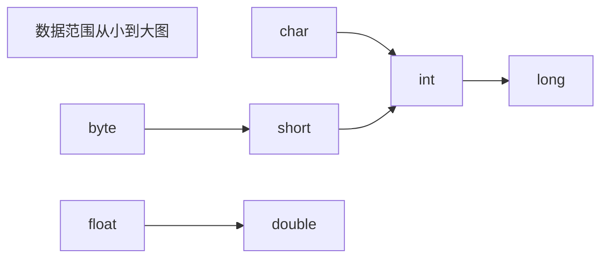

# SE

## 基础

### 数据

#### 变量

|          |    成员变量    |          局部变量          |       静态变量       |
| :------: | :------------: | :------------------------: | :------------------: |
| 定义位置 | 在类中，方法外 |    方法中或者方法的形参    |    在类中，方法外    |
| 初始化值 | 有默认初始化值 | 无，先定义，复制后才能使用 |    有默认初始化值    |
| 调用方法 |    对象调用    |                            |  对象调用，类名调用  |
| 存储位置 |      堆中      |            栈中            |        方法区        |
| 生命周期 |  与对象共存亡  |        与方法共存亡        |      与类共存亡      |
|   别名   |    实例变量    |                            | 类变量，静态成员变量 |

静态变量只有一个！ 


***


#### 数据类型

##### 基本数据类型

Java语言提供了八种基本类型。六种数字类型（四个整数型，两个浮点型），一种字符类型，还有一种布尔型。

**byte：**

- byte 数据类型是8位、有符号的，以二进制补码表示的整数；**8位一个字节**
- 最小值是 **-128（-2^7）**
- 最大值是 **127（2^7-1）**
- 默认值是 **`0`**
- byte 类型用在大型数组中节约空间，主要代替整数，因为 byte 变量占用的空间只有 int 类型的四分之一；
- 例子：`byte a = 100，byte b = -50`

**short：**

- short 数据类型是 16 位、有符号的以二进制补码表示的整数
- 最小值是 **-32768（-2^15）**
- 最大值是 **32767（2^15 - 1）**
- Short 数据类型也可以像 byte 那样节省空间。一个short变量是int型变量所占空间的二分之一；
- 默认值是 **`0`**
- 例子：`short s = 1000，short r = -20000`

**int：**

- int 数据类型是 32 位 4 字节、有符号的以二进制补码表示的整数
- 最小值是 **-2,147,483,648（-2^31）**
- 最大值是 **2,147,483,647（2^31 - 1）**
- 一般地整型变量默认为 int 类型
- 默认值是 **`0`** ；
- 例子：`int a = 100000, int b = -200000`

**long：**

- long 数据类型是 64 位 8 字节、有符号的以二进制补码表示的整数
- 最小值是 **-9,223,372,036,854,775,808（-2^63）**
- 最大值是 **9,223,372,036,854,775,807（2^63 -1）**
- 这种类型主要使用在需要比较大整数的系统上
- 默认值是 **` 0L`**
- 例子： `long a = 100000L，Long b = -200000L`
  "L"理论上不分大小写，但是若写成"l"容易与数字"1"混淆，不容易分辩，所以最好大写

**float：**

- float 数据类型是单精度、32位、符合IEEE 754标准的浮点数
- float 在储存大型浮点数组的时候可节省内存空间
- 默认值是 **`0.0f`**
- 浮点数不能用来表示精确的值，如货币
- 例子：`float f1 = 234.5F`

**double：**

- double 数据类型是双精度、64 位、符合IEEE 754标准的浮点数
- 浮点数的默认类型为double类型
- double类型同样不能表示精确的值，如货币
- 默认值是 **`0.0d`**
- 例子：`double d1 = 123.4`

**boolean：**

- boolean数据类型表示一位的信息
- 只有两个取值：true 和 false
- 这种类型只作为一种标志来记录 true/false 情况
- JVM规范指出boolean当做int处理，也就是4字节，boolean数组当做byte数组处理，这样我们可以得出boolean类型占了单独使用是4个字节，在数组中是确定的1个字节
- 默认值是 **`false`**
- 例子：`boolean one = true`

**char：**

- char类型是一个单一的 16 位 Unicode 字符
- 最小值是 **`\u0000`**（即为0）
- 最大值是 **`\uffff`**（即为65,535）
- char 数据类型可以储存任何字符
- 例子：`char c = 'A';`   `char c = '张';`



* float 与 double：

  Java 不能隐式执行向下转型，因为这会使得精度降低

  ```java
  //1.1字面量属于double类型，不能直接将1.1直接赋值给 float 变量，因为这是向下转型
  float f = 1.1;
  //1.1f 字面量才是 float 类型
  float f = 1.1f;
  ```

* 隐式类型转换：

  字面量 1 是 int 类型，它比 short 类型精度要高，因此不能隐式地将 int 类型向下转型为 short 类型

  使用 += 或者 ++ 运算符会执行隐式类型转换：

  ```java
  s1 += 1;	//s1++;
  //上面的语句相当于将 s1 + 1 的计算结果进行了向下转型
  s1 = (short) (s1 + 1);
  ```

  

***


##### 引用数据类型

引用数据类型：类，接口，数组都是引用数据类型，又叫包装类

包装类的作用：

* 包装类作为类首先拥有了Object类的方法。
* 包装类作为引用类型的变量可以存储null值。


```java
基本数据类型                包装类（引用数据类型）
byte                      Byte
short                     Short
int                       Integer(特殊)
long                      Long

float                     Float
double                    Double
char                      Character(特殊)
boolean                   Boolean
```
Java为包装类做了一些特殊功能，具体来看特殊功能主要有：

* 可以把基本数据类型的值转换成字符串类型的值
  1. 调用toString()方法
  2. 调用Integer.toString(基本数据类型的值)得到字符串
  3. 直接把基本数据类型+空字符串就得到了字符串（推荐使用）

* 把字符串类型的数值转换成对应的基本数据类型的值。（**重要**）

  1. Xxx.parseXxx("字符串类型的数值")  ---->Integer.parseInt(numStr)
  2. Xxx.valueOf("字符串类型的数值")    ---->Integer.valueOf(numStr) （推荐使用）

  ```java
  public class PackageClass02 {
      public static void main(String[] args) {
          // 1.把基本数据类型的值转成字符串
          Integer it = 100 ;
          // a.调用toString()方法。
          String itStr = it.toString();
          System.out.println(itStr+1);//1001
          // b.调用Integer.toString(基本数据类型的值)得到字符串。
          String itStr1 = Integer.toString(it);
          System.out.println(itStr1+1);//1001
          // c.直接把基本数据类型+空字符串就得到了字符串。
          String itStr2 = it+"";
          System.out.println(itStr2+1);// 1001
  
          // 2.把字符串类型的数值转换成对应的基本数据类型的值。（真的很有用）
          String numStr = "23";
          //int numInt = Integer.parseInt(numStr);
          int numInt = Integer.valueOf(numStr);
          System.out.println(numInt+1);//24
  
          String doubleStr = "99.9";
          //double doubleDb = Double.parseDouble(doubleStr);
          double doubleDb = Double.valueOf(doubleStr);
          System.out.println(doubleDb+0.1);//100.0
      }
  }
  ```

  

***


#### 装箱拆箱

* **自动装箱**：可以直接把基本数据类型的值或者变量赋值给包装类
* **自动拆箱**：可以把包装类的变量直接赋值给基本数据类型

```java
public class PackegeClass {
    public static void main(String[] args) {
        int a = 12 ;
        Integer a1 = 12 ;  // 自动装箱
        Integer a2 = a ;   // 自动装箱

        double b = 99.9;
        Double b1 = 99.9; // 自动装箱
        Double b2 = b ;   // 自动装箱

        Integer c = 100 ;
        int c1 = c ;      // 自动拆箱

        int d = 12;
        Integer d1 = null; // 引用数据类型的默认值可以为null
        Integer d2 = 0;

        Integer it = Integer.valueOf(12);  // 手工装箱！
        // Integer it1 = new Integer(12); // 手工装箱！
        Integer it2 = 12;

        Integer it3 = 111 ;
        int it33 = it3.intValue(); // 手工拆箱
    }
}
```


***


#### 缓存池

new Integer(123) 与 Integer.valueOf(123) 的区别在于：

- new Integer(123) : 每次都会新建一个对象；

- Integer.valueOf(123) : 会使用缓存池中的对象，多次调用会取得同一个对象的引用。

  ```java
  Integer x = new Integer(123);
  Integer y = new Integer(123);
  System.out.println(x == y);    // false
  Integer z = Integer.valueOf(123);
  Integer k = Integer.valueOf(123);
  System.out.println(z == k);   // true
  ```

valueOf() 方法的实现比较简单，就是先判断值是否在缓存池中，如果在的话就直接返回缓存池的内容。编译器会在自动装箱过程调用 valueOf() 方法，因此多个值相同且值在缓存池范围内的 Integer 实例使用自动装箱来创建，那么就会引用相同的对象。

**基本类型对应的缓存池如下：**

- Boolean values true and false
- all byte values
- Short values between -128 and 127
- Long values between -128 and 127
- Integer values between -128 and 127
- Character in the range \u0000 to \u007F (0 and 127)

在 jdk 1.8 所有的数值类缓冲池中，Integer 的缓存池IntegerCache 很特殊，这个缓冲池的下界是 - 128，上界默认是 127，但是这个上界是可调的，在启动 jvm 的时候，通过AutoBoxCacheMax=<size> 来指定这个缓冲池的大小，该选项在 JVM 初始化的时候会设定一个名为 java.lang.IntegerCache.high 系统属性，然后IntegerCache 初始化的时候就会读取该系统属性来决定上界。

```java
Integer x = Integer.valueOf(100);
Integer y = Integer.valueOf(100);
System.out.println(x == y);   // true

Integer x = Integer.valueOf(1000);
Integer y = Integer.valueOf(1000);
System.out.println(x == y);   // false
//因为缓存池最大127
```


***


#### 输入数据

语法：`Scanner sc = new Scanner(System.in);`
	next() : 遇到了空格, 就不再录入数据了 , 结束标记: 空格, tab键
	nextLine() : 可以将数据完整的接收过来 , 结束标记: 回车换行符

一般使用`sc.nextInt()`或者`sc.nextLine()`接受整型和字符串，然后转成需要的数据类型。

Scanner：`BufferedReader br = new BufferedReader(new InputStreamReader(System.in))`   
print：`PrintStream.write()`

> 使用引用数据类型的API

```java
import java.util.Scanner;
public class ScannerDemo {
    public static void main(String[] args) {
        Scanner sc = new Scanner(System.in);
    }
}
```


***


#### 面试题

* 有了基本数据类型，为什么还要引用数据类型？

  > 1、引用数据类型封装了数据和处理该数据的方法，比如Integer.parseInt(String)就是将String字符类型数据转换为Integer整型数据
  >
  > 2、Java中大部分类和方法都是针对引用数据类型，包括泛型和集合
  >
  > 3、引用类型在堆里，基本类型在栈里。栈空间小且连续，栈上的数据随时就会被收回

* 引用数据类型那么好，为什么还用基本数据类型？

  > 栈空间小且连续，往往会被放在缓存。引用类型cache miss（缓存未命中）率高且要多一次解引用，对象还要再多储存一个对象头，对基本数据类型来说空间浪费率太高
  > 逻辑上来讲，java只有包装类就够了，为了运行速度，需要用到基本数据类型；优先考虑运行效率的问题，所以二者同时存在是合乎情理的。

* Java集合不能存放基本数据类型，只存放对象的引用？

  > 不能放基本数据类型是因为不是Object的子类。泛型思想，如果不用泛型要写很多参数类型不同的但功能相同的函数（方法重载）

* ==

  > == 比较基本数据类型：比较的是具体的值
  > == 比较引用数据类型：比较的是对象地址值


****


### 数组

#### 初始化

数组就是存储数据长度固定的容器，存储多个数据的**数据类型要一致**

创建数组：

* 数据类型[] 数组名：`int[] arr;`  （常用）
* 数据类型 数组名[]：`int arr[];`

静态初始化：

* 数据类型[] 数组名 = new 数据类型[]{元素1,元素2,...}：`int[] arr = new int[]{11,22,33};`
* 数据类型[] 数组名 = {元素1,元素2,...}：`int[] arr = {44,55,66};`

动态初始化

* 数据类型[] 数组名 = new 数据类型[数组长度]：`int[] arr = new int[3];`


#### 元素访问

* **索引**：每一个存储到数组的元素，都会自动的拥有一个编号，从**0**开始。这个自动编号称为数组索引(index)，可以通过数组的索引访问到数组中的元素。 	

* **访问格式：**数组名[索引]：`arr[0]`
* **赋值：**`arr[0] = 10;`


***


#### 内存分配

##### 概念

内存是计算机中的重要原件，临时存储区域，作用是运行程序。我们编写的程序是存放在硬盘中的，在硬盘中的程序是不会运行的。必须放进内存中才能运行，运行完毕后会清空内存。 Java虚拟机要运行程序，必须要对内存进行空间的分配和管理。 

目前我们只需要记住两个内存，分别是：栈内存和堆内存

| 区域名称   | 作用                                                     |
| ---------- | -------------------------------------------------------- |
| 寄存器     | 给CPU使用，和我们开发无关                                |
| 本地方法栈 | JVM在使用操作系统功能的时候使用，和我们开发无关          |
| 方法区     | 存储可以运行的class文件                                  |
| 堆内存     | 存储对象或者数组，new来创建的，都存储在堆内存            |
| 方法栈     | 方法运行时使用的内存，比如main方法运行，进入方法栈中执行 |


##### 内存图

* Java内存分配-一个数组内存图

  

* 两个数组内存图

  

* 多个数组指向相同内存图

  

***


#### 异常

* 索引越界异常：ArrayIndexOutOfBoundsException 

* 空指针异常：NullPointerException 

  ```java
  public class ArrayDemo {
      public static void main(String[] args) {
          int[] arr = new int[3];
          //把null赋值给数组
          arr = null;
          System.out.println(arr[0]);
      }
  }
  ```

  arr = null，表示变量arr将不再保存数组的内存地址，也就不允许再操作数组，因此运行的时候会抛出空指针异常。在开发中，空指针异常是不能出现的，一旦出现了，就必须要修改我们编写的代码。

  解决方案：给数组一个真正的堆内存空间引用即可！
  
  

***


#### 二维数组

二维数组也是一种容器，不同于一维数组，该容器存储的都是一维数组容器

初始化：

* 动态初始化：
  数据类型[][] 变量名 = new 数据类型[m] [n] : `int[][] arr = new int[3][3];`
  	m表示这个二维数组，可以存放多少个一维数组
  	n表示每一个一维数组，可以存放多少个元素
* 静态初始化
  * 数据类型[][] 变量名 = new 数据类型[][]{ {元素1, 元素2...} , {元素1, 元素2...} 
  * 数据类型[][] 变量名 = { {元素1, 元素2...} , {元素1, 元素2...} ...}
  * `int[][] arr = {{11,22,33}, {44,55,66}};`

遍历：

```java
public class Test1 {
    /*
        步骤:
            1. 遍历二维数组，取出里面每一个一维数组
            2. 在遍历的过程中，对每一个一维数组继续完成遍历，获取内部存储的每一个元素
     */
    public static void main(String[] args) {
        int[][] arr = {{11, 22, 33}, {33, 44, 55}};
        // 1. 遍历二维数组，取出里面每一个一维数组
        for (int i = 0; i < arr.length; i++) {
            //System.out.println(arr[i]);
            // 2. 在遍历的过程中，对每一个一维数组继续完成遍历，获取内部存储的每一个元素
            //int[] temp = arr[i];
            for (int j = 0; j < arr[i].length; j++) {
                System.out.println(arr[i][j]);
            }
        }
    }
}
```


****


### 运算

* i++与++i的区别？
  i++表示先将i放在表达式中运算，然后再加1；
  ++i表示先将i加1，然后再放在表达式中运算

* ||和|，&&和&的区别，逻辑运算符

  **&和| 称为布尔运算符，位运算符。&&和|| 称为条件布尔运算符,也叫短路运算符**。

  两种运算符得到的结果完全相同，但得到结果的方式又一个重要区别：条件布尔运算符性能比较好。他检查第一个操作数的值，再根据该操作数的值进行操作，可能根本就不处理第二个操作数。

  结论：如果&&运算符的第一个操作数是false，就不需要考虑第二个操作数的值了，因为无论第二个操作数的值是什么，其结果都是false；同样，如果第一个操作数是true，||运算符就返回true，无需考虑第二个操作数的值。但&和|却不是这样，它们总是要计算两个操作数。为了提高性能，**尽可能使用&&和||运算符**

* switch

  从 Java 7 开始，可以在 switch 条件判断语句中使用 String 对象

  ```java
  String s = "a";
  switch (s) {
      case "a":
          System.out.println("aaa");
          break;
      case "b":
          System.out.println("bbb");
          break;
  }
  ```

  switch 不支持 long、float、double，switch 的设计初衷是对那些只有少数几个值的类型进行等值判断，如果值过于复杂，那么用 if 比较合适
  
* 移位运算
  计算机里一般用补码表示数字，正数、负数的表示区别就是最高位是0还是1

  * 正数的原码反码补码相同

    ```java
    100:	00000000  00000000  00000000  01100100
    ```

  * 负数：
    原码：最高位为1，其余位置和正数相同
    反码：保证符号位不变，其余位置取反
    补码：保证符号位不变，其余位置取反加1，即反码+1

    ```java
    -100原码:	10000000  00000000  00000000  01100100	//32位
    -100反码:	11111111  11111111  11111111  10011011
    -100补码:	11111111  11111111  11111111  10011100
    ```

    补码-->原码：符号位不变，其余位置取反加1

  运算符：

  * `>>`运算符：将二进制位进行右移操作
  * `<<`运算符：将二进制位进行左移操作
  * `>>>`运算符：无符号右移，忽略符号位，空位都以0补齐

  运算规则：

  * 正数的左移与右移，空位补0
  * 负数原码的左移与右移，空位补0
    负数反码的左移与右移，空位补1
    负数补码，左移低位补0，右移高位补1
  * 无符号移位，空位补0


****


### 参数

#### 形参实参

* 形参
  可以理解为形式参数，用于定义方法的时候使用的参数，只能是变量
  形参只有在方法被调用的时候，虚拟机才分配内存单元，方法调用结束之后便会释放所分配的内存单元

* 实参

  调用方法时传递的数据可以是常量，也可以是变量


#### 可变参数

可变参数用在形参中可以接收多个数据。

可变参数的格式：数据类型... 参数名称

可变参数的作用：传输参数非常灵活，方便。可以不传输参数、传输一个参数、或者传输一个数组。

可变参数在方法内部本质上就是一个数组。

可变参数的注意事项：
	1.一个形参列表中可变参数只能有一个！
	2.可变参数必须放在形参列表的**最后面**！

```java
public static void main(String[] args) {
	sum(); // 可以不传输参数。
	sum(10); // 可以传输一个参数。
	sum(10,20,30); // 可以传输多个参数。
	sum(new int[]{10,30,50,70,90}); // 可以传输一个数组。
}

public static void sum(int... nums){
	int sum = 0;
	for(int i : a) {
		sum += i;
	}
	return sum;
}
```


***


### 方法

#### 方法概述

方法（method）是将具有独立功能的代码块组织成为一个整体，使其具有特殊功能的代码集

注意：方法必须先创建才可以使用，该过程成为方法定义
			方法创建后并不是直接可以运行的，需要手动使用后，才执行，该过程成为方法调用

在方法内部定义的叫局部变量，局部变量不能加static，包括protected, private, public这些也不能加

原因：局部变量是保存在栈中的，而静态变量保存于方法区，局部变量出了方法就被栈回收了，而静态变量不会，所以在局部变量前不能加static关键字，静态变量是定义在类中，又叫类变量


***


#### 定义调用

* 定义格式

  ```java
  public static 返回值类型 方法名(参数) {
  	//方法体;
  	return 数据 ;
  }
  //注意：方法定义时，多个参数之间使( ，)分隔
  ```

* 调用格式

  ```java
  数据类型 变量名 = 方法名 ( 参数 ) ;
  //注意：方法的返回值通常会使用变量接收，否则该返回值将无意义
  ```

* 解释
  如果方法操作完毕，没有数据返回，这里写void，而且方法体中一般不写return

  方法名：调用方法时候使用的标识
  参数：由数据类型和变量名组成，多个参数之间用逗号隔开
  方法体：完成功能的代码块
  return：如果方法操作完毕，有数据返回，用于把数据返回给调用者

* 注意
  void类型的方法，直接调用即可
  非void类型的方法，推荐用变量接收调用
  
* 总结：每个方法在被调用执行的时候，都会进入栈内存，并且拥有自己独立的内存空间，方法内部代码调用完毕之后，会从栈内存中弹栈消失。


***


#### 注意事项

* 方法不能嵌套定义

  ```java
  public class MethodDemo {
  	public static void main(String[] args) {
  	}
  	public static void methodOne() {
  		public static void methodTwo() {
  			// 这里会引发编译错误!!!
  		}
  	}
  }
  ```

* void表示无返回值，可以省略return，也可以单独的书写return，后面不加数据

  ```java
  public static void methodTwo() {
  	//return 100; 编译错误，因为没有具体返回值类型
  	return;
  	//System.out.println(100); return语句后面不能跟数据或代码
  }
  ```

  

***


#### 方法重载

方法重载指同一个类中定义的多个方法之间的关系，满足下列条件的多个方法相互构成重载
	1.多个方法在**同一个类**中
	2.多个方法具有**相同的方法名**
	3.多个方法的**参数不相同**，类型不同或者数量不同

注意：
	1.重载仅对应方法的定义，与方法的调用无关，调用方式参照标准格式
	2.重载仅针对**同一个类**中方法的名称与参数进行识别，**与返回值无关**。
	3.不能通过返回值来判定两个方法是否相互构成重载

```java
//正确范例
public class MethodDemo {
	public static void fn(int a) {
		//方法体
	}
	public static int fn(double a) {
		//方法体
	}
}
//错误范例
public class MethodDemo {
	public static void fn(int a) {
		//方法体
	}
	public static int fn(int a) { /*错误原因：重载与返回值无关*/
		//方法体
	}
}
public class MethodDemo01 {
	public static int fn(double a) { /*错误原因：这是两个类的两个fn方法*/
		//方法体
	}
}
```


***


#### 参数传递

**Java 的参数是以值传递的形式传入方法中**

值传递和引用传递的区别在于传递后会不会影响实参的值：值传递会创建副本，引用传递不会创建副本

* 基本数据类型：形式参数的改变，不影响实际参数
  每个方法在栈内存中，都会有独立的栈空间，方法运行结束后就会弹栈消失
  
  ```java
  public class ArgsDemo01 {
  	public static void main(String[] args) {
  		int number = 100;
  		System.out.println("调用change方法前：" + number);//100
  		change(number);
  		System.out.println("调用change方法后：" + number);//100
  	}
  	public static void change(int number) {
  		number = 200;
  	}
  }
  ```
  
* 引用类型：，形式参数的改变，影响实际参数的值
  **引用数据类型的传参，本质上是将对象的地址以值的方式传递到形参中**，内存中会造成两个引用指向同一个内存的效果，所以即使方法弹栈，堆内存中的数据也已经是改变后的结果

  ```java
  public class PassByValueExample {
      public static void main(String[] args) {
          Dog dog = new Dog("A");
          func(dog);
          System.out.println(dog.getName());	// B
      }
      private static void func(Dog dog) {
          dog.setName("B");
      }
  }
  class Dog {
      String name;//.....
  }
  ```

  


***


### 枚举

枚举是Java中的一种特殊类型，为了做信息的标志和信息的分类

定义枚举的格式：

```java
修饰符 enum 枚举名称{
	第一行都是罗列枚举实例的名称。
}
```

枚举的特点：

* 枚举类是用final修饰的，枚举类不能被继承
* 枚举类默认继承了java.lang.Enum枚举类
* 枚举类的第一行都是常量，必须是罗列枚举类的实例名称
* 枚举类相当于是多例设计模式
* 每个枚举项都是一个实例，是一个静态成员变量

| 方法名                                            | 说明                                 |
| ------------------------------------------------- | ------------------------------------ |
| String name()                                     | 获取枚举项的名称                     |
| int ordinal()                                     | 返回枚举项在枚举类中的索引值         |
| int compareTo(E  o)                               | 比较两个枚举项，返回的是索引值的差值 |
| String toString()                                 | 返回枚举常量的名称                   |
| static <T> T  valueOf(Class<T> type,String  name) | 获取指定枚举类中的指定名称的枚举值   |
| values()                                          | 获得所有的枚举项                     |

* 源码分析：

  ```java
  enum Season {
      SPRING , SUMMER , AUTUMN , WINTER;
  }
  //枚举类的编译以后源代码：
  public final class Season extends java.lang.Enum<Season> {
  	public static final Season SPRING = new Season();
  	public static final Season SUMMER = new Season();
  	public static final Season AUTUMN = new Season();
  	public static final Season WINTER = new Season();
  
  	public static Season[] values();
  	public static Season valueOf(java.lang.String);
  }
  ```

* API使用

  ```java
  public class EnumDemo {
      public static void main(String[] args){
          //获取索引
          Season s = Season.SPRING;  // s = SPRING
          System.out.println(s.ordinal());
          //获取全部枚举
          Season[] ss = Season.values();
          for(int i = 0; i < ss.length; i++){
              System.out.println(ss[i]);
          }
          
          int result = Season.SPRING.compareTo(Season.WINTER);
          System.out.println(result);//-3
      }
  }
  enum Season {
      SPRING , SUMMER , AUTUMN , WINTER;
  }
  ```

  


****


### 排序

#### 冒泡排序

冒泡排序的作用：
    可以用于对数组或者对集合的元素进行大小排序！！

冒泡排序的核心算法思想:
    int[] arr = new int[] {55, 22, 99, 88};
    思想：每次从数组的第一个位置开始两两比较。把较大的元素与较小的元素进行层层交换。
    最终把当前最大的一个元素存入到数组当前的末尾。这就是冒泡思想。


冒泡排序的核心点：每次两两比较找出当前最大值冒出到当前最后面即可！！

冒泡排序的实现核心：
    1.确定总共需要冒几轮： 数组的长度-1.
    2.每轮两两比较几次。

>   i(轮数)      次数         每轮次数的规律：数组长度-i-1 次
>         0             3
>         1             2
>         2             1

```java
// 0 1位置比较，大的放后面，然后1 2位置比较，大的继续放后面，一轮循环最后一位是最大值

public class BubbleSort {
    public static void main(String[] args) {
        int[] arr = new int[] {55, 22, 99, 88};
        // 1.定义一个循环控制总共需要冒泡几轮：数组的长度-1
        for(int i = 0 ;  i < arr.length - 1 ; i++ ){
            // 2.控制每轮比较几次。
            // j = 1; j < arr.length - i;
            for(int j = 0 ; j < arr.length - i - 1 ; j++ ){
                // 如果当前元素大于后一个元素
                if(arr[j] > arr[j+1]){
                    // 交换位置。大的元素必须后移！
                    // 定义一个临时变量存储后一个元素
                    int temp = arr[j+1];
                    arr[j+1] = arr[j];
                    arr[j] = temp;
                }
            }
        }
        System.out.println("数组："+ Arrays.toString(arr));
    }
}
```


***


#### 选择排序

选择排序的思想：从当前位置开始找出后面的较小值与该位置交换。
数组：int[] arr = {5 , 1 , 3 , 2}

选择排序的实现思路：
    （1）控制选择几轮：数组的长度-1.
    （2）控制每轮从当前位置开始比较几次。

	> i(轮数)     次数
	>        0           3
	>        1           2
	>        2           1

```java
// 0 1位置比较，小的放0位置，然后0 2位置比，小的继续放0位置，一轮循环0位置是最小值
public class SelectSort {
    public static void main(String[] args) {
        int[] arr = {5 , 1 , 3 , 2};
        // 1.定义一个循环控制选择几轮
        for(int i = 0 ; i < arr.length - 1 ; i++ ){
            // 2.定义一个循环控制每轮比较几次，一定是以当前位置与后面元素比较
            for(int j = i+1 ; j < arr.length ; j++ ){
                // 拿当前位置与j指定的元素进行大小比较，后面的较小就交换位置
                if(arr[j] < arr[i]){
                    int temp = arr[i];
                    arr[i] = arr[j];
                    arr[j] = temp;
                }
            }
        }
        System.out.println("数组："+ Arrays.toString(arr));
    }
}
```


***


#### 快速排序

快速排序算法中,每一次递归时以第一个数为基准数,找到数组中所有比基准数小的.再找到所有比基准数大的.小的全部放左边,大的全部放右边,确定基准数的正确位置

> 不用递归可以直接找出某个数字在数组中的位置

```java
public class MyQuiteSortDemo2 {
    public static void main(String[] args) {
//        1，从右开始找比基准数小的
//        2，从左开始找比基准数大的
//        3，交换两个值的位置
//        4，红色继续往左找，蓝色继续往右找，直到两个箭头指向同一个索引为止
//        5，基准数归位
		int[] arr = {6, 1, 2, 7, 9, 3, 4, 5, 10, 8};
		quiteSort(arr,0,arr.length-1);
        for (int i = 0; i < arr.length; i++) {
            System.out.print(arr[i] + " ");
        }
    }

    private static void quiteSort(int[] arr, int left, int right) {
     	// 递归结束的条件
        if(right < left){
            return;
        }
        
        int left0 = left;
        int right0 = right;
        int baseNumber = arr[left0];//计算出基准数

        while(left != right){
			//1.从右开始找比基准数小的
            while(arr[right] >= baseNumber && right > left){
                right--;
            }
			//2.从左开始找比基准数大的
            while(arr[left] <= baseNumber && right > left){
                left++;
            }
			//3.交换两个值的位置
            int temp = arr[left];
            arr[left] = arr[right];
            arr[right] = temp;
        }
        //基准数归位
        int temp = arr[left];
        arr[left] = arr[left0];
        arr[left0] = temp;
      
		// 递归调用自己,将左半部分排好序
        quiteSort(arr,left0,--left);
      	// 递归调用自己,将右半部分排好序
        quiteSort(arr,++right,right0);
    }
}
```


***


#### 二分查找

> 正常查找：从第一个元素开始遍历，一个一个的往后找，综合查找比较耗时。

二分查找的前提：对数组是有要求的,数组必须已经排好序。
每次先与中间的元素进行比较，如果大于往右边找，如果小于往左边找，如果等于就返回该元素索引位置！如果没有该元素，返回-1。

```java
/*定义一个方法，记录开始的索引位置和结束的索引位置。
取出中间索引位置的值，拿元素与中间位置的值进行比较，如果小于中间值，结束位置=中间索引-1.
取出中间索引位置的值，拿元素与中间位置的值进行比较，如果大于中间值，开始位置=中间索引+1.
循环正常执行的条件：开始位置索引<=结束位置索引。否则说明寻找完毕但是没有该元素值返回-1.*/

public class BinarySerach {
    public static void main(String[] args) {
        // 1.数组
        int[] arr = {10, 14, 21, 38, 45, 47, 53, 81, 87, 99};
        // 2.需求是从数组中二分查询某个元素值的索引（提高性能）
        System.out.println("81的索引是：" + binarySerach(arr,23));
 
    }

    /**
     * @param arr  被检索的数组
     * @param number 被检索的元素值
     * @return  返回元素在数组中的索引值，不存在该元素返回-1
     */
    public static int binarySerach(int[] arr , int number){
        // 3.记录当前区间搜索的开始索引和结束索引。
        int start = 0 ;//左
        int end = arr.length - 1;//右
        // 4.定义一个循环，反复去循环元素。
        while(start <= end){
            // 5.取中间索引位置
            int middleIndex = (start + end) / 2 ;
            // 6.判断当前元素与中间元素的大小
            if(number < arr[middleIndex]){
                // 7.往左边继续寻找，结束索引应该-1
                end = middleIndex - 1;
            }else if(number > arr[middleIndex]){
                start = middleIndex + 1;
            }else if(number == arr[middleIndex]){
                return middleIndex;
            }
        }
        // 如果上述循环执行完毕还没有返回索引，说明根本不存在该元素值，直接返回-1
        return -1;
    }
}
```


***


### 递归

#### 概述

递归：方法在方法中又调用了自己。

递归：
    直接递归：自己的方法调用自己。
    间接递归：自己的方法调用别的方法，别的方法又调用自己。
注意：
     递归如果控制的不恰当，会形成递归的死循环，从而导致栈内存溢出错误！


***


#### 算法思想

##### 核心思想

递归的三要素（理论）：
    1.递归的终结点
    2.递归的公式
    3.递归的方向：必须走向终结点

```java
//f(x)=f(x-1)+1;   f(1)=1;    f(10)=?
//1.递归的终结点： f(1)  = 1
//2.递归的公式：f(x) = f(x - 1) + 1
//3.递归的方向：必须走向终结点
public static int f(int x){
    if(x == 1){
        return 1;
    }else{
        return f(x-1) + 1;
    }
}
```


##### 公式转换

```java
//已知： f(x) = f(x + 1) + 2,  f(1) = 1。求：f(10) = ?
//公式转换
//f(x-1)=f(x-1+1)+2 => f(x)=f(x-1)+2
//（1）递归的公式：   f(n) = f(n-1)- 2 ;
//（2）递归的终结点：  f(1) = 1
//（3）递归的方向：必须走向终结点。
public static int f(int n){
    if(n == 1){
        return 1;
    }else{
        return f(n-1) - 2;
    }
}
```


##### 注意

以上理论只能针对于**规律化递归**，如果是非规律化是不能套用以上公式的！
非规律化递归的问题：文件搜索，啤酒问题。


***


#### 经典案例

##### 猴子吃桃

猴子第一天摘了若干个桃子，当即吃了一半，觉得好不过瘾，然后又多吃了一个。
第二天又吃了前一天剩下的一半，觉得好不过瘾，然后又多吃了一个。以后每天都是如此
等到第十天再吃的时候发现只有1个桃子，请问猴子第一天总共摘了多少个桃子。

```java
/*
（1）公式： f(x+1)=f(x)-f(x)/2-1; ==> 2f(x+1) = f(x) - 2 ==> f(x)=2f(x+1)+2
（2）终结点：f(10) = 1
（3）递归的方向：走向了终结点
*/

public static int f(int x){
    if(x == 10){
        return 1;
    } else {
        return 2*f(x+1)+2
    }
}
```


##### 求和

```java
//（1）递归的终点接：f(1) = 1
//（2）递归的公式： f(n) = f(n-1) + n
//（3）递归的方向必须走向终结点：
public static int f(int n){
        if(n == 1 ) return 1;
        return f(n-1) + n;
}
```


##### 阶乘

```java
//（1）递归的终点接： f(1) = 1
//（2）递归的公式   f(n) = f(n-1)*n
//（3）递归的方向必须走向终结点

public static int f(int n){
	if(n == 1){
		return 1 ;
	}else{
		return f(n-1)*n;
	}
}
```


****


##### 啤酒问题

非规律化递归问题。

啤酒2元一瓶，4个盖子可以换一瓶，2个空瓶可以换一瓶。

```java
public class BeerDemo{
    // 定义一个静态变量存储可以喝酒的总数
    public static int totalNum;
    public static int lastBottleNum;
    public static int lastCoverNum;
    public static void main(String[] args) {
        buyBeer(10);
        System.out.println("总数："+totalNum);
        System.out.println("剩余盖子："+ lastCoverNum);
        System.out.println("剩余瓶子："+ lastBottleNum);
    }
    public static void buyBeer(int money){
        int number = money / 2;
        totalNum += number;
        // 算出当前剩余的全部盖子和瓶子数，换算成金额继续购买。
        int currentBottleNum = lastBottleNum + number ;
        int currentCoverNum = lastCoverNum + number ;
        // 把他们换算成金额
        int totalMoney = 0 ;
        totalMoney += (currentBottleNum/2)*2;//除2代表可以换几个瓶子，乘2代表换算成钱，秒！
        lastBottleNum = currentBottleNum % 2 ;//取余//算出剩余的瓶子
     
        totalMoney += (currentCoverNum / 4) * 2;
        lastCoverNum = currentCoverNum % 4 ;

        // 继续拿钱买酒
        if(totalMoney >= 2){
            buyBeer(totalMoney);
        }
    }
}
```


***


### Debug

Debug是供程序员使用的程序调试工具，它可以用于查看程序的执行流程，也可以用于追踪程序执行过程来调试程序。

加断点->Debug运行->单步运行->看Debugger窗口->看Console窗口


***


## 对象

### 概述

**Java是一种面向对象的高级编程语言。**

**三大特征：封装，继承，多态**

面向对象最重要的两个概念：类和对象。

* 类：相同事物共同特征的描述。类只是学术上的一个概念并非真实存在的，只能描述一类事物。
* 对象：是真实存在的实例， 实例==对象。**对象是类的实例化**！
* 结论：有了类和对象就可以描述万千世界所有的事物。 必须先有类才能有对象。


### 类

#### 定义

```java
定义类：
	格式：修饰符 class 类名{
	
	}
```

**1.类名的首字母建议大写。满足驼峰模式。 StudentNameCode**
2.一个Java代码中可以定义多个类，按照规范一个Java文件一个类
3.一个Java代码文件中，只能有一个类是public修饰，**public修饰的类名必须成为当前Java代码的文件名称**。

```java
类中的成分:有且仅有五大成分
修饰符 class 类名{
		1.成员变量(Field):  描述类或者对象的属性信息的。
        2.成员方法(Method): 描述类或者对象的行为信息的。
		3.构造器(Constructor): 初始化一个对象返回。
		4.代码块(后面学习的)
		5.内部类(后面学习的)
	  }
类中有且仅有这五种成分，否则代码报错！
public class ClassDemo {
    System.out.println(1);//报错
}
```


***


#### 构造器

```java
构造器：
    格式：修饰符 类名(形参列表){
    
         }
```

作用：初始化类的一个对象返回
分类：无参数构造器，有参数构造器

注意：一个类默认自带一个无参数构造器，写了有参数构造器默认的无参数构造器就消失，还需要用无参数构造器就要自己重新写。

构造器初始化对象的格式：类名 对象名称 = new 构造器;

* 无参数构造器的作用：初始化一个类的对象（使用对象的默认值初始化）返回。
* 有参数构造器的作用：初始化一个类的对象（可以在初始化对象的时候为对象赋值）返回。


------


### 包

* 包：
      分门别类的管理各种不同的技术。
      企业的代码必须用包区分。便于管理技术，扩展技术，阅读技术。
* 定义包的格式：package 包名; 必须放在类名的最上面。
* 注意：
  相同包下的类可以直接访问；不同包下的类必须导包,才可以使用！
  导包格式：import 包名.类名;


***


### 封装

封装的哲学思维：合理隐藏，合理暴露。
封装最初的目的：提高代码的安全性和复用性,组件化。
封装的步骤：
		**1.成员变量应该私有。用private修饰，只能在本类中直接访问。**
		**2.提供成套的getter和setter方法暴露成员变量的取值和赋值。**

为什么使用private修饰成员变量：实现数据封装，不想让别人使用修改你的数据，比较安全。


***


### this

this关键字的作用：
	this关键字代表了当前对象的引用。
	this出现在方法中：**哪个对象调用这个方法this就代表谁。**
	this可以出现在构造器中：代表构造器正在初始化的那个对象。
	this可以区分变量是访问的成员变量还是局部变量。

```java
public class ThisDemo{
	public static void main(String[] args){
		Animal a = new Animal();
        a.setName("狗子");
	}
}
class Aniaml{
    private String name;
    private int age ;
    .....
    public void setName(String name) {
        // 谁调用这个方法，this就代表谁!!!
		this.name = name; //  a.name = 狗子
    }
}
```


------


### static

#### static介绍

Java是通过成员变量是否有static修饰来区分是类的还是属于对象的。

static 静态修饰的成员（方法和成员变量）属于类本身的。

按照有无static修饰，成员变量和方法可以分为：

* 成员变量：
  * 静态成员变量（类变量）：
    有static修饰的成员变量称为静态成员变量也叫类变量，属于类本身，**与类一起加载一次，只有一个**，直接用类名访问即可。 
  * 实例成员变量：
    无static修饰的成员变量称为实例成员变量，属于类的每个对象的。**与类的对象一起加载**，对象有多少个，实例成员变量就加载多少个，必须用类的对象来访问。

* 成员方法：
  * 静态方法：
    有static修饰的成员方法称为静态方法也叫类方法，属于类本身的，直接用类名访问即可。  
  * 实例方法：
    无static修饰的成员方法称为实例方法，属于类的每个对象的，必须用类的对象来访问。 


****


#### static用法

成员变量的访问语法：

* 静态成员变量：只有一份可以被类和类的对象**共享访问**
  * 类名.静态成员变量（同一个类中访问静态成员变量可以省略类名不写）
  * 对象.静态成员变量（不推荐）

* 实例成员变量：
  * 对象.实例成员变量（先创建对象）

成员方法的访问语法：

* 静态方法：有static修饰，属于类

  * 类名.静态方法（同一个类中访问静态成员可以省略类名不写）
  * 对象.静态方法（不推荐，参考 JVM类加载--> 字节码 --> 方法调用）
  
* 实例方法：无static修饰，属于对象

  * 对象.实例方法
  
  ```java
  public class Student {
      // 1.静态方法：有static修饰，属于类，直接用类名访问即可！
      public static void inAddr(){ }
      // 2.实例方法：无static修饰，属于对象，必须用对象访问！
      public void eat(){}
      
      public static void main(String[] args) {
          // a.类名.静态方法
          Student.inAddr();
          inAddr();
          // b.对象.实例方法
          // Student.eat(); // 报错了！
          Student zbj = new Student();
          zbj.eat();
      }
  }
  ```
  


***


#### 两个问题

内存问题：

* **栈内存存放main方法和地址**

* **堆内存存放对象和变量**

* **方法区存放class和静态变量（jdk8以后移入堆）**

访问问题：

​     a.实例方法是否可以直接访问实例成员变量？可以的，因为它们都属于对象。
​     b.实例方法是否可以直接访问静态成员变量？可以的，静态成员变量可以被共享访问。
​     c.实例方法是否可以直接访问实例方法? 可以的，实例方法和实例方法都属于对象。
​     d.实例方法是否可以直接访问静态方法？可以的，静态方法可以被共享访问！

​     a.静态方法是否可以直接访问实例变量？ 不可以的，实例变量必须用对象访问！！
​     b.静态方法是否可以直接访问静态变量？ 可以的，静态成员变量可以被共享访问。
​     c.静态方法是否可以直接访问实例方法? 不可以的，实例方法必须用对象访问！！
​     d.静态方法是否可以直接访问静态方法？可以的，静态方法可以被共享访问！！


------


### 继承

#### 继承概述

继承是Java中一般到特殊的关系，是一种子类到父类的关系。

被继承的类称为：父类/超类。
继承父类的类称为：子类。

继承的作用：

* **提高代码的复用**，相同代码可以定义在父类中
* 子类继承父类，可以直接使用父类这些代码（相同代码重复利用）
* 子类得到父类的属性（成员变量）和行为（方法），子类得到了父类的功能，还有自己的功能，子类更强大

继承的特点：

1. 子类的全部构造器默认先访问父类的无参数构造器，再执行自己的构造器
2. **单继承**：一个类只能继承一个直接父类
3. 多层继承：一个类可以间接继承多个父类（家谱）
4. 一个类可以有多个子类
5. 一个类要么默认继承了Object类，要么间接继承了Object类，Object类是Java中的祖宗类

继承的格式：

```java
子类 extends 父类{

}
```

子类不能继承父类的东西：

* 子类不能继承父类的构造器，子类有自己的构造器。（没有争议的）

    * 子类是否可以继承父类的私有成员（私有成员变量，私有成员方法）?（有争议）
        子类是可以继承父类的私有成员的，只是不能直接访问而已。可以反射暴力去访问继承自父类的私有成员
    * 子类是否可以继承父类的静态成员？（有争议）
        子类是不能继承父类的静态成员的，子类只是可以访问父类的静态成员，父类静态成员只有一份可以被子类共享访问。**共享并非继承**。
    
    ```java
    public class ExtendsDemo {
        public static void main(String[] args) {
            Cat c = new Cat();
            // c.run();
            Cat.test();
            System.out.println(Cat.schoolName);
        }
    }
    class Cat extends Animal{
    }
    class Animal{
        public static String schoolName ="黑马";
        public static void test(){}
        private void run(){}
    }
    ```


***


#### 继承访问

继承后成员变量的访问特点：**就近原则**，子类有找子类，子类没有找父类，父类没有就报错！

如果要申明访问父类的成员变量可以使用：super.父类成员变量。super指父类引用。

```java
public class ExtendsDemo {
    public static void wmain(String[] args) {
        Wolf w = new Wolf();w
        w.showName();
    }
}
class Wolf extends Animal{
    private String name = "子类狼";
    public void showName(){
        String name = "局部名称";
        System.out.println(name); // 局部name
        System.out.println(this.name); // 子类对象的name
        System.out.println(super.name); // 父类的
        System.out.println(name1); // 父类的
        //System.out.println(name2); // 报错。子类父类都没有
    }
}

class Animal{
    public String name = "父类动物名称";
    public String name1 = "父类";
}
```


***


#### 方法重写

方法重写的概念：
    子类继承了父类，子类就得到了父类的某个方法，子类重写一个与父类申明一样的方法来**覆盖**父类的该方法。

方法重写的校验注解： @Override
    方法一旦加了这个注解，那就必须是成功重写父类的方法，否则报错！
    **@Override优势：可读性好，安全，优雅！！**

为了满足里式替换原则，重写有以下三个限制：

- 子类方法的访问权限必须大于等于父类方法
- 子类方法的返回类型必须是父类方法返回类型或为其子类型
- 子类方法抛出的异常类型必须是父类抛出异常类型或为其子类型

```java
public class ExtendsDemo {
    public static void main(String[] args) {
        Wolf w = new Wolf();
        w.run();
    }
}
class Wolf extends Animal{
    @Override
    public void run(){}//
}
class Animal{
    public void run(){}
}
```


***


#### 面试问题

* **为什么子类构造器会先调用父类构造器？**
      1.子类的构造器的第一行默认super()调用父类的无参数构造器，写不写都存在!
      2.子类继承父类，子类就得到了父类的属性和行为。
          调用子类构造器初始化子类对象数据时，必须先调用父类构造器初始化继承自父类的属性和行为

  ```java
  class Animal{
      public Animal(){
          System.out.println("==父类Animal的无参数构造器==");
      }
  }
  class Tiger extends Animal{
      public Tiger(){
          super(); // 默认存在的，根据参数去匹配调用父类的构造器。
          System.out.println("==子类Tiger的无参数构造器==");
      }
      public Tiger(String name){
          //super();  默认存在的，根据参数去匹配调用父类的构造器。
          System.out.println("==子类Tiger的有参数构造器==");
      }
  }
  ```

  

* **为什么Java是单继承的？**
  答：反证法，假如Java可以多继承，请看如下代码：
  补充：多实现是在实现接口时，重名方法需要实现类来实现

  ```java
  class A{
  	public void test(){
  		System.out.println("A");
  	}
  }
  class B{
  	public void test(){
  		System.out.println("B");
  	}
  }
  class C extends A , B {
  	public static void main(String[] args){
  		C c = new C();
          c.test(); 
          // 出现了类的二义性！所以Java不能多继承！！
  	}
  }
  ```

  


------


### super

继承后super调用父类构造器，父类构造器初始化继承自父类的数据。

super(...)：可以根据参数选择调用父类的某个构造器。


总结与拓展：

> this代表了当前对象的引用（继承中指代子类对象）：
> 	this.子类成员变量。
> 	this.子类成员方法。
>    	this(...):可以根据参数匹配访问本类其他构造器。
> super代表了父类对象的引用（继承中指代了父类对象空间）
>    	super.父类成员变量。
>    	super.父类的成员方法。
>    	super(...):可以根据参数匹配访问父类的构造器。

**注意：**
    this(...)借用本类其他构造器，super(...)调用父类的构造器。
    this(...)和super(...)必须放在构造器的第一行，否则报错!
    this(...)和super(...)不能同时出现在构造器中，因为构造函数必须出现在第一行上，只能选择一个。

```java
public class ThisDemo {
    public static void main(String[] args) {
        // 需求：希望如果不写学校默认就是”黑马“！
        Student s1 = new Student("天蓬元帅", 1000 );
        Student s2 = new Student("齐天大圣", 2000, "清华大学" );
    }
}
class Study extends Student {
   public Study(String name, int age, String schoolName) {
        super(name , age , schoolName) ; 
       // 根据参数匹配调用父类构造器
   }
}

class Student{
    private String name ;
    private int age ;
    private String schoolName ;

    public Student() {
    }
    public Student(String name , int age){
        // 借用兄弟构造器的功能！
        this(name , age , "黑马");
    }
	public Student(String name, int age, String schoolName) {
        this.name = name;
        this.age = age;
        this.schoolName = schoolName;
    }
// .......get + set
}
```


***


### final

#### final概述

final用于修饰：类，方法，变量

* final修饰类，类不能被继承了，类中的方法和变量可以使用
* final可以修饰方法，方法就不能被重写
* final修饰变量总规则：变量有且仅能被赋值一次

**面试题**：final和abstract的关系?
               互斥关系，不能同时修饰类或者同时修饰方法！！


***


#### 修饰变量

代码块的相关知识

>* 成员变量
>      * 静态成员变量：有static修饰，属于类，只加载一份
>      *  实例成员变量：无static修饰，属于每个对象,与对象一起加载
>* 局部变量
>      * 只能方法中，构造器中，代码块中，for循环中，用完作用范围就消失了。 
>* final修饰局部变量：
>      * 让值被固定或者说保护起来，执行的过程中防止被修改。

##### 静态成员变量

final修饰静态成员变量，变量变成了常量

**常量：有public static final修饰，名称字母全部大写，多个单词用下划线连接。**

final修饰静态成员变量可以在哪些地方赋值：

1. 定义的时候赋值一次

2. 可以在静态代码块中赋值一次。

```java
public class FinalDemo {
//常量：public static final修饰，名称字母全部大写，下划线连接。
    public static final String SCHOOL_NAME = "黑马" ;
    public static final String SCHOOL_NAME1;

    static{
        //SCHOOL_NAME = "java";//报错
        SCHOOL_NAME1 = "黑马1";
        //SCHOOL_NAME1 = "黑马2"; // 报错，第二次赋值！
    }
}
```


##### 实例成员变量

final修饰变量的总规则：有且仅能被赋值一次。

final修饰实例成员变量可以在哪些地方赋值1次：

1. 定义的时候赋值一次。
2. 可以在实例代码块中赋值一次。
3. 可以在每个构造器中赋值一次。

```java
public class FinalDemo {
    private final String name = "黑马" ;
    private final String name1;
    private final String name2;
    {
        // 可以在实例代码块中赋值一次。
        name1 = "黑马1";
    }
	//构造器赋值一次
    public FinalDemo(){
        name2 = "黑马2";
    }
    public FinalDemo(String a){
        name2 = "黑马2";
    }

    public static void main(String[] args) {
        FinalDemo f1 = new FinalDemo();
        //f1.name = "黑马1"; // 第二次赋值 报错！
    }
}
```


***


### 抽象类

#### 概述

> 父类知道子类要完成某个功能，但是每个子类实现情况不一样。

抽象方法：没有方法体，只有方法签名，必须用**abstract**修饰的方法就是抽象方法
抽象类：拥有抽象方法的类必须定义成抽象类，必须用**abstract**修饰，抽象类是为了被继承

一个类继承抽象类，**必须重写抽象类的全部抽象方法**，否则这个类必须定义成抽象类，因为拥有抽象方法的类必须定义成抽象类

```java
public class AbstractDemo {
    public static void main(String[] args) {
        Dog d = new Dog();
        d.run();
    }
}

class Dog extends Animal{
    @Override
    public void run() { 
        System.out.println("🐕跑"); 
    }
}

abstract class Animal{
    public abstract void run();
}
```


***


#### 面试问题

一、抽象类是否有构造器，是否可以创建对象，为什么?
答：抽象类作为类一定有构造器，而且必须有构造器，提供给子类继承后调用父类构造器使用的

1、抽象类有构造器，但是抽象类不能创建对象，类的其他成分它都具备
2、抽象类中存在抽象方法，但不能执行，**抽象类中也可没有抽象方法**

> 抽象在学术上本身意味着不能实例化

```java
public class AbstractDemo {
    public static void main(String[] args) {
        //Animal a = new Animal(); 抽象类不能创建对象！
        //a.run(); // 抽象方法不能执行
    }
}
abstract class Animal{
    private String name;
    public static String schoolName = "黑马";
    public Animal(){ }

    public abstract void run();
    //普通方法
    public void go(){ }
}
```


二、static与abstract能同时使用吗？
答：不能，被static修饰的方法属于类，是类自己的东西，不是给子类来继承的，而抽象方法本身没有实现，就是用来给子类继承


***


#### 存在意义

   * **被继承**，抽象类就是为了被子类继承，否则抽象类将毫无意义。(核心）
   * 抽象类体现的是"模板思想"：**部分实现，部分抽象**。 可以使用抽象类设计一个模板模式。

```java
//作文模板
public class ExtendsDemo {
    public static void main(String[] args) {
        Student xiaoMa = new Student();
        xiaoMa.write();
    }
}
class Student extends Template{
    @Override
    public String writeText() {return "\t内容"}
}
// 1.写一个模板类：代表了作文模板。
abstract class Template{
    private String title = "\t\t\t\t\t标题";
    private String start = "\t开头";
    private String last = "\t结尾";
    public void write(){
        System.out.println(title+"\n"+start);
        System.out.println(writeText());
        System.out.println(last);
    }
    // 正文部分定义成抽象方法，交给子类重写！！
    public abstract String writeText();
}
```


***


### 接口

#### 概述

接口，是Java语言中一种引用类型，是方法的集合。

接口是更加彻底的抽象，接口中只有抽象方法和常量，没有其他成分，jdk1.8前

> 接口称为 被实现，实现接口的类称为**实现类**

```java
 修饰符 interface 接口名称{
	// 抽象方法
	// 默认方法
	// 静态方法
	// 私有方法
}
```

* 抽象方法：接口中的抽象方法默认会加上public abstract修饰，所以可以省略不写

* 静态方法：静态方法必须有方法体

* 常量：常量是public static final修饰的成员变量，仅能被赋值一次，值不能改变。常量的名称规范上要求全部大写，多个单词下划线连接。public static final可以省略不写。

  ```java
  public interface InterfaceDemo{
      //public static final String SCHOOL_NAME = "黑马";
  	String SCHOOL_NAME = "黑马";
      
      //public abstract void run();
      void run();//默认补充
  }
  ```


***


#### 实现

作用：**接口是用来被类实现的。**

类与类是继承关系：一个类只能直接继承一个父类，单继承
类与接口是实现关系：一个类可以实现多个接口，多实现，接口不能继承类
接口与接口继承关系：**多继承**

>子类   继承   父类
>实现类 实现   接口

```java
修饰符 class 实现类名称 implements 接口1,接口2,接口3,....{

}
修饰符 interface 接口名 extend 接口1,接口2,接口3,....{
    
}
```

实现多个接口的使用注意事项：

1. 当一个类实现多个接口时，多个接口中存在同名的静态方法并不会冲突，只能通过各自接口名访问静态方法

2. 当一个类实现多个接口时，多个接口中存在同名的默认方法，实现类必须重写这个方法

3. 当一个类，既继承一个父类，又实现若干个接口时，父类中的成员方法与接口中的默认方法重名，子类**就近选择执行父类**的成员方法

4. 接口中，没有构造器，**不能创建对象**，接口是更彻底的抽象，连构造器都没有，自然不能创建对象！！

   ```java
   public class InterfaceDemo {
       public static void main(String[] args) {
           Student s = new Student();
           s.run();
           s.rule();
       }
   }
   class Student implements Food, Person{
       @Override
       public void eat() {}
       
       @Override
       public void run() {}
   }
   interface Food{
       void eat();
   }
   interface Person{
       void run();
   }
   //可以直接 interface Person extend Food,
   //然后 class Student implements Person 效果一样
   ```

   

***


#### JDK1.8以后

jdk1.8以后新增的功能，实际开发中很少使用

* 默认方法（就是之前写的普通实例方法）
  * 必须用default修饰，默认会public修饰
  * 必须用接口的实现类的对象来调用
* 静态方法
  * 默认会public修饰
  * 接口的静态方法必须用接口的类名本身来调用
  * 调用格式：ClassName.method()
* 私有方法（就是私有的实例方法）：JDK 1.9才开始有的
  * 只能在**本类中**被其他的默认方法或者私有方法访问

```java
public class InterfaceDemo {
    public static void main(String[] args) {
        // 1.默认方法调用：必须用接口的实现类对象调用。
        Man m = new Man();
        m.run();
        m.work();

        // 2.接口的静态方法必须用接口的类名本身来调用。
        InterfaceJDK8.inAddr();
    }
}
class Man implements InterfaceJDK8{
    @Override
    public void work() {
        System.out.println("工作中。。。");
    }
}

interface InterfaceJDK8{
    //抽象方法！！
    void work();
    // a.默认方法（就是之前写的普通实例方法）
    // 必须用接口的实现类的对象来调用。
    default void run(){
        go();
        System.out.println("开始跑步🏃‍");
    }

    // b.静态方法
    // 注意：接口的静态方法必须用接口的类名本身来调用
    static void inAddr(){
        System.out.println("我们在武汉");
    }
    
    // c.私有方法（就是私有的实例方法）: JDK 1.9才开始有的。
    // 只能在本接口中被其他的默认方法或者私有方法访问。
    private void go(){
        System.out.println("开始。。");
    }
}
```


***


#### 抽象类对比

| **参数**           | **抽象类**                                                   | **接口**                                                     |
| ------------------ | ------------------------------------------------------------ | ------------------------------------------------------------ |
| 默认的方法实现     | 可以有默认的方法实现                                         | 接口完全是抽象的，jdk8以后有默认的实现                       |
| 实现               | 子类使用**extends**关键字来继承抽象类。如果子类不是抽象类的话，它需要提供抽象类中所有声明的方法的实现。 | 子类使用关键字**implements**来实现接口。它需要提供接口中所有声明的方法的实现 |
| 构造器             | 抽象类可以有构造器                                           | 接口不能有构造器                                             |
| 与正常Java类的区别 | 除了不能实例化抽象类之外，和普通Java类没有任何区别           | 接口是完全不同的类型                                         |
| 访问修饰符         | 抽象方法可以有**public**、**protected**和**default**这些修饰符 | 接口方法默认修饰符是**public**，别的修饰符需要有方法体       |
| main方法           | 抽象方法可以有main方法并且我们可以运行它                     | jdk8以前接口没有main方法，不能运行；jdk8以后接口可以有default和static方法，可以运行main方法 |
| 多继承             | 抽象方法可以继承一个类和实现多个接口                         | 接口可以继承一个或多个其它接口，接口不可继承类               |
| 速度               | 比接口速度要快                                               | 接口是稍微有点慢的，因为它需要时间去寻找在类中实现的方法     |
| 添加新方法         | 如果往抽象类中添加新的方法，可以给它提供默认的实现，因此不需要改变现在的代码 | 如果往接口中添加方法，那么必须改变实现该接口的类             |


------


### 多态

#### 多态概述

多态的概念：同一个实体同时具有多种形式同一个类型的对象，执行同一个行为，在不同的状态下会表现出不同的行为特征。

多态的格式：

* 父类类型范围 > 子类类型范围

```java
父类类型 对象名称 = new 子类构造器;
接口	  对象名称 = new 实现类构造器;
```

多态的执行：

* 对于方法的调用：**编译看左边，运行看右边。**
* 对于变量的调用：**编译看左边，运行看左边。**

多态的使用前提：

* 必须存在继承或者实现关系。
* 必须存在父类类型的变量引用子类类型的对象。
* 存在方法重写

多态的优劣：

* 优势：
  * 在多态形式下，右边对象可以实现组件化切换，业务功能也随之改变，便于扩展和维护。可以实现类与类之间的**解耦**
  * 父类类型作为方法形式参数，传递子类对象给方法，可以传入一切子类对象进行方法的调用，更能体现出多态的**扩展性**与便利性

* 劣势： 
  * 多态形式下，不能直接调用子类特有的功能，因为编译看左边，父类中没有子类独有的功能，所以代码在编译阶段就直接报错了！ 

```java
public class PolymorphicDemo {
    public static void main(String[] args) {
        Animal c = new Cat();
        c.run();
        //c.eat();//报错  编译看左边 需要强转
        go(c);
        go(new Dog);   
    }
    //用 Dog或者Cat 都没办法让所有动物参与进来，只能用Anima
    public static void go(Animal d){}
    
}
class Dog extends Animal{}

class Cat extends Animal{
    public void eat();
    @Override
    public void run(){}
}

class Animal{
    public void run(){}
}
```


***


#### 上下转型

>基本数据类型的转换：
>    1.小范围类型的变量或者值可以直接赋值给大范围类型的变量。
>    2.大范围类型的变量或者值必须强制类型转换给小范围类型的变量。

引用数据类型的**自动**类型转换语法：子类类型的对象或者变量可以自动类型转换赋值给父类类型的变量。

核心：**父类引用指向子类对象**

- **向上转型(upcasting)**：通过子类对象(小范围)实例化父类对象(大范围)，这种属于自动转换
- **向下转型(downcasting)**：通过父类对象(大范围)实例化子类对象(小范围)，这种属于强制转换

```java
public class PolymorphicDemo {
    public static void main(String[] args){
        Animal a = new Cat();//向上转型
        Cat c = (Cat)a;//向下转型
    }
}
class Animal{}
class Cat extends Animal{}
```


***


#### instanceof

* 引用类型强制类型转换：父类类型的变量或者对象强制类型转换成子类类型的变量，否则报错!
* 强制类型转换的格式：**类型 变量名称 = (类型)(对象或者变量)**
* 有继承/实现关系的两个类型就可以进行强制类型转换，编译阶段一定不报错！但是运行阶段可能出现：类型转换异常 ClassCastException
* **instanceof**：判断左边的对象是否是右边的类的实例，或者是其直接或间接子类，或者是其接口的实现类

```java
public class Demo{
    public static void main(String[] args){
		Aniaml a = new Dog();
		//Dog d = (Dog)a;
        //Cat c = (Cat)a; 编译不报错，运行报ClassCastException错误
        if(a instanceof Cat){
            Cat c = (Cat)a; 
        } else if(a instanceof Dog) {
            Dog d = (Dog)a;
        }
    }
}
class Dog extends Animal{}
class Cat extends Animal{}
class Animal{}
```


***


### 内部类

#### 概述

内部类是类的五大成分之一：成员变量，方法，构造器，代码块，内部类

概念：定义在一个类里面的类就是内部类

作用：提供更好的封装性，体现出组件思想，**间接解决类无法多继承引起的一系列问题**

分类：静态内部类、实例内部类（成员内部类）、局部内部类、**匿名内部类**（重点）


***


#### 静态内部类

定义：有static修饰，属于外部类本身，会加载一次

静态内部类中的成分研究：

* 类有的成分它都有，静态内部类属于外部类本身，只会加载一次
* 特点与外部类是完全一样的，只是位置在别人里面
* 可以定义静态成员

静态内部类的访问格式：外部类名称.内部类名称

静态内部类创建对象的格式：外部类名称.内部类名称 对象名称 = new 外部类名称.内部类构造器;

静态内部类的访问拓展：

* 静态内部类中是否可以直接访问外部类的静态成员?	可以，外部类的静态成员只有一份，可以被共享
* 静态内部类中是否可以直接访问外部类的实例成员?	不可以，外部类的成员必须用外部类对象访问

```java
public class Demo{
    public static void main(String[] args){
        Outter.Inner in = new Outter.Inner();
    }
}

static class Outter{
    public static int age;
    private double salary;
    public static class Inner{
         //拥有类的所有功能 构造器 方法 成员变量
         System.out.println(age);
         //System.out.println(salary);报错
	}
}
```


***


#### 实例内部类

定义：无static修饰的内部类，属于外部类的每个对象，跟着外部类对象一起加载。

实例内部类的成分特点：实例内部类中不能定义静态成员，其他都可以定义

实例内部类的访问格式：外部类名称.内部类名称

创建对象的格式：外部类名称.内部类名称 对象名称 = new 外部类构造器.new 内部构造器;

* `Outter.Inner in = new Outter().new Inner();`

拓展：**实例内部类可以访问外部类的全部成员**

> * 实例内部类中是否可以直接访问外部类的静态成员？
>   可以，外部类的静态成员可以被共享访问！
> * 实例内部类中是否可以访问外部类的实例成员？
>   可以，实例内部类属于外部类对象，可以直接访问外部类对象的实例成员！


***


#### 局部内部类

局部内部类：定义在方法中，在构造器中，代码块中，for循环中定义的内部类。

局部内部类中的成分特点：只能定义实例成员，不能定义静态成员

```java
public class InnerClass{
	public static void main(String[] args){
        String name;
        class{}
    }
    public static void test(){
		class Animal{}
		class Cat extends Animal{}  
	}
}
```


***


#### 匿名内部类

匿名内部类：没有名字的局部内部类
作用：简化代码，是开发中常用的形式

匿名内部类的格式：

```java
new 类名|抽象类|接口(形参){
	//方法重写。
}
```
 匿名内部类的特点：

* 匿名内部类不能定义静态成员
* 匿名内部类一旦写出来，就会立即创建一个匿名内部类的对象返回
* **匿名内部类的对象的类型相当于是当前new的那个的类型的子类类型**
* 匿名内部类引用局部变量，局部变量必须是**final修饰**，底层创建为内部类的成员变量（JVM-->类加载-->编译优化-->内部类）

```java
public class Anonymity {
    public static void main(String[] args) {
        //final n = 1;//局部变量
        Animal a = new Animal(){
            @Override
            public void run() {
                System.out.println("猫跑的贼溜~~");
                //System.out.println(n);
            }
        };
        a.run();
        a.go();
    }
}
abstract class Animal{
    public abstract void run();

    public void go(){
        System.out.println("开始go~~~");
    }
}
```


***


### 权限修饰符

权限修饰符：有四种**（private -> 缺省 -> protected - > public ）**
可以修饰成员变量，修饰方法，修饰构造器，内部类，不同修饰符修饰的成员能够被访问的权限将受到限制!

| 四种修饰符访问权限 | private | 缺省 | protected | public |
| ------------------ | :-----: | :--: | :-------: | :----: |
| 本类中             |    √    |  √   |     √     |   √    |
| 子类中             |    X    |  √   |     √     |   √    |
| 本包下其他类中     |    X    |  √   |     √     |   √    |
| 其他包下的子类中   |    X    |  X   |     √     |   √    |
| 其他包下的其他类中 |    X    |  X   |     X     |   √    |

protected 用于修饰成员，表示在继承体系中成员对于子类可见，子类需要重写方法才可以调用


***


### 代码块

#### 静态代码块

静态代码块的格式：

 ```java
static {
}
 ```

* 静态代码块特点： 
  * 必须有static修饰
  * 会与类一起优先加载，且自动触发执行一次
  * 只能访问静态资源
* 静态代码块作用：
  * 可以在执行类的方法等操作之前先在静态代码块中进行静态资源的初始化 
  * **先执行静态代码块，在执行main函数里的操作**

```java
public class CodeDemo {
    public static String schoolName ;
    public static ArrayList<String> lists = new ArrayList<>();

    // 静态代码块,属于类，与类一起加载一次!
    static {
        System.out.println("静态代码块被触发执行~~~~~~~");
        // 在静态代码块中进行静态资源的初始化操作
        schoolName = "黑马";
        lists.add("3");
        lists.add("4");
        lists.add("5");
    }
    public static void main(String[] args) {
        System.out.println("main方法被执行");
        System.out.println(schoolName);
        System.out.println(lists);
    }
}
/*静态代码块被触发执行~~~~~~~
main方法被执行
黑马
[3, 4, 5] */
```


***


#### 实例代码块

实例代码块的格式：

```java
{

}
```

* 实例代码块的特点：
  * 无static修饰，属于对象
  * 会与类的对象一起加载，每次创建类的对象的时候，实例代码块都会被加载且自动触发执行一次
  * 实例代码块的代码在底层实际上是提取到每个构造器中去执行的
  
* 实例代码块的作用：实例代码块可以在创建对象之前进行实例资源的初始化操作

```java
public class CodeDemo {
    private String name;
    private ArrayList<String> lists = new ArrayList<>();
    {
        name = "代码块";
        lists.add("java");
        System.out.println("实例代码块被触发执行一次~~~~~~~~");
    }
    public CodeDemo02(){ }//构造方法
    public CodeDemo02(String name){}

    public static void main(String[] args) {
        CodeDemo c = new CodeDemo();//实例代码块被触发执行一次
        System.out.println(c.name);
        System.out.println(c.lists);
        new CodeDemo02();//实例代码块被触发执行一次
    }
}
```


***


## API

### Object

#### 概述

Object类是Java中的祖宗类，一个类或者默认继承Object类，或者间接继承Object类，Object类的方法是一切子类都可以直接使用

Object类常用方法：

* `public String toString()`：
  默认是返回当前对象在堆内存中的地址信息：类的全限名@内存地址，例：Student@735b478；
  直接输出对象名称，默认会调用toString()方法，所以省略toString()不写；
  如果输出对象的内容，需要重写toString()方法，toString方法存在的意义是为了被子类重写
* `public boolean equals(Object o)`：
  默认是比较两个对象的内容是否相同，如果只是比较两个对象的地址可以用“==”替代equals
  所以equals存在的意义是为了被子类重写，以便程序员可以自己来定制比较规则
* `protected Object clone()`：创建并返回此对象的副本 

只要两个对象的内容一样，就认为是相等的：

```java
public boolean equals(Object o) {
	// 1.判断是否自己和自己比较，如果是同一个对象比较直接返回true
	if (this == o) return true;
	// 2.判断被比较者是否为null ,以及是否是学生类型。
	if (o == null || this.getClass() != o.getClass()) return false;
	// 3.o一定是学生类型，强制转换成学生，开始比较内容！
	Student student = (Student) o;
	return age == student.age &&
           sex == student.sex &&
           Objects.equals(name, student.name);
}
```

**面试题**：== 和equals的区别
== 比较的是变量(栈)内存中存放的对象的(堆)内存地址，用来判断两个对象的**地址**是否相同，即是否是**指相**同一个对象。比较的是真正意义上的指针操作。
equals用来比较的是两个对象的**内容**是否相等，由于所有的类都是继承自java.lang.Object类的，所以适用于所有对象，如果没有对该方法进行覆盖的话，调用的仍然是Object类中的方法，而Object中的equals方法返回的却是==的判断


***


#### 深浅克隆

clone() 是 Object 的 protected 方法，一个类不显式去重写 clone()，就不能直接去调用该类实例的clone()方法

克隆就是制造一个对象的副本，根据所要克隆的对象的成员变量中是否含有引用类型，可以将克隆分为两种：浅克隆(Shallow Clone) 和 深克隆(Deep Clone)，默认情况下使用Object中的clone方法进行克隆就是浅克隆，即完成对象域对域的拷贝

* 浅拷贝（shallowCopy）：被复制对象的所有变量都含有与原来的对象相同的值，而所有的对其他对象的引用仍然指向原来的对象，简而言之就是增加了一个指针指向原来对象的内存地址

* 深拷贝（deepCopy）：深拷贝是一个整个独立的对象拷贝，深拷贝会拷贝所有的属性并拷贝属性指向的动态分配的内存，简而言之就是把所有属性复制到一个新的内存，增加一个指针指向这个新的内存
* 使用深拷贝的情况下，释放内存的时候不会因为出现浅拷贝时释放同一个内存的错误


Cloneable 接口是一个标识性接口，即该接口不包含任何方法（包括clone()），但是如果一个类想合法的进行克隆，那么就必须实现这个接口，在使用clone()方法时，若该类未实现 Cloneable 接口，则抛出异常

* Clone & Copy：`Student s = new Student`

  `Student s1 = s`：只是copy了一下reference，s和s1指向内存中同一个object，对对象的修改会影响对方

  `Student s2 = s.clone()`：会生成一个新的Student对象，并且和s具有相同的属性值和方法

* Shallow Clone & Deep Clone：
  浅克隆：Object中的clone()方法在对某个对象克隆时对其仅仅是简单地执行域对域的copy

  

  对八种基本类型的克隆是没有问题的，String 在克隆时只是克隆了它的引用，因为**String是在内存中不可以被改变的对象**，所以在使用克隆时，我们可以将 String类型视为与基本类型，只需浅克隆即可

  但当对一个引用类型进行克隆时只是克隆了它的引用，克隆对象和原始对象共享了同一个对象成员变量

  深克隆 ： 在对整个对象浅克隆后，还需对其引用变量进行克隆，并将其更新到浅克隆对象中去

  ```java
  public class Student  implements Cloneable{
      private String name;
      private Integer age;
      private Date date;
  
      @Override
      protected Object clone() throws CloneNotSupportedException {
          Student s = (Student) super.clone();
          s.date = (Date) date.clone();
          return s;
      }
      //.....
  }
  ```


***


### Objects

* Objects类与Object是继承关系。

* Objects的方法：
  
   * `public static boolean equals(Object a, Object b)` : 比较两个对象是否相同。
       底层进行非空判断，从而可以避免空指针异常，更安全！！推荐使用！！
   
     ```java
     public static boolean equals(Object a, Object b) {
         return a == b || a != null && a.equals(b);
     }
     ```
   
   * `public static boolean isNull(Object obj)` : 判断变量是否为null ,为null返回true ,反之！
   
   * `public static String toString(对象)` : 返回参数中对象的字符串表示形式
   
   * `public static String toString(对象, 默认字符串)` : 返回对象的字符串表示形式。

```java
public class ObjectsDemo {
    public static void main(String[] args) {
        Student s1 = null;
        Student s2 = new Student();
        System.out.println(Objects.equals(s1 , s2));//推荐使用
        // System.out.println(s1.equals(s2)); // 空指针异常
 
        System.out.println(Objects.isNull(s1));
        System.out.println(s1 == null);//直接判断比较好
    }
}

public class Student {
}
```


***


### String

#### 概述

**String 被声明为 final，因此它不可被继承 (Integer 等包装类也不能被继承）**

```java
public final class String implements java.io.Serializable, Comparable<String>, CharSequence {
 	/** The value is used for character storage. */
    private final byte[] value;
    /** The identifier of the encoding used to encode the bytes in {@code value}. */
    private final byte coder;
}
```

在 Java 9 之后，String 类的实现改用 byte 数组存储字符串，同时使用 `coder` 来标识使用了哪种编码。
value 数组被声明为 final，这意味着 value 数组初始化之后就不能再引用其它数组，并且 String 内部没有改变 value 数组的方法，因此可以**保证 String 不可变**，也保证线程安全

**注意：不能改变的意思是每次更改字符串都会产生新的对象，并不是对原始对象进行改变**

```java
String s = "abc";
s = s + "cd"; //s = abccd 新对象
```


****


#### 构造

**构造方法**：
	public String() : 创建一个空白字符串对象，不含有任何内容
	public String(char[] chs) : 根据字符数组的内容，来创建字符串对象
	public String(String original) : 根据传入的字符串内容，来创建字符串对象

**直接赋值**：
	String s = “abc”;  直接赋值的方式创建字符串对象，内容就是abc

使用这种方式一共会创建两个字符串对象（前提是 String Pool 中还没有 "abc" 字符串对象）:

- 通过构造方法创建

  通过 new 创建的字符串对象，每一次 new 都会申请一个内存空间，虽然内容相同，但是地址值不同

- 直接赋值方式创建

  以“ ”方式给出的字符串，只要字符序列相同(顺序和大小写)，无论在程序代码中出现几次，JVM 都只会在 String Pool 中创建一个字符串对象，并在字符串池中维护

#### 常用API

`public boolean equals(String s)` : 比较两个字符串内容是否相同、区分大小写
`public boolean equalsIgnoreCase(String anotherString)` : 比较字符串的内容，忽略大小写
`public int length()` : 返回此字符串的长度
`public String trim()` : 返回一个字符串，其值为此字符串，并删除任何前导和尾随空格
`public String[] split(String regex)` : 将字符串按给定的正则表达式分割成字符串数组 
`public char charAt(int index)` : 取索引处的值
`public char[] toCharArray()` : 将字符串拆分为字符数组后返回
`public boolean startsWith(String prefix)`测试此字符串是否以指定的前缀开头
`public int lastIndexOf(String str)` : 返回字符串最后一次出现str的索引，没有返回-1
`public String substring(int beginIndex)` : 返回子字符串，以原字符串指定索引处到结尾
`public String substring(int beginIndex, int endIndex)` : 返回原字符串指定索引处的字符串
`public String toLowerCase()` : 将此String所有字符转换为小写，使用默认语言环境的规则
`public String toUpperCase()` : 使用默认语言环境的规则将此String所有字符转换为大写
`public String replace(CharSequence target, CharSequence replacement)` : 使用新值，将字符串中的旧值替换，得到新的字符串

```java
String s = 123-78;
s.replace("-","");//12378
```


***


#### String Pool

**字符串常量池（String Pool / StringTable / 串池）**保存着所有字符串字面量（literal strings），这些字面量在编译时期就确定，**字符串常量池存储的是字符串对象的引用，而不是字符串本身**

* StringTable，hashtable （哈希表 + 链表）结构，不能扩容

* 常量池中的字符串仅是符号，第一次使用时才变为对象
* 利用串池机制，来避免重复创建字符串对象
* 字符串**变量**的拼接的原理是StringBuilder（jdk1.8）
* 字符串**常量**拼接的原理是编译期优化
* 可以使用 String 的 intern() 方法在运行过程将字符串添加到 String Pool 中

 **intern()** ：

* jdk1.8：当一个字符串调用 intern() 方法时，如果 String Pool 中已经存在一个字符串和该字符串值相等（使用 equals() 方法进行确定），就会返回 String Pool 中字符串的引用；反之就会在 String Pool 中添加一个新的字符串，并返回这个新字符串的引用
* jdk1.6：将这个字符串对象尝试放入串池，如果有就不放入，如果没有会把此对象复制一份，放入串池，把串池中的对象返回

```java
public class Demo {
    // 常量池中的信息都会被加载到运行时常量池中，这时a b ab都是常量池中的符号，还没有变为java字符串对象，是懒惰的
    // ldc #2 会把 a 符号变为 "a" 字符串对象     ldc:反编译后的指令
    // ldc #3 会把 b 符号变为 "b" 字符串对象
    // ldc #4 会把 ab 符号变为 "ab" 字符串对象
    public static void main(String[] args) {
        String s1 = "a"; // 懒惰的
        String s2 = "b";
        String s3 = "ab";
        // new StringBuilder().append("a").append("b").toString()  new String("ab")
        String s4 = s1 + s2; 
        String s5 = "a" + "b";  // javac 在编译期间的优化，结果已经在编译期确定为ab

        System.out.println(s3 == s4); // false
        System.out.println(s3 == s5); // true
        System.out.println(s3 == s6); // true

        String x2 = new String("c") + new String("d"); // new String("cd")
        x2.intern();
        String x1 = "cd";

        System.out.println(x1 == x2); //true
    }
}
```

- == 比较基本数据类型：比较的是具体的值
- == 比较引用数据类型：比较的是对象地址值

Java 7之前，String Pool 被放在运行时常量池中，它属于永久代；Java 7以后，String Pool 被移到堆中，这是因为永久代的空间有限，在大量使用字符串的场景下会导致OutOfMemoryError 错误

演示 StringTable 位置：

* `-Xmx10m`设置堆内存10m

* 在jdk8下设置： `-Xmx10m -XX:-UseGCOverheadLimit`（运行参数在Run Configurations VM options）

* 在jdk6下设置： `-XX:MaxPermSize=10m`

  ```java
  public static void main(String[] args) throws InterruptedException {
      List<String> list = new ArrayList<String>();
      int i = 0;
      try {
          for (int j = 0; j < 260000; j++) {
              list.add(String.valueOf(j).intern());
              i++;
          }
      } catch (Throwable e) {
          e.printStackTrace();
      } finally {
          System.out.println(i);
      }
  }
  ```


演示垃圾回收：

虚拟机参数设置：`-Xmx10m -XX:+PrintStringTableStatistics -XX:+PrintGCDetails -verbose:gc`

```java
public static void main(String[] args) throws InterruptedException {
    int i = 0;
    try {
        for (int j = 0; j < 100000; j++) { // j=100, j=10000
            //j变大后，Number of entries不会变大那么多，因为存在垃圾回收
            String.valueOf(j).intern();
            i++;
        }
    } catch (Throwable e) {
        e.printStackTrace();
    } finally {
        System.out.println(i);
    }
}
```


#### 优化常量池

两种方式：

* 调整 -XX:StringTableSize=桶个数，数量越少，性能越差

* intern 将字符串对象放入常量池，通过复用字符串的引用，减少内存占用

```java
/**
 * 演示 intern 减少内存占用
 * -XX:StringTableSize=200000 -XX:+PrintStringTableStatistics
 * -Xsx500m -Xmx500m -XX:+PrintStringTableStatistics -XX:StringTableSize=200000
 */
public class Demo1_25 {
    public static void main(String[] args) throws IOException {
        List<String> address = new ArrayList<>();
        System.in.read();
        for (int i = 0; i < 10; i++) {
            //很多数据
            try (BufferedReader reader = new BufferedReader(new InputStreamReader(new FileInputStream("linux.words"), "utf-8"))) {
                String line = null;
                long start = System.nanoTime();
                while (true) {
                    line = reader.readLine();
                    if(line == null) {
                        break;
                    }
                    address.add(line.intern());
                }
                System.out.println("cost:" +(System.nanoTime()-start)/1000000);
            }
        }
        System.in.read();
    }
}
```


***


#### 不可变好处

* 可以缓存 hash 值
  因为 String 的 hash 值经常被使用，例如 String 用做 HashMap 的 key。不可变的特性可以使得 hash 值也不可变，只需要进行一次计算。
* String Pool 的需要
  如果一个String对象已经被创建过了，就会从 String Pool中取得引用。只有 String是不可变的，才可能使用 String Pool。
* 安全性
  String 经常作为参数，String 不可变性可以保证参数不可变。例如在作为网络连接参数的情况下如果 String 是可变的，那么在网络连接过程中，String 被改变，改变 String 的那一方以为现在连接的是其它主机，而实际情况却不一定是。
* String 不可变性天生具备线程安全，可以在多个线程中安全地使用
* 防止子类继承，破坏String的API的使用


***


### StringBuilder

**String StringBuffer StringBuilder区别**：
	String : **不可变**的字符序列，线程安全
	StringBuffer : **可变**的字符序列；线程安全，效率低
	StringBuilder : **可变**的字符序列，JDK5.0新增；线程不安全，效率高。
	同：底层使用char[]/byte[]存储

**源码分析**：

```java
String str = "abc";
char data[] = {'a', 'b', 'c'};
StringBuffer sb1 = new StringBuffer();//new byte[16] 
sb1.append('a'); //value[0] = 'a';
```

**构造方法**：
	public StringBuilder()：创建一个空白可变字符串对象，不含有任何内容  
	public StringBuilder(String   str)：根据字符串的内容，来创建可变字符串对象

**常用API** : 
	`public StringBuilder append(任意类型)` : 添加数据，并返回对象本身  
	`public StringBuilder reverse()` : 返回相反的字符序列
	`public String toString()` : 通过 toString() 就可以实现把 StringBuilder 转换为 String


****


### Arrays

常用API：
	`public static String toString(int[] a)` : 返回指定数组的内容的字符串表示形式
	`public static void sort(int[] a)` : 按照数字顺序排列指定的数组
	`public static int binarySearch(int[] a, int key)` : 利用二分查找返回指定元素的索引
	`public static <T> List<T> asList(T... a)` : 返回由指定数组支持的列表。

```java
public class MyArraysDemo {
      public static void main(String[] args) {
		//按照数字顺序排列指定的数组
        int [] arr = {3,2,4,6,7};
        Arrays.sort(arr);
        System.out.println(Arrays.toString(arr));
		
        int [] arr = {1,2,3,4,5,6,7,8,9,10};
        int index = Arrays.binarySearch(arr, 0);
        System.out.println(index);
        //1,数组必须有序
        //2.如果要查找的元素存在,那么返回的是这个元素实际的索引
        //3.如果要查找的元素不存在,那么返回的是 (-插入点-1)
            //插入点:如果这个元素在数组中,他应该在哪个索引上.
      }
  }
```


***


### Random

用于生成伪随机数。

使用步骤：
1. 导入包：`import java.util.Random;`
2. 创建对象：`Random r = new Random();`
3. 随机整数：`int num = r.nextInt(10);`
解释：10代表的是一个范围，如果括号写10，产生的随机数就是0-9，括号写20的随机数则是0-19
获取0-10：`int num = r.nextInt(10) + 1`

4. 随机小数：`public double nextDouble()`从范围`0.0d`(含)至`1.0d` (不包括)，伪随机地生成并返回


***


### Date

包：java.util.Date。
构造器：
         `public Date()`:创建当前系统的此刻日期时间对象。
         `public Date(long time)`:把时间毫秒值转换成日期对象。
方法：
        `public long getTime()`:返回自 1970 年 1 月 1 日 00:00:00 GMT 以来总的毫秒数。

时间记录的两种方式：
	1.Date日期对象。
	2.时间毫秒值：从1970-01-01 00:00:00开始走到此刻的总的毫秒值。 1s = 1000ms

```java
public class DateDemo {
    public static void main(String[] args) {
        Date d = new Date();
        System.out.println(d);//Fri Oct 16 21:58:44 CST 2020
        long time = d.getTime() + 121*1000;//过121s是什么时间
        System.out.println(time);//1602856875485
        
        Date d1 = new Date(time);
        System.out.println(d1);//Fri Oct 16 22:01:15 CST 2020
    }
}
```

```java
public static void main(String[] args){
    Date d = new Date();
    long startTime = d.getTime();
    for(int i = 0; i < 10000; i++){输出i}
    long endTime = new Date().getTime();
    System.out.println( (endTime - startTime) / 1000.0 +"s");
    //运行一万次输出需要多长时间
}
```


***


### DateFormat

DateFormat作用：
1.可以把“日期对象”或者“时间毫秒值”格式化成我们喜欢的时间形式。（格式化时间）
2.可以把字符串的时间形式解析成日期对象。（解析字符串时间）

DateFormat是一个抽象类，不能直接使用，要找它的子类：SimpleDateFormat

SimpleDateFormat简单日期格式化类：
	包：java.text.SimpleDateFormat
    构造器：public SimpleDateFormat(String pattern) : 指定时间的格式创建简单日期对象
    方法：
      `public String format(Date date) `: 把日期对象格式化成我们喜欢的时间形式，返回字符串!
      `public String format(Object time)` : 把时间毫秒值格式化成设定的时间形式，返回字符串!
      `public Date parse(String date) throws ParseException` : 把字符串的时间解析成日期对象

>yyyy年MM月dd日 HH:mm:ss EEE a" 周几 上午下午

```java
public static void main(String[] args){
	Date date = new Date();
    SimpleDateFormat sdf = new SimpleDateFormat("yyyy-MM-dd HH:mm:ss);
    String time = sdf.format(date);
    System.out.println(time);//2020-10-18 19:58:34
    //过121s后是什么时间
    long time = date.getTime();
    time+=121;
    System.out.println(sdf.formate(time));
    String d = "2020-10-18 20:20:20";//格式一致
    Date newDate = sdf.parse(d);
    System.out.println(sdf.format(newDate)); //按照前面的方法输出
}
```


****


### Calendar

Calendar代表了系统此刻日期对应的日历对象
Calendar是一个抽象类，不能直接创建对象
Calendar日历类创建日历对象的语法：
		`Calendar rightNow = Calendar.getInstance()`(**饿汉单例模式**)
Calendar的方法：
    	`public static Calendar getInstance()`: 返回一个日历类的对象。
    	`public int get(int field)`：取日期中的某个字段信息。
    	`public void set(int field,int value)`：修改日历的某个字段信息。
    	`public void add(int field,int amount)`：为某个字段增加/减少指定的值
    	`public final Date getTime()`: 拿到此刻日期对象。
   	 `public long getTimeInMillis()`: 拿到此刻时间毫秒值

```java
public static void main(String[] args){
	Calendar rightNow = Calendar.getInsance(); 
	int year = rightNow.get(Calendar.YEAR);//获取年
    int month = rightNow.get(Calendar.MONTH) + 1;//月要+1
    int days = rightNow.get(Calendar.DAY_OF_YEAR);
    rightNow.set(Calendar.YEAR , 2099);//修改某个字段
    rightNow.add(Calendar.HOUR , 15);//加15小时  -15就是减去15小时
    Date date = rightNow.getTime();//日历对象
    long time = rightNow.getTimeInMillis();//时间毫秒值
    //700天后是什么日子
    rightNow.add(Calendar.DAY_OF_YEAR , 701);
    Date date d = rightNow.getTime();
    SimpleDateFormat sdf = new SimpleDateFormat("yyyy-MM-dd HH:mm:ss");
    System.out.println(sdf.format(d));//输出700天后的日期
}
```


***


### LocalDateTime

>  JDK1.8新增，线程安全。

+ LocalDate       表示日期（年月日）  
+ LocalTime       表示时间（时分秒）
+ LocalDateTime    表示时间+ 日期 （年月日时分秒）

构造方法：
  public static LocalDateTime now()  获取当前系统时间 
  public static LocalDateTime of  (年, 月 , 日, 时, 分, 秒)  使用指定年月日和时分秒初始化一个对象

常用API：

| 方法名                                                       | 说明                                                        |
| ------------------------------------------------------------ | ----------------------------------------------------------- |
| public int getYear()                                         | 获取年                                                      |
| public int getMonthValue()                                   | 获取月份（1-12）                                            |
| public int getDayOfMonth()                                   | 获取月份中的第几天（1-31）                                  |
| public int getDayOfYear()                                    | 获取一年中的第几天（1-366）                                 |
| public DayOfWeek getDayOfWeek()                              | 获取星期                                                    |
| public int getMinute()                                       | 获取分钟                                                    |
| public int getHour()                                         | 获取小时                                                    |
| public LocalDate  toLocalDate ()                             | 转换成为一个LocalDate对象（年月日）                         |
| public LocalTime toLocalTime ()                              | 转换成为一个LocalTime对象（时分秒）                         |
| public String format (指定格式)                              | 把一个LocalDateTime格式化成为一个字符串                     |
| public LocalDateTime parse (准备解析的字符串, 解析格式)      | 把一个日期字符串解析成为一个LocalDateTime对象               |
| **public static DateTimeFormatter ofPattern(String pattern)** | 使用指定的日期模板获取一个日期格式化器DateTimeFormatter对象 |

```java
public class JDK8DateDemo2 {
    public static void main(String[] args) {
        LocalDateTime now = LocalDateTime.now();
        System.out.println(now);

        LocalDateTime localDateTime = LocalDateTime.of(2020, 11, 11, 11, 11, 11);
        System.out.println(localDateTime);
        DateTimeFormatter pattern = DateTimeFormatter.ofPattern("yyyy年MM月dd日 HH:mm:ss");
        String s = localDateTime.format(pattern);
         LocalDateTime parse = LocalDateTime.parse(s, pattern);
    }
}
```

| 方法名                                              | 说明                           |
| --------------------------------------------------- | ------------------------------ |
| public LocalDateTime plusYears (long years)         | 添加或者减去年                 |
| public LocalDateTime plusMonths(long months)        | 添加或者减去月                 |
| public LocalDateTime plusDays(long days)            | 添加或者减去日                 |
| public LocalDateTime plusHours(long hours)          | 添加或者减去时                 |
| public LocalDateTime plusMinutes(long minutes)      | 添加或者减去分                 |
| public LocalDateTime plusSeconds(long seconds)      | 添加或者减去秒                 |
| public LocalDateTime plusWeeks(long weeks)          | 添加或者减去周                 |
| public LocalDateTime  minusYears (long years)       | 减去或者添加年                 |
| public LocalDateTime withYear(int year)             | 直接修改年                     |
| public LocalDateTime withMonth(int month)           | 直接修改月                     |
| public LocalDateTime withDayOfMonth(int dayofmonth) | 直接修改日期(一个月中的第几天) |
| public LocalDateTime withDayOfYear(int dayOfYear)   | 直接修改日期(一年中的第几天)   |
| public LocalDateTime withHour(int hour)             | 直接修改小时                   |
| public LocalDateTime withMinute(int minute)         | 直接修改分钟                   |
| public LocalDateTime withSecond(int second)         | 直接修改秒                     |


**时间间隔**

| 方法名                                           | 说明                 |
| ------------------------------------------------ | -------------------- |
| public static Period between(开始时间,结束时间)  | 计算两个“时间"的间隔 |
| public int getYears()                            | 获得这段时间的年数   |
| public int getMonths()                           | 获得此期间的总月数   |
| public int getDays()                             | 获得此期间的天数     |
| public long toTotalMonths()                      | 获取此期间的总月数   |
| public static Durationbetween(开始时间,结束时间) | 计算两个“时间"的间隔 |
| public long toSeconds()                          | 获得此时间间隔的秒   |
| public int toMillis()                            | 获得此时间间隔的毫秒 |
| public int toNanos()                             | 获得此时间间隔的纳秒 |

```java
//计算两个时间的间隔
public class JDK8DateDemo9 {
    public static void main(String[] args) {
        //public static Period between(开始时间,结束时间)  计算两个"时间"的间隔
        LocalDate localDate1 = LocalDate.of(2020, 1, 1);
        LocalDate localDate2 = LocalDate.of(2048, 12, 12);
        Period period = Period.between(localDate1, localDate2);
        System.out.println(period);//P28Y11M11D
		Duration duration = Duration.between(localDateTime1, localDateTime2);
        System.out.println(duration);//PT21H57M58S
    }
}
```


***


### Math

Math用于做数学运算。
Math类中的方法全部是静态方法，直接用类名调用即可。
方法：

| 方法                                         | 说明                            |
| -------------------------------------------- | ------------------------------- |
| public static int abs(int a)                 | 获取参数a的绝对值               |
| public static double ceil(double a)          | 向上取整                        |
| public static double floor(double a)         | 向下取整                        |
| public static double pow(double a, double b) | 获取a的b次幂                    |
| public static long round(double a)           | 四舍五入取整                    |
| public static int max(int a,int b)           | 返回较大值                      |
| public static int min(int a,int b)           | 返回较小值                      |
| public   static double random()              | 返回值为double的正值，[0.0,1.0) |

```java
public class MathDemo {
    public static void main(String[] args) {
        // 1.取绝对值:返回正数。
        System.out.println(Math.abs(10));
        System.out.println(Math.abs(-10.3));
        // 2.向上取整: 5
        System.out.println(Math.ceil(4.00000001)); // 5.0
        System.out.println(Math.ceil(-4.00000001));//4.0
        // 3.向下取整：4
        System.out.println(Math.floor(4.99999999)); // 4.0
        System.out.println(Math.floor(-4.99999999)); // 5.0
        // 4.求指数次方
        System.out.println(Math.pow(2 , 3)); // 2^3 = 8.0
        // 5.四舍五入 10
        System.out.println(Math.round(4.49999)); // 4
        System.out.println(Math.round(4.500001)); // 5
        System.out.println(Math.round(5.5));//6
    }
}
```


### DecimalFormat

使任何形式的数字解析和格式化

```java
public static void main(String[]args){
　　　　double pi = 3.1415927;　//圆周率
　　　　//取一位整数
　　　　System.out.println(new DecimalFormat("0").format(pi));　　　//3
　　　　//取一位整数和两位小数
　　　　System.out.println(new DecimalFormat("0.00").format(pi));　//3.14
　　　　//取两位整数和三位小数，整数不足部分以0填补。
　　　　System.out.println(new DecimalFormat("00.000").format(pi));// 03.142
　　　　//取所有整数部分
　　　　System.out.println(new DecimalFormat("#").format(pi));　　　//3
　　　　//以百分比方式计数，并取两位小数
　　　　System.out.println(new DecimalFormat("#.##%").format(pi));　//314.16%
    
　　 　 long c =299792458;　　//光速
　　　　//显示为科学计数法，并取五位小数
　　　　System.out.println(new DecimalFormat("#.#####E0").format(c));//2.99792E8
　　　　//显示为两位整数的科学计数法，并取四位小数
　　　　System.out.println(new DecimalFormat("00.####E0").format(c));//29.9792E7
　　　　//每三位以逗号进行分隔。
　　　　System.out.println(new DecimalFormat(",###").format(c));//299,792,458
　　　　//将格式嵌入文本
　　　　System.out.println(new DecimalFormat("光速大小为每秒,###米。").format(c));
  
　　}
```


***


### System

System代表当前系统。
静态方法：

1. `public static void exit(int status)` : 终止JVM虚拟机，非0是异常终止
2. `public static long currentTimeMillis()` : 获取当前系统此刻时间毫秒值
3. `static void arraycopy(Object var0, int var1, Object var2, int var3, int var4)` : 数组拷贝
   参数一：原数组
   参数二：从原数组的哪个位置开始赋值。
   参数三：目标数组
   参数四：从目标数组的哪个位置开始赋值
   参数五：赋值几个。

```java
public class SystemDemo {
    public static void main(String[] args) {
        //System.exit(0); // 0代表正常终止!!
        long startTime = System.currentTimeMillis();//定义sdf 按照格式输出
        for(int i = 0; i < 10000; i++){输出i}
		long endTime = new Date().getTime();
		System.out.println( (endTime - startTime)/1000.0 +"s");//程序用时

        int[] arr1 = new int[]{10 ,20 ,30 ,40 ,50 ,60 ,70};
        int[] arr2 = new int[6]; // [ 0 , 0 , 0 , 0 , 0 , 0]
        // 变成arrs2 = [0 , 30 , 40 , 50 , 0 , 0 ]
        System.arraycopy(arr1, 2, arr2, 1, 3);
    }
}
```


***


### BigDecimal

Java在java.math包中提供的API类BigDecimal，用来对超过16位有效位的数进行精确的运算

构造方法：
	`public static BigDecimal valueOf(double val)` : 包装浮点数成为大数据对象。
	`public BigDecimal(double val)` : 
	`public BigDecimal(String val)` : 

常用API：
	`public BigDecimal add(BigDecimal value)` : 加法运算
	`public BigDecimal subtract(BigDecimal value)` : 减法运算 
	`public BigDecimal multiply(BigDecimal value)` : 乘法运算 
	`public BigDecimal divide(BigDecimal value)` : 除法运算
	`public double doubleValue()` : 把BigDecimal转换成double类型。
	`public int intValue()` : 转为int  其他类型相同
	`public BigDecimal divide (BigDecimal value，精确几位，舍入模式)` : 除法

```java
public class BigDecimalDemo {
    public static void main(String[] args) {
        // 浮点型运算的时候直接+ - * / 可能会出现数据失真（精度问题）。
        System.out.println(0.1 + 0.2);
        System.out.println(1.301 / 100);
        
        double a = 0.1 ;
        double b = 0.2 ;
        double c = a + b ;
        System.out.println(c);//0.30000000000000004
        
        // 1.把浮点数转换成大数据对象运算
        BigDecimal a1 = BigDecimal.valueOf(a);
        BigDecimal b1 = BigDecimal.valueOf(b);
        BigDecimal c1 = a1.add(b1);//a1.divide(b1);也可以
		System.out.println(c1);

        // BigDecimal只是解决精度问题的手段，double数据才是我们的目的！！
        double d = c1.doubleValue();
    }
}
```

+ 总结

  1. BigDecimal是用来进行精确计算的
  2. 创建BigDecimal的对象，构造方法使用参数类型为字符串的。
  3. 四则运算中的除法，如果除不尽请使用divide的三个参数的方法。

  ```java
BigDecimal divide = bd1.divide(参与运算的对象,小数点后精确到多少位,舍入模式);
  参数1：表示参与运算的BigDecimal 对象。
  参数2：表示小数点后面精确到多少位
  参数3：舍入模式  
    BigDecimal.ROUND_UP  进一法
    BigDecimal.ROUND_FLOOR 去尾法
    BigDecimal.ROUND_HALF_UP 四舍五入
  ```
  
  

***


### Regex

#### 概述

正则表达式的作用：
	是一些特殊字符组成的校验规则，可以校验信息的正确性，校验邮箱、电话号码、金额等。

比如检验qq号：

```java
public static boolean checkQQRegex(String qq){
    return qq!=null && qq.matches("\\d{4,}");//即是数字 必须大于4位数
}// 用\\d  是因为\用来告诉它是一个校验类，不是普通的字符 比如 \t \n
```

java.util.regex 包主要包括以下三个类：

- Pattern 类：

  pattern 对象是一个正则表达式的编译表示。Pattern 类没有公共构造方法，要创建一个 Pattern 对象，必须首先调用其公共静态编译方法，返回一个 Pattern 对象。该方法接受一个正则表达式作为它的第一个参数

- Matcher 类：

  Matcher 对象是对输入字符串进行解释和匹配操作的引擎。与Pattern 类一样，Matcher 也没有公共构造方法，需要调用 Pattern 对象的 matcher 方法来获得一个 Matcher 对象

- PatternSyntaxException：

  PatternSyntaxException 是一个非强制异常类，它表示一个正则表达式模式中的语法错误。


***


#### 字符匹配

##### 普通字符

字母、数字、汉字、下划线、以及没有特殊定义的标点符号，都是“普通字符”。表达式中的普通字符，在匹配一个字符串的时候，匹配与之相同的一个字符。其他统称**元字符**


##### 特殊字符

\r\n 是Windows中的文本行结束标签，在Unix/Linux则是 \n

| 元字符 | 说明                                                         |
| ------ | ------------------------------------------------------------ |
| \      | 将下一个字符标记为一个特殊字符或原义字符，告诉它是一个校验类，不是普通字符 |
| \f     | 换页符                                                       |
| \n     | 换行符                                                       |
| \r     | 回车符                                                       |
| \t     | 制表符                                                       |
| \\     | 代表\本身                                                    |
| ()     | 使用( )定义一个子表达式。子表达式的内容可以当成一个独立元素  |


##### 标准字符

标准字符集合
能够与”多种字符“匹配的表达式。注意区分大小写，大写是相反的意思。只能校验"单"个字符。

| 元字符 | 说明                                                         |
| ------ | ------------------------------------------------------------ |
| .      | 匹配任意一个字符(除了换行符)，如果要匹配包括“\n”在内的所有字符，一般用[\s\S] |
| \d     | 数字字符，0~9 中的任意一个，等价于 [0-9]                     |
| \D     | 非数字字符，等价于  [ ^0-9]                                  |
| \w     | 大小写字母或数字或下划线，等价于[a-zA-Z_0-9_]                |
| \W     | 对\w取非，等价于[ ^\w]                                       |
| \s     | 空格、制表符、换行符等空白字符的其中任意一个，等价于[\f\n\r\t\v] |
| \S     | 对 \s 取非                                                   |

\x 匹配十六进制字符，\0 匹配八进制，例如 \xA 对应值为 10 的 ASCII 字符 ，即 \n


##### 自定义符

自定义符号集合，[ ]方括号匹配方式，能够匹配方括号中**任意一个**字符

| 元字符       | 说明                                      |
| ------------ | ----------------------------------------- |
| [ab5@]       | 匹配 "a" 或 "b" 或 "5" 或 "@"             |
| [^ abc]      | 匹配 "a","b","c" 之外的任意一个字符       |
| [f-k]        | 匹配 "f"~"k" 之间的任意一个字母           |
| [^A-F0-3]    | 匹配 "A","F","0"~"3" 之外的任意一个字符   |
| [a-d[m-p]]   | 匹配 a 到 d 或者 m 到 p：[a-dm-p]（并集） |
| [a-z&&[m-p]] | 匹配 a 到 z 并且 m 到 p：[a-dm-p]（交集） |
| [^]          | 取反                                      |

* 正则表达式的特殊符号，被包含到中括号中，则失去特殊意义，除了^,-之外

* 标准字符集合，除小数点外，如果被包含于中括号，自定义字符集合将包含该集合。
  比如：[\d. \ -+]将匹配：数字、小数点、+、-


##### 量词字符

修饰匹配次数的特殊符号。

* 匹配次数中的贪婪模式(匹配字符越多越好，默认！)，\* 和 + 都是贪婪型元字符。
* 匹配次数中的非贪婪模式（匹配字符越少越好，修饰匹配次数的特殊符号后再加上一个 "?" 号）

| 元字符 | 说明                             |
| ------ | -------------------------------- |
| X?     | X一次或一次也没，有相当于 {0,1}  |
| X*     | X不出现或出现任意次，相当于 {0,} |
| X+     | X至少一次，相当于 {1,}           |
| X{n}   | X恰好 n 次                       |
| {n,}   | X至少 n 次                       |
| {n,m}  | X至少 n 次，但是不超过 m 次      |


***


#### 位置匹配

##### 字符边界

本组标记匹配的不是字符而是位置，符合某种条件的位置

| 元字符 | 说明                                                         |
| ------ | ------------------------------------------------------------ |
| ^      | 与字符串开始的地方匹配。(在字符集合中用来求非，在字符集合外用作匹配字符串的开头) |
| $      | 与字符串结束的地方匹配                                       |
| \b     | 匹配一个单词边界                                             |


##### 捕获组

捕获组是把多个字符当一个单独单元进行处理的方法，它通过对括号内的字符分组来创建。

在表达式( ( A ) ( B ( C ) ) )，有四个这样的组：((A)(B(C)))、(A)、(B(C))、(C)（按照括号从左到右）

* 调用 matcher 对象的groupCount 方法返回一个 int值，表示matcher对象当前有多个捕获组。
* 特殊的组（group(0)），它代表整个表达式。该组不包括在 groupCount 的返回值中。 

| 表达式                    | 说明                                                         |
| ------------------------- | ------------------------------------------------------------ |
| \|  (分支结构)            | 左右两边表达式之间 "或" 关系，匹配左边或者右边               |
| ()  (捕获组)              | (1) 在被修饰匹配次数的时候，括号中的表达式可以作为整体被修饰<br/>(2) 取匹配结果的时候，括号中的表达式匹配到的内容可以被单独得到<br/>(3) 每一对括号分配一个编号,()的捕获根据左括号的顺序从1开始自动编号。捕获元素编号为零的第一个捕获是由整个正则表达式模式匹配的文本 |
| (?:Expression)   非捕获组 | 一些表达式中，不得不使用( )，但又不需要保存( )中子表达式匹配的内容，这时可以用非捕获组来抵消使用( )带来的副作用。 |


##### 反向引用

反向引用（\number），又叫回溯引用：

* 每一对()会分配一个编号，使用 () 的捕获根据左括号的顺序从1开始自动编号

* 通过反向引用，可以对分组已捕获的字符串进行引用，继续匹配

* **把匹配到的字符重复一遍在进行匹配**

* 应用1：

  ```java
  String regex = "((\d)3)\1[0-9](\w)\2{2}";
  ```

  * 首先匹配((\d)3)，其次\1匹配((\d)3)已经匹配到的内容，\2匹配（\d）， {2}指的是\2的值出现两次
  * 实例：23238n22（匹配到2未来就继续匹配2）
  * 实例：43438n44

* 应用2：爬虫

  ```java
  String regex = "<(h[1-6])>\w*?<\/\1>";
  ```

  * 匹配结果

    ```java
    <h1>x</h1>//匹配
    <h2>x</h2>//匹配
    <h3>x</h1>//不匹配
    ```

    


##### 零宽断言

预搜索（零宽断言）（环视）

* 只进行子表达式的匹配，匹配内容不计入最终的匹配结果，是零宽度

* 判断当前位置的前后字符，是否符合指定的条件，但不匹配前后的字符。**是对位置的匹配**。

* 正则表达式匹配过程中，如果子表达式匹配到的是字符内容，而非位置，并被保存到最终的匹配结果中，那么就认为这个子表达式是占有字符的；如果子表达式匹配的仅仅是位置，或者匹配的内容并不保存到最终的匹配结果中，那么就认为这个子表达式是**零宽度**的。占有字符还是零宽度，是针对匹配的内容是否保存到最终的匹配结果中而言的

  | 表达式   | 说明                                    |
  | -------- | --------------------------------------- |
  | (?=exp)  | 断言自身出现的位置的后面能匹配表达式exp |
  | (?<=exp) | 断言自身出现的位置的前面能匹配表达式exp |
  | (?!exp)  | 断言此位置的后面不能匹配表达式exp       |
  | (?<!exp) | 断言此位置的前面不能匹配表达式exp       |


***


#### 匹配模式

正则表达式的匹配模式：

* IGNORECASE 忽略大小写模式
  * 匹配时忽略大小写。
  * 默认情况下，正则表达式是要区分大小写的。
* SINGLELINE 单行模式
  * 整个文本看作一个字符串，只有一个开头，一个结尾。
  * 使小数点 "." 可以匹配包含换行符（\n）在内的任意字符。
* MULTILINE 多行模式
  * 每行都是一个字符串，都有开头和结尾。
  * 在指定了 MULTILINE 之后，如果需要仅匹配字符串开始和结束位置，可以使用 \A 和 \Z


***


#### 应用

##### 基本验证

```java
public static void main(String[] args){
	System.out.println("a".matches("[abc]"));//true判断a是否在abc
    System.out.println("a".matches("[^abc]"));//false 判断a是否在abc之外的
    System.out.println("a".matches("\\d")); //false 是否a是整数
    System.out.println("a".matches("\\w")); //true 是否是字符
    System.out.println("你".matches("\\w")); // false
    System.out.println("aa".matches("\\w"));//false 只能检验单个字符
    
    // 密码 必须是数字 字母 下划线 至少 6位
	System.out.println("ssds3c".matches("\\w{6,}")); // true
    // 验证。必须是数字和字符  必须是4位
    System.out.println("dsd22".matches("[a-zA-Z0-9]{4}")); // false
    System.out.println("A3dy".matches("[a-zA-Z0-9]{4}")); // true
}
```


##### 验证号码

```java
//1开头 第二位是2-9的数字
public static void checkPhone(String phone){
    if(phone.matches("1[3-9]\\d{9}")){
        System.out.println("手机号码格式正确！");
    } else {.......}
}
//1111@qq.com zhy980823@163.com  zhy@pic.com.cn
public static void checkEmail(String email){
    if(email.matches("\\w{1,}@\\w{1,}(\\.\\w{2,5}){1,2}")){
        System.out.println("邮箱格式正确！");
    } else {......}// .是任意字符 \\.就是点
}
```


##### 查找替换

* `public String[] split(String regex)`：
      -- 按照正则表达式匹配的内容进行分割字符串，反回一个字符串数组。
* `public String replaceAll(String regex,String newStr)`
      -- 按照正则表达式匹配的内容进行替换

```java
//数组分割
public static void main(String[] args) {
	// 1.split的基础用法
	String names = "贾乃亮,王宝强,陈羽凡";
	// 以“，”分割成字符串数组
    String[] nameArrs = names.split(",");

    // 2.split集合正则表达式做分割
    String names1 = "贾乃亮lv434fda324王宝强87632fad2342423陈羽凡";
    // 以匹配正则表达式的内容为分割点分割成字符串数组
	String[] nameArrs1 = names1.split("\\w+");
    
	// 使用正则表达式定位出内容，替换成/
	System.out.println(names1.replaceAll("\\w+","/"));//贾乃亮/王宝强/羽凡

	String names3 = "贾乃亮,王宝强,羽凡";
	System.out.println(names3.replaceAll(",","-"));//贾乃亮-王宝强-羽凡
}
```


##### 分组问题

Pattern类：
	`static Pattern compile(String regex)` : 将给定的正则表达式编译为模式
	`Matcher matcher(CharSequence input)` : 创建一个匹配器，匹配给定的输入与此模式
	`static boolean matches(String regex, CharSequence input)` : 编译正则表达式，并匹配输入

Matcher类：
	`boolean find()` : 扫描输入的序列，查找与该模式匹配的下一个子序列。 
	`String group()` : 返回与上一个匹配的输入子序列。同group(0)，匹配整个表达式的子字符串
	`String group(int group)` : 返回在上一次匹配操作期间由给定组捕获的输入子序列。 

```java
public class Demo01{
	public static void main(String[] args) {
		//表达式对象
		Pattern p = Pattern.compile("\\w+");
		//创建Matcher对象
		Matcher m = p.matcher("asfsdf2&&3323");
		//boolean b = m.matches();//尝试将整个字符序列与该模式匹配
		//System.out.println(b);//false
		//boolean b2 = m.find();//该方法扫描输入的序列，查找与该模式匹配的下一个子序列
		//System.out.println(b2);//true
		
		//System.out.println(m.find());
		//System.out.println(m.group());//asfsdf2
		//System.out.println(m.find());
		//System.out.println(m.group());//3323
		
		while(m.find()){
			System.out.println(m.group());	//group(),group(0)匹配整个表达式的子字符串
			System.out.println(m.group(0));
		}
		
	}
}
```

```java
public class Demo02 {
	public static void main(String[] args) {
		//在这个字符串：asfsdf23323，是否符合指定的正则表达式：\w+
		//表达式对象
		//Pattern p = Pattern.compile("([a-z]+)([0-9]+)");
        Pattern p = Pattern.compile("(([a-z]+)([0-9]+))");//不需要加多余的括号
		//创建Matcher对象
		Matcher m = p.matcher("aa232**ssd445*sds223");
	
		while(m.find()){
			System.out.println(m.group());//aa232  ssd445
			System.out.println(m.group(1));//aa232  ssd445
			System.out.println(m.group(2));//aa     ssd
            System.out.println(m.group(3));//232    445 
		}
	}
}
```

注：

* 正则表达式改为`"(([a-z]+)(?:[0-9]+))"`   No group(3) 非捕获
* 正则表达式改为`"([a-z]+)([0-9]+)"`  No group(3)    aa232  - aa  --232


##### 面试问题

找出所有189和132开头的手机号

```java
public class RegexDemo {
    public static void main(String[] args) {
        String rs = "189asjk65as1891898777745gkkkk189745612318936457894";
        String regex = "(?=((189|132)\\d{8}))";
        Pattern pattern = Pattern.compile(regex);
        Matcher matcher = pattern.matcher(rs);
        while (matcher.find()) {
            System.out.println(matcher.group(1));
        }
    }
}
```


***


## 集合

### 概述

什么是集合?
	集合是一个大小可变的容器，容器中的每个数据称为一个元素。数据==元素
    集合特点：类型可以不确定，大小不固定；集合有很多，不同的集合特点和使用场景不同
    数组：类型和长度一旦定义出来就都固定

集合有啥用？
    在开发中，很多时候元素的个数是不确定的。 
    而且经常要进行元素的增删该查操作，集合都是非常合适的。开发中集合用的更多!!


****


### 数据结构

#### 概述

什么是数据结构？

* 数据结构指的是数据以什么方式组织在一起，不同的数据结构，增删查的性能是不一样的
* 不同的集合底层会采用不同的数据结构，了解集合的底层是基于哪种数据结构操作数据才能知道具体场景

Java常见的数据结构有哪些?
	数据存储的常用结构有：栈、队列、数组、链表和红黑树

* 队列（queue）：先进先出，后进后出。(FIFO first in first out)
  场景：各种排队、叫号系统，有很多集合可以实现队列

* 栈（stack）：后进先出，先进后出 （LIFO）
  压栈 == 入栈、弹栈 == 出栈
  场景：手枪的弹夹 

* 数组：数组是内存中的连续存储区域，分成若干等分的小区域（每个区域大小是一样的）。元素存在索引
  特点：**查询元素快**（根据索引快速计算出元素的地址，然后立即去定位）
              **增删元素慢**（创建新数组，迁移元素）

* 链表：元素不是内存中的连续区域存储，元素是游离存储的。每个元素会记录下个元素的地址
  特点：**查询元素慢，增删元素快**（针对于首尾元素，速度极快，一般是双链表）

* 树

  * 二叉树：binary tree 永远只有一个根节点,是每个结点不超过2个节点的树（tree） 
    特点：查找二叉树,排序二叉树：小的左边，大的右边，但是可能树很高，性能变差
                为了做排序和搜索会进行左旋和右旋实现平衡查找二叉树，让树的高度差不大于1

  * 红黑树（基于红黑规则实现自平衡的排序二叉树）：树保证到了很矮小，但是又排好序，性能最高的树

    特点：**红黑树的增删查改性能都好**


#### 二叉树

二叉树中，任意一个节点的度要小于等于2

+ 节点：在树结构中,每一个元素称之为节点
+ 度：每一个节点的子节点数量称之为度


#### 二叉查找树

+ 二叉查找树，又称二叉排序树或者二叉搜索树
+ 每一个节点上最多有两个子节点
+ 左子树上所有节点的值都小于根节点的值
+ 右子树上所有节点的值都大于根节点的值


二叉查找树添加节点规则

+ 小的存左边
+ 大的存右边
+ 一样的不存


#### 平衡二叉树

平衡二叉树的特点

+ 二叉树左右两个子树的高度差不超过1
+ 任意节点的左右两个子树都是一颗平衡二叉树

平衡二叉树旋转

+ 旋转触发时机：当添加一个节点之后，该树不再是一颗平衡二叉树

+ 平衡二叉树和二叉查找树对比结构图


+ 左旋
  将根节点的右侧往左拉，原先的右子节点变成新的父节点，并把多余的左子节点出让，给已经降级的根节点当右子节点

  

* 右旋
  将根节点的左侧往右拉，左子节点变成了新的父节点，并把多余的右子节点出让，给已经降级根节点当左子节点

  

* 平衡二叉树旋转的四种情况
  * 左左：当根节点左子树的左子树有节点插入，导致二叉树不平衡
  * 如何旋转：直接对整体进行右旋即可
    
  * 左右：当根节点左子树的右子树有节点插入，导致二叉树不平衡
  * 如何旋转：先在左子树对应的节点位置进行左旋，在对整体进行右旋
    
  * 右右：当根节点右子树的右子树有节点插入,导致二叉树不平衡
  * 如何旋转：直接对整体进行左旋即可
    
  * 右左：当根节点右子树的左子树有节点插入，导致二叉树不平衡
  * 如何旋转：先在右子树对应的节点位置进行右旋，在对整体进行左旋
    


#### 红黑树

+ 红黑树的特点

  + 平衡二叉B树
  + 每一个节点可以是红或者黑
  + 红黑树不是高度平衡的，它的平衡是通过"自己的红黑规则"进行实现的

+ 红黑树的红黑规则有哪些

  1. 每一个节点或是红色的，或者是黑色的

  2. 根节点必须是黑色

  3. 如果一个节点没有子节点或者父节点，则该节点相应的指针属性值为Nil，这些Nil视为叶节点，每个叶节点(Nil)是黑色的

  4. 如果某一个节点是红色,那么它的子节点必须是黑色(不能出现两个红色节点相连 的情况)

  5. 对每一个节点，从该节点到其所有后代叶节点的简单路径上，均包含相同数目的黑色节点


* 红黑树添加节点的默认颜色为红色,效率高
  


**红黑树添加节点后如何保持红黑规则：**

+ 根节点位置
  + 直接变为黑色
+ 非根节点位置
  + 父节点为黑色
    + 不需要任何操作,默认红色即可
  + 父节点为红色
    + 叔叔节点为红色
      1. 将"父节点"设为黑色,将"叔叔节点"设为黑色
      2. 将"祖父节点"设为红色
      3. 如果"祖父节点"为根节点,则将根节点再次变成黑色
    + 叔叔节点为黑色
      1. 将"父节点"设为黑色
      2. 将"祖父节点"设为红色
      3. 以"祖父节点"为支点进行旋转


***


### Collection

#### 概述

> Java中集合的代表是：Collection.
> Collection集合是Java中集合的祖宗类。
> 学习Collection集合的功能，那么一切集合都可以用这些功能！！

Collection集合底层为数组：`[value1, value2, ....]`

```java
Collection集合的体系:
                      Collection<E>(接口)
                 /                         \
          Set<E>(接口)                    List<E>(接口)
      /               \                  /             \
 HashSet<E>(实现类) TreeSet<>(实现类)  ArrayList<E>(实现类)  LinekdList<>(实现类)
 /
LinkedHashSet<>(实现类)
```

**集合的特点：**(非常重要)
		Set系列集合：添加的元素是无序，不重复，无索引的。
            -- HashSet: 添加的元素是无序，不重复，无索引的。
            -- LinkedHashSet: 添加的元素是有序，不重复，无索引的。
            -- TreeSet: 不重复，无索引，按照大小默认升序排序!!
		List系列集合：添加的元素是有序，可重复，有索引。
            -- ArrayList：添加的元素是有序，可重复，有索引。
            -- LinekdList：添加的元素是有序，可重复，有索引。


***


#### API

Collection是集合的祖宗类，它的功能是全部集合都可以继承使用的，所以要学习它。

Collection子类的构造器都有可以包装其他子类的构造方法，如：
	`public ArrayList(Collection<? extends E> c)` : 构造新集合，元素按照由集合的迭代器返回的顺序
	`public HashSet(Collection<? extends E> c)` : 构造一个包含指定集合中的元素的新集合

Collection API如下：
     `public boolean add(E e)` : 把给定的对象添加到当前集合中 。
     `public void clear()` : 清空集合中所有的元素。
     `public boolean remove(E e)` : 把给定的对象在当前集合中删除。
     `public boolean contains(Object obj)` : 判断当前集合中是否包含给定的对象。
     `public boolean isEmpty()` : 判断当前集合是否为空。
     `public int size()` : 返回集合中元素的个数。
     `public Object[] toArray()` : 把集合中的元素，存储到数组中
	 `public boolean addAll(Collection<? extends E> c)` : 将指定集合中的所有元素添加到此集合

```java
public class CollectionDemo {
    public static void main(String[] args) {
        Collection<String> sets = new HashSet<>();
        sets.add("MyBatis");
        System.out.println(sets.add("Java"));//true
        System.out.println(sets.add("Java"));//false
        sets.add("Spring");
        sets.add("MySQL");
        System.out.println(sets)//[]无序的;
        System.out.println(sets.contains("java"));//true 存在
        Object[] arrs = sets.toArray();
        System.out.println("数组："+ Arrays.toString(arrs));
        
        Collection<String> c1 = new ArrayList<>();
        c1.add("java");
        Collection<String> c2 = new ArrayList<>();
        c2.add("ee");
        c1.addAll(c2);// c1:[java,ee]  c2:[ee];
    }
}
```


***


#### 遍历

Collection集合的遍历方式有三种:

集合可以直接输出内容，因为底层重写了toString()方法。

1. 迭代器
   `public Iterator iterator()` : 获取集合对应的迭代器，用来遍历集合中的元素的
   `E next()` : 获取下一个元素值！
   `boolean hasNext()` : 判断是否有下一个元素，有返回true ,反之
   `default void remove()` : 从底层集合中删除此迭代器返回的最后一个元, 这种方法只能在每次调用next()时调用一次。

2. 增强for循环
   增强for循环是一种遍历形式，可以遍历集合或者数组，遍历集合实际上是迭代器遍历的简化写法
   
```java
   for(被遍历集合或者数组中元素的类型 变量名称 : 被遍历集合或者数组){
   
   }
```

缺点：遍历无法知道遍历到了哪个元素了，因为没有索引。

3. JDK 1.8开始之后的新技术Lambda表达式

   ```java
   public class CollectionDemo {
       public static void main(String[] args) {
           Collection<String> lists = new ArrayList<>();
           lists.add("aa");
           lists.add("bb");
           lists.add("cc");
           System.out.println(lists); // lists = [aa, bb, cc]
   		//迭代器流程
           // 1.得到集合的迭代器对象。
           Iterator<String> it = lists.iterator();
           // 2.使用while循环遍历。
           while(it.hasNext()){
               String ele = it.next();
               System.out.println(ele);
           }
           
   		//增强for
           for (String ele : lists) {
               System.out.println(ele);
           }
           //lambda表达式
           lists.forEach(s -> {
               System.out.println(s);
           });
       }
   }
   ```

   


***


#### List

##### List概述

List集合继承了Collection集合全部的功能。

List系列集合有索引，所以多了很多按照索引操作元素的功能：for循环遍历（4种遍历）

List系列集合：添加的元素是有序，可重复，有索引。

* ArrayList：添加的元素是有序，可重复，有索引。

* LinekdList：添加的元素是有序，可重复，有索引。

  

***


##### ArrayList

ArrayList添加的元素，是有序，可重复，有索引的。
ArrayList实现类集合底层**基于数组存储数据**的，查询快，增删慢！

`public boolean add(E e)` : 将指定的元素追加到此集合的末尾
`public void add(int index, E element)` : 将指定的元素，添加到该集合中的指定位置上。
`public E get(int index)` : 返回集合中指定位置的元素。
`public E remove(int index)` : 移除列表中指定位置的元素, 返回的是被移除的元素。
`public E set(int index, E element)` : 用指定元素替换集合中指定位置的元素,返回更新前的元素值。
`int indexOf(Object o)` : 返回列表中指定元素第一次出现的索引，如果不包含此元素，则返回-1。

```java
public static void main(String[] args){
    List<String> lists = new ArrayList<>();//多态
    lists.add("java1");
    lists.add("java1");//可以重复
    lists.add("java2");
    for(int i = 0 ; i < lists.size() ; i++ ) {
            String ele = lists.get(i);
            System.out.println(ele);
   }
}
```


****


##### LinkedList

LinkedList也是List的实现类：基于**双向链表**实现，使用 Node 存储链表节点信息，增删比较快，查询慢

LinkedList除了拥有List集合的全部功能还多了很多操作首尾元素的特殊功能：
    `public void addFirst(E e)` : 将指定元素插入此列表的开头
    `public void addLast(E e)` : 将指定元素添加到此列表的结尾
    `public E getFirst()` : 返回此列表的第一个元素
    `public E getLast()` : 返回此列表的最后一个元素
    `public E removeFirst()` : 移除并返回此列表的第一个元素
    `public E removeLast()` : 移除并返回此列表的最后一个元素
    `public E pop()` : 从此列表所表示的堆栈处弹出一个元素
    `public void push(E e)` : 将元素推入此列表所表示的堆栈
	`public int indexOf(Object o)` : 返回此列表中指定元素的第一次出现的索引，如果不包含返回-1
	`public int lastIndexOf(Object o)` : 从尾遍历找
	` public boolean remove(Object o)` : 一次只删除一个匹配的对象，如果删除了匹配对象返回true
	`public E remove(int index)` : 删除指定位置的元素

```java
public class ListDemo {
    public static void main(String[] args) {
        // 1.用LinkedList做一个队列:先进先出，后进后出。
        LinkedList<String> queue = new LinkedList<>();
        // 入队
        queue.addLast("1号");
        queue.addLast("2号");
        queue.addLast("3号");
        System.out.println(queue); // [1号, 2号, 3号]
        // 出队
        System.out.println(queue.removeFirst());//1号
        System.out.println(queue.removeFirst());//2号
        System.out.println(queue);//[3号]

        // 做一个栈 先进后出
        LinkedList<String> stack = new LinkedList<>();
        // 压栈
        stack.push("第1颗子弹");//addFirst(e);
        stack.push("第2颗子弹");
        stack.push("第3颗子弹");
        System.out.println(stack); // [ 第3颗子弹, 第2颗子弹, 第1颗子弹]
        // 弹栈
        System.out.println(stack.pop());//removeFirst(); 第3颗子弹
        System.out.println(stack.pop());
        System.out.println(stack);// [第1颗子弹]
    }
}
```


***


##### 源码分析

###### ArrayList

ArrayList 是基于数组实现的，所以支持快速随机访问

```java
public class ArrayList<E> extends AbstractList<E>
        implements List<E>, RandomAccess, Cloneable, java.io.Serializable{}
```

- `RandomAccess` 是一个标志接口，表明实现这个这个接口的 List 集合是支持**快速随机访问**的。在 `ArrayList` 中，我们即可以通过元素的序号快速获取元素对象，这就是快速随机访问。
- `ArrayList` 实现了 `Cloneable` 接口 ，即覆盖了函数`clone()`，能被克隆
- `ArrayList` 实现了 `Serializable `接口，这意味着`ArrayList`支持序列化，能通过序列化去传输

核心方法：

* 构造函数：以无参数构造方法创建 ArrayList 时，实际上初始化赋值的是一个空数组。当真正对数组进行添加元素操作时，才真正分配容量，即向数组中添加第一个元素时，**数组容量扩为 10**

* 添加元素：

  ```java
  //e 插入的元素  elementData底层数组   size 插入的位置
  public boolean add(E e) {
      ensureCapacityInternal(size + 1);	// Increments modCount!!
      elementData[size++] = e;			// 插入size位置，然后加一
      return true;
  }
  ```

  当add 第 1 个元素到 ArrayList，size是0，进入ensureCapacityInternal方法，

  ```java
  private void ensureCapacityInternal(int minCapacity) {
      ensureExplicitCapacity(calculateCapacity(elementData, minCapacity));
  }
  ```

  ```java
  private static int calculateCapacity(Object[] elementData, int minCapacity) {
      //判断elementData是不是空数组
      if (elementData == DEFAULTCAPACITY_EMPTY_ELEMENTDATA) {
          //返回默认值和最小需求容量最大的一个
          return Math.max(DEFAULT_CAPACITY, minCapacity);
      }
      return minCapacity;
  }
  ```

  如果需要的容量大于数组长度，进行扩容

  ```java
  //判断是否需要扩容
  private void ensureExplicitCapacity(int minCapacity) {
      modCount++;
      if (minCapacity - elementData.length > 0)
          //调用grow方法进行扩容，调用此方法代表已经开始扩容了
          grow(minCapacity);
  }
  ```

* 扩容：新容量的大小为 `oldCapacity + (oldCapacity >> 1)`，`oldCapacity >> 1` 需要取整，所以新容量大约是旧容量的 1.5 倍左右，即 oldCapacity+oldCapacity/2

  扩容操作需要调用`Arrays.copyOf()`（底层`System.arraycopy()`）把原数组整个复制到新数组中，这个操作代价很高，因此最好在创建 ArrayList 对象时就指定大概的容量大小，减少扩容操作的次数

  ```java
  private void grow(int minCapacity) {
      int oldCapacity = elementData.length;
      int newCapacity = oldCapacity + (oldCapacity >> 1);
      //检查新容量是否大于最小需要容量，若小于最小需要容量，就把最小需要容量当作数组的新容量
      if (newCapacity - minCapacity < 0)
  		newCapacity = minCapacity;//不需要扩容计算
      //检查新容量是否大于最大数组容量
      if (newCapacity - MAX_ARRAY_SIZE > 0)
          //如果minCapacity大于最大容量，则新容量则为`Integer.MAX_VALUE`
          //否则，新容量大小则为 MAX_ARRAY_SIZE 即为 `Integer.MAX_VALUE - 8`
          newCapacity = hugeCapacity(minCapacity);
      elementData = Arrays.copyOf(elementData, newCapacity);
  }
  ```

  MAX_ARRAY_SIZE：要分配的数组的最大大小，分配更大的**可能**会导致

  * OutOfMemoryError:Requested array size exceeds VM limit（请求的数组大小超出VM限制）
  * OutOfMemoryError: Java heap space（堆区内存不足，可以通过设置JVM参数 -Xmx 来调节）

* 删除元素：需要调用 System.arraycopy() 将 index+1 后面的元素都复制到 index 位置上，该操作的时间复杂度为 O(N)，可以看到 ArrayList 删除元素的代价是非常高的

  ```java
  private void fastRemove(Object[] es, int i) {
      modCount++;
      final int newSize;
      if ((newSize = size - 1) > i)
          System.arraycopy(es, i + 1, es, i, newSize - i);
      es[size = newSize] = null;
  }
  ```

* 序列化：ArrayList 基于数组并且具有动态扩容特性，因此保存元素的数组不一定都会被使用，就没必要全部进行序列化。保存元素的数组 elementData 使用 transient 修饰，该关键字声明数组默认不会被序列化

  ```java
   transient Object[] elementData;
  ```

* ensureCapacity：增加此实例的容量，以确保它至少可以容纳最小容量参数指定的元素数，减少增量重新分配的次数

  ```java
   public void ensureCapacity(int minCapacity) {
       if (minCapacity > elementData.length
           && !(elementData == DEFAULTCAPACITY_EMPTY_ELEMENTDATA
                && minCapacity <= DEFAULT_CAPACITY)) {
           modCount++;
           grow(minCapacity);
       }
   }
  ```

* Fail-Fast：modCount 用来记录 ArrayList 结构发生变化的次数。结构发生变化是指添加或者删除至少一个元素的所有操作，或者是调整内部数组的大小，仅仅只是设置元素的值不算结构发生变化

  在进行序列化或者迭代等操作时，需要比较操作前后 modCount 是否改变，如果改变了需要抛出 ConcurrentModificationException


***


###### Vector

同步：Vector的实现与 ArrayList 类似，但是使用了 synchronized 进行同步

构造：默认长度为10的数组

扩容：Vector 的构造函数可以传入 capacityIncrement 参数，作用是在扩容时使容量 capacity 增长 capacityIncrement，如果这个参数的值小于等于 0（默认0），扩容时每次都令 capacity 为原来的两倍

对比ArrayList

1. Vector 是同步的，开销比 ArrayList 要大，访问速度更慢。最好使用 ArrayList 而不是 Vector，因为同步操作完全可以由程序来控制

2. Vector 每次扩容请求其大小的 2 倍（也可以通过构造函数设置增长的容量），而 ArrayList 是 1.5 倍

3. 底层都是 `Object[]`数组存储


***


###### LinkedList

LinkedList是一个实现了List接口和Deque接口的双端链表，支持高效的插入和删除操作，另外它实现了Deque接口，使得LinkedList类也具有队列的特性


核心方法：

* 使LinkedList变成线程安全的，可以调用静态类Collections类中的synchronizedList方法：

  ```java
  List list = Collections.synchronizedList(new LinkedList(...));
  ```

* 私有内部类Node：这个类代表双端链表的节点Node

  ```java
  private static class Node<E> {
      E item;
      Node<E> next;
      Node<E> prev;
  
      Node(Node<E> prev, E element, Node<E> next) {
          this.item = element;
          this.next = next;
          this.prev = prev;
      }
  }
  ```

* 构造方法：只有无参构造和用已有的集合创建链表的构造方法

* 添加元素：默认加到尾部

  ```java
  public boolean add(E e) {
      linkLast(e);
      return true;
  }
  ```

* 获取元素：`get(int index)` 根据指定索引返回数据

  * 获取头节点 (index=0)：getFirst()、element()、peek()、peekFirst() 这四个获取头结点方法的区别在于对链表为空时的处理，是抛出异常还是返回null，其中**getFirst() 和element()** 方法将会在链表为空时，抛出异常
  * 获取尾节点 (index=-1)：getLast() 方法在链表为空时，会抛出NoSuchElementException，而peekLast() 则不会，只会返回 null

* 删除元素：

  * remove()、removeFirst()、pop()：删除头节点
  * removeLast()、pollLast()：删除尾节点，removeLast()在链表为空时抛出NoSuchElementException，而pollLast()方法返回null

对比ArrayList

1. 是否保证线程安全：ArrayList和LinkedList都是不同步的，也就是不保证线程安全
2. 底层数据结构： 
   * Arraylist底层使用的是 `Object` 数组
   * LinkedList 底层使用的是 双向链表 数据结构（JDK1.6 之前为循环链表，JDK1.7 取消了循环）
3. 插入和删除是否受元素位置的影响：
   * ArrayList采用数组存储，所以插入和删除元素受元素位置的影响
   * LinkedList采用链表存储，所以对于`add(E e)`方法的插入，删除元素不受元素位置的影响
4. 是否支持快速随机访问：
   * LinkedList不支持高效的随机元素访问，ArrayList支持
   * 快速随机访问就是通过元素的序号快速获取元素对象(对应于`get(int index)`方法)。
5. 内存空间占用：
   * ArrayList的空 间浪费主要体现在在 list 列表的结尾会预留一定的容量空间
   * LinkedList的空间花费则体现在它的每一个元素都需要消耗比 ArrayList更多的空间（因为要存放直接后继和直接前驱以及数据）


***


#### Set

##### Set概述

Set系列集合：添加的元素是无序，不重复，无索引的。

* HashSet：添加的元素是无序，不重复，无索引的。
*  LinkedHashSet：添加的元素是有序，不重复，无索引的。
* TreeSet：不重复，无索引，按照大小默认升序排序!!

**面试问题**：没有索引,不能使用普通for循环遍历


##### HashSet

哈希值：

- 哈希值：JDK根据对象的地址或者字符串或者数字计算出来的数值

- 获取哈希值：Object类中的public int hashCode()

- 哈希值的特点

  - 同一个对象多次调用hashCode()方法返回的哈希值是相同的
  - 默认情况下，不同对象的哈希值是不同的。而重写hashCode()方法，可以实现让不同对象的哈希值相同


**HashSet底层就是基于HashMap实现，值是PRESENT = new Object()**

Set集合添加的元素是无序，不重复的。

* 是如何去重复的？

  ```java
  1.对于有值特性的，Set集合可以直接判断进行去重复。
  2.对于引用数据类型的类对象，Set集合是按照如下流程进行是否重复的判断。
      Set集合会让两两对象，先调用自己的hashCode()方法得到彼此的哈希值（所谓的内存地址）
      然后比较两个对象的哈希值是否相同，如果不相同则直接认为两个对象不重复。
      如果哈希值相同，会继续让两个对象进行equals比较内容是否相同，如果相同认为真的重复了
      如果不相同认为不重复。
  
              Set集合会先让对象调用hashCode()方法获取两个对象的哈希值比较
                 /                     \
              false                    true
              /                          \
          不重复                        继续让两个对象进行equals比较
                                         /          \
                                       false        true
                                        /             \
                                      不重复          重复了
  ```

* Set系列集合元素无序的根本原因

  Set系列集合添加元素无序的根本原因是因为**底层采用了哈希表存储元素**。
  		JDK 1.8之前：哈希表 = 数组（初始容量16) + 链表  + （哈希算法）
  		JDK 1.8之后：哈希表 = 数组（初始容量16) + 链表 + 红黑树  + （哈希算法）
      	当链表长度超过阈值8且当前数组的长度 > 64时，将链表转换为红黑树，减少了查找时间
  		当链表长度超过阈值8且当前数组的长度 < 64时，扩容

  
  
  每个元素的hashcode()的值进行响应的算法运算，计算出的值相同的存入一个数组块中，以链表的形式存储，如果链表长度超过8就采取红黑树存储，所以输出的元素是无序的。

* 如何设置只要对象内容一样，就希望集合认为它们重复了：**重写hashCode和equals方法**


****


##### Linked

**LinkedHashSet**为什么是有序的？

LinkedHashSet底层依然是使用哈希表存储元素的，但是每个元素都额外带一个链来维护添加顺序。不光增删查快，还有序。缺点是多了一个存储顺序的链会占内存空间!!而且不允许重复，无索引。


****


##### TreeSet

TreeSet集合自自排序的方式：(重点)

1. 有值特性的元素直接可以升序排序。（浮点型，整型）
2. 字符串类型的元素会按照首字符的编号排序。
3. 对于自定义的引用数据类型，TreeSet默认无法排序，执行的时候报错，因为不知道排序规则。

自定义的引用数据类型，TreeSet默认无法排序 所们需要定制排序的规则，定义大小规则的方案有2种：

   * 直接为**对象的类**实现比较器规则接口Comparable，重写比较方法
            `public int compareTo(Employee o): this是比较者, o是被比较者     `
            比较者大于被比较者 返回正数！ 
            比较者小于被比较者 返回负数！
            比较者等于被比较者 返回0！
   * 直接为**集合**设置比较器Comparator对象，重写比较方法
     `public int compare(Employee o1, Employee o2): o1比较者, o2被比较者`
     比较者大于被比较者 返回正数！
     比较者小于被比较者 返回负数！
     比较者等于被比较者 返回0！
     ​       

注意：如果类和集合都带有比较规则，优先使用集合自带的比较规则。

```java
public class TreeSetDemo{
    public static void main(String[] args){
        Set<Student> students = new TreeSet<>();
		Collections.add(students,s1,s2,s3);
        System.out.println(students);//按照年龄比较 升序
        
        Set<Student> s = new TreeSet<>(new Comparator<Student>(){
            @Override
            public int compare(Student o1, Student o2) {
                // o1比较者   o2被比较者
                return o2.getAge() - o1.getAge();//降序
            }
        });
    }
}

public class Student implements Comparable<Student>{
    private String name;
    private int age;
    // 重写了比较方法。
    // e1.compareTo(o)
    // 比较者：this
    // 被比较者：o
    // 需求：按照年龄比较 升序，年龄相同按照姓名
    @Override
    public int compareTo(Student o) {
        int result = this.age - o.age;
        return result == 0 ? this.getName().compareTo(o.getName):result;
}
```


****


####  比较器

用来排序，看TreeSet。

底层是以第一个元素为基准，加一个新元素，就会和第一个元素比，如果大于，就继续和大于的元素进行比较，直到遇到比新元素大的元素为止，放在该位置的左边。**红黑树**


***


#### Collections

java.utils.Collections：集合工具类。Collections并不属于集合，是用来操作集合的工具类。
Collections有几个常用的API:
`public static <T> boolean addAll(Collection<? super T> c, T... e)` : 给集合对象批量添加元素
`public static void shuffle(List<?> list)` : 打乱集合顺序。
`public static <T> void sort(List<T> list)` : 将集合中元素按照默认规则排序。
`public static <T> void sort(List<T> list,Comparator<? super T> )` : 集合中元素按照指定规则排序
`public static <T> List<T> synchronizedList(List<T> list)` : 返回由指定 list 支持的线程安全 list

```java
public class CollectionsDemo {
    public static void main(String[] args) {
        Collection<String> names = new ArrayList<>();
        Collections.addAll(names,"张","王","李","赵");
        
        List<Double> scores = new ArrayList<>();
        Collections.addAll(scores, 98.5, 66.5 , 59.5 , 66.5 , 99.5 );
        Collections.shuffle(scores);
        Collections.sort(scores); // 默认升序排序！
        System.out.println(scores);
        
        List<Student> students = new ArrayList<>();
        Collections.addAll(students,s1,s2,s3,s4);
        Collections.sort(students,new Comparator<Student>(){
            
        })
    }
}

public class Student{
    private String name;
    private int age;
}
```


***


### Map

#### 概述

>Collection是单值集合体系。
>Map集合是一种双列集合，每个元素包含两个值。

Map集合的每个元素的格式：key=value(键值对元素)。Map集合也被称为“键值对集合”。

Map集合的完整格式：`{key1=value1 , key2=value2 , key3=value3 , ...}`

```
Map集合的体系：
        Map<K , V>(接口,Map集合的祖宗类)
       /                      \
      TreeMap<K , V>           HashMap<K , V>(实现类,经典的，用的最多)
                                 \
                                  LinkedHashMap<K, V>(实现类)
```

Map集合的特点：

1. Map集合的特点都是由键决定的。
2. Map集合的键是无序,不重复的,无索引的。(Set)
3. Map集合的值无要求。(List)
4. Map集合的键值对都可以为null。
5. Map集合后面重复的键对应元素会覆盖前面的元素

HashMap：元素按照键是无序，不重复，无索引，值不做要求。

LinkedHashMap：元素按照键是有序，不重复，无索引，值不做要求。

```java
//经典代码
Map<String , Integer> maps = new HashMap<>();
maps.put("手机",1);
System.out.println(maps);
```


***


#### 常用API

Map集合的常用API
     `public V put(K key, V value)` :  把指定的键与值添加到Map集合中，**重复的键会覆盖前面的值元素**
     `public V remove(Object key)` : 把指定的键对应的键值对元素在集合中删除，返回被删除元素的值
     `public V get(Object key)` : 根据指定的键，在Map集合中获取对应的值。
     `public Set<K> keySet()` : 获取Map集合中所有的键，存储到**Set集合**中。
     `public Collection<V> values()` : 获取全部值的集合，存储到**Collection集合**
     `public Set<Map.Entry<K,V>> entrySet()` : 获取Map集合中所有的键值对对象的集合(Set集合)
     `public boolean containKey(Object key)` : 判断该集合中是否有此键。
	 `public boolean containsKey(Object key)` : 判断集合是否为空。

```java
public class MapDemo {
    public static void main(String[] args) {
        Map<String , Integer> maps = new HashMap<>();
        maps.put(.....);
        System.out.println(maps.isEmpty());//false
        Integer value = maps.get("....");//返回键值对象
        Set<String> keys = maps.keySet();//获取Map集合中所有的键，
        //Map集合的键是无序不重复的，所以返回的是一个Set集合
        Collection<Integer> values = maps.values();
        //Map集合的值是不做要求的，可能重复，所以值要用Collection集合接收!
    }
}
```


***


#### 遍历方式

Map集合的遍历方式有：3种。
    （1）“键找值”的方式遍历：先获取Map集合全部的键，再根据遍历键找值。
    （2）“键值对”的方式遍历：难度较大，采用增强for或者迭代器
    （3）JDK 1.8开始之后的新技术：foreach，采用Lambda表达式

集合可以直接输出内容，因为底层重写了toString()方法。

```java
public static void main(String[] args){
    Map<String , Integer> maps = new HashMap<>();
	//(1)键找值
    Set<String> keys = maps.keySet();
    //Iterator<String> iterator = hm.keySet().iterator();
    for(String key : keys) {
        System.out.println(key + "=" + maps.get(key));
    }
    //(2)键值对
    //(2.1)普通方式
    Set<Map.Entry<String,Integer>> entries = maps.entrySet();
    for (Map.Entry<String, Integer> entry : entries) {
             System.out.println(entry.getKey() + "=>" + entry.getValue());
    }
    //(2.2)迭代器方式
    Iterator<Map.Entry<String, Integer>> iterator = maps.entrySet().iterator();
    while (iterator.hasNext()) {
        Map.Entry<String, Integer> entry = iterator.next();
        System.out.println(entry.getKey() + "=" + entry.getValue());

    }
    //(3) Lamda
    maps.forEach((k,v) -> {
        System.out.println(k + "==>" + v);
    })
}
```


***


#### HashMap

##### 集合概述

HashMap基于哈希表的Map接口实现，是以key-value存储形式存在，主要用来存放键值对

特点：

* HashMap的实现不是同步的，这意味着它不是线程安全的
* key是唯一不重复的，底层的哈希表结构，依赖hashCode方法和equals方法保证键的唯一
* key、value都可以为null，但是键位置只能是一个null
* HashMap中的映射不是有序的，即存取是无序的
* 如果键要存储的是自定义对象，需要重写hashCode和equals方法

对比Hashtable：

* 相同点： 实现原理相同，底层实现都是数组+链表结构实现，查询速度快，在很多情况下可以互用 

* 不同点： 
  1. Hashtable是早期提供的接口，HashMap是新版JDK提供的接口
  2. Hashtable继承Dictionary类，HashMap继承AbstractMap，两者均实现Map接口
  3. HashMap线程非安全，Hashtable线程安全，Hashtable的实现方法都添加了synchronized关键字来确保线程同步
  4. Hashtable不允许null值，HashMap允许null值
  5. HashMap的初始容量为16，Hashtable初始容量为11，两者的填充因子默认都是0.75，HashMap扩容时是当前容量翻倍即：capacity * 2，Hashtable扩容时是容量翻倍+1即：capacity*2 + 1

底层数据结构：

* 哈希表（Hash table，也叫散列表），根据关键码值(Key value)而直接访问的数据结构。通过把关键码值映射到表中一个位置来访问记录，以加快查找的速度，这个映射函数叫做散列函数，存放记录的数组叫做散列表

* JDK1.8 之前 HashMap 由 **数组+链表** 组成

  * 数组是 HashMap 的主体
  * 链表则是为了解决哈希冲突而存在的（“拉链法”解决冲突）
    **两个对象调用的hashCode方法计算的哈希码值（键的哈希）一致导致计算的数组索引值相同**

* JDK1.8 以后 HashMap 由 **数组+链表 +红黑树**数据结构组成

  * 解决哈希冲突时有了较大的变化
  * **当链表长度超过（大于）阈值（或者红黑树的边界值，默认为 8）并且当前数组的长度大于等于64时，此索引位置上的所有数据改为红黑树存储。**

  * 将链表转换成红黑树前会进行判断，即使阈值大于8，但是数组长度小于64，此时并不会将链表变为红黑树，而是选择进行数组扩容。因为数组比较小的情况下变为红黑树结构，反而会降低效率，红黑树需要进行左旋，右旋，变色这些操作来保持平衡。同时数组长度小于64时，搜索时间相对快些，所以为了提高性能和减少搜索时间，底层在阈值大于8并且数组长度大于64时，链表才转换为红黑树，效率也变的更高效


***


##### 存储过程

存储过程图：


存储过程解析：

```java
1. HashMap<String, Integer> map = new HashMap<>(),当创建HashMap集合对象时，在jdk8之前，构造方法创建一个长度是16的Entry[] table 用来存储键值对数据。在jdk1.8之后不在HashMap构造方法创建数组，是在第一次调用put方法时创建数组Node[] table
2. 向哈希表存储数据 刘德华-53，根据刘德华调用String类中的hashCode()方法根据键计算哈希值，经过算法计算以后，得到在Node数组中的存放位置，图示索引为2，如果此位置为空，则直接添加数据
3. 向哈希表中存储数据张学友-55，根据张学友计算出Node的索引是2，此位置不为空，比较刘德华和张学友的哈希值，不同则在此空间划出一个节点变为链表存储
4. 向哈希表中存储数据刘德华-50，根据键计算索引为2，然后和已经存在的哈希值比较，相同则继续用equals()方法比较，返回false则继续添加，返回true则后添加的数据50替换之前的数据53
```

常见面试题：

* HashMap中hash函数是怎么实现的？还有哪些hash函数的实现方式？
  对于key的hashCode做hash操作，**无符号右移16位然后做异或运算**。还有平方取中法，伪随机数法和取余数法，这三种效率都比较低，无符号右移16位异或运算效率是最高的
* 计算索引的方法？
  哈希值和链表长度**取模 (取余) hash%length**，计算机中求余效率不如位运算，所以采用 hash & (length-1)
* 当两个对象的hashCode相等时会怎么样？
  会产生哈希碰撞，若key值内容相同则替换旧的value，否则连接到链表后面，链表长度超过阈值8就转换为红黑树存储
* 什么是哈希碰撞？如何解决哈希碰撞？
  只要两个元素的key计算的哈希码值相同就会发生**哈希碰撞**
  jdk8前使用链表解决哈希碰撞，jdk8之后使用链表+红黑树解决哈希碰撞
* 如果两个键的hashcode相同，如何存储键值对？
  hashcode相同，通过equals比较内容是否相同：
  * 相同：则新的value覆盖之前的value
  * 不相同：则将新的键值对添加到哈希表中
* 为什么要扩容？
  在不断的添加数据的过程中，会涉及到扩容问题，当超出临界值 (且要存放的位置非空) 时扩容，默认的扩容方式：**扩容为原来容量的2倍，并将原有的数据复制过来**
* 引入红黑树的原因？
  JDK 1.8 以前 HashMap 的实现是 数组+链表，即使哈希函数取得再好，也很难达到元素百分百均匀分布。当 HashMap 中有大量的元素都存放到同一个桶中时，就相当于一个长的单链表，假如单链表有 n 个元素，遍历的**时间复杂度是 O(n)**，完全失去了它的优势。针对这种情况，JDK 1.8 中引入了 红黑树（查找时**间复杂度为 O(logn)**）来优化这个问题，使得查找效率更高。


***


##### 继承关系

HashMap继承关系如下图所示：


说明：

* Cloneable 空接口，表示可以克隆， 创建并返回HashMap对象的一个副本。
* Serializable 序列化接口，属于标记性接口，HashMap对象可以被序列化和反序列化。
* AbstractMap 父类提供了Map实现接口，以最大限度地减少实现此接口所需的工作

```java
补充：通过上述继承关系我们发现一个很奇怪的现象， 就是HashMap已经继承了AbstractMap而AbstractMap类实现了Map接口，那为什么HashMap还要在实现Map接口呢？同样在ArrayList中LinkedList中都是这种结构。
据 java 集合框架的创始人Josh Bloch描述，这样的写法是一个失误。在java集合框架中，类似这样的写法很多，最开始写java集合框架的时候，他认为这样写，在某些地方可能是有价值的，直到他意识到错了。显然的，JDK的维护者，后来不认为这个小小的失误值得去修改，所以就这样存在下来了。
```


***


##### 构造方法

1. 构造一个空的 HashMap ，默认初始容量（16）和默认负载因子（0.75）

   ```java
   public HashMap() {
   	this.loadFactor = DEFAULT_LOAD_FACTOR; 
   	//将默认的加载因子0.75赋值给loadFactor，并没有创建数组
   }
   ```

2. 构造一个具有指定的初始容量和默认负载因子（0.75）HashMap

   ```java
   // 指定“容量大小”的构造函数
   public HashMap(int initialCapacity) {
       this(initialCapacity, DEFAULT_LOAD_FACTOR);
   }
   ```

3. 构造一个具有指定的初始容量和负载因子的HashMap

   ```java
   public HashMap(int initialCapacity, float loadFactor) {
       //进行判断
       //将指定的加载因子赋值给HashMap成员变量的负载因子loadFactor
       this.loadFactor = loadFactor;
     	//最后调用了tableSizeFor
       this.threshold = tableSizeFor(initialCapacity);
   }
   ```

   * 对于`this.threshold = tableSizeFor(initialCapacity);` 

     有些人会觉得这里是一个bug应该这样书写：
     `this.threshold = tableSizeFor(initialCapacity) * this.loadFactor;`
     这样才符合threshold的概念（当HashMap的size到达threshold这个阈值时会扩容）。
     但是在jdk8以后的构造方法中，并没有对table这个成员变量进行初始化，table的初始化被推迟到了put方法中，在put方法中会对threshold重新计算

4. 包含另一个`Map`的构造函数 

   ```java
   //构造一个映射关系与指定 Map 相同的新 HashMap
   public HashMap(Map<? extends K, ? extends V> m) {
       //负载因子loadFactor变为默认的负载因子0.75
       this.loadFactor = DEFAULT_LOAD_FACTOR;
       putMapEntries(m, false);
   }
   ```

   putMapEntries源码分析：

   ```java
   final void putMapEntries(Map<? extends K, ? extends V> m, boolean evict) {
       //获取参数集合的长度
       int s = m.size();
       if (s > 0) {
           //判断参数集合的长度是否大于0
           if (table == null) {  // 判断table是否已经初始化
               // pre-size
               // 未初始化，s为m的实际元素个数
               float ft = ((float)s / loadFactor) + 1.0F;
               int t = ((ft < (float)MAXIMUM_CAPACITY) ?
                        (int)ft : MAXIMUM_CAPACITY);
               // 计算得到的t大于阈值，则初始化阈值
               if (t > threshold)
                   threshold = tableSizeFor(t);
           }
           // 已初始化，并且m元素个数大于阈值，进行扩容处理
           else if (s > threshold)
               resize();
           // 将m中的所有元素添加至HashMap中
           for (Map.Entry<? extends K, ? extends V> e : m.entrySet()) {
               K key = e.getKey();
               V value = e.getValue();
               putVal(hash(key), key, value, false, evict);
           }
       }
   }
   ```
   
   `float ft = ((float)s / loadFactor) + 1.0F;`这一行代码中为什么要加1.0F ？
   
   s / loadFactor的结果是小数，加1.0F相当于是对小数做一个向上取整以尽可能的保证更大容量，更大的容量能够减少resize的调用次数，这样可以减少数组的扩容


***


##### 成员变量

1. 序列化版本号

   ```java
   private static final long serialVersionUID = 362498820763181265L;
   ```

2. 集合的初始化容量( **必须是二的n次幂** )

   ```java
   //默认的初始容量是16 -- 1<<4相当于1*2的4次方---1*16
   static final int DEFAULT_INITIAL_CAPACITY = 1 << 4;   
   ```

   HashMap构造方法指定集合的初始化容量大小：

   ```java
   HashMap(int initialCapacity)//构造一个带指定初始容量和默认加载因子 (0.75) 的空 HashMap
   ```

   * 为什么必须是2的n次幂？

     当向HashMap中添加一个元素时，需要根据key的hash值，去确定其在数组中的具体位置。HashMap为了存取高效，要尽量较少碰撞，把数据尽可能分配均匀，每个链表长度大致相同，实现该方法的算法就是取模，hash%length，计算机中直接求余效率不如位移运算，所以源码中使用 hash&(length-1)，实际上**hash % length == hash & (length-1)的前提是length是2的n次幂**

     能均匀分布减少碰撞：2的n次方就是1后面n个0，2的n次方-1  实际是n个1，可以**保证散列的均匀性**

     ```java
     例如长度为8时候，3&(8-1)=3  2&(8-1)=2 ，不同位置上，不碰撞；
     例如长度为9时候，3&(9-1)=0  2&(9-1)=0 ，都在0上，碰撞了；
     ```
     
   * 如果输入值不是2的幂会怎么样？

     创建HashMap对象时，HashMap通过位移运算和或运算得到的肯定是2的幂次数，并且是大于那个数的最近的数字，底层采用tableSizeFor()方法

3. 默认的负载因子，默认值是0.75 

    ```java
    static final float DEFAULT_LOAD_FACTOR = 0.75f;
    ```

4. 集合最大容量 

    ```java
    //集合最大容量的上限是：2的30次幂
    static final int MAXIMUM_CAPACITY = 1 << 30;
    ```

    最大容量为什么是2的30次方原因：

    * int类型是32位整型，占4个字节
    * Java的原始类型里没有无符号类型，所以首位是符号位正数为0，负数为1

5. 当链表的值超过8则会转红黑树(**1.8新增**)

    ```java
     //当桶(bucket)上的结点数大于这个值时会转成红黑树
     static final int TREEIFY_THRESHOLD = 8;
    ```

    * 为什么Map桶中节点个数大于8才转为红黑树？

      在HashMap中有一段注释说明：**空间和时间的权衡**

      ```java
      TreeNodes占用空间大约是普通节点的两倍，所以我们只在箱子包含足够的节点时才使用树节点。当节点变少(由于删除或调整大小)时，就会被转换回普通的桶。在使用分布良好的用户hashcode时，很少使用树箱。理想情况下，在随机哈希码下，箱子中节点的频率服从"泊松分布"，默认调整阈值为0.75，平均参数约为0.5，尽管由于调整粒度的差异很大。忽略方差，列表大小k的预期出现次数是(exp(-0.5)*pow(0.5, k)/factorial(k))
      0:    0.60653066
      1:    0.30326533
      2:    0.07581633
      3:    0.01263606
      4:    0.00157952
      5:    0.00015795
      6:    0.00001316
      7:    0.00000094
      8:    0.00000006
      more: less than 1 in ten million
      一个bin中链表长度达到8个元素的概率为0.00000006，几乎是不可能事件，所以我们选择8这个数字
      ```
      
    * 其他说法
      红黑树的平均查找长度是log(n)，如果长度为8，平均查找长度为log(8)=3，链表的平均查找长度为n/2，当长度为8时，平均查找长度为8/2=4，这才有转换成树的必要；链表长度如果是小于等于6，6/2=3，而log(6)=2.6，虽然速度也很快的，但转化为树结构和生成树的时间并不短

6. 当链表的值小于6则会从红黑树转回链表

    ```java
    //当桶(bucket)上的结点数小于这个值时树转链表
    static final int UNTREEIFY_THRESHOLD = 6;
    ```

7. 当Map里面的数量**大于等于**这个阈值时，表中的桶才能进行树形化 ，否则桶内元素太多时会扩容，而不是树形化。为了避免进行扩容、树形化选择的冲突，这个值不能小于 4 * TREEIFY_THRESHOLD (8)

    ```java
    //桶中结构转化为红黑树对应的数组长度最小的值 
    static final int MIN_TREEIFY_CAPACITY = 64;
    ```

8. table用来初始化(必须是二的n次幂)(重点)

    ```java
    //存储元素的数组 
    transient Node<K,V>[] table;
    ```

    jdk8之前数组类型是Entry<K,V>类型，从jdk1.8之后是Node<K,V>类型。只是换了个名字，都实现了一样的接口：Map.Entry<K,V>，负责存储键值对数据的

 9. 存放缓存 

    ```java
    //存放具体元素的集合
    transient Set<Map.Entry<K,V>> entrySet;
    ```

 10. HashMap中存放元素的个数(**重点**)

    ```java
    //存放元素的个数，HashMap中K-V的实时数量，不是table数组的长度。
    transient int size;
    ```

11. 记录HashMap的修改次数 

        ```java
     //每次扩容和更改map结构的计数器
     transient int modCount;  
        ```

12. 调整大小下一个容量的值计算方式为(容量*负载因子) 

        ```java
     //临界值,当实际大小(容量*负载因子)超过临界值时，会进行扩容
     int threshold;
        ```

13. **哈希表的加载因子(重点)**

       ```java
     // 加载因子
     final float loadFactor;
       ```

       * 加载因子的概述

         loadFactor加载因子，是用来衡量 HashMap 满的程度，表示**HashMap的疏密程度**，影响hash操作到同一个数组位置的概率，计算HashMap的实时加载因子的方法为：size/capacity，而不是占用桶的数量去除以capacity，capacity 是桶的数量，也就是 table 的长度length。

         当HashMap里面容纳的元素已经达到HashMap数组长度的75%时，表示HashMap拥挤，需要扩容，而扩容这个过程涉及到 rehash、复制数据等操作，非常消耗性能，所以开发中尽量减少扩容的次数，可以通过创建HashMap集合对象时指定初始容量来尽量避免。

         ```java
         HashMap(int initialCapacity, float loadFactor)//构造指定初始容量和加载因子的空HashMap
         ```

       * 为什么加载因子设置为0.75，初始化临界值是12？

         loadFactor太大导致查找元素效率低，存放的数据拥挤，太小导致数组的利用率低，存放的数据会很分散。loadFactor的默认值为**0.75f是官方给出的一个比较好的临界值**。

       * **threshold**计算公式：capacity(数组长度默认16) * loadFactor(负载因子默认0.75)。这个值是当前已占用数组长度的最大值。**当Size>=threshold**的时候，那么就要考虑对数组的resize(扩容)，这就是 **衡量数组是否需要扩增的一个标准**， 扩容后的 HashMap 容量是之前容量的**两倍**.


***


##### 成员方法

1. put

   第一次调用put方法时创建数组Node[] table，因为散列表耗费内存，为了防止内存浪费，所以**延迟初始化**

   存储数据步骤（存储过程）：

   1. 先通过hash值计算出key映射到哪个桶

   2. 如果桶上没有碰撞冲突，则直接插入

   3. 如果出现碰撞冲突了，则需要处理冲突：如果该桶使用红黑树处理冲突，则调用红黑树的方法插入数据；否则采用传统的链式方法插入，如果链的长度达到临界值，则把链转变为红黑树

   4. 如果桶中存在重复的键，则为该键替换新值value
   5. 如果size大于阈值threshold，则进行扩容

   ```java
   public V put(K key, V value) {
       return putVal(hash(key), key, value, false, true);
   }
   ```

   putVal()方法中key在这里执行了一下hash()：	
       &（按位与运算）：相同的二进制数位上，都是1的时候，结果为1，否则为零。
   	^（按位异或运算）：相同的二进制数位上，数字相同，结果为0，不同为1。

   * **注意**：HashMap是支持Key为空的；HashTable是直接用Key来获取HashCode，key为空会抛异常

   ```java
   static final int hash(Object key) {
       int h;
       // 1）如果key等于null：可以看到当key等于null的时候也是有哈希值的，返回的是0.
       // 2）如果key不等于null：首先计算出key的hashCode赋值给h,然后与h无符号右移16位后的二进制进行按位异或得到最后的hash值
       return (key == null) ? 0 : (h = key.hashCode()) ^ (h >>> 16);
   }
   ```

   在putVal函数中使用到了上述hash函数计算的哈希值：

   ```java
   final V putVal(int hash, K key, V value, boolean onlyIfAbsent, boolean evict) {
   	//。。。。。。。。。。。。。。
   	if ((p = tab[i = (n - 1) & hash]) == null)//这里的n表示数组长度16
   	//。。。。。。。。。。。。。。
   }
   ```

   * `(n - 1) & hash`：计算下标位置

   

   总结： hashcode 转化为32位二进制，高16 bit和低16 bit做了一个异或

   * **为什么这样操作？**

     如果当n即数组长度很小，假设是16，那么n-1即为  --> 1111 ，这样的值和hashCode()直接做按位与操作，实际上只使用了哈希值的后4位。如果当哈希值的高位变化很大，低位变化很小，就很容易造成哈希冲突了，所以这里**把高低位都利用起来，让高16位也参与运算**，从而解决了这个问题

   * **余数本质是不断做除法，把剩余的数减去，运算效率要比位运算低**

2. treeifyBin

   节点添加完成之后判断此时节点个数是否大于TREEIFY_THRESHOLD临界值8，如果大于则将链表转换为红黑树，转换红黑树的方法 treeifyBin，整体代码如下：

   ```java
   if (binCount >= TREEIFY_THRESHOLD - 1) // -1 for 1st
      //转换为红黑树 tab表示数组名  hash表示哈希值
      treeifyBin(tab, hash);
   ```

   1. 如果当前数组为空或者数组的长度小于进行树形化的阈值(MIN_TREEIFY_CAPACITY = 64)就去扩容，而不是将节点变为红黑树
   2. 如果是树形化遍历桶中的元素，创建相同个数的树形节点，复制内容，建立起联系，类似单向链表转换为双向链表
   3. 让桶中的第一个元素即数组中的元素指向新建的红黑树的节点，以后这个桶里的元素就是红黑树而不是链表数据结构了

3. tableSizeFor
   创建HashMap指定容量时，HashMap通过位移运算和或运算得到比指定初始化容量大的最小的2的n次幂

   ```java
   static final int tableSizeFor(int cap) {//int cap = 10
       int n = cap - 1;
       n |= n >>> 1;
       n |= n >>> 2;
       n |= n >>> 4;
       n |= n >>> 8;
       n |= n >>> 16;
       return (n < 0) ? 1 : (n >= MAXIMUM_CAPACITY) ? MAXIMUM_CAPACITY : n + 1;
   }
   ```

   分析算法：

   1. `int n = cap - 1;`：防止cap已经是2的幂。如果cap已经是2的幂， 不执行减1操作，则执行完后面的无符号右移操作之后，返回的capacity将是这个cap的2倍
   2. n=0 (cap-1之后)，则经过后面的几次无符号右移依然是0，返回的capacity是1，最后有n+1
   3. |（按位或运算）：相同的二进制数位上，都是0的时候，结果为0，否则为1
   4. 核心思想：把最高位是1的位以及右边的位全部置 1，结果加 1 后就是最小的2的n次幂

   例如初始化的值为10：

   * 第一次右移

     ```java
     int n = cap - 1;//cap=10  n=9
     n |= n >>> 1;
     00000000 00000000 00000000 00001001 //9
     00000000 00000000 00000000 00000100 //9右移之后变为4
     --------------------------------------------------
     00000000 00000000 00000000 00001101 //按位或之后是13
     //使得n的二进制表示中与最高位的1紧邻的右边一位为1
     ```

   * 第二次右移

     ```java
     n |= n >>> 2;//n通过第一次右移变为了：n=13
     00000000 00000000 00000000 00001101  // 13
     00000000 00000000 00000000 00000011  //13右移之后变为3
     -------------------------------------------------
     00000000 00000000 00000000 00001111	 //按位或之后是15
     //无符号右移两位，会将最高位两个连续的1右移两位，然后再与原来的n做或操作，这样n的二进制表示的高位中会有4个连续的1
     ```

     注意：容量最大是32bit的正数，因此最后`n |= n >>> 16`，最多是32个1（但是这已经是负数了）。在执行tableSizeFor之前，对initialCapacity做了判断，如果大于MAXIMUM_CAPACITY(2 ^ 30)，则取MAXIMUM_CAPACITY；如果小于MAXIMUM_CAPACITY(2 ^ 30)，会执行移位操作，所以移位操作之后，最大30个1，加1之后得2 ^ 30

   * 得到的capacity被赋值给了threshold

     ```java
     this.threshold = tableSizeFor(initialCapacity);//initialCapacity=10
     ```
   
   * JDK11
   
     ```java
     static final int tableSizeFor(int cap) {
         //无符号右移，高位补0
     	//-1补码: 11111111 11111111 11111111 11111111
         int n = -1 >>> Integer.numberOfLeadingZeros(cap - 1);
         return (n < 0) ? 1 : (n >= MAXIMUM_CAPACITY) ? MAXIMUM_CAPACITY : n + 1;
     }
     //返回最高位之前的0的位数
     public static int numberOfLeadingZeros(int i) {
         if (i <= 0)
             return i == 0 ? 32 : 0;
         // 如果i>0，那么就表明在二进制表示中其至少有一位为1
         int n = 31;
         // i的最高位1在高16位，把i右移16位，让最高位1进入低16位继续递进判断
         if (i >= 1 << 16) { n -= 16; i >>>= 16; }
         if (i >= 1 <<  8) { n -=  8; i >>>=  8; }
         if (i >= 1 <<  4) { n -=  4; i >>>=  4; }
         if (i >= 1 <<  2) { n -=  2; i >>>=  2; }
         return n - (i >>> 1);
     }
     ```
   
     
   
4. resize

   当HashMap中的元素个数超过数组大小(数组长度)*loadFactor(负载因子)时，就会进行数组扩容。进行扩容，会伴随着一次重新hash分配，并且会遍历hash表中所有的元素，是非常耗时的，所以要尽量避免resize

   HashMap在进行扩容时，使用的rehash方式非常巧妙，因为每次扩容都是翻倍，与原来计算的 (n-1)&hash的结果相比，只是多了一个bit位，节点**要么就在原来的位置，要么就被分配到"原位置+旧容量"的位置**

   注意：这里也要求**数组长度2的幂**


4. remove
   删除是首先先找到元素的位置，如果是链表就遍历链表找到元素之后删除。如果是用红黑树就遍历树然后找到之后做删除，树小于6的时候要转链表

5. get

   1. 通过hash值获取该key映射到的桶
   2. 桶上的key就是要查找的key，则直接找到并返回
   3. 桶上的key不是要找的key，则查看后续的节点：

      * 如果后续节点是红黑树节点，通过调用红黑树的方法根据key获取value

      * 如果后续节点是链表节点，则通过循环遍历链表根据key获取value 

   4. 红黑树节点调用的是getTreeNode方法通过树形节点的find方法进行查

      * 查找红黑树，由于之前添加时已经保证这个树是有序的了，因此查找时基本就是折半查找，效率更高。
      * 这里和插入时一样，如果对比节点的哈希值和要查找的哈希值相等，就会判断key是否相等，相等就直接返回，不相等就从子树中递归查找

   5. 若为树，则在树中通过key.equals(k)查找，**O(logn)** 

      若为链表，则在链表中通过key.equals(k)查找，**O(n)**


***


#### LinkedMap

LinkedHashMap是HashMap的子类，添加的元素按照键有序，不重复的

HashSet集合相当于是HashMap集合的键，不带值
LinkedHashSet集合相当于是LinkedHashMap集合的键，不带值

> 底层原理完全一样，都是基于哈希表按照键存储数据的，
> 只是HashMap或者LinkedHashMap的键都多一个附属值


***


#### TreeMap

TreeMap集合按照键是可排序不重复的键值对集合。(默认升序)
TreeMap集合和TreeSet集合都是排序不重复集合
TreeSet集合的底层是基于TreeMap，只是键没有附属值而已

TreeMap集合指定大小规则有2种方式：
     a.直接为对象的类实现比较器规则接口Comparable，重写比较方法（拓展方式）
     b.直接为集合设置比较器Comparator对象,重写比较方法


***


#### 面试题

输出一个字符串中每个字符出现的次数。

```java
/*
    （1）键盘录入一个字符串。aabbccddaa123。
    （2）定义一个Map集合，键是每个字符，值是其出现的次数。 {a=4 , b=2 ,...}
    （3）遍历字符串中的每一个字符。
    （4）拿着这个字符去Map集合中看是否有这个字符键，有说明之前统计过，其值+1
         没有这个字符键，说明该字符是第一次统计，直接存入“该字符=1”
*/
public class MapDemo{
    public static void main(String[] args){
        String s = "aabbccddaa123";
        Map<Character, Integer> infos = new HashMap<>();
        for (int i = 0; i < s.length(); i++){
            char ch = datas.charAt(i);
            if(infos.containsKey(ch)){
                infos.put(ch,infos.get(ch) + 1);
            } else {
                infos.put(ch,1);
            }
        }
        System.out.println("结果："+infos);
    }
}
```


***


### 泛型

#### 概述

泛型（Generic）：
    泛型就是一个标签：<数据类型>
    泛型可以在编译阶段约束只能操作某种数据类型。

注意： JDK 1.7开始之后，泛型后面的申明可以省略不写!!
    		**泛型和集合都只能支持引用数据类型，不支持基本数据类型。**

```java
{
    ArrayList<Object> lists = new ArrayList<>(); 
    lists.add(99.9);
    lists.add('a');
    lists.add("Java");
    ArrayList<Integer> list = new ArrayList<>();
    lists1.add(10);
    lists1.add(20);
}
```

优点：泛型在编译阶段约束了操作的数据类型，从而不会出现类型转换异常
			体现的是Java的严谨性和规范性，数据类型，经常需要进行统一！


****


#### 自定义

##### 自定义泛型类

泛型类：使用了泛型定义的类就是泛型类。

泛型类格式：

```java
修饰符 class 类名<泛型变量>{

}
泛型变量建议使用 E , T , K , V
```

```java
public class GenericDemo {
    public static void main(String[] args) {
        MyArrayList<String> list = new MyArrayList<String>();
        MyArrayList<Integer> list1 = new MyArrayList<Integer>();
        list.add("自定义泛型类");
    }
}
class MyArrayList<E>{
	public void add(E e){}
    public void remove(E e){}
}
```


##### 自定义泛型方法

泛型方法：定义了泛型的方法就是泛型方法。
泛型方法的定义格式：

```java
修饰符 <泛型变量> 返回值类型 方法名称(形参列表){

}
```

方法定义了是什么泛型变量，后面就只能用什么泛型变量。
泛型类的核心思想：把出现泛型变量的地方全部替换成传输的真实数据类型

```java
public class GenericDemo {
    public static void main(String[] args) {
        Integer[] num = {10 , 20 , 30 , 40 , 50};
        String s1 = arrToString(nums);
     
        String[] name = {"贾乃亮","王宝绿","陈羽凡"};
        String s2 = arrToString(names);
    }

    public static <T> String arrToString(T[] arr){
        --------------
    }
}
```


自定义泛型接口

泛型接口：使用了泛型定义的接口就是泛型接口。
泛型接口的格式：

```java
修饰符 interface 接口名称<泛型变量>{

}
```

```java
public class GenericDemo {
    public static void main(String[] args) {
        Data d = new StudentData();
        d.add(new Student());
        ................
    }
}

public interface Data<E>{
    void add(E e);
    void delete(E e);
    void update(E e);
    E query(int index);
}
class Student{}
class StudentData implements Data<Student>{重写所有方法}
```


****


#### 泛型通配符

* 通配符：？
      ?可以用在使用泛型的时候代表一切类型。
      E , T , K , V是在定义泛型的时候使用代表一切类型。

* 泛型的上下限：
      ? extends Car : 那么?必须是Car或者其子类。(泛型的上限)
      ? super  Car :那么?必须是Car或者其父类。（泛型的下限。不是很常见）

```java
//需求：开发一个极品飞车的游戏，所有的汽车都能一起参与比赛。
public class GenericDemo {
    public static void main(String[] args) {
        ArrayList<BMW> bmws = new ArrayList<>();
        ArrayList<AD> ads = new ArrayList<>();
        ArrayList<Dog> dogs = new ArrayList<>();
        run(bmws);
        //run(dogs);
    }
    //public static void run(ArrayList<?> car){}//这样 dou对象也能进入
    public static void run(ArrayList<? extends Car> car){}
}

class Car{}
class BMW extends Car{}
class AD extends Car{}
class Dog{}
```


***


### 不可变集合

+ 在List、Set、Map接口中都存在of方法，可以创建一个不可变的集合
  + 这个集合不能添加，不能删除，不能修改
  + 但是可以结合集合的带参构造，实现集合的批量添加
+ 在Map接口中，还有一个ofEntries方法可以提高代码的阅读性
  + 首先会把键值对封装成一个Entry对象，再把这个Entry对象添加到集合当中

````java
public class MyVariableParameter4 {
    public static void main(String[] args) {
        // static <E>  List<E>  of(E…elements)  创建一个具有指定元素的List集合对象
        //static <E>  Set<E>  of(E…elements)    创建一个具有指定元素的Set集合对象
        //static <K , V>   Map<K，V>  of(E…elements) 创建一个具有指定元素的Map集合对象

        //method1();
        //method2();
        //method3();
        //method4();

    }

    private static void method4() {
        Map<String, String> map = Map.ofEntries(
                Map.entry("zhangsan", "江苏"),
                Map.entry("lisi", "北京"));
        System.out.println(map);
    }

    private static void method3() {
        Map<String, String> map = Map.of("zhangsan", "江苏", "lisi", "北京");
        System.out.println(map);
    }

    private static void method2() {
        //传递的参数当中，不能存在重复的元素。
        Set<String> set = Set.of("a", "b", "c", "d","a");
        System.out.println(set);
    }

    private static void method1() {
        List<String> list = List.of("a", "b", "c", "d");
        System.out.println(list);

        //集合的批量添加。
        //首先是通过调用List.of方法来创建一个不可变的集合，of方法的形参就是一个可变参数。
        //再创建一个ArrayList集合，并把这个不可变的集合中所有的数据，都添加到ArrayList中。
        ArrayList<String> list3 = new ArrayList<>(List.of("a", "b", "c", "d"));
        System.out.println(list3);
    }
}
````


***


## 异常

### 概述

异常：程序在"编译"或者"执行"的过程中可能出现的问题，Java为常见的代码异常都设计一个类来代表。

错误：Error ，程序员无法处理的错误，只能重启系统，比如内存奔溃，JVM本身的奔溃

Java中异常继承的根类是：Throwable

```
异常的体系:
         Throwable(根类，不是异常类)
      /              \
    Error           Exception（异常，需要研究和处理）
                    /            \
                   编译时异常     RuntimeException(运行时异常)
                   
```

Exception异常的分类:

* 编译时异常：继承自Exception的异常或者其子类，编译阶段就会报错，
                必须程序员处理的。否则代码编译就不能通过！！
* 运行时异常: 继承自RuntimeException的异常或者其子类，编译阶段是不会出错的，它是在
            运行时阶段可能出现，编译阶段是不会出错的，但是运行阶段可能出现，建议提前处理！！


***


### 处理过程

异常的产生默认的处理过程解析。(自动处理的过程！)

（1）默认会在出现异常的代码那里自动的创建一个异常对象：ArithmeticException（算术异常）
（2）异常会从方法中出现的点这里抛出给调用者，调用者最终抛出给JVM虚拟机。
（3）虚拟机接收到异常对象后，先在控制台直接输出**异常栈**信息数据。
（4）直接从当前执行的异常点干掉当前程序。
（5）后续代码没有机会执行了，因为程序已经死亡。

```java
public class ExceptionDemo {
    public static void main(String[] args) {
        System.out.println("程序开始。。。。。。。。。。");
        chu( 10 ,0 );
        System.out.println("程序结束。。。。。。。。。。");//不执行
    }
    public static void chu(int a , int b){
        int c = a / b ;// 出现了运行时异常,自动创建异常对象：ArithmeticException
        System.out.println("结果是："+c);
    }
}
```


***


### 编译时异常

#### 概念

编译时异常：继承自Exception的异常或者其子类，没有继承RuntimeException
           "编译时异常是编译阶段就会报错"，
            必须程序员编译阶段就处理的。否则代码编译就报错！！

编译时异常的作用是什么：
        是担心程序员的技术不行，在编译阶段就爆出一个错误, 目的在于提醒!
        提醒程序员这里很可能出错，请检查并注意不要出bug。

```java
public static void main(String[] args) throws ParseException {
	String date = "2015-01-12 10:23:21";
	SimpleDateFormat sdf = new SimpleDateFormat("yyyy-MM-dd HH:mm:ss");
	Date d = sdf.parse(date);
	System.out.println(d);
}
```


#### 处理机制

##### throws

在出现编译时异常的地方层层把异常抛出去给调用者，调用者最终抛出给JVM虚拟机。
JVM虚拟机输出异常信息，直接干掉程序，这种方式与默认方式是一样的。

* 优点：可以解决代码编译时的错误
* 运行时出现异常，程序还是会立即死亡！

**Exception是异常最高类型可以抛出一切异常！**

```java
public static void main(String[] args) throws Exception {
    System.out.println("程序开始。。。。");
    String s = "2013-03-23 10:19:23";
    SimpleDateFormat sdf = new SimpleDateFormat("yyyy-MM-dd HH:mm:ss");
    Date date = sdf.parse(s);
    System.out.println("程序结束。。。。。");
}
```


##### try/catch

可以处理异常，并且出现异常后代码也不会死亡。

* 自己捕获异常和处理异常的格式：**捕获处理**

  ```java
  try{
    // 监视可能出现异常的代码！
  }catch(异常类型1 变量){
    // 处理异常
  }catch(异常类型2 变量){
    // 处理异常
  }...finall{
  //资源释放
  }
  ```

* 监视捕获处理异常企业级写法：
  Exception可以捕获处理一切异常类型！

  ```java
  try{
      // 可能出现异常的代码！
  }catch (Exception e){
      e.printStackTrace(); // **直接打印异常栈信息**
  }
  ```

**Throwable成员方法:**
	`public String getMessage()` : 返回此 throwable 的详细消息字符串
	`public String toString()` : 返回此可抛出的简短描述
	`public void printStackTrace()` : 把异常的错误信息输出在控制台

```java
public static void main(String[] args) {
    System.out.println("程序开始。。。。");
    try {
        String s = "2013-03-23 10:19:23";
        SimpleDateFormat sdf = new SimpleDateFormat("yyyy-MM-dd HH:mm:ss");
        Date date = sdf.parse(s);
        InputStream is = new FileInputStream("D:/meinv.png");
    } catch (Exception e) {
        e.printStackTrace();
    }
    System.out.println("程序结束。。。。。");
}
```


##### 方法三

在出现异常的地方把异常一层一层的抛出给最外层调用者，最外层调用者集中捕获处理！（**规范做法**）
这种方案最外层调用者可以知道底层执行的情况，同时程序在出现异常后也不会立即死亡（最好的方案）

```java
public class ExceptionDemo{
	public static void main(String[] args){
        System.out.println("程序开始。。。。");
        try {
            parseDate("2013-03-23 10:19:23");
        }catch (Exception e){
            e.printStackTrace();
        }
        System.out.println("程序结束。。。。");
    }
    public static void parseDate(String time) throws Exception{...}
}
```


***


### 运行时异常

#### 概念

​    继承自RuntimeException的异常或者其子类，
​    编译阶段是不会出错的，它是在运行时阶段可能出现的错误
​    运行时异常编译阶段可以处理也可以不处理,代码编译都能通过！！

**常见的运行时异常。（面试题）**

​    1.数组索引越界异常: ArrayIndexOutOfBoundsException
​    2.空指针异常 : NullPointerException，直接输出没问题，调用空指针的变量的功能就会报错！
​    3.类型转换异常：ClassCastException
​    4.迭代器遍历没有此元素异常：NoSuchElementException
​    5.算术异常（数学操作异常）：ArithmeticException
​    6.数字转换异常： NumberFormatException

```java
public class ExceptionDemo {
    public static void main(String[] args) {
        System.out.println("程序开始。。。。。。");
        // 1.数组索引越界异常: ArrayIndexOutOfBoundsException。
        int[] arrs = {10 ,20 ,30};
        System.out.println(arrs[3]); //出现了数组索引越界异常。代码在此处直接执行死亡！

        // 2.空指针异常 : NullPointerException。
        String name = null ;
        System.out.println(name); // 直接输出没有问题
        System.out.println(name.length());//出现了空指针异常。代码直接执行死亡！

        /** 3.类型转换异常：ClassCastException。 */
        Object o = "齐天大圣";
        Integer s = (Integer) o;  // 此处出现了类型转换异常。代码在此处直接执行死亡！

        /** 5.数学操作异常：ArithmeticException。 */
        int c = 10 / 0 ; // 此处出现了数学操作异常。代码在此处直接执行死亡！

        /** 6.数字转换异常： NumberFormatException。 */
        String num = "23aa";
        Integer it = Integer.valueOf(num); //出现了数字转换异常。代码在此处执行死亡！

        System.out.println("程序结束。。。。。。");
    }
}
```


#### 处理机制

运行时异常在编译阶段是不会报错，在运行阶段才会出错。
运行时异常在编译阶段不处理不会报错，但是运行时出错了程序还是会死亡，运行时异常也建议要处理。
运行时异常是自动往外抛出的，不需要我们手工抛出。

**运行时异常的处理规范**：直接在最外层捕获处理即可，底层会自动抛出！！

```java
public class ExceptionDemo{
    public static void main(String[] args){
        System.out.println("程序开始。。。。");
        try{
            chu(10 / 0);//ArithmeticException: / by zero
            System.out.println("操作成功！");//没输出
        }catch (Exception e){
            e.printStackTrace();
            System.out.println("操作失败！");//输出了
        }
        System.out.println("程序结束。。。。");//输出了
    }
    
    public static void chu(int a , int b)  { System.out.println( a / b );}
}
```


***


### Finally关键字

用在捕获处理的异常格式中的，放在最后面。

```java
try{
    // 可能出现异常的代码！
}catch(Exception e){
    e.printStackTrace();
}finally{
    // 无论代码是出现异常还是正常执行，最终一定要执行这里的代码！！
}
try: 1次。
catch：0-N次  (如果有finally那么catch可以没有!!)
finally: 0-1次
```


**finally的作用**：可以在代码执行完毕以后进行资源的释放操作

资源：资源都是实现了Closeable接口的，都自带close()关闭方法！

注意：如果在 finally 中出现了 return，会吞掉异常

```java
public class FinallyDemo {
    public static void main(String[] args) {
        System.out.println(chu());//一定会输出 finally,优先级比return高
    }

    public static int chu(){
        try{
            int a = 10 / 2 ;
            return a ;
        }catch (Exception e){
            e.printStackTrace();
            return -1;
        }finally {
            System.out.println("=====finally被执行");
            //return 111; // 不建议在finally中写return，会覆盖前面所有的return值!
        }
    }
    public static void test(){
        InputStream is = null;
        try{
            is = new FileInputStream("D:/cang.png");
        }catch (Exception e){
            e.printStackTrace();
        }finally {
            System.out.println("==finally被执行===");
            // 回收资源。用于在代码执行完毕以后进行资源的回收操作！
            try {
                if(is!=null)is.close();
            } catch (Exception e) {
                e.printStackTrace();
            }
        }
    }
}
```


****


### 注意事项

异常的语法注意：

1. 运行时异常被抛出可以不处理，可以自动抛出；**编译时异常必须处理**；按照规范都应该处理
2.  **重写方法申明抛出的异常，应该与父类被重写方法申明抛出的异常一样或者范围更小**
3. 方法默认都可以自动抛出运行时异常， throws RuntimeException可以省略不写
4. 当多异常处理时，捕获处理，前面的异常类不能是后面异常类的父类。
5. 在try/catch后可以追加finally代码块，其中的代码一定会被执行，通常用于资源回收操作。 


***


### 自定义异常

自定义异常:

* 自定义编译时异常.
  1. 定义一个异常类继承Exception.
  2. 重写构造器。
  3. 在出现异常的地方用throw new 自定义对象抛出!
* 自定义运行时异常.
    1. 定义一个异常类继承RuntimeException.
    2. 重写构造器。
    3. 在出现异常的地方用throw new 自定义对象抛出! 

**throws: 用在方法上，用于抛出方法中的异常。**
				用于告诉调用者,本方法内部可能会抛出异常,请你处理一下
**throw:  用在出现异常的地方，创建异常对象且立即从此处抛出。**
				将这个异常对象传递到调用者处，并结束当前方法的执行

```java
//需求：认为年龄小于0岁，大于200岁就是一个异常。
public class ExceptionDemo {
    public static void main(String[] args) {
        try {
            checkAge(101);
        } catch (AgeIllegalException e) {
            e.printStackTrace();
        }
    }

    public static void checkAge(int age) throws ItheimaAgeIllegalException {
        if(age < 0 || age > 200){//年龄在0-200之间
            throw new AgeIllegalException("/ age is illegal!");
            //throw new AgeIllegalRuntimeException("/ age is illegal!");
        }else{
            System.out.println("年龄是：" + age);
        }
    }
}

public class AgeIllegalException extends Exception{
    Alt + Insert->Constructor 
}//编译时异常
public class AgeIllegalRuntimeException extends RuntimeException{
	public AgeIllegalRuntimeException() {
    }

    public AgeIllegalRuntimeException(String message) {
        super(message);
    }
}//运行时异常
```


***


### 异常的作用

1、可以处理代码问题，防止程序出现异常后的死亡。
2、提高了程序的健壮性和安全性。

```java
public class Demo{
    public static void main(String[] args){
        //请输入一个合法的年龄
        while(true){
            try{
                Scanner sc = new Scanner(System.in);
                System.out.println("请您输入您的年年龄：");
                int age = sc.nextInt();
                System.out.println("年龄："+age);
                break;
            }catch(Exception e){
                System.err.println("您的年龄是瞎输入的！");
            }
        }
    }
}
```


***


## λ

### lambda

#### 概述

Lambda表达式是JDK1.8开始之后的新技术，是一种代码的新语法，一种特殊写法，
作用：为了简化匿名内部类的代码写法。

Lambda表达式的格式:

```java
(匿名内部类被重写方法的形参列表) -> {
	//被重写方法的方法体代码。
}
```

Lambda表达式并不能简化所有匿名内部类的写法，只能简化**函数式接口的匿名内部类**

条件：首先必须是接口，接口中只能有一个抽象方法

@FunctionalInterface函数式接口注解：一旦某个接口加上了这个注解，这个接口只能有且仅有一个抽象方法


#### 简化Runnable

```java
//1.
Thread t = new Thread(new Runnable() {
    @Override
    public void run() {
        sout(Thread.currentThread().getName()+":执行~~~");
    }
});
t.start();

//2.
Thread t1 = new Thread(() -> {
    sout(Thread.currentThread().getName()+":执行~~~");
});
t1.start();
//3.
new Thread(() -> {
    sout(Thread.currentThread().getName()+":执行~~~");
}).start();

//4.一行代码
new Thread(() -> sout(Thread.currentThread().getName()+":执行~~~")).start();
```


#### 简化Comparator

```java
public class CollectionsDemo {
    public static void main(String[] args) {
        List<Student> lists = new ArrayList<>();//...s1 s2 s3
        Collections.addAll(lists , s1 , s2 , s3);
        Collections.sort(lists, new Comparator<Student>() {
            @Override
            public int compare(Student s1, Student s2) {
                return s1.getAge() - s2.getAge();
            }
        });
        
        // 简化写法
        Collections.sort(lists ,(Student t1, Student t2) -> {
                return t1.getAge() - t2.getAge();
        });
        // 参数类型可以省略,最简单的
        Collections.sort(lists ,(t1,t2) -> t1.getAge()-t2.getAge());
    }
}
```


#### 简化方法

Lambda表达式的省略写法（进一步在Lambda表达式的基础上继续简化）
   （1）如果Lambda表达式的方法体代码只有一行代码。可以省略大括号不写,同时要省略分号！
   （2）如果Lambda表达式的方法体代码只有一行代码。可以省略大括号不写。
       	  此时，如果这行代码是return语句，必须省略return不写，同时也必须省略";"不写
   （3）参数类型可以省略不写。
   （4）如果只有一个参数，参数类型可以省略，同时()也可以省略。

```java
List<String> names = new ArrayList<>();
names.add("胡");
names.add("甘");
names.add("洪");

names.forEach(new Consumer<String>() {
    @Override
    public void accept(String s) {
        System.out.println(s);
    }
});

names.forEach((String s) -> {
        System.out.println(s);
});

names.forEach((s) -> {
    System.out.println(s);
});

names.forEach(s -> {
    System.out.println(s);
});

names.forEach(s -> System.out.println(s) );
```


***


### 方法引用

#### 概述

方法引用：方法引用是为了进一步简化Lambda表达式的写法。
方法引用的格式：类型或者对象::引用的方法。
关键语法是：“::”

```java
lists.forEach( s -> System.out.println(s));
// 方法引用！
lists.forEach(System.out::println);
```


#### 静态方法的引用

引用格式：类名::静态方法

简化步骤：定义一个静态方法，把需要简化的代码放到一个静态方法中去

静态方法引用的注意事项：被引用的方法的参数列表要和函数式接口中的抽象方法的参数列表一致,才能引用简化

```java
//定义集合加入几个Student元素
	// 使用静态方法进行简化！
    Collections.sort(lists, (o1, o2) -> Student.compareByAge(o1 , o2));
    // 如果前后参数是一样的，而且方法是静态方法，既可以使用静态方法引用
    Collections.sort(lists, Student::compareByAge);

public class Student {
    private String name ;
    private int age ;

    public static int compareByAge(Student o1 , Student o2){
        return  o1.getAge() - o2.getAge();
    }
}
```


#### 实例方法的引用

引用格式：对象::实例方法

简化步骤：定义一个实例方法，把需要的代码放到实例方法中去

实例方法引用的注意事项：被引用的方法的参数列表要和函数式接口中的抽象方法的参数列表一致。

```java
public class MethodDemo {
    public static void main(String[] args) {
        List<String> lists = new ArrayList<>();
        lists.add("java1");
        lists.add("java2");
        lists.add("java3");
        // 对象是 System.out = new PrintStream();
        // 实例方法：println()
        // 前后参数正好都是一个
        lists.forEach(s -> System.out.println(s));
        lists.forEach(System.out::println);
    }
}
```


#### 特定类型方法的引用

特定类型：String ,任何类型

引用格式：特定类型::方法

注意事项：如果第一个参数列表中的形参中的第一个参数作为了后面的方法的调用者，并且其余参数作为后面方法的形参，那么就可以用特定类型方法引用了。

```java
public class MethodDemo{
    public static void main(String[] args) {
        String[] strs = new String[]{"James", "AA", "John",
                "Patricia","Dlei" , "Robert","Boom", "Cao" ,"black" ,
                "Michael", "Linda","cao","after","sBBB"};

        // public static <T> void sort(T[] a, Comparator<? super T> c)
        // 需求：按照元素的首字符(忽略大小写)升序排序！！！
        Arrays.sort(strs, new Comparator<String>() {
            @Override
            public int compare(String s1, String s2) {
                return s1.compareToIgnoreCase(s2);//按照元素的首字符(忽略大小写)
            }
        });

        Arrays.sort(strs, ( s1,  s2 ) ->  s1.compareToIgnoreCase(s2));

        // 特定类型的方法引用：
        Arrays.sort(strs,  String::compareToIgnoreCase);
        System.out.println(Arrays.toString(strs));
    }
}
```


#### 构造器引用

格式：类名::new。
注意事项：前后参数一致的情况下，又在创建对象就可以使用构造器引用
  				 s -> new Student(s) => Student::new

```java
public class ConstructorDemo {
    public static void main(String[] args) {
        List<String> lists = new ArrayList<>();
        lists.add("java1");
        lists.add("java2");
        lists.add("java3");

        // 集合默认只能转成Object类型的数组。
        Object[] objs = lists.toArray();

        // 我们想指定转换成字符串类型的数组！最新的写法可以结合构造器引用实现 
        // default <T> T[] toArray(IntFunction<T[]> generator)
        String[] strs = lists.toArray(new IntFunction<String[]>() {
            @Override
            public String[] apply(int value) {
                return new String[value];
            }
        });
        String[] strs1 = lists.toArray(s -> new String[s] );
        String[] strs2 = lists.toArray(String[]::new);

        System.out.println("String类型的数组："+ Arrays.toString(strs2));
    }
}
```


***


## IO

### Stream

#### 概述

Stream流能解决什么问题?
    可以解决已有集合类库或者数组API的弊端。
    Stream认为集合和数组操作的API很不好用，所以采用了Stream流简化集合和数组的操作。
	Stream流其实就是一根传送带，元素在上面可以被Stream流操作。

```java
list.stream().filter(new Predicate<String>() {
            @Override
            public boolean test(String s) {
                return s.startsWith("张");
            }
        });

list.stream().filter(s -> s.startsWith("张"));
```


#### 获取流

集合获取Stream流用: default Stream<E> stream();
数组：Arrays.stream(数组)   /  Stream.of(数组);

```java
// Collection集合获取Stream流。
Collection<String> c = new ArrayList<>();
Stream<String> listStream = c.stream();

//Map集合获取流
// 先获取键的Stream流。
Stream<String> keysStream = map.keySet().stream();
// 在获取值的Stream流
Stream<Integer> valuesStream = map.values().stream();
// 获取键值对的Stream流（key=value： Map.Entry<String,Integer>）
Stream<Map.Entry<String,Integer>> keyAndValues = map.entrySet().stream();

//数组获取流
String[] arr = new String[]{"Java", "JavaEE" ,"Spring Boot"};
Stream<String> arrStream1 = Arrays.stream(arr);
Stream<String> arrStream2 = Stream.of(arr);
```


#### 常用API

| 方法名                                                    | 说明                                                     |
| --------------------------------------------------------- | -------------------------------------------------------- |
| void forEach(Consumer<? super T> action)                  | 逐一处理(遍历)                                           |
| long count                                                | 返回流中的元素数                                         |
| Stream<T> filterPredicate<? super T> predicate)           | 用于对流中的数据进行过滤                                 |
| Stream<T> limit(long maxSize)                             | 返回此流中的元素组成的流，截取前指定参数个数的数据       |
| Stream<T> skip(long n)                                    | 跳过指定参数个数的数据，返回由该流的剩余元素组成的流     |
| <R> Stream<R> map(Function<? super T,? extends R> mapper) | 加工方法，将当前流中的T类型数据转换为另一种R类型的流     |
| static <T> Stream<T> concat(Stream a, Stream b)           | 合并a和b两个流为一个.  调用: `Stream.concat(s1,s2);`     |
| Stream<T> distinct()                                      | 返回由该流的不同元素(根据Object.equals(Object) )组成的流 |


```java
public class StreamDemo {
    public static void main(String[] args) {
        List<String> list = new ArrayList<>();
        list.add("张无忌"); list.add("周芷若"); list.add("赵敏");
        list.add("张强"); list.add("张三丰"); list.add("张三丰");
        //取以张开头并且名字是三位数的
        list.stream().filter(s -> s.startsWith("张")
                .filter(s -> s.length == 3).forEach(System.out::println);
        //统计数量
		long count = list.stream().filter(s -> s.startsWith("张")
                .filter(s -> s.length == 3).count();
		//取前两个
		list.stream().filter(s -> s.length == 3).limit(2).forEach(...);
		//跳过前两个
		list.stream().filter(s -> s.length == 3).skip(2).forEach(...);

		// 需求：把名称都加上“黑马的:+xxx”
		list.stream().map(s -> "黑马的"+s).forEach(System.out::println);
		// 需求：把名称都加工厂学生对象放上去!!
		// list.stream().map(name -> new Student(name));
		list.stream.map(Student::new).forEach(System.out::println);
                                          	
		//数组流
		Stream<Integer> s1 = Stream.of(10,20,30,40,50);
		//集合流
		Stream<String> s2 = list.stream();
		//合并流
		Stream<Object> s3 = Stream.concat(s1,s2);
		s3.forEach(System.out::println);
    }
}
class Student{
    private String name;
    //......
}                                          
```


#### 终结方法

终结方法：Stream调用了终结方法，流的操作就全部终结，不能继续使用。foreach , count。

非终结方法：每次调用完成以后返回一个新的流对象，可以继续使用，支持**链式编程**！

```java
// foreach终结方法
	list.stream().filter(s -> s.startsWith("张"))
		.filter(s -> s.length() == 3).forEach(System.out::println);
```


#### 收集Stream流

收集Stream流的含义：就是把Stream流的数据转回到集合中去。

Stream流：手段
集合：目的

| 方法名                                                       | 说明                   |
| ------------------------------------------------------------ | ---------------------- |
| R collect(Collector collector)                               | 把结果收集到集合中     |
| public static <T> Collector toList()                         | 把元素收集到List集合中 |
| public static <T> Collector toSet()                          | 把元素收集到Set集合中  |
| public static  Collector toMap(Function keyMapper,Function valueMapper) | 把元素收集到Map集合中  |
| Object[] toArray()                                           | 把元素收集数组中       |

```java
public static void main(String[] args) {
	List<String> list = new ArrayList<>();
	Stream<String> stream=list.stream().filter(s -> s.startsWith("张"));    
    //把stream流转换成Set集合。
    Set<String> set = stream.collect(Collectors.toSet());
    
    //把stream流转换成List集合。
    //重新定义，因为资源已经被关闭了
    Stream<String> stream1=list.stream().filter(s -> s.startsWith("张"));
    List<String> list = stream.collect(Collectors.toList());
    
    //把stream流转换成数组。
    Stream<String> stream2 =list.stream().filter(s -> s.startsWith("张"));
    Object[] arr = stream2.toArray();
    // 可以借用构造器引用申明转换成的数组类型！！！
    String[] arr1 = stream2.toArray(String[]::new);
}
```


***


### File

#### 概述

File类：代表操作系统的文件对象。
File类：是用来操作操作系统的文件对象的，删除文件，获取文件信息，创建文件（文件夹）...
			  广义来说操作系统认为文件包含（文件和文件夹）

File类的创建文件对象的API：
     包：java.io.File
     构造器：
         	public File(String pathname):根据路径获取文件对象
       	  public File(String parent , String child):根据父路径和文件名称获取文件对象！
       	  public File(File parent , String child)

File类创建文件对象的格式:

* `File f = new File("绝对路径/相对路径");`
  * 绝对路径：从磁盘的的盘符一路走到目的位置的路径。
    * 绝对路径依赖具体的环境，一旦脱离环境，代码可能出错
    * 一般是定位某个操作系统中的某个文件对象
  * **相对路径**：不带盘符的（重点）
    * 默认是直接相对到工程目录下寻找文件的。
    * 相对路径只能用于寻找工程下的文件，可以跨平台！

* `File f = new File("文件对象/文件夹对象");`广义来说：文件是包含文件和文件夹的

```java
public class FileDemo{
    public static void main(String[] args) {
        // 1.创建文件对象：使用绝对路径
        // 文件路径分隔符：
        //      -- a.使用正斜杠： /
        //      -- b.使用反斜杠： \\
        //      -- c.使用分隔符API:File.separator
        //File f1 = new File("D:"+File.separator+"itcast"+File.separator
		//+"图片资源"+File.separator+"beautiful.jpg");
        File f1 = new File("D:\\itcast\\图片资源\\beautiful.jpg");
        System.out.println(f1.length()); // 获取文件的大小，字节大小

        // 2.创建文件对象：使用相对路径
        File f2 = new File("Day09Demo/src/dlei.txt");
        System.out.println(f2.length());

        // 3.创建文件对象：代表文件夹。
        File f3 = new File("D:\\itcast\\图片资源");
        System.out.println(f3.exists());// 判断路径是否存在！！
    }
}
```


#### API

##### 常用方法

`public String getAbsolutePath()` : 返回此File的绝对路径名字符串。
`public String getPath()` : 获取创建文件对象的时候用的路径
`public String getName()` : 返回由此File表示的文件或目录的名称。
`public long length()` : 返回由此File表示的文件的长度（大小）。
`public long length(FileFilter filter)` : 文件过滤器。

```java
public class FileDemo {
    public static void main(String[] args) {
        // 1.绝对路径创建一个文件对象
        File f1 = new File("E:/图片/meinv.jpg");
        // a.获取它的绝对路径。
        System.out.println(f1.getAbsolutePath());
        // b.获取文件定义的时候使用的路径。
        System.out.println(f1.getPath());
        // c.获取文件的名称：带后缀。
        System.out.println(f1.getName());
        // d.获取文件的大小：字节个数。
        System.out.println(f1.length());
        System.out.println("------------------------");

        // 2.相对路径
        File f2 = new File("Day09Demo/src/dlei01.txt");
        // a.获取它的绝对路径。
        System.out.println(f2.getAbsolutePath());
        // b.获取文件定义的时候使用的路径。
        System.out.println(f2.getPath());
        // c.获取文件的名称：带后缀。
        System.out.println(f2.getName());
        // d.获取文件的大小：字节个数。
        System.out.println(f2.length());
    }
}

```


##### 判断方法

`public boolean exists()` : 此File表示的文件或目录是否实际存在。
`public boolean isDirectory()` : 此File表示的是否为目录。
`public boolean isFile()` : 此File表示的是否为文件

```java
File f = new File("Day09Demo/src/dlei01.txt");
// a.判断文件路径是否存在
System.out.println(f.exists()); // true
// b.判断文件对象是否是文件,是文件返回true ,反之
System.out.println(f.isFile()); // true
// c.判断文件对象是否是文件夹,是文件夹返回true ,反之
System.out.println(f.isDirectory()); // false
```


##### 创建和删除方法

`public boolean createNewFile()` : 当且仅当具有该名称的文件尚不存在时， 创建一个新的空文件。
															（几乎不用的，因为以后文件都是自动创建的！）
`public boolean delete()` : 删除由此File表示的文件或目录。 （只能删除空目录）
`public boolean mkdir()` : 创建由此File表示的目录。（只能创建一级目录）
`public boolean mkdirs()` : 可以创建多级目录（建议使用的）

```java
public class FileDemo {
    public static void main(String[] args) throws IOException {
        File f = new File("Day09Demo/src/dlei02.txt");
        // a.创建新文件，创建成功返回true ,反之
        System.out.println(f.createNewFile());

        // b.删除文件或者空文件夹
        System.out.println(f.delete());
        // 不能删除非空文件夹，只能删除空文件夹
        File f1 = new File("E:/itcast/aaaaa");
        System.out.println(f1.delete());

        // c.创建一级目录
        File f2 = new File("E:/bbbb");
        System.out.println(f2.mkdir());

        // d.创建多级目录
        File f3 = new File("D:/itcast/e/a/d/ds/fas/fas/fas/fas/fas/fas");
        System.out.println(f3.mkdirs());
    }
}
```


#### 遍历目录

- `public String[] list()`：
        获取当前目录下所有的"一级文件名称"到一个字符串数组中去返回。
- `public File[] listFiles()(常用)`：
        获取当前目录下所有的"一级文件对象"到一个**文件对象数组**中去返回（**重点**）
- `public long lastModified` :
       返回此抽象路径名表示的文件上次修改的时间。 

```java
public class FileDemo {
    public static void main(String[] args) {
        File dir = new File("D:\\itcast");
        // a.获取当前目录对象下的全部一级文件名称到一个字符串数组返回。
        String[] names = dir.list();
        for (String name : names) {
            System.out.println(name);
        }
        // b.获取当前目录对象下的全部一级文件对象到一个File类型的数组返回。
        File[] files = dir.listFiles();
        for (File file : files) {
            System.out.println(file.getAbsolutePath());
        }

        // c
        File f1 = new File("D:\\itcast\\图片资源\\beautiful.jpg");
        long time = f1.lastModified(); // 最后修改时间！
        SimpleDateFormat sdf = new SimpleDateFormat("yyyy-MM-dd HH:mm:ss");
        System.out.println(sdf.format(time));
    }
}
```


#### 文件搜索

递归实现文件搜索(非规律递归)
	（1）定义一个方法用于做搜索。
	（2）进入方法中进行业务搜索分析。

```java
/**
 * 去某个目录下搜索某个文件
 * @param dir 搜索文件的目录。
 * @param fileName 搜索文件的名称。
 */
public static void searchFiles(File dir , String fileName){
    // 1.判断是否存在该路径，是否是文件夹
    if(dir.exists() && dir.isDirectory()){
        // 2.提取当前目录下的全部一级文件对象
        File files = dir.listFiles();// 可能是null/也可能是空集合[]
        // 3.判断是否存在一级文件对象,判断是否不为空目录
        if(files != null && files.length > 0){
            // 4.判断一级文件对象
            for(File file : files){
                // 5.判断file是文件还是文件夹
                if(file.isFile()){
                    // 6.判断该文件是否为我要找的文件对象
                    if(f.getName().contains(fileName)){//模糊查找
                        sout(f.getAbsolutePath());
                        try {
                            // 启动它（拓展）
                            Runtime r = Runtime.getRuntime();
                            r.exec(f.getAbsolutePath());
                        } catch (IOException e) {
                            e.printStackTrace();
                        }
                    }
                } else {
                    // 7.该文件是文件夹，文件夹要递归进入继续寻找
                    searchFiles(file,fileName)
                }
            }
        }
    }
}
```


***


### 字符集

字符集：各个国家为自己国家的字符取的一套编号规则。
	计算机的底层是不能直接存储字符的，只能存储二进制，010101。

美国人：
    8个开关一组就可以编码字符。 1个字节。
    2^8 = 256
    一个字节存储一个字符完全够用了。

​    a  97
​    b  98

​    A  65
​    B  66

​    0  48
​    1  49
​    这套编码是ASCII编码。
​	英文和数字在底层存储的时候都是采用1个字节存储的。

中国人：
    中国人的字符很多：9万左右字符。
    2个字节编码一个中文字符，1个字节编码一个英文字符。
    这套编码叫：GBK编码。
    它也必须兼容ASCII编码表。

美国人：
    我来收集全球所有的字符，统一编号。这套编码叫 Unicode编码（万国码）
	一个英文等于两个字节，一个中文（含繁体）等于两个字节。中文标点占两个字节，英文标点占两个字节

​    UTF-8就是变种形式，它也必须兼容ASCII编码表。
​    UTF-8一个中文一般占3个字节，中文标点占3个。英文字母和数字1个字节
​    

编码前与编码后的编码集必须一致才不会乱码!!


***


### IO流

#### 概述

IO输入输出流：输入/输出流
    Input：输入
    Output：输出

引入：File类只能操作文件对象本身，不能读写文件对象的内容，读写数据内容，应该使用IO流

IO流是一个水流模型：IO理解成水管，把数据理解成水流。

IO流的分类：

* 按照流的方向分为：输入流，输出流。
  * 输出流：以内存为基准，把内存中的数据写出到磁盘文件或者网络介质中去的流称为输出流
    输出流的作用：写数据到文件，或者写数据发送给别人
  * 输入流：以内存为基准，把磁盘文件中的数据或者网络中的数据读入到内存中的流称为输入流
    输入流的作用：读取数据到内存
* 按照流的内容分为：字节流，字符流
  * 字节流：流中的数据的最小单位是一个一个的字节，这个流就是字节流
  * 字符流：流中的数据的最小单位是一个一个的字符，这个流就是字符流（**针对于文本内容**）

流大体分为四大类：

* 字节输入流：以内存为基准，把磁盘文件中的数据或者网络中的数据以一个一个的字节的形式读入到内存中去的流称为字节输入流
* 字节输出流：以内存为基准，把内存中的数据以一个一个的字节写出到磁盘文件或者网络介质中去的流称为字节输出流
* 字符输入流：以内存为基准，把磁盘文件中的数据或者网络中的数据以一个一个的字符的形式读入到内存中去的流称为字符输入流
* 字符输出流：以内存为基准，把内存中的数据以一个一个的字符写出到磁盘文件或者网络介质中去的流称为字符输出流

```java
IO流的体系：
        字节流                                   字符流
  字节输入流              字节输出流            字符输入流         字符输出流
InputStream           OutputStream          Reader            Writer   (抽象类)
FileInputStream       FileOutputStream      FileReader        FileWriter(实现类)
BufferedInputStream  BufferedOutputStream  BufferedReader   BufferedWriter(实现类缓冲流)
                                           InputStreamReader OutputStreamWriter
ObjectInputStream     ObjectOutputStream
```


****


#### 字节流

##### 字节输入流

FileInputStream文件字节输入流：

* 作用：以内存为基准，把磁盘文件中的数据按照字节的形式读入到内存中的流，就是按照字节读取文件数据到内存

* 构造器：
  `public FileInputStream(File path)` : 创建一个字节输入流管道与源文件对象接通
  `public FileInputStream(String pathName)` : 创建一个字节输入流管道与文件路径对接，
  																					  底层实质上创建了File对象 

* 方法：
  `public int read()` : 每次读取一个字节返回！读取完毕会返回-1
  `public int read(byte[] buffer)`:从字节输入流中读取字节到字节数组中去，
                 							 返回读取的字节数量，没有字节可读返回-1。
  											**byte中新读取的数据默认是覆盖原数据**，构造String需要设定长度
  `public String(byte[] bytes,int offset,int length)` : 构造新的String
  `public long transferTo(OutputStream out) `: 从输入流中读取所有字节，并按读取的顺序
  											将字节写入给定的输出流(jdk9以后的新方法)`is.transferTo(os)`

```java
public class FileInputStreamDemo01 {
    public static void main(String[] args) throws Exception {
        // 1.创建文件对象定位dlei01.txt
        File file = new File("Day09Demo/src/dlei01.txt");
        // 2.创建一个字节输入流管道与源文件接通
        InputStream is = new FileInputStream(file);
        // 3.读取一个字节的编号返回，读取完毕返回-1
		//int code1 = is.read(); // 读取一滴水，一个字节
		//System.out.println((char)code1);

        // 4.使用while读取字节数
        // 定义一个整数变量存储字节
        int ch = 0 ;
        while((ch = is.read())!= -1){
            System.out.print((char) ch);
        }
    }
}
```

一个一个字节读取英文和数字没有问题。但是一旦读取中文输出无法避免乱码，因为会截断中文的字节。一个一个字节的读取数据，性能也较差，所以**禁止使用上面的方案**！

采取下面的方案：

```java
public static void main(String[] args) throws Exception {
    //简化写法，底层实质上创建了File对象
    InputStream is = new FileInputStream("Day09Demo/src/dlei01.txt");
    byte[] buffer = new byte[3];//开发中使用byte[1024]
    int len;
    while((len = is.read(buffer))!=-1){
        // 读取了多少就倒出多少！
        String rs = new String(buffer,0,len);!!!!!!!!!!!
        System.out.print(rs);
    }
}
```

```java
//定义一个字节数组与文件的大小刚刚一样大，然后一桶水读取全部字节数据再输出！
//可以避免中文读取输出乱码，但是如果读取的文件过大，会出现内存溢出！！
//字节流并不适合读取文本文件内容输出，读写文件内容建议使用字符流。
/*
	byte[] buffer = new byte[(int) f.length()];
	int len = is.read(buffer);
	String rs = new String(buffer);
*/

File f = new File("Day09Demo/src/dlei03.txt");
InputStream is = new FileInputStream(f);
byte[] buffer = is.readAllBytes();
String rs = new String(buffer);
System.out.println(rs);
```


##### 字节输出流

FileOutputStream文件字节输出流：

* 作用：以内存为基准，把内存中的数据，按照字节的形式写出到磁盘文件中去，就是把内存数据按照字节写出到磁盘文件中去

* 构造器：
  `public FileOutputStream(File file)` : 创建一个字节输出流管道通向目标文件对象
  `public FileOutputStream(String file) ` : 创建一个字节输出流管道通向目标文件路径
  `public FileOutputStream(File file , boolean append)` :
  										                  创建一个追加数据的字节输出流管道通向目标文件对象
  `public FileOutputStream(String file , boolean append)  `:
  										                  创建一个追加数据的字节输出流管道通向目标文件路径
* API：
  `public void write(int a)` : 写一个字节出去 
  `public void write(byte[] buffer)` :写一个字节数组出去
  `public void write(byte[] buffer , int pos , int len)` : 写一个字节数组的一部分出去
                      参数一，字节数组；参数二：起始字节索引位置，参数三：写多少个字节数出去。


* FileOutputStream字节输出流每次启动写数据的时候都会先清空之前的全部数据，重新写入：
  `OutputStream os = new FileOutputStream("Day09Demo/out05")` : 覆盖数据管道
  `OutputStream os = new FileOutputStream("Day09Demo/out05" , true)` : 追加数据的管道 

小结：
		字节输出流只能写字节出去。
		字节输出流默认是**覆盖**数据管道。
		换行用： **os.write("\r\n".getBytes());**
		关闭和刷新：刷新流可以继续使用，关闭包含刷新数据但是流就不能使用了！

```java
OutputStream os = new FileOutputStream("Day09Demo/out05");
os.write(97);//a
os.write('b');
os.write("\r\n".getBytes());
os.write("我爱Java".getBytes());
os.close();
```


##### 文件复制

思想：字节是计算机中一切文件的组成，所以字节流适合做一切文件的复制

分析步骤：
    （1）创建一个字节输入流管道与源文件接通。
    （2）创建一个字节输出流与目标文件接通。
    （3）创建一个字节数组作为桶
    （4）从字节输入流管道中读取数据，写出到字节输出流管道即可。
    （5）关闭资源！

```java
public class CopyDemo01 {
    public static void main(String[] args) {
        InputStream is = null ;
        OutputStream os = null ;
        try{
            //（1）创建一个字节输入流管道与源文件接通。
            is = new FileInputStream("D:\\itcast\\图片资源\\meinv.jpg");
            //（2）创建一个字节输出流与目标文件接通。
            os = new FileOutputStream("D:\\itcast\\meimei.jpg");
            //（3）创建一个字节数组作为桶
            byte buffer = new byte[1024];
            //（4）从字节输入流管道中读取数据，写出到字节输出流管道即可
            int len = 0;
            while((len = is.read(buffer)) != -1){
                os.write(buffer,0,len);
            }
            System.out.println("复制完成！");
        }catch (Exception e){
            e.printStackTrace();
        } finally {
            /**（5）关闭资源！ */
            try{
                if(os!=null)os.close();
                if(is!=null)is.close();
            }catch (Exception e){
                e.printStackTrace();
            }
        }
    }
}
```


***


#### 字符流

##### 字符输入流

FileReader:文件字符输入流。

   * 作用：以内存为基准，把磁盘文件的数据以字符的形式读入到内存，读取文本文件内容到内存中去。
   * 构造器：
            `public FileReader(File file)` : 创建一个字符输入流与源文件对象接通。
            `public FileReader(String filePath)` : 创建一个字符输入流与源文件路径接通。
   * 方法：
            `public int read()` : 读取一个字符的编号返回！ 读取完毕返回-1
            `public int read(char[] buffer)` : 读取一个字符数组，读取多少个就返回多少个，读取完毕返回-1
   * 结论：
     字符流一个一个字符的读取文本内容输出，可以解决中文读取输出乱码的问题，适合操作文本文件。
     但是：一个一个字符的读取文本内容性能较差！！
     字符流按照**字符数组循环读取数据**，可以解决中文读取输出乱码的问题，而且性能也较好！！
   * **字符流不能复制图片，视频等类型的文件**。字符流在读取完了字节数据后并没有直接往目的地写，而是先查编码表，查到对应的数据就将该数据写入目的地。如果查不到，则码表会将一些未知区域中的数据去map这些字节数据，然后写到目的地，这样的话就造成了源数据和目的数据的不一致。

```java
public class FileReaderDemo01{//字符
    public static void main(String[] args) throws Exception {
        // 1.创建一个文件对象定位源文件
        // File f = new File("Day10Demo/src/dlei01.txt");
        // 2.创建一个字符输入流管道与源文件接通
        // Reader fr = new FileReader(f);
        // 3.简化写法：创建一个字符输入流管道与源文件路径接通
        Reader fr = new FileReader("Day10Demo/src/dlei01.txt");
        //int code1 = fr.read();
		//System.out.print((char)code1);
        int ch;
        while((ch = fr.read()) != -1){
            System.out.print((char)ch);
        }
    }
}
public class FileReaderDemo02 {//字符数组
    public static void main(String[] args) throws Exception {
        Reader fr = new FileReader("Day10Demo/src/dlei01.txt");
        
        //char[] buffer = new char[3];
		//int len = fr.read(buffer);
		//System.out.println("字符数："+len);
		//String rs = new String(buffer,0,len);
		//System.out.println(rs);
        char[] buffer = new char[1024];
        int len;
        while((len = fr.read(buffer)) != -1) {
            System.out.print(new String(buffer, 0 , len));
        }
    }
}
```


##### 字符输出流

FileWriter文件字符输出流的使用。

* 作用：以内存为基准，把内存中的数据按照字符的形式写出到磁盘文件中去。
         简单来说，就是把内存的数据以字符写出到文件中去。
* 构造器：
     `public FileWriter(File file)` : 创建一个字符输出流管道通向目标文件对象。
    `public FileWriter(String filePath)` : 创建一个字符输出流管道通向目标文件路径。
    `public FileWriter(File file,boolean append)` : 创建一个追加数据的字符输出流管道通向文件对象
    `public FileWriter(String filePath,boolean append)` : 创建一个追加数据的字符输出流管道通向目标文件路径。
* 方法：
      `public void write(int c)` : 写一个字符出去
      `public void write(String c)` : 写一个字符串出去
      `public void write(char[] buffer)` : 写一个字符数组出去
      `public void write(String c ,int pos ,int len)` : 写字符串的一部分出去
      `public void write(char[] buffer ,int pos ,int len)` : 写字符数组的一部分出去
* 结论：
          覆盖数据管道：`Writer fw = new FileWriter("Day10Demo/src/dlei03.txt"); `
          追加数据管道：`Writer fw = new FileWriter("Day10Demo/src/dlei03.txt",true);`
          换行：fw.write("\r\n"); // 换行
          读写字符文件数据建议使用字符流。

```java
Writer fw = new FileWriter("Day10Demo/src/dlei03.txt");
fw.write(97);   // 字符a
fw.write('b');  // 字符b
fw.write("Java是最优美的语言！");
fw.write("\r\n");
fw.close;
```


****


#### 缓冲流

##### 概述

作用：缓冲流可以提高字节流和字符流的读写数据的性能。

缓冲流分为四类：
    （1）BufferedInputStream：字节缓冲输入流，可以提高字节输入流读数据的性能。
    （2）BufferedOutStream：  字节缓冲输出流，可以提高字节输出流写数据的性能。
    （3）BufferedReader：  字符缓冲输入流，可以提高字符输入流读数据的性能。
    （4）BufferedWriter：  字符缓冲输出流，可以提高字符输出流写数据的性能。


##### 字节缓冲输入流

字节缓冲输入流：BufferedInputStream
	作用：可以把低级的字节输入流包装成一个高级的缓冲字节输入流管道, 提高字节输入流读数据的性能。
	构造器: `public BufferedInputStream(InputStream in)`
	原理：缓冲字节输入流管道自带了一个8KB的缓冲池，每次可以直接借用操作系统的功能最多提取8KB
           	的数据到缓冲池中去，以后我们直接从缓冲池读取数据，所以性能较好

```java
public class BufferedInputStreamDemo01 {
    public static void main(String[] args) throws Exception {
        // 1.定义一个低级的字节输入流与源文件接通
        InputStream is = new FileInputStream("Day10Demo/src/dlei04.txt");
        // 2.把低级的字节输入流包装成一个高级的缓冲字节输入流。
        BufferInputStream bis = new BufferInputStream(is);
        // 3.定义一个字节数组按照循环读取。
        byte[] buffer = new byte[1024];
        int len;
        while((len = bis.read(buffer)) != -1){
            String rs = new String(buffer, 0 , len);
            System.out.print(rs);
        }
    }
}
```


##### 字节缓冲输出流

字节缓冲输出流：BufferedOutputStream
	作用：可以把低级的字节输出流包装成一个高级的缓冲字节输出流，从而提高写数据的性能。
	构造器：`public BufferedOutputStream(OutputStream os)`
	原理：缓冲字节输出流自带了8KB缓冲池,数据就直接写入到缓冲池中去，性能极高了！

```java
public class BufferedOutputStreamDemo02 {
    public static void main(String[] args) throws Exception {
        // 1.写一个原始的字节输出流
        OutputStream os = new FileOutputStream("Day10Demo/src/dlei05.txt");
        // 2.把低级的字节输出流包装成一个高级的缓冲字节输出流
        BufferedOutputStream bos =  new BufferedOutputStream(os);
        // 3.写数据出去
        bos.write('a');
        bos.write(100);
        bos.write("我爱中国".getBytes());
        bos.close();
    }
}

```


##### 字节流的性能分析

利用字节流的复制统计各种写法形式下缓冲流的性能执行情况。

复制流：
    （1）使用低级的字节流按照一个一个字节的形式复制文件。
    （2）使用低级的字节流按照一个一个字节数组的形式复制文件。
    （3）使用高级的缓冲字节流按照一个一个字节的形式复制文件。
    （4）使用高级的缓冲字节流按照一个一个字节数组的形式复制文件。

结果：
		高级的缓冲字节流按照一个一个字节数组的形式复制文件，性能最高，建议使用


##### 字符缓冲输入流

字符缓冲输入流：BufferedReader
	作用：字符缓冲输入流把字符输入流包装成高级的缓冲字符输入流，可以提高字符输入流读数据的性能。
	构造器：`public BufferedReader(Reader reader):`
    原理：缓冲字符输入流默认会有一个8K的字符缓冲池,可以提高读字符的性能。

缓冲字符输入流还多了一个按照行读取数据的功能（**重点**）:
           `public String readLine()` : 读取一行数据返回，读取完毕返回null;

```java
public static void main(String[] args) throws Exception {
    // 1.定义一个原始的字符输入流读取源文件
    Reader fr = new FileReader("Day10Demo/src/dlei06.txt");
    // 2.把低级的字符输入流管道包装成一个高级的缓冲字符输入流管道
    BufferedReader br = new BufferedReader(fr);
    // 定义一个字符串变量存储每行数据
    String line;
    while((line = br.readLine()) != null){
        System.out.println(line);
    }
    br.close();
    //淘汰数组循环读取
    //char[] buffer = new char[1024];
    //int len;
    //while((len = br.read(buffer)) != -1){
    //System.out.println(new String(buffer , 0 , len));
}
```


##### 字符缓冲输出流

符缓冲输出流：BufferedWriter
       作用：把低级的字符输出流包装成一个高级的缓冲字符输出流，提高写字符数据的性能。
       构造器：`public BufferedWriter(Writer writer)`
       原理：高级的字符缓冲输出流多了一个8k的字符缓冲池，写数据性能极大提高了!

字符缓冲输出流多了一个换行的特有功能：`public void newLine()`：**新建一行**。

```java
public static void main(String[] args) throws Exception {
    Writer fw = new FileWriter("Day10Demo/src/dlei07.txt",true);//追加
    BufferedWriter bw = new BufferedWriter(fw);
    
    bw.write("我爱学习Java");
    bw.newLine();//换行
    bw.close();
}
```


***


##### 高效原因

字符型缓冲流高效的原因：

* BufferedReader：每次调用read方法，只有第一次从磁盘中读取了8192（8k）个字符，存储到该类型对象的缓冲区数组中，将其中一个返回给调用者，再次调用read方法时，就不需要访问磁盘，直接从缓冲区中拿出一个数据即可，提升了效率
* BufferedWriter：每次调用write方法，不会直接将字符刷新到文件中，而是存储到字符数组中，等字符数组写满了，才一次性刷新到文件中，减少了和磁盘交互的次数，提升了效率

字节型缓冲流高效的原因：

* BufferedInputStream：在该类型中准备了一个数组，存储字节信息，当外界调用read()方法想获取一个字节的时候，该对象从文件中一次性读取了8192个字节到数组中，只返回了第一个字节给调用者。将来调用者再次调用read方法时，当前对象就不需要再次访问磁盘，只需要从数组中取出一个字节返回给调用者即可，由于读取的是数组，所以速度非常快。当8192个字节全都读取完成之后，再需要读取一个字节，就得让该对象到文件中读取下一个8192个字节
* BufferedOutputStream：在该类型中准备了一个数组，存储字节信息，当外界调用write方法想写出一个字节的时候，该对象直接将这个字节存储到了自己的数组中，而不刷新到文件中。一直到该数组所有8192个位置全都占满，该对象才把这个数组中的所有数据一次性写出到目标文件中。如果最后一次循环过程中，没有将数组写满，最终在关闭流对象的时候，也会将该数组中的数据刷新到文件中。 


注意：**字节流和字符流，都是装满时自动写出，或者没满时手动flush写出，或close时刷新写出**


***


#### 转换流

##### 乱码问题

```
字符流读取：
    代码编码            文件编码         中文情况。
    UTF-8              UTF-8           不乱码!
    GBK                GBK             不乱码!
    UTF-8              GBK             乱码!
```

如果代码编码和读取的文件编码一致。字符流读取的时候不会乱码。
如果代码编码和读取的文件编码不一致。字符流读取的时候会乱码。


##### 字符输入转换流

 字符输入转换流InputStreamReader:
	作用：可以解决字符流读取不同编码乱码的问题。
				可以把原始的**字节流**按照当前默认的代码编码或指定的编码**转换成字符输入流**
	构造器：
           `public InputStreamReader(InputStream is)`：使用当前代码默认编码(UTF-8)转换成字符流
           `public InputStreamReader(InputStream is,String charset)` : 指定编码把字节流转换成字符流

```java
public class InputStreamReaderDemo{
    public static void main(String[] args) throws Exception {
        // 1.提取GBK文件的原始字节流
        InputStream is = new FileInputStream("D:\\itcast\\Netty.txt");
        // 2.把原始字节输入流通过转换流，转换成 字符输入转换流InputStreamReader
        InputStreamReader isr = new InputStreamReader(is,"GBK"); 
        // 3.包装成缓冲流
        BufferedReader br = new BufferedReader(isr);
        //循环读取
        String line;
        while((line = br.readLine()) != null){
            System.out.println(line);
        }
    }
}
```


##### 字符输出转换流

字符输出转换流：OutputStreamWriter
	作用：可以指定编码**把字节输出流转换成字符输出流**。
				可以指定写出去的字符的编码。
	构造器：
		`public OutputStreamWriter(OutputStream os)` : 用默认编码UTF-8把字节输出流转换成字符输出流
		`public OutputStreamWriter(OutputStream os ,String charset)` : 指定编码把字节输出流转换成

```Java
OutputStream os = new FileOutputStream("Day10Demo/src/dlei07.txt");
OutputStreamWriter osw = new OutputStreamWriter(os,"GBK");
osw.write("我在学习Java");   
osw.close();
```


****


#### 序列化

##### 概述

对象序列化：把Java对象转换成字节序列的过程，将对象写入到IO流中。     对象 => 文件中
对象反序列化：把字节序列恢复为Java对象的过程，从IO流中恢复对象。     文件中 => 对象

##### transient

transient修饰的成员变量，将不参与序列化！


##### 序列化

对象序列化流（对象字节输出流）：ObjectOutputStream
	作用：把内存中的Java对象数据保存到文件中去。
	构造器：`public ObjectOutputStream(OutputStream out)`
	序列化方法：`public final void writeObject(Object obj)`

注意：对象如果想参与序列化，对象必须实现序列化接口 **implements Serializable** ，否则序列化失败！

```java
public class SerializeDemo01 {
    public static void main(String[] args) throws Exception {
        // 1.创建User用户对象
        User user = new User("seazean","980823","七十一");
        // 2.创建低级的字节输出流通向目标文件
        OutputStream os = new FileOutputStream("Day10Demo/src/obj.dat");
        // 3.把低级的字节输出流包装成高级的对象字节输出流ObjectOutputStream
        ObjectOutputStream oos = new ObjectOutputStream(os);
        // 4.通过对象字节输出流序列化对象：
        oos.writeObject(user);
        // 5.释放资源
        oos.close();
        System.out.println("序列化对象成功~~~~");
    }
}

class User implements Serializable {
    // 加入序列版本号
    private static final long serialVersionUID = 1L;

    private String loginName;
    private transient String passWord;
    private String userName;
    ///get+set
}
```


##### 反序列化

对象反序列化（对象字节输入流）：ObjectInputStream
	作用：读取序列化的对象文件恢复到Java对象中。
	构造器：`public ObjectInputStream(InputStream is)`
	方法：`public final Object readObject()`

序列化版本号：`private static final long serialVersionUID = 2L`;
    必须序列化使用的版本号和反序列化使用的版本号一致才可以正常反序列化，否则报错！

```java
public class SerializeDemo02 {
    public static void main(String[] args) throws Exception {
        InputStream is = new FileInputStream("Day10Demo/src/obj.dat");
        ObjectInputStream ois = new ObjectInputStream(is);
        User user = (User)ois.readObject();//反序列化
        System.out.println(user);
        System.out.println("反序列化完成！");
    }
}
class User implements Serializable {
    // 加入序列版本号
    private static final long serialVersionUID = 1L;
    //........
}
```


****


#### 打印流

打印流PrintStream / PrintWriter.

打印流的作用：
    1.可以方便，快速的写数据出去。
    2.可以实现打印什么类型，就是什么类型。
	**3.System.out.print() 底层基于打印流实现的** 

打印流的构造器：
    `public PrintStream(OutputStream os)`:
    `public PrintStream(String filepath)`:

System:
        public static void setOut(PrintStream out) : 让系统的输出流向打印流。

结论：
		打印流可以方便，且高效的打印各种数据。
        PrintStream不光可以打印数据，还可以写"字节数据"出去。
        PrintWriter不光可以打印数据，还可以写"字符数据"出去。

```java
public class PrintStreamDemo01 {
    public static void main(String[] args) throws Exception {
        PrintStream ps = new  PrintStream("Day10Demo/src/dlei.txt");
        //PrintWriter pw = new  PrintWriter("Day10Demo/src/dlei08.txt");
        ps.println(任何类型的数据);
        ps.print(不换行);
        ps.write("我爱你".getBytes());
        ps.close();
    }
}
public class PrintStreamDemo02 {
    public static void main(String[] args) throws Exception {
        System.out.println("==itheima0==");
        PrintStream ps = new PrintStream("Day10Demo/src/log.txt");
        System.setOut(ps); // 让系统的输出流向打印流。
		//不输出在控制台，输出到文件里
        System.out.println("==itheima1==");
        System.out.println("==itheima2==");
    }
}
```


***


### Close

try-with-resources:
     try(
            // 这里只能放置资源对象，用完会自动调用close()关闭
     ){

​     }catch(Exception e){
​          e.printStackTrace();
​     }
什么是资源？
​     资源类一定是实现了Closeable接口，实现这个接口的类就是资源
​     有close()方法，try-with-resources会自动调用它的close()关闭资源。

```java
try(
	/** （1）创建一个字节输入流管道与源文件接通。 */
	InputStream is  = new FileInputStream("D:\\itcast\\图片资源\\meinv.jpg");
	/** （2）创建一个字节输出流与目标文件接通。*/
	OutputStream os = new FileOutputStream("D:\\itcast\\meimei.jpg");
	/** （5）关闭资源！是自动进行的 */
){
	byte[] buffer = new byte[1024];
	int len = 0;
	while((len = is.read(buffer)) != -1){
		os.write(buffer, 0 , len);
	}
	System.out.println("复制完成！");
}catch (Exception e){
	e.printStackTrace();
}
```


***


### Properties

Properties：属性集对象。就是一个Map集合，一个键值对集合
Properties核心作用：Properties代表的是一个属性文件，可以把键值对数据存入到一个属性文件
属性文件：后缀是.properties结尾的文件,里面的内容都是 key=value

> 大型框架技术中，属性文件都是很重要的系统配置文件。
> users.properties
>           admin=123456

Properties方法：

| 方法名                                              | 说明                                        |
| --------------------------------------------------- | ------------------------------------------- |
| public Object setProperty(String key, String value) | 设置集合的键和值，底层调用Hashtable方法 put |
| public String getProperty(String key)               | 使用此属性列表中指定的键搜索属性            |
| public Set<String>   stringPropertyNames()          | 所有键的名称的集合                          |
| public synchronized void load(Reader r)             | 从输入字符流读取属性列表（键和元素对）      |
| public synchronized void load(InputStream inStream) | 加载属性文件的数据到属性集对象中去          |
| public void store(Writer w, String comments)        | 将此属性列表(键和元素对)写入 Properties表   |
| public void store(OutputStream os, String comments) | 保存数据到属性文件中去                      |

````java
public class PropertiesDemo01 {
    public static void main(String[] args) throws Exception {
        // a.创建一个属性集对象：Properties的对象。
        Properties properties = new Properties();//{}
        properties.setProperty("admin" , "123456");
        // b.把属性集对象的数据存入到属性文件中去（重点）
        OutputStream os = new FileOutputStream("Day10Demo/src/users.properties");
        properties.store(os,"i am very happy!!我保存了用户数据!");
        //参数一：被保存数据的输出管道
        //参数二：保存心得。就是对象保存的数据进行解释说明！
    }
}
````

````java
public class PropertiesDemo02 {
    public static void main(String[] args) throws Exception {
        Properties properties = new Properties();//底层基于map集合
        properties.load(new FileInputStream("Day10Demo/src/users.properties"));
        System.out.println(properties);
        System.out.println(properties.getProperty("admin"));
        
		Set<String> set = properties.stringPropertyNames();
        for (String s : set) {
            String value = properties.getProperty(s);
            System.out.println(s + value);
        }
    }
}
````


***


### RandomIO

RandomAccessFile类：该类的实例支持读取和写入随机访问文件

构造器：
RandomAccessFile(File file, String mode) ：创建随机访问文件流，从File参数指定的文件读取，可选择写入。 
RandomAccessFile(String name, String mode) ：创建随机访问文件流，从指定名称的文件读取，可选择写入文件。 

常用方法：
`public void seek(long pos)` : 设置文件指针偏移，从该文件开头测量，发生下一次读取或写入(插入+覆盖)
`public void write(byte[] b)` : 从指定的字节数组写入 b.length个字节到该文件
`public int read(byte[] b)` : 从该文件读取最多b.length个字节的数据到字节数组

```java
public static void main(String[] args) throws Exception {
    RandomAccessFile rf = new RandomAccessFile(new File(),"rw");
    rf.write("hello world".getBytes());
    rf.seek(5);//helloxxxxld
    rf.write("xxxx".getBytes());
    rf.close();
}
```


***


### Commons-io

commons-io是apache开源基金组织提供的一组有关IO操作的类库，可以挺提高IO功能开发的效率。
commons-io工具包提供了很多有关io操作的类：

| 包                                  | 功能描述                                     |
| ----------------------------------- | :------------------------------------------- |
| org.apache.commons.io               | 有关Streams、Readers、Writers、Files的工具类 |
| org.apache.commons.io.input         | 输入流相关的实现类，包含Reader和InputStream  |
| org.apache.commons.io.output        | 输出流相关的实现类，包含Writer和OutputStream |
| org.apache.commons.io.serialization | 序列化相关的类                               |


IOUtils和FileUtils可以方便的复制文件和文件夹！！

```java
public class CommonsIODemo01 {
    public static void main(String[] args) throws Exception {
        // 1.完成文件复制！
        IOUtils.copy(new FileInputStream("Day13Demo/src/books.xml"), 
                     new FileOutputStream("Day13Demo/new.xml"));
        // 2.完成文件复制到某个文件夹下！
        FileUtils.copyFileToDirectory(new File("Day13Demo/src/books.xml"),
                                      new File("D:/itcast"));
        // 3.完成文件夹复制到某个文件夹下！
        FileUtils.copyDirectoryToDirectory(new File("D:\\itcast\\约吧图片服务器") ,
                                           new File("D:\\"));

        //  Java从1.7开始提供了一些nio, 自己也有一行代码完成复制的技术。
        Files.copy(Paths.get("Day13Demo/src/books.xml")
                , new FileOutputStream("Day13Demo/new11.txt"));
    }
}
```


****


## 网络

### 网络概述

#### 软件结构

通信一定是基于软件结构实现的:

* C/S结构 ：全称为Client/Server结构，是指客户端和服务器结构。
          常见程序有ＱＱ、迅雷，IDEA等软件。
* B/S结构 ：全称为Browser/Server结构，是指浏览器和服务器结构。
          常见浏览器有谷歌、火狐等、软件：博学谷、京东、淘宝。
          （开发中的重点，基于网页设计界面，界面效果可以更丰富: Java Web开发）

两种架构各有优势，但是无论哪种架构，都离不开网络的支持。
网络编程，就是在一定的协议下，实现两台计算机的通信的技术。


#### 三要素

网络通信的三要素：

1. 协议：计算机网络客户端与服务端通信必须事先约定和彼此遵守的通信规则。
      		 HTTP , FTP , TCP , UDP , SSH , SMTP。

2. IP地址：互联网协议地址(Internet Protocol Address)。用来给一个网络中的计算机设备做唯一的编号。

   * IPv4 ：4个字节，32位组成。  192.168.1.1
   * Pv6：可以实现为所有设备分配IP  128位

   * ipconfig：查看本机的IP
     ​      ping 检查本机与某个IP指定的机器是否联通，或者说是检测对方是否在线。
     ​      ping 空格 IP地址 ：ping 220.181.57.216，ping www.baidu.com

   注意：特殊的IP地址： 本机IP地址.(不受环境的影响，任何时候都存在这两个ip,可以直接找本机！)
   ​       	**127.0.0.1 == localhost**。

3. 端口：端口号就可以唯一标识设备中的进程（应用程序）
   端口号：
      	 用两个字节表示的整数，它的取值范围是0~65535。
      	 0~1023之间的端口号用于一些知名的网络服务和应用。普通的应用程序需要使用1024以上的端口号。
       	如果端口号被另外一个服务或应用所占用，会导致当前程序启动失败。报出端口被占用异常！！

利用**协议+IP地址+端口号** 三元组合，就可以标识网络中的进程了，那么进程间的通信就可以利用这个标识与其它进程进行交互。


#### 分层和协议

网络通信协议：
	通信协议是对计算机必须遵守的规则，只有遵守这些规则，计算机之间才能进行通信。

> 应用层：应用程序（QQ,微信,浏览器）,可能用到的协议（HTTP,FTP,SMTP），通常程序员只需要这一层
>
> 传输层：TCP/IP协议 - UDP协议，计算机网络工程师需要精通的协议，有些技术我们也需要精通
>
> 网络层  ：IP协议  封装自己的IP和对方的IP和端口
>
> 数据链路层 ： 进入到硬件（网）
>

TCP/IP协议：传输控制协议 (Transmission Control Protocol)。
    TCP协议是面向连接的安全的可靠的传输通信协议。
    1.在通信之前必须确定对方在线并且连接成功才可以通信。
    2.例如下载文件、浏览网页等(要求可靠传输)

UDP：用户数据报协议(User Datagram Protocol)。
    UDP协议是一个面向无连接的不可靠传输的协议。
    1.直接发消息给对方，不管对方是否在线，发消息后也不需要确认。
    2.无线（视频会议，通话），性能好，可能丢失一些数据！！


****


### 通信模型

相关概念：

* 同步：当前线程要自己进行数据的读写操作（自己去银行取钱）
* 异步：当前线程可以去做其他事情（委托一小弟拿银行卡到银行取钱，然后给你）
* 阻塞：在数据没有的情况下，还是要继续等待着读（排队等待）
* 非阻塞：在数据没有的情况下，会去做其他事情，一旦有了数据再来获取（柜台取款，取个号，然后坐在椅子上做其它事，等号广播会通知你办理） 

基本通信模型:

1. BIO通信模式：同步阻塞式通信。（Socket网络编程也就是上面的通信架构）
       BIO表示同步阻塞式IO，服务器实现模式为一个连接一个线程，
       即客户端有连接请求时服务器端就需要启动一个线程进行处理，
       如果这个连接不做任何事情会造成不必要的线程开销，当然可以通过线程池机制改善。
       同步阻塞式性能极差：大量线程，大量阻塞。

2. 伪异步通信：引入了线程池。
       不需要一个客户端一个线程，可以实现1个线程复用来处理很多个客户端！
       这种架构，可以避免系统的死机，因为不会出现很多线程，线程可控。
       但是高并发下性能还是很差：a.线程数量少，数据依然是阻塞的。数据没有来线程还是要等待！

3. NIO表示**同步非阻塞IO**，服务器实现模式为请求对应一个线程，
         客户端发送的连接会注册到多路复用器上，多路复用器轮询到连接有I/O请求时才启动一个线程进行处理

​      1个主线程专门负责接收客户端：
   ​      1个线程[c1 ,s2 ,c3,c4, ,s2 ,c3,c4,,c3,c4, ]轮询所有的客户端，发来了数据才会开启线程处理
   ​      同步：线程还要不断的接收客户端连接，以及处理数据。
   ​      非阻塞：如果一个管道没有数据，不需要等待，可以轮询下一个管道是否有数据！

4. AIO表示异步非阻塞IO，服务器实现模式为一个有效请求一个线程，
       客户端的I/O请求都是由操作系统先完成IO操作后再通知服务器应用来启动线程进行处理。
       异步：服务端线程接收到了客户端管道以后就交给底层处理它的io通信。自己可以做其他事情。
       非阻塞：底层也是客户端有数据才会处理，有了数据以后处理好通知服务器应用来启动线程进行处理。

各种模型应用场景：

* BIO适用于连接数目比较小且固定的架构，该方式对服务器资源要求比较高，并发局限于应用中，程序简单。
* NIO适用于连接数目多且连接比较短（轻操作）的架构，如聊天服务器，并发局限于应用中，编程复杂，JDK 1.4开始支持。
* AIO适用于连接数目多且连接比较长（重操作）的架构，如相册服务器，充分调用操作系统参与并发操作，编程复杂，JDK 1.7开始支持。


****


### InetAddress

一个该InetAddress类的对象就代表一个IP地址对象。

成员方法：
	`static InetAddress getLocalHost()` : 获得本地主机IP地址对象
	`static InetAddress getByName(String host)` : 根据IP地址字符串或主机名获得对应的IP地址对象
	`String getHostName()` : 获取主机名
	`String getHostAddress()` : 获得IP地址字符串

```java
public class InetAddressDemo {
    public static void main(String[] args) throws Exception {
        // 1.获取本机地址对象
        InetAddress ip = InetAddress.getLocalHost();
        System.out.println(ip.getHostName());//DESKTOP-NNMBHQR
        System.out.println(ip.getHostAddress());//192.168.11.1
        // 2.获取域名ip对象
        InetAddress ip2 = InetAddress.getByName("www.baidu.com");
        System.out.println(ip2.getHostName());//www.baidu.com
        System.out.println(ip2.getHostAddress());//14.215.177.38
        // 3.获取公网IP对象。
        InetAddress ip3 = InetAddress.getByName("182.61.200.6");
        System.out.println(ip3.getHostName());//182.61.200.6
        System.out.println(ip3.getHostAddress());//182.61.200.6
        
        // 4.判断是否能通： ping  5s之前测试是否可通
        System.out.println(ip2.isReachable(5000)); // ping百度
    }
}
```


***


### UDP

#### 概述

UDP（User Datagram Protocol）协议的特点：
		面向无连接的协议
		发送端只管发送，不确认对方是否能收到。
		基于数据包进行数据传输。
		发送数据的包的大小限制**64KB**以内
		因为面向无连接，速度快，但是不可靠。会丢失数据！

UDP协议的使用场景：在线视频，网络语音，电话。


#### UDP实现

UDP协议相关的两个类
    DatagramPacket（数据包对象）：用来封装要发送或要接收的数据，比如：集装箱
    DatagramSocket（发送对象）：用来发送或接收数据包，比如：码头

**DatagramPacket**：

* DatagramPacket类构造器
  * `public new DatagramPacket(byte[] buf, int length, InetAddress address, int port)` : 创建发送端数据包对象
    参数： buf：要发送的内容，字节数组		length：要发送内容的长度，单位是字节
    			address：接收端的IP地址对象		port：接收端的端口号
  * `public new DatagramPacket(byte[] buf, int length)` : 创建接收端的数据包对象
    参数：buf：用来存储接收到内容		length：能够接收内容的长度
* DatagramPacket类常用方法
     `public int getLength()` : 获得实际接收到的字节个数
      `public byte[] getData()` : 返回数据缓冲区

**DatagramSocket**：

* DatagramSocket类构造方法
      `protected DatagramSocket()` : 创建发送端的Socket对象，系统会随机分配一个端口号。
      `protected DatagramSocket(int port)` : 创建接收端的Socket对象并指定端口号
* DatagramSocket类成员方法
      `public void send(DatagramPacket dp)` : 发送数据包
      `public void receive(DatagramPacket p)` : 接收数据包
  	`public void close()` : 关闭数据报套接字

```java
public class UDPClientDemo {
    public static void main(String[] args) throws Exception {
        System.out.println("===启动客户端===");
        // 1.创建一个集装箱对象，用于封装需要发送的数据包!
        byte[] buffer = "我学Java".getBytes();
        DatagramPacket packet = new DatagramPacket(buffer,bubffer.length
											,InetAddress.getLoclHost,8000);
        // 2.创建一个码头对象
        DatagramSocket socket = new DatagramSocket();
        // 3.开始发送数据包对象
        socket.send(packet);
        socket.close();
    }
}
public class UDPServerDemo{
    public static void main(String[] args) throws Exception {
        System.out.println("==启动服务端程序==");
        // 1.创建一个接收客户都端的数据包对象（集装箱）
        byte[] buffer = new byte[1024*64];
        DatagramPacket packet = new DatagramPacket(buffer,bubffer.length);
        // 2.创建一个接收端的码头对象
        DatagramSocket socket = new DatagramSocket(8000);
        // 3.开始接收
        socket.receive(packet);
        // 4.从集装箱中获取本次读取的数据量
        int len = packet.getLength();
        // 5.输出数据
        //String rs = new String(socket.getData(), 0, len)
        String rs = new String(buffer , 0 , len);
        System.out.println(rs);
        // 6.服务端还可以获取发来信息的客户端的IP和端口。
        String ip = packet.getAddress().getHostAdress();
        int port = packet.getPort();
        socket.close();
    }
}
```


#### 通讯方式

UDP通信方式：

+ 单播

  单播用于两个主机之间的端对端通信

+ 组播

  组播用于对一组特定的主机进行通信
  IP : 224.0.1.0
  Socket对象 : MulticastSocket

+ 广播

  广播用于一个主机对整个局域网上所有主机上的数据通信
  IP : 255.255.255.255
  Socket对象 : DatagramSocket

  

***


### TCP

#### 概念

TCP/IP协议 ==> Transfer Control Protocol ==> 传输控制协议
TCP/IP协议的特点：
	面向连接的协议
	只能由客户端主动发送数据给服务器端，服务器端接收到数据之后，可以给客户端响应数据。
	通过**三次握手**建立连接，连接成功形成数据传输通道。
	通过**四次挥手**断开连接
	基于IO流进行数据传输
	传输数据大小没有限制
	因为面向连接的协议，速度慢，但是是可靠的协议。

TCP协议的使用场景：文件上传和下载；邮件发送和接收；远程登录。

注意：**TCP不会为没有数据的ACK超时重传**


***


#### Socket

TCP通信也叫**Socket网络编程**，只要代码基于Socket开发，底层就是基于了可靠传输的TCP通信。

TCP协议相关的类
    Socket：一个该类的对象就代表一个客户端程序。
    ServerSocket：一个该类的对象就代表一个服务器端程序。

* Socket类

  * 构造方法：
        `Socket(InetAddress address,int port)` : 创建流套接字并将其连接到指定IP指定端口号
    	`Socket(String host, int port)` : 根据ip地址字符串和端口号创建客户端Socket对象
    注意事项：执行该方法，就会立即连接指定的服务器，连接成功，则表示三次握手通过，反之抛出异常。
  * 常用API：
    	`OutputStream getOutputStream()` : 获得字节输出流对象
    	`InputStream getInputStream()` : 获得字节输入流对象
    	`void shutdownInput()` : 停止接受
    	`void shutdownOutput()` : 停止发送数据，终止通信
    	`SocketAddress getRemoteSocketAddress() `: 返回套接字连接到的端点的地址，未连接返回null

* ServerSocket类：
  
  * 构造方法：`public ServerSocket(int port)`
  * 常用API：`public Socket accept()`：**阻塞等待**接收一个客户端的Socket管道连接请求，连接成功返回一个Socket对象

  相当于客户端和服务器建立一个数据管道，管道一般不用close。
  
  

***


#### TCP实现

##### 开发流程

客户端的开发流程：
    1.客户端要请求于服务端的socket管道连接。
    2.从socket通信管道中得到一个字节输出流
    3.通过字节输出流给服务端写出数据。
服务端的开发流程：
    1.用ServerSocket注册端口。
    2.接收客户端的Socket管道连接。
    3.从socket通信管道中得到一个字节输入流。
    4.从字节输入流中读取客户端发来的数据。


* 如果输出缓冲区空间不够存放主机发送的数据，则会被阻塞，输入缓冲区同理
* 缓冲区不属于APP，位于内核
* TCP从输出缓冲区读取数据会加锁阻塞线程


***


##### BIO

需求一：客户端发送一行数据，服务端接收一行数据

````java
public class ClientDemo {
    public static void main(String[] args) throws Exception {
        // 1.客户端要请求于服务端的socket管道连接。
        Socket socket = new Socket("127.0.0.1",8080);
        // 2.从socket通信管道中得到一个字节输出流
        OutputStream os = new socket.getOutputStream();
        // 3.把低级的字节输出流包装成高级的打印流。
        PrintStream ps = new PrintStream(os);
        // 4.开始发消息出去
        ps.println("我是客户端");
        ps.flush();//一般不关闭IO流
        System.out.println("客户端发送完毕~~~~");
    }
}
public class ServerDemo{
    public static void main(String[] args) throws Exception {
        System.out.println("----服务端启动----");
        // 1.注册端口: public ServerSocket(int port)
        ServerSocket serverSocket = new ServerSocket(8080);
        // 2.开始等待接收客户端的Socket管道连接。
        Socket socket = serverSocket.accept();
        // 3.从socket通信管道中得到一个字节输入流。
        InputStream is = socket.getInputStream();
        // 4.把字节输入流转换成字符输入流
        BufferedReader br = new BufferedReader(new InputStreamReader(is));
        // 6.按照行读取消息 。
        String line;
        if((line = br.readLine()) != null){
            System.out.println(line);
        }
    }
}
````


需求二：客户2端可以反复发送数据，服务端可以反复数据2

```java
public class ClientDemo {
    public static void main(String[] args) throws Exception {
        // 1.客户端要请求于服务端的socket管道连接。
        Socket socket = new Socket("127.0.0.1",8080);
        // 2.从socket通信管道中得到一个字节输出流
        OutputStream os = new socket.getOutputStream();
        // 3.把低级的字节输出流包装成高级的打印流。
        PrintStream ps = new PrintStream(os);
        // 4.开始发消息出去
         while(true){
            Scanner sc = new Scanner(System.in);
            System.out.print("请说：");
            ps.println(sc.nextLine());
            ps.flush();
        }
    }
}
public class ServerDemo{
    public static void main(String[] args) throws Exception {
        System.out.println("----服务端启动----");
        // 1.注册端口: public ServerSocket(int port)
        ServerSocket serverSocket = new ServerSocket(8080);
        // 2.开始等待接收客户端的Socket管道连接。
        Socket socket = serverSocket.accept();
        // 3.从socket通信管道中得到一个字节输入流。
        InputStream is = socket.getInputStream();
        // 4.把字节输入流转换成字符输入流
        BufferedReader br = new BufferedReader(new InputStreamReader(is));
        // 6.按照行读取消息 。
        String line;
        while((line = br.readLine()) != null){
            System.out.println(line);
        }
    }
}
```


需求三：实现一个服务端可以同时接收多个客户端的消息。

```java
public class ClientDemo {
    public static void main(String[] args) throws Exception {
        Socket socket = new Socket("127.0.0.1",8080);
        OutputStream os = new socket.getOutputStream();
        PrintStream ps = new PrintStream(os);
		while(true){
            Scanner sc = new Scanner(System.in);
            System.out.print("请说：");
            ps.println(sc.nextLine());
            ps.flush();
        }
    }
}
public class ServerDemo{
    public static void main(String[] args) throws Exception {
        System.out.println("----服务端启动----");
        ServerSocket serverSocket = new ServerSocket(8080);
        while(true){
            // 3.开始等待接收客户端的Socket管道连接。
             Socket socket = serverSocket.accept();
            // 4.每接收到一个客户端必须为这个客户端管道分配一个独立的线程来处理与之通信。
            new ServerReaderThread(socket).start();
        }
    }
}
class ServerReaderThread extends Thread{
    privat Socket socket;
    public ServerReaderThread(Socket socket){this.socket = socket;}
    @Override
    public void run() {
        try(InputStream is = socket.getInputStream();
           	BufferedReader br = new BufferedReader(new InputStreamReader(is))
           ){
            String line;
            while((line = br.readLine()) != null){
                sout(socket.getRemoteSocketAddress() + "：" + line);
            }
        }catch(Exception e){
            sout(socket.getRemoteSocketAddress()+"下线了~~~~~~");
        }
    }
}
```


##### 伪异步通信

一个客户端要一个线程，这种模型是不行的，并发越高，系统瘫痪的越快！！
我们可以在服务端引入线程池，使用线程池来处理与客户端的消息通信！

优势：不会引起系统的死机，可以控制并发线程的数量。
劣势：同时可以并发的线程将受到限制。

```java
public class Client {
    public static void main(String[] args) throws Exception{
		Socket socket = new Socket("127.0.0.1",8080);
        OutputStream os = new socket.getOutputStream();
        PrintStream ps = new PrintStream(os);
        BufferedReader br = new BufferedReader(new InputStreamReader(System.in));
		String msg;
        while ((msg = br.readLine()) != null) {
            ps.println(msg);
            ps.flush();
        }
    }
}


public class Server {
	public static void main(String[] args) {
		try {
			System.out.println("----------服务端启动成功------------");
			ServrSocket ss = new ServerSocket(8080);
			// 一个服务端只需要对应一个线程池
			HandlerSocketThreadPool handlerSocketThreadPool =
					new HandlerSocketThreadPool(3, 100);
			// 客户端可能有很多个
			while(true){
				Socket socket = ss.accept() ;
				System.out.println("有人上线了！！");
				// 每次收到一个客户端的socket请求，都需要为这个客户端分配一个
				// 独立的线程 专门负责对这个客户端的通信！！
				handlerSocketThreadPool.execute(new ReaderClientRunnable(socket));
			}
		} catch (Exception e) {
			e.printStackTrace();
		}
	}
}
// 线程池处理类
public class HandlerSocketThreadPool {
	
	// 线程池 
	private ExecutorService executor;
	// 线程池：3个线程  100个
	public HandlerSocketThreadPool(int maxPoolSize, int queueSize){
		executor = new ThreadPoolExecutor(
				maxPoolSize,
				maxPoolSize,
				120L, 
				TimeUnit.SECONDS,
				new ArrayBlockingQueue<Runnable>(queueSize) );
	}
	public void execute(Runnable task){
		this.executor.execute(task);
	}
}
class ReaderClientRunnable implements Runnable {
	private Socket socket ;
	public ReaderClientRunnable(Socket socket) {this.socket = socket;}
	@Override
	public void run() {
		try {
			InputStream is = socket.getInputStream() ;
			// 转成一个缓冲字符流
			Reader fr = new InputStreamReader(is);
			BufferedReader br = new BufferedReader(fr);
			// 一行一行的读取数据
			String line = null ;
			while((line = br.readLine())!=null){ // 阻塞式的！！
				System.out.println(socket.getRemoteSocketAddress() + line);
			}
		} catch (Exception e) {
			System.out.println(socket.getRemoteSocketAddress()+"下线了");
		}
	}
}
```


****


#### 文件传输

##### 字节流传输

客户端：本地图片:  ‪E:\itcast\图片资源\beautiful.jpg
服务端：服务器路径：E:\itcast\图片服务器

UUID. randomUUID() : 方法生成随机的文件名

**socket.shutdownOutput()**：这个必须执行，不然服务器会一直循环等待数据，最后文件损坏，程序报错。

```java
//常量包
public class Constants {
    public static final String SRC_IMAGE = "D:\\itcast\\图片资源\\beautiful.jpg";
    public static final String SERVER_DIR = "D:\\itcast\\图片服务器\\";
    public static final String SERVER_IP = "127.0.0.1";
    public static final int SERVER_PORT = 8888;

}
public class ClientDemo {
    public static void main(String[] args) throws Exception {
        Socket socket = new Socket(Constants.ERVER_IP,Constants.SERVER_PORT);
        BufferedOutputStream bos=new BufferedOutputStream(socket.getOutputStream());
        //提取本机的图片上传给服务端。Constants.SRC_IMAGE
        BufferedInputStream bis = new BufferedInputStream(new FileInputStream());
        byte[] buffer = new byte[1024];
        int len ;
        while((len = bis.read(buffer)) != -1) {
            bos.write(buffer, 0 ,len);
        }
        bos.flush();// 刷新图片数据到服务端！！
        socket.shutdownOutput();// 告诉服务端我的数据已经发送完毕，不要在等我了！
        bis.close();
        
        //等待着服务端的响应数据！！
        BufferedReader br = new BufferedReader(
           				 new InputStreamReader(socket.getInputStream()));
        System.out.println("收到服务端响应："+br.readLine());
    }
}
```

```java
public class ServerDemo {
    public static void main(String[] args) throws Exception {
        System.out.println("----服务端启动----");
        // 1.注册端口: 
        ServerSocket serverSocket = new ServerSocket(Constants.SERVER_PORT);
        // 2.定义一个循环不断的接收客户端的连接请求
        while(true){
            // 3.开始等待接收客户端的Socket管道连接。
            Socket socket = serverSocket.accept();
            // 4.每接收到一个客户端必须为这个客户端管道分配一个独立的线程来处理与之通信。
            new ServerReaderThread(socket).start();
        }
    }
}
class ServerReaderThread extends Thread{
    private Socket socket ;
    public ServerReaderThread(Socket socket){this.socket = socket;}
    @Override
    public void run() {
        try{
            InputStream is = socket.getInputStream();
           	BufferedInputStream bis = new BufferedInputStream(is);
            BufferedOutputStream bos = new BufferedOutputStream(
                new FileOutputStream
                (Constants.SERVER_DIR+UUID.randomUUID().toString()+".jpg"));
            byte[] buffer = new byte[1024];
            int len;
            while((len = bis.read(buffer))!=-1){
                bos.write(buffer,0,len);
            }
            bos.close();
            System.out.println("服务端接收完毕了！");
            
            // 4.响应数据给客户端
            PrintStream ps = new PrintStream(socket.getOutputStream());
            ps.println("您好，已成功接收您上传的图片！");
            ps.flush();
            Thread.sleep(10000);
        }catch (Exception e){
            sout(socket.getRemoteSocketAddress() + "下线了");
        }
    }
}
```


##### 数据流传输

构造方法：
`DataOutputStream(OutputStream out)`:创建一个新的数据输出流，以将数据写入指定的底层输出流。
`DataInputStream(InputStream in) `: 创建使用指定的底层InputStream的DataInputStream。

常用API：
`final void writeUTF(String str)`:使用机器无关的方式使用UTF-8编码将字符串写入底层输出流。 
`final String readUTF()`:读取以modified UTF-8格式编码的Unicode字符串，返回String类型


```java
public class Client {
    public static void main(String[] args) {
		InputStream is = new FileInputStream("path");
            //  1、请求与服务端的Socket链接
            Socket socket = new Socket("127.0.0.1" , 8888);
            //  2、把字节输出流包装成一个数据输出流
            DataOutputStream dos = new DataOutputStream(socket.getOutputStream());
            //  3、先发送上传文件的后缀给服务端
            dos.writeUTF(".png");
            //  4、把文件数据发送给服务端进行接收
            byte[] buffer = new byte[1024];
            int len;
            while((len = is.read(buffer)) > 0 ){
                dos.write(buffer , 0 , len);
            }
            dos.flush();
            Thread.sleep(10000);
    }
}

public class Server {
    public static void main(String[] args) {
        ServerSocket ss = new ServerSocket(8888);
        Socket socket = ss.accept();
 		// 1、得到一个数据输入流读取客户端发送过来的数据
		DataInputStream dis = new DataInputStream(socket.getInputStream());
		// 2、读取客户端发送过来的文件类型
		String suffix = dis.readUTF();
		// 3、定义一个字节输出管道负责把客户端发来的文件数据写出去
		OutputStream os = new FileOutputStream("path"+
                    UUID.randomUUID().toString()+suffix);
		// 4、从数据输入流中读取文件数据，写出到字节输出流中去
		byte[] buffer = new byte[1024];
		int len;
		while((len = dis.read(buffer)) > 0){
 			os.write(buffer,0, len);
		}
		os.close();
		System.out.println("服务端接收文件保存成功！");
    }
}
```


***


### BS

客户端：浏览器。（无需开发）
服务端：自己开发。
需求：在浏览器中请求本程序，响应一个网页文字给浏览器显示

```java
public class BSServerDemo {
    public static void main(String[] args) {
        try{
            ServerSocket ss = new ServerSocket(8080);
            //建一个循环接收多个客户端的请求。
            while(true){
                Socket socket = ss.accept();
                new ServerReaderThread(socket).start();
            }
        }catch(Exception e){
            e.printStackTrace();
        }
    }
}
class ServerReaderThread extends Thread{
	private Socket socket;
    public ServerReaderThread(Socket socket) {this.socket = socket;}
    @Override
    public void run() {
        try{
            // 响应消息数据给浏览器显示。浏览器是基于HTTP协议通信！
            // 响应格式必须满足HTTP协议数据格式的要求，浏览器才能够识别，否则响应消息浏览器不认识
            PrintStream ps = new PrintStream(socket.getOutputStream());
            ps.println("HTTP/1.1 200 OK"); // 响应数据的响应头数据！
            ps.println("Content-Type:text/html;charset=UTF-8");//响应数据的类型网页或者文本内容！
            ps.println(); // 必须换一行
            // 以下开始响应真实的数据！！
            ps.println("<span style='color:green;font-size:100px;'>牛逼的128期<span>");
            Thread.sleep(4000);//防止数据没收到
			ps.close();
        }catch (Exception e) {
            e.printStackTrace();
        }
    }
}
```


***


### NIO

#### 概述

**NIO的介绍**：

* Java NIO（New IO）也有人称之为 java non-blocking IO是从Java 1.4版本开始引入的一个新的IO API，可以替代标准的Java IO API。NIO与原来的IO有同样的作用和目的，但是使用的方式完全不同，NIO支持面**向缓冲区**的、基于**通道**的IO操作。NIO将以更加高效的方式进行文件的读写操作。NIO可以理解为非阻塞IO,传统的IO的read和write只能阻塞执行，线程在读写IO期间不能干其他事情，比如调用socket.read()时，如果服务器一直没有数据传输过来，线程就一直阻塞，而NIO中可以配置socket为非阻塞模式。
* NIO 相关类都被放在 java.nio 包及子包下，并且对原 java.io 包中的很多类进行改写。
* NIO 有三大核心部分：**Channel( 通道) ，Buffer( 缓冲区), Selector( 选择器)**
* Java NIO 的非阻塞模式，使一个线程从某通道发送请求或者读取数据，但是它仅能得到目前可用的数据，如果目前没有数据可用时，就什么都不会获取，而不是保持线程阻塞，所以直至数据变的可以读取之前，该线程可以继续做其他的事情。 非阻塞写也是如此，一个线程请求写入一些数据到某通道，但不需要等待它完全写入，这个线程同时可以去做别的事情。
* 通俗理解：NIO 是可以做到用一个线程来处理多个操作的。假设有 1000 个请求过来,根据实际情况，可以分配20 或者 80个线程来处理。不像之前的阻塞 IO 那样，非得分配 1000 个。


**NIO 和 BIO 的比较**：

* BIO 以流的方式处理数据,而 NIO 以块的方式处理数据,块 I/O 的效率比流 I/O 高很多

* BIO 是阻塞的，NIO 则是非阻塞的

* BIO 基于字节流和字符流进行操作，而 NIO 基于 Channel(通道)和 Buffer(缓冲区)进行操作，数据总是从通道读取到缓冲区中，或者从缓冲区写入到通道中。Selector(选择器)用于监听多个通道的事件（比如：连接请求，数据到达等），因此使用单个线程就可以监听多个客户端通道

  | NIO                       | BIO                 |
  | ------------------------- | ------------------- |
  | 面向缓冲区（Buffer）      | 面向流（Stream）    |
  | 非阻塞（Non Blocking IO） | 阻塞IO(Blocking IO) |
  | 选择器（Selectors）       |                     |


***


#### 原理

NIO三大核心部分：**Channel( 通道) ，Buffer( 缓冲区), Selector( 选择器)**

* Buffer缓冲区

  缓冲区本质是一块可以写入数据、读取数据的内存。这块内存被包装成NIO Buffer对象，并且提供了相应的方法，用来操作这块内存，相比较直接对数组的操作，Buffer的API更加容易操作和管理。

* Channel通道

  Java NIO的通道类似流，不同的是既可以从通道中读取数据，又可以写数据到通道，流的（input或output)读写通常是单向的。通道可以非阻塞读取和写入通道，支持读取或写入缓冲区，也支持异步地读写。

* Selector选择器

  Selector是一个Java NIO组件，能够检查一个或多个 NIO 通道，并确定哪些通道已经准备好进行读取或写入。这样，一个单独的线程可以管理多个channel，从而管理多个网络连接，提高效率

  

NIO的实现框架：


* 每个 channel 都会对应一个 Buffer
* 一个线程对应Selector ， 一个Selector对应多个 channel(连接)
* 程序切换到哪个channel是由事件决定的
* Selector 会根据不同的事件，在各个通道上切换
* Buffer 就是一个内存块 ， **底层是一个数组**
* 数据的读取写入是通过 Buffer完成的 , BIO 中要么是输入流，或者是输出流, 不能双向，但是 NIO 的 Buffer 是可以读也可以写。
* Java NIO系统的核心在于：通道(Channel)和缓冲区 (Buffer)。通道表示打开到 IO 设备(例如：文件、 套接字)的连接。若需要使用 NIO 系统，获取用于连接 IO 设备的通道以及用于容纳数据的缓冲区，然后操作缓冲区，对数据进行处理。简而言之，Channel 负责传输， Buffer 负责存取数据


***


#### 缓冲区

##### 概述

用于特定基本数据类型的容器。由 java.nio 包定义的，所有缓冲区都是 Buffer抽象类的子类。Java NIO 中的 Buffer 主要用于与 NIO 通道进行 交互，数据是从通道读入缓冲区，从缓冲区写入通道中的


**Buffer** 就像一个数组，可以保存多个相同类型的数据，根据数据类型不同 ，有以下 Buffer 常用子类：
	ByteBuffer, CharBuffer, ShortBuffer, IntBuffer, LongBuffer, FloatBuffer, DoubleBuffer 


##### 属性

* 容量 (capacity) ：作为一个内存块，Buffer具有一定的固定大小，也称为"容量"，缓冲区容量不能为负，并且创建后不能更改。 

* 限制 (limit)：表示缓冲区中**可以操作数据**的大小（limit 后数据不能进行读写）。缓冲区的限制不能为负，并且不能大于其容量。 **写入模式，限制等于buffer的容量。读取模式下，limit等于写入的数据量**。

* 位置 (position)：下一个要读取或写入的数据的索引。缓冲区的位置不能为负，并且不能大于其限制 

* **标记 (mark)与重置 (reset)**：标记是一个索引，通过Buffer中的mark() 方法指定 Buffer 中一个特定的position，之后可以通过调用 reset() 方法恢复到这 个 position.

* 标记、位置、限制、容量遵守以下不变式： **0 <= mark <= position <= limit <= capacity**

  


##### 常用API

**获取Buffer对象**：
`static XxxBuffer allocate(int capacity)` : 创建一个容量为capacity 的XxxBuffer 对象

**Buffer基本操作**：

| 方法                                        | 说明                                                    |
| ------------------------------------------- | ------------------------------------------------------- |
| public Buffer clear()                       | 清空缓冲区，不清空内容，将位置设置为零，限制设置为容量  |
| public Buffer flip()                        | 翻转缓冲区，将缓冲区的界限设置为当前位置，position置0   |
| public int capacity()                       | 返回 Buffer的capacity 大小                              |
| public final boolean hasRemaining()         | 判断缓冲区中是否还有元素                                |
| public final int limit()                    | 返回Buffer的界限(limit)的位置                           |
| public Buffer limit(int newLimit)           | 将设置缓冲区界限为 n, 返回一个具有新 limit 的缓冲区对象 |
| public Buffer mark()                        | 在此位置对缓冲区设置标记                                |
| public final int position()                 | 返回缓冲区的当前位置position                            |
| public Buffer position(int n)               | 将设置缓冲区的当前位置为n,并返回修改后的 Buffer 对象    |
| public final int remaining()                | 返回当前位置position和limit之间的元素个数               |
| public Buffer reset()                       | 将位置 position 重置为先前mark标记的位置。              |
| public Buffer rewind()                      | 将位置设为为0，取消设置的 mark                          |
| public static ByteBuffer wrap(byte[] array) | 将一个字节数组包装到缓冲区中                            |

**Buffer数据操作**：

| 方法                                              | 说明                                              |
| ------------------------------------------------- | ------------------------------------------------- |
| public abstract byte get()                        | 读取该缓冲区当前位置的单个字节，然后增加位置      |
| public ByteBuffer get(byte[] dst)                 | 读取多个字节到字节数组dst中                       |
| public abstract byte get(int index)               | 读取指定索引位置的字节(不会移动 position)         |
| public abstract ByteBuffer put(byte b)            | 将给定单个字节写入缓冲区的当前位置，然后增加位置  |
| public final ByteBuffer put(byte[] src)           | 将src 字节数组写入缓冲区的当前位置                |
| public abstract ByteBuffer put(int index, byte b) | 将指定字节写入缓冲区的索引位置(不会移动 position) |

提示："\n"，占用两个字节


##### 读写数据

使用Buffer读写数据一般遵循以下四个步骤：

* 1.写入数据到Buffer
* 2.调用flip()方法，转换为读取模式
* 3.从Buffer中读取数据
* 4.调用buffer.clear()方法或者buffer.compact()方法清除缓冲区

```java
public class TestBuffer {
	@Test
    public void test(){
		String str = "itheima";
		//1. 分配一个指定大小的缓冲区
		ByteBuffer buffer = ByteBuffer.allocate(1024);
		System.out.println("-----------------allocate()----------------");
		System.out.println(bufferf.position());//0
		System.out.println(buffer.limit());//1024
		System.out.println(buffer.capacity());//1024
        
        //2. 利用 put() 存入数据到缓冲区中
      	buffer.put(str.getBytes());
     	System.out.println("-----------------put()----------------");
		System.out.println(bufferf.position());//7
		System.out.println(buffer.limit());//1024
		System.out.println(buffer.capacity());//1024
        
        //3. 切换读取数据模式
        buffer.flip();
        System.out.println("-----------------flip()----------------");
        System.out.println(buffer.position());//0
        System.out.println(buffer.limit());//7
        System.out.println(buffer.capacity());//1024
        
        //4. 利用 get() 读取缓冲区中的数据
        byte[] dst = new byte[buffer.limit()];
        buffer.get(dst);
        System.out.println(dst.length);
        System.out.println(new String(dst, 0, dst.length));
        System.out.println("-----------------get()----------------");
        System.out.println(buffer.position());//7
        System.out.println(buffer.limit());//7
        System.out.println(buffer.capacity());//1024
        
        //5. rewind() : 可重复读
        buffer.rewind();
        System.out.println("-----------------rewind()----------------");
        System.out.println(buffer.position());//0
        System.out.println(buffer.limit());//7
        System.out.println(buffer.capacity());//1024
        
        //6. clear() : 清空缓冲区. 但是缓冲区中的数据依然存在，但是处于“被遗忘”状态
        System.out.println(buffer.hasRemaining());//true
        buffer.clear();
        System.out.println(buffer.hasRemaining());//true
      	System.out.println("-----------------clear()----------------");
      	System.out.println(buffer.position());//0
      	System.out.println(buffer.limit());//1024
      	System.out.println(buffer.capacity());//1024
    }
}
```


##### 直接与非直接缓冲区

根据官方文档的描述：
`byte byffer`可以是两种类型，一种是基于直接内存（也就是非堆内存）；另一种是非直接内存（也就是堆内存）。对于直接内存来说，JVM将会在IO操作上具有更高的性能，因为它直接作用于本地系统的IO操作。而非直接内存，也就是堆内存中的数据，如果要作IO操作，会先从本进程内存复制到直接内存，再利用本地IO处理。

直接内存创建Buffer对象：`static XxxBuffer allocateDirect(int capacity)`

数据流的角度：
非直接内存的作用链：**本地IO-->直接内存-->非直接内存-->直接内存-->本地IO**
直接内存是：**本地IO-->直接内存-->本地IO**

**优缺点**：直接内存使用allocateDirect创建，这部分的数据是在JVM之外的，因此它不会占用应用的内存，但是它比申请普通的堆内存需要耗费更高的性能。字节缓冲区是否是直接缓冲区可通过调用isDirect() 方法来确定。

**使用场景**：

- 有很大的数据需要存储，数据的生命周期很长
- 适合频繁的IO操作，比如网络并发场景


***


#### 通道

##### 概述

通道（Channel）：由 java.nio.channels 包定义 的。Channel 表示 IO 源与目标打开的连接。 Channel 类似于传统的“流”。只不过 Channel 本身不能直接访问数据，Channel 只能与 Buffer 进行**交互**。

1、 NIO 的通道类似于流，但有些区别如下：

* 通道可以同时进行读写，而流只能读或者只能写

* 通道可以实现异步读写数据

* 通道可以从缓冲读数据，也可以写数据到缓冲:

2、BIO 中的 stream 是单向的，NIO中的通道(Channel)是双向的，可以读操作，也可以写操作。

3、Channel 在 NIO 中是一个接口: `public interface Channel extends Closeable{}`


**Channel实现类**：

* FileChannel：用于读取、写入、映射和操作文件的通道。
* DatagramChannel：通过 UDP 读写网络中的数据通道。
* SocketChannel：通过 TCP 读写网络中的数据。
* ServerSocketChannel：可以监听新进来的 TCP 连接，对每一个新进来的连接都会创建一个SocketChannel。 
  提示：ServerSocketChanne 类似 ServerSocket , SocketChannel 类似 Socket

**FileChannel类：**

* FileInputStream
* FileOutputStream
* RandomAccessFile
* DatagramSocket
* Socket
* ServerSocket


##### 常用API

获取通道方式：

* 对支持通道的对象调用getChannel()方法
* 通过通道的静态方法 open() 打开并返回指定通道
* 使用 Files 类的静态方法 newByteChannel() 获取字节通道。

| 方法                                       | 说明                                                    |
| ------------------------------------------ | ------------------------------------------------------- |
| public abstract int read(ByteBuffer dst)   | 从Channel中读取数据到ByteBuffer，从position位置开始储存 |
| public final long read(ByteBuffer[] dsts)  | 将Channel中的数据“分散”到ByteBuffer[]                   |
| public abstract int write(ByteBuffer src)  | 将ByteBuffer中的数据写入Channel，从position位置开始写出 |
| public final long write(ByteBuffer[] srcs) | 将ByteBuffer[]到中的数据“聚集”到Channel                 |
| public abstract long position()            | 返回此通道的文件位置                                    |
| FileChannel position(long newPosition)     | 设置此通道的文件位置                                    |
| public abstract long size()                | 返回此通道的文件的当前大小                              |
| FileChannel truncate(long size)            | 将此通道的文件截取为给定大小                            |
| void force(boolean metaData)               | 强制将所有对此通道的文件更新写入到存储设备中            |


##### 文件读写

```java
public class ChannelTest {
    @Test
	public void write() throws Exception{
 		// 1、字节输出流通向目标文件
        FileOutputStream fos = new FileOutputStream("data01.txt");
        // 2、得到字节输出流对应的通道Channel
        FileChannel channel = fos.getChannel();
        // 3、分配缓冲区
        ByteBuffer buffer = ByteBuffer.allocate(1024);
        buffer.put("hello,黑马Java程序员！".getBytes());
        // 4、把缓冲区切换成写出模式
        buffer.flip();
        channel.write(buffer);
        channel.close();
        System.out.println("写数据到文件中！");
    }
    @Test
    public void read() throws Exception {
        // 1、定义一个文件字节输入流与源文件接通
        FileInputStream fis = new FileInputStream("data01.txt");
        // 2、需要得到文件字节输入流的文件通道
        FileChannel channel = fis.getChannel();
        // 3、定义一个缓冲区
        ByteBuffer buffer = ByteBuffer.allocate(1024);
        // 4、读取数据到缓冲区
        channel.read(buffer);
        buffer.flip();
        // 5、读取出缓冲区中的数据并输出即可
        String rs = new String(buffer.array(),0,buffer.remaining());
        System.out.println(rs);
    }
}
```


##### 文件复制

方式一：Buffer

方式二：transferFrom    transferTo

* public abstract long transferFrom(ReadableByteChannel src, long position, long count)：从给定的可读字节通道将字节传输到该通道的文件中

  * src - 源通道
  * position - 文件中要进行传输的位置; 必须是非负的 
  * count - 要传输的最大字节数; 必须是非负的 

* public abstract long transferTo(long position, long count, WritableByteChannel target)：将该通道文件的字节传输到给定的可写字节通道。 

  * position - 传输开始的文件中的位置; 必须是非负的 
  * count - 要传输的最大字节数; 必须是非负的 

  * target - 目标通道 

```java
public class ChannelTest {
    @Test
    public void copy1() throws Exception {
        File srcFile = new File("C:\\壁纸.jpg");
        File destFile = new File("C:\\Users\\壁纸new.jpg");
        // 得到一个字节字节输入流
        FileInputStream fis = new FileInputStream(srcFile);
        // 得到一个字节输出流
        FileOutputStream fos = new FileOutputStream(destFile);
        // 得到的是文件通道
        FileChannel isChannel = fis.getChannel();
        FileChannel osChannel = fos.getChannel();
        // 分配缓冲区
        ByteBuffer buffer = ByteBuffer.allocate(1024);
        while(true){
            // 必须先清空缓冲然后再写入数据到缓冲区
            buffer.clear();
            // 开始读取一次数据
            int flag = isChannel.read(buffer);
            if(flag == -1){
                break;
            }
            // 已经读取了数据 ，把缓冲区的模式切换成可读模式
            buffer.flip();
            // 把数据写出到
            osChannel.write(buffer);
        }
        isChannel.close();
        osChannel.close();
        System.out.println("复制完成！");
    }
    
	@Test
	public void test02() throws Exception {
    	// 1、字节输入管道
   	 	FileInputStream fis = new FileInputStream("data01.txt");
   	 	FileChannel isChannel = fis.getChannel();
    	// 2、字节输出流管道
    	FileOutputStream fos = new FileOutputStream("data03.txt");
    	FileChannel osChannel = fos.getChannel();
    	// 3、复制
    	osChannel.transferFrom(isChannel,isChannel.position(),isChannel.size());
    	isChannel.close();
    	osChannel.close();
	}
    
	@Test
	public void test02() throws Exception {
    	// 1、字节输入管道
    	FileInputStream fis = new FileInputStream("data01.txt");
    	FileChannel isChannel = fis.getChannel();
    	// 2、字节输出流管道
    	FileOutputStream fos = new FileOutputStream("data04.txt");
    	FileChannel osChannel = fos.getChannel();
    	// 3、复制
    	isChannel.transferTo(isChannel.position() , isChannel.size() , osChannel);
    	isChannel.close();
    	osChannel.close();
	}
}
```


##### 分散聚集

分散读取（Scatter ）：是指把Channel通道的数据读入到多个缓冲区中去

聚集写入（Gathering ）：是指将多个 Buffer 中的数据“聚集”到 Channel。

```java
public class ChannelTest {
    @Test
    public void test() throws IOException{
    	// 1、字节输入管道
        FileInputStream is = new FileInputStream("data01.txt");
        FileChannel isChannel = is.getChannel();
        // 2、字节输出流管道
        FileOutputStream fos = new FileOutputStream("data02.txt");
        FileChannel osChannel = fos.getChannel();
        // 3、定义多个缓冲区做数据分散
        ByteBuffer buffer1 = ByteBuffer.allocate(4);
        ByteBuffer buffer2 = ByteBuffer.allocate(1024);
        ByteBuffer[] buffers = {buffer1 , buffer2};
        // 4、从通道中读取数据分散到各个缓冲区
        isChannel.read(buffers);
        // 5、从每个缓冲区中查询是否有数据读取到了
        for(ByteBuffer buffer : buffers){
            buffer.flip();// 切换到读数据模式
            System.out.println(new String(buffer.array() , 0 , buffer.remaining()));
        }
        // 6、聚集写入到通道
        osChannel.write(buffers);
        isChannel.close();
        osChannel.close();
        System.out.println("文件复制~~");
    }
}
```


***


#### 选择器

##### 选择器概述

选择器（Selector） 是 SelectableChannle 对象的**多路复用器**，Selector 可以同时监控多个 SelectableChannel 的 IO 状况，利用 Selector可使一个单独的线程管理多个 Channel。**Selector 是非阻塞 IO 的核心**。


* Java 的 NIO，用非阻塞的 IO 方式。可以用一个线程，处理多个的客户端连接，就会使用到 Selector(选择器)
* Selector 能够检测多个注册的通道上是否有事件发生(注意：多个 Channel 以事件的方式可以注册到同一个Selector)，如果有事件发生，便获取事件然后针对每个事件进行相应的处理。这样就可以只用一个单线程去管理多个通道，也就是管理多个连接和请求
* 只有在连接/通道真正有读写事件发生时，才会进行读写，就大大地减少了系统开销，并且不必为每个连接都创建一个线程，不用去维护多个线程
* 避免了多线程之间的上下文切换导致的开销


##### 选择器用法

创建 Selector(调用静态方法) ：`Selector selector = Selector.open();`

向选择器注册通道：`SelectableChannel.register(Selector sel, int ops)`

将通道注册选择器时，选择器对通道的监听事件，需要通过第二个参数 ops 指定。监听的事件类型用SelectionKey的四个常量表示：

* 读 : SelectionKey.OP_READ （1）
* 写 : SelectionKey.OP_WRITE （4）
* 连接 : SelectionKey.OP_CONNECT （8）
* 接收 : SelectionKey.OP_ACCEPT （16）
* 若注册时不止监听一个事件，则可以使用“位或”操作符连接：
  `int interestSet = SelectionKey.OP_READ | SelectionKey.OP_WRITE `


**Selector API**：

| 方法                                             | 说明                                      |
| ------------------------------------------------ | ----------------------------------------- |
| public static Selector open()                    | 打开选择器                                |
| public abstract void close()                     | 关闭此选择器                              |
| public abstract int select()                     | 选择一组其相应通道准备好进行I / O操作的键 |
| public abstract Set<SelectionKey> selectedKeys() | 返回此选择器的选择键集                    |

**SelectionKey API**:

| 方法                                        | 说明                                               |
| ------------------------------------------- | -------------------------------------------------- |
| public abstract void cancel()               | 取消该键的通道与其选择器的注册                     |
| public abstract SelectableChannel channel() | 返回创建此键的通道，该方法在取消键之后仍将返回通道 |
| public final boolean isAcceptable()         | 检测此密钥的通道是否已准备好接受新的套接字连接     |
| public final boolean isConnectable()        | 检测此密钥的通道是否已完成或未完成其套接字连接操作 |
| public final boolean isReadable()           | 检测此密钥的频道是否可以阅读                       |
| public final boolean isWritable()           | 检测此密钥的通道是否准备好进行写入                 |


基本步骤：

```java
//1.获取通道
ServerSocketChannel ssChannel = ServerSocketChannel.open();
//2.切换非阻塞模式
ssChannel.configureBlocking(false);
//3.绑定连接
ssChannel.bin(new InetSocketAddress(9999));
//4.获取选择器
Selector selector = Selector.open();
//5.将通道注册到选择器上,并且指定“监听接收事件”
ssChannel.register(selector, SelectionKey.OP_ACCEPT);
```


***


#### NIO实现

##### 实现流程

* **SelectableChannel_API**

  | 方法                                                         | 说明                     |
  | ------------------------------------------------------------ | ------------------------ |
  | public final SelectableChannel configureBlocking(boolean block) | 设置此通道的阻塞模式     |
  | public final SelectionKey register(Selector sel, int ops)    | 向给定的选择器注册此通道 |

* **SocketChannel_API**：

  | 方法                                                        | 说明                           |
  | :---------------------------------------------------------- | ------------------------------ |
  | public static SocketChannel open()                          | 打开套接字通道                 |
  | public static SocketChannel open(SocketAddress remote)      | 打开套接字通道并连接到远程地址 |
  | public abstract boolean connect(SocketAddress remote)       | 连接此通道的到远程地址         |
  | public abstract SocketChannel bind(SocketAddress local)     | 将通道的套接字绑定到本地地址   |
  | public abstract SocketAddress getLocalAddress()             | 返回套接字绑定的本地套接字地址 |
  | public abstract SocketAddress getRemoteAddress()            | 返回套接字连接的远程套接字地址 |
  | abstract SelectableChannel configureBlocking(boolean block) | 调整此通道的阻塞模式           |

* **ServerSocketChannel_API**：

  | 方法                                                       | 说明                                                         |
  | ---------------------------------------------------------- | ------------------------------------------------------------ |
  | public static ServerSocketChannel open()                   | 打开服务器套接字通道                                         |
  | public final ServerSocketChannel bind(SocketAddress local) | 将通道的套接字绑定到本地地址，并配置套接字以监听连接         |
  | public abstract SocketChannel accept()                     | 接受与此通道套接字的连接，通过此方法返回的套接字通道将处于阻塞模式 |


服务端 

1. 获取通道，当客户端连接服务端时，服务端会通过**`ServerSocketChannel.accept`**得到 SocketChannel 

2. 切换非阻塞模式

3. 绑定连接

4. 获取选择器

5. 将通道注册到选择器上, 并且指定“监听接收事件”

6. 轮询式的获取选择器上已经“准备就绪”的事件

   

客户端

1. 获取通道: `SocketChannel sc = SocketChannel.open(new InetSocketAddress("127.0.0.1", 9999));`
2. 切换非阻塞模式
3. 分配指定大小的缓冲区: `ByteBuffer buffer = ByteBuffer.allocate(1024);`
4. 发送数据给服务端


##### 代码实现

37行代码，如果判断条件改为 !=-1，需要客户端shutdown一下

```java
public class Server {
    public static void main(String[] args){
        // 1、获取通道
        ServerSocketChannel serverSocketChannel = ServerSocketChannel.open();
        // 2、切换为非阻塞模式
        serverSocketChannel.configureBlocking(false);
        // 3、绑定连接的端口
        serverSocketChannel.bind(new InetSocketAddress(9999));
        // 4、获取选择器Selector
        Selector selector = Selector.open();
        // 5、将通道都注册到选择器上去，并且开始指定监听接收事件
        serverSocketChannel. register(selector, SelectionKey.OP_ACCEPT);
		// 6、使用Selector选择器轮询已经就绪好的事件
        while (selector.select() > 0) {
            System.out.println("----开始新一轮的时间处理----");
            // 7、获取选择器中的所有注册的通道中已经就绪好的事件
            Set<SelectionKey> selectionKeys = selector.selectedKeys();
            Iterator<SelectionKey> it = selectionKeys.iterator();
            // 8、开始遍历这些准备好的事件
            while (it.hasNext()) {
                SelectionKey key = it.next();// 提取当前这个事件
                // 9、判断这个事件具体是什么
                if (key.isAcceptable()) {
                    // 10、直接获取当前接入的客户端通道
                    SocketChannel socketChannel = serverSocketChannel.accept();
                    // 11 、切换成非阻塞模式
                    socketChannel.configureBlocking(false);
                    // 12、将本客户端通道注册到选择器
                    socketChannel.register(selector, SelectionKey.OP_READ);
                } else if (key.isReadable()) {
                    // 13、获取当前选择器上的读就绪事件
                    SelectableChannel channel = key.channel();
                    SocketChannel socketChannel = (SocketChannel) channel;
                    // 14、读取数据
                    ByteBuffer buffer = ByteBuffer.allocate(1024);
                    int len;
                    while ((len = socketChannel.read(buffer)) > 0) {
                        System.out.println(len);
                        buffer.flip();
                        System.out.println(socketChannel.getRemoteAddress() + ":" + new String(buffer.array(), 0, len));
                        buffer.clear();// 清除之前的数据
                    }
                }
                it.remove();
            }
        }
    }
}
```

```java
public class Client {
    public static void main(String[] args) throws Exception {
        // 1、获取通道
        SocketChannel socketChannel = SocketChannel.open(new 			
                                            InetSocketAddress("127.0.0.1", 9999));
        // 2、切换成非阻塞模式
        socketChannel.configureBlocking(false);
        // 3、分配指定缓冲区大小
        ByteBuffer buffer = ByteBuffer.allocate(1024);
        // 4、发送数据给服务端
        Scanner sc = new Scanner(System.in);
        while (true){
            System.out.print("请说：");
            String msg = sc.nextLine();
            buffer.put(("波妞："+msg).getBytes());
            buffer.flip();
            socketChannel.write(buffer);
            buffer.clear();
        }
    }
}
```


***


#### NIO群聊

需求：进一步理解 NIO非阻塞网络编程机制，实现多人群聊

* 编写一个 NIO 群聊系统，实现客户端与客户端的通信需求（非阻塞）
* 服务器端：可以监测用户上线，离线，并实现消息转发功能
* 客户端：通过channel可以无阻塞发送消息给其它所有客户端用户，同时可以接受其它客户端用户通过服务端转发来的消息

```java
public class ChatServer {
    //定义属性
    private Selector selector;
    private ServerSocketChannel listenChannel;
    private static final int PORT = 6667;
    //构造器
    //初始化工作
    public ChatServer() {
        try {
            //得到选择器
            selector = Selector.open();
            //ServerSocketChannel
            listenChannel =  ServerSocketChannel.open();
            //绑定端口
            listenChannel.socket().bind(new InetSocketAddress(PORT));
            //设置非阻塞模式
            listenChannel.configureBlocking(false);
            //将该listenChannel 注册到selector
            listenChannel.register(selector, SelectionKey.OP_ACCEPT);
        }catch (IOException e) {
            e.printStackTrace();
        }

    }

    //监听
    public void listen() {
        System.out.println("Listening thread:" + Thread.currentThread().getName());
        try {
            //循环处理
            while (true) {
                int count = selector.select();
                if(count > 0) {//有事件处理
                    //遍历得到selectionKey 集合
                    Iterator<SelectionKey> keyIterator = selector.selectedKeys().iterator();
                    while (keyIterator.hasNext()) {
                        //取出selectionKey
                        SelectionKey selectionKey = keyIterator.next();

                        //监听到accept
                        if(selectionKey.isAcceptable()) {
                            SocketChannel socketChannel = listenChannel.accept();
                            socketChannel.configureBlocking(false);
                            //将该 sc 注册到selector
                            socketChannel.register(selector, SelectionKey.OP_READ);
                            //提示
                            System.out.println(socketChannel.getRemoteAddress() + "is online...");
                        }
                        //通道发送read事件，即通道是可读的状态
                        if(selectionKey.isReadable()) { 
                            //处理读 (专门写方法..)
                            readData(selectionKey);
                        }
                        //当前的key 删除，防止重复处理
                        keyIterator.remove();
                    }
                } else {
                    System.out.println("waiting....");
                }
            }

        }catch (Exception e) {
            e.printStackTrace();

        }finally {
            //发生异常处理....
        }
    }

    //读取客户端消息
    private void readData(SelectionKey selectionKey) {
        //取到关联的channel
        SocketChannel channel = null;
        try {
           //得到channel
            channel = (SocketChannel) selectionKey.channel();
            //创建buffer
            ByteBuffer buffer = ByteBuffer.allocate(1024);

            int len = channel.read(buffer);
            //根据count的值做处理
            if(len > 0) {
                //把缓存区的数据转成字符串
                String msg = new String(buffer.array(), 0, len);
                //输出该消息
                System.out.println("form Client:" + msg);
                //向其它的客户端转发消息(去掉自己), 专门写一个方法来处理
                sendInfoToOtherClients(msg, channel);
            }

        }catch (IOException e) {
            try {
                System.out.println(channel.getRemoteAddress() + "is offline...");
                //取消注册
                selectionKey.cancel();
                //关闭通道
                channel.close();
            }catch (IOException e2) {
                e2.printStackTrace();;
            }
        }
    }

    //转发消息给其它客户(通道)
    private void sendInfoToOtherClients(String msg, SocketChannel selfChannel ) throws  IOException{

        System.out.println("Server forwarding message...");
        System.out.println("Server forwarding data thread:" + Thread.currentThread().getName());
        //遍历 所有注册到selector 上的 SocketChannel,并排除 self
        for(SelectionKey selectionKey: selector.keys()) {

            //通过 key  取出对应的 SocketChannel
            Channel targetChannel = selectionKey.channel();

            //排除自己
            if(targetChannel instanceof  SocketChannel && targetChannel != selfChannel) {

                //转型
                SocketChannel socketChannel = (SocketChannel)targetChannel;
                //将msg 存储到buffer
                //ByteBuffer buffer = ByteBuffer.wrap(msg.getBytes());
                ByteBuffer buffer = ByteBuffer.allocate(1024);
                buffer.put(msg.getBytes());
                buffer.flip();
                //将buffer 的数据写入 通道
                socketChannel.write(buffer);
            }
        }

    }

    public static void main(String[] args) {
        //创建服务器对象
        ChatServer groupChatServer = new ChatServer();
        groupChatServer.listen();
    }
}
```


```java
public class ChatClient {

    //定义相关的属性
    private final String HOST = "127.0.0.1"; // 服务器的ip
    private final int PORT = 6667; //服务器端口
    private Selector selector;
    private SocketChannel socketChannel;
    private String username;

    //构造器, 完成初始化工作
    public ChatClient() throws IOException {

        selector = Selector.open();
        //连接服务器
        socketChannel = socketChannel.open(new InetSocketAddress("127.0.0.1", PORT));
        //设置非阻塞
        socketChannel.configureBlocking(false);
        //将channel 注册到selector
        socketChannel.register(selector, SelectionKey.OP_READ);
        //得到username
        //socketChannel.getLocalAddress().toString();   /127.0.0.1:8182
        username = socketChannel.getLocalAddress().toString().substring(1);
        System.out.println(username + " is ok...");

    }

    //向服务器发送消息
    public void sendInfo(String info) {
        info = username + ":" + info;
        try {
            socketChannel.write(ByteBuffer.wrap(info.getBytes()));
        }catch (IOException e) {
            e.printStackTrace();
        }
    }

    //读取从服务器端回复的消息
    public void readInfo() {
        try {
            int readChannels = selector.select();
            if(readChannels > 0) {//有可以用的通道

                Iterator<SelectionKey> iterator = selector.selectedKeys().iterator();
                while (iterator.hasNext()) {

                    SelectionKey key = iterator.next();
                    if(key.isReadable()) {
                        //得到相关的通道
                       SocketChannel sc = (SocketChannel) key.channel();
                       //得到一个Buffer
                        ByteBuffer buffer = ByteBuffer.allocate(1024);
                        //读取
                        sc.read(buffer);
                        buffer.flip();
                        //把读到的缓冲区的数据转成字符串
                        String msg = new String(buffer.array(),0,buffer.remaining());
                        System.out.println(msg.trim());
                    }
                    iterator.remove(); //删除当前的selectionKey, 防止重复操作
                }
            } else {
                //System.out.println("没有可以用的通道...");
            }
        }catch (Exception e) {
            e.printStackTrace();
        }
    }

    public static void main(String[] args) throws Exception {
        //启动我们客户端
        ChatClient chatClient = new ChatClient();
        //启动一个线程, 每2秒，读取从服务器发送数据
        new Thread() {
            @Override
            public void run() {
                while (true) {
                    chatClient.readInfo();
                    try {
                        Thread.currentThread().sleep(2000);
                    }catch (InterruptedException e) {
                        e.printStackTrace();
                    }
                }
            }
        }.start();

        //发送数据给服务器端
        Scanner scanner = new Scanner(System.in);
        while (scanner.hasNextLine()) {
            String s = scanner.nextLine();
            chatClient.sendInfo(s);
        }
    }
}

```


***


### AIO

Java AIO(NIO.2) ： 异步非阻塞，服务器实现模式为一个有效请求一个线程，客户端的I/O请求都是由OS先完成了再通知服务器应用去启动线程进行处理。

```java
AIO异步非阻塞，基于NIO的，可以称之为NIO2.0
  BIO                     NIO                                AIO        
Socket                SocketChannel                    AsynchronousSocketChannel
ServerSocket          ServerSocketChannel	       AsynchronousServerSocketChannel
```

与NIO不同，当进行读写操作时，只须直接调用API的read或write方法即可, 这两种方法均为异步的。对于读操作，当有流可读取时，操作系统会将可读的流传入read方法的缓冲区；对于写操作，当操作系统将write方法传递的流写入完毕时，操作系统主动通知应用程序。可以理解为，read/write方法都是异步的，完成后会主动调用回调函数。

在JDK1.7中，这部分内容被称作NIO.2，主要在Java.nio.channels包下增加了下面四个异步通道：
AsynchronousSocketChannel, AsynchronousServerSocketChannel, AsynchronousFileChannel, AsynchronousDatagramChannel


***


## 反射

### Junit

> 单元测试是指程序员写的测试代码给自己的类中的方法进行预期正确性的验证。
> 单元测试一旦写好了这些测试代码，就可以一直使用，可以实现一定程度上的自动化测试。

单元测试的经典框架：Junit

* Junit : 是Java语言编写的第三方单元测试框架，可以帮助我们方便快速的测试我们代码的正确性。
* 单元测试：
  * 单元：在Java中，一个类就是一个单元
  *  单元测试：Junit编写的一小段代码，用来对某个类中的某个方法进行功能测试或业务逻辑测试	

Junit单元测试框架的作用：

* 用来对类中的方法功能进行有目的的测试，以保证程序的正确性和稳定性
* 能够**独立的**测试某个方法或者所有方法的预期正确性

Junit框架的使用步骤：

```java
（1）下载这个框架。
	框架一般是jar包的形式，jar包里面都是class文件。（Java工程的最终形式）
	class文件就是我们调用的核心代码。Junit已经被IDEA下载好了，可以直接导入到项目使用的。

（2）直接用Junit测试代码即可
	a.先模拟业务代码
	b.写测试类
		测试类的命名规范：以Test开头，以业务类类名结尾，使用驼峰命名法
		业务名称是：UserService
		测试这个业务类的测试类：TestUserService/UserServiceTest
	c.在测试类中写测试方法
		测试方法的命名规则：以test开头，以业务方法名结尾
		比如被测试业务方法名为：login，那么测试方法名就应该叫：testLogin

（3）如何运行测试方法
	选中方法名 --> 右键 --> Run '测试方法名'  运行选中的测试方法
	选中测试类类名 --> 右键 --> Run '测试类类名'  运行测试类中所有测试方法
	选中模块名 --> 右键 --> Run 'All Tests'  运行模块中的所有测试类的所有测试方法
```

测试方法注意事项：**必须是public修饰的，没有返回值，没有参数，使用注解@Test修饰**

Junit常用注解(Junit 4.xxxx版本)
    @Test 测试方法！
    	@Before：用来修饰实例方法，该方法会在每一个测试方法执行之前执行一次。
    	@After：用来修饰实例方法，该方法会在每一个测试方法执行之后执行一次。
    	@BeforeClass：用来静态修饰方法，该方法会在所有测试方法之前**只**执行一次。
   	 @AfterClass：用来静态修饰方法，该方法会在所有测试方法之后**只**执行一次。

Junit常用注解(Junit5.xxxx版本)
    @Test 测试方法！
   	 @BeforeEach：用来修饰实例方法，该方法会在每一个测试方法执行之前执行一次。
    	@AfterEach：用来修饰实例方法，该方法会在每一个测试方法执行之后执行一次。
    	@BeforeAll：用来静态修饰方法，该方法会在所有测试方法之前只执行一次。
    	@AfterAll：用来静态修饰方法，该方法会在所有测试方法之后只执行一次。

作用：
	开始执行的方法：初始化资源。
	执行完之后的方法：释放资源。

```java
public class UserService {
    public String login(String loginName , String passWord){
        if("admin".equals(loginName)&&"123456".equals(passWord)){
            return "success";
        }
        return "用户名或者密码错误！";
    }
    public void chu(int a , int b){
        System.out.println(a / b);
    }
}
```

```java
//测试方法的要求：1.必须public修饰 2.没有返回值没有参数 3. 必须使注解@Test修饰
public class UserServiceTest {
     // @Before：用来修饰实例方法，该方法会在每一个测试方法执行之前执行一次。
    @Before
    public void before(){
        System.out.println("===before===");
    }
    // @After：用来修饰实例方法，该方法会在每一个测试方法执行之后执行一次。
    @After
    public void after(){
        System.out.println("===after===");
    }
    // @BeforeClass：用来静态修饰方法，该方法会在所有测试方法之前只执行一次。
    @BeforeClass
    public static void beforeClass(){
        System.out.println("===beforeClass===");
    }
    // @AfterClass：用来静态修饰方法，该方法会在所有测试方法之后只执行一次。
    @AfterClass
    public static void afterClass(){
        System.out.println("===afterClass===");
    }
    @Test
    public void testLogin(){
        UserService userService = new UserService();
        String rs = userService.login("admin","123456");
        /**断言预期结果的正确性。
         * 参数一：测试失败的提示信息。
         * 参数二：期望值。
         * 参数三：实际值
         */
        Assert.assertEquals("登录业务功能方法有错误，请检查！","success",rs);
    }
    @Test
    public void testChu(){
        UserService userService = new UserService();
        userService.chu(10 , 0);
    }
}
```


****


### 反射

反射是指对于任何一个类，在"运行的时候"都可以直接得到这个类全部成分

* 构造器对象：Constructor
* 成员变量对象：Field

* 成员方法对象：Method

核心思想：在运行时获取类编译后的字节码文件对象，然后解析类中的全部成分。

反射提供了一个Class类型：HelloWorld.java -> javac -> HelloWorld.class

* `Class c = HelloWorld.class;` 

注意：反射是工作在**运行时**的技术，只有运行之后才会有class类对象

**反射的优点：**

- 可扩展性：应用程序可以利用全限定名创建可扩展对象的实例，来使用来自外部的用户自定义类
- 类浏览器和可视化开发环境：一个类浏览器需要可以枚举类的成员，可视化开发环境（如 IDE）可以从利用反射中可用的类型信息中受益，以帮助程序员编写正确的代码
- 调试器和测试工具： 调试器需要能够检查一个类里的私有成员。测试工具可以利用反射来自动地调用类里定义的可被发现的 API 定义，以确保一组测试中有较高的代码覆盖率

**反射的缺点：**

- 性能开销：反射涉及了动态类型的解析，所以 JVM 无法对这些代码进行优化，反射操作的效率要比那些非射操作低得多，应该避免在经常被执行的代码或对性能要求很高的程序中使用反射。
- 安全限制：使用反射技术要求程序必须在一个没有安全限制的环境中运行，如果一个程序必须在有安全限制的环境中运行，如 Applet，那么这就是个问题了
- 内部暴露：由于反射允许代码执行一些在正常情况下不被允许的操作（比如访问私有的属性和方法），所以使用反射可能会导致意料之外的副作用，这可能导致代码功能失调并破坏可移植性。反射代码破坏了抽象性，因此当平台发生改变的时候，代码的行为就有可能也随着变化


***


### 获取元素

#### 获取类对象

反射技术的第一步是先得到Class类对象，有三种方式获取：

* 类名.class
* 通过类的对象.getClass()方法
* Class.forName("类的全限名")   --> `public static Class<?> forName(String className) `

Class类下的方法：

| 方法                   | 作用                                                         |
| ---------------------- | ------------------------------------------------------------ |
| String getSimpleName() | 获得类名字符串：类名                                         |
| String getName()       | 获得类全名：包名+类名                                        |
| T newInstance()        | 创建Class对象关联类的对象，底层是调用无参数构造器，已经被淘汰 |

```java
public class ReflectDemo{
    public static void main(String[] args) throws Exception {
        // 反射的第一步永远是先得到类的Class文件对象: 字节码文件。
        // 1.类名.class
        Class c1 = Student.class;
        System.out.println(c1);//class _03反射_获取Class类对象.Student

        // 2.对象.getClass()
        Student swk = new Student();
        Class c2 = swk.getClass();
        System.out.println(c2);

        // 3.Class.forName("类的全限名")
        // 直接去加载该类的class文件。
        Class c3 = Class.forName("_03反射_获取Class类对象.Student");
        System.out.println(c3);

        System.out.println(c1.getSimpleName()); // 获取类名本身（简名）Student
        System.out.println(c1.getName()); //获取类的全限名_03反射_获取Class类对象.Student
    }
}
class Student{}
```


***


#### 获取构造器

获取构造器的API：

* Constructor getConstructor(Class... parameterTypes)：根据参数匹配获取某个构造器，只能拿public修饰的构造器，几乎不用！
* **Constructor getDeclaredConstructor(Class... parameterTypes)**：根据参数匹配获取某个构造器，只要申明就可以定位，不关心权限修饰符
* Constructor[] getConstructors()：获取所有的构造器，只能拿public修饰的构造器，几乎不用！
* **Constructor[] getDeclaredConstructors()**：获取所有构造器，只要申明就可以定位，不关心权限修饰符。

Constructor的常用API：

| 方法                              | 作用                                   |
| --------------------------------- | -------------------------------------- |
| T newInstance(Object... initargs) | 创建对象，注入构造器需要的数据         |
| void setAccessible(true)          | 修改访问权限，true攻破权限（暴力反射） |
| String getName()                  | 以字符串形式返回此构造函数的名称       |
| int getParameterCount()           | 返回参数数量                           |
| Class<?>[] getParameterTypes      | 返回参数类型数组                       |

```java
public class TestStudent01 {
    @Test
    public void getDeclaredConstructors(){
        // a.反射第一步先得到Class类对象
        Class c = Student.class ;
        // b.定位全部构造器，只要申明了就可以拿到
        Constructor[] cons = c.getDeclaredConstructors();
        // c.遍历这些构造器
        for (Constructor con : cons) {
            System.out.println(con.getName()+"->"+con.getParameterCount());
        }
    }
    @Test
    public void getDeclaredConstructor() throws Exception {
        // a.反射第一步先得到Class类对象
        Class c = Student.class ;
        // b.定位某个构造器，根据参数匹配，只要申明了就可以获取
        //Constructor con = c.getDeclaredConstructor(); // 可以拿到！定位无参数构造器！
        Constructor con = c.getDeclaredConstructor(String.class, int.class); //有参数的！!
        // c.构造器名称和参数
        System.out.println(con.getName()+"->"+con.getParameterCount());
    }
}
```

```java
public class Student {
    private String name ;
    private int age ;
    private Student(){
        System.out.println("无参数构造器被执行~~~~");
    }
    public Student(String name, int age) {
        System.out.println("有参数构造器被执行~~~~");
        this.name = name;
        this.age = age;
    }
}
```

```java
//测试方法
public class TestStudent02 {
    // 1.调用无参数构造器得到一个类的对象返回。
    @Test
    public void createObj01() throws Exception {
        // a.反射第一步是先得到Class类对象
        Class c = Student.class ;
        // b.定位无参数构造器对象
        Constructor constructor = c.getDeclaredConstructor();
        // c.暴力打开私有构造器的访问权限
        constructor.setAccessible(true);
        // d.通过无参数构造器初始化对象返回
        Student swk = (Student) constructor.newInstance(); // 最终还是调用无参数构造器的！
        System.out.println(swk);//Student{name='null', age=0}
    }

    // 2.调用有参数构造器得到一个类的对象返回。
    @Test
    public void createObj02() throws Exception {
        // a.反射第一步是先得到Class类对象
        Class c = Student.class ;
        // b.定位有参数构造器对象
        Constructor constructor = c.getDeclaredConstructor(String.class , int.class);
        // c.通过无参数构造器初始化对象返回
        Student swk = (Student) constructor.newInstance("孙悟空",500); // 最终还是调用有参数构造器的！
        System.out.println(swk);//Student{name='孙悟空', age=500}
    }
}


```


***


#### 获取成员变量

获取Field成员变量API：

* Field getField(String name) : 根据成员变量名获得对应Field对象，只能获得public修饰
* Field getDeclaredField(String name) : 根据成员变量名获得对应Field对象，所有申明的变量
* Field[] getFields() : 获得所有的成员变量对应的Field对象，只能获得public的
* Field[] getDeclaredFields() : 获得所有的成员变量对应的Field对象，只要申明了就可以得到 

Field的方法：给成员变量赋值和取值

| 方法                               | 作用                                                      |
| ---------------------------------- | --------------------------------------------------------- |
| void set(Object obj, Object value) | 给对象注入某个成员变量数据，**obj是对象**，value是值      |
| Object get(Object obj)             | 获取指定对象的成员变量的值，**obj是对象**，没有对象为null |
| void setAccessible(true)           | 暴力反射，设置为可以直接访问私有类型的属性                |
| Class getType()                    | 获取属性的类型，返回Class对象                             |
| String getName()                   | 获取属性的名称                                            |

```Java
public class FieldDemo {
    //获取全部成员变量
    @Test
    public void getDeclaredFields(){
        // a.先获取class类对象
        Class c = Dog.class;
        // b.获取全部申明的成员变量对象
        Field[] fields = c.getDeclaredFields();
        for (Field field : fields) {
            System.out.println(field.getName()+"->"+field.getType());
        }
    }
    //获取某个成员变量
    @Test
    public void getDeclaredField() throws Exception {
        // a.先获取class类对象
        Class c = Dog.class;
        // b.定位某个成员变量对象 :根据名称定位！！
        Field ageF = c.getDeclaredField("age");
        System.out.println(ageF.getName()+"->"+ageF.getType());
    }
}
```

```java
public class Dog {
    private String name;
    private int age ;
    private String color ;
    public static String school;
    public static final String SCHOOL_1 = "宠物学校";

    public Dog() {
    }

    public Dog(String name, int age, String color) {
        this.name = name;
        this.age = age;
        this.color = color;
    }
}
```

```java
//测试方法
public class FieldDemo02 {
    @Test
    public void setField() throws Exception {
        // a.反射的第一步获取Class类对象
        Class c = Dog.class ;
        // b.定位name成员变量
        Field name = c.getDeclaredField("name");
        // c.为这个成员变量赋值！
        Dog d = new Dog();
        name.setAccessible(true);
        name.set(d,"泰迪");
        System.out.println(d);//Dog{name='泰迪', age=0, color='null'}
        // d.获取成员变量的值
        String value = name.get(d)+"";
        System.out.println(value);//泰迪
    }
}
```


#### 获取方法

获取Method方法API：

* Method getMethod(String name,Class...args)：根据方法名和参数类型获得方法对象，public修饰
* Method getDeclaredMethod(String name,Class...args)：根据方法名和参数类型获得方法对象，包括private
* Method[] getMethods()：获得类中的所有成员方法对象返回数组，只能获得public修饰且包含父类的
* Method[] getDeclaredMethods()：获得类中的所有成员方法对象，返回数组，只获得本类申明的方法

Method常用API：
`public Object invoke(Object obj, Object... args) `: 使用指定的参数调用由此方法对象，obj对象名

```java
public class MethodDemo{
    //获得类中的所有成员方法对象
    @Test
    public void getDeclaredMethods(){
        // a.先获取class类对象
        Class c = Dog.class ;
        // b.获取全部申明的方法!
        Method[] methods = c.getDeclaredMethods();
        // c.遍历这些方法
        for (Method method : methods) {
            System.out.println(method.getName()+"->"
                    + method.getParameterCount()+"->" + method.getReturnType());
        }
    }
    @Test
    public void getDeclardMethod() throws Exception {
        Class c = Dog.class;
        Method run = c.getDeclaredMethod("run");
        // c.触发方法执行!
        Dog d = new Dog();
        Object o = run.invoke(d);
        System.out.println(o);// 如果方法没有返回值，结果是null
        
		//参数一：方法名称   参数二：方法的参数个数和类型(可变参数！)
        Method eat = c.getDeclaredMethod("eat",String.class);
        eat.setAccessible(true); // 暴力反射！
        
       	//参数一：被触发方法所在的对象  参数二：方法需要的入参值
        Object o1 = eat.invoke(d,"肉");
        System.out.println(o1);// 如果方法没有返回值，结果是null
    }
}

public class Dog {
    private String name ;
    public Dog(){
    }
    public void run(){System.out.println("狗跑的贼快~~");}
	private void eat(){System.out.println("狗吃骨头");}
	private void eat(String name){System.out.println("狗吃"+name);}
	public static void inAddr(){System.out.println("在吉山区有一只单身狗！");}
}
```


***


### 暴力攻击

1. 反射可以破坏面向对象的封装性（暴力反射）
2. 同时可以破坏泛型的约束性

 泛型只能工作在编译阶段，运行阶段泛型就消失了，反射工作在运行时阶段。

```java
public class ReflectDemo {
    public static void main(String[] args) throws Exception {
        List<Double> scores = new ArrayList<>();
        scores.add(99.3);
        scores.add(199.3);
        scores.add(89.5);
        // 拓展：通过反射暴力的注入一个其他类型的数据进去。
        // a.先得到集合对象的Class文件对象
        Class c = scores.getClass();
        // b.从ArrayList的Class对象中定位add方法
        Method add = c.getDeclaredMethod("add", Object.class);
        // c.触发scores集合对象中的add执行（运行阶段，泛型不能约束了）
        add.invoke(scores,"波仔");
        System.out.println(scores);
    }
}
```


***


### 作用

可以在运行时得到一个类的全部成分然后操作。
可以破坏封装性，也可以破坏泛型的约束性。

更重要的用途是适合：做Java高级框架，基本上主流框架都会基于反射设计一些通用技术功能。

Mybatis框架：
    你给任何一个对象数据我都可以直接帮你解析字段并且把对应数据保存起来。
    Student (注册，把信息字段都存储起来)
    Teacher (注册，把信息字段都存储起来)
    Manager (注册，把信息字段都存储起来)

```java
//任何对象只要给我，我就可以把信息和字段都解析并存储起来。
public class ReflectDemo{
    public static void main(String[] args) throws Exception {
        Student s = new Student(1,"赵敏",26,'女' ,"光明顶","110");
        Mybatis.save(s);
        Pig p = new Pig("佩奇",500.0 , "粉色","小红","母猪");
        Mybatis.save(p);
    }
}
public class Mybatis {
    // 提供一个方法：可以保存一切对象数据的字段和具体值
    public static void save(Object obj) {
        try(PrintStream ps =new PrintStream(
            			new FileOutputStream("Day12Demo/src/data.txt",true));
		){// 解析对象的字段和每个字段的值存储起来！
            Class c = obj.getClass();
            ps.println("===="+c.getSimpleName()+"====");
            // 2.定位它的全部成员变量
            Field[] fields = c.getDeclaredFields();
            // 3.遍历这些字段并且取值
            for(Field field : fields) {
                String name = field.getName();//字段名称
                field.setAccessible(true);
                String value = field.get(obj)+"";
                ps.println(name+"="+value);
            }
        }catch (Exception e){
            e.printStackTrace();
        }
    }
}
public class Student {
    private int id ;
    private String name ;
    private int age ;
    private char sex ;
    private String address ;
    private String tel ;
    //构造方法
}
public class Pig {
    private String name ;
    private double weight;
    private String color;
    private String owner ;
    private String sex ;
    //构造方法
}
```

 


***


## 注解

### 概念

注解：
       用在类上，方法上，成员变量，构造器，...上对成分进行编译约束，标记等操作的。
       注解是JDK1.5的新特性。
       注解相当一种标记，是类的组成部分，可以给类携带一些额外的信息。
       注解是给编译器或JVM看的，编译器或JVM可以根据注解来完成对应的功能。

注解作用：
       1.标记。
       2.方法重写约束 @Override
       3.函数式接口约束 @FunctionalInterface.
       4.现今流行的框架技术多半都是在使用注解和反射。都是属于框架的底层基础技术。

```java
public class AnnotationDemo01 {}

@FunctionalInterface
interface A{
    void test();
}
```


***


### 自定义

```java
修饰符 @interface 注解名{
     // 注解属性
}
```

自定义注解用@interface关键字，注解默认可以标记很多地方。

使用注解的格式：@注解名

```java
@Book
@MyTest
public class MyBook {
    //方法变量都可以注解
}

@interface Book{
}
@interface MyTest{
}
```


***


### 注解属性

#### 普通属性

属性的格式
	格式1：数据类型 属性名();
	格式2：数据类型 属性名() default 默认值;

属性适用的数据类型:
       八种数据数据类型(int，short，long，double，byte，char，boolean，float)
       String，Class
       以上类型的数组形式都支持

小结：
   注解可以有属性，**属性名必须带()**
   在用注解的时候，属性必须赋值，除非这个属性有默认值！

```java
@MyBook(name="《精通Java基础》",authors = {"播仔","Dlei","播妞"} , price = 99.9 )
public class AnnotationDemo01 {
    @MyBook(name="《精通MySQL数据库入门到删库跑路》",authors = {"小白","小黑"} ,
     					price = 19.9 , address = "北京")
    public static void main(String[] args) {
    }
}
// 自定义一个注解
@interface MyBook{
    String name();
    String[] authors(); // 数组
    double price();
    String address() default "武汉";
}

```


#### 特殊属性

注解的特殊属性名称：value
    value属性，如果只有一个value属性的情况下，使用value属性的时候可以省略value名称不写!
	但是如果有多个属性,且多个属性没有默认值，那么value是不能省略的。

```java
//@Book("/deleteBook.action")
//@Book(value = "/deleteBook.action" , age = 12)
public class AnnotationDemo01{
}

@interface Book{
    String value();
    int age() default 10;
}
```


***


### 元注解

元注解是sun公司提供的，用在自定义注解上的注解。元注解是用来注解自定义注解的。

元注解有两个：
    @Target : 约束自定义注解可以标记的范围，
       		但是默认的注解可以在类，方法，构造器，成员变量，... 使用。
    @Retention : 标识注解的生命周期
				申明注解的作用范围：编译时，运行时。
	@Inherited : 表示修饰的自定义注解可以被子类继承
	@Documented : 表示该自定义注解，会出现在API文档里面。

**成员变量是类中的变量，不是方法中的变量**

```java
@Target
	作用：用来标识注解使用的位置，如果没有使用该注解标识，则自定义的注解可以使用在任意位置。
	可使用的值定义在ElementType枚举类中，常用值如下
		TYPE，类，接口
        FIELD, 成员变量
        METHOD, 成员方法
        PARAMETER, 方法参数
        CONSTRUCTOR, 构造器
        LOCAL_VARIABLE, 局部变量

@Retention
	作用：用来标识注解的生命周期(有效存活范围)
	可使用的值定义在RetentionPolicy枚举类中，常用值如下
    	SOURCE：注解只作用在源码阶段，生成的字节码文件中不存在
    	CLASS：注解作用在源码阶段，字节码文件阶段，运行阶段不存在，默认值.
		RUNTIME：注解作用在源码阶段，字节码文件阶段，运行阶段（开发常用）
```

```java
public class AnnotationDemo01{
    // @MyTest // 只能注解方法
    private String name;

    @MyTest
    public static void main( String[] args) {
    }
}
@Target(ElementType.METHOD) // 申明只能注解方法
@Retention(RetentionPolicy.RUNTIME) // 申明注解从写代码一直到运行还在，永远存活！！
@interface MyTest{
}
```


***


### 注解解析

> 我们会使用注解注释一个类的成分，那么就设计到要解析出这些注解的数据。
> 开发中经常要知道一个类的成分上面到底有哪些注解，注解有哪些属性数据，这都需要进行注解的解析。

注解解析相关的接口：

* Annotation : 注解类型，该类是所有注解的父类，注解都是一个Annotation的对象
* AnnotatedElement : 该接口定义了与注解解析相关的方法
* 类成分Class, Method , Field , Constructor : 实现了AnnotatedElement接口，都拥有解析注解的能力

API ：
`Annotation[] getDeclaredAnnotations()` : 获得当前对象上使用的所有注解，返回注解数组。
`T getDeclaredAnnotation(Class<T> annotationClass)` : 根据注解类型获得对应注解对象
`T getAnnotation(Class<T> annotationClass)` : 根据注解类型获得对应注解对象
`boolean isAnnotationPresent(Class<Annotation> annotationClass)` : 判断对象是否使用了指定的注解

解析注解数据的原理：
    注解在哪个成分上，我们就先拿哪个成分对象。
    比如注解作用成员方法，则要获得该成员方法对应的Method对象，再来拿上面的注解
    比如注解作用在类上，则要该类的Class对象，再来拿上面的注解
    比如注解作用在成员变量上，则要获得该成员变量对应的Field对象，再来拿上面的注解

```java
public class AnnotationDemo{
    @Test
    public void parseClass() {
        // 1.定位Class类对象
        Class c = BookStore.class;
        // 2.判断这个类上是否使用了某个注解
        if(c.isAnnotationPresent(Book.class)){
            // 3.获取这个注解对象
            Book b = (Book)c.getDeclarAnnotation(Book.class);
            System.out.println(book.value());
            System.out.println(book.price());
            System.out.println(Arrays.toString(book.authors()));
        }
    }
    @Test
    public void parseMethod() throws Exception {
        Class c = BookStore.class;
        Method run = c.getDeclaredMethod("run");
        if(run.isAnnotationPresent(Book.class)){
            Book b = (Book)run.getDeclaredAnnotation(Book.class);
           	sout(上面的三个);
        }
    }
}

@Book(value = "《Java基础到精通》", price = 99.5, authors = {"波仔","波妞"})
class BookStore{
    @Book(value = "《Mybatis持久层框架》", price = 199.5, authors = {"dlei","播客"})
    public void run(){
    }
}
@Target({ElementType.TYPE,ElementType.METHOD}) // 类和成员方法上使用
@Retention(RetentionPolicy.RUNTIME) // 注解永久存活
@interface Book{
    String value();
    double price() default 100;
    String[] authors();
}
```


***


### 注解模拟

注解模拟写一个Junit框架的基本使用。

分析：
    （1）定义一个自定义注解MyTest.
				只能注解方法。
				存活范围一直都在。
    （2）定义若干个方法，只要有@MyTest注解的方法就能被触发执行！！
				没有这个注解的方法不能执行！！

```java
public class TestDemo{
    @MyTest
    public void test01(){System.out.println("===test01===");}
    public void test02(){System.out.println("===test02===");}
    @MyTest
    public void test03(){System.out.println("===test03===");}
    @MyTest
    public void test04(){System.out.println("===test04===");}
    
    public static void main(String[] args) throws Exception {
        TestDemo t = new TestDemo();
        Class c = TestDemo.class;
        Method[] methods = c.getDeclaredMethods();
        for (Method method : methods) {
            if(method.isAnnotationPresent(MyTest.class)){
                method.invoke(t);
            }
        }
    }
}

@Target(ElementType.METHOD) // 只能注解方法！
@Retention(RetentionPolicy.RUNTIME) // 一直都活着
@interface MyTest{
}
```


****


## XML

### 概述

XML介绍：

- XML 指可扩展标记语言（**EXtensible Markup Language**）
- XML 是一种**标记语言**，很类似 HTML，HTML文件也是XML文档
- XML 的设计宗旨是**传输数据**，而非显示数据
- XML 标签没有被预定义。您需要**自行定义标签**。
- XML 被设计为具有**自我描述性(就是易于阅读)**。
- XML 是 **W3C 的推荐标准**

**xml与html的区别**：

​	XML 不是 HTML 的替代，XML 和 HTML 为不同的目的而设计。
​	XML 被设计为传输和存储数据，其焦点是数据的内容；XMl标签可自定义，便于阅读。
​	HTML 被设计用来显示数据，其焦点是数据的外观；HTML标签被预设好，便于浏览器识别。
​	HTML 旨在显示信息，而 XML 旨在传输信息。


****


### 创建文件

person.xml

```xml
<?xml version="1.0" encoding="UTF-8"?>
<person id="110">
	<age>18</age>		<!--年龄-->
	<name>张三</name>	  <!--姓名-->
	<sex/>				<!--性别-->
</person>
```


***


### 组成部分

XML文件中常见的组成元素有:文档声明、元素、属性、注释、转义字符、字符区。文件后缀名为xml

* **文档声明** 
  ``<?xml version="1.0" encoding="utf-8" standalone="yes" ?>``
  文档声明必须在第一行，以<?xml开头，以？>结束，
  	version：指定XML文档版本。必须属性，这里一般选择1.0；
  	enconding：指定当前文档的编码，可选属性，默认值是utf-8；
    standalone: 该属性不是必须的，描述XML文件是否依赖其他的xml文件，取值为yes/no
  
* **元素**        
  
  * 格式1:`<person></person> ` 
    格式2:`<person/>`
    普通元素的结构由开始标签、元素体、结束标签组成;
    标签由一对尖括号和合法标识符组成，标签必须成对出现。特殊的标签可以不成对,必须有结束标记</>;
  
* 元素体：可以是元素，也可以是文本，例如：``<person><name>张三</name></person>``
  * 空元素：空元素只有标签，而没有结束标签，但**元素必须自己闭合**，例如：``<sex/>``
  * 元素命名：区分大小写、不能使用空格冒号、不建议用XML xml Xml等开头
  * 必须存在一个根标签，有且只能有一个
  
* **属性**
  `<name id="1" desc="高富帅">`
  属性是元素的一部分，它必须出现在元素的开始标签中
  属性的定义格式：`属性名=“属性值”`，其中属性值必须使用单引或双引号括起来
  一个元素可以有0~N个属性，但一个元素中不能出现同名属性
  属性名不能使用空格 , 不要使用冒号等特殊字符，且必须以字母开头

* **注释**
  <!--注释内容-->
  XML的注释与HTML相同，既以``<!--``开始，``-->``结束。

* **转义字符**
  XML中的转义字符与HTML一样。因为很多符号已经被文档结构所使用，所以在元素体或属性值中想使用这些符号就必须使用转义字符（也叫实体字符），例如：">"、"<"、"'"、"""、"&"。
  XML 中仅有字符 "<"和"&" 是非法的。省略号、引号和大于号是合法的，把它们替换为实体引用

  | 字符 | 预定义的转义字符 |  说明  |
  | :--: | :--------------: | :----: |
  |  <   |     ``&lt;``     |  小于  |
  |  >   |    `` &gt;``     |  大于  |
  |  "   |   `` &quot;``    | 双引号 |
  |  '   |   `` &apos;``    | 单引号 |
  |  &   |    `` &amp;``    |  和号  |

* **字符区**

  ```xml
  <![CDATA[
  	文本数据
  ]]>
  ```
  
  * CDATA 指的是不应由 XML 解析器进行解析的文本数据（Unparsed Character Data）
* CDATA 部分由 "<![CDATA[" 开始，由 "]]>" 结束；
  * 大量的转义字符在xml文档中时，会使XML文档的可读性大幅度降低。这时使用CDATA段就会好一些
  
  * 规则
         CDATA 部分不能包含字符串 "]]>"。也不允许嵌套的 CDATA 部分。
         标记 CDATA 部分结尾的 "]]>" 不能包含空格或折行。
  
  ```xml
  <?xml version="1.0" encoding="UTF-8" ?>
  <?xml-stylesheet type="text/css" href="../css/xml.css" ?>
  <!-- 7.处理指令：导入外部的css样式控制xml的界面效果，没有啥用，xml不是为了展示好看的！-->
  <!-- 1.申明 抬头 必须在第一行-->
  <!-- 2.注释，本处就是注释，必须用前后尖括号围起来 -->
  <!-- 3.标签（元素），注意一个XML文件只能有一个根标签-->
  <student>
      <!-- 4.属性信息：id , desc-->
      <name id="1" desc="高富帅">西门庆</name>
      <age>32</age>
      <!-- 5.实体字符：在xml文件中，我们不能直接写小于号，等一些特殊字符
          会与xml文件本身的内容冲突报错，此时必须用转义的实体字符。
      -->
      <sql>
         <!-- select * from student where age < 18 && age > 10; -->
          select * from student where age &lt; 18 &amp;&amp; age &gt; 10;
      </sql>
      <!-- 6.字符数据区：在xml文件中，我们不能直接写小于号，等一些特殊字符
          会与xml文件本身的内容冲突报错，此时必须用转义的实体字符
          或者也可以选择使用字符数据区，里面的内容可以随便了！
          -->
      <sql2>
          <![CDATA[
               select * from student where age < 18 && age > 10;
          ]]>
      </sql2>
  </student>
  ```
  
  

****


### 约束

#### DTD约束

##### DTD定义

DTD是文档类型定义（Document Type Definition）。DTD 可以定义在 XML 文档中出现的元素、这些元素出现的次序、它们如何相互嵌套以及XML文档结构的其它详细信息。

##### DTD规则

* 约束元素的嵌套层级

  ```dtd
  <!ELEMENT 父标签 （子标签1，子标签2，…）>
  ```

* 约束元素体里面的数据
  
* 语法
  
     ```dtd
     <!ELEMENT 标签名字 标签类型>
  ```
  
* 判断元素
           简单元素：没有子元素。
           复杂元素：有子元素的元素；
   
   * 标签类型
   
  | 标签类型 | 代码写法  | 说明                 |
  | -------- | --------- | -------------------- |
  | PCDATA   | (#PCDATA) | 被解释的字符串数据   |
  | EMPTY    | EMPTY     | 即空元素，例如\<hr/> |
  | ANY      | ANY       | 即任意类型           |
  
   * 代码
  
     ```dtd
  <!ELEMENT persons (person+)>   	<!--约束人们至少一个人-->
     <!ELEMENT person (name,age)>	<!--约束元素人的子元素必须为姓名、年龄，并且按顺序-->
     <!ELEMENT name (#PCDATA)>		<!--"姓名"元素体为字符串数据-->
     <!ELEMENT age ANY>       		<!--"年龄"元素体为任意类型-->
     ```
  
   * 数量词
  
     | 数量词符号 | 含义                         |
     | ---------- | ---------------------------- |
     | 空         | 表示元素出现一次             |
     | *          | 表示元素可以出现0到多个      |
     | +          | 表示元素可以出现至少1个      |
     | ?          | 表示元素可以是0或1个         |
     | ,          | 表示元素需要按照顺序显示     |
     | \|         | 表示元素需要选择其中的某一个 |
  
     
  
* 属性声明

   * 语法

     ```dtd
     <!ATTLIST 标签名称 
     		属性名称1 属性类型1 属性说明1
     		属性名称2 属性类型2 属性说明2
     		…
     >
     ```

   * 属性类型

     | 属性类型   | 含义                                                         |
     | ---------- | ------------------------------------------------------------ |
     | CDATA      | 代表属性是文本字符串， eg:<!ATTLIST 属性名 CDATA 属性说明>   |
     | ID         | 代码该属性值唯一，不能以数字开头， eg:<!ATTLIST 属性名 ID 属性说明> |
     | ENUMERATED | 代表属性值在指定范围内进行枚举 Eg:<!ATTLIST属性名 (社科类\|工程类\|教育类) "社科类"> "社科类"是默认值，属性如果不设置默认值就是"社科类" |

   * 属性说明

     | 属性说明  | 含义                                                        |
     | --------- | ----------------------------------------------------------- |
     | #REQUIRED | 代表属性是必须有的                                          |
     | #IMPLIED  | 代表属性可有可无                                            |
     | #FIXED    | 代表属性为固定值，实现方式：book_info CDATA #FIXED "固定值" |

   * 代码

     ```dtd
     <!ATTLIST 书									<!--设置"书"元素的的属性列表-->
     	id ID #REQUIRED						 <!--"id"属性值为必须有-->
     	编号 CDATA #IMPLIED				    <!--"编号"属性可有可无-->
     	出版社 (清华|北大|传智播客) "传智播客" <!--"出版社"属性值是枚举值，默认为“传智播客”-->
     	type CDATA #FIXED "IT"            <!--"type"属性为文本字符串并且固定值为"IT"-->
     >
     <!ATTLIST person id CDATA #REQUIRED>  <!--id是文本字符串必须有-->
     ```
   
     


##### DTD引入

* 引入本地dtd

  ```dtd
  <!DOCTYPE 根元素名称 SYSTEM ‘DTD文件的路径'>
  ```

* 在xml文件内部引入

  ```dtd
  <!DOCTYPE 根元素名称 [ dtd文件内容 ]>
  ```

* 引入网络dtd

  ```dtd
  <!DOCTYPE 根元素的名称 PUBLIC "DTD文件名称" "DTD文档的URL">
  ```

```dtd
<!--这是persondtd.dtd文件中的内容,已经提前写好-->
<!ELEMENT persons (person)>
<!ELEMENT person (name,age)>
<!ELEMENT name (#PCDATA)>
<!ELEMENT age (#PCDATA)>
```

```xml
<!--引入本地DTD-->
<!DOCTYPE persons SYSTEM 'persondtd.dtd'>
<persons>
    <person>
        <name>张三</name>
        <age>23</age>
    </person>

</persons>
```

```xml-dtd
<!--内部引入DTD-->
<?xml version="1.0" encoding="UTF-8" ?>
<!DOCTYPE persons [
        <!ELEMENT persons (person)>
        <!ELEMENT person (name,age)>
        <!ELEMENT name (#PCDATA)>
        <!ELEMENT age (#PCDATA)>
        ]>

<persons>
    <person>
        <name>张三</name>
        <age>23</age>
    </person>
</persons>
```

```dtd
<!--引入网络DTD--><?xml version="1.0" encoding="UTF-8" ?>
<!DOCTYPE persons PUBLIC "dtd文件的名称" "dtd文档的URL">

<persons>
    <person>
        <name>张三</name>
        <age>23</age>
    </person>
</persons>
```


##### DTD实现

persondtd.dtd文件

```dtd
<!ELEMENT persons (person+)>   	<!--约束人们至少一个人-->
<!ELEMENT person (name,age)>	<!--约束元素人的子元素必须为姓名、年龄，并且按顺序-->
<!ELEMENT name (#PCDATA)>		<!--"姓名"元素体为字符串数据-->
<!ELEMENT age ANY>       		<!--"年龄"元素体为任意类型-->
<!ATTLIST person id CDATA #REQUIRED>  <!--id是文本字符串必须有-->
```

```xml-dtd
<?xml version="1.0" encoding="UTF-8" ?>
<!DOCTYPE persons SYSTEM 'persondtd.dtd'>

<persons>
    <person id="001">
        <name>张三</name>
        <age>23</age>
    </person>

    <person id = "002">
        <name>张三</name>
        <age>23</age>
    </person>
</persons>
```


***


#### Schema约束

##### Schema定义

1.Schema 语言也可作为 XSD（XML Schema Definition）
2.schema约束文件本身也是一个xml文件，符合xml的语法，这个文件的后缀名.xsd
3.一个xml中可以引用多个schema约束文件，多个schema使用名称空间区分（名称空间类似于java包名）
4.dtd里面元素类型的取值比较单一常见的是PCDATA类型，但是在schema里面可以支持很多个数据类型
**5.Schema文件约束xml文件的同时也被别的文件约束着**


##### Schema规则

1、创建一个文件，这个文件的后缀名为.xsd。
2、定义文档声明
3、schema文件的根标签为： <schema>
4、在<schema>中定义属性：
	  xmlns=http://www.w3.org/2001/XMLSchema
	  代表当前文件时约束别人的，同时这个文件也对该Schema进行约束
5、在<schema>中定义属性 ：
	  targetNamespace = 唯一的url地址，指定当前这个schema文件的名称空间。
	  **名称空间**：当其他xml使用该schema文件，需要引入此空间
6、在<schema>中定义属性 ：
	  elementFormDefault="qualified“，表示当前schema文件是一个质量良好的文件。
7、通过element定义元素
8、**判断当前元素是简单元素还是复杂元素**

person.xsd

```scheme
<?xml version="1.0" encoding="UTF-8" ?>
<schema
    xmlns="http://www.w3.org/2001/XMLSchema"     <!--本文件是约束别人的，也被约束-->
    targetNamespace="http://www.itheima.cn/javase"<!--自己的名称空间-->
    elementFormDefault="qualified"				  <!--本文件是质量好的-->
>

    <element name="persons">    		  <!--定义persons复杂元素-->
        <complexType>           		  <!--复杂的元素-->
            <sequence>					  <!--里面的元素必须按照顺序定义-->
                <element name = "person"> <!--定义person复杂元素-->
                    <complexType>
                        <sequence>
                            <!--定义name和age简单元素-->
                            <element name = "name" type = "string"></element>
                            <element name = "age" type = "string"></element>
                        </sequence>
                    </complexType>
                </element>
            </sequence>
        </complexType>
    </element>
    
</schema>
```


##### Schema引入

1、在根标签上定义属性xmlns="http://www.w3.org/2001/XMLSchema-instance"
2、**通过xmlns引入约束文件的名称空间**
3、给某一个xmlns属性添加一个标识，用于区分不同的名称空间
	  格式为: xmlns:标识=“名称空间url” ,标识可以是任意的，但是一般取值都是xsi
4、通过xsi:schemaLocation指定名称空间所对应的约束文件路径
	  格式为: xsi:schemaLocation = "名称空间url 文件路径“

```scheme
<?xml version="1.0" encoding="UTF-8" ?>
<persons
	xmlms:xis="http://www.w3.org/2001/XMLSchema-instance" <!--被别人约束-->
    xmlns="http://www.itheima.cn/javase"                  <!--约束文件的名称空间-->
    xsi:schemaLocation="http://www.itheima.cn/javase person.xsd"
>

 <person>
        <name>张三</name>
        <age>23</age>
    </person>

</persons>
```


##### Schema属性

```scheme
<?xml version="1.0" encoding="UTF-8" ?>
<schema
    xmlns="http://www.w3.org/2001/XMLSchema"
    targetNamespace="http://www.itheima.cn/javase"
    elementFormDefault="qualified"
>

    <!--定义persons复杂元素-->
    <element name="persons">
        <complexType>
            <sequence>
                <!--定义person复杂元素-->
                <element name = "person">
                    <complexType>
                        <sequence>
                            <!--定义name和age简单元素-->
                            <element name = "name" type = "string"></element>
                            <element name = "age" type = "string"></element>
                        </sequence>
                        <!--定义的位置是sequence的外面，complexType的里面-->
                        <!--定义属性，required( 必须的)/optional( 可选的)-->
                        <attribute name="id" type="string" use="required">		
						</attribute>
                    </complexType>
                    
                </element>
            </sequence>
        </complexType>
    </element>
    
</schema>

<?xml version="1.0" encoding="UTF-8" ?>
<persons
    xmlns:xsi="http://www.w3.org/2001/XMLSchema-instance"
    xmlns="http://www.itheima.cn/javase"
    xsi:schemaLocation="http://www.itheima.cn/javase person.xsd"
>
    <person id="001">
        <name>张三</name>
        <age>23</age>
    </person>

</persons>
```


***


### Dom4J

#### 解析

* 概述：xml解析就是从xml中获取到数据。DOM是解析思想。

* DOM(Document Object Model)文档对象模型:就是把文档的各个组成部分看做成对应的对象。
  会把xml文件全部加载到内存,在内存中形成一个树形结构,再获取对应的值

* 工具：dom4j属于第三方技术，必须导入该框架
  	https://dom4j.github.io/ 去下载dom4j，在idea中当前模块下新建一个lib文件夹,将jar包复制到文件夹中
  	选中jar包 -> 右键 -> 选择add as library即可

* dom4j实现
  * dom4j解析器构造方法：`SAXReader saxReader = new SAXReader();`
  * SAXReader常用API：
    `public Document read(File file)` : Reads a Document from the given File
    `public Document read(InputStream in)` : Reads a Document from the given stream using SAX
  * Java Class类API
    `public InputStream getResourceAsStream(String path)`：加载文件成为一个字节输入流返回


#### 解析根元素

Document方法：
     Element getRootElement()：获取根元素。

```java
// 需求：解析books.xml文件成为一个Document文档树对象，得到根元素对象。
public class Dom4JDemo {
    public static void main(String[] args) throws Exception {
        // 1.创建一个dom4j的解析器对象：代表整个dom4j框架。
        SAXReader saxReader = new SAXReader();
        // 2.第一种方式（简单）：通过解析器对象去加载xml文件数据，成为一个Document文档树对象。
        //Document document = saxReader.read(new File("Day13Demo/src/books.xml"));
        
        // 3.第二种方式（代码多点）先把xml文件读成一个字节输入流
        // 这里的“/”是直接去src类路径下寻找文件。
        InputStream is = Dom4JDemo01.class.getResourceAsStream("/books.xml");
        Document document = saxReader.read(is);
        System.out.println(document);
		//org.dom4j.tree.DefaultDocument@27a5f880 [Document: name null]
		// 4.从document文档树对象中提取根元素对象
        Element root = document.getRootElement();
        System.out.println(root.getName());//books
    }
}
```

```xml
<?xml version="1.0" encoding="UTF-8"?>
<books>
    <book id="0001" desc="第一本书">
        <name>  JavaWeb开发教程</name>
        <author>    张孝祥</author>
        <sale>100.00元   </sale>
    </book>
    <book id="0002">
        <name>三国演义</name>
        <author>罗贯中</author>
        <sale>100.00元</sale>
    </book>
    <user>
    </user>
</books>

```


#### 解析子元素

Element元素的API:
    String getName() : 取元素的名称。
    List<Element> elements() : 获取当前元素下的全部子元素（一级）
    List<Element> elements(String name) : 获取当前元素下的指定名称的全部子元素（一级）
    Element element(String name) : 获取当前元素下的指定名称的某个子元素，默认取第一个（一级）

```java
public class Dom4JDemo {
    public static void main(String[] args) throws Exception {
        SAXReader saxReader = new SAXReader();
        Document document = saxReader.read(new File("Day13Demo/src/books.xml"));
        // 3.获取根元素对象
        Element root = document.getRootElement();
        System.out.println(root.getName());

        // 4.获取根元素下的全部子元素
        List<Element> sonElements = root.elements();
        for (Element sonElement : sonElements) {
            System.out.println(sonElement.getName());
        }
        // 5.获取根源下的全部book子元素
        List<Element> sonElements1 = root.elements("book");
        for (Element sonElement : sonElements1) {
            System.out.println(sonElement.getName());
        }
        
        // 6.获取根源下的指定的某个元素
        Element son = root.element("user");
        System.out.println(son.getName());
        // 默认会提取第一个名称一样的子元素对象返回！
        Element son1 = root.element("book");
        System.out.println(son1.attributeValue("id"));
    }
}

```


#### 解析属性

Element元素的API:
    List<Attribute> attributes() : 获取元素的全部属性对象。
    Attribute attribute(String name) : 根据名称获取某个元素的属性对象。
    String attributeValue(String var) : 直接获取某个元素的某个属性名称的值。

Attribute对象的API:
    String getName() :  获取属性名称。
    String getValue() : 获取属性值。

```java
public class Dom4JDemo {
    public static void main(String[] args) throws Exception {
        SAXReader saxReader = new SAXReader();
        Document document = saxReader.read(new File("Day13Demo/src/books.xml"));
        Element root = document.getRootElement();
        // 4.获取book子元素
        Element bookEle = root.element("book");

        // 5.获取book元素的全部属性对象
        List<Attribute> attributes = bookEle.attributes();
        for (Attribute attribute : attributes) {
            System.out.println(attribute.getName()+"->"+attribute.getValue());
        }

        // 6.获取Book元素的某个属性对象
        Attribute descAttr = bookEle.attribute("desc");
        System.out.println(descAttr.getName()+"->"+descAttr.getValue());

        // 7.可以直接获取元素的属性值
        System.out.println(bookEle.attributeValue("id"));
        System.out.println(bookEle.attributeValue("desc"));
    }
}
```


#### 解析文本

Element:
    String elementText(String name) : 可以直接获取当前元素的子元素的文本内容
    String elementTextTrim(String name) : 去前后空格,直接获取当前元素的子元素的文本内容
    String getText() : 直接获取当前元素的文本内容。
    String getTextTrim() : 去前后空格,直接获取当前元素的文本内容。

```java
public class Dom4JDemo {
    public static void main(String[] args) throws Exception {
        SAXReader saxReader = new SAXReader();
        Document document = saxReader.read(new File("Day13Demo/src/books.xml"));
        Element root = document.getRootElement();
        // 4.得到第一个子元素book
        Element bookEle = root.element("book");

        // 5.直接拿到当前book元素下的子元素文本值
        System.out.println(bookEle.elementText("name"));
        System.out.println(bookEle.elementTextTrim("name")); // 去前后空格
        System.out.println(bookEle.elementText("author"));
        System.out.println(bookEle.elementTextTrim("author")); // 去前后空格
        System.out.println(bookEle.elementText("sale"));
        System.out.println(bookEle.elementTextTrim("sale")); // 去前后空格

        // 6.先获取到子元素对象，再获取该文本值
        Element bookNameEle = bookEle.element("name");
        System.out.println(bookNameEle.getText());
        System.out.println(bookNameEle.getTextTrim());// 去前后空格
    }
}
```


****


#### 案例

Dom4j解析XML文件:Contacts.xml成为一个Java的对象
Contacts.xml 解析成===> List<Contact>

```java
public class Dom4JDemo {
    public static void main(String[] args) throws Exception {
        SAXReader saxReader = new SAXReader();
        Document document = saxReader.read(new File("Day13Demo/src/Contacts.xml"));
        Element root = docment.getRootElement();
        // 4.获取根元素下的全部子元素
        List<Element> sonElements = root.elements();
        // 5.遍历子元素 封装成List集合对象
        List<Contact> contactList = new ArrayList<>();
        if(sonElements != null && sonElements.size() > 0) {
            for (Element sonElement : sonElements) {
                Contact c = new Contact();
                c.setID(Integer.valueOf(sonElement.attributeValue("id")));
                contact.setVip(Boolean.valueOf(sonElement.attributeValue("vip")));
                contact.setName(sonElement.elementText("name"));
                contact.setSex(sonElement.elementText("gender").charAt(0));
                contact.setEmail(sonElement.elementText("email"));
                contactList.add(contact);
            }
        }
        System.out.println(contactList);
    }
}  
public class Contact {
    private int id ;
    private boolean vip;
    private String name ;
    private char sex ;
    private String email ;
    //构造器
}
```

```xml
<?xml version="1.0" encoding="UTF-8"?>
<contactList>
    <contact id="1" vip="true">
        <name>潘金莲</name>
        <gender>女</gender>
        <email>panpan@itcast.cn</email>
    </contact>
    <contact id="2" vip="false">
        <name>武松</name>
        <gender>男</gender>
        <email>wusong@itcast.cn</email>
    </contact>
    <contact id="3" vip="false">
        <name>武大狼</name>
        <gender>男</gender>
        <email>wuda@itcast.cn</email>
    </contact>
</contactList>
```


****


### XPath

> Dom4J可以用于解析整个XML的数据。但是如果要检索XML中的某些信息，建议使用XPath.

XPath使用步骤：
    1.导入dom4j框架。（XPath依赖于Dom4j技术,必须先倒入dom4j框架！）
    2.导入XPath独有的框架包。jaxen-1.1.2.jar
XPath常用API:
    List<Node> selectNodes(String var1) : 检索出一批节点集合。
    Node selectSingleNode(String var1) : 检索出一个节点返回。
XPath提供的四种检索数据的写法：
	1.绝对路径： /根元素/子元素/子元素。
	2.相对路径： ./子元素/子元素。 (.代表了当前元素)
	3.全文搜索：
       	//元素  在全文找这个元素
     	  //元素1/元素2  在全文找元素1下面的一级元素2
      	 //元素1//元素2  在全文找元素1下面的全部元素2
	4.属性查找。
      	//@属性名称  在全文检索属性对象。
       	//元素[@属性名称]  在全文检索包含该属性的元素对象。
      	 //元素[@属性名称=值]  在全文检索包含该属性的元素且属性值为该值的元素对象。

```java
public class XPathDemo {
    public static void main(String[] args) throws Exception {
        SAXReader saxReader = new SAXReader();
        InputStream is = XPathDemo.class.getResourceAsStream("/Contact.xml");
        Document document = saxReader.read(is);
        //1.使用绝对路径定位全部的name名称
        List<Node> nameNodes1 = document.selectNodes("/contactList/contact/name");
        for (Node nameNode : nameNodes) {
            System.out.println(nameNode.getText());
        }
        
        //2.相对路径。从根元素开始检索，.代表很根元素
        List<Node> nameNodes2 = root.selectNodes("./contact/name");
        
        //3.1 在全文中检索name节点
        List<Node> nameNodes3 = root.selectNodes("//name");//全部的
        //3.2 在全文中检索所有contact下的所有name节点  //包括sql，不外面的
        List<Node> nameNodes3 = root.selectNodes("//contact//name");
        //3.3 在全文中检索所有contact下的直接name节点
        List<Node> nameNodes3 = root.selectNodes("//contact/name");//不包括sql和外面
        
        //4.1 检索全部属性对象
        List<Node> attributes1 = root.selectNodes("//@id");//包括sql4
        //4.2 在全文检索包含该属性的元素对象
        List<Node> attributes1 = root.selectNodes("//contact[@id]");
        //4.3 在全文检索包含该属性的元素且属性值为该值的元素对象
        Node nodeEle = document.selectSingleNode("//contact[@id=2]");
        Element ele = (Element)nodeEle;
        System.out.println(ele.elementTextTrim("name"));//武松
    }
}
```

```xml
<?xml version="1.0" encoding="UTF-8"?>
<contactList>
<contact id="1">
    <name>潘金莲</name>
    <gender>女</gender>
    <email>panpan@itcast.cn</email>
</contact>
<contact id="2">
    <name>武松</name>
    <gender>男</gender>
    <email>wusong@itcast.cn</email>
    <sql id="sql4">
        <name>sql语句</name>
    </sql>
</contact>
<contact id="3">
    <name>武大狼</name>
    <gender>男</gender>
    <email>wuda@itcast.cn</email>
</contact>
<contact></contact>
<name>外面的名称</name>
</contactList>
```


***


# JVM

## JVM概述

### 基本介绍

JVM：全称Java Virtual Machine，即Java虚拟机，一种规范，本身是一个虚拟计算机，直接和操作系统进行交互，与硬件不直接交互，而操作系统可以帮我们完成和硬件进行交互的工作

特点：

* Java虚拟机基于**二进制字节码**执行，由一套字节码指令集、一组寄存器、一个栈、一个垃圾回收堆、一个方法区等组成
* JVM屏蔽了与操作系统平台相关的信息，从而能够让Java程序只需要生成能够在JVM上运行的字节码文件，通过该机制实现的**跨平台性**

JVM结构：


JVM、JRE、JDK对比：


***


### 生命周期

JVM的生命周期分为三个阶段，分别为：启动、运行、死亡。

- **启动**：当启动一个Java程序时，JVM的实例就已经产生，对于拥有main函数的类就是JVM实例运行的起点。

- **运行**：main()方法是一个程序的初始起点，任何线程均可由在此处启动。在JVM内部有两种线程类型，分别为：**用户线程和守护线程**。JVM通常使用的是守护线程，而main()使用的则是用户线程，守护线程会随着用户线程的结束而结束。

- **死亡**：当程序中的用户线程都中止，JVM才会退出


***


### VM参数

| 参数                                                         | 功能                                                         |
| ------------------------------------------------------------ | ------------------------------------------------------------ |
| -Xms                                                         | 堆初始大小（默认为物理内存的1/64）                           |
| -Xmx 或 -XX:MaxHeapSize=size                                 | 堆最大大小（默认为物理内存的1/4）                            |
| -Xmn 或 -XX:NewSize=size + -XX:MaxNewSize=size               | 新生代大小（初始值及最大值）                                 |
| -XX:NewRatio                                                 | 新生代与老年代在堆结构的占比                                 |
| -XX:SurvivorRatio=ratio                                      | 幸存区比例（Eden和S0/S1空间的比例）                          |
| -XX:InitialSurvivorRatio=ratio 和 -XX:+UseAdaptiveSizePolicy | 幸存区比例（动态）                                           |
| -XX:MaxTenuringThreshold=threshold                           | 晋升阈值                                                     |
| -XX:+PrintTenuringDistribution                               | 晋升详情                                                     |
| -XX:+PrintFlagsInitial                                       | 查看所有的参数的默认初始值                                   |
| -XX:+PrintFlagsFinal                                         | 查看所有的参数的最终值<br />（可能会存在修改，不再是初始值） |
| -XX:+PrintGCDetails                                          | GC详情，打印gc简要信息：<br />1. -XX：+PrintGC   2. - verbose:gc |
| -XX:+ScavengeBeforeFullGC                                    | FullGC 前 MinorGC                                            |
| -XX:+DisableExplicitGC                                       | 禁用显式垃圾回收，让System.gc无效                            |

说明：参数前面是`+`号说明是开启，如果是`- `号说明是关闭


***


## 内存结构

### 内存概述

JVM内存结构是JVM中非常重要的一部分，并且在JDK7和JDK8中也进行了一些改动。内存是非常重要的系统资源，是硬盘和 CPU 的中间仓库及桥梁，承载着操作系统和应用程序的实时运行

JVM 内存结构规定了 Java 在运行过程中内存申请、分配、管理的策略，保证了 JVM 的高效稳定运行

* Java1.8以前的内存结构图：
  

* Java1.8之后的内存结果图：

  

线程运行诊断：

* 定位：用top定位哪个进程对cpu的占用过高
* ps H -eo pid,tid,%cpu | grep 进程id （用ps命令进一步定位是哪个线程引起的cpu占用过高）
* jstack 进程id：可以根据线程id 找到有问题的线程，进一步定位到问题代码的源码行号

常见OOM错误：

* java.lang.StackOverflowError
* java.lang.OutOfMemoryError：java heap space
* java.lang.OutOfMemoryError：GC overhead limit exceeeded
* java.lang.OutOfMemoryError：Direct buffer memory
* java.lang.OutOfMemoryError：unable to create new native thread
* java.lang.OutOfMemoryError：Metaspace


***


### 虚拟机栈

Java 虚拟机栈：Java Virtual Machine Stacks，**每个线程**运行时所需要的内存

* 每个方法被执行时，都会在虚拟机栈中创建一个栈帧 stack frame（**一个方法一个栈帧**）

* 虚拟机栈是**每个线程私有的**，每个线程只能有一个活动栈帧，对应方法调用到执行完成的整个过程

* 保存执行方法时的**局部变量表、常量池引用、方法返回地址信息**等

  * 局部变量表中存储着方法里的java基本数据类型以及对象的引用

* 每个栈由多个栈帧（Frame）组成，对应着每次方法调用时所占用的内存

  

设置栈内存大小：`-Xss size`   `-Xss 1024k`

* 进入 Run/Debug Configurations   ---> VM options 设置参数
* 在 JDK 1.4 中默认为 256K，而在 JDK 1.5+ 默认为 1M

虚拟机栈特点：

* 栈内存**不需要进行GC**，方法开始执行的时候会进栈，方法调用后自动弹栈，相当于清空了数据

* 栈内存分配越大越大，可用的线程数越少（内存越大，每个线程拥有的内存越大）

* 方法内的局部变量是否**线程安全**：
  * 如果方法内局部变量没有逃离方法的作用访问，它是线程安全的
  * 如果是局部变量引用了对象，并逃离方法的作用范围，需要考虑线程安全

异常：

* 栈帧过多导致栈内存溢出 （超过了栈的容量），会抛出 OutOfMemoryError 异常
* 当线程请求的栈深度超过最大值，会抛出 StackOverflowError 异常


***


### 本地方法栈

本地方法栈是为虚拟机**执行本地方法时提供服务的**

* 不需要进行GC，与虚拟机栈类似

* 虚拟机栈执行的是java方法

* 本地方法一般是由其他语言编写，并且被编译为基于本机硬件和操作系统的程序

* JNI：Java Native Interface，通过使用 Java本地接口书写程序，可以确保代码在不同的平台上方便移植

  


***


### 程序计数器

Program Counter Register 程序计数器（寄存器）

作用：内部保存字节码的行号，用于记录正在执行的字节码指令地址（如果正在执行的是本地方法则为空）

原理：

* java虚拟机对于多线程是通过线程轮流切换并且分配线程执行时间，一个处理器只会处理执行一个线程
* 切换线程需要从程序计数器中来回去到当前的线程上一次执行的行号

特点：

* **是线程私有的**
* 不会存在内存溢出，是JVM规范中唯一一个不出现OOM的区域，所以这个空间不会进行GC

Java**反编译**指令：`javap -v Test.class`

#20：去Constant pool查看该地址的指令

```java
0: getstatic #20 		// PrintStream out = System.out;
3: astore_1 			// --
4: aload_1 				// out.println(1);
5: iconst_1 			// --
6: invokevirtual #26 	// --
9: aload_1 				// out.println(2);
10: iconst_2 			// --
11: invokevirtual #26 	// --
```


****


### 堆

Heap 堆：是JVM内存中最大的一块，由所有线程共享，由垃圾回收器管理的主要区域（"GC 堆"），堆中对象都需要考虑线程安全的问题

存放哪些资源：

* 对象实例：类初始化生成的对象，**基本数据类型的数组也是对象实例**，new 创建对象都使用堆内存
* 字符串常量池：
  * 字符串常量池原本存放于方法区，jdk7开始放置于堆中
  * 字符串常量池**存储的是string对象的直接引用，而不是直接存放的对象**，是一张string table
* 静态变量：静态变量是有static修饰的变量，jdk7时从方法区迁移至堆中
* 线程分配缓冲区(Thread Local Allocation Buffer)：线程私有但不影响堆的共性，可以提升对象分配的效率

设置堆内存指令：`-Xmx Size`

内存溢出：new出对象，循环添加字符数据，当堆中没有内存空间可分配给实例，也无法再扩展时，就会抛出OutOfMemoryError异常

堆内存诊断工具：（控制台命令）

1. jps：查看当前系统中有哪些 java 进程
2. jmap：查看堆内存占用情况 `jhsdb jmap --heap --pid 进程id`
3. jconsole：图形界面的，多功能的监测工具，可以连续监测

```java
public static void main(String[] args) throws InterruptedException {
    System.out.println("1...");
    Thread.sleep(30000);
    byte[] array = new byte[1024 * 1024 * 10]; // 10 Mb
    System.out.println("2...");
    Thread.sleep(20000);
    array = null;
    System.gc();
    System.out.println("3...");
    Thread.sleep(1000000L);
}
```

在Java7中堆内会存在**年轻代、老年代和方法区(永久代)**：

* Young区被划分为三部分，Eden区和两个大小严格相同的Survivor区。Survivor区间，某一时刻只有其中一个是被使用的，另外一个留做垃圾回收时复制对象。在Eden区变满的时候， GC就会将存活的对象移到空闲的Survivor区间中，根据JVM的策略，在经过几次垃圾回收后，仍然存活于Survivor的对象将被移动到Tenured区间
* Tenured区主要保存生命周期长的对象，一般是一些老的对象，当一些对象在Young复制转移一定的次数以后，对象就会被转移到Tenured区
* Perm代主要保存**Class、ClassLoader、静态变量、常量、编译后的代码**，在java7中堆内方法区会受到GC的管理。


***


### 方法区

方法区：是各个线程共享的内存区域，用于存储已被虚拟机加载的类信息、常量、静态变量、即时编译器编译后的代码等数据，虽然 Java 虚拟机规范把方法区描述为堆的一个逻辑部分，但是它也叫 Non-Heap（非堆）

方法区是一个 JVM 规范，**永久代与元空间都是其一种实现方式**

方法区和堆一样不需要连续的内存，并且可以动态扩展；方法区有大小限制，因此加载的类太多，可能导致永久代内存溢出 (OutOfMemoryError)；对这块区域进行垃圾回收主要是对常量池的回收和对类的卸载，比较难实现

为了**避免方法区出现OOM**，在JDK8中将堆内的方法区（永久代）移动到了本地内存上，重新开辟了一块空间，叫做**元空间**，元空间存储类的元信息，静态变量和字符串常量池等放入堆中

类元信息：

* 类元信息在类编译期间放入方法区，里面放置了类的基本信息，包括类的方法、参数、接口以及常量池表
* 常量池表（Constant Pool Table）存储了类在编译期间生成的字面量、符号引用，这些信息在类加载完后会被解析到运行时常量池中，JVM为每个已加载的类维护一个常量池

**运行时常量池**是方法区的一部分

* Class 文件中的常量池（编译器生成的字面量和符号引用）会在类加载后被放入这个区域
* 除了在编译期生成的常量，还允许动态生成，例如 String 类的 intern()


***


### 本地内存

#### 本地内存

虚拟机内存：Java虚拟机在执行的时候会把管理的内存分配成不同的区域，受虚拟机内存大小的参数控制，当大小超过参数设置的大小时就会报OOM

本地内存：又叫做**堆外内存**，线程共享的区域，本地内存这块区域是不会受到JVM的控制的，不会发生GC；因此对于整个java的执行效率是提升非常大，但是如果内存的占用超出物理内存的大小，同样也会报OOM

本地内存概述图：


***


#### 元空间

PermGen 被元空间代替，永久代的**类信息、方法、常量池**等都移动到元空间区

元空间与永久代区别：元空间不在虚拟机中，使用的本地内存，默认情况下，元空间的大小仅受本地内存限制

方法区内存溢出：

* JDK1.8以前会导致永久代内存溢出

  ```sh
  #演示永久代内存溢出 java.lang.OutOfMemoryError: PerGen space
  -XX:MaxPermSize=8m
  ```

* JDK1.8以后会导致元空间内存溢出

  ```sh
  #演示元空间内存溢出 java.lang.OutOfMemoryError: Metaspace
  -XX:MaxMetaspaceSize=8m
  ```

场景：spring、mybatis

元空间内存溢出演示：

```java
public class Demo1_8 extends ClassLoader { // 可以用来加载类的二进制字节码
    public static void main(String[] args) {
        int j = 0;
        try {
            Demo1_8 test = new Demo1_8();
            for (int i = 0; i < 10000; i++, j++) {
                // ClassWriter 作用是生成类的二进制字节码
                ClassWriter cw = new ClassWriter(0);
                // 版本号， public， 类名, 包名, 父类， 接口
                cw.visit(Opcodes.V1_8, Opcodes.ACC_PUBLIC, "Class" + i, null, "java/lang/Object", null);
                // 返回 byte[]
                byte[] code = cw.toByteArray();
                // 执行了类的加载
                test.defineClass("Class" + i, code, 0, code.length); // Class 对象
            }
        } finally {
            System.out.println(j);
        }
    }
}
```


***


#### 直接内存

Direct Memory特点：

* 常见于 NIO 操作时，用于数据缓冲区，使用native函数直接分配堆外内存
* 分配回收成本较高，但读写性能高
* 不受 JVM 内存回收管理
* 大大提高IO性能，避免了在java堆和native堆来回复制数据

分配和回收原理：

* 使用了 Unsafe 对象完成直接内存的分配回收，并且回收需要主动调用 freeMemory 方法
* ByteBuffer 的实现类内部，使用了 Cleaner （虚引用）来监测 ByteBuffer 对象，一旦ByteBuffer 对象被垃圾回收，那么就会由 ReferenceHandler 线程通过 Cleaner 的 clean 方法调用 freeMemory 来释放直接内存


```java
/**
 * 直接内存分配的底层原理：Unsafe
 */
public class Demo1_27 {
    static int _1Gb = 1024 * 1024 * 1024;

    public static void main(String[] args) throws IOException {
        Unsafe unsafe = getUnsafe();
        // 分配内存
        long base = unsafe.allocateMemory(_1Gb);
        unsafe.setMemory(base, _1Gb, (byte) 0);
        System.in.read();
        // 释放内存
        unsafe.freeMemory(base);
        System.in.read();
    }

    public static Unsafe getUnsafe() {
        try {
            Field f = Unsafe.class.getDeclaredField("theUnsafe");
            f.setAccessible(true);
            Unsafe unsafe = (Unsafe) f.get(null);
            return unsafe;
        } catch (NoSuchFieldException | IllegalAccessException e) {
            throw new RuntimeException(e);
        }
    }
}
```


***


### 变量位置

静态内部类和其他内部类：（待考证）

* 静态内部类属于类本身，加载到方法区
* 其他内部类加载到栈

类变量：

* 类变量是用static修饰符修饰，定义在方法外的变量，随着java进程产生和销毁
* 在java8之前把静态变量存放于方法区，在java8时存放在堆中


成员变量：

* 成员变量是定义在类中，但是没有static修饰符修饰的变量，随着类的实例产生和销毁，是类实例的一部分
* 在类初始化的时候，从运行时常量池取出直接引用或者值，与初始化的对象一起放入堆中

局部变量：

* 局部变量是定义在类的方法中的变量
* 在所在方法被调用时放入虚拟机栈的栈帧中，方法执行结束后从虚拟机栈中弹出，

常量：`final`关键字并不影响在内存中的位置

类常量池、运行时常量池、字符串常量池有什么关系？有什么区别？

* 类常量池与运行时常量池都存储在方法区，而字符串常量池在jdk7时就已经从方法区迁移到了java堆中
* 在类编译过程中，会把类元信息放到方法区，类元信息的其中一部分便是类常量池，主要存放字面量和符号引用，而字面量的一部分便是文本字符
* 在类加载时将字面量和符号引用解析为直接引用存储在运行时常量池
* 对于文本字符来说，会在解析时查找字符串常量池，查出这个文本字符对应的字符串对象的直接引用，将直接引用存储在运行时常量池

什么是字面量？什么是符号引用？

* 字面量：java代码在编译过程中是无法构建引用的，字面量就是在编译时对于数据的一种表示

  ```java
  int a=1;//这个1便是字面量
  String b="iloveu";//iloveu便是字面量
  ```

* 符号引用：在编译过程中并不知道每个类的地址，因为可能这个类还没有加载，如果在一个类中引用了另一个类，无法知道它的内存地址，只能用他的类名作为符号引用，在类加载完后用这个符号引用去获取内存地址

  例如：在com.demo.Solution类中引用了com.test.Quest，把`com.test.Quest`作为符号引用存进类常量池，在类加载完后，用这个符号引用去方法区找这个类的内存地址


***


## 内存管理

### 分代思想

#### 分代概述

在java8时，堆被分为了两份：新生代和老年代（1：2），在java7时，还存在一个永久代

- 新生代使用：复制算法
- 老年代使用：标记 - 清除 或者 标记 - 整理 算法

**Minor GC 和 Full GC**：

- Minor GC：回收新生代，因为新生代对象存活时间很短，因此 Minor GC 会频繁执行，执行的速度一般也会比较快。
- Full GC：回收老年代和新生代，老年代对象其存活时间长，因此 Full GC 很少执行，执行速度会比 Minor GC 慢很多

 Eden 和 Survivor 大小比例默认为 8:1:1


***


#### 回收策略

对于 Minor GC，其触发条件非常简单，当 Eden 空间满时，就将触发一次 Minor GC

Full GC 则相对复杂，**FullGC同时回收新生代和老年代，当前只会存在一个FullGC的线程进行执行，其他的线程全部会被挂起**

有以下**触发条件**：

* 调用 System.gc()：

  * 不建议使用这种方式，应该让虚拟机管理内存，一般情况下，垃圾回收应该是自动进行的，无须手动触发。在一些特殊情况下，如正在编写一个性能基准，可以在运行之间调用System.gc() 
  * 在默认情况下，通过system.gc（）者Runtime.getRuntime().gc() 的调用，会显式触发FullGC，同时对老年代和新生代进行回收，尝试释放被丢弃对象占用的内存，但是虚拟机不一定真正去执行，无法保证对垃圾收集器的调用

* 老年代空间不足：

  * 为了避免引起的 Full GC，应当尽量不要创建过大的对象以及数组
  * 通过 -Xmn 虚拟机参数调大新生代的大小，让对象尽量在新生代被回收掉，不进入老年代。还可以通过 -XX:MaxTenuringThreshold 调大对象进入老年代的年龄，让对象在新生代多存活一段时间

* 空间分配担保失败

* JDK 1.7 及以前的永久代空间不足：

  * 在 JDK 1.7 及以前，HotSpot 虚拟机中的方法区是用永久代实现的，永久代中存放的为一些 Class 的信息、常量、静态变量等数据。当系统中要加载的类、反射的类和调用的方法较多时，永久代可能会被占满，在未配置为采用 CMS GC 的情况下也会执行 Full GC，如果经过 Full GC 仍然回收不了，那么虚拟机会抛出 java.lang.OutOfMemoryError
  * 可采用增大永久代空间或转为使用 CMS GC来避免

* Concurrent Mode Failure：

  执行 CMS GC 的过程中同时有对象要放入老年代，而此时老年代空间不足（可能是 GC 过程中浮动垃圾过多导致暂时性的空间不足），便会报 Concurrent Mode Failure 错误，并触发 Full GC


***


### 内存分配

#### 分代分配

工作机制：

* **对象优先在 Eden 分配**：当创建一个对象的时候，对象会被分配在新生代的Eden区，当Eden区要满了时候，触发YoungGC

* 当进行YoungGC后，此时在Eden区存活的对象被移动到S0区，并且**当前对象的年龄会加1**，清空Eden区

* 当再一次触发YoungGC的时候，会把Eden区中存活下来的对象和S0中的对象，移动到S1区中，这些对象的年龄会加1，清空Eden区和S0区

* to区永远是空Survivor区，from区是有数据的，每次MinorGC后两个区域互换

晋升到老年代：

* **长期存活的对象进入老年代**：为对象定义年龄计数器，对象在 Eden 出生并经过 Minor GC 依然存活，将移动到 Survivor 中，年龄就增加 1 岁，增加到一定年龄则移动到老年代中
  * -XX:MaxTenuringThreshold 用来定义年龄的阈值
* **大对象直接进入老年代**：需要连续内存空间的对象，最典型的大对象是那种很长的字符串以及数组；避免在 Eden 和 Survivor 之间的大量内存复制；经常出现大对象会提前触发垃圾收集以获取足够的连续空间分配给大对象，`-XX:PretenureSizeThreshold`，大于此值的对象直接在老年代分配
* **动态对象年龄判定**：如果在Survivor区中相同年龄的对象的所有大小之和超过Survivor空间的一半，年龄大于或等于该年龄的对象就可以直接进入老年代

空间分配担保：

* 在发生 Minor GC 之前，虚拟机先检查老年代最大可用的连续空间是否大于新生代所有对象总空间，如果条件成立的话，那么 Minor GC 可以确认是安全的
* 如果不成立，虚拟机会查看 HandlePromotionFailure 的值是否允许担保失败，如果允许那么就会继续检查老年代最大可用的连续空间是否大于历次晋升到老年代对象的平均大小，如果大于，将尝试着进行一次 Minor GC；如果小于，或者 HandlePromotionFailure 的值不允许冒险，那么就要进行一次 Full GC。


***


#### TLAB

TLAB：Thread Local Allocation Buffer，也就是为每个线程单独分配了一个缓冲区，多线程分配内存时，使用TLAB可以避免线程安全问题，同时还能够提升内存分配的吞吐量，这种内存分配方式叫做**快速分配策略**

- 栈上分配使用的是栈来进行对象内存的分配
- TLAB 分配使用的是 Eden 区域进行内存分配，属于堆内存

背景：堆区是线程共享区域，任何线程都可以访问到堆区中的共享数据，由于对象实例的创建在JVM中非常频繁，因此在并发环境下为避免多个线程操作同一地址，需要使用加锁等机制，进而影响分配速度

问题：堆空间都是共享的么？ 不一定，因为还有TLAB，在堆中划分出一块区域，为每个线程所独占


JVM是将TLAB作为内存分配的首选，但不是所有的对象实例都能够在TLAB中成功分配内存，一旦对象在TLAB空间分配内存失败时，JVM就会尝试着通过**使用加锁机制确保数据操作的原子性**，从而直接在Eden空间中分配内存

栈上分配优先于 TLAB 分配进行，逃逸分析中若可进行栈上分配优化，会优先进行对象栈上直接分配内存

参数设置：

* `-XX:UseTLAB`：设置是否开启TLAB空间

* `-XX:TLABWasteTargetPercent`：设置TLAB空间所占用Eden空间的百分比大小，默认情况下，TLAB空间的内存非常小，仅占有整个Eden空间的1，即1%
* `-XX:TLABRefillWasteFraction`：指当 TLAB 空间不足，请求分配的对象内存大小超过此阈值时不会进行 TLAB 分配，直接进行堆内存分配，否则还是会优先进行 TLAB 分配


***


#### 栈上分配

即时编译（Just-in-time Compilation，JIT）是一种通过在运行时将字节码翻译为机器码，从而改善字节码编译语言性能的技术，在HotSpot实现中有多种选择：C1、C2和C1+C2，分别对应client、server和分层编译

* C1编译速度快，优化方式比较保守；C2编译速度慢，优化方式比较激进
* C1+C2在开始阶段采用C1编译，当代码运行到一定热度之后采用G2重新编译
* 在1.8之前，分层编译默认是关闭的，可以添加`-server -XX:+TieredCompilation`参数进行开启
* JIT介绍参考类加载 --> 运行优化 --> 即时编译

**逃逸分析**：并不是直接的优化手段，而是一个代码分析，通过动态分析对象的作用域，为其它优化手段如栈上分配、标量替换和同步消除等提供依据，发生逃逸行为的情况有两种：方法逃逸和线程逃逸

* 方法逃逸：当一个对象在方法中定义之后，被外部方法引用
  * 全局逃逸：一个对象的作用范围逃出了当前方法或者当前线程
    * 比如对象是一个静态变量、全局变量赋值、已经发生逃逸的对象、作为当前方法的返回值
  * 参数逃逸：一个对象被作为方法参数传递或者被参数引用
* 线程逃逸：如类变量或实例变量，可能被其它线程访问到

如果不存在逃逸行为，则可以对该对象进行如下优化：同步消除、标量替换和栈上分配

* **同步消除**

  线程同步本身比较耗时，如果确定一个对象不会逃逸出线程，不被其它线程访问到，那对象的读写就不会存在竞争，则可以消除对该对象的**同步锁**，通过`-XX:+EliminateLocks`可以开启同步消除 ( - 号关闭)

* **标量替换**

  * 标量替换：如果把一个对象拆散，将其成员变量恢复到基本类型来访问
  * 标量 (scalar) ：不可分割的量，如基本数据类型和reference类型
    聚合量 (Aggregate)：一个数据可以继续分解
  * 如果逃逸分析发现一个对象不会被外部访问，并且该对象可以被拆散，那么经过优化之后，并不直接生成该对象，而是将该对象成员变量分解若干个被这个方法使用的成员变量所代替
  * 参数设置：
    `-XX:+EliminateAllocations`：开启标量替换
    `-XX:+PrintEliminateAllocations`：查看标量替换情况

* **栈上分配**

  JIT编译器在编译期间根据逃逸分析的结果，如果一个对象没有逃逸出方法的话，就可能被优化成栈上分配。分配完成后，继续在调用栈内执行，最后线程结束，栈空间被回收，局部变量对象也被回收，这样就无需GC

  User对象的作用域局限在方法fn中，可以使用标量替换的优化手段在栈上分配对象的成员变量，这样就不会生成User对象，大大减轻GC的压力

  ```java
  public class JVM {
      public static void main(String[] args) throws Exception {
          int sum = 0;
          int count = 1000000;
          //warm up
          for (int i = 0; i < count ; i++) {
              sum += fn(i);
          }
          System.out.println(sum);
          System.in.read();
      }
      private static int fn(int age) {
          User user = new User(age);
          int i = user.getAge();
          return i;
      }
  }
  
  class User {
      private final int age;
  
      public User(int age) {
          this.age = age;
      }
  
      public int getAge() {
          return age;
      }
  }
  ```

  


***


### 垃圾判断

#### 垃圾收集

垃圾：**如果一个或多个对象没有任何的引用指向它了，那么这个对象现在就是垃圾**

垃圾收集主要是针对堆和方法区进行。程序计数器、虚拟机栈和本地方法栈这三个区域属于线程私有的，只存在于线程的生命周期内，线程结束之后就会消失，因此不需要对这三个区域进行垃圾回收

在堆里存放着几乎所有的Java对象实例，在GC执行垃圾回收之前，首先需要区分出内存中哪些是存活对象，哪些是已经死亡的对象。只有被标记为己经死亡的对象，GC才会在执行垃圾回收时，释放掉其所占用的内存空间，因此这个过程我们可以称为**垃圾标记阶段**，判断对象存活一般有两种方式：**引用计数算法**和**可达性分析算法**


#### 引用计数法

引用计数算法（Reference Counting）：对每个对象保存一个整型的引用计数器属性，用于记录对象被引用的情况。对于一个对象A，只要有任何一个对象引用了A，则A的引用计数器就加1；当引用失效时，引用计数器就减1；当对象A的引用计数器的值为0，即表示对象A不可能再被使用，可进行回收

优点：

- 回收没有延迟性，无需等到内存不够的时候才开始回收，运行时根据对象计数器是否为0，可以直接回收
- 在垃圾回收过程中，应用无需挂起；如果申请内存时，内存不足，则立刻报OOM错误。
- 区域性，更新对象的计数器时，只是影响到该对象，不会扫描全部对象

缺点：

- 每次对象被引用时，都需要去更新计数器，有一点时间开销。 

- **浪费CPU资源**，即使内存够用，仍然在运行时进行计数器的统计。

- **无法解决循环引用问题，会引发内存泄露**（最大的缺点）

  内存泄漏（Memory Leak）：是指程序中已动态分配的堆内存由于某种原因程序未释放或无法释放，造成系统内存的浪费，导致程序运行速度减慢甚至系统崩溃等严重后果

  ```java
  public class Test {
      public Object instance = null;
      public static void main(String[] args) {
          Test a = new Test();// a = 1
          Test b = new Test();// b = 1
          a.instance = b;		// b = 2
          b.instance = a;		// a = 2
          a = null;			// a = 1
          b = null;			// b = 1
      }
  }
  ```


***


#### 可达性分析

可达性分析算法：也可以称为根搜索算法、追踪性垃圾收集

**GC Roots**：

- 虚拟机栈中局部变量表中引用的对象：各个线程被调用的方法中使用到的参数、局部变量等
- 本地方法栈中引用的对象
- 方法区中类静态属性引用的对象
- 方法区中的常量引用的对象：字符串常量池（string Table）里的引用

注意：

* GC Roots是一组活跃的**引用**，不是对象
* 由于Root采用栈方式存放变量和指针，如果一个指针保存了堆内存中的对象，但自己不在堆内存中，它就是一个Root

使用可达性分析算法来判断内存是否可回收，分析工作必须在一个能保障**一致性的快照**中进行。这点不满足的话分析结果的准确性就无法保证，这点也是导致GC进行时必须“Stop The World”的一个重要原因

过程：

- 可达性分析算法是以根对象集合（GCRoots）为起始点，按照从上至下的方式搜索被根对象集合所连接的目标对象是否可达

- 使用可达性分析算法后，内存中的存活对象都会被根对象集合直接或间接连接着，搜索所走过的路径称为引用链（Reference Chain）

- 如果目标对象没有任何引用链相连，则是不可达的，就意味着该对象己经死亡，可以标记为垃圾对象

- 在可达性分析算法中，只有能够被根对象集合直接或者间接连接的对象才是存活对象

  


***


#### finalization

Java语言提供了对象终止（finalization）机制来允许开发人员提供对象被销毁之前的自定义处理逻辑

垃圾回收此对象之前，会先调用这个对象的finalize()方法，finalize() 方法允许在子类中被重写，用于在对象被回收时进行资源释放。通常在这个方法中进行一些资源释放和清理的工作，比如关闭文件、套接字和数据库连接等

生存OR死亡：如果从所有的根节点都无法访问到某个对象，说明对象己经不再使用，此对象需要被回收。但事实上这时候它们暂时处于”缓刑“阶段。**一个无法触及的对象有可能在某一个条件下“复活”自己**，如果这样对它的回收就是不合理的，所以虚拟机中的对象可能的三种状态：

- 可触及的：从根节点开始，可以到达这个对象。
- 可复活的：对象的所有引用都被释放，但是对象有可能在finalize() 中复活
- 不可触及的：对象的 finalize() 被调用，并且没有复活，那么就会进入不可触及状态，不可触及的对象不可能被复活。因为**finalize()只会被调用一次**，等到这个对象再被标记为可回收时就必须回收

注意：永远不要主动调用某个对象的finalize()方法，应该交给垃圾回收机制调用

* finalize() 时可能会导致对象复活。
* finalize() 方法的执行时间是没有保障的，它完全由GC线程决定，极端情况下，若不发生GC，则finalize()方法将没有执行机会。因为优先级比较低，即使主动调用该方法，也不会因此就直接进行回收
* 一个糟糕的finalize() 会严重影响GC的性能。


***


#### 四种引用

无论是通过引用计数算法判断对象的引用数量，还是通过可达性分析算法判断对象是否可达，判定对象是否可被回收都与引用有关，Java 提供了四种强度不同的引用类型

1. 强引用：被强引用关联的对象不会被回收，只有所有GCRoots都不通过强引用引用该对象，才能被垃圾回收

   * 强引用可以直接访问目标对象
   * 虚拟机宁愿抛出OOM异常，也不会回收强引用所指向对象
   * 强引用可能导致**内存泄漏**（引用计数法小节解释了什么是内存泄漏）

   ```java
   Object obj = new Object();//使用 new 一个新对象的方式来创建强引用
   ```

2. 软引用（SoftReference）：被软引用关联的对象只有在内存不够的情况下才会被回收

   * **仅（可能有强引用，一个对象可以被多个引用）**有软引用引用该对象时，在垃圾回收后，内存仍不足时会再次出发垃圾回收，回收软引用对象
   * 配合引用队列来释放软**引用自身**，在构造软引用时，可以指定一个引用队列，当软引用对象被回收时，就会加入指定的引用队列，通过这个队列可以跟踪对象的回收情况
   * 软引用通常用来实现内存敏感的缓存，比如高速缓存就有用到软引用；如果还有空闲内存，就可以暂时保留缓存，当内存不足时清理掉，这样就保证了使用缓存的同时不会耗尽内存

   ```java
   Object obj = new Object();
   SoftReference<Object> sf = new SoftReference<Object>(obj);
   obj = null;  // 使对象只被软引用关联
   ```

3. 弱引用（WeakReference）：被弱引用关联的对象一定会被回收，只能存活到下一次垃圾回收发生之前

   * 仅有弱引用引用该对象时，在垃圾回收时，无论内存是否充足，都会回收弱引用对象
   * 配合引用队列来释放弱引用自身
   * WeakHashMap用来存储图片信息，可以在内存不足的时候及时回收，避免了OOM

   ```java
   Object obj = new Object();
   WeakReference<Object> wf = new WeakReference<Object>(obj);
   obj = null;
   ```

4. 虚引用（PhantomReference）：也称为“幽灵引用”或者“幻影引用”，是所有引用类型中最弱的一个

   * 一个对象是否有虚引用的存在，不会对其生存时间造成影响，也无法通过虚引用得到一个对象
   * 为对象设置虚引用的唯一目的是在于跟踪垃圾回收过程，能在这个对象被回收时收到一个系统通知
   * 必须配合引用队列使用，主要配合 ByteBuffer 使用，被引用对象回收时会将虚引用入队，由 Reference Handler 线程调用虚引用相关方法释放直接内存

   ```java
   Object obj = new Object();
   PhantomReference<Object> pf = new PhantomReference<Object>(obj, null);
   obj = null;
   ```

5. 终结器引用（finalization）


***


#### 无用类

方法区主要回收的是无用的类，

判定一个类是否是无用的类，需要同时满足下面 3 个条件 ：

- 该类所有的实例都已经被回收，也就是 Java 堆中不存在该类的任何实例
- 加载该类的`ClassLoader`已经被回收
- 该类对应的`java.lang.Class`对象没有在任何地方被引用，无法在任何地方通过反射访问该类的方法

虚拟机可以对满足上述 3 个条件的无用类进行回收，这里说的仅仅是“可以”，而并不是和对象一样不使用了就会必然被回收


***


### 回收算法

#### 标记清除

当成功区分出内存中存活对象和死亡对象后，GC接下来的任务就是执行垃圾回收，释放掉无用对象所占用的内存空间，以便有足够的可用内存空间为新对象分配内存。目前在JVM中比较常见的三种垃圾收集算法是

- 标记清除算法（Mark-Sweep）
- 复制算法（copying）
- 标记压缩算法（Mark-Compact）

标记清除算法，是将垃圾回收分为2个阶段，分别是**标记和清除**

- **标记**：Collector从引用根节点开始遍历，**标记所有被引用的对象**，一般是在对象的Header中记录为可达对象，**标记的是引用的对象，不是垃圾**
- **清除**：Collector对堆内存从头到尾进行线性的遍历，如果发现某个对象在其Header中没有标记为可达对象，则将其回收，把分块连接到 “**空闲链表**” 的单向链表，判断回收后的分块与前一个空闲分块是否连续，若连续会合并这两个分块，之后进行分配时只需要遍历这个空闲链表，就可以找到分块

- 分配阶段：程序会搜索空闲链表寻找空间大于等于新对象大小 size 的块 block，如果找到的块等于 size，会直接返回这个分块；如果找到的块大于 size，会将块分割成大小为 size 与 (block - size) 的两部分，返回大小为 size 的分块，并把大小为 (block - size) 的块返回给空闲链表

缺点：

- 标记和清除过程效率都不高
- 进行GC的时候，需要停止整个应用程序，用户体验较差
- 会产生大量不连续的内存碎片，导致无法给大对象分配内存，需要维护一个空闲链表


***


#### 复制算法

复制算法的核心就是，**将原有的内存空间一分为二，每次只用其中的一块**，在垃圾回收时，将正在使用的对象复制到另一个内存空间中，然后将该内存空间清理，交换两个内存的角色，完成垃圾的回收

应用场景：如果内存中的垃圾对象较多，需要复制的对象就较少，这种情况下适合使用该方式并且效率比较高，反之，则不适合


优点：

- 没有标记和清除过程，实现简单，运行高效
- 复制过去以后保证空间的连续性，不会出现“碎片”问题。

缺点：

- 主要不足是只使用了内存的一半。
- 对于G1这种分拆成为大量region的GC，复制而不是移动，意味着GC需要维护region之间对象引用关系，不管是内存占用或者时间开销也不小

现在的商业虚拟机都采用这种收集算法回收新生代，但是并不是划分为大小相等的两块，而是一块较大的 Eden 空间和两块较小的 Survivor 空间


***


#### 标记整理

标记整理（压缩）算法是在标记清除算法的基础之上，做了优化改进的算法

标记阶段和标记清除算法一样，也是从根节点开始，对对象的引用进行标记，在清理阶段，并不是简单的直接清理可回收对象，而是将存活对象都向内存另一端移动，然后清理边界以外的垃圾，从而**解决了碎片化**的问题

优点：不会产生内存碎片

缺点：需要移动大量对象，处理效率比较低


***


### 垃圾回收器

#### GC概述

垃圾收集器分类：

* 按线程数分（垃圾回收线程数），可以分为串行垃圾回收器和并行垃圾回收器
  * 除了 CMS 和 G1 之外，其它垃圾收集器都是以串行的方式执行
* 按照工作模式分，可以分为并发式垃圾回收器和独占式垃圾回收器
  * 并发式垃圾回收器与应用程序线程交替工作，以尽可能减少应用程序的停顿时间
  * 独占式垃圾回收器（Stop the world）一旦运行，就停止应用程序中的所有用户线程，直到垃圾回收过程完全结束
* 按碎片处理方式分，可分为压缩式垃圾回收器和非压缩式垃圾回收器
  * 压缩式垃圾回收器会在回收完成后，对存活对象进行压缩整理，消除回收后的碎片
  * 非压缩式的垃圾回收器不进行这步操作
* 按工作的内存区间分，又可分为年轻代垃圾回收器和老年代垃圾回收器

GC性能指标：

- **吞吐量**：程序的运行时间占总运行时间的比例（总运行时间 = 程序的运行时间 + 内存回收的时间）
- 垃圾收集开销：吞吐量的补数，垃圾收集所用时间与总运行时间的比例
- **暂停时间**：执行垃圾收集时，程序的工作线程被暂停的时间
- **收集频率**：相对于应用程序的执行，收集操作发生的频率
- **内存占用**：Java堆区所占的内存大小
- 快速：一个对象从诞生到被回收所经历的时间

**垃圾收集器的组合关系**：


新生代收集器：Serial、ParNew、Paralle1 Scavenge；

老年代收集器：Serial old、Parallel old、CMS；

整堆收集器：G1

* 红色虚线在JDK9移除、绿色虚线在JDK14弃用该组合、青色虚线在JDK14删除CMS垃圾回收器

查看默认的垃圾收回收器：

* `-XX:+PrintcommandLineFlags`：查看命令行相关参数（包含使用的垃圾收集器）

* 使用命令行指令：jinfo -flag  相关垃圾回收器参数  进程ID


***


#### Serial

**Serial**：串行垃圾收集器，作用于新生代，是指使用单线程进行垃圾回收，采用**复制算法**

**STW（Stop-The-World）**：垃圾回收时，只有一个线程在工作，并且java应用中的所有线程都要暂停，等待垃圾回收的完成

**Serial old**：执行老年代垃圾回收的串行收集器，内存回收算法使用的是**标记-整理算法**，同样也采用了串行回收和"Stop the World"机制，

- Serial old是运行在Client模式下默认的老年代的垃圾回收器
- Serial old在Server模式下主要有两个用途：
  - 在 JDK 1.5 以及之前版本（Parallel Old 诞生以前）中与 Parallel Scavenge 收集器搭配使用
  - 作为老年代CMS收集器的**后备垃圾回收方案**，在并发收集发生 Concurrent Mode Failure 时使用

开启参数：`-XX:+UseSerialGC == Serial + SerialOld` 等价于新生代用Serial GC且老年代用Serial old GC


优点：简单而高效（与其他收集器的单线程比），对于限定单个CPU的环境来说，Serial收集器由于没有线程交互的开销，可以获得最高的单线程收集效率。

缺点：对于交互性较强的应用而言，这种垃圾收集器是不能够接受的，比如Javaweb应用


****


#### Parallel

Parallel Scavenge收集器是应用于新生代的并行垃圾回收器，**采用复制算法**、并行回收和"Stop the World"机制

Parallel Old收集器：是一个应用于老年代的并行垃圾回收器，**采用标记-整理算法**

对比其他回收器：

* 其它收集器目标是尽可能缩短垃圾收集时用户线程的停顿时间
* Parallel目标是达到一个可控制的吞吐量，被称为“**吞吐量优先**”收集器
* Parallel Scavenge对比ParNew拥有**自适应调节策略**，可以通过一个开关参数打开GC Ergonomics

应用场景：

* 停顿时间越短就越适合需要与用户交互的程序，良好的响应速度能提升用户体验
* 高吞吐量可以高效率地利用 CPU 时间，尽快完成程序的运算任务，适合在后台运算而不需要太多交互

停顿时间和吞吐量的关系：新生代空间变小 -> 缩短停顿时间 -> 垃圾回收变得频繁 -> 导致吞吐量下降

在注重吞吐量及CPU资源敏感的场合，都可以优先考虑Parallel Scavenge+Parallel Old收集器，在server模式下的内存回收性能很好，**Java8默认是此垃圾收集器组合**


参数配置：

* `-XX:+UseAdaptivesizepplicy`：设置Parallel scavenge收集器具有**自适应调节策略**，在这种模式下，年轻代的大小、Eden和Survivor的比例、晋升老年代的对象年龄等参数会被自动调整，**虚拟机会根据当前系统的运行情况收集性能监控信息，动态调整这些参数以提供最合适的停顿时间或者最大的吞吐量**
* `-XX：+UseParallelGC`：手动指定年轻代使用Paralle并行收集器执行内存回收任务

* `-XX：+UseParalleloldcc`：手动指定老年代使用并行回收收集器执行内存回收任务
  * 上面两个参数，默认开启一个，另一个也会被开启（互相激活），默认jdk8是开启的
* `-XX:ParallelGcrhreads`：设置年轻代并行收集器的线程数。一般最好与CPU数量相等，以避免过多的线程数影响垃圾收集性能
  * 在默认情况下，当CPU数量小于8个，ParallelGcThreads的值等于CPU数量
  * 当CPU数量大于8个，ParallelGCThreads的值等于3+[5*CPU Count]/8]
* `-XX:MaxGCPauseMillis`：设置垃圾收集器最大停顿时间（即STW的时间），单位是毫秒
  * 对于用户来讲，停顿时间越短体验越好；在服务器端，注重高并发，整体的吞吐量
  * 为了把停顿时间控制在MaxGCPauseMillis以内，收集器在工作时会调整Java堆大小或其他一些参数
* `-XX:GCTimeRatio`：垃圾收集时间占总时间的比例（=1/（N+1）），用于衡量吞吐量的大小
  * 取值范围（0，100）。默认值99，也就是垃圾回收时间不超过1
  * 与`-xx:MaxGCPauseMillis`参数有一定矛盾性，暂停时间越长，Radio参数就容易超过设定的比例


***


#### ParNew

Par是Parallel并行的缩写，New：只能处理的是新生代

**并行垃圾收集器**在串行垃圾收集器的基础之上做了改进，**采用复制算法**，将单线程改为了多线程进行垃圾回收，这样可以缩短垃圾回收的时间

对于其他的行为（收集算法、stop the world、对象分配规则、回收策略等）同Serial收集器一样，应用在年轻代，除Serial外，只有**ParNew GC能与CMS收集器配合工作**

开启参数：`-XX：+UseParNewGC`，表示年轻代使用并行收集器，不影响老年代

限制线程数量：`-XX:ParallelGCThreads`，默认开启和CPU数据相同的线程数


ParNew 是很多JVM运行在Server模式下新生代的默认垃圾收集器

- 对于新生代，回收次数频繁，使用并行方式高效
- 对于老年代，回收次数少，使用串行方式节省资源（CPU并行需要切换线程，串行可以省去切换线程的资源）


****


#### CMS

CMS全称 Concurrent Mark Sweep，是一款**并发的、使用标记-清除**算法、针对老年代的垃圾回收器，其最大特点是**让垃圾收集线程与用户线程同时工作**

CMS收集器的关注点是尽可能缩短垃圾收集时用户线程的停顿时间，停顿时间越短（**低延迟**）越适合与用户交互的程序，良好的响应速度能提升用户体验，目前大部分的Java应用集中在互联网站或者B/S系统的服务端上

分为以下四个流程：

- 初始标记：使用STW出现短暂停顿，仅标记一下 GC Roots 能直接关联到的对象，速度很快，
- 并发标记：进行 GC Roots的直接关联对象开始遍历整个对象图，在整个回收过程中耗时最长，不需要STW，可以与用户线程一起并发运行
- 重新标记：修正并发标记期间因用户程序继续运作而导致标记产生变动的那一部分对象的标记记录，比初始标记时间长但远比并发标记时间短，需要STW
- 并发清除：清除标记为可以回收对象，**不需要移动存活对象**，所以这个阶段可以与用户线程同时并发的
  标记-清除算法不需要移动存活对象，在与用户线程并发过程中，防止了线程使用的对象地址改变而影响运行

在整个过程中耗时最长的并发标记和并发清除过程中，收集器线程都可以与用户线程一起工作，不需要进行停顿


优点：并发收集、低延迟

缺点：

- 吞吐量降低：在并发阶段虽然不会导致用户停顿，但是会因为占用了一部分线程而导致应用程序变慢，CPU 利用率不够高
- CMS收集器无法处理浮动垃圾，可能出现 Concurrent Mode Failure导致另一次Full GC的产生
  浮动垃圾是指并发清除阶段由于用户线程继续运行而产生的垃圾，这部分垃圾只能到下一次 GC 时才能进行回收。由于浮动垃圾的存在，需要预留出一部分内存，CMS 收集不能等待老年代快满的时候再回收，如果预留的内存不够存放浮动垃圾，就会出现 Concurrent Mode Failure，这时虚拟机将临时启用 Serial Old 来替代 CMS，导致很长的停顿时间
- 标记 - 清除算法导致的空间碎片，往往出现老年代空间无法找到足够大连续空间来分配当前对象，不得不提前触发一次 Full GC；为新对象分配内存空间时，将无法使用指针碰撞（Bump the Pointer）技术，而只能够选择空闲链表（Free List）执行内存分配

参数设置：

* `-XX：+UseConcMarkSweepGC`：手动指定使用CMS收集器执行内存回收任务

  开启该参数后会自动将`-XX:+UseParNewGC`打开，即：ParNew+CMS+Serial old的组合

* `-XX:CMSInitiatingoccupanyFraction`：设置堆内存使用率的阈值，一旦达到该阈值，便开始进行回收

  * JDK5及以前版本的默认值为68，即当老年代的空间使用率达到68%时，会执行一次CMS回收，JDK6及以上版本默认值为92%

* `-XX:+UseCMSCompactAtFullCollection`：用于指定在执行完Full GC后对内存空间进行压缩整理，以此避免内存碎片的产生，由于内存压缩整理过程无法并发执行，所带来的问题就是停顿时间变得更长

* `-XX:CMSFullGCsBeforecompaction`：设置在执行多少次Full GC后对内存空间进行压缩整理

* `-XX:ParallelCMSThreads`：**设置CMS的线程数量**

  * CMS默认启动的线程数是(ParallelGCThreads+3)/4，ParallelGCThreads是年轻代并行收集器的线程数
  * 收集线程占用的CPU资源多于25%，对用户程序影响可能较大；当CPU资源比较紧张时，受到CMS收集器线程的影响，应用程序的性能在垃圾回收阶段可能会非常糟糕

Serial GC、Parallel GC、Concurrent Mark Sweep GC这三个GC不同：

- 最小化地使用内存和并行开销，选Serial GC
- 最大化应用程序的吞吐量，选Parallel GC
- 最小化GC的中断或停顿时间，选CMS GC


***


#### G1

##### 特点

G1（Garbage-First）是一款面向服务端应用的垃圾收集器，**应用于新生代和老年代**、采用标记-整理算法、软实时、低延迟、可设定目标(最大STW停顿时间)的垃圾回收器，用于代替CMS，适用于较大的堆(>4~6G)，在JDK9之后默认使用G1

并发与并行：

* 并行性：G1在回收期间，可以有多个GC线程同时工作，有效利用多核计算能力，此时用户线程STW
* 并发性：G1拥有与应用程序交替执行的能力，部分工作可以和应用程序同时执行，因此不会在整个回收阶段发生完全阻塞应用程序的情况
* HotSpot垃圾收集器里，其他的垃圾收集器使用内置的JVM线程执行GC的多线程操作，而G1 GC可以采用应用线程承担后台运行的GC工作，即JVM的GC线程处理速度慢时，系统会**调用应用程序线程加速垃圾回收**过程

分代收集：

* 从分代上看，G1依然属于分代型垃圾回收器，会区分年轻代和老年代，年轻代依然有Eden区和Survivor区。从堆的结构上看，不要求整个Eden区、年轻代或者老年代都是连续的，也不再坚持固定大小和固定数量
* 将整个Java堆划分成约2048个大小相同的独立Region块，每个Region块大小根据堆空间的实际大小而定，整体被控制在1MB到32MB之间且为2**的N次幂**，所有的Region大小相同，且在JVM生命周期内不会被改变
* G1 把堆划分成多个大小相等的独立区域（Region），从而将原来的一整块内存空间划分成多个的小空间，使得每个小空间可以单独进行垃圾回收；新生代和老年代不再物理隔离，不用担心每个代内存是否足够

* **新的区域Humongous**：本身属于老年代区，当出现了一个巨大的对象，超出了分区容量的一半，则这个对象会进入到该区域。如果一个H区装不下一个巨型对象，那么G1会寻找连续的H分区来存储，为了能找到连续的H区，有时候不得不启动Full GC
* G1 不会对巨型对象进行拷贝，回收时被优先考虑，G1会跟踪老年代所有 incoming 引用，这样老年代incoming 引用为0 的巨型对象就可以在新生代垃圾回收时处理掉

* Region结构图：


**G1对比CMS（其他回收器）优点**：

- **空间整合**：

  - CMS：“标记-清除”算法、内存碎片、若干次GC后进行一次碎片整理
  - G1：整体来看是基于“标记 - 整理”算法实现的收集器，从局部（Region 之间）上来看是基于“复制”算法实现的，两种算法都可以避免内存碎片
  - 这种特性有利于程序长时间运行，分配大对象时不会因为无法找到连续内存空间而提前触发下一次GC，尤其是当Java堆非常大的时候，G1的优势更加明显

- **可预测的停顿时间模型（即：软实时soft real-time）**：

  - 可以指定在一个长度为 M 毫秒的时间片段内，消耗在 GC 上的时间不得超过 N 毫秒
  - 由于分区的原因，G1可以只选取部分区域进行内存回收，这样缩小了回收的范围，因此对于全局停顿情况的发生也能得到较好的控制
  - G1跟踪各个Region里面的垃圾堆积的价值大小（回收所获得的空间大小以及回收所需时间，通过过去回收的经验获得），在后台维护一个**优先列表**，每次根据允许的收集时间，优先回收价值最大的Region，保证了G1收集器在有限的时间内可以获取尽可能高的收集效率

  * 相比于CMS GC，G1未必能做到CMS在最好情况下的延时停顿，但是最差情况要好很多

G1垃圾收集器的缺点：

* 相较于CMS，G1还不具备全方位、压倒性优势。比如在用户程序运行过程中，G1无论是为了垃圾收集产生的内存占用（Footprint）还是程序运行时的额外执行负载（overload）都要比CMS要高
* 从经验上来说，在小内存应用上CMS的表现大概率会优于G1，而G1在大内存应用上则发挥其优势。平衡点在6-8GB之间

应用场景：

* 面向服务端应用，针对具有大内存、多处理器的机器
* 需要低GC延迟，并具有大堆的应用程序提供解决方案


##### 参数

- `-XX:+UseG1GC`：手动指定使用G1垃圾收集器执行内存回收任务
- `-XX:G1HeapRegionSize`：设置每个Region的大小。值是2的幂，范围是1MB到32MB之间，目标是根据最小的Java堆大小划分出约2048个区域，默认是堆内存的1/2000
- `-XX:MaxGCPauseMillis`：设置期望达到的最大GC停顿时间指标 (JVM会尽力实现，但不保证达到)，默认值是200ms
- `-XX:+ParallelGcThread`：设置STW工作线程数的值，最多设置为8
- `-XX:ConcGCThreads`：设置并发标记线程数，设置为并行垃圾回收线程数(ParallelGcThreads) 的1/4左右
- `-XX:InitiatingHeapoccupancyPercent`：设置触发并发Mixed GC周期的Java堆占用率阈值，超过此值，就触发GC，默认值是45
- `-XX:+ClassUnloadingWithConcurrentMark`：并发标记类卸载，默认启用，所有对象都经过并发标记后，就可以知道哪些类不再被使用，当一个类加载器的所有类都不再使用，则卸载它所加载的所有类


##### 记忆集

每个 Region 都有一个 Remembered Set，用来被哪些其他Region里的对象引用（谁引用了我就记录谁）


* 程序对Reference类型数据写操作时，产生一个Write Barrier暂时中断操作，检查该对象是否和Reference类型数据在不同的Region（其他收集器：检查老年代对象是否引用了新生代对象），不同便通过 CardTable 把相关引用信息记录到Reference类型所属的 Region 的 Remembered Set 之中
* 进行内存回收时，在 GC 根节点的枚举范围中加入 Remembered Set 即可保证不对全堆扫描也不会有遗漏


##### 工作原理

G1中提供了三种垃圾回收模式：YoungGC、Mixed GC和FullGC，在不同的条件下被触发


顺时针：Young GC -> Young GC + Concurrent Mark -> Mixed GC顺序，进行垃圾回收

* **Young GC**：发生在年轻代的GC算法，一般对象（除了巨型对象）都是在eden region中分配内存，当所有eden region被耗尽无法申请内存时，就会触发一次young gc，G1停止应用程序的执行 (Stop-The-World)，把活跃对象放入老年代，垃圾对象回收

  **回收过程**：

  1. 扫描根：根引用连同RSet记录的外部引用作为扫描存活对象的入口
  2. 更新RSet：处理dirty card queue更新RS，在此RSet准确的反映老年代对所在的内存分段中对象的引用
     * dirty card queue：类似缓存，产生了引用先记录在这里，然后更新到RSet
     * 产生引用直接更新RSet需要线程同步开销很大，使用队列性能好
  3. 处理RSet：识别被老年代对象指向的Eden中的对象，这些被指向的Eden中的对象被认为是存活的对象
  4. 复制对象：Eden区内存段中存活的对象会被复制到Survivor区，Survivor区内存段中存活的对象如果年龄未达阈值，年龄会加1，达到阀值会被会被复制到old区中空的内存分段，如果Survivor空间不够，Eden空间的部分数据会直接晋升到老年代空间
  5. 处理引用：处理Soft，Weak，Phantom，JNI Weak 等引用，最终Eden空间的数据为空，GC停止工作

* **并发标记过程**：

  * 初始标记：标记从根节点直接可达的对象，这个阶段是STW的，并且会触发一次年轻代GC
  * 根区域扫描 (Root Region Scanning)：G1 GC扫描survivor区直接可达的老年代区域对象，并标记被引用的对象，这一过程必须在Young GC之前完成
  * 并发标记 (Concurrent Marking)：在整个堆中进行并发标记（应用程序并发执行），可能被YoungGC中断。在并发标记阶段，**若发现区域对象中的所有对象都是垃圾，则这个区域会被立即回收（实时回收）**，同时并发标记过程中，会计算每个区域的对象活性，即区域中存活对象的比例
  * 最终标记：为了修正在并发标记期间因用户程序继续运作而导致标记产生变动的那一部分标记记录，虚拟机将这段时间对象变化记录在线程的 Remembered Set Logs 里面，最终标记阶段需要把 Remembered Set Logs 的数据合并到 Remembered Set 中，这阶段需要停顿线程，但是可并行执行
  * 筛选回收：并发清理阶段，首先对各个 Region 中的回收价值和成本进行排序，根据用户所期望的 GC 停顿时间来制定回收计划。此阶段其实也可以做到与用户程序一起并发执行，但是因为只回收一部分 Region，时间是用户可控制的，而且停顿用户线程将大幅度提高收集效率

  

* **Mixed GC**：当很多对象晋升到老年代old region时，为了避免堆内存被耗尽，虚拟机会触发一个混合的垃圾收集器，即Mixed GC，除了回收整个young region，还会**回收一部分**的old region，过程同YGC

  注意：**是一部分老年代，而不是全部老年代**，可以选择哪些old region收集，对垃圾回收的耗时时间进行控制

  在G1中，Mixed GC可以通过`-XX:InitiatingHeapOccupancyPercent`设置阈值

* **Full GC**：对象内存分配速度过快，Mixed GC来不及回收，导致老年代被填满，就会触发一次Full GC，G1的Full GC算法就是单线程执行的垃圾回收，会导致异常长时间的暂停时间，需要进行不断的调优，尽可能的避免Full GC

  产生Full GC的原因：

  * 晋升时没有足够的空间存放晋升的对象
  * 并发处理过程完成之前空间耗尽


##### 调优

G1的设计原则就是简化JVM性能调优，只需要简单的三步即可完成调优：

1. 开启G1垃圾收集器
2. 设置堆的最大内存
3. 设置最大的停顿时间（stw）

**不断调优暂停时间指标**：

* `XX:MaxGCPauseMillis=x`可以设置启动应用程序暂停的时间，G1在运行的时候会根据这个参数选择CSet来满足响应时间的设置
* 设置到100ms或者200ms都可以(不同情况下会不一样)，但设置成50ms就不太合理
* 暂停时间设置的太短，就会导致出现G1跟不上垃圾产生的速度，最终退化成Full GC
* 对这个参数的调优是一个持续的过程，逐步调整到最佳状态

**不要设置新生代和老年代的大小**：

- 避免使用-Xmn或-XX:NewRatio等相关选项显式设置年轻代大小，G1收集器在运行的时候会调整新生代和老年代的大小，从而达到我们为收集器设置的暂停时间目标
- 设置了新生代大小相当于放弃了G1为我们做的自动调优，我们需要做的只是设置整个堆内存的大小，剩下的交给G1自己去分配各个代的大小


***


#### ZGC

与 CMS 和 G1 类似，ZGC也采用标记-复制算法，不过 ZGC 对该算法做了重大改进，在 ZGC 中出现 Stop The World 的情况会更少


***


#### 总结


***


### 日志分析

内存分配与垃圾回收的参数列表：进入 Run/Debug Configurations   ---> VM options 设置参

- `-XX:+PrintGC`：输出GC日志，类似：-verbose:gc
- `-XX:+PrintGcDetails`：输出GC的详细日志
- `-XX:+PrintGcTimestamps`：输出GC的时间戳（以基准时间的形式）
- `-XX:+PrintGCDatestamps`：输出GC的时间戳（以日期的形式，如2013-05-04T21：53：59.234+0800）
- `-XX:+PrintHeapAtGC`：在进行GC的前后打印出堆的信息
- `-Xloggc:../logs/gc.1og`：日志文件的输出路径


***


## 类加载

### 编译执行

 Java文件编译执行的过程：


- 类加载器：用于装载字节码文件(.class文件)
- 运行时数据区：用于分配存储空间
- 执行引擎：执行字节码文件或本地方法
- 垃圾回收器：用于对JVM中的垃圾内容进行回收


***


### 字节码

#### 类结构

class文件是编译器编译之后供虚拟机解释执行的二进制字节码文件

根据 JVM 规范，类文件结构如下：

```java
ClassFile {
	u4 				magic;			//魔数
    u2 				minor_version;	//小版本
    u2 				major_version;	//主版本
    u2 				constant_pool_count;
    cp_info			constant_pool[constant_pool_count-1];
    u2	 			access_flags;
    u2 				this_class;
    u2 				super_class;
    u2 				interfaces_count;
    u2 				interfaces[interfaces_count];
    u2 				fields_count;
    field_info 		fields[fields_count];
    u2 				methods_count;
    method_info 	methods[methods_count];
    u2 				attributes_count;
    attribute_info 	attributes[attributes_count];
}
```

HelloWorld.java 执行 `javac -parameters -d . HellowWorld.java`指令：

```sh
0000000 ca fe ba be 00 00 00 34 00 23 0a 00 06 00 15 09
0000020 00 16 00 17 08 00 18 0a 00 19 00 1a 07 00 1b 07
0000040 00 1c 01 00 06 3c 69 6e 69 74 3e 01 00 03 28 29 //...
```

魔数：0~3 字节，表示是否是Classs类型的文件，ca fe ba be代表Java

版本：4~7 字节，表示类的版本 00 34（52） 表示是 Java 8

常量池：8~9 字节，表示常量池长度，00 23 （35） 表示常量池有 #1~#34项，注意 #0 项不计入，也没有值

* 第#1项 0a 表示一个 Method 信息，00 06 和 00 15（21） 表示它引用了常量池中 #6 和 #21 项来获得
  这个方法的【所属类】和【方法名】
* 第#2项 09 表示一个 Field 信息，00 16（22）和 00 17（23） 表示它引用了常量池中 #22 和 # 23 项
  来获得这个成员变量的【所属类】和【成员变量名】
* 第#n项


```sh
0000660 29 56 00 21 00 05 00 06 00 00 00 00 00 02 00 01
```

访问标识与继承信息：

* 00 21 表示该 class 是一个类，公共的
* 00 05 表示根据常量池中 #5 找到本类全限定名
* 00 06 表示根据常量池中 #6 找到父类全限定名
* 00 00 表示接口的数量，本类为 0

Field信息：表示成员变量数量，00 00表示本类为 0


Method信息：表示方法数量，00 02 本类为 2，一个方法由 访问修饰符，名称，参数描述，方法属性数量，方法属性组成

附加属性：

* 00 01 表示附加属性数量
* 00 13 表示引用了常量池 #19 项，即【SourceFile】
* 00 00 00 02 表示此属性的长度
* 00 14 表示引用了常量池 #20 项，即【HelloWorld.java】

```sh
0001100 00 12 00 00 00 05 01 00 10 00 00 00 01 00 13 00
0001120 00 00 02 00 14
```


****


#### javap

`javap -v HelloWorld.class`：反编译 class 文件

slot：局部变量表中最基本的存储单元

aload：从局部变量表的相应位置装载一个对象引用到操作数栈的栈顶

* aload_0把this装载到了操作数栈中
* aload_0是一组格式为aload_的操作码中的一个，这一组操作码把对象的引用装载到操作数栈中标志了待处理的局部变量表中的位置，但取值仅可为0、1、2或者3

iload_,lload_,fload_,dload_：i代表int型，l代表long型，f代表float型以及d代表double型

* 在局部变量表中的索引位置大于3的变量的装载可以使用iload、lload、fload,、dload和aload
* 这些操作码都需要一个操作数的参数，用于确认需要装载的局部变量的位置

Ljava.lang.String：

* `[`：表示一维数组 
* `[[`：表示二维数组 
* `L`：表示一个对象 
* `java.lang.String`：表示对象的类型 


***


#### 执行流程

原始Java代码：

```java
public class Demo {
	public static void main(String[] args) {
        int a = 10;
        int b = Short.MAX_VALUE + 1;
        int c = a + b;
        System.out.println(c);
	}
}
```

javap -v Demo.class：省略

* 常量池载入运行时常量池

* 方法区字节码载入方法区

* main 线程开始运行，分配栈帧内存：（操作数栈stack=2，局部变量表locals=4）

* **执行引擎**开始执行字节码

  `bipush 10`：将一个 byte 压入操作数栈（其长度会补齐 4 个字节），类似的指令

  * sipush 将一个 short 压入操作数栈（其长度会补齐 4 个字节）
  * ldc 将一个 int 压入操作数栈
  * ldc2_w 将一个 long 压入操作数栈（分两次压入，因为 long 是 8 个字节）
  * 这里小的数字都是和字节码指令存在一起，超过 short 范围的数字存入了常量池

  `istore_1`：将操作数栈顶数据弹出，存入局部变量表的 slot 1

  

  `ldc #3`：从常量池加载 #3 数据到操作数栈
  Short.MAX_VALUE 是 32767，所以 32768 = Short.MAX_VALUE + 1 实际是在编译期间计算完成

  

  `istore_2`：将操作数栈顶数据弹出，存入局部变量表的 slot 2

  `iload_1`：将局部变量表的 slot 1数据弹出，放入操作数栈栈顶

  `iload_2`：将局部变量表的 slot 2数据弹出，放入操作数栈栈顶

  `iadd`：执行相加操作

  

  `istore_3`：将操作数栈顶数据弹出，存入局部变量表的 slot 3

  `getstatic #4`：获取静态字段

  

  `iload_3`：

  

  `invokevirtual #5`：

  * 找到常量池 #5 项
  * 定位到方法区 java/io/PrintStream.println:(I)V 方法
  * **生成新的栈帧**（分配 locals、stack等）
  * 传递参数，执行新栈帧中的字节码
  * 执行完毕，弹出栈帧
  * 清除 main 操作数栈内容

  

  return：完成 main 方法调用，弹出 main 栈帧，程序结束

  

***


#### 条件判断

```java
public static void main(String[] args) {
    int a = 0;
    if(a == 0) {
    	a = 10;
    } else {
    	a = 20;
    }
}
```

说明：

* byte，short，char 都会按 int 比较，因为操作数栈都是 4 字节
* goto 用来进行跳转到指定行号的字节码

```sh
1: istore_1
2: iload_1
3: ifne 12
6: bipush 10
8: istore_1
9: goto 15
12: bipush 20
14: istore_1
15: return
```


***


#### 循环控制

iinc 指令：是直接在局部变量 slot 上进行运算

while循环：

```java
public static void main(String[] args) {
    int a = 0;
    while (a < 10) {
    	a++;
    }
}
```

```sh
0: 	iconst_0
1: 	istore_1
2: 	iload_1
3: 	bipush 10
5: 	if_icmpge 14
8: 	iinc 1, 1
11: goto 2
14: return
```

for循环：

```java
for (int i = 0; i < 10; i++) { }
```

```sh
0: 	iconst_0
1:	istore_1
2: 	iload_1
3: 	bipush 10
5: 	if_icmpge 14
8: 	iinc 1, 1
11: goto 2
14: return
```


***


#### 面试题

##### 分析i++

从字节码角度分析：a++ 和 ++a 的区别是先执行 iload 还是 先执行 iinc

```java
public class Demo {
    public static void main(String[] args) {
        int a = 10;
        int b = a++ + ++a + a--;
        System.out.println(a);	//11
        System.out.println(b);	//34
    }
}
```


##### 判断结果

```java
public class Demo3_6_1 {
    public static void main(String[] args) {
        int i = 0;
        int x = 0;
        while (i < 10) {
            x = x++;
            i++;
        }
        System.out.println(x); // 结果是 0
    }
}
```


***


#### 方法调用

```java
public class Demo {
    public Demo() { }
    private void test1() { }
    private final void test2() { }
    
    public void test3() { }
    public static void test4() { }
    
    public static void main(String[] args) {
        Demo3_9 d = new Demo3_9();
        d.test1();
        d.test2();
        d.test3();
        d.test4();
        Demo.test4();
    }
}
```

几种不同的方法调用对应的字节码指令：

```java
0: 	new 			#2 // class cn/itcast/jvm/t3/bytecode/Demo
3: 	dup
4: 	invokespecial 	#3 // Method "<init>":()V
7: 	astore_1
8: 	aload_1
9: 	invokespecial 	#4 // Method test1:()V
12: aload_1
13: invokespecial 	#5 // Method test2:()V
16: aload_1
17: invokevirtual 	#6 // Method test3:()V
20: aload_1
21: pop
22: invokestatic 	#7 // Method test4:()V
25: invokestatic 	#7 // Method test4:()V
28: return
```

* new 是在堆中创建对象，执行成功会将**对象引用**压入操作数栈

* dup 是复制操作数栈栈顶的内容，本例即为**对象引用**，为什么需要两份引用呢？

  * 一个要配合 invokespecial 调用该对象的构造方法 <init>:()V （会消耗掉栈顶一个引用）

  * 一个要配合 astore_1 赋值给局部变量

* 最终方法（final），私有方法（private），构造方法都是由 **invokespecial** 指令来调用，属于静态绑定
  * 执行 invokespecial 的情况是通过 super 调用父类方法
* 普通成员方法是由 **invokevirtual** 调用，属于动态绑定，即支持多态
* `d.test4()` 是通过【对象引用】调用一个静态方法，在调用**invokestatic** 之前执行了 pop 指令，把【对象引用】从操作数栈弹掉
  * 不建议使用`对象.静态方法()`的方式调用静态方法，多了aload和pop指令
  * 成员方法与静态方法调用的区别是：执行方法前是否需要【对象引用】


***


#### 多态原理

执行 **invokevirtual** 指令：

1. 先通过栈帧中的对象引用找到对象
2. 分析对象头，找到对象的实际 Class
3. Class 结构中有 vtable，它在类加载的链接阶段就已经根据方法的重写规则生成好了
4. 查表得到方法的具体地址
5. 执行方法的字节码


***


#### 异常处理

##### try-catch

```java
public static void main(String[] args) {
    int i = 0;
    try {
    	i = 10;
    } catch (ArithmeticException e) {
    	i = 30;
    } catch (NullPointerException e) {
    	i = 40;
    } catch (Exception e) {
    	i = 50;
    }
}
```

```java
public static void main(java.lang.String[]);
    descriptor: ([Ljava/lang/String;)V
    flags: ACC_PUBLIC, ACC_STATIC
    Code:
      stack=1, locals=3, args_size=1
        0: iconst_0
        1: istore_1
        2: bipush 10
        4: istore_1
        5: goto 26
        8: astore_2
        9: bipush 30
        11: istore_1
        12: goto 26
        15: astore_2
        16: bipush 40
        18: istore_1
        19: goto 26
        22: astore_2
        23: bipush 50
        25: istore_1
        26: return
    Exception table:
    	from to target type
    	2 	  5		8  Class java/lang/Exception
        2 	  5 	15 Class java/lang/NullPointerException
		2 	  5 	22 Class java/lang/Exception
    LineNumberTable: ...
    LocalVariableTable:
    	Start 	Length Slot Name     Signature
    		9 		3 	2 		e 		Ljava/lang/ArithmeticException;
			16 		3 	2 		e 		Ljava/lang/NullPointerException;
			23 		3 	2 		e 		Ljava/lang/Exception;
    		0 		27 	0 		args 	[Ljava/lang/String;
    		2 		25 	1 		i 		I
      StackMapTable: ...
    MethodParameters: ...
}
```

* 多出一个 **Exception table** 的结构，[from, to) 是前闭后开的检测范围，一旦这个范围内的字节码执行出现异常，则通过 type 匹配异常类型，如果一致，进入 target 所指示行号
* 8 行的字节码指令 astore_2 是将异常对象引用存入局部变量表的 slot 2 位置
* 因为异常出现时，只能进入 Exception table 中一个分支，所以局部变量表 slot 2 位置被共用


##### finally

finally 中的代码被复制了 3 份，分别放入 try 流程，catch 流程以及 catch 剩余的异常类型流程

```java
public static void main(String[] args) {
    int i = 0;
    try {
    	i = 10;
    } catch (Exception e) {
    	i = 20;
    } finally {
    	i = 30;
    }
}
```

```java
    0: 	iconst_0
    1: 	istore_1 	// 0 -> i
    2: 	bipush 10 	// try 10 放入操作数栈顶
    4: 	istore_1 	// 10 -> i 将操作数栈顶数据弹出，存入局部变量表的 slot1
    5: 	bipush 30 	// finally 
    7: 	istore_1 	// 30 -> i 
    8: 	goto 27 	// return -----------------------------------
    11: astore_2 	// catch Exceptin -> e ----------------------
    12: bipush 20 	// 
    14: istore_1 	// 20 -> i 
    15: bipush 30 	// finally 
    17: istore_1 	// 30 -> i 
    18: goto 27 	// return -----------------------------------
    21: astore_3 	// catch any -> slot 3 ----------------------
    22: bipush 30 	// finally 
    24: istore_1 	// 30 -> i 
    25: aload_3 	// 将局部变量表的slot 3数据弹出，放入操作数栈栈顶
    26: athrow 		// throw 抛出异常
    27: return
Exception table:
	from   to 	target 	type
		2	5 		11 	Class java/lang/Exception
		2 	5 		21 	any // 剩余的异常类型，比如 Error
		11 15 		21 	any // 剩余的异常类型，比如 Error
LineNumberTable: ...
LocalVariableTable:
	Start Length Slot Name Signature
	12 		3 		2 	e 	Ljava/lang/Exception;
	0 		28 		0 args 	[Ljava/lang/String;
	2 		26 		1 	i 	I
```


##### return

```java
public static int test() {
    try {
    	return 10;
    } finally {
    	return 20;
    }
}
```

```java
0: bipush 10 	// <- 10 放入栈顶
2: istore_0 	// 10 -> slot 0 (从栈顶移除了)
3: bipush 20 	// <- 20 放入栈顶
5: ireturn 		// 返回栈顶 int(20)
6: astore_1 	// catch any -> slot 1
7: bipush 20 	// <- 20 放入栈顶
9: ireturn 		// 返回栈顶 int(20)
```

* 由于 finally 中的 ireturn 被插入了所有可能的流程，因此返回结果肯 finally 的为准
* 跟上例中的 finally 相比，发现没有 athrow ，这告诉我们：如果在 finally 中出现了 return，会**吞掉异常**


##### 面试题

```java
public class Demo3_12_2 {
    public static void main(String[] args) {
    	int result = test();
    	System.out.println(result);//10
	}
	public static int test() {
        int i = 10;
        try {
            return i;
        } finally {
            i = 20;
        }
   	}
}
```

```java
0: 	bipush 10 	// <- 10 放入栈顶
2: 	istore_0 	// 10 -> i
3: 	iload_0 	// <- i(10)
4: 	istore_1 	// 10 -> slot 1，暂存至 slot 1，目的是为了固定返回值
5: 	bipush 20 	// <- 20 放入栈顶
7: 	istore_0 	// 20 -> i
8: 	iload_1 	// <- slot 1(10) 载入 slot 1 暂存的值
9: 	ireturn 	// 返回栈顶的 int(10)
10: astore_2
11: bipush 20
13: istore_0
14: aload_2
15: athrow
```


***


### 编译优化

#### 语法糖

语法糖：指 java 编译器把 *.java 源码编译为 *.class 字节码的过程中，自动生成和转换的一些代码，主要是为了减轻程序员的负担


#### 默认构造器

```java
public class Candy1 {
}
```

```java
public class Candy1 {
    // 这个无参构造是编译器帮助我们加上的
    public Candy1() {
        super(); // 即调用父类 Object 的无参构造方法，即调用 java/lang/Object."
        <init>":()V
    }
}
```


***


#### 自动拆装箱

```java
Integer x = 1;
int y = x;
```

这段代码在 JDK 5 之前是无法编译通过的，必须改写为代码片段2：

```java
Integer x = Integer.valueOf(1);
int y = x.intValue();
```

JDK5以后编译阶段自动转换成上述片段


***


#### 泛型集合

泛型也是在 JDK 5 开始加入的特性，但 java 在编译泛型代码后会执行**泛型擦除**的动作，即泛型信息
在编译为字节码之后就丢失了，实际的类型都当做了 Object 类型来处理：

```java
List<Integer> list = new ArrayList<>();
list.add(10); // 实际调用的是 List.add(Object e)
Integer x = list.get(0); // 实际调用的是 Object obj = List.get(int index);
```

编译器真正生成的字节码中，还要额外做一个类型转换的操作：

```java
// 需要将 Object 转为 Integer
Integer x = (Integer)list.get(0);
```

如果前面的 x 变量类型修改为 int 基本类型那么最终生成的字节码是：

```java
// 需要将 Object 转为 Integer, 并执行拆箱操作
int x = ((Integer)list.get(0)).intValue();
```


***


#### 可变参数

```java
public class Candy4 {
    public static void foo(String... args) {
        String[] array = args; // 直接赋值
        System.out.println(array);
    }
    public static void main(String[] args) {
    	foo("hello", "world");
    }
}
```

可变参数`String... args`其实是`String[] args` ， java 编译器会在编译期间将上述代码变换为：

```java
public static void main(String[] args) {
	foo(new String[]{"hello", "world"});
}
```

注意：如果调用了foo()则等价代码为`foo(new String[]{})` ，创建了一个空的数组，而不会传递 null 进去


****


#### foreach

**数组的循环：**

```java
int[] array = {1, 2, 3, 4, 5}; // 数组赋初值的简化写法也是语法糖哦
for (int e : array) {
	System.out.println(e);
}
```

编译后：

```java
for(int i = 0; i < array.length; ++i) {
	int e = array[i];
	System.out.println(e);
}
```

**集合的循环：**

```java
List<Integer> list = Arrays.asList(1,2,3,4,5);
for (Integer i : list) {
	System.out.println(i);
}
```

编译后转换为对迭代器的调用：

```java
List<Integer> list = Arrays.asList(1, 2, 3, 4, 5);
Iterator iter = list.iterator();
while(iter.hasNext()) {
    Integer e = (Integer)iter.next();
    System.out.println(e);
}
```

注意：foreach 循环写法，能够配合数组以及所有实现了 Iterable 接口的集合类一起使用，其中 Iterable 用来获取集合的迭代器（ Iterator ）


***


#### switch

##### 字符串

从 JDK  开始，switch 可以作用于字符串和枚举类：

```java
switch (str) {
    case "hello": {
        System.out.println("h");
        break;
    }
    case "world": {
        System.out.println("w");
        break;
    }
}
```

注意：switch 配合 String 和枚举使用时，变量不能为null

会被编译器转换为：

```java
byte x = -1;
switch(str.hashCode()) {
    case 99162322: // hello 的 hashCode
        if (str.equals("hello")) {
        	x = 0;
        }
    	break;
    case 113318802: // world 的 hashCode
        if (str.equals("world")) {
        	x = 1;
        }
}
switch(x) {
    case 0:
    	System.out.println("h");
    	break;
    case 1:
    	System.out.println("w");
        break;
}
```

总结：

* 执行了两遍 switch，第一遍是根据字符串的 hashCode 和 equals 将字符串的转换为相应byte 类型，第二遍才是利用 byte 执行进行比较
* hashCode 是为了提高效率，减少可能的比较；而 equals 是为了防止 hashCode 冲突


##### 枚举

switch 枚举的例子，原始代码：

```java
enum Sex {
	MALE, FEMALE
}
public class Candy7 {
    public static void foo(Sex sex) {
        switch (sex) {
        case MALE:
        	System.out.println("男"); break;
        case FEMALE:
        	System.out.println("女"); break;
        }
	}
}
```

编译转换后的代码：

```java
/**
* 定义一个合成类（仅 jvm 使用，对我们不可见）
* 用来映射枚举的 ordinal 与数组元素的关系
* 枚举的 ordinal 表示枚举对象的序号，从 0 开始
* 即 MALE 的 ordinal()=0，FEMALE 的 ordinal()=1
*/
static class $MAP {
    // 数组大小即为枚举元素个数，里面存储case用来对比的数字
    static int[] map = new int[2];
    static {
    	map[Sex.MALE.ordinal()] = 1;
    	map[Sex.FEMALE.ordinal()] = 2;
	}
}
public static void foo(Sex sex) {
    int x = $MAP.map[sex.ordinal()];
    switch (x) {
        case 1:
        	System.out.println("男");
        	break;
        case 2:
        	System.out.println("女");
        	break;
    }
}
```


***


#### 枚举类

JDK 7 新增了枚举类：

```java
enum Sex {
	MALE, FEMALE
}
```

编译转换后：

```java
public final class Sex extends Enum<Sex> {
    public static final Sex MALE;
    public static final Sex FEMALE;
    private static final Sex[] $VALUES;
    static {
        MALE = new Sex("MALE", 0);
        FEMALE = new Sex("FEMALE", 1);
        $VALUES = new Sex[]{MALE, FEMALE};
    }
    private Sex(String name, int ordinal) {
    	super(name, ordinal);
    }
    public static Sex[] values() {
    	return $VALUES.clone();
    }
    public static Sex valueOf(String name) {
    	return Enum.valueOf(Sex.class, name);
    }
}
```


#### try-w-r

JDK 7 开始新增了对需要关闭的资源处理的特殊语法`try-with-resources`，格式：

```java
try(资源变量 = 创建资源对象){
} catch( ) {
}
```

其中资源对象需要实现 **AutoCloseable**接口，例如 InputStream、OutputStream、Connection、Statement、ResultSet等接口都实现了 AutoCloseable ，使用 try-withresources可以不用写 finally 语句块，编译器会帮助生成关闭资源代码：

```java
try(InputStream is = new FileInputStream("d:\\1.txt")) {
	System.out.println(is);
} catch (IOException e) {
	e.printStackTrace();
}
```

转换成：

`addSuppressed(Throwable e)`：添加被压制异常，是为了防止异常信息的丢失（try-with-resources 生成的 fianlly 中如果抛出了异常）

```java
try {
    InputStream is = new FileInputStream("d:\\1.txt");
    Throwable t = null;
    try {
    	System.out.println(is);
    } catch (Throwable e1) {
    	// t 是我们代码出现的异常
    	t = e1;
    	throw e1;
    } finally {
        // 判断了资源不为空
        if (is != null) {
            // 如果我们代码有异常
            if (t != null) {
                try {
                	is.close();
                } catch (Throwable e2) {
                    // 如果 close 出现异常，作为被压制异常添加
                    t.addSuppressed(e2);
                }
            } else {
                // 如果我们代码没有异常，close 出现的异常就是最后 catch 块中的 e
                is.close();
            }
		}
	}
} catch (IOException e) {
    e.printStackTrace();
}
```


***


#### 方法重写

方法重写时对返回值分两种情况：

* 父子类的返回值完全一致
* 子类返回值可以是父类返回值的子类（比较绕口，见下面的例子）

```java
class A {
    public Number m() {
		return 1;
    }
}
class B extends A {
    @Override
    // 子类m方法的返回值是Integer是父类m方法返回值Number的子类
    public Integer m() {
    	return 2;
    }
}
```

对于子类，java 编译器会做如下处理：

```java
class B extends A {
    public Integer m() {
    	return 2;
    }
	// 此方法才是真正重写了父类 public Number m() 方法
	public synthetic bridge Number m() {
    	// 调用 public Integer m()
    	return m();
    }
}
```

其中桥接方法比较特殊，仅对 java 虚拟机可见，并且与原来的 public Integer m() 没有命名冲突


***


#### 匿名内部类

源代码：

```java
public class Candy11 {
    public static void main(String[] args) {
        Runnable runnable = new Runnable() {
            @Override
            public void run() {
            	System.out.println("ok");
            }
        };
    }
}
```

转化后代码：

```java
// 额外生成的类
final class Candy11$1 implements Runnable {
    Candy11$1() {
    }
    public void run() {
    	System.out.println("ok");
    }
}
```

```java
public class Candy11 {
    public static void main(String[] args) {
    	Runnable runnable = new Candy11$1();
    }
}
```

引用局部变量的匿名内部类，源代码：

```java
public class Candy11 {
    public static void test(final int x) {
        Runnable runnable = new Runnable() {
            @Override
            public void run() {
            	System.out.println("ok:" + x);
            }
        };
    }
}
```

转换后代码：

```java
final class Candy11$1 implements Runnable {
    int val$x;
    Candy11$1(int x) {
    	this.val$x = x;
    }
    public void run() {
    	System.out.println("ok:" + this.val$x);
    }
}
public class Candy11 {
    public static void test(final int x) {
    	Runnable runnable = new Candy11$1(x);
    }
}
```

局部变量必须是 final 的：因为在创建Candy11￥1 对象时，将 x 的值赋值给了 Candy11$1 对象的 val属性，x不应该再发生变化了，因为发生变化，this.val​x属性没有机会再跟着变化


***


### 对象创建

#### 创建时机

一个Java对象的创建过程往往包括**类初始化**和**类实例化**两个阶段

类在第一次实例化加载一次，后续实例化不再加载，引用第一次加载的类

Java对象创建时机：

1. 使用new关键字创建对象：由执行类实例创建表达式而引起的对象创建

2. 使用Class类的newInstance方法 (反射机制)

3. 使用Constructor类的newInstance方法(反射机制)

   ```java
   public class Student {
       private int id;
       public Student(Integer id) {
           this.id = id;
       }
       public static void main(String[] args) throws Exception {
           Constructor<Student> c = Student.class.getConstructor(Integer.class);
           Student stu = c.newInstance(123);
       }
   }
   ```

   使用newInstance方法的这两种方式创建对象使用的就是Java的反射机制，事实上Class的newInstance方法内部调用的也是Constructor的newInstance方法

4. 使用Clone方法创建对象：用clone方法创建对象的过程中并不会调用任何构造函数，要想使用clone方法，我们就必须先实现Cloneable接口并实现其定义的clone方法
5. 使用(反)序列化机制创建对象：当我们反序列化一个对象时，JVM会给我们创建一个单独的对象，在此过程中，JVM并不会调用任何构造函数。为了反序列化一个对象，需要让类实现Serializable接口

从Java虚拟机层面看，除了使用new关键字创建对象的方式外，其他方式全部都是通过转变为invokevirtual指令直接创建对象的


***


#### 创建过程

当一个对象被创建时，虚拟机就会为其分配内存来存放对象的实例变量及其从父类继承过来的实例变量(即使这些从超类继承过来的实例变量有可能被隐藏也会被分配空间)，同时这些实例变量也会被赋予默认值(零值)，然后开始进行对象初始化：**实例变量初始化**、**实例代码块初始化** 、 **构造函数初始化**

1. 实例变量初始化与实例代码块初始化

   对实例变量直接赋值或者使用实例代码块赋值，编译器会将其中的代码放到类的构造函数中去，并且这些代码会被放在对超类构造函数的调用语句之后 (Java要求构造函数的第一条语句必须是超类构造函数的调用语句)，构造函数本身的代码之前

2. 构造函数初始化

   **Java要求在实例化类之前，必须先实例化其超类，以保证所创建实例的完整性**，在准备实例化一个类的对象前，首先准备实例化该类的父类，如果该类的父类还有父类，那么准备实例化该类的父类的父类，依次递归直到递归到Object类。然后从Object类依次对以下各类进行实例化，初始化父类中的变量和执行构造函数


***


#### 承上启下

1. 一个实例变量在对象初始化的过程中会被赋值几次？

   JVM在为一个对象分配完内存之后，会给每一个实例变量赋予默认值，这个实例变量被第一次赋值
   在声明实例变量的同时对其进行了赋值操作，那么这个实例变量就被第二次赋值
   在实例代码块中又对变量做了初始化操作，那么这个实例变量就被第三次赋值
   在构造函数中也对变量做了初始化操作，那么这个实例变量就被第四次赋值
   在Java的对象初始化过程中，一个实例变量最多可以被初始化4次

2. 类的初始化过程与类的实例化过程的异同？

   类的初始化是指类加载过程中的初始化阶段对类变量按照代码进行赋值的过程
   类的实例化是指在类完全加载到内存中后创建对象的过程（类的实例化触发了类的初始化）

3. 假如一个类还未加载到内存中，那么在创建一个该类的实例时，具体过程是怎样的？（**经典案例**）

   ```java
   public class StaticTest {
       public static void main(String[] args) {
           staticFunction();//调用静态方法，触发初始化
       }
   
       static StaticTest st = new StaticTest();
   
       static {   //静态代码块
           System.out.println("1");
       }
   
       {       // 实例代码块
           System.out.println("2");
       }
   
       StaticTest() {    // 实例构造器
           System.out.println("3");
           System.out.println("a=" + a + ",b=" + b);
       }
   
       public static void staticFunction() {   // 静态方法
           System.out.println("4");
       }
   
       int a = 110;    // 实例变量
       static int b = 112;     // 静态变量
   }/* Output: 
           2
           3
           a=110,b=0
           1
           4
    *///:~
   ```

   `static StaticTest st = new StaticTest();`：

   * 实例初始化不一定要在类初始化结束之后才开始

   * 在同一个类加载器下，一个类型只会被初始化一次。所以一旦开始初始化一个类，无论是否完成后续都不会再重新触发该类型的初始化阶段了(只考虑在同一个类加载器下的情形)。因此，在实例化上述程序中的st变量时，**实际上是把实例初始化嵌入到了静态初始化流程中，并且在上面的程序中，嵌入到了静态初始化的起始位置**，这就导致了实例初始化完全发生在静态初始化之前，这也是导致a为110 b为0的原因

   代码等价于：

   ```java
   public class StaticTest {
       <clinit>(){
           a = 110;    // 实例变量
           System.out.println("2");        // 实例代码块
           System.out.println("3");     // 实例构造器中代码的执行
           System.out.println("a=" + a + ",b=" + b);  // 实例构造器中代码的执行
           类变量st被初始化
           System.out.println("1");        //静态代码块
           类变量b被初始化为112
       }
   }
   ```

   


***


### 加载机制

#### 加载过程

##### 生命周期

类是在运行期间**第一次使用时动态加载**的（不使用不加载），而不是一次性加载所有类，因为一次性加载会占用很多的内存


包括 7 个阶段：

* 加载（Loading）
* 链接：验证（Verification）、准备（Preparation）、解析（Resolution）
* 初始化（Initialization）
* 使用（Using）
* 卸载（Unloading）

类加载方式：

* 隐式加载：
  * 创建类对象、使用类的静态域、创建子类对象、使用子类的静态域
  * 在JVM启动时，通过三大类加载器加载class
* 显式加载：
  * ClassLoader.loadClass(className)，只加载和连接，**不会进行初始化**
  * Class.forName(String name, boolean initialize,ClassLoader loader)，使用loader进行加载和连接，根据参数initialize决定是否初始化


***


##### 加载

加载是类加载的一个阶段，注意不要混淆

加载过程完成以下三件事：

- 通过类的完全限定名称获取定义该类的二进制字节流
- 将该字节流表示的静态存储结构转换为方法区的运行时存储结构
- 在内存中生成一个代表该类的 Class 对象，作为方法区中该类各种数据的访问入口

其中二进制字节流可以从以下方式中获取：

- 从 ZIP 包读取，成为 JAR、EAR、WAR 格式的基础
- 从网络中获取，最典型的应用是 Applet
- 运行时计算生成，例如动态代理技术，在 java.lang.reflect.Proxy 使用 ProxyGenerator.generateProxyClass 
- 由其他文件生成，例如由 JSP 文件生成对应的 Class 类

将类的字节码载入方法区中，内部采用 C++ 的 instanceKlass 描述 java 类，它的重要 field：

* _java_mirror 即 java 的类镜像，例如对 String 来说，就是 String.class，作用是把 class 暴露给 java 使用
* _super 即父类、_fields 即成员变量、_methods 即方法、_constants 即常量池、_class_loader 即类加载器、_vtable 虚方法表、_itable 接口方法表

注意：

* 如果这个类还有父类没有加载，先加载父类
* 加载和链接可能是交替运行的
* instanceKlass和_java_mirror相互持有对方的地址，堆中对象通过instanceKlass和元空间进行交互


***


##### 验证

链接阶段包含验证、准备、解析阶段

验证：确保 Class 文件的字节流中包含的信息是否符合 JVM规范，并且不会危害虚拟机自身的安全


##### 准备

准备阶段为**静态变量分配内存并设置初始值**，使用的是方法区的内存：

* 类变量也叫静态变量，就是是被 static 修饰的变量
* 实例变量也叫对象变量，即没加static 的变量

实例变量不会在这阶段分配内存，它会在对象实例化时随着对象一起被分配在堆中。实例化不是类加载的一个过程，类加载发生在所有实例化操作之前，并且类加载只进行一次，实例化可以进行多次

**类变量初始化**：

* static 变量在 JDK 7 之前存储于 instanceKlass 末尾，从 JDK 7 开始，存储于 _java_mirror 末尾
* static 变量分配空间和赋值是两个步骤：**分配空间在准备阶段完成，赋值在初始化阶段完成**
* 如果 static 变量是 final 的基本类型，以及字符串常量，那么编译阶段值就确定了，赋值在准备阶段完成
* 如果 static 变量是 final 的，但属于引用类型，那么赋值也会在初始化阶段完成

实例：

* 初始值一般为 0 值，例如下面的类变量 value 被初始化为 0 而不是 123：

  ```java
  public static int value = 123;
  ```

* 常量 value 被初始化为 123 而不是 0：

  ```java
  public static final int value = 123;
  ```


##### 解析

将常量池的符号引用替换为直接引用（内存地址）的过程

* 符号引用：一组符号来描述目标，可以是任何字面量，属于编译原理方面的概念如：包括类和接口的全限名、字段的名称和描述符、方法的名称和描述符
* 直接引用：直接指向目标的指针、相对偏移量或一个间接定位到目标的句柄

其中解析过程在某些情况下可以在初始化阶段之后再开始，这是为了支持 Java 的动态绑定。

```java
public class Load2 {
    public static void main(String[] args) throws Exception{
    ClassLoader classloader = Load2.class.getClassLoader();
    // cloadClass 加载类方法不会导致类的解析和初始化，也不会加载D
    Class<?> c = classloader.loadClass("cn.itcast.jvm.t3.load.C");
        
    // new C();会导致类的解析和初始化，从而解析初始化D
    System.in.read();
    }
}
class C {
	D d = new D();
}
class D {
}
```


****


##### 初始化

###### 概述

初始化阶段才真正开始执行类中定义的 Java 程序代码，在准备阶段，类变量已经赋过一次系统要求的初始值；在初始化阶段，通过程序制定的计划去初始化类变量和其它资源，执行<clinit>

在编译生成class文件时，编译器会产生两个方法加于class文件中，一个是类的初始化方法clinit, 另一个是实例的初始化方法init

类构造器<clinit>()与实例构造器<init>()不同，它不需要程序员进行显式调用。在一个类的生命周期中，类构造器<clinit>()最多会被虚拟机**调用一次**，而实例构造器<init>()则会被虚拟机调用多次，只要程序员创建对象

类在第一次实例化加载一次，把class读入内存，后续实例化不再加载，引用第一次加载的类


###### clinit

<clinit>()：类构造器，由编译器自动收集类中所有类变量的赋值动作和静态语句块中的语句合并产生的

作用：是在类加载过程中的初始化阶段进行静态变量初始化和执行静态代码块

* 如果类中没有静态变量或静态代码块，那么clinit方法将不会被生成
* 在执行clinit方法时，必须先执行父类的clinit方法
* clinit方法只执行一次
* static变量的赋值操作和静态代码块的合并顺序由源文件中出现的顺序决定

线程安全问题：

* 虚拟机会保证一个类的 <clinit>() 方法在多线程环境下被正确的加锁和同步，如果多个线程同时初始化一个类，只会有一个线程执行这个类的 <clinit>() 方法，其它线程都阻塞等待，直到活动线程执行 <clinit>() 方法完毕
* 如果在一个类的 <clinit>() 方法中有耗时的操作，就可能造成多个线程阻塞，在实际过程中此种阻塞很隐蔽

特别注意的是，静态语句块只能访问到定义在它之前的类变量，定义在它之后的类变量只能赋值，不能访问

```java
public class Test {
    static {
        i = 0;                // 给变量赋值可以正常编译通过
        System.out.print(i);  // 这句编译器会提示“非法向前引用”
    }
    static int i = 1;
}
```

补充：

接口中不可以使用静态语句块，但仍然有类变量初始化的赋值操作，因此接口与类一样都会生成 <clinit>() 方法。但两者不同的是，执行接口的 <clinit>() 方法不需要先执行父接口的 <clinit>() 方法，只有当父接口中定义的变量使用时，父接口才会初始化；接口的实现类在初始化时也一样不会执行接口的 <clinit>() 方法


###### 时机

类的初始化是懒惰的，初始化时机：

**主动引用**：虚拟机规范中并没有强制约束何时进行加载，但是规范严格规定了有且只有下列五种情况必须对类进行初始化（加载、验证、准备都会随之发生）：

* 遇到 new、getstatic、putstatic、invokestatic 这四条字节码指令时，如果类没有进行过初始化，则必须先触发其初始化，最常见的生成这 4 条指令的场景是：
  * new：使用 new 关键字实例化对象时
  * getstatic：程序访问类的静态变量(不是静态常量，常量会被加载到运行时常量池)
  * putstatic：程序给类的静态变量赋值
  * invokestatic ：调用一个类的静态方法时
* 使用 java.lang.reflect 包的方法对类进行反射调用的时候，如果类没有进行初始化，则需要先触发其初始化
* 当初始化一个类的时候，如果发现其父类还没有进行过初始化，则需要先触发其父类的初始化
* 当虚拟机启动时，需要指定一个要执行的主类（包含 main() 方法的那个类），虚拟机会先初始化这个主类
* MethodHandle和VarHandle可以看作是轻量级的反射调用机制，而要想使用这2个调用， 就必须先使用findStaticVarHandle来初始化要调用的类
* 补充：当一个接口中定义了JDK8新加入的默认方法（被default关键字修饰的接口方法）时，如果有这个接口的实现类发生了初始化，那该接口要在其之前被初始化

**被动引用**：所有引用类的方式都不会触发初始化，称为被动引用

* 通过子类引用父类的静态字段，不会导致子类初始化，只会触发父类的初始化
* 通过数组定义来引用类，不会触发此类的初始化。该过程会对数组类进行初始化，数组类是一个由虚拟机自动生成的、直接继承自Object 的子类，其中包含了数组的属性和方法
* 常量（final修饰）在编译阶段会存入调用类的常量池中，本质上并没有直接引用到定义常量的类，因此不会触发定义常量的类的初始化


###### init

init指的是实例构造器，主要作用是在类实例化过程中执行，执行内容包括成员变量初始化和代码块的执行

实例化即调用 <init>()V ，虚拟机会保证这个类的构造方法的线程安全，先为实例变量分配内存空间，再执行赋默认值，然后根据源码中的顺序执行赋初值或代码块，没有成员变量初始化和代码块则不会执行

类实例化过程：**父类的类构造器<clinit>() -> 子类的类构造器<clinit>() -> 父类的成员变量和实例代码块 -> 父类的构造函数 -> 子类的成员变量和实例代码块 -> 子类的构造函数**


***


##### 卸载

执行了System.exit()方法，程序正常执行结束，程序在执行过程中遇到了异常或错误而异常终止，由于操作系统出现错误而导致Java虚拟机进程终止

卸载类即该类的Class对象被GC

卸载类需要满足3个要求:

1. 该类的所有的实例对象都已被GC，也就是说堆不存在该类的实例对象
2. 该类没有在其他任何地方被引用
3. 该类的类加载器的实例已被GC

在JVM生命周期类，由jvm自带的类加载器加载的类是不会被卸载的，但是由我们自定义的类加载器加载的类是可能被卸载


****


#### 类加载器

类与类加载器：

* 两个类相等，需要类本身相等，并且使用同一个类加载器进行加载，因为每一个类加载器都拥有一个独立的类名称空间
* 这里的相等，包括类的 Class 对象的 equals() 方法、isAssignableFrom() 方法、isInstance() 方法的返回结果为 true，也包括使用 instanceof 关键字做对象所属关系判定结果为 true

类加载器作用：加载字节码到JVM内存，得到Class类的对象

从 Java 虚拟机的角度来讲，只存在以下两种不同的类加载器：

- 启动类加载器（Bootstrap ClassLoader），使用 C++ 实现，是虚拟机自身的一部分；
- 所有其它类的加载器，使用 Java 实现，独立于虚拟机，继承自抽象类 java.lang.ClassLoade

从 Java 开发人员的角度看，类加载器可以划分得更细致一些：

* **启动类加载器（Bootstrap ClassLoader）**：此类加载器负责加载在`JAVA_HOME/jre/lib`目录中的，或者被 -Xbootclasspath 参数所指定的路径中的类，并且是虚拟机识别的（仅按照文件名识别，如 rt.jar，名字不符合的类库即使放在 lib 目录中也不会被加载）类库加载到虚拟机内存中。启动类加载器无法被 Java 程序直接引用，用户在编写自定义类加载器时，如果需要把加载请求委派给启动类加载器，直接使用 null 代替即可
* **扩展类加载器（Extension ClassLoader）**：由ExtClassLoader (sun.misc.Launcher$ExtClassLoader) 实现，负责将`JAVA_HOME/jre/lib/ext`或者被 java.ext.dir 系统变量所指定路径中的所有类库加载到内存中，开发者可以直接使用扩展类加载器，上级为 Bootstrap，显示为 null
* **应用程序类加载器（Application ClassLoader）**：AppClassLoader(sun.misc.Launcher$AppClassLoader)实现，负责加载用户类路径（ClassPath）上所指定的类库，上级为 Extension
  * 这个类加载器是ClassLoader中的getSystemClassLoader() 方法的返回值，因此称为系统类加载器
  * 可以直接使用这个类加载器，如果应用程序中没有自定义类加载器，这个就是程序中默认的类加载器

* 自定义类加载器：自定义加载目录的类，上级是Application


***


#### 加载模型

##### 三种模型

在JVM中，对于类加载模型提供了三种，分别为全盘加载、双亲委派、缓存机制

- **全盘加载：**当一个类加载器负责加载某个Class时，该Class所依赖和引用的其他Class也将由该类加载器负责载入，除非显示指定使用另外一个类加载器来载入

- **双亲委派：**先让父类加载器加载该Class，在父类加载器无法加载该类时才尝试从自己的类路径中加载该类。简单来说就是，某个特定的类加载器在接到加载类的请求时，首先将加载任务委托给父加载器，**依次递归**，如果父加载器可以完成类加载任务，就成功返回；只有父加载器无法完成此加载任务时，才自己去加载

- **缓存机制：**会保证所有加载过的Class都会被缓存，当程序中需要使用某个Class时，类加载器先从缓存区中搜寻该Class，只有当缓存区中不存在该Class对象时，系统才会读取该类对应的二进制数据，并将其转换成Class对象存入缓冲区中
  - 这就是修改了Class后，必须重新启动JVM，程序所做的修改才会生效的原因


***


##### 双亲委派模型

双亲委派模型 (Parents Delegation Model)：该模型要求除了顶层的启动类加载器外，其它的类加载器都要有自己的父类加载器，这里的父子关系一般通过组合关系（Composition）来实现，而不是继承关系（Inheritance）


工作过程：一个类加载器首先将类加载请求转发到父类加载器，只有当父类加载器无法完成时才尝试自己加载

双亲委派机制的优点：

* 通过双亲委派机制可以避免某一个类被重复加载，当父类已经加载后则无需重复加载，保证唯一性

* Java类随着它的类加载器一起具有一种带有优先级的层次关系，从而使得基础类得到统一

* 为了安全，保证类库API不会被修改

  在工程中新建java.lang包，接着在该包下新建String类，并定义main函数

  ```java
  public class String {
      public static void main(String[] args) {
  
          System.out.println("demo info");
      }
  }
  ```

  此时执行main函数，会出现异常，在类 java.lang.String 中找不到 main 方法，防止恶意篡改核心API库
  出现该信息是因为双亲委派的机制，java.lang.String的在启动类加载器(Bootstrap classLoader)得到加载，启动类加载器优先级更高，在核心jre库中有其相同名字的类文件，但该类中并没有main方法

**源码分析：**

```java
protected Class<?> loadClass(String name, boolean resolve)
    throws ClassNotFoundException {
    synchronized (getClassLoadingLock(name)) {
       //调用当前类加载器的findLoadedClass(name)，检查当前类加载器是否已加载过指定name的类
        Class c = findLoadedClass(name);
        
        //判断当前类加载器如果没有加载过
        if (c == null) {
            long t0 = System.nanoTime();
            try {
                //判断当前类加载器是否有父类加载器
                if (parent != null) {
                    //如果当前类加载器有父类加载器，则调用父类加载器的loadClass(name,false)
         			//父类加载器的loadClass方法，又会检查自己是否已经加载过
                    c = parent.loadClass(name, false);
                } else {
                    
                    //当前类加载器没有父类加载器，说明当前类加载器是BootStrapClassLoader
          			//则调用BootStrap ClassLoader的方法加载类
                    c = findBootstrapClassOrNull(name);
                }
            } catch (ClassNotFoundException e) {
                // ClassNotFoundException thrown if class not found
                // from the non-null parent class loader
            }

            if (c == null) {
                // 如果调用父类的类加载器无法对类进行加载，则用自己的findClass(name)方法进行加载
                long t1 = System.nanoTime();
                c = findClass(name);

                // this is the defining class loader; record the stats
                sun.misc.PerfCounter.getParentDelegationTime().addTime(t1 - t0);
                sun.misc.PerfCounter.getFindClassTime().addElapsedTimeFrom(t1);
                sun.misc.PerfCounter.getFindClasses().increment();
            }
        }
        if (resolve) {
            resolveClass(c);
        }
        return c;
    }
}
```


***


#### 自定义

对于自定义类加载器的实现，只需要继承ClassLoader类，覆写findClass方法即可

java.lang.ClassLoader 的 loadClass() 实现了双亲委派模型的逻辑，自定义类加载器一般不去重写它，但是需要重写 findClass() 方法

```java
//自定义类加载器，读取指定的类路径classPath下的class文件
public class MyClassLoader extends ClassLoader{
    private String classPath;

    public MyClassLoader(String classPath) {
        this.classPath = classPath;
    }

    @Override
    protected Class<?> findClass(String name) throws ClassNotFoundException {
        byte[] data = new byte[0];
        try {
            data = loadByte(name);
        } catch (Exception e) {
            e.printStackTrace();
        }
        return defineClass(name, data, 0, data.length);
    }

    private byte[] loadByte(String name) throws Exception {
        name = name.replaceAll("\\.", "/");
        FileInputStream fis = new FileInputStream(classPath + "/" + name + ".class");
        int len = fis.available();
        byte[] data = new byte[len];
        fis.read(data);
        fis.close();
        return data;
    }
}
```

```java
public class ClassLoaderTest {
    public static void main(String[] args) throws Exception {
        MyClassLoader classLoader = new MyClassLoader("D:\\workspace\\course\\java97\\redisLock\\src\\main\\java");
        Class clazz = classLoader.loadClass("com.itheima.demo.User");
        System.out.println(clazz.getClassLoader().getClass().getName());
    }
}//当存在.java文件时，根据双亲委派机制，显示当前类加载器为AppClassLoader，而当将.java文件删除时，则显示使用的是自定义的类加载器
```


***


### 运行优化

#### 即时编译

##### 分层编译

```java
public static void main(String[] args) {
    for (int i = 0; i < 200; i++) {
        long start = System.nanoTime();
        for (int j = 0; j < 1000; j++) {
        	new Object();
        }
        long end = System.nanoTime();
        System.out.printf("%d\t%d\n",i,(end - start));
    }
}
```

```java
0 96426
....
199 854
```

JVM 将执行状态分成了 5 个层次：

* 0 层，解释执行（Interpreter）
* 1 层，使用 C1 即时编译器编译执行（不带 profiling）
* 2 层，使用 C1 即时编译器编译执行（带基本的 profiling）
* 3 层，使用 C1 即时编译器编译执行（带完全的 profiling）
* 4 层，使用 C2 即时编译器编译执行

说明：profiling 是指在运行过程中收集一些程序执行状态的数据，例如方法的调用次数，循环的回边次数等

即时编译器（JIT）与解释器的区别：

* 解释器是将字节码解释为机器码，下次即使遇到相同的字节码，仍会执行重复的解释
* JIT 是将一些字节码编译为机器码，并存入**Code Cache**，下次遇到相同的代码，直接执行，无需再编译
* 解释器是将字节码解释为针对所有平台都通用的机器码
* JIT 会根据平台类型，生成平台特定的机器码

对于占据大部分的不常用的代码，我们无需耗费时间将其编译成机器码，而是采取解释执行的方式运行；另一方面，对于仅占据小部分的热点代码，我们则可以将其编译成机器码，以达到理想的运行速度。 执行效率上简单比较一下 `Interpreter < C1 < C2`，总的目标是发现热点代码（hotspot名称的由来）

这种优化手段称之为逃逸分析，发现新建的对象是否逃逸，可以使用 -XX:-DoEscapeAnalysis 关闭逃逸分析


##### 方法内联

Inlining

```java
private static int square(final int i) {
	return i * i;
}
System.out.println(square(9));
```

如果发现 square 是热点方法，并且长度不太长时，会进行内联，所谓的内联就是把方法内代码拷贝、粘贴到调用者的位置：

```java
System.out.println(9 * 9);
```

还能够进行常量折叠（constant folding）的优化：

```java
System.out.println(81);
```


##### 字段优化

JMH 基准测试请参考：http://openjdk.java.net/projects/code-tools/jmh/

```java
@Warmup(iterations = 2, time = 1)		//2轮热身
@Measurement(iterations = 5, time = 1)	//5轮测试
@State(Scope.Benchmark)
```


***


#### 反射优化

```java
public class Reflect1 {
    public static void foo() {
    	System.out.println("foo...");
    }
    public static void main(String[] args) throws Exception {
        Method foo = Reflect1.class.getMethod("foo");
        for (int i = 0; i <= 16; i++) {
            System.out.printf("%d\t", i);
            foo.invoke(null);
        }
        System.in.read();
    }
}
```

foo.invoke 0 ~ 15次调用的是MethodAccessor的实现类`NativeMethodAccessorImpl.invoke0()`，本地方法执行速度慢；当调用到第 16 次时，会采用运行时生成的类`sun.reflect.GeneratedMethodAccessor1`代替

```java
public Object invoke(Object obj, Object[] args)throws Exception {
    // inflationThreshold 膨胀阈值，默认 15
    if (++numInvocations > ReflectionFactory.inflationThreshold()
        && !ReflectUtil.isVMAnonymousClass(method.getDeclaringClass())) {
        MethodAccessorImpl acc = (MethodAccessorImpl)
            new MethodAccessorGenerator().
            generateMethod(method.getDeclaringClass(),
                           method.getName(),
                           method.getParameterTypes(),
                           method.getReturnType(),
                           method.getExceptionTypes(),
                           method.getModifiers());
        parent.setDelegate(acc);
    }
    //调用本地方法实现
    return invoke0(method, obj, args);
}
private static native Object invoke0(Method m, Object obj, Object[] args);
```

```java
public class GeneratedMethodAccessor1 extends MethodAccessorImpl {
    // 如果有参数，那么抛非法参数异常
    block4 : {
        if (arrobject == null || arrobject.length == 0) break block4;
            throw new IllegalArgumentException();
    }
    try {
        // 可以看到，已经是直接调用方法
        Reflect1.foo();
        // 因为没有返回值
        return null;
    }
   //....
}
```

通过查看 ReflectionFactory 源码可知：

* sun.reflect.noInflation 可以用来禁用膨胀，直接生成 GeneratedMethodAccessor1，但首次生成比较耗时，如果仅反射调用一次，不划算
* sun.reflect.inflationThreshold 可以修改膨胀阈值


***


## JVM调优

### 服务器性能

对于一个系统要部署上线时，则一定会对JVM进行调整，不经过任何调整直接上线，容易出现线上系统频繁FullGC造成系统卡顿、CPU使用频率过高、系统无反应等问题

对于一个应用来说通常重点关注的性能指标主要是吞吐量、响应时间、QPS、TPS等、并发用户数等，而这些性能指标又依赖于系统服务器的资源，如：CPU、内存、磁盘IO、网络IO等。对于这些指标数据的收集，通常可以根据Java本身的工具或指令进行查询

JDK 自带了监控工具，位于 JDK 的 bin 目录下，其中最常用的是 jconsole 和 jvisualvm 这两款视图监控工具：

* jconsole：用于对 JVM 中的内存、线程和类等进行监控；
* jvisualvm：JDK 自带的全能分析工具，可以分析：内存快照、线程快照、程序死锁、监控内存的变化、gc 变化等
  


### 参数调优

对于JVM调优，主要就是调整年轻代、老年代、元空间的内存空间大小及使用的垃圾回收器类型

* 设置堆的初始大小和最大大小，为了防止垃圾收集器在初始大小、最大大小之间收缩堆而产生额外的时间，通常把最大、初始大小设置为相同的值

  ```sh
  -Xms：设置堆的初始化大小
  -Xmx：设置堆的最大大小
  ```

* 设置年轻代中Eden区和两个Survivor区的大小比例。该值如果不设置，则默认比例为8:1:1。Java官方通过增大Eden区的大小，来减少YGC发生的次数，但有时我们发现，虽然次数减少了，但Eden区满的时候，由于占用的空间较大，导致释放缓慢，此时STW的时间较长，因此需要按照程序情况去调优

  ```sh
  -XX:SurvivorRatio
  ```

* 年轻代和老年代默认比例为1：2。可以通过调整二者空间大小比率来设置两者的大小。

  ```sh
  -XX:newSize   设置年轻代的初始大小
  -XX:MaxNewSize   设置年轻代的最大大小，  初始大小和最大大小两个值通常相同
  ```

* 线程堆栈的设置：**每个线程默认会开启1M的堆栈**，用于存放栈帧、调用参数、局部变量等，但一般256K就够用，通常减少每个线程的堆栈，可以产生更多的线程，但这实际上还受限于操作系统

  ```sh
  -Xss   对每个线程stack大小的调整,-Xss128k
  ```

* 一般一天超过一次FullGC就是有问题，首先通过工具查看是否出现内存泄露，如果出现内存泄露则调整代码，没有的话则调整JVM参数
* 系统CPU持续飙高的话，首先先排查代码问题，如果代码没问题，则咨询运维或者云服务器供应商，通常服务器重启或者服务器迁移即可解决
* 如果数据查询性能很低下的话，如果系统并发量并没有多少，则应更加关注数据库的相关问题
* 如果服务器配置还不错，JDK8开始尽量使用G1或者新生代和老年代组合使用并行垃圾回收器


***


# JUC

## 概述

进程：程序是静止的，进程实体的运行过程就是进程，是系统进行资源分配的基本单位

进程的特征：动态性、并发性、独立性、异步性、结构性

**并行**：在同一时刻，有多个指令在多个CPU上同时执行
**并发**：在同一时刻，有多个指令在单个CPU上交替执行

**线程**：线程是属于进程的，是一个基本的CPU执行单元，是程序执行流的最小单元。线程是进程中的一个实体，是被系统独立调度和分配的基本单位，线程本身不拥有系统资源，只拥有一点在运行中必不可少的资源，但它可与同属一个进程的其他线程共享进程所拥有的全部资源。

关系：一个进程可以包含多个线程，这就是多线程，比如看视频是进程，图画、声音、广告等就是多个线程

线程的作用：使多道程序更好的并发执行，提高资源利用率和系统吞吐量，增强操作系统的并发性能

线程进程对比：

* 进程基本上相互独立的，而线程存在于进程内，是进程的一个子集
* 进程拥有共享的资源，如内存空间等，供其内部的线程共享
* 进程间通信较为复杂
  * 同一台计算机的进程通信称为 IPC（Inter-process communication）
  * 不同计算机之间的进程通信，需要通过网络，并遵守共同的协议，例如 HTTP

* 线程通信相对简单，因为它们共享进程内的内存，一个例子是多个线程可以访问同一个共享变量
* 线程更轻量，线程上下文切换成本一般上要比进程上下文切换低

同步异步：

* 需要等待结果返回，才能继续运行就是同步
* 不需要等待结果返回，就能继续运行就是异步


***


## 线程

### 创建线程

#### 三种方式

运行一个程序就是开启一个进程，在进程中创建线程的方式有三种:

1. 直接定义一个类继承线程类Thread，重写run()方法，创建线程对象，调用线程对象的start()方法启动线程
2. 定义一个线程任务类实现Runnable接口，重写run()方法，创建线程任务对象，把线程任务对象包装成线程对象， 调用线程对象的start()方法启动线程
3. 实现Callable接口


#### Thread

Thread创建线程方式：创建线程类，匿名内部类方式

* **start()方法底层其实是给CPU注册当前线程，并且触发run()方法执行**。
* 线程的启动必须调用start()方法，如果线程直接调用run()方法，相当于变成了普通类的执行，此时将只有主线程在执行该线程
* 建议线程先创建子线程，主线程的任务放在之后，否则主线程（main）永远是先执行完

Thread构造器：

* `public Thread()`
* `public Thread(String name)`

```java
puclic class ThreadDemo{
    public static void main(String[] args) {
        Thread t = new MyThread();
        t.start();
       	for(int i = 0 ; i < 100 ; i++ ){
            System.out.println("main线程"+i)
        }
        //   main线程输出放在上面 就变成有先后顺序了
    }
}
class MyThread extends Thread{
    @Override
    public void run() {
        for(int i = 0 ; i < 100 ; i++ ){
            System.out.println("子线程输出："+i)
        }
    }
}
```

继承Thread类的优缺点：
    优点：编码简单。
    缺点：线程类已经继承了Thread类无法继承其他类了，功能不能通过继承拓展（单继承的局限性）


#### Runnable

Runnable创建线程方式：创建线程类，匿名内部类方式

**Thread类本身也是实现了Runnable接口**

Thread的构造器：
	`public Thread(Runnable target)`
	`public Thread(Runnable target, String name)`

```java
public class ThreadDemo {
    public static void main(String[] args) {
        Runnable target = new MyRunnable();
        Thread t1 = new Thread(target,"1号线程");
		t1.start();
        Thread t2 = new Thread(target);//Thread-0
    }
}

public class MyRunnable implements Runnable{
    @Override
    public void run() {
        for(int i = 0 ; i < 10 ; i++ ){
            System.out.println(Thread.currentThread().getName()+"->"+i);
        }
    }
}
```

* 缺点：代码复杂一点。

* 优点：

  1. 线程任务类只是实现了Runnable接口，可以继续继承其他类，避免了单继承的局限性

  2. 同一个线程任务对象可以被包装成多个线程对象

  3. 适合多个多个线程去共享同一个资源

  4. 实现解耦操作，线程任务代码可以被多个线程共享，线程任务代码和线程独立

  5. 线程池可以放入实现Runnable或Callable线程任务对象


​     

#### Callable

实现Callable接口：
	1.定义一个线程任务类实现Callable接口，申明线程执行的结果类型
	2.重写线程任务类的call方法，这个方法可以直接返回执行的结果
    3.创建一个Callable的线程任务对象
    4.把Callable的线程任务对象包装成一个未来任务对象
	5.把未来任务对象包装成线程对象
	6.调用线程的start()方法启动线程

`public FutureTask(Callable<V> callable)`：未来任务对象，其实就是一个Runnable对象，这样就被包装成线程对象，未来任务对象可以在线程执行完毕之后去**得到线程的执行结果**

`public V get()`：同步等待 task 执行完毕的结果

* 如果在线程中获取另一个线程执行结果，会阻塞等待，用于线程同步

优缺点：

* 优点：同Runnable，并且能得到线程执行的结果
* 缺点：编码复杂

```java
public class ThreadDemo {
    public static void main(String[] args) {
        Callable call = new MyCallable();
        FutureTask<String> task = new FutureTask<>(call);
        Thread t = new Thread(task);
        t.start();
        try {
            String s = task.get(); // 获取call方法返回的结果（正常/异常结果）
            System.out.println(s);
        }  catch (Exception e) {
            e.printStackTrace();
        }
    }

public class MyCallable implements Callable<String> {
    @Override//重写线程任务类方法
    public String call() throws Exception {
        return Thread.currentThread().getName() + "->" + "Hello World";
    }
}
```


***


### 运行原理

JVM 中由堆、栈、方法区所组成

Java Virtual Machine Stacks（Java 虚拟机栈）：每个线程启动后，虚拟机就会为其分配一块栈内存

* 每个栈由多个栈帧（Frame）组成，对应着每次方法调用时所占用的内存
* 每个线程只能有一个活动栈帧，对应着当前正在执行的那个方法

线程上下文切换（Thread Context Switch）：一些原因导致 cpu 不再执行当前线程，转而执行另一个线程

* 线程的 cpu 时间片用完
* 垃圾回收
* 有更高优先级的线程需要运行
* 线程自己调用了 sleep、yield、wait、join、park、synchronized、lock 等方法

程序计数器（Program Counter Register）：记住下一条 jvm 指令的执行地址，是线程私有的

当 Context Switch 发生时，需要由操作系统保存当前线程的状态，并恢复另一个线程的状态，包括程序计数器、虚拟机栈中每个栈帧的信息，如局部变量、操作数栈、返回地址等

**线程的调度是在内核态运行的，而线程中的代码是在用户态运行**，所以线程切换会导致用户与内核态转换，这是非常消耗性能


***


### 常用API

#### API

Thread类API：

| 方法                                        | 说明                                                         |
| ------------------------------------------- | ------------------------------------------------------------ |
| public void start()                         | 启动一个新线程；Java虚拟机调用此线程的run方法                |
| public void run()                           | 线程启动后调用该方法                                         |
| public void setName(String name)            | 给当前线程取名字                                             |
| public void getName()                       | 获取当前线程的名字<br />线程存在默认名称：子线程是Thread-索引，主线程是main |
| public static Thread currentThread()        | 获取当前线程对象，代码在哪个线程中执行                       |
| public static void sleep(long time)         | 让当前线程休眠多少毫秒再继续执行<br />**Thread.sleep(0)** : 让操作系统立刻重新进行一次cpu竞争 |
| public static native void yield()           | 提示线程调度器让出当前线程对CPU的使用                        |
| public final int getPriority()              | 返回此线程的优先级                                           |
| public final void setPriority(int priority) | 更改此线程的优先级，常用1 5 10                               |
| public void interrupt()                     | 中断这个线程，异常处理机制                                   |
| public static boolean interrupted()         | 判断当前线程是否被打断，清除打断标记                         |
| public boolean isInterrupted()              | 判断当前线程是否被打断，不清除打断标记                       |
| public final void join()                    | 等待这个线程结束                                             |
| public final void join(long millis)         | 等待这个线程死亡millis毫秒，0意味着永远等待                  |
| public final native boolean isAlive()       | 线程是否存活（还没有运行完毕）                               |
| public final void setDaemon(boolean on)     | 将此线程标记为守护线程或用户线程                             |


***


#### run start

直接调用 run 是在主线程中执行了 run，没有启动新的线程
使用 start 是启动新的线程，通过新的线程间接执行 run 中的代码


**面试问题**：run()方法中的异常不能抛出，只能try/catch，因为父类中没有抛出任何异常，子类不能比父类抛出更多的异常


***


#### sleep yield

sleep：

* 调用 sleep 会让当前线程从 Running 进入 `Timed Waiting` 状态（阻塞）

* 其它线程可以使用 interrupt 方法打断正在睡眠的线程，这时 sleep 方法会抛出 InterruptedException

* 睡眠结束后的线程未必会立刻得到执行

* 建议用 TimeUnit 的 sleep 代替 Thread 的 sleep 来获得更好的可读性

yield：

* 调用 yield 会让提示线程调度器让出当前线程对CPU的使用

* 具体的实现依赖于操作系统的任务调度器


***


#### priority

* 线程优先级会提示（hint）调度器优先调度该线程，但这仅仅是一个提示，调度器可以忽略它
* 如果 cpu 比较忙，那么优先级高的线程会获得更多的时间片，但 cpu 闲时，优先级几乎没作


***


#### join

public final void join()：等待这个线程结束

原理：调用者轮询检查线程 alive 状态，t1.join()等价于：

```java
synchronized (t1) {
    // 调用者线程进入 t1 的 waitSet 等待, 直到 t1 运行结束
    while (t1.isAlive()) {
    	t1.wait(0);
    }
}
```

**线程同步**：

* join实现线程同步，因为会阻塞等待另一个线程的结束，才能继续向下运行
  * 需要外部共享变量，不符合面向对象封装的思想
  * 必须等待线程结束，不能配合线程池使用
* Future 实现（同步）：get()方法阻塞等待执行结果
  * main 线程接收结果
  * get 方法是让调用线程同步等待

```java
public class Test14 {
    static int r = 0;
    public static void main(String[] args) throws InterruptedException {
        test1();
    }
    private static void test1() throws InterruptedException {
        Thread t1 = new Thread(() -> {
            try {
                Thread.sleep(1000);
            } catch (InterruptedException e) {
                e.printStackTrace();
            }
            r = 10;
        });
        t1.start();
        t1.join();//不等待线程执行结束，输出的10
        System.out.println(r);
    }
}
```


***


#### interrupt

##### 打断线程

`public void interrupt()`：中断这个线程，异常处理机制
`public static boolean interrupted()`：判断当前线程是否被打断，清除打断标记
`public boolean isInterrupted()`：判断当前线程是否被打断，不清除打断标记

sleep，wait，join方法都会让线程进入阻塞 (Waiting) 状态，打断进程会**清空打断状态** (false)

```java
public static void main(String[] args) throws InterruptedException {
    Thread t1 = new Thread(()->{
        try {
            Thread.sleep(1000);
        } catch (InterruptedException e) {
            e.printStackTrace();
        }
    }, "t1");
    t1.start();
    Thread.sleep(500);
    t1.interrupt();
    System.out.println(" 打断状态: {}" + t1.isInterrupted());// 打断状态: {}false
}
```


打断正常运行的线程：不会清空打断状态（true）

```java
public static void main(String[] args) throws Exception {
    Thread t2 = new Thread(()->{
        while(true) {
            Thread current = Thread.currentThread();
            boolean interrupted = current.isInterrupted();
            if(interrupted) {
                System.out.println(" 打断状态: {}" + interrupted);//打断状态: {}true
                break;
            }
        }
    }, "t2");
    t2.start();
    Thread.sleep(500);
    t2.interrupt();
}
```


##### 终止模式

终止模式之两阶段终止模式：Two Phase Termination

目标：在一个线程 T1 中如何“优雅”终止线程 T2？”优雅“指的是给 T2 一个后置处理器

错误思想：

* 使用线程对象的 stop() 方法停止线程：stop 方法会真正杀死线程，如果这时线程锁住了共享资源，当它被杀死后就再也没有机会释放锁，其它线程将永远无法获取锁
* 使用 System.exit(int) 方法停止线程：目的仅是停止一个线程，但这种做法会让整个程序都停止

两阶段终止模式图示：


打断线程可能在任何时间，所以需要考虑在任何时刻被打断的处理方法：

```java
public class Test13 {
    public static void main(String[] args) throws InterruptedException {
        TwoPhaseTermination tpt = new TwoPhaseTermination();
        tpt.start();
        Thread.sleep(3500);
        tpt.stop();
    }
}
class TwoPhaseTermination {
    private Thread monitor;
    //启动监控线程
    public void start() {
        monitor = new Thread(new Runnable() {
            @Override
            public void run() {
                while (true) {
                    Thread thread = Thread.currentThread();
                    if (thread.isInterrupted()) {
                        System.out.println("后置处理");
                        break;
                    }
                    try {
                        Thread.sleep(1000);//睡眠
                        System.out.println("执行监控记录");//在此被打断不会异常
                    } catch (InterruptedException e) {//在睡眠期间被打断
                        e.printStackTrace();
                        //重新设置打断标记
                        thread.interrupt();
                    }
                }
            }
        });
        monitor.start();
    }
    //停止监控线程
    public void stop() {
        monitor.interrupt();
    }
}
```


##### 打断park

park作用类似sleep，打断 park 线程, 不会清空打断状态

```java
public static void main(String[] args) throws Exception {
    Thread t1 = new Thread(() -> {
        System.out.println("park...");
        LockSupport.park();
        System.out.println("unpark...");
        System.out.println("打断状态：{}" + Thread.currentThread().isInterrupted());
        //打断状态：{}true
    }, "t1");
    t1.start();
    Thread.sleep(2000);
    t1.interrupt();
}
```

如果打断标记已经是 true, 则 park 会失效，

```java
LockSupport.park();
System.out.println("unpark...");
LockSupport.park();//失效，不会阻塞
System.out.println("unpark...");//和上一个unpark同时执行
```

可以修改获取打断状态方法，使用`Thread.interrupted()`，清除打断标记


***


#### daemon

`public final void setDaemon(boolean on)`：如果是 true ，将此线程标记为守护线程 

线程启动前调用此方法：

```java
Thread t = new Thread() {
    @Override
    public void run() {
        System.out.println("running");
    }
};
// 设置该线程为守护线程
t1.setDaemon(true);
t1.start();
```

用户线程：平常创建的普通线程

守护线程：服务于用户线程，只要其它非守护线程运行结束了，即使守护线程代码没有执行完，也会强制结束

面试：当运行的线程都是守护线程，Java虚拟机将退出，因为普通线程执行完后，守护线程也不会继续运行下去

常见的守护线程：

* 垃圾回收器线程就是一种守护线程
* Tomcat 中的 Acceptor 和 Poller 线程都是守护线程，所以 Tomcat 接收到 shutdown 命令后，不会等
  待它们处理完当前请求


***


#### 不推荐方法

不推荐使用的方法，这些方法已过时，容易破坏同步代码块，造成线程死锁：

| 方法                        | 功能                 |
| --------------------------- | -------------------- |
| public final void stop()    | 停止线程运行         |
| public final void suspend() | 挂起（暂停）线程运行 |
| public final void resume()  | 恢复线程运行         |


***


### 线程状态

进程的状态参考操作系统：创建态、就绪态、运行态、阻塞态、终止态

线程由生到死的完整过程（生命周期）：当线程被创建并启动以后，它既不是一启动就进入了执行状态，也不是一直处于执行状态，在API中`java.lang.Thread.State`这个枚举中给出了六种线程状态：

| 线程状态                | 导致状态发生条件                                             |
| ----------------------- | ------------------------------------------------------------ |
| NEW(新建)               | 线程刚被创建，但是并未启动。还没调用start方法。MyThread t = new MyThread只有线程对象，没有线程特征。 |
| Runnable(可运行)        | 线程可以在java虚拟机中运行的状态，可能正在运行自己代码，也可能没有，这取决于操作系统处理器。调用了t.start()方法：就绪（经典叫法） |
| Blocked(锁阻塞)         | 当一个线程试图获取一个对象锁，而该对象锁被其他的线程持有，则该线程进入Blocked状态；当该线程持有锁时，该线程将变成Runnable状态 |
| Waiting(无限等待)       | 一个线程在等待另一个线程执行一个（唤醒）动作时，该线程进入Waiting状态，进入这个状态后不能自动唤醒，必须等待另一个线程调用notify或者notifyAll方法才能唤醒 |
| Timed Waiting(计时等待) | 有几个方法有超时参数，调用将进入Timed Waiting状态，这一状态将一直保持到超时期满或者接收到唤醒通知。带有超时参数的常用方法有Thread.sleep 、Object.wait |
| Teminated(被终止)       | run方法正常退出而死亡，或者因为没有捕获的异常终止了run方法而死亡 |


* NEW --> RUNNABLE：当调用 t.start() 方法时，由 NEW --> RUNNABLE

* RUNNABLE <--> WAITING：

  * 调用 obj.wait() 方法时

    调用 obj.notify()、obj.notifyAll()、t.interrupt()：

    * 竞争锁成功，t 线程从 WAITING --> RUNNABLE
    * 竞争锁失败，t 线程从 WAITING --> BLOCKED

  * 当前线程调用 t.join() 方法，注意是当前线程在t 线程对象的监视器上等待

  * 当前线程调用 LockSupport.park() 方法

* RUNNABLE <--> TIMED_WAITING：调用 obj.wait(long n) 方法、当前线程调用 t.join(long n) 方法、当前线程调用 Thread.sleep(long n)

* RUNNABLE <--> BLOCKED：t线程用 synchronized(obj) 获取了对象锁时竞争失败


***


### 查看线程

windows：

* 任务管理器可以查看进程和线程数，也可以用来杀死进程
* tasklist 查看进程
* taskkill 杀死进程

linux：

* ps -fe 查看所有进程
* ps -fT -p <PID> 查看某个进程（PID）的所有线程
* kill 杀死进程
* top 按大写 H 切换是否显示线程
* top -H -p <PID> 查看某个进程（PID）的所有线程

Java：

* jps 命令查看所有 Java 进程
* jstack <PID> 查看某个 Java 进程（PID）的所有线程状态
* jconsole 来查看某个 Java 进程中线程的运行情况（图形界面）


***


## 管程

### 临界区

临界资源：一次仅允许一个进程使用的资源成为临界资源

临界区：访问临界资源的代码块

竞态条件：多个线程在临界区内执行，由于代码的执行序列不同而导致结果无法预测，称之为发生了竞态条件

一个程序运行多个线程本身是没有问题的，多个线程访问共享资源会出现问题：

* 多个线程读共享资源也没有问题
* 在多个线程对共享资源读写操作时发生指令交错，就会出现问题

为了避免临界区的竞态条件发生（解决线程安全问题）：

* 阻塞式的解决方案：synchronized，Lock
* 非阻塞式的解决方案：原子变量

管程(monitor)：由局部于自己的若干公共变量和所有访问这些公共变量的过程所组成的软件模块，保证同一时刻只有一个进程在管程内活动，即管程内定义的操作在同一时刻只被一个进程调用(由编译器实现)

**synchronized：对象锁，保证了临界区内代码的原子性**，采用互斥的方式让同一时刻至多只有一个线程能持有对象锁，其它线程获取这个对象锁时会阻塞，保证拥有锁的线程可以安全的执行临界区内的代码，不用担心线程上下文切换

互斥和同步都可以采用 synchronized 关键字来完成，区别：

* 互斥是保证临界区的竞态条件发生，同一时刻只能有一个线程执行临界区代码
* 同步是由于线程执行的先后、顺序不同、需要一个线程等待其它线程运行到某个点

性能：

* 线程安全，性能差
* 线程不安全性能好，假如开发中不会存在多线程安全问题，建议使用线程不安全的设计类


***


### syn-ed

#### 基本使用

##### 同步代码块

锁对象：理论上可以是任意的“唯一”对象

synchronized是可重入、不公平的重量级锁

原则上：

* 锁对象建议使用共享资源
* 在实例方法中建议用this作为锁对象，锁住的this正好是共享资源
* 在静态方法中建议用类名.class字节码作为锁对象
  * 因为静态成员属于类，被所有实例对象共享，所以需要锁住类
  * 锁住类以后，类的所有实例都相当于同一把锁，参考线程八锁

格式：

```java
synchronized(锁对象){
	// 访问共享资源的核心代码
}
```

实例：

```java
public class demo {
    static int counter = 0;
    //static修饰，则元素是属于类本身的，不属于对象  ，与类一起加载一次，只有一个
    static final Object room = new Object();
    public static void main(String[] args) throws InterruptedException {
        Thread t1 = new Thread(() -> {
            for (int i = 0; i < 5000; i++) {
                synchronized (room) {
                    counter++;
                }
            }
        }, "t1");
        Thread t2 = new Thread(() -> {
            for (int i = 0; i < 5000; i++) {
                synchronized (room) {
                    counter--;
                }
            }
        }, "t2");
        t1.start();
        t2.start();
        t1.join();
        t2.join();
        System.out.println(counter);
    }
}
```


***


##### 同步方法

作用：把出现线程安全问题的核心方法锁起来，每次只能一个线程进入访问

用法：直接给方法加上一个修饰符 synchronized

```java
//同步方法
修饰符 synchronized 返回值类型 方法名(方法参数) { 
	方法体；
}
//同步静态方法
修饰符 static synchronized 返回值类型 方法名(方法参数) { 
	方法体；
}
```

同步方法底层也是有锁对象的：

* 如果方法是实例方法：同步方法默认用this作为的锁对象

  ```java
  public synchronized void test() {} //等价于
  public void test() {
      synchronized(this) {}
  }
  ```

* 如果方法是静态方法：同步方法默认用类名.class作为的锁对象

  ```java
  class Test{
  	public synchronized static void test() {}
  }
  //等价于
  class Test{
      public void test() {
          synchronized(Test.class) {}
  	}
  }
  ```

面向对象实例：

```java
public class Demo {
    public static void main(String[] args) throws InterruptedException {
        Room room = new Room();
        Thread t1 = new Thread(() -> {
            for (int j = 0; j < 5000; j++) {
                room.increment();
            }
        }, "t1");
        Thread t2 = new Thread(() -> {
            for (int j = 0; j < 5000; j++) {
                room.decrement();
            }
        }, "t2");
        t1.start();
        t2.start();
        t1.join();
        t2.join();
        System.out.println(room.get());
    }
}

class Room {
    int value = 0;
    public synchronized void increment() {
        value++;
    }
    public synchronized void decrement() {
        value--;
    }
    public synchronized int get() {
        return value;
    }
}
```


***


##### 线程八锁

所谓的“线程八锁”，其实就是考察 synchronized 锁住的是哪个对象，直接百度搜索

说明：主要关注锁住的对象是不是同一个

* 锁住类对象，所有类的实例的方法都是安全的
* 锁住this对象，只有在当前实例对象的线程内是安全的，如果有多个实例就不安全

线程不安全：因为锁住的不是同一个对象，线程1调用a方法锁住的类对象，线程2调用b方法锁住的n2对象，不是同一个对象

```java
class Number{
    public static synchronized void a(){
		Thread.sleep(1000);
        System.out.println("1");
    }
    public synchronized void b() {
        System.out.println("2");
    }
}
public static void main(String[] args) {
    Number n1 = new Number();
    Number n2 = new Number();
    new Thread(()->{ n1.a(); }).start();
    new Thread(()->{ n2.b(); }).start();
}
```

线程安全：因为n1调用a()方法，锁住的是类对象，n2调用b()方法，锁住的也是类对象，所以线程安全

```java
class Number{
    public static synchronized void a(){
		Thread.sleep(1000);
        System.out.println("1");
    }
    public static synchronized void b() {
        System.out.println("2");
    }
}
public static void main(String[] args) {
    Number n1 = new Number();
    Number n2 = new Number();
    new Thread(()->{ n1.a(); }).start();
    new Thread(()->{ n2.b(); }).start();
}
```


***


#### 锁原理

##### Monitor

Monitor 被翻译为监视器或管程

每个 Java 对象都可以关联一个 Monitor 对象，如果使用 synchronized 给对象上锁（重量级）之后，该对象头的
Mark Word 中就被设置指向 Monitor 对象的指针，这就是重量级锁

* 普通对象（32位系统，64位128位）：

  ```ruby
  |-----------------------------------------------------|
  | 				  Object Header (64 bits) 			  |
  |---------------------------|-------------------------|
  | 	 Mark Word (32 bits)	|  Klass Word (32 bits)   |
  |---------------------------|-------------------------|
  ```

* 数组对象：

  ```ruby
  |-------------------------------------------------------------------------------|
  | 						  Object Header (96 bits) 							    |
  |-----------------------|-----------------------------|-------------------------|
  |  Mark Word(32bits)    | 	  Klass Word(32bits) 	  |   array length(32bits)  |
  |-----------------------|-----------------------------|-------------------------|
  ```

* Mark Word结构：

  

* 64位虚拟机Mark Word：

  

工作流程：

* 开始时 Monitor 中 Owner 为 null
* 当 Thread-2 执行 synchronized(obj) 就会将 Monitor 的所有者 Owner 置为 Thread-2，Monitor中只能有一
  个 Owner，**obj对象的Mark Word指向Monitor**
* 在 Thread-2 上锁的过程中，Thread-3、Thread-4、Thread-5也来执行 synchronized(obj)，就会进入
  EntryList BLOCKED
* Thread-2 执行完同步代码块的内容，然后唤醒 EntryList 中等待的线程来竞争锁，竞争是**非公平的**
* WaitSet 中的Thread-0，是以前获得过锁，但条件不满足进入 WAITING 状态的线程（wait-notify ）


注意：

* synchronized 必须是进入同一个对象的 monitor 才有上述的效果
* 不加 synchronized 的对象不会关联监视器，不遵从以上规则


****


##### 字节码

代码：

```java
public static void main(String[] args) {
    Object lock = new Object();
    synchronized (lock) {
        System.out.println("ok");
    }
}
```

```java
0: 	new				#2		// new Object
3: 	dup
4: 	invokespecial 	#1 		// invokespecial <init>:()V
7: 	astore_1 				// lock引用 -> lock
8: 	aload_1					// lock （synchronized开始）
9: 	dup						//一份用来初始化，一份用来引用
10: astore_2 				// lock引用 -> slot 2
11: monitorenter 			// 将 lock对象 MarkWord 置为 Monitor 指针
12: getstatic 		#3		// System.out
15: ldc 			#4		// "ok"
17: invokevirtual 	#5 		// invokevirtual println:(Ljava/lang/String;)V
20: aload_2 				// slot 2(lock引用)
21: monitorexit 			// 将 lock对象 MarkWord 重置, 唤醒 EntryList
22: goto 30
25: astore_3 				// any -> slot 3
26: aload_2 				// slot 2(lock引用)
27: monitorexit 			// 将 lock对象 MarkWord 重置, 唤醒 EntryList
28: aload_3
29: athrow
30: return
Exception table:
    from to target type
      12 22 25 		any
      25 28 25 		any
LineNumberTable: ...
LocalVariableTable:
    Start Length Slot Name Signature
    	0 	31 		0 args [Ljava/lang/String;
    	8 	23 		1 lock Ljava/lang/Object;
```

说明：

* 通过异常**try-catch机制**，确保一定会被解锁
* 方法级别的 synchronized 不会在字节码指令中有所体现


***


#### 锁优化

##### 轻量级锁

**synchronized是可重入、不公平的重量级锁**，所以可以对其进行优化

一个对象有多个线程要加锁，但加锁的时间是错开的（没有竞争），那么可以使用轻量级锁来优化，轻量级锁对使用者是透明的

锁重入实例：

```java
static final Object obj = new Object();
public static void method1() {
    synchronized( obj ) {
        // 同步块 A
        method2();
    }
}
public static void method2() {
    synchronized( obj ) {
    	// 同步块 B
    }
}
```

* 创建锁记录(Lock Record)对象，每个线程的栈帧都会包含一个锁记录的结构，存储锁定对象的Mark Word

  

* 让锁记录中Object reference指向锁对象，并尝试用CAS替换Object的Mark Word，将Mark Word的值存
  入锁记录

* 如果CAS替换成功，对象头中存储了锁记录地址和状态 00（轻量级锁） ，表示由该线程给对象加锁
  

* 如果CAS失败，有两种情况：

  * 如果是其它线程已经持有了该 Object 的轻量级锁，这时表明有竞争，进入锁膨胀过程
  * 如果是自己执行了synchronized锁重入，就添加一条 Lock Record 作为重入的计数

  

* 当退出 synchronized 代码块（解锁时）

  * 如果有取值为 null 的锁记录，表示有重入，这时重置锁记录，表示重入计数减1
  * 如果锁记录的值不为 null，这时使用 cas 将 Mark Word 的值恢复给对象头
    * 成功，则解锁成功
    * 失败，说明轻量级锁进行了锁膨胀或已经升级为重量级锁，进入重量级锁解锁流程


***


##### 锁膨胀

在尝试加轻量级锁的过程中，CAS 操作无法成功，可能是其它线程为此对象加上了轻量级锁（有竞争），这时需要进行锁膨胀，将轻量级锁变为**重量级锁**

* 当 Thread-1 进行轻量级加锁时，Thread-0 已经对该对象加了轻量级锁

  

* Thread-1 加轻量级锁失败，进入锁膨胀流程：为 Object 对象申请 Monitor 锁，让Object 对象头指向重量级锁地址，然后自己进入 Monitor 的 EntryList BLOCKED

  

* 当Thread-0退出同步块解锁时，使用 cas 将 Mark Word 的值恢复给对象头，失败，这时进入重量级解锁流程，即按照 Monitor 地址找到 Monitor 对象，设置 Owner 为 null，唤醒 EntryList 中 BLOCKED 线程


***


##### 自旋优化

**重量级锁竞争**时，可以使用自旋来进行优化，如果当前线程自旋成功（即这时持锁线程已经退出了同步块，释放了锁），这时当前线程就可以避免阻塞

* 自旋成功的情况：
      

* 自旋失败的情况：

  

自旋锁说明：

* 自旋会占用 CPU 时间，单核 CPU 自旋就是浪费，多核 CPU 自旋才能发挥优势。
* 在 Java 6 之后自旋锁是自适应的，比如对象刚刚的一次自旋操作成功过，那么认为这次自旋成功的可能性会
  高，就多自旋几次；反之，就少自旋甚至不自旋，总之，比较智能。
  Java 7 之后不能控制是否开启自旋功能


***


##### 偏向锁

轻量级锁在没有竞争时（锁重入时），每次重入仍然需要执行 CAS 操作，Java 6 引入偏向锁来优化

偏向锁的思想是偏向于让第一个获取锁对象的线程，这个线程在之后重新获取该锁不再需要同步操作，甚至连CAS 操作也不需要

* 当锁对象第一次被线程获得的时候进入偏向状态，标记为101，同时使用 CAS 操作将线程 ID 记录到Mark Word。如果 CAS 操作成功，这个线程以后进入这个锁相关的同步块，查看这个线程 ID 是自己的就表示没有竞争，就不需要再进行任何同步操作

* 当有另外一个线程去尝试获取这个锁对象时，偏向状态就宣告结束，此时撤销偏向（Revoke Bias）后恢复到未锁定状态或轻量级锁状态


一个对象创建时：

* 如果开启了偏向锁（默认开启），那么对象创建后，markword 值为 0x05 即最后 3 位为 101，这时它的
  thread、epoch、age 都为 0
* 偏向锁是默认是延迟的，不会在程序启动时立即生效，如果想避免延迟，可以加VM参数 `-XX:BiasedLockingStartupDelay=0` 来禁用延迟
* 如果禁用了偏向锁，那么对象创建后，markword 值为 0x01 即最后 3 位为 001，这时它的 hashcode、age 都为 0，第一次用到 hashcode 时才会赋值，添加 VM 参数 `-XX:-UseBiasedLocking` 禁用偏向锁

撤销偏向锁的状态：

* 调用对象的hashCode：偏向锁的对象 MarkWord 中存储的是线程 id，调用 hashCode导致偏向锁被撤销
  * 轻量级锁会在锁记录中记录 hashCode
  * 重量级锁会在 Monitor 中记录 hashCode

* 当有其它线程使用偏向锁对象时，会将偏向锁升级为轻量级锁

* 调用wait/notify


***


##### 批量撤销

如果对象被多个线程访问，但没有竞争，这时偏向了线程 T1 的对象仍有机会重新偏向 T2，重偏向会重置对象的 Thread ID

批量重偏向：当撤销偏向锁阈值超过 20 次后，jvm会觉得是不是偏向错了，于是在给这些对象加锁时重新偏向至加锁线程

批量撤销：当撤销偏向锁阈值超过 40 次后，jvm会觉得自己确实偏向错了，根本就不该偏向。于是整个类的所有对象都会变为不可偏向的，新建的对象也是不可偏向的


***


##### 锁消除

锁消除是指对于被检测出不可能存在竞争的共享数据的锁进行消除

锁消除主要是通过逃逸分析来支持，如果堆上的共享数据不可能逃逸出去被其它线程访问到，那么就可以把它们当成私有数据对待，也就可以将它们的锁进行消除（同步消除：JVM内存分配）

一些看起来没有加锁的代码，其实隐式的加了很多锁：

```java
public static String concatString(String s1, String s2, String s3) {
    return s1 + s2 + s3;
}
```

String 是一个不可变的类，编译器会对 String 的拼接自动优化。在 JDK 1.5 之前，转化为StringBuffer对象的连续 append() 操作，每个append() 方法中都有一个同步块

```java
public static String concatString(String s1, String s2, String s3) {
    StringBuffer sb = new StringBuffer();
    sb.append(s1);
    sb.append(s2);
    sb.append(s3);
    return sb.toString();
}
```


***


##### 锁粗化

对相同对象多次加锁，导致线程发生多次重入，频繁的加锁操作就会导致性能损耗，可以使用锁粗化方式优化

上一节的示例代码中连续的 append() 方法就属于这类情况。如果虚拟机探测到由这样的一串零碎的操作都对同一个对象加锁，将会把加锁的范围扩展（粗化）到整个操作序列的外部。对于上一节的示例代码就是扩展到第一个 append() 操作之前直至最后一个 append() 操作之后，只需要加锁一次就可以


****


#### 多把锁

多把不相干的锁：一间大屋子有两个功能：睡觉、学习，互不相干。现在一人要学习，一人要睡觉，如果只用一间屋子（一个对象锁）的话，那么并发度很低

将锁的粒度细分：

* 好处，是可以增强并发度
* 坏处，如果一个线程需要同时获得多把锁，就容易发生死锁 

解决方法：准备多个对象锁

```java
public static void main(String[] args) {
    BigRoom bigRoom = new BigRoom();
    new Thread(() -> { bigRoom.study(); }).start();
    new Thread(() -> { bigRoom.sleep(); }).start();
}
class BigRoom {
    private final Object studyRoom = new Object();
    private final Object sleepRoom = new Object();

    public void sleep() throws InterruptedException {
        synchronized (sleepRoom) {
            System.out.println("sleeping 2 小时");
            Thread.sleep(2000);
        }
    }

    public void study() throws InterruptedException {
        synchronized (studyRoom) {
            System.out.println("study 1 小时");
            Thread.sleep(1000);
        }
    }
}
```


***


#### 活跃性

##### 死锁

死锁：多个线程同时被阻塞，它们中的一个或者全部都在等待某个资源被释放，由于线程被无限期地阻塞，因此程序不可能正常终止

java 死锁产生的四个必要条件：
    1、互斥条件，即当资源被一个线程使用(占有)时，别的线程不能使用。
    2、不剥夺条件，资源请求者不能强制从资源占有者手中夺取资源，资源只能由资源占有者主动释放。
    3、请求和保持条件，即当资源请求者在请求其他的资源的同时保持对原有资源的占有。
    4、循环等待条件，即存在一个等待循环队列：p1要p2的资源，p2要p1的资源，形成了一个等待环路

四个条件都成立的时候，便形成死锁。死锁情况下打破上述任何一个条件，便可让死锁消失。

```java
public class ThreadDead {
    public static Object resources1 = new Object();
    public static Object resources2 = new Object();
    public static void main(String[] args) {
        new Thread(new Runnable {
			@Override
            public void run() {
            	 // 线程1：占用资源1 ，请求资源2
                synchronized(resources1){
                    System.out.println("线程1已经占用了资源1，开始请求资源2");
                    try {
                        Thread.sleep(2000);//休息两秒，防止线程1直接运行完成。
                        //2秒内线程2肯定可以锁住资源2
                    } catch (Exception e) {
                        e.printStackTrace();
                    }
                    synchronized (resources2){
                        System.out.println("线程1已经占用了资源2");
                    }
                }
            }
        }).start();
        new Thread(new Runnable {
             @Override
            public void run() {
            	 // 线程2：占用资源2 ，请求资源1
                synchronized(resources2){
                    System.out.println("线程2已经占用了资源2，开始请求资源1");
                    try {
                        Thread.sleep(2000);
                    } catch (Exception e) {
                        e.printStackTrace();
                    }
                    synchronized (resources1){
                        System.out.println("线程2已经占用了资源1");
                    }
                }
            }
        }).start();
    }
}
```

定位死锁：

* 检测死锁可以使用 jconsole工具，或者使用 jps 定位进程 id，再用 jstack 定位死锁
* linux 下可以通过 top 先定位到CPU 占用高的 Java 进程，再利用 `top -Hp 进程id` 来定位是哪个线程，最后再用 jstack 排查

避免死锁：避免死锁要注意加锁顺序


***


##### 活锁

活锁：指的是任务或者执行者没有被阻塞，由于某些条件没有满足，导致一直重复尝试—失败—尝试—失败的过程

两个线程互相改变对方的结束条件，最后谁也无法结束：

```java
class TestLiveLock {
    static volatile int count = 10;
    static final Object lock = new Object();
    public static void main(String[] args) {
        new Thread(() -> {
            // 期望减到 0 退出循环
            while (count > 0) {
                Thread.sleep(200);
                count--;
                System.out.println("线程一count:" + count);
            }
        }, "t1").start();
        new Thread(() -> {
            // 期望超过 20 退出循环
            while (count < 20) {
                Thread.sleep(200);
                count++;
                System.out.println("线程二count:"+ count);
            }
        }, "t2").start();
    }
}
```


***


##### 饥饿

饥饿：一个线程由于优先级太低，始终得不到 CPU 调度执行，也不能够结束


***


### wait-ify

#### 基本使用

需要获取对象锁后才可以调用`锁对象.wait()`，调用notify随机唤醒一个线程，notifyAll唤醒所有线程去竞争CPU

Object类API：

```java
public final void notify():唤醒正在等待对象监视器的单个线程。
public final void notifyAll():唤醒正在等待对象监视器的所有线程。
public final void wait():导致当前线程等待，直到另一个线程调用该对象的notify()方法或 notifyAll()方法。
public final native void wait(long timeout):有时限的等待, 到n毫秒后结束等待，或是被唤醒
```

对比sleep()：

* 原理不同：sleep()方法是属于Thread类，是线程用来控制自身流程的，使此线程暂停执行一段时间而把执行机会让给其他线程；wait()方法属于Object类，用于线程间通信
* 对锁的处理机制不同：调用sleep()方法的过程中，线程不会释放对象锁，当调用wait()方法的时候，线程会放弃对象锁，进入等待此对象的等待锁定池
* 使用区域不同：wait()方法必须放在**同步控制方法和同步代码块（先获取锁）**中使用，sleep()方法则可以放在任何地方使用

底层原理：

* Owner 线程发现条件不满足，调用 wait 方法，即可进入 WaitSet 变为 WAITING 状态
* BLOCKED 和 WAITING 的线程都处于阻塞状态，不占用 CPU 时间片
* BLOCKED 线程会在 Owner 线程释放锁时唤醒
* WAITING 线程会在 Owner 线程调用 notify 或 notifyAll 时唤醒，但唤醒后并不意味者立刻获得锁，仍需进入
  EntryList 重新竞争


***


#### 代码优化

虚假唤醒：notify 只能随机唤醒一个 WaitSet 中的线程，这时如果有其它线程也在等待，那么就可能唤醒不了正确的线程

解决方法：采用notifyAll

notifyAll 仅解决某个线程的唤醒问题，使用 if + wait 判断仅有一次机会，一旦条件不成立，无法重新判断

解决方法：用 while + wait，当条件不成立，再次 wait

```java
@Slf4j(topic = "c.demo")
public class demo {
    static final Object room = new Object();
    static boolean hasCigarette = false;    //有没有烟
    static boolean hasTakeout = false;

    public static void main(String[] args) throws InterruptedException {
        new Thread(() -> {
            synchronized (room) {
                log.debug("有烟没？[{}]", hasCigarette);
                while (!hasCigarette) {//while防止虚假唤醒
                    log.debug("没烟，先歇会！");
                    try {
                        room.wait();
                    } catch (InterruptedException e) {
                        e.printStackTrace();
                    }
                }
                log.debug("有烟没？[{}]", hasCigarette);
                if (hasCigarette) {
                    log.debug("可以开始干活了");
                } else {
                    log.debug("没干成活...");
                }
            }
        }, "小南").start();

        new Thread(() -> {
            synchronized (room) {
                Thread thread = Thread.currentThread();
                log.debug("外卖送到没？[{}]", hasTakeout);
                if (!hasTakeout) {
                    log.debug("没外卖，先歇会！");
                    try {
                        room.wait();
                    } catch (InterruptedException e) {
                        e.printStackTrace();
                    }
                }
                log.debug("外卖送到没？[{}]", hasTakeout);
                if (hasTakeout) {
                    log.debug("可以开始干活了");
                } else {
                    log.debug("没干成活...");
                }
            }
        }, "小女").start();


        Thread.sleep(1000);
        new Thread(() -> {
        // 这里能不能加 synchronized (room)？
            synchronized (room) {
                hasTakeout = true;
				//log.debug("烟到了噢！");
                log.debug("外卖到了噢！");
                room.notifyAll();
            }
        }, "送外卖的").start();
    }
}
```


****


### park-un

LockSupport 类方法：

* `LockSupport.park()`：暂停当前线程
* `LockSupport.unpark(暂停线程对象)`：恢复某个线程的运行

```java
public static void main(String[] args) {
    Thread t1 = new Thread(() -> {
        System.out.println("start...");//1
		Thread.sleep(1000);//Thread.sleep(3000)
        //先park再unpark 和 先unpark再park效果一样，都会直接恢复线程的运行
        System.out.println("park...");//2
        LockSupport.park();
        System.out.println("resume...");//4
    },"t1");
    t1.start();
   	Thread.sleep(2000);
    System.out.println("unpark...");//3
    LockSupport.unpark(t1);
}
```

对比wait & notify：

* wait，notify 和 notifyAll 必须配合Object Monitor一起使用，而park、unpark不需要
* park & unpark以线程为单位来阻塞和唤醒线程，而notify 只能随机唤醒一个等待线程，notifyAll是唤醒所有等待线程
* **park & unpark 可以先 unpark**，而 wait & notify 不能先 notify
  类比生产消费，先消费发现有产品就消费，没有就等待；先生产就直接产生商品，然后线程直接消费

原理：

* 先park：
  1. 当前线程调用 Unsafe.park() 方法
  2. 检查 _counter ，本情况为 0，这时获得 _mutex 互斥锁
  3. 线程进入 _cond 条件变量阻塞，设置 _counter = 0
  4. 调用 Unsafe.unpark(Thread_0) 方法，设置 _counter 为 1
  5. 唤醒 _cond 条件变量中的 Thread_0，Thread_0 恢复运行，设置 _counter 为 0


* 先unpark：

  1. 调用 Unsafe.unpark(Thread_0) 方法，设置 _counter 为 1
  2. 当前线程调用 Unsafe.park() 方法
  3. 检查 _counter ，本情况为 1，这时线程无需阻塞，继续运行，设置 _counter 为 0

  


***


### Re-Lock

#### 使用锁

ReentrantLock相对于 synchronized 它具备如下特点：

* 可中断
* 可以设置超时时间
* 可以设置为公平锁
* 支持多个条件变量 

与 synchronized 一样，都支持可重入

构造方法：`ReentrantLock lock = new ReentrantLock();`

ReentrantLock类API：

* `public void lock()`：获得锁

  * 如果锁没有被另一个线程占用，则将锁定计数设置为1。

  * 如果当前线程已经保持锁定，则保持计数增加1 

  * 如果锁被另一个线程保持，则当前线程被禁用线程调度，并且在锁定已被获取之前处于休眠状态

* `public void unlock()`：尝试释放锁
  * 如果当前线程是该锁的持有者，则保持计数递减
  * 如果保持计数现在为零，则锁定被释放
  * 如果当前线程不是该锁的持有者，则抛出异常

基本语法：

```java
// 获取锁
reentrantLock.lock();
try {
    // 临界区
} finally {
	// 释放锁
	reentrantLock.unlock();
}
```


***


#### 可重入

可重入是指同一个线程如果首次获得了这把锁，那么它是这把锁的拥有者，因此有权利再次获取这把锁，如果不可重入锁，那么第二次获得锁时，自己也会被锁挡住

```java
static ReentrantLock lock = new ReentrantLock();
public static void main(String[] args) {
	method1();
}
public static void method1() {
    lock.lock();
    try {
    	log.debug("execute method1");
    	method2();
    } finally {
    	lock.unlock();
    }
}
public static void method2() {
    lock.lock();
    try {
        log.debug("execute method2");
    } finally {
    	lock.unlock();
    }
}
```


****


#### 可打断

`public void lockInterruptibly()`：获得可打断的锁

* 如果没有竞争此方法就会获取lock对象锁
* 如果有竞争就进入阻塞队列，可以被其他线程用interrupt打断

注意：如果是不可中断模式，那么即使使用了 interrupt 也不会让等待中断

```java
public static void main(String[] args) throws InterruptedException {
    ReentrantLock lock = new ReentrantLock();
    Thread t1 = new Thread(() -> {
        try {
            System.out.println("尝试获取锁");
            lock.lockInterruptibly();
        } catch (InterruptedException e) {
            System.out.println("没有获取到锁，被打断，直接返回");
            return;
        }
        try {
            System.out.println("获取到锁");
        } finally {
            lock.unlock();
        }
    }, "t1");


    lock.lock();
    t1.start();

    Thread.sleep(2000);
    System.out.println("主线程进行打断锁");
    t1.interrupt();
}
```


***


#### 锁超时

`public boolean tryLock()`：尝试获取锁，获取到返回true，获取不到直接放弃，不进入阻塞队列

`public boolean tryLock(long timeout, TimeUnit unit)`：在给定时间内获取锁，获取不到就退出

注意：tryLock期间也可以被打断

```java
public static void main(String[] args) {
    ReentrantLock lock = new ReentrantLock();
    Thread t1 = new Thread(() -> {
        try {
            if (!lock.tryLock(2, TimeUnit.SECONDS)) {
                System.out.println("获取不到锁");
                return;
            }
        } catch (InterruptedException e) {
            System.out.println("被打断，获取不到锁");
            return;
        }
        try {
            log.debug("获取到锁");
        } finally {
            lock.unlock();
        }
    }, "t1");
    lock.lock();
    System.out.println("主线程获取到锁");
    t1.start();
    
    Thread.sleep(1000);
    try {
        System.out.println("主线程释放了锁");
    } finally {
        lock.unlock();
    }
}
```


哲学家就餐问题：

```java
public static void main(String[] args) {
    Chopstick c1 = new Chopstick("1");
    ....
    Chopstick c5 = new Chopstick("5");
    new Philosopher("苏格拉底", c1, c2).start();
    new Philosopher("柏拉图", c2, c3).start();
    new Philosopher("亚里士多德", c3, c4).start();
    new Philosopher("赫拉克利特", c4, c5).start();
    new Philosopher("阿基米德", c5, c1).start();
}

class Philosopher extends Thread {
    Chopstick left;
    Chopstick right;

    public void run() {
        while (true) {
            // 尝试获得左手筷子
            if (left.tryLock()) {
                try {
                    // 尝试获得右手筷子
                    if (right.tryLock()) {
                        try {
							System.out.println("eating...");
                            Thread.sleep(1000);
                        } finally {
                            right.unlock();
                        }
                    }
                } finally {
                    left.unlock();
                }
            }
        }
	}
}
class Chopstick extends ReentrantLock {
    String name;
    public Chopstick(String name) {
        this.name = name;
    }
    @Override
    public String toString() {
        return "筷子{" + name + '}';
    }
}
```


***


#### 公平锁

构造方法：`ReentrantLock lock = new ReentrantLock(true)`

```java
public ReentrantLock(boolean fair) {
    sync = fair ? new FairSync() : new NonfairSync();
}
```

ReentrantLock 默认是不公平的：

```java
public ReentrantLock() {
    sync = new NonfairSync();
}
```

说明：公平锁一般没有必要，会降低并发度


***


#### 条件变量

synchronized 中的条件变量，就是当条件不满足时进入 waitSet 等待

ReentrantLock 的条件变量比 synchronized 强大之处在于，它支持多个条件变量

ReentrantLock类获取Condition对象：`public Condition newCondition()`

Condition类API：

* `void await()`：当前线程从运行状态进入等待状态，释放锁
* `void signal()`：唤醒一个等待在Condition上的线程，但是必须获得与该Condition相关的锁

使用流程：

* await 前需要获得锁
* await 执行后，会释放锁，进入 conditionObject 等待
* await 的线程被唤醒（打断、超时）去重新竞争 lock 锁
* 竞争 lock 锁成功后，从 await 后继续执行

```java
public static void main(String[] args) throws InterruptedException {
    ReentrantLock lock = new ReentrantLock();
    //创建一个新的条件变量
    Condition condition1 = lock.newCondition();
    Condition condition2 = lock.newCondition();

    new Thread(() -> {
        try {
            lock.lock();
            //进入休息室等待
            System.out.println("进入等待");
            condition1.await();
            System.out.println("被唤醒了");
        } catch (InterruptedException e) {
            e.printStackTrace();
        } finally {
            lock.unlock();
        }
    }).start();

    Thread.sleep(1000);
    //叫醒
    new Thread(() -> {
        try {
            lock.lock();
            //进入休息室等待
            condition2.signal();
        } finally {
            lock.unlock();
        }
    }).start();
}
```


****


### 安全分析

成员变量和静态变量：

* 如果它们没有共享，则线程安全
* 如果它们被共享了，根据它们的状态是否能够改变，分两种情况：
  * 如果只有读操作，则线程安全
  * 如果有读写操作，则这段代码是临界区，需要考虑线程安全问题

局部变量：

* 局部变量是线程安全的
* 局部变量引用的对象不一定线程安全（逃逸分析）：
  * 如果该对象没有逃离方法的作用访问，它是线程安全的（每一个方法有一个栈帧）
  * 如果该对象逃离方法的作用范围，需要考虑线程安全问题（暴露引用）

常见线程安全类：String、Integer、StringBuffer、Random、Vector、Hashtable、java.util.concurrent包

* 线程安全的是指，多个线程调用它们同一个实例的某个方法时，是线程安全的

* 每个方法是原子的，但多个方法的组合不是原子的，只能保证调用的方法内部安全：

  ```java
  Hashtable table = new Hashtable();
  // 线程1，线程2
  if( table.get("key") == null) {
  	table.put("key", value);
  }
  ```

不可变类线程安全：String、Integer 等都是不可变类，因为内部的状态不可以改变，因此方法是线程安全

* replace等方法底层是新建一个对象，复制过去

  ```java
  Map<String,Object> map = new HashMap<>();	//线程不安全
  String S1 = "...";							//线程安全
  final String S2 = "...";					//线程安全
  Date D1 = new Date();						//线程不安全
  final Date D2 = new Date();	//线程不安全，final让D2引用的对象不能变，但对象的内容可以变
  ```

抽象方法如果有参数，被重写后行为不确定可能造成线程不安全，被称之为外星方法：`public abstract foo(Student s);`

无状态类线程安全


***


### 同步模式

#### 保护性暂停

##### 单任务版

Guarded Suspension，用在一个线程等待另一个线程的执行结果

* 有一个结果需要从一个线程传递到另一个线程，让它们关联同一个 GuardedObject
* 如果有结果不断从一个线程到另一个线程那么可以使用消息队列（见生产者/消费者）
* JDK 中，join 的实现、Future 的实现，采用的就是此模式


```java
public static void main(String[] args) {
    GuardedObject object = new GuardedObjectV2();
    new Thread(() -> {
        sleep(1);
        object.complete(Arrays.asList("a", "b", "c"));
    }).start();
    
    Object response = object.get(2500);
    if (response != null) {
        log.debug("get response: [{}] lines", ((List<String>) response).size());
    } else {
        log.debug("can't get response");
    }
}

class GuardedObject {
    private Object response;
    private final Object lock = new Object();

    //获取结果
    //timeout :最大等待时间
    public Object get(long millis) {
        synchronized (lock) {
            // 1) 记录最初时间
            long begin = System.currentTimeMillis();
            // 2) 已经经历的时间
            long timePassed = 0;
            while (response == null) {
                // 4) 假设 millis 是 1000，结果在 400 时唤醒了，那么还有 600 要等
                long waitTime = millis - timePassed;
                log.debug("waitTime: {}", waitTime);
                //经历时间超过最大等待时间退出循环
                if (waitTime <= 0) {
                    log.debug("break...");
                    break;
                }
                try {
                    lock.wait(waitTime);
                } catch (InterruptedException e) {
                    e.printStackTrace();
                }
                // 3) 如果提前被唤醒，这时已经经历的时间假设为 400
                timePassed = System.currentTimeMillis() - begin;
                log.debug("timePassed: {}, object is null {}",
                        timePassed, response == null);
            }
            return response;
        }
    }

    //产生结果
    public void complete(Object response) {
        synchronized (lock) {
            // 条件满足，通知等待线程
            this.response = response;
            log.debug("notify...");
            lock.notifyAll();
        }
    }
}
```


##### 多任务版

多任务版保护性暂停：


```java
public static void main(String[] args) throws InterruptedException {
    for (int i = 0; i < 3; i++) {
        new People().start();
    }
    Thread.sleep(1000);
    for (Integer id : Mailboxes.getIds()) {
        new Postman(id, id + "号快递到了").start();
    }
}

@Slf4j(topic = "c.People")
class People extends Thread{
    @Override
    public void run() {
        // 收信
        GuardedObject guardedObject = Mailboxes.createGuardedObject();
        log.debug("开始收信i d:{}", guardedObject.getId());
        Object mail = guardedObject.get(5000);
        log.debug("收到信id:{}，内容:{}", guardedObject.getId(),mail);
    }
}

class Postman extends Thread{
    private int id;
    private String mail;
    //构造方法
    @Override
    public void run() {
        GuardedObject guardedObject = Mailboxes.getGuardedObject(id);
        log.debug("开始送信i d:{}，内容:{}", guardedObject.getId(),mail);
        guardedObject.complete(mail);
    }
}

class  Mailboxes {
    private static Map<Integer, GuardedObject> boxes = new Hashtable<>();
    private static int id = 1;

    //产生唯一的id
    private static synchronized int generateId() {
        return id++;
    }

    public static GuardedObject getGuardedObject(int id) {
        return boxes.remove(id);
    }

    public static GuardedObject createGuardedObject() {
        GuardedObject go = new GuardedObject(generateId());
        boxes.put(go.getId(), go);
        return go;
    }

    public static Set<Integer> getIds() {
        return boxes.keySet();
    }
}
class GuardedObject {
    //标识，Guarded Object
    private int id;//添加get set方法
}
```


****


#### 顺序输出

顺序输出 2  1 

```java
public static void main(String[] args) throws InterruptedException {
    Thread t1 = new Thread(() -> {
        try { Thread.sleep(1000); } catch (InterruptedException e) { }
        // 当没有『许可』时，当前线程暂停运行；有『许可』时，用掉这个『许可』，当前线程恢复运行
        LockSupport.park();
        System.out.println("1");
    }).start();
    
    Thread t2 = new Thread(() -> {
        System.out.println("2");
        // 给线程 t1 发放『许可』（多次连续调用 unpark 只会发放一个『许可』）
        LockSupport.unpark(t1);
    }).start();
}
```


***


#### 交替输出

连续输出5次abc

```java
public class day2_14 {
    public static void main(String[] args) throws InterruptedException {
        AwaitSignal awaitSignal = new AwaitSignal(5);
        Condition a = awaitSignal.newCondition();
        Condition b = awaitSignal.newCondition();
        Condition c = awaitSignal.newCondition();
        new Thread(() -> {
            awaitSignal.print("a", a, b);
        }).start();
        new Thread(() -> {
            awaitSignal.print("b", b, c);
        }).start();
        new Thread(() -> {
            awaitSignal.print("c", c, a);
        }).start();

        Thread.sleep(1000);
        awaitSignal.lock();
        try {
            a.signal();
        } finally {
            awaitSignal.unlock();
        }
    }
}

class AwaitSignal extends ReentrantLock {
    private int loopNumber;

    public AwaitSignal(int loopNumber) {
        this.loopNumber = loopNumber;
    }
    //参数1：打印内容  参数二：条件变量  参数二：唤醒下一个
    public void print(String str, Condition condition, Condition next) {
        for (int i = 0; i < loopNumber; i++) {
            lock();
            try {
                condition.await();
                System.out.print(str);
                next.signal();
            } catch (InterruptedException e) {
                e.printStackTrace();
            } finally {
                unlock();
            }
        }
    }
}
```


***


### 异步模式

异步模式之生产者/消费者：

* 消费队列可以用来平衡生产和消费的线程资源，不需要产生结果和消费结果的线程一一对应
* 生产者仅负责产生结果数据，不关心数据该如何处理，而消费者专心处理结果数据
* 消息队列是有容量限制的，满时不会再加入数据，空时不会再消耗数据
* JDK 中各种阻塞队列，采用的就是这种模式


```java
public class demo {
    public static void main(String[] args) {
        MessageQueue queue = new MessageQueue(2);
        for (int i = 0; i < 3; i++) {
            int id = i;
            new Thread(() -> {
                queue.put(new Message(id,"值"+id));
            }, "生产者" + i).start();
        }
        
        new Thread(() -> {
            while (true) {
                try {
                    Thread.sleep(1000);
                    Message message = queue.take();
                } catch (InterruptedException e) {
                    e.printStackTrace();
                }
            }
        },"消费者").start();
    }
}

//消息队列类，Java间线程之间通信
class MessageQueue {
    private LinkedList<Message> list = new LinkedList<>();//消息的队列集合
    private int capacity;//队列容量
    public MessageQueue(int capacity) {
        this.capacity = capacity;
    }

    //获取消息
    public Message take() {
        //检查队列是否为空
        synchronized (list) {
            while (list.isEmpty()) {
                try {
                    sout(Thread.currentThread().getName() + ":队列为空，消费者线程等待");
                    list.wait();
                } catch (InterruptedException e) {
                    e.printStackTrace();
                }
            }
            //从队列的头部获取消息返回
            Message message = list.removeFirst();
            sout(Thread.currentThread().getName() + "：已消费消息--" + message);
            list.notifyAll();
            return message;
        }
    }

    //存入消息
    public void put(Message message) {
        synchronized (list) {
            //检查队列是否满
            while (list.size() == capacity) {
                try {
                    sout(Thread.currentThread().getName()+":队列为已满，生产者线程等待");
                    list.wait();
                } catch (InterruptedException e) {
                    e.printStackTrace();
                }
            }
            //将消息加入队列尾部
            list.addLast(message);
            sout(Thread.currentThread().getName() + ":已生产消息--" + message);
            list.notifyAll();
        }
    }
}

final class Message {
    private int id;
    private Object value;
	//get set
}
```


***


## 内存

### JMM

Java 内存模型是 Java MemoryModel（JMM），本身是一种**抽象的概念**，实际上并不存在，描述的是一组规则或规范，通过这组规范定义了程序中各个变量（包括实例字段，静态字段和构成数组对象的元素）的访问方式

JMM主要是为了规定了线程和内存之间的一些关系，根据JMM的设计，系统存在一个主内存(Main Memory)，Java中所有变量都存储在主存中，对于所有线程都是共享的；每条线程都有自己的工作内存(Working Memory)，工作内存中保存的是主存中某些**变量的拷贝**，线程对所有变量的操作都是先对变量进行拷贝，然后在工作内存中进行，不能直接操作主内存中的变量；线程之间无法相互直接访问，线程间的通信（传递）必须通过主内存来完成


**jvm和jmm之间的关系**：

* jmm中的主内存、工作内存与jvm中的Java堆、栈、方法区等并不是同一个层次的内存划分
* 这两者基本上是没有关系的，如果两者一定要勉强对应起来，那从变量、主内存、工作内存的定义来看：
  * 主内存主要对应于Java堆中的对象实例数据部分，而工作内存则对应于虚拟机栈中的部分区域
  * 从更低层次上说，主内存就直接对应于物理硬件的内存，而为了获取更好的运行速度，虚拟机（甚至是硬件系统本身的优化措施）可能会让工作内存优先存储于寄存器和高速缓存中，因为程序运行时主要访问读写的是工作内存

主内存和工作内存：

* 主内存：计算机的内存，也就是经常提到的8G内存，16G内存
* 工作内存：多个线程同时访问变量时，每个线程都会拷贝一份到各自的工作内存

**JMM特性**：

* 原子性：保证指令不会受到线程上下文切换的影响 

* 可见性：保证指令不会受 cpu 缓存的影响，指的是当主内存区域中的值被某个线程写入更改后，其它线程会马上知道更改后的值，并重新得到更改后的值

* 有序性：保证指令不会受 cpu 指令并行优化的影响


***


### cache

#### 缓存结构

CPU 处理器速度远远大于在主内存中的，为了解决速度差异，在它们之间架设了多级缓存，如 L1、L2、L3 级别的缓存，这些缓存离CPU越近就越快，将频繁操作的数据缓存到这里，加快访问速度

| 从 cpu 到 | 大约需要的时钟周期               |
| --------- | -------------------------------- |
| 寄存器    | 1 cycle (4GHz 的 CPU 约为0.25ns) |
| L1        | 3~4 cycle                        |
| L2        | 10~20 cycle                      |
| L3        | 40~45 cycle                      |
| 内存      | 120~240 cycle                    |


多核 CPU 处理器，每个 CPU 处理器内维护了一块字节的内存，每个内核内部维护着一块缓存，当多线程并发读写时，就会出现缓存数据不一致的情况。处理器提供：

* 总线锁定：当一个处理器要操作共享变量时，在 BUS 总线上发出一个 Lock 信号，其他处理就无法操作这个共享变量。该操作会导致大量阻塞，从而增加系统的性能开销
* 缓存锁定：当某个处理器对缓存中的共享变量进行了操作，其他处理器会有个嗅探机制，将其他处理器的该共享变量的缓存失效，待其他线程读取时会重新从主内存中读取最新的数据，基于 MESI 缓存一致性协议来实现

Linux查看CPU缓存行：cat /sys/devices/system/cpu/cpu0/cache/index0/coherency_line_size64

内存地址格式：[高位组标记] [低位索引] [偏移量]


***


#### 缓存一致性

缓存一致性：当多个处理器运算任务都涉及到同一块主内存区域的时候，将可能导致各自的缓存数据不一样

解决方法：各个处理器访问缓存时都遵循一些协议，在读写时要根据协议进行操作，协议主要有MSI、MESI等

* MESI：当写数据时，如果发现操作的变量是共享变量，即在其它处理器中也存在该变量的副本，会发出信号通知其它处理器将该内存变量的缓存行设置为无效，因此当其它处理器读取这个变量，发现该变量是无效的，那么就会从内存中重新读取
* 总线嗅探：每个处理器通过嗅探在总线上传播的数据来检查自己缓存值是否过期了，当处理器发现自己的缓存对应的内存地址被修改，就将当前处理器的缓存行设置为无效状态，当处理器对这个数据进行操作时，会重新从内存中把数据读取到处理器缓存中
* 总线风暴：由于Volatile的MESI缓存一致性协议，需要不断的从主内存嗅探和CAS循环，无效的交互会导致总线带宽达到峰值；因此不要大量使用volatile关键字，至于什么时候使用volatile、syschonized都是需要根据实际场景


***


### volatile

#### 三大特性

Volatile是Java虚拟机提供的**轻量级**的同步机制（三大特性）

- 保证可见性
- 不保证原子性
- 保证有序性（禁止指令重排）

作用：修饰成员变量和静态成员变量，可以避免线程从自己的工作缓存中查找变量的值，必须到主存中获取值，线程操作 volatile 变量都是直接操作主存

性能：volatile修饰的变量进行读操作与普通变量几乎没什么差别，但是写操作相对慢一些，因为需要在本地代码中插入很多内存屏障来保证指令不会发生乱序执行，但是开销比锁要小


***


#### 可见性

main 线程对 run 变量的修改对于 t 线程不可见，导致了 t 线程无法停止：

```java
static boolean run = true;	//添加volatile
public static void main(String[] args) throws InterruptedException {
    Thread t = new Thread(()->{
        while(run){
        // ....
        }
	});
    t.start();
    sleep(1);
    run = false; // 线程t不会如预想的停下来
}
```

原因：

* 初始状态， t 线程刚开始从主内存读取了 run 的值到工作内存
* 因为 t 线程要频繁从主内存中读取 run 的值，JIT 编译器会将 run 的值缓存至自己工作内存中的高速缓存中，
  减少对主存中 run 的访问，提高效率
* 1 秒之后，main 线程修改了 run 的值，并同步至主存，而 t 是从自己工作内存中的高速缓存中读取这个变量
  的值，结果永远是旧值


***


#### 原子性

可见性：在多个线程之间，一个线程对 volatile 变量的修改对另一个线程可见，**用在一个写线程，多个读线程**

原子性：不可分割，完整性，也就是说某个线程正在做某个具体业务时，中间不可以被加塞或者被分割，需要具体完成，要么同时成功，要么同时失败


***


#### 有序性

##### 指令重排

有序性：在本线程内观察，所有操作都是有序的；在一个线程观察另一个线程，所有操作都是无序的，无序是因为发生了指令重排序

计算机在执行程序时，为了提高性能，编译器和处理器会对指令重排，一般分为以下三种：

```java
源代码 -> 编译器优化的重排 -> 指令并行的重排 -> 内存系统的重排 -> 最终执行指令
```

现代 CPU 支持多级指令流水线，例如支持同时执行 取指令 - 指令译码 - 执行指令 - 内存访问 - 数据写回 的处理器，就可以称之为五级指令流水线。这时 CPU 可以在一个时钟周期内，同时运行五条指令的**不同阶段**（每个线程不同的阶段），本质上流水线技术并不能缩短单条指令的执行时间，但变相地提高了指令地吞吐率

处理器在进行重排序时，必须要考虑**指令之间的数据依赖性**

* 单线程环境也存在指令重排，由于存在依赖，最终执行结果和代码顺序的结果一致
* 多线程环境中线程交替执行，由于编译器优化重排，两个线程中使用的变量能否保证一致性是无法确定的


##### 解决重排

**volatile 修饰的变量，可以禁用指令重排**

**synchronized 无法禁止指令重排和处理器优化**，为什么可以保证有序性？
加了锁之后，只能有一个线程获得到了锁，获得不到锁的线程就要阻塞，所以同一时间只有一个线程执行，相当于单线程，而单线程的指令重排是没有问题的

指令重排实例：

* example 1：

  ```java
  public void mySort() {
  	int x = 11;	//语句1
  	int y = 12;	//语句2  谁先执行效果一样
  	x = x + 5;	//语句3
  	y = x * x;	//语句4
  }
  ```

  执行顺序是：1 2 3 4、2 1 3 4、1 3 2 4
  指令重排也有限制不会出现：4321，语句4需要依赖于 y 以及 x 的申明，因为存在数据依赖，无法首先执行

* example 2：

  ```java
  int num = 0;
  boolean ready = false;
  // 线程1 执行此方法
  public void actor1(I_Result r) {
      if(ready) {
      	r.r1 = num + num;
      } else {
      	r.r1 = 1;
      }
  }
  // 线程2 执行此方法
  public void actor2(I_Result r) {
  	num = 2;
  	ready = true;
  }
  ```

  情况一：线程1 先执行，ready = false，结果为 r.r1 = 1
  情况二：线程2 先执行 num = 2，但还没执行 ready = true，线程1 执行，结果为 r.r1 = 1
  情况三：线程2 先执行 ready = true，线程1 执行，进入 if 分支结果为 r.r1 = 4
  情况四：线程2 执行 ready = true，切换到线程1，进入 if 分支为 r.r1 = 0，再切回线程2 执行 num = 2
  			   发生指令重排


****


#### 底层原理

volatile 的底层实现原理是内存屏障，Memory Barrier（Memory Fence）

* 对 volatile 变量的写指令后会加入写屏障
* 对 volatile 变量的读指令前会加入读屏障

保证可见性：

* 写屏障（sfence）保证在该屏障之前的，对共享变量的改动，都同步到主存当中

  ```java
  public void actor2(I_Result r) {
      num = 2;
      ready = true; // ready 是 volatile 赋值带写屏障
      // 写屏障
  }
  ```

* 读屏障（lfence）保证在该屏障之后的，对共享变量的读取，加载的是主存中最新数据

  ```java
  public void actor1(I_Result r) {
      // 读屏障
      // ready 是 volatile 读取值带读屏障
      if(ready) {
      	r.r1 = num + num;
      } else {
      	r.r1 = 1;
      }
  }
  ```

  

保证有序性：

* 写屏障会确保指令重排序时，不会将写屏障之前的代码排在写屏障之后
* 读屏障会确保指令重排序时，不会将读屏障之后的代码排在读屏障之前

不能解决指令交错：

* 写屏障仅仅是保证之后的读能够读到最新的结果，但不能保证其他的读跑到写屏障之前

* 有序性的保证也只是保证了本线程内相关代码不被重排序

  ```java
  volatile i = 0;
  new Thread(() -> {i++});
  new Thread(() -> {i--});
  ```

  i++反编译后的指令：

  ```java
  0: iconst_1			//当int取值 -1~5 时，JVM采用iconst指令将常量压入栈中
  1: istore_1			//将操作数栈顶数据弹出，存入局部变量表的 slot 1
  2: iinc		1, 1	
  ```

  


***


#### DCL

##### 双端检锁

Double-Checked Locking：双端检锁机制

DCL（双端检锁）机制不一定是线程安全的，原因是有指令重排的存在，加入volatile可以禁止指令重排

```java
public final class Singleton {
    private Singleton() { }
    private static Singleton INSTANCE = null;
    
    public static Singleton getInstance() {
        if(INSTANCE == null) { // t2
            // 首次访问会同步，而之后的使用没有 synchronized
            synchronized(Singleton.class) {
                if (INSTANCE == null) { // t1
                    INSTANCE = new Singleton();
                }
            }
        }
        return INSTANCE;
    }
}
```

不锁INSTANCE的原因：

* INSTANCE要重新赋值
* INSTANCE是null，线程加锁之前需要获取对象的引用，null没有引用

实现特点：

* 懒惰初始化
* 首次使用 getInstance() 才使用 synchronized 加锁，后续使用时无需加锁
* 第一个 if 使用了 INSTANCE 变量，是在同步块之外，但在多线程环境下会产生问题


##### DCL问题

getInstance 方法对应的字节码为：

```java
0: 	getstatic 		#2 		// Field INSTANCE:Ltest/Singleton;
3: 	ifnonnull 		37
6: 	ldc 			#3 		// class test/Singleton
8: 	dup
9: 	astore_0
10: monitorenter
11: getstatic 		#2 		// Field INSTANCE:Ltest/Singleton;
14: ifnonnull 27
17: new 			#3 		// class test/Singleton
20: dup
21: invokespecial 	#4 		// Method "<init>":()V
24: putstatic 		#2 		// Field INSTANCE:Ltest/Singleton;
27: aload_0
28: monitorexit
29: goto 37
32: astore_1
33: aload_0
34: monitorexit
35: aload_1
36: athrow
37: getstatic 		#2 		// Field INSTANCE:Ltest/Singleton;
40: areturn
```

* 17 表示创建对象，将对象引用入栈 
* 20 表示复制一份对象引用，引用地址
* 21 表示利用一个对象引用，调用构造方法初始化对象
* 24 表示利用一个对象引用，赋值给 static INSTANCE

步骤21和步骤23之间不存在数据依赖关系，而且无论重排前后，程序的执行结果在单线程中并没有改变，因此这种重排优化是允许的

* 关键在于 0: getstatic 这行代码在 monitor 控制之外，可以越过 monitor 读取INSTANCE 变量的值
* 当其他线程访问instance不为null时，由于instance实例未必已初始化，那么 t2 拿到的是将是一个未初
  始化完毕的单例返回，这就造成了线程安全的问题


##### 解决方法

指令重排只会保证串行语义的执行一致性（单线程），但并不会关系多线程间的语义一致性

引入volatile，来保证出现指令重排的问题，从而保证单例模式的线程安全性：

```java
private static volatile SingletonDemo INSTANCE = null;
```

可见性：

* 写屏障（sfence）保证在该屏障之前的 t1 对共享变量的改动，都同步到主存当中
* 读屏障（lfence）保证在该屏障之后 t2 对共享变量的读取，加载的是主存中最新数据

有序性：

* 写屏障会确保指令重排序时，不会将写屏障之前的代码排在写屏障之后
* 读屏障会确保指令重排序时，不会将读屏障之后的代码排在读屏障之前


***


### ha-be

happens-before 规定了对共享变量的写操作对其它线程的读操作可见，它是可见性与有序性的一套规则总结，抛
开以下 happens-before 规则，JMM 并不能保证一个线程对共享变量的写，对于其它线程对该共享变量的读可见

* 线程解锁 m 之前对变量的写（锁内的写），对于接下来对 m 加锁的其它线程对该变量的读可见

* 线程对 volatile 变量的写，对接下来其它线程对该变量的读可见

* 线程 start 前对变量的写，对该线程开始后对该变量的读可见

  ```java
  static int x = 10;
  new Thread(()->{	System.out.println(x);	},"t1").start();
  ```

* 线程结束前对变量的写，对其它线程得知它结束后的读可见（比如其它线程调用 t1.join() 等待结束）

  ```java
  t1.join();
  System.out.println(x);
  ```

* 线程 t1 打断 t2（interrupt）前对变量的写，对于其他线程得知 t2 被打断后对变量的读可见（通过t2.interrupted 或 t2.isInterrupted）

  ```java
  static int x;
  public static void main(String[] args) {
      Thread t2 = new Thread(()->{
          while(true) {
              if(Thread.currentThread().isInterrupted()) {
                  System.out.println(x);//10
                  break;
              }
          }
      },"t2"); t2.start();
      
      new Thread(()->{
          sleep(1);
          x = 10;
          t2.interrupt();
      },"t1").start();
      
      while(!t2.isInterrupted()) {
      	Thread.yield();
      }
      System.out.println(x);//10
  }
  ```

* 对变量默认值（0，false，null）的写，对其它线程对该变量的读可见

* 具有传递性，如果`x hb-> y`并且`y hb-> z`那么有`x hb-> z`，配合 volatile 的禁止指令重排

  ```java
  volatile static int x;
  static int y;
  new Thread(()->{
      y = 10;
      x = 20;
  },"t1").start();
  
  new Thread(()->{
      // x=20 和 y=10 都对t2可见，写屏障保证在该屏障之前对共享变量的改动，都同步到主存
      System.out.println(x);
  },"t2").start();
  ```

  


***


### 设计模式

#### 两阶段终止

终止模式之两阶段终止模式：停止标记用 volatile 是为了保证该变量在多个线程之间的可见性

```java
class TwoPhaseTermination {
    //监控线程
    private Thread monitor;
    //停止标记
    private volatile boolean stop = false;;

    //启动监控线程
    public void start() {
        monitor = new Thread(() -> {
            while (true) {
                Thread thread = Thread.currentThread();
                if (stop) {
                    System.out.println("后置处理");
                    break;
                }
                try {
                    Thread.sleep(1000);//睡眠
                    System.out.println(thread.getName() + "执行监控记录");
                } catch (InterruptedException e) {
                   	System.out.println("被打断，退出睡眠");
                }
            }
        });
        monitor.start();
    }

    //停止监控线程
    public void stop() {
        stop = true;
        monitor.interrupt();//让线程尽快退出Timed Waiting
    }
}
//测试
public static void main(String[] args) throws InterruptedException {
    TwoPhaseTermination tpt = new TwoPhaseTermination();
    tpt.start();
    Thread.sleep(3500);
    System.out.println("停止监控");
    tpt.stop();
}
```


****


#### Balking

Balking （犹豫）模式用在一个线程发现另一个线程或本线程已经做了某一件相同的事，那么本线程就无需再做
了，直接结束返回

```java
public class MonitorService {
    // 用来表示是否已经有线程已经在执行启动了
    private volatile boolean starting;
    public void start() {
        log.info("尝试启动监控线程...");
        synchronized (this) {
            if (starting) {
            	return;
            }
            starting = true;
        }
        // 真正启动监控线程...
    }
}
```

对比保护性暂停模式：保护性暂停模式用在一个线程等待另一个线程的执行结果，当条件不满足时线程等待

例子：希望 doInit() 方法仅被调用一次，下面的实现是否有问题，为什么？有问题：

* 当t1线程进入 init() 准备 doInit()，t2 线程进来，initialized还为false，则t2就又初始化一次
* volatile 适合一个线程写，其他线程读的情况，这个代码需要加锁

```java
public class TestVolatile {
    volatile boolean initialized = false;
    
    void init() {
        if (initialized) {
            return;
        }
    	doInit();
    	initialized = true;
    }
    private void doInit() {
    }
}
```


***


#### 单例模式

##### 饿汉式

单例模式有很多实现方法，饿汉、懒汉、静态内部类、枚举类，试分析每种实现下获取单例对象时的线程安全

* 饿汉式：类加载就会导致该单实例对象被创建

* 懒汉式：类加载不会导致该单实例对象被创建，而是首次使用该对象时才会创建

```java
public final class Singleton implements Serializable {
    private Singleton() {}
    private static final Singleton INSTANCE = new Singleton();
    public static Singleton getInstance() {
        return INSTANCE;
    }
    
    //解决序列化问题
    protected Object readResolve() {
    	return INSTANCE;
    }
}
```

* 问题1：为什么类加 final 修饰？
  不被子类继承，防止子类中不适当的行为覆盖父类的方法，破坏了单例

* 问题2：如果实现了序列化接口，怎么防止防止反序列化破坏单例？

  将单例对象序列化再反序列化，对象从内存反序列化到程序中会重新创建一个对象，通过反序列化得到的对象是不同的对象，而且得到的对象不是通过构造器得到的，反序列化得到的对象不执行构造器

  解决办法：

  * 对单例声明 transient，然后实现readObject(ObjectInputStream in) 方法，复用原来的单例
    * 访问权限为private/protected
    * 返回值必须是Object
    * 异常可以不抛
  * 实现readResolve()方法，当JVM从内存中反序列化地"组装"一个新对象，就会自动调用readResolve方法返回原来单例

* 问题3：为什么构造方法设置为私有? 是否能防止反射创建新的实例?
  防止其他类无限创建对象；不能防止反射破坏

* 问题4：这种方式是否能保证单例对象创建时的线程安全?
  没有，静态变量初始化在类加载时完成，由JVM保证线程安全

* 问题5：为什么提供静态方法而不是直接将 INSTANCE 设置为 public？

  更好的封装性、提供泛型支持、可以改进成懒汉单例设计


##### 枚举式

```java
enum Singleton {
	INSTANCE;//相当于枚举类的静态成员变量
    
    public void doSomething() {
        System.out.println("doSomething");
    }
}
public static void main(String[] args) {
    Singleton.INSTANCE.doSomething();
}
```

* 问题1：枚举单例是如何限制实例个数的？每个枚举项都是一个实例，是一个静态成员变量
* 问题2：枚举单例在创建时是否有并发问题？否
* 问题3：枚举单例能否被反射破坏单例？否，反射创建对象时判断是枚举类型就直接抛出异常
* 问题4：枚举单例能否被反序列化破坏单例？否
* 问题5：枚举单例属于懒汉式还是饿汉式？饿汉式
* 问题6：枚举单例如果希望加入一些单例创建时的初始化逻辑该如何做？添加构造方法

反编译后的：

```java
public final class Singleton extends java.lang.Enum<Singleton> {//Enum实现序列化接口
	public static final Singleton INSTANCE = new Singleton();
}
```


##### 懒汉式

```java
public final class Singleton {
    private Singleton() { }
    private static Singleton INSTANCE = null;
    //分析这里的线程安全，并说明有什么缺点？锁范围太大，每次进入都要加锁
    public static synchronized Singleton getInstance() {
        if( INSTANCE != null ){
        	return INSTANCE;
        }
        INSTANCE = new Singleton();
        return INSTANCE;
    }
}
```


##### DCL

```java
public final class Singleton {
    private Singleton() { }
    // 防止指令重排序
    private static volatile Singleton INSTANCE = null;
    // 首次使用getInstance()才加锁，后续使用时无需加锁，性能好
    public static Singleton getInstance() {
        if (INSTANCE != null) {
            return INSTANCE;
        }
        synchronized (Singleton.class) {
            // 防止首次创建Singleton时的并发的问题
            if (INSTANCE != null) { // t2
                return INSTANCE;
            }
            INSTANCE = new Singleton();
            return INSTANCE;
        }
    }
}
```


##### 内部类

```java
public final class Singleton {
    private Singleton() { }
    
    private static class LazyHolder {
    	static final Singleton INSTANCE = new Singleton();
    }
	
	public static Singleton getInstance() {
    return LazyHolder.INSTANCE;
    }
}
```

* 问题1：属于懒汉式还是饿汉式？
  懒汉式，类加载本身就是懒惰的，首次调用时加载，然后对单例进行初始化
* 问题2：在创建时是否有线程安全问题？
  没有，静态变量初始化在类加载时完成，由JVM保证线程安全


***


## 无锁

### CAS

#### 概述

CAS的全称是Compare-And-Swap，是**CPU并发原语**

* CAS并发原语体现在Java语言中就是sun.misc.Unsafe类的各个方法，调用UnSafe类中的CAS方法，JVM会实现出CAS汇编指令，这是一种完全依赖于硬件的功能，通过它实现了原子操作
* CAS是一种系统原语，原语属于操作系统范畴，是由若干条指令组成，用于完成某个功能的一个过程，并且原语的执行必须是连续的，在执行过程中不允许被中断，也就是说CAS是一条CPU的原子指令，不会造成所谓的数据不一致的问题，也就是说CAS是线程安全的
* CAS 的底层是 lock cmpxchg 指令(X86 架构)，在单核 CPU 和多核 CPU 下都能够保证比较交换的原子性。在多核状态下，某个核执行到带 lock 的指令时，CPU 会让总线锁住，当这个核把此指令执行完毕，再开启总线，这个过程不会被线程的调度机制所打断，保证了多个线程对内存操作的原子性

作用：比较当前工作内存中的值和主物理内存中的值，如果相同则执行规定操作，否者继续比较直到主内存和工作内存的值一致为止

CAS特点：

* CAS 体现的是**无锁并发、无阻塞并发**
* 没有使用 synchronized，所以线程不会陷入阻塞，线程不需要频繁切换状态（上下文切换）
* CAS 是基于乐观锁的思想

CAS缺点：

- 循环时间长，开销大（因为执行的是do while，如果比较不成功一直在循环，最差的情况，就是某个线程一直取到的值和预期值都不一样，这样就会无限循环），**使用CAS线程数不要超过CPU的核心数**
- 只能保证一个共享变量的原子操作
  - 对于一个共享变量执行操作时，可以通过循环CAS的方式来保证原子操作
  - 对于多个共享变量操作时，循环CAS就无法保证操作的原子性，这个时候只能用锁来保证原子性
- 引出来ABA问题


***


#### 乐观锁

CAS与Synchronized总结：

* Synchronized是从悲观的角度出发：
  总是假设最坏的情况，每次去拿数据的时候都认为别人会修改，所以每次在拿数据的时候都会上锁，这样别人想拿这个数据就会阻塞直到它拿到锁。（**共享资源每次只给一个线程使用，其它线程阻塞，用完后再把资源转让给其它线程**），因此Synchronized我们也将其称之为悲观锁。jdk中的ReentrantLock也是一种悲观锁，**性能较差**
* CAS是从乐观的角度出发:
  总是假设最好的情况，每次去拿数据的时候都认为别人不会修改，所以不会上锁，但是在更新的时候会判断一下在此期间别人有没有去更新这个数据。**如果别人修改过，则获取现在最新的值。如果别人没修改过，直接修改共享数据的值**，CAS这种机制我们也可以将其称之为乐观锁。**综合性能较好**！


***


### Atomic

#### 常用API

常见原子类：AtomicInteger、AtomicBoolean、AtomicLong

构造方法：

* `public AtomicInteger()`：初始化一个默认值为0的原子型Integer
* `public AtomicInteger(int initialValue)`：初始化一个指定值的原子型Integer

| 方法                                  | 作用                                                         |
| ------------------------------------- | ------------------------------------------------------------ |
| public final int get()                | 获取AtomicInteger的值                                        |
| public final int getAndIncrement()    | 以原子方式将当前值加1，返回的是自增前的值                    |
| public final int incrementAndGet()    | 以原子方式将当前值加1，返回的是自增后的值                    |
| public final int getAndSet(int value) | 以原子方式设置为newValue的值，返回旧值                       |
| public final int addAndGet(int data)  | 以原子方式将输入的数值与实例中的值相加并返回<br />实例：AtomicInteger里的value |


***


#### 原理分析

**AtomicInteger原理**：自旋锁  + CAS 算法

CAS算法：有3个操作数（内存值V， 旧的预期值A，要修改的值B）

* 当旧的预期值A == 内存值V   此时可以修改，将V改为B
* 当旧的预期值A !=  内存值V   此时不能修改，并重新获取现在的最新值，重新获取的动作就是自旋 

分析getAndSet方法：

* AtomicInteger：

  ```java
  public final int getAndSet(int newValue) {
      /**
      * this: 		当前对象
      * valueOffset:	内存偏移量，内存地址
      */
      return unsafe.getAndSetInt(this, valueOffset, newValue);
  }
  ```

  valueOffset：表示该变量值在内存中的偏移地址，Unsafe就是根据内存偏移地址获取数据

  ```java
  valueOffset = unsafe.objectFieldOffset
                  (AtomicInteger.class.getDeclaredField("value"));
  //调用本地方法   -->
  public native long objectFieldOffset(Field var1);
  ```

* unsafe类：

  ```java
  //val1: AtomicInteger对象本身  var2: 该对象值得引用地址 var4: 需要变动的数
  public final int getAndSetInt(Object var1, long var2, int var4) {
      int var5;
      do {
          //var5: 用var1和var2找到的内存中的真实值
          var5 = this.getIntVolatile(var1, var2);
      } while(!this.compareAndSwapInt(var1, var2, var5, var4));
  
      return var5;
  }
  ```

  var5：从主内存中拷贝到工作内存中的值（每次都要从主内存拿到最新的值到自己的本地内存），然后执行`compareAndSwapInt()`再和主内存的值进行比较，假设方法返回false，那么就一直执行 while方法，直到期望的值和真实值一样，修改数据

* 变量value用volatile修饰，保证了多线程之间的内存可见性，避免线程从自己的工作缓存中查找变量

  ```java
  private volatile int value
  ```

  CAS 必须借助 volatile 才能读取到共享变量的最新值来实现**比较并交换**的效果

分析getAndUpdate方法：

* getAndUpdate：

  ```java
  public final int getAndUpdate(IntUnaryOperator updateFunction) {
      int prev, next;
      do {
          prev = get();	//当前值，cas的期望值
          next = updateFunction.applyAsInt(prev);//期望值更新到该值
      } while (!compareAndSet(prev, next));//自旋
      return prev;
  }
  ```

  函数式接口：可以自定义操作逻辑

  ```java
  AtomicInteger a = new AtomicInteger();
  a.getAndUpdate(i -> i + 10);
  ```

* compareAndSet：

  ```java
  public final boolean compareAndSet(int expect, int update) {
      /**
      * this: 		当前对象
      * valueOffset:	内存偏移量，内存地址
      * expect:		期望的值
      * update: 		更新的值
      */
      return unsafe.compareAndSwapInt(this, valueOffset, expect, update);
  }
  ```

  


***


#### 原子引用

原子引用：对Object进行原子操作，提供一种读和写都是原子性的对象引用变量

原子引用类：AtomicReference、AtomicStampedReference、AtomicMarkableReference

AtomicReference类：

* 构造方法：`AtomicReference<T> atomicReference = new AtomicReference<T>();`

* 常用API：

  `public final boolean compareAndSet(V expectedValue, V newValue)`：CAS操作
  `public final void set(V newValue)`：将值设置为 newValue 
  `public final V get()`：返回当前值

```java
public class AtomicReferenceDemo {
    public static void main(String[] args) {
        Student s1 = new Student(33,"z3");
        
        //创建原子引用包装类
        AtomicReference<Student> atomicReference = new AtomicReference<>();
        //设置主内存共享变量为s1
        atomicReference.set(s1);

        //比较并交换，如果现在主物理内存的值为z3，那么交换成l4
        while (true) {
            Student s2 = new Student(44,"l4");
            if (atomicReference.compareAndSet(s1, s2)) {
                break;
            }
        }
        System.out.println(atomicReference.get());
    }
}

class Student {
    private int id;
    private String name;
    //。。。。
}
```


***


#### 原子数组

原子数组类：AtomicIntegerArray、AtomicLongArray、AtomicReferenceArray

AtomicIntegerArray类方法：

```java
/**
*   i		the index
* expect 	the expected value
* update 	the new value
*/
public final boolean compareAndSet(int i, int expect, int update) {
    return compareAndSetRaw(checkedByteOffset(i), expect, update);
}
```


***


#### 原子更新器

原子更新器类：AtomicReferenceFieldUpdater、AtomicIntegerFieldUpdater、AtomicLongFieldUpdater

利用字段更新器，可以针对对象的某个域（Field）进行原子操作，只能配合 volatile 修饰的字段使用，否则会出现异常`IllegalArgumentException: Must be volatile type`

常用API：
`static <U> AtomicIntegerFieldUpdater<U> newUpdater(Class<U> c, String fieldName)`：构造
`abstract boolean compareAndSet(T obj, int expect, int update)`：CAS

```java
public class UpdateDemo {
    private volatile int field;
    
    public static void main(String[] args) {
        AtomicIntegerFieldUpdater fieldUpdater = AtomicIntegerFieldUpdater
            		.newUpdater(UpdateDemo.class, "field");
        UpdateDemo updateDemo = new UpdateDemo();
        fieldUpdater.compareAndSet(updateDemo, 0, 10);
        System.out.println(updateDemo.field);//10
    }
}
```


***


#### 原子累加器

原子累加器类：LongAdder、DoubleAdder、LongAccumulator、DoubleAccumulator

LongAdder和LongAccumulator区别：

相同点：

* LongAddr与LongAccumulator类都是使用非阻塞算法CAS实现的，
* LongAddr类是LongAccumulator类的一个特例，只是LongAccumulator提供了更强大的功能，可以自定义累加规则，当accumulatorFunction为null时就等价于LongAddr

不同点：

* 调用casBase时，LongAccumulator使用function.applyAsLong(b = base, x)来计算，LongAddr使用casBase(b = base, b + x)来计算
* LongAccumulator类功能更加强大，构造方法参数中

  * accumulatorFunction是一个双目运算器接口，可以指定累加规则，比如累加或者相乘，其根据输入的两个参数返回一个计算值，LongAdder内置累加规则
  * identity则是LongAccumulator累加器的初始值，LongAccumulator可以为累加器提供非0的初始值，而LongAdder只能提供默认的0


***


### LongAdder

#### CAS优化

LongAdder是Java8提供的类，跟AtomicLong有相同的效果，但对CAS机制进行了优化，尝试使用分段CAS以及自动分段迁移的方式来大幅度提升多线程高并发执行CAS操作的性能

CAS底层实现是在一个循环中不断地尝试修改目标值，直到修改成功。如果竞争不激烈修改成功率很高，否则失败率很高，失败后这些重复的原子性操作会耗费性能（导致大量线程**空循环，自旋转**）

优化核心思想：数据分离，将AtomicLong的单点的**更新压力分担到各个节点**，在低并发的时候直接更新，可以保障和AtomicLong的性能基本一致，而在高并发的时候通过分散提高了性能


***


#### 成员变量

**分段CAS机制**：

* 在发生竞争时，创建Cell数组用于将不同线程的操作离散（通过hash等算法映射）到不同的节点上
* 设置多个累加单元（会根据需要扩容，最大为CPU核数），Therad-0 累加 Cell[0]，而 Thread-1 累加 Cell[1] 等，最后将结果汇总
* 在累加时操作的不同的 Cell 变量，因此减少了 CAS 重试失败，从而提高性能

**自动分段迁移机制**：某个Cell的value执行CAS失败，就会自动寻找另一个Cell分段内的value值进行CAS操作

```java
// 累加单元数组, 懒惰初始化
transient volatile Cell[] cells;
// 基础值, 如果没有竞争, 则用 cas 累加这个域
transient volatile long base;
// 在 cells 创建或扩容时, 置为 1, 表示加锁
transient volatile int cellsBusy;
```

Cells占用内存是相对比较大的，是惰性加载的，在无竞争的情况下直接更新base域，在第一次发生竞争的时候（CAS失败）就会创建一个大小为2的cells数组，每次扩容都是加倍

扩容数组等行为只能有一个线程执行，因此需要一个锁，这里通过CAS更新cellsBusy来实现一个简单的lock

CAS锁：

```java
// 不要用于实践！！！
public class LockCas {
    private AtomicInteger state = new AtomicInteger(0);
    public void lock() {
        while (true) {
            if (state.compareAndSet(0, 1)) {
                break;
            }
    	}
    }
    public void unlock() {
        System.out.println("unlock...");
        state.set(0);
    }
}
```

Cell为累加单元：数组访问索引是通过Thread里的threadLocalRandomProbe域取模实现的，这个域是ThreadLocalRandom更新的

```java
@sun.misc.Contended static final class Cell {
    volatile long value;
    Cell(long x) { value = x; }
    // 最重要的方法, 用来 cas 方式进行累加, prev 表示旧值, next 表示新值
    final boolean cas(long prev, long next) {
    	return UNSAFE.compareAndSwapLong(this, valueOffset, prev, next);
    }
    // 省略不重要代码
}
```

@sun.misc.Contended注解：防止缓存行伪共享


***


#### 伪共享

CPU三层缓存结构：


CPU 与 内存的速度差异很大，需要靠预读数据至缓存来提升效率，而**缓存以缓存行为单位，每个缓存行对应着一块内存**，一般是 64 byte（8 个 long）

缓存会造成数据副本的产生，即同一份数据会缓存在不同核心的缓存行中，CPU 要保证数据的一致性，需要做到某个 CPU 核心更改了数据，其它 CPU 核心对应的**整个缓存行必须失效**

Cell 是数组形式，**在内存中是连续存储的**，一个 Cell 为 24 字节（16 字节的对象头和 8 字节的 value），因
此缓存行可以存下 2 个的 Cell 对象，当Core-0 要修改 Cell[0]、Core-1 要修改 Cell[1]，无论谁修改成功都会导致对方 Core 的缓存行失效，需要重新去主存获取


@sun.misc.Contended：在使用此注解的对象或字段的前后各增加 128 字节大小的padding，从而让 CPU 将对象预读至缓存时占用不同的缓存行，这样就不会造成对方缓存行的失效


***


#### 成员方法

* add：累加方法

  ```java
  public void add(long x) {
      // as 为累加单元数组  b 为基础值  x 为累加值
      Cell[] as; long b, v; int m; Cell a;
      // 1. as 有值, 表示已经发生过竞争, 进入 if
      // 2. cas 给 base 累加时失败了, 表示 base 发生了竞争, 进入 if
      if ((as = cells) != null || !casBase(b = base, b + x)) {
          // uncontended 表示 cell 没有竞争
          boolean uncontended = true;
          if (
              // as 还没有创建
              as == null || (m = as.length - 1) < 0 ||
              // 当前线程对应的 cell 还没有创建
              (a = as[getProbe() & m]) == null ||
              // 当前线程的cell累加失败，a为当前线程的cell
              !(uncontended = a.cas(v = a.value, v + x))
              //uncontended = false代表有竞争
          ) {
              // 进入 cell 数组创建、cell 创建的流程
              longAccumulate(x, null, uncontended);
          }
      }
  }
  ```

* longAccumulate：cell数组创建

  ```java
  							// x  			null 			false
  final void longAccumulate(long x, LongBinaryOperator fn, boolean w...ed) {
      int h;
      // 当前线程还没有对应的 cell, 需要随机生成一个 h 值用来将当前线程绑定到 cell
      if ((h = getProbe()) == 0) {
          ThreadLocalRandom.current(); // 初始化 probe
          h = getProbe();	//h 对应新的 probe 值, 用来对应 cell
          wasUncontended = true;
      }
      //collide 为 true 表示需要扩容
      boolean collide = false; 
      for (;;) {
          Cell[] as; Cell a; int n; long v;
          // cells已经创建
          if ((as = cells) != null && (n = as.length) > 0) {
              // 线程对应的cell还没被创建
              if ((a = as[(n - 1) & h]) == null) {
                  // 判断 cellsBusy 是否被锁
                  if (cellsBusy == 0) {   
                      // 创建 cell, 初始累加值为 x
                      Cell r = new Cell(x);  
                      // 为 cellsBusy 加锁,
                      if (cellsBusy == 0 && casCellsBusy()) {
                          boolean created = false;
                          try {
                              Cell[] rs; int m, j;
                              if ((rs = cells) != null &&
                                  (m = rs.length) > 0 &&
                                  rs[j = (m - 1) & h] == null) {
                                  rs[j] = r;
                                  created = true;
                              }
                          } finally {
                              cellsBusy = 0;
                          }
                          if (created)
                              break;// 成功则 break, 否则继续 continue 循环
                          continue;
                      }
                  }
                  collide = false;
              }
              // 有竞争, 改变线程对应的 cell 来重试 cas
              else if (!wasUncontended)
                  wasUncontended = true;
              //cas尝试累加, fn配合LongAccumulator不为null, 配合LongAdder为null
              else if (a.cas(v = a.value, ((fn == null) ? v + x :
                                           fn.applyAsLong(v, x))))
                  break;
              // cells长度已经超过了最大长度或者已经扩容, 改变线程对应的cell来重试cas
              else if (n >= NCPU || cells != as)
                  collide = false;            // At max size or stale
              // collide 为 false 进入此分支, 就不会进入下面的 else if 进行扩容了
              else if (!collide)
                  collide = true;
              //加锁扩容
              else if (cellsBusy == 0 && casCellsBusy()) {
                  try {
                      if (cells == as) {      // Expand table unless stale
                          Cell[] rs = new Cell[n << 1];
                          for (int i = 0; i < n; ++i)
                              rs[i] = as[i];
                          cells = rs;
                      }
                  } finally {
                      cellsBusy = 0;
                  }
                  collide = false;
                  continue;、
              }
              h = advanceProbe(h);
          }
          //还没有 cells, 尝试给 cellsBusy 加锁
          else if (cellsBusy == 0 && cells == as && casCellsBusy()) {
              boolean init = false;
              try { 
                  // 初始化 cells, 最开始长度为2, 填充一个初始累加值为x的cell
                  if (cells == as) {
                      Cell[] rs = new Cell[2];
                      rs[h & 1] = new Cell(x);//填充线程对应的cell
                      cells = rs;
                      init = true;
                  }
              } finally {
                  cellsBusy = 0;
              }
              if (init)
                  break;
          }
          // 上两种情况失败, 尝试给 base 累加
          else if (casBase(v = base, ((fn == null) ? v + x :
                                      fn.applyAsLong(v, x))))
              break;                          // Fall back on using base
      }
  }
  ```

* sum：获取最终结果通过 sum 整合


***


### ABA

ABA问题：当进行获取主内存值时，该内存值在写入主内存时已经被修改了N次，但是最终又改成原来的值

其他线程先把A改成B又改回A，主线程仅能判断出共享变量的值与最初值 A 是否相同，不能感知到这种从 A 改为 B 又 改回 A 的情况，这时CAS虽然成功，但是过程存在问题

* 构造方法
  `public AtomicStampedReference(V initialRef, int initialStamp)`：初始值和初始版本号

* 常用API：
  ` public boolean compareAndSet(V expectedReference, V newReference, int expectedStamp, int newStamp)`：CAS
  `public void set(V newReference, int newStamp)`：设置值和版本号

  `public V getReference()`：返回引用的值
  `public int getStamp()`：返回当前版本号

```java
public static void main(String[] args) {
    AtomicStampedReference<Integer> atomicReference = new AtomicStampedReference<>(100,1);
    int startStamp = atomicReference.getStamp();
    new Thread(() ->{
        int stamp = atomicReference.getStamp();
        atomicReference.compareAndSet(100, 101, stamp, stamp + 1);
        stamp = atomicReference.getStamp();
        atomicReference.compareAndSet(101, 100, stamp, stamp + 1);
    },"t1").start();

    new Thread(() ->{
        try {
            Thread.sleep(1000);
        } catch (InterruptedException e) {
            e.printStackTrace();
        }
        if (!atomicReference.compareAndSet(100, 200, startStamp, startStamp + 1)) {
            System.out.println(atomicReference.getReference());//100
            System.out.println(Thread.currentThread().getName() + "线程修改失败");
        }
    },"t2").start();
}
```


***


### Unsafe

Unsafe是CAS的核心类，由于Java无法直接访问底层系统，需要通过本地 (Native) 方法来访问

Unsafe类存在sun.misc包，其中所有方法都是native修饰的，都是直接调用操作系统底层资源执行相应的任务，基于该类可以直接操作特定的内存数据，其内部方法操作类似C的指针

模拟实现原子整数：

```java
public static void main(String[] args) {
    MyAtomicInteger atomicInteger = new MyAtomicInteger(10);
    if (atomicInteger.compareAndSwap(20)) {
        System.out.println(atomicInteger.getValue());
    }
}

class MyAtomicInteger {
    private static final Unsafe UNSAFE;
    private static final long VALUE_OFFSET;
    private volatile int value;

    static {
        try {
            Field theUnsafe = Unsafe.class.getDeclaredField("theUnsafe");
            theUnsafe.setAccessible(true);
            UNSAFE = (Unsafe) theUnsafe.get(null);
            VALUE_OFFSET = UNSAFE.objectFieldOffset(
                		   MyAtomicInteger.class.getDeclaredField("value"));
        } catch (NoSuchFieldException | IllegalAccessException e) {
            e.printStackTrace();
            throw new RuntimeException();
        }
    }

    public MyAtomicInteger(int value) {
        this.value = value;
    }

    public int getValue() {
        return value;
    }

    public boolean compareAndSwap(int update) {
        while (true) {
            int prev = this.value;
            int next = update;
            if (UNSAFE.compareAndSwapInt(this, VALUE_OFFSET, prev, update)) {
                System.out.println("CAS成功");
                return true;
            }
        }
    }
}
```


***


# Pattern

## 单例模式

单例模式，是一种常用的软件设计模式。通过单例模式可以保证系统中，
该模式的这个类永远只有一个实例。即**一个类永远只有一个对象实例**。
单例是为了节约内存，单例在有些业务场景下还必须用到！！

> 单例的应用场景：
> 在实际开发中，有很多业务对象永远只需要一个，无论启动多少次
> 我们只需要一个对象，例如任务管理对象，只需要一个对象。节约内存和性能。
> 因为对象越多内存占用越大，极有可能出现内存溢出！

* 饿汉单例设计模式
      在用类获取对象的时候，对象已经提前创建好了。
      a.定义一个类，把构造器私有。
      b.定义一个静态变量存储一个对象。
      c.提供一个返回单例对象的方法。

* 懒汉单例设计模式
      在真正需要该对象的时候，才去创建一个对象(延迟加载对象)。
      a.定义一个类，把构造器私有。
      b.定义一个静态变量存储一个对象。
      c.提供一个返回单例对象的方法。

```java
//饿汉单例设计模式
public class SingleInstanceDemo{
    public static void main(String[] args){
        Singleton s1 = Singleton.getInstance();
        Singleton s2 = Singleton.getInstance();
        System.out.println(s1 == s2);//true
    }
}
class Singleton{
    //在用类获取对象的时候，对象已经提前为你创建好了。
    public static final Singleton INSTANCE = new Singleton();
    private Singleton(){}
    //返回单例对象
    public static Singleton getInstance(){
        return INSTANCE 
    }
}
```

```java
//懒汉单例设计模式
public class SingleInstanceDemo{
    public static void main(String[] args){
        Singleton s1 = Singleton.getInstance();
        Singleton s2 = Singleton.getInstance();
        System.out.println(s1 == s2);//true
    }
}
class Singleton{
    //在用类获取对象的时候，对象自己创建好了。
    public static Singleton instance;
    private Singleton(){}
    //返回单例对象
    public static Singleton getInstance(){
        if (instance == null) {
            instance = new Singleton;
        }
        return instance;
    }
}
```


***


## 动态代理

代理就是被代理者没有能力或者不愿意去完成某件事情，需要找个人代替自己去完成这件事。
动态代理只能为实现接口的实现类对象做代理(也可以只为接口做代理对象)

> 在业务开发中经常存在很多重复的方法代码，他们前后的代码形式是一样的
> 只有中间部分代码有差别！！这种时候代码冗余读很高
> 有没有一种方法可以直接省略前后重复的代码就可以完成功能，这时候用动态代理。

* 优点：
  * 动态代理非常的灵活，可以为任意的接口实现类对象做代理，可以为被代理对象的所有接口的所有方法做代理，动态代理可以在不改变方法源码的情况下，实现对方法功能的增强；
  * 动态代理类简化了编程工作，提高了软件的可扩展性，Java 反射机制可以生成任意类型的动态代理类。
  * 动态代理提高了开发效率。
* 缺点：**只能针对接口或者接口的实现类对象做代理对象**，普通类是不能做代理对象的
* 原因：**生成的代理类继承了Proxy**，因为java是单继承的，所以JDK动态代理只能代理接口。

```java
public class TestDemo {
    public static void main(String[] args) {
        // 1.创建一个业务对象
        // 为我们的业务对象做成一个被代理的业务对象!!
        UserService userService = ProxyUtil.getProxy(new UserServiceImpl());
        String rs = userService.login("admin","123456");//走代理！
        System.out.println(rs);
        userService.deleteAll(); // 走代理！
        userService.updateAll(); // 走代理！
    }
}
```

```java
//业务接口
public interface UserService {
    String login(String loginName, String passWord);
    void deleteAll();
    void updateAll();
}
```

```java
//业务实现类
public class UserServiceImpl implements UserService {
    @Override
    public String login(String loginName, String passWord) {
        String flag = "登陆名称或者密码错误";
        if("admin".equals(loginName) && "123456".equals(passWord)){
            flag = "success";
        }
        try {
            Thread.sleep(2000);
        } catch (Exception e) {
            e.printStackTrace();
        }
        return flag;
    }
    @Override
    public void deleteAll() {
        try {
            Thread.sleep(1500);
        } catch (Exception e) {
            e.printStackTrace();
        }
        System.out.println("删除成功！");
    }
    @Override
    public void updateAll() {
        try {
            Thread.sleep(500);
        } catch (Exception e) {
            e.printStackTrace();
        }
        System.out.println("更新成功！");
    }
}
```

代理类：帮助我们做一个被代理的业务对象返回。
java.lang.reflect.Proxy：这是 Java 动态代理机制的主类，它提供了一个静态方法来为一组接口的实现类动态地生成代理类及其对象。
**public static Object newProxyInstance(ClassLoader loader,Class[] interfaces, InvocationHandler h)**
    参数一：类加载器，负责加载到时候做好的业务代理对象！
    参数二：被代理业务对象的**全部实现的接口**，以便代理对象可以知道要为哪些方法做代理。
	参数三：代理真正的执行方法，也就是代理的处理逻辑！

```java
public class ProxyUtil {
     //做一个被代理的业务对象返回!
    public static <T> T getProxy(Object obj) {
        return (T) Proxy.newProxyInstance(obj.getClass().getClassLoader(),
                obj.getClass().getInterfaces(), new InvocationHandler() {
                    @Override
                    public Object invoke(Object proxy, Method method, Object[]
                                         params) throws Throwable {
                        // proxy : 业务代理对象本身。用不到
                        // method: 代表当前正在被代理执行的方法！！
                        // params: 代表的是执行方法的参数，数组的形式!
                        long startTime = System.currentTimeMillis();

                        // 真正触发真实的方法执行
                        Object rs = method.invoke(obj,params);

                        long endTime = System.currentTimeMillis();
                     	sout(method.getName()+"方法耗时："+
                     				 (endTime - startTime)/1000.0+"s");
                        return rs; // 返回方法执行的结果！！
                    }
                });
    }
}
```


***


## 工厂模式

工厂设计模式：

* 工厂模式（Factory Pattern）是 Java 中最常用的设计模式之一

* 这种类型的设计模式属于创建型模式，它提供了一种创建对象的方式

* 以前我们创建类对象时, 都是使用new 对象的形式创建,，除new 对象方式以外，工厂模式也可以创建对象

工厂设计模式的作用：

* 对象通过工厂的方法创建返回，工厂的方法可以为该对象进行加工和数据注入。
* 可以实现类与类之间的解耦操作（核心思想，重点） 

优点：工厂模式的存在可以改变创建对象的方式,解决类与类之间的**耦合**。
缺点：工厂设计模式多了一个工厂类！！！

```java
public class FactoryDemo {
    public static void main(String[] args) {
        Animal a = FactoryPattern.createAniaml();
        a.run();
    }
}
// 工厂设计模式
public class FactoryPattern {
    // 生产对象的方法：工厂方法
    public static Animal createAniaml(){
        return new Dog();
    }
}

public abstract class Animal {
    public abstract void run();
}
public class Cat extends Animal {
    @Override
    public void run() {
        System.out.println("猫跑的贼溜~~~~");
    }
}
public class Dog extends Animal {
    @Override
    public void run() {
        System.out.println("狗跑的也贼溜~~~~");
    }
}
```


***


## 装饰模式

装饰模式指的是在不改变原类, 动态地扩展一个类的功能。
思想：是创建一个新类，包装原始类，从而在新类中提升原来类的功能！！

装饰模式可以在不改变原类的基础上对类中的方法进行扩展增强,实现原则为:
		1.定义父类。
		2.定义原始类，继承父类，定义功能。
		3.定义装饰类，继承父类，包装原始类，增强功能！！

```java
public class Demo {
    public static void main(String[] args) {
        InputStream is = new BufferedInputStrem(new FileInputStream());
        is.read();
        is.close();
    }
}
public abstract class InputStream {
    public abstract void read();
    public abstract void close();
}
public class FileInputStream extends InputStream {
    @Override
    public void read() {
        System.out.println("读取数据~~~");
    }

    @Override
    public void close() {
        System.out.println("关闭流~~~");
    }
}
// 装饰模式！提升原始功能！！！
public class BufferedInputStrem extends InputStream {
    private InputStream is ;
    public BufferedInputStrem(InputStream is){
        this.is = is;
    }
    @Override
    public void read() {
        System.out.println("开启高效缓冲读取~");
        is.read();
    }
    @Override
    public void close() {
        is.close();
    }
}
```


***


# Java


