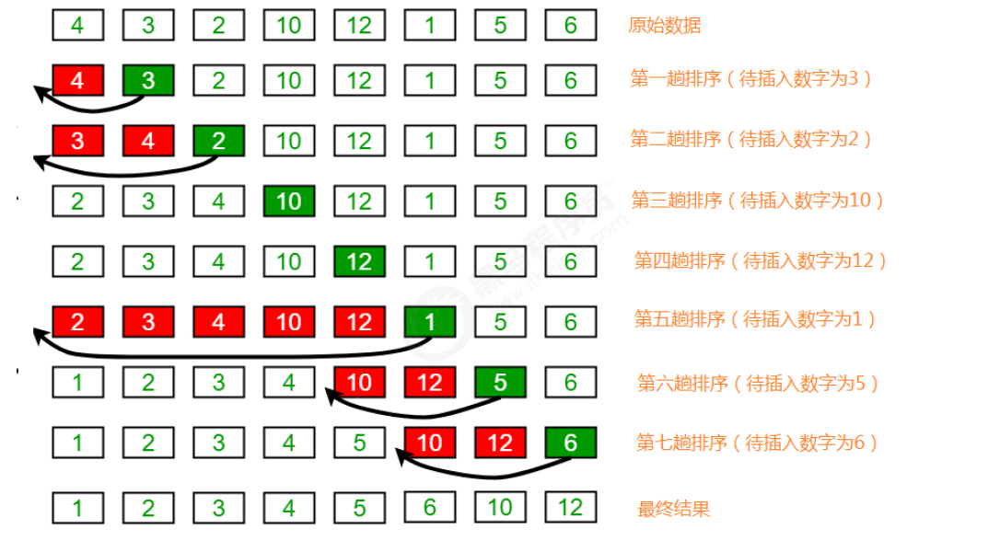
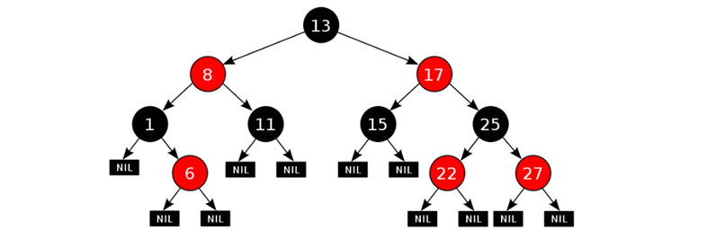

# ALG

## 递归

### 概述

算法：解题方案的准确而完整的描述，是一系列解决问题的清晰指令，代表着用系统的方法解决问题的策略机制

递归：程序调用自身的编程技巧

递归：

* 直接递归：自己的方法调用自己
* 间接递归：自己的方法调用别的方法，别的方法又调用自己

递归如果控制的不恰当，会形成递归的死循环，从而导致栈内存溢出错误


推荐阅读：https://time.geekbang.org/column/article/41440

参考书籍：《数据结构高分笔记》


***


### 算法

#### 核心思想

递归的三要素（理论）：

1. 递归的终结点
2. 递归的公式
3. 递归的方向：必须走向终结点

```java
//f(x)=f(x-1)+1;   f(1)=1;    f(10)=?
//1.递归的终结点： f(1)  = 1
//2.递归的公式：f(x) = f(x - 1) + 1
//3.递归的方向：必须走向终结点
public static int f(int x){
    if(x == 1){
        return 1;
    }else{
        return f(x-1) + 1;
    }
}
```


***


#### 公式转换

```java
//已知： f(x) = f(x + 1) + 2,  f(1) = 1。求：f(10) = ?
//公式转换
//f(x-1)=f(x-1+1)+2 => f(x)=f(x-1)+2
//（1）递归的公式：   f(n) = f(n-1)- 2 ;
//（2）递归的终结点：  f(1) = 1
//（3）递归的方向：必须走向终结点。
public static int f(int n){
    if(n == 1){
        return 1;
    }else{
        return f(n-1) - 2;
    }
}
```


#### 注意事项

以上理论只能针对于**规律化递归**，如果是非规律化是不能套用以上公式的！
非规律化递归的问题：文件搜索，啤酒问题。


***


### 应用

#### 猴子吃桃

猴子第一天摘了若干个桃子，当即吃了一半，觉得好不过瘾，然后又多吃了一个。第二天又吃了前一天剩下的一半，觉得好不过瘾，然后又多吃了一个。以后每天都是如此。等到第十天再吃的时候发现只有1个桃子，问猴子第一天总共摘了多少个桃子？

```java
/*
（1）公式： f(x+1)=f(x)-f(x)/2-1; ==> 2f(x+1) = f(x) - 2 ==> f(x)=2f(x+1)+2
（2）终结点：f(10) = 1
（3）递归的方向：走向了终结点
*/

public static int f(int x){
    if(x == 10){
        return 1;
    } else {
        return 2*f(x+1)+2
    }
}
```


***


#### 递归求和

```java
//（1）递归的终点接：f(1) = 1
//（2）递归的公式： f(n) = f(n-1) + n
//（3）递归的方向必须走向终结点：
public static int f(int n){
        if(n == 1 ) return 1;
        return f(n-1) + n;
}
```


****


#### 汉诺塔

```java
public class Hanoi {
    public static void main(String[] args) {
        hanoi('X', 'Y', 'Z', 3);
    }

    // 将n个块分治的从x移动到z，y为辅助柱
    private static void hanoi(char x, char y, char z, int n) {
        if (n == 1) {
            System.out.println(x + "→" + z);    //直接将x的块移动到z
        } else {
            hanoi(x, z, y, n - 1);           	//分治处理n-1个块，先将n-1个块借助z移到y
            System.out.println(x + "→" + z);    //然后将x最下面的块（最大的）移动到z
            hanoi(y, x, z, n - 1);           	//最后将n-1个块从y移动到z，x为辅助柱
        }
    }
}
```

时间复杂度 O(2^n)


****


#### 啤酒问题

非规律化递归问题。

啤酒2元一瓶，4个盖子可以换一瓶，2个空瓶可以换一瓶。

```java
public class BeerDemo{
    // 定义一个静态变量存储可以喝酒的总数
    public static int totalNum;
    public static int lastBottleNum;
    public static int lastCoverNum;
    public static void main(String[] args) {
        buyBeer(10);
        System.out.println("总数："+totalNum);
        System.out.println("剩余盖子："+ lastCoverNum);
        System.out.println("剩余瓶子："+ lastBottleNum);
    }
    public static void buyBeer(int money){
        int number = money / 2;
        totalNum += number;
        // 算出当前剩余的全部盖子和瓶子数，换算成金额继续购买。
        int currentBottleNum = lastBottleNum + number ;
        int currentCoverNum = lastCoverNum + number ;
        // 把他们换算成金额
        int totalMoney = 0 ;
        totalMoney += (currentBottleNum/2)*2;//除2代表可以换几个瓶子，乘2代表换算成钱，秒！
        lastBottleNum = currentBottleNum % 2 ;//取余//算出剩余的瓶子
     
        totalMoney += (currentCoverNum / 4) * 2;
        lastCoverNum = currentCoverNum % 4 ;

        // 继续拿钱买酒
        if(totalMoney >= 2){
            buyBeer(totalMoney);
        }
    }
}
```


***


## 排序

### 冒泡排序

冒泡排序（Bubble Sort）：两个数比较大小，较大的数下沉，较小的数冒起来

算法描述：每次从数组的第一个位置开始两两比较，把较大的元素与较小的元素进行层层交换，最终把当前最大的一个元素存入到数组当前的末尾

实现思路：

1. 确定总共需要冒几轮：数组的长度-1
2. 每轮两两比较几次


```java
// 0 1位置比较，大的放后面，然后1 2位置比较，大的继续放后面，一轮循环最后一位是最大值
public class BubbleSort {
    public static void main(String[] args) {
        int[] arr = {55, 22, 2, 5, 1, 3, 8, 5, 7, 4, 3, 99, 88};
        int flag;//标记本趟排序是否发生了交换
        //比较i和i+1，不需要再比最后一个位置
        for (int i = 0; i < arr.length - 1; i++) {
            flag = 0;
            //最后i位不需要比，已经排序好
            for (int j = 0; j < arr.length - 1 - i; j++) {
                if (arr[j] > arr[j + 1]) {
                    int temp = arr[j];
                    arr[j] = arr[j + 1];
                    arr[j + 1] = temp;
                    flag = 1;//发生了交换
                }
            }
            //没有发生交换，证明已经有序，不需要继续排序，节省时间
            if(flag == 0) {
                break;
            }
        }
        System.out.println(Arrays.toString(arr));
    }
}
```

冒泡排序时间复杂度：最坏情况

* 元素比较的次数为：`(N-1)+(N-2)+(N-3)+...+2+1=((N-1)+1)*(N-1)/2=N^2/2-N/2`
* 元素交换的次数为：`(N-1)+(N-2)+(N-3)+...+2+1=((N-1)+1)*(N-1)/2=N^2/2-N/2`
* 总执行次数为：`(N^2/2-N/2)+(N^2/2-N/2)=N^2-N`

按照大 O 推导法则，保留函数中的最高阶项那么最终冒泡排序的时间复杂度为 O(N^2)


***


### 选择排序

#### 简单选择

选择排序（Selection-sort）：一种简单直观的排序算法

算法描述：首先在未排序序列中找到最小（大）元素，存放到排序序列的起始位置，然后再从剩余未排序元素中继续寻找最小（大）元素，然后放到已排序序列的末尾。以此类推，直到所有元素均排序完毕

实现思路：

1. 控制选择几轮：数组的长度-1
2. 控制每轮从当前位置开始比较几次


```java
public class SelectSort {
    public static void main(String[] args) {
        int[] arr = {55, 22, 2, 5, 1, 3, 8, 5, 7, 4, 3, 99, 88};
        for (int i = 0; i < arr.length - 1; i++) {
            //获取最小索引位置
            int minIndex = i;
            for (int j = i + 1; j < arr.length; j++) {
                if (arr[minIndex] > arr[j]) {
                    minIndex = j;
                }
            }
            //交换元素
            int temp = arr[i];
            arr[i] = arr[minIndex];
            arr[minIndex] = temp;
        }
        System.out.println(Arrays.toString(arr));
    }
}
```

选择排序时间复杂度：

* 数据比较次数：`(N-1)+(N-2)+(N-3)+...+2+1=((N-1)+1)*(N-1)/2=N^2/2-N/2`
* 数据交换次数：`N-1`
* 时间复杂度：`N^2/2-N/2+（N-1）=N^2/2+N/2-1`

根据大 O 推导法则，保留最高阶项，去除常数因子，时间复杂度为 O(N^2)


***


#### 堆排序

堆排序（Heapsort）是指利用堆这种数据结构所设计的一种排序算法，堆结构是一个近似完全二叉树的结构，并同时满足子结点的键值或索引总是小于（或者大于）父节点

优先队列：堆排序每次上浮过程都会将最大或者最小值放在堆顶，应用于优先队列可以将优先级最高的元素浮到堆顶

实现思路：

1. 将初始待排序关键字序列（R1,R2….Rn）构建成大顶堆，并通过上浮对堆进行调整，此堆为初始的无序区，**堆顶为最大数**

2. 将堆顶元素 R[1] 与最后一个元素 R[n] 交换，此时得到新的无序区（R1,R2,……Rn-1）和新的有序区 Rn，且满足 R[1,2…n-1]<=R[n]

3. 交换后新的堆顶 R[1] 可能违反堆的性质，因此需要对当前无序区（R1,R2,……Rn-1）调整为新堆，然后再次将 R[1] 与无序区最后一个元素交换，得到新的无序区（R1,R2….Rn-2）和新的有序区（Rn-1,Rn），不断重复此过程直到有序区的元素个数为 n-1，则整个排序过程完成


floor：向下取整

```java
public class HeapSort {
    public static void main(String[] args) {
        int[] arr = {55, 22, 2, 5, 1, 3, 8, 5, 7, 4, 3, 99, 88};
        heapSort(arr, arr.length - 1);
        System.out.println(Arrays.toString(arr));
    }

    //high为数组最大索引
    private static void heapSort(int[] arr, int high) {
        //建堆，逆排序，因为堆排序定义的交换顺序是从当前结点往下交换，逆序排可以避免多余的交换
        //i初始值是最后一个节点的父节点，如果参数是数组长度len，则 i = len / 2 -1
        for (int i = (high - 1) / 2; i >= 0; i--) {
            //调整函数
            sift(arr, i, high);
        }
        //从尾索引开始排序
        for (int i = high; i > 0; i--) {
            //将最大的节点放入末尾
            int temp = arr[0];
            arr[0] = arr[i];
            arr[i] = temp;
            //继续寻找最大的节点
            sift(arr, 0, i - 1);
        }
    }

    //调整函数，调整arr[low]的元素，从索引low到high的范围调整
    private static void sift(int[] arr, int low, int high) {
        //暂存调整元素
        int temp = arr[low];
        int i = low, j = low * 2 + 1;//j是左节点
        while (j <= high) {
            //判断是否有右孩子，并且比较左右孩子中较大的节点
            if (j < high && arr[j] < arr[j + 1]) {
                j++;    //指向右孩子
            }
            if (temp < arr[j]) {
                arr[i] = arr[j];
                i = j;  //继续向下调整
                j = 2 * i + 1;
            } else {
                //temp > arr[j]，说明也大于j的孩子，探测结束
                break;
            }
        }
        //将被调整的节点放入最终的位置
        arr[i] = temp;
    }
}
```

堆排序的时间复杂度是 O(nlogn)


***


### 插入排序

#### 直接插入

插入排序（Insertion Sort）：在要排序的一组数中，假定前 n-1 个数已经排好序，现在将第 n 个数插到这个有序数列中，使得这 n 个数也是排好顺序的，如此反复循环，直到全部排好顺序



```java
public class InsertSort {
    public static void main(String[] args) {
        int[] arr = {55, 22, 2, 5, 1, 3, 8, 5, 7, 4, 3, 99, 88};
        for (int i = 1; i < arr.length; i++) {
            for (int j = i; j > 0; j--) {
                //比较索引j处的值和索引j-1处的值，
                //如果索引j-1处的值比索引j处的值大，则交换数据，
                //如果不大，那么就找到合适的位置了，退出循环即可；
                if (arr[j - 1] > arr[j]) {
                    int temp = arr[j];
                    arr[j] = arr[j - 1];
                    arr[j - 1] = temp;
                }
            }
        }
        System.out.println(Arrays.toString(arr));
    }
}
```

插入排序时间复杂度：

* 比较的次数为：`(N-1)+(N-2)+(N-3)+...+2+1=((N-1)+1)*(N-1)/2=N^2/2-N/2`
* 交换的次数为：`(N-1)+(N-2)+(N-3)+...+2+1=((N-1)+1)(N-1)/2=N^2/2-N/2`
* 总执行次数为：`(N^2/2-N/2)+(N^2/2-N/2)=N^2-N`

按照大 O 推导法则，保留函数中的最高阶项那么最终插入排序的时间复杂度为 O(N^2)


***


#### 希尔排序

希尔排序（Shell Sort）：也是一种插入排序，也称为缩小增量排序

实现思路：

1. 选定一个增长量 h，按照增长量 h 作为数据分组的依据，对数据进行分组
2. 对分好组的每一组数据完成插入排序
3. 减小增长量，最小减为 1，重复第二步操作


希尔排序的核心在于间隔序列的设定，既可以提前设定好间隔序列，也可以动态的定义间隔序列，希尔排序就是插入排序增加了间隔

```java
public class ShellSort {
    public static void main(String[] args) {
        int[] arr = {55, 22, 2, 5, 1, 3, 8, 5, 7, 4, 3, 99, 88};
        //1. 确定增长量h的初始值
        int h = 1;
        while (h < arr.length / 2) {
            h = 2 * h + 1;
        }
        //2. 希尔排序
        while (h >= 1) {
            //2.1 找到待插入的元素
            for (int i = h; i < arr.length; i++) {
                //2.2 把待插入的元素插到有序数列中
                for (int j = i; j >= h; j -= h) {
                    //待插入的元素是arr[j]，比较arr[j]和arr[j-h]
                    if (arr[j] < arr[j - h]) {
                        int temp = arr[j];
                        arr[j] = arr[j - h];
                        arr[j - h] = temp;
                    }
                }
            }
            //3. 减小h的值，减小规则为：
            h = h / 2;
        }
        System.out.println(Arrays.toString(arr));
    }
}
```

在希尔排序中，增长量 h 并没有固定的规则，有很多论文研究了各种不同的递增序列，但都无法证明某个序列是最好的，所以对于希尔排序的时间复杂度分析就认为 O(nlogn)


***


### 归并排序

#### 实现方式

归并排序（Merge Sort）：建立在归并操作上的一种有效的排序算法，该算法是采用分治法的典型的应用。将已有序的子序列合并，得到完全有序的序列；即先使每个子序列有序，再使子序列段间有序。若将两个有序表合并成一个有序表，称为二路归并。

实现思路：

1. 一组数据拆分成两个元素相等的子组，并对每一个子组继续拆分，直到拆分后的每个子组的元素个数是1为止
2. 将相邻的两个子组进行合并成一个有序的大组
3. 不断的重复步骤2，直到最终只有一个组为止


归并步骤：每次比较两端最小的值，把最小的值放在辅助数组的左边


***


#### 实现代码

```java
public class MergeSort {
    public static void main(String[] args) {
        int[] arr = new int[]{55, 22, 2, 5, 1, 3, 8, 5, 7, 4, 3, 99, 88};
        mergeSort(arr, 0, arr.length - 1);
        System.out.println(Arrays.toString(arr));
    }
	// low 为arr最小索引，high为最大索引
    public static void mergeSort(int[] arr, int low, int high) {
        // low == high 时说明只有一个元素了，直接返回
        if (low < high) {
            int mid = (low + high) / 2;
            mergeSort(arr, low, mid);		//归并排序前半段
            mergeSort(arr, mid + 1, high);	//归并排序后半段
            merge(arr, low, mid, high);		//将两段有序段合成一段有序段
        }
    }

    private static void merge(int[] arr, int low, int mid, int high) {
        int index = 0;
        //定义左右指针
        int left = low, right = mid + 1;
        int[] assist = new int[high - low + 1];
        
        while (left <= mid && right <= high) {
            assist[index++] = arr[left] < arr[right] ? arr[left++] : arr[right++];
        }
        while (left <= mid) {
            assist[index++] = arr[left++];
        }
        while (right <= high) {
            assist[index++] = arr[right++];
        }

        for (int k = 0; k < assist.length; k++) {
            arr[low++] = assist[k];
        }
    }
}
```


用树状图来描述归并，假设元素的个数为 n，那么使用归并排序拆分的次数为 `log2(n)`，即层数，每次归并需要做 n 次对比，最终得出的归并排序的时间复杂度为 `log2(n)*n`，根据大O推导法则，忽略底数，最终归并排序的时间复杂度为 O(nlogn)

归并排序的缺点：需要申请额外的数组空间，导致空间复杂度提升，是典型的**以空间换时间**的操作


****


### 快速排序

快速排序（Quick Sort）：通过**分治思想**对冒泡排序的改进，基本过程是通过一趟排序将要排序的数据分割成独立的两部分，其中一部分的所有数据都比另外一部分的所有数据都要小，然后再按此方法对这两部分数据分别进行快速排序，以此达到整个数据变成有序序列

实现思路：

1. 从数列中挑出一个元素，称为基准（pivot）
2. 重新排序数列，所有比基准值小的摆放在基准前面，所有比基准值大的摆在基准的后面（相同的数可以到任一边），在这个分区退出之后，该基准就处于数列的中间位置，这个称为分区（partition）操作；
3. 递归地（recursive）把小于基准值元素的子数列和大于基准值元素的子数列排序


```java
public class QuickSort {
    public static void main(String[] args) {
        int[] arr = {55, 22, 2, 5, 1, 3, 8, 5, 7, 4, 3, 99, 88};
        quickSort(arr, 0, arr.length - 1);
        System.out.println(Arrays.toString(arr));
    }

    public static void quickSort(int[] arr, int low, int high) {
        //递归结束的条件
        if (low >= high) {
            return;
        }
        
        int left = low;
        int right = high;
        
        int temp = arr[left];//基准数
        while (left < right) {
            // 用 >= 可以防止多余的交换
            while (arr[right] >= temp && right > left) {
                right--;
            }
            // 做判断防止相等
            if (right > left) {
                // 到这里说明 arr[right] < temp 
                arr[left] = arr[right];//此时把arr[right]元素视为空
                left++;
            }
            while (arr[left] <= temp && left < right) {
                left++;
            }
            if (right > left) {
                arr[right] = arr[left];
                right--;
            }
        }
        // left == right
        arr[left] = temp;
        quickSort(arr, low, left-1);
        quickSort(arr, right + 1, high);
    }
}
```

快速排序和归并排序的区别：

* 快速排序是另外一种分治的排序算法，将一个数组分成两个子数组，将两部分独立的排序
* 归并排序的处理过程是由下到上的，先处理子问题，然后再合并。而快排正好相反，它的处理过程是由上到下的，先分区，然后再处理子问题
* 快速排序和归并排序是互补的：归并排序将数组分成两个子数组分别排序，并将有序的子数组归并从而将整个数组排序，而快速排序的方式则是当两个数组都有序时，整个数组自然就有序了
* 在归并排序中，一个数组被等分为两半，归并调用发生在处理整个数组之前，在快速排序中，切分数组的位置取决于数组的内容，递归调用发生在处理整个数组之后

时间复杂度：

* 最优情况：每一次切分选择的基准数字刚好将当前序列等分。把数组的切分看做是一个树，共切分了 logn 次，所以，最优情况下快速排序的时间复杂度为 O(nlogn)

* 最坏情况：每一次切分选择的基准数字是当前序列中最大数或者最小数，这使得每次切分都会有一个子组，那么总共就得切分n次，所以最坏情况下，快速排序的时间复杂度为 O(n^2)

  

* 平均情况：每一次切分选择的基准数字不是最大值和最小值，也不是中值，这种情况用数学归纳法证明，快速排序的时间复杂度为 O(nlogn)


推荐视频：https://www.bilibili.com/video/BV1b7411N798?t=1001&p=81

参考文章：https://blog.csdn.net/nrsc272420199/article/details/82587933


****


### 基数排序

基数排序（Radix Sort）：又叫桶排序和箱排序，借助多关键字排序的思想对单逻辑关键字进行排序的方法

计数排序其实是桶排序的一种特殊情况，当要排序的 n 个数据，所处的范围并不大的时候，比如最大值是 k，我们就可以把数据划分成 k 个桶，每个桶内的数据值都是相同的，省掉了桶内排序的时间

按照低位先排序，然后收集；再按照高位排序，然后再收集；依次类推，直到最高位。有时候有些属性是有优先级顺序的，先按低优先级排序，再按高优先级排序。最后的次序就是高优先级高的在前，高优先级相同的低优先级高的在前

解释：先排低位再排高位，可以说明在高位相等的情况下低位是递增的，如果高位也是递增，则数据有序


实现思路：

- 获得最大数的位数，可以通过将最大数变为String类型，再求长度
- 将所有待比较数值（正整数）统一为同样的数位长度，**位数较短的数前面补零**
- 从最低位开始，依次进行一次排序
- 从最低位排序一直到最高位（个位 → 十位 → 百位 → … →最高位）排序完成以后，数列就变成一个有序序列

```java
public class BucketSort {
    public static void main(String[] args) {
        int[] arr = new int[]{576, 22, 26, 548, 1, 3, 843, 536, 735, 43, 3, 912, 88};
        bucketSort(arr);
        System.out.println(Arrays.toString(arr));
    }

    private static void bucketSort(int[] arr) {
        // 桶的个数固定为10个（个位是0~9），数组长度为了防止所有的数在同一行
        int[][] bucket = new int[10][arr.length];
        //记录每个桶中的有多少个元素
        int[] elementCounts = new int[10];

        //获取数组的最大元素
        int max = arr[0];
        for (int i = 1; i < arr.length; i++) {
            max = max > arr[i] ? max : arr[i];
        }
        String maxEle = Integer.toString(max);
        //将数组中的元素放入桶中，最大数的位数相当于需要几次放入桶中
        for (int i = 0, step = 1; i < maxEle.length(); i++, step *= 10) {
            for (int j = 0; j < arr.length; j++) {
                //获取最后一位的数据，也就是索引
                int index = (arr[j] / step) % 10;
                //放入具体位置
                bucket[index][elementCounts[index]] = arr[j];
                //存储每个桶的数量
                elementCounts[index]++;
            }
            //收集回数组
            for (int j = 0, index = 0; j < 10; j++) {
                //先进先出
                int position = 0;
                //桶中有元素就取出
                while (elementCounts[j] > 0) {
                    arr[index] = bucket[j][position];
                    elementCounts[j]--;
                    position++;
                    index++;
                }
            }
        }
    }
}
```

空间换时间


推荐视频：https://www.bilibili.com/video/BV1b7411N798?p=86

参考文章：https://www.toutiao.com/a6593273307280179715/?iid=6593273307280179715


***


### 算法总结

#### 稳定性

稳定性：在待排序的记录序列中，存在多个具有相同的关键字的记录，若经过排序，这些记录的相对次序保持不变，即在原序列中 `r[i]=r[j]`，且 r[i] 在 r[j] 之前，而在排序后的序列中，r[i] 仍在 r[j] 之前，则称这种排序算法是稳定的，否则称为不稳定的

如果一组数据只需要一次排序，则稳定性一般是没有意义的，如果一组数据需要多次排序，稳定性是有意义的。


* 冒泡排序：只有当 `arr[i]>arr[i+1]` 的时候，才会交换元素的位置，而相等的时候并不交换位置，所以冒泡排序是一种稳定排序算法
* 选择排序：是给每个位置选择当前元素最小的，例如有数据{5(1)，8 ，5(2)， 3， 9 }，第一遍选择到的最小元素为3，所以5(1)会和3进行交换位置，此时5(1)到了5(2)后面，破坏了稳定性，所以是不稳定的排序算法
* 插入排序：比较是从有序序列的末尾开始，也就是想要插入的元素和已经有序的最大者开始比起，如果比它大则直接插入在其后面，否则一直往前找直到找到它该插入的位置。如果碰见一个和插入元素相等的，那么把要插入的元素放在相等元素的后面。相等元素的前后顺序没有改变，从原无序序列出去的顺序就是排好序后的顺序，所以插入排序是稳定的
* 希尔排序：按照不同步长对元素进行插入排序，虽然一次插入排序是稳定的，但在不同的插入排序过程中，相同的元素可能在各自的插入排序中移动，最后其稳定性就会被打乱，所以希尔排序是不稳定的
* 归并排序在归并的过程中，只有 `arr[i]<arr[i+1]` 的时候才会交换位置，如果两个元素相等则不会交换位置，所以它并不会破坏稳定性，归并排序是稳定的
* 快速排序：快排需要一个基准值，在基准值的右侧找一个比基准值小的元素，在基准值的左侧找一个比基准值大的元素，然后交换这两个元素，此时会破坏稳定性，所以快速排序是一种不稳定的算法

记忆口诀：

* 情绪不稳定，快些选一堆好友来聊天

* 快：快速排序、些：希尔排序、选：选择排序、堆：堆排序


***


#### 算法对比


***


#### 补充问题

海量数据问题：

* 海量数据排序：
  * 外部排序：归并 + 败者树
  * 基数排序：https://time.geekbang.org/column/article/42038
* 海量数据查询：
  * 布隆过滤器判断是否存在
  * 构建索引：B+ 树、跳表


***


## 查找

正常查找：从第一个元素开始遍历，一个一个的往后找，综合查找比较耗时

二分查找也称折半查找（Binary Search）是一种效率较高的查找方法，数组必须是有序数组

过程：每次先与中间的元素进行比较，如果大于往右边找，如果小于往左边找，如果等于就返回该元素索引位置，如果没有该元素，返回 -1

时间复杂度：O(logn)

```java
/*定义一个方法，记录开始的索引位置和结束的索引位置。
取出中间索引位置的值，拿元素与中间位置的值进行比较，如果小于中间值，结束位置=中间索引-1.
取出中间索引位置的值，拿元素与中间位置的值进行比较，如果大于中间值，开始位置=中间索引+1.
循环正常执行的条件：开始位置索引<=结束位置索引。否则说明寻找完毕但是没有该元素值返回-1.*/
public class binarySearch {
    public static void main(String[] args) {
        int[] arr = {10, 14, 21, 38, 45, 47, 53, 81, 87, 99};
        System.out.println("81的索引是：" + binarySearch(arr,81));

    }

    public static int binarySearch(int[] arr, int des) {
        int start = 0;
        int end = arr.length - 1;

        // 确保不会出现重复查找，越界
        while (start <= end) {
            // 计算出中间索引值
            int mid = (start + end) / 2;
            if (des == arr[mid]) {
                return mid;
            } else if (des > arr[mid]) {
                start = mid + 1;
            } else if (des < arr[mid]) {
                end = mid - 1;
            }
        }
        // 如果上述循环执行完毕还没有返回索引，说明根本不存在该元素值，直接返回-1
        return -1;
    }
}
```


查找第一个匹配的元素：

```java
public static int binarySearch(int[] arr, int des) {
        int start = 0;
        int end = arr.length - 1;

        while (start <= end) {
            int mid = (start + end) / 2;
            if (des == arr[mid]) {
                //如果 mid 等于 0，那这个元素已经是数组的第一个元素，那肯定是我要找的
                if (mid == 0 || a[mid - 1] != des) {
                    return mid;
                } else {
                    //a[mid]前面的一个元素 a[mid-1]也等于 value，
                    //要找的元素肯定出现在[low, mid-1]之间
                    high = mid - 1
                }
            } else if (des > arr[mid]) {
                start = mid + 1;
            } else if (des < arr[mid]) {
                end = mid - 1;
            }
        }
        return -1;
    }
```


***


## 匹配

### BF

Brute Force 暴力匹配算法：

```java
public static void main(String[] args) {
    String s = "seazean";
    String t = "az";
    System.out.println(match(s,t));//2
}

public static int match(String s,String t) {
    int k = 0;
    int i = k, j = 0;
    //防止越界
    while (i < s.length() && j < t.length()) {
        if (s.charAt(i) == t.charAt(j)) {
            ++i;
            ++j;
        } else {
            k++;
            i = k;
            j = 0;
        }
    }
    //说明是匹配成功
    if (j >= t.length()) {
        return k;
    }
    return 0;
}
```

平均时间复杂度：O(m+n)，最坏时间复杂度：O(m*n)


***


### RK

把主串得长度记为 n，模式串得长度记为 m，通过哈希算法对主串中的 n-m+1 个子串分别求哈希值，然后逐个与模式串的哈希值比较大小，如果某个子串的哈希值与模式串相等，再去对比值是否相等（防止哈希冲突），那就说明对应的子串和模式串匹配了

因为哈希值是一个数字，数字之间比较是否相等是非常快速的

第一部分计算哈希值的时间复杂度为 O(n)，第二部分对比的时间复杂度为 O(1)，整体平均时间复杂度为 O(n)，最坏为 O(n*m)


***


### KMP

KMP 匹配：

* next 数组的核心就是自己匹配自己，主串代表后缀，模式串代表前缀
* nextVal 数组的核心就是回退失配

```java
public class Kmp {
    public static void main(String[] args) {
        String s = "acababaabc";
        String t = "abaabc";
        //[-1, 0, 0, 1, 1, 2]
        System.out.println(Arrays.toString(getNext(t)));
        //[-1, 0, -1, 1, 0, 2]
        System.out.println(Arrays.toString(getNextVal(t)));
        //5
        System.out.println(kmp(s, t));
    }

    private static int kmp(String s, String t) {
        int[] next = getNext(t);
        int i = 0, j = 0;
        while (i < s.length() && j < t.length()) {
            //j==-1时说明第一个位置匹配失败，所以将s的下一个和t的首字符比较
            if (j == -1 || s.charAt(i) == t.charAt(j)) {
                i++;
                j++;
            } else {
                //模式串右移，比较s的当前位置与t的next[j]位置
                j = next[j];
            }
        }
        if (j >= t.length()) {
            return i - j + 1;
        }
        return -1;
    }
	//next数组
    private static int[] getNext(String t) {
        int[] next = new int[t.length()];
        next[0] = -1;
        int j = -1;
        int i = 0;
        while (i < t.length() - 1) {
            // 根据已知的前j位推测第j+1位
            // j=-1说明首位就没有匹配，即t[0]!=t[i]，说明next[i+1]没有最大前缀，为0
            if (j == -1 || t.charAt(i) == t.charAt(j)) {
                // 因为模式串已经匹配到了索引j处，说明之前的位都是相等的
                // 因为是自己匹配自己，所以模式串就是前缀，主串就是后缀，j就是最长公共前缀
                // 当i+1位置不匹配时（i位之前匹配），可以跳转到j+1位置对比，next[i+1]=j+1
                i++;
                j++;
                next[i] = j;
            } else {
                //i位置的数据和j位置的不相等，所以回退对比i和next[j]位置的数据
                j = next[j];
            }

        }
        return next;
    }
	//nextVal
    private static int[] getNextVal(String t) {
        int[] nextVal = new int[t.length()];
        nextVal[0] = -1;
        int j = -1;
        int i = 0;
        while (i < t.length() - 1) {
            if (j == -1 || t.charAt(i) == t.charAt(j)) {
                i++;
                j++;
                // 如果t[i+1] == t[next(i+1)]=next[j+1]，回退后仍然失配，所以要继续回退
                if (t.charAt(i) == t.charAt(j)) {
                    nextVal[i] = nextVal[j];
                } else {
                    nextVal[i] = j;
                }
            } else {
                j = nextVal[j];
            }
        }
        return nextVal;
    }
}
```

平均和最坏时间复杂度都是 O(m+n)


参考文章：https://www.cnblogs.com/tangzhengyue/p/4315393.html


***


## 树

### 二叉树

二叉树中，任意一个节点的度要小于等于 2

+ 节点：在树结构中,每一个元素称之为节点
+ 度：每一个节点的子节点数量称之为度


****


### 排序树

#### 存储结构

二叉排序树（BST），又称二叉查找树或者二叉搜索树

+ 每一个节点上最多有两个子节点
+ 左子树上所有节点的值都小于根节点的值
+ 右子树上所有节点的值都大于根节点的值
+ 不存在重复的节点


***


#### 代码实现

* 节点类：

  ```java
  private static class TreeNode {
      int key;
      TreeNode left;  //左节点
      TreeNode right; //右节点
  
      private TreeNode(int key) {
          this.key = key;
      }
  }
  ```

* 查找节点：

  ```java
   // 递归查找
  private static TreeNode search(TreeNode root, int key) {
      //递归结束的条件
      if (root == null) {
          return null;
      }
      if (key == root.key) {
          return root;
      } else if (key > root.key) {
          return search(root.right, key);
      } else {
          return search(root.left, key);
      }
  }
  
  // 非递归
  private static TreeNode search1(TreeNode root, int key) {
      while (root != null) {
          if (key == root.key) {
              return root;
          } else if (key > root.key) {
              root = root.right;
          } else {
              root = root.left;
          }
      }
      return null;
  }
  ```

* 插入节点：

  ```java
  private static int insert(TreeNode root, int key) {
      if (root == null) {
          root = new TreeNode(key);
          root.left = null;
          root.right = null;
          return 1;
      } else {
          if (key == root.key) {
              return 0;
          } else if (key > root.key) {
              return insert(root.right, key);
          } else {
              return insert(root.left, key);
          }
      }
  }
  ```

* 构造函数：

  ```java
  // 构造函数，返回根节点
  private static TreeNode createBST(int[] arr) {
      if (arr.length > 0) {
          TreeNode root = new TreeNode(arr[0]);
          for (int i = 1; i < arr.length; i++) {
              insert(root, arr[i]);
          }
          return root;
      }
      return null;
  }
  ```

* 删除节点：要删除节点12，先找到节点19，然后移动并替换节点12

  代码链接：https://leetcode-cn.com/submissions/detail/190232548/

  

参考视频：https://www.bilibili.com/video/BV1iJ411E7xW?t=756&p=86

图片来源：https://leetcode-cn.com/problems/delete-node-in-a-bst/solution/tu-jie-yi-dong-jie-dian-er-bu-shi-xiu-ga-edtn/


***


### 平衡树

平衡二叉树（AVL）的特点：

+ 二叉树左右两个子树的高度差不超过1
+ 任意节点的左右两个子树都是一颗平衡二叉树

平衡二叉树旋转：

+ 旋转触发时机：当添加一个节点之后，该树不再是一颗平衡二叉树

+ 平衡二叉树和二叉查找树对比结构图


+ 左旋：将根节点的右侧往左拉，原先的右子节点变成新的父节点，并把多余的左子节点出让，给已经降级的根节点当右子节点

  

* 右旋：将根节点的左侧往右拉，左子节点变成了新的父节点，并把多余的右子节点出让，给已经降级根节点当左子节点

  

推荐文章：https://pdai.tech/md/algorithm/alg-basic-tree-balance.html


***


### 红黑树

红黑树的特点：

* 每一个节点可以是红或者黑

+ 红黑树不是高度平衡的，它的平衡是通过"自己的红黑规则"进行实现的

红黑树的红黑规则有哪些：

1. 每一个节点或是红色的，或者是黑色的
2. 根节点必须是黑色
3. 如果一个节点没有子节点或者父节点，则该节点相应的指针属性值为 Nil，这些 Nil 视为叶节点，每个叶节点(Nil) 是黑色的
4. 如果某一个节点是红色，那么它的子节点必须是黑色（不能出现两个红色节点相连的情况）
5. 对每一个节点，从该节点到其所有后代叶节点的简单路径上，均包含相同数目的黑色节点

红黑树与 AVL 树的比较：

* AVL 树是更加严格的平衡，可以提供更快的查找速度，适用于读取**查找密集型任务**
* 红黑树只是做到近似平衡，并不是严格的平衡，红黑树的插入删除比 AVL 树更便于控制，红黑树更适合于**插入修改密集型任务**

- 红黑树整体性能略优于 AVL 树，AVL 树的旋转比红黑树的旋转多，更加难以平衡和调试，插入和删除的效率比红黑树慢




红黑树添加节点的默认颜色为红色，效率高


**红黑树添加节点后如何保持红黑规则：**

+ 根节点位置
  + 直接变为黑色
+ 非根节点位置
  + 父节点为黑色
    + 不需要任何操作,默认红色即可
  + 父节点为红色
    + 叔叔节点为红色
      1. 将"父节点"设为黑色,将"叔叔节点"设为黑色
      2. 将"祖父节点"设为红色
      3. 如果"祖父节点"为根节点,则将根节点再次变成黑色
    + 叔叔节点为黑色
      1. 将"父节点"设为黑色
      2. 将"祖父节点"设为红色
      3. 以"祖父节点"为支点进行旋转


***


### 并查集

#### 基本实现

并查集是一种树型的数据结构，有以下特点：

* 每个元素都唯一的对应一个结点
* 每一组数据中的多个元素都在同一颗树中
* 一个组中的数据对应的树和另外一个组中的数据对应的树之间没有任何联系
* 元素在树中并没有子父级关系的硬性要求


可以高效地进行如下操作：

* 查询元素 p 和元素 q 是否属于同一组
* 合并元素 p 和元素 q 所在的组

存储结构：


合并方式：


代码实现：

* 类实现：

  ```java
  public class UF {
      //记录节点元素和该元素所在分组的标识
      private int[] eleAndGroup;
      //记录分组的个数
      private int count;
  
      //初始化并查集
      public UF(int N) {
          //初始化分组数量
          this.count = N;
          //初始化eleAndGroup数量
          this.eleAndGroup = new int[N];
          //初始化eleAndGroup中的元素及其所在分组的标识符，eleAndGroup索引作为每个节点的元素
          //每个索引处的值就是该组的索引，就是该元素所在的组的标识符
          for (int i = 0; i < eleAndGroup.length; i++) {
              eleAndGroup[i] = i;
          }
      }
  
      //查询p所在的分组的标识符
      public int find(int p) {
          return eleAndGroup[p];
      }
  
      //判断并查集中元素p和元素q是否在同一分组中
      public boolean connect(int p, int q) {
          return find(p) == find(q);
      }
  
      //把p元素所在分组和q元素所在分组合并
      public void union(int p, int q) {
          //判断元素q和p是否已经在同一个分组中，如果已经在同一个分组中，则结束方法就可以了
          if (connect(p, q)) {
              return;
          }
          int pGroup = find(p);//找到p所在分组的标识符
          int qGroup = find(q);//找到q所在分组的标识符
  
          //合并组，让p所在组的 所有元素 的组标识符变为q所在分组的标识符
          for (int i = 0; i < eleAndGroup.length; i++) {
              if (eleAndGroup[i] == pGroup) {
                  eleAndGroup[i] = qGroup;
              }
          }
          //分组个数-1
          this.count--;
      }
  }
  ```

* 测试代码：

  ```java
  public static void main(String[] args) {
      //创建并查集对象
      UF uf = new UF(5);
      System.out.println(uf);
  
      //从控制台录入两个合并的元素，调用union方法合并，观察合并后并查集的分组
      Scanner sc = new Scanner(System.in);
  
      while (true) {
          System.out.println("输入第一个要合并的元素");
          int p = sc.nextInt();
          System.out.println("输入第二个要合并的元素");
          int q = sc.nextInt();
          if (uf.connect(p, q)) {
              System.out.println(p + "元素已经和" + q + "元素已经在同一个组");
              continue;
          }
          uf.union(p, q);
          System.out.println("当前并查集中还有：" + uf.count() + "个分组");
          System.out.println(uf);
          System.out.println("********************");
      }
  }
  ```

最坏情况下 union 算法的时间复杂度也是 O(N^2)


****


#### 优化实现

让每个索引处的节点都指向它的父节点，当 eleGroup[i] = i 时，说明 i 是根节点


```java
//查询p所在的分组的标识符，递归寻找父标识符，直到找到根节点
public int findRoot(int p) {
    while (p != eleAndGroup[p]) {
        p = eleAndGroup[p];
    }
    //p == eleGroup[p]，说明p是根节点
    return p;
}

//判断并查集中元素p和元素q是否在同一分组中
public boolean connect(int p, int q) {
    return findRoot(p) == findRoot(q);
}

//把p元素所在分组和q元素所在分组合并
public void union(int p, int q) {
    //找到p q对应的根节点
    int pRoot = findRoot(p);
    int qRoot = findRoot(q);
    if (pRoot == qRoot) {
        return;
    }
    //让p所在树的节点根节点为q的所在的根节点，只需要把根节点改一下，时间复杂度 O(1)
    eleAndGroup[pRoot] = qRoot;
    this.count-
}
```

平均时间复杂度为 O(N)，最坏时间复杂度是 O(N^2)


继续优化：路径压缩，保证每次把小树合并到大树

```java
public class UF_Tree_Weighted {
    private int[] eleAndGroup;
    private int count;
    private int[] size;//存储每一个根结点对应的树中的保存的节点的个数

    //初始化并查集
    public UF_Tree_Weighted(int N) {
        this.count = N;
        this.eleAndGroup = new int[N];
        for (int i = 0; i < eleAndGroup.length; i++) {
            eleAndGroup[i] = i;
        }
        this.size = new int[N];
        //默认情况下，size中每个索引处的值都是1
        for (int i = 0; i < size.length; i++) {
            size[i] = 1;
        }
    }
	//查询p所在的分组的标识符，父标识符
    public int findRoot(int p) {
        while (p != eleAndGroup[p]) {
            p = eleAndGroup[p];
        }
        return p;
    }

    //判断并查集中元素p和元素q是否在同一分组中
    public boolean connect(int p, int q) {
        return findRoot(p) == findRoot(q);
    }

    //把p元素所在分组和q元素所在分组合并
    public void union(int p, int q) {
        //找到p q对应的根节点
        int pRoot = findRoot(p);
        int qRoot = findRoot(q);
        if (pRoot == qRoot) {
            return;
        }
        //判断pRoot对应的树大还是qRoot对应的树大，最终需要把较小的树合并到较大的树中
        if (size[pRoot] < size[qRoot]) {
            eleAndGroup[pRoot] = qRoot;
            size[qRoot] += size[pRoot];
        } else {
            eleAndGroup[qRoot] = pRoot;
            size[pRoot] += size[qRoot];
        }
        //组的数量-1、
        this.count--;
    }
}
```


***


#### 应用场景

并查集存储的每一个整数表示的是一个大型计算机网络中的计算机：

* 可以通过 connected(int p, int q) 来检测该网络中的某两台计算机之间是否连通
* 可以调用 union(int p,int q) 使得 p 和 q 之间连通，这样两台计算机之间就可以通信

畅通工程：某省调查城镇交通状况，得到现有城镇道路统计表，表中列出了每条道路直接连通的城镇。省政府畅通工程的目标是使全省任何两个城镇间都可以实现交通，但不一定有直接的道路相连，只要互相间接通过道路可达即可，问最少还需要建设多少条道路？


解题思路：

1. 创建一个并查集 UF_Tree_Weighted(20)
2. 分别调用 union(0,1)、union(6,9)、union(3,8)、union(5,11)、union(2,12)、union(6,10)、union(4,8)，表示已经修建好的道路把对应的城市连接起来
3. 如果城市全部连接起来，那么并查集中剩余的分组数目为 1，所有的城市都在一个树中，只需要获取当前并查集中剩余的数目减去 1，就是还需要修建的道路数目

```java
public static void main(String[] args)throws Exception {
    Scanner sc = new Scanner(System.in);
    //读取城市数目，初始化并查集
    int number = sc.nextInt();
    //读取已经修建好的道路数目
    int roadNumber = sc.nextInt();
    UF_Tree_Weighted uf = new UF_Tree_Weighted(number);
    //循环读取已经修建好的道路，并调用union方法
    for (int i = 0; i < roadNumber; i++) {
        int p = sc.nextInt();
        int q = sc.nextInt();
        uf.union(p,q);
    }
    //获取剩余的分组数量
    int groupNumber = uf.count();
    //计算出还需要修建的道路
    System.out.println("还需要修建"+(groupNumber-1)+"道路，城市才能相通");
}
```


参考视频：https://www.bilibili.com/video/BV1iJ411E7xW?p=142


***


### 字典树

#### 基本介绍

Trie 树，也叫字典树，是一种专门处理字符串匹配的树形结构，用来解决在一组字符串集合中快速查找某个字符串的问题，Trie 树的本质就是利用字符串之间的公共前缀，将重复的前缀合并在一起

* 根节点不包含任何信息
* 每个节点表示一个字符串中的字符，从**根节点到红色节点的一条路径表示一个字符串**
* 红色节点并不都是叶子节点


注意：要查找的是字符串“he”，从根节点开始，沿着某条路径来匹配，可以匹配成功。但是路径的最后一个节点“e”并不是红色的，也就是说，“he”是某个字符串的前缀子串，但并不能完全匹配任何字符串


***


#### 实现Trie

通过一个下标与字符一一映射的数组，来存储子节点的指针


时间复杂度是 O(n)（n 表示要查找字符串的长度）

```java
public class Trie {
    private TrieNode root = new TrieNode('/');

    //插入一个字符
    public void insert(char[] chars) {
        TrieNode p = root;
        for (int i = 0; i < chars.length; i++) {
            //获取字符的索引位置
            int index = chars[i] - 'a';
            if (p.children[index] == null) {
                TrieNode node = new TrieNode(chars[i]);
                p.children[index] = node;
            }
            p = p.children[index];
        }
        p.isEndChar = true;
    }

    //查找一个字符串
    public boolean find(char[] chars) {
        TrieNode p = root;
        for (int i = 0; i < chars.length; i++) {
            int index = chars[i] - 'a';
            if (p.children[index] == null) {
                return false;
            }
            p = p.children[index];
        }
        if (p.isEndChar) {
            //完全匹配
            return true;
        } else {
            // 不能完全匹配，只是前缀
            return false;
        }
    }


    private class TrieNode {
        char data;
        TrieNode[] children = new TrieNode[26];//26个英文字母
        boolean isEndChar = false;//结尾字符为true
        public TrieNode(char data) {
            this.data = data;
        }
    }
}
```


***


#### 优化Trie

Trie 树是非常耗内存，采取空间换时间的思路。Trie 树的变体有很多，可以在一定程度上解决内存消耗的问题。比如缩点优化，对只有一个子节点的节点，而且此节点不是一个串的结束节点，可以将此节点与子节点合并


参考文章：https://time.geekbang.org/column/article/72414


***


## 图

图的邻接表形式：

```java
public class AGraph {
    private VertexNode[] adjList;   //邻接数组
    private int vLen, eLen;         //顶点数和边数

    public AGraph(int vLen, int eLen) {
        this.vLen = vLen;
        this.eLen = eLen;
        adjList = new VertexNode[vLen];
    }
    //弧节点
    private class ArcNode {
        int adjVex;         //该边所指向的顶点的位置
        ArcNode nextArc;    //下一条边（弧）
        //int info  		//添加权值

        public ArcNode(int adjVex) {
            this.adjVex = adjVex;
            nextArc = null;
        }
    }

    //表顶点
    private class VertexNode {
        char data;      	//顶点信息
        ArcNode firstArc;  	//指向第一条边的指针

        public VertexNode(char data) {
            this.data = data;
            firstArc = null;
        }
    }
}
```

图的邻接矩阵形式：

```java
public class MGraph {
    private int[][] edges;      //邻接矩阵定义，有权图将int改为float
    private int vLen;           //顶点数
    private int eLen;           //边数
    private VertexNode[] vex;   //存放节点信息

    public MGraph(int vLen, int eLen) {
        this.vLen = vLen;
        this.eLen = eLen;
        this.edges = new int[vLen][vLen];
        this.vex = new VertexNode[vLen];
    }

    private class VertexNode {
        int num;    //顶点编号
        String info;  //顶点信息

        public VertexNode(int num) {
            this.num = num;
            this.info = null;
        }
    }
}
```


图相关的算法需要很多的流程图，此处不再一一列举，推荐参考书籍《数据结构高分笔记》


***


## 位图

### 基本介绍

布隆过滤器：一种数据结构，是一个很长的二进制向量（位数组）和一系列随机映射函数（哈希函数），既然是二进制，每个空间存放的不是 0 就是 1，但是初始默认值都是 0，所以布隆过滤器不存数据只存状态


这种数据结构是高效且性能很好的，但缺点是具有一定的错误识别率和删除难度。并且理论情况下，添加到集合中的元素越多，误报的可能性就越大


***


### 工作流程

向布隆过滤器中添加一个元素 key 时，会通过多个 hash 函数得到多个哈希值，在位数组中把对应下标的值置为 1


布隆过滤器查询一个数据，是否在二进制的集合中，查询过程如下：

- 通过 K 个哈希函数计算该数据，对应计算出的 K 个hash值
- 通过 hash 值找到对应的二进制的数组下标
- 判断方法：如果存在一处位置的二进制数据是 0，那么该数据一定不存在。如果都是 1，则认为数据存在集合中（会误判）

布隆过滤器优缺点：

* 优点：
  * 二进制组成的数组，占用内存极少，并且插入和查询速度都足够快
  * 去重方便：当字符串第一次存储时对应的位数组下标设置为 1，当第二次存储相同字符串时，因为对应位置已设置为 1，所以很容易知道此值已经存在
* 缺点：
  * 随着数据的增加，误判率会增加：添加数据是通过计算数据的 hash 值，不同的字符串可能哈希出来的位置相同，导致无法确定到底是哪个数据存在，**这种情况可以适当增加位数组大小或者调整哈希函数**
  * 无法删除数据：可能存在几个数据占据相同的位置，所以删除一位会导致很多数据失效

* 总结：**布隆过滤器判断某个元素存在，小概率会误判。如果判断某个元素不在，那这个元素一定不在**


参考文章：https://www.cnblogs.com/ysocean/p/12594982.html


***


### Guava

引入 Guava 的依赖：

```xml
<dependency>
    <groupId>com.google.guava</groupId>
    <artifactId>guava</artifactId>
    <version>28.0-jre</version>
</dependency>
```

指定误判率为（0.01）：

```java
public static void main(String[] args) {
    // 创建布隆过滤器对象
    BloomFilter<Integer> filter = BloomFilter.create(
        Funnels.integerFunnel(),
        1500,
        0.01);
    // 判断指定元素是否存在
    System.out.println(filter.mightContain(1));
    System.out.println(filter.mightContain(2));
    // 将元素添加进布隆过滤器
    filter.put(1);
    filter.put(2);
    System.out.println(filter.mightContain(1));
    System.out.println(filter.mightContain(2));
}
```


***


### 实现布隆

```java
class MyBloomFilter {
    //布隆过滤器容量
    private static final int DEFAULT_SIZE = 2 << 28;
    //bit数组，用来存放key
    private static BitSet bitSet = new BitSet(DEFAULT_SIZE);
    //后面hash函数会用到，用来生成不同的hash值，随意设置
    private static final int[] ints = {1, 6, 16, 38, 58, 68};

    //add方法，计算出key的hash值，并将对应下标置为true
    public void add(Object key) {
        Arrays.stream(ints).forEach(i -> bitSet.set(hash(key, i)));
    }

    //判断key是否存在，true不一定说明key存在，但是false一定说明不存在
    public boolean isContain(Object key) {
        boolean result = true;
        for (int i : ints) {
            //短路与，只要有一个bit位为false，则返回false
            result = result && bitSet.get(hash(key, i));
        }
        return result;
    }

    //hash函数，借鉴了hashmap的扰动算法
    private int hash(Object key, int i) {
        int h;
        return key == null ? 0 : (i * (DEFAULT_SIZE - 1) & ((h = key.hashCode()) ^ (h >>> 16)));
    }
}

```