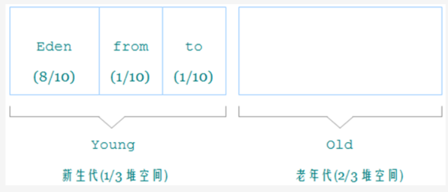
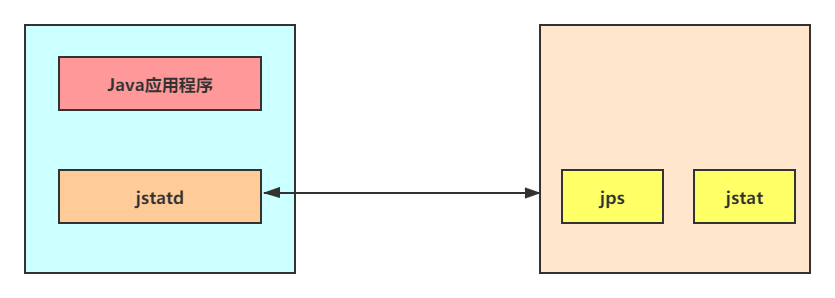

***


# JVM

## JVM概述

### 基本介绍

JVM：全称 Java Virtual Machine，即 Java 虚拟机，一种规范，本身是一个虚拟计算机，直接和操作系统进行交互，与硬件不直接交互，而操作系统可以帮我们完成和硬件进行交互的工作

特点：

* Java 虚拟机基于**二进制字节码**执行，由一套字节码指令集、一组寄存器、一个栈、一个垃圾回收堆、一个方法区等组成
* JVM 屏蔽了与操作系统平台相关的信息，从而能够让 Java 程序只需要生成能够在 JVM 上运行的字节码文件，通过该机制实现的**跨平台性**

Java 代码执行流程：java程序 --（编译）--> 字节码文件 --（解释执行）--> 操作系统（Win，Linux）

JVM 结构：


JVM、JRE、JDK对比：


参考视频：https://www.bilibili.com/video/BV1PJ411n7xZ

参考视频：https://www.bilibili.com/video/BV1yE411Z7AP


***


### 架构模型

Java 编译器输入的指令流是一种基于栈的指令集架构。因为跨平台的设计，Java 的指令都是根据栈来设计的，不同平台 CPU 架构不同，所以不能设计为基于寄存器架构

* 基于栈式架构的特点：
  * 设计和实现简单，适用于资源受限的系统
  * 使用零地址指令方式分配，执行过程依赖操作栈，指令集更小，编译器容易实现
    * 零地址指令：机器指令的一种，是指令系统中的一种不设地址字段的指令，只有操作码而没有地址码。这种指令有两种情况：一是无需操作数，另一种是操作数为默认的（隐含的），默认为操作数在寄存器（ACC）中，指令可直接访问寄存器
    * 一地址指令：一个操作码对应一个地址码，通过地址码寻找操作数
  * 不需要硬件的支持，可移植性更好，更好实现跨平台
* 基于寄存器架构的特点：
  * 需要硬件的支持，可移植性差
  * 性能更好，执行更高效，寄存器比内存快
  * 以一地址指令、二地址指令、三地址指令为主


***


### 生命周期

JVM 的生命周期分为三个阶段，分别为：启动、运行、死亡。

- **启动**：当启动一个 Java 程序时，通过引导类加载器（bootstrap class loader）创建一个初始类（initial class），对于拥有 main 函数的类就是 JVM 实例运行的起点
- **运行**：
  
  - main() 方法是一个程序的初始起点，任何线程均可由在此处启动
  - 在 JVM 内部有两种线程类型，分别为：用户线程和守护线程，**JVM 使用的是守护线程，main() 和其他线程使用的是用户线程**，守护线程会随着用户线程的结束而结束
  - 执行一个 Java 程序时，真真正正在执行的是一个 Java 虚拟机的进程
  - JVM 有两种运行模式 Server 与 Client，两种模式的区别在于：Client 模式启动速度较快，Server 模式启动较慢；但是启动进入稳定期长期运行之后 Server 模式的程序运行速度比 Client 要快很多
  
    Server 模式启动的 JVM 采用的是重量级的虚拟机，对程序采用了更多的优化；Client 模式启动的 JVM 采用的是轻量级的虚拟机
- **死亡**：
  
  - 当程序中的用户线程都中止，JVM 才会退出
  - 程序正常执行结束、程序异常或错误而异常终止、操作系统错误导致终止
  - 线程调用 Runtime 类 halt 方法或 System 类 exit 方法，并且 java 安全管理器允许这次 exit 或 halt 操作


***


## 内存结构

### 内存概述

内存结构是 JVM 中非常重要的一部分，是非常重要的系统资源，是硬盘和 CPU 的中间仓库及桥梁，承载着操作系统和应用程序的实时运行，又叫运行时数据区

JVM 内存结构规定了 Java 在运行过程中内存申请、分配、管理的策略，保证了 JVM 的高效稳定运行

* Java1.8 以前的内存结构图：
  

* Java1.8 之后的内存结果图：

  

线程运行诊断：

* 定位：jps 定位进程 id
* jstack 进程 id：用于打印出给定的 java 进程 ID 或 core file 或远程调试服务的 Java 堆栈信息

常见OOM错误：

* java.lang.StackOverflowError
* java.lang.OutOfMemoryError：java heap space
* java.lang.OutOfMemoryError：GC overhead limit exceeded
* java.lang.OutOfMemoryError：Direct buffer memory
* java.lang.OutOfMemoryError：unable to create new native thread
* java.lang.OutOfMemoryError：Metaspace


***


### JVM内存

#### 虚拟机栈

##### Java栈

Java 虚拟机栈：Java Virtual Machine Stacks，**每个线程**运行时所需要的内存

* 每个方法被执行时，都会在虚拟机栈中创建一个栈帧 stack frame（**一个方法一个栈帧**）

* Java 虚拟机规范允许 **Java 栈的大小是动态的或者是固定不变的**

* 虚拟机栈是**每个线程私有的**，每个线程只能有一个活动栈帧，对应方法调用到执行完成的整个过程

* 每个栈由多个栈帧（Frame）组成，对应着每次方法调用时所占用的内存，每个栈帧中存储着：

  * 局部变量表：存储方法里的java基本数据类型以及对象的引用
  * 动态链接：也叫指向运行时常量池的方法引用
  * 方法返回地址：方法正常退出或者异常退出的定义
  * 操作数栈或表达式栈和其他一些附加信息
  
  

设置栈内存大小：`-Xss size`   `-Xss 1024k`

* 在 JDK 1.4 中默认为 256K，而在 JDK 1.5+ 默认为 1M

虚拟机栈特点：

* 栈内存**不需要进行GC**，方法开始执行的时候会进栈，方法调用后自动弹栈，相当于清空了数据

* 栈内存分配越大越大，可用的线程数越少（内存越大，每个线程拥有的内存越大）

* 方法内的局部变量是否**线程安全**：
  * 如果方法内局部变量没有逃离方法的作用访问，它是线程安全的（逃逸分析）
  * 如果是局部变量引用了对象，并逃离方法的作用范围，需要考虑线程安全

异常：

* 栈帧过多导致栈内存溢出 （超过了栈的容量），会抛出 OutOfMemoryError 异常
* 当线程请求的栈深度超过最大值，会抛出 StackOverflowError 异常


***


##### 局部变量

局部变量表也被称之为局部变量数组或本地变量表，本质上定义为一个数字数组，主要用于存储方法参数和定义在方法体内的局部变量

* 表是建立在线程的栈上，是线程私有的数据，因此不存在数据安全问题
* 表的容量大小是在编译期确定的，保存在方法的 Code 属性的 maximum local variables 数据项中
* 表中的变量只在当前方法调用中有效，方法结束栈帧销毁，局部变量表也会随之销毁
* 表中的变量也是重要的垃圾回收根节点，只要被表中数据直接或间接引用的对象都不会被回收

局部变量表最基本的存储单元是 **slot（变量槽）**：

* 参数值的存放总是在局部变量数组的 index0 开始，到数组长度 -1 的索引结束，JVM 为每一个 slot 都分配一个访问索引，通过索引即可访问到槽中的数据
* 存放编译期可知的各种基本数据类型（8种），引用类型（reference），returnAddress 类型的变量
* 32 位以内的类型只占一个 slot（包括 returnAddress 类型），64 位的类型（long 和 double）占两个 slot
* 局部变量表中的槽位是可以**重复利用**的，如果一个局部变量过了其作用域，那么之后申明的新的局部变量就可能会复用过期局部变量的槽位，从而达到节省资源的目的


***


##### 操作数栈

栈：可以使用数组或者链表来实现

操作数栈：在方法执行过程中，根据字节码指令，往栈中写入数据或提取数据，即入栈（push）或出栈（pop）

* 保存计算过程的中间结果，同时作为计算过程中变量临时的存储空间，是执行引擎的一个工作区

* Java 虚拟机的解释引擎是基于栈的执行引擎，其中的栈指的就是操作数栈
* 如果被调用的方法带有返回值的话，其**返回值将会被压入当前栈帧的操作数栈中**

栈顶缓存技术 ToS（Top-of-Stack Cashing）：将栈顶元素全部缓存在 CPU 的寄存器中，以此降低对内存的读/写次数，提升执行的效率

基于栈式架构的虚拟机使用的零地址指令更加紧凑，完成一项操作需要使用很多入栈和出栈指令，所以需要更多的指令分派（instruction dispatch）次数和内存读/写次数，由于操作数是存储在内存中的，因此频繁地执行内存读/写操作必然会影响执行速度，所以需要栈顶缓存技术


***


##### 动态链接

动态链接是指向运行时常量池的方法引用，涉及到栈操作已经是类加载完成，这个阶段的解析是**动态绑定**

* 为了支持当前方法的代码能够实现动态链接，每一个栈帧内部都包含一个指向运行时常量池或该栈帧所属方法的引用

  

* 在 Java 源文件被编译成字节码文件中，所有的变量和方法引用都作为符号引用保存在 class 的常量池中
  
  常量池的作用：提供一些符号和常量，便于指令的识别
  
  


***


##### 返回地址

Return Address：存放调用该方法的 PC 寄存器的值

方法的结束有两种方式：正常执行完成、出现未处理的异常，在方法退出后都返回到该方法被调用的位置

* 正常：调用者的 pc 计数器的值作为返回地址，即调用该方法的指令的**下一条指令的地址**
* 异常：返回地址是要通过异常表来确定

正常完成出口：执行引擎遇到任意一个方法返回的字节码指令（return），会有返回值传递给上层的方法调用者

异常完成出口：方法执行的过程中遇到了异常（Exception），并且这个异常没有在方法内进行处理，本方法的异常表中没有搜素到匹配的异常处理器，导致方法退出

两者区别：通过异常完成出口退出的不会给上层调用者产生任何的返回值


##### 附加信息

栈帧中还允许携带与 Java 虚拟机实现相关的一些附加信息，例如对程序调试提供支持的信息


***


#### 本地方法栈

本地方法栈是为虚拟机执行本地方法时提供服务的

JNI：Java Native Interface，通过使用 Java 本地接口书写程序，可以确保代码在不同的平台上方便移植

* 不需要进行GC，与虚拟机栈类似，也是线程私有的，有 StackOverFlowError 和 OutOfMemoryError 异常

* 虚拟机栈执行的是 Java 方法，在 HotSpot JVM 中，直接将本地方法栈和虚拟机栈合二为一

* 本地方法一般是由其他语言编写，并且被编译为基于本机硬件和操作系统的程序

* 当某个线程调用一个本地方法时，就进入了不再受虚拟机限制的世界，和虚拟机拥有同样的权限

  * 本地方法可以通过本地方法接口来**访问虚拟机内部的运行时数据区**
  * 直接从本地内存的堆中分配任意数量的内存
  * 可以直接使用本地处理器中的寄存器
  
  
  
  

图片来源：https://github.com/CyC2018/CS-Notes/blob/master/notes/Java%20%E8%99%9A%E6%8B%9F%E6%9C%BA.md


***


#### 程序计数器

Program Counter Register 程序计数器（寄存器）

作用：内部保存字节码的行号，用于记录正在执行的字节码指令地址（如果正在执行的是本地方法则为空）

原理：

* JVM 对于多线程是通过线程轮流切换并且分配线程执行时间，一个处理器只会处理执行一个线程
* 切换线程需要从程序计数器中来回去到当前的线程上一次执行的行号

特点：

* 是线程私有的
* **不会存在内存溢出**，是 JVM 规范中唯一一个不出现 OOM 的区域，所以这个空间不会进行 GC

Java 反编译指令：`javap -v Test.class`

#20：代表去 Constant pool 查看该地址的指令

```java
0: getstatic #20 		// PrintStream out = System.out;
3: astore_1 			// --
4: aload_1 				// out.println(1);
5: iconst_1 			// --
6: invokevirtual #26 	// --
9: aload_1 				// out.println(2);
10: iconst_2 			// --
11: invokevirtual #26 	// --
```


****


#### 堆

Heap 堆：是 JVM 内存中最大的一块，由所有线程共享，由垃圾回收器管理的主要区域，堆中对象大部分都需要考虑线程安全的问题

存放哪些资源：

* 对象实例：类初始化生成的对象，**基本数据类型的数组也是对象实例**，new 创建对象都使用堆内存
* 字符串常量池：
  * 字符串常量池原本存放于方法区，jdk7 开始放置于堆中
  * 字符串常量池**存储的是 String 对象的直接引用或者对象**，是一张 string table
* 静态变量：静态变量是有 static 修饰的变量，jdk7 时从方法区迁移至堆中
* 线程分配缓冲区 Thread Local Allocation Buffer：线程私有但不影响堆的共性，可以提升对象分配的效率

设置堆内存指令：`-Xmx Size`

内存溢出：new 出对象，循环添加字符数据，当堆中没有内存空间可分配给实例，也无法再扩展时，就会抛出 OutOfMemoryError 异常

堆内存诊断工具：（控制台命令）

1. jps：查看当前系统中有哪些 java 进程
2. jmap：查看堆内存占用情况 `jhsdb jmap --heap --pid 进程id`
3. jconsole：图形界面的，多功能的监测工具，可以连续监测

在 Java7 中堆内会存在**年轻代、老年代和方法区（永久代）**：

* Young 区被划分为三部分，Eden 区和两个大小严格相同的 Survivor 区。Survivor 区某一时刻只有其中一个是被使用的，另外一个留做垃圾回收时复制对象。在 Eden 区变满的时候， GC 就会将存活的对象移到空闲的 Survivor 区间中，根据 JVM 的策略，在经过几次垃圾回收后，仍然存活于 Survivor 的对象将被移动到 Tenured 区间
* Tenured 区主要保存生命周期长的对象，一般是一些老的对象，当一些对象在 Young 复制转移一定的次数以后，对象就会被转移到 Tenured 区
* Perm 代主要保存 Class、ClassLoader、静态变量、常量、编译后的代码，在 Java7 中堆内方法区会受到 GC 的管理

分代原因：不同对象的生命周期不同，70%-99% 的对象都是临时对象，优化 GC 性能

```java
public static void main(String[] args) {
    //返回Java虚拟机中的堆内存总量
    long initialMemory = Runtime.getRuntime().totalMemory() / 1024 / 1024;
    //返回Java虚拟机使用的最大堆内存量
    long maxMemory = Runtime.getRuntime().maxMemory() / 1024 / 1024;
    
    System.out.println("-Xms : " + initialMemory + "M");//-Xms : 245M
    System.out.println("-Xmx : " + maxMemory + "M");//-Xmx : 3641M
}
```


***


#### 方法区

方法区：是各个线程共享的内存区域，用于存储已被虚拟机加载的类信息、常量、即时编译器编译后的代码等数据，虽然 Java 虚拟机规范把方法区描述为堆的一个逻辑部分，但是也叫 Non-Heap（非堆）

方法区是一个 JVM 规范，**永久代与元空间都是其一种实现方式**

方法区的大小不必是固定的，可以动态扩展，加载的类太多，可能导致永久代内存溢出 (OutOfMemoryError)

方法区的 GC：针对常量池的回收及对类型的卸载，比较难实现

为了**避免方法区出现 OOM**，在 JDK8 中将堆内的方法区（永久代）移动到了本地内存上，重新开辟了一块空间，叫做元空间，元空间存储类的元信息，**静态变量和字符串常量池等放入堆中**

类元信息：在类编译期间放入方法区，存放了类的基本信息，包括类的方法、参数、接口以及常量池表

常量池表（Constant Pool Table）是 Class 文件的一部分，存储了类在编译期间生成的**字面量、符号引用**，JVM 为每个已加载的类维护一个常量池

- 字面量：基本数据类型、字符串类型常量、声明为 final 的常量值等
- 符号引用：类、字段、方法、接口等的符号引用

运行时常量池是方法区的一部分

* 常量池（编译器生成的字面量和符号引用）中的数据会在类加载的加载阶段放入运行时常量池
* 类在解析阶段将这些符号引用替换成直接引用
* 除了在编译期生成的常量，还允许动态生成，例如 String 类的 intern()


***


### 本地内存

#### 基本介绍

虚拟机内存：Java 虚拟机在执行的时候会把管理的内存分配成不同的区域，受虚拟机内存大小的参数控制，当大小超过参数设置的大小时就会报 OOM

本地内存：又叫做**堆外内存**，线程共享的区域，本地内存这块区域是不会受到 JVM 的控制的，不会发生 GC；因此对于整个 java 的执行效率是提升非常大，但是如果内存的占用超出物理内存的大小，同样也会报 OOM

本地内存概述图：


***


#### 元空间

PermGen 被元空间代替，永久代的**类信息、方法、常量池**等都移动到元空间区

元空间与永久代区别：元空间不在虚拟机中，使用的本地内存，默认情况下，元空间的大小仅受本地内存限制

方法区内存溢出：

* JDK1.8 以前会导致永久代内存溢出：java.lang.OutOfMemoryError: PerGen space

  ```sh
   -XX:MaxPermSize=8m		#参数设置
  ```
  
* JDK1.8 以后会导致元空间内存溢出：java.lang.OutOfMemoryError: Metaspace

  ```sh
  -XX:MaxMetaspaceSize=8m	#参数设置	
  ```

元空间内存溢出演示：

```java
public class Demo1_8 extends ClassLoader { // 可以用来加载类的二进制字节码
    public static void main(String[] args) {
        int j = 0;
        try {
            Demo1_8 test = new Demo1_8();
            for (int i = 0; i < 10000; i++, j++) {
                // ClassWriter 作用是生成类的二进制字节码
                ClassWriter cw = new ClassWriter(0);
                // 版本号， public， 类名, 包名, 父类， 接口
                cw.visit(Opcodes.V1_8, Opcodes.ACC_PUBLIC, "Class" + i, null, "java/lang/Object", null);
                // 返回 byte[]
                byte[] code = cw.toByteArray();
                // 执行了类的加载
                test.defineClass("Class" + i, code, 0, code.length); // Class 对象
            }
        } finally {
            System.out.println(j);
        }
    }
}
```


***


#### 直接内存

直接内存是 Java 堆外、直接向系统申请的内存区间，不是虚拟机运行时数据区的一部分，也不是《Java 虚拟机规范》中定义的内存区域


直接内存详解参考：NET → NIO → 直接内存


***


### 变量位置

变量的位置不取决于它是基本数据类型还是引用数据类型，取决于它的**声明位置**

静态内部类和其他内部类：

* **一个 class 文件只能对应一个 public 类型的类**，这个类可以有内部类，但不会生成新的 class 文件

* 静态内部类属于类本身，加载到方法区，其他内部类属于内部类的属性，加载到堆（待考证）

类变量：

* 类变量是用 static 修饰符修饰，定义在方法外的变量，随着 java 进程产生和销毁
* 在 java8 之前把静态变量存放于方法区，在 java8 时存放在堆中的静态变量区


实例变量：

* 实例（成员）变量是定义在类中，没有 static 修饰的变量，随着类的实例产生和销毁，是类实例的一部分
* 在类初始化的时候，从运行时常量池取出直接引用或者值，**与初始化的对象一起放入堆中**

局部变量：

* 局部变量是定义在类的方法中的变量
* 在所在方法被调用时**放入虚拟机栈的栈帧**中，方法执行结束后从虚拟机栈中弹出，

类常量池、运行时常量池、字符串常量池有什么关系？有什么区别？

* 类常量池与运行时常量池都存储在方法区，而字符串常量池在 jdk7 时就已经从方法区迁移到了 java 堆中
* 在类编译过程中，会把类元信息放到方法区，类元信息的其中一部分便是类常量池，主要存放字面量和符号引用，而字面量的一部分便是文本字符
* **在类加载时将字面量和符号引用解析为直接引用存储在运行时常量池**
* 对于文本字符，会在解析时查找字符串常量池，查出这个文本字符对应的字符串对象的直接引用，将直接引用存储在运行时常量池

什么是字面量？什么是符号引用？

* 字面量：java 代码在编译过程中是无法构建引用的，字面量就是在编译时对于数据的一种表示

  ```java
  int a = 1;				//这个1便是字面量
  String b = "iloveu";	//iloveu便是字面量
  ```

* 符号引用：在编译过程中并不知道每个类的地址，因为可能这个类还没有加载，如果在一个类中引用了另一个类，无法知道它的内存地址，只能用他的类名作为符号引用，在类加载完后用这个符号引用去获取内存地址


***


## 内存管理

### 内存分配

#### 两种方式

为对象分配内存：首先计算对象占用空间大小，接着在堆中划分一块内存给新对象

* 如果内存规整，使用指针碰撞（BumpThePointer）。所有用过的内存在一边，空闲的内存在另外一边，中间有一个指针作为分界点的指示器，分配内存就仅仅是把指针向空闲那边挪动一段与对象大小相等的距离
* 如果内存不规整，虚拟机需要维护一个空闲列表（Free List）分配。已使用的内存和未使用的内存相互交错，虚拟机维护了一个列表，记录上哪些内存块是可用的，再分配的时候从列表中找到一块足够大的空间划分给对象实例，并更新列表上的内容


***


#### 分代思想

##### 分代介绍

Java8 时，堆被分为了两份：新生代和老年代（1：2），在 Java7 时，还存在一个永久代

- 新生代使用：复制算法
- 老年代使用：标记 - 清除 或者 标记 - 整理 算法

**Minor GC 和 Full GC**：

- Minor GC：回收新生代，新生代对象存活时间很短，所以 Minor GC 会频繁执行，执行的速度比较快
- Full GC：回收老年代和新生代，老年代对象其存活时间长，所以 Full GC 很少执行，执行速度会比 Minor GC 慢很多

 Eden 和 Survivor 大小比例默认为 8:1:1




***


##### 分代分配

工作机制：

* **对象优先在 Eden 分配**：当创建一个对象的时候，对象会被分配在新生代的 Eden 区，当Eden 区要满了时候，触发 YoungGC
* 当进行 YoungGC 后，此时在 Eden 区存活的对象被移动到 to 区，并且当前对象的年龄会加 1，清空 Eden 区
* 当再一次触发 YoungGC 的时候，会把 Eden 区中存活下来的对象和 to 中的对象，移动到 from 区中，这些对象的年龄会加 1，清空 Eden 区和 to 区
* To 区永远是空 Survivor 区，From 区是有数据的，每次 MinorGC 后两个区域互换
* From 区和 To 区 也可以叫做 S0 区和 S1 区

晋升到老年代：

* **长期存活的对象进入老年代**：为对象定义年龄计数器，对象在 Eden 出生并经过 Minor GC 依然存活，将移动到 Survivor 中，年龄就增加 1 岁，增加到一定年龄则移动到老年代中
  
  `-XX:MaxTenuringThreshold`：定义年龄的阈值，对象头中用 4 个 bit 存储，所以最大值是 15，默认也是 15
* **大对象直接进入老年代**：需要连续内存空间的对象，最典型的大对象是很长的字符串以及数组；避免在 Eden 和 Survivor 之间的大量复制；经常出现大对象会提前触发 GC 以获取足够的连续空间分配给大对象
  
  `-XX:PretenureSizeThreshold`：大于此值的对象直接在老年代分配
* **动态对象年龄判定**：如果在 Survivor 区中相同年龄的对象的所有大小之和超过 Survivor 空间的一半，年龄大于等于该年龄的对象就可以直接进入老年代

空间分配担保：

* 在发生 Minor GC 之前，虚拟机先检查老年代最大可用的连续空间是否大于新生代所有对象总空间，如果条件成立的话，那么 Minor GC 可以确认是安全的
* 如果不成立，虚拟机会查看 HandlePromotionFailure 的值是否允许担保失败，如果允许那么就会继续检查老年代最大可用的连续空间是否大于历次晋升到老年代对象的平均大小，如果大于将尝试着进行一次 Minor GC；如果小于或者 HandlePromotionFailure 的值不允许冒险，那么就要进行一次 Full GC。


***


#### TLAB

TLAB：Thread Local Allocation Buffer，为每个线程在堆内单独分配了一个缓冲区，多线程分配内存时，使用 TLAB 可以避免线程安全问题，同时还能够提升内存分配的吞吐量，这种内存分配方式叫做**快速分配策略**

- 栈上分配使用的是栈来进行对象内存的分配
- TLAB 分配使用的是 Eden 区域进行内存分配，属于堆内存

堆区是线程共享区域，任何线程都可以访问到堆区中的共享数据，由于对象实例的创建在 JVM 中非常频繁，因此在并发环境下为避免多个线程操作同一地址，需要使用加锁等机制，进而影响分配速度

问题：堆空间都是共享的么？ 不一定，因为还有 TLAB，在堆中划分出一块区域，为每个线程所独占


JVM 是将 TLAB 作为内存分配的首选，但不是所有的对象实例都能够在 TLAB 中成功分配内存，一旦对象在 TLAB 空间分配内存失败时，JVM 就会通过**使用加锁机制确保数据操作的原子性**，从而直接在堆中分配内存

栈上分配优先于 TLAB 分配进行，逃逸分析中若可进行栈上分配优化，会优先进行对象栈上直接分配内存

参数设置：

* `-XX:UseTLAB`：设置是否开启 TLAB 空间

* `-XX:TLABWasteTargetPercent`：设置 TLAB 空间所占用 Eden 空间的百分比大小，默认情况下 TLAB 空间的内存非常小，仅占有整个 Eden 空间的1%
* `-XX:TLABRefillWasteFraction`：指当 TLAB 空间不足，请求分配的对象内存大小超过此阈值时不会进行 TLAB 分配，直接进行堆内存分配，否则还是会优先进行 TLAB 分配


***


#### 逃逸分析

即时编译（Just-in-time Compilation，JIT）是一种通过在运行时将字节码翻译为机器码，从而改善性能的技术，在 HotSpot 实现中有多种选择：C1、C2 和 C1+C2，分别对应 client、server 和分层编译

* C1 编译速度快，优化方式比较保守；C2 编译速度慢，优化方式比较激进
* C1+C2 在开始阶段采用 C1 编译，当代码运行到一定热度之后采用 C2 重新编译

逃逸分析并不是直接的优化手段，而是一个代码分析方式，通过动态分析对象的作用域，为其它优化手段如栈上分配、标量替换和同步消除等提供依据，发生逃逸行为的情况有两种：方法逃逸和线程逃逸

* 方法逃逸：当一个对象在方法中定义之后，被外部方法引用
  * 全局逃逸：一个对象的作用范围逃出了当前方法或者当前线程，比如对象是一个静态变量、全局变量赋值、已经发生逃逸的对象、作为当前方法的返回值
  * 参数逃逸：一个对象被作为方法参数传递或者被参数引用
* 线程逃逸：如类变量或实例变量，可能被其它线程访问到

如果不存在逃逸行为，则可以对该对象进行如下优化：同步消除、标量替换和栈上分配

* 同步消除

  线程同步本身比较耗时，如果确定一个对象不会逃逸出线程，不被其它线程访问到，那对象的读写就不会存在竞争，则可以消除对该对象的**同步锁**，通过 `-XX:+EliminateLocks` 可以开启同步消除 ( - 号关闭)

* 标量替换

  * 标量替换：如果把一个对象拆散，将其成员变量恢复到基本类型来访问
  * 标量 (scalar) ：不可分割的量，如基本数据类型和 reference 类型
    
    聚合量 (Aggregate)：一个数据可以继续分解，对象一般是聚合量
  * 如果逃逸分析发现一个对象不会被外部访问，并且该对象可以被拆散，那么经过优化之后，并不直接生成该对象，而是将该对象成员变量分解若干个被这个方法使用的成员变量所代替
  * 参数设置：
    
    * `-XX:+EliminateAllocations`：开启标量替换
    * `-XX:+PrintEliminateAllocations`：查看标量替换情况

* 栈上分配

  JIT 编译器在编译期间根据逃逸分析的结果，如果一个对象没有逃逸出方法的话，就可能被优化成栈上分配。分配完成后，继续在调用栈内执行，最后线程结束，栈空间被回收，局部变量对象也被回收，这样就无需 GC

  User 对象的作用域局限在方法 fn 中，可以使用标量替换的优化手段在栈上分配对象的成员变量，这样就不会生成 User 对象，大大减轻 GC 的压力

  ```java
  public class JVM {
      public static void main(String[] args) throws Exception {
          int sum = 0;
          int count = 1000000;
          //warm up
          for (int i = 0; i < count ; i++) {
              sum += fn(i);
          }
          System.out.println(sum);
          System.in.read();
      }
      private static int fn(int age) {
          User user = new User(age);
          int i = user.getAge();
          return i;
      }
  }
  
  class User {
      private final int age;
  
      public User(int age) {
          this.age = age;
      }
  
      public int getAge() {
          return age;
      }
  }
  ```

  

***


### 回收策略

#### 触发条件

内存垃圾回收机制主要集中的区域就是线程共享区域：**堆和方法区**

Minor GC 触发条件非常简单，当 Eden 空间满时，就将触发一次 Minor GC

FullGC 同时回收新生代、老年代和方法区，只会存在一个 FullGC 的线程进行执行，其他的线程全部会被**挂起**，有以下触发条件：

* 调用 System.gc()：

  * 在默认情况下，通过 System.gc() 或 Runtime.getRuntime().gc() 的调用，会显式触发 FullGC，同时对老年代和新生代进行回收，但是虚拟机不一定真正去执行，无法保证对垃圾收集器的调用
  * 不建议使用这种方式，应该让虚拟机管理内存。一般情况下，垃圾回收应该是自动进行的，无须手动触发；在一些特殊情况下，如正在编写一个性能基准，可以在运行之间调用 System.gc() 

* 老年代空间不足：

  * 为了避免引起的 Full GC，应当尽量不要创建过大的对象以及数组
  * 通过 -Xmn 参数调整新生代的大小，让对象尽量在新生代被回收掉不进入老年代，可以通过 -XX:MaxTenuringThreshold 调大对象进入老年代的年龄，让对象在新生代多存活一段时间

* 空间分配担保失败

* JDK 1.7 及以前的永久代（方法区）空间不足

* Concurrent Mode Failure：执行 CMS GC 的过程中同时有对象要放入老年代，而此时老年代空间不足（可能是 GC 过程中浮动垃圾过多导致暂时性的空间不足），便会报 Concurrent Mode Failure 错误，并触发 Full GC


手动 GC 测试，VM参数：`-XX:+PrintGcDetails`

```java
public void localvarGC1() {
    byte[] buffer = new byte[10 * 1024 * 1024];//10MB
    System.gc();	//输出: 不会被回收, FullGC时被放入老年代
}

public void localvarGC2() {
    byte[] buffer = new byte[10 * 1024 * 1024];
    buffer = null;
    System.gc();	//输出: 正常被回收
}
 public void localvarGC3() {
     {
         byte[] buffer = new byte[10 * 1024 * 1024];
     }
     System.gc();	//输出: 不会被回收, FullGC时被放入老年代
 }

public void localvarGC4() {
    {
        byte[] buffer = new byte[10 * 1024 * 1024];
    }
    int value = 10;
    System.gc();	//输出: 正常被回收，slot复用，局部变量过了其作用域 buffer置空
}
```


***


#### 安全区域

安全点 (Safepoint)：程序执行时并非在所有地方都能停顿下来开始 GC，只有在安全点才能停下

- Safe Point 的选择很重要，如果太少可能导致 GC 等待的时间太长，如果太多可能导致运行时的性能问题
- 大部分指令的执行时间都非常短，通常会根据是否具有让程序长时间执行的特征为标准，选择些执行时间较长的指令作为 Safe Point， 如方法调用、循环跳转和异常跳转等

在 GC 发生时，让所有线程都在最近的安全点停顿下来的方法：

- 抢先式中断：没有虚拟机采用，首先中断所有线程，如果有线程不在安全点，就恢复线程让线程运行到安全点
- 主动式中断：设置一个中断标志，各个线程运行到各个 Safe Point 时就轮询这个标志，如果中断标志为真，则将自己进行中断挂起

问题：Safepoint 保证程序执行时，在不太长的时间内就会遇到可进入 GC 的 Safepoint，但是当线程处于 Waiting 状态或 Blocked 状态，线程无法响应 JVM 的中断请求，运行到安全点去中断挂起，JVM 也不可能等待线程被唤醒，对于这种情况，需要安全区域来解决

安全区域 (Safe Region)：指在一段代码片段中，**对象的引用关系不会发生变化**，在这个区域中的任何位置开始 GC 都是安全的

运行流程：

- 当线程运行到 Safe Region 的代码时，首先标识已经进入了 Safe Region，如果这段时间内发生GC，JVM 会忽略标识为 Safe Region 状态的线程

- 当线程即将离开 Safe Region 时，会检查 JVM 是否已经完成 GC，如果完成了则继续运行，否则线程必须等待 GC 完成，收到可以安全离开 SafeRegion 的信号


***


### 垃圾判断

#### 垃圾介绍

垃圾：**如果一个或多个对象没有任何的引用指向它了，那么这个对象现在就是垃圾**

作用：释放没用的对象，清除内存里的记录碎片，碎片整理将所占用的堆内存移到堆的一端，以便 JVM 将整理出的内存分配给新的对象

垃圾收集主要是针对堆和方法区进行，程序计数器、虚拟机栈和本地方法栈这三个区域属于线程私有的，只存在于线程的生命周期内，线程结束之后就会消失，因此不需要对这三个区域进行垃圾回收

在堆里存放着几乎所有的 Java 对象实例，在 GC 执行垃圾回收之前，首先需要区分出内存中哪些是存活对象，哪些是已经死亡的对象。只有被标记为己经死亡的对象，GC 才会在执行垃圾回收时，释放掉其所占用的内存空间，因此这个过程可以称为垃圾标记阶段，判断对象存活一般有两种方式：**引用计数算法**和**可达性分析算法**


***


#### 引用计数法

引用计数算法（Reference Counting）：对每个对象保存一个整型的引用计数器属性，用于记录对象被引用的情况。对于一个对象 A，只要有任何一个对象引用了 A，则 A 的引用计数器就加 1；当引用失效时，引用计数器就减 1；当对象 A 的引用计数器的值为 0，即表示对象A不可能再被使用，可进行回收（Java 没有采用）

优点：

- 回收没有延迟性，无需等到内存不够的时候才开始回收，运行时根据对象计数器是否为 0，可以直接回收
- 在垃圾回收过程中，应用无需挂起；如果申请内存时，内存不足，则立刻报 OOM 错误
- 区域性，更新对象的计数器时，只是影响到该对象，不会扫描全部对象

缺点：

- 每次对象被引用时，都需要去更新计数器，有一点时间开销

- 浪费 CPU 资源，即使内存够用，仍然在运行时进行计数器的统计。

- **无法解决循环引用问题，会引发内存泄露**（最大的缺点）

  ```java
  public class Test {
      public Object instance = null;
      public static void main(String[] args) {
          Test a = new Test();// a = 1
          Test b = new Test();// b = 1
          a.instance = b;		// b = 2
          b.instance = a;		// a = 2
          a = null;			// a = 1
          b = null;			// b = 1
      }
  }
  ```


***


#### 可达性分析

##### GC Roots

可达性分析算法：也可以称为根搜索算法、追踪性垃圾收集

GC Roots 对象：

- 虚拟机栈中局部变量表中引用的对象：各个线程被调用的方法中使用到的参数、局部变量等
- 本地方法栈中引用的对象
- 堆中类静态属性引用的对象
- 方法区中的常量引用的对象
- 字符串常量池（string Table）里的引用
- 同步锁 synchronized 持有的对象

**GC Roots 是一组活跃的引用，不是对象**，放在 GC Roots Set 集合


***


##### 工作原理

可达性分析算法以根对象集合（GCRoots）为起始点，从上至下的方式搜索被根对象集合所连接的目标对象

分析工作必须在一个保障**一致性的快照**中进行，否则结果的准确性无法保证，这也是导致 GC 进行时必须 Stop The World 的一个原因

基本原理：

- 可达性分析算法后，内存中的存活对象都会被根对象集合直接或间接连接着，搜索走过的路径称为引用链

- 如果目标对象没有任何引用链相连，则是不可达的，就意味着该对象己经死亡，可以标记为垃圾对象

- 在可达性分析算法中，只有能够被根对象集合直接或者间接连接的对象才是存活对象

  


***


##### 三色标记

###### 标记算法

三色标记法把遍历对象图过程中遇到的对象，标记成以下三种颜色：

- 白色：尚未访问过
- 灰色：本对象已访问过，但是本对象引用到的其他对象尚未全部访问
- 黑色：本对象已访问过，而且本对象引用到的其他对象也全部访问完成

当 Stop The World (STW) 时，对象间的引用是不会发生变化的，可以轻松完成标记，遍历访问过程为：

1. 初始时，所有对象都在白色集合
2. 将 GC Roots 直接引用到的对象挪到灰色集合
3. 从灰色集合中获取对象：
   * 将本对象引用到的其他对象全部挪到灰色集合中
   * 将本对象挪到黑色集合里面
4. 重复步骤 3，直至灰色集合为空时结束
5. 结束后，仍在白色集合的对象即为 GC Roots 不可达，可以进行回收


参考文章：https://www.jianshu.com/p/12544c0ad5c1


****


###### 并发标记

并发标记时，对象间的引用可能发生变化**，**多标和漏标的情况就有可能发生

**多标情况：**当 E 变为灰色或黑色时，其他线程断开的 D 对 E 的引用，导致这部分对象仍会被标记为存活，本轮 GC 不会回收这部分内存，这部分本应该回收但是没有回收到的内存，被称之为**浮动垃圾**

* 针对并发标记开始后的**新对象**，通常的做法是直接全部当成黑色，也算浮动垃圾
* 浮动垃圾并不会影响应用程序的正确性，只是需要等到下一轮垃圾回收中才被清除


**漏标情况：**

* 条件一：灰色对象断开了对一个白色对象的引用（直接或间接），即灰色对象原成员变量的引用发生了变化
* 条件二：其他线程中修改了黑色对象，插入了一条或多条对该白色对象的新引用
* 结果：导致该白色对象当作垃圾被 GC，影响到了应用程序的正确性


代码角度解释漏标：

```java
Object G = objE.fieldG; // 读
objE.fieldG = null;  	// 写
objD.fieldG = G;     	// 写
```

为了解决问题，可以操作上面三步，**将对象 G 记录起来，然后作为灰色对象再进行遍历**，比如放到一个特定的集合，等初始的 GC Roots 遍历完（并发标记），再遍历该集合（重新标记）

> 所以**重新标记需要 STW**，应用程序一直在运行，该集合可能会一直增加新的对象，导致永远都运行不完

解决方法：添加读写屏障，读屏障拦截第一步，写屏障拦截第二三步，在读写前后进行一些后置处理：

* **写屏障 + 增量更新**：黑色对象新增引用，会将黑色对象变成灰色对象，最后对该节节点重新扫描

  增量更新 (Incremental Update) 破坏了条件二，从而保证了不会漏标

  缺点：对黑色变灰的对象重新扫描所有引用，比较耗费时间

* **写屏障 (Store Barrier) + SATB**：当原来成员变量的引用发生变化之前，记录下原来的引用对象

  保留 GC 开始时的对象图，即原始快照 SATB，当 GC Roots 确定后，对象图就已经确定，那后续的标记也应该是按照这个时刻的对象图走，如果期间对白色对象有了新的引用会记录下来，并且将白色对象变灰（说明可达了），重新扫描该对象

  SATB (Snapshot At The Beginning) 破坏了条件一，从而保证了不会漏标

* **读屏障 (Load Barrier)**：破坏条件二，黑色对象引用白色对象的前提是获取到该对象，此时读屏障发挥作用

以 Java HotSpot VM 为例，其并发标记时对漏标的处理方案如下：

- CMS：写屏障 + 增量更新
- G1：写屏障 + SATB
- ZGC：读屏障


***


#### finalization

Java 语言提供了对象终止（finalization）机制来允许开发人员提供对象被销毁之前的自定义处理逻辑

垃圾回收此对象之前，会先调用这个对象的 finalize() 方法，finalize() 方法允许在子类中被重写，用于在对象被回收时进行后置处理，通常在这个方法中进行一些资源释放和清理，比如关闭文件、套接字和数据库连接等

生存 OR 死亡：如果从所有的根节点都无法访问到某个对象，说明对象己经不再使用，此对象需要被回收。但事实上这时候它们暂时处于缓刑阶段。**一个无法触及的对象有可能在某个条件下复活自己**，这样对它的回收就是不合理的，所以虚拟机中的对象可能的三种状态：

- 可触及的：从根节点开始，可以到达这个对象。
- 可复活的：对象的所有引用都被释放，但是对象有可能在finalize() 中复活
- 不可触及的：对象的 finalize() 被调用并且没有复活，那么就会进入不可触及状态，不可触及的对象不可能被复活，因为 **finalize() 只会被调用一次**，等到这个对象再被标记为可回收时就必须回收

永远不要主动调用某个对象的 finalize() 方法，应该交给垃圾回收机制调用，原因：

* finalize() 时可能会导致对象复活
* finalize() 方法的执行时间是没有保障的，完全由 GC 线程决定，极端情况下，若不发生 GC，则 finalize() 方法将没有执行机会，因为优先级比较低，即使主动调用该方法，也不会因此就直接进行回收
* 一个糟糕的 finalize() 会严重影响 GC 的性能


***


#### 引用分析

无论是通过引用计数算法判断对象的引用数量，还是通过可达性分析算法判断对象是否可达，判定对象是否可被回收都与引用有关，Java 提供了四种强度不同的引用类型

1. 强引用：被强引用关联的对象不会被回收，只有所有 GCRoots 都不通过强引用引用该对象，才能被垃圾回收

   * 强引用可以直接访问目标对象
   * 虚拟机宁愿抛出 OOM 异常，也不会回收强引用所指向对象
   * 强引用可能导致**内存泄漏**

   ```java
   Object obj = new Object();//使用 new 一个新对象的方式来创建强引用
   ```

2. 软引用（SoftReference）：被软引用关联的对象只有在内存不够的情况下才会被回收

   * **仅（可能有强引用，一个对象可以被多个引用）**有软引用引用该对象时，在垃圾回收后，内存仍不足时会再次出发垃圾回收，回收软引用对象
   * 配合**引用队列来释放软引用自身**，在构造软引用时，可以指定一个引用队列，当软引用对象被回收时，就会加入指定的引用队列，通过这个队列可以跟踪对象的回收情况
   * 软引用通常用来实现内存敏感的缓存，比如高速缓存就有用到软引用；如果还有空闲内存，就可以暂时保留缓存，当内存不足时清理掉，这样就保证了使用缓存的同时不会耗尽内存

   ```java
   Object obj = new Object();
   SoftReference<Object> sf = new SoftReference<Object>(obj);
   obj = null;  // 使对象只被软引用关联
   ```

3. 弱引用（WeakReference）：被弱引用关联的对象一定会被回收，只能存活到下一次垃圾回收发生之前

   * 仅有弱引用引用该对象时，在垃圾回收时，无论内存是否充足，都会回收弱引用对象
   * 配合引用队列来释放弱引用自身
   * WeakHashMap 用来存储图片信息，可以在内存不足的时候及时回收，避免了 OOM

   ```java
   Object obj = new Object();
   WeakReference<Object> wf = new WeakReference<Object>(obj);
   obj = null;
   ```

4. 虚引用（PhantomReference）：也称为幽灵引用或者幻影引用，是所有引用类型中最弱的一个

   * 一个对象是否有虚引用的存在，不会对其生存时间造成影响，也无法通过虚引用得到一个对象
   * 为对象设置虚引用的唯一目的是在于跟踪垃圾回收过程，能在这个对象被回收时收到一个系统通知
   * 必须配合引用队列使用，主要配合 ByteBuffer 使用，被引用对象回收时会将虚引用入队，由 Reference Handler 线程调用虚引用相关方法释放直接内存

   ```java
   Object obj = new Object();
   PhantomReference<Object> pf = new PhantomReference<Object>(obj, null);
   obj = null;
   ```

5. 终结器引用（finalization）


***


#### 无用类

方法区主要回收的是无用的类

判定一个类是否是无用的类，需要同时满足下面 3 个条件：

- 该类所有的实例都已经被回收，也就是 Java 堆中不存在该类的任何实例
- 加载该类的 `ClassLoader` 已经被回收
- 该类对应的 `java.lang.Class` 对象没有在任何地方被引用，无法在任何地方通过反射访问该类的方法

虚拟机可以对满足上述 3 个条件的无用类进行回收，这里说的**仅仅是可以**，而并不是和对象一样不使用了就会必然被回收


***


### 回收算法

#### 标记清除

当成功区分出内存中存活对象和死亡对象后，GC 接下来的任务就是执行垃圾回收，释放掉无用对象所占用的内存空间，以便有足够的可用内存空间为新对象分配内存。目前在 JVM 中比较常见的三种垃圾收集算法是

- 标记清除算法（Mark-Sweep）
- 复制算法（copying）
- 标记压缩算法（Mark-Compact）

标记清除算法，是将垃圾回收分为两个个阶段，分别是**标记和清除**

- **标记**：Collector 从引用根节点开始遍历，标记所有被引用的对象，一般是在对象的 Header 中记录为可达对象，**标记的是引用的对象，不是垃圾**
- **清除**：Collector 对堆内存从头到尾进行线性的遍历，如果发现某个对象在其 Header 中没有标记为可达对象，则将其回收，把分块连接到 **空闲列表**”的单向链表，判断回收后的分块与前一个空闲分块是否连续，若连续会合并这两个分块，之后进行分配时只需要遍历这个空闲列表，就可以找到分块

- **分配阶段**：程序会搜索空闲链表寻找空间大于等于新对象大小 size 的块 block，如果找到的块等于 size，会直接返回这个分块；如果找到的块大于 size，会将块分割成大小为 size 与 block - size 的两部分，返回大小为 size 的分块，并把大小为 block - size 的块返回给空闲列表

算法缺点：

- 标记和清除过程效率都不高
- 会产生大量不连续的内存碎片，导致无法给大对象分配内存，需要维护一个空闲链表


***


#### 复制算法

复制算法的核心就是，**将原有的内存空间一分为二，每次只用其中的一块**，在垃圾回收时，将正在使用的对象复制到另一个内存空间中，然后将该内存空间清理，交换两个内存的角色，完成垃圾的回收

应用场景：如果内存中的垃圾对象较多，需要复制的对象就较少，这种情况下适合使用该方式并且效率比较高，反之则不适合


算法优点：

- 没有标记和清除过程，实现简单，运行高效
- 复制过去以后保证空间的连续性，不会出现“碎片”问题。

算法缺点：

- 主要不足是**只使用了内存的一半**
- 对于 G1 这种分拆成为大量 region 的 GC，复制而不是移动，意味着 GC 需要维护 region 之间对象引用关系，不管是内存占用或者时间开销都不小

现在的商业虚拟机都采用这种收集算法回收新生代，但是并不是划分为大小相等的两块，而是一块较大的 Eden 空间和两块较小的 Survivor 空间


***


#### 标记整理

标记整理（压缩）算法是在标记清除算法的基础之上，做了优化改进的算法

标记阶段和标记清除算法一样，也是从根节点开始，对对象的引用进行标记，在清理阶段，并不是简单的直接清理可回收对象，而是将存活对象都向内存另一端移动，然后清理边界以外的垃圾，从而**解决了碎片化**的问题

优点：不会产生内存碎片

缺点：需要移动大量对象，处理效率比较低


|          | Mark-Sweep       | Mark-Compact   | Copying                             |
| -------- | ---------------- | -------------- | ----------------------------------- |
| 速度     | 中等             | 最慢           | 最快                                |
| 空间开销 | 少(但会堆积碎片) | 少(不堆积碎片) | 通常需要活对象的2倍大小(不堆积碎片) |
| 移动对象 | 否               | 是             | 是                                  |

- 效率上来说，复制算法是当之无愧的老大，但是却浪费了太多内存。
- 为了尽量兼顾三个指标，标记一整理算法相对来说更平滑一些


***


#### 增量收集

增量收集算法：通过对线程间冲突的妥善处理，允许垃圾收集线程以分阶段的方式完成标记、清理或复制工作，基础仍是标记-清除和复制算法，用于多线程并发环境

工作原理：如果一次性将所有的垃圾进行处理，需要造成系统长时间的停顿，影响系统的交互性，所以让垃圾收集线程和应用程序线程交替执行，每次垃圾收集线程只收集一小片区域的内存空间，接着切换到应用程序线程，依次反复直到垃圾收集完成

缺点：线程切换和上下文转换消耗资源，会使得垃圾回收的总体成本上升，造成系统吞吐量的下降


***


### 垃圾回收器

#### 概述

垃圾收集器分类：

* 按线程数分（垃圾回收线程数），可以分为串行垃圾回收器和并行垃圾回收器
  * 除了 CMS 和 G1 之外，其它垃圾收集器都是以串行的方式执行
* 按照工作模式分，可以分为并发式垃圾回收器和独占式垃圾回收器
  * 并发式垃圾回收器与应用程序线程交替工作，以尽可能减少应用程序的停顿时间
  * 独占式垃圾回收器（Stop the world）一旦运行，就停止应用程序中的所有用户线程，直到垃圾回收过程完全结束
* 按碎片处理方式分，可分为压缩式垃圾回收器和非压缩式垃圾回收器
  * 压缩式垃圾回收器在回收完成后进行压缩整理，消除回收后的碎片，再分配对象空间使用指针碰撞
  * 非压缩式的垃圾回收器不进行这步操作，再分配对象空间使用空闲列表
* 按工作的内存区间分，又可分为年轻代垃圾回收器和老年代垃圾回收器

GC 性能指标：

- **吞吐量**：程序的运行时间占总运行时间的比例（总运行时间 = 程序的运行时间 + 内存回收的时间）
- 垃圾收集开销：吞吐量的补数，垃圾收集所用时间与总运行时间的比例
- 暂停时间：执行垃圾收集时，程序的工作线程被暂停的时间
- 收集频率：相对于应用程序的执行，收集操作发生的频率
- 内存占用：Java 堆区所占的内存大小
- 快速：一个对象从诞生到被回收所经历的时间

**垃圾收集器的组合关系**：


新生代收集器：Serial、ParNew、Paralle1 Scavenge；

老年代收集器：Serial old、Parallel old、CMS；

整堆收集器：G1

* 红色虚线在 JDK9 移除、绿色虚线在 JDK14 弃用该组合、青色虚线在 JDK14 删除 CMS 垃圾回收器

查看默认的垃圾收回收器：

* `-XX:+PrintcommandLineFlags`：查看命令行相关参数（包含使用的垃圾收集器）

* 使用命令行指令：jinfo -flag 相关垃圾回收器参数  进程 ID


***


#### Serial

Serial：串行垃圾收集器，作用于新生代，是指使用单线程进行垃圾回收，采用**复制算法**

**STW（Stop-The-World）**：垃圾回收时，只有一个线程在工作，并且 java 应用中的所有线程都要暂停，等待垃圾回收的完成

**Serial old**：执行老年代垃圾回收的串行收集器，内存回收算法使用的是**标记-整理算法**，同样也采用了串行回收和 STW 机制

- Serial old 是 Client 模式下默认的老年代的垃圾回收器
- Serial old 在 Server 模式下主要有两个用途：
  - 在 JDK 1.5 以及之前版本（Parallel Old 诞生以前）中与 Parallel Scavenge 收集器搭配使用
  - 作为老年代 CMS 收集器的**后备垃圾回收方案**，在并发收集发生 Concurrent Mode Failure 时使用

开启参数：`-XX:+UseSerialGC` 等价于新生代用 Serial GC 且老年代用 Serial old GC


优点：简单而高效（与其他收集器的单线程比），对于限定单个 CPU 的环境来说，Serial 收集器由于没有线程交互的开销，可以获得最高的单线程收集效率

缺点：对于交互性较强的应用而言，这种垃圾收集器是不能够接受的，比如 JavaWeb 应用


****


#### Parallel

Parallel Scavenge 收集器是应用于新生代的并行垃圾回收器，**采用复制算法**、并行回收和 Stop the World 机制

Parallel Old 收集器：是一个应用于老年代的并行垃圾回收器，**采用标记-整理算法**

对比其他回收器：

* 其它收集器目标是尽可能缩短垃圾收集时用户线程的停顿时间
* Parallel 目标是达到一个可控制的吞吐量，被称为**吞吐量优先**收集器
* Parallel Scavenge 对比 ParNew 拥有**自适应调节策略**，可以通过一个开关参数打开 GC Ergonomics

应用场景：

* 停顿时间越短就越适合需要与用户交互的程序，良好的响应速度能提升用户体验
* 高吞吐量可以高效率地利用 CPU 时间，尽快完成程序的运算任务，适合在后台运算而不需要太多交互

停顿时间和吞吐量的关系：新生代空间变小 → 缩短停顿时间 → 垃圾回收变得频繁 → 导致吞吐量下降

在注重吞吐量及 CPU 资源敏感的场合，都可以优先考虑 Parallel Scavenge + Parallel Old 收集器，在 Server 模式下的内存回收性能很好，**Java8 默认是此垃圾收集器组合**


参数配置：

* `-XX：+UseParallelGC`：手动指定年轻代使用Paralle并行收集器执行内存回收任务
* `-XX：+UseParalleloldcc`：手动指定老年代使用并行回收收集器执行内存回收任务
  * 上面两个参数，默认开启一个，另一个也会被开启（互相激活），默认 jdk8 是开启的
* `-XX:+UseAdaptivesizepplicy`：设置 Parallel scavenge 收集器具有**自适应调节策略**，在这种模式下，年轻代的大小、Eden 和 Survivor 的比例、晋升老年代的对象年龄等参数会被自动调整，虚拟机会根据当前系统的运行情况收集性能监控信息，动态调整这些参数以提供最合适的停顿时间或者最大的吞吐量
* `-XX:ParallelGcrhreads`：设置年轻代并行收集器的线程数，一般最好与 CPU 数量相等，以避免过多的线程数影响垃圾收集性能
  * 在默认情况下，当 CPU 数量小于 8 个，ParallelGcThreads 的值等于 CPU 数量
  * 当 CPU 数量大于 8 个，ParallelGCThreads 的值等于 3+[5*CPU Count]/8]
* `-XX:MaxGCPauseMillis`：设置垃圾收集器最大停顿时间（即 STW 的时间），单位是毫秒
  * 对于用户来讲，停顿时间越短体验越好；在服务器端，注重高并发，整体的吞吐量
  * 为了把停顿时间控制在 MaxGCPauseMillis 以内，收集器在工作时会调整 Java 堆大小或其他一些参数
* `-XX:GCTimeRatio`：垃圾收集时间占总时间的比例 =1/(N+1)，用于衡量吞吐量的大小
  * 取值范围（0，100）。默认值 99，也就是垃圾回收时间不超过1
  * 与 `-xx:MaxGCPauseMillis` 参数有一定矛盾性，暂停时间越长，Radio 参数就容易超过设定的比例


***


#### ParNew

Par 是 Parallel 并行的缩写，New 是只能处理的是新生代

并行垃圾收集器在串行垃圾收集器的基础之上做了改进，**采用复制算法**，将单线程改为了多线程进行垃圾回收，可以缩短垃圾回收的时间

对于其他的行为（收集算法、stop the world、对象分配规则、回收策略等）同 Serial 收集器一样，应用在年轻代，除 Serial 外，只有**ParNew GC 能与 CMS 收集器配合工作**

相关参数：

* `-XX：+UseParNewGC`：表示年轻代使用并行收集器，不影响老年代

* `-XX:ParallelGCThreads`：默认开启和 CPU 数量相同的线程数


ParNew 是很多 JVM 运行在 Server 模式下新生代的默认垃圾收集器

- 对于新生代，回收次数频繁，使用并行方式高效
- 对于老年代，回收次数少，使用串行方式节省资源（CPU 并行需要切换线程，串行可以省去切换线程的资源）


****


#### CMS

CMS 全称 Concurrent Mark Sweep，是一款**并发的、使用标记-清除**算法、针对老年代的垃圾回收器，其最大特点是**让垃圾收集线程与用户线程同时工作**

CMS 收集器的关注点是尽可能缩短垃圾收集时用户线程的停顿时间，停顿时间越短（**低延迟**）越适合与用户交互的程序，良好的响应速度能提升用户体验

分为以下四个流程：

- 初始标记：使用 STW 出现短暂停顿，仅标记一下 GC Roots 能直接关联到的对象，速度很快
- 并发标记：进行 GC Roots 开始遍历整个对象图，在整个回收过程中耗时最长，不需要 STW，可以与用户线程并发运行
- 重新标记：修正并发标记期间因用户程序继续运作而导致标记产生变动的那一部分对象的标记记录，比初始标记时间长但远比并发标记时间短，需要 STW（不停顿就会一直变化，采用写屏障 + 增量更新来避免漏标情况）
- 并发清除：清除标记为可以回收对象，不需要移动存活对象，所以这个阶段可以与用户线程同时并发的

Mark Sweep 会造成内存碎片，不把算法换成 Mark Compact 的原因：

* Mark Compact 算法会整理内存，导致用户线程使用的对象的地址改变，影响用户线程继续执行

* Mark Compact 更适合 Stop The World 场景

在整个过程中耗时最长的并发标记和并发清除过程中，收集器线程都可以与用户线程一起工作，不需要进行停顿


优点：并发收集、低延迟

缺点：

- 吞吐量降低：在并发阶段虽然不会导致用户停顿，但是会因为占用了一部分线程而导致应用程序变慢，CPU 利用率不够高
- CMS 收集器**无法处理浮动垃圾**，可能出现 Concurrent Mode Failure 导致另一次 Full GC 的产生
  
  浮动垃圾是指并发清除阶段由于用户线程继续运行而产生的垃圾（产生了新对象），这部分垃圾只能到下一次 GC 时才能进行回收。由于浮动垃圾的存在，CMS 收集需要预留出一部分内存，不能等待老年代快满的时候再回收。如果预留的内存不够存放浮动垃圾，就会出现 Concurrent Mode Failure，这时虚拟机将临时启用 Serial Old 来替代 CMS，导致很长的停顿时间
- 标记 - 清除算法导致的空间碎片，往往出现老年代空间无法找到足够大连续空间来分配当前对象，不得不提前触发一次 Full GC；为新对象分配内存空间时，将无法使用指针碰撞（Bump the Pointer）技术，而只能够选择空闲列表（Free List）执行内存分配

参数设置：

* `-XX：+UseConcMarkSweepGC`：手动指定使用 CMS 收集器执行内存回收任务

  开启该参数后会自动将 `-XX:+UseParNewGC` 打开，即：ParNew + CMS + Serial old的组合

* `-XX:CMSInitiatingoccupanyFraction`：设置堆内存使用率的阈值，一旦达到该阈值，便开始进行回收

  * JDK5 及以前版本的默认值为 68，即当老年代的空间使用率达到 68% 时，会执行一次CMS回收
  * JDK6 及以上版本默认值为 92%

* `-XX:+UseCMSCompactAtFullCollection`：用于指定在执行完 Full GC 后对内存空间进行压缩整理，以此避免内存碎片的产生，由于内存压缩整理过程无法并发执行，所带来的问题就是停顿时间变得更长

* `-XX:CMSFullGCsBeforecompaction`：**设置在执行多少次 Full GC 后对内存空间进行压缩整理**

* `-XX:ParallelCMSThreads`：**设置CMS的线程数量**

  * CMS 默认启动的线程数是(ParallelGCThreads+3)/4，ParallelGCThreads 是年轻代并行收集器的线程数
  * 收集线程占用的 CPU 资源多于25%，对用户程序影响可能较大；当 CPU 资源比较紧张时，受到 CMS 收集器线程的影响，应用程序的性能在垃圾回收阶段可能会非常糟糕


***


#### G1

##### G1特点

G1（Garbage-First）是一款面向服务端应用的垃圾收集器，**应用于新生代和老年代**、采用标记-整理算法、软实时、低延迟、可设定目标（最大STW停顿时间）的垃圾回收器，用于代替 CMS，适用于较大的堆（>4 ~ 6G），在 JDK9 之后默认使用 G1

G1 对比其他处理器的优点：

* **并发与并行：**
  * 并行性：G1 在回收期间，可以有多个 GC 线程同时工作，有效利用多核计算能力，此时用户线程 STW
  * 并发性：G1 拥有与应用程序交替执行的能力，部分工作可以和应用程序同时执行，因此不会在整个回收阶段发生完全阻塞应用程序的情况
  * 其他的垃圾收集器使用内置的 JVM 线程执行 GC 的多线程操作，而 G1 GC 可以采用应用线程承担后台运行的 GC 工作，JVM 的 GC 线程处理速度慢时，系统会**调用应用程序线程加速垃圾回收**过程

* **分区算法：**

  * 从分代上看，G1  属于分代型垃圾回收器，区分年轻代和老年代，年轻代依然有 Eden 区和 Survivor 区。从堆结构上看，**新生代和老年代不再物理隔离**，不用担心每个代内存是否足够，这种特性有利于程序长时间运行，分配大对象时不会因为无法找到连续内存空间而提前触发下一次 GC
  * 将整个堆划分成约 2048 个大小相同的独立 Region 块，每个 Region 块大小根据堆空间的实际大小而定，整体被控制在 1MB 到 32 MB之间且为 2 的 N 次幂，所有 Region 大小相同，在 JVM 生命周期内不会被改变。G1 把堆划分成多个大小相等的独立区域，使得每个小空间可以单独进行垃圾回收
  * **新的区域 Humongous**：本身属于老年代区，当出现了一个巨型对象超出了分区容量的一半，该对象就会进入到该区域。如果一个 H 区装不下一个巨型对象，那么 G1 会寻找连续的 H 分区来存储，为了能找到连续的H区，有时候不得不启动 Full GC
  * G1 不会对巨型对象进行拷贝，回收时被优先考虑，G1 会跟踪老年代所有 incoming 引用，这样老年代 incoming 引用为 0 的巨型对象就可以在新生代垃圾回收时处理掉
  
  * Region 结构图：


- **空间整合：**

  - CMS：标记-清除算法、内存碎片、若干次 GC 后进行一次碎片整理
  - G1：整体来看是基于标记 - 整理算法实现的收集器，从局部（Region 之间）上来看是基于复制算法实现的，两种算法都可以避免内存碎片

- **可预测的停顿时间模型（软实时 soft real-time）：**

  - 可以指定在一个长度为 M 毫秒的时间片段内，消耗在 GC 上的时间不得超过 N 毫秒
  - 由于分块的原因，G1 可以只选取部分区域进行内存回收，这样缩小了回收的范围，对于全局停顿情况也能得到较好的控制
  - G1 跟踪各个 Region 里面的垃圾堆积的价值大小（回收所获得的空间大小以及回收所需时间，通过过去回收的经验获得），在后台维护一个**优先列表**，每次根据允许的收集时间优先回收价值最大的 Region，保证了 G1 收集器在有限的时间内可以获取尽可能高的收集效率

  * 相比于 CMS GC，G1 未必能做到 CMS 在最好情况下的延时停顿，但是最差情况要好很多

G1垃圾收集器的缺点：

* 相较于 CMS，G1 还不具备全方位、压倒性优势。比如在用户程序运行过程中，G1 无论是为了垃圾收集产生的内存占用还是程序运行时的额外执行负载都要比 CMS 要高
* 从经验上来说，在小内存应用上 CMS 的表现大概率会优于 G1，而 G1 在大内存应用上则发挥其优势。平衡点在 6-8GB 之间

应用场景：

* 面向服务端应用，针对具有大内存、多处理器的机器
* 需要低 GC 延迟，并具有大堆的应用程序提供解决方案


***


##### 记忆集

记忆集 Remembered Set 在新生代中，每个 Region 都有一个 Remembered Set，用来被哪些其他 Region 里的对象引用（谁引用了我就记录谁）


* 程序对 Reference 类型数据写操作时，产生一个 Write Barrier 暂时中断操作，检查该对象和 Reference 类型数据是否在不同的 Region（跨代引用），不同就将相关引用信息记录到 Reference 类型所属的 Region 的 Remembered Set 之中
* 进行内存回收时，在 GC 根节点的枚举范围中加入 Remembered Set 即可保证不对全堆扫描也不会有遗漏

垃圾收集器在新生代中建立了记忆集这样的数据结构，可以理解为它是一个抽象类，具体实现记忆集的三种方式：

* 字长精度
* 对象精度
* 卡精度(卡表)

卡表（Card Table）在老年代中，是一种对记忆集的具体实现，主要定义了记忆集的记录精度、与堆内存的映射关系等，卡表中的每一个元素都对应着一块特定大小的内存块，这个内存块称之为卡页（card page），当存在跨代引用时，会将卡页标记为 dirty，JVM 对于卡页的维护也是通过写屏障的方式

收集集合 CSet 代表每次 GC 暂停时回收的一系列目标分区，在任意一次收集暂停中，CSet 所有分区都会被释放，内部存活的对象都会被转移到分配的空闲分区中。年轻代收集 CSet 只容纳年轻代分区，而混合收集会通过启发式算法，在老年代候选回收分区中，筛选出回收收益最高的分区添加到 CSet 中

* CSet of Young Collection
* CSet of Mix Collection


***


##### 工作原理

G1 中提供了三种垃圾回收模式：YoungGC、Mixed GC 和 FullGC，在不同的条件下被触发

* 当堆内存使用达到一定值（默认 45%）时，开始老年代并发标记过程
* 标记完成马上开始混合回收过程


顺时针：Young GC → Young GC + Concurrent Mark → Mixed GC 顺序，进行垃圾回收

* **Young GC**：发生在年轻代的 GC 算法，一般对象（除了巨型对象）都是在 eden region 中分配内存，当所有 eden region 被耗尽无法申请内存时，就会触发一次 young gc，G1 停止应用程序的执行 STW，把活跃对象放入老年代，垃圾对象回收

  **回收过程**：

  1. 扫描根：根引用连同 RSet 记录的外部引用作为扫描存活对象的入口
  2. 更新 RSet：处理 dirty card queue 更新 RS，此后 RSet 准确的反映对象的引用关系
     * dirty card queue：类似缓存，产生了引用先记录在这里，然后更新到 RSet
     * 作用：产生引用直接更新 RSet 需要线程同步开销很大，使用队列性能好
  3. 处理 RSet：识别被老年代对象指向的 Eden 中的对象，这些被指向的对象被认为是存活的对象，把需要回收的分区放入 YoungCSet 中进行回收
  4. 复制对象：Eden 区内存段中存活的对象会被复制到 survivor 区，survivor 区内存段中存活的对象如果年龄未达阈值，年龄会加1，达到阀值会被会被复制到 old 区中空的内存分段，如果 survivor 空间不够，Eden 空间的部分数据会直接晋升到老年代空间
  5. 处理引用：处理 Soft，Weak，Phantom，JNI Weak  等引用，最终 Eden 空间的数据为空，GC 停止工作

* **Concurrent Mark **：

  * 初始标记：标记从根节点直接可达的对象，这个阶段是 STW 的，并且会触发一次年轻代 GC
  * 根区域扫描 (Root Region Scanning)：扫描 Survivor 区中指向老年代的，被初始标记标记了的引用及引用的对象，这一个过程是并发进行的，但是必须在 Young GC 之前完成
  * 并发标记 (Concurrent Marking)：在整个堆中进行并发标记（应用程序并发执行），可能被 YoungGC 中断。会计算每个区域的对象活性，即区域中存活对象的比例，若区域中的所有对象都是垃圾，则这个区域会被立即回收（实时回收），给浮动垃圾准备出更多的空间，把需要收集的 Region 放入 CSet 当中
  * 最终标记：为了修正在并发标记期间因用户程序继续运作而导致标记产生变动的那一部分标记记录，虚拟机将这段时间对象变化记录在线程的 Remembered Set Logs 里面，最终标记阶段需要把 Remembered Set Logs 的数据合并到 Remembered Set 中，这阶段需要停顿线程，但是可并行执行（防止漏标）
  * 筛选回收：并发清理阶段，首先对 CSet 中各个 Region 中的回收价值和成本进行排序，根据用户所期望的 GC 停顿时间来制定回收计划。此阶段其实也可以做到与用户程序一起并发执行，但是因为只回收一部分 Region，时间是用户可控制的，而且停顿用户线程将大幅度提高收集效率

  

* **Mixed GC**：当很多对象晋升到老年代时，为了避免堆内存被耗尽，虚拟机会触发一个混合的垃圾收集器，即 Mixed GC，除了回收整个 young region，还会**回收一部分**的 old region，过程同 YGC

  注意：**是一部分老年代，而不是全部老年代**，可以选择哪些老年代 region 收集，对垃圾回收的时间进行控制

  在 G1 中，Mixed GC 可以通过 `-XX:InitiatingHeapOccupancyPercent` 设置阈值

* **Full GC**：对象内存分配速度过快，Mixed GC 来不及回收，导致老年代被填满，就会触发一次 Full GC，G1 的 Full GC 算法就是单线程执行的垃圾回收，会导致异常长时间的暂停时间，需要进行不断的调优，尽可能的避免 Full GC

  产生 Full GC 的原因：

  * 晋升时没有足够的空间存放晋升的对象
  * 并发处理过程完成之前空间耗尽，浮动垃圾


***


##### 相关参数

- `-XX:+UseG1GC`：手动指定使用 G1 垃圾收集器执行内存回收任务
- `-XX:G1HeapRegionSize`：设置每个 Region 的大小。值是 2 的幂，范围是 1MB 到 32MB 之间，目标是根据最小的 Java 堆大小划分出约 2048 个区域，默认是堆内存的 1/2000
- `-XX:MaxGCPauseMillis`：设置期望达到的最大 GC 停顿时间指标，JVM会尽力实现，但不保证达到，默认值是 200ms
- `-XX:+ParallelGcThread`：设置 STW 时 GC 线程数的值，最多设置为 8
- `-XX:ConcGCThreads`：设置并发标记线程数，设置为并行垃圾回收线程数 ParallelGcThreads 的1/4左右
- `-XX:InitiatingHeapoccupancyPercent`：设置触发并发 Mixed GC 周期的 Java 堆占用率阈值，超过此值，就触发 GC，默认值是 45
- `-XX:+ClassUnloadingWithConcurrentMark`：并发标记类卸载，默认启用，所有对象都经过并发标记后，就可以知道哪些类不再被使用，当一个类加载器的所有类都不再使用，则卸载它所加载的所有类
- `-XX:G1NewSizePercent`：新生代占用整个堆内存的最小百分比（默认5％） 
- `-XX:G1MaxNewSizePercent`：新生代占用整个堆内存的最大百分比（默认60％） 
- `-XX:G1ReservePercent=10`：保留内存区域，防止 to space（Survivor中的 to 区）溢出


***


##### 调优

G1 的设计原则就是简化 JVM 性能调优，只需要简单的三步即可完成调优：

1. 开启 G1 垃圾收集器
2. 设置堆的最大内存
3. 设置最大的停顿时间（STW）

不断调优暂停时间指标：

* `XX:MaxGCPauseMillis=x` 可以设置启动应用程序暂停的时间，G1会根据这个参数选择 CSet 来满足响应时间的设置
* 设置到 100ms 或者 200ms 都可以（不同情况下会不一样），但设置成50ms就不太合理
* 暂停时间设置的太短，就会导致出现 G1 跟不上垃圾产生的速度，最终退化成 Full GC
* 对这个参数的调优是一个持续的过程，逐步调整到最佳状态

不要设置新生代和老年代的大小：

- 避免使用 -Xmn 或 -XX:NewRatio 等相关选项显式设置年轻代大小，G1 收集器在运行的时候会调整新生代和老年代的大小，从而达到我们为收集器设置的暂停时间目标
- 设置了新生代大小相当于放弃了 G1 为我们做的自动调优，我们需要做的只是设置整个堆内存的大小，剩下的交给 G1 自己去分配各个代的大小


***


#### ZGC

ZGC 收集器是一个可伸缩的、低延迟的垃圾收集器，基于 Region 内存布局的，不设分代，使用了读屏障、染色指针和内存多重映射等技术来实现**可并发的标记压缩算法**

* 在 CMS 和 G1 中都用到了写屏障，而 ZGC 用到了读屏障
* 染色指针：直接**将少量额外的信息存储在指针上的技术**，从 64 位的指针中拿高 4 位来标识对象此时的状态
  * 染色指针可以使某个 Region 的存活对象被移走之后，这个 Region 立即就能够被释放和重用
  * 可以直接从指针中看到引用对象的三色标记状态（Marked0、Marked1）、是否进入了重分配集、是否被移动过（Remapped）、是否只能通过 finalize() 方法才能被访问到（Finalizable）
  * 可以大幅减少在垃圾收集过程中内存屏障的使用数量，写屏障的目的通常是为了记录对象引用的变动情况，如果将这些信息直接维护在指针中，显然就可以省去一些专门的记录操作
  * 可以作为一种可扩展的存储结构用来记录更多与对象标记、重定位过程相关的数据
* 内存多重映射：多个虚拟地址指向同一个物理地址

可并发的标记压缩算法：染色指针标识对象是否被标记或移动，读屏障保证在每次应用程序或 GC 程序访问对象时先根据染色指针的标识判断是否被移动，如果被移动就根据转发表访问新的移动对象，并更新引用，不会像 G1 一样必须等待垃圾回收完成才能访问

ZGC 目标：

- 停顿时间不会超过 10ms
- 停顿时间不会随着堆的增大而增大（不管多大的堆都能保持在 10ms 以下）
- 可支持几百 M，甚至几 T 的堆大小（最大支持4T）

ZGC 的工作过程可以分为 4 个阶段：

* 并发标记（Concurrent Mark）： 遍历对象图做可达性分析的阶段，也要经过初始标记和最终标记，需要短暂停顿
* 并发预备重分配（ Concurrent Prepare for Relocate）： 根据特定的查询条件统计得出本次收集过程要清理哪些 Region，将这些 Region 组成重分配集（Relocation Set）
* 并发重分配（Concurrent Relocate）： 重分配是 ZGC 执行过程中的核心阶段，这个过程要把重分配集中的存活对象复制到新的 Region 上，并为重分配集中的**每个 Region 维护一个转发表**（Forward Table），记录从旧地址到新地址的转向关系
* 并发重映射（Concurrent Remap）：修正整个堆中指向重分配集中旧对象的所有引用，ZGC 的并发映射并不是一个必须要立即完成的任务，ZGC 很巧妙地把并发重映射阶段要做的工作，合并到下一次垃圾收集循环中的并发标记阶段里去完成，因为都是要遍历所有对象的，这样合并节省了一次遍历的开销

ZGC 几乎在所有地方并发执行的，除了初始标记的是 STW 的，但这部分的实际时间是非常少的，所以响应速度快，在尽可能对吞吐量影响不大的前提下，实现在任意堆内存大小下都可以把垃圾收集的停顿时间限制在十毫秒以内的低延迟

优点：高吞吐量、低延迟

缺点：浮动垃圾，当 ZGC 准备要对一个很大的堆做一次完整的并发收集，其全过程要持续十分钟以上，由于应用的对象分配速率很高，将创造大量的新对象产生浮动垃圾


参考文章：https://www.cnblogs.com/jimoer/p/13170249.html


***


#### 总结

Serial GC、Parallel GC、Concurrent Mark Sweep GC 这三个 GC  不同：

- 最小化地使用内存和并行开销，选 Serial GC
- 最大化应用程序的吞吐量，选 Parallel GC
- 最小化 GC 的中断或停顿时间，选 CMS GC


***


### 内存泄漏

#### 泄露溢出

内存泄漏（Memory Leak）：是指程序中已动态分配的堆内存由于某种原因程序未释放或无法释放，造成系统内存的浪费，导致程序运行速度减慢甚至系统崩溃等严重后果

可达性分析算法来判断对象是否是不再使用的对象，本质都是判断一个对象是否还被引用。由于代码的实现不同就会出现很多种内存泄漏问题，让 JVM 误以为此对象还在引用中，无法回收，造成内存泄漏

内存溢出（out of memory）指的是申请内存时，没有足够的内存可以使用

内存泄漏和内存溢出的关系：内存泄漏的越来越多，最终会导致内存溢出


***


#### 几种情况

##### 静态集合

静态集合类的生命周期与 JVM 程序一致，则容器中的对象在程序结束之前将不能被释放，从而造成内存泄漏。原因是**长生命周期的对象持有短生命周期对象的引用**，尽管短生命周期的对象不再使用，但是因为长生命周期对象持有它的引用而导致不能被回收

```java
public class MemoryLeak {
    static List list = new ArrayList();
    public void oomTest(){
        Object obj = new Object();//局部变量
        list.add(obj);
    }
}
```


***


##### 单例模式

单例模式和静态集合导致内存泄露的原因类似，因为单例的静态特性，它的生命周期和 JVM 的生命周期一样长，所以如果单例对象持有外部对象的引用，那么这个外部对象也不会被回收，那么就会造成内存泄漏


****


##### 内部类

内部类持有外部类的情况，如果一个外部类的实例对象调用方法返回了一个内部类的实例对象，即使那个外部类实例对象不再被使用，但由于内部类持有外部类的实例对象，这个外部类对象也不会被回收，造成内存泄漏


***


##### 连接相关

数据库连接、网络连接和 IO 连接等，当不再使用时，需要显式调用 close 方法来释放与连接，垃圾回收器才会回收对应的对象，否则将会造成大量的对象无法被回收，从而引起内存泄漏


****


##### 不合理域

变量不合理的作用域，一个变量的定义的作用范围大于其使用范围，很有可能会造成内存泄漏；如果没有及时地把对象设置为 null，也有可能导致内存泄漏的发生

```java
public class UsingRandom {
    private String msg;
    public void receiveMsg(){
        msg = readFromNet();// 从网络中接受数据保存到 msg 中
        saveDB(msg);		// 把 msg 保存到数据库中
    }
}
```

通过 readFromNet 方法把接收消息保存在 msg 中，然后调用 saveDB 方法把内容保存到数据库中，此时 msg 已经可以被回收，但是 msg 的生命周期与对象的生命周期相同，造成 msg 不能回收，产生内存泄漏

解决：

* msg 变量可以放在 receiveMsg 方法内部，当方法使用完，msg 的生命周期也就结束，就可以被回收了
* 在使用完 msg 后，把 msg 设置为 null，这样垃圾回收器也会回收 msg 的内存空间。


****


##### 改变哈希

当一个对象被存储进 HashSet 集合中以后，就**不能修改这个对象中的那些参与计算哈希值的字段**，否则对象修改后的哈希值与最初存储进 HashSet 集合中时的哈希值不同，这种情况下使用该对象的当前引用作为的参数去 HashSet 集合中检索对象返回 false，导致无法从 HashSet 集合中单独删除当前对象，造成内存泄漏


***


##### 缓存泄露

内存泄漏的一个常见来源是缓存，一旦把对象引用放入到缓存中，就会很容易被遗忘

使用 WeakHashMap 代表缓存，当除了自身有对 key 的引用外没有其他引用，map 会自动丢弃此值


***


##### 监听器

监听器和其他回调情况，假如客户端在实现的 API 中注册回调，却没有显式的取消，那么就会一直积聚下去，所以确保回调立即被当作垃圾回收的最佳方法是只保存它的弱引用，比如保存为 WeakHashMap 中的键


***


#### 案例分析

```java
public class Stack {
    private Object[] elements;
    private int size = 0;
    private static final int DEFAULT_INITIAL_CAPACITY = 16;

    public Stack() {
        elements = new Object[DEFAULT_INITIAL_CAPACITY];
    }

    public void push(Object e) { //入栈
        ensureCapacity();
        elements[size++] = e;
    }

    public Object pop() { //出栈
        if (size == 0)
            throw new EmptyStackException();
        return elements[--size];
    }

    private void ensureCapacity() {
        if (elements.length == size)
            elements = Arrays.copyOf(elements, 2 * size + 1);
    }
}
```

程序并没有明显错误，但 pop 函数存在内存泄漏问题，因为 pop 函数只是把栈顶索引下移一位，并没有把上一个出栈索引处的引用置空，导致栈数组一直强引用着已经出栈的对象

解决方法：

```java
public Object pop() {
    if (size == 0)
        throw new EmptyStackException();
    Object result = elements[--size];
    elements[size] = null;
    return result;
}
```


***


## 类加载

### 对象访存

#### 存储结构

一个 Java 对象内存中存储为三部分：对象头（Header）、实例数据（Instance Data）和对齐填充 （Padding）

对象头：

* 普通对象：分为两部分

  * **Mark Word**：用于存储对象自身的运行时数据， 如哈希码（HashCode）、GC 分代年龄、锁状态标志、线程持有的锁、偏向线程ID、偏向时间戳等等

    ```ruby
    hash(25) + age(4) + lock(3) = 32bit					#32位系统
    unused(25+1) + hash(31) + age(4) + lock(3) = 64bit	#64位系统
    ```

  * **Klass Word**：类型指针，**指向该对象的 Class 类对象的指针**，虚拟机通过这个指针来确定这个对象是哪个类的实例；在 64 位系统中，开启指针压缩（-XX:+UseCompressedOops）或者 JVM 堆的最大值小于 32G，这个指针也是 4byte，否则是 8byte（就是 **Java 中的一个引用的大小**）

  ```ruby
  |-----------------------------------------------------|
  | 				  Object Header (64 bits) 			  |
  |---------------------------|-------------------------|
  | 	 Mark Word (32 bits)	|  Klass Word (32 bits)   |
  |---------------------------|-------------------------|
  ```

* 数组对象：如果对象是一个数组，那在对象头中还有一块数据用于记录数组长度（12 字节）

  ```ruby
  |-------------------------------------------------------------------------------|
  | 						  Object Header (96 bits) 							    |
  |-----------------------|-----------------------------|-------------------------|
  |  Mark Word(32bits)    | 	  Klass Word(32bits) 	  |   array length(32bits)  |
  |-----------------------|-----------------------------|-------------------------|
  ```

实例数据：实例数据部分是对象真正存储的有效信息，也是在程序代码中所定义的各种类型的字段内容，无论是从父类继承下来的，还是在子类中定义的，都需要记录起来

对齐填充：Padding 起占位符的作用。64 位系统，由于 HotSpot VM 的自动内存管理系统要求**对象起始地址必须是 8 字节的整数倍**，就是对象的大小必须是 8 字节的整数倍，而对象头部分正好是 8 字节的倍数（1 倍或者 2 倍），因此当对象实例数据部分没有对齐时，就需要通过对齐填充来补全

32 位系统：

* 一个 int 在 java 中占据 4byte，所以 Integer 的大小为：

  ```java
  private final int value;
  ```

  ```ruby
  # 需要补位4byte
  4(Mark Word) + 4(Klass Word) + 4(data) + 4(Padding) = 16byte
  ```

* `int[] arr = new int[10]`

  ```ruby
  # 由于需要8位对齐，所以最终大小为`56byte`。
  4(Mark Word) + 4(Klass Word) + 4(length) + 4*10(10个int大小) + 4(Padding) = 56sbyte
  ```


***


#### 实际大小

浅堆（Shallow Heap）：**对象本身占用的内存，不包括内部引用对象的大小**，32 位系统中一个对象引用占 4 个字节，每个对象头占用 8 个字节，根据堆快照格式不同，对象的大小会同 8 字节进行对齐

JDK7 中的 String：2个 int 值共占 8 字节，value 对象引用占用 4 字节，对象头 8 字节，对齐后占 24 字节，为 String 对象的浅堆大小，与 value 实际取值无关，无论字符串长度如何，浅堆大小始终是 24 字节

```java
private final char value[];
private int hash;
private int hash32;
```

保留集（Retained Set）：对象 A 的保留集指当对象 A 被垃圾回收后，可以被释放的所有的对象集合（包括 A 本身），所以对象 A 的保留集就是只能通过对象 A 被直接或间接访问到的所有对象的集合，就是仅被对象 A 所持有的对象的集合

深堆（Retained Heap）：指对象的保留集中所有的对象的浅堆大小之和，一个对象的深堆指只能通过该对象访问到的（直接或间接）所有对象的浅堆之和，即对象被回收后，可以释放的真实空间

对象的实际大小：一个对象所能触及的所有对象的浅堆大小之和，也就是通常意义上我们说的对象大小

下图显示了一个简单的对象引用关系图，对象 A 引用了 C 和 D，对象 B 引用了 C 和 E。那么对象 A 的浅堆大小只是 A 本身，**A 的实际大小为 A、C、D 三者之和**，A 的深堆大小为 A 与 D 之和，由于对象 C 还可以通过对象 B 访问到 C，因此 C 不在对象 A 的深堆范围内


内存分析工具 MAT 提供了一种叫支配树的对象图，体现了对象实例间的支配关系

基本性质：

- 对象 A 的子树（所有被对象 A 支配的对象集合）表示对象 A 的保留集（retained set），即深堆

- 如果对象 A 支配对象 B，那么对象 A 的直接支配者也支配对象 B

- 支配树的边与对象引用图的边不直接对应

左图表示对象引用图，右图表示左图所对应的支配树：


比如：对象 F 与对象 D 相互引用，因为到对象 F 的所有路径必然经过对象 D，因此对象 D 是对象 F 的直接支配者


***


#### 节约内存

* 尽量使用基本数据类型

* 满足容量前提下，尽量用小字段

* 尽量用数组，少用集合，数组中是可以使用基本类型的，但是集合中只能放包装类型，如果需要使用集合，推荐比较节约内存的集合工具：fastutil

  一个 ArrayList 集合，如果里面放了 10 个数字，占用多少内存：

  ```java
  private transient Object[] elementData;
  private int size;
  ```

  Mark Word 占 4byte，Klass Word 占 4byte，一个 int 字段占 4byte，elementData 数组占 12byte，数组中 10 个 Integer 对象占 10×16，所以整个集合空间大小为 184byte（深堆）

* 时间用 long/int 表示，不用 Date 或者 String


***


#### 对象访问

JVM 是通过**栈帧中的对象引用**访问到其内部的对象实例：

* 句柄访问：Java 堆中会划分出一块内存来作为句柄池，reference 中存储的就是对象的句柄地址，而句柄中包含了对象实例数据和类型数据各自的具体地址信息
  
  优点：reference 中存储的是稳定的句柄地址，在对象被移动（垃圾收集）时只会改变句柄中的实例数据指针，而 reference 本身不需要被修改

  

* 直接指针（HotSpot 采用）：Java 堆对象的布局必须考虑如何放置访问类型数据的相关信息，reference 中直接存储的对象地址
  
  优点：速度更快，**节省了一次指针定位的时间开销**

  缺点：对象被移动时（如进行GC后的内存重新排列），对象的 reference 也需要同步更新
  
  


参考文章：https://www.cnblogs.com/afraidToForget/p/12584866.html


***


### 对象创建

#### 生命周期

在 Java 中，对象的生命周期包括以下几个阶段：

1.      创建阶段 (Created)：
2.      应用阶段 (In Use)：对象至少被一个强引用持有着
3.      不可见阶段 (Invisible)：程序的执行已经超出了该对象的作用域，不再持有该对象的任何强引用
4.      不可达阶段 (Unreachable)：该对象不再被任何强引用所持有，包括 GC Root 的强引用
5.      收集阶段 (Collected)：垃圾回收器对该对象的内存空间重新分配做好准备，该对象如果重写了 finalize() 方法，则会去执行该方法
6.      终结阶段 (Finalized)：等待垃圾回收器对该对象空间进行回收，当对象执行完 finalize()方 法后仍然处于不可达状态时进入该阶段
7.      对象空间重分配阶段 (De-allocated)：垃圾回收器对该对象的所占用的内存空间进行回收或者再分配


参考文章：https://blog.csdn.net/sodino/article/details/38387049


***


#### 创建时机

类在第一次实例化加载一次，后续实例化不再加载，引用第一次加载的类

Java 对象创建时机：

1. 使用 new 关键字创建对象：由执行类实例创建表达式而引起的对象创建

2. 使用 Class 类的 newInstance 方法（反射机制）

3. 使用 Constructor 类的 newInstance 方法（反射机制）

   ```java
   public class Student {
       private int id;
       public Student(Integer id) {
           this.id = id;
       }
       public static void main(String[] args) throws Exception {
           Constructor<Student> c = Student.class.getConstructor(Integer.class);
           Student stu = c.newInstance(123);
       }
   }
   ```

   使用 newInstance 方法的这两种方式创建对象使用的就是 Java 的反射机制，事实上 Class 的 newInstance 方法内部调用的也是 Constructor 的 newInstance 方法

4. 使用 Clone 方法创建对象：用 clone 方法创建对象的过程中并不会调用任何构造函数，要想使用 clone 方法，我们就必须先实现 Cloneable 接口并实现其定义的 clone 方法

5. 使用（反）序列化机制创建对象：当反序列化一个对象时，JVM 会创建一个**单独的对象**，在此过程中，JVM 并不会调用任何构造函数，为了反序列化一个对象，需要让类实现 Serializable 接口

从 Java 虚拟机层面看，除了使用 new 关键字创建对象的方式外，其他方式全部都是通过转变为 invokevirtual 指令直接创建对象的


***


#### 创建过程

创建对象的过程：

1. 判断对象对应的类是否加载、链接、初始化

2. 为对象分配内存：指针碰撞、空闲链表。当一个对象被创建时，虚拟机就会为其分配内存来存放对象的实例变量及其从父类继承过来的实例变量，即使从**隐藏变量**也会被分配空间（继承部分解释了为什么会隐藏）

3. 处理并发安全问题：

   * 采用 CAS 配上自旋保证更新的原子性
   * 每个线程预先分配一块 TLAB

4. 初始化分配的空间：虚拟机将分配到的内存空间都初始化为零值（不包括对象头），保证对象实例字段在不赋值时可以直接使用，程序能访问到这些字段的数据类型所对应的零值

5. 设置对象的对象头：将对象的所属类（类的元数据信息）、对象的 HashCode、对象的 GC 信息、锁信息等数据存储在对象头中

6. 执行 init 方法进行实例化：实例变量初始化、实例代码块初始化 、构造函数初始化

   * 实例变量初始化与实例代码块初始化：

     对实例变量直接赋值或者使用实例代码块赋值，**编译器会将其中的代码放到类的构造函数中去**，并且这些代码会被放在对超类构造函数的调用语句之后 (Java 要求构造函数的第一条语句必须是超类构造函数的调用语句)，构造函数本身的代码之前

   * 构造函数初始化：

     **Java 要求在实例化类之前，必须先实例化其超类，以保证所创建实例的完整性**，在准备实例化一个类的对象前，首先准备实例化该类的父类，如果该类的父类还有父类，那么准备实例化该类的父类的父类，依次递归直到递归到 Object 类。然后从 Object 类依次对以下各类进行实例化，初始化父类中的变量和执行构造函数


***


#### 承上启下

1. 一个实例变量在对象初始化的过程中会被赋值几次？

   JVM 在为一个对象分配完内存之后，会给每一个实例变量赋予默认值，这个实例变量被第一次赋值
   在声明实例变量的同时对其进行了赋值操作，那么这个实例变量就被第二次赋值
   在实例代码块中又对变量做了初始化操作，那么这个实例变量就被第三次赋值
   在构造函数中也对变量做了初始化操作，那么这个实例变量就被第四次赋值
   在 Java 的对象初始化过程中，一个实例变量最多可以被初始化 4 次

2. 类的初始化过程与类的实例化过程的异同？

   类的初始化是指类加载过程中的初始化阶段对类变量按照代码进行赋值的过程
   类的实例化是指在类完全加载到内存中后创建对象的过程（类的实例化触发了类的初始化，先初始化才能实例化）

3. 假如一个类还未加载到内存中，那么在创建一个该类的实例时，具体过程是怎样的？（**经典案例**）

   ```java
   public class StaticTest {
       public static void main(String[] args) {
           staticFunction();//调用静态方法，触发初始化
       }
   
       static StaticTest st = new StaticTest();
   
       static {   //静态代码块
           System.out.println("1");
       }
   
       {       // 实例代码块
           System.out.println("2");
       }
   
       StaticTest() {    // 实例构造器
           System.out.println("3");
           System.out.println("a=" + a + ",b=" + b);
       }
   
       public static void staticFunction() {   // 静态方法
           System.out.println("4");
       }
   
       int a = 110;    // 实例变量
       static int b = 112;     // 静态变量
   }/* Output: 
           2
           3
           a=110,b=0
           1
           4
    *///:~
   ```

   `static StaticTest st = new StaticTest();`：

   * 实例实例化不一定要在类初始化结束之后才开始

   * 在同一个类加载器下，一个类型只会被初始化一次。所以一旦开始初始化一个类，无论是否完成后续都不会再重新触发该类型的初始化阶段了（只考虑在同一个类加载器下的情形）。因此在实例化上述程序中的 st 变量时，**实际上是把实例化嵌入到了静态初始化流程中，并且在上面的程序中，嵌入到了静态初始化的起始位置**，这就导致了实例初始化完全发生在静态初始化之前，这也是导致 a 为 110，b 为 0 的原因

   代码等价于：

   ```java
   public class StaticTest {
       <clinit>(){
           a = 110;    // 实例变量
           System.out.println("2");        // 实例代码块
           System.out.println("3");     // 实例构造器中代码的执行
           System.out.println("a=" + a + ",b=" + b);  // 实例构造器中代码的执行
           类变量st被初始化
           System.out.println("1");        //静态代码块
           类变量b被初始化为112
       }
   }
   ```

   


***


### 加载过程

#### 生命周期

类是在运行期间**第一次使用时动态加载**的（不使用不加载），而不是一次性加载所有类，因为一次性加载会占用很多的内存，加载的类信息存放于一块成为方法区的内存空间


包括 7 个阶段：

* 加载（Loading）
* 链接：验证（Verification）、准备（Preparation）、解析（Resolution）
* 初始化（Initialization）
* 使用（Using）
* 卸载（Unloading）


***


#### 加载阶段

加载是类加载的其中一个阶段，注意不要混淆

加载过程完成以下三件事：

- 通过类的完全限定名称获取定义该类的二进制字节流（二进制字节码）
- 将该字节流表示的**静态存储结构转换为方法区的运行时存储结构**（Java 类模型）
- 在内存中生成一个代表该类的 Class 对象，作为该类在方法区中的各种数据的访问入口

其中二进制字节流可以从以下方式中获取：

- 从 ZIP 包读取，成为 JAR、EAR、WAR 格式的基础
- 从网络中获取，最典型的应用是 Applet
- 由其他文件生成，例如由 JSP 文件生成对应的 Class 类
- 运行时计算生成，例如动态代理技术，在 java.lang.reflect.Proxy 使用 ProxyGenerator.generateProxyClass 生成字节码

将字节码文件加载至方法区后，会**在堆中**创建一个 java.lang.Class 对象，用来引用位于方法区内的数据结构，该 Class 对象是在加载类的过程中创建的，每个类都对应有一个 Class 类型的对象

方法区内部采用 C++ 的 instanceKlass 描述 Java 类的数据结构：

* `_java_mirror` 即 java 的类镜像，例如对 String 来说就是 String.class，作用是把 class 暴露给 java 使用
* `_super` 即父类、`_fields` 即成员变量、`_methods` 即方法、`_constants` 即常量池、`_class_loader` 即类加载器、`_vtable` **虚方法表**、`_itable` 接口方法表

加载过程：

* 如果这个类还有父类没有加载，先加载父类
* 加载和链接可能是交替运行的
* Class 对象和 _java_mirror 相互持有对方的地址，堆中对象通过 instanceKlass 和元空间进行交互


创建数组类有些特殊，因为数组类本身并不是由类加载器负责创建，而是由 JVM 在运行时根据需要而直接创建的，但数组的元素类型仍然需要依靠类加载器去创建，创建数组类的过程：

- 如果数组的元素类型是引用类型，那么遵循定义的加载过程递归加载和创建数组的元素类型
- JVM 使用指定的元素类型和数组维度来创建新的数组类
- 基本数据类型由启动类加载器加载


***


#### 链接阶段

##### 验证

确保 Class 文件的字节流中包含的信息是否符合 JVM 规范，保证被加载类的正确性，不会危害虚拟机自身的安全

主要包括**四种验证**：

* 文件格式验证

* 语义检查，但凡在语义上不符合规范的，虚拟机不会给予验证通过

  * 是否所有的类都有父类的存在（除了 Object 外，其他类都应该有父类）

  * 是否一些被定义为 final 的方法或者类被重写或继承了

  * 非抽象类是否实现了所有抽象方法或者接口方法

  * 是否存在不兼容的方法

* 字节码验证，试图通过对字节码流的分析，判断字节码是否可以被正确地执行

  * 在字节码的执行过程中，是否会跳转到一条不存在的指令
  * 函数的调用是否传递了正确类型的参数
  * 变量的赋值是不是给了正确的数据类型
  * 栈映射帧（StackMapTable）在这个阶段用于检测在特定的字节码处，其局部变量表和操作数栈是否有着正确的数据类型

* 符号引用验证，Class 文件在其常量池会通过字符串记录将要使用的其他类或者方法


***


##### 准备

准备阶段为**静态变量分配内存并设置初始值**，使用的是方法区的内存：

* 类变量也叫静态变量，就是是被 static 修饰的变量
* 实例变量也叫对象变量，即没加 static 的变量

说明：实例变量不会在这阶段分配内存，它会在对象实例化时随着对象一起被分配在堆中，类加载发生在所有实例化操作之前，并且类加载只进行一次，实例化可以进行多次

类变量初始化：

* static 变量分配空间和赋值是两个步骤：**分配空间在准备阶段完成，赋值在初始化阶段完成**
* 如果 static 变量是 final 的基本类型以及字符串常量，那么编译阶段值就确定了，准备阶段会显式初始化
* 如果 static 变量是 final 的，但属于引用类型或者构造器方法的字符串，赋值在初始化阶段完成

实例：

* 初始值一般为 0 值，例如下面的类变量 value 被初始化为 0 而不是 123：

  ```java
  public static int value = 123;
  ```

* 常量 value 被初始化为 123 而不是 0：

  ```java
  public static final int value = 123;
  ```

* Java 并不支持 boolean 类型，对于 boolean 类型，内部实现是 int，由于 int 的默认值是0，故 boolean 的默认值就是 false


***


##### 解析

将常量池中类、接口、字段、方法的**符号引用替换为直接引用**（内存地址）的过程：

* 符号引用：一组符号来描述目标，可以是任何字面量，属于编译原理方面的概念，如：包括类和接口的全限名、字段的名称和描述符、方法的名称和**方法描述符**
* 直接引用：直接指向目标的指针、相对偏移量或一个间接定位到目标的句柄，如果有了直接引用，那说明引用的目标必定已经存在于内存之中

例如：在 `com.demo.Solution` 类中引用了 `com.test.Quest`，把 `com.test.Quest` 作为符号引用存进类常量池，在类加载完后，**用这个符号引用去方法区找这个类的内存地址**

解析动作主要针对类或接口、字段、类方法、接口方法、方法类型等

* 在类加载阶段解析的是非虚方法，静态绑定
* 也可以在初始化阶段之后再开始解析，这是为了支持 Java 的**动态绑定**
* 通过解析操作，符号引用就可以转变为目标方法在类的虚方法表中的位置，从而使得方法被成功调用

```java
public class Load2 {
    public static void main(String[] args) throws Exception{
    ClassLoader classloader = Load2.class.getClassLoader();
    // cloadClass 加载类方法不会导致类的解析和初始化，也不会加载D
    Class<?> c = classloader.loadClass("cn.jvm.t3.load.C");
        
    // new C();会导致类的解析和初始化，从而解析初始化D
    System.in.read();
    }
}
class C {
	D d = new D();
}
class D {
}
```


****


#### 初始化

##### 介绍

初始化阶段才真正开始执行类中定义的 Java 程序代码，在准备阶段，类变量已经赋过一次系统要求的初始值；在初始化阶段，通过程序制定的计划去初始化类变量和其它资源，执行 <clinit>

在编译生成 class 文件时，编译器会产生两个方法加于 class 文件中，一个是类的初始化方法 clinit，另一个是实例的初始化方法 init

类构造器 <clinit>() 与实例构造器 <init>() 不同，它不需要程序员进行显式调用，在一个类的生命周期中，类构造器最多被虚拟机**调用一次**，而实例构造器则会被虚拟机调用多次，只要程序员创建对象

类在第一次实例化加载一次，把 class 读入内存，后续实例化不再加载，引用第一次加载的类


***


##### clinit

<clinit>()：类构造器，由编译器自动收集类中**所有类变量的赋值动作和静态语句块**中的语句合并产生的

作用：是在类加载过程中的初始化阶段进行静态变量初始化和执行静态代码块

* 如果类中没有静态变量或静态代码块，那么 clinit 方法将不会被生成
* clinit 方法只执行一次，在执行 clinit 方法时，必须先执行父类的clinit方法
* static 变量的赋值操作和静态代码块的合并顺序由源文件中出现的顺序决定
* static 不加 final 的变量都在初始化环节赋值

**线程安全**问题：

* 虚拟机会保证一个类的 <clinit>() 方法在多线程环境下被正确的加锁和同步，如果多个线程同时初始化一个类，只会有一个线程执行这个类的 <clinit>() 方法，其它线程都阻塞等待，直到活动线程执行 <clinit>() 方法完毕
* 如果在一个类的 <clinit>() 方法中有耗时的操作，就可能造成多个线程阻塞，在实际过程中此种阻塞很隐蔽

特别注意：静态语句块只能访问到定义在它之前的类变量，定义在它之后的类变量只能赋值，不能访问

```java
public class Test {
    static {
        //i = 0;                // 给变量赋值可以正常编译通过
        System.out.print(i);  	// 这句编译器会提示“非法向前引用”
    }
    static int i = 1;
}
```

接口中不可以使用静态语句块，但仍然有类变量初始化的赋值操作，因此接口与类一样都会生成 <clinit>() 方法，两者不同的是：

* 在初始化一个接口时，并不会先初始化它的父接口，所以执行接口的 <clinit>() 方法不需要先执行父接口的 <clinit>() 方法
* 在初始化一个类时，不会先初始化所实现的接口，所以接口的实现类在初始化时不会执行接口的 <clinit>() 方法
* 只有当父接口中定义的变量使用时，父接口才会初始化


****


##### 时机

类的初始化是懒惰的，只有在首次使用时才会被装载，JVM 不会无条件地装载 Class 类型，Java 虚拟机规定，一个类或接口在初次使用前，必须要进行初始化

**主动引用**：虚拟机规范中并没有强制约束何时进行加载，但是规范严格规定了有且只有下列情况必须对类进行初始化（加载、验证、准备都会发生）：

* 当创建一个类的实例时，使用 new 关键字，或者通过反射、克隆、反序列化（前文讲述的对象的创建时机）
* 当调用类的静态方法或访问静态字段时，遇到 getstatic、putstatic、invokestatic 这三条字节码指令，如果类没有进行过初始化，则必须先触发其初始化
  * getstatic：程序访问类的静态变量（不是静态常量，常量会被加载到运行时常量池）
  * putstatic：程序给类的静态变量赋值
  * invokestatic ：调用一个类的静态方法
* 使用 java.lang.reflect 包的方法对类进行反射调用时，如果类没有进行初始化，则需要先触发其初始化
* 当初始化一个类的时候，如果发现其父类还没有进行过初始化，则需要先触发其父类的初始化，但这条规则并**不适用于接口**
* 当虚拟机启动时，需要指定一个要执行的主类（包含 main() 方法的那个类），虚拟机会先初始化这个主类
* MethodHandle 和 VarHandle 可以看作是轻量级的反射调用机制，而要想使用这两个调用， 就必须先使用 findStaticVarHandle 来初始化要调用的类
* 补充：当一个接口中定义了 JDK8 新加入的默认方法（被 default 关键字修饰的接口方法）时，如果有这个接口的实现类发生了初始化，那该接口要在其之前被初始化

**被动引用**：所有引用类的方式都不会触发初始化，称为被动引用

* 通过子类引用父类的静态字段，不会导致子类初始化，只会触发父类的初始化
* 通过数组定义来引用类，不会触发此类的初始化。该过程会对数组类进行初始化，数组类是一个由虚拟机自动生成的、直接继承自 Object 的子类，其中包含了数组的属性和方法
* 常量（final 修饰）在编译阶段会存入调用类的常量池中，本质上没有直接引用到定义常量的类，因此不会触发定义常量的类的初始化
* 调用 ClassLoader 类的 loadClass() 方法加载一个类，并不是对类的主动使用，不会导致类的初始化


***


##### init

init 指的是实例构造器，主要作用是在类实例化过程中执行，执行内容包括成员变量初始化和代码块的执行

实例化即调用 <init>()V ，虚拟机会保证这个类的构造方法的线程安全，先为实例变量分配内存空间，再执行赋默认值，然后根据源码中的顺序执行赋初值或代码块，没有成员变量初始化和代码块则不会执行

类实例化过程：**父类的类构造器<clinit>() -> 子类的类构造器<clinit>() -> 父类的成员变量和实例代码块 -> 父类的构造函数 -> 子类的成员变量和实例代码块 -> 子类的构造函数**


***


#### 卸载阶段

时机：执行了 System.exit() 方法，程序正常执行结束，程序在执行过程中遇到了异常或错误而异常终止，由于操作系统出现错误而导致Java虚拟机进程终止

卸载类即该类的 **Class 对象被 GC**，卸载类需要满足3个要求:

1. 该类的所有的实例对象都已被 GC，也就是说堆不存在该类的实例对象
2. 该类没有在其他任何地方被引用
3. 该类的类加载器的实例已被 GC，一般是可替换类加载器的场景，如 OSGi、JSP 的重加载等，很难达成

在 JVM 生命周期类，由 JVM 自带的类加载器加载的类是不会被卸载的，自定义的类加载器加载的类是可能被卸载。因为 JVM 会始终引用启动、扩展、系统类加载器，这些类加载器始终引用它们所加载的类，这些类始终是可及的


****


### 类加载器

#### 类加载

类加载方式：

* 隐式加载：不直接在代码中调用 ClassLoader 的方法加载类对象
  * 创建类对象、使用类的静态域、创建子类对象、使用子类的静态域
  * 在 JVM 启动时，通过三大类加载器加载 class
* 显式加载：
  * ClassLoader.loadClass(className)：只加载和连接，**不会进行初始化**
  * Class.forName(String name, boolean initialize, ClassLoader loader)：使用 loader 进行加载和连接，根据参数 initialize 决定是否初始化

类的唯一性：

* 在 JVM 中表示两个 class 对象判断为同一个类存在的两个必要条件：
  - 类的完整类名必须一致，包括包名
  - 加载这个类的 ClassLoader（指 ClassLoader 实例对象）必须相同
* 这里的相等，包括类的 Class 对象的 equals() 方法、isAssignableFrom() 方法、isInstance() 方法的返回结果为 true，也包括使用 instanceof 关键字做对象所属关系判定结果为 true

命名空间：

- 每个类加载器都有自己的命名空间，命名空间由该加载器及所有的父加载器所加载的类组成
- 在同一命名空间中，不会出现类的完整名字（包括类的包名）相同的两个类

基本特征：

* **可见性**，子类加载器可以访问父加载器加载的类型，但是反过来是不允许的
* **单一性**，由于父加载器的类型对于子加载器是可见的，所以父加载器中加载过的类型，不会在子加载器中重复加载


***


#### 加载器

类加载器是 Java 的核心组件，用于加载字节码到 JVM 内存，得到 Class 类的对象

从 Java 虚拟机规范来讲，只存在以下两种不同的类加载器：

- 启动类加载器（Bootstrap ClassLoader）：使用 C++ 实现，是虚拟机自身的一部分
- 自定义类加载器（User-Defined ClassLoader）：Java 虚拟机规范**将所有派生于抽象类 ClassLoader 的类加载器都划分为自定义类加载器**，使用 Java 语言实现，独立于虚拟机

从 Java 开发人员的角度看：

* 启动类加载器（Bootstrap ClassLoader）：
  * 处于安全考虑，Bootstrap 启动类加载器只加载包名为 java、javax、sun 等开头的类
  * 类加载器负责加载在 `JAVA_HOME/jre/lib  `或 `sun.boot.class.path` 目录中的，或者被 -Xbootclasspath 参数所指定的路径中的类，并且是虚拟机识别的类库加载到虚拟机内存中
  * 仅按照文件名识别，如 rt.jar 名字不符合的类库即使放在 lib 目录中也不会被加载
  * 启动类加载器无法被 Java 程序直接引用，编写自定义类加载器时，如果要把加载请求委派给启动类加载器，直接使用 null 代替
* 扩展类加载器（Extension ClassLoader）：
  * 由 ExtClassLoader (sun.misc.Launcher$ExtClassLoader)  实现，上级为 Bootstrap，显示为 null
  * 将 `JAVA_HOME/jre/lib/ext `或者被 `java.ext.dir` 系统变量所指定路径中的所有类库加载到内存中
  * 开发者可以使用扩展类加载器，创建的 JAR 放在此目录下，会由扩展类加载器自动加载
* 应用程序类加载器（Application ClassLoader）：
  * 由 AppClassLoader(sun.misc.Launcher$AppClassLoader) 实现，上级为 Extension
  * 负责加载环境变量 classpath 或系统属性 `java.class.path` 指定路径下的类库
  * 这个类加载器是 ClassLoader 中的 getSystemClassLoader() 方法的返回值，因此称为系统类加载器
  * 可以直接使用这个类加载器，如果应用程序中没有自定义类加载器，这个就是程序中默认的类加载器
* 自定义类加载器：由开发人员自定义的类加载器，上级是 Application

```java
public static void main(String[] args) {
    //获取系统类加载器
    ClassLoader systemClassLoader = ClassLoader.getSystemClassLoader();
    System.out.println(systemClassLoader);//sun.misc.Launcher$AppClassLoader@18b4aac2

    //获取其上层  扩展类加载器
    ClassLoader extClassLoader = systemClassLoader.getParent();
    System.out.println(extClassLoader);//sun.misc.Launcher$ExtClassLoader@610455d6

    //获取其上层 获取不到引导类加载器
    ClassLoader bootStrapClassLoader = extClassLoader.getParent();
    System.out.println(bootStrapClassLoader);//null

    //对于用户自定义类来说：使用系统类加载器进行加载
    ClassLoader classLoader = ClassLoaderTest.class.getClassLoader();
    System.out.println(classLoader);//sun.misc.Launcher$AppClassLoader@18b4aac2

    //String 类使用引导类加载器进行加载的 --> java核心类库都是使用启动类加载器加载的
    ClassLoader classLoader1 = String.class.getClassLoader();
    System.out.println(classLoader1);//null

}
```

补充两个类加载器：

* SecureClassLoader 扩展了 ClassLoader，新增了几个与使用相关的代码源和权限定义类验证（对 class 源码的访问权限）的方法，一般不会直接跟这个类打交道，更多是与它的子类 URLClassLoader 有所关联
* ClassLoader 是一个抽象类，很多方法是空的没有实现，而 URLClassLoader 这个实现类为这些方法提供了具体的实现，并新增了 URLClassPath 类协助取得 Class 字节流等功能。在编写自定义类加载器时，如果没有太过于复杂的需求，可以直接继承 URLClassLoader 类，这样就可以避免去编写 findClass() 方法及其获取字节码流的方式，使自定义类加载器编写更加简洁


***


#### 常用API

ClassLoader 类，是一个抽象类，其后所有的类加载器都继承自 ClassLoader（不包括启动类加载器）

获取 ClassLoader 的途径：

* 获取当前类的 ClassLoader：`clazz.getClassLoader()`
* 获取当前线程上下文的 ClassLoader：`Thread.currentThread.getContextClassLoader()`
* 获取系统的 ClassLoader：`ClassLoader.getSystemClassLoader()`
* 获取调用者的 ClassLoader：`DriverManager.getCallerClassLoader()`

ClassLoader 类常用方法：

* `getParent()`：返回该类加载器的超类加载器  
* `loadclass(String name)`：加载名为 name 的类，返回结果为 Class 类的实例，**该方法就是双亲委派模式**
* `findclass(String name)`：查找二进制名称为 name 的类，返回结果为 Class 类的实例，该方法会在检查完父类加载器之后被 loadClass() 方法调用
* `findLoadedClass(String name)`：查找名称为 name 的已经被加载过的类，final 修饰无法重写
* `defineClass(String name, byte[] b, int off, int len)`：将字节流解析成 JVM 能够识别的类对象
* `resolveclass(Class<?> c)`：链接指定的 Java 类，可以使类的 Class 对象创建完成的同时也被解析
* `InputStream getResourceAsStream(String name)`：指定资源名称获取输入流


***


#### 加载模型

##### 加载机制

在 JVM 中，对于类加载模型提供了三种，分别为全盘加载、双亲委派、缓存机制

- **全盘加载：**当一个类加载器负责加载某个 Class 时，该 Class 所依赖和引用的其他 Class 也将由该类加载器负责载入，除非显示指定使用另外一个类加载器来载入

- **双亲委派：**先让父类加载器加载该 Class，在父类加载器无法加载该类时才尝试从自己的类路径中加载该类。简单来说就是，某个特定的类加载器在接到加载类的请求时，首先将加载任务委托给父加载器，**依次递归**，如果父加载器可以完成类加载任务，就成功返回；只有当父加载器无法完成此加载任务时，才自己去加载

- **缓存机制：**会保证所有加载过的 Class 都会被缓存，当程序中需要使用某个 Class 时，类加载器先从缓存区中搜寻该 Class，只有当缓存区中不存在该 Class 对象时，系统才会读取该类对应的二进制数据，并将其转换成 Class 对象存入缓冲区中
  - 这就是修改了 Class 后，必须重新启动 JVM，程序所做的修改才会生效的原因


***


##### 双亲委派

双亲委派模型（Parents Delegation Model）：该模型要求除了顶层的启动类加载器外，其它类加载器都要有父类加载器，这里的父子关系一般通过组合关系（Composition）来实现，而不是继承关系（Inheritance）

工作过程：一个类加载器首先将类加载请求转发到父类加载器，只有当父类加载器无法完成时才尝试自己加载

双亲委派机制的优点：

* 可以避免某一个类被重复加载，当父类已经加载后则无需重复加载，保证全局唯一性

* Java 类随着它的类加载器一起具有一种带有优先级的层次关系，从而使得基础类得到统一

* 保护程序安全，防止类库的核心 API 被随意篡改

  例如：在工程中新建 java.lang 包，接着在该包下新建 String 类，并定义 main 函数

  ```java
  public class String {
      public static void main(String[] args) {
          System.out.println("demo info");
      }
  }
  ```
  
  此时执行 main 函数，会出现异常，在类 java.lang.String 中找不到 main 方法，防止恶意篡改核心 API 库。出现该信息是因为双亲委派的机制，java.lang.String 的在启动类加载器（Bootstrap）得到加载，启动类加载器优先级更高，在核心 jre 库中有其相同名字的类文件，但该类中并没有 main 方法

双亲委派机制的缺点：检查类是否加载的委托过程是单向的，这个方式虽然从结构上看比较清晰，使各个 ClassLoader 的职责非常明确，但**顶层的 ClassLoader 无法访问底层的 ClassLoader 所加载的类**（可见性）


***


##### 源码分析

```java
protected Class<?> loadClass(String name, boolean resolve)
    throws ClassNotFoundException {
    synchronized (getClassLoadingLock(name)) {
       // 调用当前类加载器的 findLoadedClass(name)，检查当前类加载器是否已加载过指定 name 的类
        Class c = findLoadedClass(name);
        
        // 当前类加载器如果没有加载过
        if (c == null) {
            long t0 = System.nanoTime();
            try {
                // 判断当前类加载器是否有父类加载器
                if (parent != null) {
                    // 如果当前类加载器有父类加载器，则调用父类加载器的 loadClass(name,false)
         			// 父类加载器的 loadClass 方法，又会检查自己是否已经加载过
                    c = parent.loadClass(name, false);
                } else {
                    // 当前类加载器没有父类加载器，说明当前类加载器是 BootStrapClassLoader
          			// 则调用 BootStrap ClassLoader 的方法加载类
                    c = findBootstrapClassOrNull(name);
                }
            } catch (ClassNotFoundException e) { }

            if (c == null) {
                // 如果调用父类的类加载器无法对类进行加载，则用自己的 findClass() 方法进行加载
                // 可以自定义 findClass() 方法
                long t1 = System.nanoTime();
                c = findClass(name);

                // this is the defining class loader; record the stats
                sun.misc.PerfCounter.getParentDelegationTime().addTime(t1 - t0);
                sun.misc.PerfCounter.getFindClassTime().addElapsedTimeFrom(t1);
                sun.misc.PerfCounter.getFindClasses().increment();
            }
        }
        if (resolve) {
            // 链接指定的 Java 类，可以使类的 Class 对象创建完成的同时也被解析
            resolveClass(c);
        }
        return c;
    }
}
```


****


##### 破坏委派

双亲委派模型并不是一个具有强制性约束的模型，而是 Java 设计者推荐给开发者的类加载器实现方式

破坏双亲委派模型的方式：

* 自定义 ClassLoader

  * 如果不想破坏双亲委派模型，只需要重写 findClass 方法
  * 如果想要去破坏双亲委派模型，需要去**重写 loadClass **方法

* 引入线程**上下文类加载器**

  Java 提供了很多服务提供者接口（Service Provider Interface，SPI），允许第三方为这些接口提供实现。常见的 SPI 有 JDBC、JCE、JNDI 等。这些 SPI 接口由 Java 核心库来提供，而 SPI 的实现代码则是作为 Java 应用所依赖的 jar 包被包含进类路径 classpath 里，SPI 接口中的代码需要加载具体的实现类：

  * SPI 的接口是 Java 核心库的一部分，是由引导类加载器来加载的
  * SPI 的实现类是由系统类加载器来加载的，引导类加载器是无法找到 SPI 的实现类的，因为依照双亲委派模型，BootstrapClassloader 无法委派 AppClassLoader 来加载类

  JDK 开发人员引入了线程上下文类加载器（Thread Context ClassLoader），这种类加载器可以通过 Thread  类的 setContextClassLoader 方法进行设置线程上下文类加载器，在执行线程中抛弃双亲委派加载模式，使程序可以逆向使用类加载器，使 Bootstrap 加载器拿到了 Application 加载器加载的类，破坏了双亲委派模型
  
* 实现程序的动态性，如代码热替换（Hot Swap）、模块热部署（Hot Deployment）

  IBM 公司主导的 JSR一291（OSGiR4.2）实现模块化热部署的关键是它自定义的类加载器机制的实现，每一个程序模块（OSGi 中称为 Bundle）都有一个自己的类加载器，当更换一个 Bundle 时，就把 Bundle 连同类加载器一起换掉以实现代码的热替换，在 OSGi 环境下，类加载器不再双亲委派模型推荐的树状结构，而是进一步发展为更加复杂的网状结构

  当收到类加载请求时，OSGi 将按照下面的顺序进行类搜索:

  1. 将以 java.* 开头的类，委派给父类加载器加载
  2. 否则，将委派列表名单内的类，委派给父类加载器加载
  3. 否则，将 Import 列表中的类，委派给 Export 这个类的 Bundle 的类加载器加载
  4. 否则，查找当前 Bundle 的 ClassPath，使用自己的类加载器加载
  5. 否则，查找类是否在自己的 Fragment Bundle 中，如果在就委派给 Fragment Bundle 类加载器加载
  6. 否则，查找 Dynamic Import 列表的 Bundle，委派给对应 Bundle 的类加载器加载
  7. 否则，类查找失败
  
  热替换是指在程序的运行过程中，不停止服务，只通过替换程序文件来修改程序的行为，**热替换的关键需求在于服务不能中断**，修改必须立即表现正在运行的系统之中


***


#### 沙箱机制

沙箱机制（Sandbox）：将 Java 代码限定在虚拟机特定的运行范围中，并且严格限制代码对本地系统资源访问，来保证对代码的有效隔离，防止对本地系统造成破坏

沙箱**限制系统资源访问**，包括 CPU、内存、文件系统、网络，不同级别的沙箱对资源访问的限制也不一样

* JDK1.0：Java 中将执行程序分成本地代码和远程代码两种，本地代码默认视为可信任的，而远程代码被看作是不受信的。对于授信的本地代码，可以访问一切本地资源，而对于非授信的远程代码不可以访问本地资源，其实依赖于沙箱机制。如此严格的安全机制也给程序的功能扩展带来障碍，比如当用户希望远程代码访问本地系统的文件时候，就无法实现
* JDK1.1：针对安全机制做了改进，增加了安全策略。允许用户指定代码对本地资源的访问权限
* JDK1.2：改进了安全机制，增加了代码签名，不论本地代码或是远程代码都会按照用户的安全策略设定，由类加载器加载到虚拟机中权限不同的运行空间，来实现差异化的代码执行权限控制
* JDK1.6：当前最新的安全机制，引入了域（Domain）的概念。虚拟机会把所有代码加载到不同的系统域和应用域，不同的保护域对应不一样的权限。系统域部分专门负责与关键资源进行交互，而各个应用域部分则通过系统域的部分代理来对各种需要的资源进行访问


***


#### 自定义

对于自定义类加载器的实现，只需要继承 ClassLoader 类，覆写 findClass 方法即可

作用：隔离加载类、修改类加载的方式、拓展加载源、防止源码泄漏

```java
//自定义类加载器，读取指定的类路径classPath下的class文件
public class MyClassLoader extends ClassLoader{
    private String classPath;

    public MyClassLoader(String classPath) {
        this.classPath = classPath;
    }
    
     public MyClassLoader(ClassLoader parent, String byteCodePath) {
        super(parent);
        this.classPath = classPath;
    }

    @Override
    protected Class<?> findClass(String name) throws ClassNotFoundException {
       BufferedInputStream bis = null;
        ByteArrayOutputStream baos = null;
        try {
            //获取字节码文件的完整路径
            String fileName = classPath + className + ".class";
            //获取一个输入流
            bis = new BufferedInputStream(new FileInputStream(fileName));
            //获取一个输出流
            baos = new ByteArrayOutputStream();
            //具体读入数据并写出的过程
            int len;
            byte[] data = new byte[1024];
            while ((len = bis.read(data)) != -1) {
                baos.write(data, 0, len);
            }
            //获取内存中的完整的字节数组的数据
            byte[] byteCodes = baos.toByteArray();
            //调用 defineClass()，将字节数组的数据转换为 Class 的实例。
            Class clazz = defineClass(null, byteCodes, 0, byteCodes.length);
            return clazz;
        } catch (IOException e) {
            e.printStackTrace();
        } finally {
            try {
                if (baos != null)
                    baos.close();
            } catch (IOException e) {
                e.printStackTrace();
            }
            try {
                if (bis != null)
                    bis.close();
            } catch (IOException e) {
                e.printStackTrace();
            }
        }
        return null;
    }
}
```

```java
public static void main(String[] args) {
    MyClassLoader loader = new MyClassLoader("D:\Workspace\Project\JVM_study\src\java1\");

    try {
        Class clazz = loader.loadClass("Demo1");
        System.out.println("加载此类的类的加载器为：" + clazz.getClassLoader().getClass().getName());//MyClassLoader

        System.out.println("加载当前类的类的加载器的父类加载器为：" + clazz.getClassLoader().getParent().getClass().getName());//sun.misc.Launcher$AppClassLoader
    } catch (ClassNotFoundException e) {
        e.printStackTrace();
    }
}
```


****


#### JDK9

为了保证兼容性，JDK9 没有改变三层类加载器架构和双亲委派模型，但为了模块化系统的顺利运行做了一些变动：

* 扩展机制被移除，扩展类加载器由于**向后兼容性**的原因被保留，不过被重命名为平台类加载器（platform classloader），可以通过 ClassLoader 的新方法 getPlatformClassLoader() 来获取

* JDK9 基于模块化进行构建（原来的 rt.jar 和 tools.jar 被拆分成数个 JMOD 文件），其中 Java 类库就满足了可扩展的需求，那就无须再保留 `<JAVA_HOME>\lib\ext` 目录，此前使用这个目录或者 `java.ext.dirs` 系统变量来扩展 JDK 功能的机制就不需要再存在

* 启动类加载器、平台类加载器、应用程序类加载器全都继承于 `jdk.internal.loader.BuiltinClassLoader`

  


***


## 运行机制

### 执行过程

 Java文件编译执行的过程：


- 类加载器：用于装载字节码文件(.class文件)
- 运行时数据区：用于分配存储空间
- 执行引擎：执行字节码文件或本地方法
- 垃圾回收器：用于对 JVM 中的垃圾内容进行回收


****


### 字节码

#### 跨平台性

Java 语言：跨平台的语言（write once ，run anywhere）

* 当 Java 源代码成功编译成字节码后，在不同的平台上面运行**无须再次编译**
* 让一个 Java 程序正确地运行在 JVM 中，Java 源码就必须要被编译为符合 JVM 规范的字节码

编译过程中的编译器：

* 前端编译器： Sun 的全量式编译器 javac、 Eclipse 的增量式编译器 ECJ，把源代码编译为字节码文件.class

  * IntelliJ IDEA 使用 javac 编译器
  * Eclipse 中，当开发人员编写完代码后保存时，ECJ 编译器就会把未编译部分的源码逐行进行编译，而非每次都全量编译，因此 ECJ 的编译效率会比 javac 更加迅速和高效
  * 前端编译器并不会直接涉及编译优化等方面的技术，具体优化细节移交给 HotSpot 的 JIT 编译器负责

* 后端运行期编译器：HotSpot VM 的 C1、C2 编译器，也就是 JIT 编译器，Graal 编译器

  * JIT编译器：执行引擎部分详解
  * Graal 编译器：JDK10 HotSpot 加入的一个全新的即时编译器，编译效果短短几年时间就追平了 C2

* 静态提前编译器：AOT  (Ahead Of Time Compiler)编译器，直接把源代码编译成本地机器代码，

  * JDK 9 引入，是与即时编译相对立的一个概念，即时编译指的是在程序的运行过程中将字节码转换为机器码，AOT 是程序运行之前便将字节码转换为机器码

  * 优点：JVM 加载已经预编译成二进制库，可以直接执行，不必等待即时编译器的预热，减少 Java 应用第一次运行慢的现象
  * 缺点：
    * 破坏了 Java **一次编译，到处运行**，必须为每个不同硬件编译对应的发行包
    * 降低了 Java 链接过程的动态性，加载的代码在编译期就必须全部已知


***


#### 语言发展

机器码：各种用二进制编码方式表示的指令，与 CPU 紧密相关，所以不同种类的 CPU 对应的机器指令不同

指令：指令就是把机器码中特定的 0 和 1 序列，简化成对应的指令，例如 mov，inc 等，可读性稍好，但是不同的硬件平台的同一种指令（比如 mov），对应的机器码也可能不同

指令集：不同的硬件平台支持的指令是有区别的，每个平台所支持的指令，称之为对应平台的指令集

- x86 指令集，对应的是 x86 架构的平台
- ARM 指令集，对应的是 ARM 架构的平台

汇编语言：用助记符代替机器指令的操作码，用地址符号或标号代替指令或操作数的地址

* 在不同的硬件平台，汇编语言对应着不同的机器语言指令集，通过汇编过程转换成机器指令
* 计算机只认识指令码，汇编语言编写的程序也必须翻译成机器指令码，计算机才能识别和执行

高级语言：为了使计算机用户编程序更容易些，后来就出现了各种高级计算机语言

字节码：是一种中间状态（中间码）的二进制代码，比机器码更抽象，需要直译器转译后才能成为机器码

* 字节码为了实现特定软件运行和软件环境，与硬件环境无关
* 通过编译器和虚拟机器实现，编译器将源码编译成字节码，虚拟机器将字节码转译为可以直接执行的指令


***


#### 类结构

##### 文件结构

字节码是一种二进制的类文件，是编译之后供虚拟机解释执行的二进制字节码文件，**一个 class 文件对应一个 public 类型的类或接口**

字节码内容是 **JVM 的字节码指令**，不是机器码，C、C++ 经由编译器直接生成机器码，所以 C 执行效率比 Java 高

JVM 官方文档：https://docs.oracle.com/javase/specs/jvms/se8/html/index.html

根据 JVM 规范，类文件结构如下：

```java
ClassFile {
	u4 				magic;						
    u2 				minor_version;						
    u2 				major_version;						
    u2 				constant_pool_count;
    cp_info			constant_pool[constant_pool_count-1];
    u2	 			access_flags;
    u2 				this_class;
    u2 				super_class;
    u2 				interfaces_count;
    u2 				interfaces[interfaces_count];
    u2 				fields_count;
    field_info 		fields[fields_count];
    u2 				methods_count;
    method_info 	methods[methods_count];
    u2 				attributes_count;
    attribute_info 	attributes[attributes_count];
}
```

| 类型           | 名称                | 说明                 | 长度    | 数量                  |
| -------------- | ------------------- | -------------------- | ------- | --------------------- |
| u4             | magic               | 魔数，识别类文件格式 | 4个字节 | 1                     |
| u2             | minor_version       | 副版本号(小版本)     | 2个字节 | 1                     |
| u2             | major_version       | 主版本号(大版本)     | 2个字节 | 1                     |
| u2             | constant_pool_count | 常量池计数器         | 2个字节 | 1                     |
| cp_info        | constant_pool       | 常量池表             | n个字节 | constant_pool_count-1 |
| u2             | access_flags        | 访问标识             | 2个字节 | 1                     |
| u2             | this_class          | 类索引               | 2个字节 | 1                     |
| u2             | super_class         | 父类索引             | 2个字节 | 1                     |
| u2             | interfaces_count    | 接口计数             | 2个字节 | 1                     |
| u2             | interfaces          | 接口索引集合         | 2个字节 | interfaces_count      |
| u2             | fields_count        | 字段计数器           | 2个字节 | 1                     |
| field_info     | fields              | 字段表               | n个字节 | fields_count          |
| u2             | methods_count       | 方法计数器           | 2个字节 | 1                     |
| method_info    | methods             | 方法表               | n个字节 | methods_count         |
| u2             | attributes_count    | 属性计数器           | 2个字节 | 1                     |
| attribute_info | attributes          | 属性表               | n个字节 | attributes_count      |

Class 文件格式采用一种类似于 C 语言结构体的方式进行数据存储，这种结构中只有两种数据类型：无符号数和表

* 无符号数属于基本的数据类型，以 u1、u2、u4、u8 来分别代表1个字节、2个字节、4个字节和8个字节的无符号数，无符号数可以用来描述数字、索引引用、数量值或者按照 UTF-8 编码构成字符串
* 表是由多个无符号数或者其他表作为数据项构成的复合数据类型，表都以 `_info` 结尾，用于描述有层次关系的数据，整个 Class 文件本质上就是一张表，由于表没有固定长度，所以通常会在其前面加上个数说明

获取方式：

* HelloWorld.java 执行 `javac -parameters -d . HellowWorld.java`指令
* 写入文件指令 `javap -v xxx.class >xxx.txt`
* IDEA 插件 jclasslib 


***


##### 魔数版本

魔数：每个 Class 文件开头的 4 个字节的无符号整数称为魔数（Magic Number），是 Class 文件的标识符，代表这是一个能被虚拟机接受的有效合法的 Class 文件，

* 魔数值固定为 0xCAFEBABE，不符合则会抛出错误

* 使用魔数而不是扩展名来进行识别主要是基于安全方面的考虑，因为文件扩展名可以随意地改动

版本：4 个 字节，5 6两个字节代表的是编译的副版本号 minor_version，而 7 8 两个字节是编译的主版本号 major_version

* 不同版本的 Java 编译器编译的 Class 文件对应的版本是不一样的，高版本的 Java 虚拟机可以执行由低版本编译器生成的 Class 文件，反之 JVM 会抛出异常 `java.lang.UnsupportedClassVersionError`

| 主版本（十进制） | 副版本（十进制） | 编译器版本 |
| ---------------- | ---------------- | ---------- |
| 45               | 3                | 1.1        |
| 46               | 0                | 1.2        |
| 47               | 0                | 1.3        |
| 48               | 0                | 1.4        |
| 49               | 0                | 1.5        |
| 50               | 0                | 1.6        |
| 51               | 0                | 1.7        |
| 52               | 0                | 1.8        |
| 53               | 0                | 1.9        |
| 54               | 0                | 1.10       |
| 55               | 0                | 1.11       |


图片来源：https://www.bilibili.com/video/BV1PJ411n7xZ


***


##### 常量池

常量池中常量的数量是不固定的，所以在常量池的入口需要放置一项 u2 类型的无符号数，代表常量池计数器（constant_pool_count），这个容量计数是从 1 而不是 0 开始，是为了满足后面某些指向常量池的索引值的数据在特定情况下需要表达不引用任何一个常量池项目，这种情况可用索引值 0 来表示

constant_pool 是一种表结构，以1 ~ constant_pool_count - 1为索引，表明有多少个常量池表项。表项中存放编译时期生成的各种字面量和符号引用，这部分内容将在类加载后进入方法区的运行时常量池

* 字面量（Literal） ：基本数据类型、字符串类型常量、声明为 final 的常量值等

* 符号引用（Symbolic References）：类和接口的全限定名、字段的名称和描述符、方法的名称和描述符

  * 全限定名：com/test/Demo 这个就是类的全限定名，仅仅是把包名的 `.` 替换成 `/`，为了使连续的多个全限定名之间不产生混淆，在使用时最后一般会加入一个 `;` 表示全限定名结束

  * 简单名称：指没有类型和参数修饰的方法或者字段名称，比如字段 x 的简单名称就是 x

  * 描述符：用来描述字段的数据类型、方法的参数列表（包括数量、类型以及顺序）和返回值

    | 标志符 | 含义                                                      |
    | ------ | --------------------------------------------------------- |
    | B      | 基本数据类型 byte                                         |
    | C      | 基本数据类型 char                                         |
    | D      | 基本数据类型 double                                       |
    | F      | 基本数据类型 float                                        |
    | I      | 基本数据类型 int                                          |
    | J      | 基本数据类型 long                                         |
    | S      | 基本数据类型 short                                        |
    | Z      | 基本数据类型 boolean                                      |
    | V      | 代表 void 类型                                            |
    | L      | 对象类型，比如：`Ljava/lang/Object;`，不同方法间用`;`隔开 |
    | [      | 数组类型，代表一维数组。比如：`double[][][] is [[[D`      |

常量类型和结构：

| 类型                             | 标志(或标识) | 描述                   |
| -------------------------------- | ------------ | ---------------------- |
| CONSTANT_utf8_info               | 1            | UTF-8编码的字符串      |
| CONSTANT_Integer_info            | 3            | 整型字面量             |
| CONSTANT_Float_info              | 4            | 浮点型字面量           |
| CONSTANT_Long_info               | 5            | 长整型字面量           |
| CONSTANT_Double_info             | 6            | 双精度浮点型字面量     |
| CONSTANT_Class_info              | 7            | 类或接口的符号引用     |
| CONSTANT_String_info             | 8            | 字符串类型字面量       |
| CONSTANT_Fieldref_info           | 9            | 字段的符号引用         |
| CONSTANT_Methodref_info          | 10           | 类中方法的符号引用     |
| CONSTANT_InterfaceMethodref_info | 11           | 接口中方法的符号引用   |
| CONSTANT_NameAndType_info        | 12           | 字段或方法的符号引用   |
| CONSTANT_MethodHandle_info       | 15           | 表示方法句柄           |
| CONSTANT_MethodType_info         | 16           | 标志方法类型           |
| CONSTANT_InvokeDynamic_info      | 18           | 表示一个动态方法调用点 |

18 种常量没有出现 byte、short、char，boolean 的原因：编译之后都可以理解为 Integer


****


##### 访问标识

访问标识（access_flag），又叫访问标志、访问标记，该标识用两个字节表示，用于识别一些类或者接口层次的访问信息，包括这个 Class 是类还是接口，是否定义为 public类型，是否定义为 abstract类型等

* 类的访问权限通常为 ACC_ 开头的常量
* 每一种类型的表示都是通过设置访问标记的 32 位中的特定位来实现的，比如若是 public final 的类，则该标记为 `ACC_PUBLIC | ACC_FINAL`
* 使用 `ACC_SUPER` 可以让类更准确地定位到父类的方法，确定类或接口里面的 invokespecial 指令使用的是哪一种执行语义，现代编译器都会设置并且使用这个标记

| 标志名称       | 标志值 | 含义                                                         |
| -------------- | ------ | ------------------------------------------------------------ |
| ACC_PUBLIC     | 0x0001 | 标志为 public 类型                                           |
| ACC_FINAL      | 0x0010 | 标志被声明为 final，只有类可以设置                           |
| ACC_SUPER      | 0x0020 | 标志允许使用 invokespecial 字节码指令的新语义，JDK1.0.2之后编译出来的类的这个标志默认为真，使用增强的方法调用父类方法 |
| ACC_INTERFACE  | 0x0200 | 标志这是一个接口                                             |
| ACC_ABSTRACT   | 0x0400 | 是否为 abstract 类型，对于接口或者抽象类来说，次标志值为真，其他类型为假 |
| ACC_SYNTHETIC  | 0x1000 | 标志此类并非由用户代码产生（由编译器产生的类，没有源码对应） |
| ACC_ANNOTATION | 0x2000 | 标志这是一个注解                                             |
| ACC_ENUM       | 0x4000 | 标志这是一个枚举                                             |


***


##### 索引集合

类索引、父类索引、接口索引集合

* 类索引用于确定这个类的全限定名

* 父类索引用于确定这个类的父类的全限定名，Java 语言不允许多重继承，所以父类索引只有一个，除了Object 之外，所有的 Java 类都有父类，因此除了 java.lang.Object 外，所有 Java 类的父类索引都不为0

* 接口索引集合就用来描述这个类实现了哪些接口
  * interfaces_count 项的值表示当前类或接口的直接超接口数量
  * interfaces[] 接口索引集合，被实现的接口将按 implements 语句后的接口顺序从左到右排列在接口索引集合中

| 长度 | 含义                         |
| ---- | ---------------------------- |
| u2   | this_class                   |
| u2   | super_class                  |
| u2   | interfaces_count             |
| u2   | interfaces[interfaces_count] |


***


##### 字段表

字段 fields 用于描述接口或类中声明的变量，包括类变量以及实例变量，但不包括方法内部、代码块内部声明的局部变量以及从父类或父接口继承。字段叫什么名字、被定义为什么数据类型，都是无法固定的，只能引用常量池中的常量来描述

fields_count（字段计数器），表示当前 class 文件 fields 表的成员个数，用两个字节来表示

fields[]（字段表）：

* 表中的每个成员都是一个 fields_info 结构的数据项，用于表示当前类或接口中某个字段的完整描述

* 字段访问标识：

  | 标志名称      | 标志值 | 含义                       |
  | ------------- | ------ | -------------------------- |
  | ACC_PUBLIC    | 0x0001 | 字段是否为public           |
  | ACC_PRIVATE   | 0x0002 | 字段是否为private          |
  | ACC_PROTECTED | 0x0004 | 字段是否为protected        |
  | ACC_STATIC    | 0x0008 | 字段是否为static           |
  | ACC_FINAL     | 0x0010 | 字段是否为final            |
  | ACC_VOLATILE  | 0x0040 | 字段是否为volatile         |
  | ACC_TRANSTENT | 0x0080 | 字段是否为transient        |
  | ACC_SYNCHETIC | 0x1000 | 字段是否为由编译器自动产生 |
  | ACC_ENUM      | 0x4000 | 字段是否为enum             |

* 字段名索引：根据该值查询常量池中的指定索引项即可

* 描述符索引：用来描述字段的数据类型、方法的参数列表和返回值

  | 字符        | 类型      | 含义                    |
  | ----------- | --------- | ----------------------- |
  | B           | byte      | 有符号字节型树          |
  | C           | char      | Unicode字符，UTF-16编码 |
  | D           | double    | 双精度浮点数            |
  | F           | float     | 单精度浮点数            |
  | I           | int       | 整型数                  |
  | J           | long      | 长整数                  |
  | S           | short     | 有符号短整数            |
  | Z           | boolean   | 布尔值true/false        |
  | V           | void      | 代表void类型            |
  | L Classname | reference | 一个名为Classname的实例 |
  | [           | reference | 一个一维数组            |

* 属性表集合：属性个数存放在 attribute_count 中，属性具体内容存放在 attribute 数组中，一个字段还可能拥有一些属性，用于存储更多的额外信息，比如初始化值、一些注释信息等

  ```java
  ConstantValue_attribute{
      u2 attribute_name_index;
      u4 attribute_length;
      u2 constantvalue_index;
  }
  ```

  对于常量属性而言，attribute_length 值恒为2


***


##### 方法表

方法表是 methods 指向常量池索引集合，其中每一个 method_info 项都对应着一个类或者接口中的方法信息，完整描述了每个方法的签名

* 如果这个方法不是抽象的或者不是 native 的，字节码中就会体现出来
* methods 表只描述当前类或接口中声明的方法，不包括从父类或父接口继承的方法
* methods 表可能会出现由编译器自动添加的方法，比如初始化方法 <cinit> 和实例化方法 <init>

**重载（Overload）**一个方法，除了要与原方法具有相同的简单名称之外，还要求必须拥有一个与原方法不同的特征签名，特征签名就是一个方法中各个参数在常量池中的字段符号引用的集合，因为返回值不会包含在特征签名之中，因此 Java 语言里无法仅仅依靠返回值的不同来对一个已有方法进行重载。但在 Class 文件格式中，特征签名的范围更大一些，只要描述符不是完全一致的两个方法就可以共存

methods_count（方法计数器）：表示 class 文件 methods 表的成员个数，使用两个字节来表示

methods[]（方法表）：每个表项都是一个 method_info 结构，表示当前类或接口中某个方法的完整描述

* 方法表结构如下：

  | 类型           | 名称             | 含义       | 数量             |
  | -------------- | ---------------- | ---------- | ---------------- |
  | u2             | access_flags     | 访问标志   | 1                |
  | u2             | name_index       | 字段名索引 | 1                |
  | u2             | descriptor_index | 描述符索引 | 1                |
  | u2             | attrubutes_count | 属性计数器 | 1                |
  | attribute_info | attributes       | 属性集合   | attributes_count |

* 方法表访问标志：

  | 标志名称      | 标志值 | 含义                       |
  | ------------- | ------ | -------------------------- |
  | ACC_PUBLIC    | 0x0001 | 字段是否为 public          |
  | ACC_PRIVATE   | 0x0002 | 字段是否为 private         |
  | ACC_PROTECTED | 0x0004 | 字段是否为 protected       |
  | ACC_STATIC    | 0x0008 | 字段是否为 static          |
  | ACC_FINAL     | 0x0010 | 字段是否为 final           |
  | ACC_VOLATILE  | 0x0040 | 字段是否为 volatile        |
  | ACC_TRANSTENT | 0x0080 | 字段是否为 transient       |
  | ACC_SYNCHETIC | 0x1000 | 字段是否为由编译器自动产生 |
  | ACC_ENUM      | 0x4000 | 字段是否为 enum            |


***


##### 属性表

属性表集合，指的是 Class 文件所携带的辅助信息，比如该 Class 文件的源文件的名称，以及任何带有 `RetentionPolicy.CLASS` 或者 `RetentionPolicy.RUNTIME` 的注解，这类信息通常被用于 Java 虚拟机的验证和运行，以及 Java 程序的调试。字段表、方法表都可以有自己的属性表，用于描述某些场景专有的信息

attributes_ count（属性计数器）：表示当前文件属性表的成员个数

attributes[]（属性表）：属性表的每个项的值必须是 attribute_info 结构

* 属性的通用格式：

  ```java
  ConstantValue_attribute{
      u2 attribute_name_index;	//属性名索引
      u4 attribute_length;		//属性长度
      u2 attribute_info;			//属性表
  }
  ```

* 属性类型：

  | 属性名称                              | 使用位置           | 含义                                                         |
  | ------------------------------------- | ------------------ | ------------------------------------------------------------ |
  | Code                                  | 方法表             | Java 代码编译成的字节码指令                                  |
  | ConstantValue                         | 字段表             | final 关键字定义的常量池                                     |
  | Deprecated                            | 类、方法、字段表   | 被声明为 deprecated 的方法和字段                             |
  | Exceptions                            | 方法表             | 方法抛出的异常                                               |
  | EnclosingMethod                       | 类文件             | 仅当一个类为局部类或者匿名类是才能拥有这个属性，这个属性用于标识这个类所在的外围方法 |
  | InnerClass                            | 类文件             | 内部类列表                                                   |
  | LineNumberTable                       | Code属性           | Java 源码的行号与字节码指令的对应关系                        |
  | LocalVariableTable                    | Code属性           | 方法的局部变量描述                                           |
  | StackMapTable                         | Code属性           | JDK1.6中新增的属性，供新的类型检查检验器检查和处理目标方法的局部变量和操作数有所需要的类是否匹配 |
  | Signature                             | 类，方法表，字段表 | 用于支持泛型情况下的方法签名                                 |
  | SourceFile                            | 类文件             | 记录源文件名称                                               |
  | SourceDebugExtension                  | 类文件             | 用于存储额外的调试信息                                       |
  | Syothetic                             | 类，方法表，字段表 | 标志方法或字段为编泽器自动生成的                             |
  | LocalVariableTypeTable                | 类                 | 使用特征签名代替描述符，是为了引入泛型语法之后能描述泛型参数化类型而添加 |
  | RuntimeVisibleAnnotations             | 类，方法表，字段表 | 为动态注解提供支持                                           |
  | RuntimelnvisibleAnnotations           | 类，方法表，字段表 | 用于指明哪些注解是运行时不可见的                             |
  | RuntimeVisibleParameterAnnotation     | 方法表             | 作用与 RuntimeVisibleAnnotations 属性类似，只不过作用对象为方法 |
  | RuntirmelnvisibleParameterAnniotation | 方法表             | 作用与 RuntimelnvisibleAnnotations 属性类似，作用对象哪个为方法参数 |
  | AnnotationDefauit                     | 方法表             | 用于记录注解类元素的默认值                                   |
  | BootstrapMethods                      | 类文件             | 用于保存 invokeddynanic 指令引用的引导方式限定符             |


****


#### 编译指令

##### javac

javac：编译命令，将 java 源文件编译成 class 字节码文件

`javac xx.java` 不会在生成对应的局部变量表等信息，使用 `javac -g xx.java` 可以生成所有相关信息


****


##### javap

javap 反编译生成的字节码文件，根据 class 字节码文件，反解析出当前类对应的 code 区 （字节码指令）、局部变量表、异常表和代码行偏移量映射表、常量池等信息

用法：javap <options> <classes>

```sh
-help  --help  -?        输出此用法消息
-version                 版本信息
-public                  仅显示公共类和成员
-protected               显示受保护的/公共类和成员
-package                 显示程序包/受保护的/公共类和成员 (默认)
-p  -private             显示所有类和成员
						 #常用的以下三个
-v  -verbose             输出附加信息
-l                       输出行号和本地变量表
-c                       对代码进行反汇编	#反编译

-s                       输出内部类型签名
-sysinfo                 显示正在处理的类的系统信息 (路径, 大小, 日期, MD5 散列)
-constants               显示最终常量
-classpath <path>        指定查找用户类文件的位置
-cp <path>               指定查找用户类文件的位置
-bootclasspath <path>    覆盖引导类文件的位置
```


***


#### 指令集  

##### 执行指令

Java 字节码属于 JVM 基本执行指令。由一个字节长度的代表某种操作的操作码（opcode）以及零至多个代表此操作所需参数的操作数（operand）所构成，虚拟机中许多指令并不包含操作数，只有一个操作码（零地址指令）

由于限制了 Java 虚拟机操作码的长度为一个字节（0~255），所以指令集的操作码总数不可能超过 256 条

在 JVM 的指令集中，大多数的指令都包含了其操作所对应的数据类型信息。例如 iload 指令用于从局部变量表中加载 int 型的数据到操作数栈中，而 fload 指令加载的则是 float 类型的数据

* i 代表对 int 类型的数据操作
* l 代表 long 
* s 代表 short
* b 代表 byte
* c 代表 char
* f 代表 float
* d 代表 double

大部分的指令都没有支持 byte、char、short、boolean 类型，编译器会在编译期或运行期将 byte 和 short 类型的数据带符号扩展（Sign-Extend-）为相应的 int 类型数据，将 boolean 和 char 类型数据零位扩展（Zero-Extend-）为相应的 int 类型数据

在做值相关操作时:

- 一个指令，可以从局部变量表、常量池、堆中对象、方法调用、系统调用中等取得数据，这些数据（可能是值，也可能是对象的引用）被压入操作数栈
- 一个指令，也可以从操作数栈中取出一到多个值（pop 多次），完成赋值、加减乘除、方法传参、系统调用等等操作


***


##### 加载存储

加载和存储指令用于将数据从栈帧的局部变量表和操作数栈之间来回传递

局部变量压栈指令：将给定的局部变量表中的数据压入操作数栈

* xload、xload_n，x 表示取值数据类型，为 i、l、f、d、a， n 为 0 到 3
* 指令 xload_n 表示将第 n 个局部变量压入操作数栈，aload_n 表示将一个对象引用压栈
* 指令 xload n 通过指定参数的形式，把局部变量压入操作数栈，局部变量数量超过 4 个时使用这个命令

常量入栈指令：将常数压入操作数栈，根据数据类型和入栈内容的不同，又分为 const、push、ldc指令

* push：包括 bipush 和 sipush，区别在于接收数据类型的不同，bipush 接收 8 位整数作为参数，sipush 接收 16 位整数
* ldc：如果以上指令不能满足需求，可以使用 ldc 指令，接收一个 8 位的参数，该参数指向常量池中的 int、 float 或者 String 的索引，将指定的内容压入堆栈。ldc_w 接收两个 8 位参数，能支持的索引范围更大，如果要压入的元素是 long 或 double 类型的，则使用 ldc2_w 指令
* aconst_null 将 null 对象引用压入栈，iconst_m1 将 int 类型常量 -1 压入栈，iconst_0 将 int 类型常量 0 压入栈

出栈装入局部变量表指令：将操作数栈中栈顶元素弹出后，装入局部变量表的指定位置，用于给局部变量赋值

* xstore、xstore_n，x 表示取值类型为 i、l、f、d、a， n 为 0 到 3
* xastore 表示存入数组，x 取值为 i、l、f、d、a、b、c、s

扩充局部变量表的访问索引的指令：wide


****


##### 算术指令

算术指令用于对两个操作数栈上的值进行某种特定运算，并把计算结果重新压入操作数栈

没有直接支持 byte、 short、 char 和 boolean类型的算术指令，对于这些数据的运算，都使用 int 类型的指令来处理，数组类型也是转换成 int 数组

* 加法指令：iadd、ladd、fadd、dadd
* 减法指令：isub、lsub、fsub、dsub
* 乘法指令：imu、lmu、fmul、dmul
* 除法指令：idiv、ldiv、fdiv、ddiv
* 求余指令：irem、lrem、frem、drem（remainder 余数）
* 取反指令：ineg、lneg、fneg、dneg （negation 取反）
* 自增指令：iinc（直接**在局部变量 slot 上进行运算**，不用放入操作数栈）
* 位运算指令，又可分为：
  - 位移指令：ishl、ishr、 iushr、lshl、lshr、 lushr
  - 按位或指令：ior、lor
  - 按位与指令：iand、land
  - 按位异或指令：ixor、lxor

* 比较指令：dcmpg、dcmpl、 fcmpg、fcmpl、lcmp

运算模式：

* 向最接近数舍入模式，JVM 在进行浮点数计算时，所有的运算结果都必须舍入到适当的精度，非精确结果必须舍入为可被表示的最接近的精确值，如果有两种可表示形式与该值一样接近，将优先选择最低有效位为零的
* 向零舍入模式：将浮点数转换为整数时，该模式将在目标数值类型中选择一个最接近但是不大于原值的数字作为最精确的舍入结果

NaN 值：当一个操作产生溢出时，将会使用有符号的无穷大表示，如果某个操作结果没有明确的数学定义，将使用 NaN 值来表示

```java
double j = i / 0.0;
System.out.println(j);//无穷大，NaN: not a number
```

**分析 i++**：从字节码角度分析：a++ 和 ++a 的区别是先执行 iload 还是 先执行 iinc

```java
 4 iload_1		//存入操作数栈
 5 iinc 1 by 1	//自增i++
 8 istore_3		//把操作数栈没有自增的数据的存入局部变量表
 9 iinc 2 by 1	//++i
12 iload_2		//加载到操作数栈
13 istore 4		//存入局部变量表，这个存入没有 _ 符号，_只能到3
```

```java
public class Demo {
    public static void main(String[] args) {
        int a = 10;
        int b = a++ + ++a + a--;
        System.out.println(a);	//11
        System.out.println(b);	//34
    }
}
```

判断结果：

```java
public class Demo {
    public static void main(String[] args) {
        int i = 0;
        int x = 0;
        while (i < 10) {
            x = x++;
            i++;
        }
        System.out.println(x); // 结果是 0
    }
}
```


***


##### 类型转换

类型转换指令可以将两种不同的数值类型进行相互转换，除了 boolean 之外的七种类型

宽化类型转换：

* JVM 支持以下数值的宽化类型转换（widening numeric conversion），小范围类型到大范围类型的安全转换
  * 从 int 类型到 long、float 或者 double 类型，对应的指令为 i2l、i2f、i2d
  * 从 long 类型到 float、 double 类型，对应的指令为 l2f、l2d
  * 从 float 类型到 double 类型，对应的指令为 f2d

* 精度损失问题
  * 宽化类型转换是不会因为超过目标类型最大值而丢失信息
  * 从 int 转换到 float 或者 long 类型转换到 double 时，将可能发生精度丢失

* 从 byte、char 和 short 类型到 int 类型的宽化类型转换实际上是不存在的，JVM 把它们当作 int 处理

窄化类型转换：

* Java 虚拟机直接支持以下窄化类型转换：
  * 从 int 类型至 byte、 short 或者 char 类型，对应的指令有 i2b、i2c、i2s
  * 从 long 类型到 int 类型，对应的指令有 l2i
  * 从 float 类型到 int 或者 long 类型，对应的指令有:f2i、f2l
  * 从 double 类型到 int、long 或 float 者类型，对应的指令有 d2i、d2、d2f

* 精度损失问题：
  * 窄化类型转换可能会导致转换结果具备不同的正负号、不同的数量级，转换过程可能会导致数值丢失精度
  * 将一个浮点值窄化转换为整数类型 T（T 限于 int 或 long 类型之一）时，将遵循以下转换规则：
    - 如果浮点值是 NaN，那转换结果就是 int 或 long 类型的 0
    - 如果浮点值不是无穷大的话，浮点值使用 IEEE 754 的向零舍入模式取整，获得整数值 v，如果 v 在目标类型 T 的表示范围之内，那转换结果就是 v，否则将根据 v 的符号，转换为 T 所能表示的最大或者最小正数


***


##### 创建访问

创建指令：

* 创建类实例指令：new，接收一个操作数指向常量池的索引，表示要创建的类型，执行完成后将对象的引用压入栈

  ```java
  0:  new             #2 // class com/jvm/bytecode/Demo
  3:  dup
  4:  invokespecial   #3 // Method "<init>":()V
  ```

  **dup 是复制操作数栈栈顶的内容**，需要两份引用原因：

  - 一个要配合 invokespecial 调用该对象的构造方法 <init>:()V （会消耗掉栈顶一个引用）
  - 一个要配合 astore_1 赋值给局部变量

* 创建数组的指令：newarray、anewarray、multianewarray

  * newarray：创建基本类型数组
  * anewarray：创建引用类型数组
  * multianewarray：创建多维数组

字段访问指令：对象创建后可以通过对象访问指令获取对象实例或数组实例中的字段或者数组元素

* 访问类字段（static字段，或者称为类变量）的指令：getstatic、putstatic
* 访问类实例字段（非static字段，或者称为实例变量）的指令：getfield、 putfield

类型检查指令：检查类实例或数组类型的指令

* checkcast：用于检查类型强制转换是否可以进行，如果可以进行 checkcast 指令不会改变操作数栈，否则它会抛出 ClassCastException 异常

* instanceof：判断给定对象是否是某一个类的实例，会将判断结果压入操作数栈


****


##### 方法指令

方法调用指令：invokevirtual、 invokeinterface、invokespecial、invokestatic、invokedynamic

**方法调用章节详解**


***


##### 操作数栈

JVM 提供的操作数栈管理指令，可以用于直接操作操作数栈的指令

* pop、pop2：将一个或两个元素从栈顶弹出，并且直接废弃
* dup、dup2，dup_x1、dup2_x1，dup_x2、dup2_x2：复制栈顶一个或两个数值并重新压入栈顶

* swap：将栈最顶端的两个 slot 数值位置交换，JVM 没有提供交换两个 64 位数据类型数值的指令

* nop：一个非常特殊的指令，字节码为 0x00，和汇编语言中的 nop 一样，表示什么都不做，一般可用于调试、占位等


***


##### 控制转移


比较指令：比较栈顶两个元素的大小，并将比较结果入栈

* lcmp：比较两个 long 类型值
* fcmpl：比较两个 float 类型值（当遇到NaN时，返回-1）
* fcmpg：比较两个 float 类型值（当遇到NaN时，返回1）
* dcmpl：比较两个 double 类型值（当遇到NaN时，返回-1）
* dcmpg：比较两个 double 类型值（当遇到NaN时，返回1）

条件跳转指令：

| 指令      | 说明                                               |
| --------- | -------------------------------------------------- |
| ifeq      | equals，当栈顶int类型数值等于0时跳转               |
| ifne      | not equals，当栈顶in类型数值不等于0时跳转          |
| iflt      | lower than，当栈顶in类型数值小于0时跳转            |
| ifle      | lower or equals，当栈顶in类型数值小于等于0时跳转   |
| ifgt      | greater than，当栈顶int类型数组大于0时跳转         |
| ifge      | greater or equals，当栈顶in类型数值大于等于0时跳转 |
| ifnull    | 为 null 时跳转                                     |
| ifnonnull | 不为 null 时跳转                                   |

比较条件跳转指令：

| 指令      | 说明                                                      |
| --------- | --------------------------------------------------------- |
| if_icmpeq | 比较栈顶两 int 类型数值大小（下同），当前者等于后者时跳转 |
| if_icmpne | 当前者不等于后者时跳转                                    |
| if_icmplt | 当前者小于后者时跳转                                      |
| if_icmple | 当前者小于等于后者时跳转                                  |
| if_icmpgt | 当前者大于后者时跳转                                      |
| if_icmpge | 当前者大于等于后者时跳转                                  |
| if_acmpeq | 当结果相等时跳转                                          |
| if_acmpne | 当结果不相等时跳转                                        |

多条件分支跳转指令：

* tableswitch：用于 switch 条件跳转，case 值连续
* lookupswitch：用于 switch 条件跳转，case 值不连续

无条件跳转指令：

* goto：用来进行跳转到指定行号的字节码

* goto_w：无条件跳转（宽索引）


***


##### 异常处理

###### 处理机制

抛出异常指令：athrow 指令

JVM 处理异常（catch 语句）不是由字节码指令来实现的，而是**采用异常表来完成**的

* 代码：

  ```java
  public static void main(String[] args) {    
      int i = 0;    
      try {    	
          i = 10;    
      } catch (Exception e) {   
          i = 20;   
      } finally {
          i = 30;
      }
  }
  ```
  
* 字节码：

  * 多出一个 **Exception table** 的结构，**[from, to) 是前闭后开的检测范围**，一旦这个范围内的字节码执行出现异常，则通过 type 匹配异常类型，如果一致，进入 target 所指示行号
  * 11 行的字节码指令 astore_2 是将异常对象引用存入局部变量表的 slot 2 位置，因为异常出现时，只能进入 Exception table 中一个分支，所以局部变量表 slot 2 位置被共用

  ```java
      0: 	iconst_0
      1: 	istore_1 	// 0 -> i	->赋值
      2: 	bipush 10 	// try 10 放入操作数栈顶
      4: 	istore_1 	// 10 -> i 将操作数栈顶数据弹出，存入局部变量表的 slot1
      5: 	bipush 30 	// 【finally】 
      7: 	istore_1 	// 30 -> i 
      8: 	goto 27 	// return -----------------------------------
      11: astore_2 	// catch Exceptin -> e ----------------------
      12: bipush 20 	// 
      14: istore_1 	// 20 -> i 
      15: bipush 30 	// 【finally】 
      17: istore_1 	// 30 -> i 
      18: goto 27 	// return -----------------------------------
      21: astore_3 	// catch any -> slot 3 ----------------------
      22: bipush 30 	// 【finally】
      24: istore_1 	// 30 -> i 
      25: aload_3 	// 将局部变量表的slot 3数据弹出，放入操作数栈栈顶
      26: athrow 		// throw 抛出异常
      27: return
  Exception table:
  	// 任何阶段出现任务异常都会执行 finally
  	from   to 	target 	type
  		2	5 		11 	Class java/lang/Exception
  		2 	5 		21 	any // 剩余的异常类型，比如 Error
  		11 15 		21 	any // 剩余的异常类型，比如 Error
  LineNumberTable: ...
  LocalVariableTable:
  	Start Length Slot Name Signature
  	12 		3 		2 	e 	Ljava/lang/Exception;
  	0 		28 		0 args 	[Ljava/lang/String;
  	2 		26 		1 	i 	I
  ```


***


###### finally

finally 中的代码被**复制了 3 份**，分别放入 try 流程，catch 流程以及 catch 剩余的异常类型流程（上节案例）

* 代码：

  ```java
  public static int test() {
      try {
      	return 10;
      } finally {
      	return 20;
      }
  }
  ```

* 字节码：

  ```java
      0: bipush 10 	// 10 放入栈顶
      2: istore_0 	// 10 -> slot 0 【从栈顶移除了】
      3: bipush 20 	// 20 放入栈顶
      5: ireturn 		// 返回栈顶 int(20)
      6: astore_1 	// catch any 存入局部变量表的 slot1
      7: bipush 20 	// 20 放入栈顶
      9: ireturn 		// 返回栈顶 int(20)
  Exception table:
  	from   to 	target 	type
  		0	3		6 	any      
  ```


***


###### return

* 吞异常

  ```java
  public static int test() {
      try {
      	return 10;
      } finally {
      	return 20;
      }
  }
  ```

  ```java
      0: bipush 10 	// 10 放入栈顶
      2: istore_0 	// 10 -> slot 0 【从栈顶移除了】
      3: bipush 20 	// 20 放入栈顶
      5: ireturn 		// 返回栈顶 int(20)
      6: astore_1 	// catch any  存入局部变量表的 slot1
      7: bipush 20 	// 20 放入栈顶
      9: ireturn 		// 返回栈顶 int(20)
  Exception table:
  	from   to 	target 	type
  		0	3		6 	any      
  ```

  * 由于 finally 中的 ireturn 被插入了所有可能的流程，因此返回结果以 finally 的为准
  * 字节码中没有 **athrow** ，表明如果在 finally 中出现了 return，会**吞掉异常**

* 不吞异常

  ```java
  public class Demo {
      public static void main(String[] args) {
      	int result = test();
      	System.out.println(result);//10
  	}
  	public static int test() {
          int i = 10;
          try {
              return i;//返回10
          } finally {
              i = 20;
          }
     	}
  }
  ```
  
  ```java
      0: 	bipush 10 	// 10 放入栈顶
      2: 	istore_0 	// 10 赋值给i，放入slot 0
      3: 	iload_0 	// i(10)加载至操作数栈
      4: 	istore_1 	// 10 -> slot 1，【暂存至 slot 1，目的是为了固定返回值】
      5: 	bipush 20 	// 20 放入栈顶
      7: 	istore_0 	// 20 slot 0
      8: 	iload_1 	// slot 1(10) 载入 slot 1 暂存的值
      9: 	ireturn 	// 返回栈顶的 int(10)
      10: astore_2	// catch any -> slot 2 存入局部变量表的 slot2
      11: bipush 20
      13: istore_0
      14: aload_2
      15: athrow		// 不会吞掉异常
  Exception table:
  	from   to 	target 	type
  	  3	   5		10 	any  
  ```


***


##### 同步控制

方法级的同步：是隐式的，无须通过字节码指令来控制，它实现在方法调用和返回操作之中，虚拟机可以从方法常量池的方法表结构中的 ACC_SYNCHRONIZED 访问标志得知一个方法是否声明为同步方法

方法内指定指令序列的同步：有 monitorenter 和 monitorexit 两条指令来支持 synchronized 关键字的语义

* montiorenter：进入并获取对象监视器，即为栈顶对象加锁
* monitorexit：释放并退出对象监视器，即为栈顶对象解锁


***


#### 执行流程

原始 Java 代码：

```java
public class Demo {	
    public static void main(String[] args) {        
        int a = 10;        
        int b = Short.MAX_VALUE + 1;        
        int c = a + b;        
        System.out.println(c);	
    }
}
```

javap -v Demo.class：省略

* 常量池载入运行时常量池

* 方法区字节码载入方法区

* main 线程开始运行，分配栈帧内存：（操作数栈stack=2，局部变量表locals=4）

* **执行引擎**开始执行字节码

  `bipush 10`：将一个 byte 压入操作数栈（其长度会补齐 4 个字节），类似的指令

  * sipush 将一个 short 压入操作数栈（其长度会补齐 4 个字节）
  * ldc 将一个 int 压入操作数栈
  * ldc2_w 将一个 long 压入操作数栈（分两次压入，因为 long 是 8 个字节）
  * 这里小的数字都是和字节码指令存在一起，超过 short 范围的数字存入了常量池

  `istore_1`：将操作数栈顶数据弹出，存入局部变量表的 slot 1

  

  `ldc #3`：从常量池加载 #3 数据到操作数栈
  Short.MAX_VALUE 是 32767，所以 32768 = Short.MAX_VALUE + 1 实际是在编译期间计算完成

  

  `istore_2`：将操作数栈顶数据弹出，存入局部变量表的 slot 2

  `iload_1`：将局部变量表的 slot 1数据弹出，放入操作数栈栈顶

  `iload_2`：将局部变量表的 slot 2数据弹出，放入操作数栈栈顶

  `iadd`：执行相加操作

  

  `istore_3`：将操作数栈顶数据弹出，存入局部变量表的 slot 3

  `getstatic #4`：获取静态字段

  

  `iload_3`：

  

  `invokevirtual #5`：

  * 找到常量池 #5 项
  * 定位到方法区 java/io/PrintStream.println:(I)V 方法
  * **生成新的栈帧**（分配 locals、stack等）
  * 传递参数，执行新栈帧中的字节码
  * 执行完毕，弹出栈帧
  * 清除 main 操作数栈内容

  

  return：完成 main 方法调用，弹出 main 栈帧，程序结束

  


***


### 执行引擎

#### 基本介绍

执行引擎：Java 虚拟机的核心组成部分之一，类加载主要任务是负责装载字节码到其内部，但字节码并不能够直接运行在操作系统之上，需要执行引擎将字节码指令解释/编译为对应平台上的本地机器指令

虚拟机是一个相对于物理机的概念，这两种机器都有代码执行能力：

* 物理机的执行引擎是直接建立在处理器、缓存、指令集和操作系统层面上
* 虚拟机的执行引擎是由软件自行实现的，可以不受物理条件制约地定制指令集与执行引擎的结构体系

Java 是**半编译半解释型语言**，将解释执行与编译执行二者结合起来进行：

* 解释器：根据预定义的规范对字节码采用逐行解释的方式执行，将每条字节码文件中的内容翻译为对应平台的本地机器指令执行
* 即时编译器（JIT : Just In Time Compiler）：虚拟机运行时将源代码直接编译成**和本地机器平台相关的机器码**后再执行，并存入 Code Cache，下次遇到相同的代码直接执行，效率高


***


#### 执行方式

HotSpot VM 采用**解释器与即时编译器并存的架构**，解释器和即时编译器能够相互协作，去选择最合适的方式来权衡编译本地代码和直接解释执行代码的时间

HostSpot JVM 的默认执行方式：

* 当程序启动后，解释器可以马上发挥作用立即执行，省去编译器编译的时间（解释器存在的**必要性**）
* 随着程序运行时间的推移，即时编译器逐渐发挥作用，根据热点探测功能，将有价值的字节码编译为本地机器指令，以换取更高的程序执行效率

HotSpot VM 可以通过 VM 参数设置程序执行方式：

- -Xint：完全采用解释器模式执行程序
- -Xcomp：完全采用即时编译器模式执行程序。如果即时编译出现问题，解释器会介入执行
- -Xmixed：采用解释器 + 即时编译器的混合模式共同执行程序


***


#### 热点探测

热点代码：被 JIT 编译器编译的字节码，根据代码被调用执行的频率而定，一个被多次调用的方法或者一个循环次数较多的循环体都可以被称之为热点代码

热点探测：JIT 编译器在运行时会针热点代码做出深度优化，将其直接编译为对应平台的本地机器指令进行缓存，以提升程序执行性能

JIT 编译在默认情况是异步进行的，当触发某方法或某代码块的优化时，先将其放入编译队列，然后由编译线程进行编译，编译之后的代码放在 CodeCache 中，通过 `-XX:-BackgroundCompilation` 参数可以关闭异步编译

* CodeCache 用于缓存编译后的机器码、动态生成的代码和本地方法代码 JNI
* 如果 CodeCache 区域被占满，编译器被停用，字节码将不会编译为机器码，应用程序继续运行，但运行性能会降低很多

HotSpot VM 采用的热点探测方式是基于计数器的热点探测，为每一个方法都建立 2 个不同类型的计数器：方法调用计数器（Invocation Counter）和回边计数器（BackEdge Counter）

* 方法调用计数器：用于统计方法被调用的次数，默认阈值在 Client 模式 下是 1500 次，在 Server 模式下是 10000 次（需要进行激进的优化），超过这个阈值，就会触发 JIT 编译，阈值可以通过虚拟机参数 `-XX:CompileThreshold` 设置

  工作流程：当一个方法被调用时， 会先检查该方法是否存在被 JIT 编译过的版本，存在则使用编译后的本地代码来执行；如果不存在则将此方法的调用计数器值加 1，然后判断方法调用计数器与回边计数器值之和是否超过方法调用计数器的阈值，如果超过阈值会向即时编译器**提交一个该方法的代码编译请求**

* 回边计数器：统计一个方法中循环体代码执行的次数，在字节码中控制流向后跳转的指令称为回边

  如果一个方法中的循环体需要执行多次，可以优化为为栈上替换，简称 OSR (On StackReplacement) 编译，**OSR 替换循环代码体的入口，C1、C2 替换的是方法调用的入口**，OSR 编译后会出现方法的整段代码被编译了，但是只有循环体部分才执行编译后的机器码，其他部分仍是解释执行


***


#### 分层编译

HotSpot VM 内嵌两个 JIT 编译器，分别为 Client Compiler 和 Server Compiler，简称 C1 编译器和 C2 编译器

C1 编译器会对字节码进行简单可靠的优化，耗时短，以达到更快的编译速度，C1 编译器的优化方法：

* 方法内联：**将调用的函数代码编译到调用点处**，这样可以减少栈帧的生成，减少参数传递以及跳转过程

  方法内联能够消除方法调用的固定开销，任何方法除非被内联，否则调用都会有固定开销，来源于保存程序在该方法中的执行位置，以及新建、压入和弹出新方法所使用的栈帧。

  ```java
  private static int square(final int i) {
  	return i * i;
  }
  System.out.println(square(9));
  ```

  square 是热点方法，会进行内联，把方法内代码拷贝粘贴到调用者的位置：

  ```java
  System.out.println(9 * 9);
  ```

  还能够进行常量折叠（constant folding）的优化：

  ```java
  System.out.println(81);
  ```

* 冗余消除：根据运行时状况进行代码折叠或削除

* 内联缓存：是一种加快动态绑定的优化技术（方法调用部分详解）

C2 编译器进行耗时较长的优化以及激进优化，优化的代码执行效率更高，当激进优化的假设不成立时，再退回使用 C1 编译，这也是使用分层编译的原因

C2 的优化主要是在全局层面，逃逸分析是优化的基础：标量替换、栈上分配、同步消除

VM 参数设置：

- -client：指定 Java 虚拟机运行在 Client 模式下，并使用 C1 编译器
- -server：指定 Java 虚拟机运行在 Server 模式下，并使用 C2 编译器
- `-server -XX:+TieredCompilation`：在 1.8 之前，分层编译默认是关闭的，可以添加该参数开启

分层编译策略 (Tiered Compilation)：程序解释执行可以触发 C1 编译，将字节码编译成机器码，加上性能监控，C2 编译会根据性能监控信息进行激进优化，JVM 将执行状态分成了 5 个层次：

* 0 层，解释执行（Interpreter）

* 1 层，使用 C1 即时编译器编译执行（不带 profiling）

* 2 层，使用 C1 即时编译器编译执行（带基本的 profiling）

* 3 层，使用 C1 即时编译器编译执行（带完全的 profiling）

* 4 层，使用 C2 即时编译器编译执行（C1 和 C2 协作运行）

  说明：profiling 是指在运行过程中收集一些程序执行状态的数据，例如方法的调用次数，循环的回边次数等


参考文章：https://www.jianshu.com/p/20bd2e9b1f03


***


### 方法调用

#### 方法识别

Java 虚拟机识别方法的关键在于类名、方法名以及方法描述符（method descriptor）

* **方法描述符是由方法的参数类型以及返回类型所构成**，Java 层面叫方法特征签名
* 在同一个类中，如果同时出现多个名字相同且描述符也相同的方法，那么 Java 虚拟机会在类的验证阶段报错

JVM 根据名字和描述符来判断的，只要返回值不一样（方法描述符不一样），其它完全一样，在 JVM 中是允许的，但 Java 语言不允许

```java
// 返回值类型不同，编译阶段直接报错
public static Integer invoke(Object... args) {
    return 1;
}
public static int invoke(Object... args) {
    return 2;
}
```


***


#### 调用机制

方法调用并不等于方法执行，方法调用阶段唯一的任务就是确定被调用方法的版本，不是方法的具体运行过程

在 JVM 中，将符号引用转换为直接引用有两种机制：

- 静态链接：当一个字节码文件被装载进 JVM 内部时，如果被调用的目标方法在编译期可知，且运行期保持不变，将调用方法的符号引用转换为直接引用的过程称之为静态链接（类加载的解析阶段）
- 动态链接：如果被调用的方法在编译期无法被确定下来，只能够在程序运行期将调用方法的符号引用转换为直接引用，由于这种引用转换过程具备动态性，因此被称为动态链接（初始化后的解析阶段）

对应方法的绑定（分配）机制：静态绑定和动态绑定。绑定是一个字段、方法或者类从符号引用被替换为直接引用的过程，仅发生一次：

- 静态绑定：被调用的目标方法在编译期可知，且运行期保持不变，将这个方法与所属的类型进行绑定
- 动态绑定：被调用的目标方法在编译期无法确定，只能在程序运行期根据实际的类型绑定相关的方法

* Java 编译器已经区分了重载的方法（静态绑定和动态绑定），因此可以认为虚拟机中不存在重载

非虚方法：

- 非虚方法在编译期就确定了具体的调用版本，这个版本在运行时是不可变的
- 静态方法、私有方法、final方法、实例构造器、父类方法都是非虚方法
- 所有普通成员方法、实例方法、被重写的方法都是虚方法

动态类型语言和静态类型语言：

- 在于对类型的检查是在编译期还是在运行期，满足前者就是静态类型语言，反之则是动态类型语言

- 静态语言是判断变量自身的类型信息；动态类型语言是判断变量值的类型信息，变量没有类型信息

- **Java 是静态类型语言**（尽管 lambda 表达式为其增加了动态特性），js，python是动态类型语言

  ```java
  String s = "abc";   //Java
  info = "abc";       //Python
  ```


***

#### 调用指令

##### 五种指令

普通调用指令：

- invokestatic：调用静态方法
- invokespecial：调用私有实例方法、构造器，和父类的实例方法或构造器，以及所实现接口的默认方法
- invokevirtual：调用所有虚方法（虚方法分派）
- invokeinterface：调用接口方法

动态调用指令：

- invokedynamic：动态解析出需要调用的方法
  - Java7 为了实现动态类型语言支持而引入了该指令，但是并没有提供直接生成 invokedynamic 指令的方法，需要借助 ASM 这种底层字节码工具来产生 invokedynamic 指令
  - Java8 的 lambda 表达式的出现，invokedynamic 指令在 Java 中才有了直接生成方式

指令对比：

- 普通调用指令固化在虚拟机内部，方法的调用执行不可干预，根据方法的符号引用链接到具体的目标方法
- 动态调用指令支持用户确定方法
- invokestatic 和 invokespecial 指令调用的方法称为非虚方法，虚拟机能够直接识别具体的目标方法
- invokevirtual 和 invokeinterface 指令调用的方法称为虚方法，虚拟机需要在执行过程中根据调用者的动态类型来确定目标方法

指令说明：

- 如果虚拟机能够确定目标方法有且仅有一个，比如说目标方法被标记为 final，那么可以不通过动态绑定，直接确定目标方法
- 普通成员方法是由 invokevirtual 调用，属于**动态绑定**，即支持多态


***


##### 符号引用

在编译过程中，虚拟机并不知道目标方法的具体内存地址，Java 编译器会暂时用符号引用来表示该目标方法，这一符号引用包括目标方法所在的类或接口的名字，以及目标方法的方法名和方法描述符

* 对于静态绑定的方法调用而言，实际引用是一个指向方法的指针
* 对于需要动态绑定的方法调用而言，实际引用则是一个方法表的索引

符号引用存储在方法区常量池中，根据目标方法是否为接口方法，分为接口符号引用和非接口符号引用：

```java
Constant pool:
...
  #16 = InterfaceMethodref #27.#29	// 接口
...
  #22 = Methodref          #1.#33	// 非接口
...
```

对于非接口符号引用，假定该符号引用所指向的类为 C，则 Java 虚拟机会按照如下步骤进行查找：

1. 在 C 中查找符合名字及描述符的方法
2. 如果没有找到，在 C 的父类中继续搜索，直至 Object 类
3. 如果没有找到，在 C 所直接实现或间接实现的接口中搜索，这一步搜索得到的目标方法必须是非私有、非静态的。如果有多个符合条件的目标方法，则任意返回其中一个

对于接口符号引用，假定该符号引用所指向的接口为 I，则 Java 虚拟机会按照如下步骤进行查找：

1. 在 I 中查找符合名字及描述符的方法
2. 如果没有找到，在 Object 类中的公有实例方法中搜索
3. 如果没有找到，则在 I 的超接口中搜索，这一步的搜索结果的要求与非接口符号引用步骤 3 的要求一致


***


##### 执行流程

```java
public class Demo {
    public Demo() { }
    private void test1() { }
    private final void test2() { }

    public void test3() { }
    public static void test4() { }

    public static void main(String[] args) {
        Demo3_9 d = new Demo3_9();
        d.test1();
        d.test2();
        d.test3();
        d.test4();
        Demo.test4();
    }
}
```

几种不同的方法调用对应的字节码指令：

```java
0:  new             #2 // class cn/jvm/t3/bytecode/Demo
3:  dup
4:  invokespecial   #3 // Method "<init>":()V
7:  astore_1
8:  aload_1
9:  invokespecial   #4 // Method test1:()V
12: aload_1
13: invokespecial   #5 // Method test2:()V
16: aload_1
17: invokevirtual   #6 // Method test3:()V
20: aload_1
21: pop
22: invokestatic    #7 // Method test4:()V
25: invokestatic    #7 // Method test4:()V
28: return
```

- invokespecial 调用该对象的构造方法 <init>:()V 

- `d.test4()` 是通过**对象引用**调用一个静态方法，在调用 invokestatic 之前执行了 pop 指令，把对象引用从操作数栈弹掉
  - 不建议使用 `对象.静态方法()` 的方式调用静态方法，多了aload 和 pop 指令
  - 成员方法与静态方法调用的区别是：执行方法前是否需要对象引用


***


#### 多态原理

##### 执行原理

Java 虚拟机中关于方法重写的判定基于方法描述符，如果子类定义了与父类中非私有、非静态方法同名的方法，只有当这两个方法的参数类型以及返回类型一致，Java 虚拟机才会判定为重写。

理解多态：

- 多态有编译时多态和运行时多态，即静态绑定和动态绑定
- 前者是通过方法重载实现，后者是通过重写实现（子类覆盖父类方法，虚方法表）
- 虚方法：运行时动态绑定的方法，对比静态绑定的非虚方法调用来说，虚方法调用更加耗时

方法重写的本质：

1. 找到操作数栈的第一个元素**所执行的对象的实际类型**，记作 C

2. 如果在类型 C 中找到与描述符和名称都相符的方法，则进行访问**权限校验**（私有的），如果通过则返回这个方法的直接引用，查找过程结束；如果不通过，则返回 java.lang.IllegalAccessError 异常

   IllegalAccessError：表示程序试图访问或修改一个属性或调用一个方法，这个属性或方法没有权限访问，一般会引起编译器异常。如果这个错误发生在运行时，就说明一个类发生了不兼容的改变

3. 找不到，就会按照继承关系从下往上依次对 C 的各个父类进行第二步的搜索和验证过程

4. 如果始终没有找到合适的方法，则抛出 java.lang.AbstractMethodError 异常


***


##### 虚方法表

在虚拟机工作过程中会频繁使用到动态绑定，每次动态绑定的过程中都要重新在类的元数据中搜索合适目标，影响到执行效率。为了提高性能，JVM 采取了一种用**空间换取时间**的策略来实现动态绑定，在每个类的方法区建立一个虚方法表（virtual method table），实现使用索引表来代替查找，可以快速定位目标方法

* invokevirtual 所使用的虚方法表（virtual method table，vtable），执行流程
  1. 先通过栈帧中的对象引用找到对象，分析对象头，找到对象的实际 Class
  2. Class 结构中有 vtable，查表得到方法的具体地址，执行方法的字节码
* invokeinterface 所使用的接口方法表（interface method table，itable）

虚方法表会在类加载的链接阶段被创建并开始初始化，类的变量初始值准备完成之后，JVM 会把该类的方法表也初始化完毕

虚方法表的执行过程：

* 对于静态绑定的方法调用而言，实际引用将指向具体的目标方法
* 对于动态绑定的方法调用而言，实际引用则是方法表的索引值，也就是方法的间接地址。Java 虚拟机获取调用者的实际类型，并在该实际类型的虚方法表中，根据索引值获得目标方法内存偏移量（指针）

为了优化对象调用方法的速度，方法区的类型信息会增加一个指针，该指针指向一个记录该类方法的方法表。每个类中都有一个虚方法表，本质上是一个数组，每个数组元素指向一个当前类及其祖先类中非私有的实例方法

方法表满足以下的特质：

* 其一，子类方法表中包含父类方法表中的**所有方法**，并且在方法表中的索引值与父类方法表种的索引值相同
* 其二，**非重写的方法指向父类的方法表项，与父类共享一个方法表项，重写的方法指向本身自己的实现**。所以这就是为什么多态情况下可以访问父类的方法。


Passenger 类的方法表包括两个方法，分别对应 0 号和 1 号。方法表调换了 toString 方法和 passThroughImmigration 方法的位置，是因为 toString 方法的索引值需要与 Object 类中同名方法的索引值一致，为了保持简洁，这里不考虑 Object 类中的其他方法。

虚方法表对性能的影响：

* 使用了方法表的动态绑定与静态绑定相比，仅仅多出几个内存解引用操作：访问栈上的调用者、读取调用者的动态类型、读取该类型的方法表、读取方法表中某个索引值所对应的目标方法，但是相对于创建并初始化 Java 栈帧这操作的开销可以忽略不计
* 上述优化的效果看上去不错，但实际上**仅存在于解释执行**中，或者即时编译代码的最坏情况。因为即时编译还拥有另外两种性能更好的优化手段：内联缓存（inlining cache）和方法内联（method inlining）

```java
class Person {
    public String toString() {
        return "I'm a person.";
    }
    public void eat() {}
    public void speak() {}
}

class Boy extends Person {
    public String toString() {
        return "I'm a boy";
    }
    public void speak() {}
    public void fight() {}
}

class Girl extends Person {
    public String toString() {
        return "I'm a girl";
    }
    public void speak() {}
    public void sing() {}
}
```


参考文档：https://www.cnblogs.com/kaleidoscope/p/9790766.html


***


##### 内联缓存

内联缓存：是一种加快动态绑定的优化技术，能够缓存虚方法调用中**调用者的动态类型以及该类型所对应的目标方法**。在之后的执行过程中，如果碰到已缓存的类型，便会直接调用该类型所对应的目标方法；反之内联缓存则会退化至使用基于方法表的动态绑定

多态的三个术语：

* 单态 (monomorphic)：指的是仅有一种状态的情况
* 多态 (polymorphic)：指的是有限数量种状态的情况，二态（bimorphic）是多态的其中一种
* 超多态 (megamorphic)：指的是更多种状态的情况，通常用一个具体数值来区分多态和超多态，在这个数值之下，称之为多态，否则称之为超多态

对于内联缓存来说，有对应的单态内联缓存、多态内联缓存：

* 单态内联缓存：只缓存了一种动态类型以及所对应的目标方法，实现简单，比较所缓存的动态类型，如果命中，则直接调用对应的目标方法。
* 多态内联缓存：缓存了多个动态类型及其目标方法，需要逐个将所缓存的动态类型与当前动态类型进行比较，如果命中，则调用对应的目标方法

为了节省内存空间，**Java 虚拟机只采用单态内联缓存**，没有命中的处理方法：

* 替换单态内联缓存中的纪录，类似于 CPU 中的数据缓存，对数据的局部性有要求，即在替换内联缓存之后的一段时间内，方法调用的调用者的动态类型应当保持一致，从而能够有效地利用内联缓存
* 劣化为超多态状态，这也是 Java 虚拟机的具体实现方式，这种状态实际上放弃了优化的机会，将直接访问方法表来动态绑定目标方法，但是与替换内联缓存纪录相比节省了写缓存的额外开销

虽然内联缓存附带内联二字，但是并没有内联目标方法


***


### 代码优化

#### 语法糖

语法糖：指 java 编译器把 *.java 源码编译为 *.class 字节码的过程中，自动生成和转换的一些代码，主要是为了减轻程序员的负担


#### 构造器

```java
public class Candy1 {
}
```

```java
public class Candy1 {
    // 这个无参构造是编译器帮助我们加上的
    public Candy1() {
        super(); // 即调用父类 Object 的无参构造方法，即调用 java/lang/Object."
        <init>":()V
    }
}
```


***


#### 拆装箱

```java
Integer x = 1;
int y = x;
```

这段代码在 JDK 5 之前是无法编译通过的，必须改写为代码片段2：

```java
Integer x = Integer.valueOf(1);
int y = x.intValue();
```

JDK5 以后编译阶段自动转换成上述片段


***


#### 泛型擦除

泛型也是在 JDK 5 开始加入的特性，但 java 在编译泛型代码后会执行**泛型擦除**的动作，即泛型信息
在编译为字节码之后就丢失了，实际的类型都**当做了 Object 类型**来处理：

```java
List<Integer> list = new ArrayList<>();
list.add(10); // 实际调用的是 List.add(Object e)
Integer x = list.get(0); // 实际调用的是 Object obj = List.get(int index);
```

编译器真正生成的字节码中，还要额外做一个类型转换的操作：

```java
// 需要将 Object 转为 Integer
Integer x = (Integer)list.get(0);
```

如果前面的 x 变量类型修改为 int 基本类型那么最终生成的字节码是：

```java
// 需要将 Object 转为 Integer, 并执行拆箱操作
int x = ((Integer)list.get(0)).intValue();
```


***


#### 可变参数

```java
public class Candy4 {
    public static void foo(String... args) {
        String[] array = args; // 直接赋值
        System.out.println(array);
    }
    public static void main(String[] args) {
    	foo("hello", "world");
    }
}
```

可变参数 `String... args` 其实是 `String[] args` ， java 编译器会在编译期间将上述代码变换为：

```java
public static void main(String[] args) {
	foo(new String[]{"hello", "world"});
}
```

注意：如果调用了 foo() 则等价代码为 `foo(new String[]{})` ，创建了一个空的数组，而不会传递 null 进去


****


#### foreach

**数组的循环：**

```java
int[] array = {1, 2, 3, 4, 5}; // 数组赋初值的简化写法也是语法糖哦
for (int e : array) {
	System.out.println(e);
}
```

编译后为循环取数：

```java
for(int i = 0; i < array.length; ++i) {
	int e = array[i];
	System.out.println(e);
}
```

**集合的循环：**

```java
List<Integer> list = Arrays.asList(1,2,3,4,5);
for (Integer i : list) {
	System.out.println(i);
}
```

编译后转换为对迭代器的调用：

```java
List<Integer> list = Arrays.asList(1, 2, 3, 4, 5);
Iterator iter = list.iterator();
while(iter.hasNext()) {
    Integer e = (Integer)iter.next();
    System.out.println(e);
}
```

注意：foreach 循环写法，能够配合数组以及所有实现了 Iterable 接口的集合类一起使用，其中 Iterable 用来获取集合的迭代器


***


#### switch

##### 字符串

从 JDK  开始，switch 可以作用于字符串和枚举类：

```java
switch (str) {
    case "hello": {
        System.out.println("h");
        break;
    }
    case "world": {
        System.out.println("w");
        break;
    }
}
```

注意：**switch 配合 String 和枚举使用时，变量不能为null**

会被编译器转换为：

```java
byte x = -1;
switch(str.hashCode()) {
    case 99162322: // hello 的 hashCode
        if (str.equals("hello")) {
        	x = 0;
        }
    	break;
    case 113318802: // world 的 hashCode
        if (str.equals("world")) {
        	x = 1;
        }
}
switch(x) {
    case 0:
    	System.out.println("h");
    	break;
    case 1:
    	System.out.println("w");
        break;
}
```

总结：

* 执行了两遍 switch，第一遍是根据字符串的 hashCode 和 equals 将字符串的转换为相应 byte 类型，第二遍才是利用 byte 执行进行比较
* hashCode 是为了提高效率，减少可能的比较；而 equals 是为了防止 hashCode 冲突


***


##### 枚举

switch 枚举的例子，原始代码：

```java
enum Sex {
	MALE, FEMALE
}
public class Candy7 {
    public static void foo(Sex sex) {
        switch (sex) {
            case MALE:
                System.out.println("男"); 
                break;
            case FEMALE:
                System.out.println("女"); 
                break;
        }
	}
}
```

编译转换后的代码：

```java
/**
* 定义一个合成类（仅 jvm 使用，对我们不可见）
* 用来映射枚举的 ordinal 与数组元素的关系
* 枚举的 ordinal 表示枚举对象的序号，从 0 开始
* 即 MALE 的 ordinal()=0，FEMALE 的 ordinal()=1
*/
static class $MAP {
    // 数组大小即为枚举元素个数，里面存储 case 用来对比的数字
    static int[] map = new int[2];
    static {
    	map[Sex.MALE.ordinal()] = 1;
    	map[Sex.FEMALE.ordinal()] = 2;
	}
}
public static void foo(Sex sex) {
    int x = $MAP.map[sex.ordinal()];
    switch (x) {
        case 1:
        	System.out.println("男");
        	break;
        case 2:
        	System.out.println("女");
        	break;
    }
}
```


***


#### 枚举类

JDK 7 新增了枚举类：

```java
enum Sex {
	MALE, FEMALE
}
```

编译转换后：

```java
public final class Sex extends Enum<Sex> {
    public static final Sex MALE;
    public static final Sex FEMALE;
    private static final Sex[] $VALUES;
    static {
        MALE = new Sex("MALE", 0);
        FEMALE = new Sex("FEMALE", 1);
        $VALUES = new Sex[]{MALE, FEMALE};
    }
    private Sex(String name, int ordinal) {
    	super(name, ordinal);
    }
    public static Sex[] values() {
    	return $VALUES.clone();
    }
    public static Sex valueOf(String name) {
    	return Enum.valueOf(Sex.class, name);
    }
}
```


***


#### try-w-r

JDK 7 开始新增了对需要关闭的资源处理的特殊语法 `try-with-resources`，格式：

```java
try(资源变量 = 创建资源对象){
} catch( ) {
}
```

其中资源对象需要实现 **AutoCloseable**接口，例如 InputStream、OutputStream、Connection、Statement、ResultSet 等接口都实现了 AutoCloseable ，使用 try-withresources可以不用写 finally 语句块，编译器会帮助生成关闭资源代码：

```java
try(InputStream is = new FileInputStream("d:\\1.txt")) {
	System.out.println(is);
} catch (IOException e) {
	e.printStackTrace();
}
```

转换成：

`addSuppressed(Throwable e)`：添加被压制异常，是为了防止异常信息的丢失（**fianlly 中如果抛出了异常**）

```java
try {
    InputStream is = new FileInputStream("d:\\1.txt");
    Throwable t = null;
    try {
    	System.out.println(is);
    } catch (Throwable e1) {
    	// t 是我们代码出现的异常
    	t = e1;
    	throw e1;
    } finally {
        // 判断了资源不为空
        if (is != null) {
            // 如果我们代码有异常
            if (t != null) {
                try {
                	is.close();
                } catch (Throwable e2) {
                    // 如果 close 出现异常，作为被压制异常添加
                    t.addSuppressed(e2);
                }
            } else {
                // 如果我们代码没有异常，close 出现的异常就是最后 catch 块中的 e
                is.close();
            }
		}
	}
} catch (IOException e) {
    e.printStackTrace();
}
```


***


#### 方法重写

方法重写时对返回值分两种情况：

* 父子类的返回值完全一致
* 子类返回值可以是父类返回值的子类

```java
class A {
    public Number m() {
		return 1;
    }
}
class B extends A {
    @Override
    // 子类m方法的返回值是Integer是父类m方法返回值Number的子类
    public Integer m() {
    	return 2;
    }
}
```

对于子类，java 编译器会做如下处理：

```java
class B extends A {
    public Integer m() {
    	return 2;
    }
	// 此方法才是真正重写了父类 public Number m() 方法
	public synthetic bridge Number m() {
    	// 调用 public Integer m()
    	return m();
    }
}
```

其中桥接方法比较特殊，仅对 java 虚拟机可见，并且与原来的 public Integer m() 没有命名冲突


***


#### 匿名内部类

##### 无参优化

源代码：

```java
public class Candy11 {
    public static void main(String[] args) {
        Runnable runnable = new Runnable() {
            @Override
            public void run() {
            	System.out.println("ok");
            }
        };
    }
}
```

转化后代码：

```java
// 额外生成的类
final class Candy11$1 implements Runnable {
    Candy11$1() {
    }
    public void run() {
    	System.out.println("ok");
    }
}
public class Candy11 {
    public static void main(String[] args) {
    	Runnable runnable = new Candy11$1();
    }
}
```


***


##### 带参优化

引用局部变量的匿名内部类，源代码：

```java
public class Candy11 {
    public static void test(final int x) {
        Runnable runnable = new Runnable() {
            @Override
            public void run() {
            	System.out.println("ok:" + x);
            }
        };
    }
}
```

转换后代码：

```java
final class Candy11$1 implements Runnable {
    int val$x;
    Candy11$1(int x) {
    	this.val$x = x;
    }
    public void run() {
    	System.out.println("ok:" + this.val$x);
    }
}
public class Candy11 {
    public static void test(final int x) {
    	Runnable runnable = new Candy11$1(x);
    }
}
```

局部变量在底层创建为内部类的成员变量，必须是 final 的原因：

* 在 Java 中方法调用是值传递的，在匿名内部类中对变量的操作都是基于原变量的副本，不会影响到原变量的值，所以原变量的值的改变也无法同步到副本中

* 外部变量为 final 是在编译期以强制手段确保用户不会在内部类中做修改原变量值的操作，也是**防止外部操作修改了变量而内部类无法随之变化**出现的影响

  在创建 `Candy11$1 ` 对象时，将 x 的值赋值给了 `Candy11$1` 对象的 val 属性，x 不应该再发生变化了，因为发生变化，this.val$x 属性没有机会再跟着变化


***


#### 反射优化

```java
public class Reflect1 {
    public static void foo() {
    	System.out.println("foo...");
    }
    public static void main(String[] args) throws Exception {
        Method foo = Reflect1.class.getMethod("foo");
        for (int i = 0; i <= 16; i++) {
            System.out.printf("%d\t", i);
            foo.invoke(null);
        }
        System.in.read();
    }
}
```

foo.invoke 0 ~ 15次调用的是 MethodAccessor 的实现类 `NativeMethodAccessorImpl.invoke0()`，本地方法执行速度慢；当调用到第 16 次时，会采用运行时生成的类 `sun.reflect.GeneratedMethodAccessor1` 代替

```java
public Object invoke(Object obj, Object[] args)throws Exception {
    // inflationThreshold 膨胀阈值，默认 15
    if (++numInvocations > ReflectionFactory.inflationThreshold()
        && !ReflectUtil.isVMAnonymousClass(method.getDeclaringClass())) {
        MethodAccessorImpl acc = (MethodAccessorImpl)
            new MethodAccessorGenerator().
            generateMethod(method.getDeclaringClass(),
                           method.getName(),
                           method.getParameterTypes(),
                           method.getReturnType(),
                           method.getExceptionTypes(),
                           method.getModifiers());
        parent.setDelegate(acc);
    }
    // 【调用本地方法实现】
    return invoke0(method, obj, args);
}
private static native Object invoke0(Method m, Object obj, Object[] args);
```

```java
public class GeneratedMethodAccessor1 extends MethodAccessorImpl {
    // 如果有参数，那么抛非法参数异常
    block4 : {
        if (arrobject == null || arrobject.length == 0) break block4;
            throw new IllegalArgumentException();
    }
    try {
        // 【可以看到，已经是直接调用方法】
        Reflect1.foo();
        // 因为没有返回值
        return null;
    }
   //....
}
```

通过查看 ReflectionFactory 源码可知：

* sun.reflect.noInflation 可以用来禁用膨胀，直接生成 GeneratedMethodAccessor1，但首次生成比较耗时，如果仅反射调用一次，不划算
* sun.reflect.inflationThreshold 可以修改膨胀阈值


***


## 系统优化

### 性能调优

#### 性能指标

性能指标主要是吞吐量、响应时间、QPS、TPS 等、并发用户数等，而这些性能指标又依赖于系统服务器的资源，如 CPU、内存、磁盘 IO、网络 IO 等，对于这些指标数据的收集，通常可以根据Java本身的工具或指令进行查询

几个重要的指标：

1. 停顿时间（响应时间）：提交请求和返回该请求的响应之间使用的时间，比如垃圾回收中 STW 的时间
2. 吞吐量：对单位时间内完成的工作量（请求）的量度（可以对比 GC 的性能指标）
3. 并发数：同一时刻，对服务器有实际交互的请求数
4. QPS：Queries Per Second，每秒处理的查询量
5. TPS：Transactions Per Second，每秒产生的事务数
6. 内存占用：Java 堆区所占的内存大小


***


#### 优化步骤

对于一个系统要部署上线时，则一定会对 JVM 进行调整，不经过任何调整直接上线，容易出现线上系统频繁 FullGC 造成系统卡顿、CPU 使用频率过高、系统无反应等问题

1. 性能监控：通过运行日志、堆栈信息、线程快照等信息监控是否出现 GC 频繁、OOM、内存泄漏、死锁、响应时间过长等情况

2. 性能分析：

   * 打印 GC 日志，通过 GCviewe r或者 http://gceasy.io 来分析异常信息

   - 运用命令行工具、jstack、jmap、jinfo 等

   - dump 出堆文件，使用内存分析工具分析文件

   - 使用阿里 Arthas、jconsole、JVisualVM 来**实时查看 JVM 状态**

   - jstack 查看堆栈信息

3. 性能调优：

   * 适当增加内存，根据业务背景选择垃圾回收器

   - 优化代码，控制内存使用

   - 增加机器，分散节点压力

   - 合理设置线程池线程数量

   - 使用中间件提高程序效率，比如缓存、消息队列等


***


#### 参数调优

对于 JVM 调优，主要就是调整年轻代、老年代、元空间的内存空间大小及使用的垃圾回收器类型

* 设置堆的初始大小和最大大小，为了防止垃圾收集器在初始大小、最大大小之间收缩堆而产生额外的时间，通常把最大、初始大小设置为相同的值

  ```sh
  -Xms：设置堆的初始化大小
  -Xmx：设置堆的最大大小
  ```

* 设置年轻代中 Eden 区和两个 Survivor 区的大小比例。该值如果不设置，则默认比例为 8:1:1。Java 官方通过增大 Eden 区的大小，来减少 YGC 发生的次数，虽然次数减少了，但 Eden 区满的时候，由于占用的空间较大，导致释放缓慢，此时 STW 的时间较长，因此需要按照程序情况去调优

  ```sh
  -XX:SurvivorRatio
  ```

* 年轻代和老年代默认比例为 1:2，可以通过调整二者空间大小比率来设置两者的大小。

  ```sh
  -XX:newSize   设置年轻代的初始大小
  -XX:MaxNewSize   设置年轻代的最大大小，  初始大小和最大大小两个值通常相同
  ```

* 线程堆栈的设置：**每个线程默认会开启 1M 的堆栈**，用于存放栈帧、调用参数、局部变量等，但一般 256K 就够用，通常减少每个线程的堆栈，可以产生更多的线程，但这实际上还受限于操作系统

  ```sh
  -Xss   对每个线程stack大小的调整,-Xss128k
  ```

* 一般一天超过一次 FullGC 就是有问题，首先通过工具查看是否出现内存泄露，如果出现内存泄露则调整代码，没有的话则调整 JVM 参数

* 系统 CPU 持续飙高的话，首先先排查代码问题，如果代码没问题，则咨询运维或者云服务器供应商，通常服务器重启或者服务器迁移即可解决

* 如果数据查询性能很低下的话，如果系统并发量并没有多少，则应更加关注数据库的相关问题

* 如果服务器配置还不错，JDK8 开始尽量使用 G1 或者新生代和老年代组合使用并行垃圾回收器


****


### 命令行篇

#### jps

jps（Java Process Statu）：显示指定系统内所有的 HotSpot 虚拟机进程（查看虚拟机进程信息），可用于查询正在运行的虚拟机进程，进程的本地虚拟机 ID 与操作系统的进程 ID 是一致的，是唯一的

使用语法：`jps [options] [hostid]`

options 参数：

- -q：仅仅显示 LVMID（local virtual machine id），即本地虚拟机唯一 id，不显示主类的名称等

- -l：输出应用程序主类的全类名或如果进程执行的是 jar 包，则输出 jar 完整路径

- -m：输出虚拟机进程启动时传递给主类 main()的参数

- -v：列出虚拟机进程启动时的JVM参数，比如 -Xms20m -Xmx50m是启动程序指定的 jvm 参数

ostid 参数：RMI注册表中注册的主机名，如果想要远程监控主机上的 java 程序，需要安装 jstatd


****


#### jstat

jstat（JVM Statistics Monitoring Tool）：用于监视 JVM 各种运行状态信息的命令行工具，可以显示本地或者远程虚拟机进程中的类装载、内存、垃圾收集、JIT编译等运行数据，在没有 GUI 的图形界面，只提供了纯文本控制台环境的服务器上，它是运行期定位虚拟机性能问题的首选工具，常用于检测垃圾回收问题以及内存泄漏问题

使用语法：`jstat -<option> [-t] [-h<lines>] <vmid> [<interval> [<count>]]`

查看命令相关参数：jstat-h 或 jstat-help

* vmid 是进程 id 号

* option 参数：

  类装载相关：

  - -class：显示 ClassLoader 的相关信息，类的装载、卸载数量、总空间、类装载所消耗的时间等

  垃圾回收相关：

  - -gc：显示与GC相关的堆信息，年轻代、老年代、永久代等的容量、已用空间、GC时间合计等信息

  - -gccapacity：显示内容与 -gc 基本相同，但输出主要关注 Java 堆各个区域使用到的最大、最小空间

  - -gcutil：显示内容与 -gc 基本相同，但输出主要关注已使用空间占总空间的百分比

  - -gccause：与 -gcutil 功能一样，但是会额外输出导致最后一次或当前正在发生的 GC 产生的原因

  - -gcnew：显示新生代 GC 状况

  - -gcnewcapacity：显示内容与 -gcnew 基本相同，输出主要关注使用到的最大、最小空间

  - -geold：显示老年代 GC 状况

  - -gcoldcapacity：显示内容与 -gcold 基本相同，输出主要关注使用到的最大、最小空间

  - -gcpermcapacity：显示永久代使用到的最大、最小空间

  JIT 相关：

  - -compiler：显示 JIT 编译器编译过的方法、耗时等信息

  - -printcompilation：输出已经被 JIT 编译的方法


****


#### jinfo

jinfo（Configuration Info for Java）：查看虚拟机配置参数信息，也可用于调整虚拟机的配置参数，开发人员可以很方便地找到 Java 虚拟机参数的当前值

使用语法：`jinfo [options] pid`

options 参数：

* no option：输出全部的参数和系统属性
* -flag name：输出对应名称的参数
* -flag [+-]name：开启或者关闭对应名称的参数 只有被标记为manageable的参数才可以被动态修改
* -flag name=value：设定对应名称的参数
* -flags：输出全部的参数
* -sysprops：输出系统属性


****


#### jmap

jmap（JVM Memory Map）：获取 dump 文件，还可以获取目标 Java 进程的内存相关信息，包括 Java 堆各区域的使用情况、堆中对象的统计信息、类加载信息等

使用语法：

- `jmap [options] <pid>`

- `jmap [options] <executable <core>`

- `jmap [options] [server_id@] <remote server IP or hostname>`

option 参数：

* -dump：生成 dump 文件（Java堆转储快照，二进制文件），-dump:live 只保存堆中的存活对象
* -heap：输出整个堆空间的详细信息，包括 GC 的使用、堆配置信息，以及内存的使用信息等
* -histo：输出堆空间中对象的统计信息，包括类、实例数量和合计容量，-histo:live 只统计堆中的存活对象
* -J <flag>：传递参数给 jmap 启动的 jvm
* -finalizerinfo：显示在 F-Queue 中等待 Finalizer 线程执行 finalize 方法的对象，仅 linux/solaris 平台有效
* -permstat：以 ClassLoader 为统计口径输出永久代的内存状态信息，仅 linux/solaris 平台有效
* -F：当虚拟机进程对 -dump 选项没有任何响应时，强制执行生成 dump 文件，仅 linux/solaris 平台有效


****


#### jhat

jhat（JVM Heap Analysis Tool）：Sun JDK 提供的 jhat 命令与 jmap 命令搭配使用，用于分析 jmap 生成的 heap dump 文件（堆转储快照），jhat 内置了一个微型的 HTTP/HTML 服务器，生成 dump 文件的分析结果后，用户可以在浏览器中查看分析结果

使用语法：`jhat <options> <dumpfile>`

options 参数：

* -stack false｜true：关闭｜打开对象分配调用栈跟踪
* -refs false｜true：关闭｜打开对象引用跟踪
* -port port-number：设置 jhat HTTP Server 的端口号，默认 7000
* -exclude exclude-file：执行对象查询时需要排除的数据成员
* -baseline exclude-file：指定一个基准堆转储
* -debug int：设置 debug 级别
* -version：启动后显示版本信息就退出
* -J <flag>：传入启动参数，比如 -J-Xmx512m


说明：jhat 命令在 JDK9、JDK10 中已经被删除，官方建议用 VisualVM 代替


****


#### jstack

jstack（JVM Stack Trace）：用于生成虚拟机指定进程当前时刻的线程快照（虚拟机堆栈跟踪），线程快照就是当前虚拟机内指定进程的每一条线程正在执行的方法堆栈的集合

线程快照的作用：可用于定位线程出现长时间停顿的原因，如线程间死锁、死循环、请求外部资源导致的长时间等待等问题，用 jstack 显示各个线程调用的堆栈情况

使用语法：`jstack [options] pid`

options 参数：

* -F：当正常输出的请求不被响应时，强制输出线程堆栈
* -l：除堆栈外，显示关于锁的附加信息
* -m：如果调用本地方法的话，可以显示 C/C++ 的堆栈

在 thread dump 中的几种状态：

- 死锁：Deadlock

- 等待资源：Waiting on condition

- 等待获取监视器：Waiting on monitor entry

- 阻塞：Blocked

- 执行中：Runnable

- 暂停：Suspended

- 对象等待中：Object.wait() 或 TIMED＿WAITING

- 停止，：Parked


****


#### jcmd

jcmd 是一个多功能命令行工具，可以用来实现前面除了 jstat 之外所有命令的功能，比如 dump、内存使用、查看 Java 进程、导出线程信息、执行 GC、JVM 运行时间等

jcmd -l：列出所有的JVM进程

jcmd 进程号 help：针对指定的进程，列出支持的所有具体命令

* Thread.print：可以替换 jstack 指令

- GC.class_histogram：可以替换 jmap 中的 -histo 操作

- GC.heap_dump：可以替换 jmap 中的 -dump 操作

- GC.run：可以查看GC的执行情况

- VM.uptime：可以查看程序的总执行时间，可以替换 jstat 指令中的 -t  操作

- VM.system_properties：可以替换 jinfo -sysprops 进程 id

- VM.flags：可以获取 JVM 的配置参数信息


****


#### jstatd

jstatd 是一个 RMI 服务端程序，相当于代理服务器，建立本地计算机与远程监控工具的通信，jstatd 服务器将本机的 Java 应用程序信息传递到远程计算机

远程主机信息收集，前面的指令只涉及到监控本机的 Java 应用程序，而在这些工具中，一些监控工具也支持对远程计算机的监控（如 jps、jstat），为了启用远程监控，则需要配合使用 jstatd 工具。




****


### GUI工具

工具的使用此处不再多言，推荐一个写的非常好的文章，JVM 调优部分的笔记全部参考此文章编写

视频链接：https://www.bilibili.com/video/BV1PJ411n7xZ?p=304

文章链接：https://www.yuque.com/u21195183/jvm/lv1zot

****


### 运行参数

#### 参数选项

添加 JVM 参数选项：进入 Run/Debug Configurations → VM options 设置参数

* 标准参数选项：`java [-options] class [args...]` 或 `java [-options] -jar jarfile [args...]`

  命令：`-? -help` 可以输出此命令的相关选项

  ```sh
  C:\Users\Seazean>java -version
  java version "1.8.0_221"
  Java(TM) SE Runtime Environment (build 1.8.0_221-b11)
  Java HotSpot(TM) 64-Bit Server VM (build 25.221-b11, mixed mode)
  # mixed mode 字样，代表当前系统使用的是混合模式
  ```

  Hotspot JVM 有两种模式，分别是 Server 和 Client，分别通过 -server 和- client 设置模式：

  - 32 位系统上，默认使用 Client 类型的 JVM，要使用 Server 模式，机器配置至少有 2 个以上的内核和 2G 以上的物理内存，Client 模式适用于对内存要求较小的桌面应用程序，默认使用 Serial 串行垃圾收集器

  - 64 位系统上，只支持 Server 模式的 JVM，适用于需要大内存的应用程序，默认使用并行垃圾收集器

* -X 参数选项：

  ```sh
  -Xmixed           混合模式执行 (默认)
  -Xint             仅解释模式执行
  -Xbootclasspath:<用;分隔的目录和zip/jar文件>设置搜索路径以引导类和资源
  -Xbootclasspath/a:<用;分隔的目录和zip/jar文件>附加在引导类路径末尾
  -Xbootclasspath/p:<用;分隔的目录和zip/jar文件>置于引导类路径之前
  -Xdiag            显示附加诊断消息
  -Xnoclassgc       禁用类垃圾收集
  -Xincgc           启用增量垃圾收集
  -Xloggc:<file>    将 GC 状态记录在文件中 (带时间戳)
  -Xbatch           禁用后台编译
  -Xprof            输出 cpu 配置文件数据
  -Xfuture          启用最严格的检查, 预期将来的默认值
  -Xrs              减少 Java/VM 对操作系统信号的使用 (请参阅文档)
  -Xcheck:jni       对 JNI 函数执行其他检查
  -Xshare:off       不尝试使用共享类数据
  -Xshare:auto      在可能的情况下使用共享类数据 (默认)
  -Xshare:on        要求使用共享类数据, 否则将失败。
  -XshowSettings    显示所有设置并继续
  -XshowSettings:all			显示所有设置并继续
  -XshowSettings:vm 			显示所有与 vm 相关的设置并继续
  -XshowSettings:properties	显示所有属性设置并继续
  -XshowSettings:locale		显示所有与区域设置相关的设置并继续
  ```

* -XX 参数选项：

  ```sh
  #Boolean类型格式
  -XX:+<option>  			启用option属性
  -XX:-<option>  			禁用option属性
  #非Boolean类型格式
  -XX:<option>=<number>  	设置option数值，可以带单位如k/K/m/M/g/G
  -XX:<option>=<string>  	设置option字符值
  ```


程序运行中：

```sh
# 设置Boolean类型参数
jinfo -flag [+|-]<name> <pid>
# 设置非Boolean类型参数
jinfo -flag <name>=<value> <pid>
```


****


#### 打印参数

```sh
-XX:+PrintCommandLineFlags 	程序运行时JVM默认设置或用户手动设置的XX选项
-XX:+PrintFlagsInitial 		打印所有XX选项的默认值
-XX:+PrintFlagsFinal 		打印所有XX选项的实际值
-XX:+PrintVMOptions 		打印JVM的参数
```


***


#### 内存参数

```sh
# 栈
-Xss128k <==> -XX:ThreadStackSize=128k 		设置线程栈的大小为128K

# 堆
-Xms2048m <==> -XX:InitialHeapSize=2048m 	设置JVM初始堆内存为2048M（默认为物理内存的1/64）
-Xmx2048m <==> -XX:MaxHeapSize=2048m 		设置JVM最大堆内存为2048M（默认为物理内存的1/4）
-Xmn2g <==> -XX:NewSize=2g 					设置年轻代大小为2G
-XX:SurvivorRatio=8 						设置Eden区与Survivor区的比值，默认为8
-XX:NewRatio=2 								设置老年代与年轻代的比例，默认为2
-XX:+UseAdaptiveSizePolicy 					设置大小比例自适应，默认开启
-XX:PretenureSizeThreadshold=1024 			设置让大于此阈值的对象直接分配在老年代，只对Serial、ParNew收集器有效
-XX:MaxTenuringThreshold=15 				设置新生代晋升老年代的年龄限制，默认为15
-XX:TargetSurvivorRatio 					设置MinorGC结束后Survivor区占用空间的期望比例

# 方法区
-XX:MetaspaceSize / -XX:PermSize=256m 		设置元空间/永久代初始值为256M
-XX:MaxMetaspaceSize / -XX:MaxPermSize=256m 设置元空间/永久代最大值为256M
-XX:+UseCompressedOops 						使用压缩对象
-XX:+UseCompressedClassPointers 			使用压缩类指针
-XX:CompressedClassSpaceSize 				设置Klass Metaspace的大小，默认1G

# 直接内存
-XX:MaxDirectMemorySize 					指定DirectMemory容量，默认等于Java堆最大值
```

说明：参数前面是`+`号说明是开启，如果是`- `号说明是关闭


****


#### OOM参数

```sh
-XX:+HeapDumpOnOutMemoryError 	内存出现OOM时生成Heap转储文件，两者互斥
-XX:+HeapDumpBeforeFullGC 		出现FullGC时生成Heap转储文件，两者互斥
-XX:HeapDumpPath=<path> 		指定heap转储文件的存储路径，默认当前目录
-XX:OnOutOfMemoryError=<path> 	指定可行性程序或脚本的路径，当发生OOM时执行脚本
```


***


#### 日志参数

```sh
-XX:+PrintGC <==> -verbose:gc  	打印简要日志信息
-XX:+PrintGCDetails            	打印详细日志信息
-XX:+PrintGCTimeStamps  		打印程序启动到GC发生的时间，搭配-XX:+PrintGCDetails使用
-XX:+PrintGCDateStamps  		打印GC发生时的时间戳，搭配-XX:+PrintGCDetails使用
-XX:+PrintHeapAtGC 			 	打印GC前后的堆信息，如下图
-Xloggc:<file> 					输出GC导指定路径下的文件中
-XX:+TraceClassLoading  		监控类的加载
-XX:+PrintTenuringDistribution	打印JVM在每次MinorGC后当前使用的Survivor中对象的年龄分布
-XX:+PrintGCApplicationStoppedTime  	打印GC时线程的停顿时间
-XX:+PrintGCApplicationConcurrentTime  	打印垃圾收集之前应用未中断的执行时间
-XX:+PrintReferenceGC 					打印回收了多少种不同引用类型的引用
-XX:+UseGCLogFileRotation 				启用GC日志文件的自动转储
-XX:NumberOfGCLogFiles=1  				设置GC日志文件的循环数目
-XX:GCLogFileSize=1M  					设置GC日志文件的大小
```


***


#### 其他参数

```sh
-XX:+DisableExplicitGC  	禁用hotspot执行System.gc()，默认禁用
-XX:+DoEscapeAnalysis  		开启逃逸分析
-XX:+UseBiasedLocking  		开启偏向锁
-XX:+UseLargePages  		开启使用大页面
-XX:+PrintTLAB  			打印TLAB的使用情况
-XX:TLABSize  				设置TLAB大小
-XX:ReservedCodeCacheSize=<n>[g|m|k]、-XX:InitialCodeCacheSize=<n>[g|m|k] 指定代码缓存大小
-XX:+UseCodeCacheFlushing  	放弃一些被编译的代码，避免代码缓存被占满时JVM切换到interpreted-only的情况
```


****


#### 代码获取

Java 提供了 java.lang.management 包用于监视和管理 Java 虚拟机和 Java 运行时中的其他组件，允许本地或远程监控和管理运行的 Java 虚拟机。ManagementFactory 类较为常用，Runtime 类可获取内存、CPU 核数等相关的数据，通过使用这些方法，可以监控应用服务器的堆内存使用情况，设置一些阈值进行报警等处理

```java
public class MemoryMonitor {
    public static void main(String[] args) {
        MemoryMXBean memorymbean = ManagementFactory.getMemoryMXBean();
        MemoryUsage usage = memorymbean.getHeapMemoryUsage();
        System.out.println("INIT HEAP: " + usage.getInit() / 1024 / 1024 + "m");
        System.out.println("MAX HEAP: " + usage.getMax() / 1024 / 1024 + "m");
        System.out.println("USE HEAP: " + usage.getUsed() / 1024 / 1024 + "m");
        System.out.println("\nFull Information:");
        System.out.println("Heap Memory Usage: " + memorymbean.getHeapMemoryUsage());
        System.out.println("Non-Heap Memory Usage: " + memorymbean.getNonHeapMemoryUsage());

        System.out.println("====通过java来获取相关系统状态====");
        System.out.println("当前堆内存大小totalMemory " + (int) Runtime.getRuntime().totalMemory() / 1024 / 1024 + "m");// 当前堆内存大小
        System.out.println("空闲堆内存大小freeMemory " + (int) Runtime.getRuntime().freeMemory() / 1024 / 1024 + "m");// 空闲堆内存大小
        System.out.println("最大可用总堆内存maxMemory " + Runtime.getRuntime().maxMemory() / 1024 / 1024 + "m");// 最大可用总堆内存大小

    }
}
```


****


### 日志分析

#### 日志分类

HotSpot VM 的 GC 按照回收区域分为两类：一种是部分收集（Partial GC），一种是整堆收集（Full GC）

- 部分收集（Partial GC）：不是完整收集整个 Java 堆的垃圾收集。其中又分为： 
  - 新生代收集（Minor GC/Young GC）：只是新生代（Eden/S0、S1）的垃圾收集
  - 老年代收集（Major GC/Old GC）：只是老年代的垃圾收集，只有 CMS GC 会有单独收集老年代的行为

-  混合收集（Mixed GC）：收集整个新生代以及部分老年代的垃圾收集，只有 G1 GC 会有这种行为 

-  整堆收集（Full GC）：收集整个 Java 堆和方法区的垃圾收集。

Minor GC/Young GC 日志：

```sh
[GC (Allocation Failure) [PSYoungGen: 31744K->2192K (36864K) ] 31744K->2200K (121856K), 0.0139308 secs] [Times: user=0.05 sys=0.01, real=0.01 secs]
```

Full GC 日志：

```sh
[Full GC (Metadata GC Threshold) [PSYoungGen: 5104K->0K (132096K) ] [Par01dGen: 416K->5453K (50176K) ]5520K->5453K (182272K), [Metaspace: 20637K->20637K (1067008K) ], 0.0245883 secs] [Times: user=0.06 sys=0.00, real=0.02 secs]
```


****


#### 日志解析

通过日志看垃圾收集器：

-  Serial 收集器：新生代显示 `[DefNew`，即 `Default New Generation`

-  ParNew 收集器：新生代显示 `[ParNew`，即 `Parallel New Generation`

-  Parallel Scavenge 收集器：新生代显示 `[PSYoungGen`，JDK1.7 使用的 PSYoungGen 

-  Parallel Old 收集器：老年代显示 `[ParoldGen`

-  G1 收集器：显示 `garbage-first heap`

通过日志看 GC 原因：

- Allocation Failure：表明本次引起 GC 的原因是因为新生代中没有足够的区域存放需要分配的数据

- Metadata GCThreshold：Metaspace 区不足

- FErgonomics：JVM 自适应调整导致的 GC

- System：调用了 System.gc() 方法

通过日志看 GC 前后情况：GC 前内存占用 → GC 后内存占用（该区域内存总大小）

```sh
[PSYoungGen: 5986K->696K (8704K)] 5986K->704K (9216K)
```

-  中括号内：GC 回收前年轻代堆大小 → 回收后大小（年轻代堆总大小） 

-  括号外：GC 回收前年轻代和老年代大小 → 回收后大小（年轻代和老年代总大小） 

* Minor GC 堆内存总容量 = 9/10 年轻代 + 老年代，Survivor 区只计算 from 部分，而 JVM 默认年轻代中 Eden 区和 Survivor 区的比例关系：Eden:S0:S1=8:1:1

通过日志看 GC 时间：GC 日志中有三个时间 user、sys、real

- user：进程执行用户态代码（核心之外）所使用的时间，这是执行此进程所使用的实际 CPU 时间，其他进程和此进程阻塞的时间并不包括在内，在垃圾收集的情况下，表示 GC 线程执行所使用的 CPU 总时间。

- sys：进程在内核态消耗的 CPU 时间，即在内核执行系统调用或等待系统事件所使用的 CPU 时间

- real：程序从开始到结束所用的时钟时间，这个时间包括其他进程使用的时间片和进程阻塞的时间（比如等待 I/O 完成），对于并行 GC，这个数字应该接近（用户时间＋系统时间）除以垃圾收集器使用的线程数

由于多核的原因，一般的 GC 事件中，real time 小于 sys time＋user time，因为是多个线程并发的去做 GC。如果 real＞sys＋user 的话，则说明 IO 负载非常重或 CPU 不够用


****


#### 分析工具

GCEasy 是一款在线的 GC 日志分析器，可以通过 GC 日志分析进行内存泄露检测、GC 暂停原因分析、JVM 配置建议优化等功能，大多数功能是免费的

* 官网地址：https://gceasy.io/

GCViewer 是一款离线的 GC 日志分析器，用于可视化 Java VM 选项 -verbose:gc 和 .NET 生成的数据 -Xloggc:<file>，还可以计算与垃圾回收相关的性能指标（吞吐量、累积的暂停、最长的暂停等），当通过更改世代大小或设置初始堆大小来调整特定应用程序的垃圾回收时，此功能非常有用

* 源码下载：https://github.com/chewiebug/GCViewer

* 运行版本下载：https://github.com/chewiebug/GCViewer/wiki/Changelog


参考文章：https://www.yuque.com/u21195183/jvm/ukmb3k