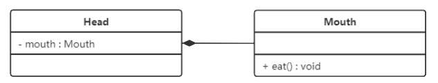
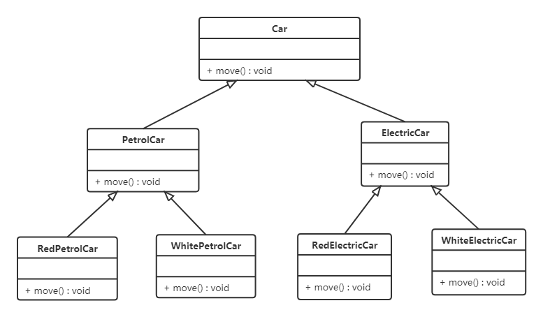

# SDP

## 软件设计

### 设计模式

软件设计模式（Software Design Pattern），本质是面向对象设计原则的实际运用，是对类的封装性、继承性和多态性以及类的关联关系和组合关系的充分理解

- 可以提高程序员的思维能力、编程能力和设计能力
- 使程序设计更加标准化、代码编制更加工程化，使软件开发效率大大提高，从而缩短软件的开发周期
- 使设计的代码可重用性高、可读性强、可靠性高、灵活性好、可维护性强

设计模式分类：

* **创建型模式**：用于描述如何创建对象，主要特点是将对象的创建与使用分离。GoF 书中提供了单例、原型、工厂方法、抽象工厂、建造者等 5 种创建型模式
* **结构型模式**：用于描述如何将类或对象按某种布局组成更大的结构，GoF 书中提供了代理、适配器、桥接、装饰、外观、享元、组合等 7 种结构型模式
* **行为型模式**：用于描述类或对象之间怎样相互协作共同完成单个对象无法单独完成的任务，以及怎样分配职责。GoF 书中提供了模板方法、策略、命令、职责链、状态、观察者、中介者、迭代器、访问者、备忘录、解释器等 11 种行为型模式


参考视频：https://www.bilibili.com/video/BV1Np4y1z7BU


***


### UML图

#### 基本介绍

统一建模语言（Unified Modeling Language，UML）是用来设计软件的可视化建模语言，特点是简单、统一、图形化、能表达软件设计中的动态与静态信息

UML 从目标系统的不同角度出发，定义了用例图、类图、对象图、状态图、活动图、时序图、协作图、构件图、部署图等 9 种图

类图（Class diagram）是显示了模型的静态结构，特别是模型中存在的类、类的内部结构以及它们与其他类的关系等，类图不显示暂时性的信息，类图是面向对象建模的主要组成部分

类图的作用：

* 在软件工程中，类图是一种静态的结构图，描述了系统的类的集合，类的属性和类之间的关系，可以简化人们对系统的理解
* 类图是系统分析和设计阶段的重要产物，是系统编码和测试的重要模型


****


#### 表示方法

在UML类图中，类使用包含类名、属性(field) 和方法(method) 且带有分割线的矩 形来表示，比如下图表示一个Employee 类，包含 name、age 和 address这3个属性，以及 work() 方法


属性/方法名称前加的+和-表示了这个属性/方法的可见性，UML类图中表示可见性的符号有三种：

* +：表示public

* -：表示private

* #：表示protected

属性的完整表示方式是： **可见性  名称 ：类型 [ = 缺省值]**  

方法的完整表示方式是： **可见性  名称(参数列表) [ : 返回类型]**

* 中括号中的内容表示是可选的
* 也有将类型放在变量名前面，返回值类型放在方法名前面


****


#### 关联关系

关联关系是对象之间的一种引用关系，用于表示一类对象与另一类对象之间的联系，如老师和学生。关联关系是类与类之间最常用的一种关系，分为一般关联关系、聚合关系和组合关系

一般关联又可以分为单向关联，双向关联，自关联

* 单向关联：在UML类图中单向关联用一个带箭头的实线表示，下图表示每个顾客都有一个地址，通过让 Customer 类持有一个类型为 Address 的成员变量类实现

  

* 双向关联：双方各自持有对方类型的成员变量

  

* 自关联：在UML类图中用一个带有箭头且指向自身的线表示，下图的意思就是Node类包含类型为Node的成员变量，也就是自己包含自己

  


****


#### 聚合关系

聚合关系是关联关系的一种，是强关联关系，是整体和部分之间的关系。聚合关系通过成员对象来实现，其中成员对象是整体对象的一部分，但是成员对象可以脱离整体对象而独立 存在

在 UML 类图中，聚合关系可以用带空心菱形的实线来表示，菱形指向整体，下图表示学校与老师的关系，学校包含老师，但如果学校倒闭了，老师依然存在


***


#### 组合关系

组合关系表示类之间的整体与部分的关系，是一种更强烈的聚合关系。整体对象可以控制部分对象的生命周期，一旦整体对象不存在，部分对象也将不存在，部分对象不能脱离整体对象而存在

在 UML 类图中，组合关系用带实心菱形的实线来表示，菱形指向整体，下图所示是头和嘴的关系图：




***


#### 依赖关系

依赖关系是一种使用关系，对象之间耦合度最弱的一种关联方式，是临时性的关联。在代码中，某个类的方法通过局部变量、方法的参数或者对静态方法的调用来访问另一个类（被依赖类）中的某些方法来完成一些职责

在 UML 类图中，依赖关系使用带箭头的虚线来表示，箭头从使用类指向被依赖的类


***


#### 继承关系

继承关系是对象之间耦合度最大的一种关系，表示一般与特殊的关系，是父类与子类之间的关系，是一种继承关系

在 UML 类图中，泛化关系用带空心三角箭头的实线来表示，箭头从子类指向父类。在代码实现时，使用面向对象的继承机制来实现泛化关系。例如  Student 类和 Teacher 类都是 Person 类的子类，其类图如下图所示：


****


#### 实现关系

实现关系是接口与实现类之间的关系，类实现了接口，类中的操作实现了接口中所声明的所有的抽象操作

在 UML 类图中，实现关系使用带空心三角箭头的虚线来表示，箭头从实现类指向接口，比如汽车和船实现了交通工具：


***


### 设计原则

#### 开闭原则

**对扩展开放，对修改关闭**，在程序需要进行拓展的时候，不能去修改原有的代码，实现一个热插拔的效果，简言之，是为了使程序的扩展性好，易于维护和升级，使用接口和抽象类

抽象灵活性好，适应性广，只要抽象的合理，可以基本保持软件架构的稳定，软件中易变的细节可以从抽象派生来的实现类来进行扩展，当软件需要发生变化时，只需要根据需求重新派生一个实现类来扩展就可以。


***


#### 里氏代换

里氏代换原则是面向对象设计的基本原则之一

里氏代换原则：任何基类可以出现的地方，子类一定可以出现，就是子类可以扩展父类的功能，但不能改变父类原有的功能，也就是子类继承父类时，除添加新的方法完成新增功能外，尽量不要重写父类的方法

如果通过重写父类的方法来完成新的功能，这样写起来虽然简单，但是整个继承体系的可复用性会比较差，特别是运用多态比较频繁时，程序运行出错的概率会非常大


***


#### 依赖倒转

高层模块不应该依赖实现模块，两者都应该依赖其抽象；抽象不应该依赖细节，细节应该依赖抽象。简单的说就是要求对抽象进行编程，不要对实现进行编程，这样就降低了客户与实现模块间的耦合

比如说组装一台电脑，如果组装的电脑的cpu只能是Intel的，内存条只能是金士顿的，硬盘只能是希捷的，这对用户肯定是不友好的，所以需要把 CPU、内存、硬盘提取成接口类


***


#### 接口隔离

客户端不应该被迫依赖于不使用的方法，一个类对另一个类的依赖应该建立在最小的接口上

比如说 Person 类有姓名、年龄、收入，但是子类 Teacher 类有收入，Student 没有，所以需要设置三个接口。


***


#### 迪米特

迪米特法则又叫最少知识原则，如果两个软件实体无须直接通信，那么就不应当发生直接的相互调用，可以通过第三方转发该调用，其目的是降低类之间的耦合度，提高模块的相对独立

比如明星与经纪人的关系：


***


#### 合成复用

合成复用原则：尽量先使用组合或者聚合等关联关系来实现，其次才考虑使用继承关系来实现

类的复用分为继承复用和合成复用两种

* 继承复用的缺点：
  1. 继承复用破坏了类的封装性，继承会将父类的实现细节暴露给子类，父类对子类是透明的，所以这种复用又称为“白箱复用”
  2. 子类与父类的耦合度高，父类的实现的任何改变都会导致子类的实现发生变化，不利于类的扩展与维护
  3. 限制了复用的灵活性，从父类继承而来的实现是非虚方法，在编译时已经绑定，在运行时不能发生变化

* 采用组合或聚合复用，将已有对象纳入新对象中，使之成为新对象的一部分，新对象可以调用已有对象的功能
  1. 维持了类的封装性，因为成分对象的内部细节是新对象看不见的，所以这种复用又称为“黑箱”复用
  2. 对象间的耦合度低，可以在类的成员位置声明抽象
  3. 复用的灵活性高，这种复用可以在运行时动态进行，新对象可以动态地引用与成分对象类型相同的对象

比如：汽车按动力源分为汽油汽车、电动汽车等；按颜色划分可分为白色汽车、黑色汽车和红色汽车等

* 类图：

  

* 将继承复用改为聚合复用，把颜色当作属性：

  


****


## 创建型

### 单例模式

#### 基本介绍

创建型模式的主要关注点是怎样创建对象，将对象的创建与使用分离，降低系统的耦合度，使用者不需要关注对象的创建细节

创建型模式分为：单例模式、工厂方法模式、抽象工程模式、原型模式、建造者模式

单例模式（Singleton Pattern）是 Java 中最简单的设计模式之一，提供了一种创建对象的最佳方式

单例设计模式分类两种：

* 饿汉式：类加载就会导致该单实例对象被创建	

* 懒汉式：类加载不会导致该单实例对象被创建，而是首次使用该对象时才会创建


***


#### 饿汉式

饿汉式在类加载的过程导致该单实例对象被创建，虚拟机会保证类加载的线程安全，但是如果只是为了加载该类不需要实例，则会造成内存的浪费

* 静态变量的方式：

  ```java
  public class Singleton {
      // 私有构造方法
      private Singleton() {}
      // 在成员位置创建该类的对象
      private static final Singleton instance = new Singleton();
      // 对外提供静态方法获取该对象
      public static Singleton getInstance() {
          return instance;
      }
      
      // 解决序列化问题
      protected Object readResolve() {
      	return INSTANCE;
      }
  }
  ```

  * 问题1：为什么类加 final 修饰？
    不被子类继承，防止子类中不适当的行为覆盖父类的方法，破坏了单例

  * 问题2：如果实现了序列化接口，怎么防止防止反序列化破坏单例？

    * 对单例声明 transient，然后实现 readObject(ObjectInputStream in) 方法，复用原来的单例

      条件：访问权限为 private/protected、返回值必须是 Object、异常可以不抛

    * 实现 readResolve() 方法，当 JVM 从内存中反序列化地"组装"一个新对象，就会自动调用 readResolve 方法返回原来单例

  * 问题3：为什么构造方法设置为私有? 是否能防止反射创建新的实例?
    防止其他类无限创建对象；不能防止反射破坏

  * 问题4：这种方式是否能保证单例对象创建时的线程安全?
    能，静态变量初始化在类加载时完成，由 JVM 保证线程安全

  * 问题5：为什么提供静态方法而不是直接将 INSTANCE 设置为 public？
    更好的封装性、提供泛型支持、可以改进成懒汉单例设计

* 静态代码块的方式：

  ```java
  public class Singleton {
      //私有构造方法
      private Singleton() {}
      
      //在成员位置创建该类的对象
      private static Singleton instance;
      static {
          instance = new Singleton();
      }
      
      //对外提供静态方法获取该对象
      public static Singleton getInstance() {
          return instance;
      }
  }
  ```

* 枚举方式：枚举类型是所用单例实现中**唯一一种**不会被破坏的单例实现模式

  ```java
  public enum Singleton {
      INSTANCE;
      public void doSomething() {
          System.out.println("doSomething");
      }
  }
  public static void main(String[] args) {
      Singleton.INSTANCE.doSomething();
  }
  ```

  * 问题1：枚举单例是如何限制实例个数的？每个枚举项都是一个实例，是一个静态成员变量
  * 问题2：枚举单例在创建时是否有并发问题？否
  * 问题3：枚举单例能否被反射破坏单例？否，反射创建对象时判断是枚举类型就直接抛出异常
  * 问题4：枚举单例能否被反序列化破坏单例？否
  * 问题5：枚举单例属于懒汉式还是饿汉式？**饿汉式**
  * 问题6：枚举单例如果希望加入一些单例创建时的初始化逻辑该如何做？添加构造方法

  反编译结果：

  ```java
  public final class Singleton extends java.lang.Enum<Singleton> {//Enum实现序列化接口
  	public static final Singleton INSTANCE = new Singleton();
  }
  ```

  


***


#### 懒汉式

* 线程不安全

  ```java
  public class Singleton {
      //私有构造方法
      private Singleton() {}
  
      //在成员位置创建该类的对象
      private static Singleton instance;
  
      //对外提供静态方法获取该对象
      public static Singleton getInstance() {
          if(instance == null) {
              //多线程环境，会出现线程安全问题，可能多个线程同时进入这里
              instance = new Singleton();
          }
          return instance;
      }
  }
  ```

* 双端检锁机制

  在多线程的情况下，可能会出现空指针问题，出现问题的原因是 JVM 在实例化对象的时候会进行优化和指令重排序操作，所以需要使用 `volatile` 关键字

  ```java
  public class Singleton { 
      // 私有构造方法
      private Singleton() {}
      private static volatile Singleton instance;
  
      // 对外提供静态方法获取该对象
      public static Singleton getInstance() {
          // 第一次判断，如果instance不为null，不进入抢锁阶段，直接返回实例
          if(instance == null) {
              synchronized (Singleton.class) {
                  // 抢到锁之后再次判断是否为null
                  if(instance == null) {
                      instance = new Singleton();
                  }
              }
          }
          return instance;
      }
  }
  ```

* 静态内部类方式

  ```java
  public class Singleton {
      // 私有构造方法
      private Singleton() {}
  
      private static class SingletonHolder {
          private static final Singleton INSTANCE = new Singleton();
      }
  
      // 对外提供静态方法获取该对象
      public static Singleton getInstance() {
          return SingletonHolder.INSTANCE;
      }
  }
  ```

  * 内部类属于懒汉式，类加载本身就是懒惰的，首次调用时加载，然后对单例进行初始化
  
    类加载的时候方法不会被调用，所以不会触发 getInstance 方法调用 invokestatic 指令对内部类进行加载；加载的时候字节码常量池会被加入类的运行时常量池，解析工作是将常量池中的符号引用解析成直接引用，但是解析过程不一定非得在类加载时完成，可以延迟到运行时进行，所以静态内部类实现单例会**延迟加载**
  
  * 没有线程安全问题，静态变量初始化在类加载时完成，由 JVM 保证线程安全


***


#### 破坏单例

##### 反序列化

将单例对象序列化再反序列化，对象从内存反序列化到程序中会重新创建一个对象，通过反序列化得到的对象是不同的对象，而且得到的对象不是通过构造器得到的，**反序列化得到的对象不执行构造器**

* Singleton

  ```java
  public class Singleton implements Serializable {	//实现序列化接口
      // 私有构造方法
      private Singleton() {}
      private static class SingletonHolder {
          private static final Singleton INSTANCE = new Singleton();
      }
  
      // 对外提供静态方法获取该对象
      public static Singleton getInstance() {
          return SingletonHolder.INSTANCE;
      }
  }
  ```

* 序列化

  ```java
  public class Test {
      public static void main(String[] args) throws Exception {
          //往文件中写对象
          //writeObject2File();
          //从文件中读取对象
          Singleton s1 = readObjectFromFile();
          Singleton s2 = readObjectFromFile();
          //判断两个反序列化后的对象是否是同一个对象
          System.out.println(s1 == s2);
      }
  
      private static Singleton readObjectFromFile() throws Exception {
          //创建对象输入流对象
          ObjectInputStream ois = new ObjectInputStream(new FileInputStream("C://a.txt"));
          //第一个读取Singleton对象
          Singleton instance = (Singleton) ois.readObject();
          return instance;
      }
      
      public static void writeObject2File() throws Exception {
          //获取Singleton类的对象
          Singleton instance = Singleton.getInstance();
          //创建对象输出流
          ObjectOutputStream oos = new ObjectOutputStream(new FileOutputStream("C://a.txt"));
          //将instance对象写出到文件中
          oos.writeObject(instance);
      }
  }
  ```

* 解决方法：

  在 Singleton 类中添加 `readResolve()` 方法，在反序列化时被反射调用，如果定义了这个方法，就返回这个方法的值，如果没有定义，则返回新创建的对象

  ```java
  private Object readResolve() {
      return SingletonHolder.INSTANCE;
  }
  ```

  ObjectInputStream 类源码分析：

  ```java
  public final Object readObject() throws IOException, ClassNotFoundException{
      //...
        Object obj = readObject0(false);//重点查看readObject0方法
  }
  
  private Object readObject0(boolean unshared) throws IOException {
      try {
  		switch (tc) {
  			case TC_OBJECT:
  				return checkResolve(readOrdinaryObject(unshared));
                  //重点查看readOrdinaryObject方法
          }
      } 
  }
  private Object readOrdinaryObject(boolean unshared) throws IOException {
  	//isInstantiable 返回true，执行 desc.newInstance()，通过反射创建新的单例类
      obj = desc.isInstantiable() ? desc.newInstance() : null; 
      //添加 readResolve 方法后 desc.hasReadResolveMethod() 方法执行结果为true
      if (obj != null && handles.lookupException(passHandle) == null && desc.hasReadResolveMethod()) {
      	// 通过反射调用 Singleton 类中的 readResolve 方法，将返回值赋值给rep变量
      	// 多次调用ObjectInputStream类中的readObject方法，本质调用定义的readResolve方法，所以返回的是同一个对象。
      	Object rep = desc.invokeReadResolve(obj);
      }
      return obj;
  }
  ```


***


##### 反射破解

* 反射

  ```java
  public class Test {
      public static void main(String[] args) throws Exception {
          //获取Singleton类的字节码对象
          Class clazz = Singleton.class;
          //获取Singleton类的私有无参构造方法对象
          Constructor constructor = clazz.getDeclaredConstructor();
          //取消访问检查
          constructor.setAccessible(true);
  
          //创建Singleton类的对象s1
          Singleton s1 = (Singleton) constructor.newInstance();
          //创建Singleton类的对象s2
          Singleton s2 = (Singleton) constructor.newInstance();
  
          //判断通过反射创建的两个Singleton对象是否是同一个对象
          System.out.println(s1 == s2);	//false
      }
  }
  ```

* 反射方式破解单例的解决方法：

  ```java
  public class Singleton {
      private static volatile Singleton instance;
      
      // 私有构造方法
      private Singleton() {
          // 反射破解单例模式需要添加的代码
          if(instance != null) {
              throw new RuntimeException();
          }
      }
      
      // 对外提供静态方法获取该对象
      public static Singleton getInstance() {
          if(instance != null) {
              return instance;
          }
          synchronized (Singleton.class) {
              if(instance != null) {
                  return instance;
              }
              instance = new Singleton();
              return instance;
          }
      }
  }
  ```


***


#### Runtime

Runtime 类就是使用的单例设计模式中的饿汉式

```java
public class Runtime {    
    private static Runtime currentRuntime = new Runtime();    
    public static Runtime getRuntime() {        
        return currentRuntime;    
    }   
    private Runtime() {}    
    ...
}
```

使用 Runtime

```java
public class RuntimeDemo {
    public static void main(String[] args) throws IOException {
        //获取Runtime类对象
        Runtime runtime = Runtime.getRuntime();

        //返回 Java 虚拟机中的内存总量。
        System.out.println(runtime.totalMemory());
        //返回 Java 虚拟机试图使用的最大内存量。
        System.out.println(runtime.maxMemory());

        //创建一个新的进程执行指定的字符串命令，返回进程对象
        Process process = runtime.exec("ipconfig");
        //获取命令执行后的结果，通过输入流获取
        InputStream inputStream = process.getInputStream();
        byte[] arr = new byte[1024 * 1024* 100];
        int b = inputStream.read(arr);
        System.out.println(new String(arr,0,b,"gbk"));
    }
}
```


****


### 工厂模式

#### 基本介绍

工厂模式：使用工厂来生产对象，彻底和对象解耦，如果要更换对象，直接在工厂里更换该对象即可

三种工厂：

* 简单工厂模式（不属于 GOF 的23种经典设计模式）
* 工厂方法模式
* 抽象工厂模式


***


#### 简单工厂

简单工厂，也称为静态工厂模式，包含如下角色：

* 抽象产品 ：定义了产品的规范，描述了产品的主要特性和功能
* 具体产品 ：实现或者继承抽象产品的子类
* 具体工厂 ：提供了创建产品的方法，调用者通过该方法来获取产品

实现代码：

* 抽象类：

  ```java
  public abstract class Coffee {
      public abstract String getName();
  }
  ```

* 实现类：

  ```java
  public class AmericanCoffee extends Coffee {
      public String getName() {
          return "美式咖啡";
      }
  }
  public class LatteCoffee extends Coffee {
      public String getName() {
          return "拿铁咖啡";
      }
  }
  ```

* 简单工厂类，在 createCoffee 方法加 static

  ```java
  public class SimpleCoffeeFactory {
      public Coffee createCoffee(String type) {
          //声明Coffee类型的变量，根据不同类型创建不同的coffee子类对象
          Coffee coffee = null;
          if("american".equals(type)) {
              coffee = new AmericanCoffee();
          } else if("latte".equals(type)) {
              coffee = new LatteCoffee();
          } else {
              throw new RuntimeException("对不起，您所点的咖啡没有");
          }
  
          return coffee;
      }
  }
  ```

* 测试类：

  ```java
  public class Client {
      public static void main(String[] args) {
          SimpleCoffeeFactory factory = new SimpleCoffeeFactory();
          Coffee coffee = factory.createCoffee("latte");
  
          System.out.println(coffee.getName());
      }
  }
  ```

优点：

* 封装了创建对象的过程，可以通过参数直接获取对象。
* 把对象的创建和业务逻辑层分开，如果要实现新产品直接修改工厂类，而不需要在原代码中修改，扩展性高

缺点：实现新产品需要修改 SimpleCoffeeFactory 的代码，违反了开闭原则


***


#### 工厂方法

定义一个用于创建对象的接口，让子类决定实例化哪个产品类对象，工厂方法使一个产品类的实例化延迟到其工厂的子类

工厂方法模式的主要角色：

* 抽象工厂：提供了创建产品的接口，调用者通过它访问具体工厂的工厂方法来创建产品
* 具体工厂：主要是实现抽象工厂中的抽象方法，完成具体产品的创建。
* 抽象产品：定义了产品的规范，描述了产品的主要特性和功能。
* 具体产品：实现了抽象产品角色所定义的接口，由具体工厂来创建，同具体工厂之间一一对应

代码实现：

* 抽象工厂：

  ```java
  public interface CoffeeFactory {    
      Coffee createCoffee();
  }
  ```

* 具体工厂：

  ```java
  public class LatteCoffeeFactory implements CoffeeFactory {
      public Coffee createCoffee() {
          return new LatteCoffee();
      }
  }
  
  public class AmericanCoffeeFactory implements CoffeeFactory {
      public Coffee createCoffee() {
          return new AmericanCoffee();
      }
  }
  ```

优点：

- 用户只需要知道具体工厂的名称就可得到所要的产品，无须知道产品的具体创建过程
- 增加新的产品只需要添加具体产品类和对应的具体工厂类，无须对原工厂进行任何修改，满足开闭原则

缺点：

* 每增加一个产品就要增加一个具体产品类和一个对应的具体工厂类，这增加了系统的复杂度


***


#### 抽象工厂

抽象工厂：是一种为访问类提供一个创建一组相关或相互依赖对象的接口，且访问类无须指定所要产品的具体类就能得到同族的不同等级的产品的模式结构

抽象工厂是工厂方法的升级版，工厂方法模式只生产一个等级的产品，而抽象工厂模式可生产多个等级的产品

工厂方法只能加咖啡，不能拓展其他业务，所以使用抽象工厂

* 抽象工厂：

  ```java
  public interface DessertFactory {    
      Coffee createCoffee();    
      Dessert createDessert();
  }
  ```

* 具体工厂：

  ```java
  //美式甜点工厂
  public class AmericanDessertFactory implements DessertFactory {
      public Coffee createCoffee() {
          return new AmericanCoffee();
      }
      public Dessert createDessert() {
          return new MatchaMousse();
      }
  }
  //意大利风味甜点工厂
  public class ItalyDessertFactory implements DessertFactory {
  
      public Coffee createCoffee() {
          return new LatteCoffee();
      }
  
      public Dessert createDessert() {
          return new Tiramisu();
      }
  }
  ```

优点：当一个产品族中的多个对象被设计成一起工作时，能保证客户端始终只使用同一个产品族中的对象

缺点：当产品族中需要增加一个新的产品时，所有的工厂类都需要进行修改


***


#### 模式拓展

通过工厂模式+配置文件的方式解除工厂对象和产品对象的耦合，在工厂类中加载配置文件中的全类名，并创建对象进行存储，客户端如果需要对象，直接进行获取即可

* 定义配置文件 bean.properties：

  ```properties
  american=pattern.factory.config_factory.AmericanCoffee
  latte=pattern.factory.config_factory.LatteCoffee
  ```

* 改进工厂类：

  ```java
  public class CoffeeFactory {
      private static Map<String,Coffee> map = new HashMap();
      static {
          Properties p = new Properties();
          InputStream is = CoffeeFactory.class.getClassLoader().getResourceAsStream("bean.properties");
          try {
              p.load(is);
              //遍历Properties集合对象
              Set<Object> keys = p.keySet();
              for (Object key : keys) {
                  //根据键获取值（全类名）
                  String className = p.getProperty((String) key);
                  //获取字节码对象
                  Class clazz = Class.forName(className);
                  Coffee obj = (Coffee) clazz.newInstance();
                  map.put((String)key,obj);
              }
          } catch (Exception e) {
              e.printStackTrace();
          }
      }
  
      public static Coffee createCoffee(String name) {
          return map.get(name);
      }
  }
  ```

  静态成员变量用来存储创建的对象（键存储的是名称，值存储的是对应的对象），而读取配置文件以及创建对象写在静态代码块中，目的就是只需要执行一次


***


#### 应用场景

##### 使用场景

使用场景：

* 当需要创建的对象是一系列相互关联或相互依赖的产品族时，如电器工厂中的电视机、洗衣机、空调等
* 系统中有多个产品族，但每次只使用其中的某一族产品，如有人只喜欢穿某一个品牌的衣服和鞋
* 系统中提供了产品的类库，且所有产品的接口相同，客户端不依赖产品实例的创建细节和内部结构


##### 源码应用

iterator

```java
public class Demo {
    public static void main(String[] args) {
        List<String> list = new ArrayList<>();
        list.add("令狐冲");
        list.add("风清扬");
        list.add("任我行");

        //获取迭代器对象
        Iterator<String> it = list.iterator();
        //使用迭代器遍历
        while(it.hasNext()) {
            String ele = it.next();
            System.out.println(ele);
        }
    }
}
```

使用迭代器遍历集合，获取集合中的元素，而单列集合获取迭代器的方法就使用到了工厂方法模式


Collection 接口是抽象工厂类，ArrayList 是具体的工厂类，Iterator 接口是抽象商品类，ArrayList 类中的 Iter 内部类是具体的商品类，在具体的工厂类中 iterator() 方法创建具体的商品类的对象


***


### 原型模式

#### 基本介绍

用一个已经创建的实例作为原型，通过复制该原型对象来创建一个和原型对象相同的新对象

原型模式包含如下角色：

* 抽象原型类：规定了具体原型对象必须实现的的 clone() 方法。
* 具体原型类：实现抽象原型类的 clone() 方法，它是可被复制的对象。
* 访问类：使用具体原型类中的 clone() 方法来复制新的对象

接口类图如下：


***


#### 代码实现

原型模式的克隆分为浅克隆和深克隆，具体介绍参考 Object 类介绍部分的笔记

Java中 的 Object 类中提供了 `clone()` 方法来实现浅克隆，实现 Cloneable 接口的类才可以被克隆

* 具体原型类：

  ```java
  public class Citation implements Cloneable {
      private String name;
      public void setName(String name) {
          this.name = name;
      }
  
      public String getName() {
          return (this.name);
      }
  
      public void show() {
          System.out.println(name + "同学：第一学期被评为三好学生。特发此状！");
      }
  
      @Override
      public Citation clone() throws CloneNotSupportedException {
          return (Citation) super.clone();
      }
  }
  ```

* 测试类：

  ```java
  public class CitationTest {
      public static void main(String[] args) throws CloneNotSupportedException {
          Citation c1 = new Citation();
          c1.setName("张三");
          //复制奖状
          Citation c2 = c1.clone();
          c2.setName("李四");
  
          c1.show();// 张三
          c2.show();// 李四
      }
  }
  ```

  

****


#### 模式拓展

深克隆案例：

* 原代码：

  ```java
  public class Citation implements Cloneable {
      private Student stu;
  	// get + set
      
      public void show() {
          System.out.println(stu.getName() + "同学：在第一学期被评为三好学生。特发此状！");
      }
  
      @Override
      public Citation clone() throws CloneNotSupportedException {
          return (Citation) super.clone();
      }
  }
  //学生类
  public class Student {
      private String name;
  }
  ```

* 测试代码

  ```java
  public static void main(String[] args) throws CloneNotSupportedException {
      Citation c1 = new Citation();
      Student stu1 = new Student();
      stu1.setName("张三");
      c1.setStu(stu);
      
      Citation c2 = citation.clone();
      Student stu2 = c2.getStu();
      stu2.setName("李四");
  
      citation.show();	//李四...
      citation1.show();	//李四...
  }
  ```

  stu1 对象和 stu2 对象是同一个对象，将 stu2 对象中 name 属性改为李四，两个Citation对象中都是李四，这就是浅克隆的效果

* 序列化实现深克隆，或者重写克隆方法：

  序列化：

  ```java
  public class CitationTest1 {
      public static void main(String[] args) throws Exception {
          Citation c1 = new Citation();
          Student stu = new Student("张三");
          c1.setStu(stu);
  
          //创建对象输出流对象
          ObjectOutputStream oos = new ObjectOutputStream(new FileOutputStream("C:\\b.txt"));
          //将c1对象写出到文件中
          oos.writeObject(c1);
          oos.close();
  
          //创建对象输入流对象
          ObjectInputStream ois = new ObjectInputStream(new FileInputStream("C:\\b.txt"));
          //读取对象
          Citation c2 = (Citation) ois.readObject();
          //获取c2奖状所属学生对象
          Student stu1 = c2.getStu();
          stu1.setName("李四");
  
          //判断stu对象和stu1对象是否是同一个对象
          System.out.println("stu和stu1是同一个对象？" + (stu == stu1));//false
          c1.show();//张三
          c2.show();//李四
      }
  }
  ```

  重写：

  ```java
  @Override
  public Citation clone() throws CloneNotSupportedException {
      Citation clone = (Citation) super.clone();
      Student o = (Student) stu.clone();
      clone.setStu(o);
      return clone;
  }
  ```


***


### 建造者

#### 基本介绍

将一个复杂对象的构建与表示分离，使得同样的构建过程可以创建不同的表示

* 分离了部件的构造（由Builder来负责）和装配（由Director负责），从而可以构造出复杂的对象，这个模式适用于某个对象的构建过程复杂的情况
* 由于实现了构建和装配的解耦。不同的构建器，相同的装配，也可以做出不同的对象；相同的构建器，不同的装配顺序也可以做出不同的对象，实现了更好的复用。
* 建造者模式可以将部件和其组装过程分开，一步一步创建一个复杂的对象。用户只需要指定复杂对象的类型就可以得到该对象，而无须知道其内部的具体构造细节

建造者（Builder）模式包含如下角色：

* 抽象建造者类 (Builder)：这个接口定义要实现复杂对象的哪些部分的创建，并不涉及具体的部件对象的创建

* 具体建造者类 (ConcreteBuilder)：实现 Builder 接口，完成复杂产品的各个部件的具体创建方法，在构造过程完成后，提供产品的实例。 

* 产品类 (Product)：要创建的复杂对象

* 指挥者类 (Director)：调用具体建造者来创建复杂对象的各个部分，在指导者中不涉及具体产品的信息，只负责保证对象各部分完整创建或按某种顺序创建


模式优点：

- 建造者模式的封装性很好，使用建造者模式可以有效的封装变化，将主要的业务逻辑封装在指挥者类中对整体而言可以取得比较好的稳定性
- 在建造者模式中，客户端不必知道产品内部组成的细节，将产品本身与产品的创建过程解耦，使得相同的创建过程可以创建不同的产品对象
- 可以更加精细地控制产品的创建过程 ，将复杂产品的创建步骤分解在不同的方法中，更方便使用程序来控制创建过程
- 建造者模式很容易进行扩展，如果有新的需求，通过实现一个新的建造者类就可以完成，基本上不用修改之前已经测试通过的代码，因此也就不会对原有功能引入风险，符合开闭原则

模式缺点：造者模式所创建的产品一般具有较多的共同点，其组成部分相似，如果产品之间的差异性很大，则不适合使用建造者模式，因此其使用范围受到一定的限制

应用场景：

* 创建的对象较复杂，由多个部件构成，各部件面临着复杂的变化，但构件间的建造顺序是稳定的
* 创建复杂对象的算法独立于该对象的组成部分以及装配方式，即产品的构建过程和最终的表示是独立的


****


#### 代码实现

生产自行车是一个复杂的过程，它包含了车架，车座等组件的生产。而车架又有多种材质的，车座有多种材质，对于自行车的生产就可以使用建造者模式

* 自行车类：

  ```java
  public class Bike {   
      private String frame;    
      private String seat;	
      // ...
  }
  ```

* 抽象 builder 类：

  ```java
  public abstract class Builder {
      protected Bike bike = new Bike();
  
      public abstract void buildFrame();
      public abstract void buildSeat();
      public abstract Bike createBike();
  }
  ```

* 具体 builder 类：

  ```java
  //摩拜单车Builder类
  public class MobikeBuilder extends Builder {
      @Override
      public void buildFrame() {
          bike.setFrame("铝合金车架");
      }
      @Override
      public void buildSeat() {
          bike.setSeat("真皮车座");
      }
      @Override
      public Bike createBike() {
          return bike;
      }
  }
  //ofo单车Builder类
  public class OfoBuilder extends Builder {
      @Override
      public void buildFrame() {
          bike.setFrame("碳纤维车架");
      }
      @Override
      public void buildSeat() {
          bike.setSeat("橡胶车座");
      }
      @Override
      public Bike createBike() {
          return bike;
      }
  }
  ```

* 指挥者类：

  ```java
  public class Director {
      private Builder builder;
  
      public Director(Builder builder) {
          this.builder = builder;
      }
  
      public Bike construct() {
          builder.buildFrame();
          builder.buildSeat();
          return builder.createBike();
      }
  }
  ```

* 测试类：

  ```java
  public static void main(String[] args) {
      Director director = new Director(new MobileBuilder());
      // 指挥者指挥装配自行车
      Bike bike = director.construct();
      System.out.println(bike.getFrame() + bike.getSeat());
  }
  ```


****


#### 模式拓展

当一个类构造器需要传入很多参数时，如果创建这个类的实例，代码可读性会非常差，而且很容易引入错误，此时就可以利用建造者模式进行重构

* 重构前代码：

  ```java
  public class Phone {
      private String cpu;
      private String screen;
      private String memory;
      private String mainboard;
  }
  public static void main(String[] args) {
      //构建Phone对象
      Phone phone = new Phone("intel","三星屏幕","金士顿","华硕");
      System.out.println(phone);
  }
  ```

* 重构后的代码：

  ````java
  public class Phone {
      private String cpu;
      private String screen;
      private String memory;
      private String mainboard;
  
      private Phone(Builder builder) {
          cpu = builder.cpu;
          screen = builder.screen;
          memory = builder.memory;
          mainboard = builder.mainboard;
      }
  
      public static final class Builder {
          private String cpu;
          private String screen;
          private String memory;
          private String mainboard;
  
          public Builder() {}
  		//返回值为this 所以支持链式编程
          public Builder cpu(String val) {
              cpu = val;
              return this;
          }
          public Builder screen(String val) {
              screen = val;
              return this;
          }
          public Builder memory(String val) {
              memory = val;
              return this;
          }
          public Builder mainboard(String val) {
              mainboard = val;
              return this;
          }
          public Phone build() {
              return new Phone(this);
          }
      }
  }
  
  public static void main(String[] args) {
      Phone phone = new Phone.Builder()
          .cpu("intel")
          .mainboard("华硕")
          .memory("金士顿")
          .screen("三星")
          .build();
      System.out.println(phone);
  }
  ````

  


***


#### 模式对比

工厂方法模式对比建造者模式

* 工厂方法模式注重的是整体对象的创建方式
* 建造者模式注重的是部件构建的过程，意在通过一步一步地精确构造创建出一个复杂的对象

抽象工厂模式对比建造者模式

* 抽象工厂模式实现对产品家族的创建，一个产品家族是这样的一系列产品，不需要关心构建过程，只关心什么产品由什么工厂生产即可

* 建造者模式则是要求按照指定的蓝图建造产品，主要目的是通过组装零配件而产生一个新产品

  如果将抽象工厂模式看成汽车配件生产工厂，生产一个产品族的产品，那么建造者模式就是一个汽车组装工厂，通过对部件的组装可以返回一辆完整的汽车


****


## 结构型

### 模式分类

结构型模式描述如何将类或对象按某种布局组成更大的结构，分为类结构型模式和对象结构型模式，前者采用继承机制来组织接口和类，后者釆用组合或聚合方式来组合对象。由于组合关系或聚合关系比继承关系耦合度低，满足合成复用原则，所以对象结构型模式比类结构型模式具有更大的灵活性

结构型模式分为 7 种：代理模式、适配器模式、装饰者模式、桥接模式、外观模式、组合模式、享元模式


***


### 代理模式

#### 静态代理

代理模式：由于某些原因需要给某对象提供一个代理以控制对该对象的访问，访问对象不适合或者不能直接引用为目标对象，代理对象作为访问对象和目标对象之间的中介

Java 中的代理按照代理类生成时机不同又分为静态代理和动态代理，静态代理代理类在编译期就生成，而动态代理代理类则是在 Java 运行时动态生成，动态代理又有 JDK 代理和 CGLib 代理两种

代理（Proxy）模式分为三种角色：

* 抽象主题（Subject）类：通过接口或抽象类声明真实主题和代理对象实现的业务方法
* 真实主题（Real Subject）类： 实现了抽象主题中的具体业务，是代理对象所代表的真实对象，是最终要引用的对象
* 代理（Proxy）类：提供了与真实主题相同的接口，其内部含有对真实主题的引用，可以访问、控制或扩展真实主题的功能

买票案例，火车站是目标对象，代售点是代理对象

* 卖票接口：

  ```java
  public interface SellTickets {
      void sell();
  }
  ```

* 火车站，具有卖票功能，需要实现SellTickets接口

  ```java
  public class TrainStation implements SellTickets {
      public void sell() {
          System.out.println("火车站卖票");
      }
  }
  ```
  
* 代售点：

  ```java
  public class ProxyPoint implements SellTickets {
      private TrainStation station = new TrainStation();
  
      public void sell() {
          System.out.println("代理点收取一些服务费用");
          station.sell();
      }
  }
  ```

* 测试类：

  ```java
  public class Client {
      public static void main(String[] args) {
          ProxyPoint pp = new ProxyPoint();
          pp.sell();
      }
  }
  ```

  测试类直接访问的是 ProxyPoint 类对象，也就是 ProxyPoint 作为访问对象和目标对象的中介


****


#### JDK

##### 使用方式

Java 中提供了一个动态代理类 Proxy，Proxy 并不是代理对象的类，而是提供了一个创建代理对象的静态方法 newProxyInstance() 来获取代理对象

`static Object newProxyInstance(ClassLoader loader,Class[] interfaces,InvocationHandler h) `

* 参数一：类加载器，负责加载代理类
* 参数二：被代理业务对象的**全部实现的接口**，代理对象与真实对象实现相同接口，知道为哪些方法做代理
* 参数三：代理真正的执行方法，也就是代理的处理逻辑

代码实现：

* 代理工厂：创建代理对象

  ```java
  public class ProxyFactory {
      private TrainStation station = new TrainStation();
  	//也可以在参数中提供 getProxyObject(TrainStation station)
      public SellTickets getProxyObject() {
          //使用 Proxy 获取代理对象
          SellTickets sellTickets = (SellTickets) Proxy.newProxyInstance(
              	station.getClass().getClassLoader(),
                  station.getClass().getInterfaces(),
                  new InvocationHandler() {
                      public Object invoke(Object proxy, Method method, Object[] args) throws Throwable {
                          System.out.println("代理点(JDK动态代理方式)");
                          //执行真实对象
                          Object result = method.invoke(station, args);
                          return result;
                      }
                  });
          return sellTickets;
      }
  }
  ```

* 测试类：

  ```java
  public class Client {
      public static void main(String[] args) {
          //获取代理对象
          ProxyFactory factory = new ProxyFactory();
          //必须时代理ji
          SellTickets proxyObject = factory.getProxyObject();
          proxyObject.sell();
      }
  }
  ```


***


##### 实现原理

JDK 动态代理方式的优缺点：

- 优点：可以为任意的接口实现类对象做代理，也可以为被代理对象的所有接口的所有方法做代理，动态代理可以在不改变方法源码的情况下，实现对方法功能的增强，提高了软件的可扩展性，Java 反射机制可以生成任意类型的动态代理类
- 缺点：**只能针对接口或者接口的实现类对象做代理对象**，普通类是不能做代理对象的
- 原因：**生成的代理类继承了 Proxy**，Java 是单继承的，所以 JDK 动态代理只能代理接口

ProxyFactory 不是代理模式中的代理类，而代理类是程序在运行过程中动态的在内存中生成的类，可以通过 Arthas 工具查看代理类结构：

* 代理类（$Proxy0）实现了 SellTickets 接口，真实类和代理类实现同样的接口
* 代理类（$Proxy0）将提供了的匿名内部类对象传递给了父类
* 代理类（$Proxy0）的修饰符是 public final

```java
// 程序运行过程中动态生成的代理类
public final class $Proxy0 extends Proxy implements SellTickets {
    private static Method m3;

    public $Proxy0(InvocationHandler invocationHandler) {
        super(invocationHandler);//InvocationHandler对象传递给父类
    }

    static {
        m3 = Class.forName("proxy.dynamic.jdk.SellTickets").getMethod("sell", new Class[0]);
    }

    public final void sell() {
        // 调用InvocationHandler的invoke方法
        this.h.invoke(this, m3, null);
    }
}

//Java提供的动态代理相关类
public class Proxy implements java.io.Serializable {
	protected InvocationHandler h;
	 
	protected Proxy(InvocationHandler h) {
        this.h = h;
    }
}
```

执行流程如下：

1. 在测试类中通过代理对象调用 sell() 方法
2. 根据多态的特性，执行的是代理类（$Proxy0）中的 sell() 方法
3. 代理类（$Proxy0）中的 sell() 方法中又调用了 InvocationHandler 接口的子实现类对象的 invoke 方法
4. invoke 方法通过反射执行了真实对象所属类（TrainStation）中的 sell() 方法


****


##### 源码解析

```java
public static Object newProxyInstance(ClassLoader loader,
                                      Class<?>[] interfaces,
                                      InvocationHandler h){
    // InvocationHandler 为空则抛出异常
    Objects.requireNonNull(h);

    // 复制一份 interfaces
    final Class<?>[] intfs = interfaces.clone();
    final SecurityManager sm = System.getSecurityManager();
    if (sm != null) {
        checkProxyAccess(Reflection.getCallerClass(), loader, intfs);
    }

    // 从缓存中查找 class 类型的代理对象，参数二是代理需要实现的接口
    Class<?> cl = getProxyClass0(loader, intfs);
	//proxyClassCache = new WeakCache<>(new KeyFactory(), new ProxyClassFactory())
 
    try {
        if (sm != null) {
            checkNewProxyPermission(Reflection.getCallerClass(), cl);
        }

        // 获取代理类的构造方法，根据参数 InvocationHandler 匹配获取某个构造器
        final Constructor<?> cons = cl.getConstructor(constructorParams);
        final InvocationHandler ih = h;
        // 构造方法不是 pubic 的需要启用权限
        if (!Modifier.isPublic(cl.getModifiers())) {
            AccessController.doPrivileged(new PrivilegedAction<Void>() {
                public Void run() {
                    // 设置可访问的权限
                    cons.setAccessible(true);
                    return null;
                }
            });
        }
       	// cons 是构造方法，并且内部持有 InvocationHandler，在 InvocationHandler 中持有 target 目标对象
        return cons.newInstance(new Object[]{h});
    } catch (IllegalAccessException|InstantiationException e) {}
}
```

Proxy 的静态内部类：

```java
private static final class ProxyClassFactory {
    // 代理类型的名称前缀
    private static final String proxyClassNamePrefix = "$Proxy";

    // 生成唯一数字使用，结合上面的代理类型名称前缀一起生成
    private static final AtomicLong nextUniqueNumber = new AtomicLong();

	//参数一：Proxy.newInstance 时传递的
    //参数二：Proxy.newInstance 时传递的接口集合
    @Override
    public Class<?> apply(ClassLoader loader, Class<?>[] interfaces) {
		
        Map<Class<?>, Boolean> interfaceSet = new IdentityHashMap<>(interfaces.length);
        // 遍历接口集合
        for (Class<?> intf : interfaces) {
            Class<?> interfaceClass = null;
            try {
                // 加载接口类到 JVM
                interfaceClass = Class.forName(intf.getName(), false, loader);
            } catch (ClassNotFoundException e) {
            }
            if (interfaceClass != intf) {
                throw new IllegalArgumentException(
                    intf + " is not visible from class loader");
            }
            // 如果 interfaceClass 不是接口 直接报错，保证集合内都是接口
            if (!interfaceClass.isInterface()) {
                throw new IllegalArgumentException(
                    interfaceClass.getName() + " is not an interface");
            }
            // 保证接口 interfaces 集合中没有重复的接口
            if (interfaceSet.put(interfaceClass, Boolean.TRUE) != null) {
                throw new IllegalArgumentException(
                    "repeated interface: " + interfaceClass.getName());
            }
        }

        // 生成的代理类的包名
        String proxyPkg = null;   
        // 【生成的代理类访问修饰符 public final】 
        int accessFlags = Modifier.PUBLIC | Modifier.FINAL;

        // 检查接口集合内的接口，看看有没有某个接口的访问修饰符不是 public 的  如果不是 public 的接口，
        // 生成的代理类 class 就必须和它在一个包下，否则访问出现问题
        for (Class<?> intf : interfaces) {
            // 获取访问修饰符
            int flags = intf.getModifiers();
            if (!Modifier.isPublic(flags)) {
                accessFlags = Modifier.FINAL;
                // 获取当前接口的全限定名 包名.类名
                String name = intf.getName();
                int n = name.lastIndexOf('.');
                // 获取包名
                String pkg = ((n == -1) ? "" : name.substring(0, n + 1));
                if (proxyPkg == null) {
                    proxyPkg = pkg;
                } else if (!pkg.equals(proxyPkg)) {
                    throw new IllegalArgumentException(
                        "non-public interfaces from different packages");
                }
            }
        }

        if (proxyPkg == null) {
            // if no non-public proxy interfaces, use com.sun.proxy package
            proxyPkg = ReflectUtil.PROXY_PACKAGE + ".";
        }

        // 获取唯一的编号
        long num = nextUniqueNumber.getAndIncrement();
        // 包名+ $proxy + 数字，比如 $proxy1
        String proxyName = proxyPkg + proxyClassNamePrefix + num;

        // 【生成二进制字节码，这个字节码写入到文件内】，就是编译好的 class 文件
        byte[] proxyClassFile = ProxyGenerator.generateProxyClass(
            proxyName, interfaces, accessFlags);
        try {
            // 【使用加载器加载二进制到 jvm】，并且返回 class
            return defineClass0(loader, proxyName,
                                proxyClassFile, 0, proxyClassFile.length);
        } catch (ClassFormatError e) { }
    }
}
```


***


#### CGLIB

CGLIB 是一个功能强大，高性能的代码生成包，为没有实现接口的类提供代理，为 JDK 动态代理提供了补充（$$Proxy）

* CGLIB 是第三方提供的包，所以需要引入 jar 包的坐标：

  ```xml
  <dependency>
      <groupId>cglib</groupId>
      <artifactId>cglib</artifactId>
      <version>2.2.2</version>
  </dependency>
  ```

* 代理工厂类：

  ```java
  public class ProxyFactory implements MethodInterceptor {
      private TrainStation target = new TrainStation();
  
      public TrainStation getProxyObject() {
          //创建Enhancer对象，类似于JDK动态代理的Proxy类，下一步就是设置几个参数
          Enhancer enhancer = new Enhancer();
          //设置父类的字节码对象
          enhancer.setSuperclass(target.getClass());
          //设置回调函数
          enhancer.setCallback(new MethodInterceptor() {
              @Override
              public Object intercept(Object obj, Method method, Object[] args, MethodProxy proxy) throws Throwable {
  				System.out.println("代理点收取一些服务费用(CGLIB动态代理方式)");
          		Object o = methodProxy.invokeSuper(obj, args);
          		return null;//因为返回值为void
              }
          });
          //创建代理对象
          TrainStation obj = (TrainStation) enhancer.create();
          return obj;
      }
  }
  ```

CGLIB 的优缺点

* 优点：
  * CGLIB 动态代理**不限定**是否具有接口，可以对任意操作进行增强
  * CGLIB 动态代理无需要原始被代理对象，动态创建出新的代理对象
  * **JDKProxy 仅对接口方法做增强，CGLIB 对所有方法做增强**，包括 Object 类中的方法，toString、hashCode 等
* 缺点：CGLIB 不能对声明为 final 的类或者方法进行代理，因为 CGLIB 原理是**动态生成被代理类的子类，继承被代理类**


****


#### 方式对比

三种方式对比：

* 动态代理和静态代理：

  * 动态代理将接口中声明的所有方法都被转移到一个集中的方法中处理（InvocationHandler.invoke），在接口方法数量比较多的时候，可以进行灵活处理，不需要像静态代理那样每一个方法进行中转

  * 静态代理是在编译时就已经将接口、代理类、被代理类的字节码文件确定下来
  * 动态代理是程序**在运行后通过反射创建字节码文件**交由 JVM 加载

* JDK 代理和 CGLIB 代理：

  JDK 动态代理采用 ProxyGenerator.generateProxyClass() 方法在运行时生成字节码；CGLIB 底层采用 ASM 字节码生成框架，使用字节码技术生成代理类。在 JDK1.6之前比使用 Java 反射效率要高，到 JDK1.8 的时候，JDK 代理效率高于 CGLIB 代理。所以如果有接口或者当前类就是接口使用 JDK 动态代理，如果没有接口使用 CGLIB 代理

代理模式的优缺点：

* 优点：
  * 代理模式在客户端与目标对象之间起到一个中介作用和保护目标对象的作用
  * **代理对象可以增强目标对象的功能，内部持有原始的目标对象**
  * 代理模式能将客户端与目标对象分离，在一定程度上降低了系统的耦合度

* 缺点：增加了系统的复杂度

代理模式的使用场景：

* 远程（Remote）代理：本地服务通过网络请求远程服务，需要实现网络通信，处理其中可能的异常。为了良好的代码设计和可维护性，将网络通信部分隐藏起来，只暴露给本地服务一个接口，通过该接口即可访问远程服务提供的功能

* 防火墙（Firewall）代理：当你将浏览器配置成使用代理功能时，防火墙就将你的浏览器的请求转给互联网，当互联网返回响应时，代理服务器再把它转给你的浏览器

* 保护（Protect or Access）代理：控制对一个对象的访问，如果需要，可以给不同的用户提供不同级别的使用权限


***


### 适配器

#### 基本介绍

适配器：将一个类的接口转换成另外一个接口，使得原本由于接口不兼容而不能一起工作的那些类能一起工作，比如 Type-C 转接头

适配器模式分为类适配器模式和对象适配器模式，前者类之间的耦合度比后者高，且要求了解现有组件库中的相关组件的内部结构，所以应用相对较少

还有一个适配器模式是接口适配器模式，当不希望实现一个接口中所有的方法时，可以创建一个抽象类Adapter 实现所有方法，而此时我们只需要继承该抽象类实现自己想实现的功能即可

适配器模式（Adapter）包含以下主要角色：

* 目标（Target）接口：当前系统业务所期待的接口，可以是抽象类或接口
* 适配者（Adaptee）类：被访问和适配的现存组件库中的组件接口
* 适配器（Adapter）类：是一个转换器，通过继承或引用适配者的对象，把适配者接口转换成目标接口，让开发人员按目标接口的格式访问适配者


****


#### 类适配器

实现方式：定义一个适配器类来实现当前系统的业务接口，同时又继承现有组件库中已经存在的组件

例如：现有一台电脑只能读取 SD 卡，而要读取 TF 卡中的内容的话就需要使用到适配器模式

* SD 卡：

  ```java
  //接口
  public interface SDCard {
      //读取SD卡方法
      String readSD();
      //写入SD卡功能
      void writeSD(String msg);
  }
  //实现类
  public class SDCardImpl implements SDCard {
      public String readSD() {
          String msg = "sd card read a msg :hello word SD";
          return msg;
      }
      public void writeSD(String msg) {
          System.out.println("sd card write msg : " + msg);
      }
  }
  ```

* 电脑类：

  ```java
  public class Computer {
      public String readSD(SDCard sdCard) {
          if(sdCard == null) {
              throw new NullPointerException("sd card null");
          }
          return sdCard.readSD();
      }
  }
  ```

* TF卡：

  ```java
  //接口
  public interface TFCard {
      //读取TF卡方法
      String readTF();
      //写入TF卡功能
      void writeTF(String msg);
  }
  //实现类
  public class TFCardImpl implements TFCard {
      public String readTF() {
          String msg ="tf card read msg : hello word tf card";
          return msg;
      }
      public void writeTF(String msg) {
          System.out.println("tf card write a msg : " + msg);
      }
  }
  ```

* 定义适配器类（SD兼容TF）：

  ```java
  public class SDAdapterTF extends TFCardImpl implements SDCard {
      public String readSD() {
          System.out.println("adapter read tf card ");
          return readTF();
      }
  
      public void writeSD(String msg) {
          System.out.println("adapter write tf card");
          writeTF(msg);
      }
  }
  ```

* 测试类，可以读取 TF 卡中的数据了：

  ```java
  public static void main(String[] args) {
      Computer computer = new Computer();
      SDAdapterTF adapter = new SDAdapterTF();
      System.out.println(computer.readSD(adapter));
  }
  ```

类适配器模式违背了合成复用原则，类适配器是客户类有一个接口规范的情况下可用，反之不可用


***


#### 对象适配

对象适配器模式可釆用将现有组件库中已经实现的组件引入适配器类中，该类同时实现当前系统的业务接口

使用对象适配器模式将读卡器的案例进行改写：

* 适配器类：

  ```java
  public class SDAdapterTF implements SDCard {
      private TFCard tfCard;
      public SDAdapterTF(TFCard tfCard) {
          this.tfCard = tfCard;
      }
      
      public String readSD() {
          System.out.println("adapter read tf card ");
          return tfCard.readTF();
      }
      
      public void writeSD(String msg) {
          System.out.println("adapter write tf card");
          tfCard.writeTF(msg);
      }
  }
  ```


***


#### 应用场景

##### 使用场景

* 开发的系统存在满足新系统功能需求的类，但其接口同新系统的接口不一致
* 使用第三方提供的组件，但组件接口定义和自己要求的接口定义不同


##### 源码应用

Reader（字符流）、InputStream（字节流）的适配使用的是InputStreamReader

```java
public int read() throws IOException {
    return sd.read();// sd StreamDecoder
}
```

StreamDecoder 用来编码解码，编码：字符转为字节；解码：字节转字符


****


### 装饰者

#### 基本介绍

装饰者模式：指在不改变现有对象结构的情况下，动态地给该对象增加一些职责（即增加其额外功能）的模式

使用继承的方式存在的问题：扩展性不好、产生过多的子类

装饰（Decorator）模式中的角色：

* 抽象构件（Component）角色：定义一个抽象接口以规范准备接收附加责任的对象
* 具体构件（Concrete  Component）角色：实现抽象构件，通过装饰角色为其添加一些职责
* 抽象装饰（Decorator）角色：继承或实现抽象构件，并包含具体构件的实例，可以通过其子类扩展具体构件的功能
* 具体装饰（ConcreteDecorator）角色：实现抽象装饰的相关方法，并给具体构件对象添加附加的责任


***


#### 代码实现

对快餐进行装饰，增加鸡蛋或者培根

* 快餐类：

  ```java
  public abstract class FastFood {
      private float price;
      private String desc;
  	// set + get
      public abstract float cost();  //获取价格
  }
  
  //炒饭
  public class FriedRice extends FastFood {
      public FriedRice() {
          super(10, "炒饭");
      }
      public float cost() {
          return getPrice();
      }
  }
  ```

* 配料类：

  ```java
  public abstract class Garnish extends FastFood {
      private FastFood fastFood;
      //get + set 
      
      public Garnish(FastFood fastFood, float price, String desc) {
          super(price,desc);
          this.fastFood = fastFood;
      }
  }
  //鸡蛋配料
  public class Egg extends Garnish {
      public Egg(FastFood fastFood) {
          super(fastFood, 1, "鸡蛋");
      }
      public float cost() {
          return getPrice() + getFastFood().getPrice();
      }
      @Override
      public String getDesc() {
          return super.getDesc() + getFastFood().getDesc();
      }
  }
  //培根配料
  public class Bacon extends Garnish {
      public Bacon(FastFood fastFood) {
          super(fastFood, 2, "培根");
      }
      @Override
      public float cost() {
          return getPrice() + getFastFood().getPrice();
      }
      @Override
      public String getDesc() {
          return super.getDesc() + getFastFood().getDesc();
      }
  }
  ```

* 测试类：

  ```java
  public class Client {
      public static void main(String[] args) {
          //点一份炒饭
          FastFood food = new FriedRice();
          //花费的价格
          System.out.println(food.getDesc() + " " + food.cost() + "元");
  
          System.out.println("========");
          //点一份加鸡蛋的炒饭
          FastFood food1 = new FriedRice();
          food1 = new Egg(food1);
          //花费的价格
          System.out.println(food1.getDesc() + " " + food1.cost() + "元");
      }
  }
  ```


****


#### 应用场景

##### 使用场景

* 当不能采用继承的方式对系统进行扩充或者采用继承不利于系统扩展和维护时

  不能采用继承的情况主要有两类：

  * 第一类是系统中存在大量独立的扩展，为支持每一种组合将产生大量的子类，使得子类数目增长很多
  * 第二类是因为类定义不能继承（如final类）

* 在不影响其他对象的情况下，以动态、透明的方式给单个对象添加职责

  当对象的功能要求可以动态地添加，也可以再动态地撤销时


##### 源码应用

IO流中的包装类使用到了装饰者模式，BufferedInputStream，BufferedOutputStream，BufferedReader，BufferedWriter

举例：

```java
public class Demo {
    public static void main(String[] args) throws Exception{
        //创建FileWriter对象
        FileWriter fw = new FileWriter("C:\\Users\\Think\\Desktop\\a.txt");
        //创建BufferedWriter对象
        BufferedWriter bw = new BufferedWriter(fw);
        //写数据
        bw.write("hello Buffered");
        bw.close();
    }
}
```


	BufferedWriter 使用装饰者模式对 Writer 子实现类进行了增强，添加了缓冲区，提高了读写数据的效率


***


#### 模式对比

静态代理和装饰者模式的区别：

* 相同点：
  * 都要实现与目标类相同的业务接口
  * 在两个类中都要声明目标对象
  * 都可以在不修改目标类的前提下增强目标方法
* 不同点：
  * 目的不同：装饰者是为了增强目标对象，静态代理是为了保护和隐藏目标对象
  * 获取目标对象构建的地方不同：装饰者是由外界传递进来，可以通过构造方法传递；静态代理是在代理类内部创建，以此来隐藏目标对象


***


### 桥接模式

#### 基本介绍

桥接模式：将抽象与实现分离，使它们可以独立变化，用组合关系代替继承关系实现，从而降低了抽象和实现这两个可变维度的耦合度

桥接（Bridge）模式包含以下主要角色：

* 抽象化（Abstraction）角色 ：定义抽象类，并包含一个对实现化对象的引用
* 扩展抽象化（Refined  Abstraction）角色 ：是抽象化角色的子类，实现父类中的业务方法，并通过组合关系调用实现化角色中的业务方法
* 实现化（Implementor）角色 ：定义实现化角色的接口，供扩展抽象化角色调用
* 具体实现化（Concrete Implementor）角色 ：给出实现化角色接口的具体实现

应用场景：

* 当一个类存在两个独立变化的维度，且这两个维度都需要进行扩展时
* 当一个系统不希望使用继承或因为多层次继承导致系统类的数量增加时
* 当一个系统需要在构件的抽象化角色和具体化角色之间增加更多的灵活性时，避免在两个层次之间建立静态的继承联系，通过桥接模式可以使它们在抽象层建立一个关联关系

优点：桥接模式提高了系统的可扩充性，在两个变化维度中任意扩展一个维度，都不需要修改原有系统。如果现在还有一种视频文件类型 wmv，只需再定义一个类实现 VideoFile 接口即可，其他类不需要发生变化


***


#### 代码实现

开发一个跨平台视频播放器，可以在不同操作系统平台（如Windows、Mac、Linux等）上播放多种格式的视频文件，常见的视频格式包括RMVB、AVI、WMV等，该播放器包含了两个维度，适合使用桥接模式

* 视频文件类：

  ```java
  //视频文件
  public interface VideoFile {
      void decode(String fileName);
  }
  
  //avi文件
  public class AVIFile implements VideoFile {
      public void decode(String fileName) {
          System.out.println("avi视频文件:" + fileName);
      }
  }
  
  //rmvb文件
  public class REVBBFile implements VideoFile {
      public void decode(String fileName) {
          System.out.println("rmvb文件:" + fileName);
      }
  }
  ```

* 操作系统类：

  ```java
  //操作系统版本
  public abstract class OperatingSystemVersion {
      protected VideoFile videoFile;
  
      public OperatingSystemVersion(VideoFile videoFile) {
          this.videoFile = videoFile;
      }
      
      public abstract void play(String fileName);
  }
  
  //Windows版本
  public class Windows extends OperatingSystem {
      public Windows(VideoFile videoFile) {
          super(videoFile);
      }
      public void play(String fileName) {
          videoFile.decode(fileName);
      }
  }
  
  //mac版本
  public class Mac extends OperatingSystemVersion {
      public Mac(VideoFile videoFile) {
          super(videoFile);
      }
      public void play(String fileName) {
  		videoFile.decode(fileName);
      }
  }
  ```

* 测试类：

  ```java
  public class Client {
      public static void main(String[] args) {
          OperatingSystem os = new Windows(new AVIFile());
          os.play("The Godfather");
      }
  }
  ```


***


### 外观模式

#### 基本介绍

外观模式：又名门面模式，是一种通过为多个复杂的子系统提供一个一致的接口，而使这些子系统更加容易被访问的模式。该模式对外有一个统一接口，外部应用程序不用关心内部子系统的具体的细节，这样会大大降低应用程序的复杂度，提高了程序的可维护性，是“迪米特法则”的典型应用

外观（Facade）模式包含以下主要角色：

* 外观（Facade）角色：为多个子系统对外提供一个共同的接口
* 子系统（Sub System）角色：实现系统的部分功能，用户可以通过外观角色访问它

模式优点：

* 降低了子系统与客户端之间的耦合度，使得子系统的变化不会影响调用它的客户类
* 对客户屏蔽了子系统组件，减少了客户处理的对象数目，并使得子系统使用起来更加容易

模式缺点：不符合开闭原则，修改很麻烦


***


#### 代码实现

智能家电控制，一键关闭或者开启所有家电

* 子系统角色：

  ```java
  //灯类
  public class Light {
      public void on() {
          System.out.println("打开了灯....");
      }
      public void off() {
          System.out.println("关闭了灯....");
      }
  }
  //电视类
  public class TV {
      public void on() {
          System.out.println("打开了电视....");
      }
  
      public void off() {
          System.out.println("关闭了电视....");
      }
  }
  //空调类
  public class AirCondition {
      public void on() {
          System.out.println("打开了空调....");
      }
      public void off() {
          System.out.println("关闭了空调....");
      }
  }
  ```

* 外观角色：

  ```java
  //智能音箱
  public class SmartAppliancesFacade {
      private Light light;
      private TV tv;
      private AirCondition airCondition;
  
      public SmartAppliancesFacade() {
          light = new Light();
          tv = new TV();
          airCondition = new AirCondition();
      }
  
      public void say(String message) {
          if(message.contains("打开")) {
              on();
          } else if(message.contains("关闭")) {
              off();
          } else {
              System.out.println("我还听不懂你说的！！！");
          }
      }
  
      //起床后一键开电器
      private void on() {
          System.out.println("起床了");
          light.on();
          tv.on();
          airCondition.on();
      }
  
      //睡觉一键关电器
      private void off() {
          System.out.println("睡觉了");
          light.off();
          tv.off();
          airCondition.off();
      }
  }
  ```

* 测试类：

  ```java
  public static void main(String[] args) {
      //创建外观对象
      SmartAppliancesFacade facade = new SmartAppliancesFacade();
      //客户端直接与外观对象进行交互
      facade.say("打开家电");
      facade.say("关闭家电");
  }
  ```


***


#### 应用场景

##### 使用场景

* 对分层结构系统构建时，使用外观模式定义子系统中每层的入口点可以简化子系统之间的依赖关系
* 当一个复杂系统的子系统很多时，外观模式可以为系统设计一个简单的接口供外界访问
* 当客户端与多个子系统之间存在很大的联系时，引入外观模式可将它们分离，从而提高子系统的独立性和可移植性


##### 源码应用

RequestFacade 类使用了外观模式


定义 RequestFacade 类，分别实现 ServletRequest ，同时定义私有成员变量 Request，并且方法的实现调用 Request  的实现。然后将 RequestFacade 上转为 ServletRequest  传给 servlet 的 service 方法，这样即使在 servlet 中被下转为 RequestFacade ，也不能访问私有成员变量对象中的方法。既用了 Request 又能防止其中方法被不合理的访问


***


### 组合模式

#### 基本介绍

组合模式：部分整体模式，用于把一组相似的对象当作一个单一的对象，组合模式依据树形结构来组合对象，用来表示部分以及整体层次，创建了对象组的树形结构，类比 Linux 树形文件图

组合模式主要包含三种角色：

* 抽象根节点（Component）：定义系统各层次对象的共有方法和属性，可以预先定义一些默认行为和属性
* 树枝节点（Composite）：定义树枝节点的行为，存储子节点，组合树枝节点和叶子节点形成一个树形结构
* 叶子节点（Leaf）：叶子节点对象，其下再无分支，是系统层次遍历的最小单位

应用场景：组合模式应树形结构而生，所以组合模式的使用场景就是出现树形结构的地方，比如文件目录显示，多级目录呈现等树形结构数据的操作

在使用组合模式时，根据抽象构件类的定义形式，可将组合模式分为透明组合模式和安全组合模式两种形式：

* 透明组合模式

  透明组合模式中，抽象根节点角色中声明了所有用于管理成员对象的方法，比如在示例中 `MenuComponent` 声明了 `add`、`remove` 、`getChild` 方法，这样做的好处是确保所有的构件类都有相同的接口，透明组合模式也是组合模式的标准形式

  透明组合模式的缺点是不够安全，因为叶子对象和容器对象在本质上是有区别的，叶子对象不可能有下一个层次的对象，即不可能包含成员对象，因此为其提供 add()、remove() 等方法是没有意义的，这在编译阶段不会出错，但在运行阶段如果调用这些方法可能会出错（如果没有提供相应的错误处理代码）

* 安全组合模式

  在安全组合模式中，在抽象构件角色中没有声明任何用于管理成员对象的方法，而是在树枝节点 `Menu` 类中声明并实现这些方法。安全组合模式的缺点是不够透明，因为叶子构件和容器构件具有不同的方法，且容器构件中那些用于管理成员对象的方法没有在抽象构件类中定义，因此客户端不能完全针对抽象编程，必须有区别地对待叶子构件和容器构件

组合模式的优点：

* 组合模式可以清楚地定义分层次的复杂对象，表示对象的全部或部分层次，让客户端忽略了层次的差异，方便对整个层次结构进行控制
* 客户端可以一致地使用一个组合结构或其中单个对象，不必关心处理的是单个对象还是整个组合结构，简化了客户端代码
* 在组合模式中增加新的树枝节点和叶子节点都很方便，无须对现有类库进行任何修改，符合“开闭原则”
* 组合模式为树形结构的面向对象实现提供了一种灵活的解决方案，通过叶子节点和树枝节点的递归组合，可以形成复杂的树形结构，但对树形结构的控制却非常简单


***


#### 代码实现

不管是菜单还是菜单项，都应该继承自统一的接口，将这个统一的接口称为菜单组件

* 菜单组件：

  MenuComponent 定义为抽象类，有一些共有的属性和行为要在该类中实现，其他类就可以只覆盖自己需要的方法。这里给出的默认实现是抛出异常，可以根据自己的需要改写默认实现

  ```java
  public abstract class MenuComponent {
      protected String name;
      protected int level;	//层级 几级菜单
  
      //添加菜单
      public void add(MenuComponent menuComponent){
          throw new UnsupportedOperationException();
      }
  
      //移除菜单
      public void remove(MenuComponent menuComponent){
          throw new UnsupportedOperationException();
      }
  
      //获取指定的子菜单
      public MenuComponent getChild(int i){
          throw new UnsupportedOperationException();
      }
  
      //获取菜单名称
      public String getName(){
          return name;
      }
  
      public void print(){
          throw new UnsupportedOperationException();
      }
  }
  ```

* 菜单：

  Menu 类具有添加菜单，移除菜单和获取子菜单的功能

  ```java
  public class Menu extends MenuComponent {
      private List<MenuComponent> menuComponentList;
  
      public Menu(String name,int level){
          this.level = level;
          this.name = name;
          menuComponentList = new ArrayList<MenuComponent>();
      }
  
      @Override
      public void add(MenuComponent menuComponent) {
          menuComponentList.add(menuComponent);
      }
  
      @Override
      public void remove(MenuComponent menuComponent) {
          menuComponentList.remove(menuComponent);
      }
  
      @Override
      public MenuComponent getChild(int i) {
          return menuComponentList.get(i);
      }
  
      @Override
      public void print() {
          for (int i = 1; i < level; i++) {
              System.out.print("--");
          }
          System.out.println(name);
          for (MenuComponent menuComponent : menuComponentList) {
              menuComponent.print();
          }
      }
  }
  ```

* 菜单项：

  MenuItem 是菜单项，不能再有子菜单，所以添加菜单，移除菜单和获取子菜单的功能并不能实现

  ```java
  public class MenuItem extends MenuComponent {
      public MenuItem(String name, int level) {
          this.name = name;
          this.level = level;
      }
  
      @Override
      public void print() {
          for (int i = 1; i < level; i++) {
              System.out.print("--");
          }
          System.out.println(name);
      }
  }
  ```


***


### 享元模式

#### 基本介绍

享元模式：运用共享技术来有效地支持大量细粒度对象的复用，共享已经存在的对象来大幅度减少大量相似对象的开销，从而提高系统资源的利用率

享元（Flyweight ）模式中存在以下两种状态：

* 内部状态，不会随着环境的改变而改变的可共享部分
* 外部状态，随着环境改变而改变的不可以共享的部分，享元模式的实现要领就是区分应用中的这两种状态，并将外部状态外部化

享元模式的主要有以下角色：

* 抽象享元角色（Flyweight）：通常是一个接口或抽象类，在抽象享元类中声明具体享元类公共的方法，这些方法可以向外界提供享元对象的内部数据（内部状态），也可以通过这些方法来设置外部数据（外部状态）
* 具体享元（Concrete Flyweight）角色 ：实现了抽象享元类，称为享元对象，在具体享元类中为内部状态提供了存储空间。通常结合单例模式来设计具体享元类，为每一个具体享元类提供唯一的享元对象
* 非享元（Unsharable Flyweight）角色 ：并不是所有的抽象享元类的子类都需要被共享，不能被共享的子类可设计为非共享具体享元类，当需要一个非共享具体享元类的对象时可以直接通过实例化创建
* 享元工厂（Flyweight Factory）角色 ：负责创建和管理享元角色。当用户请求一个享元对象时，享元工厂检査系统中是否存在符合要求的享元对象，如果存在则提供给用户；如果不存在则创建一个新的享元对象

模式优点：

- 极大减少内存中相似或相同对象数量，节约系统资源，提供系统性能
- 享元模式中的外部状态相对独立，且不影响内部状态

模式缺点：为了使对象可以共享，需要将享元对象的部分状态外部化，分离内部状态和外部状态，使程序逻辑复杂


****


#### 代码实现

俄罗斯方块，类图：


* 抽象享元角色：

  ```java
  public abstract class AbstractBox {
      public abstract String getShape();
  
      public void display(String color) {
          System.out.println("方块形状：" + this.getShape() + " 颜色：" + color);
      }
  }
  ```

* 具体享元角色：

  ```java
  public class IBox extends AbstractBox {
      @Override
      public String getShape() {
          return "I";
      }
  }
  public class LBox extends AbstractBox {
      @Override
      public String getShape() {
          return "L";
      }
  }
  public class OBox extends AbstractBox {
      @Override
      public String getShape() {
          return "O";
      }
  }
  ```

* 享元工厂角色：

  ```java
  public class BoxFactory {
      private static HashMap<String, AbstractBox> map;
  
      private BoxFactory() {
          map = new HashMap<String, AbstractBox>();
          AbstractBox iBox = new IBox();
          AbstractBox lBox = new LBox();
          AbstractBox oBox = new OBox();
          map.put("I", iBox);
          map.put("L", lBox);
          map.put("O", oBox);
      }
  
      public static final BoxFactory getInstance() {
          return SingletonHolder.INSTANCE;
      }
      private static class SingletonHolder {
          private static final BoxFactory INSTANCE = new BoxFactory();
      }
      public AbstractBox getBox(String key) {
          return map.get(key);
      }
  }
  ```

  

****


#### 应用场景

##### 使用场景

* 一个系统有大量相同或者相似的对象，造成内存的大量耗费
* 对象的大部分状态都可以外部化，可以将这些外部状态传入对象中
* 在使用享元模式时需要维护一个存储享元对象的享元池，而这需要耗费一定的系统资源，应当在需要多次重复使用享元对象时才值得使用享元模式


##### 源码应用

Integer类使用了享元模式：

```java
public class Demo {
    public static void main(String[] args) {
        Integer i1 = 127;
        Integer i2 = 127;
        System.out.println("i1和i2对象是否是同一个对象？" + (i1 == i2));//true

        Integer i3 = 128;
        Integer i4 = 128;
        System.out.println("i3和i4对象是否是同一个对象？" + (i3 == i4));//false
    }
}
```

反编译后发现直接给 Integer 类型的变量赋值基本数据类型数据的操作底层使用的是 `valueOf()`

`Integer` 默认先创建并缓存 `-128 ~ 127` 之间数的 `Integer` 对象，当调用 `valueOf` 时如果参数在 `-128 ~ 127` 之间则计算下标并从缓存中返回，否则创建一个新的 `Integer` 对象


****


## 行为型

### 模式分类

行为型模式用于描述程序在运行时复杂的流程控制，即描述多个类或对象之间怎样相互协作共同完成单个对象都无法单独完成的任务，涉及算法与对象间职责的分配

行为型模式分为类行为模式和对象行为模式，前者采用继承机制来在类间分派行为，后者采用组合或聚合在对象间分配行为，由于组合关系或聚合关系比继承关系耦合度低，满足“合成复用原则”，所以对象行为模式比类行为模式具有更大的灵活性

除了模板方法模式和解释器模式是类行为型模式，其他的全部属于对象行为型模式


***


### 模板方法

#### 基本介绍

模板方法模式：定义一个操作中的算法骨架，而将算法的一些步骤延迟到子类中，使得子类可以不改变该算法结构的情况下重定义该算法的某些特定步骤

模板方法（Template Method）模式包含以下主要角色：

* 抽象类（Abstract Class）：负责给出一个算法的轮廓和骨架，由一个模板方法和若干个基本方法构成

  * 模板方法：定义了算法的骨架，按某种顺序调用其包含的基本方法

  * 基本方法：是实现算法各个步骤的方法，是模板方法的组成部分，基本方法又可以分为三种：

    * 抽象方法(Abstract Method)：一个抽象方法由抽象类声明，由其具体子类实现

    * 具体方法(Concrete Method)：一个具体方法由一个抽象类或具体类声明并实现，其子类可以进行覆盖也可以直接继承

    * 钩子方法(Hook Method)：在抽象类中已经实现，包括用于判断的逻辑方法和需要子类重写的空方法

      一般钩子方法是用于判断的逻辑方法，这类方法名一般为isXxx，返回值类型为boolean类型

* 具体子类（Concrete Class）：实现抽象类中所定义的抽象方法和钩子方法，是一个顶级逻辑的组成步骤

模式优点：

* 提高代码复用性，将相同部分的代码放在抽象的父类中，而将不同的代码放入不同的子类中
* 实现反向控制，通过一个父类调用其子类的操作，通过对子类的具体实现扩展不同的行为，实现了反向控制，并符合开闭原则


模式缺点：

* 对每个不同的实现都需要定义一个子类，这会导致类的个数增加，系统更加庞大，设计也更加抽象
* 父类中的抽象方法由子类实现，子类执行的结果会影响父类的结果，这导致一种反向的控制结构，提高了代码阅读的难度


****


#### 代码实现

炒菜步骤是固定的，现通过模板方法模式来用代码模拟

* 抽象类：

  注意：为防止恶意操作，一般模板方法都加上 final 关键词

  ```java
  public abstract class AbstractClass {
      public final void cookProcess() {
          //第一步：倒油
          this.pourOil();
          //第二步：热油
          this.heatOil();
          //第三步：倒蔬菜
          this.pourVegetable();
          //第四步：倒调味料
          this.pourSauce();
          //第五步：翻炒
          this.fry();
      }
  	//第一步：倒油
      public void pourOil() {
          System.out.println("倒油");
      }
      //第二步：热油是一样的，所以直接实现
      public void heatOil() {
          System.out.println("热油");
      }
      //第三步：倒蔬菜是不一样的
      public abstract void pourVegetable();
      //第四步：倒调味料是不一样
      public abstract void pourSauce();
  
      //第五步：翻炒是一样的，所以直接实现
      public void fry(){
          System.out.println("炒啊炒啊炒到熟啊");
      }
  }
  ```

* 具体子类：

  ```java
  public class ConcreteClass_BaoCai extends AbstractClass {
      @Override
      public void pourVegetable() {
          System.out.println("下锅的蔬菜是包菜");
      }
  
      @Override
      public void pourSauce() {
          System.out.println("下锅的酱料是辣椒");
      }
  }
  ```

* 测试类：

  ```java
  public static void main(String[] args) {
      //炒手撕包菜
      ConcreteClass_BaoCai baoCai = new ConcreteClass_BaoCai();
      baoCai.cookProcess();
  }
  ```

  

***


#### 应用场景

##### 使用场景

* 算法的整体步骤很固定，但其中个别部分易变时，这时使用模板方法模式将易变的部分抽象出来，供子类实现
* 需要通过子类来决定父类算法中某个步骤是否执行，实现子类对父类的反向控制


##### 源码应用

InputStream类就使用了模板方法模式，在InputStream类中定义了多个 read() 方法：

```java
public abstract class InputStream implements Closeable {
    //抽象方法，要求子类必须重写
    public abstract int read() throws IOException;
    public int read(byte b[]) throws IOException {...}
    public int read(byte b[], int off, int len) throws IOException {
        //...
        int c = read(); //调用了无参的read方法，该方法是每次读取一个字节数据
        //...
    }
}
```

在 InputStream 父类中已经定义好了读取一个字节数组数据的方法是每次读取一个字节，并将其存储到数组的第一个索引位置，读取 len 个字节数据，具体如何读取一个字节数据由子类实现


***


### 策略模式

#### 基本介绍

策略模式：定义了一系列算法，并将每个算法封装起来，使它们可以相互替换，且算法的变化不会影响使用算法的用户。策略模式属于对象行为模式，通过对算法进行封装，把使用算法和算法的实现分割开来，并委派给不同的对象对这些算法进行管理

策略模式的主要角色如下：

* 抽象策略（Strategy）类：一个抽象角色，通常由一个接口或抽象类实现，给出所有的具体策略类所需的接口
* 具体策略（Concrete Strategy）类：实现了抽象策略定义的接口，提供具体的算法实现或行为
* 环境（Context）类：持有一个策略类的引用，最终给客户端调用

模式优点：

* 策略类之间可以自由切换，由于策略类都实现同一个接口，所以使它们之间可以自由切换
* 易于扩展，增加一个新的策略只需要添加一个具体的策略类，基本不需要改变原有的代码，符合开闭原则
* 避免使用多重条件选择语句（if else），充分体现面向对象设计思想

缺点：

* 客户端必须知道所有的策略类，并自行决定使用哪一个策略类
* 策略模式将造成产生很多策略类，可以通过使用享元模式在一定程度上减少对象的数量


***


#### 代码实现

促销活动，针对不同的节日推出不同的促销活动，由促销员将促销活动展示给客户

* 抽象策略类：

  ```java
  public interface Strategy {    
      void show();
  }
  ```

* 具体策略类：

  ```java
  //为春节准备的促销活动A
  public class StrategyA implements Strategy {
      public void show() {
          System.out.println("买一送一");
      }
  }
  
  //为中秋准备的促销活动B
  public class StrategyB implements Strategy {
  
      public void show() {
          System.out.println("满200元减50元");
      }
  }
  ```
  
* 环境类：用于连接上下文，即把促销活动推销给客户，这里可以理解为促销员

  ```java
  public class SalesMan {                        
      //持有抽象策略角色的引用                              
      private Strategy strategy;                 
                                   
      public SalesMan(Strategy strategy) {       
          this.strategy = strategy;              
      }                                          
                            
      //向客户展示促销活动                                
      public void salesManShow(){                
          strategy.show();                       
      }                                          
  }                                              
  ```


***


#### 应用场景

##### 使用场景

* 一个系统需要动态地在几种算法中选择一种时，可将每个算法封装到策略类中
* 一个类定义了多种行为，并且这些行为在这个类的操作中以多个条件语句的形式出现，可将每个条件分支移入各自的策略类中以代替这些条件语句
* 系统中各算法彼此完全独立，且要求对客户隐藏具体算法的实现细节时
* 系统要求使用算法的客户不应该知道其操作的数据时，可使用策略模式来隐藏与算法相关的数据结构
* 多个类只区别在表现行为不同，可以使用策略模式，在运行时动态选择具体要执行的行为


***


##### 源码应用

Comparator 中的策略模式，在 Arrays 类中有一个 sort() 方法，如下：

```java
public static <T> void sort(T[] a, Comparator<? super T> c) {
    if (c == null) {
        sort(a);
    } else {
        if (LegacyMergeSort.userRequested)
            legacyMergeSort(a, c);
        else
            TimSort.sort(a, 0, a.length, c, null, 0, 0);
    }
}
```

Arrays 就是一个环境角色类，这个 sort 方法可以传一个新策略让Arrays根据这个策略来进行排序，Comparator充当的是抽象策略角色，而具体的子实现类充当的是具体策略角色

通过 TimSort 类的 sort() 方法，最终会跑到 `countRunAndMakeAscending()` 这个方法中，只用了 compare 方法，所以在调用 Arrays.sort 方法只传具体 compare 重写方法的类对象就可以，这也是 Comparator 接口中必须要子类实现的一个方法

```java
private static <T> int countRunAndMakeAscending(T[] a, int lo, int hi,Comparator<? super T> c) {
    assert lo < hi;
    int runHi = lo + 1;
    if (runHi == hi)
        return 1;

    // Find end of run, and reverse range if descending
    if (c.compare(a[runHi++], a[lo]) < 0) { // Descending
        while (runHi < hi && c.compare(a[runHi], a[runHi - 1]) < 0)
            runHi++;
        reverseRange(a, lo, runHi);
    } else {                              // Ascending
        while (runHi < hi && c.compare(a[runHi], a[runHi - 1]) >= 0)
            runHi++;
    }

    return runHi - lo;
}
```


***


### 命令模式

#### 基本介绍

命令模式：将一个请求封装为一个对象，使发出请求的责任和执行请求的责任分割开，这样两者之间通过命令对象进行沟通，方便将命令对象进行存储、传递、调用、增加与管理

命令模式包含以下主要角色：

* 抽象命令类（Command）角色：定义命令的接口，声明执行的方法。
* 具体命令（Concrete  Command）角色：具体的命令，实现命令接口，通常会持有接收者，并调用接收者的功能来完成命令要执行的操作
* 实现者/接收者（Receiver）角色：接收者，真正执行命令的对象，任何类都可能成为一个接收者，只要能够实现命令要求实现的相应功能
* 调用者/请求者（Invoker）角色：要求命令对象执行请求，通常会持有命令对象，可以持有很多的命令对象。这个是客户端真正触发命令并要求命令执行相应操作的地方，也就是说相当于使用命令对象的入口

模式优点：

* 降低系统的耦合度，命令模式能将调用操作的对象与实现该操作的对象解耦
* 增加或删除命令非常方便，采用命令模式增加与删除命令不会影响其他类，满足“开闭原则”，对扩展比较灵活
* 可以实现宏命令，命令模式可以与组合模式结合，将多个命令装配成一个组合命令，即宏命令
* 方便实现 Undo 和 Redo 操作，命令模式可以与备忘录模式结合，实现命令的撤销与恢复

模式缺点：

* 使用命令模式可能会导致某些系统有过多的具体命令类。
* 系统结构更加复杂


****


#### 代码实现

饭店案例

* 抽象命令类：

  ```java
  public interface Command {    
      void execute();//只需要定义一个统一的执行方法
  }
  ```

* 具体命令角色：

  ```java
  public class Order {
      // 餐桌号码
      private int diningTable;
      //set + get
  
      // 用来存储餐名并记录份数
      private Map<String, Integer> foodDic = new HashMap<String, Integer>();
  
      public Map<String, Integer> getFoodDic() {
          return foodDic;
      }
  
      public void setFoodDic(String name, int num) {
          foodDic.put(name,num);
      }
  }
  ```

  ```java
  public class OrderCommand implements Command {
      //持有接受者对象
      private SeniorChef receiver;
      private Order order;
  
      public OrderCommand(SeniorChef receiver, Order order){
          this.receiver = receiver;
          this.order = order;
      }
  
      public void execute()  {
          System.out.println(order.getDiningTable() + "桌的订单：");
          Set<String> keys = order.getFoodDic().keySet();
          for (String key : keys) {
              receiver.makeFood(order.getFoodDic().get(key),key);
          }
          try {
              Thread.sleep(100);//停顿一下 模拟做饭的过程
          } catch (InterruptedException e) {
              e.printStackTrace();
          }
          System.out.println(order.getDiningTable() + "桌的饭弄好了");
      }
  }
  ```

* 接收者：

  ```java
  // 厨师类
  public class SeniorChef {
      public void makeFood(int num, String foodName) {
          System.out.println(num + "份" + foodName);
      }
  }
  ```

* 请求者：

  ```java
  //服务员类
  public class Waitor {
      private ArrayList<Command> commands;//可以持有很多的命令对象
      public Waitor() {
          commands = new ArrayList();
      }
      
      public void setCommand(Command cmd){
          //存储d
          commands.add(cmd);
      }
      // 发出命令 喊 订单来了，厨师开始执行
      public void orderUp() {
          System.out.println("服务员：大厨，新订单来了.......");
          for (int i = 0; i < commands.size(); i++) {
              Command cmd = commands.get(i);
              if (cmd != null) {
                  cmd.execute();
              }
          }
      }
  }
  ```

* 测试类：

  ```java
  public static void main(String[] args) {
      //创建1个order
      Order order = new Order();
      order.setDiningTable(1);
      order.getFoodDic().put("西红柿鸡蛋面",1);
      order.getFoodDic().put("小杯可乐",2);
  
      //创建接收者
      SeniorChef receiver=new SeniorChef();
      //将订单和接收者封装成命令对象
      OrderCommand cmd = new OrderCommand(receiver, order1);
      //创建调用者 waitor
      Waitor invoker = new Waitor();
      invoker.setCommand(cmd);
  
      //将订单带到柜台 并向厨师喊 订单来了
      invoker.orderUp();
  }
  ```

  

****


#### 应用场景

##### 使用场景

* 系统需要将请求调用者和请求接收者解耦，使得调用者和接收者不直接交互
* 系统需要在不同的时间指定请求、将请求排队和执行请求
* 系统需要支持命令的撤销(Undo)操作和恢复(Redo)操作


##### 源码应用

Runable 是一个典型命令模式，Runnable 担当命令的角色，Thread 充当的是调用者，start 方法就是其执行方法

```java
//命令接口(抽象命令角色)
public interface Runnable {
	public abstract void run();
}
//调用者
public class Thread implements Runnable {
    private Runnable target;
    public synchronized void start() {
        //...
        start0();
       //....
    }
    private native void start0();
}
```

调用一个 native 方法 start0()，调用系统方法，开启一个线程。而接收者是对程序员开放的，可以自定义接收者


****


### 责任链

#### 基本介绍

责任链模式：为了避免请求发送者与多个请求处理者耦合在一起，将所有请求的处理者通过前一对象记住其下一个对象的引用而连成一条链，当有请求发生时，可将请求沿着这条链传递，直到有对象处理它为止

职责链模式主要包含以下角色：

* 抽象处理者（Handler）角色：定义一个处理请求的接口，包含抽象处理方法和一个后继连接
* 具体处理者（Concrete Handler）角色：实现抽象处理者的处理方法，判断能否处理本次请求，如果可以处理请求则处理，否则将该请求转给后继者
* 客户类（Client）角色：创建处理链，并向链头的具体处理者对象提交请求，不关心处理细节和请求的传递过程

模式优点：

* 降低了对象之间的耦合度，降低了请求发送者和接收者的耦合度

* 增强了系统的可扩展性，可以根据需要增加新的请求处理类，满足开闭原则

* 增强了给对象指派职责的灵活性，当工作流程发生变化，可以动态地改变链内的成员或者修改它们的次序，也可动态地新增或者删除责任

* 责任链简化了对象之间的连接，一个对象只需保持一个指向其后继者的引用，不需保持其他所有处理者的引用，这避免了使用众多的 if 或者 if···else 语句。

* 责任分担，每个类只需要处理自己该处理的工作，不能处理的传递给下一个对象完成，明确各类的责任范围，符合类的单一职责原则


模式缺点：

* 不能保证每个请求一定被处理，由于一个请求没有明确的接收者，所以不能保证一定会被处理，该请求可能一直传到链的末端都得不到处理
* 对比较长的职责链，请求的处理可能涉及多个处理对象，系统性能将受到一定影响
* 职责链建立的合理性要靠客户端来保证，增加了客户端的复杂性，可能会由于职责链的错误设置而导致系统出错，如可能会造成循环调用


****


#### 代码实现

开发一个请假流程控制系统，请假一天以下的假只需要小组长同意即可，请假1天到3天的假还需要部门经理同意，请求3天到7天还需要总经理同意才行

* 请假类：

  ```java
  public class LeaveRequest {
      private String name;//姓名
      private int num;//请假天数
      private String content;//请假内容
  	// constructor + set + get
  }
  ```

* 抽象处理者：

  ```java
  //处理者抽象类
  public abstract class Handler {
      protected final static int NUM_ONE = 1;
      protected final static int NUM_THREE = 3;
      protected final static int NUM_SEVEN = 7;
  
      //该领导处理的请假天数区间
      private int numStart;
      private int numEnd;
  
      //领导上面还有领导
      private Handler nextHandler;
  
      //设置请假天数范围 上不封顶
      public Handler(int numStart) {
          this.numStart = numStart;
      }
  
      //设置请假天数范围
      public Handler(int numStart, int numEnd) {
          this.numStart = numStart;
          this.numEnd = numEnd;
      }
  
      //设置上级领导
      public void setNextHandler(Handler nextHandler){
          this.nextHandler = nextHandler;
      }
  
      //提交请假条
      public final void submit(LeaveRequest leave){
          if(0 == this.numStart){
              return;
          }
  
          //如果请假天数达到该领导者的处理要求
          if(leave.getNum() >= this.numStart){
              this.handleLeave(leave);
  
              //如果还有上级 并且请假天数超过了当前领导的处理范围
              if(null != this.nextHandler && leave.getNum() > numEnd){
                  this.nextHandler.submit(leave);//继续提交
              } else {
                  System.out.println("流程结束");
              }
          }
      }
      //各级领导处理请假条方法
      protected abstract void handleLeave(LeaveRequest leave);
  }
  ```

* 具体处理者：

  ```java
  public class GroupLeader extends Handler {
      public GroupLeader() {
          //小组长处理1-3天的请假
          super(Handler.NUM_ONE, Handler.NUM_THREE);
      }
      @Override
      protected void handleLeave(LeaveRequest leave) {
          System.out.println(leave.getName() + "请假" + leave.getNum() + "天," + leave.getContent() + "。");
          System.out.println("小组长审批：同意。");
      }
  }
  //部门经理
  public class Manager extends Handler {
      public Manager() {
          //部门经理处理3-7天的请假
          super(Handler.NUM_THREE, Handler.NUM_SEVEN);
      }
      @Override
      protected void handleLeave(LeaveRequest leave) {
          System.out.println(leave.getName() + "请假" + leave.getNum() + "天," + leave.getContent() + "。");
          System.out.println("部门经理审批：同意。");
      }
  }
  //总经理
  public class GeneralManager extends Handler {
      public GeneralManager() {
          //部门经理处理7天以上的请假
          super(Handler.NUM_SEVEN);
      }
      @Override
      protected void handleLeave(LeaveRequest leave) {
          System.out.println(leave.getName() + "请假" + leave.getNum() + "天," + leave.getContent() + "。");
          System.out.println("总经理审批：同意。");
      }
  }
  ```

* 测试类：

  ```java
  public static void main(String[] args) {
      //请假条来一张
      LeaveRequest leave = new LeaveRequest("小花",5,"身体不适");
  
      //各位领导
      GroupLeader groupLeader = new GroupLeader();
      Manager manager = new Manager();
      GeneralManager generalManager = new GeneralManager();
  
      groupLeader.setNextHandler(manager);//小组长的领导是部门经理
      manager.setNextHandler(generalManager);//部门经理的领导是总经理
      //之所以在这里设置上级领导，是因为可以根据实际需求来更改设置，如果实战中上级领导人都是固定的，则可以移到领导实现类中。
  
      //提交申请
      groupLeader.submit(leave);
  }
  ```


***


#### 应用场景

在 JavaWeb 应用开发中，FilterChain是职责链（过滤器）模式的典型应用，以下是 Filter 的模拟实现：

类似于栈的执行流程，先进先出

* 模拟 web 请求 Request 以及 web 响应 Response：

  ```java
  public interface Request{
  }
  public interface Response{
  }
  ```

* 模拟 web 过滤器 Filter：

  ```java
  public interface Filter {
      public void doFilter(Request req, Response res, FilterChain c);
  }
  ```

* 模拟实现具体过滤器  ：

  ```java
  public class FirstFilter implements Filter {
      @Override
      public void doFilter(Request request, Response response, FilterChain chain) {
          System.out.println("过滤器1 前置处理");
          // 先执行所有request再倒序执行所有response
          chain.doFilter(request, response);
          System.out.println("过滤器1 后置处理");
      }
  }
  
  public class SecondFilter implements Filter {
      @Override
      public void doFilter(Request request, Response response, FilterChain chain) {
          System.out.println("过滤器2 前置处理");
          // 先执行所有request再倒序执行所有response
          chain.doFilter(request, response);
          System.out.println("过滤器2 后置处理");
      }
  }
  ```

* 模拟实现过滤器链FilterChain  

  ```java
  public class FilterChain {
      private List<Filter> filters = new ArrayList<Filter>();
      private int index = 0;
  
      // 链式调用
      public FilterChain addFilter(Filter filter) {
          this.filters.add(filter);
          return this;
      }
  
      public void doFilter(Request request, Response response) {
          if (index == filters.size()) {
              return;
          }
          Filter filter = filters.get(index);
          index++;
          filter.doFilter(request, response, this);
      }
  }
  ```

* 测试类

  ```java
  public class Client {
      public static void main(String[] args) {
          Request  req = null;
          Response res = null ;
  
          FilterChain filterChain = new FilterChain();
          filterChain.addFilter(new FirstFilter()).addFilter(new SecondFilter());
          filterChain.doFilter(req,res);
      }
  }
  /*
  过滤器1 前置处理
  过滤器2 前置处理
  过滤器2 后置处理
  过滤器1 后置处理
  */
  ```


****


### 状态模式

#### 基本介绍

在状态模式（State Pattern）中，类的行为是基于它的状态改变的

状态模式包含以下主要角色。

* 环境（Context）角色：也称为上下文，它定义了客户程序需要的接口，维护一个当前状态，并将与状态相关的操作委托给当前状态对象来处理
* 抽象状态（State）角色：定义一个接口，用以封装环境对象中的特定状态所对应的行为
* 具体状态（Concrete  State）角色：实现抽象状态所对应的行为

模式优点：

* 将所有与某个状态有关的行为放到一个类中，并且可以方便地增加新的状态，只需要改变对象状态即可改变对象的行为
* 允许状态转换逻辑与状态对象合成一体，而不是某一个巨大的条件语句块

模式缺点：

* 状态模式的使用必然会增加系统类和对象的个数。 
* 状态模式的结构与实现都较为复杂，如果使用不当将导致程序结构和代码的混乱
* 状态模式对开闭原则的支持并不太好

使用场景：

- 当一个对象的行为取决于它的状态，并且它必须在运行时根据状态改变它的行为时，可以使用状态模式
- 一个操作中含有庞大的分支结构，并且这些分支决定于对象的状态时


***


#### 代码实现

通过按钮来控制一个电梯的状态，一个电梯有开门状态，关门状态，停止状态，运行状态，每一种状态改变，都有可能要根据其他状态来更新处理

* 抽象状态角色：

  ```java
  public abstract class LiftState {    
      //定义一个环境角色，也就是封装状态的变化引起的功能变化    
      protected Context context;    
      public void setContext(Context context) {        
          this.context = context;    
      }    
      //电梯开门动作    
      public abstract void open();    
      //电梯关门动作    
      public abstract void close();    
      //电梯运行动作    
      public abstract void run();    
      //电梯停止动作    
      public abstract void stop();
  }
  ```

* 电梯门开启状态：

  ```java
  public class OpenningState extends LiftState {        
      @Override    
      public void open() {        
          System.out.println("电梯门开启...");    
      }	
      //开启了就可以关闭了    
      @Override    
      public void close() {        
          //状态修改        
          super.context.setLiftState(Context.closeingState);        
          //动作委托为CloseState来执行，也就是委托给了ClosingState子类执行这个动作        
          super.context.getLiftState().close();    
      }    
      //电梯门不能开着就跑，这里什么也不做    
      @Override    public void run() {       
          //do nothing    
      }    
      //开门状态已经是停止的了    
      @Override    
      public void stop() {        
          //do nothing    
      }
  }
  //电梯门关闭状态 省略
  ```

* 电梯运行状态：

  ```java
  public class RunningState extends LiftState {    
      //运行的时候不能开电梯门    
      @Override    
      public void open() {        
          //do nothing    
      }    
      //电梯门关闭？这是肯定了    
      @Override    
      public void close() {
          //虽然可以关门，但这个动作不归我执行        
          //do nothing    
      }    
      //这是在运行状态下要实现的方法    
      @Override    
      public void run() {        
          System.out.println("电梯正在运行...");    
      }    
      //这个事是合理的    
      @Override    
      public void stop() {        
          super.context.setLiftState(Context.stoppingState);        
          super.context.stop();    
      }
  }
  //电梯停止状态 省略
  ```

* 环境角色类：

  ```java
  public class Context {    
      //定义出所有的电梯状态，开门状态，这时候电梯只能关闭    
      public final static OpenningState openningState = new OpenningState();    
      //关闭状态，这时候电梯可以运行、停止和开门    
      public final static ClosingState closeingState = new ClosingState();    
      //运行状态，这时候电梯只能停止    
      public final static RunningState runningState = new RunningState();    
      //停止状态，这时候电梯可以开门、运行    
      public final static StoppingState stoppingState = new StoppingState();    
      //定义一个当前电梯状态    
      private LiftState liftState;    
      public LiftState getLiftState() {        
          return this.liftState;    
      }   
      public void setLiftState(LiftState liftState) {        
          //当前环境改变        
          this.liftState = liftState;        
          //把当前的环境通知到各个实现类中        
          this.liftState.setContext(this);    
      }    
      public void open() {        
          this.liftState.open();    
      }    
      public void close() {        
          this.liftState.close();    
      }    
      public void run() {        
          this.liftState.run();    
      }    
      public void stop() {        
          this.liftState.stop();    
      }
  }
  ```

* 测试类：

  ```java
  public static void main(String[] args) {    
      Context context = new Context();    
      context.setLiftState(new ClosingState());    
      context.open();    
      context.close();    
      context.run();    
      context.stop();
  }
  ```
  
  

*****


### 观察者

#### 基本介绍

观察者模式：又称为发布-订阅（Publish/Subscribe）模式，定义了一种一对多的依赖关系，让多个观察者对象同时监听某一个主题对象。这个主题对象在状态变化时，会通知所有的观察者对象，使他们能够自动更新自己

在观察者模式中有如下角色：

* Subject：抽象主题（抽象被观察者），抽象主题角色把所有观察者对象保存在一个集合里，每个主题都可以有任意数量的观察者，抽象主题提供一个接口，可以增加和删除观察者对象
* ConcreteSubject：具体主题（具体被观察者），该角色将有关状态存入具体观察者对象，在具体主题的内部状态发生改变时，给所有注册过的观察者发送通知
* Observer：抽象观察者，是观察者的抽象类，定义了一个更新接口，在得到主题更改通知时更新自己
* ConcrereObserver：具体观察者，实现抽象观察者定义的更新接口，在得到主题更改通知时更新自身状态

模式优点：

* 降低了目标与观察者之间的耦合关系，两者之间是抽象耦合关系
* 被观察者发送通知，所有注册的观察者都会收到信息，可以实现**广播**机制

模式缺点：

* 如果观察者非常多的话，那么所有的观察者收到被观察者发送的通知会比较耗时
* 如果被观察者有循环依赖的话，那么被观察者发送通知会使观察者循环调用，会导致系统崩溃


****


#### 代码实现

微信公众号订阅，微信用户就是观察者，微信公众号是被观察者


* 抽象观察者类：

  ```java
  public interface Observer {    
      void update(String message);
  }
  ```

* 具体观察者类，微信用户是观察者：

  ```java
  public class WeixinUser implements Observer {    
      // 微信用户名    
      private String name;    
      public WeixinUser(String name) {        
          this.name = name;    
      }    
      @Override    
      public void update(String message) {        
          System.out.println(name + "-" + message);    
      }
  }
  ```

* 抽象主题类：

  ```java
  public interface Subject {    
      //增加订阅者    
      public void attach(Observer observer);    
      //删除订阅者    
      public void detach(Observer observer);    
      //通知订阅者更新消息    
      public void notify(String message);
  }
  ```

* 微信公众号是具体主题（具体被观察者）：

  ```java
  public class SubscriptionSubject implements Subject {    
      //储存订阅公众号的微信用户    
      private List<Observer> weixinUserlist = new ArrayList<Observer>();    
      @Override    
      public void attach(Observer observer) {        
          weixinUserlist.add(observer);    
      }    
      @Override    
      public void detach(Observer observer) {        
          weixinUserlist.remove(observer);    
      }    
      @Override    
      public void notify(String message) {        
          for (Observer observer : weixinUserlist) {            
              observer.update(message);        
          }    
      }
  }
  ```

* 测试类：

  ```java
  public static void main(String[] args) {    
      SubscriptionSubject mSubscriptionSubject = new SubscriptionSubject();    
      //创建微信用户    
      WeixinUser user1 = new WeixinUser("孙悟空");    
      WeixinUser user2 = new WeixinUser("猪悟能");    
      WeixinUser user3 = new WeixinUser("沙悟净");    
      //订阅公众号    
      mSubscriptionSubject.attach(user1);    
      mSubscriptionSubject.attach(user2);    
      mSubscriptionSubject.attach(user3);    
      //公众号更新发出消息给订阅的微信用户    
      mSubscriptionSubject.notify("唐僧的专栏更新了");
  }
  ```


****


#### 应用场景

##### 使用场景

* 对象间存在一对多关系，一个对象的状态发生改变会影响其他对象
* 当一个抽象模型有两个方面，其中一个方面依赖于另一方面时


##### 源码应用

在 Java 中，通过 java.util.Observable 类和 java.util.Observer 接口定义了观察者模式，只要实现它们的子类就可以编写观察者模式实例

* Observable类是抽象目标类（被观察者），有一个 Vector 集合成员变量，保存所有要通知的观察者对象
  * `void addObserver(Observer o)`：用于将新的观察者对象添加到集合中

  * `void notifyObservers(Object arg)`：调用集合中的所有观察者对象的 update 方法，通知它们数据发生改变，通常越晚加入集合的观察者越先得到通知（从后向前遍历）

  * `void setChange()`：用来设置一个 boolean 类型的内部标志，注明目标对象发生了变化，当它为true时，notifyObservers() 就会通知观察者

* Observer 接口是抽象观察者，监视目标对象的变化，当目标对象发生变化时，观察者得到通知，并调用 update 方法，进行相应的工作

实例：警察抓小偷使用观察者模式来实现，代码如下：

* 小偷是一个被观察者，需要继承Observable类：

  ```java
  public class Thief extends Observable {
      private String name;
  	// construct + set + get
  
      public void steal() {
          System.out.println("小偷：我偷东西了，有没有人来抓我！！！");
          super.setChanged(); //changed  = true
          super.notifyObservers();
      }
  }
  ```

* 警察是一个观察者，需要实现Observer接口：

  ```java
  public class Policemen implements Observer {
      private String name;
  	// construct + set + get
  
      @Override
      public void update(Observable o, Object arg) {
          System.out.println("警察：" + ((Thief) o).getName() + "，我盯你很久了");
      }
  }
  ```

* 测试类：

  ```java
  public static void main(String[] args) {
      //创建小偷对象
      Thief t = new Thief("12");
      //创建警察对象
      Policemen p = new Policemen("66");
      //让警察盯着小偷
      t.addObserver(p);
      //小偷偷东西
      t.steal();
  }
  ```

  

***


### 中介者

#### 基本介绍

中介者模式：又叫调停模式，定义一个中介角色来封装一系列对象之间的交互，使原有对象之间的耦合松散，且可以独立地改变它们之间的交互


中介者模式包含以下主要角色：

* 抽象中介者（Mediator）角色：中介者的接口，提供了同事对象注册与转发同事对象信息的抽象方法
* 具体中介者（ConcreteMediator）角色：实现中介者接口，定义一个 List 来管理同事对象，协调各个同事角色之间的交互关系，因此依赖于同事角色
* 抽象同事类（Colleague）角色：定义同事类的接口，保存中介者对象，提供同事对象交互的抽象方法，实现所有相互影响的同事类的公共功能
* 具体同事类（Concrete Colleague）角色：是抽象同事类的实现者，当需要与其他同事对象交互时，由中介者对象负责后续的交互

模式优点：

* 松散耦合：中介者模式通过把多个同事对象之间的交互封装到中介者对象里面，从而使得同事对象之间松散耦合，基本上可以做到互补依赖，同事对象就可以独立地变化和复用

* 集中控制交互：多个同事对象的交互，被封装在中介者对象里面集中管理，使得这些交互行为发生变化时，只需要修改中介者对象就可以，如果是已经做好的系统，那么就扩展中介者对象，而各个同事类不需要做修改

* 一对多关联转变为一对一的关联：没有使用中介者模式的时候，同事对象之间的关系通常是一对多的，引入中介者对象以后，中介者对象和同事对象的关系通常变成双向的一对一，这会让对象的关系更容易理解和实现

模式缺点：当同事类太多时，中介者的职责将很大，会变得复杂而庞大，以至于系统难以维护

应用场景：

* 系统中对象之间存在复杂的引用关系，系统结构混乱且难以理解。
* 当想创建一个运行于多个类之间的对象，又不想生成新的子类时


****


#### 代码实现

案例：通过房屋中介租房

* 抽象中介者：

  ```java
  public abstract class Mediator {
      //申明一个联络方法
      public abstract void constact(String message,Person person);
  }
  ```

* 抽象同事类：

  ```java
  public abstract class Person {
      protected String name;
      protected Mediator mediator;
  
      public Person(String name, Mediator mediator){
          this.name = name;
          this.mediator = mediator;
      }
  }
  ```

* 具体同事类：

  ```java
  // 房屋拥有者
  public class HouseOwner extends Person {
      public HouseOwner(String name, Mediator mediator) {
          super(name, mediator);
      }
      //与中介者联系
      public void constact(String message){
          mediator.constact(message, this);
      }
      //获取信息
      public void getMessage(String message){
          System.out.println("房主" + name +"获取到的信息：" + message);
      }
  }
  //承租人
  public class Tenant extends Person {
      public Tenant(String name, Mediator mediator) {
          super(name, mediator);
      }
      //与中介者联系
      public void constact(String message){
          mediator.constact(message, this);
      }
      //获取信息
      public void getMessage(String message){
          System.out.println("租房者" + name +"获取到的信息：" + message);
      }
  }
  ```

* 具体中介者：

  ```java
  public class MediatorStructure extends Mediator {
      //首先中介结构必须知道所有房主和租房者的信息
      private HouseOwner houseOwner;
      private Tenant tenant;
  	//set + get
      
      public void constact(String message, Person person) {
          if (person == houseOwner) {		//如果是房主，则租房者获得信息
              tenant.getMessage(message);
          } else {       //反正则是房主获得信息
              houseOwner.getMessage(message);
          }
      }
  }
  ```

* 测试类：

  ```java
  public static void main(String[] args) {
      //一个房主、一个租房者、一个中介机构
      MediatorStructure mediator = new MediatorStructure();
  
      //房主和租房者只需要知道中介机构即可
      HouseOwner houseOwner = new HouseOwner("张三", mediator);
      Tenant tenant = new Tenant("李四", mediator);
  
      //中介结构要知道房主和租房者
      mediator.setHouseOwner(houseOwner);
      mediator.setTenant(tenant);
  
      tenant.constact("需要租三室的房子");
      houseOwner.constact("我这有三室的房子，你需要租吗？");
  }
  ```


****


### 迭代器

#### 基本介绍

迭代器模式：提供一个对象来顺序访问聚合对象中的一系列数据，而不暴露聚合对象的内部表示

迭代器模式主要包含以下角色：

* 抽象聚合（Aggregate）角色：定义存储、添加、删除聚合元素以及创建迭代器对象的接口

* 具体聚合（ConcreteAggregate）角色：实现抽象聚合类，返回一个具体迭代器的实例
* 抽象迭代器（Iterator）角色：定义访问和遍历聚合元素的接口，通常包含 hasNext()、next() 等方法
* 具体迭代器（Concretelterator）角色：实现抽象迭代器接口中所定义的方法，完成对聚合对象的遍历，记录遍历的当前位置

模式优点：

* 支持以不同的方式遍历一个聚合对象，在迭代器模式中只要用一个不同的迭代器来替换原有迭代器即可改变遍历算法，也可以自定义迭代器的子类以支持新的遍历方式
* 迭代器简化了聚合类，在原有的聚合对象中不需要再自行提供数据遍历等方法，这样可以简化聚合类的设计
* 在迭代器模式中，由于引入了抽象层，增加新的聚合类和迭代器类都很方便，无须修改原有代码，满足开闭原则的要求

模式缺点：增加了类的个数，这在一定程度上增加了系统的复杂


****


#### 代码实现

定义一个可以存储学生对象的容器对象，将遍历该容器的功能交由迭代器实现

* 迭代器接口：

  ```java
  public interface StudentIterator {
      //判断是否还有元素
      boolean hasNext();
      //获取下一个元素
      Student next();
  }
  ```

* 具体的迭代器类，重写所有的抽象方法：

  ```java
  public class StudentIteratorImpl implements StudentIterator {
      private List<Student> list;
      private int position = 0;//用来记录遍历时的位置
  
      public StudentIteratorImpl(List<Student> list) {
          this.list = list;
      }
  
      @Override
      public boolean hasNext() {
          return position < list.size();
      }
  
      @Override
      public Student next() {
          Student currentStudent = list.get(position);
          position ++;
          return currentStudent;
      }
  }
  ```

* 抽象容器类：

  ```java
  public interface StudentAggregate {
      void addStudent(Student student);
      void removeStudent(Student student);
      StudentIterator getStudentIterator();
  }
  ```

* 具体容器类：

  ```java
  public class StudentAggregateImpl implements StudentAggregate {
      private List<Student> list = new ArrayList<Student>();  // 学生列表
  
      @Override
      public void addStudent(Student student) {
          this.list.add(student);
      }
  
      @Override
      public void removeStudent(Student student) {
          this.list.remove(student);
      }
  
      @Override
      public StudentIterator getStudentIterator() {
          return new StudentIteratorImpl(list);
      }
  }
  ```


***


#### 应用场景

使用场景：

* 需要为聚合对象提供多种遍历方式
* 需要为遍历不同的聚合结构提供一个统一的接口
* 访问一个聚合对象的内容而无须暴露其内部细节的表示

使用 JAVA 开发的时候，想使用迭代器模式，只要让自定义的容器类实现 `java.util.Iterable` 并实现其中的iterator() 方法使其返回一个 `java.util.Iterator` 的实现类就可以


****


### 访问者

#### 基本介绍

访问者模式：封装一些作用于某种数据结构中的各元素的操作，可以在不改变这个数据结构的前提下定义作用于这些元素的新操作

访问者模式包含以下主要角色:

* 抽象访问者（Visitor）角色：定义了对每一个元素（Element）访问的行为，它的参数就是可以访问的元素，它的方法个数理论上来讲与元素类个数（Element 的实现类个数）是一样的，从这点不难看出，访问者模式要求元素类的个数不能改变
* 具体访问者（ConcreteVisitor）角色：给出对每一个元素类访问时所产生的具体行为
* 抽象元素（Element）角色：定义了一个接受访问者的方法（accept），每一个元素都可以被访问者访问
* 具体元素（ConcreteElement）角色： 提供接受访问方法的具体实现，而这个具体的实现，通常情况下是使用访问者提供的访问该元素类的方法
* 对象结构（Object Structure）角色：定义当中所提到的对象结构，对象结构是一个抽象表述，可以理解为一个具有容器性质或者复合对象特性的类，它含有一组元素并且可以迭代这些元素，供访问者访问

模式优点：

* 扩展性好，在不修改对象结构中的元素的情况下，为对象结构中的元素添加新的功能

* 复用性好，通过访问者来定义整个对象结构通用的功能，从而提高复用程度

* 分离无关行为，通过访问者来分离无关的行为，把相关的行为封装在一起构成一个访问者，这样每一个访问者的功能都比较单一

模式缺点：

* 对象结构变化很困难，在访问者模式中，每增加一个新的元素类，都要在每一个具体访问者类中增加相应的具体操作，这违背了开闭原则
* 违反了依赖倒置原则，访问者模式依赖了具体类，而没有依赖抽象类

应用场景：

* 对象结构相对稳定，但其操作算法经常变化的程序

* 对象结构中的对象需要提供多种不同且不相关的操作，而且要避免让这些操作的变化影响对象的结构


***


#### 代码实现

以给宠物喂食为例，当然宠物还分为狗，猫等，要给宠物喂食的话，主人可以喂，其他人也可以喂食

- 访问者角色：给宠物喂食的人
- 具体访问者角色：主人、其他人
- 抽象元素角色：动物抽象类
- 具体元素角色：宠物狗、宠物猫
- 结构对象角色：主人家


* 抽象访问者接口：

  ```java
  public interface Person {
      void feed(Cat cat);
      void feed(Dog dog);
  }
  ```

* 具体访问者角色，需要实现 Person 接口：

  ```java
  public class Owner implements Person {
      @Override
      public void feed(Cat cat) {
          System.out.println("主人喂食猫");
      }
      @Override
      public void feed(Dog dog) {
          System.out.println("主人喂食狗");
      }
  }
  ```

* 抽象元素接口：

  ```java
  public interface Animal {
      void accept(Person person);
  }
  ```

* 具体元素角色：

  ```java
  public class Dog implements Animal {
      @Override
      public void accept(Person person) {
          person.feed(this);
          System.out.println("汪汪汪！！！");
      }
  }
  
  public class Cat implements Animal {
      @Override
      public void accept(Person person) {
          person.feed(this);
          System.out.println("喵喵喵！！！");
      }
  }
  ```

* 对象结构，此案例中是主人的家：

  ```java
  public class Home {
      private List<Animal> nodeList = new ArrayList<Animal>();
      
      public void action(Person person) {
          for (Animal node : nodeList) {
              node.accept(person);
          }
      }
      //添加操作
      public void add(Animal animal) {
          nodeList.add(animal);
      }
  }
  ```

* 测试类：

  ```java
  public static void main(String[] args) {
      Home home = new Home();
      home.add(new Dog());
      home.add(new Cat());
  
      Owner owner = new Owner();
      home.action(owner);
  }
  ```

  

***


#### 分派机制

访问者模式用到了一种双分派的技术

变量被声明时的类型叫做变量的静态类型，也叫做明显类型；而变量所引用的对象的真实类型又叫做变量的实际类型。比如 `Map map = new HashMap()` ，map变量的静态类型是 `Map` ，实际类型是 `HashMap` 。根据对象的类型而对方法进行的选择，就是分派(Dispatch)，分派(Dispatch)又分为两种，即静态分派和动态分派

* 静态分派(Static Dispatch)：发生在编译时期，根据静态类型信息分派，方法重载就是静态分派
* 动态分派(Dynamic Dispatch)：发生在运行时期，动态地置换掉某个方法，通过方法重写支持动态分派

双分派技术是在选择一个方法时，不仅要根据消息接收者的运行时区别，还要根据参数的运行时区别。双分派实现动态绑定的本质，就是在重载方法委派的前加上继承体系中覆盖的环节，由于覆盖是动态的，所以重载是动态的


***


### 备忘录

#### 基本介绍

备忘录模式：又叫快照模式，在不破坏封装性的前提下，捕获一个对象的内部状态，并在该对象之外保存这个状态，以便以后当需要时能将该对象恢复到原先保存的状态

备忘录模式提供了一种状态恢复的实现机制，使得用户可以方便地回到一个特定的历史步骤，当新的状态无效或者存在问题时，可以使用暂时存储起来的备忘录将状态复原。很多软件都提供了撤销（Undo）操作，使文档恢复到之前的状态；比如数据库事务管理中的回滚操作、玩游戏时的存档功能、棋类游戏中的悔棋功能等都属于这类

备忘录模式的主要角色如下：

* 发起人（Originator）角色：记录当前时刻的内部状态信息，提供创建备忘录和恢复备忘录数据的功能，实现其他业务功能，它可以访问备忘录里的所有信息
* 备忘录（Memento）角色：负责存储发起人的内部状态，在需要的时候提供这些内部状态给发起人
* 管理者（Caretaker）角色：对备忘录进行管理，提供保存与获取备忘录的功能，但其不能对备忘录的内容进行访问与修改

备忘录有两个等效的接口：

* 窄接口：管理者对象看到的是备忘录的窄接口(narror Interface)，只允许他把备忘录对象传给其他的对象
* 宽接口：与管理者看到的窄接口相反，发起人对象可以看到一个宽接口(wide Interface)，这个宽接口允许它读取所有的数据，以便根据这些数据恢复这个发起人对象的内部状态

模式优点：

- 提供了一种可以恢复状态的机制，当用户需要时能够比较方便地将数据恢复到某个历史的状态
- 实现了内部状态的封装，除了创建它的发起人之外，其他对象都不能够访问这些状态信息
- 简化了发起人类，发起人不需要管理和保存其内部状态的各个备份，所有状态信息都保存在备忘录中，并由管理者进行管理，这符合单一职责原则

模式缺点：资源消耗大，如果要保存的内部状态信息过多或者特别频繁，将会占用比较大的内存资源

使用场景：

* 需要保存与恢复数据的场景，如玩游戏时的中间结果的存档功能

* 需要提供一个可回滚操作的场景，如按 Ctrl+Z 组合键


***


#### 代码实现

##### 白箱模式

备忘录角色对任何对象都提供一个接口，即宽接口，备忘录角色的内部所存储的状态就对所有对象公开


* 发起人类，游戏角色类：

  ```java
  public class GameRole {
      private int vit; //生命力
      private int atk; //攻击力
      private int def; //防御力
      // set + get 
  
      //初始化状态
      public void initState() {
          this.vit = 100;
          this.atk = 100;
          this.def = 100;
      }
      //战斗后的状态
      public void fight() {
          this.vit = 0;
          this.atk = 0;
          this.def = 0;
      }
  
      //保存角色状态
      public RoleStateMemento saveState() {
          return new RoleStateMemento(vit, atk, def);
      }
      //恢复角色状态
      public void recoverState(RoleStateMemento roleStateMemento) {
          this.vit = roleStateMemento.getVit();
          this.atk = roleStateMemento.getAtk();
          this.def = roleStateMemento.getDef();
      }
  	//展示角色状态
      public void stateDisplay() {
          System.out.println("角色生命力：" + vit);
          System.out.println("角色攻击力：" + atk);
          System.out.println("角色防御力：" + def);
      }
  }
  ```

* 备忘录类，游戏状态存储类：

  ```java
  public class RoleStateMemento {
      private int vit;
      private int atk;
      private int def;
      // construct +set + get 
  }
  ```

* 角色状态管理者类：

  ```java
  public class RoleStateCaretaker {
      private RoleStateMemento roleStateMemento;
      // get + set
  }
  ```

* 测试类：

  ```java
  public static void main(String[] args) {
      //大战Boss前
      GameRole gameRole = new GameRole();
      gameRole.initState();
  
      //保存进度
      RoleStateCaretaker roleStateCaretaker = new RoleStateCaretaker();
      roleStateCaretaker.setRoleStateMemento(gameRole.saveState());
      
      //大战Boss时
      gameRole.fight();
  
      //恢复之前状态
      gameRole.recoverState(roleStateCaretaker.getRoleStateMemento());
      gameRole.stateDisplay();
  }
  ```

白箱备忘录模式是破坏封装性的，但是通过程序员自律，同样可以在一定程度上实现模式的大部分目的


***


##### 黑箱模式

备忘录角色对发起人对象提供一个宽接口，而为其他对象提供一个窄接口。在Java语言中，实现双重接口的办法就是将备忘录类设计成发起人类的内部成员类


* 窄接口 Memento，这是一个标识接口：

  ```java
  public interface Memento {}
  ```

* 发起人类 GameRole，并在内部定义备忘录内部类 RoleStateMemento（该内部类设置为私有的）：

  ```java
  public class GameRole {
      //.......
      private class RoleStateMemento implements Memento {
          private int vit;
          private int atk;
          private int def;
          // set + get
      }
  }
  ```

* 负责人角色类 RoleStateCaretaker 得到的备忘录对象是以 Memento 为接口的，由于这个接口仅仅是一个标识接口，负责人角色不可能改变这个备忘录对象的内容

  ```java
  public class RoleStateCaretaker {
      private Memento memento;
  	// set + get
  }
  ```


***


### 解释器

#### 基本介绍

解释器模式（Interpreter Pattern）提供了评估语言的语法或表达式的方式，使用该表示来解释语言中的句子

解释器模式包含以下主要角色。

* 抽象表达式（Abstract Expression）角色：定义解释器的接口，约定解释器的解释操作，主要包含解释方法 interpret()

* 终结符表达式（Terminal  Expression）角色：是抽象表达式的子类，用来实现文法中与终结符相关的操作，文法中的每一个终结符都有一个具体终结表达式与之相对应
* 非终结符表达式（Nonterminal Expression）角色：抽象表达式的子类，用来实现文法中与非终结符相关的操作，文法中的每条规则都对应于一个非终结符表达式
* 环境（Context）角色：通常包含各个解释器需要的数据或是公共的功能，一般用来传递被所有解释器共享的数据，后面的解释器可以从这里获取这些值
* 客户端（Client）：主要任务是将需要分析的句子或表达式转换成使用解释器对象描述的抽象语法树，然后调用解释器的解释方法，也可以通过环境角色间接访问解释器的解释方法

抽象语法树（AbstractSyntaxTree，AST），或简称语法树（Syntax tree），是源代码语法结构的一种抽象表示，以树状的形式表现编程语言的语法结构，树上的每个节点都表示源代码中的一种结构

用树形来表示符合文法规则的句子：


模式优点：

* 易于改变和扩展文法，由于在解释器模式中使用类来表示语言的文法规则，因此可以通过继承等机制来改变或扩展文法，每一条文法规则都可以表示为一个类，因此可以方便地实现一个简单的语言

* 实现文法较为容易，在抽象语法树中每一个表达式节点类的实现方式都是相似的，代码编写不会特别复杂

* 增加新的解释表达式较为方便，如果用户需要增加新的解释表达式只需要对应增加一个新的终结符表达式或非终结符表达式类，原有表达式类代码无须修改，符合开闭原则

模式缺点：

- 对于复杂文法难以维护，在解释器模式中，每一条规则至少需要定义一个类，因此如果一个语言包含太多文法规则，类的个数将会急剧增加，导致系统难以管理和维护
- 执行效率较低，在解释器模式中使用了大量的循环和递归调用，因此在解释较为复杂的句子时其速度很慢，而且代码的调试过程也比较麻烦

使用场景：

* 当语言的文法较为简单，且执行效率不是关键问题时
* 当问题重复出现，且可以用一种简单的语言来进行表达时
* 当一个语言需要解释执行，并且语言中的句子可以表示为一个抽象语法树的时候


***


#### 代码实现

设计实现加减法的软件

* 抽象角色类：

  ```java
  public abstract class AbstractExpression {
      public abstract int interpret(Context context);
  }
  ```

* 终结符表达式角色，变量表达式：

  ```java
  public class Variable extends AbstractExpression {
      private String name;
  
      public Variable(String name) {
          this.name = name;
      }
  
      @Override
      public int interpret(Context ctx) {
          return ctx.getValue(this);
      }
  
      @Override
      public String toString() {
          return name;
      }
  }
  ```

* 非终结符表达式角色：

  ```java
  //加法表达式
  public class Plus extends AbstractExpression {
      private AbstractExpression left;	// + 左边的表达式
      private AbstractExpression right;	// + 右边的表达式
  
      public Plus(AbstractExpression left, AbstractExpression right) {
          this.left = left;
          this.right = right;
      }
  
      @Override
      public int interpret(Context context) {
          return left.interpret(context) + right.interpret(context);
      }
  
      @Override
      public String toString() {
          return "(" + left.toString() + " + " + right.toString() + ")";
      }
  }
  // 剑法仿照加法
  public class Minus extends AbstractExpression {...}
  ```

* 环境类：

  ```java
  public class Context {
      private Map<Variable, Integer> map = new HashMap<Variable, Integer>();
  
      public void assign(Variable var, Integer value) {
          map.put(var, value);
      }
  
      public int getValue(Variable var) {
          Integer value = map.get(var);
          return value;
      }
  }
  ```

* 测试类：

  ```java
   public static void main(String[] args) {
       Context context = new Context();
  
       Variable a = new Variable("a");
       Variable b = new Variable("b");
       Variable c = new Variable("c");
       Variable d = new Variable("d");
       Variable e = new Variable("e");
  
       context.assign(a, 1);
       context.assign(b, 2);
       context.assign(c, 3);
       context.assign(d, 4);
       context.assign(e, 5);
  
       AbstractExpression expression = new Minus(new Plus(new Plus(new Plus(a, b), c), d), e);
  
       System.out.println(expression + "= " + expression.interpret(context));
   }
  ```

  