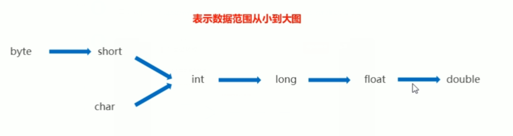

# SE

## 基础

### 数据

#### 变量类型

|          |    成员变量    |          局部变量          |          静态变量           |
| :------: | :------------: | :------------------------: | :-------------------------: |
| 定义位置 | 在类中，方法外 |    方法中或者方法的形参    |       在类中，方法外        |
| 初始化值 | 有默认初始化值 | 无，先定义，赋值后才能使用 |       有默认初始化值        |
| 调用方法 |    对象调用    |                            |     对象调用，类名调用      |
| 存储位置 |      堆中      |            栈中            | 方法区（JDK8 以后移到堆中） |
| 生命周期 |  与对象共存亡  |        与方法共存亡        |         与类共存亡          |
|   别名   |    实例变量    |                            |    类变量，静态成员变量     |

**静态变量只有一个，成员变量是类中的变量，局部变量是方法中的变量**


参考视频：https://www.bilibili.com/video/BV1TE41177mP


***


#### 数据类型

##### 基本类型

Java 语言提供了八种基本类型。六种数字类型（四个整数型，两个浮点型），一种字符类型，还有一种布尔型

整数默认为int类型，容易超过范围long数据类型后面要加“L/l”

同理小数默认为double类型，float需要在数字后面加“F/f”

**byte：**

- byte 数据类型是 8 位、有符号的，以**二进制补码**表示的整数，**8 位一个字节**，首位是符号位
- 最小值是 **-128（-2^7）**
- 最大值是 **127（2^7-1）**
- 默认值是 **`0`**
- byte 类型用在大型数组中节约空间，主要代替整数，byte 变量占用的空间只有 int 类型的四分之一
- 例子：`byte a = 100，byte b = -50`

**short：**

- short 数据类型是 16 位、有符号的以二进制补码表示的整数
- 最小值是 **-32768（-2^15）**
- 最大值是 **32767（2^15 - 1）**
- short 数据类型也可以像 byte 那样节省空间，一个 short 变量是 int 型变量所占空间的二分之一
- 默认值是 **`0`**
- 例子：`short s = 1000，short r = -20000`

**int：**

- int 数据类型是 32 位 4 字节、有符号的以二进制补码表示的整数
- 最小值是 **-2,147,483,648（-2^31）**
- 最大值是 **2,147,483,647（2^31 - 1）**
- 一般地整型变量默认为 int 类型
- 默认值是 **`0`**
- 例子：`int a = 100000, int b = -200000`

**long：**

- long 数据类型是 64 位 8 字节、有符号的以二进制补码表示的整数
- 最小值是 **-9,223,372,036,854,775,808（-2^63）**
- 最大值是 **9,223,372,036,854,775,807（2^63 -1）**
- 这种类型主要使用在需要比较大整数的系统上
- 默认值是 **` 0L`**
- 例子： `long a = 100000L，Long b = -200000L`
  "L"理论上不分大小写，但是若写成"l"容易与数字"1"混淆，不容易分辩，所以最好大写

**float：**

- float 数据类型是单精度、32 位、符合 IEEE 754 标准的浮点数
- float 在储存大型浮点数组的时候可节省内存空间
- 默认值是 **`0.0f`**
- 浮点数不能用来表示精确的值，如货币
- 例子：`float f1 = 234.5F`

**double：**

- double 数据类型是双精度、64 位、符合 IEEE 754 标准的浮点数
- 浮点数的默认类型为 double 类型
- double 类型同样不能表示精确的值，如货币
- 默认值是 **`0.0d`**
- 例子：`double d1 = 123.4`

**boolean：**

- boolean 数据类型表示一位的信息
- 只有两个取值：true 和 false
- JVM 规范指出 boolean 当做 int 处理，boolean 数组当做 byte 数组处理，这样可以得出 boolean 类型单独使用占了 4 个字节，在数组中是 1 个字节
- 默认值是 **`false`**
- 例子：`boolean one = true`

**char：**

- char 类型是一个单一的 16 位两个字节的 Unicode 字符
- 最小值是 **`\u0000`**（即为 0）
- 最大值是 **`\uffff`**（即为 65535）
- char 数据类型可以储存任何字符
- 例子：`char c = 'A';`   `char c = '张'`


自动类型转换




上下转型

* float 与 double：

  Java 不能隐式执行**向下转型**，因为这会使得精度降低（参考多态），但是可以向上转型

  ```java
  //1.1字面量属于double类型，不能直接将1.1直接赋值给 float 变量，因为这是向下转型
  float f = 1.1;//报错
  //1.1f 字面量才是 float 类型
  float f = 1.1f;
  ```

  ```java
  float f1 = 1.234f;
  double d1 = f1;
  
  double d2 = 1.23;
  float f2 = (float) d2;//向下转型需要强转
  ```

  ```java
  int i1 = 1245;
  long l1 = i1;
  
  long l2 = 1234;
  int i2 = (int) l2;
  ```

* 隐式类型转换：

  强制类型转换

  字面量 1 是 int 类型，它比 short 类型精度要高，因此不能隐式地将 int 类型向下转型为 short 类型

  使用 += 或者 ++ 运算符会执行隐式类型转换：

  ```java
  s1 += 1;	//s1++;
  //上面的语句相当于将 s1 + 1 的计算结果进行了向下转型（赋值运算符包含强制类型转换）
  s1 = (short) (s1 + 1);
  ```

  

  

***


##### 引用类型

引用数据类型：类，接口，数组都是引用数据类型，又叫包装类

包装类的作用：

* 包装类作为类首先拥有了 Object 类的方法
* 包装类作为引用类型的变量可以**存储 null 值**


```java
基本数据类型                包装类（引用数据类型）
byte                      Byte
short                     Short
int                       Integer(特殊)
long                      Long

float                     Float
double                    Double
char                      Character(特殊)
boolean                   Boolean
```

Java 为包装类做了一些特殊功能，具体来看特殊功能主要有：

* 可以把基本数据类型的值转换成字符串类型的值

  1. 调用 toString() 方法
  2. 调用 Integer.toString(基本数据类型的值) 得到字符串
  3. 直接把基本数据类型 + 空字符串就得到了字符串（推荐使用）

* 把字符串类型的数值转换成对应的基本数据类型的值（**重要**）

  1. Xxx.parseXxx("字符串类型的数值") → Integer.parseInt(numStr)
  2. Xxx.valueOf("字符串类型的数值")   → Integer.valueOf(numStr) （推荐使用）

  ```java
  public class PackageClass02 {
      public static void main(String[] args) {
          // 1.把基本数据类型的值转成字符串
          Integer it = 100 ;
          // a.调用toString()方法。
          String itStr = it.toString();
          System.out.println(itStr+1);//1001
          // b.调用Integer.toString(基本数据类型的值)得到字符串。
          String itStr1 = Integer.toString(it);
          System.out.println(itStr1+1);//1001
          // c.直接把基本数据类型+空字符串就得到了字符串。
          String itStr2 = it+"";
          System.out.println(itStr2+1);// 1001
  
          // 2.把字符串类型的数值转换成对应的基本数据类型的值。（真的很有用）
          String numStr = "23";
          //int numInt = Integer.parseInt(numStr);
          int numInt = Integer.valueOf(numStr);
          System.out.println(numInt+1);//24
  
          String doubleStr = "99.9";
          //double doubleDb = Double.parseDouble(doubleStr);
          double doubleDb = Double.valueOf(doubleStr);
          System.out.println(doubleDb+0.1);//100.0
      }
  }
  ```

  

***


#### 装箱拆箱

**自动装箱**：可以直接把基本数据类型的值或者变量赋值给包装类

**自动拆箱**：可以把包装类的变量直接赋值给基本数据类型

```java
public class PackegeClass {
    public static void main(String[] args) {
        int a = 12 ;
        Integer a1 = 12 ;  // 自动装箱
        Integer a2 = a ;   // 自动装箱
        Integer a3 = null; // 引用数据类型的默认值可以为null

        Integer c = 100 ;
        int c1 = c ;      // 自动拆箱

        Integer it = Integer.valueOf(12);  // 手工装箱！
        // Integer it1 = new Integer(12); // 手工装箱！
        Integer it2 = 12;

        Integer it3 = 111 ;
        int it33 = it3.intValue(); // 手工拆箱
    }
}
```

**自动装箱**反编译后底层调用 `Integer.valueOf()` 实现，源码：

```java
public static Integer valueOf(int i) {
    if (i >= IntegerCache.low && i <= IntegerCache.high)
        return IntegerCache.cache[i + (-IntegerCache.low)];
    return new Integer(i);
}
```

自动拆箱调用 `java.lang.Integer#intValue`，源码：

```java
public int intValue() {
    return value;
}
```


***


#### 缓存池

new Integer(123) 与 Integer.valueOf(123) 的区别在于：

- new Integer(123)：每次都会新建一个对象

- Integer.valueOf(123)：会使用缓存池中的对象，多次调用取得同一个对象的引用

  ```java
  Integer x = new Integer(123);
  Integer y = new Integer(123);
  System.out.println(x == y);    // false
  Integer z = Integer.valueOf(123);
  Integer k = Integer.valueOf(123);
  System.out.println(z == k);   // true
  ```

valueOf() 方法的实现比较简单，就是先判断值是否在缓存池中，如果在的话就直接返回缓存池的内容。编译器会在自动装箱过程调用 valueOf() 方法，因此多个值相同且值在缓存池范围内的 Integer 实例使用自动装箱来创建，那么就会引用相同的对象。

**基本类型对应的缓存池如下：**

- Boolean values true and false
- all byte values
- Short values between -128 and 127
- Long values between -128 and 127
- Integer values between -128 and 127
- Character in the range \u0000 to \u007F (0 and 127)

在 jdk 1.8 所有的数值类缓冲池中，**Integer 的缓存池 IntegerCache 很特殊，这个缓冲池的下界是 -128，上界默认是 127**，但是上界是可调的，在启动 jvm 的时候，通过 AutoBoxCacheMax=<size> 来指定这个缓冲池的大小，该选项在 JVM 初始化的时候会设定一个名为 java.lang.IntegerCache.high 系统属性，然后 IntegerCache 初始化的时候就会读取该系统属性来决定上界

```java
Integer x = 100;	//自动装箱，底层调用 Integer.valueOf(1)Integer y = 100;System.out.println(x == y);   	// trueInteger x = 1000;Integer y = 1000;System.out.println(x == y);   	// false，因为缓存池最大127int x = 1000;Integer y = 1000;System.out.println(x == y);		// true，因为 y 会调用 intValue 自动拆箱返回 int 原始值进行比较
```


***


#### 输入数据

语法：`Scanner sc = new Scanner(System.in)`

* next()：遇到了空格，就不再录入数据了，结束标记：空格、tab键
* nextLine()：可以将数据完整的接收过来，结束标记：回车换行符

一般使用 `sc.nextInt()` 或者 `sc.nextLine()` 接受整型和字符串，然后转成需要的数据类型

Scanner：`BufferedReader br = new BufferedReader(new InputStreamReader(System.in))`
print：`PrintStream.write()`

> 使用引用数据类型的API

```java
public static void main(String[] args) {
    Scanner sc = new Scanner(System.in);
    while (sc.hasNextLine()) {
        String msg = sc.nextLine();
    }
}
```


***


#### 面试题

* 有了基本数据类型，为什么还要引用数据类型？

  > 1、引用数据类型封装了数据和处理该数据的方法，比如Integer.parseInt(String)就是将String字符类型数据转换为Integer整型数据
  >
  > 2、Java中大部分类和方法都是针对引用数据类型，包括泛型和集合

* 引用数据类型那么好，为什么还用基本数据类型？

  > 引用类型的对象要多储存对象头，对基本数据类型来说空间浪费率太高
  > 逻辑上来讲，java只有包装类就够了，为了运行速度，需要用到基本数据类型；优先考虑运行效率的问题，所以二者同时存在是合乎情理的。

* Java集合不能存放基本数据类型，只存放对象的引用？

  > 不能放基本数据类型是因为不是Object的子类。泛型思想，如果不用泛型要写很多参数类型不同的但功能相同的函数（方法重载）

* ==

  > == 比较基本数据类型：比较的是具体的值
  > == 比较引用数据类型：比较的是对象地址值


****


### 数组

#### 初始化

数组就是存储数据长度固定的容器，存储多个数据的**数据类型要一致**，数组也是一个对象

创建数组：

* 数据类型[] 数组名：`int[] arr;`  （常用）
* 数据类型 数组名[]：`int arr[];`

静态初始化：

* 数据类型[] 数组名 = new 数据类型[]{元素1,元素2,...}：`int[] arr = new int[]{11,22,33};`
* 简化格式，数据类型[] 数组名 = {元素1,元素2,...}：`int[] arr = {44,55,66};`

动态初始化

* 只指定数组长度，由系统为数组分配初始值，new为数组申请内存空间
* 数据类型[] 数组名 = new 数据类型[数组长度]：`int[] arr = new int[3];`

```
System.out.println(arr[0]+1);//输出[I@7c30a502，为数组地址
```

#### 元素访问

* **索引**：每一个存储到数组的元素，都会自动的拥有一个编号，从**0**开始。这个自动编号称为数组索引(index)，可以通过数组的索引访问到数组中的元素。 	

* **访问格式：**数组名[索引]：`arr[0]`
* **赋值：**`arr[0] = 10;`


***


#### 内存分配

内存是计算机中的重要原件，临时存储区域，作用是运行程序。我们编写的程序是存放在硬盘中的，在硬盘中的程序是不会运行的。必须放进内存中才能运行，运行完毕后会清空内存。 Java虚拟机要运行程序，必须要对内存进行空间的分配和管理。 

| 区域名称   | 作用                                                     |
| ---------- | -------------------------------------------------------- |
| 寄存器     | 给CPU使用，和我们开发无关                                |
| 本地方法栈 | JVM在使用操作系统功能的时候使用，和我们开发无关          |
| 方法区     | 存储可以运行的class文件                                  |
| 堆内存     | 存储对象或者数组，new来创建的，都存储在堆内存            |
| 方法栈     | 方法运行时使用的内存，比如main方法运行，进入方法栈中执行 |

**内存分配图**：

* Java内存分配-一个数组内存图

  

* 两个数组内存图

  

* 多个数组指向相同内存图

  

***

#### 数组异常

* 索引越界异常：ArrayIndexOutOfBoundsException 

* 空指针异常：NullPointerException 

  ```java
  public class ArrayDemo {
      public static void main(String[] args) {
          int[] arr = new int[3];
          //把null赋值给数组
          arr = null;
          System.out.println(arr[0]);
      }
  }
  ```

  arr = null，表示变量arr将不再保存数组的内存地址，也就不允许再操作数组，因此运行的时候会抛出空指针异常。在开发中，空指针异常是不能出现的，一旦出现了，就必须要修改我们编写的代码。

  解决方案：给数组一个真正的堆内存空间引用即可！

  

***


#### 二维数组

二维数组也是一种容器，不同于一维数组，该容器存储的都是一维数组容器

初始化：

* 动态初始化：

  数据类型[][] 变量名 = new 数据类型[m] [n] : `int[][] arr = new int[3][3];`

  * m 表示这个二维数组，可以存放多少个一维数组，行
  * n 表示每一个一维数组，可以存放多少个元素，列

* 静态初始化

  * 数据类型[][] 变量名 = new 数据类型[][]{ {元素1, 元素2...} , {元素1, 元素2...} 
  * 数据类型[][] 变量名 = { {元素1, 元素2...} , {元素1, 元素2...} ...}
  * `int[][] arr = {{11,22,33}, {44,55,66}};`

遍历：

```java
public class Test1 {
    /*
        步骤:
            1. 遍历二维数组，取出里面每一个一维数组
            2. 在遍历的过程中，对每一个一维数组继续完成遍历，获取内部存储的每一个元素
     */
    public static void main(String[] args) {
        int[][] arr = {{11, 22, 33}, {33, 44, 55}};
        // 1. 遍历二维数组，取出里面每一个一维数组
        for (int i = 0; i < arr.length; i++) {
            //System.out.println(arr[i]);
            // 2. 在遍历的过程中，对每一个一维数组继续完成遍历，获取内部存储的每一个元素
            //int[] temp = arr[i];
            for (int j = 0; j < arr[i].length; j++) {
                System.out.println(arr[i][j]);
            }
        }
    }
}
```


****


### 运算

#### 优先级

| **优先级** | **描述**     | **运算符**              |
| ---------- | ------------ | ----------------------- |
| **1**      | 括号         | ()、[]                  |
| **2**      | 正负号       | +、-                    |
| **3**      | 自增自减，非 | ++、--、!               |
| **4**      | 乘除，取余   | *、/、%                 |
| **5**      | 加减         | +、-                    |
| **6**      | 移位运算     | <<、>>、>>>             |
| **7**      | 大小关系     | >、>=、<、<=            |
| **8**      | 相等关系     | ==、!=                  |
| **9**      | 按位与       | &                       |
| **10**     | 按位异或     | ^                       |
| **11**     | 按位或       | \|                      |
| **12**     | 逻辑与       | &&                      |
| **13**     | 逻辑或       | \|\|                    |
| **14**     | 条件运算     | ?:                      |
| **15**     | 赋值运算     | =、+=、-=、*=、/=、%=   |
| **16**     | 位赋值运算   | &=、\|=、<<=、>>=、>>>= |


#### 浮点数的运算

```java
System.out.println( 1f == 0.9999999f );// 打印：falseSystem.out.println( 1f == 0.99999999f );// 打印：true 纳尼？
```

二进制精读问题

+ **精度问题如何解决**

所以如果涉及**商品金额**、**交易值**、**货币计算**等这种对精度要求很高的场景该怎么办呢？

**方法一：用字符串或者数组解决多位数问题**

校招刷过算法题的小伙伴们应该都知道，用字符串或者数组表示大数是一个典型的解题思路。

比如经典面试题：**编写两个任意位数大数的加法、减法、乘法等运算**。

这时候我们我们可以用字符串或者数组来表示这种大数，然后按照四则运算的规则来手动模拟出具体计算过程，中间还需要考虑各种诸如：**进位**、**借位**、**符号**等等问题的处理，确实十分复杂，本文不做赘述。

**方法二：Java的大数类是个好东西**

JDK早已为我们考虑到了浮点数的计算精度问题，因此提供了专用于高精度数值计算的**大数类**来方便我们使用。

Java的大数类位于`java.math`包下：

可以看到，常用的`BigInteger` 和 `BigDecimal`就是处理高精度数值计算的利器。

当然了，像`BigInteger` 和 `BigDecimal`这种大数类的运算效率肯定是不如原生类型效率高，代价还是比较昂贵的，是否选用需要根据实际场景来评估。


---

#### 注意事项

+ 赋值运算符包含强制类型转换/

* i++ 与++i 的区别？
  i++ 表示先将 i 放在表达式中运算，然后再加 1
  ++i 表示先将 i 加 1，然后再放在表达式中运算

* || 和 |，&& 和& 的区别，逻辑运算符

  **&和| 称为布尔运算符，位运算符。&&和|| 称为条件布尔运算符,也叫短路运算符**。

  两种运算符得到的结果完全相同，但得到结果的方式又一个重要区别：条件布尔运算符性能比较好。他检查第一个操作数的值，再根据该操作数的值进行操作，可能根本就不处理第二个操作数。

  结论：如果 && 运算符的第一个操作数是 false，就不需要考虑第二个操作数的值了，因为无论第二个操作数的值是什么，其结果都是 false；同样，如果第一个操作数是 true，|| 运算符就返回 true，无需考虑第二个操作数的值。但 & 和 | 却不是这样，它们总是要计算两个操作数。为了提高性能，**尽可能使用 && 和 || 运算符**

* switch

  从 Java 7 开始，可以在 switch 条件判断语句中使用 String 对象

  ```java
  String s = "a";switch (s) {    case "a":        System.out.println("aaa");        break;    case "b":        System.out.println("bbb");        break;    default:        break;}
  ```

  switch 不支持 long、float、double，switch 的设计初衷是对那些只有少数几个值的类型进行等值判断，如果值过于复杂，那么用 if 比较合适

* break：跳出一层循环、continue跳出一次循环

* 移位运算

  计算机里一般用**补码表示数字**，正数、负数的表示区别就是最高位是 0 还是 1

  * 正数的原码反码补码相同

    ```java
    100:	00000000  00000000  00000000  01100100
    ```

  * 负数：
    原码：最高位为1，其余位置和正数相同
    反码：保证符号位不变，其余位置取反
    补码：保证符号位不变，其余位置取反加 1，即反码 +1

    ```java
    -100原码:	10000000  00000000  00000000  01100100	//32位-100反码:	11111111  11111111  11111111  10011011-100补码:	11111111  11111111  11111111  10011100
    ```

    补码 → 原码：符号位不变，其余位置取反加 1

  运算符：

  * `>>` 运算符：将二进制位进行右移操作，相当于除 2
  * `<<` 运算符：将二进制位进行左移操作，相当于乘 2
  * `>>>` 运算符：无符号右移，忽略符号位，空位都以 0 补齐

  运算规则：

  * 正数的左移与右移，空位补 0

  * 负数原码的左移与右移，空位补 0

    负数反码的左移与右移，空位补 1

    负数补码，左移低位补 0（会导致负数变为正数的问题，因为移动了符号位），右移高位补 1

  * 无符号移位，空位补 0


****


### 参数

#### 形参实参

形参：

* 形式参数，用于定义方法的时候使用的参数，只能是变量
* 形参只有在方法被调用的时候，虚拟机才分配内存单元，方法调用结束之后便会释放所分配的内存单元

实参：调用方法时传递的数据可以是常量，也可以是变量


#### 可变参数

可变参数用在形参中可以接收多个数据。

可变参数的格式：数据类型... 参数名称

可变参数的作用：传输参数非常灵活，方便。可以不传输参数、传输一个参数、或者传输一个数组。

可变参数在方法内部本质上就是一个数组。

可变参数的注意事项：
	1.一个形参列表中可变参数只能有一个！
	2.可变参数必须放在形参列表的**最后面**！

```java
public static void main(String[] args) {	sum(); // 可以不传输参数。	sum(10); // 可以传输一个参数。	sum(10,20,30); // 可以传输多个参数。	sum(new int[]{10,30,50,70,90}); // 可以传输一个数组。}public static void sum(int... nums){	int sum = 0;	for(int i : a) {		sum += i;	}	return sum;}
```


***


### 方法

#### 方法概述

方法（method）是将具有独立功能的代码块组织成为一个整体，使其具有特殊功能的代码集

注意：方法必须先创建才可以使用，该过程成为方法定义，方法创建后并不是直接可以运行的，需要手动使用后才执行，该过程成为方法调用

在方法内部定义的叫局部变量，局部变量不能加 static，包括 protected、private、public 这些也不能加

原因：局部变量是保存在==栈==中的，而静态变量保存于方法区（JDK8 在==堆==中），局部变量出了方法就被==栈回收了==，而静态变量不会，所以在局部变量前不能加 static 关键字，静态变量是定义在类中，又叫类变量


***


#### 定义调用

定义格式

```java
public static 返回值类型 方法名(参数) {	//方法体;	return 数据 ;}
```

调用格式

```java
数据类型 变量名 = 方法名 ( 参数 ) ;//注意：方法的返回值通常会使用变量接收，否则该返回值将无意义
```

* 方法名：调用方法时候使用的标识
* 参数：由数据类型和变量名组成，多个参数之间用逗号隔开
* 方法体：完成功能的代码块
* return：如果方法操作完毕，有数据返回，用于把数据返回给调用者

如果方法操作完毕

* void 类型的方法，直接调用即可，而且方法体中一般不写return
* 非 void 类型的方法，推荐用变量接收调用

原理：每个方法在被调用执行的时候，都会进入栈内存，并且拥有自己独立的内存空间，方法内部代码调用完毕之后，会从栈内存中弹栈消失。


***


#### 注意事项

* 方法不能嵌套定义

  ```java
  public class MethodDemo {	public static void main(String[] args) {	}	public static void methodOne() {		public static void methodTwo() {			// 这里会引发编译错误!!!		}	}}
  ```

* void 表示无返回值，可以省略 return，也可以单独的书写 return，后面不加数据

  ```java
  public static void methodTwo() {	//return 100; 编译错误，因为没有具体返回值类型	return;	//System.out.println(100); return语句后面不能跟数据或代码}
  ```

  

***


#### 方法重载

##### 重载介绍

方法重载指同一个类中定义的多个方法之间的关系，满足下列条件的多个方法相互构成重载：

1. 多个方法在**同一个类**中
2. 多个方法具有**相同的方法名**
3. 多个方法的**参数不相同**，类型不同或者数量不同

重载仅对应方法的定义，与方法的调用无关，调用方式参照标准格式

重载仅针对同一个类中==方法的名称与参数进行识别==，与==返回值无关==，**不能通过返回值来判定两个方法是否构成重载**

原理：JVM → 运行机制 → 方法调用 → 多态原理

```java
public class MethodDemo {	public static void fn(int a) {		//方法体	}    	public static int fn(int a) { /*错误原因：重载与返回值无关*/		//方法体	}        public static void fn(int a, int b) {/*正确格式*/		//方法体	}}
```


***


##### 方法选取

重载的方法在编译过程中即可完成识别，方法调用时 Java 编译器会根据所传入参数的声明类型（注意与实际类型区分）来选取重载方法。选取的过程共分为三个阶段：

* 在不考虑对基本类型自动装拆箱 (auto-boxing，auto-unboxing)，以及可变长参数的情况下选取重载方法
* 如果第 1 个阶段中没有找到适配的方法，那么在允许自动装拆箱，但不允许可变长参数的情况下选取重载方法
* 如果第 2 个阶段中没有找到适配的方法，那么在允许自动装拆箱以及可变长参数的情况下选取重载方法

如果 Java 编译器在同一个阶段中找到了多个适配的方法，那么会选择一个最为贴切的，而决定贴切程度的一个关键就是形式参数类型的继承关系，**一般会选择形参为参数类型的子类的方法，因为子类时更具体的实现**：

```java
public class MethodDemo {    void invoke(Object obj, Object... args) { ... }    void invoke(String s, Object obj, Object... args) { ... }    invoke(null, 1); // 调用第二个invoke方法，选取的第二阶段    invoke(null, 1, 2); // 调用第二个invoke方法，匹配第一个和第二个，但String是Object的子类        invoke(null, new Object[]{1}); // 只有手动绕开可变长参数的语法糖，才能调用第一个invoke方法    							   // 可变参数底层是数组，JVM->运行机制->代码优化}
```

因此不提倡可变长参数方法的重载


***


##### 继承重载

除了同一个类中的方法，重载也可以作用于这个类所继承而来的方法。如果子类定义了与父类中**非私有方法**同名的方法，而且这两个方法的参数类型不同，那么在子类中，这两个方法同样构成了重载

* 如果这两个方法都是静态的，那么子类中的方法隐藏了父类中的方法
* 如果这两个方法都不是静态的，且都不是私有的，那么子类的方法重写了父类中的方法，也就是**多态**


***


#### 参数传递

**Java 的参数是以值传递的形式传入方法中**

值传递和引用传递的区别在于传递后会不会影响实参的值：值传递会创建副本，引用传递不会创建副本

* 基本数据类型：形式参数的改变，不影响实际参数

  每个方法在栈内存中，都会有独立的栈空间，方法运行结束后就会弹栈消失

  ```java
  public class ArgsDemo01 {	public static void main(String[] args) {		int number = 100;		System.out.println("调用change方法前：" + number);//100		change(number);		System.out.println("调用change方法后：" + number);//100	}	public static void change(int number) {		number = 200;	}}
  ```

* 引用类型：形式参数的改变，影响实际参数的值

  **引用数据类型的传参，本质上是将对象的地址以值的方式传递到形参中**，内存中会造成两个引用指向同一个内存的效果，所以即使方法弹栈，堆内存中的数据也已经是改变后的结果

  ```java
  public class PassByValueExample {    public static void main(String[] args) {        Dog dog = new Dog("A");        func(dog);        System.out.println(dog.getName());	// B    }    private static void func(Dog dog) {        dog.setName("B");    }}class Dog {    String name;//.....}
  ```

  


***


### 枚举

枚举是 Java 中的一种特殊类型，为了做信息的标志和信息的分类

定义枚举的格式：

```java
修饰符 enum 枚举名称{	第一行都是罗列枚举实例的名称。}
```

枚举的特点：

* 枚举类是用 final 修饰的，枚举类不能被继承
* 枚举类默认继承了 java.lang.Enum 枚举类
* 枚举类的第一行都是常量，必须是罗列枚举类的实例名称
* 枚举类相当于是多例设计模式
* 每个枚举项都是一个实例，是一个静态成员变量

| 方法名                                            | 说明                                 |
| ------------------------------------------------- | ------------------------------------ |
| String name()                                     | 获取枚举项的名称                     |
| int ordinal()                                     | 返回枚举项在枚举类中的索引值         |
| int compareTo(E  o)                               | 比较两个枚举项，返回的是索引值的差值 |
| String toString()                                 | 返回枚举常量的名称                   |
| static <T> T  valueOf(Class<T> type,String  name) | 获取指定枚举类中的指定名称的枚举值   |
| values()                                          | 获得所有的枚举项                     |

* 源码分析：

  ```java
  enum Season {    SPRING , SUMMER , AUTUMN , WINTER;}// 枚举类的编译以后源代码：public final class Season extends java.lang.Enum<Season> {	public static final Season SPRING = new Season();	public static final Season SUMMER = new Season();	public static final Season AUTUMN = new Season();	public static final Season WINTER = new Season();	public static Season[] values();	public static Season valueOf(java.lang.String);}
  ```

* API 使用

  ```java
  public class EnumDemo {    public static void main(String[] args){        // 获取索引        Season s = Season.SPRING;/        System.out.println(s);	//SPRING        System.out.println(s.ordinal()); // 0，代表索引，summer 就是 1        s.s.doSomething();        // 获取全部枚举        Season[] ss = Season.values();        for(int i = 0; i < ss.length; i++){            System.out.println(ss[i]);        }                int result = Season.SPRING.compareTo(Season.WINTER);        System.out.println(result);//-3    }}enum Season {    SPRING , SUMMER , AUTUMN , WINTER;        public void doSomething() {        System.out.println("hello ");    }}
  ```


***


### Debug

Debug 是供程序员使用的程序调试工具，它可以用于查看程序的执行流程，也可以用于追踪程序执行过程来调试程序。

加断点 → Debug 运行 → 单步运行 → 看 Debugger 窗口 → 看 Console 窗口


***


## 对象

### 概述

**Java是一种面向对象的高级编程语言。**

**三大特征：封装，继承，多态**

面向对象最重要的两个概念：类和对象

* 类：相同事物共同特征的描述。类只是学术上的一个概念并非真实存在的，只能描述一类事物
* 对象：是真实存在的实例， 实例==对象，**对象是类的实例化**
* 结论：有了类和对象就可以描述万千世界所有的事物。 必须先有类才能有对象


***


### 类

#### 定义

定义格式

```java
修饰符 class 类名{}
```

1. 类名的首字母建议大写，满足驼峰模式，比如 StudentNameCode
2. 一个 Java 代码中可以定义多个类，按照规范一个 Java 文件一个类
3. 一个 Java 代码文件中，只能有一个类是 public 修饰，**public修饰的类名必须成为当前Java代码的文件名称**

```java
类中的成分:有且仅有五大成分修饰符 class 类名{		1.成员变量(Field):  	描述类或者对象的属性信息的。        2.成员方法(Method):		描述类或者对象的行为信息的。		3.构造器(Constructor):	 初始化一个对象返回。		4.代码块		5.内部类	  }类中有且仅有这五种成分，否则代码报错！public class ClassDemo {    System.out.println(1);//报错}
```


***


#### 构造器

构造器格式：

```java
修饰符 类名(形参列表){}
```

作用：初始化类的一个对象返回

分类：无参数构造器，有参数构造器

注意：**一个类默认自带一个无参数构造器**，写了有参数构造器默认的无参数构造器就消失，还需要用无参数构造器就要重新写

构造器初始化对象的格式：类名 对象名称 = new 构造器

* 无参数构造器的作用：初始化一个类的对象（使用对象的默认值初始化）返回
* 有参数构造器的作用：初始化一个类的对象（可以在初始化对象的时候为对象赋值）返回


------


### 包

包：分门别类的管理各种不同的技术，便于管理技术，扩展技术，阅读技术

定义包的格式：`package 包名`，必须放在类名的最上面

导包格式：`import 包名.类名`

相同包下的类可以直接访问；不同包下的类必须导包才可以使用


***


### 封装

封装的哲学思维：合理隐藏，合理暴露
封装最初的目的：提高代码的安全性和复用性，组件化

封装的步骤：

1. **成员变量应该私有，用 private 修饰，只能在本类中直接访问**
2. **提供成套的 getter 和 setter 方法暴露成员变量的取值和赋值**

使用 private 修饰成员变量的原因：实现数据封装，不想让别人使用修改你的数据，比较安全


***


### this

this 关键字的作用：

* this 关键字代表了当前对象的引用
* this 出现在方法中：**哪个对象调用这个方法 this 就代表谁**
* this 可以出现在构造器中：代表构造器正在初始化的那个对象
* this 可以区分变量是访问的成员变量还是局部变量


------


### static

#### 基本介绍

Java 是通过成员变量是否有 static 修饰来区分是类的还是属于对象的。

static 静态修饰的成员（方法和成员变量）属于类本身的。

按照有无 static 修饰，成员变量和方法可以分为：

* 成员变量：
  * 静态成员变量（类变量）：static 修饰的成员变量，属于类本身，**与类一起加载一次，只有一个**，直接用类名访问即可
  * 实例成员变量：无 static 修饰的成员变量，属于类的每个对象的，**与类的对象一起加载**，对象有多少个，实例成员变量就加载多少个，必须用类的对象来访问

* 成员方法：
  * 静态方法：有 static 修饰的成员方法称为静态方法也叫类方法，属于类本身的，直接用类名访问即可
  * 实例方法：无 static 修饰的成员方法称为实例方法，属于类的每个对象的，必须用类的对象来访问


****


#### static用法

成员变量的访问语法：

* 静态成员变量：只有一份可以被类和类的对象**共享访问**
  * 类名.静态成员变量（同一个类中访问静态成员变量可以省略类名不写）
  * 对象.静态成员变量（不推荐）

* 实例成员变量：
  * 对象.实例成员变量（先创建对象）

成员方法的访问语法：

* 静态方法：有 static 修饰，属于类

  * 类名.静态方法（同一个类中访问静态成员可以省略类名不写）
  * 对象.静态方法（不推荐，参考 JVM → 运行机制 → 方法调用）

* 实例方法：无 static 修饰，属于对象

  * 对象.实例方法

  ```java
  public class Student {    // 1.静态方法：有static修饰，属于类，直接用类名访问即可！    public static void inAddr(){ }    // 2.实例方法：无static修饰，属于对象，必须用对象访问！    public void eat(){}        public static void main(String[] args) {        // a.类名.静态方法        Student.inAddr();        inAddr();        // b.对象.实例方法        // Student.eat(); // 报错了！        Student zbj = new Student();        zbj.eat();    }}
  ```


***


#### 两个问题

内存问题：

* **栈内存存放 main 方法和地址**

* **堆内存存放对象和变量**

* **方法区存放 class 和静态变量（jdk8 以后移入堆）**

访问问题：

* 实例方法是否可以直接访问实例成员变量？可以的，因为它们都属于对象
* 实例方法是否可以直接访问静态成员变量？可以的，静态成员变量可以被共享访问
* 实例方法是否可以直接访问实例方法? 可以的，实例方法和实例方法都属于对象
* 实例方法是否可以直接访问静态方法？可以的，静态方法可以被共享访问
* 静态方法是否可以直接访问实例变量？ 不可以的，实例变量必须用对象访问！！
* 静态方法是否可以直接访问静态变量？ 可以的，静态成员变量可以被共享访问。
* 静态方法是否可以直接访问实例方法? 不可以的，实例方法必须用对象访问！！
* 静态方法是否可以直接访问静态方法？可以的，静态方法可以被共享访问！！


------


### 继承

#### 基本介绍

继承是 Java 中一般到特殊的关系，是一种子类到父类的关系

* 被继承的类称为：父类/超类。
* 继承父类的类称为：子类。

继承的作用：

* **提高代码的复用**，相同代码可以定义在父类中
* 子类继承父类，可以直接使用父类这些代码（相同代码重复利用）
* 子类得到父类的属性（成员变量）和行为（方法），还可以定义自己的功能，子类更强大

继承的特点：

1. 子类的全部构造器默认先访问父类的无参数构造器，再执行自己的构造器
2. **单继承**：一个类只能继承一个直接父类
3. 多层继承：一个类可以间接继承多个父类（家谱）
4. 一个类可以有多个子类
5. 一个类要么默认继承了 Object 类，要么间接继承了 Object 类，Object 类是 Java 中的祖宗类

继承的格式：

```java
子类 extends 父类{}
```

子类不能继承父类的东西：

* 子类不能继承父类的构造器，子类有自己的构造器
* 子类是不能可以继承父类的私有成员的，可以反射暴力去访问继承自父类的私有成员
* 子类是不能继承父类的静态成员的，子类只是可以访问父类的静态成员，父类静态成员只有一份可以被子类共享访问，**共享并非继承**

```java
public class ExtendsDemo {    public static void main(String[] args) {        Cat c = new Cat();        // c.run();        Cat.test();        System.out.println(Cat.schoolName);    }}class Cat extends Animal{}class Animal{    public static String schoolName ="seazean";    public static void test(){}    private void run(){}}
```


***


#### 变量访问

继承后成员变量的访问特点：**就近原则**，子类有找子类，子类没有找父类，父类没有就报错

如果要申明访问父类的成员变量可以使用：super.父类成员变量，super指父类引用

```java
public class ExtendsDemo {    public static void wmain(String[] args) {        Wolf w = new Wolf();w        w.showName();    }}class Wolf extends Animal{    private String name = "子类狼";    public void showName(){        String name = "局部名称";        System.out.println(name); // 局部name        System.out.println(this.name); // 子类对象的name        System.out.println(super.name); // 父类的        System.out.println(name1); // 父类的        //System.out.println(name2); // 报错。子类父类都没有    }}class Animal{    public String name = "父类动物名称";    public String name1 = "父类";}
```


***


#### 方法访问

子类继承了父类就得到了父类的方法，**可以直接调用**，受权限修饰符的限制，也可以重写方法

方法重写：子类重写一个与父类申明一样的方法来**覆盖**父类的该方法

方法重写的校验注解：@Override

* 方法加了这个注解，那就必须是成功重写父类的方法，否则报错 
* @Override 优势：可读性好，安全，优雅

**子类可以扩展父类的功能，但不能改变父类原有的功能**，重写有以下三个限制：

- 子类方法的访问权限必须大于等于父类方法
- 子类方法的返回类型必须是父类方法返回类型或为其子类型
- 子类方法抛出的异常类型必须是父类抛出异常类型或为其子类型

继承中的隐藏问题：

- 子类和父类方法都是静态的，那么子类中的方法会隐藏父类中的方法
- 在子类中可以定义和父类成员变量同名的成员变量，此时子类的成员变量隐藏了父类的成员变量，在创建对象为对象分配内存的过程中，**隐藏变量依然会被分配内存**

```java
public class ExtendsDemo {    public static void main(String[] args) {        Wolf w = new Wolf();        w.run();    }}class Wolf extends Animal{    @Override    public void run(){}//}class Animal{    public void run(){}}
```


***


#### 面试问题

* 为什么子类构造器会先调用父类构造器？

  1. 子类的构造器的第一行默认 super() 调用父类的无参数构造器，写不写都存在
  2. 子类继承父类，子类就得到了父类的属性和行为。调用子类构造器初始化子类对象数据时，必须先调用父类构造器初始化继承自父类的属性和行为
  3. 参考 JVM → 类加载 → 对象创建

  ```java
  class Animal{    public Animal(){        System.out.println("==父类Animal的无参数构造器==");    }}class Tiger extends Animal{    public Tiger(){        super(); // 默认存在的，根据参数去匹配调用父类的构造器。        System.out.println("==子类Tiger的无参数构造器==");    }    public Tiger(String name){        //super();  默认存在的，根据参数去匹配调用父类的构造器。        System.out.println("==子类Tiger的有参数构造器==");    }}
  ```

* **为什么 Java 是单继承的？**

  答：反证法，假如 Java 可以多继承，请看如下代码：

  ```java
  class A{	public void test(){		System.out.println("A");	}}class B{	public void test(){		System.out.println("B");	}}class C extends A , B {	public static void main(String[] args){		C c = new C();        c.test();         // 出现了类的二义性！所以Java不能多继承！！	}}
  ```

  


------


### super

继承后 super 调用父类构造器，父类构造器初始化继承自父类的数据。


总结与拓展：

* this 代表了当前对象的引用（继承中指代子类对象）：this.子类成员变量、this.子类成员方法、**this(...)**可以根据参数匹配访问本类其他构造器。
* super 代表了父类对象的引用（继承中指代了父类对象空间）：super.父类成员变量、super.父类的成员方法、super(...)可以根据参数匹配访问父类的构造器

**注意：**

* this(...) 借用本类其他构造器，super(...) 调用父类的构造器。
* this(...) 或 super(...) 必须放在构造器的第一行，否则报错!
* this(...) 和 super(...) 不能同时出现在构造器中，因为构造函数必须出现在第一行上，只能选择一个。

```java
public class ThisDemo {    public static void main(String[] args) {        // 需求：希望如果不写学校默认就是”张三“！        Student s1 = new Student("天蓬元帅", 1000 );        Student s2 = new Student("齐天大圣", 2000, "清华大学" );    }}class Study extends Student {   public Study(String name, int age, String schoolName) {        super(name , age , schoolName) ;        // 根据参数匹配调用父类构造器   }}class Student{    private String name ;    private int age ;    private String schoolName ;    public Student() {    }    public Student(String name , int age){        // 借用兄弟构造器的功能！        this(name , age , "张三");    }	public Student(String name, int age, String schoolName) {        this.name = name;        this.age = age;        this.schoolName = schoolName;    }// .......get + set}
```


***


### final

#### 基本介绍

final 用于修饰：类，方法，变量

* final 修饰类，类不能被继承了，类中的方法和变量可以使用
* final 可以修饰方法，方法就不能被重写
* final 修饰变量总规则：变量有且仅能被赋值一次

**面试题**：final 和 abstract 的关系是互斥关系，不能同时修饰类或者同时修饰方法！


***


#### 修饰变量

##### 静态变量

final 修饰静态成员变量，变量变成了常量

**常量：有 public static final 修饰，名称字母全部大写，多个单词用下划线连接。**

final 修饰静态成员变量可以在哪些地方赋值：

1. 定义的时候赋值一次

2. 可以在静态代码块中赋值一次

```java
public class FinalDemo {//常量：public static final修饰，名称字母全部大写，下划线连接。    public static final String SCHOOL_NAME = "张三" ;    public static final String SCHOOL_NAME1;    static{        //SCHOOL_NAME = "java";//报错        SCHOOL_NAME1 = "张三1";        //SCHOOL_NAME1 = "张三2"; // 报错，第二次赋值！    }}
```


##### 实例变量

final 修饰变量的总规则：有且仅能被赋值一次

final 修饰实例成员变量可以在哪些地方赋值 1 次：

1. 定义的时候赋值一次
2. 可以在实例代码块中赋值一次
3. 可以在每个构造器中赋值一次

```java
public class FinalDemo {    private final String name = "张三" ;    private final String name1;    private final String name2;    {        // 可以在实例代码块中赋值一次。        name1 = "张三1";    }	//构造器赋值一次    public FinalDemo(){        name2 = "张三2";    }    public FinalDemo(String a){        name2 = "张三2";    }    public static void main(String[] args) {        FinalDemo f1 = new FinalDemo();        //f1.name = "张三1"; // 第二次赋值 报错！    }}
```


***


### 抽象类

#### 基本介绍

> 父类知道子类要完成某个功能，但是每个子类实现情况不一样。

抽象方法：没有方法体，只有方法签名，必须用**abstract**修饰的方法就是抽象方法
抽象类：拥有抽象方法的类必须定义成抽象类，必须用**abstract**修饰，抽象类是为了被继承

一个类继承抽象类，**必须重写抽象类的全部抽象方法**，否则这个类必须定义成抽象类，因为拥有抽象方法的类必须定义成抽象类

```java
public class AbstractDemo {    public static void main(String[] args) {        Dog d = new Dog();        d.run();    }}class Dog extends Animal{    @Override    public void run() {         System.out.println("🐕跑");     }}abstract class Animal{    public abstract void run();}
```


***


#### 面试问题

一、抽象类是否有构造器，是否可以创建对象?
答：抽象类作为类一定有构造器，而且必须有构造器，提供给子类继承后调用父类构造器使用的

* 抽象类有构造器，但是抽象类不能创建对象，类的其他成分它都具备
* 抽象类中存在抽象方法，但不能执行，**抽象类中也可没有抽象方法**

> 抽象在学术上本身意味着不能实例化

```java
public class AbstractDemo {    public static void main(String[] args) {        //Animal a = new Animal(); 抽象类不能创建对象！        //a.run(); // 抽象方法不能执行    }}abstract class Animal{    private String name;    public static String schoolName = "张三";    public Animal(){ }    public abstract void run();    //普通方法    public void go(){ }}
```

二、static 与 abstract 能同时使用吗？
答：不能，被 static 修饰的方法属于类，是类自己的东西，不是给子类来继承的，而抽象方法本身没有实现，就是用来给子类继承


***


#### 存在意义

**被继承**，抽象类就是为了被子类继承，否则抽象类将毫无意义（核心）

抽象类体现的是"模板思想"：**部分实现，部分抽象**，可以使用抽象类设计一个模板模式

```java
//作文模板public class ExtendsDemo {    public static void main(String[] args) {        Student xiaoMa = new Student();        xiaoMa.write();    }}class Student extends Template{    @Override    public String writeText() {return "\t内容"}}// 1.写一个模板类：代表了作文模板。abstract class Template{    private String title = "\t\t\t\t\t标题";    private String start = "\t开头";    private String last = "\t结尾";    public void write(){        System.out.println(title+"\n"+start);        System.out.println(writeText());        System.out.println(last);    }    // 正文部分定义成抽象方法，交给子类重写！！    public abstract String writeText();}
```


***


### 接口

#### 基本介绍

接口，是 Java 语言中一种引用类型，是方法的集合。

接口是更加彻底的抽象，接口中只有抽象方法和常量，没有其他成分，jdk1.8 前

```java
 修饰符 interface 接口名称{	// 抽象方法	// 默认方法	// 静态方法	// 私有方法}
```

* 抽象方法：接口中的抽象方法默认会加上public abstract修饰，所以可以省略不写

* 静态方法：静态方法必须有方法体

* 常量：常量是public static final修饰的成员变量，仅能被赋值一次，值不能改变。常量的名称规范上要求全部大写，多个单词下划线连接。public static final可以省略不写。

  ```java
  public interface InterfaceDemo{    //public static final String SCHOOL_NAME = "张三";	String SCHOOL_NAME = "张三";        //public abstract void run();    void run();//默认补充}
  ```


***


#### 实现接口

作用：**接口是用来被类实现的。**

类与类是继承关系：一个类只能直接继承一个父类，单继承
类与接口是实现关系：一个类可以实现多个接口，多实现，接口不能继承类
接口与接口继承关系：**多继承**

>子类   继承   父类
>实现类 实现   接口

```java
修饰符 class 实现类名称 implements 接口1,接口2,接口3,....{}修饰符 interface 接口名 extend 接口1,接口2,接口3,....{    }
```

实现多个接口的使用注意事项：

1. 当一个类实现多个接口时，多个接口中存在同名的静态方法并不会冲突，只能通过各自接口名访问静态方法

2. 当一个类实现多个接口时，多个接口中存在同名的默认方法，实现类必须重写这个方法

3. 当一个类，既继承一个父类，又实现若干个接口时，父类中的成员方法与接口中的默认方法重名，子类**就近选择执行父类**的成员方法

4. 接口中，没有构造器，**不能创建对象**，接口是更彻底的抽象，连构造器都没有，自然不能创建对象！！

   ```java
   public class InterfaceDemo {    public static void main(String[] args) {        Student s = new Student();        s.run();        s.rule();    }}class Student implements Food, Person{    @Override    public void eat() {}        @Override    public void run() {}}interface Food{    void eat();}interface Person{    void run();}//可以直接 interface Person extend Food,//然后 class Student implements Person 效果一样
   ```

   

***


#### 新增功能

jdk1.8 以后新增的功能：

* 默认方法（就是普通实例方法）
  * 必须用 default 修饰，默认会 public 修饰
  * 必须用接口的实现类的对象来调用
* 静态方法
  * 默认会 public 修饰
  * 接口的静态方法必须用接口的类名本身来调用
  * 调用格式：ClassName.method()
* 私有方法：JDK 1.9 才开始有的，只能在**本类中**被其他的默认方法或者私有方法访问

```java
public class InterfaceDemo {    public static void main(String[] args) {        // 1.默认方法调用：必须用接口的实现类对象调用。        Man m = new Man();        m.run();        m.work();        // 2.接口的静态方法必须用接口的类名本身来调用。        InterfaceJDK8.inAddr();    }}class Man implements InterfaceJDK8{    @Override    public void work() {        System.out.println("工作中。。。");    }}interface InterfaceJDK8{    //抽象方法！！    void work();    // a.默认方法（就是之前写的普通实例方法）    // 必须用接口的实现类的对象来调用。    default void run(){        go();        System.out.println("开始跑步🏃‍");    }    // b.静态方法    // 注意：接口的静态方法必须用接口的类名本身来调用    static void inAddr(){        System.out.println("我们在武汉");    }        // c.私有方法（就是私有的实例方法）: JDK 1.9才开始有的。    // 只能在本接口中被其他的默认方法或者私有方法访问。    private void go(){        System.out.println("开始。。");    }}
```


***


#### 对比抽象类

| **参数**           | **抽象类**                                                   | **接口**                                                     |
| ------------------ | ------------------------------------------------------------ | ------------------------------------------------------------ |
| 默认的方法实现     | 可以有默认的方法实现                                         | 接口完全是抽象的，jdk8以后有默认的实现                       |
| 实现               | 子类使用**extends**关键字来继承抽象类。如果子类不是抽象类的话，它需要提供抽象类中所有声明的方法的实现。 | 子类使用关键字**implements**来实现接口。它需要提供接口中所有声明的方法的实现 |
| 构造器             | 抽象类可以有构造器                                           | 接口不能有构造器                                             |
| 与正常Java类的区别 | 除了不能实例化抽象类之外，和普通Java类没有任何区别           | 接口是完全不同的类型                                         |
| 访问修饰符         | 抽象方法可以有**public**、**protected**和**default**这些修饰符 | 接口方法默认修饰符是**public**，别的修饰符需要有方法体       |
| main方法           | 抽象方法可以有main方法并且我们可以运行它                     | jdk8以前接口没有main方法，不能运行；jdk8以后接口可以有default和static方法，可以运行main方法 |
| 多继承             | 抽象方法可以继承一个类和实现多个接口                         | 接口可以继承一个或多个其它接口，接口不可继承类               |
| 速度               | 比接口速度要快                                               | 接口是稍微有点慢的，因为它需要时间去寻找在类中实现的方法     |
| 添加新方法         | 如果往抽象类中添加新的方法，可以给它提供默认的实现，因此不需要改变现在的代码 | 如果往接口中添加方法，那么必须改变实现该接口的类             |


------


### 多态

#### 基本介绍

多态的概念：同一个实体同时具有多种形式同一个类型的对象，执行同一个行为，在不同的状态下会表现出不同的行为特征。

多态的格式：

* 父类类型范围 > 子类类型范围

```java
父类类型 对象名称 = new 子类构造器;接口	  对象名称 = new 实现类构造器;
```

多态的执行：

* 对于方法的调用：**编译看左边，运行看右边**（分派机制）
* 对于变量的调用：**编译看左边，运行看左边**

多态的使用规则：

* 必须存在继承或者实现关系
* 必须存在父类类型的变量引用子类类型的对象
* 存在方法重写

多态的优势：

* 在多态形式下，右边对象可以实现组件化切换，业务功能也随之改变，便于扩展和维护。可以实现类与类之间的**解耦**
* 父类类型作为方法形式参数，传递子类对象给方法，可以传入一切子类对象进行方法的调用，更能体现出多态的**扩展性**与便利性

多态的劣势： 

* 多态形式下，不能直接调用子类特有的功能，因为编译看左边，父类中没有子类独有的功能，所以代码在编译阶段就直接报错了！ 

```java
public class PolymorphicDemo {    public static void main(String[] args) {        Animal c = new Cat();        c.run();        //c.eat();//报错  编译看左边 需要强转        go(c);        go(new Dog);       }    //用 Dog或者Cat 都没办法让所有动物参与进来，只能用Anima    public static void go(Animal d){}    }class Dog extends Animal{}class Cat extends Animal{    public void eat();    @Override    public void run(){}}class Animal{    public void run(){}}
```


***


#### 上下转型

>基本数据类型的转换：
>1.小范围类型的变量或者值可以直接赋值给大范围类型的变量。
>2.大范围类型的变量或者值必须强制类型转换给小范围类型的变量。

引用数据类型的**自动**类型转换语法：子类类型的对象或者变量可以自动类型转换赋值给父类类型的变量。

**父类引用指向子类对象**

- **向上转型(upcasting)**：通过子类对象(小范围)实例化父类对象(大范围)，这种属于自动转换
- **向下转型(downcasting)**：通过父类对象(大范围)实例化子类对象(小范围)，这种属于强制转换

```java
public class PolymorphicDemo {    public static void main(String[] args){        Animal a = new Cat();//向上转型        Cat c = (Cat)a;//向下转型    }}class Animal{}class Cat extends Animal{}
```


***


#### instanceof

instanceof：判断左边的对象是否是右边的类的实例，或者是其直接或间接子类，或者是其接口的实现类

* 引用类型强制类型转换：父类类型的变量或者对象强制类型转换成子类类型的变量，否则报错
* 强制类型转换的格式：**类型 变量名称 = (类型)(对象或者变量)**
* 有继承/实现关系的两个类型就可以进行强制类型转换，编译阶段一定不报错，但是运行阶段可能出现类型转换异常 ClassCastException

```java
public class Demo{    public static void main(String[] args){		Aniaml a = new Dog();		//Dog d = (Dog)a;        //Cat c = (Cat)a; 编译不报错，运行报ClassCastException错误        if(a instanceof Cat){            Cat c = (Cat)a;         } else if(a instanceof Dog) {            Dog d = (Dog)a;        }    }}class Dog extends Animal{}class Cat extends Animal{}class Animal{}
```


***


### 内部类

#### 概述

内部类是类的五大成分之一：成员变量，方法，构造器，代码块，内部类

概念：定义在一个类里面的类就是内部类

作用：提供更好的封装性，体现出组件思想，**间接解决类无法多继承引起的一系列问题**

分类：静态内部类、实例内部类（成员内部类）、局部内部类、**匿名内部类**（重点）


***


#### 静态内部类

定义：有static修饰，属于外部类本身，会加载一次

静态内部类中的成分研究：

* 类有的成分它都有，静态内部类属于外部类本身，只会加载一次
* 特点与外部类是完全一样的，只是位置在别人里面
* 可以定义静态成员

静态内部类的访问格式：外部类名称.内部类名称

静态内部类创建对象的格式：外部类名称.内部类名称 对象名称 = new 外部类名称.内部类构造器;

静态内部类的访问拓展：

* 静态内部类中是否可以直接访问外部类的静态成员?	可以，外部类的静态成员只有一份，可以被共享
* 静态内部类中是否可以直接访问外部类的实例成员?	不可以，外部类的成员必须用外部类对象访问

```java
public class Demo{    public static void main(String[] args){        Outter.Inner in = new Outter.Inner();    }}static class Outter{    public static int age;    private double salary;    public static class Inner{         //拥有类的所有功能 构造器 方法 成员变量         System.out.println(age);         //System.out.println(salary);报错	}}
```


***


#### 实例内部类

定义：无static修饰的内部类，属于外部类的每个对象，跟着外部类对象一起加载。

实例内部类的成分特点：实例内部类中不能定义静态成员，其他都可以定义

实例内部类的访问格式：外部类名称.内部类名称

创建对象的格式：外部类名称.内部类名称 对象名称 = new 外部类构造器.new 内部构造器;

* `Outter.Inner in = new Outter().new Inner();`

拓展：**实例内部类可以访问外部类的全部成员**

> * 实例内部类中是否可以直接访问外部类的静态成员？
>   可以，外部类的静态成员可以被共享访问！
> * 实例内部类中是否可以访问外部类的实例成员？
>   可以，实例内部类属于外部类对象，可以直接访问外部类对象的实例成员！


***


#### 局部内部类

局部内部类：定义在方法中，在构造器中，代码块中，for循环中定义的内部类。

局部内部类中的成分特点：只能定义实例成员，不能定义静态成员

```java
public class InnerClass{	public static void main(String[] args){        String name;        class{}    }    public static void test(){		class Animal{}		class Cat extends Animal{}  	}}
```


***


#### 匿名内部类

匿名内部类：没有名字的局部内部类
作用：简化代码，是开发中常用的形式

匿名内部类的格式：

```java
new 类名|抽象类|接口(形参){	//方法重写。}
```

 匿名内部类的特点：

* 匿名内部类不能定义静态成员
* 匿名内部类一旦写出来，就会立即创建一个匿名内部类的对象返回
* **匿名内部类的对象的类型相当于是当前new的那个的类型的子类类型**
* 匿名内部类引用局部变量必须是**常量**，底层创建为内部类的成员变量（原因：JVM → 运行机制 → 代码优化）

```java
public class Anonymity {    public static void main(String[] args) {        Animal a = new Animal(){            @Override            public void run() {                System.out.println("猫跑的贼溜~~");                //System.out.println(n);            }        };        a.run();        a.go();    }}abstract class Animal{    public abstract void run();    public void go(){        System.out.println("开始go~~~");    }}
```


***


### 权限符

权限修饰符：有四种**（private -> 缺省 -> protected - > public ）**
可以修饰成员变量，修饰方法，修饰构造器，内部类，不同修饰符修饰的成员能够被访问的权限将受到限制!

| 四种修饰符访问权限 | private | 缺省 | protected | public |
| ------------------ | :-----: | :--: | :-------: | :----: |
| 本类中             |    √    |  √   |     √     |   √    |
| 本包下的子类中     |    X    |  √   |     √     |   √    |
| 本包下其他类中     |    X    |  √   |     √     |   √    |
| 其他包下的子类中   |    X    |  X   |     √     |   √    |
| 其他包下的其他类中 |    X    |  X   |     X     |   √    |

protected 用于修饰成员，表示在继承体系中成员对于子类可见

* 基类的 protected 成员是包内可见的，并且对子类可见
* 若子类与基类不在同一包中，那么子类实例可以访问其从基类继承而来的 protected 方法（重写），而不能访问基类实例的 protected 方法


***


### 代码块

#### 静态代码块

静态代码块的格式：

 ```java
static {}
 ```

* 静态代码块特点： 
  * 必须有static修饰
  * 会与类一起优先加载，且自动触发执行一次
  * 只能访问静态资源
* 静态代码块作用：
  * 可以在执行类的方法等操作之前先在静态代码块中进行静态资源的初始化 
  * **先执行静态代码块，在执行main函数里的操作**

```java
public class CodeDemo {    public static String schoolName ;    public static ArrayList<String> lists = new ArrayList<>();    // 静态代码块,属于类，与类一起加载一次!    static {        System.out.println("静态代码块被触发执行~~~~~~~");        // 在静态代码块中进行静态资源的初始化操作        schoolName = "张三";        lists.add("3");        lists.add("4");        lists.add("5");    }    public static void main(String[] args) {        System.out.println("main方法被执行");        System.out.println(schoolName);        System.out.println(lists);    }}/*静态代码块被触发执行~~~~~~~main方法被执行张三[3, 4, 5] */
```


***


#### 实例代码块

实例代码块的格式：

```java
{}
```

* 实例代码块的特点：
  * 无static修饰，属于对象
  * 会与类的对象一起加载，每次创建类的对象的时候，实例代码块都会被加载且自动触发执行一次
  * 实例代码块的代码在底层实际上是提取到每个构造器中去执行的

* 实例代码块的作用：实例代码块可以在创建对象之前进行实例资源的初始化操作

```java
public class CodeDemo {    private String name;    private ArrayList<String> lists = new ArrayList<>();    {        name = "代码块";        lists.add("java");        System.out.println("实例代码块被触发执行一次~~~~~~~~");    }    public CodeDemo02(){ }//构造方法    public CodeDemo02(String name){}    public static void main(String[] args) {        CodeDemo c = new CodeDemo();//实例代码块被触发执行一次        System.out.println(c.name);        System.out.println(c.lists);        new CodeDemo02();//实例代码块被触发执行一次    }}
```


***


## API

### Object

#### 基本介绍

Object 类是 Java 中的祖宗类，一个类或者默认继承 Object 类，或者间接继承 Object 类，Object 类的方法是一切子类都可以直接使用

Object 类常用方法：

* `public String toString()`：默认是返回当前对象在堆内存中的地址信息：类的全限名@内存地址，例：Student@735b478；
  * 直接输出对象名称，默认会调用 toString() 方法，所以省略 toString() 不写；
  * 如果输出对象的内容，需要重写 toString() 方法，toString 方法存在的意义是为了被子类重写
* `public boolean equals(Object o)`：默认是比较两个对象的引用是否相同
* `protected Object clone()`：创建并返回此对象的副本 

只要两个对象的内容一样，就认为是相等的：

```java
public boolean equals(Object o) {	// 1.判断是否自己和自己比较，如果是同一个对象比较直接返回true	if (this == o) return true;	// 2.判断被比较者是否为null ,以及是否是学生类型。	if (o == null || this.getClass() != o.getClass()) return false;	// 3.o一定是学生类型，强制转换成学生，开始比较内容！	Student student = (Student) o;	return age == student.age &&           sex == student.sex &&           Objects.equals(name, student.name);}
```

**面试题**：== 和 equals 的区别

* == 比较的是变量（栈）内存中存放的对象的（堆）内存地址，用来判断两个对象的**地址**是否相同，即是否是指相同一个对象，比较的是真正意义上的指针操作
* 重写 equals 方法比较的是两个对象的**内容**是否相等，所有的类都是继承自 java.lang.Object 类，所以适用于所有对象，如果**没有对该方法进行覆盖的话，调用的仍然是 Object 类中的方法，比较两个对象的引用**

hashCode 的作用：

* hashCode 的存在主要是用于查找的快捷性，如 Hashtable，HashMap 等，可以在散列存储结构中确定对象的存储地址
* 如果两个对象相同，就是适用于 equals(java.lang.Object) 方法，那么这两个对象的 hashCode 一定要相同
* 哈希值相同的数据不一定内容相同，内容相同的数据哈希值一定相同


***


#### 深浅克隆

深浅拷贝（克隆）的概念：

* 浅拷贝 (shallowCopy)：对基本数据类型进行值传递，对引用数据类型只是复制了引用，被复制对象属性的所有的引用仍然指向原来的对象，简而言之就是增加了一个指针指向原来对象的内存地址

  Java 中的复制方法基本都是浅克隆：Object.clone()、System.arraycopy()、Arrays.copyOf()

* 深拷贝 (deepCopy)：对基本数据类型进行值传递，对引用数据类型是一个整个独立的对象拷贝，会拷贝所有的属性并指向的动态分配的内存，简而言之就是把所有属性复制到一个新的内存，增加一个指针指向新内存。所以使用深拷贝的情况下，释放内存的时候不会出现使用浅拷贝时释放同一块内存的错误

Object 的 clone() 是 protected 方法，一个类不显式去重写 clone()，就不能直接去调用该类实例的 clone() 方法

Cloneable 接口是一个标识性接口，即该接口不包含任何方法（包括clone()），但是如果一个类想合法的进行克隆，那么就必须实现这个接口，在使用 clone() 方法时，若该类未实现 Cloneable 接口，则抛出异常

* Clone & Copy：`Student s = new Student`

  `Student s1 = s`：只是 copy 了一下 reference，s 和 s1 指向内存中同一个 object，对对象的修改会影响对方

  `Student s2 = s.clone()`：会生成一个新的Student对象，并且和s具有相同的属性值和方法

* Shallow Clone & Deep Clone：

  浅克隆：Object 中的 clone() 方法在对某个对象克隆时对其仅仅是简单地执行域对域的 copy

  * 对基本数据类型和包装类的克隆是没有问题的。String、Integer 等包装类型在内存中是不可以被改变的对象，所以在使用克隆时可以视为基本类型，只需浅克隆引用即可
  * 如果对一个引用类型进行克隆时只是克隆了它的引用，和原始对象共享对象成员变量

  

  深克隆：在对整个对象浅克隆后，对其引用变量进行克隆，并将其更新到浅克隆对象中去

  ```java
  public class Student  implements Cloneable{    private String name;    private Integer age;    private Date date;    @Override    protected Object clone() throws CloneNotSupportedException {        Student s = (Student) super.clone();        s.date = (Date) date.clone();        return s;    }    //.....}
  ```

SDP → 创建型 → 原型模式


***


### Objects

Objects 类与 Object 是继承关系。

Objects的方法：

* `public static boolean equals(Object a, Object b)` : 比较两个对象是否相同。
  底层进行非空判断，从而可以避免空指针异常，更安全！！推荐使用！！

  ```java
  public static boolean equals(Object a, Object b) {    return a == b || a != null && a.equals(b);}
  ```

* `public static boolean isNull(Object obj)` : 判断变量是否为null ,为null返回true ,反之！

* `public static String toString(对象)` : 返回参数中对象的字符串表示形式

* `public static String toString(对象, 默认字符串)` : 返回对象的字符串表示形式。

```java
public class ObjectsDemo {    public static void main(String[] args) {        Student s1 = null;        Student s2 = new Student();        System.out.println(Objects.equals(s1 , s2));//推荐使用        // System.out.println(s1.equals(s2)); // 空指针异常         System.out.println(Objects.isNull(s1));        System.out.println(s1 == null);//直接判断比较好    }}public class Student {}
```


***


### String

#### 基本介绍

**String 被声明为 final，因此不可被继承 (Integer 等包装类也不能被继承）**

```java
public final class String implements java.io.Serializable, Comparable<String>, CharSequence { 	/** The value is used for character storage. */    private final byte[] value;    /** The identifier of the encoding used to encode the bytes in {@code value}. */    private final byte coder;}
```

在 Java 9 之后，String 类的实现改用 byte 数组存储字符串，同时使用 `coder` 来标识使用了哪种编码

value 数组被声明为 final，这意味着 value 数组初始化之后就不能再引用其它数组，并且 String 内部没有改变 value 数组的方法，因此可以**保证 String 不可变，也保证线程安全**

**注意：不能改变的意思是每次更改字符串都会产生新的对象，并不是对原始对象进行改变**

```java
String s = "abc";s = s + "cd"; //s = abccd 新对象
```


****


#### 常用方法

`public boolean equals(String s)` : 比较两个字符串内容是否相同、区分大小写
`public boolean equalsIgnoreCase(String anotherString)` : 比较字符串的内容，忽略大小写
`public int length()` : 返回此字符串的长度
`public String trim()` : 返回一个字符串，其值为此字符串，并删除任何前导和尾随空格
`public String[] split(String regex)` : 将字符串按给定的正则表达式分割成字符串数组
`public char charAt(int index)` : 取索引处的值
`public char[] toCharArray()` : 将字符串拆分为字符数组后返回
`public boolean startsWith(String prefix)` : 测试此字符串是否以指定的前缀开头
`public int indexOf(String str)` : 返回指定子字符串第一次出现的字符串内的索引，没有返回-1
`public int lastIndexOf(String str)` : 返回字符串最后一次出现str的索引，没有返回-1
`public String substring(int beginIndex)` : 返回子字符串，以原字符串指定索引处到结尾
`public String substring(int i, int j)` : 指定索引处扩展到 j - 1 的位置，字符串长度为 j - i
`public String toLowerCase()` : 将此 String 所有字符转换为小写，使用默认语言环境的规则
`public String toUpperCase()` : 使用默认语言环境的规则将此 String 所有字符转换为大写
`public String replace(CharSequence target, CharSequence replacement)` : 使用新值，将字符串中的旧值替换，得到新的字符串

```java
String s = 123-78;s.replace("-","");//12378
```


***


#### 构造方式

构造方法：

* `public String()` : 创建一个空白字符串对象，不含有任何内容
* `public String(char[] chs)` : 根据字符数组的内容，来创建字符串对象
* `public String(String original)` : 根据传入的字符串内容，来创建字符串对象

直接赋值：`String s = “abc”` 直接赋值的方式创建字符串对象，内容就是 abc

- 通过构造方法创建：通过 new 创建的字符串对象，每一次 new 都会申请一个内存空间，虽然内容相同，但是地址值不同，**返回堆内存中对象的引用**
- 直接赋值方式创建：以“ ”方式给出的字符串，只要字符序列相同（顺序和大小写），无论在程序代码中出现几次，JVM 都只会**在 String Pool 中创建一个字符串对象**，并在字符串池中维护

`String str = new String("abc")`创建字符串对象：

* 创建一个对象：字符串池中已经存在"abc"对象，那么直接在创建一个对象放入堆中，返回堆内引用
* 创建两个对象：字符串池中未找到"abc"对象，那么分别在堆中和字符串池中创建一个对象，字符串池中的比较都是采用 equals() 
  

`new String("a") + new String("b")`创建字符串对象：

* 对象1：new StringBuilder()

* 对象2：new String("a")、对象3：常量池中的"a"

* 对象4：new String("b")、对象5：常量池中的"b"
  

* StringBuilder 的 toString()：

  ```java
  @Overridepublic String toString() {    return new String(value, 0, count);}
  ```

  * 对象6：new String("ab")
  * StringBuilder 的 toString() 调用，在字符串常量池中没有生成"ab"，new String("ab") 会创建两个对象因为传参数的时候使用字面量创建了对象 “ab ”，当使用数组构造 String 对象时，没有加入常量池的操作


***


#### String Pool

##### 基本介绍

字符串常量池（String Pool / StringTable / 串池）保存着所有字符串字面量（literal strings），这些字面量在编译时期就确定，常量池类似于 Java 系统级别提供的**缓存**，存放对象和引用

* StringTable，类似 HashTable 结构，通过 `-XX:StringTableSize` 设置大小，JDK 1.8 中默认 60013
* 常量池中的字符串仅是符号，第一次使用时才变为对象，可以避免重复创建字符串对象
* 字符串**变量**的拼接的原理是 StringBuilder#append，append 方法比字符串拼接效率高（JDK 1.8）
* 字符串**常量**拼接的原理是编译期优化，拼接结果放入常量池
* 可以使用 String 的 intern() 方法在运行过程将字符串添加到 String Pool 中


***


##### intern()

JDK 1.8：当一个字符串调用 intern() 方法时，如果 String Pool 中：

* 存在一个字符串和该字符串值相等，就会返回 String Pool 中字符串的引用（需要变量接收）
* 不存在，会把对象的**引用地址**复制一份放入串池，并返回串池中的引用地址，前提是堆内存有该对象，因为 Pool 在堆中，为了节省内存不再创建新对象

JDK 1.6：将这个字符串对象尝试放入串池，如果有就不放入，返回已有的串池中的对象的地址；如果没有会把此对象复制一份，放入串池，把串池中的对象返回

```java
public class Demo {    // 常量池中的信息都加载到运行时常量池，这时a b ab是常量池中的符号，还不是java字符串对象，是懒惰的    // ldc #2 会把 a 符号变为 "a" 字符串对象     ldc:反编译后的指令    // ldc #3 会把 b 符号变为 "b" 字符串对象    // ldc #4 会把 ab 符号变为 "ab" 字符串对象    public static void main(String[] args) {        String s1 = "a"; // 懒惰的        String s2 = "b";        String s3 = "ab";//串池        // new StringBuilder().append("a").append("b").toString()  new String("ab")        String s4 = s1 + s2;	// 返回的是堆内地址        String s5 = "a" + "b";  // javac 在编译期间的优化，结果已经在编译期确定为ab        System.out.println(s3 == s4); // false        System.out.println(s3 == s5); // true        String x2 = new String("c") + new String("d"); // new String("cd")        // 虽然new，但是在字符串常量池没有 cd 对象，toString()方法        x2.intern();        String x1 = "cd";        System.out.println(x1 == x2); //true    }}
```

- == 比较基本数据类型：比较的是具体的值
- == 比较引用数据类型：比较的是对象地址值

结论：

```java
String s1 = "ab";	//放入串池String s2 = new String("a") + new String("b");	//放入堆//上面两条指令的结果和下面的 效果 相同String s = new String("ab");
```


****


##### 面试问题

问题一：

```java
public static void main(String[] args) {    String s = new String("a") + new String("b");//new String("ab")    //在上一行代码执行完以后，字符串常量池中并没有"ab"    String s2 = s.intern();    //jdk6：串池中创建一个字符串"ab"    //jdk8：串池中没有创建字符串"ab",而是创建一个引用指向new String("ab")，将此引用返回    System.out.println(s2 == "ab");//jdk6:true  jdk8:true    System.out.println(s == "ab");//jdk6:false  jdk8:true}
```

问题二：

```java
public static void main(String[] args) {    String str1 = new StringBuilder("58").append("tongcheng").toString();    System.out.println(str1 == str1.intern());//true，字符串池中不存在，把堆中的引用复制一份放入串池    String str2 = new StringBuilder("ja").append("va").toString();    System.out.println(str2 == str2.intern());//false}
```

原因：

* System 类当调用 Version 的静态方法，导致 Version 初始化：

  ```java
  private static void initializeSystemClass() {    sun.misc.Version.init();}
  ```

* Version类初始化时需要对静态常量字段初始化，被 launcher_name 静态常量字段所引用的"java"字符串字面量就被放入的字符串常量池：

  ```java
  package sun.misc;public class Version {    private static final String launcher_name = "java";    private static final String java_version = "1.8.0_221";    private static final String java_runtime_name = "Java(TM) SE Runtime Environment";    private static final String java_profile_name = "";    private static final String java_runtime_version = "1.8.0_221-b11";    //...}
  ```


***


##### 内存位置

Java 7之前，String Pool 被放在运行时常量池中，它属于永久代；Java 7以后，String Pool 被移到堆中，这是因为永久代的空间有限，在大量使用字符串的场景下会导致OutOfMemoryError 错误

演示 StringTable 位置：

* `-Xmx10m`设置堆内存10m

* 在jdk8下设置： `-Xmx10m -XX:-UseGCOverheadLimit`（运行参数在Run Configurations VM options）

* 在jdk6下设置： `-XX:MaxPermSize=10m`

  ```java
  public static void main(String[] args) throws InterruptedException {    List<String> list = new ArrayList<String>();    int i = 0;    try {        for (int j = 0; j < 260000; j++) {            list.add(String.valueOf(j).intern());            i++;        }    } catch (Throwable e) {        e.printStackTrace();    } finally {        System.out.println(i);    }}
  ```


***


#### 优化常量池

两种方式：

* 调整 -XX:StringTableSize=桶个数，数量越少，性能越差

* intern 将字符串对象放入常量池，通过复用字符串的引用，减少内存占用

```java
/** * 演示 intern 减少内存占用 * -XX:StringTableSize=200000 -XX:+PrintStringTableStatistics * -Xsx500m -Xmx500m -XX:+PrintStringTableStatistics -XX:StringTableSize=200000 */public class Demo1_25 {    public static void main(String[] args) throws IOException {        List<String> address = new ArrayList<>();        System.in.read();        for (int i = 0; i < 10; i++) {            //很多数据            try (BufferedReader reader = new BufferedReader(new InputStreamReader(new FileInputStream("linux.words"), "utf-8"))) {                String line = null;                long start = System.nanoTime();                while (true) {                    line = reader.readLine();                    if(line == null) {                        break;                    }                    address.add(line.intern());                }                System.out.println("cost:" +(System.nanoTime()-start)/1000000);            }        }        System.in.read();    }}
```


***


#### 不可变好处

* 可以缓存 hash 值，例如 String 用做 HashMap 的 key，不可变的特性可以使得 hash 值也不可变，只要进行一次计算
* String Pool 的需要，如果一个 String 对象已经被创建过了，就会从 String Pool 中取得引用，只有 String 是不可变的，才可能使用 String Pool
* 安全性，String 经常作为参数，String 不可变性可以保证参数不可变。例如在作为网络连接参数的情况下如果 String 是可变的，那么在网络连接过程中，String 被改变，改变 String 的那一方以为现在连接的是其它主机，而实际情况却不一定是
* String 不可变性天生具备线程安全，可以在多个线程中安全地使用
* 防止子类继承，破坏 String 的 API 的使用


***


### StringBuilder

String StringBuffer 和 StringBuilder 区别：

* String : **不可变**的字符序列，线程安全
* StringBuffer : **可变**的字符序列，线程安全，底层方法加 synchronized，效率低
* StringBuilder : **可变**的字符序列，JDK5.0 新增；线程不安全，效率高

相同点：底层使用 char[] 存储

构造方法：

* `public StringBuilder()`：创建一个空白可变字符串对象，不含有任何内容
* `public StringBuilder(String str)`：根据字符串的内容，来创建可变字符串对象

常用API : 

* `public StringBuilder append(任意类型)`：添加数据，并返回对象本身
* `public StringBuilder reverse()`：返回相反的字符序列
* `public String toString()`：通过 toString() 就可以实现把 StringBuilder 转换为 String

存储原理：

```java
String str = "abc";char data[] = {'a', 'b', 'c'};StringBuffer sb1 = new StringBuffer();//new byte[16] sb1.append('a'); //value[0] = 'a';
```

append 源码：

```java
public AbstractStringBuilder append(String str) {    if (str == null) return appendNull();    int len = str.length();    ensureCapacityInternal(count + len);    str.getChars(0, len, value, count);    count += len;    return this;}private void ensureCapacityInternal(int minimumCapacity) {    // 创建超过数组长度就新的char数组，把数据拷贝过去    if (minimumCapacity - value.length > 0) {        //int newCapacity = (value.length << 1) + 2;每次扩容2倍+2        value = Arrays.copyOf(value, newCapacity(minimumCapacity));    }}public void getChars(int srcBegin, int srcEnd, char dst[], int dstBegin) {    // 将字符串中的字符复制到目标字符数组中	// 字符串调用该方法，此时value是字符串的值，dst是目标字符数组    System.arraycopy(value, srcBegin, dst, dstBegin, srcEnd - srcBegin);}
```


****


### Arrays

Array 的工具类

常用API：

* `public static String toString(int[] a)`：返回指定数组的内容的字符串表示形式
* `public static void sort(int[] a)`：按照数字顺序排列指定的数组
* `public static int binarySearch(int[] a, int key)`：利用二分查找返回指定元素的索引
* `public static <T> List<T> asList(T... a)`：返回由指定数组支持的列表

```java
public class MyArraysDemo {      public static void main(String[] args) {		//按照数字顺序排列指定的数组        int [] arr = {3,2,4,6,7};        Arrays.sort(arr);        System.out.println(Arrays.toString(arr));		        int [] arr = {1,2,3,4,5,6,7,8,9,10};        int index = Arrays.binarySearch(arr, 0);        System.out.println(index);        //1,数组必须有序        //2.如果要查找的元素存在,那么返回的是这个元素实际的索引        //3.如果要查找的元素不存在,那么返回的是 (-插入点-1)            //插入点:如果这个元素在数组中,他应该在哪个索引上.      }  }
```


***


### Random

用于生成伪随机数。

使用步骤：

1. 导入包：`import java.util.Random`
2. 创建对象：`Random r = new Random()`
3. 随机整数：`int num = r.nextInt(10)`

* 解释：10 代表的是一个范围，如果括号写 10，产生的随机数就是 0-9，括号写 20 的随机数则是 0-19
* 获取 0-10：`int num = r.nextInt(10 + 1)`

4. 随机小数：`public double nextDouble()` 从范围 `0.0d` 至 `1.0d` （左闭右开），伪随机地生成并返回


***


### Date

构造器：

* `public Date()`：创建当前系统的此刻日期时间对象。
* `public Date(long time)`：把时间毫秒值转换成日期对象

方法：

* `public long getTime()`：返回自 1970 年 1 月 1 日 00:00:00 GMT 以来总的毫秒数。

时间记录的两种方式：

1. Date日期对象
2. 时间毫秒值：从1970-01-01 00:00:00开始走到此刻的总的毫秒值。 1s = 1000ms

```java
public class DateDemo {    public static void main(String[] args) {        Date d = new Date();        System.out.println(d);//Fri Oct 16 21:58:44 CST 2020        long time = d.getTime() + 121*1000;//过121s是什么时间        System.out.println(time);//1602856875485                Date d1 = new Date(time);        System.out.println(d1);//Fri Oct 16 22:01:15 CST 2020    }}
```

```java
public static void main(String[] args){    Date d = new Date();    long startTime = d.getTime();    for(int i = 0; i < 10000; i++){输出i}    long endTime = new Date().getTime();    System.out.println( (endTime - startTime) / 1000.0 +"s");    //运行一万次输出需要多长时间}
```


***


### DateFormat

DateFormat 作用：

1. 可以把“日期对象”或者“时间毫秒值”格式化成我们喜欢的时间形式（格式化时间）
2. 可以把字符串的时间形式解析成日期对象（解析字符串时间）

DateFormat 是一个抽象类，不能直接使用，使用它的子类：SimpleDateFormat

SimpleDateFormat  简单日期格式化类：

* `public SimpleDateFormat(String pattern)` : 指定时间的格式创建简单日期对象
* `public String format(Date date) ` : 把日期对象格式化成我们喜欢的时间形式，返回字符串
* `public String format(Object time)` : 把时间毫秒值格式化成设定的时间形式，返回字符串!
* `public Date parse(String date)` : 把字符串的时间解析成日期对象

>yyyy年MM月dd日 HH:mm:ss EEE a" 周几 上午下午

```java
public static void main(String[] args){	Date date = new Date();    SimpleDateFormat sdf = new SimpleDateFormat("yyyy-MM-dd HH:mm:ss);    String time = sdf.format(date);    System.out.println(time);//2020-10-18 19:58:34    //过121s后是什么时间    long time = date.getTime();    time+=121;    System.out.println(sdf.formate(time));    String d = "2020-10-18 20:20:20";//格式一致    Date newDate = sdf.parse(d);    System.out.println(sdf.format(newDate)); //按照前面的方法输出}
```


****


### Calendar

Calendar 代表了系统此刻日期对应的日历对象，是一个抽象类，不能直接创建对象

Calendar 日历类创建日历对象：`Calendar rightNow = Calendar.getInstance()`（**饿汉单例模式**）

Calendar 的方法：

* `public static Calendar getInstance()`: 返回一个日历类的对象
* `public int get(int field)`：取日期中的某个字段信息
* `public void set(int field,int value)`：修改日历的某个字段信息
* `public void add(int field,int amount)`：为某个字段增加/减少指定的值
* `public final Date getTime()`: 拿到此刻日期对象
* `public long getTimeInMillis()`: 拿到此刻时间毫秒值

```java
public static void main(String[] args){	Calendar rightNow = Calendar.getInsance(); 	int year = rightNow.get(Calendar.YEAR);//获取年    int month = rightNow.get(Calendar.MONTH) + 1;//月要+1    int days = rightNow.get(Calendar.DAY_OF_YEAR);    rightNow.set(Calendar.YEAR , 2099);//修改某个字段    rightNow.add(Calendar.HOUR , 15);//加15小时  -15就是减去15小时    Date date = rightNow.getTime();//日历对象    long time = rightNow.getTimeInMillis();//时间毫秒值    //700天后是什么日子    rightNow.add(Calendar.DAY_OF_YEAR , 701);    Date date d = rightNow.getTime();    SimpleDateFormat sdf = new SimpleDateFormat("yyyy-MM-dd HH:mm:ss");    System.out.println(sdf.format(d));//输出700天后的日期}
```


***


### LocalDateTime

JDK1.8 新增，线程安全

+ LocalDate       表示日期（年月日）  
+ LocalTime       表示时间（时分秒）
+ LocalDateTime    表示时间+ 日期 （年月日时分秒）

构造方法：

* public static LocalDateTime now()：获取当前系统时间 
* public static LocalDateTime of(年, 月 , 日, 时, 分, 秒)：使用指定年月日和时分秒初始化一个对象

常用API：

| 方法名                                                    | 说明                                                        |
| --------------------------------------------------------- | ----------------------------------------------------------- |
| public int getYear()                                      | 获取年                                                      |
| public int getMonthValue()                                | 获取月份（1-12）                                            |
| public int getDayOfMonth()                                | 获取月份中的第几天（1-31）                                  |
| public int getDayOfYear()                                 | 获取一年中的第几天（1-366）                                 |
| public DayOfWeek getDayOfWeek()                           | 获取星期                                                    |
| public int getMinute()                                    | 获取分钟                                                    |
| public int getHour()                                      | 获取小时                                                    |
| public LocalDate  toLocalDate()                           | 转换成为一个LocalDate对象（年月日）                         |
| public LocalTime toLocalTime()                            | 转换成为一个LocalTime对象（时分秒）                         |
| public String format(指定格式)                            | 把一个LocalDateTime格式化成为一个字符串                     |
| public LocalDateTime parse(准备解析的字符串, 解析格式)    | 把一个日期字符串解析成为一个LocalDateTime对象               |
| public static DateTimeFormatter ofPattern(String pattern) | 使用指定的日期模板获取一个日期格式化器DateTimeFormatter对象 |

```java
public class JDK8DateDemo2 {    public static void main(String[] args) {        LocalDateTime now = LocalDateTime.now();        System.out.println(now);        LocalDateTime localDateTime = LocalDateTime.of(2020, 11, 11, 11, 11, 11);        System.out.println(localDateTime);        DateTimeFormatter pattern = DateTimeFormatter.ofPattern("yyyy年MM月dd日 HH:mm:ss");        String s = localDateTime.format(pattern);		LocalDateTime parse = LocalDateTime.parse(s, pattern);    }}
```

| 方法名                                              | 说明                           |
| --------------------------------------------------- | ------------------------------ |
| public LocalDateTime plusYears (long years)         | 添加或者减去年                 |
| public LocalDateTime plusMonths(long months)        | 添加或者减去月                 |
| public LocalDateTime plusDays(long days)            | 添加或者减去日                 |
| public LocalDateTime plusHours(long hours)          | 添加或者减去时                 |
| public LocalDateTime plusMinutes(long minutes)      | 添加或者减去分                 |
| public LocalDateTime plusSeconds(long seconds)      | 添加或者减去秒                 |
| public LocalDateTime plusWeeks(long weeks)          | 添加或者减去周                 |
| public LocalDateTime  minusYears (long years)       | 减去或者添加年                 |
| public LocalDateTime withYear(int year)             | 直接修改年                     |
| public LocalDateTime withMonth(int month)           | 直接修改月                     |
| public LocalDateTime withDayOfMonth(int dayofmonth) | 直接修改日期(一个月中的第几天) |
| public LocalDateTime withDayOfYear(int dayOfYear)   | 直接修改日期(一年中的第几天)   |
| public LocalDateTime withHour(int hour)             | 直接修改小时                   |
| public LocalDateTime withMinute(int minute)         | 直接修改分钟                   |
| public LocalDateTime withSecond(int second)         | 直接修改秒                     |


**时间间隔** Duration 类API：

| 方法名                                           | 说明                 |
| ------------------------------------------------ | -------------------- |
| public static Period between(开始时间,结束时间)  | 计算两个“时间"的间隔 |
| public int getYears()                            | 获得这段时间的年数   |
| public int getMonths()                           | 获得此期间的总月数   |
| public int getDays()                             | 获得此期间的天数     |
| public long toTotalMonths()                      | 获取此期间的总月数   |
| public static Durationbetween(开始时间,结束时间) | 计算两个“时间"的间隔 |
| public long toSeconds()                          | 获得此时间间隔的秒   |
| public long toMillis()                           | 获得此时间间隔的毫秒 |
| public long toNanos()                            | 获得此时间间隔的纳秒 |

```java
public class JDK8DateDemo9 {    public static void main(String[] args) {        LocalDate localDate1 = LocalDate.of(2020, 1, 1);        LocalDate localDate2 = LocalDate.of(2048, 12, 12);        Period period = Period.between(localDate1, localDate2);        System.out.println(period);//P28Y11M11D		Duration duration = Duration.between(localDateTime1, localDateTime2);        System.out.println(duration);//PT21H57M58S    }}
```


***


### Math

Math 用于做数学运算

Math 类中的方法全部是静态方法，直接用类名调用即可：

| 方法                                         | 说明                              |
| -------------------------------------------- | --------------------------------- |
| public static int abs(int a)                 | 获取参数a的绝对值                 |
| public static double ceil(double a)          | 向上取整                          |
| public static double floor(double a)         | 向下取整                          |
| public static double pow(double a, double b) | 获取 a 的 b 次幂                  |
| public static long round(double a)           | 四舍五入取整                      |
| public static int max(int a,int b)           | 返回较大值                        |
| public static int min(int a,int b)           | 返回较小值                        |
| public static double random()                | 返回值为 double 的正值，[0.0,1.0) |

```java
public class MathDemo {    public static void main(String[] args) {        // 1.取绝对值:返回正数。        System.out.println(Math.abs(10));        System.out.println(Math.abs(-10.3));        // 2.向上取整: 5        System.out.println(Math.ceil(4.00000001)); // 5.0        System.out.println(Math.ceil(-4.00000001));//4.0        // 3.向下取整：4        System.out.println(Math.floor(4.99999999)); // 4.0        System.out.println(Math.floor(-4.99999999)); // 5.0        // 4.求指数次方        System.out.println(Math.pow(2 , 3)); // 2^3 = 8.0        // 5.四舍五入 10        System.out.println(Math.round(4.49999)); // 4        System.out.println(Math.round(4.500001)); // 5        System.out.println(Math.round(5.5));//6    }}
```


### DecimalFormat

使任何形式的数字解析和格式化

```java
public static void main(String[]args){    double pi = 3.1415927;　//圆周率    //取一位整数    System.out.println(new DecimalFormat("0").format(pi));　　　//3    //取一位整数和两位小数    System.out.println(new DecimalFormat("0.00").format(pi));　//3.14    //取两位整数和三位小数，整数不足部分以0填补。    System.out.println(new DecimalFormat("00.000").format(pi));// 03.142    //取所有整数部分    System.out.println(new DecimalFormat("#").format(pi));　　　//3    //以百分比方式计数，并取两位小数    System.out.println(new DecimalFormat("#.##%").format(pi));　//314.16%    long c =299792458;　　//光速    //显示为科学计数法，并取五位小数    System.out.println(new DecimalFormat("#.#####E0").format(c));//2.99792E8    //显示为两位整数的科学计数法，并取四位小数    System.out.println(new DecimalFormat("00.####E0").format(c));//29.9792E7    //每三位以逗号进行分隔。    System.out.println(new DecimalFormat(",###").format(c));//299,792,458    //将格式嵌入文本    System.out.println(new DecimalFormat("光速大小为每秒,###米。").format(c));}
```


***


### System

System代表当前系统。

静态方法：

1. `public static void exit(int status)` : 终止JVM虚拟机，非0是异常终止
2. `public static long currentTimeMillis()` : 获取当前系统此刻时间毫秒值
3. `static void arraycopy(Object var0, int var1, Object var2, int var3, int var4)` : 数组拷贝
   参数一：原数组
   参数二：从原数组的哪个位置开始赋值。
   参数三：目标数组
   参数四：从目标数组的哪个位置开始赋值
   参数五：赋值几个。

```java
public class SystemDemo {    public static void main(String[] args) {        //System.exit(0); // 0代表正常终止!!        long startTime = System.currentTimeMillis();//定义sdf 按照格式输出        for(int i = 0; i < 10000; i++){输出i}		long endTime = new Date().getTime();		System.out.println( (endTime - startTime)/1000.0 +"s");//程序用时        int[] arr1 = new int[]{10 ,20 ,30 ,40 ,50 ,60 ,70};        int[] arr2 = new int[6]; // [ 0 , 0 , 0 , 0 , 0 , 0]        // 变成arrs2 = [0 , 30 , 40 , 50 , 0 , 0 ]        System.arraycopy(arr1, 2, arr2, 1, 3);    }}
```


***


### BigDecimal

Java 在 java.math 包中提供的 API 类，用来对超过16位有效位的数进行精确的运算

构造方法：

* `public static BigDecimal valueOf(double val)`：包装浮点数成为大数据对象。
* `public BigDecimal(double val)`
* `public BigDecimal(String val)`

常用API：

* `public BigDecimal add(BigDecimal value)`：加法运算
* `public BigDecimal subtract(BigDecimal value)`：减法运算 
* `public BigDecimal multiply(BigDecimal value)`：乘法运算 
* `public BigDecimal divide(BigDecimal value)`：除法运算
* `public double doubleValue()`：把BigDecimal转换成double类型。
* `public int intValue()`：转为int  其他类型相同
* `public BigDecimal divide (BigDecimal value，精确几位，舍入模式)`：除法

```java
public class BigDecimalDemo {    public static void main(String[] args) {        // 浮点型运算的时候直接+ - * / 可能会出现数据失真（精度问题）。        System.out.println(0.1 + 0.2);        System.out.println(1.301 / 100);                double a = 0.1 ;        double b = 0.2 ;        double c = a + b ;        System.out.println(c);//0.30000000000000004                // 1.把浮点数转换成大数据对象运算        BigDecimal a1 = BigDecimal.valueOf(a);        BigDecimal b1 = BigDecimal.valueOf(b);        BigDecimal c1 = a1.add(b1);//a1.divide(b1);也可以		System.out.println(c1);        // BigDecimal只是解决精度问题的手段，double数据才是我们的目的！！        double d = c1.doubleValue();    }}
```

总结

1. BigDecimal 是用来进行精确计算的
2. 创建 BigDecimal 的对象，构造方法使用参数类型为字符串的。
3. 四则运算中的除法，如果除不尽请使用 divide 的三个参数的方法。

```java
BigDecimal divide = bd1.divide(参与运算的对象,小数点后精确到多少位,舍入模式);参数1：表示参与运算的BigDecimal 对象。参数2：表示小数点后面精确到多少位参数3：舍入模式    BigDecimal.ROUND_UP  进一法  BigDecimal.ROUND_FLOOR 去尾法  BigDecimal.ROUND_HALF_UP 四舍五入
```


***


### Regex

#### 概述

正则表达式的作用：是一些特殊字符组成的校验规则，可以校验信息的正确性，校验邮箱、电话号码、金额等。

比如检验qq号：

```java
public static boolean checkQQRegex(String qq){    return qq!=null && qq.matches("\\d{4,}");//即是数字 必须大于4位数}// 用\\d  是因为\用来告诉它是一个校验类，不是普通的字符 比如 \t \n
```

java.util.regex 包主要包括以下三个类：

- Pattern 类：

  Pattern 对象是一个正则表达式的编译表示。Pattern 类没有公共构造方法，要创建一个 Pattern 对象，必须首先调用其公共静态编译方法，返回一个 Pattern 对象。该方法接受一个正则表达式作为它的第一个参数

- Matcher 类：

  Matcher 对象是对输入字符串进行解释和匹配操作的引擎。与Pattern 类一样，Matcher 也没有公共构造方法，需要调用 Pattern 对象的 matcher 方法来获得一个 Matcher 对象

- PatternSyntaxException：

  PatternSyntaxException 是一个非强制异常类，它表示一个正则表达式模式中的语法错误。


***


#### 字符匹配

##### 普通字符

字母、数字、汉字、下划线、以及没有特殊定义的标点符号，都是“普通字符”。表达式中的普通字符，在匹配一个字符串的时候，匹配与之相同的一个字符。其他统称**元字符**


***


##### 特殊字符

\r\n 是Windows中的文本行结束标签，在Unix/Linux则是 \n

| 元字符 | 说明                                                         |
| ------ | ------------------------------------------------------------ |
| \      | 将下一个字符标记为一个特殊字符或原义字符，告诉它是一个校验类，不是普通字符 |
| \f     | 换页符                                                       |
| \n     | 换行符                                                       |
| \r     | 回车符                                                       |
| \t     | 制表符                                                       |
| \\     | 代表\本身                                                    |
| ()     | 使用( )定义一个子表达式。子表达式的内容可以当成一个独立元素  |


***


##### 标准字符

标准字符集合
能够与”多种字符“匹配的表达式。注意区分大小写，大写是相反的意思。只能校验**"单"**个字符。

| 元字符 | 说明                                                         |
| ------ | ------------------------------------------------------------ |
| .      | 匹配任意一个字符(除了换行符)，如果要匹配包括“\n”在内的所有字符，一般用[\s\S] |
| \d     | 数字字符，0~9 中的任意一个，等价于 [0-9]                     |
| \D     | 非数字字符，等价于  [ ^0-9]                                  |
| \w     | 大小写字母或数字或下划线，等价于[a-zA-Z_0-9_]                |
| \W     | 对\w取非，等价于[ ^\w]                                       |
| \s     | 空格、制表符、换行符等空白字符的其中任意一个，等价于[\f\n\r\t\v] |
| \S     | 对 \s 取非                                                   |

\x 匹配十六进制字符，\0 匹配八进制，例如 \xA 对应值为 10 的 ASCII 字符 ，即 \n


***


##### 自定义符

自定义符号集合，[ ]方括号匹配方式，能够匹配方括号中**任意一个**字符

| 元字符       | 说明                                      |
| ------------ | ----------------------------------------- |
| [ab5@]       | 匹配 "a" 或 "b" 或 "5" 或 "@"             |
| [^abc]       | 匹配 "a","b","c" 之外的任意一个字符       |
| [f-k]        | 匹配 "f"~"k" 之间的任意一个字母           |
| [^A-F0-3]    | 匹配 "A","F","0"~"3" 之外的任意一个字符   |
| [a-d[m-p]]   | 匹配 a 到 d 或者 m 到 p：[a-dm-p]（并集） |
| [a-z&&[m-p]] | 匹配 a 到 z 并且 m 到 p：[a-dm-p]（交集） |
| [^]          | 取反                                      |

* 正则表达式的特殊符号，被包含到中括号中，则失去特殊意义，除了^,-之外，需要在前面加 \

* 标准字符集合，除小数点外，如果被包含于中括号，自定义字符集合将包含该集合。
  比如：[\d. \ -+]将匹配：数字、小数点、+、-


***


##### 量词字符

修饰匹配次数的特殊符号。

* 匹配次数中的贪婪模式(匹配字符越多越好，默认！)，\* 和 + 都是贪婪型元字符。
* 匹配次数中的非贪婪模式（匹配字符越少越好，修饰匹配次数的特殊符号后再加上一个 "?" 号）

| 元字符 | 说明                             |
| ------ | -------------------------------- |
| X?     | X一次或一次也没，有相当于 {0,1}  |
| X*     | X不出现或出现任意次，相当于 {0,} |
| X+     | X至少一次，相当于 {1,}           |
| X{n}   | X恰好 n 次                       |
| {n,}   | X至少 n 次                       |
| {n,m}  | X至少 n 次，但是不超过 m 次      |


***


#### 位置匹配

##### 字符边界

本组标记匹配的不是字符而是位置，符合某种条件的位置

| 元字符 | 说明                                                         |
| ------ | ------------------------------------------------------------ |
| ^      | 与字符串开始的地方匹配（在字符集合中用来求非，在字符集合外用作匹配字符串的开头） |
| $      | 与字符串结束的地方匹配                                       |
| \b     | 匹配一个单词边界                                             |


***


##### 捕获组

捕获组是把多个字符当一个单独单元进行处理的方法，它通过对括号内的字符分组来创建。

在表达式`((A)(B(C)))`，有四个这样的组：((A)(B(C)))、(A)、(B(C))、(C)（按照括号从左到右依次为 group(1)...）

* 调用 matcher 对象的 groupCount 方法返回一个 int 值，表示 matcher 对象当前有多个捕获组。
* 特殊的组group(0)、group()，它代表整个表达式，该组不包括在 groupCount 的返回值中。 

| 表达式                    | 说明                                                         |
| ------------------------- | ------------------------------------------------------------ |
| \|  (分支结构)            | 左右两边表达式之间 "或" 关系，匹配左边或者右边               |
| ()  (捕获组)              | (1) 在被修饰匹配次数的时候，括号中的表达式可以作为整体被修饰<br/>(2) 取匹配结果的时候，括号中的表达式匹配到的内容可以被单独得到<br/>(3) 每一对括号分配一个编号,()的捕获根据左括号的顺序从1开始自动编号。捕获元素编号为零的第一个捕获是由整个正则表达式模式匹配的文本 |
| (?:Expression)   非捕获组 | 一些表达式中，不得不使用( )，但又不需要保存( )中子表达式匹配的内容，这时可以用非捕获组来抵消使用( )带来的副作用。 |


***


##### 反向引用

反向引用（\number），又叫回溯引用：

* 每一对()会分配一个编号，使用 () 的捕获根据左括号的顺序从1开始自动编号

* 通过反向引用，可以对分组已捕获的字符串进行引用，继续匹配

* **把匹配到的字符重复一遍在进行匹配**

* 应用1：

  ```java
  String regex = "((\d)3)\1[0-9](\w)\2{2}";
  ```

  * 首先匹配((\d)3)，其次\1匹配((\d)3)已经匹配到的内容，\2匹配（\d）， {2}指的是\2的值出现两次
  * 实例：23238n22（匹配到2未来就继续匹配2）
  * 实例：43438n44

* 应用2：爬虫

  ```java
  String regex = "<(h[1-6])>\w*?<\/\1>";
  ```

  匹配结果

  ```java
  <h1>x</h1>//匹配<h2>x</h2>//匹配<h3>x</h1>//不匹配
  ```

  

***


##### 零宽断言

预搜索（零宽断言）（环视）

* 只进行子表达式的匹配，匹配内容不计入最终的匹配结果，是零宽度

* 判断当前位置的前后字符，是否符合指定的条件，但不匹配前后的字符。**是对位置的匹配**。

* 正则表达式匹配过程中，如果子表达式匹配到的是字符内容，而非位置，并被保存到最终的匹配结果中，那么就认为这个子表达式是占有字符的；如果子表达式匹配的仅仅是位置，或者匹配的内容并不保存到最终的匹配结果中，那么就认为这个子表达式是**零宽度**的。占有字符还是零宽度，是针对匹配的内容是否保存到最终的匹配结果中而言的

  | 表达式   | 说明                                    |
  | -------- | --------------------------------------- |
  | (?=exp)  | 断言自身出现的位置的后面能匹配表达式exp |
  | (?<=exp) | 断言自身出现的位置的前面能匹配表达式exp |
  | (?!exp)  | 断言此位置的后面不能匹配表达式exp       |
  | (?<!exp) | 断言此位置的前面不能匹配表达式exp       |


***


#### 匹配模式

正则表达式的匹配模式：

* IGNORECASE 忽略大小写模式
  * 匹配时忽略大小写。
  * 默认情况下，正则表达式是要区分大小写的。
* SINGLELINE 单行模式
  * 整个文本看作一个字符串，只有一个开头，一个结尾。
  * 使小数点 "." 可以匹配包含换行符（\n）在内的任意字符。
* MULTILINE 多行模式
  * 每行都是一个字符串，都有开头和结尾。
  * 在指定了 MULTILINE 之后，如果需要仅匹配字符串开始和结束位置，可以使用 \A 和 \Z


***


#### 分组匹配

Pattern 类：

* `static Pattern compile(String regex)`：将给定的正则表达式编译为模式
* `Matcher matcher(CharSequence input)`：创建一个匹配器，匹配给定的输入与此模式
* `static boolean matches(String regex, CharSequence input)`：编译正则表达式，并匹配输入

Matcher 类：

* `boolean find()`：扫描输入的序列，查找与该模式匹配的下一个子序列
* `String group()`：返回与上一个匹配的输入子序列。同group(0)，匹配整个表达式的子字符串
* `String group(int group)`：返回在上一次匹配操作期间由给定组捕获的输入子序列 
* `int groupCount()`：返回此匹配器模式中捕获组的数量

```java
public class Demo01{	public static void main(String[] args) {		//表达式对象		Pattern p = Pattern.compile("\\w+");		//创建Matcher对象		Matcher m = p.matcher("asfsdf2&&3323");		//boolean b = m.matches();//尝试将整个字符序列与该模式匹配		//System.out.println(b);//false		//boolean b2 = m.find();//该方法扫描输入的序列，查找与该模式匹配的下一个子序列		//System.out.println(b2);//true				//System.out.println(m.find());		//System.out.println(m.group());//asfsdf2		//System.out.println(m.find());		//System.out.println(m.group());//3323				while(m.find()){			System.out.println(m.group());	//group(),group(0)匹配整个表达式的子字符串			System.out.println(m.group(0));		}			}}
```

```java
public class Demo02 {	public static void main(String[] args) {		//在这个字符串：asfsdf23323，是否符合指定的正则表达式：\w+		//表达式对象        Pattern p = Pattern.compile("(([a-z]+)([0-9]+))");//不需要加多余的括号		//创建Matcher对象		Matcher m = p.matcher("aa232**ssd445");			while(m.find()){			System.out.println(m.group());//aa232  ssd445			System.out.println(m.group(1));//aa232  ssd445			System.out.println(m.group(2));//aa     ssd            System.out.println(m.group(3));//232    445 		}	}}
```

* 正则表达式改为`"(([a-z]+)(?:[0-9]+))"`   没有group(3) 因为是非捕获组
* 正则表达式改为`"([a-z]+)([0-9]+)"`  没有 group(3)    aa232  - aa  --232


***


#### 应用

##### 基本验证

```java
public static void main(String[] args){	System.out.println("a".matches("[abc]"));//true判断a是否在abc    System.out.println("a".matches("[^abc]"));//false 判断a是否在abc之外的    System.out.println("a".matches("\\d")); //false 是否a是整数    System.out.println("a".matches("\\w")); //true 是否是字符    System.out.println("你".matches("\\w")); // false    System.out.println("aa".matches("\\w"));//false 只能检验单个字符        // 密码 必须是数字 字母 下划线 至少 6位	System.out.println("ssds3c".matches("\\w{6,}")); // true    // 验证。必须是数字和字符  必须是4位    System.out.println("dsd22".matches("[a-zA-Z0-9]{4}")); // false    System.out.println("A3dy".matches("[a-zA-Z0-9]{4}")); // true}
```


***


##### 验证号码

```java
//1开头 第二位是2-9的数字public static void checkPhone(String phone){    if(phone.matches("1[3-9]\\d{9}")){        System.out.println("手机号码格式正确！");    } else {.......}}//1111@qq.com  zhy@pic.com.cnpublic static void checkEmail(String email){    if(email.matches("\\w{1,}@\\w{1,}(\\.\\w{2,5}){1,2}")){        System.out.println("邮箱格式正确！");    }// .是任意字符 \\.就是点}
```


***


##### 查找替换

* `public String[] split(String regex)`：按照正则表达式匹配的内容进行分割字符串，反回一个字符串数组
* `public String replaceAll(String regex,String newStr)`：按照正则表达式匹配的内容进行替换

```java
//数组分割public static void main(String[] args) {	// 1.split的基础用法	String names = "风清扬,张无忌,周芷若";	// 以“，”分割成字符串数组    String[] nameArrs = names.split(",");    // 2.split集合正则表达式做分割    String names1 = "风清扬lv434fda324张无忌87632fad2342423周芷若";    // 以匹配正则表达式的内容为分割点分割成字符串数组	String[] nameArrs1 = names1.split("\\w+");    	// 使用正则表达式定位出内容，替换成/	System.out.println(names1.replaceAll("\\w+","/"));//风清扬/张无忌/周芷若	String names3 = "风清扬,张无忌,周芷若";	System.out.println(names3.replaceAll(",","-"));//风清扬-张无忌-周芷若}
```


***


##### 面试问题

找出所有189和132开头的手机号

```java
public class RegexDemo {    public static void main(String[] args) {        String rs = "189asjk65as1891898777745gkkkk189745612318936457894";        String regex = "(?=((189|132)\\d{8}))";        Pattern pattern = Pattern.compile(regex);        Matcher matcher = pattern.matcher(rs);        while (matcher.find()) {            System.out.println(matcher.group(1));        }    }}
```


***


## 集合

### 集合概述

集合是一个大小可变的容器，容器中的每个数据称为一个元素

集合特点：类型可以不确定，大小不固定；集合有很多，不同的集合特点和使用场景不同

数组：类型和长度一旦定义出来就都固定

作用：

* 在开发中，很多时候元素的个数是不确定的
* 而且经常要进行元素的增删该查操作，集合都是非常合适的，开发中集合用的更多


***


### 存储结构

数据结构指的是数据以什么方式组织在一起，不同的数据结构，增删查的性能是不一样的

数据存储的常用结构有：栈、队列、数组、链表和红黑树

* 队列（queue）：先进先出，后进后出。(FIFO first in first out)
  场景：各种排队、叫号系统，有很多集合可以实现队列

* 栈（stack）：后进先出，先进后出 （LIFO）
  压栈 == 入栈、弹栈 == 出栈
  场景：手枪的弹夹 

* 数组：数组是内存中的连续存储区域，分成若干等分的小区域（每个区域大小是一样的）。元素存在索引
  特点：**查询元素快**（根据索引快速计算出元素的地址，然后立即去定位）
              **增删元素慢**（创建新数组，迁移元素）

* 链表：元素不是内存中的连续区域存储，元素是游离存储的，每个元素会记录下个元素的地址
  特点：**查询元素慢，增删元素快**（针对于首尾元素，速度极快，一般是双链表）

* 树：

  * 二叉树：binary tree 永远只有一个根节点，是每个结点不超过2个节点的树（tree） 
    特点：二叉排序树：小的左边，大的右边，但是可能树很高，性能变差
                为了做排序和搜索会进行左旋和右旋实现平衡查找二叉树，让树的高度差不大于1

  * 红黑树（基于红黑规则实现自平衡的排序二叉树）：树保证到了很矮小，但是又排好序，性能最高的树

    特点：**红黑树的增删查改性能都好**

各数据结构时间复杂度对比：


图片来源：https://www.bigocheatsheet.com/


***


### Collection

#### 概述

Java 中集合的代表是Collection，Collection 集合是 Java 中集合的祖宗类

Collection 集合底层为数组：`[value1, value2, ....]`

```java
Collection集合的体系:                      Collection<E>(接口)                 /                         \          Set<E>(接口)                    List<E>(接口)      /               \                  /             \ HashSet<E>(实现类) TreeSet<>(实现类)  ArrayList<E>(实现类)  LinekdList<>(实现类) /LinkedHashSet<>(实现类)
```

**集合的特点：**

* Set 系列集合：添加的元素是无序，不重复，无索引的
  * HashSet：添加的元素是无序，不重复，无索引的
  * LinkedHashSet：添加的元素是有序，不重复，无索引的
  * TreeSet：不重复，无索引，按照大小默认升序排序
* List 系列集合：添加的元素是有序，可重复，有索引
  * ArrayList：添加的元素是有序，可重复，有索引
  * LinekdList：添加的元素是有序，可重复，有索引


***


#### API

Collection 是集合的祖宗类，它的功能是全部集合都可以继承使用的，所以要学习它。

Collection 子类的构造器都有可以包装其他子类的构造方法，如：

* `public ArrayList(Collection<? extends E> c)`：构造新集合，元素按照由集合的迭代器返回的顺序

* `public HashSet(Collection<? extends E> c)`：构造一个包含指定集合中的元素的新集合

Collection API 如下：

* `public boolean add(E e)`：把给定的对象添加到当前集合中 。
* `public void clear()`：清空集合中所有的元素。
* `public boolean remove(E e)`：把给定的对象在当前集合中删除。
* `public boolean contains(Object obj)`：判断当前集合中是否包含给定的对象。
* `public boolean isEmpty()`：判断当前集合是否为空。
* `public int size()`：返回集合中元素的个数。
* `public Object[] toArray()`：把集合中的元素，存储到数组中
* `public boolean addAll(Collection<? extends E> c)`：将指定集合中的所有元素添加到此集合

```java
public class CollectionDemo {    public static void main(String[] args) {        Collection<String> sets = new HashSet<>();        sets.add("MyBatis");        System.out.println(sets.add("Java"));//true        System.out.println(sets.add("Java"));//false        sets.add("Spring");        sets.add("MySQL");        System.out.println(sets)//[]无序的;        System.out.println(sets.contains("java"));//true 存在        Object[] arrs = sets.toArray();        System.out.println("数组："+ Arrays.toString(arrs));                Collection<String> c1 = new ArrayList<>();        c1.add("java");        Collection<String> c2 = new ArrayList<>();        c2.add("ee");        c1.addAll(c2);// c1:[java,ee]  c2:[ee];    }}
```


***


#### 遍历

Collection 集合的遍历方式有三种:

集合可以直接输出内容，因为底层重写了 toString() 方法

1. 迭代器
   `public Iterator iterator()`：获取集合对应的迭代器，用来遍历集合中的元素的
   `E next()`：获取下一个元素值
   `boolean hasNext()`：判断是否有下一个元素，有返回true ,反之
   `default void remove()`：从底层集合中删除此迭代器返回的最后一个元素，这种方法只能在每次调用next() 时调用一次

2. 增强 for 循环：可以遍历集合或者数组，遍历集合实际上是迭代器遍历的简化写法

   ```java
   for(被遍历集合或者数组中元素的类型 变量名称 : 被遍历集合或者数组){}
   ```

   缺点：遍历无法知道遍历到了哪个元素了，因为没有索引

3. JDK 1.8 开始之后的新技术 Lambda 表达式

   ```java
   public class CollectionDemo {    public static void main(String[] args) {        Collection<String> lists = new ArrayList<>();        lists.add("aa");        lists.add("bb");        lists.add("cc");        System.out.println(lists); // lists = [aa, bb, cc]		//迭代器流程        // 1.得到集合的迭代器对象。        Iterator<String> it = lists.iterator();        // 2.使用while循环遍历。        while(it.hasNext()){            String ele = it.next();            System.out.println(ele);        }        		//增强for        for (String ele : lists) {            System.out.println(ele);        }        //lambda表达式        lists.forEach(s -> {            System.out.println(s);        });    }}
   ```

   


***


#### List

##### 概述

List集合继承了Collection集合全部的功能。

List系列集合有索引，所以多了很多按照索引操作元素的功能：for循环遍历（4种遍历）

List系列集合：添加的元素是有序，可重复，有索引。

* ArrayList：添加的元素是有序，可重复，有索引。

* LinekdList：添加的元素是有序，可重复，有索引。

  

***


##### ArrayList

###### 介绍

ArrayList 添加的元素，是有序，可重复，有索引的

* `public boolean add(E e)`：将指定的元素追加到此集合的末尾
* `public void add(int index, E element)`：将指定的元素，添加到该集合中的指定位置上
* `public E get(int index)`：返回集合中指定位置的元素
* `public E remove(int index)`：移除列表中指定位置的元素, 返回的是被移除的元素
* `public E set(int index, E element)`：用指定元素替换集合中指定位置的元素,返回更新前的元素值
* `int indexOf(Object o)`：返回列表中指定元素第一次出现的索引，如果不包含此元素，则返回 -1

```java
public static void main(String[] args){    List<String> lists = new ArrayList<>();//多态    lists.add("java1");    lists.add("java1");//可以重复    lists.add("java2");    for(int i = 0 ; i < lists.size() ; i++ ) {            String ele = lists.get(i);            System.out.println(ele);   }}
```


***


###### 源码

ArrayList 实现类集合底层**基于数组存储数据**的，查询快，增删慢，支持快速随机访问

```java
public class ArrayList<E> extends AbstractList<E>        implements List<E>, RandomAccess, Cloneable, java.io.Serializable{}
```

- `RandomAccess` 是一个标志接口，表明实现这个这个接口的 List 集合是支持**快速随机访问**的。在 `ArrayList` 中，我们即可以通过元素的序号快速获取元素对象，这就是快速随机访问。
- `ArrayList` 实现了 `Cloneable` 接口 ，即覆盖了函数`clone()`，能被克隆
- `ArrayList` 实现了 `Serializable `接口，这意味着`ArrayList`支持序列化，能通过序列化去传输

核心方法：

* 构造函数：以无参数构造方法创建 ArrayList 时，实际上初始化赋值的是一个空数组。当真正对数组进行添加元素操作时，才真正分配容量，即向数组中添加第一个元素时，**数组容量扩为 10**

* 添加元素：

  ```java
  // e 插入的元素  elementData底层数组   size 插入的位置public boolean add(E e) {    ensureCapacityInternal(size + 1);	// Increments modCount!!    elementData[size++] = e;			// 插入size位置，然后加一    return true;}
  ```

  当 add 第 1 个元素到 ArrayList，size 是 0，进入 ensureCapacityInternal 方法，

  ```java
  private void ensureCapacityInternal(int minCapacity) {    ensureExplicitCapacity(calculateCapacity(elementData, minCapacity));}
  ```

  ```java
  private static int calculateCapacity(Object[] elementData, int minCapacity) {    // 判断elementData是不是空数组    if (elementData == DEFAULTCAPACITY_EMPTY_ELEMENTDATA) {        // 返回默认值和最小需求容量最大的一个        return Math.max(DEFAULT_CAPACITY, minCapacity);    }    return minCapacity;}
  ```

  如果需要的容量大于数组长度，进行扩容：

  ```java
  // 判断是否需要扩容private void ensureExplicitCapacity(int minCapacity) {    modCount++;    // 索引越界    if (minCapacity - elementData.length > 0)        // 调用grow方法进行扩容，调用此方法代表已经开始扩容了        grow(minCapacity);}
  ```

  指定索引插入，**在旧数组上操作**：

  ```java
  public void add(int index, E element) {    rangeCheckForAdd(index);    ensureCapacityInternal(size + 1);  // Increments modCount!!    System.arraycopy(elementData, index, elementData, index + 1,                     size - index);    elementData[index] = element;    size++;}
  ```

* 扩容：新容量的大小为 `oldCapacity + (oldCapacity >> 1)`，`oldCapacity >> 1` 需要取整，所以新容量大约是旧容量的 1.5 倍左右，即 oldCapacity+oldCapacity/2

  扩容操作需要调用 `Arrays.copyOf()`（底层 `System.arraycopy()`）把原数组整个复制到**新数组**中，这个操作代价很高，因此最好在创建 ArrayList 对象时就指定大概的容量大小，减少扩容操作的次数

  ```java
  private void grow(int minCapacity) {    int oldCapacity = elementData.length;    int newCapacity = oldCapacity + (oldCapacity >> 1);    //检查新容量是否大于最小需要容量，若小于最小需要容量，就把最小需要容量当作数组的新容量    if (newCapacity - minCapacity < 0)		newCapacity = minCapacity;//不需要扩容计算    //检查新容量是否大于最大数组容量    if (newCapacity - MAX_ARRAY_SIZE > 0)        //如果minCapacity大于最大容量，则新容量则为`Integer.MAX_VALUE`        //否则，新容量大小则为 MAX_ARRAY_SIZE 即为 `Integer.MAX_VALUE - 8`        newCapacity = hugeCapacity(minCapacity);    elementData = Arrays.copyOf(elementData, newCapacity);}
  ```

  MAX_ARRAY_SIZE：要分配的数组的最大大小，分配更大的**可能**会导致

  * OutOfMemoryError:Requested array size exceeds VM limit（请求的数组大小超出VM限制）
  * OutOfMemoryError: Java heap space（堆区内存不足，可以通过设置JVM参数 -Xmx 来调节）

* 删除元素：需要调用 System.arraycopy() 将 index+1 后面的元素都复制到 index 位置上，在旧数组上操作，该操作的时间复杂度为 O(N)，可以看到 ArrayList 删除元素的代价是非常高的，

  ```java
  public E remove(int index) {    rangeCheck(index);    modCount++;    E oldValue = elementData(index);    int numMoved = size - index - 1;    if (numMoved > 0)        System.arraycopy(elementData, index+1, elementData, index, numMoved);    elementData[--size] = null; // clear to let GC do its work    return oldValue;}
  ```

* 序列化：ArrayList 基于数组并且具有动态扩容特性，因此保存元素的数组不一定都会被使用，就没必要全部进行序列化。保存元素的数组 elementData 使用 transient 修饰，该关键字声明数组默认不会被序列化

  ```java
   transient Object[] elementData;
  ```

* ensureCapacity：增加此实例的容量，以确保它至少可以容纳最小容量参数指定的元素数，减少增量重新分配的次数

  ```java
   public void ensureCapacity(int minCapacity) {     if (minCapacity > elementData.length         && !(elementData == DEFAULTCAPACITY_EMPTY_ELEMENTDATA              && minCapacity <= DEFAULT_CAPACITY)) {         modCount++;         grow(minCapacity);     } }
  ```

* **Fail-Fast**：快速失败，modCount 用来记录 ArrayList **结构发生变化**的次数，结构发生变化是指添加或者删除至少一个元素的所有操作，或者是调整内部数组的大小，仅仅只是设置元素的值不算结构发生变化

  在进行序列化或者迭代等操作时，需要比较操作前后 modCount 是否改变，改变了抛出 ConcurrentModificationException 异常


***


##### Vector

同步：Vector的实现与 ArrayList 类似，但是方法上使用了 synchronized 进行同步

构造：默认长度为 10 的数组

扩容：Vector 的构造函数可以传入 capacityIncrement 参数，作用是在扩容时使容量 capacity 增长 capacityIncrement，如果这个参数的值小于等于 0（默认0），扩容时每次都令 capacity 为原来的两倍

对比 ArrayList

1. Vector 是同步的，开销比 ArrayList 要大，访问速度更慢。最好使用 ArrayList 而不是 Vector，因为同步操作完全可以由程序来控制

2. Vector 每次扩容请求其大小的 2 倍（也可以通过构造函数设置增长的容量），而 ArrayList 是 1.5 倍

3. 底层都是 `Object[]`数组存储


****


##### LinkedList

###### 介绍

LinkedList 也是 List 的实现类：基于**双向链表**实现，使用 Node 存储链表节点信息，增删比较快，查询慢

LinkedList 除了拥有 List 集合的全部功能还多了很多操作首尾元素的特殊功能：

* `public boolean add(E e)`：将指定元素添加到此列表的结尾
* `public E poll()`：检索并删除此列表的头（第一个元素）
* `public void addFirst(E e)`：将指定元素插入此列表的开头
* `public void addLast(E e)`：将指定元素添加到此列表的结尾
* `public E getFirst()`：返回此列表的第一个元素
* `public E getLast()`：返回此列表的最后一个元素
* `public E removeFirst()`：移除并返回此列表的第一个元素
* `public E removeLast()`：移除并返回此列表的最后一个元素
* `public E pop()`：从此列表所表示的堆栈处弹出一个元素
* `public void push(E e)`：将元素推入此列表所表示的堆栈
* `public int indexOf(Object o)`：返回此列表中指定元素的第一次出现的索引，如果不包含返回 -1
* `public int lastIndexOf(Object o)`：从尾遍历找
* ` public boolean remove(Object o)`：一次只删除一个匹配的对象，如果删除了匹配对象返回true
* `public E remove(int index)`：删除指定位置的元素

```java
public class ListDemo {    public static void main(String[] args) {        // 1.用LinkedList做一个队列:先进先出，后进后出。        LinkedList<String> queue = new LinkedList<>();        // 入队        queue.addLast("1号");        queue.addLast("2号");        queue.addLast("3号");        System.out.println(queue); // [1号, 2号, 3号]        // 出队        System.out.println(queue.removeFirst());//1号        System.out.println(queue.removeFirst());//2号        System.out.println(queue);//[3号]        // 做一个栈 先进后出        LinkedList<String> stack = new LinkedList<>();        // 压栈        stack.push("第1颗子弹");//addFirst(e);        stack.push("第2颗子弹");        stack.push("第3颗子弹");        System.out.println(stack); // [ 第3颗子弹, 第2颗子弹, 第1颗子弹]        // 弹栈        System.out.println(stack.pop());//removeFirst(); 第3颗子弹        System.out.println(stack.pop());        System.out.println(stack);// [第1颗子弹]    }}
```


###### 源码

LinkedList 是一个实现了 List 接口的**双端链表**，支持高效的插入和删除操作，另外也实现了 Deque 接口，使得 LinkedList 类也具有队列的特性


核心方法：

* 使 LinkedList 变成线程安全的，可以调用静态类 Collections 类中的 synchronizedList 方法：

  ```java
  List list = Collections.synchronizedList(new LinkedList(...));
  ```

* 私有内部类 Node：这个类代表双端链表的节点 Node

  ```java
  private static class Node<E> {    E item;    Node<E> next;    Node<E> prev;    Node(Node<E> prev, E element, Node<E> next) {        this.item = element;        this.next = next;        this.prev = prev;    }}
  ```

* 构造方法：只有无参构造和用已有的集合创建链表的构造方法

* 添加元素：默认加到尾部

  ```java
  public boolean add(E e) {    linkLast(e);    return true;}
  ```

* 获取元素：`get(int index)` 根据指定索引返回数据

  * 获取头节点 (index=0)：getFirst()、element()、peek()、peekFirst() 这四个获取头结点方法的区别在于对链表为空时的处理，是抛出异常还是返回null，其中**getFirst() 和element()** 方法将会在链表为空时，抛出异常
  * 获取尾节点 (index=-1)：getLast() 方法在链表为空时，会抛出NoSuchElementException，而peekLast() 则不会，只会返回 null

* 删除元素：

  * remove()、removeFirst()、pop()：删除头节点
  * removeLast()、pollLast()：删除尾节点，removeLast()在链表为空时抛出NoSuchElementException，而pollLast()方法返回null

对比 ArrayList

1. 是否保证线程安全：ArrayList 和 LinkedList 都是不同步的，也就是不保证线程安全
2. 底层数据结构： 
   * Arraylist 底层使用的是 `Object` 数组
   * LinkedList 底层使用的是双向链表数据结构（JDK1.6 之前为循环链表，JDK1.7 取消了循环）
3. 插入和删除是否受元素位置的影响：
   * ArrayList 采用数组存储，所以插入和删除元素受元素位置的影响
   * LinkedList采 用链表存储，所以对于`add(E e)`方法的插入，删除元素不受元素位置的影响
4. 是否支持快速随机访问：
   * LinkedList 不支持高效的随机元素访问，ArrayList 支持
   * 快速随机访问就是通过元素的序号快速获取元素对象(对应于`get(int index)`方法)。
5. 内存空间占用：
   * ArrayList 的空间浪费主要体现在在 list 列表的结尾会预留一定的容量空间
   * LinkedList 的空间花费则体现在它的每一个元素都需要消耗比 ArrayList更多的空间（因为要存放直接后继和直接前驱以及数据）


***


#### Set

##### 概述

Set 系列集合：添加的元素是无序，不重复，无索引的

* HashSet：添加的元素是无序，不重复，无索引的
* LinkedHashSet：添加的元素是有序，不重复，无索引的
* TreeSet：不重复，无索引，按照大小默认升序排序

**面试问题**：没有索引，不能使用普通 for 循环遍历


***


##### HashSet

哈希值：

- 哈希值：JDK 根据对象的地址或者字符串或者数字计算出来的数值

- 获取哈希值：Object 类中的 public int hashCode()

- 哈希值的特点

  - 同一个对象多次调用 hashCode() 方法返回的哈希值是相同的
  - 默认情况下，不同对象的哈希值是不同的。而重写 hashCode() 方法，可以实现让不同对象的哈希值相同

**HashSet 底层就是基于 HashMap 实现，值是  PRESENT = new Object()**

Set集合添加的元素是无序，不重复的。

* 是如何去重复的？

  ```java
  1.对于有值特性的，Set集合可以直接判断进行去重复。2.对于引用数据类型的类对象，Set集合是按照如下流程进行是否重复的判断。    Set集合会让两两对象，先调用自己的hashCode()方法得到彼此的哈希值（所谓的内存地址）    然后比较两个对象的哈希值是否相同，如果不相同则直接认为两个对象不重复。    如果哈希值相同，会继续让两个对象进行equals比较内容是否相同，如果相同认为真的重复了    如果不相同认为不重复。            Set集合会先让对象调用hashCode()方法获取两个对象的哈希值比较               /                     \            false                    true            /                          \        不重复                        继续让两个对象进行equals比较                                       /          \                                     false        true                                      /             \                                    不重复          重复了
  ```

* Set系列集合元素无序的根本原因

  Set系列集合添加元素无序的根本原因是因为**底层采用了哈希表存储元素**。
  		JDK 1.8 之前：哈希表 = 数组（初始容量16) + 链表  + （哈希算法）
  		JDK 1.8 之后：哈希表 = 数组（初始容量16) + 链表 + 红黑树  + （哈希算法）
      	当链表长度超过阈值8且当前数组的长度 > 64时，将链表转换为红黑树，减少了查找时间
  		当链表长度超过阈值8且当前数组的长度 < 64时，扩容

  

  每个元素的 hashcode() 的值进行响应的算法运算，计算出的值相同的存入一个数组块中，以链表的形式存储，如果链表长度超过8就采取红黑树存储，所以输出的元素是无序的。

* 如何设置只要对象内容一样，就希望集合认为它们重复了：**重写 hashCode 和 equals 方法**


****


##### Linked

LinkedHashSet 为什么是有序的？

LinkedHashSet 底层依然是使用哈希表存储元素的，但是每个元素都额外带一个链来维护添加顺序，不光增删查快，还有顺序，缺点是多了一个存储顺序的链会**占内存空间**，而且不允许重复，无索引


****


##### TreeSet

TreeSet 集合自排序的方式：

1. 有值特性的元素直接可以升序排序（浮点型，整型）
2. 字符串类型的元素会按照首字符的编号排序
3. 对于自定义的引用数据类型，TreeSet 默认无法排序，执行的时候报错，因为不知道排序规则

自定义的引用数据类型，TreeSet 默认无法排序，需要定制排序的规则，方案有 2 种：

   * 直接为**对象的类**实现比较器规则接口 Comparable，重写比较方法：

      方法：`public int compareTo(Employee o): this 是比较者, o 是被比较者`

       * 比较者大于被比较者，返回正数（升序）
       * 比较者小于被比较者，返回负数
       * 比较者等于被比较者，返回 0

   * 直接为**集合**设置比较器 Comparator 对象，重写比较方法：

     方法：`public int compare(Employee o1, Employee o2): o1 比较者, o2 被比较者`

     * 比较者大于被比较者，返回正数
     * 比较者小于被比较者，返回负数
     * 比较者等于被比较者，返回 0

注意：如果类和集合都带有比较规则，优先使用集合自带的比较规则

```java
public class TreeSetDemo{    public static void main(String[] args){        Set<Student> students = new TreeSet<>();		Collections.add(students,s1,s2,s3);        System.out.println(students);//按照年龄比较 升序                Set<Student> s = new TreeSet<>(new Comparator<Student>(){            @Override            public int compare(Student o1, Student o2) {                // o1比较者   o2被比较者                return o2.getAge() - o1.getAge();//降序            }        });    }}public class Student implements Comparable<Student>{    private String name;    private int age;    // 重写了比较方法。    // e1.compareTo(o)    // 比较者：this    // 被比较者：o    // 需求：按照年龄比较 升序，年龄相同按照姓名    @Override    public int compareTo(Student o) {        int result = this.age - o.age;        return result == 0 ? this.getName().compareTo(o.getName):result;    }}
```

比较器原理：底层是以第一个元素为基准，加一个新元素，就会和第一个元素比，如果大于，就继续和大于的元素进行比较，直到遇到比新元素大的元素为止，放在该位置的左边。（树）


***


#### Queue

Queue：队列，先进先出的特性

PriorityQueue 是优先级队列，底层存储结构为 Object[]，默认实现为小顶堆，每次出队最小的元素

构造方法：

* `public PriorityQueue()`：构造默认长度为 11 的队列（数组）

* `public PriorityQueue(Comparator<? super E> comparator)`：利用比较器自定义堆排序的规则

  ```java
  Queue<Integer> pq = new PriorityQueue<>((v1, v2) -> v2 - v1);//实现大顶堆
  ```

常用 API：

* `public boolean offer(E e)`：将指定的元素插入到此优先级队列中尾部
* `public E poll() `：检索并删除此队列的头元素，如果此队列为空，则返回 null 
* `public E peek()`：检索但不删除此队列的头，如果此队列为空，则返回 null
* `public boolean remove(Object o)`：从该队列中删除指定元素（如果存在），删除元素 e 使用 o.equals(e) 比较，如果队列包含多个这样的元素，删除第一个


****


#### Collections

java.utils.Collections：集合**工具类**，Collections 并不属于集合，是用来操作集合的工具类

Collections 有几个常用的API：

* `public static <T> boolean addAll(Collection<? super T> c, T... e)`：给集合对象批量添加元素
* `public static void shuffle(List<?> list)`：打乱集合顺序
* `public static <T> void sort(List<T> list)`：将集合中元素按照默认规则排序
* `public static <T> void sort(List<T> list,Comparator<? super T> )`：集合中元素按照指定规则排序
* `public static <T> List<T> synchronizedList(List<T> list)`：返回由指定 list 支持的线程安全 list
* `public static <T> Set<T> singleton(T o)`：返回一个只包含指定对象的不可变组

```java
public class CollectionsDemo {    public static void main(String[] args) {        Collection<String> names = new ArrayList<>();        Collections.addAll(names,"张","王","李","赵");                List<Double> scores = new ArrayList<>();        Collections.addAll(scores, 98.5, 66.5 , 59.5 , 66.5 , 99.5 );        Collections.shuffle(scores);        Collections.sort(scores); // 默认升序排序！        System.out.println(scores);                List<Student> students = new ArrayList<>();        Collections.addAll(students,s1,s2,s3,s4);        Collections.sort(students,new Comparator<Student>(){                    })    }}public class Student{    private String name;    private int age;}
```


***


### Map

#### 概述

Collection 是单值集合体系，Map集合是一种双列集合，每个元素包含两个值。

Map集合的每个元素的格式：key=value（键值对元素），Map集合也被称为键值对集合

Map集合的完整格式：`{key1=value1, key2=value2, key3=value3, ...}`

```
Map集合的体系：        Map<K , V>(接口,Map集合的祖宗类)       /                      \      TreeMap<K , V>           HashMap<K , V>(实现类,经典的，用的最多)                                 \                                  LinkedHashMap<K, V>(实现类)
```

Map集合的特点：

1. Map 集合的特点都是由键决定的
2. Map 集合的键是无序，不重复的，无索引的（Set）
3. Map 集合的值无要求（List）
4. Map 集合的键值对都可以为 null
5. Map 集合后面重复的键对应元素会覆盖前面的元素

HashMap：元素按照键是无序，不重复，无索引，值不做要求

LinkedHashMap：元素按照键是有序，不重复，无索引，值不做要求

```java
//经典代码Map<String , Integer> maps = new HashMap<>();maps.put("手机",1);System.out.println(maps);
```


***


#### 常用API

Map 集合的常用 API

* `public V put(K key, V value)`：把指定的键与值添加到 Map 集合中，**重复的键会覆盖前面的值元素**
* `public V remove(Object key)`：把指定的键对应的键值对元素在集合中删除，返回被删除元素的值
* `public V get(Object key)`：根据指定的键，在 Map 集合中获取对应的值
* `public Set<K> keySet()`：获取 Map 集合中所有的键，存储到 **Set 集合**中
* `public Collection<V> values()`：获取全部值的集合，存储到 **Collection 集合**
* `public Set<Map.Entry<K,V>> entrySet()`：获取Map集合中所有的键值对对象的集合
* `public boolean containsKey(Object key)`：判断该集合中是否有此键

```java
public class MapDemo {    public static void main(String[] args) {        Map<String , Integer> maps = new HashMap<>();        maps.put(.....);        System.out.println(maps.isEmpty());//false        Integer value = maps.get("....");//返回键值对象        Set<String> keys = maps.keySet();//获取Map集合中所有的键，        //Map集合的键是无序不重复的，所以返回的是一个Set集合        Collection<Integer> values = maps.values();        //Map集合的值是不做要求的，可能重复，所以值要用Collection集合接收!    }}
```


***


#### 遍历方式

Map集合的遍历方式有：3种。

1. “键找值”的方式遍历：先获取 Map 集合全部的键，再根据遍历键找值。
2. “键值对”的方式遍历：难度较大，采用增强 for 或者迭代器
3. JDK 1.8 开始之后的新技术：foreach，采用 Lambda表 达式

集合可以直接输出内容，因为底层重写了 toString() 方法

```java
public static void main(String[] args){    Map<String , Integer> maps = new HashMap<>();	//(1)键找值    Set<String> keys = maps.keySet();    for(String key : keys) {        System.out.println(key + "=" + maps.get(key));    }    //Iterator<String> iterator = hm.keySet().iterator();        //(2)键值对    //(2.1)普通方式    Set<Map.Entry<String,Integer>> entries = maps.entrySet();    for (Map.Entry<String, Integer> entry : entries) {             System.out.println(entry.getKey() + "=>" + entry.getValue());    }    //(2.2)迭代器方式    Iterator<Map.Entry<String, Integer>> iterator = maps.entrySet().iterator();    while (iterator.hasNext()) {        Map.Entry<String, Integer> entry = iterator.next();        System.out.println(entry.getKey() + "=" + entry.getValue());    }    //(3) Lamda    maps.forEach((k,v) -> {        System.out.println(k + "==>" + v);    })}
```


***


#### HashMap

##### 基本介绍

HashMap 基于哈希表的 Map 接口实现，是以 key-value 存储形式存在，主要用来存放键值对

特点：

* HashMap 的实现不是同步的，这意味着它不是线程安全的
* key 是唯一不重复的，底层的哈希表结构，依赖 hashCode 方法和 equals 方法保证键的唯一
* key、value 都可以为null，但是 key 位置只能是一个null
* HashMap 中的映射不是有序的，即存取是无序的
* **key 要存储的是自定义对象，需要重写 hashCode 和 equals 方法，防止出现地址不同内容相同的 key**

JDK7 对比 JDK8：

* 7 = 数组 + 链表，8 = 数组 + 链表 + 红黑树
* 7 中是头插法，多线程容易造成环，8 中是尾插法
* 7 的扩容是全部数据重新定位，8 中是位置不变或者当前位置 + 旧 size 大小来实现
* 7 是先判断是否要扩容再插入，8 中是先插入再看是否要扩容

底层数据结构：

* 哈希表（Hash table，也叫散列表），根据关键码值(Key value)而直接访问的数据结构。通过把关键码值映射到表中一个位置来访问记录，以加快查找的速度，这个映射函数叫做散列函数，存放记录的数组叫做散列表

* JDK1.8 之前 HashMap 由 数组+链表 组成

  * 数组是 HashMap 的主体
  * 链表则是为了解决哈希冲突而存在的（**拉链法解决冲突**），拉链法就是头插法
    两个对象调用的 hashCode 方法计算的哈希码值（键的哈希）一致导致计算的数组索引值相同

* JDK1.8 以后 HashMap 由 **数组+链表 +红黑树**数据结构组成

  * 解决哈希冲突时有了较大的变化
  * 当链表长度**超过（大于）阈值**（或者红黑树的边界值，默认为 8）并且当前数组的**长度大于等于 64 时**，此索引位置上的所有数据改为红黑树存储
  * 即使哈希函数取得再好，也很难达到元素百分百均匀分布。当 HashMap 中有大量的元素都存放到同一个桶中时，就相当于一个长的单链表，假如单链表有 n 个元素，遍历的**时间复杂度是 O(n)**，所以 JDK1.8 中引入了 红黑树（查找**时间复杂度为 O(logn)**）来优化这个问题，使得查找效率更高

  


参考视频：https://www.bilibili.com/video/BV1nJ411J7AA


***


##### 继承关系

HashMap继承关系如下图所示：


说明：

* Cloneable 空接口，表示可以克隆， 创建并返回HashMap对象的一个副本。
* Serializable 序列化接口，属于标记性接口，HashMap对象可以被序列化和反序列化。
* AbstractMap 父类提供了Map实现接口，以最大限度地减少实现此接口所需的工作


***


##### 成员属性

1. 序列化版本号

   ```java
   private static final long serialVersionUID = 362498820763181265L;
   ```

2. 集合的初始化容量（**必须是二的 n 次幂** ）

   ```java
   //默认的初始容量是16 -- 1<<4相当于1*2的4次方---1*16static final int DEFAULT_INITIAL_CAPACITY = 1 << 4;   
   ```

   HashMap 构造方法指定集合的初始化容量大小：

   ```java
   HashMap(int initialCapacity)//构造一个带指定初始容量和默认加载因子 (0.75) 的空 HashMap
   ```

   * 为什么必须是 2 的 n 次幂？

     HashMap 中添加元素时，需要根据 key 的 hash 值，确定在数组中的具体位置。为了存取高效，要尽量较少碰撞，把数据尽可能分配均匀，每个链表长度大致相同，实现该方法的算法就是取模，hash%length，计算机中直接求余效率不如位移运算，所以源码中使用 hash&(length-1)，实际上**hash % length == hash & (length-1)的前提是 length 是 2 的n次幂**

     散列平均分布：2 的 n 次方是 1 后面 n 个 0，2 的 n 次方 -1 是 n 个 1，可以**保证散列的均匀性**，减少碰撞

     ```java
     例如长度为8时候，3&(8-1)=3  2&(8-1)=2 ，不同位置上，不碰撞；例如长度为9时候，3&(9-1)=0  2&(9-1)=0 ，都在0上，碰撞了；
     ```

   * 如果输入值不是 2 的幂会怎么样？

     创建 HashMap 对象时，HashMap 通过位移运算和或运算得到的肯定是 2 的幂次数，并且是大于那个数的最近的数字，底层采用 tableSizeFor() 方法

3. 默认的负载因子，默认值是 0.75 

   ```java
   static final float DEFAULT_LOAD_FACTOR = 0.75f;
   ```

4. 集合最大容量 

   ```java
   //集合最大容量的上限是：2的30次幂static final int MAXIMUM_CAPACITY = 1 << 30;// 0100 0000 0000 0000 0000 0000 0000 0000 = 2 ^ 30
   ```

   最大容量为什么是 2 的 30 次方原因：

   * int 类型是 32 位整型，占 4 个字节
   * Java 的原始类型里没有无符号类型，所以首位是符号位正数为 0，负数为 1，

5. 当链表的值超过 8 则会转红黑树（JDK1.8 新增）

   ```java
    //当桶(bucket)上的结点数大于这个值时会转成红黑树 static final int TREEIFY_THRESHOLD = 8;
   ```

   为什么 Map 桶中节点个数大于 8 才转为红黑树？

   * 在 HashMap 中有一段注释说明：**空间和时间的权衡**

     ```java
     TreeNodes占用空间大约是普通节点的两倍，所以我们只在箱子包含足够的节点时才使用树节点。当节点变少(由于删除或调整大小)时，就会被转换回普通的桶。在使用分布良好的用户hashcode时，很少使用树箱。理想情况下，在随机哈希码下，箱子中节点的频率服从"泊松分布"，默认调整阈值为0.75，平均参数约为0.5，尽管由于调整粒度的差异很大。忽略方差，列表大小k的预期出现次数是(exp(-0.5)*pow(0.5, k)/factorial(k))0:    0.606530661:    0.303265332:    0.075816333:    0.012636064:    0.001579525:    0.000157956:    0.000013167:    0.000000948:    0.00000006more: less than 1 in ten million一个bin中链表长度达到8个元素的概率为0.00000006，几乎是不可能事件，所以我们选择8这个数字
     ```

   * 其他说法
     红黑树的平均查找长度是 log(n)，如果长度为 8，平均查找长度为 log(8)=3，链表的平均查找长度为 n/2，当长度为 8 时，平均查找长度为 8/2=4，这才有转换成树的必要；链表长度如果是小于等于 6，6/2=3，而 log(6)=2.6，虽然速度也很快的，但转化为树结构和生成树的时间并不短

6. 当链表的值小 于 6 则会从红黑树转回链表

   ```java
   //当桶(bucket)上的结点数小于这个值时树转链表static final int UNTREEIFY_THRESHOLD = 6;
   ```

7. 当 Map 里面的数量**大于等于**这个阈值时，表中的桶才能进行树形化 ，否则桶内元素超过 8 时会扩容，而不是树形化。为了避免进行扩容、树形化选择的冲突，这个值不能小于 4 * TREEIFY_THRESHOLD (8)

   ```java
   //桶中结构转化为红黑树对应的数组长度最小的值 static final int MIN_TREEIFY_CAPACITY = 64;
   ```

   原因：数组比较小的情况下变为红黑树结构，反而会降低效率，红黑树需要进行左旋，右旋，变色这些操作来保持平衡。同时数组长度小于 64 时，搜索时间相对快些，所以为了提高性能和减少搜索时间，底层在阈值大于 8 并且数组长度大于 64 时，链表才转换为红黑树，效率也变的更高效

8. table 用来初始化（必须是二的 n 次幂）

   ```java
   //存储元素的数组 transient Node<K,V>[] table;
   ```

   jdk8 之前数组类型是 Entry<K,V>类型，之后是 Node<K,V> 类型。只是换了个名字，都实现了一样的接口 Map.Entry<K,V>，负责存储键值对数据的

 9. HashMap 中存放元素的个数（**重点**）

    ```java
    //存放元素的个数，HashMap中K-V的实时数量，不是table数组的长度transient int size;
    ```

10. 记录 HashMap 的修改次数 

    ```java
    //每次扩容和更改map结构的计数器 transient int modCount;  
    ```

11. 调整大小下一个容量的值计算方式为（容量 * 负载因子）

     ```java
    //临界值，当实际大小(容量*负载因子)超过临界值时，会进行扩容int threshold;
     ```

12. **哈希表的加载因子（重点）**

    ```java
     final float loadFactor;
    ```

    * 加载因子的概述

      loadFactor 加载因子，是用来衡量 HashMap 满的程度，表示 **HashMap 的疏密程度**，影响 hash 操作到同一个数组位置的概率，计算 HashMap 的实时加载因子的方法为：size/capacity，而不是占用桶的数量去除以 capacity，capacity 是桶的数量，也就是 table 的长度 length。

      当 HashMap 里面容纳的元素已经达到 HashMap 数组长度的 75% 时，表示 HashMap 拥挤，需要扩容，而扩容这个过程涉及到  rehash、复制数据等操作，非常消耗性能，所以开发中尽量减少扩容的次数，可以通过创建 HashMap 集合对象时指定初始容量来尽量避免。

      ```java
      HashMap(int initialCapacity, float loadFactor)//构造指定初始容量和加载因子的空HashMap
      ```

    * 为什么加载因子设置为 0.75，初始化临界值是 12？

      loadFactor 太大导致查找元素效率低，存放的数据拥挤，太小导致数组的利用率低，存放的数据会很分散。loadFactor 的默认值为 **0.75f 是官方给出的一个比较好的临界值**

    * threshold 计算公式：capacity(数组长度默认16) * loadFactor(负载因子默认 0.75)。这个值是当前已占用数组长度的最大值。**当 size>=threshold** 的时候，那么就要考虑对数组的 resize(扩容)，这就是衡量数组是否需要扩增的一个标准， 扩容后的 HashMap 容量是之前容量的**两倍**.


***


##### 构造方法

* 构造一个空的 HashMap ，**默认初始容量（16）和默认负载因子（0.75）**

  ```java
  public HashMap() {	this.loadFactor = DEFAULT_LOAD_FACTOR; 	//将默认的加载因子0.75赋值给loadFactor，并没有创建数组}
  ```

* 构造一个具有指定的初始容量和默认负载因子（0.75）HashMap

  ```java
  // 指定“容量大小”的构造函数public HashMap(int initialCapacity) {    this(initialCapacity, DEFAULT_LOAD_FACTOR);}
  ```

* 构造一个具有指定的初始容量和负载因子的HashMap

  ```java
  public HashMap(int initialCapacity, float loadFactor) {    //进行判断    //将指定的加载因子赋值给HashMap成员变量的负载因子loadFactor    this.loadFactor = loadFactor;  	//最后调用了tableSizeFor    this.threshold = tableSizeFor(initialCapacity);}
  ```

  * 对于`this.threshold = tableSizeFor(initialCapacity);` 

    有些人会觉得这里是一个bug应该这样书写：
    `this.threshold = tableSizeFor(initialCapacity) * this.loadFactor;`
    这样才符合 threshold 的概念，但是在 jdk8 以后的构造方法中，并没有对 table 这个成员变量进行初始化，table 的初始化被推迟到了 put 方法中，在 put 方法中会对 threshold 重新计算

* 包含另一个`Map`的构造函数 

  ```java
  //构造一个映射关系与指定 Map 相同的新 HashMappublic HashMap(Map<? extends K, ? extends V> m) {    //负载因子loadFactor变为默认的负载因子0.75    this.loadFactor = DEFAULT_LOAD_FACTOR;    putMapEntries(m, false);}
  ```

  putMapEntries源码分析：

  ```java
  final void putMapEntries(Map<? extends K, ? extends V> m, boolean evict) {    //获取参数集合的长度    int s = m.size();    if (s > 0) {        //判断参数集合的长度是否大于0        if (table == null) {  // 判断table是否已经初始化            // pre-size            // 未初始化，s为m的实际元素个数            float ft = ((float)s / loadFactor) + 1.0F;            int t = ((ft < (float)MAXIMUM_CAPACITY) ?                     (int)ft : MAXIMUM_CAPACITY);            // 计算得到的t大于阈值，则初始化阈值            if (t > threshold)                threshold = tableSizeFor(t);        }        // 已初始化，并且m元素个数大于阈值，进行扩容处理        else if (s > threshold)            resize();        // 将m中的所有元素添加至HashMap中        for (Map.Entry<? extends K, ? extends V> e : m.entrySet()) {            K key = e.getKey();            V value = e.getValue();            putVal(hash(key), key, value, false, evict);        }    }}
  ```

  `float ft = ((float)s / loadFactor) + 1.0F` 这一行代码中为什么要加 1.0F ？

  s / loadFactor 的结果是小数，加 1.0F 相当于是对小数做一个向上取整以尽可能的保证更大容量，更大的容量能够减少 resize 的调用次数，这样可以减少数组的扩容


***


##### 成员方法

* hash()

  HashMap 是支持 Key 为空的；HashTable 是直接用 Key 来获取 HashCode，key 为空会抛异常

  * &（按位与运算）：相同的二进制数位上，都是1的时候，结果为1，否则为零
  * ^（按位异或运算）：相同的二进制数位上，数字相同，结果为0，不同为1，**不进位加法**

  ```java
  static final int hash(Object key) {    int h;    // 1）如果key等于null：可以看到当key等于null的时候也是有哈希值的，返回的是0.    // 2）如果key不等于null：首先计算出key的hashCode赋值给h,然后与h无符号右移16位后的二进制进行按位异或得到最后的hash值    return (key == null) ? 0 : (h = key.hashCode()) ^ (h >>> 16);}
  ```

  计算 hash 的方法：将 hashCode 无符号右移 16 位，高 16bit 和低 16bit 做异或，扰动运算

  原因：当数组长度很小，假设是 16，那么 n-1即为 1111 ，这样的值和 hashCode() 直接做按位与操作，实际上只使用了哈希值的后4位。如果当哈希值的高位变化很大，低位变化很小，就很容易造成哈希冲突了，所以这里**把高低位都利用起来，让高16 位也参与运算**，从而解决了这个问题

  哈希冲突的处理方式：

  * 开放定址法：线性探查法（ThreadLocalMap 使用），平方探查法（i + 1^2、i - 1^2、i + 2^2……）、双重散列（多个哈希函数）
  * 链地址法：拉链法

  

* put()

  jdk1.8 前是头插法 (拉链法)，多线程下扩容出现循环链表，jdk1.8 以后引入红黑树，插入方法变成尾插法

  第一次调用 put 方法时创建数组 Node[] table，因为散列表耗费内存，为了防止内存浪费，所以**延迟初始化**

  存储数据步骤（存储过程）：

  1. 先通过 hash 值计算出 key 映射到哪个桶，哈希寻址

  2. 如果桶上没有碰撞冲突，则直接插入

  3. 如果出现碰撞冲突：如果该桶使用红黑树处理冲突，则调用红黑树的方法插入数据；否则采用传统的链式方法插入，如果链的长度达到临界值，则把链转变为红黑树

  4. 如果数组位置相同，通过 equals 比较内容是否相同：相同则新的 value 覆盖旧 value，不相同则将新的键值对添加到哈希表中
  5. 如果 size 大于阈值 threshold，则进行扩容

  ```java
  public V put(K key, V value) {    return putVal(hash(key), key, value, false, true);}
  ```

  putVal() 方法中 key 在这里执行了一下 hash()，在 putVal 函数中使用到了上述 hash 函数计算的哈希值：

  ```java
  final V putVal(int hash, K key, V value, boolean onlyIfAbsent, boolean evict) {	//。。。。。。。。。。。。。。	if ((p = tab[i = (n - 1) & hash]) == null){//这里的n表示数组长度16		//.....    } else {        if (e != null) { // existing mapping for key            V oldValue = e.value;            //onlyIfAbsent默认为false，所以可以覆盖已经存在的数据，如果为true说明不能覆盖            if (!onlyIfAbsent || oldValue == null)                e.value = value;            afterNodeAccess(e);            return oldValue;        }    }}
  ```

  * `(n - 1) & hash`：计算下标位置

  

  * 余数本质是不断做除法，把剩余的数减去，运算效率要比位运算低

  

* treeifyBin()

  节点添加完成之后判断此时节点个数是否大于TREEIFY_THRESHOLD临界值8，如果大于则将链表转换为红黑树，转换红黑树的方法 treeifyBin，整体代码如下：

  ```java
  if (binCount >= TREEIFY_THRESHOLD - 1) // -1 for 1st   //转换为红黑树 tab表示数组名  hash表示哈希值   treeifyBin(tab, hash);
  ```

  1. 如果当前数组为空或者数组的长度小于进行树形化的阈值(MIN_TREEIFY_CAPACITY = 64)就去扩容，而不是将节点变为红黑树
  2. 如果是树形化遍历桶中的元素，创建相同个数的树形节点，复制内容，建立起联系，类似单向链表转换为双向链表
  3. 让桶中的第一个元素即数组中的元素指向新建的红黑树的节点，以后这个桶里的元素就是红黑树而不是链表数据结构了

  

* tableSizeFor()
  创建 HashMap 指定容量时，HashMap 通过位移运算和或运算得到比指定初始化容量大的最小的2的 n 次幂

  ```java
  static final int tableSizeFor(int cap) {//int cap = 10    int n = cap - 1;    n |= n >>> 1;    n |= n >>> 2;    n |= n >>> 4;    n |= n >>> 8;    n |= n >>> 16;    return (n < 0) ? 1 : (n >= MAXIMUM_CAPACITY) ? MAXIMUM_CAPACITY : n + 1;}
  ```

  分析算法：

  1. `int n = cap - 1`：防止 cap 已经是 2 的幂。如果 cap 已经是 2 的幂， 不执行减 1 操作，则执行完后面的无符号右移操作之后，返回的 capacity 将是这个 cap 的 2 倍
  2. n=0 （cap-1 之后），则经过后面的几次无符号右移依然是 0，返回的 capacity 是 1，最后有 n+1
  3. |（按位或运算）：相同的二进制数位上，都是 0 的时候，结果为 0，否则为 1
  4. 核心思想：**把最高位是 1 的位以及右边的位全部置 1**，结果加 1 后就是大于指定容量的最小的 2 的 n 次幂

  例如初始化的值为 10：

  * 第一次右移

    ```java
    int n = cap - 1;//cap=10  n=9n |= n >>> 1;00000000 00000000 00000000 00001001 //900000000 00000000 00000000 00000100 //9右移之后变为4--------------------------------------------------00000000 00000000 00000000 00001101 //按位或之后是13//使得n的二进制表示中与最高位的1紧邻的右边一位为1
    ```

  * 第二次右移

    ```java
    n |= n >>> 2;//n通过第一次右移变为了：n=1300000000 00000000 00000000 00001101  // 1300000000 00000000 00000000 00000011  // 13右移之后变为3-------------------------------------------------00000000 00000000 00000000 00001111	 //按位或之后是15//无符号右移两位，会将最高位两个连续的1右移两位，然后再与原来的n做或操作，这样n的二进制表示的高位中会有4个连续的1
    ```

    注意：容量最大是 32bit 的正数，因此最后 `n |= n >>> 16`，最多是 32 个 1（但是这已经是负数了）。在执行 tableSizeFor 之前，对 initialCapacity 做了判断，如果大于 MAXIMUM_CAPACITY(2 ^ 30)，则取 MAXIMUM_CAPACITY；如果小于 MAXIMUM_CAPACITY(2 ^ 30)，会执行移位操作，所以移位操作之后，最大 30 个 1，加 1 之后得 2 ^ 30

  * 得到的 capacity 被赋值给了 threshold

    ```java
    this.threshold = tableSizeFor(initialCapacity);//initialCapacity=10
    ```

  * JDK 11

    ```java
    static final int tableSizeFor(int cap) {    //无符号右移，高位补0	//-1补码: 11111111 11111111 11111111 11111111    int n = -1 >>> Integer.numberOfLeadingZeros(cap - 1);    return (n < 0) ? 1 : (n >= MAXIMUM_CAPACITY) ? MAXIMUM_CAPACITY : n + 1;}//返回最高位之前的0的位数public static int numberOfLeadingZeros(int i) {    if (i <= 0)        return i == 0 ? 32 : 0;    // 如果i>0，那么就表明在二进制表示中其至少有一位为1    int n = 31;    // i的最高位1在高16位，把i右移16位，让最高位1进入低16位继续递进判断    if (i >= 1 << 16) { n -= 16; i >>>= 16; }    if (i >= 1 <<  8) { n -=  8; i >>>=  8; }    if (i >= 1 <<  4) { n -=  4; i >>>=  4; }    if (i >= 1 <<  2) { n -=  2; i >>>=  2; }    return n - (i >>> 1);}
    ```

    

* resize()

  当 HashMap 中的元素个数超过 `(数组长度)*loadFactor(负载因子)` 或者链表过长时（链表长度 > 8，数组长度 < 64），就会进行数组扩容，创建新的数组，伴随一次重新 hash 分配，并且遍历 hash 表中所有的元素非常耗时，所以要尽量避免 resize

  扩容机制为扩容为原来容量的 2 倍：

  ```java
  if (oldCap > 0) {    if (oldCap >= MAXIMUM_CAPACITY) {        // 以前的容量已经是最大容量了，这时调大 扩容阈值 threshold        threshold = Integer.MAX_VALUE;        return oldTab;    }    else if ((newCap = oldCap << 1) < MAXIMUM_CAPACITY &&             oldCap >= DEFAULT_INITIAL_CAPACITY)        newThr = oldThr << 1; // double threshold}else if (oldThr > 0) // 初始化的threshold赋值给newCap    newCap = oldThr;else {     newCap = DEFAULT_INITIAL_CAPACITY;    newThr = (int)(DEFAULT_LOAD_FACTOR * DEFAULT_INITIAL_CAPACITY);}
  ```

  HashMap 在进行扩容后，节点**要么就在原来的位置，要么就被分配到"原位置+旧容量"的位置**

  判断：e.hash 与 oldCap 对应的有效高位上的值是 1，即当前数组长度 n 为 1 的位为  x，如果 key 的哈希值 x 位也为 1，则扩容后的索引为 now + n

  注意：这里也要求**数组长度 2 的幂**

  

  普通节点：把所有节点分成高低位两个链表，转移到数组

  ```java
  // 遍历所有的节点do {    next = e.next;    // oldCap 旧数组大小，2 的 n 次幂    if ((e.hash & oldCap) == 0) {        if (loTail == null)            loHead = e;	//指向低位链表头节点        else            loTail.next = e;        loTail = e;		//指向低位链表尾节点    }    else {        if (hiTail == null)            hiHead = e;        else            hiTail.next = e;        hiTail = e;    }} while ((e = next) != null);if (loTail != null) {    loTail.next = null;	// 低位链表的最后一个节点可能在原哈希表中指向其他节点，需要断开    newTab[j] = loHead;}
  ```

  红黑树节点：扩容时 split 方法会将树**拆成高位和低位两个链表**，判断长度是否小于等于 6

  ```java
  //如果低位链表首节点不为null，说明有这个链表存在if (loHead != null) {    //如果链表下的元素小于等于6    if (lc <= UNTREEIFY_THRESHOLD)        //那就从红黑树转链表了，低位链表，迁移到新数组中下标不变，还是等于原数组到下标        tab[index] = loHead.untreeify(map);    else {        //低位链表，迁移到新数组中下标不变，把低位链表整个赋值到这个下标下        tab[index] = loHead;        //如果高位首节点不为空，说明原来的红黑树已经被拆分成两个链表了        if (hiHead != null)            //需要构建新的红黑树了            loHead.treeify(tab);    }}
  ```

​	

* remove()
  删除是首先先找到元素的位置，如果是链表就遍历链表找到元素之后删除。如果是用红黑树就遍历树然后找到之后做删除，树小于 6 的时候退化为链表

  ```java
   final Node<K,V> removeNode(int hash, Object key, Object value,                            boolean matchValue, boolean movable) {     Node<K,V>[] tab; Node<K,V> p; int n, index;     // 节点数组tab不为空、数组长度n大于0、根据hash定位到的节点对象p，     // 该节点为树的根节点或链表的首节点）不为空，从该节点p向下遍历，找到那个和key匹配的节点对象     if ((tab = table) != null && (n = tab.length) > 0 &&         (p = tab[index = (n - 1) & hash]) != null) {         Node<K,V> node = null, e; K k; V v;//临时变量，储存要返回的节点信息         //key和value都相等，直接返回该节点         if (p.hash == hash &&             ((k = p.key) == key || (key != null && key.equals(k))))             node = p;                  else if ((e = p.next) != null) {             //如果是树节点，调用getTreeNode方法从树结构中查找满足条件的节点             if (p instanceof TreeNode)                 node = ((TreeNode<K,V>)p).getTreeNode(hash, key);             //遍历链表             else {                 do {                     //e节点的键是否和key相等，e节点就是要删除的节点，赋值给node变量                     if (e.hash == hash &&                         ((k = e.key) == key ||                          (key != null && key.equals(k)))) {                         node = e;                         //跳出循环                         break;                     }                     p = e;//把当前节点p指向e 继续遍历                 } while ((e = e.next) != null);             }         }         //如果node不为空，说明根据key匹配到了要删除的节点         //如果不需要对比value值或者对比value值但是value值也相等，可以直接删除         if (node != null && (!matchValue || (v = node.value) == value ||                              (value != null && value.equals(v)))) {             if (node instanceof TreeNode)                 ((TreeNode<K,V>)node).removeTreeNode(this, tab, movable);             else if (node == p)//node是首节点                 tab[index] = node.next;             else	//node不是首节点                 p.next = node.next;             ++modCount;             --size;             //LinkedHashMap             afterNodeRemoval(node);             return node;         }     }     return null; }
  ```

  

* get()

  1. 通过hash值获取该key映射到的桶

  2. 桶上的key就是要查找的key，则直接找到并返回

  3. 桶上的key不是要找的key，则查看后续的节点：

     * 如果后续节点是红黑树节点，通过调用红黑树的方法根据key获取value

     * 如果后续节点是链表节点，则通过循环遍历链表根据key获取value 

  4. 红黑树节点调用的是getTreeNode方法通过树形节点的find方法进行查

     * 查找红黑树，之前添加时已经保证这个树是有序的，因此查找时就是折半查找，效率更高。
     * 这里和插入时一样，如果对比节点的哈希值相等并且通过equals判断值也相等，就会判断key相等，直接返回，不相等就从子树中递归查找

  5. 时间复杂度 O(1)

     * 若为树，则在树中通过key.equals(k)查找，**O(logn)** 

     * 若为链表，则在链表中通过key.equals(k)查找，**O(n)**


***


#### LinkedMap

##### 原理分析

LinkedHashMap 是 HashMap 的子类

* 优点：添加的元素按照键有序不重复的，有序的原因是底层维护了一个双向链表

* 缺点：会占用一些内存空间

对比 Set：

* HashSet 集合相当于是 HashMap 集合的键，不带值
* LinkedHashSet 集合相当于是 LinkedHashMap 集合的键，不带值
* 底层原理完全一样，都是基于哈希表按照键存储数据的，只是 Map 多了一个键的值

源码解析：

* 内部维护了一个双向链表，用来维护插入顺序或者 LRU 顺序

  ```java
  transient LinkedHashMap.Entry<K,V> head;transient LinkedHashMap.Entry<K,V> tail;
  ```

* accessOrder 决定了顺序，默认为 false 维护的是插入顺序（先进先出），true 为访问顺序（**LRU 顺序**）

  ```java
  final boolean accessOrder;
  ```

* 维护顺序的函数

  ```java
  void afterNodeAccess(Node<K,V> p) {}void afterNodeInsertion(boolean evict) {}
  ```

* put()

  ```java
  // 调用父类HashMap的put方法public V put(K key, V value) {    return putVal(hash(key), key, value, false, true);}final V putVal(int hash, K key, V value, boolean onlyIfAbsent, boolean evict)→ afterNodeInsertion(evict);// evict为true
  ```

  afterNodeInsertion方法，当 removeEldestEntry() 方法返回 true 时会移除最近最久未使用的节点，也就是链表首部节点 first

  ```java
  void afterNodeInsertion(boolean evict) {
      LinkedHashMap.Entry<K,V> first;
      // evict 只有在构建 Map 的时候才为 false，这里为 true
      if (evict && (first = head) != null && removeEldestEntry(first)) {
          K key = first.key;
          removeNode(hash(key), key, null, false, true);//移除头节点
      }
  }
  ```

  removeEldestEntry() 默认为 false，如果需要让它为 true，需要继承 LinkedHashMap 并且覆盖这个方法的实现，在实现 LRU 的缓存中特别有用，通过移除最近最久未使用的节点，从而保证缓存空间足够，并且缓存的数据都是热点数据

  ```java
  protected boolean removeEldestEntry(Map.Entry<K,V> eldest) {
      return false;
  }
  ```

* get()

  当一个节点被访问时，如果 accessOrder 为 true，则会将该节点移到链表尾部。也就是说指定为 LRU 顺序之后，在每次访问一个节点时会将这个节点移到链表尾部，那么链表首部就是最近最久未使用的节点

  ```java
  public V get(Object key) {
      Node<K,V> e;
      if ((e = getNode(hash(key), key)) == null)
          return null;
      if (accessOrder)
          afterNodeAccess(e);
      return e.value;
  }
  ```

  ```java
  void afterNodeAccess(Node<K,V> e) {    LinkedHashMap.Entry<K,V> last;    if (accessOrder && (last = tail) != e) {        // 向下转型        LinkedHashMap.Entry<K,V> p =            (LinkedHashMap.Entry<K,V>)e, b = p.before, a = p.after;        p.after = null;        // 判断 p 是否是首节点        if (b == null)            //是头节点 让p后继节点成为头节点            head = a;        else            //不是头节点 让p的前驱节点的next指向p的后继节点，维护链表的连接            b.after = a;        // 判断p是否是尾节点        if (a != null)            // 不是尾节点 让p后继节点指向p的前驱节点            a.before = b;        else            // 是尾节点 让last指向p的前驱节点            last = b;        // 判断last是否是空        if (last == null)            // last为空说明p是尾节点或者只有p一个节点            head = p;        else {            // last和p相互连接            p.before = last;            last.after = p;        }        tail = p;        ++modCount;    }}
  ```

* remove()

  ```java
  //调用HashMap的remove方法final Node<K,V> removeNode(int hash, Object key, Object value,boolean matchValue, boolean movable)→ afterNodeRemoval(node);
  ```

  当 HashMap 删除一个键值对时调用，会把在 HashMap 中删除的那个键值对一并从链表中删除

  ```java
  void afterNodeRemoval(Node<K,V> e) {    LinkedHashMap.Entry<K,V> p =        (LinkedHashMap.Entry<K,V>)e, b = p.before, a = p.after;    // 让p节点与前驱节点和后继节点断开链接    p.before = p.after = null;    // 判断p是否是头节点    if (b == null)        // p是头节点 让head指向p的后继节点        head = a;    else        // p不是头节点 让p的前驱节点的next指向p的后继节点，维护链表的连接        b.after = a;    // 判断p是否是尾节点，是就让tail指向p的前驱节点，不是就让p.after指向前驱节点，双向    if (a == null)        tail = b;    else        a.before = b;}
  ```


***


##### LRU

使用 LinkedHashMap 实现的一个 LRU 缓存：

- 设定最大缓存空间 MAX_ENTRIES 为 3
- 使用 LinkedHashMap 的构造函数将 accessOrder 设置为 true，开启 LRU 顺序
- 覆盖 removeEldestEntry() 方法实现，在节点多于 MAX_ENTRIES 就会将最近最久未使用的数据移除

```java
public static void main(String[] args) {    LRUCache<Integer, String> cache = new LRUCache<>();    cache.put(1, "a");    cache.put(2, "b");    cache.put(3, "c");    cache.get(1);//把1放入尾部    cache.put(4, "d");    System.out.println(cache.keySet());//[3, 1, 4]只能存3个，移除2}class LRUCache<K, V> extends LinkedHashMap<K, V> {    private static final int MAX_ENTRIES = 3;    protected boolean removeEldestEntry(Map.Entry eldest) {        return size() > MAX_ENTRIES;    }    LRUCache() {        super(MAX_ENTRIES, 0.75f, true);    }}
```


***


#### TreeMap

TreeMap 实现了 SotredMap 接口，是有序不可重复的键值对集合，基于红黑树（Red-Black tree）实现，每个 key-value 都作为一个红黑树的节点。如果构造 TreeMap 没有指定比较器，则根据 key 执行自然排序（默认升序），如果指定了比较器则按照比较器来进行排序

TreeSet 集合的底层是基于TreeMap，只是键的附属值为空对象而已

TreeMap 集合指定大小规则有 2 种方式：

* 直接为对象的类实现比较器规则接口 Comparable，重写比较方法（拓展方式）
* 直接为集合设置比较器 Comparator 对象，重写比较方法

成员属性：

* Entry 节点

  ```java
   static final class Entry<K,V> implements Map.Entry<K,V> {     K key;     V value;     Entry<K,V> left;		//左孩子节点     Entry<K,V> right;		//右孩子节点     Entry<K,V> parent;		//父节点     boolean color = BLACK;	//节点的颜色，在红黑树中只有两种颜色，红色和黑色 }
  ```

* compare()

  ```java
  //如果comparator为null，采用comparable.compartTo进行比较，否则采用指定比较器比较大小final int compare(Object k1, Object k2) {    return comparator == null ? ((Comparable<? super K>)k1).compareTo((K)k2)        : comparator.compare((K)k1, (K)k2);}
  ```


参考文章：https://blog.csdn.net/weixin_33991727/article/details/91518677


***


#### WeakMap

WeakHashMap 是基于弱引用的

内部的 Entry 继承 WeakReference，被弱引用关联的对象在下一次垃圾回收时会被回收，并且构造方法传入引用队列，用来在清理对象完成以后清理引用

```java
private static class Entry<K,V> extends WeakReference<Object> implements Map.Entry<K,V> {    Entry(Object key, V value,          ReferenceQueue<Object> queue,          int hash, Entry<K,V> next) {        super(key, queue);        this.value = value;        this.hash  = hash;        this.next  = next;    }}
```

WeakHashMap 主要用来实现缓存，使用 WeakHashMap 来引用缓存对象，由 JVM 对这部分缓存进行回收

Tomcat 中的 ConcurrentCache 使用了 WeakHashMap 来实现缓存功能，ConcurrentCache 采取分代缓存：

* 经常使用的对象放入 eden 中，eden 使用 ConcurrentHashMap 实现，不用担心会被回收（伊甸园）

* 不常用的对象放入 longterm，longterm 使用 WeakHashMap 实现，这些老对象会被垃圾收集器回收

* 当调用 get() 方法时，会先从 eden 区获取，如果没有找到的话再到 longterm 获取，当从 longterm 获取到就把对象放入 eden 中，从而保证经常被访问的节点不容易被回收

* 当调用 put() 方法时，如果 eden 的大小超过了 size，那么就将 eden 中的所有对象都放入 longterm 中，利用虚拟机回收掉一部分不经常使用的对象

  ```java
  public final class ConcurrentCache<K, V> {    private final int size;    private final Map<K, V> eden;    private final Map<K, V> longterm;    public ConcurrentCache(int size) {        this.size = size;        this.eden = new ConcurrentHashMap<>(size);        this.longterm = new WeakHashMap<>(size);    }    public V get(K k) {        V v = this.eden.get(k);        if (v == null) {            v = this.longterm.get(k);            if (v != null)                this.eden.put(k, v);        }        return v;    }    public void put(K k, V v) {        if (this.eden.size() >= size) {            this.longterm.putAll(this.eden);            this.eden.clear();        }        this.eden.put(k, v);    }}
  ```


***


#### 面试题

输出一个字符串中每个字符出现的次数。

```java
/*    （1）键盘录入一个字符串。aabbccddaa123。    （2）定义一个Map集合，键是每个字符，值是其出现的次数。 {a=4 , b=2 ,...}    （3）遍历字符串中的每一个字符。    （4）拿着这个字符去Map集合中看是否有这个字符键，有说明之前统计过，其值+1         没有这个字符键，说明该字符是第一次统计，直接存入“该字符=1”*/public class MapDemo{    public static void main(String[] args){        String s = "aabbccddaa123";        Map<Character, Integer> infos = new HashMap<>();        for (int i = 0; i < s.length(); i++){            char ch = datas.charAt(i);            if(infos.containsKey(ch)){                infos.put(ch,infos.get(ch) + 1);            } else {                infos.put(ch,1);            }        }        System.out.println("结果："+infos);    }}
```


***


### 泛型

#### 概述

泛型（Generic）：

* 泛型就是一个标签：<数据类型>
* 泛型可以在编译阶段约束只能操作某种数据类型。

注意：

* JDK 1.7 开始之后，泛型后面的申明可以省略不写
* **泛型和集合都只能支持引用数据类型，不支持基本数据类型。**

```java
{    ArrayList<Object> lists = new ArrayList<>();     lists.add(99.9);    lists.add('a');    lists.add("Java");    ArrayList<Integer> list = new ArrayList<>();    lists1.add(10);    lists1.add(20);}
```

优点：泛型在编译阶段约束了操作的数据类型，从而不会出现类型转换异常
			体现的是 Java 的严谨性和规范性，数据类型，经常需要进行统一


****


#### 自定义

##### 泛型类

泛型类：使用了泛型定义的类就是泛型类。

泛型类格式：

```java
修饰符 class 类名<泛型变量>{}泛型变量建议使用 E , T , K , V
```

```java
public class GenericDemo {    public static void main(String[] args) {        MyArrayList<String> list = new MyArrayList<String>();        MyArrayList<Integer> list1 = new MyArrayList<Integer>();        list.add("自定义泛型类");    }}class MyArrayList<E>{	public void add(E e){}    public void remove(E e){}}
```


****


##### 泛型方法

泛型方法：定义了泛型的方法就是泛型方法

泛型方法的定义格式：

```java
修饰符 <泛型变量> 返回值类型 方法名称(形参列表){}
```

方法定义了是什么泛型变量，后面就只能用什么泛型变量。

泛型类的核心思想：把出现泛型变量的地方全部替换成传输的真实数据类型

```java
public class GenericDemo {    public static void main(String[] args) {        Integer[] num = {10 , 20 , 30 , 40 , 50};        String s1 = arrToString(nums);             String[] name = {"贾乃亮","王宝绿","陈羽凡"};        String s2 = arrToString(names);    }    public static <T> String arrToString(T[] arr){        --------------    }}
```


自定义泛型接口

泛型接口：使用了泛型定义的接口就是泛型接口。
泛型接口的格式：

```java
修饰符 interface 接口名称<泛型变量>{}
```

```java
public class GenericDemo {    public static void main(String[] args) {        Data d = new StudentData();        d.add(new Student());        ................    }}public interface Data<E>{    void add(E e);    void delete(E e);    void update(E e);    E query(int index);}class Student{}class StudentData implements Data<Student>{重写所有方法}
```


****


#### 通配符

通配符：？

* ? 可以用在使用泛型的时候代表一切类型
* E、T、K、V 是在定义泛型的时候使用代表一切类型

泛型的上下限：

* ? extends Car：那么 ? 必须是 Car 或者其子类（泛型的上限）
* ? super  Car：那么 ? 必须是 Car 或者其父类（泛型的下限，不是很常见）

```java
//需求：开发一个极品飞车的游戏，所有的汽车都能一起参与比赛。public class GenericDemo {    public static void main(String[] args) {        ArrayList<BMW> bmws = new ArrayList<>();        ArrayList<AD> ads = new ArrayList<>();        ArrayList<Dog> dogs = new ArrayList<>();        run(bmws);        //run(dogs);    }    //public static void run(ArrayList<?> car){}//这样 dou对象也能进入    public static void run(ArrayList<? extends Car> car){}}class Car{}class BMW extends Car{}class AD extends Car{}class Dog{}
```


***


### 不可变

在 List、Set、Map 接口中都存在 of 方法，可以创建一个不可变的集合

+ 这个集合不能添加，不能删除，不能修改
+ 但是可以结合集合的带参构造，实现集合的批量添加

在Map接口中，还有一个ofEntries方法可以提高代码的阅读性

+ 首先会把键值对封装成一个Entry对象，再把这个Entry对象添加到集合当中

````java
public class MyVariableParameter4 {    public static void main(String[] args) {        // static <E>  List<E>  of(E…elements)  创建一个具有指定元素的List集合对象        //static <E>  Set<E>  of(E…elements)    创建一个具有指定元素的Set集合对象        //static <K , V>   Map<K，V>  of(E…elements) 创建一个具有指定元素的Map集合对象        //method1();        //method2();        //method3();        //method4();    }    private static void method4() {        Map<String, String> map = Map.ofEntries(                Map.entry("zhangsan", "江苏"),                Map.entry("lisi", "北京"));        System.out.println(map);    }    private static void method3() {        Map<String, String> map = Map.of("zhangsan", "江苏", "lisi", "北京");        System.out.println(map);    }    private static void method2() {        //传递的参数当中，不能存在重复的元素。        Set<String> set = Set.of("a", "b", "c", "d","a");        System.out.println(set);    }    private static void method1() {        List<String> list = List.of("a", "b", "c", "d");        System.out.println(list);        //集合的批量添加。        //首先是通过调用List.of方法来创建一个不可变的集合，of方法的形参就是一个可变参数。        //再创建一个ArrayList集合，并把这个不可变的集合中所有的数据，都添加到ArrayList中。        ArrayList<String> list3 = new ArrayList<>(List.of("a", "b", "c", "d"));        System.out.println(list3);    }}
````


***


## 异常

### 基本介绍

异常：程序在"编译"或者"执行"的过程中可能出现的问题，Java 为常见的代码异常都设计一个类来代表。

错误：Error ，程序员无法处理的错误，只能重启系统，比如内存奔溃，JVM 本身的奔溃

Java 中异常继承的根类是：Throwable

```
异常的体系:         Throwable(根类，不是异常类)      /              \    Error           Exception（异常，需要研究和处理）                    /            \                   编译时异常     RuntimeException(运行时异常)                   
```

Exception 异常的分类:

* 编译时异常：继承自 Exception 的异常或者其子类，编译阶段就会报错
* 运行时异常: 继承自 RuntimeException 的异常或者其子类，编译阶段是不会出错的，在运行时阶段可能出现，编译阶段是不会出错的，但是运行阶段可能出现，建议提前处理


***


### 处理过程

异常的产生默认的处理过程解析：（自动处理的过程）

1. 默认会在出现异常的代码那里自动的创建一个异常对象：ArithmeticException（算术异常）
2. 异常会从方法中出现的点这里抛出给调用者，调用者最终抛出给JVM虚拟机
3. 虚拟机接收到异常对象后，先在控制台直接输出**异常栈**信息数据
4. 直接从当前执行的异常点干掉当前程序
5. 后续代码没有机会执行了，因为程序已经死亡

```java
public class ExceptionDemo {    public static void main(String[] args) {        System.out.println("程序开始。。。。。。。。。。");        chu( 10 ,0 );        System.out.println("程序结束。。。。。。。。。。");//不执行    }    public static void chu(int a , int b){        int c = a / b ;// 出现了运行时异常,自动创建异常对象：ArithmeticException        System.out.println("结果是："+c);    }}
```


***


### 编译异常

#### 基本介绍

编译时异常：继承自Exception的异常或者其子类，没有继承 RuntimeException，编译时异常是编译阶段就会报错，必须程序员编译阶段就处理的。否则代码编译就报错

编译时异常的作用是什么：

* 是担心程序员的技术不行，在编译阶段就爆出一个错误, 目的在于提醒
* 提醒程序员这里很可能出错，请检查并注意不要出bug

```java
public static void main(String[] args) throws ParseException {	String date = "2015-01-12 10:23:21";	SimpleDateFormat sdf = new SimpleDateFormat("yyyy-MM-dd HH:mm:ss");	Date d = sdf.parse(date);	System.out.println(d);}
```


****


#### 处理机制

##### throws

在出现编译时异常的地方层层把异常抛出去给调用者，调用者最终抛出给JVM虚拟机，JVM 虚拟机输出异常信息，直接干掉程序，这种方式与默认方式是一样的。

* 优点：可以解决代码编译时的错误
* 运行时出现异常，程序还是会立即死亡！

**Exception是异常最高类型可以抛出一切异常！**

```java
public static void main(String[] args) throws Exception {    System.out.println("程序开始。。。。");    String s = "2013-03-23 10:19:23";    SimpleDateFormat sdf = new SimpleDateFormat("yyyy-MM-dd HH:mm:ss");    Date date = sdf.parse(s);    System.out.println("程序结束。。。。。");}
```


***


##### try/catch

可以处理异常，并且出现异常后代码也不会死亡。

* 自己捕获异常和处理异常的格式：**捕获处理**

  ```java
  try{  // 监视可能出现异常的代码！}catch(异常类型1 变量){  // 处理异常}catch(异常类型2 变量){  // 处理异常}...finall{//资源释放}
  ```

* 监视捕获处理异常企业级写法：
  Exception可以捕获处理一切异常类型！

  ```java
  try{    // 可能出现异常的代码！}catch (Exception e){    e.printStackTrace(); // **直接打印异常栈信息**}
  ```

**Throwable成员方法:**
	`public String getMessage()` : 返回此 throwable 的详细消息字符串
	`public String toString()` : 返回此可抛出的简短描述
	`public void printStackTrace()` : 把异常的错误信息输出在控制台

```java
public static void main(String[] args) {    System.out.println("程序开始。。。。");    try {        String s = "2013-03-23 10:19:23";        SimpleDateFormat sdf = new SimpleDateFormat("yyyy-MM-dd HH:mm:ss");        Date date = sdf.parse(s);        InputStream is = new FileInputStream("D:/meinv.png");    } catch (Exception e) {        e.printStackTrace();    }    System.out.println("程序结束。。。。。");}
```


***


##### 规范做法

在出现异常的地方把异常一层一层的抛出给最外层调用者，最外层调用者集中捕获处理！（**规范做法**）
这种方案最外层调用者可以知道底层执行的情况，同时程序在出现异常后也不会立即死亡（最好的方案）

```java
public class ExceptionDemo{	public static void main(String[] args){        System.out.println("程序开始。。。。");        try {            parseDate("2013-03-23 10:19:23");        }catch (Exception e){            e.printStackTrace();        }        System.out.println("程序结束。。。。");    }    public static void parseDate(String time) throws Exception{...}}
```


***


### 运行异常

#### 基本介绍

继承自RuntimeException的异常或者其子类，编译阶段是不会出错的，它是在运行时阶段可能出现的错误，运行时异常编译阶段可以处理也可以不处理,代码编译都能通过！！

**常见的运行时异常**：

1. 数组索引越界异常: ArrayIndexOutOfBoundsException
2. 空指针异常 : NullPointerException，直接输出没问题，调用空指针的变量的功能就会报错！
3. 类型转换异常：ClassCastException
4. 迭代器遍历没有此元素异常：NoSuchElementException
5. 算术异常（数学操作异常）：ArithmeticException
6. 数字转换异常： NumberFormatException

```java
public class ExceptionDemo {
    public static void main(String[] args) {
        System.out.println("程序开始。。。。。。");
        // 1.数组索引越界异常: ArrayIndexOutOfBoundsException。
        int[] arrs = {10 ,20 ,30};
        System.out.println(arrs[3]); //出现了数组索引越界异常。代码在此处直接执行死亡！

        // 2.空指针异常 : NullPointerException。
        String name = null ;
        System.out.println(name); // 直接输出没有问题
        System.out.println(name.length());//出现了空指针异常。代码直接执行死亡！

        /** 3.类型转换异常：ClassCastException。 */
        Object o = "齐天大圣";
        Integer s = (Integer) o;  // 此处出现了类型转换异常。代码在此处直接执行死亡！

        /** 5.数学操作异常：ArithmeticException。 */
        int c = 10 / 0 ; // 此处出现了数学操作异常。代码在此处直接执行死亡！

        /** 6.数字转换异常： NumberFormatException。 */
        String num = "23aa";
        Integer it = Integer.valueOf(num); //出现了数字转换异常。代码在此处执行死亡！

        System.out.println("程序结束。。。。。。");
    }
}
```


****


#### 处理机制

运行时异常在编译阶段是不会报错，在运行阶段才会出错，运行时出错了程序还是会停止，运行时异常也建议要处理，运行时异常是自动往外抛出的，不需要手工抛出

**运行时异常的处理规范**：直接在最外层捕获处理即可，底层会自动抛出！！

```java
public class ExceptionDemo{    public static void main(String[] args){        System.out.println("程序开始。。。。");        try{            chu(10 / 0);//ArithmeticException: / by zero            System.out.println("操作成功！");//没输出        }catch (Exception e){            e.printStackTrace();            System.out.println("操作失败！");//输出了        }        System.out.println("程序结束。。。。");//输出了    }        public static void chu(int a , int b)  { System.out.println( a / b );}}
```


***


### Finally

用在捕获处理的异常格式中的，放在最后面。

```java
try{    // 可能出现异常的代码！}catch(Exception e){    e.printStackTrace();}finally{    // 无论代码是出现异常还是正常执行，最终一定要执行这里的代码！！}try: 1次。catch：0-N次  (如果有finally那么catch可以没有!!)finally: 0-1次
```


**finally的作用**：可以在代码执行完毕以后进行资源的释放操作

资源：资源都是实现了 Closeable 接口的，都自带 close() 关闭方法！

注意：如果在 finally 中出现了 return，会吞掉异常

```java
public class FinallyDemo {    public static void main(String[] args) {        System.out.println(chu());//一定会输出 finally,优先级比return高    }    public static int chu(){        try{            int a = 10 / 2 ;            return a ;        }catch (Exception e){            e.printStackTrace();            return -1;        }finally {            System.out.println("=====finally被执行");            //return 111; // 不建议在finally中写return，会覆盖前面所有的return值!        }    }    public static void test(){        InputStream is = null;        try{            is = new FileInputStream("D:/cang.png");        }catch (Exception e){            e.printStackTrace();        }finally {            System.out.println("==finally被执行===");            // 回收资源。用于在代码执行完毕以后进行资源的回收操作！            try {                if(is!=null)is.close();            } catch (Exception e) {                e.printStackTrace();            }        }    }}
```


***


### 自定义

自定义异常:

* 自定义编译时异常：定义一个异常类继承 Exception，重写构造器，在出现异常的地方用throw new 自定义对象抛出
* 自定义运行时异常：定义一个异常类继承 RuntimeException，重写构造器，在出现异常的地方用 throw new  自定义对象抛出!

**throws: 用在方法上，用于抛出方法中的异常**

**throw:  用在出现异常的地方，创建异常对象且立即从此处抛出**

```java
//需求：认为年龄小于0岁，大于200岁就是一个异常。public class ExceptionDemo {    public static void main(String[] args) {        try {            checkAge(101);        } catch (AgeIllegalException e) {            e.printStackTrace();        }    }    public static void checkAge(int age) throws ItheimaAgeIllegalException {        if(age < 0 || age > 200){//年龄在0-200之间            throw new AgeIllegalException("/ age is illegal!");            //throw new AgeIllegalRuntimeException("/ age is illegal!");        }else{            System.out.println("年龄是：" + age);        }    }}public class AgeIllegalException extends Exception{    Alt + Insert->Constructor }//编译时异常public class AgeIllegalRuntimeException extends RuntimeException{	public AgeIllegalRuntimeException() {    }    public AgeIllegalRuntimeException(String message) {        super(message);    }}//运行时异常
```


***


### 异常规范

异常的语法注意：

1. 运行时异常被抛出可以不处理，可以自动抛出；**编译时异常必须处理**；按照规范都应该处理
2. **重写方法申明抛出的异常，子类方法抛出的异常类型必须是父类抛出异常类型或为其子类型**
3. 方法默认都可以自动抛出运行时异常， throws RuntimeException 可以省略不写
4. 当多异常处理时，捕获处理，前面的异常类不能是后面异常类的父类。
5. 在 try/catch 后可以追加 finally 代码块，其中的代码一定会被执行，通常用于资源回收操作

异常的作用：

1. 可以处理代码问题，防止程序出现异常后的死亡

2. 提高了程序的健壮性和安全性

```java
public class Demo{    public static void main(String[] args){        //请输入一个合法的年龄        while(true){            try{                Scanner sc = new Scanner(System.in);                System.out.println("请您输入您的年年龄：");                int age = sc.nextInt();                System.out.println("年龄："+age);                break;            }catch(Exception e){                System.err.println("您的年龄是瞎输入的！");            }        }    }}
```


***


## λ

### lambda

#### 基本介绍

Lambda表达式是JDK1.8开始之后的新技术，是一种代码的新语法，一种特殊写法

作用：为了简化匿名内部类的代码写法

Lambda表达式的格式:

```java
(匿名内部类被重写方法的形参列表) -> {	//被重写方法的方法体代码。}
```

Lambda表达式并不能简化所有匿名内部类的写法，只能简化**函数式接口的匿名内部类**

简化条件：首先必须是接口，接口中只能有一个抽象方法

@FunctionalInterface函数式接口注解：一旦某个接口加上了这个注解，这个接口只能有且仅有一个抽象方法


***


#### 简化方法

Lambda表达式的省略写法（进一步在Lambda表达式的基础上继续简化）

* 如果Lambda表达式的方法体代码只有一行代码，可以省略大括号不写，同时要省略分号；如果这行代码是return语句，必须省略return不写
* 参数类型可以省略不写
* 如果只有一个参数，参数类型可以省略，同时()也可以省略

```java
List<String> names = new ArrayList<>();names.add("胡");names.add("甘");names.add("洪");names.forEach(new Consumer<String>() {    @Override    public void accept(String s) {        System.out.println(s);    }});names.forEach((String s) -> {        System.out.println(s);});names.forEach((s) -> {    System.out.println(s);});names.forEach(s -> {    System.out.println(s);});names.forEach(s -> System.out.println(s) );
```


***


#### 常用简化

##### Runnable

```java
//1.Thread t = new Thread(new Runnable() {    @Override    public void run() {        System.out.println(Thread.currentThread().getName()+":执行~~~");    }});t.start();//2.Thread t1 = new Thread(() -> {    System.out.println(Thread.currentThread().getName()+":执行~~~");});t1.start();//3.new Thread(() -> {    System.out.println(Thread.currentThread().getName()+":执行~~~");}).start();//4.一行代码new Thread(() -> System.out.println(Thread.currentThread().getName()+":执行~~~")).start();
```


##### Comparator

```java
public class CollectionsDemo {    public static void main(String[] args) {        List<Student> lists = new ArrayList<>();//...s1 s2 s3        Collections.addAll(lists , s1 , s2 , s3);        Collections.sort(lists, new Comparator<Student>() {            @Override            public int compare(Student s1, Student s2) {                return s1.getAge() - s2.getAge();            }        });                // 简化写法        Collections.sort(lists ,(Student t1, Student t2) -> {                return t1.getAge() - t2.getAge();        });        // 参数类型可以省略,最简单的        Collections.sort(lists ,(t1,t2) -> t1.getAge()-t2.getAge());    }}
```


***


### 方法引用

#### 基本介绍

方法引用：方法引用是为了进一步简化Lambda表达式的写法

方法引用的格式：类型或者对象::引用的方法

关键语法是：`::`

```java
lists.forEach( s -> System.out.println(s));// 方法引用！lists.forEach(System.out::println);
```


***


#### 静态方法

引用格式：`类名::静态方法`

简化步骤：定义一个静态方法，把需要简化的代码放到一个静态方法中去

静态方法引用的注意事项：被引用的方法的参数列表要和函数式接口中的抽象方法的参数列表一致,才能引用简化

```java
//定义集合加入几个Student元素// 使用静态方法进行简化！Collections.sort(lists, (o1, o2) -> Student.compareByAge(o1 , o2));// 如果前后参数是一样的，而且方法是静态方法，既可以使用静态方法引用Collections.sort(lists, Student::compareByAge);public class Student {    private String name ;    private int age ;    public static int compareByAge(Student o1 , Student o2){        return  o1.getAge() - o2.getAge();    }}
```


***


#### 实例方法

引用格式：`对象::实例方法`

简化步骤：定义一个实例方法，把需要的代码放到实例方法中去

实例方法引用的注意事项：被引用的方法的参数列表要和函数式接口中的抽象方法的参数列表一致。

```java
public class MethodDemo {    public static void main(String[] args) {        List<String> lists = new ArrayList<>();        lists.add("java1");        lists.add("java2");        lists.add("java3");        // 对象是 System.out = new PrintStream();        // 实例方法：println()        // 前后参数正好都是一个        lists.forEach(s -> System.out.println(s));        lists.forEach(System.out::println);    }}
```


***


#### 特定类型

特定类型：String，任何类型

引用格式：`特定类型::方法`

注意事项：如果第一个参数列表中的形参中的第一个参数作为了后面的方法的调用者，并且其余参数作为后面方法的形参，那么就可以用特定类型方法引用了

```java
public class MethodDemo{    public static void main(String[] args) {        String[] strs = new String[]{"James", "AA", "John",                "Patricia","Dlei" , "Robert","Boom", "Cao" ,"black" ,                "Michael", "Linda","cao","after","sBBB"};        // public static <T> void sort(T[] a, Comparator<? super T> c)        // 需求：按照元素的首字符(忽略大小写)升序排序！！！        Arrays.sort(strs, new Comparator<String>() {            @Override            public int compare(String s1, String s2) {                return s1.compareToIgnoreCase(s2);//按照元素的首字符(忽略大小写)            }        });        Arrays.sort(strs, ( s1,  s2 ) ->  s1.compareToIgnoreCase(s2));        // 特定类型的方法引用：        Arrays.sort(strs,  String::compareToIgnoreCase);        System.out.println(Arrays.toString(strs));    }}
```


***


#### 构造器

格式：`类名::new`

注意事项：前后参数一致的情况下，又在创建对象，就可以使用构造器引用

```java
public class ConstructorDemo {    public static void main(String[] args) {        List<String> lists = new ArrayList<>();        lists.add("java1");        lists.add("java2");        lists.add("java3");        // 集合默认只能转成Object类型的数组。        Object[] objs = lists.toArray();        // 我们想指定转换成字符串类型的数组！最新的写法可以结合构造器引用实现         String[] strs = lists.toArray(new IntFunction<String[]>() {            @Override            public String[] apply(int value) {                return new String[value];            }        });        String[] strs1 = lists.toArray(s -> new String[s]);        String[] strs2 = lists.toArray(String[]::new);        System.out.println("String类型的数组："+ Arrays.toString(strs2));    }}
```


***


## I/O

### Stream

#### 概述

Stream 流其实就是一根传送带，元素在上面可以被 Stream 流操作

作用：

* 可以解决已有集合类库或者数组 API 的弊端
* Stream 流简化集合和数组的操作
* 链式编程

```java
list.stream().filter(new Predicate<String>() {            @Override            public boolean test(String s) {                return s.startsWith("张");            }        });list.stream().filter(s -> s.startsWith("张"));
```


***


#### 获取流

集合获取 Stream 流用：`default Stream<E> stream()`

数组：Arrays.stream(数组)   /  Stream.of(数组);

```java
// Collection集合获取Stream流。Collection<String> c = new ArrayList<>();Stream<String> listStream = c.stream();//Map集合获取流// 先获取键的Stream流。Stream<String> keysStream = map.keySet().stream();// 在获取值的Stream流Stream<Integer> valuesStream = map.values().stream();// 获取键值对的Stream流（key=value： Map.Entry<String,Integer>）Stream<Map.Entry<String,Integer>> keyAndValues = map.entrySet().stream();//数组获取流String[] arr = new String[]{"Java", "JavaEE" ,"Spring Boot"};Stream<String> arrStream1 = Arrays.stream(arr);Stream<String> arrStream2 = Stream.of(arr);
```


****


#### 常用API

| 方法名                                                    | 说明                                                     |
| --------------------------------------------------------- | -------------------------------------------------------- |
| void forEach(Consumer<? super T> action)                  | 逐一处理（遍历）                                         |
| long count                                                | 返回流中的元素数                                         |
| Stream<T> filter(Predicate<? super T> predicate)          | 用于对流中的数据进行过滤                                 |
| Stream<T> limit(long maxSize)                             | 返回此流中的元素组成的流，截取前指定参数个数的数据       |
| Stream<T> skip(long n)                                    | 跳过指定参数个数的数据，返回由该流的剩余元素组成的流     |
| <R> Stream<R> map(Function<? super T,? extends R> mapper) | 加工方法，将当前流中的 T 类型数据转换为另一种 R 类型的流 |
| static <T> Stream<T> concat(Stream a, Stream b)           | 合并 a 和 b 两个流为一个，调用 `Stream.concat(s1,s2)`    |
| Stream<T> distinct()                                      | 返回由该流的不同元素组成的流                             |

```java
public class StreamDemo {    public static void main(String[] args) {        List<String> list = new ArrayList<>();        list.add("张无忌"); list.add("周芷若"); list.add("赵敏");        list.add("张强"); list.add("张三丰"); list.add("张三丰");        //取以张开头并且名字是三位数的        list.stream().filter(s -> s.startsWith("张")                .filter(s -> s.length == 3).forEach(System.out::println);        //统计数量		long count = list.stream().filter(s -> s.startsWith("张")                .filter(s -> s.length == 3).count();		//取前两个		list.stream().filter(s -> s.length == 3).limit(2).forEach(...);		//跳过前两个		list.stream().filter(s -> s.length == 3).skip(2).forEach(...);		// 需求：把名称都加上“张三的:+xxx”		list.stream().map(s -> "张三的"+s).forEach(System.out::println);		// 需求：把名称都加工厂学生对象放上去!!		// list.stream().map(name -> new Student(name));		list.stream.map(Student::new).forEach(System.out::println);                                          			//数组流		Stream<Integer> s1 = Stream.of(10,20,30,40,50);		//集合流		Stream<String> s2 = list.stream();		//合并流		Stream<Object> s3 = Stream.concat(s1,s2);		s3.forEach(System.out::println);    }}class Student{    private String name;    //......}                                          
```


***


#### 终结方法

终结方法：Stream 调用了终结方法，流的操作就全部终结，不能继续使用，如 foreach，count 方法等

非终结方法：每次调用完成以后返回一个新的流对象，可以继续使用，支持**链式编程**

```java
// foreach终结方法list.stream().filter(s -> s.startsWith("张"))    .filter(s -> s.length() == 3).forEach(System.out::println);
```


***


#### 收集流

收集 Stream：把 Stream 流的数据转回到集合中去

* Stream流：工具
* 集合：目的

Stream 收集方法：`R collect(Collector collector)` 把结果收集到集合中

Collectors 方法：

* `public static <T> Collector toList()`：把元素收集到 List 集合中
* `public static <T> Collector toSet()`：把元素收集到 Set 集合中
* `public static  Collector toMap(Function keyMapper,Function valueMapper)`：把元素收集到 Map 集合中
* `Object[] toArray()`：把元素收集数组中
* `public static Collector groupingBy(Function<? super T, ? extends K> classifier)`：分组

```java
public static void main(String[] args) {	List<String> list = new ArrayList<>();	Stream<String> stream = list.stream().filter(s -> s.startsWith("张"));        //把stream流转换成Set集合。    Set<String> set = stream.collect(Collectors.toSet());        //把stream流转换成List集合。    //重新定义，因为资源已经被关闭了    Stream<String> stream1 = list.stream().filter(s -> s.startsWith("张"));    List<String> list = stream.collect(Collectors.toList());        //把stream流转换成数组。    Stream<String> stream2 = list.stream().filter(s -> s.startsWith("张"));    Object[] arr = stream2.toArray();    // 可以借用构造器引用申明转换成的数组类型！！！    String[] arr1 = stream2.toArray(String[]::new);}
```


***


### File

#### 文件类

File 类：代表操作系统的文件对象，是用来操作操作系统的文件对象的，删除文件，获取文件信息，创建文件（文件夹），广义来说操作系统认为文件包含（文件和文件夹）

File 类构造器：
	`public File(String pathname)`：根据路径获取文件对象
	`public File(String parent , String child)`：根据父路径和文件名称获取文件对象！
	`public File(File parent , String child)`

File 类创建文件对象的格式:

* `File f = new File("绝对路径/相对路径");`
  * 绝对路径：从磁盘的的盘符一路走到目的位置的路径。
    * 绝对路径依赖具体的环境，一旦脱离环境，代码可能出错
    * 一般是定位某个操作系统中的某个文件对象
  * **相对路径**：不带盘符的（重点）
    * 默认是直接相对到工程目录下寻找文件的。
    * 相对路径只能用于寻找工程下的文件，可以跨平台

* `File f = new File("文件对象/文件夹对象")` 广义来说：文件是包含文件和文件夹的

```java
public class FileDemo{    public static void main(String[] args) {        // 1.创建文件对象：使用绝对路径        // 文件路径分隔符：        //      -- a.使用正斜杠： /        //      -- b.使用反斜杠： \\        //      -- c.使用分隔符API:File.separator        //File f1 = new File("D:"+File.separator+"it"+File.separator		//+"图片资源"+File.separator+"beautiful.jpg");        File f1 = new File("D:\\seazean\\图片资源\\beautiful.jpg");        System.out.println(f1.length()); // 获取文件的大小，字节大小        // 2.创建文件对象：使用相对路径        File f2 = new File("Day09Demo/src/dlei.txt");        System.out.println(f2.length());        // 3.创建文件对象：代表文件夹。        File f3 = new File("D:\\it\\图片资源");        System.out.println(f3.exists());// 判断路径是否存在！！    }}
```


***


#### 常用API

##### 常用方法

`public String getAbsolutePath()` : 返回此File的绝对路径名字符串。
`public String getPath()` : 获取创建文件对象的时候用的路径
`public String getName()` : 返回由此File表示的文件或目录的名称。
`public long length()` : 返回由此File表示的文件的长度（大小）。
`public long length(FileFilter filter)` : 文件过滤器。

```java
public class FileDemo {    public static void main(String[] args) {        // 1.绝对路径创建一个文件对象        File f1 = new File("E:/图片/meinv.jpg");        // a.获取它的绝对路径。        System.out.println(f1.getAbsolutePath());        // b.获取文件定义的时候使用的路径。        System.out.println(f1.getPath());        // c.获取文件的名称：带后缀。        System.out.println(f1.getName());        // d.获取文件的大小：字节个数。        System.out.println(f1.length());        System.out.println("------------------------");        // 2.相对路径        File f2 = new File("Day09Demo/src/dlei01.txt");        // a.获取它的绝对路径。        System.out.println(f2.getAbsolutePath());        // b.获取文件定义的时候使用的路径。        System.out.println(f2.getPath());        // c.获取文件的名称：带后缀。        System.out.println(f2.getName());        // d.获取文件的大小：字节个数。        System.out.println(f2.length());    }}
```


##### 判断方法

`public boolean exists()` : 此File表示的文件或目录是否实际存在。
`public boolean isDirectory()` : 此File表示的是否为目录。
`public boolean isFile()` : 此File表示的是否为文件

```java
File f = new File("Day09Demo/src/dlei01.txt");// a.判断文件路径是否存在System.out.println(f.exists()); // true// b.判断文件对象是否是文件,是文件返回true ,反之System.out.println(f.isFile()); // true// c.判断文件对象是否是文件夹,是文件夹返回true ,反之System.out.println(f.isDirectory()); // false
```


##### 创建删除

`public boolean createNewFile()` : 当且仅当具有该名称的文件尚不存在时， 创建一个新的空文件。
`public boolean delete()` : 删除由此File表示的文件或目录。 （只能删除空目录）
`public boolean mkdir()` : 创建由此File表示的目录。（只能创建一级目录）
`public boolean mkdirs()` : 可以创建多级目录（建议使用的）

```java
public class FileDemo {    public static void main(String[] args) throws IOException {        File f = new File("Day09Demo/src/dlei02.txt");        // a.创建新文件，创建成功返回true ,反之        System.out.println(f.createNewFile());        // b.删除文件或者空文件夹        System.out.println(f.delete());        // 不能删除非空文件夹，只能删除空文件夹        File f1 = new File("E:/it/aaaaa");        System.out.println(f1.delete());        // c.创建一级目录        File f2 = new File("E:/bbbb");        System.out.println(f2.mkdir());        // d.创建多级目录        File f3 = new File("D:/it/e/a/d/ds/fas/fas/fas/fas/fas/fas");        System.out.println(f3.mkdirs());    }}
```


***


#### 遍历目录

- `public String[] list()`：
      获取当前目录下所有的"一级文件名称"到一个字符串数组中去返回。
- `public File[] listFiles()(常用)`：
      获取当前目录下所有的"一级文件对象"到一个**文件对象数组**中去返回（**重点**）
- `public long lastModified` :
      返回此抽象路径名表示的文件上次修改的时间。 

```java
public class FileDemo {    public static void main(String[] args) {        File dir = new File("D:\\seazean");        // a.获取当前目录对象下的全部一级文件名称到一个字符串数组返回。        String[] names = dir.list();        for (String name : names) {            System.out.println(name);        }        // b.获取当前目录对象下的全部一级文件对象到一个File类型的数组返回。        File[] files = dir.listFiles();        for (File file : files) {            System.out.println(file.getAbsolutePath());        }        // c        File f1 = new File("D:\\it\\图片资源\\beautiful.jpg");        long time = f1.lastModified(); // 最后修改时间！        SimpleDateFormat sdf = new SimpleDateFormat("yyyy-MM-dd HH:mm:ss");        System.out.println(sdf.format(time));    }}
```


***


#### 文件搜索

递归实现文件搜索(非规律递归)
	（1）定义一个方法用于做搜索。
	（2）进入方法中进行业务搜索分析。

```java
/** * 去某个目录下搜索某个文件 * @param dir 搜索文件的目录。 * @param fileName 搜索文件的名称。 */public static void searchFiles(File dir , String fileName){    // 1.判断是否存在该路径，是否是文件夹    if(dir.exists() && dir.isDirectory()){        // 2.提取当前目录下的全部一级文件对象        File files = dir.listFiles();// 可能是null/也可能是空集合[]        // 3.判断是否存在一级文件对象,判断是否不为空目录        if(files != null && files.length > 0){            // 4.判断一级文件对象            for(File file : files){                // 5.判断file是文件还是文件夹                if(file.isFile()){                    // 6.判断该文件是否为我要找的文件对象                    if(f.getName().contains(fileName)){//模糊查找                        sout(f.getAbsolutePath());                        try {                            // 启动它（拓展）                            Runtime r = Runtime.getRuntime();                            r.exec(f.getAbsolutePath());                        } catch (IOException e) {                            e.printStackTrace();                        }                    }                } else {                    // 7.该文件是文件夹，文件夹要递归进入继续寻找                    searchFiles(file,fileName)                }            }        }    }}
```


***


### Character

字符集：为字符编制的一套编号规则

计算机的底层是不能直接存储字符的，只能存储二进制，010101

ASCII 编码：8 个开关一组就可以编码字符，1 个字节 2^8 = 256， 一个字节存储一个字符完全够用，英文和数字在底层存储都是采用 1 个字节存储的

```
a  97b  98A  65B  660  481  49
```

中国人：中国人有 9 万左右字符，2 个字节编码一个中文字符，1 个字节编码一个英文字符，这套编码叫：GBK 编码，兼容 ASCII 编码表

美国人：收集全球所有的字符，统一编号，这套编码叫 Unicode编码（万国码），一个英文等于两个字节，一个中文（含繁体）等于两个字节，中文标点占两个字节，英文标点占两个字节

* UTF-8 是变种形式，也必须兼容ASCII编码表
* UTF-8一个中文一般占 3 个字节，中文标点占 3 个，英文字母和数字 1 个字节

编码前与编码后的编码集必须一致才不会乱码


***


### IOStream

#### 概述

IO 输入输出流：输入/输出流

* Input：输入
* Output：输出

引入：File类只能操作文件对象本身，不能读写文件对象的内容，读写数据内容，应该使用IO流

IO 流是一个水流模型：IO 理解成水管，把数据理解成水流

IO 流的分类：

* 按照流的方向分为：输入流，输出流。
  * 输出流：以内存为基准，把内存中的数据写出到磁盘文件或者网络介质中去的流称为输出流
    输出流的作用：写数据到文件，或者写数据发送给别人
  * 输入流：以内存为基准，把磁盘文件中的数据或者网络中的数据读入到内存中的流称为输入流
    输入流的作用：读取数据到内存
* 按照流的内容分为：字节流，字符流
  * 字节流：流中的数据的最小单位是一个一个的字节，这个流就是字节流
  * 字符流：流中的数据的最小单位是一个一个的字符，这个流就是字符流（**针对于文本内容**）

流大体分为四大类：

* 字节输入流：以内存为基准，把磁盘文件中的数据或者网络中的数据以一个一个的字节的形式读入到内存中去的流称为字节输入流
* 字节输出流：以内存为基准，把内存中的数据以一个一个的字节写出到磁盘文件或者网络介质中去的流称为字节输出流
* 字符输入流：以内存为基准，把磁盘文件中的数据或者网络中的数据以一个一个的字符的形式读入到内存中去的流称为字符输入流
* 字符输出流：以内存为基准，把内存中的数据以一个一个的字符写出到磁盘文件或者网络介质中去的流称为字符输出流

```java
IO流的体系：        字节流                                   字符流  字节输入流              字节输出流            字符输入流         字符输出流InputStream           OutputStream          Reader            Writer   (抽象类)FileInputStream       FileOutputStream      FileReader        FileWriter(实现类)BufferedInputStream  BufferedOutputStream  BufferedReader   BufferedWriter(实现类缓冲流)                                           InputStreamReader OutputStreamWriterObjectInputStream     ObjectOutputStream
```


****


#### 字节流

##### 字节输入

FileInputStream 文件字节输入流：

* 作用：以内存为基准，把磁盘文件中的数据按照字节的形式读入到内存中的流

* 构造器：
  `public FileInputStream(File path)` : 创建一个字节输入流管道与源文件对象接通
  `public FileInputStream(String pathName)` : 创建一个字节输入流管道与文件路径对接，底层实质上创建了File对象 

* 方法：
  `public int read()` : 每次读取一个字节返回，读取完毕会返回-1
  `public int read(byte[] buffer)` : 从字节输入流中读取字节到字节数组中去，返回读取的字节数量，没有字节可读返回-1，**byte中新读取的数据默认是覆盖原数据**，构造String需要设定长度
  `public String(byte[] bytes,int offset,int length)` : 构造新的String
  `public long transferTo(OutputStream out) ` : 从输入流中读取所有字节，并按读取的顺序，将字节写入给定的输出流`is.transferTo(os)`

```java
public class FileInputStreamDemo01 {    public static void main(String[] args) throws Exception {        // 1.创建文件对象定位dlei01.txt        File file = new File("Day09Demo/src/dlei01.txt");        // 2.创建一个字节输入流管道与源文件接通        InputStream is = new FileInputStream(file);        // 3.读取一个字节的编号返回，读取完毕返回-1		//int code1 = is.read(); // 读取一滴水，一个字节		//System.out.println((char)code1);        // 4.使用while读取字节数        // 定义一个整数变量存储字节        int ch = 0 ;        while((ch = is.read())!= -1){            System.out.print((char) ch);        }    }}
```

一个一个字节读取英文和数字没有问题。但是一旦读取中文输出无法避免乱码，因为会截断中文的字节。一个一个字节的读取数据，性能也较差，所以**禁止使用上面的方案**

采取下面的方案：

```java
public static void main(String[] args) throws Exception {    //简化写法，底层实质上创建了File对象    InputStream is = new FileInputStream("Day09Demo/src/dlei01.txt");    byte[] buffer = new byte[3];//开发中使用byte[1024]    int len;    while((len = is.read(buffer)) !=-1){        // 读取了多少就倒出多少！        String rs = new String(buffer, 0, len);        System.out.print(rs);    }}
```

```java
//定义一个字节数组与文件的大小刚刚一样大，然后一桶水读取全部字节数据再输出！//可以避免中文读取输出乱码，但是如果读取的文件过大，会出现内存溢出！！//字节流并不适合读取文本文件内容输出，读写文件内容建议使用字符流。/*	byte[] buffer = new byte[(int) f.length()];	int len = is.read(buffer);	String rs = new String(buffer);*/File f = new File("Day09Demo/src/dlei03.txt");InputStream is = new FileInputStream(f);byte[] buffer = is.readAllBytes();String rs = new String(buffer);System.out.println(rs);
```


##### 字节输出

FileOutputStream 文件字节输出流：

* 作用：以内存为基准，把内存中的数据，按照字节的形式写出到磁盘文件中去

* 构造器：
  `public FileOutputStream(File file)` : 创建一个字节输出流管道通向目标文件对象
  `public FileOutputStream(String file) ` : 创建一个字节输出流管道通向目标文件路径
  `public FileOutputStream(File file , boolean append)` : 追加数据的字节输出流管道到目标文件对象
  `public FileOutputStream(String file , boolean append)` : 创建一个追加数据的字节输出流管道通向目标文件路径
* API：
  `public void write(int a)` : 写一个字节出去 
  `public void write(byte[] buffer)` :写一个字节数组出去
  `public void write(byte[] buffer , int pos , int len)` : 写一个字节数组的一部分出去
                      参数一，字节数组；参数二：起始字节索引位置，参数三：写多少个字节数出去。

* FileOutputStream字节输出流每次启动写数据的时候都会先清空之前的全部数据，重新写入：
  `OutputStream os = new FileOutputStream("Day09Demo/out05")` : 覆盖数据管道
  `OutputStream os = new FileOutputStream("Day09Demo/out05" , true)` : 追加数据的管道 

说明：

* 字节输出流只能写字节出去，字节输出流默认是**覆盖**数据管道。
* 换行用： **os.write("\r\n".getBytes());**
* 关闭和刷新：刷新流可以继续使用，关闭包含刷新数据但是流就不能使用了！

```java
OutputStream os = new FileOutputStream("Day09Demo/out05");os.write(97);//aos.write('b');os.write("\r\n".getBytes());os.write("我爱Java".getBytes());os.close();
```


##### 文件复制

思想：字节是计算机中一切文件的组成，所以字节流适合做一切文件的复制

分析步骤：
    （1）创建一个字节输入流管道与源文件接通。
    （2）创建一个字节输出流与目标文件接通。
    （3）创建一个字节数组作为桶
    （4）从字节输入流管道中读取数据，写出到字节输出流管道即可。
    （5）关闭资源！

```java
public class CopyDemo01 {    public static void main(String[] args) {        InputStream is = null ;        OutputStream os = null ;        try{            //（1）创建一个字节输入流管道与源文件接通。            is = new FileInputStream("D:\\seazean\\图片资源\\meinv.jpg");            //（2）创建一个字节输出流与目标文件接通。            os = new FileOutputStream("D:\\seazean\\meimei.jpg");            //（3）创建一个字节数组作为桶            byte buffer = new byte[1024];            //（4）从字节输入流管道中读取数据，写出到字节输出流管道即可            int len = 0;            while((len = is.read(buffer)) != -1){                os.write(buffer,0,len);            }            System.out.println("复制完成！");        }catch (Exception e){            e.printStackTrace();        } finally {            /**（5）关闭资源！ */            try{                if(os!=null)os.close();                if(is!=null)is.close();            }catch (Exception e){                e.printStackTrace();            }        }    }}
```


***


#### 字符流

##### 字符输入

FileReader：文件字符输入流

   * 作用：以内存为基准，把磁盘文件的数据以字符的形式读入到内存，读取文本文件内容到内存中去。
   * 构造器：
      `public FileReader(File file)` : 创建一个字符输入流与源文件对象接通。
      `public FileReader(String filePath)` : 创建一个字符输入流与源文件路径接通。
   * 方法：
      `public int read()` : 读取一个字符的编号返回！ 读取完毕返回 -1
      `public int read(char[] buffer)` : 读取一个字符数组，读取多少个就返回多少个，读取完毕返回 -1
   * 结论：
     字符流一个一个字符的读取文本内容输出，可以解决中文读取输出乱码的问题，适合操作文本文件。
     但是：一个一个字符的读取文本内容性能较差！！
     字符流按照**字符数组循环读取数据**，可以解决中文读取输出乱码的问题，而且性能也较好！！
   * **字符流不能复制图片，视频等类型的文件**。字符流在读取完了字节数据后并没有直接往目的地写，而是先查编码表，查到对应的数据就将该数据写入目的地。如果查不到，则码表会将一些未知区域中的数据去map这些字节数据，然后写到目的地，这样的话就造成了源数据和目的数据的不一致。

```java
public class FileReaderDemo01{//字符    public static void main(String[] args) throws Exception {        // 1.创建一个文件对象定位源文件        // File f = new File("Day10Demo/src/dlei01.txt");        // 2.创建一个字符输入流管道与源文件接通        // Reader fr = new FileReader(f);        // 3.简化写法：创建一个字符输入流管道与源文件路径接通        Reader fr = new FileReader("Day10Demo/src/dlei01.txt");        //int code1 = fr.read();		//System.out.print((char)code1);        int ch;        while((ch = fr.read()) != -1){            System.out.print((char)ch);        }    }}public class FileReaderDemo02 {//字符数组    public static void main(String[] args) throws Exception {        Reader fr = new FileReader("Day10Demo/src/dlei01.txt");                //char[] buffer = new char[3];		//int len = fr.read(buffer);		//System.out.println("字符数："+len);		//String rs = new String(buffer,0,len);		//System.out.println(rs);        char[] buffer = new char[1024];        int len;        while((len = fr.read(buffer)) != -1) {            System.out.print(new String(buffer, 0 , len));        }    }}
```


##### 字符输出

FileWriter：文件字符输出流

* 作用：以内存为基准，把内存中的数据按照字符的形式写出到磁盘文件中去
* 构造器：
  `public FileWriter(File file)` : 创建一个字符输出流管道通向目标文件对象
  `public FileWriter(String filePath)` : 创建一个字符输出流管道通向目标文件路径
  `public FileWriter(File file,boolean append)` : 创建一个追加数据的字符输出流管道通向文件对象
  `public FileWriter(String filePath,boolean append)` : 创建一个追加数据的字符输出流管道通向目标文件路径
* 方法：
  `public void write(int c)` : 写一个字符出去
  `public void write(String c)` : 写一个字符串出去
  `public void write(char[] buffer)` : 写一个字符数组出去
  `public void write(String c ,int pos ,int len)` : 写字符串的一部分出去
  `public void write(char[] buffer ,int pos ,int len)` : 写字符数组的一部分出去
* 说明：
  覆盖数据管道：`Writer fw = new FileWriter("Day10Demo/src/dlei03.txt")`
  追加数据管道：`Writer fw = new FileWriter("Day10Demo/src/dlei03.txt",true)`
  换行：fw.write("\r\n"); // 换行
  读写字符文件数据建议使用字符流

```java
Writer fw = new FileWriter("Day10Demo/src/dlei03.txt");fw.write(97);   // 字符afw.write('b');  // 字符bfw.write("Java是最优美的语言！");fw.write("\r\n");fw.close;
```


****


#### 缓冲流

##### 基本介绍

作用：缓冲流可以提高字节流和字符流的读写数据的性能。

缓冲流分为四类：

* BufferedInputStream：字节缓冲输入流，可以提高字节输入流读数据的性能。
* BufferedOutStream：  字节缓冲输出流，可以提高字节输出流写数据的性能。
* BufferedReader：  字符缓冲输入流，可以提高字符输入流读数据的性能。
* BufferedWriter：  字符缓冲输出流，可以提高字符输出流写数据的性能。


##### 字节缓冲输入流

字节缓冲输入流：BufferedInputStream

作用：可以把低级的字节输入流包装成一个高级的缓冲字节输入流管道, 提高字节输入流读数据的性能

构造器：`public BufferedInputStream(InputStream in)`

原理：缓冲字节输入流管道自带了一个 8KB 的缓冲池，每次可以直接借用操作系统的功能最多提取 8KB 的数据到缓冲池中去，以后我们直接从缓冲池读取数据，所以性能较好

```java
public class BufferedInputStreamDemo01 {    public static void main(String[] args) throws Exception {        // 1.定义一个低级的字节输入流与源文件接通        InputStream is = new FileInputStream("Day10Demo/src/dlei04.txt");        // 2.把低级的字节输入流包装成一个高级的缓冲字节输入流。        BufferInputStream bis = new BufferInputStream(is);        // 3.定义一个字节数组按照循环读取。        byte[] buffer = new byte[1024];        int len;        while((len = bis.read(buffer)) != -1){            String rs = new String(buffer, 0 , len);            System.out.print(rs);        }    }}
```


##### 字节缓冲输出流

字节缓冲输出流：BufferedOutputStream

作用：可以把低级的字节输出流包装成一个高级的缓冲字节输出流，从而提高写数据的性能

构造器：`public BufferedOutputStream(OutputStream os)`

原理：缓冲字节输出流自带了8KB缓冲池,数据就直接写入到缓冲池中去，性能极高了

```java
public class BufferedOutputStreamDemo02 {    public static void main(String[] args) throws Exception {        // 1.写一个原始的字节输出流        OutputStream os = new FileOutputStream("Day10Demo/src/dlei05.txt");        // 2.把低级的字节输出流包装成一个高级的缓冲字节输出流        BufferedOutputStream bos =  new BufferedOutputStream(os);        // 3.写数据出去        bos.write('a');        bos.write(100);        bos.write("我爱中国".getBytes());        bos.close();    }}
```


##### 字节流的性能分析

利用字节流的复制统计各种写法形式下缓冲流的性能执行情况。

复制流：

* 使用低级的字节流按照一个一个字节的形式复制文件。
* 使用低级的字节流按照一个一个字节数组的形式复制文件。
* 使用高级的缓冲字节流按照一个一个字节的形式复制文件。
* 使用高级的缓冲字节流按照一个一个字节数组的形式复制文件。

高级的缓冲字节流按照一个一个字节数组的形式复制文件，性能最高，建议使用


****


##### 字符缓冲输入流

字符缓冲输入流：BufferedReader

作用：字符缓冲输入流把字符输入流包装成高级的缓冲字符输入流，可以提高字符输入流读数据的性能。

构造器：`public BufferedReader(Reader reader)`

原理：缓冲字符输入流默认会有一个8K的字符缓冲池,可以提高读字符的性能

按照行读取数据的功能：`public String readLine()`  读取一行数据返回，读取完毕返回null

```java
public static void main(String[] args) throws Exception {    // 1.定义一个原始的字符输入流读取源文件    Reader fr = new FileReader("Day10Demo/src/dlei06.txt");    // 2.把低级的字符输入流管道包装成一个高级的缓冲字符输入流管道    BufferedReader br = new BufferedReader(fr);    // 定义一个字符串变量存储每行数据    String line;    while((line = br.readLine()) != null){        System.out.println(line);    }    br.close();    //淘汰数组循环读取    //char[] buffer = new char[1024];    //int len;    //while((len = br.read(buffer)) != -1){    //System.out.println(new String(buffer , 0 , len));}
```


##### 字符缓冲输出流

符缓冲输出流：BufferedWriter

作用：把低级的字符输出流包装成一个高级的缓冲字符输出流，提高写字符数据的性能。

构造器：`public BufferedWriter(Writer writer)`

 原理：高级的字符缓冲输出流多了一个8k的字符缓冲池，写数据性能极大提高了

字符缓冲输出流多了一个换行的特有功能：`public void newLine()`  **新建一行**

```java
public static void main(String[] args) throws Exception {    Writer fw = new FileWriter("Day10Demo/src/dlei07.txt",true);//追加    BufferedWriter bw = new BufferedWriter(fw);        bw.write("我爱学习Java");    bw.newLine();//换行    bw.close();}
```


***


##### 高效原因

字符型缓冲流高效的原因：

* BufferedReader：每次调用read方法，只有第一次从磁盘中读取了8192（**8k**）个字符，存储到该类型对象的缓冲区数组中，将其中一个返回给调用者，再次调用read方法时，就不需要访问磁盘，直接从缓冲区中拿出一个数据即可，提升了效率
* BufferedWriter：每次调用write方法，不会直接将字符刷新到文件中，而是存储到字符数组中，等字符数组写满了，才一次性刷新到文件中，减少了和磁盘交互的次数，提升了效率

字节型缓冲流高效的原因：

* BufferedInputStream：在该类型中准备了一个数组，存储字节信息，当外界调用read()方法想获取一个字节的时候，该对象从文件中一次性读取了8192个字节到数组中，只返回了第一个字节给调用者。将来调用者再次调用read方法时，当前对象就不需要再次访问磁盘，只需要从数组中取出一个字节返回给调用者即可，由于读取的是数组，所以速度非常快。当8192个字节全都读取完成之后，再需要读取一个字节，就得让该对象到文件中读取下一个8192个字节
* BufferedOutputStream：在该类型中准备了一个数组，存储字节信息，当外界调用write方法想写出一个字节的时候，该对象直接将这个字节存储到了自己的数组中，而不刷新到文件中。一直到该数组所有8192个位置全都占满，该对象才把这个数组中的所有数据一次性写出到目标文件中。如果最后一次循环过程中，没有将数组写满，最终在关闭流对象的时候，也会将该数组中的数据刷新到文件中。 


注意：**字节流和字符流，都是装满时自动写出，或者没满时手动flush写出，或close时刷新写出**


***


#### 转换流

##### 乱码问题

字符流读取：

```
代码编码            文件编码         中文情况。UTF-8              UTF-8           不乱码!GBK                GBK             不乱码!UTF-8              GBK             乱码!
```

如果代码编码和读取的文件编码一致。字符流读取的时候不会乱码。
如果代码编码和读取的文件编码不一致。字符流读取的时候会乱码。


***


##### 字符输入转换流

字符输入转换流：InputStreamReader

作用：解决字符流读取不同编码的乱码问题，把原始的**字节流**按照默认的编码或指定的编码**转换成字符输入流**

构造器：

* `public InputStreamReader(InputStream is)` : 使用当前代码默认编码 UTF-8 转换成字符流
* `public InputStreamReader(InputStream is,String charset)` : 指定编码把字节流转换成字符流

```java
public class InputStreamReaderDemo{    public static void main(String[] args) throws Exception {        // 1.提取GBK文件的原始字节流        InputStream is = new FileInputStream("D:\\seazean\\Netty.txt");        // 2.把原始字节输入流通过转换流，转换成 字符输入转换流InputStreamReader        InputStreamReader isr = new InputStreamReader(is,"GBK");         // 3.包装成缓冲流        BufferedReader br = new BufferedReader(isr);        //循环读取        String line;        while((line = br.readLine()) != null){            System.out.println(line);        }    }}
```


##### 字符输出转换流

字符输出转换流：OutputStreamWriter

作用：可以指定编码**把字节输出流转换成字符输出流**，可以指定写出去的字符的编码

构造器：

* `public OutputStreamWriter(OutputStream os)` : 用默认编码 UTF-8 把字节输出流转换成字符输出流
* `public OutputStreamWriter(OutputStream os ,String charset)` : 指定编码把字节输出流转换成

```Java
OutputStream os = new FileOutputStream("Day10Demo/src/dlei07.txt");OutputStreamWriter osw = new OutputStreamWriter(os,"GBK");osw.write("我在学习Java");   osw.close();
```


****


#### 序列化

##### 基本介绍

对象序列化：把Java对象转换成字节序列的过程，将对象写入到IO流中。     对象 => 文件中

对象反序列化：把字节序列恢复为Java对象的过程，从IO流中恢复对象。     文件中 => 对象

transient 关键字修饰的成员变量，将不参与序列化！


***


##### 序列化

对象序列化流（对象字节输出流）：ObjectOutputStream

作用：把内存中的Java对象数据保存到文件中去

构造器：`public ObjectOutputStream(OutputStream out)`

序列化方法：`public final void writeObject(Object obj)`

注意：对象如果想参与序列化，对象必须实现序列化接口 **implements Serializable** ，否则序列化失败！

```java
public class SerializeDemo01 {    public static void main(String[] args) throws Exception {        // 1.创建User用户对象        User user = new User("seazean","980823","七十一");        // 2.创建低级的字节输出流通向目标文件        OutputStream os = new FileOutputStream("Day10Demo/src/obj.dat");        // 3.把低级的字节输出流包装成高级的对象字节输出流 ObjectOutputStream        ObjectOutputStream oos = new ObjectOutputStream(os);        // 4.通过对象字节输出流序列化对象：        oos.writeObject(user);        // 5.释放资源        oos.close();        System.out.println("序列化对象成功~~~~");    }}class User implements Serializable {    // 加入序列版本号    private static final long serialVersionUID = 1L;    private String loginName;    private transient String passWord;    private String userName;    ///get+set}
```

```java
// 序列化为二进制数据ByteArrayOutputStream bos = new ByteArrayOutputStream();ObjectOutputStream oos = new ObjectOutputStream(bos);oos.writeObject(obj);	// 将该对象序列化为二进制数据oos.flush();byte[] bytes = bos.toByteArray();
```


****


##### 反序列

对象反序列化（对象字节输入流）：ObjectInputStream

作用：读取序列化的对象文件恢复到Java对象中

构造器：`public ObjectInputStream(InputStream is)`

方法：`public final Object readObject()`

序列化版本号：`private static final long serialVersionUID = 2L`
说明：序列化使用的版本号和反序列化使用的版本号一致才可以正常反序列化，否则报错

```java
public class SerializeDemo02 {    public static void main(String[] args) throws Exception {        InputStream is = new FileInputStream("Day10Demo/src/obj.dat");        ObjectInputStream ois = new ObjectInputStream(is);        User user = (User)ois.readObject();//反序列化        System.out.println(user);        System.out.println("反序列化完成！");    }}class User implements Serializable {    // 加入序列版本号    private static final long serialVersionUID = 1L;    //........}
```


****


#### 打印流

打印流 PrintStream / PrintWriter

打印流的作用：

* 可以方便，快速的写数据出去，可以实现打印什么类型，就是什么类型
* PrintStream/PrintWriter 不光可以打印数据，还可以写字节数据和字符数据出去
* **System.out.print() 底层基于打印流实现的** 

构造器：

* `public PrintStream(OutputStream os)`
* `public PrintStream(String filepath)`

System类：

* `public static void setOut(PrintStream out)`：让系统的输出流向打印流

```java
public class PrintStreamDemo01 {    public static void main(String[] args) throws Exception {        PrintStream ps = new  PrintStream("Day10Demo/src/dlei.txt");        //PrintWriter pw = new  PrintWriter("Day10Demo/src/dlei08.txt");        ps.println(任何类型的数据);        ps.print(不换行);        ps.write("我爱你".getBytes());        ps.close();    }}public class PrintStreamDemo02 {    public static void main(String[] args) throws Exception {        System.out.println("==seazean0==");        PrintStream ps = new PrintStream("Day10Demo/src/log.txt");        System.setOut(ps); // 让系统的输出流向打印流		//不输出在控制台，输出到文件里        System.out.println("==seazean1==");        System.out.println("==seazean2==");    }}
```


***


### Close

try-with-resources：

```java
try(    // 这里只能放置资源对象，用完会自动调用close()关闭){}catch(Exception e){ 	e.printStackTrace();}
```

资源类一定是实现了 Closeable 接口，实现这个接口的类就是资源

有 close() 方法，try-with-resources 会自动调用它的 close() 关闭资源

```java
try(	/** （1）创建一个字节输入流管道与源文件接通。 */	InputStream is  = new FileInputStream("D:\\seazean\\图片资源\\meinv.jpg");	/** （2）创建一个字节输出流与目标文件接通。*/	OutputStream os = new FileOutputStream("D:\\seazean\\meimei.jpg");	/** （5）关闭资源！是自动进行的 */){	byte[] buffer = new byte[1024];	int len = 0;	while((len = is.read(buffer)) != -1){		os.write(buffer, 0 , len);	}	System.out.println("复制完成！");}catch (Exception e){	e.printStackTrace();}
```


***


### Properties

Properties：属性集对象。就是一个Map集合，一个键值对集合

核心作用：Properties代表的是一个属性文件，可以把键值对数据存入到一个属性文件

属性文件：后缀是.properties结尾的文件，里面的内容都是 key=value

Properties方法：

| 方法名                                              | 说明                                        |
| --------------------------------------------------- | ------------------------------------------- |
| public Object setProperty(String key, String value) | 设置集合的键和值，底层调用Hashtable方法 put |
| public String getProperty(String key)               | 使用此属性列表中指定的键搜索属性            |
| public Set<String>   stringPropertyNames()          | 所有键的名称的集合                          |
| public synchronized void load(Reader r)             | 从输入字符流读取属性列表（键和元素对）      |
| public synchronized void load(InputStream inStream) | 加载属性文件的数据到属性集对象中去          |
| public void store(Writer w, String comments)        | 将此属性列表(键和元素对)写入 Properties表   |
| public void store(OutputStream os, String comments) | 保存数据到属性文件中去                      |

````java
public class PropertiesDemo01 {    public static void main(String[] args) throws Exception {        // a.创建一个属性集对象：Properties的对象。        Properties properties = new Properties();//{}        properties.setProperty("admin" , "123456");        // b.把属性集对象的数据存入到属性文件中去（重点）        OutputStream os = new FileOutputStream("Day10Demo/src/users.properties");        properties.store(os,"i am very happy!!我保存了用户数据!");        //参数一：被保存数据的输出管道        //参数二：保存心得。就是对象保存的数据进行解释说明！    }}
````

````java
public class PropertiesDemo02 {    public static void main(String[] args) throws Exception {        Properties properties = new Properties();//底层基于map集合        properties.load(new FileInputStream("Day10Demo/src/users.properties"));        System.out.println(properties);        System.out.println(properties.getProperty("admin"));        		Set<String> set = properties.stringPropertyNames();        for (String s : set) {            String value = properties.getProperty(s);            System.out.println(s + value);        }    }}
````


***


### RandomIO

RandomAccessFile 类：该类的实例支持读取和写入随机访问文件

构造器：
RandomAccessFile(File file, String mode)：创建随机访问文件流，从File参数指定的文件读取，可选择写入
RandomAccessFile(String name, String mode)：创建随机访问文件流，从指定名称文件读取，可选择写入文件

常用方法：
`public void seek(long pos)` : 设置文件指针偏移，从该文件开头测量，发生下一次读取或写入(插入+覆盖)
`public void write(byte[] b)` : 从指定的字节数组写入 b.length个字节到该文件
`public int read(byte[] b)` : 从该文件读取最多b.length个字节的数据到字节数组

```java
public static void main(String[] args) throws Exception {    RandomAccessFile rf = new RandomAccessFile(new File(),"rw");    rf.write("hello world".getBytes());    rf.seek(5);//helloxxxxld    rf.write("xxxx".getBytes());    rf.close();}
```


***


### Commons

commons-io 是apache开源基金组织提供的一组有关IO操作的类库，可以挺提高IO功能开发的效率。

commons-io 工具包提供了很多有关 IO 操作的类：

| 包                                  | 功能描述                                     |
| ----------------------------------- | :------------------------------------------- |
| org.apache.commons.io               | 有关Streams、Readers、Writers、Files的工具类 |
| org.apache.commons.io.input         | 输入流相关的实现类，包含Reader和InputStream  |
| org.apache.commons.io.output        | 输出流相关的实现类，包含Writer和OutputStream |
| org.apache.commons.io.serialization | 序列化相关的类                               |

IOUtils 和 FileUtils 可以方便的复制文件和文件夹

```java
public class CommonsIODemo01 {    public static void main(String[] args) throws Exception {        // 1.完成文件复制！        IOUtils.copy(new FileInputStream("Day13Demo/src/books.xml"),                      new FileOutputStream("Day13Demo/new.xml"));        // 2.完成文件复制到某个文件夹下！        FileUtils.copyFileToDirectory(new File("Day13Demo/src/books.xml"),                                      new File("D:/it"));        // 3.完成文件夹复制到某个文件夹下！        FileUtils.copyDirectoryToDirectory(new File("D:\\it\\图片服务器") ,                                           new File("D:\\"));        //  Java从1.7开始提供了一些nio, 自己也有一行代码完成复制的技术。        Files.copy(Paths.get("Day13Demo/src/books.xml")                , new FileOutputStream("Day13Demo/new11.txt"));    }}
```


***


## 反射

### 测试框架

> 单元测试是指程序员写的测试代码给自己的类中的方法进行预期正确性的验证。
> 单元测试一旦写好了这些测试代码，就可以一直使用，可以实现一定程度上的自动化测试。

单元测试的经典框架：Junit

* Junit : 是 Java 语言编写的第三方单元测试框架，可以帮助我们方便快速的测试我们代码的正确性。
* 单元测试：
  * 单元：在 Java 中，一个类就是一个单元
  * 单元测试：Junit 编写的一小段代码，用来对某个类中的某个方法进行功能测试或业务逻辑测试	

Junit 单元测试框架的作用：

* 用来对类中的方法功能进行有目的的测试，以保证程序的正确性和稳定性
* 能够**独立的**测试某个方法或者所有方法的预期正确性

测试方法注意事项：**必须是 public 修饰的，没有返回值，没有参数，使用注解@Test修饰**

Junit常用注解(Junit 4.xxxx版本)，@Test 测试方法：

* @Before：用来修饰实例方法，该方法会在每一个测试方法执行之前执行一次
* @After：用来修饰实例方法，该方法会在每一个测试方法执行之后执行一次
* @BeforeClass：用来静态修饰方法，该方法会在所有测试方法之前**只**执行一次
* @AfterClass：用来静态修饰方法，该方法会在所有测试方法之后**只**执行一次

Junit常用注解(Junit5.xxxx版本)，@Test 测试方法：

* @BeforeEach：用来修饰实例方法，该方法会在每一个测试方法执行之前执行一次
* @AfterEach：用来修饰实例方法，该方法会在每一个测试方法执行之后执行一次
* @BeforeAll：用来静态修饰方法，该方法会在所有测试方法之前只执行一次
* @AfterAll：用来静态修饰方法，该方法会在所有测试方法之后只执行一次

作用：

* 开始执行的方法：初始化资源
* 执行完之后的方法：释放资源

```java
public class UserService {    public String login(String loginName , String passWord){        if("admin".equals(loginName)&&"123456".equals(passWord)){            return "success";        }        return "用户名或者密码错误！";    }    public void chu(int a , int b){        System.out.println(a / b);    }}
```

```java
//测试方法的要求：1.必须public修饰 2.没有返回值没有参数 3. 必须使注解@Test修饰public class UserServiceTest {     // @Before：用来修饰实例方法，该方法会在每一个测试方法执行之前执行一次。    @Before    public void before(){        System.out.println("===before===");    }    // @After：用来修饰实例方法，该方法会在每一个测试方法执行之后执行一次。    @After    public void after(){        System.out.println("===after===");    }    // @BeforeClass：用来静态修饰方法，该方法会在所有测试方法之前只执行一次。    @BeforeClass    public static void beforeClass(){        System.out.println("===beforeClass===");    }    // @AfterClass：用来静态修饰方法，该方法会在所有测试方法之后只执行一次。    @AfterClass    public static void afterClass(){        System.out.println("===afterClass===");    }    @Test    public void testLogin(){        UserService userService = new UserService();        String rs = userService.login("admin","123456");        /**断言预期结果的正确性。         * 参数一：测试失败的提示信息。         * 参数二：期望值。         * 参数三：实际值         */        Assert.assertEquals("登录业务功能方法有错误，请检查！","success",rs);    }    @Test    public void testChu(){        UserService userService = new UserService();        userService.chu(10 , 0);    }}
```


****


### 介绍反射

反射是指对于任何一个类，在"运行的时候"都可以直接得到这个类全部成分

* 构造器对象：Constructor
* 成员变量对象：Field

* 成员方法对象：Method

核心思想：在运行时获取类编译后的字节码文件对象，然后解析类中的全部成分

反射提供了一个Class类型：HelloWorld.java → javac → HelloWorld.class

* `Class c = HelloWorld.class` 

注意：反射是工作在**运行时**的技术，只有运行之后才会有 class 类对象

作用：可以在运行时得到一个类的全部成分然后操作，破坏封装性，也可以破坏泛型的约束性。

**反射的优点：**

- 可扩展性：应用程序可以利用全限定名创建可扩展对象的实例，来使用来自外部的用户自定义类
- 类浏览器和可视化开发环境：一个类浏览器需要可以枚举类的成员，可视化开发环境（如 IDE）可以从利用反射中可用的类型信息中受益，以帮助程序员编写正确的代码
- 调试器和测试工具： 调试器需要能够检查一个类里的私有成员。测试工具可以利用反射来自动地调用类里定义的可被发现的 API 定义，以确保一组测试中有较高的代码覆盖率

**反射的缺点：**

- 性能开销：反射涉及了动态类型的解析，所以 JVM 无法对这些代码进行优化，反射操作的效率要比那些非射操作低得多，应该避免在经常被执行的代码或对性能要求很高的程序中使用反射。
- 安全限制：使用反射技术要求程序必须在一个没有安全限制的环境中运行，如果一个程序必须在有安全限制的环境中运行，如 Applet，那么这就是个问题了
- 内部暴露：由于反射允许代码执行一些在正常情况下不被允许的操作（比如访问私有的属性和方法），所以使用反射可能会导致意料之外的副作用，这可能导致代码功能失调并破坏可移植性。反射代码破坏了抽象性，因此当平台发生改变的时候，代码的行为就有可能也随着变化


***


### 获取元素

#### 获取类

反射技术的第一步是先得到 Class 类对象，有三种方式获取：

* 类名.class
* 类的对象.getClass()
* Class.forName("类的全限名")：`public static Class<?> forName(String className) `

Class 类下的方法：

| 方法                   | 作用                                                         |
| ---------------------- | ------------------------------------------------------------ |
| String getSimpleName() | 获得类名字符串：类名                                         |
| String getName()       | 获得类全名：包名+类名                                        |
| T newInstance()        | 创建 Class 对象关联类的对象，底层是调用无参数构造器，已经被淘汰 |

```java
public class ReflectDemo{    public static void main(String[] args) throws Exception {        // 反射的第一步永远是先得到类的Class文件对象: 字节码文件。        // 1.类名.class        Class c1 = Student.class;        System.out.println(c1);//class _03反射_获取Class类对象.Student        // 2.对象.getClass()        Student swk = new Student();        Class c2 = swk.getClass();        System.out.println(c2);        // 3.Class.forName("类的全限名")        // 直接去加载该类的class文件。        Class c3 = Class.forName("_03反射_获取Class类对象.Student");        System.out.println(c3);        System.out.println(c1.getSimpleName()); // 获取类名本身（简名）Student        System.out.println(c1.getName()); //获取类的全限名_03反射_获取Class类对象.Student    }}class Student{}
```


***


#### 获取构造

获取构造器的 API：

* Constructor getConstructor(Class... parameterTypes)：根据参数匹配获取某个构造器，只能拿 public 修饰的构造器
* **Constructor getDeclaredConstructor(Class... parameterTypes)**：根据参数匹配获取某个构造器，只要申明就可以定位，不关心权限修饰符
* Constructor[] getConstructors()：获取所有的构造器，只能拿 public 修饰的构造器
* **Constructor[] getDeclaredConstructors()**：获取所有构造器，只要申明就可以定位，不关心权限修饰符

Constructor 的常用 API：

| 方法                              | 作用                                    |
| --------------------------------- | --------------------------------------- |
| T newInstance(Object... initargs) | 创建对象，注入构造器需要的数据          |
| void setAccessible(true)          | 修改访问权限，true 攻破权限（暴力反射） |
| String getName()                  | 以字符串形式返回此构造函数的名称        |
| int getParameterCount()           | 返回参数数量                            |
| Class<?>[] getParameterTypes      | 返回参数类型数组                        |

```java
public class TestStudent01 {    @Test    public void getDeclaredConstructors(){        // a.反射第一步先得到Class类对象        Class c = Student.class ;        // b.定位全部构造器，只要申明了就可以拿到        Constructor[] cons = c.getDeclaredConstructors();        // c.遍历这些构造器        for (Constructor con : cons) {            System.out.println(con.getName()+"->"+con.getParameterCount());        }    }    @Test    public void getDeclaredConstructor() throws Exception {        // a.反射第一步先得到Class类对象        Class c = Student.class ;        // b.定位某个构造器，根据参数匹配，只要申明了就可以获取        //Constructor con = c.getDeclaredConstructor(); // 可以拿到！定位无参数构造器！        Constructor con = c.getDeclaredConstructor(String.class, int.class); //有参数的！!        // c.构造器名称和参数        System.out.println(con.getName()+"->"+con.getParameterCount());    }}
```

```java
public class Student {    private String name ;    private int age ;    private Student(){        System.out.println("无参数构造器被执行~~~~");    }    public Student(String name, int age) {        System.out.println("有参数构造器被执行~~~~");        this.name = name;        this.age = age;    }}
```

```java
//测试方法public class TestStudent02 {    // 1.调用无参数构造器得到一个类的对象返回。    @Test    public void createObj01() throws Exception {        // a.反射第一步是先得到Class类对象        Class c = Student.class ;        // b.定位无参数构造器对象        Constructor constructor = c.getDeclaredConstructor();        // c.暴力打开私有构造器的访问权限        constructor.setAccessible(true);        // d.通过无参数构造器初始化对象返回        Student swk = (Student) constructor.newInstance(); // 最终还是调用无参数构造器的！        System.out.println(swk);//Student{name='null', age=0}    }    // 2.调用有参数构造器得到一个类的对象返回。    @Test    public void createObj02() throws Exception {        // a.反射第一步是先得到Class类对象        Class c = Student.class ;        // b.定位有参数构造器对象        Constructor constructor = c.getDeclaredConstructor(String.class , int.class);        // c.通过无参数构造器初始化对象返回        Student swk = (Student) constructor.newInstance("孙悟空",500); // 最终还是调用有参数构造器的！        System.out.println(swk);//Student{name='孙悟空', age=500}    }}
```


***


#### 获取变量

获取Field成员变量API：

* Field getField(String name) : 根据成员变量名获得对应 Field 对象，只能获得 public 修饰
* Field getDeclaredField(String name) : 根据成员变量名获得对应 Field 对象，所有申明的变量
* Field[] getFields() : 获得所有的成员变量对应的Field对象，只能获得 public 的
* Field[] getDeclaredFields() : 获得所有的成员变量对应的 Field 对象，只要申明了就可以得到 

Field 的方法：给成员变量赋值和取值

| 方法                               | 作用                                                        |
| ---------------------------------- | ----------------------------------------------------------- |
| void set(Object obj, Object value) | 给对象注入某个成员变量数据，**obj 是对象**，value 是值      |
| Object get(Object obj)             | 获取指定对象的成员变量的值，**obj 是对象**，没有对象为 null |
| void setAccessible(true)           | 暴力反射，设置为可以直接访问私有类型的属性                  |
| Class getType()                    | 获取属性的类型，返回 Class 对象                             |
| String getName()                   | 获取属性的名称                                              |

```Java
public class FieldDemo {    //获取全部成员变量    @Test    public void getDeclaredFields(){        // a.先获取class类对象        Class c = Dog.class;        // b.获取全部申明的成员变量对象        Field[] fields = c.getDeclaredFields();        for (Field field : fields) {            System.out.println(field.getName()+"->"+field.getType());        }    }    //获取某个成员变量    @Test    public void getDeclaredField() throws Exception {        // a.先获取class类对象        Class c = Dog.class;        // b.定位某个成员变量对象 :根据名称定位！！        Field ageF = c.getDeclaredField("age");        System.out.println(ageF.getName()+"->"+ageF.getType());    }}
```

```java
public class Dog {    private String name;    private int age ;    private String color ;    public static String school;    public static final String SCHOOL_1 = "宠物学校";    public Dog() {    }    public Dog(String name, int age, String color) {        this.name = name;        this.age = age;        this.color = color;    }}
```

```java
//测试方法public class FieldDemo02 {    @Test    public void setField() throws Exception {        // a.反射的第一步获取Class类对象        Class c = Dog.class ;        // b.定位name成员变量        Field name = c.getDeclaredField("name");        // c.为这个成员变量赋值！        Dog d = new Dog();        name.setAccessible(true);        name.set(d,"泰迪");        System.out.println(d);//Dog{name='泰迪', age=0, color='null'}        // d.获取成员变量的值        String value = name.get(d)+"";        System.out.println(value);//泰迪    }}
```


#### 获取方法

获取 Method 方法 API：

* Method getMethod(String name,Class...args)：根据方法名和参数类型获得方法对象，public 修饰
* Method getDeclaredMethod(String name,Class...args)：根据方法名和参数类型获得方法对象，包括 private
* Method[] getMethods()：获得类中的所有成员方法对象返回数组，只能获得 public 修饰且包含父类的
* Method[] getDeclaredMethods()：获得类中的所有成员方法对象，返回数组，只获得本类申明的方法

Method 常用 API：

* public Object invoke(Object obj, Object... args)：使用指定的参数调用由此方法对象，obj 对象名

```java
public class MethodDemo{
    //获得类中的所有成员方法对象
    @Test
    public void getDeclaredMethods(){
        // a.先获取class类对象
        Class c = Dog.class ;
        // b.获取全部申明的方法!
        Method[] methods = c.getDeclaredMethods();
        // c.遍历这些方法
        for (Method method : methods) {
            System.out.println(method.getName()+"->"
                    + method.getParameterCount()+"->" + method.getReturnType());
        }
    }
    @Test
    public void getDeclardMethod() throws Exception {
        Class c = Dog.class;
        Method run = c.getDeclaredMethod("run");
        // c.触发方法执行!
        Dog d = new Dog();
        Object o = run.invoke(d);
        System.out.println(o);// 如果方法没有返回值，结果是null
        
		//参数一：方法名称   参数二：方法的参数个数和类型(可变参数！)
        Method eat = c.getDeclaredMethod("eat",String.class);
        eat.setAccessible(true); // 暴力反射！
        
       	//参数一：被触发方法所在的对象  参数二：方法需要的入参值
        Object o1 = eat.invoke(d,"肉");
        System.out.println(o1);// 如果方法没有返回值，结果是null
    }
}

public class Dog {
    private String name ;
    public Dog(){
    }
    public void run(){System.out.println("狗跑的贼快~~");}
	private void eat(){System.out.println("狗吃骨头");}
	private void eat(String name){System.out.println("狗吃"+name);}
	public static void inAddr(){System.out.println("在吉山区有一只单身狗！");}
}
```


***


### 暴力攻击

泛型只能工作在编译阶段，运行阶段泛型就消失了，反射工作在运行时阶段

1. 反射可以破坏面向对象的封装性（暴力反射）
2. 同时可以破坏泛型的约束性

```java
public class ReflectDemo {    public static void main(String[] args) throws Exception {        List<Double> scores = new ArrayList<>();        scores.add(99.3);        scores.add(199.3);        scores.add(89.5);        // 拓展：通过反射暴力的注入一个其他类型的数据进去。        // a.先得到集合对象的Class文件对象        Class c = scores.getClass();        // b.从ArrayList的Class对象中定位add方法        Method add = c.getDeclaredMethod("add", Object.class);        // c.触发scores集合对象中的add执行（运行阶段，泛型不能约束了）        add.invoke(scores,"波仔");        System.out.println(scores);    }}
```

 


***


## 注解

### 概念

注解：类的组成部分，可以给类携带一些额外的信息，提供一种安全的类似注释标记的机制，用来将任何信息或元数据（metadata）与程序元素（类、方法、成员变量等）进行关联

* 注解是 JDK1.5 的新特性
* 注解是给编译器或 JVM 看的，编译器或 JVM 可以根据注解来完成对应的功能
* 注解类似修饰符，应用于包、类型、构造方法、方法、成员变量、参数及本地变量的声明语句中

注解作用：

* 标记
* 框架技术多半都是在使用注解和反射，都是属于框架的底层基础技术
* 在编译时进行格式检查，比如方法重写约束 @Override、函数式接口约束 @FunctionalInterface.


***


### 注解格式

定义格式：自定义注解用 @interface 关键字，注解默认可以标记很多地方

```java
修饰符 @interface 注解名{     // 注解属性}
```

使用注解的格式：@注解名

```java
@Book@MyTestpublic class MyBook {    //方法变量都可以注解}@interface Book{}@interface MyTest{}
```


***


### 注解属性

#### 普通属性

注解可以有属性，**属性名必须带()**，在用注解的时候，属性必须赋值，除非属性有默认值

属性的格式：

* 格式1：数据类型 属性名();
* 格式2：数据类型 属性名() default 默认值;

属性适用的数据类型:

* 八种数据数据类型(int，short，long，double，byte，char，boolean，float) 和 String、Class
* 以上类型的数组形式都支持

```java
@MyBook(name="《精通Java基础》",authors = {"播仔","Dlei","播妞"} , price = 99.9 )public class AnnotationDemo01 {    @MyBook(name="《精通MySQL数据库入门到删库跑路》",authors = {"小白","小黑"} ,     					price = 19.9 , address = "北京")    public static void main(String[] args) {    }}// 自定义一个注解@interface MyBook{    String name();    String[] authors(); // 数组    double price();    String address() default "武汉";}
```


***


#### 特殊属性

注解的特殊属性名称：value

* 如果只有一个 value 属性的情况下，使用 value 属性的时候可以省略 value 名称不写
* 如果有多个属性，且多个属性没有默认值，那么 value 是不能省略的

```java
//@Book("/deleteBook.action")@Book(value = "/deleteBook.action" , age = 12)public class AnnotationDemo01{}@interface Book{    String value();    int age() default 10;}
```


***


### 元注解

元注解是 sun 公司提供的，用来注解自定义注解

元注解有四个：

* @Target：约束自定义注解可以标记的范围，默认值为任何元素，表示该注解用于什么地方

  可使用的值定义在ElementType枚举类中：

  - `ElementType.CONSTRUCTOR`：用于描述构造器
  - `ElementType.FIELD`：成员变量、对象、属性（包括enum实例）
  - `ElementType.LOCAL_VARIABLE`：用于描述局部变量
  - `ElementType.METHOD`：用于描述方法
  - `ElementType.PACKAGE`：用于描述包
  - `ElementType.PARAMETER`：用于描述参数
  - `ElementType.TYPE`：用于描述类、接口(包括注解类型) 或enum声明

* @Retention：定义该注解的生命周期，申明注解的作用范围：编译时，运行时

  可使用的值定义在RetentionPolicy枚举类中：

  - `RetentionPolicy.SOURCE`：在编译阶段丢弃，这些注解在编译结束之后就不再有任何意义，只作用在源码阶段，生成的字节码文件中不存在。`@Override`, `@SuppressWarnings`都属于这类注解
  - `RetentionPolicy.CLASS`：在类加载时丢弃，在字节码文件的处理中有用，运行阶段不存在，默认值
  - `RetentionPolicy.RUNTIME` : 始终不会丢弃，运行期也保留该注解，因此可以使用反射机制读取该注解的信息，自定义的注解通常使用这种方式

* @Inherited：表示修饰的自定义注解可以被子类继承

* @Documented：表示是否将自定义的注解信息添加在 java 文档中

```java
public class AnnotationDemo01{    // @MyTest // 只能注解方法    private String name;    @MyTest    public static void main( String[] args) {    }}@Target(ElementType.METHOD) // 申明只能注解方法@Retention(RetentionPolicy.RUNTIME) // 申明注解从写代码一直到运行还在，永远存活！！@interface MyTest{}
```


***


### 注解解析

开发中经常要知道一个类的成分上面到底有哪些注解，注解有哪些属性数据，这都需要进行注解的解析

注解解析相关的接口：

* Annotation：注解类型，该类是所有注解的父类，注解都是一个 Annotation 的对象
* AnnotatedElement：该接口定义了与注解解析相关的方法
* Class、Method、Field、Constructor 类成分：实现 AnnotatedElement 接口，拥有解析注解的能力

Class 类 API ：

* `Annotation[] getDeclaredAnnotations()`：获得当前对象上使用的所有注解，返回注解数组
* `T getDeclaredAnnotation(Class<T> annotationClass)`：根据注解类型获得对应注解对象
* `T getAnnotation(Class<T> annotationClass)`：根据注解类型获得对应注解对象
* `boolean isAnnotationPresent(Class<Annotation> class)`：判断对象是否使用了指定的注解
* `boolean isAnnotation()`：此 Class 对象是否表示注释类型

注解原理：注解本质是一个继承了 `Annotation` 的特殊接口，其具体实现类是 Java 运行时生成的**动态代理类**，通过反射获取注解时，返回的是 Java 运行时生成的动态代理对象 `$Proxy1`，通过代理对象调用自定义注解（接口）的方法，会最终调用 `AnnotationInvocationHandler` 的 `invoke` 方法，该方法会从 `memberValues`  这个Map 中找出对应的值，而 `memberValues` 的来源是 Java 常量池

解析注解数据的原理：注解在哪个成分上，就先拿哪个成分对象，比如注解作用在类上，则要该类的Class对象，再来拿上面的注解

```java
public class AnnotationDemo{    @Test    public void parseClass() {        // 1.定位Class类对象        Class c = BookStore.class;        // 2.判断这个类上是否使用了某个注解        if(c.isAnnotationPresent(Book.class)){            // 3.获取这个注解对象            Book b = (Book)c.getDeclarAnnotation(Book.class);            System.out.println(book.value());            System.out.println(book.price());            System.out.println(Arrays.toString(book.authors()));        }    }    @Test    public void parseMethod() throws Exception {        Class c = BookStore.class;        Method run = c.getDeclaredMethod("run");        if(run.isAnnotationPresent(Book.class)){            Book b = (Book)run.getDeclaredAnnotation(Book.class);           	sout(上面的三个);        }    }}@Book(value = "《Java基础到精通》", price = 99.5, authors = {"波仔","波妞"})class BookStore{    @Book(value = "《Mybatis持久层框架》", price = 199.5, authors = {"dlei","播客"})    public void run(){    }}@Target({ElementType.TYPE,ElementType.METHOD}) // 类和成员方法上使用@Retention(RetentionPolicy.RUNTIME) // 注解永久存活@interface Book{    String value();    double price() default 100;    String[] authors();}
```


***


### 注解模拟

注解模拟写一个 Junit 框架的基本使用

1. 定义一个自定义注解 MyTest，只能注解方法，存活范围一直都在。
2. 定义若干个方法，只要有 @MyTest 注解的方法就能被触发执行，没有这个注解的方法不能执行！！

```java
public class TestDemo{    @MyTest    public void test01(){System.out.println("===test01===");}    public void test02(){System.out.println("===test02===");}    @MyTest    public void test03(){System.out.println("===test03===");}    @MyTest    public void test04(){System.out.println("===test04===");}        public static void main(String[] args) throws Exception {        TestDemo t = new TestDemo();        Class c = TestDemo.class;        Method[] methods = c.getDeclaredMethods();        for (Method method : methods) {            if(method.isAnnotationPresent(MyTest.class)){                method.invoke(t);            }        }    }}@Target(ElementType.METHOD) // 只能注解方法！@Retention(RetentionPolicy.RUNTIME) // 一直都活着@interface MyTest{}
```


****


## XML

### 概述

XML介绍：

- XML 指可扩展标记语言（EXtensible Markup Language）
- XML 是一种**标记语言**，很类似 HTML，HTML文件也是XML文档
- XML 的设计宗旨是**传输数据**，而非显示数据
- XML 标签没有被预定义，需要自行定义标签
- XML 被设计为具有自我描述性，易于阅读
- XML 是 W3C 的推荐标准

**xml与html的区别**：

​	XML 不是 HTML 的替代，XML 和 HTML 为不同的目的而设计。
​	XML 被设计为传输和存储数据，其焦点是数据的内容；XMl标签可自定义，便于阅读。
​	HTML 被设计用来显示数据，其焦点是数据的外观；HTML标签被预设好，便于浏览器识别。
​	HTML 旨在显示信息，而 XML 旨在传输信息。


****


### 创建

person.xml

```xml
<?xml version="1.0" encoding="UTF-8"?><person id="110">	<age>18</age>		<!--年龄-->	<name>张三</name>	  <!--姓名-->	<sex/>				<!--性别--></person>
```


***


### 组成

XML文件中常见的组成元素有:文档声明、元素、属性、注释、转义字符、字符区。文件后缀名为xml

* **文档声明** 
  ``<?xml version="1.0" encoding="utf-8" standalone="yes" ?>``
  文档声明必须在第一行，以<?xml开头，以？>结束，
  	version：指定XML文档版本。必须属性，这里一般选择1.0；
  	enconding：指定当前文档的编码，可选属性，默认值是utf-8；
    standalone: 该属性不是必须的，描述XML文件是否依赖其他的xml文件，取值为yes/no

* **元素**        

  * 格式1:`<person></person> ` 
    格式2:`<person/>`
    普通元素的结构由开始标签、元素体、结束标签组成;
    标签由一对尖括号和合法标识符组成，标签必须成对出现。特殊的标签可以不成对,必须有结束标记</>;

* 元素体：可以是元素，也可以是文本，例如：``<person><name>张三</name></person>``

  * 空元素：空元素只有标签，而没有结束标签，但**元素必须自己闭合**，例如：``<sex/>``
  * 元素命名：区分大小写、不能使用空格冒号、不建议用XML xml Xml等开头
  * 必须存在一个根标签，有且只能有一个

* **属性**
  `<name id="1" desc="高富帅">`
  属性是元素的一部分，它必须出现在元素的开始标签中
  属性的定义格式：`属性名=“属性值”`，其中属性值必须使用单引或双引号括起来
  一个元素可以有0~N个属性，但一个元素中不能出现同名属性
  属性名不能使用空格 , 不要使用冒号等特殊字符，且必须以字母开头

* **注释**
  <!--注释内容-->
  XML的注释与HTML相同，既以``<!--``开始，``-->``结束。

* **转义字符**
  XML中的转义字符与HTML一样。因为很多符号已经被文档结构所使用，所以在元素体或属性值中想使用这些符号就必须使用转义字符（也叫实体字符），例如：">"、"<"、"'"、"""、"&"。
  XML 中仅有字符 "<"和"&" 是非法的。省略号、引号和大于号是合法的，把它们替换为实体引用

  | 字符 | 预定义的转义字符 |  说明  |
  | :--: | :--------------: | :----: |
  |  <   |     ``&lt;``     |  小于  |
  |  >   |    `` &gt;``     |  大于  |
  |  "   |   `` &quot;``    | 双引号 |
  |  '   |   `` &apos;``    | 单引号 |
  |  &   |    `` &amp;``    |  和号  |

* **字符区**

  ```xml
  <![CDATA[	文本数据]]>
  ```

  * CDATA 指的是不应由 XML 解析器进行解析的文本数据（Unparsed Character Data）

* CDATA 部分由 "<![CDATA[" 开始，由 "]]>" 结束；

  * 大量的转义字符在xml文档中时，会使XML文档的可读性大幅度降低。这时使用CDATA段就会好一些

  * 规则
        CDATA 部分不能包含字符串 "]]>"。也不允许嵌套的 CDATA 部分。
        标记 CDATA 部分结尾的 "]]>" 不能包含空格或折行。

  ```xml
  <?xml version="1.0" encoding="UTF-8" ?><?xml-stylesheet type="text/css" href="../css/xml.css" ?><!-- 7.处理指令：导入外部的css样式控制xml的界面效果，没有啥用，xml不是为了展示好看的！--><!-- 1.申明 抬头 必须在第一行--><!-- 2.注释，本处就是注释，必须用前后尖括号围起来 --><!-- 3.标签（元素），注意一个XML文件只能有一个根标签--><student>    <!-- 4.属性信息：id , desc-->    <name id="1" desc="高富帅">西门庆</name>    <age>32</age>    <!-- 5.实体字符：在xml文件中，我们不能直接写小于号，等一些特殊字符        会与xml文件本身的内容冲突报错，此时必须用转义的实体字符。    -->    <sql>       <!-- select * from student where age < 18 && age > 10; -->        select * from student where age &lt; 18 &amp;&amp; age &gt; 10;    </sql>    <!-- 6.字符数据区：在xml文件中，我们不能直接写小于号，等一些特殊字符        会与xml文件本身的内容冲突报错，此时必须用转义的实体字符        或者也可以选择使用字符数据区，里面的内容可以随便了！        -->    <sql2>        <![CDATA[             select * from student where age < 18 && age > 10;        ]]>    </sql2></student>
  ```

  

****


### 约束

#### DTD

##### DTD定义

DTD 是文档类型定义（Document Type Definition）。DTD 可以定义在 XML 文档中出现的元素、这些元素出现的次序、它们如何相互嵌套以及XML文档结构的其它详细信息。

##### DTD规则

* 约束元素的嵌套层级

  ```dtd
  <!ELEMENT 父标签 （子标签1，子标签2，…）>
  ```

* 约束元素体里面的数据

* 语法

  ```dtd
  <!ELEMENT 标签名字 标签类型>
  ```

* 判断元素
      简单元素：没有子元素。
      复杂元素：有子元素的元素；

  * 标签类型

  | 标签类型 | 代码写法  | 说明                 |
  | -------- | --------- | -------------------- |
  | PCDATA   | (#PCDATA) | 被解释的字符串数据   |
  | EMPTY    | EMPTY     | 即空元素，例如\<hr/> |
  | ANY      | ANY       | 即任意类型           |

   * 代码

     ```dtd
     <!ELEMENT persons (person+)>   	<!--约束人们至少一个人--><!ELEMENT person (name,age)>	<!--约束元素人的子元素必须为姓名、年龄，并且按顺序--><!ELEMENT name (#PCDATA)>		<!--"姓名"元素体为字符串数据--><!ELEMENT age ANY>       		<!--"年龄"元素体为任意类型-->
     ```

   * 数量词

     | 数量词符号 | 含义                         |
     | ---------- | ---------------------------- |
     | 空         | 表示元素出现一次             |
     | *          | 表示元素可以出现0到多个      |
     | +          | 表示元素可以出现至少1个      |
     | ?          | 表示元素可以是0或1个         |
     | ,          | 表示元素需要按照顺序显示     |
     | \|         | 表示元素需要选择其中的某一个 |

     

* 属性声明

  * 语法

    ```dtd
    <!ATTLIST 标签名称 		属性名称1 属性类型1 属性说明1		属性名称2 属性类型2 属性说明2		…>
    ```

  * 属性类型

    | 属性类型   | 含义                                                         |
    | ---------- | ------------------------------------------------------------ |
    | CDATA      | 代表属性是文本字符串， eg:<!ATTLIST 属性名 CDATA 属性说明>   |
    | ID         | 代码该属性值唯一，不能以数字开头， eg:<!ATTLIST 属性名 ID 属性说明> |
    | ENUMERATED | 代表属性值在指定范围内进行枚举 Eg:<!ATTLIST属性名 (社科类\|工程类\|教育类) "社科类"> "社科类"是默认值，属性如果不设置默认值就是"社科类" |

  * 属性说明

    | 属性说明  | 含义                                                        |
    | --------- | ----------------------------------------------------------- |
    | #REQUIRED | 代表属性是必须有的                                          |
    | #IMPLIED  | 代表属性可有可无                                            |
    | #FIXED    | 代表属性为固定值，实现方式：book_info CDATA #FIXED "固定值" |

  * 代码

    ```dtd
    <!ATTLIST 书									<!--设置"书"元素的的属性列表-->	id ID #REQUIRED						 <!--"id"属性值为必须有-->	编号 CDATA #IMPLIED				    <!--"编号"属性可有可无-->	出版社 (清华|北大|传智播客) "传智播客" <!--"出版社"属性值是枚举值，默认为“传智播客”-->	type CDATA #FIXED "IT"            <!--"type"属性为文本字符串并且固定值为"IT"-->><!ATTLIST person id CDATA #REQUIRED>  <!--id是文本字符串必须有-->
    ```

    


##### DTD引入

* 引入本地dtd

  ```dtd
  <!DOCTYPE 根元素名称 SYSTEM ‘DTD文件的路径'>
  ```

* 在xml文件内部引入

  ```dtd
  <!DOCTYPE 根元素名称 [ dtd文件内容 ]>
  ```

* 引入网络dtd

  ```dtd
  <!DOCTYPE 根元素的名称 PUBLIC "DTD文件名称" "DTD文档的URL">
  ```

```dtd
<!--这是persondtd.dtd文件中的内容,已经提前写好--><!ELEMENT persons (person)><!ELEMENT person (name,age)><!ELEMENT name (#PCDATA)><!ELEMENT age (#PCDATA)>
```

```xml
<!--引入本地DTD--><!DOCTYPE persons SYSTEM 'persondtd.dtd'><persons>    <person>        <name>张三</name>        <age>23</age>    </person></persons>
```

```xml-dtd
<!--内部引入DTD--><?xml version="1.0" encoding="UTF-8" ?><!DOCTYPE persons [        <!ELEMENT persons (person)>        <!ELEMENT person (name,age)>        <!ELEMENT name (#PCDATA)>        <!ELEMENT age (#PCDATA)>        ]><persons>    <person>        <name>张三</name>        <age>23</age>    </person></persons>
```

```dtd
<!--引入网络DTD--><?xml version="1.0" encoding="UTF-8" ?><!DOCTYPE persons PUBLIC "dtd文件的名称" "dtd文档的URL"><persons>    <person>        <name>张三</name>        <age>23</age>    </person></persons>
```


##### DTD实现

persondtd.dtd文件

```dtd
<!ELEMENT persons (person+)>   	<!--约束人们至少一个人--><!ELEMENT person (name,age)>	<!--约束元素人的子元素必须为姓名、年龄，并且按顺序--><!ELEMENT name (#PCDATA)>		<!--"姓名"元素体为字符串数据--><!ELEMENT age ANY>       		<!--"年龄"元素体为任意类型--><!ATTLIST person id CDATA #REQUIRED>  <!--id是文本字符串必须有-->
```

```xml-dtd
<?xml version="1.0" encoding="UTF-8" ?><!DOCTYPE persons SYSTEM 'persondtd.dtd'><persons>    <person id="001">        <name>张三</name>        <age>23</age>    </person>    <person id = "002">        <name>张三</name>        <age>23</age>    </person></persons>
```


***


#### Schema

##### XSD定义

1.Schema 语言也可作为 XSD（XML Schema Definition）
2.schema 约束文件本身也是一个 xml 文件，符合 xml 的语法，这个文件的后缀名.xsd
3.一个 xml 中可以引用多个 schema 约束文件，多个 schema 使用名称空间区分（名称空间类似于java包名）
4.dtd 里面元素类型的取值比较单一常见的是 PCDATA 类型，但是在 schema 里面可以支持很多个数据类型
**5.Schema 文件约束 xml 文件的同时也被别的文件约束着**


##### XSD规则

1、创建一个文件，这个文件的后缀名为.xsd。
2、定义文档声明
3、schema文件的根标签为： <schema>
4、在<schema>中定义属性：
	  xmlns=http://www.w3.org/2001/XMLSchema
	  代表当前文件时约束别人的，同时这个文件也对该Schema进行约束
5、在<schema>中定义属性 ：
	  targetNamespace = 唯一的url地址，指定当前这个schema文件的名称空间。
	  **名称空间**：当其他xml使用该schema文件，需要引入此空间
6、在<schema>中定义属性 ：
	  elementFormDefault="qualified“，表示当前schema文件是一个质量良好的文件。
7、通过element定义元素
8、**判断当前元素是简单元素还是复杂元素**

person.xsd

```scheme
<?xml version="1.0" encoding="UTF-8" ?><schema    xmlns="http://www.w3.org/2001/XMLSchema"     <!--本文件是约束别人的，也被约束-->    targetNamespace="http://www.seazean.cn/javase"<!--自己的名称空间-->    elementFormDefault="qualified"				  <!--本文件是质量好的-->>    <element name="persons">    		  <!--定义persons复杂元素-->        <complexType>           		  <!--复杂的元素-->            <sequence>					  <!--里面的元素必须按照顺序定义-->                <element name = "person"> <!--定义person复杂元素-->                    <complexType>                        <sequence>                            <!--定义name和age简单元素-->                            <element name = "name" type = "string"></element>                            <element name = "age" type = "string"></element>                        </sequence>                    </complexType>                </element>            </sequence>        </complexType>    </element>    </schema>
```


##### XSD引入

1、在根标签上定义属性xmlns="http://www.w3.org/2001/XMLSchema-instance"
2、**通过xmlns引入约束文件的名称空间**
3、给某一个xmlns属性添加一个标识，用于区分不同的名称空间
	  格式为: xmlns:标识=“名称空间url” ,标识可以是任意的，但是一般取值都是xsi
4、通过xsi:schemaLocation指定名称空间所对应的约束文件路径
	  格式为: xsi:schemaLocation = "名称空间url 文件路径“

```scheme
<?xml version="1.0" encoding="UTF-8" ?><persons	xmlms:xis="http://www.w3.org/2001/XMLSchema-instance" <!--被别人约束-->    xmlns="http://www.seazean.cn/javase"                  <!--约束文件的名称空间-->    xsi:schemaLocation="http://www.seazean.cn/javase person.xsd"> <person>        <name>张三</name>        <age>23</age>    </person></persons>
```


##### XSD属性

```scheme
<?xml version="1.0" encoding="UTF-8" ?><schema    xmlns="http://www.w3.org/2001/XMLSchema"    targetNamespace="http://www.seazean.cn/javase"    elementFormDefault="qualified">    <!--定义persons复杂元素-->    <element name="persons">        <complexType>            <sequence>                <!--定义person复杂元素-->                <element name = "person">                    <complexType>                        <sequence>                            <!--定义name和age简单元素-->                            <element name = "name" type = "string"></element>                            <element name = "age" type = "string"></element>                        </sequence>                        <!--定义的位置是sequence的外面，complexType的里面-->                        <!--定义属性，required( 必须的)/optional( 可选的)-->                        <attribute name="id" type="string" use="required">								</attribute>                    </complexType>                                    </element>            </sequence>        </complexType>    </element>    </schema><?xml version="1.0" encoding="UTF-8" ?><persons    xmlns:xsi="http://www.w3.org/2001/XMLSchema-instance"    xmlns="http://www.seazean.cn/javase"    xsi:schemaLocation="http://www.seazean.cn/javase person.xsd">    <person id="001">        <name>张三</name>        <age>23</age>    </person></persons>
```


***


### Dom4J

#### 解析

xml 解析就是从 xml 中获取到数据，DOM 是解析思想

DOM(Document Object Model)：文档对象模型，把文档的各个组成部分看做成对应的对象，把 xml 文件全部加载到内存，在内存中形成一个树形结构，再获取对应的值

dom4j 实现

* dom4j 解析器构造方法：`SAXReader saxReader = new SAXReader();`

* SAXReader 常用API：

  `public Document read(File file)` : Reads a Document from the given File
  `public Document read(InputStream in)` : Reads a Document from the given stream using SAX

* Java Class 类API：

  `public InputStream getResourceAsStream(String path)`：加载文件成为一个字节输入流返回


****


#### 根元素

Document 方法：Element getRootElement() 获取根元素。

```java
// 需求：解析books.xml文件成为一个Document文档树对象，得到根元素对象。public class Dom4JDemo {    public static void main(String[] args) throws Exception {        // 1.创建一个dom4j的解析器对象：代表整个dom4j框架。        SAXReader saxReader = new SAXReader();        // 2.第一种方式（简单）：通过解析器对象去加载xml文件数据，成为一个Document文档树对象。        //Document document = saxReader.read(new File("Day13Demo/src/books.xml"));                // 3.第二种方式（代码多点）先把xml文件读成一个字节输入流        // 这里的“/”是直接去src类路径下寻找文件。        InputStream is = Dom4JDemo01.class.getResourceAsStream("/books.xml");        Document document = saxReader.read(is);        System.out.println(document);		//org.dom4j.tree.DefaultDocument@27a5f880 [Document: name null]		// 4.从document文档树对象中提取根元素对象        Element root = document.getRootElement();        System.out.println(root.getName());//books    }}
```

```xml
<?xml version="1.0" encoding="UTF-8"?><books>    <book id="0001" desc="第一本书">        <name>  JavaWeb开发教程</name>        <author>    张孝祥</author>        <sale>100.00元   </sale>    </book>    <book id="0002">        <name>三国演义</name>        <author>罗贯中</author>        <sale>100.00元</sale>    </book>    <user>    </user></books>
```


#### 子元素

Element 元素的 API:

* String getName()：取元素的名称。
* List<Element> elements()：获取当前元素下的全部子元素（一级）
* List<Element> elements(String name)：获取当前元素下的指定名称的全部子元素（一级）
* Element element(String name)：获取当前元素下的指定名称的某个子元素，默认取第一个（一级）

```java
public class Dom4JDemo {    public static void main(String[] args) throws Exception {        SAXReader saxReader = new SAXReader();        Document document = saxReader.read(new File("Day13Demo/src/books.xml"));        // 3.获取根元素对象        Element root = document.getRootElement();        System.out.println(root.getName());        // 4.获取根元素下的全部子元素        List<Element> sonElements = root.elements();        for (Element sonElement : sonElements) {            System.out.println(sonElement.getName());        }        // 5.获取根源下的全部book子元素        List<Element> sonElements1 = root.elements("book");        for (Element sonElement : sonElements1) {            System.out.println(sonElement.getName());        }                // 6.获取根源下的指定的某个元素        Element son = root.element("user");        System.out.println(son.getName());        // 默认会提取第一个名称一样的子元素对象返回！        Element son1 = root.element("book");        System.out.println(son1.attributeValue("id"));    }}
```


***


#### 属性

Element 元素的 API：

* List<Attribute> attributes()：获取元素的全部属性对象。
* Attribute attribute(String name)：根据名称获取某个元素的属性对象。
* String attributeValue(String var)：直接获取某个元素的某个属性名称的值。

Attribute 对象的API：

* String getName()：获取属性名称。
* String getValue()：获取属性值。

```java
public class Dom4JDemo {    public static void main(String[] args) throws Exception {        SAXReader saxReader = new SAXReader();        Document document = saxReader.read(new File("Day13Demo/src/books.xml"));        Element root = document.getRootElement();        // 4.获取book子元素        Element bookEle = root.element("book");        // 5.获取book元素的全部属性对象        List<Attribute> attributes = bookEle.attributes();        for (Attribute attribute : attributes) {            System.out.println(attribute.getName()+"->"+attribute.getValue());        }        // 6.获取Book元素的某个属性对象        Attribute descAttr = bookEle.attribute("desc");        System.out.println(descAttr.getName()+"->"+descAttr.getValue());        // 7.可以直接获取元素的属性值        System.out.println(bookEle.attributeValue("id"));        System.out.println(bookEle.attributeValue("desc"));    }}
```


***


#### 文本

Element：

* String elementText(String name)：可以直接获取当前元素的子元素的文本内容
* String elementTextTrim(String name)：去前后空格,直接获取当前元素的子元素的文本内容
* String getText()：直接获取当前元素的文本内容。
* String getTextTrim()：去前后空格,直接获取当前元素的文本内容。

```java
public class Dom4JDemo {
    public static void main(String[] args) throws Exception {
        SAXReader saxReader = new SAXReader();
        Document document = saxReader.read(new File("Day13Demo/src/books.xml"));
        Element root = document.getRootElement();
        // 4.得到第一个子元素book
        Element bookEle = root.element("book");

        // 5.直接拿到当前book元素下的子元素文本值
        System.out.println(bookEle.elementText("name"));
        System.out.println(bookEle.elementTextTrim("name")); // 去前后空格
        System.out.println(bookEle.elementText("author"));
        System.out.println(bookEle.elementTextTrim("author")); // 去前后空格
        System.out.println(bookEle.elementText("sale"));
        System.out.println(bookEle.elementTextTrim("sale")); // 去前后空格

        // 6.先获取到子元素对象，再获取该文本值
        Element bookNameEle = bookEle.element("name");
        System.out.println(bookNameEle.getText());
        System.out.println(bookNameEle.getTextTrim());// 去前后空格
    }
}
```


****


### XPath

Dom4J 可以用于解析整个 XML 的数据，但是如果要检索 XML 中的某些信息，建议使用 XPath

XPath 常用API：

* List<Node> selectNodes(String var1) : 检索出一批节点集合
* Node selectSingleNode(String var1) : 检索出一个节点返回

XPath 提供的四种检索数据的写法：

1. 绝对路径：/根元素/子元素/子元素
2. 相对路径：./子元素/子元素 (.代表了当前元素)
3. 全文搜索：
   * //元素：在全文找这个元素
   * //元素1/元素2：在全文找元素1下面的一级元素 2
   * //元素1//元素2：在全文找元素1下面的全部元素 2
4. 属性查找：
   * //@属性名称：在全文检索属性对象
   * //元素[@属性名称]：在全文检索包含该属性的元素对象
   * //元素[@属性名称=值]：在全文检索包含该属性的元素且属性值为该值的元素对象

```java
public class XPathDemo {    public static void main(String[] args) throws Exception {        SAXReader saxReader = new SAXReader();        InputStream is = XPathDemo.class.getResourceAsStream("/Contact.xml");        Document document = saxReader.read(is);        //1.使用绝对路径定位全部的name名称        List<Node> nameNodes1 = document.selectNodes("/contactList/contact/name");        for (Node nameNode : nameNodes) {            System.out.println(nameNode.getText());        }                //2.相对路径。从根元素开始检索，.代表很根元素        List<Node> nameNodes2 = root.selectNodes("./contact/name");                //3.1 在全文中检索name节点        List<Node> nameNodes3 = root.selectNodes("//name");//全部的        //3.2 在全文中检索所有contact下的所有name节点  //包括sql，不外面的        List<Node> nameNodes3 = root.selectNodes("//contact//name");        //3.3 在全文中检索所有contact下的直接name节点        List<Node> nameNodes3 = root.selectNodes("//contact/name");//不包括sql和外面                //4.1 检索全部属性对象        List<Node> attributes1 = root.selectNodes("//@id");//包括sql4        //4.2 在全文检索包含该属性的元素对象        List<Node> attributes1 = root.selectNodes("//contact[@id]");        //4.3 在全文检索包含该属性的元素且属性值为该值的元素对象        Node nodeEle = document.selectSingleNode("//contact[@id=2]");        Element ele = (Element)nodeEle;        System.out.println(ele.elementTextTrim("name"));//xi    }}
```

```xml
<?xml version="1.0" encoding="UTF-8"?>
<contactList>
<contact id="1">
    <name>小白</name>
    <gender>女</gender>
    <email>bai@seazean.cn</email>
</contact>
<contact id="2">
    <name>小黑</name>
    <gender>男</gender>
    <email>hei@seazean.cn</email>
    <sql id="sql4">
        <name>sql语句</name>
    </sql>
</contact>
<contact id="3">
/    <name>小虎</name>
    <gender>男</gender>
    <email>hu@seazean.cn</email>
</contact>
<contact></contact>
<name>外面的名称</name>
</contactList>
```